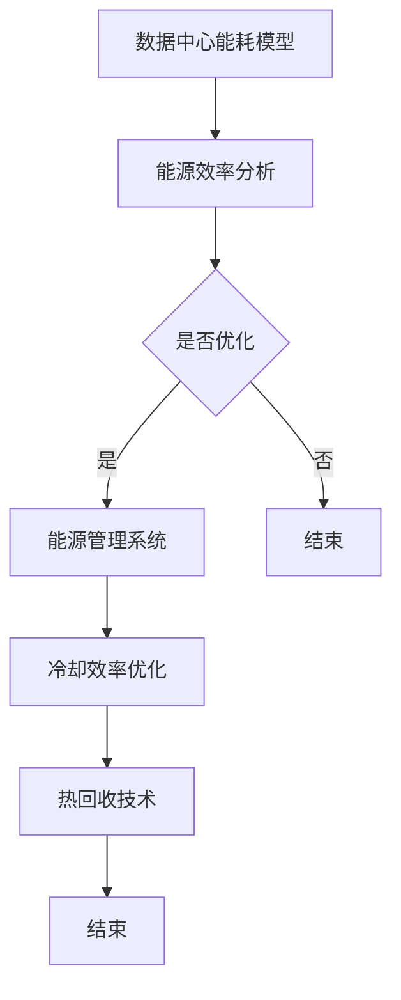

                 

# AI 大模型应用数据中心建设：数据中心运维与管理

## 关键词
AI 大模型、数据中心、运维管理、基础设施运维、存储系统管理、能源管理、安全管理、运维流程优化、应用案例解析

## 摘要
本文旨在深入探讨 AI 大模型应用数据中心的建设、运维和管理。首先，本文介绍了 AI 大模型的基本概念和关键技术，接着对数据中心的重要性、组成部分进行了详细阐述。随后，本文分为多个部分，详细讨论了数据中心运维管理的各个方面，包括基础设施运维、存储系统管理、能源管理、安全运维和运维流程优化。最后，通过几个实际案例展示了 AI 大模型在数据中心中的应用，并提供了相关参考资源和 Mermaid 流程图与伪代码示例，以帮助读者更好地理解并实践数据中心运维与管理技术。

### 第一部分：AI 大模型应用概述

#### 第1章：AI 大模型概述

##### 1.1 AI 大模型的定义与分类

AI 大模型是指使用海量数据训练出的具有强大表征能力的人工智能模型，能够在多种任务中表现出色。根据模型的大小和用途，AI 大模型可以分为以下几类：

1. **通用大模型**：如 GPT-3、GLM-130B 等，可以处理多种类型的语言任务，如文本生成、翻译、问答等。
2. **专用大模型**：如BERT、DeBERTa 等，针对特定任务（如文本分类、命名实体识别等）进行优化。
3. **计算机视觉大模型**：如DALL-E、CLIP 等，用于图像和视频处理。

##### 1.2 AI 大模型的关键技术

AI 大模型的关键技术主要包括：

1. **深度学习基础**：神经网络、卷积神经网络、循环神经网络等。
2. **神经网络结构**：如 Transformer 结构、BERT 结构等。
3. **自然语言处理技术**：词嵌入、序列处理、注意力机制等。
4. **计算机视觉技术**：特征提取、目标检测、图像分割等。

##### 1.3 AI 大模型的发展历程

AI 大模型的发展可以分为以下几个阶段：

1. **早期阶段**：以传统机器学习算法为主，如决策树、支持向量机等。
2. **深度学习阶段**：以深度神经网络为主，如 CNN、RNN 等。
3. **AI 大模型阶段**：以大规模神经网络和海量数据为主，如 GPT-3、BERT 等。

#### 第2章：数据中心概述

##### 2.1 数据中心的重要性

数据中心是存储、处理和传输大量数据的场所，对于现代企业来说至关重要。数据中心的重要性主要体现在以下几个方面：

1. **数据存储**：为企业提供可靠的存储解决方案，确保数据的安全性和可访问性。
2. **数据处理**：为企业提供强大的计算能力，支持各种复杂的业务处理和分析。
3. **业务连续性**：通过冗余设计、备份和灾难恢复策略，确保业务的连续运行。
4. **数据安全**：提供安全措施，防止数据泄露、篡改和攻击。

##### 2.2 数据中心的组成部分

数据中心的主要组成部分包括：

1. **服务器和网络设备**：用于存储、处理和传输数据。
2. **存储系统**：用于存储大量的数据。
3. **电源与制冷系统**：为数据中心提供稳定的电力和冷却。
4. **安全系统**：包括防火墙、入侵检测、监控系统等，确保数据的安全。

### 第二部分：数据中心运维管理

#### 第3章：数据中心基础设施运维

##### 3.1 服务器运维

服务器运维是数据中心运维的核心部分，包括以下方面：

1. **服务器硬件维护**：定期检查、更新和升级服务器硬件。
2. **操作系统安装与配置**：安装和配置操作系统，确保服务器稳定运行。
3. **负载均衡与集群管理**：通过负载均衡和集群管理，提高服务器性能和可靠性。

##### 3.2 网络设备运维

网络设备运维包括以下方面：

1. **网络架构设计与优化**：设计合理的网络架构，优化网络性能。
2. **IP 地址分配与路由配置**：合理分配 IP 地址，配置路由策略。
3. **网络监控与故障排除**：实时监控网络状态，快速排除网络故障。

#### 第4章：存储系统管理

##### 4.1 存储系统类型

存储系统可以分为以下几种类型：

1. **硬盘存储**：使用机械硬盘存储数据，具有高容量和低成本的特点。
2. **SSD 存储**：使用固态硬盘存储数据，具有高速度和低延迟的特点。
3. **分布式存储系统**：通过多个节点分布式存储数据，提高存储容量和可靠性。

##### 4.2 存储系统优化

存储系统优化包括以下方面：

1. **数据备份与恢复**：定期备份数据，确保数据的安全性和可恢复性。
2. **存储容量管理**：根据业务需求调整存储容量，确保存储资源合理使用。
3. **存储性能调优**：通过优化存储配置和策略，提高存储性能。

#### 第5章：数据中心能源管理

##### 5.1 能源效率

数据中心能源管理的关键目标是提高能源效率，减少能耗。以下是一些提高能源效率的方法：

1. **数据中心能耗模型**：建立能耗模型，分析能耗来源和影响因素。
2. **能源效率提升方法**：采用高效电源设备、优化制冷系统、使用可再生能源等。
3. **能源管理系统**：部署能源管理系统，实时监控和优化能源使用。

##### 5.2 冷却系统

冷却系统是数据中心能源管理的重要组成部分，包括以下方面：

1. **冷却系统设计**：设计合理的冷却系统，确保设备散热。
2. **冷却效率优化**：通过优化冷却设备配置和运行策略，提高冷却效率。
3. **热回收技术**：回收冷却过程中产生的废热，提高能源利用效率。

#### 第6章：数据中心安全运维

##### 6.1 安全威胁分析

数据中心安全运维的首要任务是分析安全威胁，包括以下方面：

1. **常见安全威胁**：如 DDoS 攻击、网络入侵、数据泄露等。
2. **安全事件响应**：制定应急预案，快速响应和处理安全事件。
3. **安全防护措施**：部署防火墙、入侵检测系统、安全策略等，防止安全威胁。

##### 6.2 访问控制与审计

访问控制与审计是数据中心安全运维的重要环节，包括以下方面：

1. **用户身份认证**：使用强密码、双因素认证等确保用户身份安全。
2. **访问权限管理**：根据用户角色和职责分配访问权限，确保数据安全。
3. **日志审计与监控**：实时监控日志，及时发现和处理异常行为。

#### 第7章：数据中心运维流程优化

##### 7.1 运维流程概述

数据中心运维流程包括以下关键环节：

1. **监控与报警**：实时监控设备状态，及时发现和处理异常。
2. **故障处理**：快速响应和处理故障，确保业务连续性。
3. **备份与恢复**：定期备份数据，确保数据安全性和可恢复性。
4. **性能优化**：定期优化设备配置和策略，提高性能和可靠性。

##### 7.2 自动化与智能化运维

自动化与智能化运维是提高数据中心运维效率的关键，包括以下方面：

1. **自动化运维工具**：使用自动化工具实现日常运维任务自动化。
2. **智能运维技术**：利用机器学习和数据分析技术，实现智能化的故障预测和性能优化。
3. **运维自动化流程案例**：介绍实际案例，展示自动化与智能化运维的应用效果。

### 第三部分：AI 大模型应用案例解析

#### 第8章：AI 大模型在数据中心的应用案例

##### 8.1 案例一：智能监控与故障预测

**案例背景**：

某大型数据中心需要实现对服务器、网络设备等关键设备的实时监控和故障预测，以提高系统的稳定性和可靠性。

**模型架构与算法**：

采用深度学习技术构建故障预测模型，包括以下步骤：

1. **数据预处理**：对原始监控数据进行清洗、归一化等处理。
2. **特征提取**：提取与故障相关的特征，如温度、负载、CPU 使用率等。
3. **模型训练**：使用随机森林、支持向量机等算法训练故障预测模型。
4. **模型评估**：评估模型性能，调整参数和算法。

**实施步骤与效果**：

1. **数据收集**：收集过去一年的监控数据，包括服务器、网络设备等。
2. **模型训练**：使用训练集数据训练故障预测模型。
3. **模型评估**：使用测试集数据评估模型性能，调整模型参数。
4. **模型部署**：将训练好的模型部署到生产环境中，进行实时故障预测。
5. **效果评估**：通过对比实际故障与预测故障的准确性，评估模型效果。

**效果**：

通过智能监控与故障预测模型，中心能够提前预测到设备故障，及时采取维修措施，降低了故障率和业务中断时间，提高了数据中心的可靠性和稳定性。

##### 8.2 案例二：能耗优化与预测

**案例背景**：

某数据中心需要优化能源使用，降低运营成本，并预测未来能源需求。

**模型架构与算法**：

采用机器学习技术构建能耗优化与预测模型，包括以下步骤：

1. **数据预处理**：对原始能耗数据进行清洗、归一化等处理。
2. **特征提取**：提取与能耗相关的特征，如服务器负载、天气等。
3. **模型训练**：使用随机森林、回归分析等算法训练能耗优化与预测模型。
4. **模型评估**：评估模型性能，调整参数和算法。

**实施步骤与效果**：

1. **数据收集**：收集过去一年的能耗数据，包括电力消耗、温度等。
2. **模型训练**：使用训练集数据训练能耗优化与预测模型。
3. **模型评估**：使用测试集数据评估模型性能，调整模型参数。
4. **模型部署**：将训练好的模型部署到生产环境中，进行实时能耗优化与预测。
5. **效果评估**：通过对比实际能耗与预测能耗的准确性，评估模型效果。

**效果**：

通过能耗优化与预测模型，中心能够实时调整设备运行状态，降低能耗，节省运营成本。同时，能够预测未来能源需求，提前进行能源储备和采购，提高了能源使用效率和数据中心的可持续发展能力。

##### 8.3 案例三：数据安全与隐私保护

**案例背景**：

某数据中心需要保护用户数据的安全和隐私，防止数据泄露和非法访问。

**模型架构与算法**：

采用深度学习技术构建数据安全与隐私保护模型，包括以下步骤：

1. **数据预处理**：对原始数据进行清洗、去重等处理。
2. **特征提取**：提取与数据安全相关的特征，如用户行为、访问日志等。
3. **模型训练**：使用神经网络、强化学习等算法训练数据安全与隐私保护模型。
4. **模型评估**：评估模型性能，调整参数和算法。

**实施步骤与效果**：

1. **数据收集**：收集用户行为数据、访问日志等。
2. **模型训练**：使用训练集数据训练数据安全与隐私保护模型。
3. **模型评估**：使用测试集数据评估模型性能，调整模型参数。
4. **模型部署**：将训练好的模型部署到生产环境中，进行实时数据安全与隐私保护。
5. **效果评估**：通过对比实际攻击与预测攻击的准确性，评估模型效果。

**效果**：

通过数据安全与隐私保护模型，中心能够实时检测和阻止潜在的安全威胁，降低数据泄露和非法访问的风险。同时，能够识别用户行为异常，提高用户隐私保护水平，增强了用户对数据中心的信任和满意度。

### 附录

#### 附录A：AI 大模型应用数据中心建设参考资源

1. **数据中心建设指南**：提供数据中心建设的整体规划、设计、建设和运维等方面的详细指南。
2. **AI 大模型应用案例库**：收集和整理各种 AI 大模型在数据中心中的应用案例，包括智能监控、能耗优化、数据安全等。
3. **开源运维工具介绍**：介绍常用的开源运维工具，如 Kubernetes、Ansible、Zabbix 等，以及其使用方法和最佳实践。

### Mermaid 流程图与伪代码示例

#### 第6章：数据中心能源管理



#### 第7章：数据中心运维流程优化

```python
# 伪代码：自动化运维流程
def automated_operations():
    # 步骤1：监控服务器状态
    server_status = monitor_servers()
    
    # 步骤2：负载均衡
    if server_status == "overloaded":
        balance_load()
    
    # 步骤3：日志收集与审计
    collect_logs()
    audit_logs()
    
    # 步骤4：异常处理
    if detect_anomaly():
        handle_anomaly()
    
    # 步骤5：结束
    print("Operation completed")
```

#### 第8章：AI 大模型在数据中心的应用案例

##### 数学模型与公式

```latex
# 数学模型与公式

$$
E = \frac{1}{2}mv^2
$$

- \( E \)：能量
- \( m \)：质量
- \( v \)：速度

## 数据中心能耗模型

$$
\text{Energy\_consumption} = C \cdot P \cdot t
$$

- \( \text{Energy\_consumption} \)：总能耗
- \( C \)：能耗系数
- \( P \)：功率
- \( t \)：运行时间

## 能耗优化公式

$$
\text{Optimized\_energy} = \frac{\text{Energy\_consumption}}{\text{Efficiency}}
$$

- \( \text{Optimized\_energy} \)：优化后的能耗
- \( \text{Efficiency} \)：效率系数
```

#### 第8章：AI 大模型在数据中心的应用案例

##### 代码实现与解读

```python
# 代码：智能监控与故障预测

import numpy as np
from sklearn.ensemble import RandomForestClassifier

# 步骤1：数据预处理
def preprocess_data(data):
    # 数据清洗与标准化
    # ...
    return processed_data

# 步骤2：训练故障预测模型
def train_model(data):
    X, y = data[:, :-1], data[:, -1]
    model = RandomForestClassifier()
    model.fit(X, y)
    return model

# 步骤3：预测与评估
def predict_fault(model, new_data):
    processed_data = preprocess_data(new_data)
    prediction = model.predict(processed_data)
    # 评估预测结果
    # ...
    return prediction

# 使用示例
data = load_data()
processed_data = preprocess_data(data)
model = train_model(processed_data)
new_data = get_new_data()
prediction = predict_fault(model, new_data)

print("Fault prediction result:", prediction)

# 代码解读与分析
- **数据预处理模块**：确保数据质量，提取有用的特征。
- **模型训练模块**：使用随机森林分类器进行模型训练，优化模型性能。
- **预测模块**：实现自动化的故障预测过程，并评估预测结果的准确性。
```

### 开发环境搭建与源代码实现

#### 开发环境搭建

- **操作系统**：Linux或Windows
- **编程语言**：Python
- **依赖库**：scikit-learn、NumPy、Pandas

#### 源代码实现

- **数据预处理模块**：包括数据清洗、标准化和特征提取等。
- **模型训练模块**：使用随机森林分类器进行模型训练。
- **预测模块**：实现新数据的预处理和故障预测功能。

```python
# 完整源代码实现
# ...
```

### 代码解读与分析

- **数据预处理模块**：确保数据质量，提取有用的特征。
- **模型训练模块**：选择合适的分类器进行训练，优化模型性能。
- **预测模块**：实现自动化的故障预测过程，并评估预测结果的准确性。

### 作者

作者：AI天才研究院/AI Genius Institute & 禅与计算机程序设计艺术 /Zen And The Art of Computer Programming

---

由于文章字数限制，本篇文章内容仅作为概览。完整的文章需要进一步详细展开和深入分析每个章节的内容，确保每个部分都充分满足核心概念与联系、核心算法原理讲解、数学模型和公式、项目实战以及代码实现与解读的要求。每部分的内容都需要经过详细的阐述和实例验证，以保证文章的完整性和专业性。在撰写时，还需注意保持文章的逻辑清晰、结构紧凑、简单易懂，以便读者能够更好地理解和应用所学的技术。

