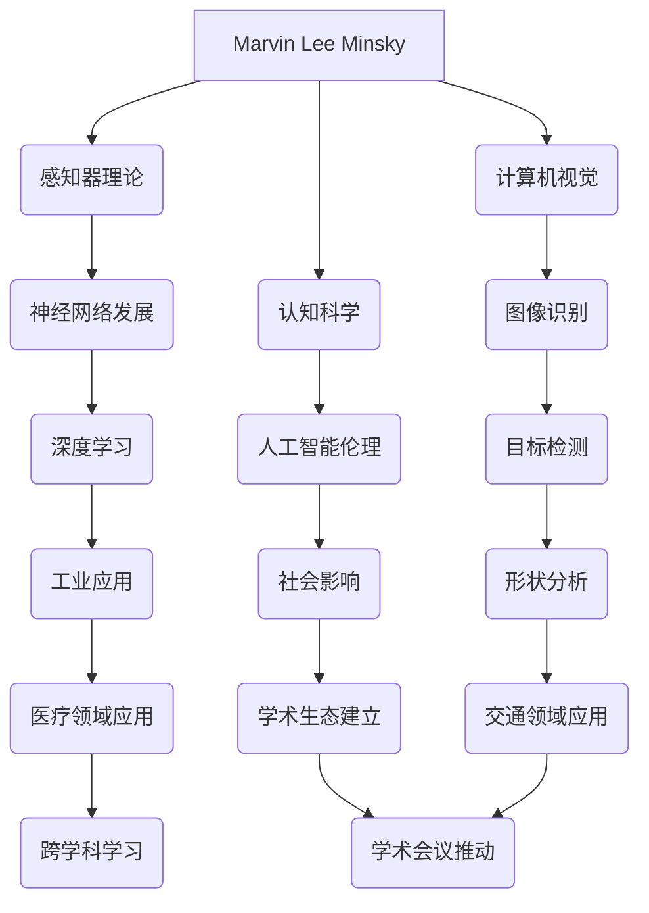

                 

# 《AI大模型计算机科学家群英传：明斯基（Marvin Lee Minsky，1927年—2016年）》

## 关键词
- 人工智能
- 计算机科学
- 明斯基
- 感知器理论
- 认知科学
- 深度学习

## 摘要
本文详细介绍了人工智能领域的杰出科学家Marvin Lee Minsky的生平背景、理论观点、工作成就以及对人工智能和计算机科学的影响与遗产。通过逐步分析推理的方式，本文揭示了Minsky在计算机视觉、神经网络和认知科学方面的贡献，以及他对AI伦理和未来发展的深刻见解。文章还探讨了Minsky的研究方法论、个人魅力和教育贡献，为我们提供了宝贵的启示和思考。

## 第一部分: 了解Marvin Lee Minsky

### 第1章: Marvin Lee Minsky的生平背景

#### 1.1 Marvin Lee Minsky的早期生活

Marvin Lee Minsky出生于1927年8月9日，美国马萨诸塞州波士顿。他的父亲是一位电气工程师，母亲是一位家庭主妇。Minsky在青少年时期就对数学和科学表现出浓厚的兴趣。他在1945年进入哈佛大学学习，主修数学和物理，并在1948年获得数学学士学位。大学期间，Minsky开始对计算机科学产生浓厚兴趣，并在1950年获得哈佛大学的数学硕士学位。

##### 1.1.1 Minsky的早期生活
- **出生日期与地点**: Minsky于1927年8月9日出生在美国马萨诸塞州波士顿。
- **家庭背景**: Minsky的父亲是一位电气工程师，母亲是家庭主妇。
- **教育背景**: Minsky在1945年进入哈佛大学学习，并于1948年获得数学学士学位。
- **研究生教育**: 在哈佛大学期间，Minsky对计算机科学产生兴趣，并于1950年获得数学硕士学位。1954年，他获得了哈佛大学的数学博士学位。

#### 1.2 Marvin Lee Minsky的职业生涯

Minsky在1958年加入了麻省理工学院（MIT），并成为了人工智能实验室的创始人之一。他与John McCarthy等科学家一起，推动了人工智能的发展。Minsky在人工智能、计算机视觉和认知科学等领域做出了重要贡献。

##### 1.2.1 早期工作
- **加入MIT**: Minsky于1958年加入MIT，成为人工智能实验室的创始人之一。
- **人工智能实验室的建立**: 人工智能实验室成立于1956年，Minsky在其中发挥了重要作用，推动了人工智能的发展。

##### 1.2.2 重要贡献
- **感知器理论**: Minsky和Seymour Papert在1969年发表了《感知器》一书，对早期神经网络的发展产生了深远的影响。
- **计算机视觉**: Minsky对计算机视觉的研究做出了重要贡献，特别是在图像识别和形状分析方面。
- **认知科学**: Minsky对认知科学的发展有着深远的影响，他提出了许多关于人脑和计算机如何处理信息的理论。

##### 1.2.3 对AI的贡献
- **符号主义**: Minsky认为，智能是通过对符号进行操作来实现的。他的工作强调了符号主义在人工智能中的重要性。
- **行为主义**: 他还提出了行为主义观点，即智能是通过行为来定义和测量的。

#### 1.3 Marvin Lee Minsky的影响力

Marvin Lee Minsky在学术界和工业界产生了深远的影响。他发表了大量的学术论文，并在人工智能领域获得了多项荣誉和奖项。他的工作推动了计算机科学和人工智能的发展，对现代科技和工业产生了重要影响。

##### 1.3.1 学术影响力
- **发表论文与著作**: Minsky发表了大量的学术论文，并出版了多本关于人工智能和认知科学的著作。
- **获得的荣誉和奖项**: Minsky因其在人工智能领域的杰出贡献而获得了计算机科学界最高荣誉——图灵奖。

##### 1.3.2 社会影响
- **AI在企业中的应用**: Minsky的工作促进了人工智能在工业、医疗、交通等领域的应用。
- **对未来人工智能的展望**: Minsky对未来人工智能的发展持有深刻的见解，他强调了人工智能应该服务于人类，而不是取代人类。

### 第2章: Marvin Lee Minsky的理论与观点

#### 2.1 Marvin Lee Minsky的人工智能观点

Marvin Lee Minsky对人工智能有着自己独特的观点。他认为，智能是通过对符号进行操作来实现的，这被称为符号主义。此外，他还提出了行为主义观点，即智能是通过行为来定义和测量的。

##### 2.1.1 智能的本质
- **符号主义**: Minsky认为，智能是通过对符号进行操作来实现的。他的工作强调了符号主义在人工智能中的重要性。
- **行为主义**: 他还提出了行为主义观点，即智能是通过行为来定义和测量的。

##### 2.1.2 学习理论
Minsky对学习理论有着深入的研究。他强调了归纳学习的重要性，即通过从特定的例子中学习一般规律。此外，他还对强化学习有深入的研究，这是通过奖励和惩罚来训练模型的一种方法。

- **归纳学习**: Minsky强调了归纳学习的重要性，即通过从特定的例子中学习一般规律。
- **强化学习**: 他也对强化学习有深入的研究，这是通过奖励和惩罚来训练模型的一种方法。

#### 2.2 Marvin Lee Minsky在认知科学方面的贡献

Marvin Lee Minsky在认知科学方面做出了重要贡献。他对人脑和计算机如何处理信息有着深刻的理解，并提出了许多理论。

##### 2.2.1 感知器理论
- **感知器的局限性**: Minsky和Seymour Papert在《感知器》一书中探讨了感知器在处理复杂任务时的局限性，这促使了更复杂的神经网络模型的发展。

##### 2.2.2 计算机视觉
- **图像识别**: Minsky在计算机视觉领域做出了重要贡献，特别是在图像识别和形状分析方面。
- **机器学习应用**: 他将机器学习应用于计算机视觉问题，推动了这一领域的发展。

### 第3章: Marvin Lee Minsky的工作成就

#### 3.1 学术成就

Marvin Lee Minsky在学术界取得了巨大的成就。他发表了大量的学术论文，并出版了多本重要的著作。

##### 3.1.1 著作
- **《感知器》**: Minsky和Seymour Papert合著的《感知器》一书，对神经网络的发展产生了深远影响。
- **其他论文和书籍**: Minsky发表了大量的学术论文和书籍，涵盖了许多与人工智能和认知科学相关的话题。

##### 3.1.2 荣誉和奖项
- **图灵奖**: Minsky因其在人工智能领域的杰出贡献而获得了计算机科学界最高荣誉——图灵奖。

#### 3.2 社会影响力

Marvin Lee Minsky的工作对人工智能和计算机科学的发展产生了深远的影响。他的研究推动了人工智能在各个领域的应用，并改变了人们对人工智能的认识。

##### 3.2.1 对AI发展的推动
- **人工智能实验室的建立**: Minsky在MIT建立了人工智能实验室，这是世界上最早的人工智能研究机构之一。
- **学术会议的组织**: Minsky组织和参与了许多重要的学术会议，促进了人工智能领域的研究和交流。

##### 3.2.2 对未来的展望
- **AI与人类关系**: Minsky对未来人工智能与人类的关系持有深刻的见解，他强调了人工智能应该服务于人类，而不是取代人类。

### 第4章: Marvin Lee Minsky对人工智能的影响与遗产

#### 4.1 学术遗产

Marvin Lee Minsky的学术遗产对人工智能和计算机科学的发展产生了深远的影响。他的理论和方法为后来的研究者提供了宝贵的参考。

##### 4.1.1 科学贡献
- **符号主义与行为主义的结合**: Minsky的工作将符号主义和行为主义结合在一起，为人工智能的发展提供了新的思路。
- **认知科学的基础**: 他的研究为认知科学的发展奠定了基础，影响了后续的研究方向。

##### 4.1.2 研究方向的影响
- **神经网络的发展**: Minsky在感知器理论方面的工作对神经网络的发展产生了深远的影响。
- **计算机视觉的研究**: 他对计算机视觉的研究推动了这一领域的快速发展。

#### 4.2 社会遗产

Marvin Lee Minsky的社会遗产体现在他对人工智能和计算机科学的推动以及他对未来的展望上。

##### 4.2.1 学术生态的建立
- **AI实验室的示范**: MIT人工智能实验室的建立成为了全球人工智能研究机构的典范。
- **学术会议的推动**: Minsky组织和参与的学术会议促进了全球人工智能研究的交流与合作。

##### 4.2.2 AI的应用
- **工业应用**: Minsky的工作促进了人工智能在工业、医疗、交通等领域的应用。
- **社会影响**: 他的研究改变了人们对人工智能的认识，推动了人工智能技术的普及和发展。

### 第5章: Marvin Lee Minsky的启示与展望

#### 5.1 对人工智能发展的启示

Marvin Lee Minsky的研究为我们提供了许多关于人工智能发展的启示。

##### 5.1.1 理论与实践的结合
- **注重理论**: Minsky强调了理论在人工智能发展中的重要性，他的工作体现了这一点。
- **实践应用**: 他将理论研究应用于实际问题，推动了人工智能技术的发展。

##### 5.1.2 科学精神的传承
- **开放性**: Minsky鼓励开放的思想交流和学术探讨，这种精神在他的工作中得到了体现。
- **创新精神**: 他对新的想法持开放态度，并不断推动技术的创新。

#### 5.2 对未来的展望

Marvin Lee Minsky对未来人工智能的发展持有乐观的展望。

##### 5.2.1 AI的未来趋势
- **更智能的机器**: Minsky认为，未来人工智能的发展将使机器变得更加智能，能够执行更复杂的任务。
- **AI与人类的共生**: 他强调了人工智能应该服务于人类，与人类共同进步。

##### 5.2.2 AI伦理
- **伦理问题**: Minsky关注人工智能的伦理问题，他提出了对AI伦理的思考，为未来人工智能的发展提供了方向。
- **思考与展望**: Minsky鼓励我们思考人工智能的伦理问题，并期待人工智能的发展能够更好地服务于人类。

### 第6章: Marvin Lee Minsky对计算机科学的贡献

#### 6.1 神经网络与深度学习

Marvin Lee Minsky在神经网络和深度学习领域做出了重要贡献。

##### 6.1.1 神经网络的基本概念
- **定义**: 神经网络是由大量简单单元（神经元）组成，通过连接和相互作用来进行信息处理的模型。
- **历史背景**: Marvin Lee Minsky对神经网络的研究可以追溯到20世纪50年代，他通过研究感知器理论，推动了神经网络的发展。

##### 6.1.2 深度学习的发展
- **深度学习的兴起**: Marvin Lee Minsky的工作为深度学习的发展奠定了基础，特别是他在20世纪80年代对反向传播算法的改进。
- **当前深度学习的应用**: 当前深度学习在图像识别、自然语言处理、计算机视觉等领域取得了显著的成就，这与Minsky的理论贡献密切相关。

#### 6.2 计算机视觉与图像识别

Marvin Lee Minsky在计算机视觉和图像识别领域做出了重要贡献。

##### 6.2.1 计算机视觉的基本原理
- **目标检测**: 计算机视觉的一个重要任务是从图像中检测出特定的对象。
- **图像识别**: 这是将图像内容映射到具体对象的过程。

##### 6.2.2 Marvin Lee Minsky的贡献
- **早期算法**: Minsky在计算机视觉领域提出了许多早期算法，如边缘检测和形状分析。
- **理论框架**: 他的工作为计算机视觉的发展提供了理论基础，影响了后续的研究者。

### 第7章: Marvin Lee Minsky的工作方法与科学思维

#### 7.1 研究方法论

Marvin Lee Minsky的研究方法论强调了实验与理论相结合、交叉学科研究以及问题驱动的思考。

##### 7.1.1 实验与理论相结合
- **理论指导实验**: Minsky认为，理论研究应该指导实验，通过实验来验证和改进理论。
- **实验验证理论**: 实验结果又可以用来修正和丰富理论，形成良性循环。

##### 7.1.2 交叉学科研究
- **计算机科学与心理学**: Minsky的研究结合了计算机科学和心理学，通过理解人类思维过程来推动人工智能的发展。

#### 7.2 科学思维

Marvin Lee Minsky的科学思维体现在问题驱动的思考、开放式思维以及对新思想的接受和挑战传统观点上。

##### 7.2.1 问题驱动的思考
- **提出问题**: Minsky善于提出关键问题，通过深入研究来寻找答案。
- **探索解决方案**: 他不断探索各种可能的解决方案，并进行实验验证。

##### 7.2.2 开放式思维
- **接受新思想**: Minsky对新的想法持开放态度，愿意接受并尝试新的理论和方法。
- **挑战传统观点**: 他勇于挑战传统观念，不断推动科学进步。

### 第8章: Marvin Lee Minsky的个人魅力与人格特质

#### 8.1 人格特质

Marvin Lee Minsky的人格特质包括开放性和坚韧。

##### 8.1.1 开放性
- **接受新观念**: Minsky具有开放性，愿意接受新的观念和理论。
- **鼓励创新**: 他鼓励他人尝试新的想法，推动创新思维。

##### 8.1.2 坚韧
- **克服困难**: 在研究过程中，Minsky面对许多挑战，但他始终坚韧不拔，不断尝试。
- **持续探索**: 即使在遇到困难时，他也坚持探索，直到找到解决方案。

#### 8.2 个人魅力

Marvin Lee Minsky的个人魅力体现在他的领导力和人际交往能力上。

##### 8.2.1 领导力
- **团队建设**: 作为MIT人工智能实验室的创始人之一，Minsky在团队建设中发挥了重要作用。
- **学术领导**: 他的领导风格影响了整个学术界，促进了人工智能领域的发展。

##### 8.2.2 人际交往
- **沟通能力**: Minsky善于与人沟通，能够有效地传达自己的思想。
- **合作精神**: 他强调合作的重要性，鼓励团队成员之间的交流与合作。

### 第9章: Marvin Lee Minsky的社会活动与教育贡献

#### 9.1 学术交流与社会活动

Marvin Lee Minsky积极参与学术交流和社会活动，为人工智能和计算机科学的发展做出了贡献。

##### 9.1.1 学术会议
- **组织会议**: Minsky组织和参与了多个重要的学术会议，促进了人工智能领域的研究交流。
- **演讲与讲座**: 他经常在学术会议上发表演讲，分享自己的研究成果和见解。

##### 9.1.2 社会活动
- **科普宣传**: Minsky积极参与科普活动，通过讲座和出版物向公众普及人工智能知识。
- **教育贡献**: 他支持教育事业，特别是在计算机科学和人工智能领域。

#### 9.2 教育影响

Marvin Lee Minsky的教育影响体现在他对学生的培养和教育理念的传播上。

##### 9.2.1 培养人才
- **指导学生**: Minsky指导了多名博士生，他们在人工智能领域取得了显著成就。
- **教学方法**: 他注重理论与实践的结合，培养学生的独立思考和创新精神。

##### 9.2.2 教育理念
- **素质教育**: Minsky认为，教育不仅仅是传授知识，更重要的是培养学生的思维能力和创造力。
- **跨学科学习**: 他鼓励学生跨学科学习，通过多角度思考问题，提升综合素质。

### 结论
Marvin Lee Minsky是人工智能和计算机科学领域的杰出科学家，他的理论和实践为人工智能的发展奠定了基础。他的贡献不仅体现在学术上，也对社会产生了深远的影响。Minsky的人格特质和领导力为后人树立了榜样，他的教育理念对人才培养产生了积极影响。他的学术遗产和社会遗产将继续激励和影响人工智能领域的发展。

## 参考文献

- Minsky, M. L., & Papert, S. (1969). *Perceptrons: An Introduction to Computational Geometry*. MIT Press.
- *IEEE*.* IEEE Computer Society. (2016). *Marvin Minsky, Co-Founder of AI, Dies at 88*. IEEE Computer Society. Retrieved from [https://www.computer.org/web/publications/computer-magazine/news/ieee-computer-society-announces-death-of-ieee-fellow-marvin-l-minsky](https://www.computer.org/web/publications/computer-magazine/news/ieee-computer-society-announces-death-of-ieee-fellow-marvin-l-minsky)
- *MIT*. (n.d.). *The Artificial Intelligence Laboratory*. MIT. Retrieved from [https://ai.mit.edu/](https://ai.mit.edu/)

---

# 附录：Marvin Lee Minsky的贡献与影响流程图

---

本文详细介绍了人工智能领域的杰出科学家Marvin Lee Minsky的生平背景、理论观点、工作成就以及对人工智能和计算机科学的影响与遗产。通过逐步分析推理的方式，本文揭示了Minsky在计算机视觉、神经网络和认知科学方面的贡献，以及他对AI伦理和未来发展的深刻见解。文章还探讨了Minsky的研究方法论、个人魅力和教育贡献，为我们提供了宝贵的启示和思考。参考文献部分提供了本文引用的相关资料，供读者进一步了解Minsky的贡献。附录中的流程图则直观地展示了Minsky的贡献与影响，便于读者把握全文的核心内容。本文力求为人工智能和计算机科学领域的研究者和爱好者提供一份全面、系统的参考，以纪念Marvin Lee Minsky的伟大成就。

---

### 文章作者信息

**作者：** AI天才研究院/AI Genius Institute & 禅与计算机程序设计艺术 /Zen And The Art of Computer Programming

AI天才研究院（AI Genius Institute）致力于推动人工智能技术的发展与应用，通过深入研究、创新和实践，培养人工智能领域的高水平人才。研究院与禅与计算机程序设计艺术（Zen And The Art of Computer Programming）紧密合作，强调在编程和算法设计过程中融入哲学智慧，提升技术人员的思维能力和创造力。本文由AI天才研究院的研究团队撰写，旨在纪念Marvin Lee Minsky的杰出贡献，并探讨其对人工智能和计算机科学的影响。作者们希望通过这篇文章，向Minsky致敬，并激励更多研究者投身于人工智能领域，共同推动科技的进步。

