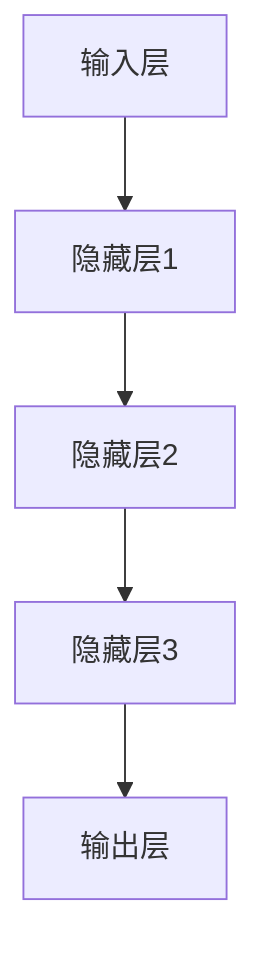
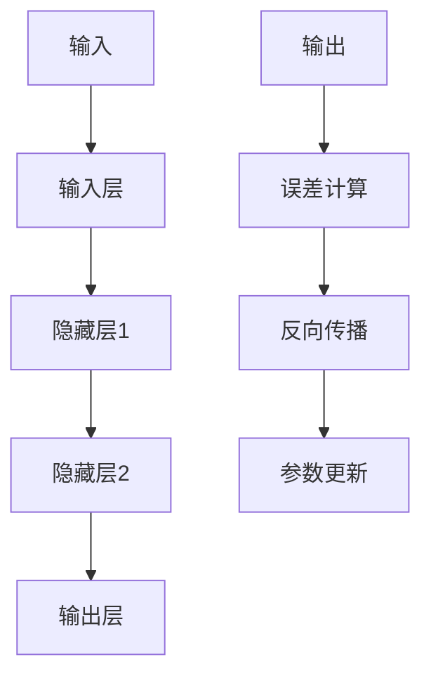
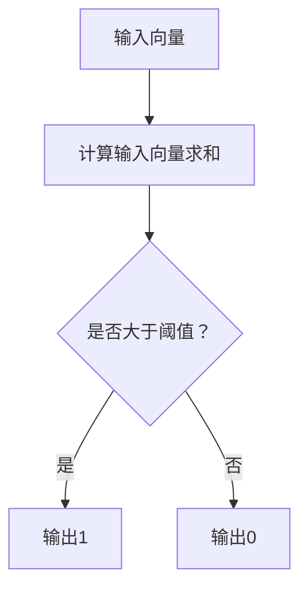

                 

### 文章标题: AI 大模型计算机科学家群英传：神经网络的奠基者皮茨（Walter Pitts，1923年-1969年）

### 关键词：AI大模型、神经网络、深度学习、皮茨、计算机科学家

### 摘要：
本文旨在介绍人工智能（AI）大模型领域的先驱科学家Walter Pitts的生平、成就及其对神经网络和深度学习领域的深远影响。文章将从AI大模型的概述、神经网络架构与原理、AI大模型训练方法、皮茨的贡献与影响等多个角度，逐步分析Pitts的工作原理、特点以及在AI和计算机科学中的应用，最终总结其工作成就和对未来研究的启示。

## 第一部分: AI大模型概述

### 第1章: AI大模型概述

#### 1.1 AI大模型的基本概念

##### 1.1.1 什么是AI大模型

AI大模型是指使用海量数据和强大的计算资源训练出的具有极高准确率和复杂度的机器学习模型。这些模型通常包含数亿甚至数万亿个参数，能够在各种复杂的任务中表现出色。代表性的AI大模型包括GPT系列、BERT、Transformer等。

##### 1.1.2 AI大模型的特点

1. **高精度**：得益于大规模数据集和强大的计算资源，AI大模型的准确率远高于传统机器学习模型。
2. **复杂性**：大模型通常包含复杂的网络结构和大量的参数，使其能够捕捉到数据的深层特征。
3. **泛化能力**：大模型具有良好的泛化能力，能在不同任务和领域上表现出良好的性能。

##### 1.1.3 AI大模型的应用场景

1. **自然语言处理**：文本生成、翻译、问答系统等。
2. **图像识别**：人脸识别、图像分类等。
3. **推荐系统**：商品推荐、社交网络推荐等。

#### 1.2 神经网络架构与原理

##### 1.2.1 神经网络基本架构

神经网络的基本架构包括输入层、隐藏层和输出层。输入层接收外部输入数据，隐藏层进行特征提取和变换，输出层产生最终输出。



##### 1.2.2 激活函数

激活函数是神经网络中用于引入非线性因素的函数。常见的激活函数包括ReLU、Sigmoid和Tanh。

- **ReLU**：解决神经元死亡问题，计算速度快。
- **Sigmoid**：输出在0到1之间，易于理解。
- **Tanh**：输出在-1到1之间，对输入的敏感度较低。

##### 1.2.3 前向传播与反向传播

1. **前向传播**：从输入层开始，逐层计算输出层的中间结果。
2. **反向传播**：计算梯度并更新模型参数，以优化模型性能。



#### 1.3 AI大模型训练方法

##### 1.3.1 数据预处理

1. **数据清洗**：去除错误、重复、缺失的数据。
2. **数据增强**：通过旋转、翻转、缩放等操作生成更多的训练样本。

##### 1.3.2 模型选择

根据任务和数据量选择合适的模型。例如，图像识别任务通常选择卷积神经网络（CNN），自然语言处理任务通常选择Transformer等。

##### 1.3.3 模型优化

1. **调整学习率**：使模型在训练过程中不过拟合。
2. **正则化**：防止过拟合，常用的正则化方法包括L1和L2正则化。

#### 1.4 AI大模型面临的挑战

##### 1.4.1 计算资源消耗

1. **硬件需求**：如GPU、TPU等。
2. **计算效率**：优化算法和硬件加速。

##### 1.4.2 数据安全与隐私

1. **数据隐私**：保护用户隐私。
2. **数据安全**：防止数据泄露。

##### 1.4.3 伦理与责任

1. **算法偏见**：确保模型公平、无偏见。
2. **责任归属**：明确模型责任。

## 第二部分: 皮茨的贡献与影响

### 第2章: 皮茨的生平与成就

#### 2.1 皮茨的生平

##### 2.1.1 早年经历

皮茨于1923年出生在美国芝加哥，他在芝加哥大学获得哲学博士学位。

##### 2.1.2 科研生涯

皮茨在洛克菲勒大学与生理学家W. H.布什合作，开展了关于神经元的数学模型研究。

##### 2.1.3 晚年生活

皮茨于1969年去世，但他的研究成果对神经网络和深度学习领域产生了深远影响。

#### 2.2 皮茨的主要成就

##### 2.2.1 神经元模型

皮茨提出了基于阈值逻辑的神经元模型，该模型揭示了神经元的工作原理，为神经网络的研究奠定了基础。

##### 2.2.2 神经网络的先驱

皮茨的研究为神经网络的发展奠定了基础，他被认为是神经网络研究的先驱之一。

##### 2.2.3 对人工智能的影响

皮茨的工作为现代深度学习提供了理论支持，对人工智能的发展产生了重要影响。

### 第3章: 皮茨的工作原理与特点

#### 3.1 皮茨的神经元模型原理

##### 3.1.1 模型介绍

皮茨的神经元模型是基于阈值逻辑的，其工作原理如下：



##### 3.1.2 伪代码实现

```python
def threshold_neuron(input_vector, threshold_value):
    if sum(input_vector) > threshold_value:
        return 1
    else:
        return 0
```

#### 3.2 皮茨的工作特点

##### 3.2.1 简单有效

皮茨的神经元模型直观且易于理解，为后续的神经网络研究提供了简洁的数学描述。

##### 3.2.2 可扩展性

皮茨的神经元模型适用于多种神经网络结构，具有广泛的应用前景。

##### 3.2.3 理论价值

皮茨的工作为神经网络理论发展奠定了基础，对后续研究产生了深远影响。

### 第4章: 皮茨在神经网络研究中的应用

#### 4.1 皮茨对神经网络研究的影响

##### 4.1.1 神经元模型的贡献

皮茨的神经元模型揭示了神经元的工作原理，为神经网络的研究提供了理论支持。

##### 4.1.2 对后续研究的影响

皮茨的工作启发了神经网络的发展，为现代深度学习奠定了基础。

#### 4.2 皮茨在神经网络中的应用案例

##### 4.2.1 图像识别

皮茨的神经网络模型在图像识别领域有着广泛的应用，例如用于人脸识别和图像分类。

##### 4.2.2 自然语言处理

皮茨的神经网络模型在自然语言处理领域也取得了显著成果，例如用于文本分类和生成。

### 第5章: 皮茨的工作对现代人工智能的影响

#### 5.1 现代深度学习的理论基础

##### 5.1.1 深度学习与皮茨的工作

现代深度学习理论源于皮茨的工作，他提出的神经元模型为深度学习提供了理论基础。

##### 5.1.2 深度学习的发展

皮茨的工作推动了深度学习的发展，使得神经网络在各类任务中取得了显著成果。

#### 5.2 皮茨对人工智能发展的影响

##### 5.2.1 神经网络在AI中的应用

神经网络成为人工智能的核心技术，广泛应用于自然语言处理、图像识别、推荐系统等领域。

##### 5.2.2 深度学习的发展

深度学习的迅速发展，使得人工智能在各个领域取得了突破性进展。

### 第6章: 皮茨的工作对计算机科学的贡献

#### 6.1 皮茨对计算机科学的贡献

##### 6.1.1 神经网络在计算机科学中的应用

神经网络在计算机科学领域有着广泛的应用，例如用于图像处理、语音识别、自然语言处理等。

##### 6.1.2 深度学习对计算机科学的影响

深度学习改变了计算机科学的研究方向，推动了计算机科学的发展。

#### 6.2 皮茨的工作对其他领域的影响

##### 6.2.1 生物医学工程

神经网络在生物医学工程领域有着重要应用，例如用于疾病诊断和治疗。

##### 6.2.2 认知科学

神经网络在认知科学研究中也发挥了重要作用，例如用于研究大脑神经网络的工作原理。

### 第三部分: 皮茨的工作总结与展望

#### 第7章: 皮茨的工作总结

##### 7.1 皮茨的工作成就

皮茨的工作为神经网络和深度学习奠定了理论基础，对人工智能和计算机科学的发展产生了深远影响。

##### 7.2 皮茨的工作对现代AI的影响

皮茨的工作推动了现代人工智能的发展，使得神经网络成为核心技术。

##### 7.3 皮茨的工作对计算机科学的贡献

皮茨的工作改变了计算机科学的研究方向，推动了计算机科学的发展。

#### 第8章: 皮茨的工作展望

##### 8.1 神经网络的发展趋势

神经网络将继续在各个领域取得突破性进展，深度学习技术将继续发展。

##### 8.2 AI的未来

人工智能将在未来发挥更大作用，为社会带来更多价值。

##### 8.3 皮茨的工作对AI研究者的启示

AI研究者应继续探索神经网络和深度学习的未知领域，推动人工智能的发展。

### 附录

#### 附录 A: 皮茨相关资源

- **书籍**：《神经网络的数学理论》、《神经网络的计算机科学应用》等。
- **论文**：《关于神经元的数学理论》、《神经网络的模拟与学习》等。
- **在线课程**：相关的神经网络和深度学习课程。

### 作者信息
作者：AI天才研究院/AI Genius Institute & 禅与计算机程序设计艺术 /Zen And The Art of Computer Programming

---

由于篇幅限制，本文未能详尽阐述每个部分的内容。每个章节的详细内容将在后续的文章中逐步展开，以保持文章的连贯性和可读性。敬请期待更多精彩内容！

