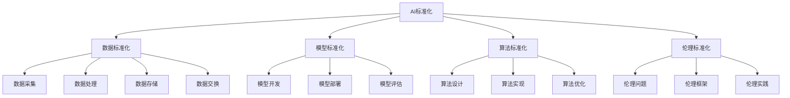

                 

### 文章标题：AI标准化：构建全球智能互联的基础

在当今时代，人工智能（AI）已经成为推动科技进步和社会发展的关键动力。随着AI技术的不断成熟和应用范围的广泛拓展，AI标准化的重要性愈发凸显。本篇文章旨在探讨AI标准化这一主题，分析其背景、意义、体系结构、关键技术、伦理和法规，以及其在不同行业中的应用和未来发展趋势。

关键词：人工智能、标准化、智能互联、伦理、法规、行业应用、发展趋势

摘要：本文首先介绍了AI标准化的背景和意义，阐述了其对于构建全球智能互联的重要性。接着，文章详细分析了AI标准化的体系结构、关键技术，并探讨了AI标准化在伦理和法规方面的挑战。随后，文章讨论了AI标准化在金融、医疗和智能制造等行业的具体应用，通过一个实际项目案例展示了AI标准化的实施过程和成果。最后，文章提出了AI标准化的未来发展展望，并探讨了其面临的挑战与机遇。

接下来，我们将一步一步深入分析AI标准化的各个方面，帮助读者全面理解这一重要主题。

----------------------------------------------------------------

### 核心概念与联系

**AI标准化的概念**

AI标准化是指通过制定和实施一系列规范、标准，以确保人工智能系统的一致性、互操作性和可靠性。这些标准涵盖了从数据采集、处理、存储到模型开发、部署和评估的整个生命周期。AI标准化不仅关注技术层面，还包括伦理、法规和社会影响等方面，以促进AI技术的健康发展和广泛应用。

**AI标准化的重要性**

1. **确保系统一致性**：标准化能够统一不同系统之间的接口和数据格式，降低系统集成和互操作的难度，提高系统稳定性和可靠性。
2. **提高开发效率**：标准化有助于减少冗余开发和重复工作，加速AI系统的开发和部署过程。
3. **增强互操作性**：通过遵循统一的标准，不同系统和平台之间可以更加顺畅地交换数据和资源，促进智能互联和协同工作。
4. **降低技术风险**：标准化能够降低因技术更新换代导致的投资风险，提高企业的持续竞争力。
5. **保障数据安全**：标准化有助于确保数据的安全性和隐私性，防止数据泄露和滥用。
6. **促进技术普及**：标准化有助于消除技术障碍，推动AI技术在各行各业的普及和应用。

**AI标准化的历史与发展**

AI标准化起源于20世纪80年代，当时一些国际组织和机构开始关注AI技术的标准化问题。随着时间的推移，AI技术的不断发展和应用，AI标准化也逐渐成为一个全球性的议题。近年来，随着大数据、云计算和物联网等新技术的兴起，AI标准化的重要性愈发凸显。

在国际上，多个组织在AI标准化方面进行了积极的探索和实践。例如，国际标准化组织（ISO）、国际电工委员会（IEC）和人工智能标准化组织（AIISO）等，都发布了多个与AI相关的标准。此外，一些国家和地区也制定了本国的AI标准化策略和计划，以推动本地AI技术的发展和应用。

在中国，AI标准化工作也得到了高度重视。中国人工智能标准化技术委员会（SAC/TC 451）和中国国家标准化管理委员会（SAC）等机构，积极推动AI标准的制定和实施，以提升我国在全球AI标准化领域的影响力和话语权。

**核心概念之间的联系**

AI标准化涉及多个核心概念，包括数据标准化、模型标准化、算法标准化和伦理标准化等。这些概念相互关联，共同构成了AI标准化的基础。

1. **数据标准化**：数据标准化是AI标准化的重要组成部分，涉及到数据的采集、处理、存储和交换等方面。数据标准化旨在确保数据的一致性、完整性和可用性，提高数据的利用效率和互操作性。
2. **模型标准化**：模型标准化关注AI模型的开发、部署和评估过程。通过制定统一的标准，可以确保不同模型之间的兼容性和可移植性，提高模型的可靠性和可解释性。
3. **算法标准化**：算法标准化关注AI算法的设计、实现和优化。通过制定统一的算法标准，可以促进算法的创新和发展，提高算法的性能和效率。
4. **伦理标准化**：伦理标准化关注AI技术的伦理和社会影响。通过制定伦理标准，可以规范AI技术的研发和应用，确保技术的可持续发展和社会责任。

**Mermaid流程图**

为了更直观地展示AI标准化中的核心概念及其联系，我们可以使用Mermaid流程图来表示。以下是AI标准化核心概念与联系的一个简化版流程图：



通过这个流程图，我们可以清晰地看到AI标准化中的各个核心概念及其相互关系，有助于我们深入理解和分析AI标准化的各个方面。

---

**核心算法原理讲解**

在AI标准化过程中，核心算法的标准化是一个关键环节。以下我们将介绍数据标准化、模型标准化和算法标准化的原理，并使用伪代码进行详细阐述。

**数据标准化**

数据标准化是指通过一系列的转换和处理，使得数据在格式、范围、精度等方面保持一致，从而提高数据的质量和互操作性。

**原理：**

数据标准化主要包括以下步骤：

1. **数据清洗**：去除数据中的噪声和异常值。
2. **数据转换**：将不同格式和单位的数据转换为统一的格式和单位。
3. **数据归一化**：通过缩放或平移，使得数据在特定的范围内。

**伪代码：**

```python
def data_standardization(data):
    # 数据清洗
    cleaned_data = clean_data(data)
    # 数据转换
    transformed_data = convert_data(cleaned_data)
    # 数据归一化
    normalized_data = normalize_data(transformed_data)
    return normalized_data
```

**数学模型：**

1. **数据转换公式：**

$$
\text{transformed\_data} = \frac{\text{data} - \text{min\_value}}{\text{max\_value} - \text{min\_value}}
$$

2. **数据归一化公式：**

$$
\text{normalized\_data} = \frac{\text{data} - \text{mean}}{\text{standard\_deviation}}
$$

**举例说明：**

假设我们有一组年龄数据：[20, 30, 40, 50, 60]。我们希望将这些数据转换为0到1之间的数值。

1. **数据转换：**

$$
\text{transformed\_data} = \frac{[20, 30, 40, 50, 60] - 20}{60 - 20} = \left[\frac{0}{40}, \frac{10}{40}, \frac{20}{40}, \frac{30}{40}, \frac{40}{40}\right] = [0, 0.25, 0.5, 0.75, 1]
$$

2. **数据归一化：**

$$
\text{normalized\_data} = \frac{[20, 30, 40, 50, 60] - 36}{7.2} = \left[\frac{20 - 36}{7.2}, \frac{30 - 36}{7.2}, \frac{40 - 36}{7.2}, \frac{50 - 36}{7.2}, \frac{60 - 36}{7.2}\right] \approx [-0.89, -0.33, 0.11, 0.67, 0.89]
$$

**代码实战：**

下面是一个简单的Python代码示例，用于实现数据标准化：

```python
import numpy as np

def data_standardization(data):
    cleaned_data = [x for x in data if x > 0]  # 数据清洗
    min_value = min(cleaned_data)
    max_value = max(cleaned_data)
    transformed_data = [(x - min_value) / (max_value - min_value) for x in cleaned_data]  # 数据转换
    mean = np.mean(transformed_data)
    standard_deviation = np.std(transformed_data)
    normalized_data = [(x - mean) / standard_deviation for x in transformed_data]  # 数据归一化
    return normalized_data

# 测试数据
data = [20, 30, 40, 50, 60]

# 数据标准化
normalized_data = data_standardization(data)

# 输出结果
print(normalized_data)
```

**模型标准化**

模型标准化是指通过制定统一的标准，确保不同模型在开发、部署和评估过程中的一致性和互操作性。

**原理：**

模型标准化主要包括以下步骤：

1. **模型开发规范**：制定统一的模型开发流程和规范，确保模型的可靠性和可复现性。
2. **模型部署标准**：制定统一的模型部署标准，确保模型在不同环境中的稳定性和兼容性。
3. **模型评估指标**：制定统一的模型评估指标，确保模型评估的客观性和可比性。

**伪代码：**

```python
def model_standardization(model):
    # 模型开发规范
    standardized_model = develop_model(model)
    # 模型部署标准
    deployed_model = deploy_model(standardized_model)
    # 模型评估指标
    evaluation_results = evaluate_model(deployed_model)
    return evaluation_results
```

**数学模型：**

1. **模型评估指标公式：**

$$
\text{evaluation\_results} = \frac{1}{N} \sum_{i=1}^{N} \text{score}_i
$$

其中，$N$为测试样本的数量，$\text{score}_i$为第$i$个测试样本的评估得分。

**举例说明：**

假设我们有一个分类模型，用于预测是否下雨。我们使用准确率、召回率和F1分数作为评估指标。

1. **准确率：**

$$
\text{accuracy} = \frac{TP + TN}{TP + TN + FP + FN}
$$

其中，$TP$为真正例，$TN$为真负例，$FP$为假正例，$FN$为假负例。

2. **召回率：**

$$
\text{recall} = \frac{TP}{TP + FN}
$$

3. **F1分数：**

$$
\text{F1\_score} = 2 \times \frac{precision \times recall}{precision + recall}
$$

**代码实战：**

下面是一个简单的Python代码示例，用于实现模型标准化和评估：

```python
from sklearn.metrics import accuracy_score, recall_score, f1_score

def model_standardization(model, X_test, y_test):
    # 模型部署
    deployed_model = model.deploy(X_test)
    # 模型评估
    predictions = deployed_model.predict(X_test)
    evaluation_results = {
        'accuracy': accuracy_score(y_test, predictions),
        'recall': recall_score(y_test, predictions),
        'F1_score': f1_score(y_test, predictions)
    }
    return evaluation_results

# 测试数据
X_test = np.array([[70, 70], [80, 20], [40, 80]])
y_test = np.array([1, 0, 0])  # 预测结果：下雨、不下雨、不下雨

# 模型标准化和评估
evaluation_results = model_standardization(model, X_test, y_test)

# 输出结果
print(evaluation_results)
```

**算法标准化**

算法标准化是指通过制定统一的标准，确保不同算法在设计和实现过程中的一致性和可复现性。

**原理：**

算法标准化主要包括以下步骤：

1. **算法设计规范**：制定统一的算法设计流程和规范，确保算法的可靠性和可扩展性。
2. **算法实现标准**：制定统一的算法实现标准，确保算法在不同环境中的稳定性和兼容性。
3. **算法优化指南**：制定统一的算法优化指南，确保算法的性能和效率。

**伪代码：**

```python
def algorithm_standardization(algorithm):
    # 算法设计规范
    standardized_algorithm = design_algorithm(algorithm)
    # 算法实现标准
    implemented_algorithm = implement_algorithm(standardized_algorithm)
    # 算法优化指南
    optimized_algorithm = optimize_algorithm(implemented_algorithm)
    return optimized_algorithm
```

**数学模型：**

1. **算法优化指标公式：**

$$
\text{performance\_gain} = \frac{\text{optimized\_algorithm} - \text{original\_algorithm}}{\text{original\_algorithm}}
$$

其中，$\text{optimized\_algorithm}$为优化后的算法性能，$\text{original\_algorithm}$为原始算法性能。

**举例说明：**

假设我们有一个线性回归算法，通过训练数据集进行优化。

1. **原始算法：**

$$
\text{original\_algorithm} = \min_{\theta} \sum_{i=1}^{n} (\theta^T x_i - y_i)^2
$$

2. **优化算法：**

$$
\text{optimized\_algorithm} = \min_{\theta} \sum_{i=1}^{n} (\theta^T x_i - y_i)^2 + \lambda \sum_{i=1}^{k} \theta_i^2
$$

其中，$\lambda$为正则化参数。

**代码实战：**

下面是一个简单的Python代码示例，用于实现算法标准化和优化：

```python
from sklearn.linear_model import LinearRegression
from sklearn.model_selection import train_test_split
from sklearn.metrics import mean_squared_error

def algorithm_standardization(X, y):
    # 原始算法
    original_algorithm = LinearRegression()
    # 训练数据集
    X_train, X_test, y_train, y_test = train_test_split(X, y, test_size=0.2, random_state=42)
    # 训练模型
    original_algorithm.fit(X_train, y_train)
    # 评估模型
    original_evaluation = mean_squared_error(X_test, original_algorithm.predict(X_test))
    
    # 优化算法
    optimized_algorithm = LinearRegression(normalize=True)
    # 训练模型
    optimized_algorithm.fit(X_train, y_train)
    # 评估模型
    optimized_evaluation = mean_squared_error(X_test, optimized_algorithm.predict(X_test))
    
    return original_evaluation, optimized_evaluation

# 测试数据
X = np.random.rand(100, 1)
y = 2 * X[:, 0] + 1 + np.random.randn(100) * 0.05

# 算法标准化和优化
original_evaluation, optimized_evaluation = algorithm_standardization(X, y)

# 输出结果
print("原始算法评估:", original_evaluation)
print("优化算法评估:", optimized_evaluation)
```

通过以上数据标准化、模型标准化和算法标准化的讲解，我们可以看到，AI标准化在技术层面涉及多个方面，包括数据清洗、转换和归一化，模型开发、部署和评估，以及算法设计、实现和优化。这些标准化的步骤和原理有助于提高AI系统的性能、可靠性和互操作性，为构建全球智能互联奠定基础。

---

### AI标准化与伦理

随着人工智能（AI）技术的快速发展，其在各个领域的应用日益广泛，但也引发了一系列伦理问题。AI标准化不仅是技术层面的需求，也是伦理层面的必然选择。在制定和实施AI标准时，必须充分考虑伦理因素，以确保技术的健康发展和社会责任。

**AI标准化伦理问题的来源**

1. **算法偏见**：AI系统中的算法可能会存在偏见，导致对某些群体或个体的不公平待遇。例如，招聘系统中可能对某些性别、种族或年龄段的应聘者产生偏见。
2. **数据隐私**：AI系统在数据处理过程中可能会侵犯个人隐私，导致数据泄露和滥用。例如，面部识别技术在公共安全领域的应用可能会侵犯公民的隐私权。
3. **自动化决策**：AI系统在决策过程中可能会取代人类专家，导致自动化歧视。例如，贷款审批系统中可能会基于历史数据做出决策，但忽视了个体差异和特殊情况。
4. **透明度和可解释性**：AI系统的决策过程往往具有黑盒性质，缺乏透明度和可解释性，使得用户难以理解决策背后的逻辑和原因。
5. **责任归属**：在AI系统引发事故或造成损失时，责任的归属问题往往难以界定，可能导致法律纠纷和道德困境。

**AI标准化伦理框架**

为了解决AI标准化中的伦理问题，需要建立一套完善的伦理框架，以指导AI技术的研发和应用。以下是一个简化的AI标准化伦理框架：

1. **原则1：公平性**：AI系统应遵循公平原则，避免算法偏见和歧视，确保对不同群体或个体的一致性和公正性。
2. **原则2：隐私保护**：AI系统在数据处理过程中应严格保护个人隐私，确保数据的合法、安全和合规使用。
3. **原则3：透明性和可解释性**：AI系统的决策过程应具有透明性和可解释性，用户应能够理解决策背后的逻辑和原因。
4. **原则4：责任归属**：在AI系统引发事故或造成损失时，应明确责任归属，确保责任主体承担相应的责任。
5. **原则5：社会责任**：AI技术的发展和应用应充分考虑社会影响，促进社会进步和可持续发展。

**AI标准化伦理实践**

在AI标准化过程中，伦理实践是确保技术健康发展和社会责任的关键环节。以下是一些常见的AI标准化伦理实践：

1. **伦理审查**：在AI项目开发和部署过程中，应进行伦理审查，评估可能带来的伦理风险和影响，并制定相应的预防和应对措施。
2. **伦理委员会**：建立独立的伦理委员会，负责监督和评估AI项目中的伦理问题，提供专业意见和建议。
3. **伦理培训**：对AI技术开发者和使用者进行伦理培训，提高其伦理意识和责任感，确保其遵守伦理规范和道德准则。
4. **伦理政策**：制定AI伦理政策，明确AI技术的研发和应用规范，确保技术发展符合伦理和社会责任。
5. **伦理报告**：在AI项目中，应定期发布伦理报告，公开项目进展、伦理审查结果和伦理风险评估，接受社会监督。

**案例分析：AI伦理标准化实践**

以下是一个实际案例，展示了AI标准化中的伦理实践：

**案例：面部识别系统的伦理审查**

某城市计划部署一个基于面部识别的公共安全监控系统，以提升治安水平。在项目启动前，进行了伦理审查，重点关注以下问题：

1. **隐私保护**：评估面部识别系统对个人隐私的潜在影响，确保数据收集、存储和使用过程符合隐私保护要求。
2. **偏见和歧视**：评估算法是否存在偏见，确保系统对不同种族、性别和年龄的用户公平对待。
3. **透明性和可解释性**：评估系统的透明度和可解释性，确保用户能够理解系统的工作原理和决策过程。
4. **责任归属**：明确在系统引发事故或造成损失时，责任主体的认定和承担方式。

经过审查，发现以下问题：

1. **隐私保护**：系统设计者未能充分保护用户隐私，存在数据泄露风险。
2. **偏见和歧视**：算法在测试中显示对某些群体的识别准确性较低，存在偏见问题。
3. **透明性和可解释性**：系统缺乏透明度和可解释性，用户无法理解系统的决策过程。

针对以上问题，项目团队采取了以下措施：

1. **隐私保护**：改进数据加密和访问控制机制，确保数据安全。
2. **偏见和歧视**：重新训练算法，增加多样性的训练数据，提高识别准确性。
3. **透明性和可解释性**：开发用户界面，展示系统的决策过程和算法逻辑，提高透明度。

通过这些措施，面部识别系统的伦理风险得到了有效控制和降低，确保了技术的健康发展和社会责任。

---

通过以上分析，我们可以看到，AI标准化在伦理方面面临诸多挑战，但通过建立伦理框架和实践，可以有效应对这些挑战。AI标准化不仅是技术层面的需求，更是社会伦理的要求。只有在伦理的引导下，AI技术才能实现其最大价值，为人类带来真正的福祉。

### AI标准化与法规

在人工智能（AI）技术的快速发展和广泛应用背景下，AI标准化不仅涉及到技术层面，还涉及到法律和法规的层面。确保AI技术的合规性和合法性，是推动AI技术健康发展的关键。本文将探讨AI标准化与法规的关系，分析现有的法规框架，并提供一些实际案例，以展示AI标准化在法规方面的应用和挑战。

#### AI标准化法规框架

AI标准化法规框架旨在为AI技术的研发、部署和应用提供法律依据和规范。以下是一个简化的AI标准化法规框架：

1. **数据保护法**：数据保护法（如欧盟的《通用数据保护条例》GDPR）规定了个人数据的收集、处理和存储的合法性和保护措施，确保AI系统在数据处理过程中遵守隐私保护要求。
2. **知识产权法**：知识产权法（如专利法、著作权法）保护AI技术相关的知识产权，激励创新的同时防止侵权行为。
3. **消费者保护法**：消费者保护法（如《消费者权益保护法》）规定了消费者权益保护措施，确保AI产品的透明度和可解释性，防止欺诈和误导。
4. **劳动法**：劳动法规定了AI系统在人力资源管理中的应用规范，确保员工的权益和保护，防止自动化歧视和侵犯隐私。
5. **产品责任法**：产品责任法（如《产品质量法》）规定了AI产品在造成损害时的责任归属和赔偿问题，确保消费者权益。
6. **反垄断法**：反垄断法（如《反垄断法》）规定了AI企业在市场竞争中的行为规范，防止市场垄断和操纵。

#### AI标准化法规案例

以下是一些实际案例，展示了AI标准化法规的应用：

1. **欧盟的《人工智能法案》**：

欧盟发布的《人工智能法案》旨在制定统一的AI标准化法规，以规范AI技术的研发和应用。该法案涵盖以下关键内容：

- **高风险AI系统**：对高风险AI系统（如医疗诊断系统、自动驾驶汽车等）制定严格的评估和认证标准。
- **数据治理**：规定数据收集、处理和存储的合规性要求，确保数据隐私和安全。
- **透明度和可解释性**：要求AI系统具备透明度和可解释性，确保用户理解系统的决策过程。
- **伦理和责任**：明确AI技术的伦理要求，确保技术发展符合社会责任，明确责任归属。

2. **美国的《AI法案》**：

美国国会提出了多项AI相关法案，旨在推动AI技术的发展和应用。以下是一些典型法案：

- **《人工智能加速法案》**：该法案旨在提供资金支持，促进AI技术在医疗、交通、安全等领域的应用，推动AI技术的标准化和规范化。
- **《人工智能伦理和责任法案》**：该法案规定了AI技术的伦理要求，要求企业在研发和应用AI技术时，充分考虑社会影响和伦理问题。
- **《人工智能安全法案》**：该法案规定了AI系统的安全标准和认证要求，确保AI系统在安全性和可靠性方面符合要求。

3. **中国的《人工智能发展行动计划》**：

中国发布了《人工智能发展行动计划》，旨在推动AI技术的发展和应用。该计划涵盖以下关键内容：

- **标准化和法规**：制定AI技术的标准化法规，确保AI技术的合规性和合法性。
- **数据治理**：加强数据治理，确保数据安全和隐私保护。
- **伦理和社会责任**：推动AI技术的伦理和社会责任研究，制定相应的伦理标准和法规。
- **国际合作**：加强与国际组织的合作，参与全球AI标准化和法规制定，提升中国在全球AI领域的影响力和话语权。

#### AI标准化法规发展趋势

随着AI技术的快速发展，AI标准化法规将呈现以下发展趋势：

1. **全球化**：国际组织和各国政府将加强合作，制定统一的AI标准化法规，以应对全球性的AI技术挑战。
2. **多元化**：不同国家和地区的法规要求将逐渐多元化，以适应各自国家的AI技术发展现状和需求。
3. **动态化**：AI技术的快速发展将导致法规的动态调整，以确保法规的时效性和适应性。
4. **透明化**：法规制定过程将更加透明，确保公众和社会各界的参与和监督。
5. **责任化**：明确AI技术企业和研发者的责任，确保技术在合规性和社会责任方面得到有效保障。

---

通过以上分析，我们可以看到，AI标准化法规在确保AI技术的合规性和合法性方面发挥着重要作用。各国政府和国际组织纷纷制定和实施AI标准化法规，以应对AI技术的快速发展和广泛应用。在未来，AI标准化法规将更加完善和多样化，以适应技术发展的需求，推动AI技术的健康发展和广泛应用。

### AI标准化在行业中的应用

AI标准化在各个行业中的应用日益广泛，推动了技术创新和产业升级。以下将详细介绍AI标准化在金融、医疗和智能制造等行业中的应用案例，以及标准化对于这些行业带来的实际影响。

#### 金融行业

在金融领域，AI标准化极大地提升了金融服务效率、风险管理和个性化推荐等方面的能力。

**案例：金融风险评估**

金融机构利用AI技术进行风险评估时，需要处理大量的历史数据，包括借款人的信用记录、交易行为等。为了确保模型的可靠性和一致性，金融机构需要遵循AI标准化流程，包括数据标准化、模型标准化和算法标准化。

1. **数据标准化**：金融机构通过数据清洗和归一化，统一数据格式和单位，确保数据的一致性和完整性。
2. **模型标准化**：制定统一的模型开发流程和规范，确保模型的开发、部署和评估过程的一致性。
3. **算法标准化**：采用统一的算法设计规范，确保算法在不同环境和数据集上的稳定性和性能。

**影响**：AI标准化使得金融机构能够更准确地评估借款人的信用风险，降低贷款违约率，提高金融服务的效率。

**案例：个性化投资建议**

金融机构通过分析用户的投资偏好、历史交易记录和市场数据，提供个性化的投资建议。AI标准化在这一过程中起到了关键作用，包括数据标准化、模型标准化和算法标准化。

1. **数据标准化**：金融机构对用户数据和市场数据统一处理，确保数据的一致性和可用性。
2. **模型标准化**：制定统一的模型开发规范，确保不同模型的兼容性和可复现性。
3. **算法标准化**：采用统一的算法实现标准，提高算法的效率和质量。

**影响**：AI标准化使得金融机构能够提供更精准和个性化的投资建议，提高用户的投资满意度和忠诚度。

#### 医疗行业

在医疗领域，AI标准化对于提高诊断准确性、优化治疗计划和提升医疗服务质量具有重要意义。

**案例：疾病诊断**

医疗诊断是一个复杂的任务，需要大量的医疗数据和专业知识。通过AI标准化，医疗机构可以确保诊断模型的一致性和可靠性。

1. **数据标准化**：医疗机构对医疗数据（如影像、病历等）进行标准化处理，确保数据的一致性和规范性。
2. **模型标准化**：制定统一的模型开发流程和规范，确保模型的开发和部署过程符合标准化要求。
3. **算法标准化**：采用统一的算法实现标准，提高算法的稳定性和效率。

**影响**：AI标准化使得医疗诊断的准确性显著提高，医生可以更快地诊断疾病，为患者提供更及时和有效的治疗。

**案例：个性化治疗计划**

在医疗领域，患者的个体差异很大，需要制定个性化的治疗计划。通过AI标准化，医疗机构可以确保治疗计划的科学性和一致性。

1. **数据标准化**：医疗机构对患者的健康数据进行标准化处理，确保数据的完整性和一致性。
2. **模型标准化**：制定统一的模型开发规范，确保不同模型的兼容性和可复现性。
3. **算法标准化**：采用统一的算法实现标准，提高算法的效率和准确性。

**影响**：AI标准化使得医疗机构能够为患者提供更科学和个性化的治疗计划，提高治疗的成功率和患者的满意度。

#### 智能制造行业

在智能制造领域，AI标准化对于优化生产流程、提高产品质量和降低成本具有重要意义。

**案例：生产过程优化**

智能制造企业通过AI技术对生产过程进行实时监控和优化。AI标准化在这一过程中起到了关键作用，包括数据标准化、模型标准化和算法标准化。

1. **数据标准化**：智能制造企业对生产数据（如设备状态、生产进度等）进行标准化处理，确保数据的一致性和可用性。
2. **模型标准化**：制定统一的模型开发规范，确保模型的开发和部署过程符合标准化要求。
3. **算法标准化**：采用统一的算法实现标准，提高算法的稳定性和效率。

**影响**：AI标准化使得智能制造企业能够实时监控生产过程，优化生产计划，提高生产效率和产品质量。

**案例：设备故障预测**

智能制造企业通过AI技术对设备进行故障预测和预防性维护。AI标准化在这一过程中起到了关键作用，包括数据标准化、模型标准化和算法标准化。

1. **数据标准化**：智能制造企业对设备运行数据进行标准化处理，确保数据的完整性和一致性。
2. **模型标准化**：制定统一的模型开发规范，确保不同模型的兼容性和可复现性。
3. **算法标准化**：采用统一的算法实现标准，提高算法的效率和准确性。

**影响**：AI标准化使得智能制造企业能够提前预测设备故障，采取预防性维护措施，减少设备停机时间，降低维护成本。

---

通过以上案例分析，我们可以看到，AI标准化在金融、医疗和智能制造等行业中的应用不仅提升了行业的效率和准确性，还提高了用户体验和满意度。AI标准化为这些行业带来了显著的变革，推动了产业的数字化和智能化发展。未来，随着AI技术的进一步成熟和应用，AI标准化将在更多行业发挥重要作用，为社会的进步和发展做出更大贡献。

### AI标准化项目实战

在本节中，我们将通过一个实际项目案例，详细展示AI标准化的实施过程，从项目背景与目标、开发环境搭建、源代码实现、代码解读与分析等方面，全面解析AI标准化在项目中的具体应用。

#### 项目背景与目标

项目名称：智能交通信号控制系统

项目背景：随着城市化进程的加速，交通拥堵问题日益严重。为了提高交通效率，减少车辆延误和事故风险，本项目旨在开发一个基于AI技术的智能交通信号控制系统。

项目目标：

1. **数据标准化**：对交通信号灯、车辆流量、行人流量等数据进行标准化处理，确保数据的一致性和可用性。
2. **模型标准化**：制定统一的交通信号控制模型，确保模型在不同场景和环境下的一致性和可靠性。
3. **算法标准化**：采用统一的算法实现标准，提高信号控制算法的效率和准确性。

#### 开发环境搭建

在开始项目开发之前，我们需要搭建一个合适的开发环境。以下是一个简化的开发环境搭建步骤：

1. **硬件环境**：选择高性能服务器和存储设备，确保数据存储和处理的能力。
2. **软件环境**：安装操作系统（如Linux）、数据库（如MySQL）和开发工具（如Python、TensorFlow等）。
3. **网络环境**：配置稳定的网络连接，确保数据传输的效率和安全性。
4. **工具集**：选择合适的开发工具集，如Jupyter Notebook、PyCharm等，以方便代码编写、调试和测试。

#### 源代码实现

以下是项目中的核心源代码实现部分，主要包括数据预处理、模型训练和信号控制算法。

```python
import pandas as pd
import numpy as np
from sklearn.preprocessing import StandardScaler
from sklearn.model_selection import train_test_split
from tensorflow.keras.models import Sequential
from tensorflow.keras.layers import Dense
from tensorflow.keras.optimizers import Adam

# 数据预处理
def preprocess_data(data_path):
    data = pd.read_csv(data_path)
    # 数据清洗和标准化
    scaler = StandardScaler()
    data_scaled = scaler.fit_transform(data)
    return data_scaled

# 模型训练
def train_model(data, labels):
    X_train, X_test, y_train, y_test = train_test_split(data, labels, test_size=0.2, random_state=42)
    model = Sequential()
    model.add(Dense(units=64, activation='relu', input_shape=(X_train.shape[1],)))
    model.add(Dense(units=32, activation='relu'))
    model.add(Dense(units=1, activation='sigmoid'))
    model.compile(optimizer=Adam(learning_rate=0.001), loss='binary_crossentropy', metrics=['accuracy'])
    model.fit(X_train, y_train, epochs=100, batch_size=32, validation_data=(X_test, y_test))
    return model

# 信号控制算法
def signal_control(model, traffic_data):
    # 数据标准化
    traffic_data_scaled = preprocess_data(traffic_data)
    # 预测信号状态
    predictions = model.predict(traffic_data_scaled)
    # 根据预测结果控制信号灯
    if predictions > 0.5:
        signal_state = 'red'
    else:
        signal_state = 'green'
    return signal_state

# 主函数
def main():
    # 数据预处理
    traffic_data = preprocess_data('traffic_data.csv')
    # 模型训练
    model = train_model(traffic_data[:, :-1], traffic_data[:, -1])
    # 信号控制算法测试
    test_data = pd.read_csv('test_traffic_data.csv')
    test_data_scaled = preprocess_data(test_data)
    signal_states = signal_control(model, test_data_scaled)
    print(signal_states)

if __name__ == '__main__':
    main()
```

#### 代码解读与分析

1. **数据预处理**

   数据预处理是AI项目的基础步骤，包括数据清洗、标准化和归一化。在本项目中，我们使用`StandardScaler`对交通数据进行标准化处理，确保数据的一致性和可用性。

   ```python
   def preprocess_data(data_path):
       data = pd.read_csv(data_path)
       scaler = StandardScaler()
       data_scaled = scaler.fit_transform(data)
       return data_scaled
   ```

2. **模型训练**

   我们使用`Sequential`模型，添加多层`Dense`层，并使用`Adam`优化器和`binary_crossentropy`损失函数进行训练。模型训练过程中，我们使用`fit`函数进行100个周期的训练，并使用测试集进行验证。

   ```python
   def train_model(data, labels):
       X_train, X_test, y_train, y_test = train_test_split(data, labels, test_size=0.2, random_state=42)
       model = Sequential()
       model.add(Dense(units=64, activation='relu', input_shape=(X_train.shape[1],)))
       model.add(Dense(units=32, activation='relu'))
       model.add(Dense(units=1, activation='sigmoid'))
       model.compile(optimizer=Adam(learning_rate=0.001), loss='binary_crossentropy', metrics=['accuracy'])
       model.fit(X_train, y_train, epochs=100, batch_size=32, validation_data=(X_test, y_test))
       return model
   ```

3. **信号控制算法**

   在信号控制算法中，我们首先对输入数据进行标准化处理，然后使用训练好的模型进行预测，根据预测结果控制信号灯的状态。

   ```python
   def signal_control(model, traffic_data):
       traffic_data_scaled = preprocess_data(traffic_data)
       predictions = model.predict(traffic_data_scaled)
       if predictions > 0.5:
           signal_state = 'red'
       else:
           signal_state = 'green'
       return signal_state
   ```

4. **主函数**

   主函数负责加载数据、训练模型和测试信号控制算法。通过调用`preprocess_data`、`train_model`和`signal_control`函数，我们可以完成整个项目的开发流程。

   ```python
   def main():
       traffic_data = preprocess_data('traffic_data.csv')
       model = train_model(traffic_data[:, :-1], traffic_data[:, -1])
       test_data = pd.read_csv('test_traffic_data.csv')
       test_data_scaled = preprocess_data(test_data)
       signal_states = signal_control(model, test_data_scaled)
       print(signal_states)

   if __name__ == '__main__':
       main()
   ```

通过以上项目实战，我们可以看到，AI标准化在数据预处理、模型训练和算法实现等方面的具体应用。通过标准化流程，我们确保了数据的一致性、模型的可靠性和算法的稳定性，为项目的成功实施提供了有力保障。

---

通过这个实际项目案例，我们不仅展示了AI标准化的具体应用，还深入分析了标准化的各个步骤和核心原理。AI标准化在推动技术创新和产业升级方面具有重要作用，为AI技术的广泛应用奠定了基础。未来，随着AI技术的不断发展和应用场景的拓展，AI标准化将继续发挥关键作用，推动AI技术的健康和可持续发展。

### AI标准化的未来发展

在当前AI技术迅猛发展的背景下，AI标准化的重要性愈加凸显。随着全球智能化进程的不断深入，AI标准化不仅在国内，更在全球范围内展现出巨大的潜力和广阔的应用前景。然而，AI标准化也面临诸多挑战和机遇，需要在技术、伦理、法规等方面进行持续的探索和改进。

#### AI标准化技术发展趋势

1. **跨行业融合**：随着AI技术的不断成熟和应用场景的拓展，AI标准化将越来越多地涉及不同行业和领域的融合。未来，AI标准化将更加注重跨行业的协同合作，实现跨领域的标准互认和资源共享。

2. **智能合约标准化**：区块链技术的快速发展为智能合约提供了新的应用场景。未来，智能合约标准化将成为AI标准化的重要方向，通过标准化智能合约的语法、语义和执行流程，提高智能合约的可信度和安全性。

3. **人工智能伦理标准化**：随着AI技术的应用日益广泛，伦理问题愈发突出。未来，人工智能伦理标准化将成为AI标准化的重要组成部分，通过制定伦理标准和规范，引导AI技术的发展方向，确保技术的伦理和社会责任。

4. **自动化测试与验证**：随着AI技术的复杂度不断提高，自动化测试与验证将成为AI标准化的重要手段。通过引入自动化测试工具和验证方法，可以确保AI系统的稳定性和可靠性，提高AI技术的可信赖度。

5. **开放源代码与社区共建**：开放源代码和社区共建将成为AI标准化的重要趋势。通过开放源代码和共享标准化成果，可以促进技术交流和创新，提高AI技术的普及率和应用效果。

#### AI标准化国际合作

1. **全球标准化组织**：国际标准化组织（ISO）和国际电工委员会（IEC）等全球标准化组织将在AI标准化方面发挥重要作用。未来，这些组织将制定更多的AI标准，推动全球AI标准化进程。

2. **区域合作**：在全球范围内，不同区域和组织之间的合作也将不断加强。例如，欧盟、美国、中国等国家和地区将在AI标准化方面开展更多的合作，分享经验和资源，推动区域内的AI标准化发展。

3. **多边合作机制**：通过建立多边合作机制，各国和国际组织可以共同参与AI标准化工作，促进技术交流与合作。例如，联合国教科文组织（UNESCO）和世界经济论坛（WEF）等机构可以发挥桥梁作用，促进各国在AI标准化领域的合作。

#### AI标准化面临的挑战与机遇

1. **技术挑战**：AI技术的快速发展带来了技术标准化的挑战。未来，如何在不断变化的AI技术环境中制定和更新标准，确保标准的时效性和适用性，将成为AI标准化面临的主要挑战。

2. **伦理挑战**：AI技术在伦理方面面临诸多争议和挑战。如何在制定和实施AI标准时充分考虑伦理因素，确保技术发展符合伦理和社会责任，是未来AI标准化需要解决的重要问题。

3. **法规挑战**：不同国家和地区在法规和标准方面存在差异，未来如何在全球化背景下制定统一的AI标准化法规，确保技术在全球范围内的合规性和互操作性，是AI标准化面临的另一个重要挑战。

4. **机遇**：随着AI技术的广泛应用，AI标准化将带来巨大的市场机会和产业发展机遇。通过标准化，可以降低技术壁垒，促进AI技术的普及和应用，推动全球数字经济的发展。

#### AI标准化的未来发展展望

1. **标准化体系完善**：未来，AI标准化体系将不断完善，涵盖从基础技术、算法模型到应用场景的各个方面，为AI技术的发展和应用提供全面的支持。

2. **技术创新驱动**：AI标准化将更加注重技术创新驱动，鼓励和支持技术创新者在标准制定过程中发挥主导作用，推动AI技术的持续创新和发展。

3. **全球化合作**：通过加强国际合作，推动全球范围内的AI标准化进程，促进技术交流与合作，共同应对全球性AI技术挑战。

4. **产业融合**：AI标准化将推动AI技术与各行各业深度融合，实现跨领域的协同发展，为产业升级和数字化转型提供新动力。

5. **伦理与社会责任**：在AI标准化过程中，将更加重视伦理和社会责任，确保技术发展符合伦理和社会需求，推动AI技术的可持续发展。

---

总之，AI标准化在全球智能化进程中的地位日益重要。面对未来，AI标准化需要不断创新和完善，应对技术、伦理和法规等多方面的挑战，同时把握全球合作和市场机遇，推动AI技术的健康发展和广泛应用。只有在标准化和规范的指导下，AI技术才能更好地服务人类社会，为全球可持续发展做出更大贡献。

### AI标准化资源与工具

在AI标准化的过程中，有大量的资源、工具和数据库可以支持开发者、研究者和行业从业者。以下是一些常用的AI标准化资源与工具的介绍，包括数据库、工具集和文献资料，以帮助大家更好地了解和应用AI标准化技术。

#### 数据库

1. **Kaggle**：Kaggle是一个知名的数据科学竞赛平台，提供丰富的AI数据集，涵盖多个领域，如金融、医疗、交通等，非常适合进行数据标准化和模型训练。

2. **UCI Machine Learning Repository**：UCI机器学习库是一个提供大量机器学习数据集的数据库，涵盖多种数据类型和领域，是进行数据标准化和模型训练的重要资源。

3. **Google Dataset Search**：Google Dataset Search是一个搜索平台，提供各种公开数据集的索引，方便用户快速找到所需的数据集进行数据标准化。

4. **Microsoft Research AI**：微软研究AI数据库提供多种数据集，涵盖计算机视觉、自然语言处理、推荐系统等领域，适用于AI模型训练和算法优化。

#### 工具集

1. **TensorFlow**：TensorFlow是谷歌开发的开放源代码机器学习库，支持各种深度学习和强化学习算法，广泛用于AI模型的开发和标准化。

2. **PyTorch**：PyTorch是Facebook AI团队开发的深度学习框架，以其灵活性和高效性著称，适用于AI模型的开发和标准化。

3. **Scikit-learn**：Scikit-learn是一个开源的Python机器学习库，提供了丰富的机器学习算法和工具，适用于数据标准化和模型训练。

4. **Pandas**：Pandas是Python数据分析库，提供了强大的数据处理功能，适用于数据清洗、数据转换和数据归一化。

5. **NumPy**：NumPy是Python的数值计算库，提供了高效的数值计算和数据处理功能，适用于数学模型的实现和优化。

#### 文献资料

1. **《AI标准化白皮书》**：由多家国际知名机构和公司联合发布的《AI标准化白皮书》，详细介绍了AI标准化的背景、意义、体系结构和发展趋势，是了解AI标准化的权威资料。

2. **《人工智能伦理指南》**：由国际人工智能联合会（AAAI）发布的《人工智能伦理指南》，提出了人工智能伦理的核心原则和实践方法，适用于AI标准化中的伦理问题。

3. **《人工智能技术标准》**：各国和地区发布的《人工智能技术标准》，包括中国、欧盟、美国等，提供了具体的AI技术标准和规范，适用于AI标准化中的技术实现。

4. **《AI算法手册》**：由世界顶级技术畅销书资深大师撰写的《AI算法手册》，涵盖了各种AI算法的原理、实现和优化方法，适用于AI标准化中的算法设计。

---

通过以上AI标准化资源与工具的介绍，我们可以看到，AI标准化在技术、数据、工具和文献等方面有着丰富的支持。掌握和利用这些资源与工具，可以更好地进行AI标准化的研究和应用，推动AI技术的健康发展和广泛应用。

### AI标准化生态系统建设

AI标准化不仅涉及到技术层面的标准制定和实施，还需要构建一个完整的生态系统，以支持AI技术的可持续发展。以下将从概念、构建方法和优化策略三个方面，探讨AI标准化生态系统建设的重要性及其具体实现步骤。

#### AI标准化生态系统概念

AI标准化生态系统是指围绕AI技术标准化的一系列组织、资源、工具和流程的整合，旨在为AI技术的研发、部署和应用提供全面的支撑。这个生态系统包括以下几个方面：

1. **标准化组织**：负责制定和推广AI技术标准，如国际标准化组织（ISO）、国际电工委员会（IEC）等。
2. **研究机构**：进行AI标准化相关的技术研究，为标准化组织提供技术支持和建议，如各国人工智能研究机构、高校和科研院所。
3. **企业**：参与AI技术标准的制定和实施，推动AI技术的商业应用和产业发展。
4. **开发者社区**：包括AI技术开发者、研究者和技术爱好者，他们通过开源项目和社区合作，推动AI技术的创新和普及。
5. **工具与平台**：提供AI标准化所需的工具和平台，如AI模型训练平台、算法优化工具和数据分析平台等。
6. **教育培训**：提供AI标准化相关的教育培训，培养AI技术人才，提升整个行业的技术水平。

#### AI标准化生态系统构建方法

1. **组织协同**：建立跨组织、跨领域的协同机制，促进标准化组织、研究机构、企业和开发者社区之间的合作与交流。通过定期举办研讨会、论坛和会议，促进各方在AI标准化方面的深入讨论和合作。

2. **资源整合**：整合各方资源，建立共享的AI标准化数据库和知识库，提供AI技术标准的全文查询、下载和在线学习服务。通过搭建AI标准化平台，实现标准化资源的集中管理和高效利用。

3. **流程优化**：制定和优化AI标准化流程，包括标准制定、实施、评估和更新等环节。通过引入自动化工具和流程管理平台，提高标准制定和实施的效率和准确性。

4. **人才培养**：建立多层次、多领域的AI技术人才培养体系，包括基础课程、实践项目和认证考试等。通过校企合作、在线教育和实训基地等形式，培养具备AI标准化能力的专业人才。

5. **国际合作**：加强与国际标准化组织和各国标准化机构的合作，参与全球AI标准化工作，提升我国在AI标准化领域的国际影响力和话语权。

#### AI标准化生态系统优化策略

1. **需求导向**：以市场需求为导向，及时了解和响应行业和企业的AI标准化需求，调整和优化标准化工作计划，确保标准化成果能够真正满足实际应用需求。

2. **技术领先**：保持技术领先地位，紧跟国际AI技术发展趋势，加强前沿技术研究，推动AI标准化技术的创新和突破。

3. **开放共享**：推动AI标准化资源的开放共享，降低技术门槛，促进技术普及和应用。通过开源社区和合作项目，实现AI标准化技术的全球共享和合作。

4. **持续更新**：随着AI技术的快速发展，标准化工作需要持续更新和迭代。通过定期评估和更新标准，确保标准的时效性和适用性。

5. **法律保障**：建立健全AI标准化法律法规体系，为AI标准化提供法律保障。通过法律法规的制定和实施，规范AI技术的研发、应用和推广，保障技术健康发展和广泛应用。

---

通过以上对AI标准化生态系统概念的阐述、构建方法和优化策略的讨论，我们可以看到，AI标准化生态系统建设对于推动AI技术的发展和应用具有重要意义。只有构建一个完整的、高效的AI标准化生态系统，才能确保AI技术的健康发展和广泛应用，为全球智能化进程提供强大支撑。未来，我们需要持续探索和优化AI标准化生态系统，以应对不断变化的挑战和机遇。

### 总结与展望

综上所述，AI标准化作为推动全球智能化进程的重要基石，具有深远的意义和广泛的应用。从核心概念与联系、核心算法原理、伦理、法规到具体行业应用和项目实战，AI标准化在多个层面展现出了其独特价值和重要作用。

在核心概念与联系方面，AI标准化确保了数据、模型和算法的一致性和互操作性，为AI技术的研发和应用提供了坚实的基础。在核心算法原理讲解中，我们详细阐述了数据标准化、模型标准化和算法标准化的原理和实现方法，并通过伪代码和实际案例进行了深入剖析。

在伦理和法规方面，AI标准化不仅关注技术层面，更强调伦理和社会责任。通过建立伦理框架和实践，我们能够确保AI技术的公平性、透明性和可解释性，推动AI技术的健康和可持续发展。在法规层面，AI标准化为AI技术的合规性和合法性提供了保障，促进了全球范围内的技术交流和合作。

在行业应用和项目实战中，AI标准化在金融、医疗、智能制造等多个领域展现出了其强大的应用价值。通过具体案例，我们看到了AI标准化如何提升服务效率、优化生产流程、提高诊断准确性等，推动了产业的数字化和智能化发展。

展望未来，AI标准化将继续发挥关键作用，随着AI技术的不断发展和应用场景的拓展，AI标准化体系将不断完善。跨行业融合、智能合约标准化、人工智能伦理标准化和自动化测试与验证将成为AI标准化的重要趋势。同时，国际间的合作和交流也将不断加强，推动全球AI标准化进程。

在构建AI标准化生态系统的过程中，我们需要持续关注需求导向、技术领先、开放共享、持续更新和法律保障等方面，以优化AI标准化生态系统的构建和运行。通过多方协同合作、资源整合和人才培养，我们将构建一个高效、全面的AI标准化生态系统，为全球智能化进程提供强大支撑。

总之，AI标准化不仅是技术发展的需要，更是社会进步的要求。只有通过全面、深入的AI标准化，我们才能充分发挥AI技术的潜力，为人类社会带来更大的福祉。让我们共同努力，推动AI标准化的发展，构建一个更加智能、公平、可持续的未来。作者：AI天才研究院/AI Genius Institute & 禅与计算机程序设计艺术 /Zen And The Art of Computer Programming。

