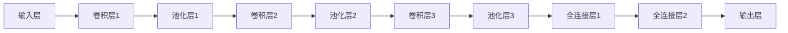
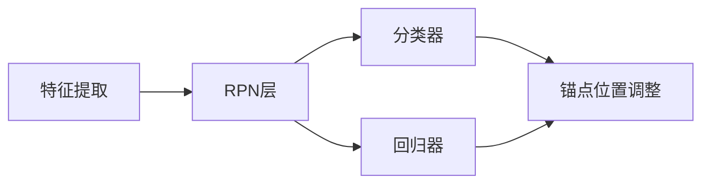
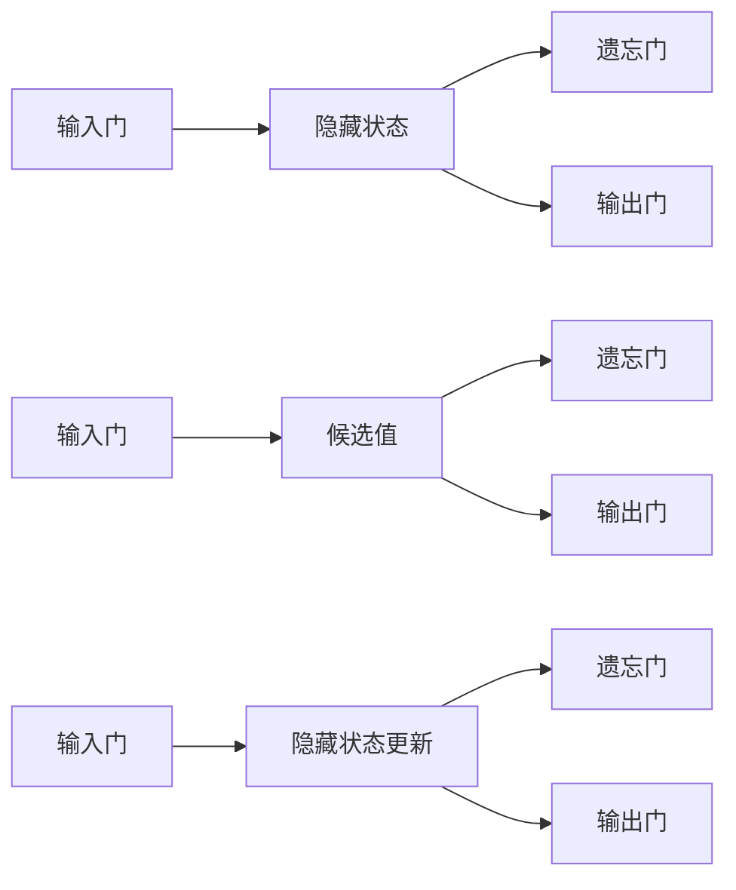
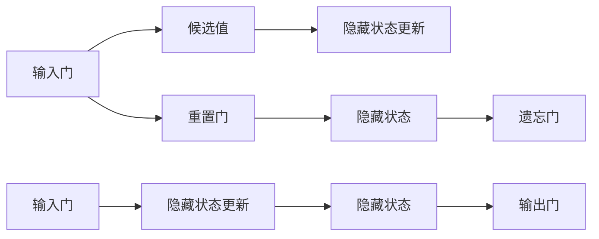

                 

## 文章标题

《AI 深度神经网络计算艺术之道》

## 关键词

深度学习、神经网络、计算挑战、优化算法、计算机视觉、自然语言处理、强化学习、产业应用、伦理与社会影响、未来展望

## 摘要

本文从深度神经网络的基础概念、基本结构、优化算法，到实际应用、计算挑战与艺术，全面探讨深度神经网络在人工智能领域的核心地位与未来发展。通过深入分析深度学习在各领域的应用，探讨伦理与社会影响，以及对未来深度神经网络发展的展望，本文旨在为读者提供一幅深度神经网络计算艺术的完整画卷。

## 目录

----------------------------------------------------------------

### 《AI 深度神经网络计算艺术之道》

## 第一部分：深度神经网络基础

### 第1章：深度神经网络概述

#### 1.1 深度学习与神经网络发展历程

#### 1.2 深度神经网络的基本概念

#### 1.3 深度神经网络的核心作用

### 第2章：深度神经网络基本结构

#### 2.1 神经元与激活函数

##### 2.1.1 神经元模型

##### 2.1.2 激活函数的选择与应用

#### 2.2 网络层与网络拓扑

##### 2.2.1 卷积神经网络（CNN）架构

##### 2.2.2 循环神经网络（RNN）架构

##### 2.2.3 注意力机制

### 第3章：深度学习优化算法

#### 3.1 反向传播算法

##### 3.1.1 算法原理

##### 3.1.2 伪代码实现

#### 3.2 小批量梯度下降

##### 3.2.1 算法原理

##### 3.2.2 伪代码实现

#### 3.3 梯度下降优化技巧

##### 3.3.1 学习率调整

##### 3.3.2 梯度裁剪

## 第二部分：深度神经网络应用

### 第4章：计算机视觉

#### 4.1 图像分类

##### 4.1.1 卷积神经网络在图像分类中的应用

##### 4.1.2 例子：ImageNet大赛

#### 4.2 目标检测

##### 4.2.1 区域生成网络（RPN）

##### 4.2.2 目标检测算法简介

### 第5章：自然语言处理

#### 5.1 词嵌入

##### 5.1.1 词向量的基本概念

##### 5.1.2 词嵌入算法

#### 5.2 序列模型

##### 5.2.1 循环神经网络（RNN）

##### 5.2.2 长短期记忆网络（LSTM）

##### 5.2.3 门控循环单元（GRU）

### 第6章：强化学习

#### 6.1 强化学习基础

##### 6.1.1 强化学习的基本概念

##### 6.1.2 基本算法

#### 6.2 深度强化学习

##### 6.2.1 深度Q网络（DQN）

##### 6.2.2 演化策略搜索（PPO）

## 第三部分：深度神经网络计算艺术

### 第7章：深度神经网络的计算挑战与艺术

#### 7.1 计算挑战

##### 7.1.1 数据并行

##### 7.1.2 模型并行

##### 7.1.3 计算优化

#### 7.2 计算艺术

##### 7.2.1 深度学习硬件优化

##### 7.2.2 计算模型设计

##### 7.2.3 深度学习未来发展趋势

### 第8章：深度神经网络的产业应用

#### 8.1 人工智能在医疗健康领域的应用

##### 8.1.1 疾病诊断

##### 8.1.2 药物研发

#### 8.2 人工智能在金融领域的应用

##### 8.2.1 风险管理

##### 8.2.2 量化交易

#### 8.3 人工智能在其他领域的应用

##### 8.3.1 自动驾驶

##### 8.3.2 增强现实（AR）

### 第9章：深度神经网络的伦理与社会影响

#### 9.1 人工智能伦理问题

##### 9.1.1 数据隐私

##### 9.1.2 人工智能歧视

#### 9.2 社会影响

##### 9.2.1 就业压力

##### 9.2.2 社会不平等

### 第10章：未来展望

#### 10.1 深度神经网络发展趋势

##### 10.1.1 新算法的研究

##### 10.1.2 新硬件的引入

##### 10.1.3 人工智能的融合应用

#### 10.2 人工智能的未来社会

## 附录

### 附录A：深度学习工具与资源

#### A.1 深度学习框架简介

##### A.1.1 TensorFlow

##### A.1.2 PyTorch

##### A.1.3 Keras

#### A.2 深度学习资源推荐

##### A.2.1 在线教程与课程

##### A.2.2 论文与报告

##### A.2.3 社区与论坛

----------------------------------------------------------------

## 第一部分：深度神经网络基础

### 第1章：深度神经网络概述

#### 1.1 深度学习与神经网络发展历程

深度学习是人工智能（AI）领域中的一种重要技术，其核心思想是通过构建具有多个隐含层的神经网络模型，对大规模数据进行训练，从而实现自动化的特征学习和模式识别。深度学习的发展可以追溯到20世纪40年代，当时的心理学家提出了人工神经网络的概念。然而，由于计算能力和数据资源的限制，早期的神经网络研究并未取得显著进展。

真正意义上的深度学习兴起始于20世纪80年代，特别是1986年Rumelhart、Hinton和Williams提出了反向传播算法（Backpropagation Algorithm），这一算法使得多层神经网络的训练成为可能。然而，由于硬件和算法的限制，深度学习在90年代并未得到广泛应用。

进入21世纪，随着计算机性能的飞速提升和大数据技术的发展，深度学习迎来了黄金时期。2006年，Geoffrey Hinton等人提出了深度信念网络（Deep Belief Network，DBN），进一步推动了深度学习的发展。2012年，Alex Krizhevsky等人基于深度卷积神经网络（CNN）在ImageNet图像分类大赛中取得了突破性的成绩，这一成果标志着深度学习在图像识别领域的崛起。

#### 1.2 深度神经网络的基本概念

深度神经网络（Deep Neural Network，DNN）是具有多个隐含层的神经网络模型，其基本结构包括输入层、多个隐含层和输出层。每个隐含层都包含多个神经元，神经元之间通过权重连接。在训练过程中，神经网络通过学习输入数据和输出数据之间的映射关系，从而实现复杂模式的自动学习。

深度神经网络的核心优势在于其能够自动提取层次化的特征表示，这些特征表示能够有效地捕捉数据中的复杂结构和模式。例如，在图像识别任务中，深度神经网络可以自动学习从底层到高层的特征表示，包括边缘、纹理、形状等，从而实现准确的图像分类。

#### 1.3 深度神经网络的核心作用

深度神经网络在人工智能领域具有广泛的应用，其核心作用主要体现在以下几个方面：

1. **特征提取与模式识别**：深度神经网络能够自动提取数据中的特征表示，从而实现复杂模式的识别。在计算机视觉、自然语言处理、语音识别等领域，深度神经网络已经取得了显著的成果。

2. **自动化学习**：深度神经网络通过学习输入数据和输出数据之间的映射关系，可以实现自动化学习。这使得深度神经网络在许多任务中能够替代传统的手工设计特征的方法，提高模型的性能和效率。

3. **跨领域应用**：深度神经网络具有强大的泛化能力，能够应用于多个领域。通过在不同领域的应用，深度神经网络不断推动人工智能技术的发展。

总之，深度神经网络作为人工智能的核心技术，已经在各个领域取得了重要的应用成果，其未来的发展将推动人工智能技术向更高层次的发展。在接下来的章节中，我们将进一步探讨深度神经网络的基本结构、优化算法和应用。

### 第2章：深度神经网络基本结构

#### 2.1 神经元与激活函数

深度神经网络由大量的神经元组成，每个神经元相当于一个简单的函数单元，负责接收输入信号并产生输出信号。神经元的基本模型可以表示为：

\[ y = \sigma(z) \]

其中，\( y \) 是神经元的输出，\( \sigma \) 是激活函数，\( z \) 是神经元的输入。输入信号通常是由前一层的神经元输出加权求和得到的结果，可以表示为：

\[ z = \sum_{i} w_{i} x_{i} + b \]

其中，\( w_{i} \) 是从输入层到当前神经元的权重，\( x_{i} \) 是输入层第 \( i \) 个神经元的输出，\( b \) 是偏置项。

激活函数是神经元模型中的关键组成部分，其作用是对输入信号进行非线性变换，使得神经网络能够处理非线性问题。常见的激活函数包括：

1. **Sigmoid 函数**：
\[ \sigma(z) = \frac{1}{1 + e^{-z}} \]

Sigmoid 函数将输入值映射到 \((0, 1)\) 范围内，常用于分类问题，但其梯度在输出接近 0 或 1 时趋于零，可能导致梯度消失问题。

2. **ReLU 函数**：
\[ \sigma(z) = max(0, z) \]

ReLU 函数在输入为正时输出为输入本身，在输入为负时输出为 0。ReLU 函数具有简单且计算效率高的优点，同时可以有效缓解梯度消失问题。

3. **Tanh 函数**：
\[ \sigma(z) = \frac{e^{z} - e^{-z}}{e^{z} + e^{-z}} \]

Tanh 函数将输入值映射到 \((-1, 1)\) 范围内，类似于 Sigmoid 函数，但具有更好的梯度特性。

选择合适的激活函数对于深度神经网络的性能至关重要。不同类型的任务和应用场景可能需要不同的激活函数。在实际应用中，常常通过实验来确定最佳的激活函数。

#### 2.2 网络层与网络拓扑

深度神经网络由多个层次组成，每个层次包含多个神经元。网络层次结构决定了神经网络的特征提取能力和计算效率。常见的网络层次结构包括：

1. **卷积神经网络（CNN）**：
卷积神经网络是专门用于处理图像数据的神经网络结构。其核心思想是利用卷积层进行特征提取，通过逐层组合卷积层和池化层，形成具有层次化的特征表示。CNN 的典型结构如下：

   - **输入层**：接收原始图像数据。
   - **卷积层**：通过卷积操作提取图像特征。
   - **池化层**：对卷积特征进行下采样，减少参数数量。
   - **全连接层**：将卷积特征映射到分类结果。

   CNN 在图像分类、目标检测和图像生成等领域具有广泛应用。

2. **循环神经网络（RNN）**：
循环神经网络是用于处理序列数据的神经网络结构。RNN 的核心特点是能够处理长短依赖关系，其通过隐藏状态的信息传递实现序列的建模。RNN 的基本结构如下：

   - **输入层**：接收序列数据。
   - **循环层**：通过递归方式处理序列数据，保留历史信息。
   - **输出层**：生成序列的输出结果。

   RNN 在自然语言处理、语音识别和时间序列分析等领域具有重要应用。

3. **生成对抗网络（GAN）**：
生成对抗网络是由两部分组成的神经网络结构，一部分是生成器，另一部分是判别器。生成器尝试生成与真实数据相似的数据，而判别器则判断数据是来自真实数据还是生成器生成的数据。GAN 的基本结构如下：

   - **生成器**：生成与真实数据相似的数据。
   - **判别器**：判断输入数据是真实数据还是生成数据。

   GAN 在图像生成、图像修复和图像增强等领域具有广泛应用。

不同的网络层次结构和拓扑设计能够适应不同的应用场景和数据类型，深度神经网络通过灵活组合这些结构，实现了对各种复杂问题的建模和求解。

### 第3章：深度学习优化算法

深度学习的核心是优化算法，它们决定了神经网络的训练效率和最终性能。在深度学习训练过程中，优化算法通过不断调整网络中的权重和偏置项，使得网络输出与期望输出之间的误差最小。以下是几种常见的深度学习优化算法：

#### 3.1 反向传播算法

反向传播算法（Backpropagation Algorithm）是深度学习中最常用的优化算法，它基于梯度下降法，通过计算损失函数关于网络参数的梯度，对网络参数进行更新。反向传播算法包括两个主要步骤：

1. **前向传播**：计算网络的输出值，并计算输出值与真实值之间的误差。
2. **反向传播**：计算每个参数的梯度，并使用这些梯度来更新参数。

反向传播算法的伪代码如下：

```python
for each layer l from output to input:
    compute the error term for each neuron in layer l
    compute the gradient of the loss function with respect to the weights and biases in layer l
    update the weights and biases in layer l using the gradient
```

#### 3.2 小批量梯度下降

批量梯度下降（Batch Gradient Descent）是一种基本的梯度下降法，它使用整个训练数据集来计算梯度，并更新网络参数。批量梯度下降的优点是能够保证收敛到全局最小值，但其缺点是计算量大，训练时间较长。

为了提高训练效率，批量梯度下降发展出了小批量梯度下降（Stochastic Gradient Descent，SGD）。在小批量梯度下降中，每次只使用一小部分训练样本来计算梯度，并更新网络参数。这样，每次迭代只需要处理一部分数据，大大减少了计算时间。小批量梯度下降的伪代码如下：

```python
for each mini-batch X, Y:
    compute the gradients of the loss function with respect to the weights and biases
    update the weights and biases using the gradients
```

#### 3.3 梯度下降优化技巧

在实际应用中，梯度下降算法的性能受到多个因素的影响，包括学习率、动量、权重初始化等。以下是一些常用的优化技巧：

1. **学习率调整**：
   学习率（Learning Rate）决定了每次迭代时参数更新的步长。学习率过大可能导致参数更新过快，训练过程不稳定；学习率过小则可能导致训练过程缓慢。常用的学习率调整策略包括：

   - **固定学习率**：在整个训练过程中使用相同的学习率。
   - **学习率衰减**：随着训练的进行，逐渐减小学习率。
   - **自适应学习率**：使用自适应学习率方法，如 Adam 优化器，根据梯度信息动态调整学习率。

2. **动量**：
   动量（Momentum）是梯度下降算法中的一个概念，它类似于物理中的惯性。动量可以加速梯度上升或下降的方向，并减缓振荡。动量的伪代码如下：

   ```python
   v = 0
   for each iteration:
       v = mu * v - learning_rate * gradient
       update parameters by v
   ```

   其中，\( \mu \) 是动量因子。

3. **权重初始化**：
   合理的权重初始化可以加速训练并提高模型性能。常见的权重初始化方法包括：

   - **零初始化**：权重初始化为 0。
   - **高斯初始化**：权重初始化为服从高斯分布的随机数。
   - **He 初始化**：权重初始化为服从 \( N(0, \frac{2}{n}) \) 的随机数，其中 \( n \) 是前一层的神经元数量。

通过结合这些优化技巧，可以显著提高梯度下降算法的训练效率和最终性能。

### 第4章：计算机视觉

计算机视觉是深度学习应用的重要领域之一，它涉及到从图像或视频数据中提取有用信息，以实现各种视觉任务，如图像分类、目标检测、语义分割等。深度学习在计算机视觉领域取得了显著的进展，主要归功于卷积神经网络（Convolutional Neural Networks，CNN）的引入和发展。

#### 4.1 图像分类

图像分类是计算机视觉中最基本和最广泛使用的任务之一，其目标是将图像分配到预定义的类别中。卷积神经网络在图像分类中表现出色，其核心优势在于能够自动提取层次化的特征表示。

##### 4.1.1 卷积神经网络在图像分类中的应用

卷积神经网络（CNN）在图像分类中的应用主要分为以下几个步骤：

1. **卷积层**：卷积层通过卷积操作提取图像的局部特征。卷积操作将卷积核（过滤器）在图像上滑动，计算局部区域内的加权和。卷积层可以提取图像的边缘、纹理和形状等特征。

2. **池化层**：池化层用于减小特征图的尺寸，减少参数数量，提高计算效率。常用的池化操作包括最大池化和平均池化。

3. **全连接层**：在卷积层和池化层之后，通常接一个或多个全连接层，将卷积特征映射到分类结果。全连接层将特征图展平成一维向量，然后通过线性变换得到分类结果。

CNN 的结构可以表示为：

\[ 输入层 \rightarrow 多个卷积层 \rightarrow 多个池化层 \rightarrow 全连接层 \]

一个典型的卷积神经网络架构如图 1 所示：



##### 4.1.2 例子：ImageNet大赛

ImageNet大赛是一个具有历史意义的图像分类比赛，其目标是在大规模图像数据集上训练深度神经网络模型，并达到超越人类水平的图像分类性能。2012年，Alex Krizhevsky 等人基于卷积神经网络在ImageNet大赛中取得了突破性的成绩，其模型在1000个类别上达到了约25%的错误率，这一成果标志着深度学习在图像分类领域的崛起。

ImageNet大赛的成功得益于以下几个关键因素：

1. **大规模数据集**：ImageNet包含了数百万张标注好的图像，涵盖了1000个类别，为深度学习模型提供了丰富的训练数据。

2. **深度卷积神经网络**：AlexNet是一个具有五层卷积层的深度卷积神经网络，通过多层次的卷积和池化操作，能够提取图像的层次化特征表示。

3. **数据增强**：在训练过程中，通过随机裁剪、旋转、翻转等数据增强方法，增加了模型的泛化能力。

4. **优化算法**：采用了小批量梯度下降和随机梯度下降相结合的优化算法，提高了模型的训练速度和性能。

ImageNet大赛的成功不仅推动了深度学习在图像分类领域的发展，也为其他计算机视觉任务的研究提供了新的思路和方向。

#### 4.2 目标检测

目标检测是计算机视觉中一个重要的任务，其目标是在图像中检测出特定目标的位置和类别。目标检测与图像分类不同，它需要在图像中定位多个目标，并区分不同目标的类别。

##### 4.2.1 区域生成网络（RPN）

区域生成网络（Region Proposal Network，RPN）是当前最流行的目标检测算法之一，其核心思想是在图像特征图上生成可能的区域提议。RPN 通常与卷积神经网络结合使用，其基本结构如下：

1. **特征提取**：使用卷积神经网络提取图像特征。
2. **RPN 层**：在特征图上生成区域提议。RPN 层通过滑动的区域提议生成器（Region Proposal Generator）和分类器（Classifier）实现区域提议的生成和分类。

RPN 的流程可以简化为以下几个步骤：

1. **生成锚点**：在特征图上生成多个锚点（Anchor），每个锚点代表一个可能的区域提议。
2. **分类和回归**：对每个锚点进行分类和回归。分类器判断锚点对应的区域是否包含目标，回归器调整锚点的位置，使其更好地拟合目标边界。

RPN 的结构可以表示为：



##### 4.2.2 目标检测算法简介

除了 RPN，还有一些其他的流行目标检测算法，如 Faster R-CNN、SSD、YOLO 等。以下简要介绍这些算法：

1. **Faster R-CNN**：
   Faster R-CNN 是在 RPN 基础上发展起来的目标检测算法，其核心改进是引入了区域提议网络（Region of Interest，ROI）池化层，使得在特征图中提取 ROI 特征更加高效。Faster R-CNN 的结构可以表示为：

   ```mermaid
   graph LR
       A[特征提取] --> B[RPN层]
       B --> C[ROI池化层]
       C --> D[分类器]
       C --> E[回归器]
       D --> F[分类结果]
       E --> F[边界框调整]
   ```

2. **SSD**：
   SSD（Single Shot Detector）是一种单阶段目标检测算法，其核心思想是在特征图上直接预测边界框和类别概率。SSD 通过在不同尺度的特征图上预测目标，从而实现多尺度目标检测。SSD 的结构可以表示为：

   ```mermaid
   graph LR
       A[特征提取] --> B[多尺度特征图]
       B --> C[边界框预测]
       B --> D[类别预测]
   ```

3. **YOLO**：
   YOLO（You Only Look Once）是一种单阶段目标检测算法，其核心思想是在特征图上直接预测边界框和类别概率。YOLO 通过将特征图划分为网格单元，每个单元预测多个边界框和类别概率，从而实现目标检测。YOLO 的结构可以表示为：

   ```mermaid
   graph LR
       A[特征提取] --> B[网格划分]
       B --> C[边界框预测]
       B --> D[类别预测]
   ```

这些目标检测算法在多种应用场景中表现出色，通过选择合适的算法和优化策略，可以实现高效、准确的目标检测。

### 第5章：自然语言处理

自然语言处理（Natural Language Processing，NLP）是深度学习的重要应用领域之一，其目标是对自然语言文本进行建模和理解，以实现自动化语言处理任务。深度学习在 NLP 领域取得了显著的成果，主要归功于词嵌入、序列模型和注意力机制的发展。

#### 5.1 词嵌入

词嵌入（Word Embedding）是将自然语言文本转换为向量表示的方法，其核心思想是将单词映射到高维空间中的向量，以便进行机器学习模型处理。词嵌入的主要目的是捕捉单词之间的语义关系和语法结构，从而提高 NLP 模型的性能。

##### 5.1.1 词向量的基本概念

词向量是词嵌入的基本单位，每个词向量表示一个单词的语义信息。词向量的常见表示方法包括：

1. **One-Hot 编码**：
   One-Hot 编码是将单词映射到一个高维向量，其中只有一个维度为1，其余维度为0。这种方法简单直观，但维度爆炸问题严重，难以捕捉单词的语义关系。

2. **分布式表示**：
   分布式表示是将单词映射到一个低维向量，其中单词的语义信息通过向量中的各个维度来表示。常见的分布式表示方法包括：

   - **计数模型**：如TF-IDF，通过统计单词在文本中的出现频率和文档中的分布来表示单词的权重。
   - **神经网络模型**：如 Word2Vec 和 GloVe，通过训练神经网络模型将单词映射到低维向量，从而捕捉单词的语义关系。

##### 5.1.2 词嵌入算法

常见的词嵌入算法包括 Word2Vec、GloVe 和 BERT 等，以下简要介绍这些算法：

1. **Word2Vec**：
   Word2Vec 是由 Google 提出的一种基于神经网络的语言模型，其核心思想是通过训练神经网络来预测单词的上下文。Word2Vec 包括两种训练模式：连续词袋（Continuous Bag of Words，CBOW）和跳字模型（Skip-Gram）。

   - **CBOW**：给定一个单词，CBOW 通过预测这个单词周围的多个单词来学习词向量。具体来说，CBOW 模型将中心词的词向量与上下文词的词向量求和，然后通过softmax层预测中心词。
   
   - **Skip-Gram**：与 CBOW 相反，Skip-Gram 模型通过预测中心词的上下文词来学习词向量。Skip-Gram 模型通过中心词的词向量与上下文词的词向量点积，然后通过softmax层预测上下文词。

   Word2Vec 的模型结构可以表示为：

   ```mermaid
   graph LR
       A[中心词] --> B[上下文词1]
       A --> C[上下文词2]
       A --> D[上下文词3]
       B --> E[softmax层]
       C --> E
       D --> E
   ```

2. **GloVe**：
   GloVe（Global Vectors for Word Representation）是一种基于全局上下文信息的词嵌入算法，其核心思想是通过计算单词在文档中的共现矩阵来学习词向量。GloVe 模型通过优化单词的词向量和矩阵 \( W \) 之间的损失函数，从而学习出高质量的词向量。

   GloVe 的损失函数可以表示为：

   \[ L = \frac{1}{N} \sum_{i=1}^{N} \sum_{j=1}^{V} \left( \log \frac{f(w_i, w_j)}{f(w_i, w_j)^2} \right) \]

   其中，\( N \) 是文档总数，\( V \) 是词汇表大小，\( f(w_i, w_j) \) 是单词 \( w_i \) 和 \( w_j \) 在文档中的共现频率。

3. **BERT**：
   BERT（Bidirectional Encoder Representations from Transformers）是由 Google Research 和 Microsoft Research AI 提出的一种基于 Transformer 的预训练语言模型，其核心思想是利用双向 Transformer 编码器来学习单词的上下文表示。BERT 的预训练任务包括 masked language modeling 和 next sentence prediction，通过这些任务，BERT 能够捕捉到单词在文本中的语义和语法信息。

   BERT 的模型结构可以表示为：

   ```mermaid
   graph LR
       A[输入序列] --> B[嵌入层]
       B --> C[Transformer编码器]
       C --> D[输出层]
   ```

词嵌入算法的发展为 NLP 模型提供了有效的语义表示，从而提高了模型在多种 NLP 任务中的性能。

#### 5.2 序列模型

序列模型（Sequence Model）是用于处理序列数据的深度学习模型，如文本、语音、时间序列等。序列模型的核心任务是捕捉序列中的时间和空间依赖关系，从而实现对序列数据的建模和理解。常见的序列模型包括循环神经网络（RNN）、长短期记忆网络（LSTM）和门控循环单元（GRU）。

##### 5.2.1 循环神经网络（RNN）

循环神经网络（Recurrent Neural Network，RNN）是一种用于处理序列数据的神经网络模型，其核心思想是利用循环结构来保留历史信息。RNN 的基本结构可以表示为：

\[ h_t = \sigma(W_h h_{t-1} + W_x x_t + b) \]

其中，\( h_t \) 是当前时刻的隐藏状态，\( x_t \) 是当前时刻的输入，\( W_h \) 和 \( W_x \) 是权重矩阵，\( b \) 是偏置项，\( \sigma \) 是激活函数。

RNN 通过递归关系计算隐藏状态，从而实现对序列数据的建模。然而，RNN 存在梯度消失和梯度爆炸问题，这使得 RNN 在长序列建模中性能不佳。

##### 5.2.2 长短期记忆网络（LSTM）

长短期记忆网络（Long Short-Term Memory，LSTM）是 RNN 的改进版本，其核心思想是引入门控机制来控制信息的流动，从而有效解决 RNN 的梯度消失和梯度爆炸问题。LSTM 的基本结构可以表示为：



LSTM 通过三个门控单元（输入门、遗忘门和输出门）来控制信息的流动。输入门决定当前输入信息的重要程度，遗忘门决定历史信息的重要程度，输出门决定当前隐藏状态的重要程度。这些门控机制使得 LSTM 能够在长序列建模中保持信息的状态，从而提高了模型的性能。

##### 5.2.3 门控循环单元（GRU）

门控循环单元（Gated Recurrent Unit，GRU）是 LSTM 的简化版本，其结构更加简洁，同时保持了 LSTM 的长序列建模能力。GRU 通过更新门（update gate）和重置门（reset gate）来控制信息的流动。GRU 的基本结构可以表示为：



GRU 通过更新门和重置门来控制信息的流动，简化了 LSTM 的复杂结构，同时保持了 LSTM 的长序列建模能力。这使得 GRU 在实际应用中具有更高的计算效率。

序列模型在自然语言处理任务中具有广泛的应用，如文本分类、机器翻译、情感分析等。通过结合词嵌入和序列模型，深度学习模型能够有效地建模和理解自然语言文本。

### 第6章：强化学习

强化学习（Reinforcement Learning，RL）是机器学习的一个重要分支，其核心思想是通过与环境交互来学习最优策略。强化学习在自动驾驶、游戏AI、机器人控制等领域取得了显著成果。在本节中，我们将介绍强化学习的基本概念、基本算法，并探讨深度强化学习的应用。

#### 6.1 强化学习基础

强化学习涉及三个主要成分：环境（Environment）、智能体（Agent）和奖励（Reward）。智能体是学习的主体，它通过感知环境的状态（State）并采取行动（Action），从而获得奖励。智能体的目标是学习一个策略（Policy），使得在长期中能够最大化累积奖励。

##### 6.1.1 强化学习的基本概念

1. **状态（State）**：状态是智能体在环境中所处的情境或条件。状态可以是离散的，也可以是连续的。

2. **行动（Action）**：行动是智能体可以采取的动作。行动可以是离散的，也可以是连续的。

3. **策略（Policy）**：策略是智能体根据当前状态选择行动的规则。策略通常用概率分布来表示，即给定状态 \( s \)，选择行动 \( a \) 的概率 \( \pi(a|s) \)。

4. **奖励（Reward）**：奖励是智能体在环境中采取行动后获得的即时奖励。奖励可以是正的，也可以是负的。

5. **价值函数（Value Function）**：价值函数是衡量策略优劣的指标。状态价值函数 \( V(s) \) 表示在状态 \( s \) 下采用最优策略获得的累积奖励期望。行动价值函数 \( Q(s, a) \) 表示在状态 \( s \) 下采取行动 \( a \) 所获得的累积奖励期望。

##### 6.1.2 基本算法

强化学习算法可以分为基于价值的算法和基于策略的算法。基于价值的算法通过学习价值函数来间接优化策略，而基于策略的算法直接优化策略。

1. **值迭代（Value Iteration）**：
   值迭代是一种基于价值的算法，其基本思想是通过不断更新状态价值函数，找到最优策略。值迭代算法的伪代码如下：

   ```python
   for each state s:
       V[s] = 0
   while not converged:
       for each state s:
           for each action a:
               Q[s, a] = max\_action(Q[s, a], R[s, a] + γ \* max\_next\_state\_value(V))
           V[s] = max\_action(Q[s, a])
   policy = argmax\_action(Q[s, a])
   ```

2. **策略迭代（Policy Iteration）**：
   策略迭代是一种基于策略的算法，其基本思想是通过不断更新策略，找到最优策略。策略迭代算法的伪代码如下：

   ```python
   while not converged:
       policy\_old = policy
       V[s] = 0
       while not converged\_value:
           for each state s:
               V[s] = R[s, policy[s]] + γ \* max\_next\_state\_value(V)
       policy = argmax\_action(Q[s, a])
   ```

3. **Q-Learning（Q学习）**：
   Q-Learning 是一种基于价值的算法，其核心思想是通过不断更新行动价值函数，找到最优策略。Q-Learning 算法的伪代码如下：

   ```python
   for each state s and action a:
       Q[s, a] = 0
   while not converged:
       for each episode:
           s = initial\_state
           while s != terminal\_state:
               a = policy[s]
               s' = next\_state
               a' = argmax\_action(Q[s', a'])
               Q[s, a] = Q[s, a] + α \* (R[s, a] + γ \* Q[s', a'] - Q[s, a])
           policy = argmax\_action(Q[s, a])
   ```

Q-Learning 是一种无模型算法，不需要对环境进行建模，只需通过与环境交互来学习最优策略。Q-Learning 算法在许多实际问题中表现出良好的性能。

#### 6.2 深度强化学习

深度强化学习（Deep Reinforcement Learning，DRL）是强化学习与深度学习相结合的一种方法，其核心思想是利用深度神经网络来近似价值函数或策略。深度强化学习在解决高维状态空间和行动空间的问题时具有显著优势。

##### 6.2.1 深度Q网络（DQN）

深度Q网络（Deep Q-Network，DQN）是深度强化学习的一种经典算法，其核心思想是利用深度神经网络来近似Q函数。DQN 通过经验回放（Experience Replay）和目标网络（Target Network）来缓解策略偏差和梯度消失问题。

DQN 的基本结构包括：

1. **深度神经网络**：用于近似Q函数 \( Q(s, a) \)。

2. **经验回放**：将智能体在环境中的交互经验存储在经验池中，从经验池中随机采样经验，以避免策略偏差。

3. **目标网络**：用于稳定梯度更新，目标网络是当前Q网络的克隆，其参数定期更新。

DQN 的训练过程包括：

1. 初始化深度神经网络 \( Q(s, a) \) 和目标网络 \( Q'(s, a) \)。

2. 在环境中执行一系列动作，记录状态 \( s \)、动作 \( a \)、奖励 \( R \) 和下一状态 \( s' \)。

3. 将交互经验 \( (s, a, R, s') \) 存储在经验池中。

4. 从经验池中随机采样 \( (s, a, R, s') \)。

5. 使用采样数据进行梯度更新，更新深度神经网络 \( Q(s, a) \)：

   \[ Q(s, a) \leftarrow Q(s, a) + α \* (R + γ \* Q'(s', a') - Q(s, a)) \]

6. 定期更新目标网络 \( Q'(s, a) \) 为当前深度神经网络的克隆。

DQN 通过经验回放和目标网络来缓解策略偏差和梯度消失问题，从而在解决复杂任务时表现出良好的性能。

##### 6.2.2 演化策略搜索（PPO）

演化策略搜索（Proximal Policy Optimization，PPO）是一种基于策略的深度强化学习算法，其核心思想是通过优化策略梯度和估计策略优势函数，更新策略参数。PPO 通过限制策略更新范数，确保策略更新的稳定性。

PPO 的基本结构包括：

1. **策略网络**：用于估计当前状态的策略参数 \( π_{θ}(a|s) \)。

2. **价值网络**：用于估计当前状态的期望回报 \( V_{θ}(s) \)。

3. **优势函数**：用于衡量策略的改进程度，优势函数 \( A(s, a) = R + γ \* V_{θ}(s') - V_{θ}(s) \)。

PPO 的训练过程包括：

1. 初始化策略网络 \( π_{θ}(a|s) \) 和价值网络 \( V_{θ}(s) \)。

2. 在环境中执行一系列动作，记录状态 \( s \)、动作 \( a \)、奖励 \( R \) 和下一状态 \( s' \)。

3. 计算优势函数 \( A(s, a) \)。

4. 使用优势函数和策略梯度，更新策略网络 \( π_{θ}(a|s) \)：

   \[ θ' = θ - α \* ∇θ [A(s, a) \* log π_{θ}(a|s)] \]

   其中，\( α \) 是学习率。

5. 使用策略网络 \( π_{θ'}(a|s) \) 和价值网络 \( V_{θ}(s) \) 的估计值，更新价值网络 \( V_{θ}(s) \)：

   \[ V_{θ}(s) = \frac{1}{N} \sum_{i=1}^{N} (R_i + γ \* V_{θ'}(s_i')) \]

PPO 通过优化策略梯度和估计策略优势函数，更新策略参数，从而在解决复杂任务时表现出良好的性能。

### 第7章：深度神经网络的计算挑战与艺术

深度神经网络（Deep Neural Network，DNN）作为一种强大的机器学习模型，已在计算机视觉、自然语言处理、语音识别等领域取得了显著的成果。然而，随着网络深度和参数数量的增加，DNN 在计算上也面临着一系列挑战。本章将探讨深度神经网络计算中的挑战，并介绍解决这些挑战的艺术。

#### 7.1 计算挑战

1. **数据并行与模型并行**

   数据并行（Data Parallelism）和模型并行（Model Parallelism）是提高深度神经网络计算效率的重要方法。

   - **数据并行**：将训练数据分成多个子集，每个子集由不同的 GPU 或 CPU 进行的训练。数据并行通过增加计算资源来提高训练速度，但其缺点是可能导致通信开销增加，影响整体性能。

   - **模型并行**：将深度神经网络分成多个子网络，每个子网络运行在不同的 GPU 或 CPU 上。模型并行通过将计算任务分配到多个计算资源上，提高计算效率。然而，模型并行需要解决子网络之间的通信和同步问题。

2. **计算优化**

   计算优化是提高深度神经网络计算效率的重要手段，包括以下几个方面：

   - **稀疏性**：稀疏性通过减少计算中非零元素的数目，降低计算复杂度。稀疏性优化适用于大规模稀疏数据集，如自然语言处理中的词向量矩阵。

   - **量化**：量化通过降低数值的精度，减少存储和计算的开销。量化可以显著降低计算资源的需求，但可能影响模型的准确性。

   - **计算图优化**：计算图优化通过重排计算步骤，减少重复计算和内存访问，提高计算效率。计算图优化包括常量折叠、矩阵因子分解等。

3. **深度学习硬件优化**

   深度学习硬件优化是提高计算效率的关键，包括以下几个方面：

   - **GPU**：GPU（Graphics Processing Unit）具有高度并行计算能力，是深度学习领域的主流硬件。GPU通过并行处理大量数据，提高了训练速度和推理性能。

   - **TPU**：TPU（Tensor Processing Unit）是专门为深度学习设计的硬件加速器，具有高效的矩阵运算能力。TPU 可以显著提高深度神经网络的训练和推理速度。

   - **FPGA**：FPGA（Field-Programmable Gate Array）是一种可编程硬件加速器，可以根据需求自定义硬件逻辑。FPGA 在处理特定深度学习任务时具有高性能和高灵活性。

#### 7.2 计算艺术

1. **计算模型设计**

   计算模型设计是深度神经网络计算艺术的重要组成部分，包括以下几个方面：

   - **模型压缩**：模型压缩通过减少模型参数数量，降低计算复杂度。常见的模型压缩方法包括剪枝、量化、知识蒸馏等。

   - **模型加速**：模型加速通过优化模型结构和算法，提高计算效率。常见的模型加速方法包括计算图优化、并行化、分布式训练等。

   - **动态计算**：动态计算通过实时调整计算资源，提高计算效率。动态计算可以根据任务需求和硬件资源，灵活调整模型结构和计算步骤。

2. **深度学习未来发展趋势**

   随着计算技术的不断进步，深度神经网络计算艺术将继续发展。未来发展趋势包括以下几个方面：

   - **硬件创新**：新的硬件技术，如量子计算、光计算等，将为深度学习计算提供更高效的解决方案。

   - **算法优化**：新的算法和技术，如生成对抗网络（GAN）、图神经网络（GNN）等，将推动深度学习计算艺术的发展。

   - **多模态学习**：多模态学习将结合不同类型的数据（如文本、图像、音频等），实现更全面的认知和推理能力。

   - **智能计算**：智能计算通过结合深度学习和认知科学，实现更智能的决策和交互。

深度神经网络的计算挑战和艺术将继续推动人工智能技术的发展，为各个领域的应用带来新的机遇和挑战。

### 第8章：深度神经网络的产业应用

深度神经网络（Deep Neural Network，DNN）作为一种强大的机器学习模型，已在各个领域取得了显著的成果。本章将介绍深度神经网络在医疗健康、金融和自动驾驶等领域的应用，并探讨其在增强现实（Augmented Reality，AR）和其他新兴领域的潜力。

#### 8.1 人工智能在医疗健康领域的应用

医疗健康是深度学习应用的重要领域，深度神经网络在疾病诊断、药物研发、医学图像处理等方面发挥着重要作用。

##### 8.1.1 疾病诊断

深度神经网络在疾病诊断中具有广泛的应用。通过学习大量的医疗数据，深度神经网络能够自动识别疾病特征，从而辅助医生进行疾病诊断。以下是一些典型的应用案例：

- **肺癌诊断**：深度神经网络通过分析肺部 CT 图像，能够自动检测肺癌病灶，提高早期诊断的准确性。
- **乳腺癌诊断**：深度神经网络结合医学图像分析和病理数据，能够辅助医生进行乳腺癌诊断，减少误诊率。
- **糖尿病视网膜病变诊断**：深度神经网络通过分析糖尿病患者的眼底图像，能够自动检测糖尿病视网膜病变，为糖尿病管理提供依据。

##### 8.1.2 药物研发

深度神经网络在药物研发中具有巨大的潜力，可以帮助研究人员发现新的药物候选分子，并优化药物设计。以下是一些应用案例：

- **药物分子设计**：深度神经网络通过学习大量的药物分子结构数据，能够预测新的药物分子结构，加速药物发现过程。
- **药物活性预测**：深度神经网络通过分析药物分子与生物靶点的相互作用，能够预测药物分子的活性，帮助研究人员筛选出有潜力的药物候选分子。
- **药物副作用预测**：深度神经网络通过分析药物分子与人体蛋白的相互作用，能够预测药物可能引起的副作用，为药物安全性评估提供参考。

#### 8.2 人工智能在金融领域的应用

金融是深度学习应用的另一个重要领域，深度神经网络在风险管理、量化交易、信用评分等方面具有广泛的应用。

##### 8.2.1 风险管理

深度神经网络在风险管理中发挥着重要作用，能够帮助金融机构识别潜在风险，优化风险管理策略。以下是一些应用案例：

- **信用评分**：深度神经网络通过分析客户的历史信用数据，能够预测客户未来的信用行为，为信用评分提供依据。
- **市场风险预测**：深度神经网络通过分析市场数据，能够预测股票市场的波动，帮助金融机构进行市场风险管理和投资决策。
- **信贷风险预测**：深度神经网络通过分析借款人的信用数据，能够预测借款人的违约风险，为信贷审批提供依据。

##### 8.2.2 量化交易

量化交易是利用数学模型和算法进行交易决策的一种交易方式，深度神经网络在量化交易中具有广泛的应用。以下是一些应用案例：

- **高频交易**：深度神经网络通过分析高频交易数据，能够预测交易机会，实现高频交易的自动化。
- **趋势预测**：深度神经网络通过分析历史交易数据，能够预测市场趋势，为交易决策提供依据。
- **对冲策略**：深度神经网络通过分析市场数据，能够发现对冲策略，降低交易风险。

#### 8.3 人工智能在其他领域的应用

深度神经网络不仅在医疗健康和金融领域具有广泛应用，还在其他领域展现了巨大的潜力。

##### 8.3.1 自动驾驶

自动驾驶是深度学习在交通领域的重要应用，深度神经网络在感知、决策和控制等方面发挥着关键作用。以下是一些应用案例：

- **环境感知**：深度神经网络通过分析摄像头、激光雷达等传感器数据，能够识别道路上的障碍物、行人、车辆等目标，实现自动驾驶的环境感知。
- **路径规划**：深度神经网络通过分析道路信息和车辆状态，能够规划出最优的行驶路径，实现自动驾驶的路径规划。
- **车辆控制**：深度神经网络通过分析车辆状态和行驶环境，能够控制车辆的加速、制动和转向，实现自动驾驶的车辆控制。

##### 8.3.2 增强现实（AR）

增强现实（Augmented Reality，AR）是深度学习在娱乐、教育、医疗等领域的重要应用，深度神经网络在 AR 系统中发挥着关键作用。以下是一些应用案例：

- **物体识别**：深度神经网络通过分析摄像头捕捉到的图像，能够识别图像中的物体，为 AR 系统提供物体识别功能。
- **三维建模**：深度神经网络通过分析图像数据，能够生成三维模型，为 AR 系统提供三维建模功能。
- **虚拟交互**：深度神经网络通过分析用户的行为和表情，能够实现虚拟交互，为 AR 系统提供更加自然和丰富的交互体验。

深度神经网络在各个领域的应用展现了其强大的计算能力和广泛的应用前景。随着深度学习技术的不断进步，深度神经网络将在更多领域发挥重要作用，推动人工智能技术的发展。

### 第9章：深度神经网络的伦理与社会影响

深度神经网络（Deep Neural Network，DNN）作为人工智能（AI）的核心技术，已在各个领域取得了显著的应用成果。然而，随着深度学习技术的广泛应用，其伦理与社会影响也日益受到关注。本章将探讨深度神经网络在数据隐私、人工智能歧视以及就业压力等方面的伦理问题，并分析其对社会不平等的影响。

#### 9.1 人工智能伦理问题

1. **数据隐私**

数据隐私是深度神经网络应用中的一个重要伦理问题。深度学习模型通常需要大量的训练数据，这些数据可能包含个人隐私信息。以下是一些关键点：

- **数据收集**：在数据收集过程中，可能涉及到个人隐私信息的泄露，如医疗记录、财务信息等。因此，如何在保证模型性能的同时保护用户隐私成为一个重要问题。

- **数据使用**：深度学习模型在使用过程中，可能会对用户数据进行分析和存储，这可能导致用户隐私泄露的风险。例如，面部识别技术在公共安全领域的应用，可能涉及到用户隐私的保护。

2. **人工智能歧视**

人工智能歧视是指人工智能系统在决策过程中，可能因为数据偏见或算法设计问题，导致对某些群体产生不公平待遇。以下是一些关键点：

- **算法偏见**：深度学习模型在训练过程中，可能会学习到数据中的偏见，从而在决策中体现出来。例如，招聘系统中可能因为数据集的不均衡，导致对女性或少数族裔的歧视。

- **数据偏见**：数据偏见可能来源于数据集的选择或数据的收集方式。例如，医学诊断模型可能因为训练数据中缺乏某些群体的数据，导致对某些群体的诊断准确性降低。

3. **算法透明性**

算法透明性是另一个重要的伦理问题。深度学习模型通常是一个黑盒子，其内部决策过程复杂，难以解释。以下是一些关键点：

- **解释性**：如何解释深度学习模型的决策过程是一个挑战。对于关键决策，如医疗诊断、信用评分等，解释性至关重要。

- **可追溯性**：如何确保深度学习模型的可追溯性，以便在出现问题时能够进行调试和修复。

#### 9.2 社会影响

1. **就业压力**

随着人工智能技术的快速发展，自动化和智能化程度的提高，就业压力成为了一个备受关注的社会问题。以下是一些关键点：

- **岗位替代**：人工智能技术在某些领域的应用，如制造业、客服、金融等，可能替代大量人力工作，导致就业岗位减少。

- **技能升级**：人工智能技术的发展，要求从业人员不断学习和更新技能，以适应新的工作环境。然而，并非所有人都有机会和能力进行技能升级。

2. **社会不平等**

人工智能技术的应用可能加剧社会不平等问题。以下是一些关键点：

- **技术红利**：人工智能技术的研发和应用，可能带来巨大的经济利益。然而，这些利益可能集中在掌握技术的少数人手中，加剧贫富差距。

- **数字鸿沟**：在数字化时代，掌握技术的群体与非技术群体之间的差距可能进一步扩大，导致社会不平等问题加剧。

3. **伦理监管**

为了解决深度神经网络应用中的伦理问题，建立有效的伦理监管机制至关重要。以下是一些关键点：

- **伦理审查**：在人工智能技术开发和应用过程中，建立伦理审查机制，确保技术的使用符合伦理标准。

- **法律法规**：完善相关法律法规，为人工智能技术的应用提供法律保障。

- **公众参与**：鼓励公众参与人工智能伦理讨论，提高公众对人工智能技术的认知和参与度。

总之，深度神经网络在带来巨大技术进步的同时，也带来了一系列伦理与社会问题。通过加强伦理监管和社会责任，可以确保人工智能技术的可持续发展，为人类社会带来更多福祉。

### 第10章：未来展望

深度神经网络（Deep Neural Network，DNN）作为人工智能（AI）的核心技术，已经取得了显著的进展和广泛应用。然而，随着技术的不断发展，深度神经网络仍有许多潜在的发展方向和挑战。本章将探讨深度神经网络未来的发展趋势、新算法的研究、新硬件的引入以及人工智能的融合应用，并对人工智能的未来社会进行展望。

#### 10.1 深度神经网络发展趋势

1. **更深的网络结构**

   随着计算能力和数据资源的提升，更深的网络结构将继续成为深度神经网络的发展趋势。更深的网络结构能够捕捉到数据中的更高层次特征，从而提高模型的性能。例如，Transformer架构的引入，使得BERT等模型能够在自然语言处理领域取得突破性的成果。未来，更深的网络结构将不断推动深度神经网络在各个领域的发展。

2. **更高效的优化算法**

   优化算法是深度神经网络训练的核心，未来将出现更多高效的优化算法。例如，自适应优化算法如Adam和AdamW，通过自适应调整学习率，提高了训练效率和模型性能。未来，随着计算技术的进步，自适应优化算法将变得更加智能和高效，进一步降低训练时间和提高模型性能。

3. **更强大的计算硬件**

   计算硬件的进步将深度神经网络的发展推向新的高度。未来的计算硬件将更加高效、能耗更低。例如，TPU（Tensor Processing Unit）和GPU（Graphics Processing Unit）等专用硬件加速器，已经在深度学习领域发挥了重要作用。未来，量子计算、光计算等新型计算硬件的引入，将大幅提高深度神经网络的计算能力和效率。

4. **更广泛的应用领域**

   深度神经网络将在更多领域得到应用，从计算机视觉、自然语言处理到医疗、金融、自动驾驶等。随着技术的进步，深度神经网络将能够处理更复杂的任务，提供更准确和高效的解决方案。例如，在医疗领域，深度神经网络将帮助医生进行精准诊断和治疗；在金融领域，深度神经网络将帮助金融机构进行风险管理和投资决策。

#### 10.2 新算法的研究

1. **生成对抗网络（GAN）的改进**

   生成对抗网络（GAN）是一种强大的生成模型，能够在图像生成、图像修复和图像增强等领域取得显著成果。未来，GAN 的改进将主要集中在提高生成质量、减少模式崩溃和解决训练不稳定问题。例如，新颖的生成对抗网络结构如StyleGAN，已经在图像生成领域取得了突破性的成果。

2. **元学习（Meta-Learning）**

   元学习是一种快速学习的方法，能够使模型在新的任务上快速适应。未来，元学习将在深度神经网络中发挥重要作用，特别是在强化学习和在线学习领域。例如，MAML（Model-Agnostic Meta-Learning）和REPTILE（Reptile）等元学习算法，已经在强化学习任务中取得了显著成果。

3. **图神经网络（Graph Neural Network，GNN）**

   图神经网络（GNN）是一种专门用于处理图结构数据的方法，其在推荐系统、社交网络分析、生物信息学等领域具有广泛应用。未来，GNN 将继续发展，出现更多高效的图神经网络结构和算法，进一步挖掘图结构数据中的复杂关系。

4. **自监督学习（Self-Supervised Learning）**

   自监督学习是一种无需标注数据的学习方法，能够从大量未标注的数据中提取有用信息。未来，自监督学习将在深度神经网络中发挥重要作用，特别是在大规模数据集训练和少样本学习领域。例如，BYOL（Bootstrap Your Own Latent）和MoCo（Memory-augmented Convolutional Networks）等自监督学习算法，已经在计算机视觉领域取得了显著成果。

#### 10.3 新硬件的引入

1. **量子计算**

   量子计算是一种基于量子力学原理的新型计算技术，具有巨大的并行计算能力。未来，量子计算将在深度神经网络计算中发挥重要作用，特别是在大数据处理和复杂优化问题领域。例如，量子神经网络（Quantum Neural Network，QNN）是一种将量子计算与神经网络相结合的方法，已经在量子优化和机器学习领域取得了初步成果。

2. **光计算**

   光计算是一种利用光信号进行计算的方法，具有高速、低能耗的特点。未来，光计算将在深度神经网络计算中发挥重要作用，特别是在实时处理和大规模数据处理领域。例如，光学神经网络（Optical Neural Network，ONN）是一种基于光信号处理的神经网络结构，已经在图像识别和语音识别等领域取得了初步成果。

3. **边缘计算**

   边缘计算是一种将计算任务从云端转移到网络边缘的方法，能够降低延迟和提高数据处理效率。未来，边缘计算与深度神经网络的结合将推动物联网（IoT）和智能设备的发展。例如，边缘神经网络（Edge Neural Network，ENN）是一种在边缘设备上执行的神经网络结构，已经在智能家居、智能交通等领域取得了初步成果。

#### 10.4 人工智能的融合应用

1. **跨学科融合**

   人工智能与计算机科学、数学、物理学、生物学等学科的融合，将推动人工智能技术的发展。例如，深度强化学习与控制理论相结合，已经在自动驾驶、机器人控制等领域取得了显著成果。未来，跨学科融合将不断推动人工智能技术在各个领域的应用。

2. **多模态学习**

   多模态学习是一种同时处理多种类型数据（如图像、文本、音频等）的方法。未来，多模态学习将在医疗诊断、金融分析、智能交互等领域发挥重要作用。例如，多模态深度学习模型已经在医学图像分析、语音识别和情感分析等领域取得了显著成果。

3. **人机协同**

   人机协同是一种结合人类和机器智能的方法，能够提高人类的工作效率和创造力。未来，人机协同将广泛应用于智能办公、智能教育、智能娱乐等领域。例如，智能助手、智能翻译和智能辅助设计等应用，已经在各行各业中得到了广泛应用。

总之，深度神经网络作为人工智能的核心技术，未来将在更多领域得到应用，推动人工智能技术的发展。通过新算法的研究、新硬件的引入和人工智能的融合应用，人工智能将不断改变我们的生活方式和社会结构，带来更加智能化和便捷化的未来。

### 附录A：深度学习工具与资源

#### A.1 深度学习框架简介

深度学习框架是用于构建和训练深度学习模型的一套工具和库，能够简化模型的开发过程，提高训练效率。以下是一些流行的深度学习框架及其简要介绍：

1. **TensorFlow**

   TensorFlow 是由 Google 开发的一款开源深度学习框架，广泛应用于计算机视觉、自然语言处理、语音识别等领域。TensorFlow 提供了丰富的 APIs，支持多种编程语言，包括 Python、C++和 Java。其独特的计算图（Compute Graph）机制，使得模型开发和优化更加灵活。

2. **PyTorch**

   PyTorch 是由 Facebook AI 研究团队开发的一款开源深度学习框架，以其动态计算图（Eager Execution）和灵活的 API 而受到广泛关注。PyTorch 在科研和工业界都有着广泛的应用，特别是在自然语言处理和计算机视觉领域。其易于使用的 API 和强大的计算能力，使其成为深度学习研究者和管理人员的首选工具。

3. **Keras**

   Keras 是一款开源的神经网络库，最初由 Google Brain 团队的 François Chollet 开发，后来捐赠给梅奥诊所。Keras 作为 TensorFlow 的一个高级 API，为深度学习模型的构建提供了一种更为简洁和直观的方式。Keras 支持多种后端引擎，包括 TensorFlow、CNTK 和 Theano，但其主要后端是 TensorFlow。

#### A.2 深度学习资源推荐

1. **在线教程与课程**

   - **Coursera**: 提供了众多高质量的深度学习和机器学习课程，如《深度学习特化课程》和《神经网络与深度学习》。
   - **edX**: 提供了由哈佛大学和麻省理工学院合办的《深度学习》课程，由 Andrew Ng 教授主讲。
   - **Udacity**: 提供了《深度学习纳米学位》课程，包括项目实战和实践经验。

2. **论文与报告**

   - **arXiv**: 是一个开放获取的论文存档库，涵盖了计算机科学、物理学、数学等领域的最新研究成果，特别是深度学习和机器学习领域的论文。
   - **NeurIPS 和 ICML**: 是两大顶级机器学习会议，每年的会议论文集都包含了深度学习和机器学习领域的重要研究成果。

3. **社区与论坛**

   - **Stack Overflow**: 是一个面向程序员的问题和解答社区，深度学习相关的问答也非常丰富。
   - **Reddit**: Reddit 上有许多关于深度学习的子版块，如 r/deeplearning、r/MachineLearning 等，可以交流学习和分享经验。
   - **GitHub**: GitHub 是一个代码托管平台，许多深度学习项目和相关代码库都在这里开源，供开发者学习和参考。

这些工具和资源为深度学习的研究者提供了丰富的学习材料和实践机会，有助于深入理解和应用深度学习技术。

