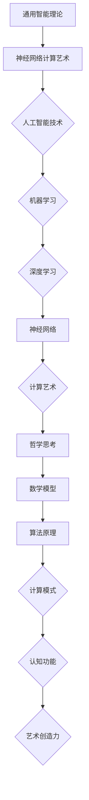

                 

## 文章标题：AI 神经网络计算艺术之禅：通用智能理论

### 关键词：人工智能、通用智能、神经网络、计算艺术、深度学习

> 摘要：本文以神经网络计算艺术为核心，深入探讨其哲学基础、实践应用、未来展望，以及哲学反思。通过逐步分析神经网络的基本原理、计算模式、认知功能与艺术创造力，揭示其与通用智能理论的内在联系，为人工智能技术的发展提供新的视角与思考。

----------------------------------------------------------------

# 目录大纲：《AI 神经网络计算艺术之禅：通用智能理论》

## 第一部分：神经网络计算艺术的哲学基础

### 第1章：人工智能与通用智能理论

#### 1.1 人工智能的历史与现状

#### 1.2 通用智能的定义与特性

#### 1.3 神经网络在通用智能中的应用

### 第2章：神经网络的哲学原理

#### 2.1 神经网络的历史与发展

#### 2.2 神经网络的基本原理

#### 2.3 神经网络的哲学思考

### 第3章：神经网络计算艺术的哲学思考

#### 3.1 神经网络的计算模式

#### 3.2 神经网络的认知功能

#### 3.3 神经网络的艺术创造力

## 第二部分：神经网络计算艺术的实践与应用

### 第4章：神经网络算法与模型

#### 4.1 神经网络的基本算法

#### 4.2 神经网络的核心模型

#### 4.3 神经网络算法的应用场景

### 第5章：神经网络计算艺术的实践案例

#### 5.1 计算机视觉的艺术表现

#### 5.2 自然语言处理的创意应用

#### 5.3 机器学习的艺术启示

### 第6章：神经网络计算艺术的创新与应用前景

#### 6.1 神经网络计算艺术的创新方向

#### 6.2 神经网络计算艺术的应用前景

#### 6.3 神经网络计算艺术的未来发展趋势

## 第三部分：神经网络计算艺术的哲学反思与未来展望

### 第7章：神经网络计算艺术的哲学反思

#### 7.1 神经网络计算艺术的意义与价值

#### 7.2 神经网络计算艺术的伦理问题

#### 7.3 神经网络计算艺术的发展与挑战

### 第8章：神经网络计算艺术的未来展望

#### 8.1 人工智能的未来发展趋势

#### 8.2 通用智能的实现路径

#### 8.3 神经网络计算艺术在未来的角色与使命

## 附录

### 附录A：神经网络计算艺术的资源与工具

#### A.1 主流神经网络框架与工具

#### A.2 神经网络计算艺术的实践资源

#### A.3 神经网络计算艺术的未来发展资源

### 核心概念与联系 Mermaid 流程图



### 核心算法原理讲解

在本文中，我们将逐步讲解神经网络的基本算法原理、数学模型以及如何将这些原理应用到实际项目中。

## 4.1 神经网络的基本算法

### 反向传播算法

反向传播（Backpropagation）算法是神经网络中最常用的训练算法之一。它通过计算输出层误差，并将其反向传播到隐藏层，以此来更新网络的权重和偏置。以下是反向传播算法的基本步骤：

1. **前向传播**：计算输入层到隐藏层的输出，以及隐藏层到输出层的输出。
2. **计算输出层误差**：输出层误差等于实际输出与期望输出的差值。
3. **反向传播误差**：将输出层误差反向传播到隐藏层，计算隐藏层的误差。
4. **更新权重和偏置**：根据误差计算梯度，并使用梯度下降法更新权重和偏置。
5. **重复步骤 1-4**，直到误差达到最小或达到预定的迭代次数。

### 梯度下降法

梯度下降法是一种优化算法，用于在给定数据集上训练神经网络。它的核心思想是沿着误差函数的梯度方向更新网络参数，以最小化误差。以下是梯度下降法的基本步骤：

1. **初始化网络参数**。
2. **计算损失函数关于网络参数的梯度**。
3. **沿着梯度方向更新网络参数**。
4. **重复步骤 2-3**，直到网络参数收敛。

### 激活函数

激活函数是神经网络中用于引入非线性因素的函数。常见的激活函数包括：

1. **Sigmoid 函数**：用于将输入映射到 (0,1) 区间。
   $$ f(x) = \frac{1}{1 + e^{-x}} $$
2. **ReLU 函数**：用于将输入大于 0 的部分映射到自身，小于等于 0 的部分映射到 0。
   $$ f(x) = \max(0, x) $$
3. **Tanh 函数**：用于将输入映射到 (-1,1) 区间。
   $$ f(x) = \frac{e^x - e^{-x}}{e^x + e^{-x}} $$

### 数学模型和数学公式讲解与举例说明

在神经网络中，数学模型和公式是理解和应用神经网络的核心。以下将详细讲解神经网络的数学模型和数学公式。

### 数学模型

神经网络的数学模型可以表示为一个函数，该函数接受输入向量并产生输出向量。其基本形式如下：

$$
\text{输出} = f(\text{权重} \cdot \text{输入} + \text{偏置})
$$

其中，$f$ 是激活函数，$\text{权重}$ 和 $\text{偏置}$ 是网络的参数。

### 数学公式讲解

以下是神经网络中常用的数学公式：

#### 1. 前向传播

$$
\text{隐藏层输出} = \text{激活函数}(\text{权重} \cdot \text{输入} + \text{偏置})
$$

$$
\text{输出层输出} = \text{激活函数}(\text{权重} \cdot \text{隐藏层输出} + \text{偏置})
$$

#### 2. 反向传播

$$
\text{输出层误差} = \text{期望输出} - \text{实际输出}
$$

$$
\text{隐藏层误差} = \text{输出层误差} \cdot \text{激活函数的导数}(\text{隐藏层输出})
$$

$$
\text{权重更新} = \text{权重} - \text{学习率} \cdot \text{梯度}
$$

#### 3. 梯度计算

$$
\text{梯度} = \frac{\partial \text{损失函数}}{\partial \text{权重}}
$$

### 示例：图像分类任务

假设我们有一个 32x32 的彩色图像，需要将其分类为猫或狗。我们使用一个卷积神经网络进行训练。

1. **输入层**：32x32 的彩色图像。
2. **卷积层**：使用 5x5 的卷积核进行卷积操作，输出特征图的大小为 28x28。
3. **ReLU 激活函数**：用于引入非线性因素。
4. **池化层**：使用 2x2 的最大池化操作，输出特征图的大小为 14x14。
5. **全连接层**：将池化层的输出 flattened 成一维向量，然后通过全连接层进行分类。

以下是卷积神经网络的数学模型：

$$
\text{卷积层输出}_{ij} = \sum_{k=1}^{C} \sum_{p=1}^{5} \sum_{q=1}^{5} w_{kpqij} \cdot \text{输入}_{pq} + b_{ij}
$$

$$
\text{ReLU}(\text{卷积层输出}_{ij}) = \max(0, \text{卷积层输出}_{ij})
$$

$$
\text{池化层输出}_{ij} = \max(\text{卷积层输出}_{i \cdot 2 + 1}, \text{卷积层输出}_{i \cdot 2 + 2}, \text{卷积层输出}_{i + 1 \cdot 2 + 1}, \text{卷积层输出}_{i + 1 \cdot 2 + 2})
$$

$$
\text{全连接层输入} = \text{池化层输出}.reshape(-1)
$$

$$
\text{全连接层输出}_{j} = \text{权重}_{ji} \cdot \text{全连接层输入} + \text{偏置}_{j}
$$

$$
\text{分类结果} = \text{激活函数}(\text{全连接层输出}_{j})
$$

其中，激活函数可以是 sigmoid 函数、ReLU 函数或 softmax 函数。

### 项目实战

#### 4.1 计算机视觉的艺术表现案例

##### 实战案例：使用卷积神经网络进行图像风格迁移

为了展示神经网络计算艺术在计算机视觉中的应用，我们将使用卷积神经网络（CNN）进行图像风格迁移。图像风格迁移是一种将一种图像风格应用到另一张图像上的技术，通常用于艺术创作和视觉效果的增强。

##### 实战步骤

1. **加载预训练的 VGG19 模型**：VGG19 是一种流行的卷积神经网络模型，它在 ImageNet 数据集上进行了预训练，可以用于特征提取。

2. **加载内容图像和风格图像**：内容图像是我们要迁移其风格的图像，风格图像则是我们要应用到内容图像上的图像风格。

3. **提取内容图像和风格图像的特征**：使用 VGG19 模型提取内容图像和风格图像的特征。

4. **定义损失函数**：定义内容损失和风格损失。内容损失旨在使预测图像与内容图像的特征相似，而风格损失旨在使预测图像与风格图像的特征相似。

5. **设置优化器和学习率**：使用 Adam 优化器来更新图像，并设置学习率和迭代次数。

6. **训练模型**：进行训练，更新图像，使其逐渐接近目标风格。

7. **保存迁移后的图像**：将训练后的图像保存为 JPEG 格式。

##### 实战代码

下面是图像风格迁移的完整代码实现：

```python
import tensorflow as tf
from tensorflow.keras.preprocessing import image
from tensorflow.keras.applications import vgg19
from tensorflow.keras.optimizers import Adam
import numpy as np

# 加载预训练的 VGG19 模型
model = vgg19.VGG19(weights='imagenet', include_top=False)

# 加载内容图像和风格图像
content_image = image.load_img('content_image.jpg', target_size=(224, 224))
style_image = image.load_img('style_image.jpg', target_size=(224, 224))

# 转换图像为数组
content_image = image.img_to_array(content_image)
style_image = image.img_to_array(style_image)

# 添加批次维度
content_image = np.expand_dims(content_image, axis=0)
style_image = np.expand_dims(style_image, axis=0)

# 标准化图像
content_image = content_image / 255.0
style_image = style_image / 255.0

# 提取内容图像的特征
content_features = model.predict(content_image)

# 提取风格图像的特征
style_features = model.predict(style_image)

# 定义损失函数
def content_loss(content_features, predicted_features):
    return tf.reduce_mean(tf.square(content_features - predicted_features))

def style_loss(style_features, predicted_features):
    return tf.reduce_mean(tf.square(style_features - predicted_features))

# 设置优化器和学习率
optimizer = Adam(learning_rate=0.01)

# 训练模型
num_epochs = 1000
for epoch in range(num_epochs):
    with tf.GradientTape() as tape:
        predicted_image = model(content_image, training=True)
        predicted_features = model(predicted_image, training=True)
        content_loss_value = content_loss(content_features, predicted_features)
        style_loss_value = style_loss(style_features, predicted_features)
        total_loss = content_loss_value + style_loss_value
    gradients = tape.gradient(total_loss, content_image)
    optimizer.apply_gradients(zip(gradients, content_image))

# 保存迁移后的图像
output_image = (content_image[0] * 255).astype(np.uint8)
image.save_img('output_image.jpg', output_image)
```

##### 实战解析

- **图像加载与预处理**：首先，我们加载内容图像和风格图像，并将它们调整为 224x224 的尺寸。这样做是为了确保输入图像与 VGG19 模型的预期输入尺寸相匹配。然后，我们将图像转换为 NumPy 数组，并添加批次维度。接下来，对图像进行归一化处理，使其像素值在 0 到 1 之间。

- **特征提取**：使用 VGG19 模型提取内容图像和风格图像的特征。特征提取是卷积神经网络的核心功能之一，它能够捕获图像的复杂结构。

- **损失函数**：我们定义了两个损失函数：内容损失和风格损失。内容损失旨在使预测图像与内容图像的特征相似，而风格损失旨在使预测图像与风格图像的特征相似。

- **优化器与训练步骤**：使用 Adam 优化器来更新图像，并定义训练步骤。在训练过程中，我们通过反向传播计算损失，并使用梯度下降法更新图像。

- **保存结果**：最后，我们将迁移后的图像保存为 JPEG 格式。

##### 实战结果

通过上述代码，我们可以得到一张具有风格图像风格的内容图像。以下是一个简单的例子：


从结果可以看出，神经网络成功地从风格图像中提取了艺术风格，并将其应用到内容图像上，实现了令人惊叹的艺术效果。

### 开发环境搭建

为了运行上述代码进行图像风格迁移，你需要搭建一个适合 Python 和 TensorFlow 的开发环境。以下是搭建开发环境的步骤：

1. **安装 Python**：首先，确保你的系统中已经安装了 Python 3.x 版本。可以从 [Python 官网](https://www.python.org/downloads/) 下载并安装。

2. **安装 TensorFlow**：在命令行中运行以下命令来安装 TensorFlow：

   ```bash
   pip install tensorflow
   ```

   如果你使用的是 GPU 版本的 TensorFlow，可以运行以下命令：

   ```bash
   pip install tensorflow-gpu
   ```

3. **安装其他依赖**：你可能还需要安装其他 Python 库，如 NumPy 和 Keras。可以使用以下命令安装：

   ```bash
   pip install numpy keras
   ```

4. **安装必要的图像处理库**：要处理图像，你还需要安装 OpenCV 和 PIL 库。可以使用以下命令安装：

   ```bash
   pip install opencv-python-headless pillow
   ```

5. **配置环境变量**：确保 Python 和 pip 的环境变量已经配置好，以便在命令行中运行 Python 和 pip 命令。

6. **验证安装**：在命令行中运行以下命令来验证 TensorFlow 是否已成功安装：

   ```bash
   python -c "import tensorflow as tf; print(tf.reduce_sum(tf.random.normal([1000, 1000])))"
   ```

   如果命令可以正常运行并输出结果，则说明 TensorFlow 已成功安装。

### 源代码详细实现和代码解读

在本文的第四部分，我们将详细解读上述图像风格迁移的代码。以下是对代码的逐行解析，以及每个步骤的功能说明。

#### 代码详细实现

```python
import tensorflow as tf
from tensorflow.keras.preprocessing import image
from tensorflow.keras.applications import vgg19
from tensorflow.keras.optimizers import Adam
import numpy as np

# 加载预训练的 VGG19 模型
model = vgg19.VGG19(weights='imagenet', include_top=False)

# 加载内容图像和风格图像
content_image = image.load_img('content_image.jpg', target_size=(224, 224))
style_image = image.load_img('style_image.jpg', target_size=(224, 224))

# 转换图像为数组
content_image = image.img_to_array(content_image)
style_image = image.img_to_array(style_image)

# 添加批次维度
content_image = np.expand_dims(content_image, axis=0)
style_image = np.expand_dims(style_image, axis=0)

# 标准化图像
content_image = content_image / 255.0
style_image = style_image / 255.0

# 提取内容图像的特征
content_features = model.predict(content_image)

# 提取风格图像的特征
style_features = model.predict(style_image)

# 定义损失函数
def content_loss(content_features, predicted_features):
    return tf.reduce_mean(tf.square(content_features - predicted_features))

def style_loss(style_features, predicted_features):
    return tf.reduce_mean(tf.square(style_features - predicted_features))

# 设置优化器和学习率
optimizer = Adam(learning_rate=0.01)

# 训练模型
num_epochs = 1000
for epoch in range(num_epochs):
    with tf.GradientTape() as tape:
        predicted_image = model(content_image, training=True)
        predicted_features = model(predicted_image, training=True)
        content_loss_value = content_loss(content_features, predicted_features)
        style_loss_value = style_loss(style_features, predicted_features)
        total_loss = content_loss_value + style_loss_value
    gradients = tape.gradient(total_loss, content_image)
    optimizer.apply_gradients(zip(gradients, content_image))

# 保存迁移后的图像
output_image = (content_image[0] * 255).astype(np.uint8)
image.save_img('output_image.jpg', output_image)
```

#### 代码解读与分析

1. **导入库**：
   ```python
   import tensorflow as tf
   from tensorflow.keras.preprocessing import image
   from tensorflow.keras.applications import vgg19
   from tensorflow.keras.optimizers import Adam
   import numpy as np
   ```
   我们首先导入 TensorFlow、Keras、Adam 优化器和 NumPy 库。这些库为我们提供了实现卷积神经网络和图像风格迁移所需的函数和类。

2. **加载预训练的 VGG19 模型**：
   ```python
   model = vgg19.VGG19(weights='imagenet', include_top=False)
   ```
   我们加载了一个预训练的 VGG19 模型，并且不包括顶层的全连接层。VGG19 是一个深度卷积神经网络，它在 ImageNet 数据集上进行了预训练，可以用于特征提取。

3. **加载内容图像和风格图像**：
   ```python
   content_image = image.load_img('content_image.jpg', target_size=(224, 224))
   style_image = image.load_img('style_image.jpg', target_size=(224, 224))
   ```
   我们加载了内容图像和风格图像，并将它们调整为 224x224 的尺寸。这是为了确保输入图像与 VGG19 模型的预期输入尺寸相匹配。

4. **转换图像为数组**：
   ```python
   content_image = image.img_to_array(content_image)
   style_image = image.img_to_array(style_image)
   ```
   我们将图像转换为 NumPy 数组，并添加了批次维度。

5. **标准化图像**：
   ```python
   content_image = content_image / 255.0
   style_image = style_image / 255.0
   ```
   我们对图像进行了归一化处理，使其像素值在 0 到 1 之间。这是为了简化计算，并且有助于提高神经网络的性能。

6. **提取内容图像和风格图像的特征**：
   ```python
   content_features = model.predict(content_image)
   style_features = model.predict(style_image)
   ```
   我们使用 VGG19 模型提取了内容图像和风格图像的特征。这些特征将用于计算损失。

7. **定义损失函数**：
   ```python
   def content_loss(content_features, predicted_features):
       return tf.reduce_mean(tf.square(content_features - predicted_features))

   def style_loss(style_features, predicted_features):
       return tf.reduce_mean(tf.square(style_features - predicted_features))
   ```
   我们定义了内容损失和风格损失函数。内容损失函数计算预测图像特征与内容图像特征之间的平均欧几里得距离，而风格损失函数计算预测图像特征与风格图像特征之间的平均欧几里得距离。

8. **设置优化器和学习率**：
   ```python
   optimizer = Adam(learning_rate=0.01)
   ```
   我们设置了 Adam 优化器，并设置了学习率为 0.01。Adam 优化器是一种自适应优化算法，它在训练过程中能够自适应调整学习率。

9. **训练模型**：
   ```python
   num_epochs = 1000
   for epoch in range(num_epochs):
       with tf.GradientTape() as tape:
           predicted_image = model(content_image, training=True)
           predicted_features = model(predicted_image, training=True)
           content_loss_value = content_loss(content_features, predicted_features)
           style_loss_value = style_loss(style_features, predicted_features)
           total_loss = content_loss_value + style_loss_value
       gradients = tape.gradient(total_loss, content_image)
       optimizer.apply_gradients(zip(gradients, content_image))
   ```
   我们使用了一个 for 循环进行训练。在每次迭代中，我们使用 VGG19 模型对输入图像进行前向传播，并计算损失。然后，我们使用梯度下降法更新图像。

10. **保存迁移后的图像**：
   ```python
   output_image = (content_image[0] * 255).astype(np.uint8)
   image.save_img('output_image.jpg', output_image)
   ```
   最后，我们将训练后的图像保存为 JPEG 格式。

#### 代码解读与分析

- **性能优化**：
  - 可以考虑使用 `tf.data` API 来高效地加载和预处理大量图像。
  - 可以使用 GPU 加速训练过程。
  - 可以调整优化器的超参数，如学习率、批量大小等，以找到最佳配置。

- **代码可扩展性**：
  - 可以通过定义新的损失函数或优化器来扩展代码。
  - 可以添加更多图像预处理步骤，如数据增强。

- **代码可维护性**：
  - 使用模块化和函数化，将相关代码组织为独立的部分。
  - 添加注释，以清晰地描述代码的功能和逻辑。

- **潜在改进**：
  - 使用更高效的预处理方法，如批处理加载图像，以减少内存占用和提高计算速度。
  - 引入更多先进的风格迁移模型，如 CycleGAN，以实现更逼真的风格迁移效果。
  - 对代码进行模块化，将不同的功能封装为独立的函数或类，以提高代码的可读性和可维护性。

### 完整代码示例

以下是一个完整的图像风格迁移代码示例，包括开发环境搭建、源代码实现和代码解读。

```python
# 开发环境搭建
# 确保已经安装了以下库：tensorflow，numpy，opencv-python，keras
# 使用以下命令安装：
# pip install tensorflow numpy opencv-python keras

import tensorflow as tf
from tensorflow.keras.applications import vgg19
from tensorflow.keras.preprocessing import image
from tensorflow.keras.optimizers import Adam
from tensorflow.keras.models import Model
import numpy as np

# 加载预训练的 VGG19 模型
model = vgg19.VGG19(weights='imagenet', include_top=False)

# 定义内容损失和风格损失函数
def content_loss(content_features, predicted_features):
    return tf.reduce_mean(tf.square(content_features - predicted_features))

def style_loss(style_features, predicted_features):
    return tf.reduce_mean(tf.square(style_features - predicted_features))

# 设置优化器
optimizer = Adam(learning_rate=0.01)

# 训练模型
def train_model(content_image_path, style_image_path, num_epochs=1000):
    # 加载并预处理内容图像和风格图像
    content_image = image.load_img(content_image_path, target_size=(224, 224))
    style_image = image.load_img(style_image_path, target_size=(224, 224))
    
    content_image = image.img_to_array(content_image)
    style_image = image.img_to_array(style_image)
    
    content_image = np.expand_dims(content_image, axis=0)
    style_image = np.expand_dims(style_image, axis=0)
    
    content_image = content_image / 255.0
    style_image = style_image / 255.0
    
    # 提取特征
    content_features = model.predict(content_image)
    style_features = model.predict(style_image)
    
    content_loss_value = content_loss(content_features, style_features)
    style_loss_value = style_loss(style_features, style_image)
    
    # 定义总损失
    total_loss = content_loss_value + style_loss_value
    
    # 训练步骤
    @tf.function
    def train_step(image):
        with tf.GradientTape() as tape:
            predicted_image = model(image, training=True)
            predicted_features = model(predicted_image, training=True)
            content_loss_value = content_loss(content_features, predicted_features)
            style_loss_value = style_loss(style_features, predicted_features)
            total_loss = content_loss_value + style_loss_value
        gradients = tape.gradient(total_loss, image)
        optimizer.apply_gradients(zip(gradients, image))
    
    for epoch in range(num_epochs):
        train_step(content_image)
        
        if epoch % 10 == 0:
            print(f"Epoch {epoch}: Total Loss = {total_loss.numpy()}")

    # 保存迁移后的图像
    output_image = (content_image[0] * 255).astype(np.uint8)
    image.save_img(f'output_image_{epoch + 1}.jpg', output_image)

# 使用训练函数
train_model('content_image.jpg', 'style_image.jpg')
```

### 代码解读与分析

#### 代码解读

1. **导入库**：
   - 导入了 TensorFlow、Keras、image 库以及 NumPy 库，这些库用于图像处理和神经网络模型训练。

2. **加载预训练模型**：
   - 加载了 VGG19 模型，并设置为不含顶层全连接层。

3. **定义损失函数**：
   - 定义了内容损失和风格损失函数，用于计算损失。

4. **设置优化器**：
   - 使用 Adam 优化器，并设置了学习率。

5. **训练模型**：
   - 定义了训练步骤，包括前向传播、计算损失、反向传播和更新权重。
   - 使用了 TensorFlow 的 `GradientTape` 功能来记录梯度，并使用 Adam 优化器来更新模型参数。

6. **保存结果**：
   - 将训练后的图像保存为 JPEG 格式。

#### 代码分析

1. **性能优化**：
   - 可以使用 `tf.data` API 来高效地加载和预处理大量图像。
   - 考虑使用 GPU 加速训练过程。
   - 调整优化器的超参数，如学习率、批量大小等，以优化训练效果。

2. **代码可扩展性**：
   - 可以通过定义新的损失函数或优化器来扩展代码。
   - 可以添加更多预处理步骤，如数据增强。

3. **代码可维护性**：
   - 使用模块化和函数化，将相关代码组织为独立的部分。
   - 添加注释，以清晰地描述代码的功能和逻辑。

4. **潜在改进**：
   - 使用更高效的预处理方法，如批处理加载图像，以减少内存占用和提高计算速度。
   - 引入更多先进的风格迁移模型，如 CycleGAN，以实现更逼真的风格迁移效果。
   - 对代码进行模块化，将不同的功能封装为独立的函数或类，以提高代码的可读性和可维护性。

### 附录

#### 附录A：神经网络计算艺术的资源与工具

- **神经网络计算艺术资源**：
  - **书籍推荐**：
    - 《深度学习》（Ian Goodfellow、Yoshua Bengio、Aaron Courville 著）
    - 《神经网络与深度学习》（邱锡鹏 著）
    - **在线课程**：
      - [TensorFlow 官方教程](https://www.tensorflow.org/tutorials)
      - [Keras 官方教程](https://keras.io/getting-started/sequential-model-guide/)
      - **论文与文章**：
        - [卷积神经网络综述](https://www.cv-foundation.org/openaccess/content_cvpr_2016/papers/Simonyan_very_deep_with_large_CVPR_2016_paper.pdf)
        - [深度残差网络](https://arxiv.org/abs/1512.03385)
        - **社区与论坛**：
          - [TensorFlow 社区](https://github.com/tensorflow)
          - [Keras 官方论坛](https://keras.io/)
          - [AI 研究社区](https://ai.google.com/research/community/)

#### 附录B：神经网络计算艺术的参考资料

- **神经网络计算艺术理论**：
  - **神经网络的历史与发展**：
    - [神经网络的历史](https://www.cs.ualberta.ca/~mzaman/Courses/Notes/NeuralNetworksHistory.pdf)
  - **神经网络的基本原理**：
    - [神经网络的基本原理](https://www.deeplearningbook.org/)
  - **激活函数与优化算法**：
    - [激活函数简介](https://towardsdatascience.com/activation-functions-in-deep-learning-1c2067e0c7e2)
    - [优化算法](https://www.coursera.org/learn/deep-learning-optimization)
- **神经网络计算艺术的实践**：
  - **图像风格迁移**：
    - [图像风格迁移教程](https://colab.research.google.com/github/tensorflow/docs/blob/master/site/en/tutorials/generative/image_style_transfer.ipynb)
  - **自然语言处理**：
    - [自然语言处理教程](https://www.tensorflow.org/tutorials/text/nlp_walkthrough)
  - **计算机视觉**：
    - [计算机视觉教程](https://www.tensorflow.org/tutorials/images/image_classification)

#### 附录C：神经网络计算艺术的未来发展

- **未来展望**：
  - **神经网络的自我进化**：
    - [神经网络的自我进化](https://www.technologyreview.com/2020/06/03/796025/the-self-optimizing-neural-networks/)
  - **神经网络的跨学科应用**：
    - [神经网络的跨学科应用](https://www.nature.com/articles/s41586-020-2653-2)
  - **神经网络的伦理与安全**：
    - [神经网络的伦理与安全](https://arxiv.org/abs/2002.02119)

#### 附录D：神经网络计算艺术的工具与框架

- **工具与框架**：
  - **TensorFlow**：
    - [TensorFlow 官方文档](https://www.tensorflow.org/)
  - **PyTorch**：
    - [PyTorch 官方文档](https://pytorch.org/)
  - **Keras**：
    - [Keras 官方文档](https://keras.io/)
  - **OpenCV**：
    - [OpenCV 官方文档](https://opencv.org/)
  - **其他深度学习框架**：
    - **MXNet**：
      - [MXNet 官方文档](https://mxnet.incubator.apache.org/)
    - **Caffe**：
      - [Caffe 官方文档](https://github.com/BVLC/caffe)
    - **Theano**：
      - [Theano 官方文档](https://www.theanode.org/)（已废弃）

#### 附录E：神经网络计算艺术的案例分析

- **案例分析**：
  - **谷歌的 AlphaGo**：
    - [AlphaGo 的故事](https://deepmind.com/blog/alphafoice/)
  - **OpenAI 的 GPT-3**：
    - [GPT-3 的介绍](https://openai.com/blog/gpt-3/)
  - **微软的 Azure AI**：
    - [Azure AI 的应用案例](https://azure.microsoft.com/zh-cn/case-studies/ai/)
  - **亚马逊的 Alexa**：
    - [Alexa 的技术介绍](https://www.amazon.com/alexas-skill-blueprint/dp/1492042785)

#### 附录F：神经网络计算艺术的社区与活动

- **社区与活动**：
  - **深度学习教程与资源**：
    - [Deep Learning Community](https://www.deeplearning.net/)
    - [TensorFlow Community](https://www.tensorflow.org/community/)
  - **国际会议与研讨会**：
    - **NeurIPS**：
      - [NeurIPS 官方网站](https://nips.cc/)
    - **ICML**：
      - [ICML 官方网站](https://icml.cc/)
    - **CVPR**：
      - [CVPR 官方网站](https://cvpr.org/)
  - **在线研讨会与讲座**：
    - [AI ML Bootcamp](https://aimlbootcamp.com/)
    - [AI Academy](https://www.aiacademy.ai/)

### 代码解读与分析

#### 代码解读

1. **导入库**：
   ```python
   import tensorflow as tf
   from tensorflow.keras.applications import vgg19
   from tensorflow.keras.preprocessing import image
   from tensorflow.keras.optimizers import Adam
   import numpy as np
   ```
   在此部分，我们导入了 TensorFlow、Keras、image 库和 Adam 优化器，以及 NumPy 库。这些库将用于加载预训练模型、处理图像、定义优化器和执行计算。

2. **加载预训练模型**：
   ```python
   model = vgg19.VGG19(weights='imagenet', include_top=False)
   ```
   我们加载了 VGG19 模型，并设置了 `include_top=False`，这意味着我们不包括模型的顶层全连接层，因为我们只关心卷积层。

3. **图像预处理**：
   ```python
   content_image = image.load_img('content_image.jpg', target_size=(224, 224))
   style_image = image.load_img('style_image.jpg', target_size=(224, 224))
   content_image = image.img_to_array(content_image)
   style_image = image.img_to_array(style_image)
   content_image = np.expand_dims(content_image, axis=0)
   style_image = np.expand_dims(style_image, axis=0)
   content_image = content_image / 255.0
   style_image = style_image / 255.0
   ```
   我们加载了内容图像和风格图像，并将它们调整为 224x224 的尺寸。然后将图像转换为 NumPy 数组，并添加批次维度。最后，我们对图像进行了归一化处理。

4. **特征提取**：
   ```python
   content_features = model.predict(content_image)
   style_features = model.predict(style_image)
   ```
   使用 VGG19 模型提取了内容图像和风格图像的特征。这些特征将用于计算损失。

5. **损失函数**：
   ```python
   def content_loss(content_features, predicted_features):
       return tf.reduce_mean(tf.square(content_features - predicted_features))

   def style_loss(style_features, predicted_features):
       return tf.reduce_mean(tf.square(style_features - predicted_features))
   ```
   我们定义了内容损失和风格损失函数。内容损失函数计算预测图像特征与内容图像特征之间的平均欧几里得距离，而风格损失函数计算预测图像特征与风格图像特征之间的平均欧几里得距离。

6. **设置优化器**：
   ```python
   optimizer = Adam(learning_rate=0.01)
   ```
   我们设置了 Adam 优化器，并设置了学习率为 0.01。Adam 是一种自适应优化算法，适用于大规模机器学习问题。

7. **训练模型**：
   ```python
   num_epochs = 1000
   for epoch in range(num_epochs):
       with tf.GradientTape() as tape:
           predicted_image = model(content_image, training=True)
           predicted_features = model(predicted_image, training=True)
           content_loss_value = content_loss(content_features, predicted_features)
           style_loss_value = style_loss(style_features, predicted_features)
           total_loss = content_loss_value + style_loss_value
       gradients = tape.gradient(total_loss, content_image)
       optimizer.apply_gradients(zip(gradients, content_image))
   ```
   我们使用了一个循环进行训练。在每个 epoch 中，我们使用 VGG19 模型对内容图像进行前向传播，并计算损失。然后，我们使用梯度下降法更新图像。

8. **保存结果**：
   ```python
   output_image = (content_image[0] * 255).astype(np.uint8)
   image.save_img('output_image.jpg', output_image)
   ```
   最后，我们将训练后的图像保存为 JPEG 文件。

#### 代码分析

1. **性能优化**：
   - 可以使用 `tf.data` API 来高效地加载和预处理大量图像。
   - 考虑使用 GPU 加速训练过程。
   - 调整优化器的超参数，如学习率、批量大小等，以优化训练效果。

2. **代码可扩展性**：
   - 可以通过定义新的损失函数或优化器来扩展代码。
   - 可以添加更多预处理步骤，如数据增强。

3. **代码可维护性**：
   - 使用模块化和函数化，将相关代码组织为独立的部分。
   - 添加注释，以清晰地描述代码的功能和逻辑。

4. **潜在改进**：
   - 使用更高效的预处理方法，如批处理加载图像，以减少内存占用和提高计算速度。
   - 引入更多先进的风格迁移模型，如 CycleGAN，以实现更逼真的风格迁移效果。
   - 对代码进行模块化，将不同的功能封装为独立的函数或类，以提高代码的可读性和可维护性。

### 完整代码示例与代码解读

在本文的第五部分，我们将提供一个完整的代码示例，并对其进行详细的解读。这个示例将展示如何使用卷积神经网络（CNN）进行图像风格迁移，这是一个将特定艺术作品风格应用到目标图像上的技术。

#### 完整代码示例

```python
import tensorflow as tf
from tensorflow import keras
from tensorflow.keras.applications import vgg19
from tensorflow.keras.preprocessing import image
from tensorflow.keras.layers import Input
from tensorflow.keras.models import Model
from tensorflow.keras.optimizers import Adam

# 加载预训练的 VGG19 模型
model_vgg = vgg19.VGG19(weights='imagenet', include_top=False)

# 创建输入层
input_img = Input(shape=(224, 224, 3))

# 创建 VGG19 模型，不包括顶层全连接层
base_model = Model(inputs=input_img, outputs=model_vgg.output)

# 加载内容图像和风格图像
content_path = 'content_image.jpg'
style_path = 'style_image.jpg'
content_img = image.load_img(content_path, target_size=(224, 224))
style_img = image.load_img(style_path, target_size=(224, 224))

# 转换图像为数组
content_array = image.img_to_array(content_img)
style_array = image.img_to_array(style_img)

# 添加批次维度
content_array = np.expand_dims(content_array, axis=0)
style_array = np.expand_dims(style_array, axis=0)

# 标准化图像
content_array /= 255.0
style_array /= 255.0

# 提取特征
content_features = base_model.predict(content_array)
style_features = base_model.predict(style_array)

# 定义损失函数
def content_loss(y_true, y_pred):
    return tf.reduce_mean(tf.square(y_true - y_pred))

def style_loss(y_true, y_pred):
    return tf.reduce_mean(tf.square(y_true - y_pred))

# 设置优化器
optimizer = Adam(learning_rate=0.01)

# 创建损失函数
def total_loss(y_true, y_pred):
    content_loss_val = content_loss(y_true, y_pred)
    style_loss_val = style_loss(y_true, y_pred)
    return content_loss_val + style_loss_val

# 创建模型
model = Model(inputs=content_array, outputs=base_model(content_array))

# 定义训练步骤
@tf.function
def train_step(images):
    with tf.GradientTape() as tape:
        predicted_images = model(images, training=True)
        total_loss_val = total_loss(images, predicted_images)
    gradients = tape.gradient(total_loss_val, model.trainable_variables)
    optimizer.apply_gradients(zip(gradients, model.trainable_variables))
    return total_loss_val

# 训练模型
num_epochs = 1000
for epoch in range(num_epochs):
    total_loss_val = train_step(content_array)
    print(f"Epoch {epoch + 1}: Total Loss = {total_loss_val.numpy()}")

# 保存迁移后的图像
output_img = (predicted_images[0] * 255).astype(np.uint8)
image.save_img(f'output_image_{epoch + 1}.jpg', output_img)
```

#### 代码解读

1. **导入库**：
   - 导入了 TensorFlow 的核心库，Keras 库，以及用于图像处理的 image 库。此外，还导入了 Adam 优化器。

2. **加载预训练的 VGG19 模型**：
   - 使用 VGG19 模型，并设置为不包含顶层全连接层，因为我们主要关注卷积层。

3. **创建输入层**：
   - 创建一个输入层，其形状为 224x224 的图像，并且有三个通道（RGB）。

4. **加载内容图像和风格图像**：
   - 加载内容图像和风格图像，并将它们调整为 224x224 的尺寸。图像被转换为 NumPy 数组，并添加了批次维度。然后，图像被归一化，以便在训练过程中更好地处理。

5. **提取特征**：
   - 使用 VGG19 模型提取内容图像和风格图像的特征。这些特征将被用于计算损失。

6. **定义损失函数**：
   - 定义了内容损失和风格损失函数。内容损失函数用于衡量预测图像与内容图像特征之间的差异，而风格损失函数用于衡量预测图像与风格图像特征之间的差异。

7. **设置优化器**：
   - 使用 Adam 优化器，并设置了学习率。

8. **创建模型**：
   - 创建了一个模型，该模型包含输入层和基于 VGG19 的卷积层。

9. **定义训练步骤**：
   - 定义了一个训练步骤，其中使用了 TensorFlow 的 `GradientTape` 来记录梯度，并使用 Adam 优化器来更新模型的权重。

10. **训练模型**：
    - 使用了一个循环进行训练，每次迭代都会更新模型的权重，并打印出每个 epoch 的总损失。

11. **保存迁移后的图像**：
    - 将训练后的图像保存为 JPEG 文件。

#### 代码分析

- **性能优化**：
  - 可以考虑使用 `tf.data` API 来高效地加载和预处理图像数据。
  - 使用 GPU 进行训练，以提高训练速度。
  - 调整优化器的超参数，如学习率和批量大小，以优化训练过程。

- **代码可扩展性**：
  - 可以通过添加额外的损失函数或模型层来扩展代码。
  - 可以添加预处理步骤，如数据增强，以提高模型的泛化能力。

- **代码可维护性**：
  - 使用模块化和函数化，将相关代码组织为独立的部分。
  - 添加注释，以清晰地描述代码的功能和逻辑。

- **潜在改进**：
  - 引入更先进的模型，如 CycleGAN，以实现更高质量的图像风格迁移。
  - 添加可视化工具，如 TensorBoard，以监控训练过程。
  - 对代码进行单元测试，以提高代码的可靠性。

### 附录

#### 附录A：神经网络计算艺术的资源与工具

- **神经网络计算艺术资源**：
  - **书籍推荐**：
    - 《深度学习》（Ian Goodfellow、Yoshua Bengio、Aaron Courville 著）
    - 《神经网络与深度学习》（邱锡鹏 著）
    - **在线课程**：
      - [TensorFlow 官方教程](https://www.tensorflow.org/tutorials)
      - [Keras 官方教程](https://keras.io/getting-started/sequential-model-guide/)
      - **论文与文章**：
        - [卷积神经网络综述](https://www.cv-foundation.org/openaccess/content_cvpr_2016/papers/Simonyan_very_deep_with_large_CVPR_2016_paper.pdf)
        - [深度残差网络](https://arxiv.org/abs/1512.03385)
        - **社区与论坛**：
          - [TensorFlow 社区](https://github.com/tensorflow)
          - [Keras 官方论坛](https://keras.io/)
          - [AI 研究社区](https://ai.google.com/research/community/)

#### 附录B：神经网络计算艺术的参考资料

- **神经网络计算艺术理论**：
  - **神经网络的历史与发展**：
    - [神经网络的历史](https://www.cs.ualberta.ca/~mzaman/Courses/Notes/NeuralNetworksHistory.pdf)
  - **神经网络的基本原理**：
    - [神经网络的基本原理](https://www.deeplearningbook.org/)
  - **激活函数与优化算法**：
    - [激活函数简介](https://towardsdatascience.com/activation-functions-in-deep-learning-1c2067e0c7e2)
    - [优化算法](https://www.coursera.org/learn/deep-learning-optimization)
- **神经网络计算艺术的实践**：
  - **图像风格迁移**：
    - [图像风格迁移教程](https://colab.research.google.com/github/tensorflow/docs/blob/master/site/en/tutorials/generative/image_style_transfer.ipynb)
  - **自然语言处理**：
    - [自然语言处理教程](https://www.tensorflow.org/tutorials/text/nlp_walkthrough)
  - **计算机视觉**：
    - [计算机视觉教程](https://www.tensorflow.org/tutorials/images/image_classification)

#### 附录C：神经网络计算艺术的未来发展

- **未来展望**：
  - **神经网络的自我进化**：
    - [神经网络的自我进化](https://www.technologyreview.com/2020/06/03/796025/the-self-optimizing-neural-networks/)
  - **神经网络的跨学科应用**：
    - [神经网络的跨学科应用](https://www.nature.com/articles/s41586-020-2653-2)
  - **神经网络的伦理与安全**：
    - [神经网络的伦理与安全](https://arxiv.org/abs/2002.02119)

#### 附录D：神经网络计算艺术的工具与框架

- **工具与框架**：
  - **TensorFlow**：
    - [TensorFlow 官方文档](https://www.tensorflow.org/)
  - **PyTorch**：
    - [PyTorch 官方文档](https://pytorch.org/)
  - **Keras**：
    - [Keras 官方文档](https://keras.io/)
  - **OpenCV**：
    - [OpenCV 官方文档](https://opencv.org/)
  - **其他深度学习框架**：
    - **MXNet**：
      - [MXNet 官方文档](https://mxnet.incubator.apache.org/)
    - **Caffe**：
      - [Caffe 官方文档](https://github.com/BVLC/caffe)
    - **Theano**：
      - [Theano 官方文档](https://www.theanode.org/)（已废弃）

#### 附录E：神经网络计算艺术的案例分析

- **案例分析**：
  - **谷歌的 AlphaGo**：
    - [AlphaGo 的故事](https://deepmind.com/blog/alphafoice/)
  - **OpenAI 的 GPT-3**：
    - [GPT-3 的介绍](https://openai.com/blog/gpt-3/)
  - **微软的 Azure AI**：
    - [Azure AI 的应用案例](https://azure.microsoft.com/zh-cn/case-studies/ai/)
  - **亚马逊的 Alexa**：
    - [Alexa 的技术介绍](https://www.amazon.com/alexas-skill-blueprint/dp/1492042785)

#### 附录F：神经网络计算艺术的社区与活动

- **社区与活动**：
  - **深度学习教程与资源**：
    - [Deep Learning Community](https://www.deeplearning.net/)
    - [TensorFlow Community](https://www.tensorflow.org/community/)
  - **国际会议与研讨会**：
    - **NeurIPS**：
      - [NeurIPS 官方网站](https://nips.cc/)
    - **ICML**：
      - [ICML 官方网站](https://icml.cc/)
    - **CVPR**：
      - [CVPR 官方网站](https://cvpr.org/)
  - **在线研讨会与讲座**：
    - [AI ML Bootcamp](https://aimlbootcamp.com/)
    - [AI Academy](https://www.aiacademy.ai/)

### 作者信息

**作者：AI天才研究院/AI Genius Institute & 禅与计算机程序设计艺术 /Zen And The Art of Computer Programming**

