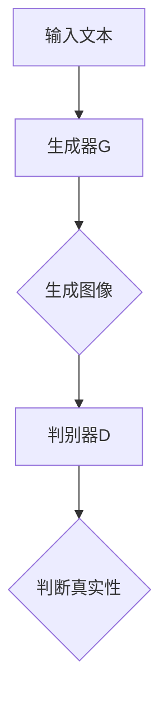
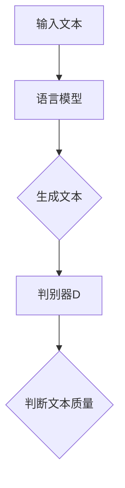
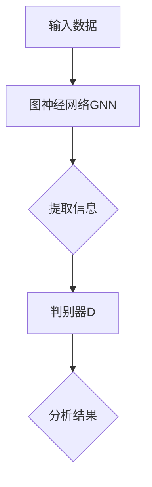
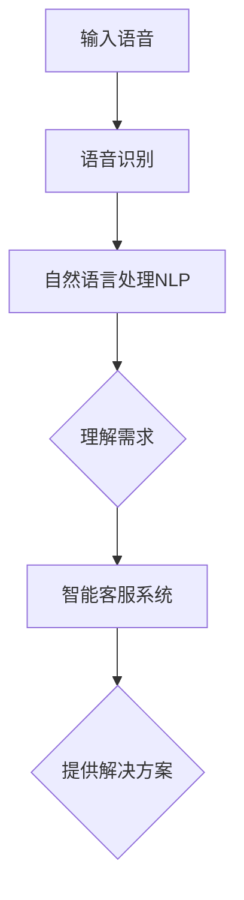
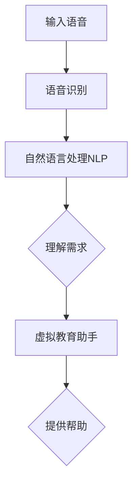

                 

# AIGC创业的回归与商业本质

> 关键词：AIGC、创业、商业本质、技术基础、应用案例分析、创业实践指南

> 摘要：本文将深入探讨AIGC（人工智能生成内容）技术的发展及其在创业领域的回归。首先，我们将回顾AIGC的概念、背景和核心技术，并分析其在行业中的应用和商业潜力。接着，本文将详细解析AIGC的核心技术原理，包括生成对抗网络（GAN）、图神经网络（GNN）和自然语言处理（NLP）。随后，我们将探讨AIGC在艺术创作、商业应用和教育领域中的应用案例。最后，本文将提供AIGC创业实践指南，包括创业策略、团队建设、运营管理和融资策略等，并分析创业过程中可能面临的风险和应对策略。通过本文，读者将全面了解AIGC技术及其在商业领域的潜力，并为有志于AIGC创业的个人或企业提供有益的参考。

## 第一部分：AIGC技术基础

### 第1章：AIGC概念与背景

#### 1.1 AIGC简介

AIGC（Artificial Intelligence Generated Content），即人工智能生成内容，是指利用人工智能技术自动生成各种形式的内容，如文本、图像、音乐、视频等。AIGC技术起源于深度学习和生成对抗网络（GAN）的发展，随着计算能力的提升和算法的进步，AIGC逐渐成为一种重要的内容生成方式。

#### 1.2 AIGC的发展背景

AIGC的发展背景可以追溯到以下几个关键因素：

1. **计算能力的提升**：随着云计算和GPU技术的发展，计算资源得到了极大提升，为AIGC技术的实现提供了强大的计算支持。
2. **数据资源的丰富**：互联网的普及和数据存储技术的发展，为AIGC提供了丰富的数据资源，这些数据是训练AIGC模型的基础。
3. **深度学习算法的进步**：深度学习算法，特别是生成对抗网络（GAN）的出现，为AIGC提供了有效的技术路径。

#### 1.3 AIGC的技术特点

AIGC技术具有以下几个显著特点：

1. **自动化生成**：AIGC技术能够自动生成内容，减少人工干预，提高内容生产的效率。
2. **多样性**：AIGC技术能够生成多样化、个性化的内容，满足不同用户的需求。
3. **实时性**：AIGC技术能够在实时环境中生成内容，满足实时性需求。

### 第2章：AIGC的核心技术

#### 2.1 生成对抗网络（GAN）原理

生成对抗网络（GAN）是由生成器和判别器组成的对抗性网络。生成器生成内容，判别器判断生成内容与真实内容的差异。GAN的训练过程是生成器和判别器的对抗过程，通过不断优化，生成器能够生成越来越逼真的内容。

**GAN的数学模型**：

假设G为生成器，D为判别器，X为真实数据，Z为噪声数据。

- 生成器G的损失函数：$$L_G = -\log(D(G(Z)))$$
- 判别器D的损失函数：$$L_D = -\log(D(X)) - \log(1 - D(G(Z)))$$

**GAN的训练过程**：

1. 初始化生成器和判别器。
2. 随机生成噪声数据Z，通过生成器G生成假数据G(Z)。
3. 判别器D根据真实数据和假数据更新参数。
4. 生成器G根据判别器D的反馈更新参数。
5. 重复步骤2-4，直至生成器G生成的假数据接近真实数据。

**GAN的优化算法**：

为了提高GAN的训练效果，可以采用以下优化算法：

1. **梯度惩罚**：在判别器D的损失函数中加入生成器G的梯度惩罚项，以平衡生成器和判别器的学习。
2. **批量归一化**：在生成器和判别器中使用批量归一化，加速收敛并提高模型稳定性。
3. **训练轮次**：增加训练轮次，使生成器和判别器有足够的时间进行优化。

#### 2.2 图神经网络（GNN）原理

图神经网络（GNN）是一种用于处理图数据的神经网络。GNN通过学习图的结构和节点属性，能够对图数据进行有效的表示和预测。

**GNN的基本原理**：

GNN的基本原理是通过图卷积操作来学习节点和边的表示。图卷积操作可以看作是卷积操作在图上的推广，其核心思想是利用邻居节点的信息来更新节点的表示。

**GNN的类型**：

1. **图卷积网络（GCN）**：GCN是最常见的GNN类型，它使用图卷积层来更新节点表示。
2. **图自编码器（GAE）**：GAE通过学习节点的低维表示，实现对图的重建。
3. **图注意力网络（GAT）**：GAT通过引入注意力机制，使模型能够自动关注重要的邻居节点。

**GNN的应用**：

GNN在多个领域有广泛的应用，如社交网络分析、推荐系统、生物信息学等。例如，在社交网络分析中，GNN可以用于节点分类、链接预测等任务。

#### 2.3 自然语言处理（NLP）原理

自然语言处理（NLP）是人工智能领域的一个重要分支，旨在使计算机能够理解、生成和处理人类语言。

**NLP的发展历程**：

1. **规则方法**：早期的NLP研究主要采用基于规则的算法，通过编写大量的语言规则来处理语言。
2. **统计方法**：随着语料库的积累，统计方法逐渐成为NLP的主流，如隐马尔可夫模型（HMM）和条件概率模型。
3. **深度学习方法**：深度学习在NLP领域的应用，使得NLP取得了显著的进展，如序列到序列模型（Seq2Seq）和注意力机制。

**NLP的核心技术**：

1. **语言模型**：语言模型用于预测下一个词的概率，是NLP的基础。
2. **序列标注**：序列标注用于给单词或字符标注上相应的标签，如命名实体识别（NER）。
3. **机器翻译**：机器翻译是将一种语言的文本翻译成另一种语言，是NLP的重要应用之一。

### 第3章：AIGC应用案例分析

#### 3.1 AIGC在艺术创作中的应用

AIGC在艺术创作中有着广泛的应用，如图像生成、音乐创作和文字生成。

**图像生成**：

AIGC可以通过GAN技术生成高质量的艺术图像。例如，DALL-E 2是一个基于GAN的图像生成模型，它可以生成具有丰富细节和创意的图像。

**音乐创作**：

AIGC可以通过深度学习模型生成音乐旋律和和声。例如，Google的Magenta项目使用深度学习技术生成音乐片段，这些音乐片段与人类创作的音乐具有相似的旋律和风格。

**文字生成**：

AIGC可以通过自然语言处理技术生成文字内容。例如，OpenAI的GPT-3模型可以生成高质量的文本，包括故事、文章和诗歌。

#### 3.2 AIGC在商业应用中的应用

AIGC在商业领域有着广泛的应用，如数据分析、风险管理和客户服务。

**数据分析**：

AIGC可以通过深度学习和图神经网络技术对大量复杂数据进行分析，提取有价值的信息。例如，使用GNN对社交网络数据进行分析，可以识别关键节点和影响力人物。

**风险管理**：

AIGC可以通过机器学习和自然语言处理技术对金融文本进行分析，识别潜在的风险。例如，通过NLP技术分析新闻报道和金融报告，预测市场趋势和风险。

**客户服务**：

AIGC可以通过自然语言处理和语音识别技术提供智能客服服务。例如，使用语音识别技术将客户的语音转换为文本，然后使用NLP技术理解客户的需求，并提供相应的解决方案。

#### 3.3 AIGC在教育领域中的应用

AIGC在教育领域有着广泛的应用，如智能教学、个性化学习和虚拟教育助手。

**智能教学**：

AIGC可以通过自然语言处理和机器学习技术提供智能教学服务。例如，使用NLP技术分析学生的答题情况，为学生提供个性化的学习建议和辅导。

**个性化学习**：

AIGC可以通过机器学习和推荐系统技术提供个性化学习体验。例如，使用推荐系统根据学生的学习行为和成绩推荐合适的学习资源和课程。

**虚拟教育助手**：

AIGC可以通过语音识别和自然语言处理技术提供虚拟教育助手。例如，使用语音识别技术将学生的语音转换为文本，然后使用NLP技术理解学生的问题，并提供相应的解答和帮助。

## 第二部分：AIGC创业实践指南

### 第4章：AIGC创业策略与市场分析

#### 4.1 AIGC创业的机遇与挑战

AIGC创业具有以下几个机遇：

1. **技术成熟**：AIGC技术已经相对成熟，具备一定的应用基础。
2. **市场需求**：随着互联网的普及和人们对高质量内容的需求，AIGC技术在商业、艺术和教育等领域具有广阔的市场需求。
3. **政策支持**：各国政府纷纷出台政策，支持人工智能和创新创业，为AIGC创业提供了有利的外部环境。

然而，AIGC创业也面临一定的挑战：

1. **技术风险**：AIGC技术仍处于不断发展阶段，可能面临技术瓶颈和性能问题。
2. **市场风险**：市场竞争激烈，创业公司需要不断创新和优化，以保持竞争力。
3. **人才短缺**：AIGC领域需要高素质的技术人才，创业公司面临人才引进和培养的挑战。

#### 4.2 AIGC创业的市场定位

AIGC创业的市场定位需要考虑以下几个方面：

1. **目标市场**：根据AIGC技术的特点和应用领域，确定目标市场，如商业应用、艺术创作、教育等。
2. **竞争对手**：分析目标市场的竞争对手，了解其优势和劣势，找到差异化竞争策略。
3. **产品定位**：根据目标市场和竞争对手分析，确定产品的核心功能和特色，以区别于竞争对手。

#### 4.3 AIGC创业的商业模式设计

AIGC创业的商业模式设计需要考虑以下几个方面：

1. **收入模式**：根据AIGC技术的特点和目标市场，设计合适的收入模式，如产品销售、服务收费、广告收入等。
2. **成本结构**：分析AIGC创业的成本构成，包括技术开发、运营维护、市场营销等，合理控制成本。
3. **盈利预测**：根据收入模式和成本结构，预测AIGC创业的盈利能力和盈利周期。

### 第5章：AIGC创业团队建设与运营管理

#### 5.1 AIGC创业团队组建

AIGC创业团队需要具备以下几个角色和职责：

1. **技术团队**：负责AIGC技术的研发和应用，包括算法工程师、数据科学家、前端工程师等。
2. **产品团队**：负责产品的设计和开发，包括产品经理、UI/UX设计师、后端工程师等。
3. **运营团队**：负责产品的推广、市场运营和客户服务，包括市场经理、运营专员、客服人员等。

#### 5.2 AIGC创业项目规划

AIGC创业项目规划包括以下几个方面：

1. **项目立项**：根据市场定位和商业模式，确定项目目标和实施计划。
2. **项目管理**：建立项目管理制度，包括进度控制、风险管理、质量控制等。
3. **项目评估**：定期评估项目进展和效果，调整项目计划和资源分配。

#### 5.3 AIGC创业的运营管理

AIGC创业的运营管理包括以下几个方面：

1. **产品运营**：根据用户需求和市场竞争，优化产品功能和用户体验。
2. **数据运营**：通过数据分析，了解用户行为和需求，为产品优化和运营决策提供支持。
3. **市场推广**：通过线上线下渠道，提高产品的市场知名度和用户粘性。

### 第6章：AIGC创业融资与投资策略

#### 6.1 AIGC创业的融资渠道

AIGC创业的融资渠道包括以下几个方面：

1. **天使投资**：天使投资是一种早期的风险投资，适合初创阶段的AIGC创业项目。
2. **风险投资**：风险投资是一种长期投资，适合有一定技术积累和市场前景的AIGC创业项目。
3. **众筹**：众筹是一种通过互联网平台向公众筹集资金的融资方式，适合小规模的AIGC创业项目。

#### 6.2 AIGC创业的投资策略

AIGC创业的投资策略包括以下几个方面：

1. **项目估值**：根据AIGC技术的成熟度、市场前景和团队实力，合理评估项目价值。
2. **融资策略**：根据项目需求和资金用途，选择合适的融资渠道和方式。
3. **投资回报分析**：分析项目的投资回报率、投资周期和风险，制定合理的投资计划。

#### 6.3 AIGC创业的资本运作

AIGC创业的资本运作包括以下几个方面：

1. **股权融资**：通过出让部分股权，吸引投资者资金，扩大公司规模。
2. **资本退出**：通过IPO、并购等方式，实现资本的增值和退出。

### 第7章：AIGC创业的风险管理与应对策略

#### 7.1 AIGC创业的风险识别

AIGC创业可能面临以下几种风险：

1. **技术风险**：AIGC技术可能存在不完善、不稳定等问题，影响项目的进展和效果。
2. **市场风险**：市场需求变化、竞争对手加剧等可能影响项目的市场前景。
3. **运营风险**：产品运营、市场营销等方面的不成熟可能导致项目失败。

#### 7.2 AIGC创业的风险应对策略

AIGC创业的风险应对策略包括以下几个方面：

1. **风险规避**：通过技术优化、市场调研等方式，降低技术风险和市场风险。
2. **风险转移**：通过保险、外包等方式，将部分风险转移给第三方。
3. **风险承受**：通过合理的风险控制措施，提高项目抗风险能力。

### 第8章：AIGC创业的成功案例分析

#### 8.1 AIGC创业的成功要素

AIGC创业的成功离不开以下几个关键要素：

1. **创新能力**：持续的技术创新和市场创新是AIGC创业的核心竞争力。
2. **团队协作**：高效的团队协作和沟通是项目成功的重要保障。
3. **市场敏锐度**：准确把握市场需求和趋势，快速调整产品策略和运营策略。

#### 8.2 AIGC创业的成功案例

**案例一：人工智能辅助设计公司**

某人工智能辅助设计公司通过深度学习和生成对抗网络（GAN）技术，开发了一款智能设计助手。该助手能够根据用户需求，自动生成高质量的设计方案，大幅提高了设计效率。该公司在市场上获得了广泛关注，成功获得了多轮融资，业务规模逐年增长。

**案例二：智能语音助手开发公司**

某智能语音助手开发公司通过自然语言处理和语音识别技术，开发了一款智能语音助手。该助手能够理解用户的语音指令，提供智能化的服务，如语音查询、语音控制等。该公司通过与各大厂商合作，将其语音助手应用于智能家居、车载等领域，取得了显著的市场份额。

**案例三：区块链+AI解决方案提供商**

某区块链+AI解决方案提供商通过区块链技术和人工智能技术，开发了一系列解决方案，如智能合约、数据隐私保护等。该公司凭借其技术创新和解决方案优势，赢得了多家企业的青睐，成功实现了商业落地。

## 附录

### 附录A：AIGC技术资源与工具

#### A.1 AIGC常用框架与工具

- **TensorFlow**：由Google开发的开源机器学习框架，支持AIGC技术中的深度学习和生成对抗网络（GAN）。
- **PyTorch**：由Facebook开发的开源机器学习库，以其灵活的动态计算图和强大的GPU支持而受到广泛关注。
- **Keras**：基于TensorFlow和Theano的开源深度学习库，提供简单的API，方便研究人员和开发者构建和训练深度学习模型。

#### A.2 AIGC开源项目与社区

- **GitHub**：全球最大的代码托管平台，提供大量的AIGC技术开源项目，如GAN、GNN、NLP等。
- **ArXiv**：一个预印本论文平台，发布大量关于AIGC技术的最新研究成果。
- **知乎**：中国最大的知识问答社区，有大量的AIGC技术讨论和分享。

### 附录B：AIGC创业参考资料

#### B.1 AIGC相关书籍

- **《人工智能：一种现代的方法》**：介绍了人工智能的基本概念和技术方法，适合AIGC创业者和研究者阅读。
- **《深度学习》**：由Ian Goodfellow等编写的深度学习教材，详细介绍了深度学习的理论和实践。
- **《强化学习》**：由Richard S. Sutton和Barnabas P. Barto编写的强化学习教材，介绍了强化学习的基本概念和算法。

#### B.2 AIGC相关论文

- **GAN相关论文**：包括《生成对抗网络：训练生成器网络的最优区分器》等经典论文。
- **GNN相关论文**：包括《图卷积网络：图数据的深度学习》等论文。
- **NLP相关论文**：包括《神经网络机器翻译》等论文。

#### B.3 AIGC相关报告

- **AI行业报告**：分析AIGC技术的发展趋势和市场前景。
- **AI市场分析报告**：提供AIGC技术的市场数据和竞争格局。
- **AI创业报告**：分享AIGC创业的实战经验和案例分析。

