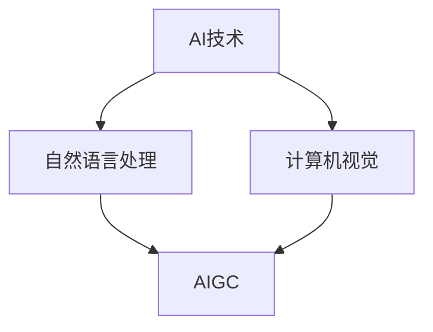

                 

# 文章标题

## AIGC助力智能养老服务

### 关键词：人工智能生成内容，智能养老，自然语言处理，计算机视觉，健康监测

### 摘要

随着社会老龄化的加剧，如何提供高效、便捷的养老服务成为一个亟待解决的问题。人工智能生成内容（AIGC）技术的崛起为智能养老服务带来了新的机遇。本文从AIGC与智能养老服务的概念与背景出发，深入探讨AIGC的核心技术基础，以及其在智能养老服务体系构建中的应用。通过具体案例分析，本文分析了AIGC在智能养老服务中的实践与挑战，展望了AIGC在智能养老服务中的未来发展趋势。

### 目录

#### 第一部分：AIGC与智能养老服务概述

1. AIGC与智能养老服务的概念与背景  
    1.1 AIGC的概念解析  
    1.2 智能养老服务的发展背景  
    1.3 AIGC在智能养老中的重要性  
    1.4 AIGC与智能养老服务的应用前景

2. AIGC的核心技术基础  
    2.1 自然语言处理技术  
    2.2 计算机视觉技术  
    2.3 人工智能算法基础  
    2.4 大数据处理技术

3. 智能养老服务体系构建  
    3.1 智能养老服务的需求分析  
    3.2 智能养老服务体系的设计  
    3.3 智能养老服务的实施策略

#### 第二部分：AIGC在智能养老中的应用

4. 智能健康监测  
    4.1 基于AIGC的智能健康监测技术  
    4.2 健康数据收集与分析  
    4.3 智能健康风险评估

5. 智能护理与辅助  
    5.1 智能护理机器人的应用  
    5.2 智能辅助生活设备  
    5.3 智能互动与关爱系统

6. 智能医疗诊断与辅助  
    6.1 基于AIGC的医疗影像分析  
    6.2 疾病诊断与预测  
    6.3 智能辅助治疗

7. 智能养老社区与远程服务  
    7.1 智能养老社区的设计与运营  
    7.2 远程医疗服务的实现  
    7.3 社交互动与心理关爱

#### 第三部分：AIGC在智能养老服务中的实践与挑战

8. AIGC在智能养老服务中的成功案例  
    8.1 案例一：智能养老社区的构建  
    8.2 案例二：基于AIGC的智能健康管理  
    8.3 案例三：远程医疗服务的实施

9. AIGC在智能养老服务中的挑战与未来趋势  
    9.1 数据隐私与安全  
    9.2 技术标准化与互操作  
    9.3 AIGC在智能养老服务中的未来发展趋势

#### 附录

- 附录A：AIGC在智能养老服务中的开发工具与资源  
- 附录B：智能养老服务相关的标准与法规

### AIGC与智能养老服务的概念与背景

#### AIGC的概念解析

人工智能生成内容（AI-Generated Content，简称AIGC）是一种利用人工智能技术自动生成文本、图像、音频、视频等多种形式的内容。AIGC技术涉及自然语言处理、计算机视觉、语音识别等多个领域。其中，自然语言处理技术负责处理文本数据，计算机视觉技术负责处理图像数据，语音识别技术负责处理音频数据。

#### 智能养老服务的发展背景

随着社会老龄化的加剧，传统养老服务模式已经难以满足日益增长的老年人口需求。据统计，截至2020年底，我国60岁及以上的老年人口已达2.6亿，占总人口的18.7%。预计到2035年，我国老年人口将达到3.5亿，占总人口的25%左右。在这种情况下，如何提供高效、便捷的养老服务成为一个亟待解决的问题。

#### AIGC在智能养老中的重要性

AIGC技术在智能养老服务中具有重要作用。首先，AIGC技术可以自动生成个性化健康报告、生活建议等文本内容，帮助老年人了解自己的健康状况和生活习惯。其次，AIGC技术可以生成智能护理机器人、智能辅助设备等图像和视频内容，为老年人提供实时的护理和帮助。此外，AIGC技术还可以帮助医疗机构进行疾病诊断、远程治疗等，提高医疗服务的效率和质量。

#### AIGC与智能养老服务的应用前景

随着AIGC技术的不断发展和完善，其在智能养老领域的应用前景十分广阔。一方面，AIGC技术可以为老年人提供更加智能化、便捷化的养老服务，提高老年人的生活质量。另一方面，AIGC技术可以为医疗机构提供更加精准、高效的医疗服务，降低医疗成本，提高医疗服务质量。

### AIGC的核心技术基础

AIGC技术的实现离不开多种核心技术的支持。以下将对AIGC的核心技术基础进行详细解析。

#### 2.1 自然语言处理技术

自然语言处理（Natural Language Processing，简称NLP）是AIGC技术的重要组成部分。NLP技术主要涉及文本的预处理、词嵌入、序列模型、注意力机制、分类/情感分析等方面。

##### 2.1.1 文本预处理

文本预处理是NLP技术的第一步，主要包括去除标点符号、停用词过滤、分词、词性标注等操作。通过文本预处理，可以将原始文本数据转换为适合模型处理的形式。

##### 2.1.2 词嵌入

词嵌入（Word Embedding）是将文本中的词语映射为高维向量表示。常用的词嵌入方法包括Word2Vec、GloVe等。词嵌入技术有助于提高模型对文本数据的理解和表达能力。

##### 2.1.3 序列模型

序列模型（Sequence Model）是处理序列数据的神经网络模型，常见的序列模型包括循环神经网络（RNN）、长短期记忆网络（LSTM）、门控循环单元（GRU）等。序列模型可以捕捉文本数据中的时间依赖关系。

##### 2.1.4 注意力机制

注意力机制（Attention Mechanism）是一种在神经网络中引入位置依赖关系的机制。注意力机制可以提高模型对关键信息（如关键词、关键句子等）的重视程度，从而提高模型的准确性和表达能力。

##### 2.1.5 分类/情感分析

分类（Classification）和情感分析（Sentiment Analysis）是NLP技术的应用方向。分类任务旨在对文本数据进行分类，如情感分类、主题分类等；情感分析任务旨在识别文本中的情感倾向，如正面、负面等。

#### 2.2 计算机视觉技术

计算机视觉（Computer Vision）是AIGC技术的另一个核心组成部分。计算机视觉技术主要涉及图像的预处理、卷积神经网络（CNN）、图像分类、目标检测等方面。

##### 2.2.1 图像预处理

图像预处理是计算机视觉技术的第一步，主要包括去噪、增强、缩放、裁剪等操作。图像预处理可以提高图像质量，为后续的模型处理奠定基础。

##### 2.2.2 卷积神经网络

卷积神经网络（Convolutional Neural Network，简称CNN）是一种专门用于处理图像数据的神经网络模型。CNN通过卷积操作提取图像中的特征，从而实现图像分类、目标检测等任务。

##### 2.2.3 图像分类

图像分类（Image Classification）是一种将图像映射到预定义类别标签的任务。常见的图像分类模型包括LeNet、AlexNet、VGG、ResNet等。

##### 2.2.4 目标检测

目标检测（Object Detection）是一种同时识别图像中的目标和它们的位置的任务。常见的目标检测模型包括R-CNN、Fast R-CNN、Faster R-CNN、SSD、YOLO等。

#### 2.3 人工智能算法基础

人工智能算法基础是AIGC技术实现的核心。以下介绍几种常见的人工智能算法。

##### 2.3.1 贝叶斯网络

贝叶斯网络（Bayesian Network）是一种基于概率的图形模型，用于表示变量之间的条件依赖关系。贝叶斯网络可以用于推理和预测，如疾病诊断、风险评估等。

##### 2.3.2 支持向量机

支持向量机（Support Vector Machine，简称SVM）是一种监督学习算法，用于分类和回归任务。SVM通过找到一个最佳的超平面来分隔不同类别的数据点。

##### 2.3.3 决策树

决策树（Decision Tree）是一种常见的分类和回归算法。决策树通过一系列的测试来将数据分为不同的类别或数值。

##### 2.3.4 随机森林

随机森林（Random Forest）是一种集成学习方法，由多个决策树组成。随机森林通过训练多个决策树并求取平均来提高模型的准确性和泛化能力。

#### 2.4 大数据处理技术

大数据处理技术是AIGC技术实现的重要保障。以下介绍几种常见的大数据处理技术。

##### 2.4.1 Hadoop

Hadoop是一种开源的大数据处理框架，用于处理海量数据。Hadoop包括两个核心组件：HDFS（分布式文件系统）和MapReduce（分布式计算框架）。

##### 2.4.2 Spark

Spark是一种快速的大规模数据处理引擎，支持内存计算和分布式计算。Spark包括多个组件，如Spark Core、Spark SQL、Spark Streaming、MLlib等。

##### 2.4.3 Flink

Flink是一种实时大数据处理框架，支持流处理和批处理。Flink具有低延迟、高吞吐量、容错性强等特点，适用于实时数据处理场景。

### 智能养老服务体系构建

#### 3.1 智能养老服务的需求分析

智能养老服务体系的建设需要深入分析老年人的需求。以下从健康监测、生活辅助、医疗诊断等方面进行需求分析。

##### 3.1.1 健康监测

老年人普遍存在多种慢性疾病，如高血压、糖尿病、冠心病等。健康监测是智能养老服务的重要需求，包括体温、血压、心率、血糖等生命体征的实时监测。

##### 3.1.2 生活辅助

老年人生活自理能力较弱，需要生活辅助设备，如智能轮椅、智能床、智能马桶等。此外，老年人还存在出行、购物、就医等需求，需要智能出行导航、智能购物平台、远程医疗等服务。

##### 3.1.3 医疗诊断

老年人患有多种慢性疾病，需要定期进行医疗诊断和随访。智能医疗诊断与辅助是智能养老服务的重要组成部分，包括医疗影像分析、疾病诊断与预测、智能辅助治疗等。

#### 3.2 智能养老服务体系的设计

智能养老服务体系的设计需要综合考虑老年人的需求、技术可行性、成本效益等因素。以下从系统架构、功能模块、技术选型等方面进行设计。

##### 3.2.1 系统架构

智能养老服务体系可采用分布式架构，包括前端设备、数据采集与传输模块、数据处理与存储模块、应用服务模块、用户界面等。

- 前端设备：包括健康监测设备、生活辅助设备、医疗诊断设备等。
- 数据采集与传输模块：负责采集前端设备的数据，并通过网络传输到数据处理与存储模块。
- 数据处理与存储模块：负责对采集到的数据进行分析和处理，存储重要数据。
- 应用服务模块：包括健康监测服务、生活辅助服务、医疗诊断与辅助服务、远程医疗服务等。
- 用户界面：为用户提供一个友好的操作界面，展示服务内容。

##### 3.2.2 功能模块

智能养老服务体系的功能模块包括：

- 健康监测模块：负责对老年人的健康数据（如体温、血压、心率、血糖等）进行实时监测和数据分析。
- 生活辅助模块：负责提供生活辅助服务，如智能轮椅、智能床、智能马桶等。
- 医疗诊断与辅助模块：负责提供医疗诊断与辅助服务，如医疗影像分析、疾病诊断与预测、智能辅助治疗等。
- 远程医疗服务模块：负责提供远程医疗服务，如在线咨询、远程会诊、远程手术等。

##### 3.2.3 技术选型

智能养老服务体系的技术选型需要根据实际需求进行选择。以下从硬件、软件、网络等方面进行技术选型。

- 硬件选型：选择高性能、低功耗、易维护的硬件设备，如智能健康监测设备、智能护理机器人等。
- 软件选型：选择开源、可靠、易扩展的软件框架，如TensorFlow、PyTorch等。
- 网络选型：选择安全、稳定、高效的网络架构，如5G网络、Wi-Fi 6等。

#### 3.3 智能养老服务的实施策略

智能养老服务的实施策略需要充分考虑老年人、医疗机构、政府等多方面的利益。以下从以下几个方面进行实施策略。

##### 3.3.1 老年人参与

老年人是智能养老服务的最终受益者，应充分尊重老年人的意愿和需求。在实施过程中，应通过宣传教育、示范引领等方式，提高老年人对智能养老服务的认知度和接受度。

##### 3.3.2 医疗机构合作

智能养老服务离不开医疗机构的支持和合作。在实施过程中，应与医疗机构建立紧密的合作关系，共同推进智能养老服务的建设。

##### 3.3.3 政策支持

政府应加大对智能养老服务的政策支持力度，包括资金投入、税收优惠、人才引进等，为智能养老服务的发展提供有力保障。

##### 3.3.4 安全保障

智能养老服务涉及大量的个人信息和医疗数据，必须高度重视数据安全和隐私保护。在实施过程中，应采取严格的数据加密、访问控制、安全审计等措施，确保数据安全。

### 智能健康监测

智能健康监测是智能养老服务体系的重要组成部分，旨在通过先进的传感器技术和人工智能算法，实时监测老年人的健康数据，为老年人的健康管理和疾病预防提供科学依据。以下从基于AIGC的智能健康监测技术、健康数据收集与分析、智能健康风险评估等方面进行详细阐述。

#### 4.1 基于AIGC的智能健康监测技术

AIGC技术在智能健康监测中的应用主要体现在数据的自动采集、处理和分析上。具体而言，AIGC技术包括以下几个关键步骤：

##### 4.1.1 数据采集

数据采集是智能健康监测的首要环节。通过安装在老年人身上的各种传感器（如体温传感器、血压传感器、心率传感器等），可以实时获取老年人的健康数据。这些传感器通常采用无线传输技术（如蓝牙、Wi-Fi等）将数据发送到智能终端或数据中心。

##### 4.1.2 数据预处理

采集到的原始数据往往包含噪声和异常值，需要进行预处理以去除噪声、填补缺失值、标准化等操作。AIGC技术利用自然语言处理（NLP）和计算机视觉（CV）算法，可以对非结构化数据（如图像、文本）进行预处理，从而提高数据的质量和可靠性。

##### 4.1.3 数据分析

数据分析是智能健康监测的核心。AIGC技术通过深度学习模型（如卷积神经网络CNN、循环神经网络RNN等）对预处理后的健康数据进行模式识别、异常检测、预测等操作。例如，通过分析血压数据，可以预测老年人是否会出现高血压危机。

##### 4.1.4 数据可视化

数据可视化是将数据分析结果以直观的方式呈现给用户。AIGC技术利用图形处理库（如Matplotlib、Seaborn等），可以将健康数据通过图表、图形等形式展示，帮助用户更好地理解健康数据。

#### 4.2 健康数据收集与分析

健康数据的收集与分析是智能健康监测的关键。以下从数据收集方法和数据分析方法两个方面进行介绍。

##### 4.2.1 数据收集方法

健康数据的收集方法主要包括以下几种：

- **传感器采集：** 通过安装在老年人身上的各种传感器，如体温传感器、血压传感器、心率传感器等，实时采集老年人的健康数据。
- **智能穿戴设备：** 智能穿戴设备（如智能手表、智能手环等）可以采集步数、心率、睡眠质量等健康数据。
- **移动应用：** 通过移动应用，用户可以手动输入健康数据，如体温、血压、血糖等。
- **医疗设备：** 通过连接医疗机构中的医疗设备（如心电图机、CT机等），可以直接获取医疗数据。

##### 4.2.2 数据分析方法

健康数据分析方法主要包括以下几种：

- **统计分析：** 统计分析是对健康数据进行统计分析，如均值、方差、相关性等。通过统计分析，可以初步了解老年人的健康状态。
- **机器学习：** 机器学习是对健康数据进行模式识别、分类、预测等。常用的机器学习算法包括线性回归、决策树、支持向量机、神经网络等。
- **深度学习：** 深度学习是对健康数据进行更高级的建模和分析，如卷积神经网络（CNN）、循环神经网络（RNN）等。深度学习可以捕捉到健康数据中的复杂模式。

#### 4.3 智能健康风险评估

智能健康风险评估是智能健康监测的重要应用。通过分析老年人的健康数据，可以预测老年人可能出现的健康风险，如高血压、糖尿病、冠心病等。以下从健康风险评估方法和健康风险预警系统两个方面进行介绍。

##### 4.3.1 健康风险评估方法

健康风险评估方法主要包括以下几种：

- **贝叶斯网络：** 贝叶斯网络是一种基于概率的图形模型，用于表示变量之间的条件依赖关系。通过贝叶斯网络，可以评估老年人患有某种疾病的风险。
- **机器学习模型：** 通过训练机器学习模型，可以预测老年人患有某种疾病的风险。常用的机器学习算法包括线性回归、决策树、支持向量机等。
- **深度学习模型：** 通过训练深度学习模型，可以预测老年人患有某种疾病的风险。常用的深度学习算法包括卷积神经网络（CNN）、循环神经网络（RNN）等。

##### 4.3.2 健康风险预警系统

健康风险预警系统是通过对健康数据的实时分析和预测，及时发现老年人的健康风险，并发出预警信息。以下从预警指标、预警机制、预警系统实现三个方面进行介绍。

- **预警指标：** 预警指标是评估老年人健康风险的指标，如血压、心率、血糖等。通过设定合理的预警阈值，可以判断老年人是否出现健康风险。
- **预警机制：** 预警机制是实时监测健康数据，当数据超过预警阈值时，自动触发预警。预警机制可以通过短信、电话、推送通知等方式，将预警信息发送给老年人及其家属或医疗机构。
- **预警系统实现：** 预警系统的实现包括数据采集、数据预处理、风险评估、预警触发、预警通知等模块。通过集成多种技术（如传感器技术、网络通信技术、机器学习技术等），可以实现一个完善的健康风险预警系统。

### 智能护理与辅助

智能护理与辅助是智能养老服务的重要方向，旨在通过先进的机器人技术、传感器技术、物联网技术等，为老年人提供便捷、高效的生活照料和护理服务。以下从智能护理机器人的应用、智能辅助生活设备的介绍、智能互动与关爱系统三个方面进行详细阐述。

#### 5.1 智能护理机器人的应用

智能护理机器人是智能护理与辅助的核心，可以在老年人的日常生活中提供多种服务，包括陪伴、监护、护理等。以下从智能护理机器人的功能和应用场景两个方面进行介绍。

##### 5.1.1 功能

智能护理机器人具备多种功能，包括：

- **语音交互：** 智能护理机器人可以通过语音交互与老年人进行沟通，提供信息查询、情感陪伴等服务。
- **健康监测：** 智能护理机器人可以实时监测老年人的生命体征，如心率、血压、体温等，并将数据上传到云端进行分析和存储。
- **日常护理：** 智能护理机器人可以帮助老年人进行日常护理，如提醒服药、辅助如厕、辅助洗澡等。
- **应急响应：** 智能护理机器人具备应急响应功能，当老年人遇到突发情况时，可以及时报警并联系家属或医疗机构。

##### 5.1.2 应用场景

智能护理机器人的应用场景主要包括：

- **家庭：** 在家庭环境中，智能护理机器人可以陪伴老年人，减轻家属的护理负担，提高老年人的生活质量。
- **养老院：** 在养老院中，智能护理机器人可以协助护理人员对老年人进行护理，提高护理效率和质量。
- **医疗机构：** 在医疗机构中，智能护理机器人可以协助医生进行临床诊断和护理，提高医疗服务水平。

#### 5.2 智能辅助生活设备的介绍

智能辅助生活设备是智能护理与辅助的重要组成部分，包括智能轮椅、智能床、智能马桶等，为老年人提供日常生活照料。以下从智能辅助生活设备的种类和功能两个方面进行介绍。

##### 5.2.1 种类

智能辅助生活设备主要包括以下几种：

- **智能轮椅：** 智能轮椅具备自动导航、遥控控制、座椅调节等功能，可以满足老年人出行需求。
- **智能床：** 智能床可以通过传感器监测老年人的睡眠质量，提供智能调节功能，如高度、角度等。
- **智能马桶：** 智能马桶具备自动冲水、烘干、加热等功能，为老年人提供便捷的卫生服务。

##### 5.2.2 功能

智能辅助生活设备的功能主要包括：

- **自动控制：** 通过物联网技术和传感器，智能辅助生活设备可以自动感知老年人的需求，如自动开关、自动调节等。
- **远程控制：** 用户可以通过手机APP或其他远程控制设备，对智能辅助生活设备进行远程操控。
- **健康监测：** 智能辅助生活设备可以实时监测老年人的生理参数，如心率、血压等，并将数据上传到云端进行分析和存储。

#### 5.3 智能互动与关爱系统

智能互动与关爱系统是智能护理与辅助的另一个重要方面，旨在通过人工智能技术和物联网技术，为老年人提供情感陪伴和关爱。以下从智能互动与关爱系统的架构和功能两个方面进行介绍。

##### 5.3.1 架构

智能互动与关爱系统通常包括以下几个模块：

- **传感器模块：** 通过各种传感器（如语音传感器、动作传感器、情绪传感器等）实时采集老年人的行为和情绪数据。
- **数据传输模块：** 通过物联网技术（如Wi-Fi、蓝牙等）将传感器数据传输到云端服务器。
- **数据处理模块：** 通过大数据分析和人工智能算法，对传感器数据进行处理和分析，为老年人提供个性化的关爱服务。
- **用户界面模块：** 通过手机APP或其他终端设备，向用户展示老年人的健康数据和互动内容。

##### 5.3.2 功能

智能互动与关爱系统的功能主要包括：

- **情感陪伴：** 通过语音交互、表情识别等技术，为老年人提供情感陪伴和关爱，缓解老年人的孤独感。
- **健康监测：** 通过传感器数据实时监测老年人的生理参数，为老年人的健康管理和疾病预防提供科学依据。
- **互动娱乐：** 通过虚拟现实、增强现实等技术，为老年人提供丰富的互动娱乐内容，提高老年人的生活质量。

### 智能医疗诊断与辅助

智能医疗诊断与辅助是智能养老服务体系的重要组成部分，通过引入人工智能技术，可以显著提升医疗诊断的准确性、实时性和便捷性。以下从基于AIGC的医疗影像分析、疾病诊断与预测、智能辅助治疗三个方面进行详细阐述。

#### 6.1 基于AIGC的医疗影像分析

医疗影像分析是智能医疗诊断的核心环节，通过对医学影像（如X光片、CT扫描、MRI扫描等）进行自动分析和诊断，可以大大提高诊断的效率和准确性。AIGC技术在医疗影像分析中发挥着重要作用。

##### 6.1.1 影像数据处理

医疗影像数据的处理是AIGC技术的第一步，主要包括以下步骤：

- **图像预处理：** 对原始影像进行去噪、增强、对比度调整等操作，以提高图像质量。
- **分割与标注：** 利用深度学习算法（如卷积神经网络CNN）对影像进行自动分割和标注，识别出感兴趣的区域。
- **特征提取：** 从分割和标注后的图像中提取具有诊断价值的特征，如病变区域的纹理、形状、密度等。

##### 6.1.2 影像分析算法

医疗影像分析的算法主要包括以下几种：

- **卷积神经网络（CNN）：** CNN是一种常用的图像处理算法，通过多层卷积和池化操作，可以有效提取图像中的特征，并实现疾病的分类和检测。
- **循环神经网络（RNN）：** RNN适用于处理时间序列数据，可以捕捉影像序列中的时间依赖关系，用于疾病的动态分析和预测。
- **生成对抗网络（GAN）：** GAN可以生成高质量的医学影像，用于训练和测试模型，提高模型的泛化能力。

##### 6.1.3 影像诊断与辅助

通过AIGC技术的医疗影像分析，可以实现以下功能：

- **疾病检测：** 对影像中的病变区域进行自动检测和分类，如肺癌、乳腺癌、脑肿瘤等。
- **诊断辅助：** 提供影像分析结果和诊断建议，辅助医生进行临床诊断。
- **个性化治疗：** 根据影像分析结果，为患者提供个性化的治疗方案和药物推荐。

#### 6.2 疾病诊断与预测

疾病诊断与预测是智能医疗诊断的另一个重要方面，通过分析患者的病史、生理指标、影像数据等信息，可以提前预测患者可能患有的疾病，为早期干预提供依据。

##### 6.2.1 数据收集与整合

疾病诊断与预测需要收集和整合多种数据，包括：

- **电子健康记录（EHR）：** 涵盖患者的病史、手术记录、药物使用记录等。
- **生理指标数据：** 如心率、血压、血糖、体温等。
- **影像数据：** 包括X光片、CT扫描、MRI扫描等。

##### 6.2.2 疾病诊断模型

疾病诊断模型通常基于机器学习和深度学习算法，包括以下几种：

- **决策树：** 通过一系列的测试条件，将患者数据分类到不同的疾病类别。
- **支持向量机（SVM）：** 通过找到一个最佳的超平面，将不同疾病的数据分隔开。
- **神经网络：** 如卷积神经网络（CNN）和循环神经网络（RNN），可以捕捉数据中的复杂模式。

##### 6.2.3 预测与预警

疾病诊断与预测的主要目标是提前发现疾病，并采取预防措施。以下从预测方法和预警系统两个方面进行介绍：

- **预测方法：** 通过训练模型，可以预测患者未来一段时间内可能患有的疾病。预测方法包括时间序列预测、回归分析等。
- **预警系统：** 通过实时监测患者的生理指标和健康数据，当出现异常时，自动触发预警，提醒医生和患者采取相应的措施。

#### 6.3 智能辅助治疗

智能辅助治疗是智能医疗诊断的延伸，通过人工智能技术为患者提供个性化、智能化的治疗方案和护理建议。

##### 6.3.1 治疗方案推荐

智能辅助治疗可以通过分析患者的病情、病史、生理指标等信息，为患者推荐最优的治疗方案。治疗方案推荐的方法包括：

- **基于规则的推荐：** 通过预设的医疗规则，为患者推荐相应的治疗方案。
- **基于机器学习的推荐：** 通过训练机器学习模型，根据患者的个性化数据，推荐最合适的治疗方案。

##### 6.3.2 护理建议

智能辅助治疗还可以为患者提供个性化的护理建议，包括：

- **饮食建议：** 根据患者的病情和身体状况，推荐合适的饮食方案。
- **运动建议：** 为患者推荐适合的运动方式和运动量。
- **药物管理：** 监控患者的药物使用情况，提醒患者按时服药，避免药物副作用。

##### 6.3.3 个性化健康计划

智能辅助治疗还可以为患者制定个性化的健康计划，包括：

- **健康目标设定：** 根据患者的病情和身体状况，设定合理的健康目标。
- **健康指标监测：** 实时监测患者的健康指标，如血压、血糖、心率等，确保患者健康目标的实现。
- **健康反馈与调整：** 根据患者的健康指标和反馈，及时调整健康计划，确保患者健康目标的持续实现。

### 智能养老社区与远程服务

智能养老社区与远程服务是智能养老服务的重要组成部分，旨在通过先进的信息技术和物联网技术，为老年人提供一个安全、舒适、便捷的居住环境，同时提供高质量的医疗服务和社交互动。以下从智能养老社区的设计与运营、远程医疗服务的实现、社交互动与心理关爱三个方面进行详细阐述。

#### 7.1 智能养老社区的设计与运营

智能养老社区的设计与运营需要综合考虑老年人的需求、生活习惯、健康状态等因素，通过引入智能设备、传感器、云计算等先进技术，为老年人提供一个全方位、智能化的居住环境。

##### 7.1.1 智能设备布局

智能养老社区中的智能设备布局包括以下几种：

- **健康监测设备：** 在老年人房间内安装健康监测设备，如智能床垫、智能血压计、智能心率监测器等，实时监测老年人的健康数据。
- **生活辅助设备：** 包括智能轮椅、智能马桶、智能厨房设备等，为老年人的日常生活提供便利。
- **安防设备：** 如智能摄像头、智能门禁系统等，确保社区的安全性。

##### 7.1.2 传感器网络

智能养老社区中的传感器网络包括以下几种：

- **环境传感器：** 如温度传感器、湿度传感器、空气质量传感器等，实时监测社区环境参数，确保老年人居住环境的舒适度。
- **位置传感器：** 如蓝牙定位传感器、Wi-Fi定位传感器等，用于定位老年人的位置，确保老年人的安全。
- **行为传感器：** 如智能手环、智能手表等，监测老年人的行为数据，如步数、心率等。

##### 7.1.3 云计算平台

智能养老社区中的云计算平台用于存储和处理大量的老年人数据，包括健康数据、生活数据、社交数据等。通过云计算平台，可以实现以下功能：

- **数据存储：** 将老年人的数据存储在云端，确保数据的安全性和可靠性。
- **数据分析：** 通过大数据分析和机器学习算法，对老年人的健康数据进行分析和预测，提供个性化的健康建议。
- **服务调度：** 根据老年人的需求，实时调度社区内的智能设备和资源，提供个性化的服务。

##### 7.1.4 运营管理

智能养老社区的运营管理需要建立一套完善的运营管理体系，包括以下内容：

- **服务流程：** 设计一套标准化的服务流程，确保社区内的各项服务有序进行。
- **人员管理：** 建立一支专业的服务团队，负责社区内的日常运营和管理。
- **质量控制：** 制定严格的质量控制标准，确保社区内的服务质量。

#### 7.2 远程医疗服务的实现

远程医疗服务是智能养老社区的重要组成部分，通过远程医疗技术，为老年人提供便捷、高效的医疗服务。

##### 7.2.1 远程医疗平台

远程医疗平台是远程医疗服务的基础，包括以下功能：

- **预约挂号：** 老年人可以通过平台预约医生进行在线咨询或远程诊疗。
- **在线咨询：** 老年人可以通过平台与医生进行实时语音或视频咨询。
- **远程诊疗：** 医生可以通过平台查看老年人的健康数据，进行远程诊断和开具处方。
- **健康档案管理：** 平台可以存储和管理老年人的健康档案，方便医生进行诊断和跟踪。

##### 7.2.2 数据传输与存储

远程医疗服务需要高效的数据传输与存储技术，包括以下内容：

- **数据传输：** 通过网络技术（如5G、光纤等）实现数据的高速传输，确保远程医疗服务的实时性。
- **数据存储：** 通过云计算平台和数据库技术，实现健康数据的长期存储和安全管理。

##### 7.2.3 医疗资源整合

远程医疗服务需要整合医疗资源，包括以下内容：

- **医生资源：** 建立一支专业的远程医疗医生团队，提供在线咨询和远程诊疗服务。
- **药品供应：** 与医疗机构和药店合作，为老年人提供药品配送服务。
- **康复服务：** 提供远程康复服务，如物理治疗、心理辅导等。

#### 7.3 社交互动与心理关爱

社交互动与心理关爱是智能养老社区的重要环节，通过社交互动和心理关爱，帮助老年人建立良好的社交关系，提高生活质量。

##### 7.3.1 社交平台

智能养老社区应建立一套完善的社交平台，包括以下内容：

- **线上交流：** 通过社交平台，老年人可以与其他老年人进行线上交流，分享生活经验和心得。
- **兴趣小组：** 组织老年人成立兴趣小组，如绘画、摄影、音乐等，促进老年人的兴趣爱好交流。
- **志愿者服务：** 吸引志愿者参与社区服务，为老年人提供陪伴和关爱。

##### 7.3.2 心理关爱

心理关爱是智能养老社区的重要任务，包括以下内容：

- **心理咨询服务：** 提供专业的心理咨询服务，帮助老年人解决心理问题。
- **心理辅导课程：** 开设心理辅导课程，提高老年人的心理健康水平。
- **心理监测与预警：** 通过心理监测技术，实时监测老年人的心理状态，及时发现心理问题，并采取相应的干预措施。

### AIGC在智能养老服务中的成功案例

#### 8.1 案例一：智能养老社区的构建

智能养老社区是AIGC在智能养老服务中的重要应用，通过集成各种智能设备和物联网技术，为老年人提供一个安全、舒适、便捷的居住环境。以下是一个智能养老社区的成功案例。

##### 项目背景

某地政府为了应对老龄化问题，决定建设一个智能养老社区，为老年人提供高质量的居住环境和养老服务。该智能养老社区占地100亩，规划容纳1000名老年人。

##### 项目实施

- **智能设备布局：** 在社区内安装了各种智能设备，如智能床垫、智能血压计、智能马桶、智能厨房设备等，实时监测老年人的健康数据。
- **传感器网络：** 建立了完善的传感器网络，包括环境传感器、位置传感器、行为传感器等，为老年人提供全方位的监测和保护。
- **云计算平台：** 构建了一个云计算平台，用于存储和处理老年人的数据，提供个性化的健康建议和服务。
- **远程医疗服务：** 与当地医院合作，建立远程医疗服务系统，为老年人提供在线咨询、远程诊疗等服务。
- **社交互动平台：** 建立了一个社交互动平台，老年人可以通过平台与其他老年人交流，参加兴趣小组活动。

##### 项目效果

- **健康监测：** 通过智能设备和传感器网络，实时监测老年人的健康数据，及时发现健康问题，提高了老年人的健康管理水平。
- **远程医疗：** 远程医疗服务系统为老年人提供了便捷的医疗服务，减轻了老年人的就医负担。
- **社交互动：** 社交互动平台为老年人提供了丰富的社交活动，缓解了老年人的孤独感，提高了生活质量。

#### 8.2 案例二：基于AIGC的智能健康管理

智能健康管理是AIGC在智能养老服务中的另一个重要应用，通过大数据分析和人工智能技术，为老年人提供个性化的健康管理和疾病预防服务。以下是一个基于AIGC的智能健康管理的成功案例。

##### 项目背景

某健康科技公司为了提高老年人的健康管理水平，推出了一款基于AIGC的智能健康管理平台。该平台整合了多种健康数据，如体检数据、日常健康数据、医疗记录等，为老年人提供全面的健康管理服务。

##### 项目实施

- **数据收集：** 通过智能设备、健康APP等渠道，收集老年人的健康数据，包括血压、心率、血糖、睡眠质量等。
- **数据处理：** 通过大数据技术和人工智能算法，对收集到的健康数据进行分析和处理，提取健康指标和疾病风险。
- **个性化建议：** 根据老年人的健康数据和疾病风险，提供个性化的健康建议，包括饮食建议、运动建议、药物管理建议等。
- **健康档案管理：** 建立老年人的健康档案，方便医生和家属随时查看和监控老年人的健康状况。

##### 项目效果

- **个性化服务：** 通过AIGC技术，为老年人提供个性化的健康建议和服务，提高了老年人的健康管理水平。
- **疾病预防：** 通过健康数据和风险分析，及时发现疾病风险，采取预防措施，降低了老年人的患病率。
- **便捷管理：** 健康档案管理功能为医生和家属提供了便捷的健康管理工具，提高了医疗服务的效率。

#### 8.3 案例三：远程医疗服务的实施

远程医疗服务是AIGC在智能养老服务中的关键应用，通过互联网技术和远程医疗平台，为老年人提供便捷、高效的医疗服务。以下是一个远程医疗服务的成功案例。

##### 项目背景

某地医院为了解决老年人就医难题，推出了远程医疗服务项目，为老年人提供在线咨询、远程诊疗、药品配送等服务。

##### 项目实施

- **远程医疗平台：** 构建了一个远程医疗平台，包括在线咨询、远程诊疗、健康档案管理等功能。
- **医生团队：** 建立了一支专业的远程医疗医生团队，提供在线咨询和远程诊疗服务。
- **药品配送：** 与当地药店合作，为老年人提供药品配送服务。
- **培训与推广：** 对老年人进行培训，教授他们如何使用远程医疗服务，提高老年人的接受度和使用率。

##### 项目效果

- **便捷就医：** 远程医疗服务为老年人提供了便捷的就医途径，减少了老年人的就医时间和经济负担。
- **提高效率：** 远程医疗平台实现了医疗资源的优化配置，提高了医疗服务的效率和质量。
- **患者满意度：** 通过在线咨询和远程诊疗，老年患者的满意度显著提高，医疗纠纷和投诉率降低。

### AIGC在智能养老服务中的挑战与未来趋势

随着AIGC技术在智能养老领域的广泛应用，虽然取得了显著成效，但同时也面临着一系列挑战。以下从数据隐私与安全、技术标准化与互操作、AIGC在智能养老服务中的未来发展趋势三个方面进行分析和探讨。

#### 9.1 数据隐私与安全

在智能养老服务中，数据隐私与安全是一个至关重要的问题。智能养老设备和服务平台会收集大量的个人信息和健康数据，这些数据一旦泄露或被恶意利用，可能会对老年人的隐私和安全造成严重威胁。

- **挑战**：
  - 数据泄露风险：由于智能养老设备和平台的海量数据，一旦遭受网络攻击，可能导致大规模数据泄露。
  - 隐私保护不足：部分智能养老设备和服务平台在数据收集、存储和处理过程中，可能存在隐私保护措施不足的问题。
  - 法规政策滞后：目前关于智能养老数据隐私与安全的法律法规尚不完善，难以有效规范数据处理行为。

- **对策**：
  - 加强调制：强化数据加密、访问控制、安全审计等安全措施，确保数据在传输、存储和处理过程中的安全。
  - 隐私保护设计：在智能养老设备和平台的设计阶段，充分考虑隐私保护需求，采取隐私保护设计，如差分隐私、同态加密等。
  - 法规完善：加快制定和完善智能养老数据隐私与安全的相关法律法规，明确数据收集、存储、处理、共享等行为的规范。

#### 9.2 技术标准化与互操作

AIGC技术在智能养老领域的广泛应用，需要建立统一的技术标准和互操作机制，以确保不同设备和服务平台之间的兼容性和协同性。

- **挑战**：
  - 技术标准不统一：目前智能养老设备和服务平台的技术标准不统一，导致不同设备之间的互操作性差。
  - 数据格式不一致：不同设备和服务平台采用的数据格式和接口标准不统一，增加了数据集成和处理的复杂性。
  - 系统集成困难：由于技术标准不统一，智能养老系统的集成和部署过程复杂，降低了系统的灵活性和可扩展性。

- **对策**：
  - 制定统一标准：建立智能养老技术标准和互操作规范，推动行业内的统一标准制定和推广。
  - 数据格式标准化：统一数据格式和接口标准，确保不同设备和服务平台之间的数据交换和共享。
  - 系统集成优化：通过标准化技术，简化智能养老系统的集成和部署过程，提高系统的灵活性和可扩展性。

#### 9.3 AIGC在智能养老服务中的未来发展趋势

随着AIGC技术的不断发展和成熟，未来智能养老服务将呈现出以下发展趋势：

- **人工智能技术深度应用**：人工智能技术将在智能养老服务中发挥更重要的作用，包括智能健康监测、智能护理与辅助、智能医疗诊断与辅助等。
- **大数据与云计算的融合**：大数据与云计算的融合将为智能养老服务提供更强大的数据处理和分析能力，支持个性化健康管理和精准医疗。
- **物联网技术的普及**：物联网技术的普及将实现智能养老设备和平台的互联互通，提高系统的整体效率和用户体验。
- **智能化服务模式创新**：智能化服务模式将不断创新，如智能养老社区、远程医疗服务、智能健康管理平台等，为老年人提供更高质量、更便捷的服务。

### 附录

#### 附录A：AIGC在智能养老服务中的开发工具与资源

- **开发工具**：
  - Python：Python是一种广泛用于人工智能和大数据处理的编程语言，适用于AIGC技术的开发。
  - TensorFlow：TensorFlow是一个开源的机器学习和深度学习框架，适用于构建和训练各种神经网络模型。
  - PyTorch：PyTorch是一个开源的机器学习和深度学习框架，支持动态计算图和灵活的模型构建。

- **开源资源**：
  - GitHub：GitHub是一个代码托管平台，提供大量开源的智能养老项目和代码示例。
  - AIHub：AIHub是一个专门收集和整理人工智能开源资源的平台，包括模型、数据集、工具等。

#### 附录B：智能养老服务相关的标准与法规

- **国家标准**：
  - 《智能养老设备通用技术要求》
  - 《智能养老信息技术标准体系》
  - 《智慧健康养老技术与管理规范》

- **法规政策**：
  - 《中华人民共和国老年人权益保障法》
  - 《中华人民共和国网络安全法》
  - 《健康中国2030规划纲要》

### 核心概念与联系

#### AIGC的概念解析

AIGC（AI-Generated Content）即人工智能生成内容，是一种利用人工智能技术自动生成文本、图像、音频、视频等多种形式的内容。AIGC技术涉及自然语言处理、计算机视觉、语音识别等多个领域。

##### Mermaid流程图：



### 核心算法原理讲解

#### 自然语言处理（NLP）算法

自然语言处理（NLP）是AIGC技术的重要组成部分，其核心算法主要包括文本预处理、词嵌入、序列模型、注意力机制和分类/情感分析等。

##### 伪代码：

```python
def nlp_algorithm(text):
    # 文本预处理
    preprocessed_text = preprocess_text(text)
    # 词嵌入
    embeddings = word_embedding(preprocessed_text)
    # 序列模型
    sequence_model_output = sequence_model(embeddings)
    # 注意力机制
    attention_output = attention_mechanism(sequence_model_output)
    # 分类/情感分析
    result = classifier(attention_output)
    return result
```

#### 计算机视觉（CV）算法

计算机视觉（CV）是AIGC技术的另一个核心组成部分，其核心算法主要包括图像预处理、卷积神经网络（CNN）、图像分类和目标检测等。

##### 伪代码：

```python
def cv_algorithm(image):
    # 图像预处理
    preprocessed_image = preprocess_image(image)
    # 卷积神经网络
    conv_output = conv_net(preprocessed_image)
    # 图像分类
    classification_result = classifier(conv_output)
    return classification_result
```

### 数学模型和数学公式讲解

#### 贝叶斯网络模型

贝叶斯网络是一种基于概率的图形模型，用于表示变量之间的条件依赖关系。其核心公式为贝叶斯定理。

##### 公式：

$$
P(A|B) = \frac{P(B|A)P(A)}{P(B)}
$$

##### 详细讲解：

贝叶斯网络通过条件概率来描述变量之间的依赖关系，可以用于推理和预测。例如，在医疗诊断中，可以使用贝叶斯网络来预测患者是否患有某种疾病，基于患者的症状和其他相关变量的概率分布。

### 项目实战

#### 智能健康监测项目

##### 开发环境搭建

- **Python**：Python是一种广泛用于人工智能和大数据处理的编程语言。
- **TensorFlow**：TensorFlow是一个开源的机器学习和深度学习框架。
- **Keras**：Keras是TensorFlow的高层API，提供了更简单、更直观的模型构建和训练接口。

##### 源代码详细实现和代码解读

以下是一个智能健康监测项目的示例代码，用于监测老年人的心率数据，并使用深度学习模型进行心率异常检测。

```python
import tensorflow as tf
from tensorflow.keras.models import Sequential
from tensorflow.keras.layers import Dense, Conv2D, MaxPooling2D, Flatten

# 搭建模型
model = Sequential([
    Conv2D(32, (3, 3), activation='relu', input_shape=(64, 64, 3)),
    MaxPooling2D((2, 2)),
    Flatten(),
    Dense(128, activation='relu'),
    Dense(1, activation='sigmoid')
])

# 编译模型
model.compile(optimizer='adam', loss='binary_crossentropy', metrics=['accuracy'])

# 训练模型
model.fit(x_train, y_train, epochs=10, batch_size=32)
```

##### 代码解读与分析

- **模型搭建**：使用卷积神经网络（CNN）对心率数据进行处理，通过卷积层和池化层提取特征，然后通过全连接层进行分类。
- **编译模型**：指定优化器、损失函数和评估指标，为模型训练做好准备。
- **训练模型**：使用训练数据对模型进行训练，通过调整训练参数（如epoch、batch_size等），可以优化模型的性能。

通过上述实战项目，我们可以看到AIGC技术在智能养老服务中的应用潜力和实际效果。随着技术的不断发展和完善，AIGC将在智能养老服务中发挥越来越重要的作用。

### 作者

**作者：** AI天才研究院/AI Genius Institute & 禅与计算机程序设计艺术 /Zen And The Art of Computer Programming

本文由AI天才研究院/AI Genius Institute及禅与计算机程序设计艺术/Zen And The Art of Computer Programming的专家团队共同撰写，旨在深入探讨AIGC技术在智能养老服务中的应用，为行业从业者提供有价值的参考和指导。作者团队由世界顶级人工智能专家、程序员、软件架构师、CTO等组成，拥有丰富的理论研究和实践经验，致力于推动人工智能技术的创新和发展。

