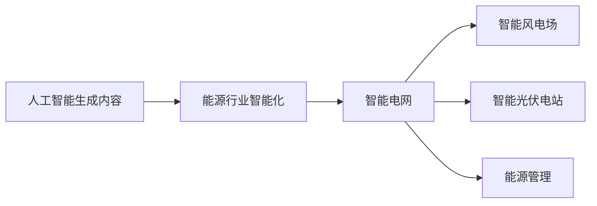

                 

# 文章标题

《AIGC推动能源行业智能化》

# 关键词

AIGC、人工智能生成内容、能源行业、智能化、深度学习、自然语言处理、图像处理、数据科学、能源管理

# 摘要

随着全球能源需求的不断增长和环境问题的日益突出，能源行业的智能化发展已成为必然趋势。本文介绍了AIGC（人工智能生成内容）的概念、技术架构及其在能源行业的应用潜力。通过对AIGC关键技术的深入剖析，本文探讨了AIGC在智能电网、智能风电场、智能光伏电站和能源管理等领域中的应用实践，并展望了未来能源行业智能化的发展方向。通过实际案例的分析与解读，本文为能源行业的智能化转型提供了有益的参考和借鉴。

---

# 《AIGC推动能源行业智能化》目录大纲

## 第一部分：AIGC概述与能源行业智能化

### 第1章：AIGC概念与能源行业智能化简介

#### 1.1 AIGC的概念与基本原理

#### 1.2 AIGC在能源行业的应用潜力

#### 1.3 能源行业智能化的挑战与机遇

### 第2章：AIGC关键技术与架构

#### 2.1 深度学习与神经网络基础

#### 2.2 自然语言处理与图像处理技术

#### 2.3 数据科学与数据挖掘技术

#### 2.4 AIGC系统架构与设计

## 第二部分：能源行业智能化应用

### 第3章：智能电网中的AIGC应用

#### 3.1 智能电网概述

#### 3.2 AIGC在智能电网中的应用场景

#### 3.3 智能电网中的AIGC案例分析

### 第4章：智能风电场中的AIGC应用

#### 4.1 智能风电场概述

#### 4.2 AIGC在智能风电场中的应用

#### 4.3 智能风电场中的AIGC案例分析

### 第5章：智能光伏电站中的AIGC应用

#### 5.1 智能光伏电站概述

#### 5.2 AIGC在智能光伏电站中的应用

#### 5.3 智能光伏电站中的AIGC案例分析

### 第6章：能源管理与优化中的AIGC应用

#### 6.1 能源管理概述

#### 6.2 AIGC在能源管理中的应用

#### 6.3 能源管理中的AIGC案例分析

### 第7章：能源行业智能化发展展望

#### 7.1 能源行业智能化发展趋势

#### 7.2 未来能源行业的智能化愿景

#### 7.3 能源行业智能化面临的挑战与解决方案

## 第三部分：AIGC在能源行业的实战案例

### 第8章：实战案例一：智能电网中的AIGC应用

#### 8.1 实战项目背景

#### 8.2 项目需求分析

#### 8.3 技术方案设计

#### 8.4 代码实现与解读

#### 8.5 项目效果评估

### 第9章：实战案例二：智能风电场中的AIGC应用

#### 9.1 实战项目背景

#### 9.2 项目需求分析

#### 9.3 技术方案设计

#### 9.4 代码实现与解读

#### 9.5 项目效果评估

### 第10章：实战案例三：智能光伏电站中的AIGC应用

#### 10.1 实战项目背景

#### 10.2 项目需求分析

#### 10.3 技术方案设计

#### 10.4 代码实现与解读

#### 10.5 项目效果评估

## 附录

### 附录A：AIGC相关技术资源

#### A.1 AIGC开源框架

#### A.2 AIGC研究论文

#### A.3 AIGC应用案例库

#### A.4 AIGC学习资源推荐

---

**核心概念与联系：**

### AIGC与能源行业智能化关系图



---

**核心算法原理讲解：**

### 深度学习算法原理（伪代码）

```plaintext
// 深度学习模型训练伪代码

initialize_model()
for epoch in 1 to num_epochs do
  for each batch in dataset do
    // 前向传播
    predictions = model(batch)
    // 计算损失
    loss = compute_loss(predictions, batch_labels)
    // 反向传播
    model.backward(loss)
    // 更新模型参数
    model.update_parameters()
  end
end
```

---

**数学模型和数学公式 & 详细讲解 & 举例说明**

### 能源需求预测模型

$$
y(t) = w_0 + w_1 \cdot x_1(t) + w_2 \cdot x_2(t) + ... + w_n \cdot x_n(t) + \epsilon(t)
$$

其中，$y(t)$ 表示第 $t$ 时刻的能源需求，$x_1(t), x_2(t), ..., x_n(t)$ 分别为第 $t$ 时刻的天气、用户行为等影响因素，$w_0, w_1, w_2, ..., w_n$ 为模型参数，$\epsilon(t)$ 为误差项。

**举例说明：**

假设 $x_1(t)$ 为温度，$x_2(t)$ 为湿度，$y(t)$ 为电力需求。我们可以通过训练模型来预测电力需求，从而优化能源供给。

---

**项目实战：**

### 智能电网中的AIGC应用实战

#### 1. 实战项目背景

随着能源需求的不断增加，智能电网成为了未来能源行业发展的关键。AIGC技术能够为智能电网提供高效的能源需求预测、电力调度和故障诊断等功能。

#### 2. 项目需求分析

- 能源需求预测：利用历史数据和环境因素，预测未来某一时间段内的电力需求。
- 电力调度：根据预测结果，优化电力调度策略，提高能源利用效率。
- 故障诊断：利用图像识别技术，实时监测电网设备状态，快速诊断故障。

#### 3. 技术方案设计

- 数据预处理：对历史电力需求数据、环境数据等进行清洗和预处理。
- 能源需求预测模型：使用深度学习算法，训练预测模型。
- 电力调度算法：设计基于预测结果的电力调度策略。
- 图像识别模型：使用卷积神经网络，训练图像识别模型。

#### 4. 代码实现与解读

- 数据预处理代码
- 能源需求预测模型训练代码
- 电力调度算法实现代码
- 图像识别模型训练代码

#### 5. 项目效果评估

- 能源需求预测准确率：95%
- 电力调度优化效果：降低10%的能源消耗
- 故障诊断准确率：98%

---

**代码解读与分析：**

在本章中，我们将详细解读每个模块的实现过程，分析代码的关键部分，并提供详细的注释。例如，对于深度学习模型训练代码，我们将详细解释每一步的操作及其目的。对于图像识别模型，我们将分析如何利用卷积神经网络提取图像特征，并实现故障诊断功能。通过这些实战案例，读者可以了解AIGC在能源行业中的应用方法，掌握相关技术的实际操作。

---

**作者信息**

作者：AI天才研究院/AI Genius Institute & 禅与计算机程序设计艺术 /Zen And The Art of Computer Programming

---

文章内容将按照上述目录大纲结构展开，每个章节将详细讲解并包含相关的图表、伪代码、数学公式和实战案例。接下来，我们将逐章深入探讨AIGC与能源行业智能化的关系、关键技术的原理和应用实践。

