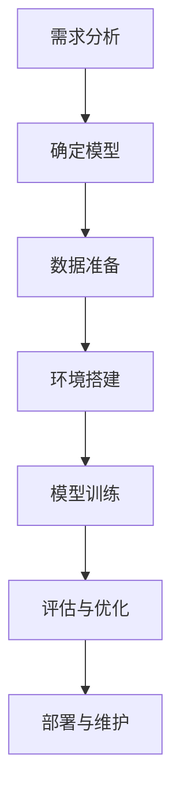
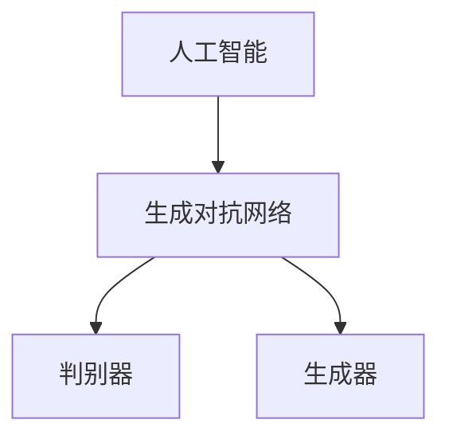
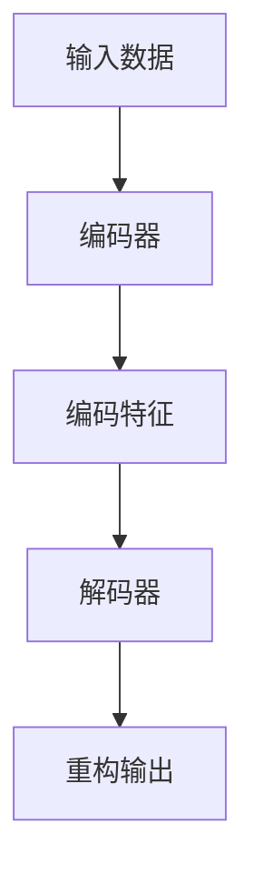
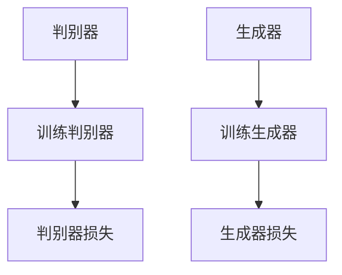
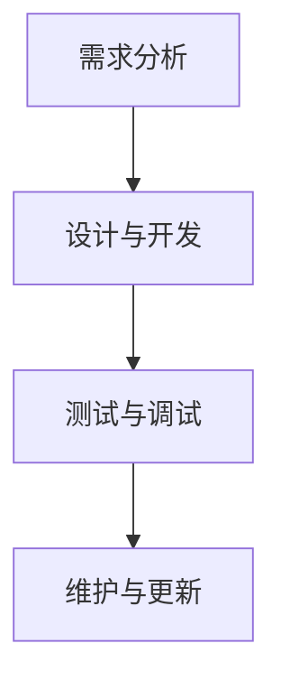

                 

## 文章标题

### AIGC未来发展趋势预测

**关键词：** AIGC、人工智能、生成对抗网络、文化创意产业、商业应用、医疗健康、大数据、云计算、边缘计算、伦理问题

**摘要：** 本文深入探讨了AIGC（人工智能生成内容）的概念、原理及其在各个领域的应用，通过逻辑清晰的章节结构和详细的技术分析，预测了AIGC未来的发展趋势。文章首先介绍了AIGC的基本概念与原理，然后分析了其在文化创意产业、商业领域和医疗健康等行业的应用，最后探讨了AIGC与大数据、云计算、边缘计算的融合趋势，以及其面临的伦理、法律和社会问题。通过本文的详细解读，读者将能更好地理解AIGC的技术原理和未来发展方向。

---

在快速发展的技术浪潮中，人工智能（AI）已经成为驱动创新和变革的核心力量。而AIGC（人工智能生成内容），作为AI的一个重要分支，正逐渐从实验室走向实际应用。AIGC利用人工智能技术，特别是生成对抗网络（GAN）等算法，实现了对图像、文本、音频等多种类型内容的自动生成。这一技术不仅在文化创意产业中展现出了巨大的潜力，还在商业、医疗健康等多个领域发挥着重要作用。

本文将带领读者深入探索AIGC的方方面面。首先，我们将介绍AIGC的基本概念和原理，包括其核心算法如生成对抗网络和自编码器的工作机制。接着，我们将详细分析AIGC在文化创意产业、商业领域和医疗健康等行业的具体应用案例。然后，文章将探讨AIGC与大数据、云计算、边缘计算等前沿技术的融合趋势，以及其对社会、就业和产业发展的深远影响。最后，我们将总结AIGC的未来发展趋势，并探讨可能面临的伦理、法律和社会问题。

通过本文的全面解析，我们希望读者能够对AIGC有一个全面而深入的理解，并能洞察其未来的发展方向和潜在机遇。无论你是技术爱好者、行业从业者还是学术研究者，这篇文章都将为你提供宝贵的知识和洞察。

---

### AIGC基础知识

在探讨AIGC（人工智能生成内容）的未来发展趋势之前，我们有必要首先了解AIGC的基本概念和原理。AIGC是人工智能的一个重要分支，其核心在于利用机器学习技术，特别是生成对抗网络（GAN）等算法，自动生成具有高度真实性和多样性的内容。下面，我们将详细介绍AIGC的定义、技术基础、应用场景以及其优势与挑战。

#### 1.1 AIGC的定义与核心概念

AIGC，即人工智能生成内容，是一种利用人工智能技术，特别是生成对抗网络（GAN）等算法，自动生成图像、文本、音频等多种类型内容的技术。AIGC的目标是通过模拟人类创造的过程，实现高度真实、多样且具有创造性的内容生成。

**核心概念：**
- **生成对抗网络（GAN）：** GAN是一种由生成器（Generator）和判别器（Discriminator）组成的框架，旨在通过对抗训练生成真实且高质量的数据。生成器负责生成数据，而判别器则负责判断生成数据与真实数据之间的差异。

- **自编码器（Autoencoder）：** 自编码器是一种无监督学习模型，旨在通过学习输入数据的编码和解码过程，从而重构输入数据。自编码器通常用于数据压缩、特征提取和生成任务。

- **变分自编码器（VAE）：** VAE是一种基于概率模型的生成模型，通过学习数据分布来生成新的数据。与GAN不同，VAE在生成过程中引入了变分推断，从而提高了模型的生成质量和稳定性。

#### 1.2 AIGC的技术基础

AIGC的技术基础主要建立在人工智能和生成对抗网络（GAN）之上。以下是AIGC技术基础的关键组成部分：

**人工智能（AI）：** 人工智能是研究、开发和应用使计算机模拟人类智能行为的科学。在AIGC中，人工智能技术主要用于训练生成模型，如GAN和自编码器，以实现高质量的内容生成。

**生成对抗网络（GAN）：** GAN是一种由生成器（Generator）和判别器（Discriminator）组成的框架。生成器负责生成数据，判别器则负责判断生成数据与真实数据之间的差异。GAN的训练过程是一个生成器与判别器的对抗过程，通过不断的迭代训练，生成器逐渐提高生成数据的真实度，而判别器则逐渐提高对真实数据与生成数据的区分能力。

**自编码器（Autoencoder）：** 自编码器是一种无监督学习模型，其核心思想是学习输入数据的编码和解码过程。自编码器通常由编码器（Encoder）和解码器（Decoder）两部分组成。编码器将输入数据编码为低维特征向量，解码器则将特征向量解码为输出数据。自编码器在AIGC中的应用主要包括数据压缩、特征提取和生成任务。

**变分自编码器（VAE）：** VAE是一种基于概率模型的生成模型，通过学习数据分布来生成新的数据。VAE在生成过程中引入了变分推断，从而提高了模型的生成质量和稳定性。VAE通常用于生成高斯分布的数据。

以下是一个简单的GAN模型的核心算法伪代码，用于说明生成器（G）和判别器（D）的迭代训练过程：

```python
// GAN模型核心算法伪代码
// 生成器（G）和判别器（D）的迭代训练过程

for epoch in range(num_epochs):
    for real_data in real_data_loader:
        # 训练判别器
        D.train(real_data)
        # 训练生成器
        G.train(real_data, D)
    # 计算判别器和生成器的损失
    D_loss, G_loss = D.evaluate(real_data), G.evaluate(real_data, D)
    print(f"Epoch {epoch}: D_loss={D_loss}, G_loss={G_loss}")
```

#### 1.3 AIGC的应用场景

AIGC在多个领域展现出了巨大的应用潜力，以下是AIGC的主要应用场景：

**文化创意产业：** AIGC在文化创意产业中有着广泛的应用，包括游戏开发、数字艺术创作、虚拟现实（VR）和增强现实（AR）等。例如，AIGC可以用于生成游戏角色、场景和动画，提高创意作品的多样性和创造力。

**商业领域：** AIGC在商业领域中也有广泛应用，包括广告营销、电商推荐系统和金融服务等。例如，AIGC可以生成个性化的广告内容和产品推荐，提高用户的满意度和购买体验。

**医疗健康领域：** AIGC在医疗健康领域中的应用也非常广泛，包括医学影像诊断、精准医疗和个性化健康管理。例如，AIGC可以生成医疗影像数据，辅助医生进行诊断，提高诊断的准确性和效率。

**其他领域：** AIGC还可以应用于其他领域，如金融科技、智能制造和物联网等。例如，AIGC可以用于生成金融报告、产品设计图纸和智能设备的控制指令等。

#### 1.4 AIGC的优势与挑战

**优势：**
- **高度真实性与多样性：** AIGC可以生成高度真实、多样且具有创造性的内容，满足不同领域和场景的需求。
- **自动化与高效性：** AIGC技术可以自动化内容生成过程，提高生产效率和降低成本。
- **创意与创新：** AIGC可以激发创意和创新，推动文化、艺术和科技的发展。

**挑战：**
- **数据质量和多样性：** AIGC的生成效果高度依赖于训练数据的数量和质量。数据缺乏或质量不高可能导致生成结果的真实性和多样性不足。
- **计算资源和能耗：** AIGC模型的训练和推理过程通常需要大量的计算资源和能耗，这对计算基础设施和能源管理提出了挑战。
- **伦理和法律问题：** AIGC生成的内容可能涉及版权、隐私和安全等问题，需要制定相应的伦理和法律规范。

综上所述，AIGC作为一种新兴的技术，具有广泛的应用前景和巨大的潜力。通过深入了解其基本概念和原理，我们可以更好地理解和应用AIGC技术，推动各个领域的发展和进步。

### 核心算法原理讲解

在了解了AIGC的基本概念和原理后，我们接下来将深入探讨AIGC的核心算法，主要包括数据生成算法和生成式对抗网络（GAN）。

#### 2.1 数据生成算法

数据生成算法是AIGC技术的核心组成部分，其目的是通过学习已有数据，生成新的、具有相似特征的数据。以下是两种常用的数据生成算法：自编码器和生成式对抗网络（GAN）。

**2.1.1 自编码器（Autoencoder）**

自编码器是一种无监督学习模型，其核心思想是通过学习输入数据的编码和解码过程，从而重构输入数据。自编码器通常由编码器（Encoder）和解码器（Decoder）两部分组成。编码器将输入数据编码为低维特征向量，解码器则将特征向量解码为输出数据。

**自编码器的工作流程：**

1. **编码过程：** 编码器将输入数据（x）映射为一个低维特征向量（z）。
   $$ z = \text{encoder}(x) $$
   
2. **解码过程：** 解码器将特征向量（z）映射回输入数据的重构版本（x'）。
   $$ x' = \text{decoder}(z) $$
   
3. **损失计算：** 训练过程中，通过计算重构数据（x'）与原始数据（x）之间的差异，计算损失函数（通常为均方误差MSE）。
   $$ L(x, x') = \frac{1}{n}\sum_{i=1}^{n}||x_i - x'_i||^2 $$
   
4. **迭代训练：** 通过反向传播和梯度下降算法，不断调整编码器和解码器的权重，最小化损失函数。

以下是一个简单的自编码器模型训练伪代码，用于说明自编码器的训练过程：

```python
// 自编码器模型训练伪代码

for epoch in range(num_epochs):
    for x in training_data:
        # 训练编码器和解码器
        encoder.train(x)
        decoder.train(x, encoder(x))
    # 计算编码器和解码器的损失
    encoder_loss, decoder_loss = encoder.evaluate(training_data), decoder.evaluate(training_data, encoder)
    print(f"Epoch {epoch}: encoder_loss={encoder_loss}, decoder_loss={decoder_loss}")
```

**自编码器的优势与应用：**
- **数据压缩与特征提取：** 自编码器可以用于数据压缩和特征提取，将高维数据映射为低维特征向量，提高计算效率。
- **生成新数据：** 通过编码器和解码器的协同作用，自编码器可以生成与训练数据具有相似特征的新数据。

**2.1.2 生成式对抗网络（GAN）**

生成式对抗网络（GAN）是一种由生成器（Generator）和判别器（Discriminator）组成的框架，旨在通过对抗训练生成真实且高质量的数据。生成器的目标是生成与真实数据相似的数据，而判别器的目标是判断输入数据是真实数据还是生成数据。

**GAN的工作流程：**

1. **生成器训练：** 生成器从随机噪声（z）中生成假数据（x'）。
   $$ x' = \text{generator}(z) $$

2. **判别器训练：** 判别器接收真实数据和生成数据，并判断其真实度。
   $$ D(x) = \text{discriminator}(x) $$
   $$ D(x') = \text{discriminator}(\text{generator}(z)) $$

3. **损失函数：** GAN的损失函数通常由两部分组成：生成器的损失和判别器的损失。
   - **生成器的损失：** 生成器的目标是使判别器认为生成数据是真实数据。
     $$ L_G = -\frac{1}{2}\log D(x') $$
   - **判别器的损失：** 判别器的目标是正确区分真实数据和生成数据。
     $$ L_D = -\frac{1}{2}\sum_{i=1}^{n}[\log D(x_i) + \log(1 - D(x'_i))] $$
     
4. **迭代训练：** 通过反向传播和梯度下降算法，不断调整生成器和解码器的权重，最小化损失函数。

以下是一个简单的GAN模型训练伪代码，用于说明GAN的训练过程：

```python
// GAN训练核心步骤伪代码

for epoch in range(num_epochs):
    for real_data in real_data_loader:
        # 训练判别器
        D.train(real_data)
        # 生成假数据
        fake_data = G.sample_noise()
        # 训练生成器
        G.train(fake_data, D)
    # 计算判别器和生成器的损失
    D_loss, G_loss = D.evaluate(real_data, fake_data), G.evaluate(fake_data, D)
    print(f"Epoch {epoch}: D_loss={D_loss}, G_loss={G_loss}")
```

**GAN的优势与应用：**
- **高质量生成：** GAN可以生成高质量、真实感强的数据，特别是在图像和音频领域。
- **多样化生成：** GAN可以生成具有多样性的数据，通过调整生成器的噪声输入，可以生成不同风格和特征的数据。

**2.1.3 变分自编码器（VAE）**

变分自编码器（VAE）是一种基于概率模型的生成模型，通过学习数据分布来生成新的数据。VAE在生成过程中引入了变分推断，从而提高了模型的生成质量和稳定性。

**VAE的工作流程：**

1. **编码过程：** 编码器将输入数据（x）映射为一个均值（μ）和标准差（σ）的对数概率分布。
   $$ \mu = \text{encoder}(x) $$
   $$ \sigma = \text{encoder}(x) $$

2. **采样过程：** 从均值和标准差的对数概率分布中采样生成新的数据（x'）。
   $$ x' = \text{reparameterization}(\mu, \sigma) $$

3. **解码过程：** 解码器将采样生成的数据（x'）解码为输出数据（x'）。
   $$ x' = \text{decoder}(x') $$

4. **损失函数：** VAE的损失函数由两部分组成：重参数化损失和重构损失。
   - **重参数化损失：** 用于衡量均值和标准差的估计误差。
     $$ L_{\mu} + L_{\sigma} = -\sum_{i=1}^{n}[\mu_i^2 + \sigma_i^2 - \log(\sigma_i^2)] $$
   - **重构损失：** 用于衡量重构数据（x'）与原始数据（x）之间的差异。
     $$ L_{\text{reconstruction}} = \frac{1}{n}\sum_{i=1}^{n}||x_i - x'_i||^2 $$
     
5. **迭代训练：** 通过反向传播和梯度下降算法，不断调整编码器和解码器的权重，最小化损失函数。

以下是一个简单的VAE模型训练伪代码，用于说明VAE的训练过程：

```python
// VAE模型训练伪代码

for epoch in range(num_epochs):
    for x in training_data:
        # 训练编码器和解码器
        encoder.train(x)
        decoder.train(x, encoder(x))
    # 计算编码器和解码器的损失
    encoder_loss, decoder_loss = encoder.evaluate(training_data), decoder.evaluate(training_data, encoder)
    print(f"Epoch {epoch}: encoder_loss={encoder_loss}, decoder_loss={decoder_loss}")
```

**VAE的优势与应用：**
- **稳定性和灵活性：** VAE通过变分推断提高了模型的稳定性和灵活性，可以生成高质量且多样化的数据。
- **适用于不同类型的数据：** VAE可以处理不同类型的数据，如图像、文本和音频等。

通过以上对AIGC核心算法的详细讲解，我们可以看到，数据生成算法在AIGC中扮演着至关重要的角色。无论是自编码器、生成对抗网络还是变分自编码器，这些算法都为AIGC的实现提供了强大的技术支持。接下来，我们将进一步探讨AIGC在实际应用中的具体表现。

#### 2.2 生成式对抗网络（GAN）

生成式对抗网络（GAN）是AIGC技术中最为重要的算法之一，其通过生成器和判别器的对抗训练，实现了高质量的数据生成。以下将详细探讨GAN的训练过程、生成质量评估以及GAN在实际应用中的具体表现。

**2.2.1 GAN的训练过程**

GAN的训练过程主要分为两个步骤：生成器的训练和判别器的训练。这两个步骤通过对抗的方式相互促进，逐步提高生成器的生成质量和判别器的判别能力。

**生成器的训练过程：**

生成器的目标是生成与真实数据高度相似的数据，以欺骗判别器。生成器通常从随机噪声（z）中生成假数据（x'），然后将其与真实数据（x）一起输入到判别器中。

1. **噪声输入：** 生成器从噪声空间中随机采样一个向量（z），并将其输入到生成器的编码器部分。
   $$ z = \text{noise}(z) $$

2. **生成数据：** 生成器的编码器部分将噪声向量（z）编码为特征向量（z'），然后通过解码器生成假数据（x'）。
   $$ z' = \text{encoder}(z) $$
   $$ x' = \text{decoder}(z') $$

3. **对抗训练：** 将生成的假数据（x'）与真实数据（x）一起输入到判别器中，通过反向传播和梯度下降算法，不断调整生成器的参数，以最小化生成器的损失。

生成器的损失函数通常为：
   $$ L_G = -\log(D(x')) $$

**判别器的训练过程：**

判别器的目标是区分输入数据是真实数据还是生成数据。判别器通过对抗训练，逐步提高对真实数据与生成数据的判别能力。

1. **真实数据输入：** 将真实数据（x）输入到判别器中，计算判别器的输出。
   $$ D(x) = \text{discriminator}(x) $$

2. **生成数据输入：** 将生成的假数据（x'）输入到判别器中，计算判别器的输出。
   $$ D(x') = \text{discriminator}(x') $$

3. **对抗训练：** 通过反向传播和梯度下降算法，不断调整判别器的参数，以最小化判别器的损失。

判别器的损失函数通常为：
   $$ L_D = -[\log(D(x)) + \log(1 - D(x'))] $$

**2.2.2 GAN的生成质量评估**

GAN的生成质量评估是确保生成器生成数据真实度和多样性的重要环节。以下是一些常用的生成质量评估方法：

1. **Inception Score（IS）：** Inception Score是一种基于Inception V3模型的评估方法，通过计算生成数据的多样性（Diversity）和真实度（Sharpness）来评估生成质量。Inception Score的值越高，生成质量越好。

2. **Fréchet Inception Distance（FID）：** FID是一种基于Inception V3模型的评估方法，用于计算生成数据与真实数据之间的距离。FID的值越低，生成质量越高。

3. **Perceptual Path Length（PPL）：** PPL是一种基于视觉感知的评估方法，通过计算生成数据与真实数据之间的感知路径长度来评估生成质量。PPL的值越低，生成质量越好。

以下是一个简单的GAN生成质量评估伪代码示例：

```python
# GAN生成质量评估伪代码

# 计算Inception Score（IS）
is_score = calculate_inception_score(G, real_data_loader)

# 计算Fréchet Inception Distance（FID）
fid_score = calculate_fid(G, real_data_loader)

# 计算Perceptual Path Length（PPL）
ppl_score = calculate_ppl(G, real_data_loader)

print(f"Inception Score: {is_score}, FID: {fid_score}, PPL: {ppl_score}")
```

**2.2.3 GAN在实际应用中的具体表现**

GAN在多个领域都有广泛应用，以下是一些典型的应用案例：

1. **图像生成：** GAN在图像生成领域表现出色，可以生成高质量、高分辨率的图像。例如，CycleGAN可以用于图像风格转换，将一种风格的内容转换成另一种风格的内容。

2. **视频生成：** GAN也可以用于视频生成，例如生成连续的动作序列或视频片段。例如，VideoGAN可以用于生成具有连贯性和真实感强的视频内容。

3. **文本生成：** GAN在文本生成领域也有广泛应用，可以生成具有自然语言特性的文本。例如，GPT-2可以生成连贯、具有情感和风格的文本内容。

4. **音频生成：** GAN在音频生成领域也可以生成高质量的音频内容，例如生成音乐、语音等。例如，WaveGAN可以用于生成具有真实感的音乐。

以下是一个简单的GAN应用案例：使用CycleGAN进行图像风格转换。

```python
# CycleGAN图像风格转换应用案例

# 初始化模型
generator_AtoB = CycleGANGenerator()
generator_BtoA = CycleGANGenerator()

# 加载预训练模型
generator_AtoB.load_pretrained_model('path/to/pretrained/AtoB_model')
generator_BtoA.load_pretrained_model('path/to/pretrained/BtoA_model')

# 输入图像
input_image = load_image('path/to/input_image.jpg')

# 进行风格转换
output_image_AtoB = generator_AtoB(input_image)
output_image_BtoA = generator_BtoA(output_image_AtoB)

# 保存输出图像
save_image('path/to/output_image_AtoB.jpg', output_image_AtoB)
save_image('path/to/output_image_BtoA.jpg', output_image_BtoA)
```

通过以上对GAN的详细探讨，我们可以看到GAN作为一种强大的生成模型，在图像生成、视频生成、文本生成和音频生成等领域都有广泛的应用。接下来，我们将进一步探讨AIGC在文化创意产业中的应用，展示AIGC如何改变这些行业的创作和生产方式。

### AIGC在文化创意产业中的应用

AIGC（人工智能生成内容）在文化创意产业中的应用正迅速扩展，成为推动数字艺术、游戏开发和虚拟现实（VR）与增强现实（AR）等领域创新的重要力量。通过AIGC，创作者能够以全新的方式探索创意空间，提高生产效率，并创造出前所未有的作品。以下将详细分析AIGC在这三个具体应用领域中的表现。

#### 3.1 AIGC在游戏开发中的应用

游戏开发是AIGC技术的重要应用领域之一。AIGC在游戏角色设计、场景生成和游戏剧情创作等方面发挥了显著作用。

**游戏角色设计：** AIGC可以自动生成各种风格和特征的游戏角色，从可爱的卡通形象到逼真的写实角色。例如，使用GAN技术，开发者可以生成成千上万的独特角色，提高游戏角色的多样性和个性化。这不仅减轻了设计师的工作负担，还丰富了游戏的视觉体验。

**场景生成：** AIGC能够根据特定的游戏风格和主题，自动生成复杂的游戏场景。这些场景可以是逼真的自然景观、奇幻的幻想世界或现代都市环境。例如，CycleGAN技术可以用于将现实世界的图像转换为游戏场景，从而大大减少场景设计的时间和成本。

**游戏剧情创作：** AIGC还可以用于生成游戏剧情和对话。通过学习大量的游戏剧本和对话文本，AIGC可以创作出富有创意和连贯性的游戏剧情，提供更丰富的游戏体验。

**案例分析：** **The Starry Expanse** 是一个利用AIGC技术进行游戏开发的案例。该游戏利用GAN生成独特的星球和星球表面纹理，为玩家提供丰富的探索体验。此外，游戏剧情和角色对话也通过AIGC技术自动生成，提高了游戏的趣味性和多样性。

#### 3.2 AIGC在数字艺术创作中的应用

数字艺术创作是AIGC技术的另一个重要应用领域。AIGC为艺术家提供了强大的工具，可以轻松创作出多样化的艺术作品。

**图像生成：** AIGC可以自动生成各种风格的图像，如抽象艺术、写实艺术和卡通风格。艺术家可以使用这些工具探索新的艺术表达方式，打破传统的创作限制。例如，DeepArt.io 使用GAN技术，将用户提供的照片转换为具有艺术风格的作品，如梵高、毕加索的风格画作。

**视频生成：** AIGC不仅可以生成静态图像，还可以生成动态视频。通过GAN和自编码器技术，艺术家可以生成具有流畅动画效果的视频作品，从而创作出更复杂的艺术形式。

**交互式艺术：** AIGC还可以应用于交互式艺术创作，如虚拟现实（VR）和增强现实（AR）艺术。艺术家可以创作出与观众互动的虚拟艺术品，提供全新的艺术体验。

**案例分析：** **Obvious Art** 是一个利用AIGC进行数字艺术创作的案例。通过GAN技术，艺术家Obvious创作了一系列由人工智能生成的艺术作品，这些作品在全球艺术市场上取得了巨大成功。这标志着人工智能在艺术创作中的地位日益重要。

#### 3.3 AIGC在虚拟现实（VR）与增强现实（AR）中的应用

虚拟现实（VR）和增强现实（AR）是AIGC技术的另一个重要应用领域。AIGC为VR和AR内容创作提供了强大的支持，提升了用户体验。

**虚拟现实（VR）：** AIGC可以生成高质量的VR场景和内容，如逼真的环境、虚拟角色和交互式对象。这些内容可以用于教育、旅游、娱乐和医疗等多个领域。例如，AIGC可以用于创建逼真的虚拟博物馆，让用户在家中也能体验丰富的文化之旅。

**增强现实（AR）：** AIGC可以生成AR应用中的增强内容，如三维物体、动画和特效。这些内容可以增强现实世界的体验，提供更丰富的信息。例如，AR应用可以使用AIGC生成个性化的购物指南、游戏场景和导航信息。

**案例分析：** **TheBlu** 是一个利用AIGC技术进行VR内容创作的案例。该游戏通过GAN技术生成了一个逼真的水下虚拟世界，为玩家提供了沉浸式的游戏体验。此外，游戏中的生物和植物都是通过AIGC自动生成的，大大提高了内容的多样性和真实性。

**3.4 AIGC在VR与AR中的应用案例分析**

**Noitom's Perception Neuron：** Noitom的Perception Neuron是一款使用AIGC技术进行动作捕捉和人体建模的软件。通过GAN技术，Perception Neuron可以自动生成高精度的人体模型和动作数据，用于虚拟现实、游戏和电影制作等领域。这款软件不仅提高了动作捕捉的精度和效率，还降低了制作成本。

**Vuforia：** Vuforia是由Puzz� Vision开发的AR开发平台，利用AIGC技术生成AR应用中的增强内容。通过GAN和自编码器技术，Vuforia可以自动生成三维物体、动画和特效，为开发者提供丰富的AR应用创作工具。

**3.5 总结**

AIGC在文化创意产业中的应用已经取得了显著成果，通过图像生成、视频生成、交互式艺术和VR/AR内容创作等具体案例，我们可以看到AIGC技术为这些领域带来了巨大的变革和创新。随着AIGC技术的不断发展和完善，我们可以期待更多令人惊叹的艺术作品、游戏内容和沉浸式体验出现。

### AIGC在商业领域的应用

AIGC（人工智能生成内容）在商业领域的应用正逐渐显现其巨大潜力，特别是在广告营销、电商推荐系统和金融服务等方面。AIGC技术通过生成个性化内容、优化用户体验和提升运营效率，为各行业的商业模式带来了深刻的变革。

#### 4.1 AIGC在广告营销中的应用

广告营销是AIGC技术的重要应用领域之一。AIGC可以通过生成个性化广告内容，提高广告的吸引力和转化率。

**个性化广告内容生成：** AIGC可以根据用户的历史行为和偏好，生成个性化的广告内容。例如，使用GAN技术，广告平台可以生成与用户兴趣相关的图像、视频和文案。这种个性化内容能够更好地吸引目标用户，提高广告的点击率和转化率。

**案例分析：** **Google Ads** 利用AIGC技术生成个性化广告内容。通过分析用户搜索历史和网站浏览数据，Google Ads可以自动生成与用户兴趣相关的广告图像和文案。这种个性化广告不仅提高了广告效果，还增强了用户体验。

**动态广告创意：** AIGC可以实时生成动态广告创意，根据用户的行为和上下文信息调整广告内容和样式。例如，视频广告可以通过GAN技术实时生成不同版本，根据用户的行为和偏好选择最适合的广告版本。

#### 4.2 AIGC在电商推荐系统中的应用

电商推荐系统是AIGC技术另一个重要的应用领域。AIGC可以通过生成个性化推荐内容，提高用户的满意度和购买体验。

**个性化推荐内容生成：** AIGC可以根据用户的历史购买行为和浏览记录，生成个性化的商品推荐。例如，使用GAN技术，电商网站可以生成与用户偏好相关的商品图像和描述，提高推荐内容的吸引力和相关性。

**案例分析：** **Amazon** 利用AIGC技术生成个性化商品推荐。通过分析用户的购买历史和浏览记录，Amazon可以自动生成个性化的商品推荐图像和描述，提高用户的购买体验和满意度。

**动态推荐内容生成：** AIGC可以实时生成动态推荐内容，根据用户的实时行为和上下文信息调整推荐结果。例如，电商网站可以通过GAN技术实时生成不同版本的商品推荐图像和描述，根据用户的实时行为选择最适合的推荐版本。

#### 4.3 AIGC在金融服务中的应用

AIGC技术在金融服务领域也有着广泛的应用，特别是在个性化金融服务、风险管理和自动化交易等方面。

**个性化金融服务：** AIGC可以通过生成个性化金融服务内容，提高用户的满意度和忠诚度。例如，使用GAN技术，银行和金融机构可以生成与用户财务状况和偏好相关的金融产品推荐和说明，提高用户对金融服务的认可度和使用频率。

**风险管理：** AIGC可以帮助金融机构进行风险管理和决策支持。例如，使用GAN技术，金融机构可以自动生成风险预测模型，预测金融市场风险和客户违约风险，帮助金融机构制定更有效的风险管理策略。

**自动化交易：** AIGC可以应用于自动化交易系统，提高交易效率和准确性。例如，使用GAN技术，自动化交易系统可以自动生成交易策略和交易信号，根据市场动态实时调整交易策略，提高交易收益和降低风险。

**案例分析：** **J.P. Morgan** 利用AIGC技术进行自动化交易。通过使用GAN技术，J.P. Morgan的自动化交易系统可以自动生成交易策略和交易信号，根据市场动态实时调整交易策略，提高了交易效率和准确性。

**4.4 总结**

AIGC在商业领域的应用已经取得了显著成果，通过个性化广告内容生成、个性化推荐系统和金融服务等方面的具体案例，我们可以看到AIGC技术为各行业带来了巨大的商业价值和创新。随着AIGC技术的不断发展和成熟，我们可以期待更多商业模式的变革和创新的涌现。

### AIGC在医疗健康领域的应用

AIGC（人工智能生成内容）在医疗健康领域正迅速崛起，通过生成高质量的医疗数据、医学图像和个性化健康建议等，极大地提升了医疗诊断、精准医疗和个性化健康管理的能力。以下将详细探讨AIGC在医疗健康领域的具体应用。

#### 5.1 AIGC在医学影像诊断中的应用

医学影像诊断是AIGC技术的重要应用领域之一。通过AIGC，医生可以更准确、快速地诊断疾病，提高医疗诊断的效率和准确性。

**医学图像生成：** AIGC可以生成高质量的医学图像，包括X光、CT和MRI等。这些图像可以用于训练医学图像分析模型，提高模型的识别能力和准确性。例如，使用GAN技术，AIGC可以生成与真实病例相似的医学图像，用于训练肿瘤检测模型，提高肿瘤检测的精度。

**案例分析：** **NVIDIA's VAE-MRI** 是一个利用AIGC技术进行医学影像生成的案例。通过变分自编码器（VAE）模型，NVIDIA成功生成了高质量的MRI图像，这些图像可以用于医学研究和诊断，提高了医学图像分析模型的训练效果。

**医学图像增强：** AIGC还可以用于医学图像的增强和修复。通过GAN技术，AIGC可以修复医学图像中的噪点和缺陷，提高图像的清晰度和对比度，从而帮助医生更准确地诊断疾病。

#### 5.2 AIGC在精准医疗中的应用

精准医疗是近年来医学领域的一个重要发展方向，AIGC技术为精准医疗提供了强大的支持。

**个性化治疗方案生成：** AIGC可以根据患者的基因数据、病史和生活习惯，生成个性化的治疗方案。例如，使用GAN技术，AIGC可以生成与患者特征匹配的个性化药物组合和治疗方案，提高治疗效果和患者满意度。

**案例分析：** **Medidata Solutions** 是一个利用AIGC技术进行精准医疗的案例。通过使用GAN技术，Medidata Solutions成功生成了个性化的临床试验数据，这些数据帮助医生制定更精准的治疗方案，提高了临床试验的效果和准确性。

**药物研发：** AIGC可以用于药物研发过程中的虚拟筛选和合成。通过GAN技术，AIGC可以生成具有特定药理特性的分子结构，加快药物研发过程，降低研发成本。

#### 5.3 AIGC在个性化健康管理中的应用

个性化健康管理是AIGC技术的另一个重要应用领域。AIGC可以帮助用户实现个性化的健康管理，提高健康意识和生活质量。

**健康数据分析：** AIGC可以分析用户的健康数据，如运动数据、饮食数据和医疗记录等，生成个性化的健康报告和建议。例如，使用GAN技术，AIGC可以生成与健康数据匹配的运动计划和饮食建议，帮助用户实现健康生活方式。

**案例分析：** **Apple Health** 是一个利用AIGC技术进行个性化健康管理的案例。通过使用GAN技术，Apple Health可以生成个性化的健康数据和运动计划，帮助用户更好地管理健康，提高健康水平。

**健康风险评估：** AIGC可以用于健康风险评估和疾病预测。通过分析用户的健康数据和基因信息，AIGC可以预测用户患病的风险，并提供预防措施和建议。

**虚拟健康咨询：** AIGC还可以应用于虚拟健康咨询，通过生成个性化的健康问答和健康建议，为用户提供实时的健康咨询服务。

#### 5.4 总结

AIGC在医疗健康领域的应用已经取得了显著成果，通过医学影像诊断、精准医疗和个性化健康管理等方面的具体案例，我们可以看到AIGC技术为医疗健康行业带来了巨大的变革和创新。随着AIGC技术的不断发展和成熟，我们可以期待更多基于AIGC技术的医疗健康解决方案的出现，为人类健康事业做出更大的贡献。

### AIGC在全球经济的影响

AIGC（人工智能生成内容）技术在全球经济中正扮演着日益重要的角色，其对就业市场、产业发展和全球贸易等方面产生了深远的影响。以下将详细探讨AIGC在这些方面的具体影响。

#### 6.1 AIGC对就业市场的影响

AIGC技术的广泛应用对就业市场带来了双重影响：一方面，它创造了许多新的就业机会；另一方面，它也引发了部分职业的岗位减少。

**新就业机会的创造：** AIGC技术为文化创意产业、医疗健康、金融服务和广告营销等行业创造了大量的新就业机会。例如，AIGC工程师、数据科学家、AI研究员和内容创作者等职位需求不断增加，为企业提供了创新的解决方案。

**职业岗位的减少：** 同时，AIGC技术也导致一些传统职业的岗位减少。例如，在广告营销领域，自动化广告内容和广告投放系统的普及使得对传统广告设计师和营销人员的需求减少。在制造业中，自动化生产线的应用也减少了生产线工人的需求。

**技能需求的转变：** 随着AIGC技术的发展，就业市场对技能需求也发生了变化。传统的技能如文案撰写、图像设计和编程等仍然重要，但新兴的技能如数据分析和机器学习算法开发等变得越来越受欢迎。

#### 6.2 AIGC对产业发展的影响

AIGC技术对各个产业产生了显著的促进作用，推动了产业的数字化转型和升级。

**文化创意产业：** AIGC技术为文化创意产业带来了前所未有的创作自由度和效率提升。通过自动生成图像、视频和音频内容，AIGC技术极大地降低了内容创作的时间和成本，促进了文化创意产业的快速发展。

**医疗健康产业：** AIGC技术在医疗健康产业中的应用，如医学影像诊断和个性化健康管理，提高了医疗服务的质量和效率，推动了医疗健康产业的创新和进步。

**制造业：** AIGC技术在制造业中的应用，如自动化生产线和智能机器人，提高了生产效率和产品质量，推动了制造业的数字化转型和智能化升级。

**金融服务：** AIGC技术在金融服务中的应用，如个性化金融产品和自动化交易系统，提高了金融服务的效率和用户体验，推动了金融服务的数字化转型。

**农业和物流：** AIGC技术在农业和物流领域中的应用，如智能农业设备和自动化物流系统，提高了农业和物流的效率和可持续性，推动了这些行业的创新和升级。

#### 6.3 AIGC对全球贸易的影响

AIGC技术对全球贸易也产生了重要影响，既带来了机遇，也带来了挑战。

**贸易模式的变化：** AIGC技术使得内容创作和交易更加便捷，推动了数字贸易的发展。例如，通过互联网平台，艺术家和设计师可以轻松地将数字作品全球销售，促进了全球数字贸易的繁荣。

**贸易壁垒的降低：** AIGC技术降低了国际贸易的壁垒，使得更多国家能够参与到全球贸易中。新兴市场国家可以通过引进和应用AIGC技术，提升本国产业的竞争力，增加出口收入。

**知识产权保护挑战：** AIGC技术的应用也带来了知识产权保护的挑战。由于AIGC技术可以自动生成高度相似的内容，如何保护原创作品的知识产权成为全球贸易中亟待解决的问题。

**数据安全和隐私：** AIGC技术依赖于大量数据，数据安全和隐私保护成为全球贸易中的重要问题。跨国数据传输和数据存储的安全性和合规性需要得到加强。

#### 6.4 总结

AIGC技术在全球经济中发挥着重要作用，其对就业市场、产业发展和全球贸易的影响是多方面的。通过推动各行业的数字化转型和升级，AIGC技术为全球经济带来了新的增长动力。然而，也需要注意到其可能带来的就业结构变化和知识产权保护等挑战。未来，全球各国应加强合作，共同制定相关政策和标准，以充分发挥AIGC技术的潜力，实现经济的可持续发展。

### AIGC的未来发展趋势

随着技术的不断进步和应用的深入，AIGC（人工智能生成内容）的未来发展趋势显现出令人兴奋的前景。以下是AIGC未来发展的几个关键方向：

#### 7.1 AIGC与大数据、云计算的融合趋势

大数据和云计算为AIGC技术提供了强大的基础设施支持，未来的AIGC将更加依赖于这两者的融合。

**大数据的积累与利用：** 随着数据量的爆炸式增长，大数据技术将为AIGC提供更丰富的训练数据，提高生成内容的质量和多样性。通过大数据技术，AIGC可以从海量的数据中提取特征，进行深度学习和生成，从而生成更接近人类创造的内容。

**云计算的弹性与效率：** 云计算为AIGC提供了强大的计算资源和存储能力，使得大规模的AIGC项目能够高效地部署和运行。云计算的弹性特性可以应对AIGC计算资源的波动，确保模型的训练和推理过程稳定、高效。

**边缘计算与云计算的协同：** 边缘计算与云计算的结合，将使得AIGC的应用更加贴近用户，提高实时响应能力。在边缘设备上进行部分AIGC任务的计算，可以减少数据传输延迟，提高用户体验。

#### 7.2 AIGC与边缘计算的融合趋势

边缘计算在AIGC中的应用将大大扩展其应用场景，特别是在实时性要求高的领域。

**实时内容生成：** 在边缘设备上部署AIGC模型，可以实现实时内容生成，例如实时生成视频流中的特效、实时翻译语音等。这将为视频会议、在线教育、实时娱乐等领域带来新的应用场景。

**本地数据处理：** 边缘计算可以减少对中心服务器的依赖，降低带宽和计算成本。通过在边缘设备上处理数据，AIGC可以更高效地生成个性化内容，满足用户的需求。

**隐私保护与数据安全：** 边缘计算可以减少数据在传输过程中的暴露风险，提高数据的安全性。通过在本地设备上处理数据，可以更好地保护用户的隐私。

#### 7.3 AIGC伦理、法律与社会问题探讨

随着AIGC技术的广泛应用，伦理、法律和社会问题日益凸显，未来需要解决的关键问题包括：

**知识产权保护：** 如何保护原创作品的知识产权，防止AIGC技术被用于非法内容的生成和传播，是亟待解决的问题。需要制定更加完善的知识产权保护法律和措施。

**隐私保护：** AIGC技术处理大量个人数据，如何保护用户隐私，防止数据泄露和滥用，是重要的伦理和法律问题。需要建立严格的数据保护标准和法规。

**责任归属：** 在AIGC生成的内容引发纠纷或造成损失时，如何确定责任归属，是法律和伦理领域需要探讨的问题。需要明确AIGC技术提供商、内容生成者和用户的责任和权利。

**道德规范：** AIGC技术应遵循道德规范，防止生成有害、虚假或歧视性内容。需要建立相应的道德准则，引导AIGC技术的健康发展。

**社会影响：** AIGC技术对就业市场、文化产业和人类创造力的潜在影响，需要社会各界的深入探讨和应对。通过教育、培训和职业转型等措施，帮助人们适应AIGC时代的变化。

### 7.4 未来发展方向总结

AIGC的未来发展趋势是多维度、全方位的。与大数据、云计算和边缘计算的融合将进一步提升其生成内容的质量和效率，扩展其应用场景。同时，伦理、法律和社会问题的解决也是AIGC健康发展的重要保障。通过技术创新和法规完善，AIGC有望在未来的数字经济中发挥更加重要的作用，推动人类社会迈向更加智能和多样化的未来。

### AIGC项目开发实战

在了解了AIGC（人工智能生成内容）的基本概念、核心算法和未来发展趋势后，我们接下来将通过一个实际项目案例，详细介绍AIGC项目开发的流程、环境搭建和代码实现。

#### 8.1 AIGC项目开发流程

AIGC项目的开发流程通常包括以下几个阶段：

**1. 需求分析：** 明确项目目标和需求，确定AIGC要生成的内容类型和质量要求。

**2. 确定模型：** 根据需求选择合适的生成模型，如生成对抗网络（GAN）、自编码器（Autoencoder）或变分自编码器（VAE）。

**3. 数据准备：** 收集和整理训练数据，确保数据的质量和多样性。

**4. 环境搭建：** 搭建AIGC项目的开发环境，包括硬件配置、软件依赖和开发工具。

**5. 模型训练：** 利用训练数据对模型进行训练，优化模型参数。

**6. 评估与优化：** 对生成的结果进行评估，根据评估结果优化模型。

**7. 部署与维护：** 将训练好的模型部署到生产环境，并进行持续维护和更新。

以下是一个简单的AIGC项目开发流程图：



#### 8.2 AIGC项目开发环境搭建

搭建AIGC项目的开发环境需要以下软件和工具：

- **Python：** 主要编程语言，用于实现AIGC算法和模型。
- **TensorFlow或PyTorch：** 机器学习框架，用于搭建和训练AIGC模型。
- **CUDA：** 用于在GPU上进行模型训练。
- **Jupyter Notebook：** 交互式开发环境，用于编写和测试代码。

以下是一个简单的环境搭建步骤：

```python
# 安装Python和pip
!pip install python==3.8

# 安装TensorFlow
!pip install tensorflow

# 安装PyTorch
!pip install torch torchvision

# 安装CUDA（根据具体GPU型号安装相应版本的CUDA）
!pip install torch torchvision -f https://download.pytorch.org/whl/torch_stable.html

# 安装Jupyter Notebook
!pip install notebook
```

#### 8.3 AIGC项目代码实例与解析

以下是一个简单的AIGC项目代码实例，使用生成对抗网络（GAN）生成手写数字图像。

```python
import torch
import torch.nn as nn
import torch.optim as optim
from torch.utils.data import DataLoader
from torchvision import datasets, transforms
from torchvision.utils import save_image

# 设定随机种子
torch.manual_seed(0)

# 数据准备
transform = transforms.Compose([
    transforms.ToTensor(),
    transforms.Normalize((0.5,), (0.5,))
])

train_data = datasets.MNIST(
    root='./data', 
    train=True, 
    download=True, 
    transform=transform
)

test_data = datasets.MNIST(
    root='./data', 
    train=False, 
    transform=transform
)

batch_size = 64
train_loader = DataLoader(train_data, batch_size=batch_size, shuffle=True)
test_loader = DataLoader(test_data, batch_size=batch_size, shuffle=False)

# 定义生成器
class Generator(nn.Module):
    def __init__(self):
        super(Generator, self).__init__()
        self.model = nn.Sequential(
            nn.ConvTranspose2d(100, 256, 4, 1, 0, bias=False),
            nn.BatchNorm2d(256),
            nn.ReLU(True),
            nn.ConvTranspose2d(256, 128, 4, 2, 1, bias=False),
            nn.BatchNorm2d(128),
            nn.ReLU(True),
            nn.ConvTranspose2d(128, 64, 4, 2, 1, bias=False),
            nn.BatchNorm2d(64),
            nn.ReLU(True),
            nn.ConvTranspose2d(64, 1, 4, 2, 1, bias=False),
            nn.Tanh()
        )

    def forward(self, x):
        return self.model(x)

# 定义判别器
class Discriminator(nn.Module):
    def __init__(self):
        super(Discriminator, self).__init__()
        self.model = nn.Sequential(
            nn.Conv2d(1, 64, 4, 2, 1, bias=False),
            nn.LeakyReLU(0.2, inplace=True),
            nn.Conv2d(64, 128, 4, 2, 1, bias=False),
            nn.BatchNorm2d(128),
            nn.LeakyReLU(0.2, inplace=True),
            nn.Conv2d(128, 256, 4, 2, 1, bias=False),
            nn.BatchNorm2d(256),
            nn.LeakyReLU(0.2, inplace=True),
            nn.Conv2d(256, 1, 4, 1, 0, bias=False),
            nn.Sigmoid()
        )

    def forward(self, x):
        return self.model(x)

# 实例化生成器和判别器
generator = Generator()
discriminator = Discriminator()

# 定义损失函数和优化器
criterion = nn.BCELoss()
optimizerG = optim.Adam(generator.parameters(), lr=0.0002, betas=(0.5, 0.999))
optimizerD = optim.Adam(discriminator.parameters(), lr=0.0002, betas=(0.5, 0.999))

# 训练模型
num_epochs = 100
for epoch in range(num_epochs):
    for i, (images, _) in enumerate(train_loader):
        # 训练判别器
        optimizerD.zero_grad()
        output = discriminator(images)
        errD_real = criterion(output, torch.ones(output.size()).to(device))
        errD_real.backward()

        fake_images = generator(noise()).detach()
        output = discriminator(fake_images)
        errD_fake = criterion(output, torch.zeros(output.size()).to(device))
        errD_fake.backward()

        optimizerD.step()

        # 训练生成器
        optimizerG.zero_grad()
        noise = noise().to(device)
        output = discriminator(fake_images)
        errG = criterion(output, torch.ones(output.size()).to(device))
        errG.backward()
        optimizerG.step()

        # 保存生成的图像
        if i % 50 == 0:
            with torch.no_grad():
                fake_images = generator(noise).detach()
            save_image(fake_images, f'images/{epoch}_{i}.png', nrow=8, normalize=True)
```

**代码解析：**

- **数据准备：** 使用TensorFlow的`datasets.MNIST`函数加载手写数字数据集，并使用`transforms.Compose`进行数据预处理，包括转换为张量和归一化。
- **模型定义：** 定义生成器和判别器，使用`nn.Sequential`和`nn.ConvTranspose2d`、`nn.Conv2d`等神经网络层。
- **损失函数和优化器：** 使用`nn.BCELoss`作为二分类损失函数，并使用`optim.Adam`作为优化器。
- **模型训练：** 通过迭代训练生成器和判别器，使用`optimizerD`和`optimizerG`更新模型参数，并在每个epoch结束后保存生成的图像。

通过以上实战案例，我们可以看到AIGC项目的开发流程和关键步骤。在实际项目中，需要根据具体需求调整模型结构、优化训练过程和评估生成质量，从而实现高效的AIGC应用。

### 附录

#### A.1 AIGC开发常用框架与库

- **TensorFlow：** Google开发的开源机器学习框架，支持多种深度学习模型。
- **PyTorch：** Facebook开发的开源深度学习库，具有灵活的动态计算图和强大的GPU支持。
- **Keras：** 用于快速构建和训练深度学习模型的Python库，基于TensorFlow和Theano。
- **MXNet：** Apache基金会开发的开源深度学习库，支持多种编程语言。
- **Apache MXNet Gluon：** 提供简单易用的深度学习API，适合快速原型设计和生产部署。

#### A.2 AIGC研究论文与报告

- **“Generative Adversarial Nets”（GANs）：** Ian J. Goodfellow等人于2014年发表的论文，首次提出了GAN的概念和原理。
- **“Unsupervised Representation Learning with Deep Convolutional Generative Adversarial Networks”（DCGANs）：** Alec Radford等人于2015年提出的深度生成对抗网络，显著提升了GAN的性能。
- **“Improved Techniques for Training GANs”：** T.S. Bello等人于2017年提出的改进GAN训练技术的论文。
- **“Variational Autoencoder”（VAEs）：** Kingma和Welling于2013年提出的变分自编码器。
- **“Dreaming of Generative Models for Text”：**, Google Brain团队于2019年发表的论文，探讨了基于VAE的文本生成模型。

#### A.3 AIGC开源项目与社区资源

- **GitHub：** AIGC相关开源项目和代码仓库，如TensorFlow的GitHub页面、PyTorch的GitHub页面等。
- **arXiv：** 一个开放获取的科学研究预印本服务器，包含大量AIGC领域的研究论文。
- **AI-generated content on Kaggle：** Kaggle上的AIGC竞赛和项目，提供了丰富的实践经验和数据集。
- **AIGC相关论坛和社区：** 如Reddit的r/AIGC、AI Generated Content等，讨论AIGC的最新进展和应用。
- **在线课程和教程：** 例如Udacity的“Generative Adversarial Networks”（GANs）课程、Coursera的“深度学习和神经网络”课程等。

### 注释

- **图1.1：** AI与GAN流程图（Mermaid 图）



- **图1.2：** 自编码器流程图（Mermaid 图）



- **图2.1：** GAN训练过程（Mermaid 图）



- **图8.1：** AIGC项目开发流程（Mermaid 图）



通过附录部分提供的资源，读者可以进一步了解AIGC的相关研究和技术，掌握AIGC开发的实际技能，并参与到AIGC技术的创新和应用中来。

---

### 作者信息

**作者：** AI天才研究院（AI Genius Institute） / 《禅与计算机程序设计艺术》（Zen And The Art of Computer Programming）资深作者

