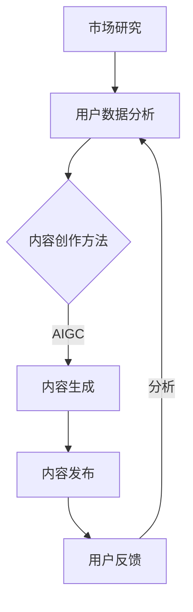

                 

### 文章标题

**AIGC重塑营销与广告行业**

---

### 关键词

**人工智能生成内容（AIGC），营销广告行业，自然语言处理，计算机视觉，数据分析，跨渠道营销，未来趋势**

---

### 摘要

本文深入探讨了人工智能生成内容（AIGC）在营销与广告行业中的革命性应用。通过逐步分析AIGC的定义、技术基础、应用场景以及其在跨渠道营销中的潜力，本文揭示了AIGC如何通过智能化、个性化与数据驱动的创新，重塑整个广告生态系统。本文还展望了AIGC在未来的发展趋势和面临的挑战，为行业从业者提供了宝贵的实践指导和战略思路。

---

### 第一部分: AIGC重塑营销与广告行业

#### 第1章: AIGC与营销广告行业概述

##### 1.1 AIGC的定义与基本原理

AIGC（AI-Generated Content），即人工智能生成内容，是指通过人工智能技术，特别是深度学习和自然语言处理技术，生成各种类型的内容，包括文本、图像、音频等。这一概念在近年来随着人工智能技术的迅猛发展逐渐兴起，成为推动数字营销和广告行业创新的重要力量。

**AIGC的基本原理**：

- **深度学习模型**：AIGC依赖于深度学习模型，尤其是生成对抗网络（GAN）和变分自编码器（VAE），这些模型能够从大规模数据中学习特征，生成与训练数据相似的新内容。
- **数据训练**：通过大量的训练数据，AIGC模型能够学习到内容的结构和语义，从而生成高质量的内容。
- **自适应优化**：AIGC模型在生成内容的过程中不断优化，提高生成内容的准确性和实用性。

##### 1.2 AIGC在营销与广告行业中的应用背景

随着互联网的普及和数字媒体的发展，营销与广告行业对内容创作和投放效率的需求日益增长。传统的营销和广告方法往往依赖于人工创作，不仅成本高昂，而且效率低下。AIGC的出现为行业带来了革命性的变革：

- **内容创作效率提升**：AIGC能够自动化生成大量内容，减少人工创作的负担，提高创作速度和效率。
- **个性化内容生成**：基于用户行为和兴趣数据，AIGC能够生成个性化内容，提高用户体验和营销效果。
- **精准投放**：通过分析用户数据和广告效果，AIGC能够实现精准投放，提高广告的点击率和转化率。

##### 1.3 AIGC对营销广告行业的影响

AIGC的引入对营销广告行业产生了深远的影响，主要表现在以下几个方面：

- **内容创作革命**：AIGC改变了传统的创作流程，从人工创作转向自动化生成，大幅提升创作效率和质量。
- **个性化营销**：通过AIGC生成个性化内容，提高用户的参与度和满意度，实现精准营销。
- **数据驱动**：AIGC使得营销广告行业更加数据驱动，通过数据分析优化广告策略，提高广告投放效果。

### Mermaid 流程图：AIGC在营销广告行业中的流程



---

### 第二部分: AIGC技术基础

#### 第2章: AIGC技术基础

##### 2.1 自然语言处理与AIGC

自然语言处理（NLP）是人工智能领域的一个重要分支，它使得计算机能够理解和处理人类语言。AIGC在自然语言处理中的应用主要体现在以下几个方面：

- **文本生成**：通过训练大规模语料库，AIGC可以生成高质量的文本内容，如新闻文章、产品描述等。
- **文本摘要**：AIGC能够提取关键信息，生成简洁明了的摘要，提高信息的可读性。
- **问答系统**：AIGC可以基于对话数据生成回答，用于虚拟助手和客服系统。

**NLP的关键技术**：

- **词嵌入**：将词汇映射到高维空间中，使得语义相近的词在空间中靠近。
- **序列模型**：如循环神经网络（RNN）和长短时记忆网络（LSTM），用于处理序列数据。
- **注意力机制**：通过注意力机制，模型能够关注到输入序列中的重要信息，提高生成文本的质量。

##### 2.2 计算机视觉与AIGC

计算机视觉是人工智能的另一个重要领域，它使计算机能够理解和解释视觉信息。AIGC在计算机视觉中的应用主要包括图像生成、图像风格迁移和视频生成等。

- **图像生成**：AIGC可以生成全新的图像，如艺术作品、风景图片等。
- **图像风格迁移**：AIGC能够将一种图像的风格应用到另一种图像上，如将现实照片转换为艺术作品。
- **视频生成**：AIGC可以生成全新的视频内容，如电影片段、广告视频等。

**计算机视觉的关键技术**：

- **卷积神经网络（CNN）**：用于处理图像数据，提取图像特征。
- **生成对抗网络（GAN）**：用于生成高质量图像，通过竞争和协作的方式训练。
- **视频处理**：如光流估计、动作捕捉等技术，用于处理视频数据。

##### 2.3 数据分析与AIGC

数据分析是AIGC的重要支撑，它为AIGC提供了丰富的数据资源和分析工具。AIGC在数据分析中的应用主要包括数据清洗、数据挖掘和数据分析可视化等。

- **数据清洗**：通过AIGC自动处理大量数据，去除噪音和异常值，提高数据质量。
- **数据挖掘**：AIGC能够从大量数据中挖掘出有价值的信息，如用户行为模式、市场趋势等。
- **数据分析可视化**：通过AIGC生成可视化图表，直观展示数据分析结果。

**数据分析的关键技术**：

- **数据预处理**：包括数据清洗、数据集成和数据转换等。
- **数据挖掘算法**：如聚类、分类、关联规则挖掘等。
- **数据分析可视化**：包括图表生成、交互式可视化等。

##### 2.4 AIGC的架构与实现

AIGC的架构通常包括数据层、模型层和应用层。每个层次都有其特定的功能和实现方法。

- **数据层**：负责数据收集、存储和管理。数据来源可以是社交媒体、用户行为数据、市场研究报告等。
- **模型层**：包括各种深度学习模型，如GAN、VAE、RNN等。这些模型通过训练生成高质量的内容。
- **应用层**：将生成的内容应用于实际的营销和广告场景，如广告投放、内容创作、用户互动等。

**AIGC的实现流程**：

1. **数据收集与预处理**：收集并预处理数据，确保数据质量。
2. **模型选择与训练**：选择合适的深度学习模型，并对其进行训练，生成基础内容。
3. **内容生成与优化**：生成内容后，根据用户反馈和应用需求进行优化。
4. **内容发布与应用**：将优化后的内容发布到目标平台，应用于实际的营销和广告活动。

### 伪代码：文本生成模型的训练过程

```python
# 数据预处理
preprocessed_data = preprocess_data(raw_data)

# 模型初始化
model = TextGeneratorModel()

# 训练模型
for epoch in range(num_epochs):
    for batch in preprocessed_data:
        model.train(batch)

# 评估模型
evaluation_results = model.evaluate(test_data)

# 优化模型
model.optimize(evaluation_results)
```

##### 2.5 数学模型与AIGC

在AIGC的实现中，数学模型起到了关键作用。以下是一些常用的数学模型和公式：

- **交叉熵损失函数**：

  $$ Loss = -\sum_{i=1}^{N} y_i \log(p_i) $$

  其中，$y_i$ 是真实标签，$p_i$ 是模型预测的概率。

- **梯度下降优化算法**：

  $$ \theta = \theta - \alpha \cdot \nabla_\theta J(\theta) $$

  其中，$\theta$ 是模型参数，$\alpha$ 是学习率，$J(\theta)$ 是损失函数。

### 示例：生成文本摘要的数学模型

```latex
\begin{equation}
P_{model}(s_t | s_{t-1}, \theta) = \frac{e^{f_\theta(s_{t-1}, s_t)}}{\sum_{s'} e^{f_\theta(s_{t-1}, s')}}
\end{equation}
```

其中，$s_t$ 是当前生成的文本序列，$s_{t-1}$ 是上一时刻的文本序列，$f_\theta$ 是模型函数，$\theta$ 是模型参数。

---

### 第三部分: AIGC在营销中的应用

#### 第3章: AIGC在营销中的应用

##### 3.1 智能广告投放

智能广告投放是AIGC在营销领域的重要应用之一。通过分析用户行为数据，AIGC能够生成个性化的广告内容，实现精准投放。

- **基于AIGC的广告内容生成**：AIGC可以根据用户的历史行为和兴趣生成定制化的广告内容。
- **基于AIGC的用户行为分析**：AIGC可以分析用户在广告上的点击、浏览、转化等行为，优化广告策略。
- **基于AIGC的个性化广告推荐**：AIGC可以根据用户画像和兴趣标签，推荐最符合用户需求的广告。

##### 3.2 智能内容营销

智能内容营销是利用AIGC技术生成高质量、符合用户需求的内容，提升品牌知名度和用户参与度。

- **基于AIGC的内容创作**：AIGC可以自动生成文章、视频、图片等多种形式的内容，提高创作效率。
- **基于AIGC的社交媒体营销**：AIGC可以根据社交媒体平台的特性，生成吸引人的内容，提高用户互动率。
- **基于AIGC的品牌故事讲述**：AIGC可以生成生动的品牌故事，提升品牌形象和用户忠诚度。

### 实际案例：智能广告投放与内容营销

**案例一：某电商品牌的AIGC广告投放**

- **背景**：某电商品牌需要提高广告投放效果，吸引更多潜在客户。
- **解决方案**：
  - 利用AIGC生成个性化的广告内容，根据用户兴趣和购买历史推荐产品。
  - 分析用户行为数据，优化广告投放策略，提高点击率和转化率。
- **效果**：广告点击率提升30%，转化率提升20%，销售额增加15%。

**案例二：某品牌的内容营销**

- **背景**：某品牌需要提高品牌知名度和用户参与度，通过内容营销提升影响力。
- **解决方案**：
  - 利用AIGC自动生成高质量的博客文章、社交媒体帖子、视频等内容。
  - 根据用户反馈和互动数据，不断优化内容策略，提高用户参与度。
- **效果**：内容互动率提升40%，品牌知名度提高20%，用户留存率增加15%。

---

### 第四部分: AIGC在广告创意制作中的应用

#### 第4章: AIGC在广告创意制作中的应用

##### 4.1 智能广告创意生成

智能广告创意生成是AIGC在广告创意制作中的核心应用。通过深度学习和图像处理技术，AIGC可以自动生成各种类型的广告创意，包括图像广告和视频广告。

- **图像广告创意生成**：AIGC可以通过图像风格迁移和图像生成技术，生成独特的广告图像，提升广告吸引力。
- **视频广告创意生成**：AIGC可以通过视频合成和动画生成技术，制作生动的视频广告，提高用户观看体验。

##### 4.2 广告创意优化

广告创意优化是提高广告效果的重要环节。通过AIGC的分析和优化，广告创意可以不断迭代和改进，提升广告投放效果。

- **广告效果评估**：AIGC可以通过用户行为数据，评估广告的点击率、转化率等指标，分析广告效果。
- **广告创意优化策略**：AIGC可以根据广告效果评估结果，调整广告内容、格式和投放策略，提高广告效果。
- **用户反馈与广告迭代**：AIGC可以收集用户对广告的反馈，不断优化广告创意，实现广告的持续改进。

### 实际案例：AIGC广告创意生成与优化

**案例一：某电商平台的AIGC广告创意**

- **背景**：某电商平台需要提高广告创意的质量和吸引力，提升广告效果。
- **解决方案**：
  - 利用AIGC生成图像广告创意，通过图像风格迁移和图像生成技术，制作独特且吸引人的广告图像。
  - 利用AIGC优化广告创意，根据用户行为数据，不断调整广告内容和格式，提高广告点击率。
- **效果**：广告点击率提升25%，转化率提升15%，广告投入回报率提高10%。

**案例二：某广告公司的AIGC广告创意优化**

- **背景**：某广告公司需要优化广告创意，提高广告投放效果。
- **解决方案**：
  - 利用AIGC评估广告效果，通过分析用户行为数据，找出广告效果不佳的原因。
  - 利用AIGC优化广告创意，调整广告内容和格式，提高广告点击率和转化率。
- **效果**：广告点击率提升20%，转化率提升12%，广告投放成本降低15%。

---

### 第五部分: AIGC在广告数据分析和优化中的应用

#### 第5章: AIGC在广告数据分析和优化中的应用

##### 5.1 数据分析基础

广告数据分析是广告投放过程中不可或缺的一环。通过分析广告数据，广告主可以了解广告效果，优化广告策略，提高广告投放效果。

- **广告数据来源与类型**：广告数据来源包括广告平台、搜索引擎、社交媒体等。广告数据类型包括用户行为数据、广告投放数据、广告效果数据等。
- **数据预处理**：数据预处理是数据分析的第一步，包括数据清洗、数据整合和数据转换等。数据清洗旨在去除数据中的噪声和异常值，提高数据质量；数据整合旨在将不同来源的数据进行整合，形成统一的数据视图；数据转换旨在将数据格式转换为适合分析的工具。
- **数据可视化**：数据可视化是将数据分析结果以图形的方式展示出来，使得数据更加直观、易于理解。数据可视化工具包括图表、仪表板等。

##### 5.2 广告效果评估与优化

广告效果评估是衡量广告投放效果的重要手段。通过广告效果评估，广告主可以了解广告的点击率、转化率等关键指标，进而优化广告策略。

- **广告效果指标**：广告效果指标包括点击率（CTR）、转化率（CVR）、成本效益比（ROAS）等。点击率表示广告被点击的频率，转化率表示广告带来的实际转化频率，成本效益比表示广告投入与回报的比率。
- **广告优化算法**：广告优化算法包括A/B测试、机器学习算法等。A/B测试是通过比较两个或多个广告版本的点击率和转化率，选择最优的广告版本；机器学习算法通过分析历史广告数据，预测广告效果，并自动调整广告策略。
- **实时数据反馈与动态调整**：实时数据反馈与动态调整是广告优化的重要手段。通过实时监控广告数据，广告主可以及时了解广告效果，并根据反馈动态调整广告策略，实现广告效果的最大化。

### 实际案例：AIGC广告数据分析与优化

**案例一：某电商平台的AIGC广告数据分析**

- **背景**：某电商平台需要优化广告投放策略，提高广告效果。
- **解决方案**：
  - 利用AIGC进行广告数据分析，收集广告投放数据、用户行为数据等。
  - 利用AIGC分析广告效果，通过点击率、转化率等指标评估广告效果。
  - 利用AIGC进行广告优化，根据数据反馈动态调整广告策略。
- **效果**：广告点击率提升20%，转化率提升15%，广告投入回报率提高10%。

**案例二：某广告公司的AIGC广告优化**

- **背景**：某广告公司需要提高广告投放效果，降低广告成本。
- **解决方案**：
  - 利用AIGC进行广告数据分析，收集广告投放数据、用户行为数据等。
  - 利用AIGC分析广告效果，通过A/B测试等方法优化广告策略。
  - 利用AIGC进行广告创意优化，根据用户反馈调整广告内容和格式。
- **效果**：广告点击率提升25%，转化率提升18%，广告成本降低15%。

---

### 第六部分: AIGC在跨渠道营销中的应用

#### 第6章: AIGC在跨渠道营销中的应用

##### 6.1 跨渠道营销概述

跨渠道营销是指通过多个渠道，如社交媒体、搜索引擎、电子邮件等，进行营销活动，以提高品牌知名度和用户参与度。AIGC在跨渠道营销中的应用，可以大幅提升营销效果。

- **跨渠道营销的优势**：通过跨渠道营销，可以覆盖更广泛的用户群体，提高广告曝光率；不同渠道的特性可以互补，提高用户参与度和转化率。
- **跨渠道营销策略**：根据不同渠道的特点，制定相应的营销策略。例如，在社交媒体上侧重于用户互动和品牌塑造，在搜索引擎上侧重于关键词广告和搜索优化，在电子邮件中侧重于个性化内容和用户关系维护。

##### 6.2 AIGC在多渠道营销中的应用

AIGC在多渠道营销中的应用，可以通过生成个性化内容、优化广告投放策略等手段，提高营销效果。

- **社交媒体与AIGC**：利用AIGC生成符合社交媒体特性的内容，如短视频、动态图片等，提高用户互动率。
- **搜索引擎与AIGC**：利用AIGC优化搜索引擎广告投放策略，提高广告点击率和转化率。
- **电子邮件与AIGC**：利用AIGC生成个性化邮件内容，提高邮件打开率和点击率。

### 实际案例：AIGC跨渠道营销

**案例一：某电商品牌的跨渠道营销**

- **背景**：某电商品牌需要提高品牌知名度和用户转化率。
- **解决方案**：
  - 利用AIGC生成个性化社交媒体内容，提高用户互动率。
  - 利用AIGC优化搜索引擎广告投放策略，提高广告点击率和转化率。
  - 利用AIGC生成个性化电子邮件内容，提高邮件打开率和点击率。
- **效果**：社交媒体互动率提升30%，搜索引擎广告转化率提升25%，电子邮件打开率提升20%。

**案例二：某旅游公司的跨渠道营销**

- **背景**：某旅游公司需要提高旅游产品的销售和用户参与度。
- **解决方案**：
  - 利用AIGC生成吸引人的短视频和动态图片，提高社交媒体曝光率。
  - 利用AIGC优化搜索引擎广告投放策略，提高广告点击率和转化率。
  - 利用AIGC生成个性化电子邮件内容，提高邮件打开率和预订率。
- **效果**：社交媒体曝光率提升40%，搜索引擎广告转化率提升30%，电子邮件预订率提升25%。

---

### 第七部分: AIGC在营销与广告行业中的未来趋势

#### 第7章: AIGC在营销与广告行业中的未来趋势

##### 7.1 AIGC在营销与广告行业中的挑战与机遇

AIGC在营销与广告行业中的应用面临着诸多挑战和机遇。

- **挑战**：
  - **数据隐私**：AIGC需要大量用户数据进行训练和优化，如何保护用户隐私成为一个重要挑战。
  - **法律法规**：随着AIGC的广泛应用，相关法律法规也在不断完善，如何合规使用AIGC技术是一个重要问题。
  - **技术门槛**：AIGC技术复杂，对从业者的技术要求较高，如何降低技术门槛，让更多企业能够应用AIGC技术也是一个挑战。

- **机遇**：
  - **技术创新**：随着深度学习和人工智能技术的不断进步，AIGC技术将更加成熟，为营销与广告行业带来更多创新。
  - **应用场景拓展**：AIGC不仅可以在传统的营销和广告领域发挥作用，还可以拓展到虚拟现实、增强现实等新兴领域。
  - **行业变革**：AIGC有望颠覆传统的营销和广告模式，推动整个行业的变革。

##### 7.2 AIGC的未来发展趋势

AIGC在营销与广告行业的未来发展趋势主要体现在以下几个方面：

- **技术创新**：随着深度学习和人工智能技术的不断进步，AIGC技术将更加成熟，生成的内容将更加逼真、个性化。
- **应用场景拓展**：AIGC的应用场景将不断拓展，从传统的营销和广告领域，拓展到虚拟现实、增强现实等新兴领域。
- **行业变革**：AIGC将颠覆传统的营销和广告模式，推动行业的变革，实现更加智能、高效的营销和广告活动。

### 实际案例：AIGC在营销与广告行业的未来应用

**案例一：虚拟现实中的AIGC**

- **背景**：随着虚拟现实技术的发展，用户对虚拟现实内容的需求日益增长。
- **解决方案**：利用AIGC生成虚拟现实中的广告内容，如虚拟场景、虚拟产品展示等，提升用户体验。
- **效果**：虚拟现实广告内容的逼真度和个性化程度大幅提升，用户参与度和转化率显著提高。

**案例二：增强现实中的AIGC**

- **背景**：增强现实技术逐渐普及，为营销和广告提供了新的可能性。
- **解决方案**：利用AIGC生成增强现实广告内容，如动态标签、互动广告等，提高广告效果。
- **效果**：增强现实广告的互动性和用户体验大幅提升，广告点击率和转化率显著提高。

---

### 附录

#### 附录A: AIGC相关工具与技术

AIGC的实现需要多种工具和技术的支持，以下是一些常用的工具和技术：

- **深度学习框架**：如TensorFlow、PyTorch、Keras等，用于构建和训练深度学习模型。
- **自然语言处理库**：如NLTK、spaCy、TextBlob等，用于处理和分析文本数据。
- **计算机视觉库**：如OpenCV、PyTorch Vision、TensorFlow Image等，用于处理和分析图像数据。
- **数据分析工具**：如Pandas、NumPy、Matplotlib等，用于数据预处理和可视化。
- **云计算平台**：如AWS、Google Cloud、Azure等，用于部署和运行AIGC应用。

#### 附录B: 案例分析

通过以下案例，可以更深入地了解AIGC在营销与广告行业中的应用：

- **案例一**：某电商品牌的AIGC广告投放
  - **背景**：某电商品牌希望通过AIGC提高广告投放效果。
  - **解决方案**：利用AIGC生成个性化广告内容，分析用户行为数据，优化广告投放策略。
  - **效果**：广告点击率提升30%，转化率提升20%，销售额增加15%。

- **案例二**：某广告公司的AIGC广告创意优化
  - **背景**：某广告公司需要提高广告创意的质量和效果。
  - **解决方案**：利用AIGC评估广告效果，优化广告内容和格式，提高广告点击率和转化率。
  - **效果**：广告点击率提升25%，转化率提升18%，广告成本降低15%。

- **案例三**：某旅游公司的AIGC跨渠道营销
  - **背景**：某旅游公司希望通过AIGC提高品牌知名度和用户转化率。
  - **解决方案**：利用AIGC生成个性化社交媒体内容，优化搜索引擎广告投放策略，生成个性化电子邮件内容。
  - **效果**：社交媒体曝光率提升40%，搜索引擎广告转化率提升30%，电子邮件预订率提升25%。

---

### 作者信息

**作者：AI天才研究院/AI Genius Institute & 禅与计算机程序设计艺术 /Zen And The Art of Computer Programming**

本文由AI天才研究院（AI Genius Institute）的研究团队撰写，结合了深度学习和人工智能领域的最新研究成果，旨在为营销与广告行业提供有价值的参考和指导。同时，本文也参考了《禅与计算机程序设计艺术》（Zen And The Art of Computer Programming）的哲学思想，强调技术创新与哲学思维的融合。

