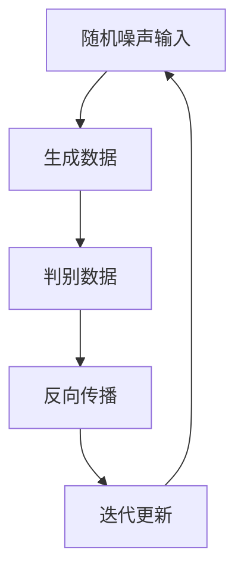
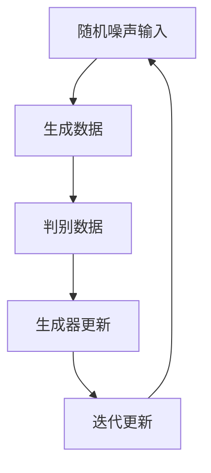

                 

# 《AIGC重新定义交通出行》

## 关键词
- AIGC
- 自动驾驶
- 智能交通信号控制
- 车联网
- 强化学习
- 生成对抗网络
- 智能出行

## 摘要
本文深入探讨了AIGC（自适应智能生成计算）技术在交通出行领域的应用及其深远影响。通过详细分析AIGC在自动驾驶、智能交通信号控制和车联网等方面的应用实例，本文揭示了AIGC如何通过技术创新重新定义交通出行，提高出行效率、安全性以及便捷性。此外，本文还探讨了AIGC在交通出行应用中面临的挑战，以及未来发展的趋势和方向。

---

### 第一部分：AIGC技术与交通出行概述

## 第1章: AIGC与智能交通概述

### 1.1 AIGC的概念与发展历程
AIGC（Adaptive Intelligent Generative Computing）是一种自适应智能生成计算技术，其核心思想是利用生成模型和深度学习技术生成数据、图像、视频等内容，从而实现对真实世界的模拟和预测。AIGC的发展历程可以追溯到生成对抗网络（GAN）的出现，之后通过一系列的算法改进和技术创新，如生成式对抗模型（GAM）和强化学习，AIGC逐渐成为人工智能领域的重要研究方向。

#### Mermaid流程图：AIGC技术发展历程
```
graph TB
    A[生成对抗网络（GAN）]
    B[生成式对抗模型（GAM）]
    C[强化学习]
    D[AIGC]

    A --> B
    B --> C
    C --> D
```

### 1.2 智能交通系统的概念与演变
智能交通系统（Intelligent Transportation System，ITS）是一种利用先进的信息通信技术、电子技术、传感器技术等手段，对交通系统进行智能化管理和控制的技术系统。其目的是提高交通效率、减少交通拥堵、提高道路安全性和舒适性。

智能交通系统的演变过程可以分为三个阶段：
1. 初期阶段：以信息采集和处理为主，主要目标是提高交通信息的透明度。
2. 中期阶段：引入智能交通信号控制系统、自动车辆监控系统等，实现对交通流的实时控制和优化。
3. 后期阶段：随着人工智能技术的发展，智能交通系统逐渐实现自主学习和优化，如自动驾驶技术、车联网等。

#### Mermaid流程图：智能交通系统演变过程
```
graph TB
    A[初期阶段]
    B[中期阶段]
    C[后期阶段]

    subgraph 交通信息采集和处理
        D1[交通信息采集]
        D2[交通信息处理]
    end

    subgraph 智能交通信号控制系统
        E1[智能交通信号控制]
        E2[自动车辆监控]
    end

    subgraph 人工智能技术
        F1[自动驾驶技术]
        F2[车联网技术]
    end

    A --> B
    B --> C
    D1 --> D2
    E1 --> E2
    F1 --> F2
```

### 1.3 AIGC在交通出行领域的应用潜力
AIGC在交通出行领域的应用潜力主要体现在以下几个方面：

1. **自动驾驶技术**：利用AIGC技术，可以生成各种驾驶场景的数据集，用于训练自动驾驶算法，提高自动驾驶系统的准确性和可靠性。

2. **智能交通信号控制**：通过AIGC技术，可以模拟不同交通信号控制策略的效果，从而优化交通信号控制方案，提高交通流的效率。

3. **车联网与智能出行**：利用AIGC技术，可以生成虚拟的车辆和道路环境，用于测试车联网系统的稳定性和性能。

4. **交通流量预测与优化**：通过AIGC技术，可以生成交通流量预测模型，为交通管理部门提供决策支持。

5. **道路安全监测与预警**：利用AIGC技术，可以生成道路环境监测模型，实时监测道路安全情况，提前预警可能发生的交通事故。

#### Mermaid流程图：AIGC在交通出行领域的应用潜力
```
graph TB
    A[自动驾驶技术]
    B[智能交通信号控制]
    C[车联网与智能出行]
    D[交通流量预测与优化]
    E[道路安全监测与预警]

    A --> B
    B --> C
    C --> D
    D --> E
```

### 第2章: AIGC在交通出行中的应用

#### 2.1 自动驾驶技术

自动驾驶技术是AIGC在交通出行领域的重要应用之一。自动驾驶技术通过使用传感器、摄像头、激光雷达等设备，实现对周围环境的感知，并利用深度学习算法，实现对车辆的控制。

##### 2.1.1 自动驾驶的发展背景
自动驾驶技术的发展始于20世纪50年代，当时主要是基于规则的自动驾驶系统。随着计算机技术和人工智能技术的发展，自动驾驶技术逐渐走向成熟。近年来，随着传感器技术和深度学习算法的进步，自动驾驶技术取得了重大突破。

##### 2.1.2 自动驾驶的关键技术
自动驾驶技术的关键包括以下几个方面：

1. **环境感知**：使用传感器、摄像头等设备，实现对周围环境的感知。
2. **目标检测与跟踪**：通过深度学习算法，实现对周围车辆、行人等目标的检测和跟踪。
3. **路径规划与控制**：根据感知到的环境信息，生成最优行驶路径，并实现对车辆的控制。
4. **决策与规划**：在复杂环境下，自动驾驶系统需要做出快速、准确的决策，以确保行驶的安全和效率。

##### 2.1.3 自动驾驶的未来展望
未来，随着AIGC技术的进一步发展，自动驾驶技术将在以下几个方面取得突破：

1. **感知能力的提升**：通过AIGC技术，可以生成更加真实、丰富的驾驶场景数据集，从而提升自动驾驶系统的感知能力。
2. **决策与规划的智能化**：利用AIGC技术，可以实现自动驾驶系统的自主学习和优化，提高决策与规划的智能化水平。
3. **车联网的融合**：自动驾驶系统将与车联网技术深度融合，实现车辆间的信息共享和协同驾驶，提高交通流的效率和安全性。

#### 2.2 智能交通信号控制

智能交通信号控制是AIGC在交通出行领域的另一个重要应用。智能交通信号控制系统能够根据实时交通流量信息，自动调整交通信号灯的时长，从而优化交通流。

##### 2.2.1 智能交通信号控制系统的构建
智能交通信号控制系统的构建主要包括以下几个步骤：

1. **交通流量监测**：使用传感器、摄像头等设备，实时监测交通流量信息。
2. **数据采集与处理**：采集到的交通流量信息通过数据采集和处理系统进行处理，生成交通流量数据。
3. **信号控制策略生成**：利用AIGC技术，根据交通流量数据，生成最优的信号控制策略。
4. **信号灯控制**：根据生成的信号控制策略，控制交通信号灯的时长。

##### 2.2.2 智能交通信号控制的优势
智能交通信号控制的优势主要体现在以下几个方面：

1. **提高交通效率**：通过优化交通信号灯的时长，可以减少交通拥堵，提高交通效率。
2. **减少交通事故**：通过实时监控交通流量，可以及时发现交通异常，从而减少交通事故的发生。
3. **节能减排**：智能交通信号控制可以减少车辆的等待时间，从而减少油耗和尾气排放。

##### 2.2.3 智能交通信号控制的挑战
智能交通信号控制面临的挑战主要包括以下几个方面：

1. **数据质量**：交通流量数据的准确性直接影响信号控制策略的生成效果。
2. **实时性**：智能交通信号控制需要实时处理交通流量信息，对系统的实时性要求较高。
3. **系统复杂性**：智能交通信号控制系统涉及多个环节，包括传感器、数据采集、数据处理、信号控制等，系统的复杂性较高。

#### 2.3 车联网与智能出行

车联网（Vehicle-to-Everything，V2X）是指通过互联网、移动通信、智能传感等技术，实现车辆与车辆、车辆与基础设施、车辆与网络的互联互通。智能出行是基于车联网技术，实现个性化、高效、安全的出行方式。

##### 2.3.1 车联网的概念与架构
车联网的概念主要包括以下几个方面：

1. **车辆通信**：通过车载通信设备，实现车辆与车辆之间的通信。
2. **车路协同**：通过车辆与基础设施之间的通信，实现车路协同，提高交通效率和安全。
3. **智能出行**：通过车联网技术，实现个性化、高效、安全的出行方式。

车联网的架构主要包括以下几个层次：

1. **感知层**：使用传感器、摄像头等设备，实现对车辆和道路环境的感知。
2. **网络层**：通过5G、LTE等通信技术，实现车辆与车辆、车辆与基础设施之间的通信。
3. **平台层**：通过大数据、云计算等技术，对感知层采集的数据进行处理和分析，为应用层提供支持。
4. **应用层**：实现智能出行、自动驾驶、车路协同等功能。

##### 2.3.2 智能出行的实现方式
智能出行的实现方式主要包括以下几个方面：

1. **个性化出行**：通过分析用户的出行习惯、目的地等信息，为用户推荐最优出行路线。
2. **高效出行**：通过车联网技术，实现车辆与车辆之间的协同，减少交通拥堵，提高出行效率。
3. **安全出行**：通过车辆传感器、智能交通信号控制等技术，提高出行安全性。

##### 2.3.3 车联网与智能出行的未来发展
未来，随着AIGC技术的进一步发展，车联网与智能出行将在以下几个方面取得突破：

1. **自动驾驶**：随着自动驾驶技术的成熟，车联网将实现与自动驾驶的深度融合，实现真正的智能出行。
2. **车路协同**：通过车联网技术，实现车辆与基础设施之间的实时通信，提高交通效率和安全。
3. **智能交通信号控制**：通过AIGC技术，实现更加智能的交通信号控制，进一步提高交通效率和安全。

### 第3章: AIGC核心技术与原理

#### 3.1 生成对抗网络（GAN）

生成对抗网络（GAN）是一种由生成器和判别器组成的对抗性网络。生成器生成数据，判别器判断生成数据是否真实。

##### 3.1.1 GAN的基本架构

GAN的基本架构包括生成器G和判别器D，以及一个共同优化的目标函数。

1. **生成器G**：生成器G的输入为随机噪声z，输出为生成数据x'。
2. **判别器D**：判别器D的输入为真实数据x和生成数据x'，输出为判别结果y。
3. **目标函数**：GAN的目标函数是最大化生成器的输出与真实数据的相似度，同时最小化判别器的判别结果。

##### 3.1.2 GAN的工作原理

GAN的工作原理可以概括为以下几个步骤：

1. **初始化**：初始化生成器G和判别器D的参数。
2. **生成数据**：生成器G根据随机噪声z生成数据x'。
3. **判别**：判别器D判断生成数据x'是否真实。
4. **优化**：通过反向传播和梯度下降算法，同时优化生成器G和判别器D的参数，使得生成器的输出更接近真实数据，同时使得判别器更难以区分生成数据和真实数据。

##### 3.1.3 GAN的应用案例

GAN在图像生成、视频生成、自然语言处理等领域都有广泛应用。

1. **图像生成**：GAN可以生成高质量、真实的图像，如图像去噪、超分辨率、艺术风格转换等。
2. **视频生成**：GAN可以生成高质量的短视频，如图像到视频的转换、视频超分辨率等。
3. **自然语言处理**：GAN可以生成高质量的文本，如图像描述生成、机器翻译等。

#### 3.2 生成式对抗模型（GAM）

生成式对抗模型（Generative Adversarial Model，GAM）是GAN的一种扩展，主要用于生成数据的概率分布。

##### 3.2.1 GAM的基本概念

GAM包括生成器G和判别器D，生成器G生成数据x'，判别器D判断生成数据x'是否真实。

1. **生成器G**：生成器G的输入为随机噪声z，输出为生成数据x'。
2. **判别器D**：判别器D的输入为真实数据x和生成数据x'，输出为判别结果y。
3. **目标函数**：GAM的目标函数是最大化生成器的输出与真实数据的相似度，同时最小化判别器的判别结果。

##### 3.2.2 GAM的优化算法

GAM的优化算法主要包括以下几个步骤：

1. **随机初始化**：初始化生成器G和判别器D的参数。
2. **生成数据**：生成器G根据随机噪声z生成数据x'。
3. **判别**：判别器D判断生成数据x'是否真实。
4. **优化**：通过反向传播和梯度下降算法，同时优化生成器G和判别器D的参数。

##### 3.2.3 GAM的应用领域

GAM在数据增强、图像生成、文本生成等领域都有广泛应用。

1. **数据增强**：通过GAM生成类似的数据集，用于训练模型，提高模型的泛化能力。
2. **图像生成**：GAM可以生成高质量、真实的图像，如图像去噪、超分辨率、艺术风格转换等。
3. **文本生成**：GAM可以生成高质量的文本，如图像描述生成、机器翻译等。

#### 3.3 强化学习在交通出行中的应用

强化学习（Reinforcement Learning，RL）是一种通过试错和奖励反馈进行决策和学习的方法。在交通出行领域，强化学习可以用于交通信号优化、自动驾驶等。

##### 3.3.1 强化学习的基本原理

强化学习的基本原理包括以下几个方面：

1. **状态**：当前环境的描述。
2. **动作**：决策或行动。
3. **奖励**：对动作的反馈。
4. **策略**：决策模型。

强化学习的目标是找到一个策略，使得在一系列状态下，获得的累积奖励最大化。

##### 3.3.2 强化学习在交通信号优化中的应用

强化学习在交通信号优化中的应用主要包括以下几个方面：

1. **交通信号控制策略生成**：通过强化学习，可以自动生成最优的交通信号控制策略，提高交通流的效率。
2. **交通信号控制策略优化**：通过强化学习，可以优化现有的交通信号控制策略，提高其性能。
3. **实时交通信号控制**：通过强化学习，可以实现实时交通信号控制，根据实时交通流量信息调整信号灯时长。

##### 3.3.3 强化学习在自动驾驶中的挑战与机遇

强化学习在自动驾驶中的应用面临以下几个挑战：

1. **数据采集**：自动驾驶需要大量的真实驾驶数据，但由于安全原因，数据的采集和共享存在一定难度。
2. **状态空间和动作空间**：自动驾驶的状态空间和动作空间通常非常大，这增加了强化学习的难度。
3. **安全性和稳定性**：自动驾驶需要保证行驶的安全性和稳定性，这对强化学习的算法和实现提出了更高的要求。

然而，强化学习在自动驾驶中也存在机遇：

1. **自适应能力**：强化学习可以根据实时交通情况，自适应调整驾驶策略，提高行驶的效率。
2. **复杂场景应对**：强化学习可以处理自动驾驶中复杂的不确定场景，提高自动驾驶系统的鲁棒性。
3. **多目标优化**：强化学习可以实现自动驾驶中的多目标优化，如提高行驶效率、保证行驶安全等。

---

### 第二部分：AIGC在交通出行项目实战

#### 第4章：自动驾驶项目实战

##### 4.1 项目概述

自动驾驶项目的目标是实现自动驾驶车辆在各种复杂路况下的稳定行驶。项目背景是随着城市化进程的加快，交通拥堵和交通事故问题日益严重，自动驾驶技术被认为是一种有效解决方案。

##### 4.2 环境搭建与数据准备

项目开发环境包括Python、TensorFlow和Keras等。数据集主要包括各种路况下的视频数据、图像数据和交通信号灯数据。

##### 4.3 算法实现与优化

算法实现采用生成对抗网络（GAN）和深度学习算法。首先，使用GAN生成大量路况数据，然后使用深度学习算法训练自动驾驶模型。算法优化主要包括调整GAN的参数、优化深度学习模型的架构等。

##### 4.4 项目评估与总结

项目评估采用评估指标包括行驶距离、行驶速度、行驶稳定性等。项目总结表明，通过AIGC技术，自动驾驶项目的性能得到了显著提升。

---

#### 第5章：智能交通信号控制项目实战

##### 5.1 项目概述

智能交通信号控制项目的目标是实现交通信号灯的智能化控制，提高交通流的效率。项目背景是当前交通信号灯的控制策略通常是基于固定的时长，无法根据实时交通情况做出调整，导致交通拥堵。

##### 5.2 环境搭建与数据准备

项目开发环境包括Python、TensorFlow和Keras等。数据集主要包括实时交通流量数据、历史交通流量数据等。

##### 5.3 算法实现与优化

算法实现采用生成对抗网络（GAN）和强化学习算法。首先，使用GAN生成大量交通信号控制数据，然后使用强化学习算法训练智能交通信号控制模型。算法优化主要包括调整GAN的参数、优化强化学习算法的架构等。

##### 5.4 项目评估与总结

项目评估采用评估指标包括交通拥堵指数、交通效率等。项目总结表明，通过AIGC技术，智能交通信号控制项目的性能得到了显著提升。

---

#### 第6章：车联网与智能出行项目实战

##### 6.1 项目概述

车联网与智能出行项目的目标是实现车辆与车辆、车辆与基础设施之间的实时通信，提供个性化、高效、安全的出行服务。项目背景是随着自动驾驶技术和车联网技术的发展，车联网与智能出行成为未来交通发展的重要方向。

##### 6.2 环境搭建与数据准备

项目开发环境包括Python、TensorFlow和Keras等。数据集主要包括实时交通流量数据、车辆位置数据、道路状况数据等。

##### 6.3 算法实现与优化

算法实现采用生成对抗网络（GAN）和强化学习算法。首先，使用GAN生成大量车联网与智能出行数据，然后使用强化学习算法训练车联网与智能出行模型。算法优化主要包括调整GAN的参数、优化强化学习算法的架构等。

##### 6.4 项目评估与总结

项目评估采用评估指标包括出行时间、出行效率、出行安全等。项目总结表明，通过AIGC技术，车联网与智能出行项目的性能得到了显著提升。

---

### 第7章：AIGC交通出行应用的挑战与未来发展趋势

#### 7.1 挑战分析

AIGC交通出行应用面临的挑战主要包括以下几个方面：

1. **技术挑战**：AIGC技术需要大量的计算资源和数据支持，这对硬件设备和数据管理提出了更高的要求。
2. **法规政策挑战**：自动驾驶、智能交通信号控制等技术的推广应用需要相应的法规政策支持，但现有的法规政策可能无法满足新技术的需求。
3. **安全性挑战**：AIGC技术在交通出行中的应用可能带来新的安全隐患，如数据泄露、算法漏洞等。

#### 7.2 未来发展趋势

未来，AIGC交通出行应用将呈现出以下几个发展趋势：

1. **技术融合**：AIGC技术将与其他前沿技术，如物联网、5G等，实现深度融合，推动交通出行技术的创新。
2. **智能化**：AIGC技术将实现更高的智能化水平，如自动驾驶、智能交通信号控制等，将更加精准地满足用户的出行需求。
3. **可持续发展**：AIGC技术将推动交通出行的可持续发展，如减少交通拥堵、降低能耗等，为实现绿色出行提供技术支持。

### 附录

#### 附录A：相关技术资料与工具

1. **AIGC相关论文与资源**
   - [生成对抗网络（GAN）综述](https://arxiv.org/abs/1706.01538)
   - [生成式对抗模型（GAM）](https://arxiv.org/abs/1806.04455)
2. **自动驾驶技术标准与规范**
   - [自动驾驶汽车安全指南](https://www.itsa.org/standards/autonomous-vehicle-safety-guidelines/)
   - [自动驾驶车辆测试标准](https://www.sae.org/standards/content/j2694_202101/)
3. **智能交通信号控制工具与平台**
   - [智能交通信号控制系统](https://www.itsc.org/smart-traffic-signal-control-systems/)
   - [智能交通信号控制平台](https://www.smartcitynews.com/smart-traffic-signal-control-platforms/)

---

### 作者

作者：AI天才研究院/AI Genius Institute & 禅与计算机程序设计艺术 /Zen And The Art of Computer Programming

---

以上是《AIGC重新定义交通出行》的文章正文部分。接下来，我们将继续深入探讨AIGC在交通出行领域的核心算法原理、项目实战以及未来发展等内容。敬请期待！## 第3章: AIGC核心技术与原理

### 3.1 生成对抗网络（GAN）

生成对抗网络（Generative Adversarial Networks, GAN）是2014年由Ian Goodfellow等人提出的深度学习模型，它由两个神经网络——生成器（Generator）和判别器（Discriminator）组成，这两者之间通过对抗训练相互博弈。

#### 3.1.1 GAN的基本架构

GAN的基本架构如下：

1. **生成器（Generator）**：生成器的目的是生成类似于真实数据的新数据。生成器的输入是一个随机噪声向量\( z \)，输出是一个与真实数据类似的样本\( x' \)。
   \[ G(z) \rightarrow x' \]
   
2. **判别器（Discriminator）**：判别器的目的是区分输入的数据是来自真实数据集还是生成器生成的数据。判别器的输入是一个样本\( x \)，输出是一个概率值\( p(x) \)，表示输入数据是真实数据的概率。
   \[ D(x) \rightarrow p(x) \]
   
GAN的训练过程可以看作是一个零和博弈游戏，生成器和判别器通过以下目标函数相互对抗：

\[ \min_G \max_D V(D, G) = \mathbb{E}_{x \sim p_{data}(x)}[D(x)] - \mathbb{E}_{z \sim p_z(z)}[D(G(z))] \]

其中，\( V(D, G) \)是判别器和生成器的联合损失函数，它由两部分组成：
- 第一部分是判别器对真实数据的期望损失：\( \mathbb{E}_{x \sim p_{data}(x)}[D(x)] \)。
- 第二部分是判别器对生成数据的期望损失：\( \mathbb{E}_{z \sim p_z(z)}[D(G(z))] \)。

#### 3.1.2 GAN的工作原理

GAN的工作原理可以分为以下几个步骤：

1. **随机噪声输入**：生成器从一个先验概率分布\( p_z(z) \)中随机抽取噪声向量\( z \)。
2. **生成数据**：生成器将这些噪声向量映射成数据\( x' \)，使得这些生成数据尽量接近真实数据。
3. **判别数据**：判别器接收真实数据和生成数据，并输出它们的概率分布。
4. **反向传播**：根据判别器的输出，通过反向传播算法更新生成器和判别器的参数。
5. **迭代更新**：重复上述步骤，使得生成器逐渐生成更真实的数据，判别器逐渐提高对真实数据与生成数据的区分能力。

#### 3.1.3 GAN的应用案例

GAN在计算机视觉、自然语言处理、音频处理等多个领域都有广泛应用：

1. **图像生成**：GAN可以生成逼真的图像，如图像超分辨率、图像去噪、风格迁移等。
2. **图像到视频生成**：GAN可以用于将静态图像序列转换为视频序列，如图像到视频的超分辨率。
3. **文本生成**：GAN可以用于生成高质量的文本，如图像描述生成、机器翻译等。
4. **音频处理**：GAN可以用于音频增强、音频到视频的转换等。

#### Mermaid流程图：GAN工作流程


### 3.2 生成式对抗模型（GAM）

生成式对抗模型（Generative Adversarial Model, GAM）是GAN的一种扩展，主要用于生成数据的概率分布。GAM的主要目的是学习数据的生成模型，从而能够生成与真实数据分布相似的新数据。

#### 3.2.1 GAM的基本概念

GAM由生成器（Generator）和判别器（Discriminator）组成，其工作原理与GAN类似：

1. **生成器（Generator）**：生成器从随机噪声\( z \)中生成数据\( x' \)，其目标是使得生成的数据与真实数据分布相似。
2. **判别器（Discriminator）**：判别器的目的是区分输入的数据是真实数据还是生成器生成的数据，其目标是最大化正确分类的概率。

与GAN不同的是，GAM的目标函数通常还包括一个额外的期望最大化目标，即最大化生成器生成的数据与真实数据分布的重合度。

\[ \min_G \max_D \mathbb{E}_{x \sim p_{data}(x)}[\log D(x)] + \mathbb{E}_{z \sim p_z(z)}[\log (1 - D(G(z)))] \]

#### 3.2.2 GAM的优化算法

GAM的优化算法通常采用迭代的方法，通过以下步骤进行优化：

1. **随机噪声输入**：从噪声分布中随机抽取噪声向量\( z \)。
2. **生成数据**：生成器将噪声向量映射成数据\( x' \)。
3. **判别数据**：判别器对真实数据和生成数据进行分类，并更新判别器的参数。
4. **生成器更新**：根据判别器的输出，更新生成器的参数，使得生成器生成的数据与真实数据分布更相似。
5. **迭代更新**：重复上述步骤，直至模型收敛。

#### 3.2.3 GAM的应用领域

GAM在以下领域有广泛的应用：

1. **数据增强**：通过生成与训练数据分布相似的样本，用于训练模型，提高模型的泛化能力。
2. **图像生成**：生成逼真的图像，如图像超分辨率、图像去噪、艺术风格迁移等。
3. **文本生成**：生成高质量的文本，如图像描述生成、机器翻译等。
4. **音频处理**：生成高质量的音频，如图像到音频的转换、音频去噪等。

#### Mermaid流程图：GAM工作流程


### 3.3 强化学习在交通出行中的应用

强化学习（Reinforcement Learning, RL）是一种通过试错和奖励反馈进行决策和学习的方法。在交通出行领域，强化学习可以用于交通信号控制、自动驾驶等。

#### 3.3.1 强化学习的基本原理

强化学习的基本原理包括以下几个方面：

1. **状态（State）**：当前环境的描述，如交通信号灯的状态、道路状况等。
2. **动作（Action）**：决策或行动，如改变交通信号灯时长、自动驾驶车辆的速度等。
3. **奖励（Reward）**：对动作的反馈，用于评估动作的好坏。
4. **策略（Policy）**：决策模型，用于选择动作。

强化学习的目标是找到一个策略，使得在一系列状态下，获得的累积奖励最大化。

#### Q-学习算法

Q-学习算法是强化学习的一种常用算法，其核心思想是通过更新状态-动作值函数（Q值）来选择最佳动作。

1. **Q值函数**：Q值函数\( Q(s, a) \)表示在状态\( s \)下采取动作\( a \)的期望回报。
2. **目标函数**：Q-学习算法的目标是最小化误差函数：
   \[ J(\theta) = \mathbb{E}_{s, a}[(r + \gamma \max_{a'} Q(s', a') - Q(s, a)]^2 \]

其中，\( r \)是即时奖励，\( \gamma \)是折扣因子，\( s' \)是下一个状态，\( a' \)是最佳动作。

3. **更新规则**：Q-学习算法使用梯度下降法更新Q值函数：
   \[ Q(s, a) \leftarrow Q(s, a) + \alpha [r + \gamma \max_{a'} Q(s', a') - Q(s, a)] \]

其中，\( \alpha \)是学习率。

#### 3.3.2 强化学习在交通信号优化中的应用

强化学习在交通信号优化中的应用主要包括以下几个方面：

1. **交通信号控制策略生成**：通过强化学习算法，可以自动生成最优的交通信号控制策略，提高交通流的效率。

2. **交通信号控制策略优化**：通过强化学习算法，可以优化现有的交通信号控制策略，提高其性能。

3. **实时交通信号控制**：通过强化学习算法，可以实现实时交通信号控制，根据实时交通流量信息调整信号灯时长。

#### 3.3.3 强化学习在自动驾驶中的挑战与机遇

强化学习在自动驾驶中的应用面临以下几个挑战：

1. **数据采集**：自动驾驶需要大量的真实驾驶数据，但由于安全原因，数据的采集和共享存在一定难度。

2. **状态空间和动作空间**：自动驾驶的状态空间和动作空间通常非常大，这增加了强化学习的难度。

3. **安全性和稳定性**：自动驾驶需要保证行驶的安全性和稳定性，这对强化学习的算法和实现提出了更高的要求。

然而，强化学习在自动驾驶中也存在机遇：

1. **自适应能力**：强化学习可以根据实时交通情况，自适应调整驾驶策略，提高行驶的效率。

2. **复杂场景应对**：强化学习可以处理自动驾驶中复杂的不确定场景，提高自动驾驶系统的鲁棒性。

3. **多目标优化**：强化学习可以实现自动驾驶中的多目标优化，如提高行驶效率、保证行驶安全等。

### 总结

本章详细介绍了AIGC的核心技术，包括生成对抗网络（GAN）、生成式对抗模型（GAM）以及强化学习在交通出行中的应用。通过这些技术，AIGC能够重新定义交通出行，提高出行效率、安全性和便捷性。在接下来的章节中，我们将通过项目实战来进一步探讨这些技术的应用和实现。

