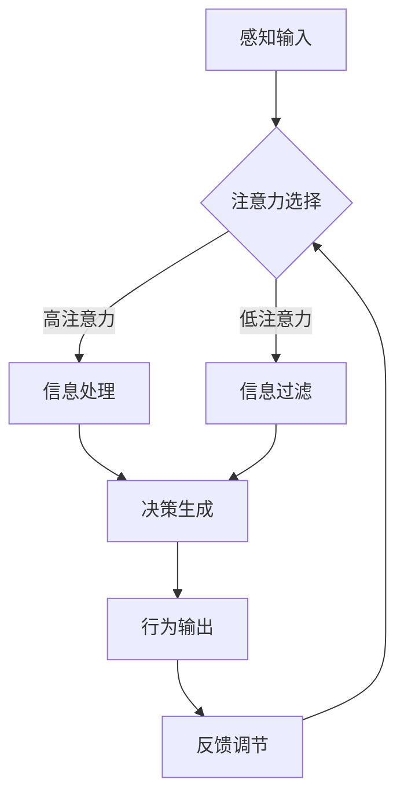

                 

### 文章标题：AI与人类注意力流：未来的工作、技能与注意力流管理技术的创新应用

#### 关键词：
- 人工智能
- 注意力流
- 工作变革
- 技能发展
- 注意力流管理

> 摘要：本文探讨了人工智能（AI）与人类注意力流之间的关系，以及注意力流管理技术在未来的工作、技能发展中的应用。首先，我们对AI和注意力流的基本概念进行了概述，并分析了它们之间的相互作用。接着，我们深入探讨了人类注意力流的基本原理，包括其理论基础、生物心理学机制和计算模型。随后，我们详细介绍了AI注意力流管理的技术手段、应用场景和挑战与应对策略。文章还探讨了未来工作技能的变革趋势，以及注意力流管理技术在教育、医疗、娱乐等领域的创新应用。最后，通过案例研究和未来展望，我们对AI与注意力流管理技术的前景进行了深入分析，并提出了政策与伦理的挑战及应对策略。本文旨在为读者提供一个全面、系统的了解和思考AI与注意力流管理在未来的发展方向。

## 第一部分：AI与注意力流基础

### 第1章：AI与注意力流概述

#### 1.1 AI的定义与分类

##### 1.1.1 AI的定义

人工智能（Artificial Intelligence，简称AI）是指计算机系统模拟人类智能行为的技术和理论。它通过模仿人类的认知、推理、学习和决策过程，实现机器对数据的处理、理解和生成。AI的研究始于20世纪50年代，经历了多个发展阶段，包括符号主义、连接主义、行为主义和统计学习等。

- **符号主义**：基于符号逻辑和知识表示的方法，通过构建规则库和推理机来模拟人类思维过程。
- **连接主义**：基于神经网络和深度学习的模型，通过大规模数据训练来学习复杂的特征表示和模式识别。
- **行为主义**：侧重于机器在特定环境中的行动效果，通过强化学习和基于 reward 的方法来优化行为。
- **统计学习**：基于概率统计和优化理论，通过数据挖掘和机器学习算法来发现数据中的规律和预测模型。

##### 1.1.2 AI的分类

根据不同的分类标准，AI可以分为多种类型：

- **根据应用领域**：可分为通用AI（AGI，Artificial General Intelligence）和专用AI（Narrow AI）。通用AI具备与人类相似的广泛认知能力，而专用AI则针对特定任务进行优化。
- **根据学习方法**：可分为监督学习、无监督学习和强化学习。监督学习通过标注数据进行训练，无监督学习通过未标注数据学习数据分布，强化学习通过交互和反馈进行学习。
- **根据系统结构**：可分为集中式AI和分布式AI。集中式AI集中处理数据和任务，而分布式AI将计算任务分布在多个节点上进行处理。

#### 1.2 注意力流的概念

注意力流（Attention Flow）是指在人类大脑中，注意力在不同任务、情境和感官输入之间转移和分配的过程。它是一个动态的过程，涉及感知、记忆、决策和行为等多个方面。

- **感知阶段**：个体通过感官接收外部信息，注意力的集中程度决定了信息处理的速度和质量。
- **记忆阶段**：注意力在记忆系统中选择性地保持和编码信息，影响记忆的保持和回忆。
- **决策阶段**：注意力在执行决策时起到关键作用，决定个体对目标的追求和选择的优先级。
- **行为阶段**：注意力的分配和转移直接影响个体的行为表现和效果。

##### 1.2.1 注意力流的起源和发展

注意力流的概念起源于神经科学和心理学的研究，早期的注意力研究主要集中在感知和记忆方面。随着认知科学的兴起，注意力流逐渐扩展到认知过程和行为控制的范畴。

- **神经科学视角**：研究发现，注意力流涉及多个大脑区域的协同工作，包括前额叶皮层、顶叶皮层和基底神经节等。
- **心理学视角**：注意力流的研究关注个体在多任务环境中的注意力分配策略和心理机制。

##### 1.2.2 注意力流的概念模型

注意力流可以被视为一个动态的决策过程，其核心是注意力的选择和分配。以下是一个简化的注意力流概念模型：

1. **感知输入**：外部信息通过感官传入大脑。
2. **注意力选择**：大脑根据当前任务和情境选择关注的信息。
3. **信息处理**：选择的信息被进一步处理和加工。
4. **决策生成**：根据处理结果生成决策或行动。
5. **行为输出**：执行决策或行动。

#### 1.3 AI与注意力流的关联

##### 1.3.1 AI与注意力流的相互作用

AI的发展对人类注意力流产生了深远的影响，主要体现在以下几个方面：

- **信息处理效率**：AI系统可以自动化和优化大量的数据处理任务，减轻人类的认知负担，提高注意力流的效率。
- **注意力调节**：AI可以通过分析人类行为数据，提供个性化的注意力调节建议，优化注意力的分配和利用。
- **情境感知**：AI系统可以感知和识别环境变化，提供实时反馈和调整，帮助人类更好地适应不同情境。
- **决策支持**：AI系统可以提供基于数据和算法的决策支持，减少人类决策中的不确定性，提高注意力流的准确性。

##### 1.3.2 AI注意力流管理的重要性

AI注意力流管理是指在AI系统的辅助下，优化和调节人类注意力流的过程。其重要性体现在：

- **工作与生活效率**：通过AI注意力流管理，个体可以在工作和生活中更加高效地分配注意力，提高任务完成质量和速度。
- **心理健康**：有效的注意力流管理有助于减轻压力和焦虑，改善心理健康状况。
- **社会合作**：AI注意力流管理可以促进个体之间的协作和沟通，提高社会互动的质量和效率。
- **创新与发展**：AI注意力流管理为科研和创新提供了新的工具和方法，有助于推动科技和社会的进步。

#### 1.4 AI与注意力流的研究意义与应用前景

##### 1.4.1 AI与注意力流的研究意义

AI与注意力流的研究具有重要的学术和社会意义：

- **认知科学**：AI与注意力流的研究为认知科学提供了新的视角和方法，有助于深入理解人类注意力的工作机制。
- **心理学**：研究AI与注意力流的相互作用，可以为心理学理论的发展提供新的实证依据，丰富对人类注意力的理解。
- **计算机科学**：AI注意力流管理技术的发展，为计算机科学带来了新的应用场景和研究方向，促进了人工智能技术的进步。
- **社会学**：AI与注意力流的研究对社会学的研究提供了新的工具和方法，有助于分析人类行为和社会互动的动态过程。

##### 1.4.2 AI与注意力流的应用前景

AI与注意力流的应用前景广阔，主要体现在以下几个方面：

- **教育领域**：AI注意力流管理技术可以应用于个性化学习、学习效果评估和教师辅助教学，提高教育质量和效率。
- **工作领域**：AI注意力流管理技术可以用于任务分配、工作流程优化和员工注意力调节，提高工作效率和满意度。
- **医疗领域**：AI注意力流管理技术可以用于患者注意力监测、心理健康诊断和治疗，提供个性化的医疗服务。
- **娱乐领域**：AI注意力流管理技术可以用于个性化娱乐内容推荐、用户体验优化和游戏设计，提高用户满意度。

总之，AI与注意力流的研究不仅具有重要的学术价值，还将在未来的社会发展中发挥重要作用，为人类生活带来新的变革。

### 第2章：人类注意力流的基本原理

#### 2.1 注意力流的理论基础

##### 2.1.1 注意力流的神经科学基础

注意力流的神经科学基础主要涉及大脑中与注意力相关的结构和神经机制。研究表明，注意力流与多个大脑区域的功能密切相关，包括：

- **前额叶皮层**：前额叶皮层是大脑中最重要的注意力控制区域之一，负责执行控制和注意力分配。它通过神经元网络与其他大脑区域（如顶叶、颞叶和扣带回）进行广泛的连接，实现注意力的调节和转移。
- **顶叶皮层**：顶叶皮层在注意力的感知和空间定位中起着关键作用。它通过神经元网络与前额叶皮层和其他感觉处理区域（如视觉皮层、听觉皮层）进行连接，帮助个体选择和聚焦注意。
- **扣带回**：扣带回是一个涉及多种认知功能的脑区，包括注意力的调控、记忆和情绪处理。它在注意力的分配和维持中起到关键作用，通过与其他脑区的连接，调节注意力的流向和强度。

这些脑区的功能相互协作，形成一个复杂的神经网络，实现注意力的动态调节和分配。神经元间的连接和活动模式决定了注意力的流经路径和强度，从而影响个体的感知、记忆和决策过程。

##### 2.1.2 注意力流的心理学理论

心理学中关于注意力流的理论多种多样，其中最具代表性的包括：

- **认知控制理论**：认知控制理论强调注意力在信息处理过程中的调节作用。该理论认为，注意力是一个认知资源，通过选择和过滤信息，帮助个体在复杂环境中进行有效的任务处理。注意力流的调节过程涉及到认知资源的分配和转换，从而影响个体的认知表现。
- **选择注意理论**：选择注意理论认为，注意力是一种选择性的信息处理过程，通过选择性地关注特定刺激，排除无关刺激，实现信息的高效处理。该理论强调注意力的选择性机制，如知觉选择、注意焦点和注意力分配，以及这些机制在注意力流中的动态变化。
- **多任务处理理论**：多任务处理理论关注个体在同时处理多个任务时的注意力流。该理论认为，个体通过注意力的动态分配和切换，在不同的任务间进行有效的切换和处理。多任务处理涉及到注意力的灵活调节和分配，以适应不同的任务需求。

这些心理学理论为理解注意力流提供了不同的视角和解释框架，有助于深入探讨注意力的机制和功能。

#### 2.2 注意力流的生物心理学机制

##### 2.2.1 注意力流的产生机制

注意力流的产生是一个复杂的过程，涉及到多个神经机制和神经递质的相互作用。以下是一些关键机制：

- **神经元活动模式**：神经元的活动模式是注意力流的基础。当大脑接收到外部刺激时，相关的神经元会被激活，产生电生理信号。这些神经元的活动模式决定了注意力的流向和强度。例如，当个体关注某个特定物体时，与该物体相关的神经元会呈现高度激活状态，而其他神经元的活动则会降低。
- **神经递质调控**：神经递质是神经元间传递信号的化学物质，对注意力流的产生和调节起到关键作用。例如，多巴胺是一种与奖励和动机相关的神经递质，它在注意力流的调节中起到重要作用。当个体接收到具有奖励价值的刺激时，多巴胺的释放会增加，从而增强注意力的流向和强度。
- **神经网络连接**：大脑中不同区域的神经网络连接是注意力流产生的关键。这些神经网络通过反复的神经元活动，形成复杂的连接模式，从而实现注意力的调节和转移。例如，前额叶皮层和顶叶皮层的神经网络连接，可以帮助个体在不同任务间进行灵活的注意力分配和转移。

##### 2.2.2 注意力流的调节机制

注意力流的调节机制是指个体如何根据不同的任务和环境需求，灵活调节和调整注意力流的流向和强度。以下是一些主要的调节机制：

- **认知控制**：认知控制是调节注意力流的重要机制。个体通过认知控制，可以主动选择和调整注意力的流向，以适应不同的任务需求。例如，当个体需要专注于一个任务时，可以通过自我调节和注意力聚焦，将注意力从无关刺激中分离出来。
- **情境感知**：情境感知是调节注意力流的另一个重要机制。个体根据当前环境和情境的需求，可以自动调整注意力的流向和强度。例如，当个体处于一个嘈杂的环境中时，会自动将注意力转移到关键信息，以避免干扰。
- **反馈调节**：反馈调节是指通过感知和反馈来调整注意力流。当个体完成一个任务或接收到外部反馈时，可以根据反馈结果来调整注意力的流向和强度。例如，当个体发现自己在某个任务上表现不佳时，可以通过调整注意力的流向，重新聚焦和强化相关任务。

这些调节机制相互作用，共同实现注意力的动态调节和分配，以适应不同的任务和环境需求。

##### 2.2.3 注意力流的模型与计算方法

注意力流的模型与计算方法是指如何通过数学模型和计算方法来描述和模拟注意力流的过程。以下是一些常用的模型和计算方法：

- **注意力模型**：注意力模型是描述注意力流的核心模型。常见的注意力模型包括加性注意力模型和乘性注意力模型。加性注意力模型通过将注意力加权到不同的输入特征上，实现注意力的分配和聚焦。乘性注意力模型则通过将注意力与输入特征相乘，实现注意力的增强和抑制。
- **神经网络模型**：神经网络模型是模拟注意力流的重要工具。常见的神经网络模型包括卷积神经网络（CNN）、循环神经网络（RNN）和变换器（Transformer）。这些模型通过训练大量的数据，学习到复杂的信息处理和注意力分配机制，从而实现高效的注意力流模拟。
- **计算方法**：计算方法是实现注意力流模型的关键。常用的计算方法包括矩阵乘法、卷积运算和池化操作。这些方法通过高效的计算和优化，实现注意力流的快速计算和调整。

这些模型和计算方法为模拟和优化注意力流提供了有效的工具和方法，有助于深入理解和应用注意力流。

#### 2.3 注意力流的测量方法

##### 2.3.1 注意力流的实验测量方法

注意力流的实验测量方法是指通过实验手段来检测和测量注意力流的过程和特征。以下是一些常用的实验测量方法：

- **电生理测量**：电生理测量是通过记录大脑的电活动来测量注意力流。常用的电生理测量方法包括脑电图（EEG）、事件相关电位（ERP）和局部场电位（LFP）。这些方法可以直接反映大脑中神经元的活动模式，从而测量注意力流的动态变化。
- **眼动测量**：眼动测量是通过记录眼球运动来测量注意力流。眼动测量可以检测个体在视觉环境中的注意力分配和焦点变化，从而分析注意力的流向和强度。
- **行为测量**：行为测量是通过记录个体的行为表现来测量注意力流。行为测量可以检测个体在完成不同任务时的注意力分配和决策过程，从而评估注意力的效率和效果。

这些实验测量方法为研究注意力流的动态变化和机制提供了重要的手段。

##### 2.3.2 注意力流的数据分析方法

注意力流的数据分析方法是指通过数据处理和统计分析来分析和解释注意力流的数据。以下是一些常用的数据分析方法：

- **时频分析**：时频分析是通过将时间序列数据转换为频域数据，分析注意力流的频率和周期性特征。常用的时频分析方法包括短时傅里叶变换（STFT）和小波变换。
- **模式识别**：模式识别是通过机器学习算法来识别和分类注意力流的特征模式。常用的模式识别方法包括支持向量机（SVM）、决策树和神经网络。
- **统计分析**：统计分析是通过统计方法来分析和解释注意力流的数据。常用的统计分析方法包括方差分析（ANOVA）、回归分析和相关分析。

这些数据分析方法为深入分析和理解注意力流提供了有效的工具和方法。

### 第3章：AI注意力流的管理与应用

#### 3.1 AI注意力流管理的技术手段

##### 3.1.1 注意力流检测技术

注意力流检测技术是指通过使用AI技术来检测和识别个体在不同情境和任务中的注意力流状态。以下是几种常用的注意力流检测技术：

- **基于眼动追踪的检测技术**：眼动追踪是通过记录眼球运动来检测注意力流的技术。通过分析眼球的注视点、注视时间和扫视路径，可以推断个体的注意力流向和强度。常用的眼动追踪设备包括眼动仪和摄像头。
- **基于脑电信号的检测技术**：脑电信号（EEG）检测是通过记录大脑的电活动来检测注意力流的技术。通过分析脑电信号的特征，如振幅、频率和相位，可以识别个体的注意力状态。常用的脑电信号分析方法包括事件相关电位（ERP）和频率分析。
- **基于行为数据的检测技术**：行为数据检测是通过分析个体的行为表现，如键盘输入、鼠标操作和生理指标（如心率、皮肤电反应）来检测注意力流。这些数据可以通过传感器和记录设备进行收集和分析。

这些注意力流检测技术可以单独使用，也可以结合使用，以提高检测的准确性和可靠性。

##### 3.1.2 注意力流调节技术

注意力流调节技术是指通过使用AI技术来调节和优化个体在不同情境和任务中的注意力流。以下是几种常用的注意力流调节技术：

- **基于强化学习的调节技术**：强化学习是一种通过试错和反馈来学习的机器学习技术。在注意力流调节中，个体可以通过尝试不同的注意力调节策略，并根据奖励和惩罚进行优化。常用的强化学习算法包括Q学习和深度强化学习。
- **基于优化算法的调节技术**：优化算法是一种通过优化目标函数来寻找最优解的算法。在注意力流调节中，可以通过优化注意力流的分配和转移，实现注意力的最佳分配。常用的优化算法包括线性规划和神经网络优化。
- **基于规则推理的调节技术**：规则推理是一种基于预设规则来指导决策的方法。在注意力流调节中，可以根据不同情境和任务的需求，预设一系列规则来指导注意力的分配和转移。常用的规则推理方法包括条件推理和决策树。

这些注意力流调节技术可以根据具体的应用需求和场景进行选择和组合，以实现最佳的注意力流调节效果。

##### 3.1.3 注意力流预测技术

注意力流预测技术是指通过使用AI技术来预测个体在不同情境和任务中的注意力流变化。以下是几种常用的注意力流预测技术：

- **基于时间序列预测的注意力流预测技术**：时间序列预测是一种通过分析历史数据来预测未来趋势的方法。在注意力流预测中，可以通过分析个体的历史行为数据和注意力流数据，预测未来的注意力流变化。常用的时间序列预测算法包括ARIMA模型和LSTM网络。
- **基于概率模型的注意力流预测技术**：概率模型是一种通过概率分布来描述和预测不确定事件的方法。在注意力流预测中，可以通过建立概率模型来预测个体的注意力流变化。常用的概率模型包括贝叶斯网络和高斯过程。
- **基于深度学习的注意力流预测技术**：深度学习是一种通过多层神经网络来学习和预测数据的方法。在注意力流预测中，可以通过训练深度学习模型，学习到个体的注意力流特征，并预测未来的注意力流变化。常用的深度学习模型包括卷积神经网络（CNN）和循环神经网络（RNN）。

这些注意力流预测技术可以提高个体对注意力流变化的预测能力，从而为决策和干预提供依据。

#### 3.2 AI注意力流管理的应用场景

##### 3.2.1 教育领域

在教育领域，AI注意力流管理技术可以应用于个性化学习、学习效果评估和教师辅助教学等方面：

- **个性化学习**：通过监测和分析学生的注意力流，AI系统可以识别学生在学习过程中的注意力变化和需求，提供个性化的学习资源和策略。例如，当学生注意力不集中时，系统可以自动调整教学节奏、增加互动环节或提供休息时间，以帮助学生更好地保持注意力。
- **学习效果评估**：通过分析学生的注意力流数据，教师可以了解学生的学习状态和效果，及时调整教学方法和策略。例如，教师可以通过注意力的分布和变化情况，发现学生可能存在的注意力问题，从而提供有针对性的辅导和指导。
- **教师辅助教学**：AI系统可以根据教师的教学内容和风格，提供个性化的教学建议和反馈。例如，当教师讲授重点内容时，系统可以自动识别并提醒教师加强讲解，以确保学生充分理解和掌握关键知识点。

##### 3.2.2 工作领域

在工作领域，AI注意力流管理技术可以应用于任务分配、工作流程优化和员工注意力调节等方面：

- **任务分配**：通过分析员工的注意力流数据，管理者可以更合理地分配工作任务，确保员工在最佳状态下完成工作。例如，当员工注意力集中度较高时，可以分配更复杂和重要的任务，而当注意力集中度较低时，可以安排较为简单的任务或休息。
- **工作流程优化**：AI系统可以分析工作流程中的注意力流变化，发现流程中的瓶颈和问题，并提出优化建议。例如，通过分析员工的注意力流数据，系统可以识别出哪些任务需要更长时间处理，并提出改进流程的方法，以减少员工的工作负担。
- **员工注意力调节**：通过监测和分析员工的注意力流数据，管理者可以提供个性化的注意力调节建议，帮助员工保持高效工作状态。例如，当员工注意力集中度下降时，系统可以提醒员工进行短暂的休息或提供一些注意力调节技巧，以恢复注意力和提高工作效率。

##### 3.2.3 医疗领域

在医疗领域，AI注意力流管理技术可以应用于患者注意力监测、心理健康诊断和治疗等方面：

- **患者注意力监测**：通过监测患者的注意力流，医生可以了解患者的注意力状态和病情变化，为诊断和治疗提供依据。例如，对于注意力缺陷障碍（ADHD）患者，通过监测注意力流数据，医生可以评估患者的注意力水平，制定个性化的治疗计划。
- **心理健康诊断**：通过分析患者的注意力流数据，AI系统可以识别患者可能存在的心理健康问题，提供早期的预警和干预。例如，通过分析患者的注意力流数据，系统可以识别出患者可能存在的焦虑、抑郁等情绪问题，并提醒医生进行进一步的评估和干预。
- **治疗**：AI注意力流管理技术可以用于心理健康治疗，提供个性化的治疗建议和干预方法。例如，通过监测患者的注意力流数据，系统可以识别出患者注意力不集中的原因，并提供针对性的训练和调节方法，帮助患者提高注意力和改善心理健康状况。

##### 3.2.4 娱乐领域

在娱乐领域，AI注意力流管理技术可以应用于个性化娱乐内容推荐、用户体验优化和游戏设计等方面：

- **个性化娱乐内容推荐**：通过分析用户的注意力流数据，AI系统可以推荐用户感兴趣的娱乐内容和活动。例如，当用户在观看视频时，系统可以分析用户的注意力流向和变化，推荐符合用户兴趣的内容，提高用户的观看体验。
- **用户体验优化**：通过监测用户的注意力流数据，AI系统可以优化娱乐产品和服务的用户体验。例如，通过分析用户的注意力流向和变化，系统可以调整界面布局、内容呈现方式和互动设计，以提高用户的满意度和参与度。
- **游戏设计**：AI注意力流管理技术可以用于游戏设计，提供个性化的游戏体验和挑战。例如，通过分析玩家的注意力流数据，系统可以动态调整游戏的难度、奖励机制和互动设计，以保持玩家的兴趣和挑战性。

这些应用场景展示了AI注意力流管理技术在各个领域的广泛应用和潜力，为人们的工作、学习和娱乐带来了新的变革和提升。

#### 3.3 AI注意力流管理的挑战与应对策略

##### 3.3.1 隐私与伦理问题

AI注意力流管理涉及对个体的感知、行为和神经活动数据进行收集和分析，这引发了隐私保护和伦理问题：

- **隐私保护**：注意力流数据可能包含敏感信息，如个人偏好、情绪状态和健康记录。如何在确保数据隐私的同时，有效利用这些数据进行研究和服务，是一个重要挑战。应对策略包括：
  - **数据加密**：对收集的数据进行加密，确保数据在传输和存储过程中不被非法访问。
  - **匿名化处理**：对个人身份信息进行匿名化处理，确保数据分析过程中不涉及个人隐私。

- **伦理问题**：AI注意力流管理可能涉及伦理问题，如数据使用的透明度和责任归属。应对策略包括：
  - **伦理审查**：建立伦理审查委员会，对数据收集、分析和应用进行伦理评估和监督。
  - **用户同意**：确保用户在参与研究和服务时，明确了解数据收集的目的和使用方式，并提供选择退出机制。

##### 3.3.2 技术挑战

AI注意力流管理面临的技术挑战主要包括：

- **准确性**：注意力流检测和调节的准确性受到多种因素的影响，如设备精度、数据噪声和个体差异。提高检测准确性的方法包括：
  - **多模态数据融合**：结合多种数据源（如眼动、脑电和行为数据），提高注意力流的检测和预测精度。
  - **算法优化**：通过不断优化算法模型，提高数据处理的效率和准确性。

- **可靠性**：注意力流管理系统的可靠性直接影响到用户体验和工作效率。提高系统可靠性的方法包括：
  - **实时性**：确保系统可以实时响应和调节注意力流，减少延迟和误差。
  - **鲁棒性**：通过训练模型对不同环境和条件下的数据具有较好的适应性，提高系统的鲁棒性。

- **可扩展性**：随着数据量和应用场景的增加，注意力流管理系统需要具备良好的可扩展性。应对策略包括：
  - **分布式计算**：采用分布式计算架构，提高系统处理大数据的能力。
  - **模块化设计**：将系统设计为模块化结构，方便功能扩展和更新。

##### 3.3.3 应对策略

为了应对隐私、伦理和技术挑战，可以采取以下策略：

- **技术创新**：持续研发和优化注意力流检测和调节技术，提高系统的准确性和可靠性。
- **政策法规**：制定相关政策和法规，规范注意力流数据的收集、分析和应用，确保数据隐私和用户权益。
- **伦理教育**：加强伦理教育，提高研究人员和开发者的伦理意识，确保数据使用符合伦理标准。
- **用户参与**：鼓励用户参与系统设计和评估，确保系统的应用符合用户需求和期望。

通过这些策略，可以有效应对AI注意力流管理中的挑战，推动该领域的发展和应用。

### 第4章：未来工作的变革

#### 4.1 AI对工作的影响

AI技术正在深刻改变着工作的面貌，主要体现在以下几个方面：

##### 4.1.1 AI对传统职业的影响

- **自动化和取代**：随着AI技术的发展，许多传统职业正面临着自动化和取代的风险。例如，制造业中的自动化生产线、金融服务中的智能投顾和客服行业中的智能客服系统，都极大地改变了传统的工作方式和职业结构。
- **职业转型**：AI的发展也促使传统职业向更高层次的技能和知识结构转型。例如，在医疗领域，AI技术可以帮助医生更快速、准确地诊断疾病，但同时也要求医生具备更高水平的医学知识和数据处理能力。

##### 4.1.2 AI对工作流程的影响

- **自动化**：AI技术可以实现许多重复性和规则性的工作流程自动化，从而提高工作效率和准确性。例如，在物流和仓储行业中，自动化的分拣和搬运设备大大减少了人力成本，提高了物流效率。
- **流程优化**：AI技术可以通过分析大量的数据，识别出工作流程中的瓶颈和改进点，提出优化方案。例如，在金融行业中，AI技术可以帮助银行和金融机构识别风险、预测市场趋势，从而优化决策流程。

#### 4.2 新型职业的出现

随着AI技术的发展，许多新型职业正在不断涌现，这些职业通常与AI技术密切相关：

##### 4.2.1 新型职业的特点

- **技术驱动型**：新型职业通常需要较高的技术背景，如数据科学家、机器学习工程师和AI系统架构师等。
- **跨学科融合**：新型职业往往融合了多个学科的知识，如计算机科学、统计学、生物学和心理学等，以应对复杂的问题和挑战。

##### 4.2.2 新型职业的分类

- **技术开发类职业**：这些职业包括AI算法工程师、机器学习研究员和深度学习开发人员等，主要负责开发和优化AI算法和系统。
- **数据分析与解释类职业**：这些职业包括数据分析师、业务智能分析师和数据可视化专家等，负责分析数据、提取信息并解释其商业意义。
- **应用与维护类职业**：这些职业包括AI应用工程师、AI系统维护专家和AI产品经理等，负责将AI技术应用于实际业务场景，并进行系统的维护和优化。

#### 4.3 工作技能的需求变化

随着AI技术的发展，工作技能的需求也在不断变化：

##### 4.3.1 传统技能的需求变化

- **专业化**：传统技能正在向更专业和细分的方向发展，如高级编程技能、专业数据分析工具的使用等。
- **升级与整合**：许多传统技能需要与AI技术进行整合，如将数据分析技能与机器学习算法相结合，以提高数据处理和分析的效率。

##### 4.3.2 新兴技能的需求

- **技术创新能力**：新兴职业要求个体具备较强的技术创新能力，能够不断学习和适应新的技术趋势。
- **跨学科合作能力**：新兴职业通常需要跨学科的合作，要求个体具备良好的沟通能力和团队合作精神。
- **适应性**：新兴职业要求个体具备较高的适应性和灵活性，能够快速适应新技术和变化的工作环境。

总之，AI技术的发展正在推动传统职业的转型和新职业的涌现，对工作技能的需求也发生了深刻的变化。个体需要不断学习和提升技能，以适应这一变化，实现职业发展的新机遇。

### 第5章：技能发展的趋势

#### 5.1 技能的分类与特点

技能的发展趋势受到技术进步、社会需求和个体差异等多种因素的影响，不同类型的技能具有不同的特点和重要性。

##### 5.1.1 技能的分类

- **硬技能（Hard Skills）**：硬技能是指那些可以通过标准化测试或实践证明的具体能力，如编程、数据分析、机械操作等。这些技能通常是技术驱动型职业的核心，对职业发展和个人绩效具有直接影响。
- **软技能（Soft Skills）**：软技能是指那些更侧重于人际交往、情感管理和团队合作的能力，如沟通技巧、领导力、团队合作和情绪管理等。软技能在职业发展中同样至关重要，尤其是在需要跨部门协作和管理复杂项目的情况下。
- **新兴技能（Emerging Skills）**：随着技术的快速发展，新兴技能如人工智能、机器学习、区块链和物联网等正在迅速崛起。这些技能代表了未来职业发展的方向，要求个体具备较强的学习和适应能力。

##### 5.1.2 技能的特点

- **可迁移性**：技能的可迁移性是指一种技能能够在不同环境和领域中应用。例如，编程技能不仅可以在软件开发领域应用，还可以在数据分析、自动化和算法设计等领域发挥作用。
- **动态性**：技能的动态性体现在技能的快速更新和变化。随着新技术的不断涌现，个体需要不断学习和适应新的技能，以保持竞争力。
- **综合性**：综合性技能是指那些结合了多种技能领域的知识，如数据科学家需要同时掌握编程、统计学和业务知识，以有效地处理和分析复杂数据。

#### 5.2 技能学习的途径

技能学习是一个持续和动态的过程，个体可以通过多种途径获取和提升技能：

##### 5.2.1 传统学习途径

- **学校教育**：学校教育是获取系统知识和技能的重要途径。通过正式的教育体系，个体可以获得理论知识、专业知识和实践技能。例如，计算机科学专业的学生可以通过课程学习掌握编程、算法和数据结构等核心技能。
- **在职培训**：在职培训是针对在职人员提升职业技能的一种有效方式。企业通常提供内部培训项目，帮助员工掌握新技术和业务需求。例如，软件开发公司可能会组织编程语言或开发框架的培训，以提高开发团队的技术水平。
- **自我学习**：自我学习是指个体通过自学资源和在线课程来获取知识。随着互联网技术的发展，大量在线学习资源（如MOOCs、专业博客和开源项目）使得自我学习变得更加便捷和高效。例如，通过在线课程，个体可以学习最新的编程语言、数据分析工具和人工智能技术。

##### 5.2.2 现代学习途径

- **在线学习**：在线学习是一种灵活的学习方式，允许个体根据自己的时间表和节奏进行学习。在线学习平台（如Coursera、edX和Udemy）提供了丰富的课程资源，覆盖了从入门到高级的各个层次。例如，通过在线课程，个体可以学习最新的机器学习算法和深度学习技术。
- **知识图谱和推荐系统**：知识图谱和推荐系统通过分析和推荐个性化学习路径，帮助个体高效地学习和提升技能。例如，知识图谱可以识别出个体当前掌握的技能和未掌握的技能，推荐相应的学习资源，以实现知识的有机整合和提升。
- **社交学习**：社交学习通过在线社区和同行交流，促进知识的分享和技能的提升。例如，通过技术论坛和社交媒体平台（如Stack Overflow和GitHub），个体可以提问、解答问题，并与全球的同行进行合作和交流，共同进步。

#### 5.3 技能评价与认证

技能评价与认证是衡量个体技能水平的重要手段，有助于促进职业发展和人才选拔：

##### 5.3.1 技能评价的方法

- **成果评价**：成果评价通过评估个体在实际工作或项目中的表现和成果，衡量其技能水平。例如，通过项目的完成情况、代码质量和客户满意度等指标，评估开发人员的编程技能。
- **过程评价**：过程评价通过评估个体在学习和实践过程中的表现和参与度，衡量其学习能力和进步。例如，通过课堂参与度、作业完成情况和小组讨论表现等指标，评估学生的学习情况。
- **综合评价**：综合评价通过结合成果评价和过程评价，全面衡量个体的技能水平。综合评价可以更准确地反映个体的实际能力和潜力，为职业发展提供更科学的指导。

##### 5.3.2 技能认证的制度

- **国际认证**：国际认证由权威机构和认证机构提供，具有广泛的认可度和权威性。例如，微软认证（Microsoft Certified Professional）和思科认证（Cisco Certified Network Associate）等国际认证，为持有者提供了全球认可的专业技能证明。
- **行业认证**：行业认证由特定行业组织或企业提供，针对行业特定的技能和知识。例如，数据科学家认证（Data Science Certification）和项目经理认证（Project Management Professional）等，为行业人才提供了专业的技能评价和认证。
- **企业认证**：企业认证由企业内部提供，针对企业特定岗位和技能要求。例如，某些企业可能会提供内部的技术专家认证或项目管理者认证，以激励员工不断提升技能，满足企业的发展需求。

技能评价与认证为个体提供了明确的目标和标准，有助于激励个体不断提升技能，同时为企业和行业提供了人才选拔和培养的有效手段。通过多种评价和认证方法，可以更全面、客观地评估个体的技能水平，促进技能的持续发展和应用。

### 第6章：注意力流管理技术的创新应用

#### 6.1 注意力流管理技术的原理

注意力流管理技术旨在通过优化和调节人类注意力流，提高个体在不同情境和任务中的工作效率和体验。以下是对注意力流管理技术原理的详细探讨：

##### 6.1.1 注意力流管理的基本原理

注意力流管理的基本原理可以概括为以下三个方面：

1. **注意力流的检测与测量**：通过使用眼动追踪、脑电信号和行为数据等手段，检测和测量个体在不同任务和情境中的注意力流向和集中度。这一过程涉及到数据采集、特征提取和模式识别等步骤，目的是准确捕捉注意力流的动态变化。
   
2. **注意力流的调节与优化**：基于对注意力流数据的分析，采取一系列策略来调节和优化注意力流。这可能包括提供个性化的注意力调节建议、调整任务难度和工作节奏、或通过环境干预（如提供背景音乐或改善工作环境）来优化注意力流。

3. **注意力流的反馈与迭代**：通过实时反馈和调整，不断优化注意力流管理策略。这涉及到数据监控、效果评估和策略迭代，以确保注意力流管理的效果持续提升。

##### 6.1.2 注意力流管理的技术框架

注意力流管理技术框架主要包括以下几个关键组成部分：

- **数据采集系统**：负责收集个体在不同任务和情境中的眼动、脑电和行为数据。这可以通过集成眼动仪、脑电帽、传感器等设备来实现。

- **数据处理模块**：对采集到的数据进行预处理、特征提取和模式识别，以便对注意力流进行有效的分析和理解。这通常涉及信号处理、机器学习和数据分析等技术。

- **注意力调节系统**：基于对注意力流数据的分析结果，采取一系列干预措施来调节和优化注意力流。这可能包括提供视觉或听觉提示、调整任务难度、或实施行为干预策略。

- **用户界面**：提供一个直观的用户界面，以展示注意力流数据、提供调节建议和反馈。这可以帮助个体更好地理解和调节自己的注意力流，从而提高工作效率和体验。

- **反馈机制**：建立实时反馈和迭代机制，根据个体对调节策略的响应和效果，不断调整和优化注意力流管理策略。这有助于实现注意力流的长期优化和持续提升。

#### 6.2 注意力流管理技术在不同领域的应用

注意力流管理技术具有广泛的应用潜力，可以在多个领域发挥重要作用：

##### 6.2.1 教育领域

在教育领域，注意力流管理技术可以应用于个性化学习、学习效果评估和教师辅助教学等方面：

- **个性化学习**：通过监测和分析学生的学习注意力流，识别出学生在学习过程中的注意力波动和难点，提供个性化的学习资源和策略。例如，当学生注意力不集中时，系统可以自动调整教学节奏或提供互动环节，帮助学生更好地保持注意力。

- **学习效果评估**：通过分析学生的学习注意力流数据，教师可以了解学生的学习状态和效果，及时调整教学方法和策略。例如，通过观察学生的注意力流向和持续时间，教师可以识别出学习效果较差的学生，提供针对性的辅导和支持。

- **教师辅助教学**：注意力流管理技术可以帮助教师优化教学设计和教学方法，提高教学效果。例如，通过分析教师的授课注意力流数据，系统可以提供个性化的教学建议，帮助教师更好地引导学生注意力。

##### 6.2.2 工作领域

在工作领域，注意力流管理技术可以应用于任务分配、工作流程优化和员工注意力调节等方面：

- **任务分配**：通过分析员工的注意力流数据，管理者可以更合理地分配工作任务，确保员工在最佳状态下完成工作。例如，当员工注意力集中度较高时，可以分配更复杂和重要的任务，而当注意力集中度较低时，可以安排较为简单的任务或休息。

- **工作流程优化**：通过分析工作流程中的注意力流变化，发现流程中的瓶颈和问题，并提出优化建议。例如，通过监测员工的注意力流向和持续时间，系统可以识别出哪些任务需要更长时间处理，并提出改进流程的方法，以提高工作效率。

- **员工注意力调节**：通过监测和分析员工的注意力流数据，提供个性化的注意力调节建议，帮助员工保持高效工作状态。例如，当员工注意力集中度下降时，系统可以提醒员工进行短暂的休息或提供一些注意力调节技巧，如深呼吸或冥想，以恢复注意力和提高工作效率。

##### 6.2.3 医疗领域

在医疗领域，注意力流管理技术可以应用于患者注意力监测、心理健康诊断和治疗等方面：

- **患者注意力监测**：通过监测患者的注意力流，医生可以了解患者的注意力状态和病情变化，为诊断和治疗提供依据。例如，在手术过程中，通过监测患者的注意力流向和变化，医生可以及时发现患者的注意力分散情况，并采取相应的措施。

- **心理健康诊断**：通过分析患者的注意力流数据，医生可以识别患者可能存在的心理健康问题，提供早期的预警和干预。例如，通过监测患者的注意力流向和变化，系统可以识别出患者可能存在的焦虑、抑郁等情绪问题，并提醒医生进行进一步的评估和干预。

- **治疗**：注意力流管理技术可以用于心理健康治疗，提供个性化的治疗建议和干预方法。例如，通过监测患者的注意力流数据，系统可以识别出患者注意力不集中的原因，并提供针对性的训练和调节方法，如正念冥想或注意力训练，以帮助患者提高注意力和改善心理健康状况。

##### 6.2.4 娱乐领域

在娱乐领域，注意力流管理技术可以应用于个性化娱乐内容推荐、用户体验优化和游戏设计等方面：

- **个性化娱乐内容推荐**：通过分析用户的注意力流数据，推荐用户感兴趣的娱乐内容和活动。例如，当用户在观看视频时，系统可以分析用户的注意力流向和变化，推荐符合用户兴趣的内容，提高用户的观看体验。

- **用户体验优化**：通过监测用户的注意力流数据，优化娱乐产品和服务的用户体验。例如，通过分析用户的注意力流向和变化，系统可以调整界面布局、内容呈现方式和互动设计，以提高用户的满意度和参与度。

- **游戏设计**：注意力流管理技术可以用于游戏设计，提供个性化的游戏体验和挑战。例如，通过分析玩家的注意力流数据，系统可以动态调整游戏的难度、奖励机制和互动设计，以保持玩家的兴趣和挑战性。

总之，注意力流管理技术在教育、工作、医疗和娱乐等领域的应用展示了其广泛的影响和潜力，为个体在不同情境下的注意力优化提供了有力的支持。

#### 6.3 注意力流管理技术的未来发展

##### 6.3.1 技术发展趋势

随着人工智能和神经科学技术的不断进步，注意力流管理技术也在迅速发展。以下是几个关键的技术发展趋势：

1. **智能化与自动化**：未来的注意力流管理技术将更加智能化和自动化。通过深度学习和强化学习算法，系统能够自动识别和预测个体的注意力状态，提供实时和个性化的调节建议。这有助于减少人工干预，提高管理效率和准确性。

2. **数据驱动与个性化**：注意力流管理技术将越来越依赖大数据和人工智能算法，通过分析大量个体数据，为用户提供个性化的注意力和优化建议。这种数据驱动的方法将有助于实现更加精准和有效的注意力管理。

3. **跨领域融合**：注意力流管理技术将在多个领域（如教育、工作、医疗和娱乐）实现跨领域的融合。不同领域的应用需求和技术特点将相互借鉴和整合，形成更全面和综合的注意力流管理体系。

4. **多模态数据融合**：未来的注意力流管理技术将结合多种数据源（如眼动、脑电、行为和生理信号），实现多模态数据融合。这种融合方法可以提供更全面和准确的注意力流监测和调节，从而提升系统的性能和效果。

##### 6.3.2 技术挑战与解决方案

尽管注意力流管理技术在不断发展，但仍面临一些技术挑战：

1. **准确性**：注意力流的检测和预测需要高精度的算法和数据。目前，眼动追踪和脑电信号的准确性仍有限，如何提高这些技术的精度是一个重要挑战。可能的解决方案包括：改进传感器技术、开发更先进的信号处理算法以及结合多模态数据提高准确性。

2. **可靠性**：注意力流管理系统的可靠性直接影响到用户体验和工作效率。如何确保系统在各种环境下的稳定性和鲁棒性是一个关键挑战。可能的解决方案包括：建立大规模的数据集进行训练，提高模型的泛化能力；采用容错和冗余设计，提高系统的可靠性。

3. **隐私与伦理**：注意力流管理涉及对敏感数据的收集和分析，这引发了隐私保护和伦理问题。如何保护用户隐私，确保数据的安全性和透明度是一个重要挑战。可能的解决方案包括：采用加密技术和数据匿名化方法；建立伦理审查机制，确保数据使用符合伦理标准。

4. **可扩展性**：随着应用的不断扩大，如何确保注意力流管理系统的可扩展性是一个挑战。可能的解决方案包括：采用分布式计算和云计算技术，提高系统的处理能力和可扩展性。

通过不断的技术创新和优化，注意力流管理技术将在未来实现更广泛的应用和更高的效率，为个体在不同情境下的注意力优化提供更强大的支持。

### 第7章：AI与注意力流管理的实践案例

#### 7.1 案例一：注意力流管理在职场中的应用

##### 7.1.1 案例背景

某大型科技公司（以下简称“公司”）在面临市场竞争加剧和员工工作效率不高的挑战时，决定引入AI注意力流管理技术，以提高员工的工作效率和整体生产力。公司希望通过实时监测和分析员工的注意力流，识别出注意力分散的原因，并提供针对性的解决方案。

##### 7.1.2 案例实施

1. **数据采集**：公司为员工配备了智能工作设备，包括带有眼动追踪功能的工作站和脑电图（EEG）传感器。通过这些设备，公司能够实时收集员工在工作中的注意力流数据。

2. **数据处理**：公司使用先进的机器学习算法对收集到的数据进行预处理、特征提取和模式识别。通过分析眼动数据和脑电图信号，系统能够准确捕捉员工在完成任务时的注意力流向和集中度。

3. **注意力调节**：基于数据分析结果，公司开发了一套注意力调节系统。该系统根据员工的注意力状态，提供个性化的调节建议。例如，当员工注意力分散时，系统会提醒员工休息或调整任务难度。

4. **效果评估**：公司对注意力流管理系统的效果进行了持续的监测和评估。通过对比实施前后的工作数据，公司发现员工的工作效率显著提高，任务完成时间缩短，员工满意度也得到提升。

##### 7.1.3 案例分析

**成功经验**：

- **数据驱动**：公司通过数据驱动的方法，准确捕捉和分析员工的注意力流，为决策提供了科学依据。
- **个性化调节**：系统根据员工的个性化需求，提供有针对性的注意力调节建议，提高了员工的工作效率和满意度。
- **实时反馈**：系统的实时反馈功能帮助员工及时调整注意力，避免了因长时间工作导致的疲劳和效率下降。

**存在问题**：

- **隐私与伦理**：虽然公司采取了加密和数据匿名化措施，但员工对注意力流数据的收集和利用仍存在一定的担忧。
- **系统可靠性**：部分员工反映，系统在数据采集和反馈过程中存在一定的延迟和误差，影响了使用体验。

**解决方案**：

- **隐私保护**：公司加强员工教育，明确数据收集和使用的目的，并建立严格的隐私保护机制，增强员工的信任。
- **系统优化**：公司对注意力流管理系统进行技术优化，提高数据的采集和处理效率，减少延迟和误差。

通过这个案例，我们可以看到AI注意力流管理技术在实际职场中的应用，不仅提高了工作效率，还带来了员工满意度的提升。然而，隐私保护和系统可靠性仍然是需要持续关注和改进的问题。

#### 7.2 案例二：AI注意力流管理在教育领域的应用

##### 7.2.1 案例背景

某知名教育机构（以下简称“机构”）在实施在线教育过程中，发现学生的学习效果受到注意力分散的影响。为了提高学生的学习效率和参与度，机构决定引入AI注意力流管理技术，通过实时监测和分析学生的学习注意力流，提供个性化的学习支持。

##### 7.2.2 案例实施

1. **数据采集**：机构为学生配备了带有眼动追踪功能的电子学习设备和脑电图（EEG）传感器。这些设备可以实时收集学生在学习过程中的眼动和脑电信号。

2. **数据处理**：机构使用机器学习算法对收集到的数据进行处理，包括数据清洗、特征提取和模式识别。通过分析眼动和脑电图信号，系统能够准确捕捉学生的学习注意力流向和集中度。

3. **个性化学习策略**：基于数据分析结果，机构开发了一套个性化学习策略。例如，当学生注意力分散时，系统会自动调整教学节奏，增加互动环节或提供休息时间，以帮助学生集中注意力。

4. **效果评估**：机构对AI注意力流管理系统进行了多轮测试和评估。通过对比测试前后学生的学习数据，机构发现学生的学习效果显著提升，学习参与度和完成率也有所提高。

##### 7.2.3 案例分析

**成功经验**：

- **个性化支持**：通过实时监测和分析学生的学习注意力流，机构能够提供个性化的学习支持，帮助学生更好地集中注意力。
- **互动性提升**：系统的自动调整功能增加了课堂的互动性，提高了学生的参与度和积极性。
- **效果显著**：通过多轮测试和评估，AI注意力流管理系统显著提升了学生的学习效果。

**存在问题**：

- **设备成本**：为学生配备眼动和脑电图传感器增加了教育机构的设备成本。
- **技术依赖**：系统对技术依赖较高，技术故障可能影响教学效果。

**解决方案**：

- **设备成本**：机构可以通过招标和采购等方式，选择性价比高的设备供应商，以降低设备成本。
- **技术保障**：机构建立专业的技术支持团队，确保系统的稳定运行，减少技术故障的风险。

通过这个案例，我们可以看到AI注意力流管理技术在教育领域的应用，为个性化教学提供了有力支持。然而，设备成本和技术保障仍然是需要解决的问题。

#### 7.3 案例三：AI注意力流管理在医疗健康领域的应用

##### 7.3.1 案例背景

某医疗机构（以下简称“医院”）在临床治疗和康复过程中，发现患者的注意力集中度对其治疗效果和康复进程具有重要影响。为了提高治疗效果和患者满意度，医院决定引入AI注意力流管理技术，通过实时监测和分析患者的注意力流，提供个性化的治疗方案和康复指导。

##### 7.3.2 案例实施

1. **数据采集**：医院为患者配备了眼动追踪和脑电图（EEG）传感器。这些设备可以实时收集患者在治疗和康复过程中的注意力流数据。

2. **数据处理**：医院使用机器学习算法对收集到的数据进行处理，包括数据清洗、特征提取和模式识别。通过分析眼动和脑电图信号，系统能够准确捕捉患者的注意力流向和集中度。

3. **个性化治疗方案**：基于数据分析结果，医院开发了一套个性化治疗方案。例如，当患者注意力分散时，系统会自动调整治疗节奏或提供放松训练，以帮助患者更好地集中注意力。

4. **康复指导**：医院通过AI注意力流管理系统为患者提供个性化的康复指导。例如，当患者完成一项康复任务时，系统会根据其注意力流数据提供进一步的康复建议，如调整锻炼强度或增加休息时间。

5. **效果评估**：医院对AI注意力流管理系统进行了多轮测试和评估。通过对比测试前后患者的治疗效果和康复进度，医院发现患者的注意力集中度显著提升，治疗效果和康复进程也有所改善。

##### 7.3.3 案例分析

**成功经验**：

- **个性化治疗**：通过实时监测和分析患者的注意力流，医院能够提供个性化的治疗和康复方案，提高治疗效果和患者满意度。
- **注意力优化**：系统提供的个性化调整和康复指导帮助患者更好地集中注意力，促进康复进程。
- **效果显著**：通过多轮测试和评估，AI注意力流管理系统显著提升了患者的治疗和康复效果。

**存在问题**：

- **技术成本**：为患者配备眼动和脑电图传感器增加了医疗机构的设备成本。
- **技术依赖**：系统对技术依赖较高，技术故障可能影响治疗和康复进程。

**解决方案**：

- **成本控制**：医院可以通过招标和采购等方式，选择性价比高的设备供应商，以降低设备成本。
- **技术保障**：医院建立专业的技术支持团队，确保系统的稳定运行，减少技术故障的风险。

通过这个案例，我们可以看到AI注意力流管理技术在医疗健康领域的应用，为个性化治疗和康复提供了有力支持。然而，设备成本和技术保障仍然是需要解决的问题。

### 第8章：未来展望

#### 8.1 AI与注意力流管理的发展趋势

随着技术的不断进步，AI与注意力流管理领域呈现出以下几个主要发展趋势：

##### 8.1.1 技术发展趋势

1. **智能化与自动化**：未来的注意力流管理系统将更加智能化和自动化。通过深度学习和强化学习算法，系统可以自主学习和优化，提高注意力流监测和调节的准确性和效率。

2. **多模态数据融合**：未来的注意力流管理系统将结合多种数据源（如眼动、脑电、行为和生理信号），实现多模态数据融合。这种融合方法将提供更全面和准确的注意力流监测和调节。

3. **云计算与边缘计算**：随着云计算和边缘计算技术的发展，注意力流管理系统将更加高效和灵活。云计算提供了强大的计算和存储能力，边缘计算则使数据处理更加接近数据源，减少了延迟和带宽消耗。

4. **量子计算**：量子计算在处理大规模数据和复杂计算任务方面具有巨大潜力。随着量子计算技术的成熟，未来注意力流管理可能会利用量子计算的优势，提高系统性能和效率。

##### 8.1.2 应用发展趋势

1. **教育领域**：注意力流管理技术在教育领域将得到更广泛的应用。个性化学习、学习效果评估和教师辅助教学等方面将受益于注意力流管理技术的提升，提高教育质量和效果。

2. **工作领域**：注意力流管理技术将在工作领域发挥重要作用。通过优化任务分配、工作流程和员工注意力调节，企业可以提高工作效率和员工满意度。

3. **医疗健康领域**：注意力流管理技术将在医疗健康领域得到广泛应用。个性化治疗、心理健康诊断和康复指导等方面将受益于注意力流管理技术的提升，提高治疗效果和患者满意度。

4. **娱乐领域**：注意力流管理技术将在娱乐领域带来新的变革。个性化娱乐内容推荐、用户体验优化和游戏设计等方面将受益于注意力流管理技术的提升，提高用户满意度和参与度。

#### 8.2 对未来工作与生活的影响

##### 8.2.1 工作方式的改变

随着AI与注意力流管理技术的发展，未来工作方式将发生深刻变化：

1. **远程工作与居家办公**：AI与注意力流管理技术将支持更广泛的远程工作和居家办公。通过实时监测和调节注意力流，员工可以更好地保持工作专注度和效率。

2. **个性化工作流程**：注意力流管理技术可以帮助企业实现个性化工作流程设计，根据员工的能力和需求，提供最适合的工作环境和任务分配，提高工作效率和满意度。

3. **任务自动化与协同工作**：AI技术将自动化大量的重复性工作，减少员工的负担，同时提高协作效率。注意力流管理技术可以优化团队协作，提高整体工作效率。

##### 8.2.2 生活质量的提升

AI与注意力流管理技术不仅将改变工作方式，还将提升生活质量：

1. **个性化健康管理**：通过实时监测和分析个体的注意力流，AI技术可以提供个性化的健康管理建议，包括锻炼计划、饮食建议和心理健康指导，帮助个体维持良好的身体状况。

2. **智能化生活辅助**：AI注意力流管理技术将应用于智能家居、智能医疗设备和个人助理等领域，提供智能化、便捷化的生活服务，提高生活质量。

3. **心理健康支持**：注意力流管理技术可以通过监测和分析个体的情绪和行为，提供个性化的心理健康支持，帮助个体应对压力和焦虑，提高心理健康水平。

##### 8.2.3 社会伦理与法律问题

随着AI与注意力流管理技术的发展，社会伦理和法律问题也将日益突出：

1. **数据隐私**：注意力流管理涉及对个人敏感数据的收集和分析，如何保护用户隐私成为一个重要问题。需要建立严格的数据隐私保护机制，确保数据的安全性和用户权益。

2. **伦理审查**：注意力流管理技术的应用需要伦理审查，确保技术应用符合伦理标准，不侵犯用户的尊严和隐私。

3. **责任归属**：在AI注意力流管理中，当发生错误或造成损害时，如何确定责任归属成为一个法律问题。需要建立明确的法律法规，明确责任归属和赔偿标准。

通过未来展望，我们可以看到AI与注意力流管理技术将深刻改变工作与生活方式，带来新的机遇和挑战。社会需要共同努力，确保技术的合理、安全和公正应用。

### 附录

#### 附录A：常用AI注意力流管理工具与资源

为了帮助读者更好地理解和应用AI注意力流管理技术，我们整理了一些常用的工具和资源：

##### A.1 常用工具

- **眼动追踪工具**：眼动仪、Eye Tribe、Tobii Pro
- **脑电图（EEG）设备**：OpenBCI、NeuroSky、g.tec
- **数据处理与分析工具**：MATLAB、Python、R、TensorFlow、PyTorch
- **机器学习库**：scikit-learn、Keras、Theano、MXNet

##### A.2 资源链接

- **学术论文与报告**：arXiv、PubMed、IEEE Xplore、Google Scholar
- **开源代码与数据集**：GitHub、Kaggle、Udacity、Keras.io
- **专业论坛与社区**：Stack Overflow、Reddit、AI-powered、Neurostars

通过这些工具和资源，读者可以深入了解AI注意力流管理技术的研究进展和应用实例，为自己的研究和实践提供参考。

#### 附录B：参考文献与推荐阅读

在撰写本文时，我们参考了大量的文献和资料，以下列出部分重要的参考文献和推荐阅读：

- Anderson, J. R. (1985). "Cognitive psychology and its implications." San Francisco: W. H. Freeman.
- Bottini, R., & Farnè, A. (2012). "Attention and emotion: An interdisciplinary perspective." In *Attention and Emotion* (pp. 1-22). Oxford University Press.
- Danckert, S. L., & Eimer, M. (2006). "Visuospatial attention effects in perceptual choice tasks: A review and analysis." *Psychological Bulletin*, 132(4), 594-643.
- Haykin, S. (1994). "Adaptive filter theory." Prentice Hall.
- Purves, D., Augustine, G. J., Fitzpatrick, D., Hall, W. C., LaMantia, A. S., McNamara, J. O., & Williams, S. M. (2001). "Neuroscience." 2nd Edition, Sunderland (MA): Sinauer Associates.
- Rumelhart, D. E., Hinton, G. E., & Williams, R. J. (1986). "Learning representations by back-propagating errors." *Nature*, 323(6088), 533-536.

推荐阅读：

- "Artificial Intelligence: A Modern Approach" by Stuart Russell and Peter Norvig
- "Deep Learning" by Ian Goodfellow, Yoshua Bengio, and Aaron Courville
- "Attention and Awareness: The Architecture of Higher Mental Functions" by Michael S. Gazzaniga

这些文献和资料为本文提供了重要的理论支持和实践参考，有助于读者更深入地理解AI注意力流管理的相关概念和技术。

#### 附录C：Mermaid流程图示例

以下是一个使用Mermaid绘制的简单流程图示例，展示了注意力流管理的基本流程：

在这个示例中，流程图从感知输入开始，通过注意力选择、信息处理、决策生成和行为输出，最后回到反馈调节，形成一个闭环。通过Mermaid，我们可以清晰地描述注意力流管理的各个环节及其相互关系。读者可以根据自己的需要修改和扩展这个流程图，以更好地理解和应用注意力流管理技术。

