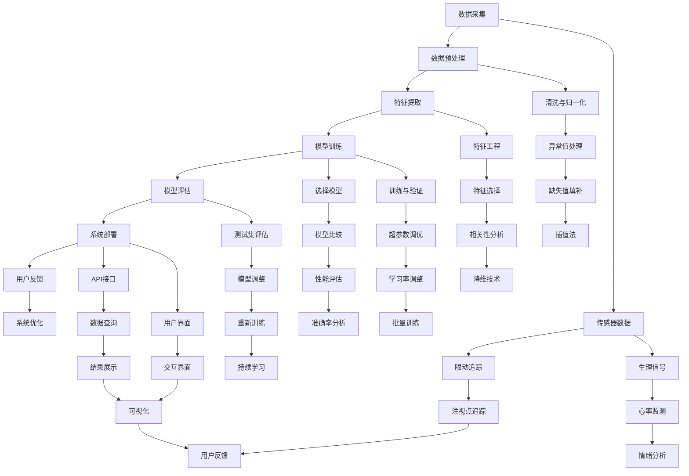

                 

### 文章标题

《AI与人类注意力流：未来的工作、技能与注意力流管理技术的应用趋势》

---

关键词：人工智能，注意力流，未来工作，技能发展，注意力流管理技术

---

摘要：本文旨在探讨人工智能（AI）与人类注意力流的关系，分析AI对注意力流的影响以及注意力流管理技术的应用趋势。文章首先介绍了AI与注意力流的基础知识，包括AI技术的发展历程、注意力流的理论基础和AI技术对注意力流管理的影响。随后，文章从职场、职业培训和心理健康三个方面探讨了AI与注意力流在未来的工作中的应用。接着，文章讨论了AI与注意力流技能的发展与培养方法，并列举了教育中的应用案例。最后，文章分析了AI与注意力流管理技术的现状和未来发展趋势，并提供了一个项目实战案例，以展示注意力流管理技术的实际应用。本文旨在为读者提供一个全面、深入的AI与注意力流管理技术的了解，帮助读者应对未来工作中的挑战和机遇。 ### 第一部分：AI与人类注意力流的基础知识

#### 第1章：AI与注意力流概述

##### 1.1 AI技术的发展与人类注意力流的关联

**1.1.1 AI技术的发展历程**

人工智能（AI）自20世纪50年代诞生以来，经历了多个发展阶段。早期的人工智能主要侧重于模拟人类的逻辑推理和知识表示，以专家系统为代表。20世纪80年代，随着计算能力的提升和大数据的出现，机器学习开始兴起，AI逐渐从“推理驱动的智能”转向“数据驱动的智能”。21世纪初，深度学习的发展使得AI在图像识别、语音识别和自然语言处理等领域取得了突破性的进展。如今，AI技术已经深入到各行各业，成为推动社会进步的重要力量。

**1.1.2 注意力流的概念及其重要性**

注意力流（Attention Flow）是指个体在感知、思考和行为过程中，注意力在各个目标和任务之间的动态分配过程。注意力流的管理直接影响个体的工作效率、学习效果和心理健康。良好的注意力流管理能够帮助个体在复杂环境中保持专注，提高处理信息的效率。

**1.1.3 AI与注意力流的结合趋势**

随着AI技术的不断进步，AI与注意力流的结合趋势日益明显。一方面，AI技术可以通过分析人类的行为数据，识别个体的注意力模式，提供个性化的注意力管理方案。另一方面，AI技术也可以应用于注意力流的优化，例如通过智能算法帮助个体在多任务处理中合理分配注意力资源。这种结合有望为未来的工作、学习和生活带来深刻变革。

##### 1.2 人类注意力流的理论基础

**1.2.1 注意力流的心理学原理**

心理学研究注意力流主要关注两个方面：注意力的分配和注意力的切换。注意力的分配是指个体如何在多个任务或目标之间分配有限的注意力资源，而注意力的切换则是指个体在任务转换时如何迅速地将注意力从一个目标转移到另一个目标。心理学研究揭示了注意力的分配和切换机制，为注意力流的管理提供了理论基础。

**1.2.2 注意力流的神经科学基础**

神经科学研究揭示了注意力流的生物学基础。大脑中的多个区域参与了注意力的处理，包括前额叶皮层、顶叶皮层和扣带回等。这些区域通过复杂的神经网络相互作用，形成了注意力流。神经科学的研究有助于我们理解注意力流的工作原理，并开发出基于神经科学的注意力流管理技术。

**1.2.3 注意力流的分类与模型**

根据注意力流的特征和功能，可以将注意力流分为不同的类型，如集中注意力、分配注意力和选择性注意力等。同时，研究者提出了多种注意力流模型，如多任务注意力模型、动态注意力模型和情境注意力模型等。这些模型为我们提供了不同的视角来理解和分析注意力流。

##### 1.3 AI技术对注意力流管理的影响

**1.3.1 AI对注意力流的促进作用**

AI技术可以通过多种方式促进注意力流的管理。首先，AI可以分析个体的行为数据，实时监测注意力流的动态变化，提供个性化的注意力管理建议。其次，AI可以通过智能算法优化注意力流的分配和切换，提高个体的工作效率和任务处理能力。最后，AI技术还可以应用于注意力流的增强，例如通过虚拟现实和增强现实技术提供沉浸式的注意力流体验。

**1.3.2 AI对注意力流的干扰与挑战**

尽管AI技术在注意力流管理中具有巨大的潜力，但同时也带来了干扰和挑战。首先，AI技术可能导致个体的注意力分散，特别是在多任务处理中，AI算法可能会分散个体的注意力资源。其次，AI技术可能无法完全理解人类注意力流的复杂性和多样性，导致管理效果有限。此外，AI技术可能引发隐私和安全问题，尤其是在收集和分析个体注意力数据时。

**1.3.3 注意力流管理技术的应用前景**

随着AI技术的不断发展，注意力流管理技术具有广泛的应用前景。在职场中，注意力流管理技术可以帮助员工提高工作效率、减少错误和提升团队合作效果。在教育领域，注意力流管理技术可以个性化学习过程，提高学生的学习效果。在心理健康领域，注意力流管理技术可以辅助诊断和治疗注意力相关疾病，如注意力缺陷多动障碍（ADHD）等。未来，随着AI技术的不断成熟，注意力流管理技术将在各个领域发挥更加重要的作用。

**总结**

本章从AI技术的发展历程、注意力流的理论基础和AI技术对注意力流管理的影响三个方面，对AI与注意力流的基础知识进行了概述。通过对AI技术与注意力流结合趋势的分析，我们看到了未来注意力流管理技术的发展前景。在下一章中，我们将深入探讨AI与注意力流在未来的工作中的应用，分析其在职场中的影响和挑战。 ##### 1.1.1 AI技术的发展历程

人工智能（AI）的发展历程可以分为几个关键阶段：

**早期阶段（1950s-1960s）**

1950年，艾伦·图灵提出了著名的图灵测试，标志着人工智能概念的诞生。1956年，达特茅斯会议被广泛认为人工智能领域的诞生日，会议期间，约翰·麦卡锡、马文·明斯基、克劳德·香农等科学家共同探讨了人工智能的发展方向。

**早期应用阶段（1960s-1970s）**

这一时期，人工智能的主要形式是专家系统，它们模拟人类专家的推理过程，能够解决特定领域的问题。代表性的系统有“Eliza”（模拟心理治疗师）和“Dendral”（化学分析）。然而，由于计算资源和数据限制，早期的人工智能项目面临着严重的局限性。

**停滞期（1970s-1980s）**

随着计算资源不足和算法复杂度的增加，人工智能领域进入了所谓的“AI寒冬”。这一时期，人工智能的研究受到了质疑，许多研究项目被迫停止或转向其他领域。

**复兴期（1980s-1990s）**

1980年代，随着计算机硬件和软件的发展，人工智能开始重新受到关注。机器学习技术开始兴起，尤其是决策树和神经网络等算法得到了广泛应用。同时，专家系统也在医疗、金融等领域取得了一些成功。

**互联网时代（2000s-2010s）**

21世纪初，随着互联网和大数据的出现，人工智能进入了新的发展阶段。深度学习技术的突破使得图像识别、语音识别和自然语言处理等领域的表现达到了前所未有的水平。这一时期，谷歌、亚马逊、微软等科技巨头开始大力投资人工智能研究。

**AI新时代（2010s-至今）**

近年来，人工智能进入了AI新时代。人工智能技术在自动驾驶、智能家居、医疗诊断等领域取得了显著成果。同时，AI也开始与传统行业深度融合，推动各行各业的创新和变革。

在AI技术的发展历程中，每一次重要突破都离不开计算能力的提升、数据量的增长和算法的创新。这些因素共同推动了人工智能从理论研究走向实际应用，从实验室走向大众生活。

**1.1.2 注意力流的概念及其重要性**

注意力流是指个体在感知、思考和行为过程中，注意力在各个目标和任务之间的动态分配过程。注意力流的管理直接影响个体的工作效率、学习效果和心理健康。

**注意力流的重要性**

1. **提高工作效率**：良好的注意力流管理能够帮助个体在复杂环境中保持专注，提高处理信息的效率。通过优化注意力流的分配和切换，个体可以在多任务处理中达到更高的产出。

2. **提升学习效果**：注意力流管理对学习过程至关重要。通过合理分配注意力资源，个体能够更好地理解和吸收新知识，提高学习效果。

3. **促进心理健康**：注意力流管理有助于个体应对压力和焦虑。通过调整注意力流的分配，个体可以更好地管理自己的情绪，提高心理健康水平。

**1.1.3 AI与注意力流的结合趋势**

随着AI技术的不断发展，AI与注意力流的结合趋势日益明显。以下是几个关键方面：

**个性化注意力管理**：AI可以通过分析个体的行为数据，识别其注意力模式，提供个性化的注意力管理方案。例如，智能助理可以根据用户的注意力流模式，合理安排提醒和任务分配。

**注意力流优化**：AI技术可以应用于注意力流的优化，例如通过智能算法帮助个体在多任务处理中合理分配注意力资源。例如，自动化办公系统可以根据用户的工作流程，智能调整任务的优先级，帮助用户保持注意力集中。

**沉浸式体验**：AI和虚拟现实（VR）、增强现实（AR）技术的结合，可以提供沉浸式的注意力流体验。例如，教育游戏可以通过模拟真实场景，引导学生在游戏中保持注意力集中。

**可穿戴设备**：AI技术可以与可穿戴设备结合，实时监测个体的注意力流变化，提供即时的反馈和调整建议。例如，智能手环可以检测用户的注意力水平，并在需要时提醒用户休息或调整注意力分配。

总之，AI与注意力流的结合为未来的工作、学习和生活带来了新的机遇和挑战。通过优化注意力流管理，AI有望为个体提供更高效、更健康的生活方式。在下一节中，我们将深入探讨注意力流的理论基础，包括心理学原理、神经科学基础和注意力流的分类与模型。这将为我们理解AI对注意力流管理的影响提供更深入的理论支持。 ##### 1.2.1 注意力流的心理学原理

注意力流是心理学中的一个重要概念，它涉及到个体如何在其认知过程中选择关注某些信息，而忽略其他信息。以下是对注意力流心理学原理的详细探讨：

**1.2.1.1 注意力分配**

注意力分配是指个体在处理多个任务或同时面对多个刺激时，如何将有限的认知资源分配给不同的任务或刺激。注意力的分配受到多种因素的影响，包括任务难度、任务的紧急程度、个体先前的经验等。

- **任务难度**：当任务较为简单时，个体可以轻松地将注意力分配给多个任务。然而，当任务变得复杂时，个体可能需要更多的注意力资源，导致注意力分配变得更加困难。

- **紧急程度**：任务的紧急程度也会影响注意力的分配。通常，个体会更倾向于将注意力分配给紧急的任务，以避免潜在的风险或损失。

- **先前经验**：个体在处理特定类型任务时的先前经验会影响其注意力的分配。有经验的个体可能能够更有效地分配注意力，因为他们知道哪些任务需要优先处理。

**1.2.1.2 注意力切换**

注意力切换是指个体在任务转换时如何迅速地将注意力从一个目标转移到另一个目标。注意力切换的速度和质量对个体的表现有重要影响。

- **注意力切换速度**：快速且流畅的注意力切换可以帮助个体更有效地处理多个任务。然而，过快的切换可能导致注意力分散，影响任务完成的质量。

- **注意力切换质量**：高质量的注意力切换要求个体在任务转换时能够保持对前一个任务的记忆，并且能够迅速适应新任务的要求。

**1.2.1.3 注意力流的调控**

个体可以通过多种策略调控自己的注意力流，以适应不同的环境和任务需求。

- **自我监控**：通过自我监控，个体可以意识到自己的注意力状态，并根据需要调整注意力分配。例如，当意识到注意力分散时，个体可以采取措施集中注意力。

- **目标设置**：设置明确的目标可以帮助个体集中注意力。目标应具体、可衡量，并且与个体的价值观和兴趣相一致。

- **环境调整**：通过调整环境，个体可以减少干扰因素，提高注意力集中度。例如，在需要集中注意力的任务中，个体可以选择一个安静的环境，减少电子设备的干扰。

**1.2.1.4 注意力流的适应性**

注意力流具有适应性，能够根据环境和任务需求进行调整。这种适应性体现在多个方面：

- **环境适应性**：个体可以根据不同的环境需求调整注意力流。例如，在社交环境中，个体需要关注他人的行为和语言，而在学习环境中，个体需要集中注意力于教材和笔记。

- **任务适应性**：个体可以根据任务的性质和复杂性调整注意力流。例如，在处理复杂任务时，个体可能需要更多的注意力资源，而在执行简单任务时，注意力资源可以相对较少。

**1.2.1.5 注意力流与心理健康**

注意力流的管理不仅影响个体的认知功能，还与心理健康密切相关。良好的注意力流管理有助于降低压力、提高情绪稳定性和增强心理韧性。

- **压力管理**：良好的注意力流管理可以帮助个体更好地应对压力。通过合理分配注意力资源，个体可以在面对压力时保持冷静和专注。

- **情绪稳定性**：注意力流管理有助于个体调节情绪。通过专注于积极的事物，个体可以减少消极情绪的影响，提高情绪稳定性。

- **心理韧性**：注意力流管理可以帮助个体在逆境中保持积极心态。通过调整注意力流，个体可以更好地应对挑战和困难，增强心理韧性。

总之，注意力流的心理学原理为我们提供了理解个体如何在其认知过程中分配、切换和调控注意力的框架。这些原理不仅有助于解释个体在学习和工作中的表现，也为开发有效的注意力流管理策略提供了理论基础。在下一节中，我们将探讨注意力流的神经科学基础，深入了解大脑中与注意力流相关的结构和机制。这将进一步丰富我们对注意力流的理解，为AI与注意力流结合提供更深入的生物学基础。 ##### 1.2.2 注意力流的神经科学基础

注意力流的神经科学基础主要涉及大脑中与注意力处理相关的重要结构和神经网络。以下是对注意力流神经科学基础的详细探讨：

**1.2.2.1 大脑中的关键结构**

- **前额叶皮层**：前额叶皮层是大脑中与注意力流管理密切相关的重要区域。它负责执行功能、决策和目标导向的行为。前额叶皮层中的神经元活动与注意力流的调控密切相关，尤其是在多任务处理和目标切换时。

- **顶叶皮层**：顶叶皮层在注意力的空间和视觉处理中发挥关键作用。它负责对空间位置和视觉信息的处理，并在注意力流的分配和调节中发挥作用。

- **扣带回**：扣带回是一个位于大脑中心区域的神经网络，它与注意力的调控、记忆和情感处理有关。扣带回的活动可以影响注意力的分配和注意力流的持续。

- **基底神经节**：基底神经节是一组位于大脑深部的结构，包括尾状核和豆状核。这些结构在注意力的调控和运动控制中发挥重要作用，并与前额叶皮层和其他注意力相关区域有密切的连接。

**1.2.2.2 神经网络和连接**

大脑中的多个神经网络参与了注意力流的管理和调控。以下是一些关键的神经网络：

- **默认模式网络（DMN）**：默认模式网络是一个大脑神经网络，主要负责内省、思考和记忆。它在大脑处于休息状态时活跃，但在执行外部任务时也会参与，帮助个体在任务转换时保持注意力的连续性。

- **注意力网络**：注意力网络是一组在大脑中负责注意力分配和调控的神经网络。它包括前额叶皮层、顶叶皮层和扣带回等区域，这些区域共同协调注意力的分配和切换。

- **视觉网络**：视觉网络负责处理视觉信息，包括注意力流的分配和调节。它包括初级视觉皮层、视觉联合区和视觉运动皮层等区域。

- **运动网络**：运动网络负责协调个体的运动行为，包括注意力的分配和调节。它包括初级运动皮层、辅助运动区和前运动皮层等区域。

**1.2.2.3 注意力流的神经科学机制**

注意力流的神经科学机制涉及到多个方面，包括神经元活动的调控、神经递质的传递和神经网络之间的连接。

- **神经元活动的调控**：神经元活动通过神经递质的释放和抑制来调节。例如，多巴胺和去甲肾上腺素等神经递质在注意力的调控中发挥重要作用。多巴胺的增加可以提高注意力集中度，而去甲肾上腺素可以促进注意力的分配和切换。

- **神经递质的传递**：神经递质的传递是注意力流调控的基础。例如，谷氨酸和GABA等神经递质在注意力的空间和视觉处理中发挥作用。谷氨酸的增加可以增强神经元的兴奋性，而GABA的释放可以抑制神经元的活动。

- **神经网络之间的连接**：神经网络之间的连接是注意力流管理的关键。前额叶皮层与顶叶皮层、扣带回和基底神经节等区域之间的连接，以及默认模式网络、注意力网络、视觉网络和运动网络之间的连接，都在注意力的分配、切换和调节中发挥重要作用。

总之，注意力流的神经科学基础为我们提供了对大脑中注意力处理机制的深入理解。通过研究大脑中的关键结构和神经网络，我们可以更好地理解注意力流的工作原理，并开发出更有效的注意力流管理技术。在下一节中，我们将探讨注意力流的分类与模型，进一步丰富我们对注意力流的认识。这将有助于我们更好地理解AI技术在注意力流管理中的应用。 ##### 1.2.3 注意力流的分类与模型

注意力流可以根据其特征和功能进行分类，同时，研究者们也提出了多种注意力流模型来解释和预测注意力流的行为。以下是对注意力流分类与模型的详细探讨：

**1.2.3.1 注意力流的分类**

根据注意力流的表现形式和功能，可以将注意力流分为以下几种类型：

- **集中注意力（Focal Attention）**：集中注意力是指个体将注意力集中于单一目标或任务上，以达到最高的处理效率。集中注意力通常发生在个体需要深入思考、解决问题或执行精细任务时。

- **分配注意力（Divided Attention）**：分配注意力是指个体在同时处理多个任务或目标时，将注意力资源分配给不同的任务。分配注意力常见于多任务处理场景，如驾驶时听音乐、工作间隙回复邮件等。

- **选择性注意力（Selective Attention）**：选择性注意力是指个体在多个刺激中，选择关注某一特定刺激，而忽略其他刺激。选择性注意力在日常生活中非常普遍，如听讲座时专注于演讲者，而不受周围环境的干扰。

- **情境注意力（Situational Attention）**：情境注意力是指个体根据当前环境或情境的需求，动态调整注意力分配。情境注意力能够帮助个体在复杂环境中快速适应和做出决策。

- **多任务注意力（Multi-Task Attention）**：多任务注意力是指个体在处理多个任务时，如何协调和平衡不同任务的注意力资源。多任务注意力涉及复杂的时间管理和注意力分配策略。

**1.2.3.2 注意力流模型**

研究者们提出了多种注意力流模型来解释注意力流的行为。以下是一些重要的注意力流模型：

- **多任务注意力模型（Multi-Task Attention Model）**：多任务注意力模型用于解释个体在多任务处理时的注意力分配和切换。该模型通常基于线性规划或优化算法，通过优化目标函数来决定注意力资源的分配。

- **动态注意力模型（Dynamic Attention Model）**：动态注意力模型用于描述注意力流在时间和空间上的动态变化。该模型通常基于神经网络的动态特性，通过训练学习个体的注意力模式。

- **情境注意力模型（Situational Attention Model）**：情境注意力模型用于描述个体根据不同情境动态调整注意力流。该模型通常结合情境因素和个体偏好，通过机器学习算法进行训练和预测。

- **注意力分配模型（Attention Allocation Model）**：注意力分配模型用于描述个体如何在不同任务或刺激之间分配注意力。该模型通常基于概率模型或决策理论，通过分析任务的重要性和个体偏好来决定注意力的分配。

**1.2.3.3 注意力流的分类与模型的应用**

注意力流的分类和模型在多个领域有着广泛的应用：

- **教育领域**：注意力流的分类和模型可以帮助教育者设计更有效的教学策略。通过了解学生的注意力流模式，教育者可以调整教学方法，提高学生的学习效果。

- **职场管理**：注意力流的分类和模型可以帮助企业管理者优化团队的工作流程，提高工作效率。通过分析员工的注意力流模式，管理者可以制定更有效的任务分配策略。

- **心理健康**：注意力流的分类和模型可以帮助心理学家评估个体的注意力流状态，诊断和治疗注意力相关的问题。例如，注意力缺陷多动障碍（ADHD）的诊断和治疗可以基于注意力流的分类和模型。

- **智能系统设计**：注意力流的分类和模型可以应用于智能系统的设计，如智能助手和自动化系统。通过模拟人类的注意力流模式，智能系统可以更准确地理解和响应用户的需求。

总之，注意力流的分类与模型为我们提供了理解和管理注意力流的重要工具。通过这些模型，我们可以更好地理解注意力流的行为，开发出更高效的注意力流管理技术和应用。在下一节中，我们将探讨AI技术对注意力流管理的影响，分析AI技术如何促进和干扰注意力流管理。这将为我们了解AI与注意力流的结合提供更深入的实践视角。 ##### 1.3.1 AI对注意力流的促进作用

随着人工智能（AI）技术的快速发展，其在注意力流管理中的应用越来越受到关注。AI技术在多个方面对注意力流管理起到了促进作用，以下是一些关键方面：

**1.3.1.1 个性化注意力管理**

AI技术可以通过分析个体的行为数据和生物特征，识别其注意力模式，从而提供个性化的注意力管理方案。这种个性化管理有助于提高个体的工作效率和任务完成质量。例如，AI助手可以根据用户的历史行为数据，自动识别用户在何时何地最容易分心，并提前提醒用户休息或调整注意力。

**实例**：智能办公助手

假设一个企业员工在使用智能办公助手时，该助手通过分析员工的电子邮件、日程安排和工作习惯，发现员工在下午3点到5点的工作效率最低。智能助手会在这个时间段自动发送提醒，建议员工休息或处理一些较为轻松的任务，从而帮助员工保持注意力集中。

**1.3.1.2 注意力流优化**

AI技术可以通过智能算法优化注意力流的分配和切换，提高个体的任务处理效率。例如，在多任务处理环境中，AI系统可以根据任务的优先级和复杂度，自动调整用户的注意力分配，确保关键任务能够得到足够的关注。

**实例**：自动化任务分配系统

在一个大型项目中，多个团队成员需要共同完成任务。自动化任务分配系统可以根据每个团队成员的注意力模式和工作负载，智能分配任务，确保团队成员能够在最佳状态下完成工作，同时避免过度疲劳。

**1.3.1.3 沉浸式体验**

AI与虚拟现实（VR）和增强现实（AR）技术的结合，可以提供沉浸式的注意力流体验。这种体验有助于个体在特定任务中保持高度专注。例如，教育游戏可以通过模拟真实场景，引导学生保持注意力集中，提高学习效果。

**实例**：虚拟课堂

在一个虚拟课堂中，学生可以通过VR设备进入一个模拟的学习环境。AI系统会根据学生的学习进度和注意力水平，动态调整教学内容和难度，确保学生在整个学习过程中都能保持高度专注。

**1.3.1.4 可穿戴设备**

AI技术可以与可穿戴设备结合，实时监测个体的注意力流变化，提供即时的反馈和调整建议。例如，智能手环可以通过监测用户的心率、眼球运动和面部表情等生物信号，实时评估用户的注意力水平，并在用户分心时发出提醒。

**实例**：智能手环

一个员工在工作中使用智能手环，智能手环通过监测其心率和眼球运动，发现员工在处理复杂任务时注意力下降。智能手环会立即提醒员工休息，并提供一些放松活动，以帮助其恢复专注力。

**1.3.1.5 注意力流分析**

AI技术可以对大量数据进行实时分析，识别个体注意力流的模式和规律。这种分析有助于开发出更有效的注意力流管理策略。例如，企业可以通过分析员工的注意力数据，优化工作流程，提高整体工作效率。

**实例**：企业注意力流分析

一家企业通过AI技术分析员工的注意力数据，发现员工在特定时间段内注意力最为集中。企业可以根据这些数据调整工作时间安排，确保员工在最佳状态下工作，从而提高工作效率和员工满意度。

总之，AI技术在注意力流管理中的应用具有巨大的潜力。通过个性化注意力管理、注意力流优化、沉浸式体验、可穿戴设备和注意力流分析等多种方式，AI技术可以帮助个体更好地管理自己的注意力，提高工作效率和生活质量。在下一节中，我们将探讨AI对注意力流的干扰与挑战，分析AI技术在注意力流管理中可能遇到的困难和限制。这将为我们全面理解AI与注意力流的关系提供重要的参考。 ##### 1.3.2 AI对注意力流的干扰与挑战

尽管AI技术在注意力流管理中具有巨大潜力，但同时也带来了干扰和挑战。以下是AI对注意力流的一些潜在干扰与挑战：

**1.3.2.1 注意力分散**

AI技术可能会导致个体的注意力分散，尤其是在多任务处理环境中。智能助手、自动提醒和即时消息等AI功能虽然有助于任务管理和效率提升，但同时也可能引发频繁的干扰和分散注意力的行为。

**实例**：智能通知

一个用户在使用智能手机时，智能通知不断提醒用户查看新的邮件、社交媒体更新和即时消息。这些通知可能打断用户的当前任务，导致注意力分散，从而影响工作效率和任务完成质量。

**1.3.2.2 数据隐私和安全问题**

AI技术通常需要收集和分析个体的行为数据，以提供个性化的注意力管理方案。然而，数据隐私和安全问题是AI技术在注意力流管理中的一大挑战。不当的数据收集和使用可能导致隐私泄露和安全风险。

**实例**：数据泄露

一个企业在使用AI技术分析员工注意力数据时，由于数据存储和管理不当，导致员工个人信息泄露。这一事件可能引发员工对隐私保护的担忧，影响员工的信任度和工作满意度。

**1.3.2.3 复杂性和决策疲劳**

AI系统在提供注意力管理建议时，可能涉及复杂的分析和决策。长时间使用AI系统可能导致个体产生决策疲劳，从而影响其自主决策能力和注意力流管理效果。

**实例**：过多的建议

一个用户在使用智能办公助手时，助手提供了大量关于工作安排和休息时间的建议。用户可能感到困惑和疲劳，难以从这些建议中做出最佳决策，从而导致注意力流管理效果下降。

**1.3.2.4 技术依赖性**

随着AI技术在注意力流管理中的广泛应用，个体可能逐渐产生对技术的依赖性。这种依赖性可能导致个体在缺乏AI技术支持时，难以有效地管理自己的注意力流，从而影响其日常工作和生活。

**实例**：技术中断

一个用户在依赖于智能手环进行注意力管理时，手环出现故障导致无法使用。用户可能会在缺乏实时反馈和提醒的情况下，难以保持注意力集中，从而影响工作表现和效率。

**1.3.2.5 误报和误导**

AI系统在注意力流管理中可能会出现误报和误导，导致个体在处理任务时产生不必要的干扰和分心。例如，AI助手可能错误地识别用户的注意力状态，从而发出不恰当的提醒或建议。

**实例**：错误的提醒

一个用户在使用智能助手时，助手错误地认为用户在开会期间分心，并发出提醒。这一错误提醒可能打断会议进程，影响会议效果。

**1.3.2.6 技术成熟度问题**

目前，AI技术在注意力流管理中的应用仍处于发展阶段，技术成熟度有限。许多AI系统可能无法准确识别和预测个体的注意力状态，从而影响注意力流管理的效果。

**实例**：不准确的数据分析

一个企业使用AI系统分析员工的注意力数据，但由于系统算法和数据的局限性，分析结果不准确。企业可能基于这些不准确的数据做出错误的决策，从而影响员工的工作状态和绩效。

总之，AI技术在注意力流管理中虽然具有巨大潜力，但也面临诸多干扰和挑战。了解这些挑战有助于我们更好地评估AI技术在注意力流管理中的应用效果，并制定相应的解决方案。在下一节中，我们将探讨注意力流管理技术的应用前景，分析其在未来工作中的潜在影响。这将为我们了解AI与注意力流结合的未来趋势提供重要的参考。 ##### 1.3.3 注意力流管理技术的应用前景

随着人工智能（AI）技术的不断进步，注意力流管理技术在各个领域的应用前景愈发广阔。以下是对注意力流管理技术在未来工作中的应用前景的详细探讨：

**1.3.3.1 职场中的应用**

在职场中，注意力流管理技术可以显著提高员工的工作效率和质量。以下是一些具体的应用场景：

- **工作流程优化**：AI系统可以通过分析员工的工作行为和注意力流，识别出最有效的任务分配和执行顺序。这有助于企业优化工作流程，减少不必要的等待和重复工作，提高整体工作效率。

- **个性化工作安排**：根据员工的注意力流模式和偏好，AI系统可以为员工定制个性化的工作计划。例如，在员工注意力最集中的时间段安排重要的任务，而在注意力较低的时间段安排轻松的任务，从而提高工作满意度。

- **实时反馈与调整**：AI助手可以实时监测员工的工作状态和注意力水平，提供即时的反馈和调整建议。例如，当发现员工注意力分散时，AI助手可以提醒员工休息或提供一些提神的方法，帮助其恢复专注力。

- **团队合作与协作**：注意力流管理技术可以帮助团队成员更好地协作，提高团队的整体效率。AI系统可以分析团队成员的注意力流，识别出协作的最佳时机和方式，从而促进高效的团队合作。

**1.3.3.2 教育中的应用**

在教育领域，注意力流管理技术可以为师生提供个性化学习体验，提高教学效果和学习成果。以下是一些具体的应用场景：

- **个性化学习计划**：AI系统可以根据学生的学习进度、注意力流和兴趣，为学生制定个性化的学习计划。这有助于学生按照自己的节奏学习，提高学习效果。

- **实时学习反馈**：AI助手可以实时监测学生的学习状态和注意力水平，提供即时的学习反馈和建议。例如，当发现学生注意力分散时，AI助手可以提醒学生集中注意力，或提供一些提高注意力的方法。

- **学习资源推荐**：根据学生的学习需求和注意力流，AI系统可以推荐合适的学习资源，如文章、视频和练习题。这有助于学生更高效地利用学习资源，提高学习效果。

- **智能教学助手**：教师可以使用AI系统辅助教学，例如自动批改作业、分析学生的学习数据，并提供个性化的辅导建议。这有助于教师更专注于教学本身，提高教学质量。

**1.3.3.3 心理健康中的应用**

注意力流管理技术在心理健康领域具有广泛的应用前景，可以帮助个体更好地管理自己的情绪和注意力，提高心理健康水平。以下是一些具体的应用场景：

- **注意力训练与提升**：通过专门的注意力训练应用程序，个体可以逐步提升自己的注意力能力。这些应用程序通常结合游戏化元素，使训练过程更加有趣和有效。

- **心理健康诊断与干预**：AI系统可以通过分析个体的注意力流数据，辅助进行心理健康诊断。例如，AI系统可以识别出个体在处理特定任务时的注意力波动，从而判断个体是否可能患有注意力缺陷多动障碍（ADHD）或其他注意力相关问题。

- **情绪管理**：注意力流管理技术可以帮助个体更好地管理自己的情绪。例如，通过提供放松训练和情绪调节方法，AI系统可以帮助个体在压力和焦虑时保持冷静和专注。

- **睡眠质量提升**：注意力流管理技术可以通过监测个体的睡眠模式和注意力水平，提供个性化的睡眠建议。例如，AI系统可以提醒个体在睡眠前进行放松活动，或调整作息时间，以提高睡眠质量。

**1.3.3.4 企业管理中的应用**

在企业管理中，注意力流管理技术可以为企业提供更深入的员工行为分析和管理工具，帮助企业实现更高效的管理。以下是一些具体的应用场景：

- **员工绩效评估**：通过分析员工的注意力流数据，企业管理者可以更准确地评估员工的绩效和工作质量。这有助于企业制定更有效的绩效评估体系和激励机制。

- **工作压力管理**：注意力流管理技术可以帮助企业识别员工的工作压力来源，并提供相应的缓解策略。例如，企业可以通过调整工作流程、优化任务分配和提供心理支持来减轻员工的工作压力。

- **团队协作分析**：AI系统可以分析团队成员的注意力流和协作模式，识别出团队协作中的瓶颈和优化点。这有助于企业改善团队协作，提高整体工作效率。

- **员工培训与发展**：根据员工的注意力流数据和技能需求，企业可以提供个性化的培训和发展计划。这有助于员工提升技能，提高工作效率和职业满意度。

总之，注意力流管理技术在未来的职场、教育、心理健康和企业管理中具有广泛的应用前景。通过个性化管理、实时反馈和智能分析，这些技术有望为个体和企业带来更高效、更健康的工作和学习环境。在下一章中，我们将深入探讨AI与注意力流在未来的工作中的应用，分析其在职场中的影响和挑战。这将进一步丰富我们对AI与注意力流结合的理解，为未来的工作环境带来新的启示。 ### 第二部分：AI与注意力流在未来的工作中的应用

#### 第2章：AI与注意力流在职场中的影响

##### 2.1 AI与注意力流对职场工作的重塑

**2.1.1 职场环境中注意力流的管理**

随着人工智能（AI）技术的不断发展，职场环境正在发生深刻变革。在这个过程中，注意力流的管理成为一个关键议题。有效的注意力流管理不仅能提高工作效率，还能提升员工的满意度和幸福感。

**注意力流管理的核心**

注意力流管理主要包括以下三个方面：

1. **注意力分配**：合理分配注意力资源，确保重要任务能够得到充分的关注。

2. **注意力切换**：高效地在不同任务和活动之间切换注意力，避免注意力分散。

3. **注意力恢复**：在长时间高强度的任务后，通过休息和放松活动恢复注意力。

**2.1.2 AI技术提高工作效率**

AI技术在职场中的应用，极大地提高了工作效率。以下是一些具体的应用实例：

- **自动化任务处理**：AI系统可以自动化处理许多重复性高、规则性强的任务，如数据录入、报告生成等。这使员工可以将更多的注意力集中在创造性和战略性任务上。

- **智能助手与协同工作**：AI助手可以帮助员工管理日程、安排会议、提供信息查询等服务，从而减少无谓的时间浪费，提高工作效率。

- **实时数据分析**：AI系统可以实时分析大量的数据，提供有针对性的决策支持，帮助员工快速做出明智的决策。

- **个性化工作安排**：根据员工的工作习惯和注意力模式，AI系统可以为其定制个性化的工作计划，优化工作流程，提高工作效率。

**2.1.3 注意力流管理在团队合作中的应用**

在团队合作中，注意力流的管理同样至关重要。以下是一些注意力流管理在团队合作中的应用：

- **任务优先级管理**：通过AI技术，团队可以更好地识别和确定任务的优先级，确保关键任务得到足够的关注。

- **协作与沟通优化**：AI系统可以帮助团队成员更好地协同工作，通过实时沟通和协作工具，提高团队的工作效率。

- **注意力协调**：在团队项目中，AI系统可以分析每个成员的注意力流，协调团队成员的工作，确保团队在关键时间段内集中注意力，提高整体效率。

- **团队情绪监控**：AI系统可以实时监测团队成员的情绪状态，提供情绪调节建议，帮助团队成员保持积极的工作状态。

**实例**：一个跨部门的项目团队在使用AI技术进行注意力流管理。AI系统根据团队成员的工作习惯和注意力模式，为其定制了个性化的工作计划。同时，AI系统实时监测团队成员的注意力状态，提供情绪调节建议，确保团队成员在关键任务期间保持专注。通过这种方式，团队在项目中的工作效率和质量得到了显著提升。

总之，AI与注意力流在职场中的应用，不仅提高了工作效率，还改善了团队合作的质量。通过有效的注意力流管理，职场环境变得更加高效、和谐。在下一节中，我们将探讨AI与注意力流在职业培训与教育中的应用，分析其在个性化学习和职业发展方面的作用。这将进一步展示AI与注意力流在职场中的广泛影响力。 ##### 2.2 AI与注意力流在职业培训与教育中的应用

**2.2.1 个性化学习与注意力流管理**

随着AI技术的发展，职业培训与教育领域正在经历深刻的变革。个性化学习成为现代教育的重要趋势，而注意力流管理技术则为这一趋势提供了强有力的支持。

**个性化学习的核心**

个性化学习是指根据每个学习者的需求和特点，为其提供定制化的学习资源、学习路径和学习支持。个性化学习的目标是提高学习效果，满足不同学习者的学习需求，促进其全面发展。

**注意力流管理在个性化学习中的应用**

1. **学习路径优化**：AI系统可以根据学生的学习进度、学习偏好和注意力流，为其推荐最适合的学习路径。这有助于学习者更加高效地掌握知识，提高学习效果。

2. **学习资源推荐**：AI系统可以根据学习者的注意力流和知识需求，推荐相关的学习资源，如文章、视频、练习题等。这有助于学习者充分利用时间和资源，提升学习效果。

3. **学习状态监测**：AI系统可以实时监测学习者的注意力状态，提供即时的反馈和调整建议。例如，当学习者注意力分散时，AI系统可以提醒其休息或提供一些提神的方法，帮助其恢复专注力。

**实例**：在一个在线学习平台中，AI系统根据学生的学习进度、学习偏好和注意力流，为其推荐个性化的学习路径。例如，一个学习编程的学生，AI系统会根据其历史学习数据推荐适合的编程语言教程和练习题，同时监测其学习状态，提供休息和调整的建议，帮助其保持专注和高效学习。

**2.2.2 AI在职业培训中的角色**

AI技术在职业培训中扮演着越来越重要的角色，为培训的个性化、高效性和可持续性提供了有力支持。

1. **技能评估与诊断**：AI系统可以通过分析学习者的行为数据和学习成果，对其进行技能评估和诊断。这有助于培训机构了解学习者的实际水平，为其提供有针对性的培训方案。

2. **智能课程推荐**：根据学习者的技能水平和学习需求，AI系统可以为其推荐最适合的课程和学习计划。这有助于提高学习者的学习效果和培训质量。

3. **模拟实践与训练**：AI系统可以通过模拟真实的工作场景，为学习者提供实践和训练机会。这有助于学习者将理论知识应用到实际工作中，提高其实际操作能力。

**实例**：在一个企业的职业培训项目中，AI系统根据员工的工作表现和学习需求，为其推荐个性化的培训课程。例如，一个员工在数据处理方面表现较弱，AI系统会为其推荐相关的培训课程和模拟练习，帮助其提高数据处理能力。

**2.2.3 注意力流管理在在线教育中的应用**

在线教育作为教育领域的重要发展方向，越来越受到关注。注意力流管理技术在在线教育中的应用，有助于提高学习效果和学习体验。

1. **课程内容优化**：AI系统可以根据学习者的注意力流数据，优化课程内容的设计和呈现方式。例如，通过调整视频的时长、内容的复杂度等，使课程更加符合学习者的注意力特征。

2. **互动式学习**：在线教育平台可以通过AI技术，提供互动式学习体验。例如，通过实时问答、在线讨论等互动方式，提高学习者的参与度和专注度。

3. **学习进度跟踪**：AI系统可以实时跟踪学习者的学习进度和注意力流，提供个性化的学习反馈和支持。这有助于学习者及时调整学习策略，提高学习效果。

**实例**：在一个在线教育平台上，AI系统根据学习者的注意力流数据，实时调整课程内容的呈现方式和交互方式。例如，当发现学习者注意力分散时，AI系统会自动切换到更简洁、直观的呈现方式，或提供一些互动性的练习题，帮助学习者保持专注和参与。

总之，AI与注意力流在职业培训与教育中的应用，为个性化学习、技能评估和在线教育提供了强有力的支持。通过优化学习路径、推荐学习资源、监测学习状态等方式，这些技术有助于提高学习效果和学习体验，为未来的职业发展和教育改革带来新的机遇。在下一节中，我们将探讨AI与注意力流在职业健康与心理健康中的应用，分析其在缓解工作压力、提高心理健康水平方面的作用。这将进一步展示AI与注意力流技术在职场中的广泛应用。 ##### 2.3 AI与注意力流在职业健康与心理健康中的应用

随着工作压力的增加和心理健康问题的日益突出，AI与注意力流技术在职业健康与心理健康中的应用变得越来越重要。以下是对这些应用领域的详细探讨：

**2.3.1 职场压力与注意力流的关联**

职场压力是影响员工心理健康的重要因素之一。长期处于高压环境中，员工容易出现焦虑、抑郁等心理问题。注意力流与职场压力之间存在密切关联：

- **注意力分散**：在高压力环境下，员工的注意力容易分散，难以集中精力完成任务。这可能导致工作效率下降，进而加剧压力。

- **注意力疲劳**：长时间处于高强度的注意力集中状态，员工容易出现注意力疲劳，导致心理疲劳和身体疲惫。

- **注意力切换困难**：职场压力可能导致员工在任务切换时出现困难，影响工作流程和效率。

**2.3.2 AI在心理健康诊断与干预中的作用**

AI技术在心理健康诊断与干预中具有重要作用，以下是一些具体的应用：

- **行为分析**：AI系统可以通过分析员工的行为数据，如电子邮件、社交媒体互动、日程安排等，识别出潜在的心理健康问题。例如，AI系统可以发现员工在工作中的异常行为模式，如频繁请假、工作效率下降等，提示可能存在的心理健康问题。

- **情绪识别**：AI系统可以通过语音识别、文本分析等技术，识别员工的情绪状态。例如，通过分析员工的语音语调、电子邮件内容等，AI系统可以识别出员工是否处于焦虑、抑郁等负面情绪状态。

- **个性化干预**：根据员工的心理健康数据，AI系统可以提供个性化的心理健康干预方案。例如，AI系统可以根据员工的行为和情绪数据，推荐相应的放松训练、情绪调节方法，帮助员工缓解压力和焦虑。

**实例**：在一个企业中，AI系统通过对员工电子邮件和社交媒体互动的分析，发现某员工在工作中表现出频繁的情绪波动，并伴有焦虑症状。AI系统向员工推荐一系列放松训练和情绪调节方法，如深呼吸练习、正念冥想等，帮助员工缓解压力，提高心理健康水平。

- **实时监测与预警**：AI系统可以实时监测员工的心理健康状态，并在发现异常情况时及时发出预警。例如，AI系统可以通过分析员工的工作表现、情绪变化等数据，发现员工可能出现的心理健康危机，及时提供帮助和支持。

**2.3.3 注意力流管理对心理健康的影响**

注意力流管理不仅影响工作效率，还对心理健康有着深远的影响。以下是一些注意力流管理对心理健康的具体影响：

- **压力缓解**：有效的注意力流管理可以帮助员工更好地应对工作压力。通过合理分配注意力资源，员工可以在高压力环境下保持冷静和专注，从而减轻压力。

- **情绪稳定**：注意力流管理有助于员工调节情绪，提高情绪稳定性。通过调整注意力分配和切换，员工可以在面对负面情绪时保持冷静，避免情绪波动。

- **心理韧性**：良好的注意力流管理有助于提高员工的心理韧性，使其在面对压力和挑战时能够保持积极的心态和应对能力。

- **工作满足感**：通过有效的注意力流管理，员工能够更好地完成任务，提高工作满意度。这种满足感有助于提升员工的心理健康水平。

**实例**：在一个高科技企业中，通过引入注意力流管理技术，员工在工作中的表现得到了显著改善。AI系统根据员工的工作习惯和注意力流，为其提供个性化的工作安排和休息建议。员工在有效管理注意力流的过程中，压力得到了缓解，情绪稳定性提高，工作满足感增强，整体心理健康水平得到了提升。

总之，AI与注意力流在职业健康与心理健康中的应用，为员工提供了更科学、更有效的管理方法。通过行为分析、情绪识别、个性化干预和实时监测等手段，AI技术有助于提高员工的心理健康水平，缓解工作压力，提升工作效率和生活质量。在下一章中，我们将探讨AI与注意力流技能的发展与培养，分析如何通过有效的方法和策略提升注意力流管理技能。这将为我们应对未来工作中的挑战提供有力的支持。 ##### 3.1 AI技能的需求与注意力流管理

随着人工智能（AI）技术的飞速发展，AI技能在职场中的需求日益增加。具备良好的AI技能不仅能够提高工作效率，还能够为个人职业生涯带来更多的发展机会。然而，掌握AI技能并非易事，需要通过科学的注意力流管理来提高学习效果。以下是对AI技能需求和注意力流管理之间关系的详细探讨：

**3.1.1 AI技能的核心要素**

AI技能的核心要素包括以下几个方面：

- **编程能力**：编程是AI领域的基石，掌握编程语言（如Python、Java等）和数据结构是学习AI的基础。

- **机器学习知识**：了解机器学习的基本概念、算法和应用，如监督学习、无监督学习和强化学习等。

- **深度学习原理**：深度学习是AI领域的核心技术之一，理解神经网络、卷积神经网络（CNN）、循环神经网络（RNN）等深度学习模型的工作原理至关重要。

- **数据处理技能**：能够处理和分析大量数据，了解数据清洗、数据挖掘和数据分析的方法和工具。

- **模型部署与优化**：掌握如何将AI模型部署到生产环境中，并能够进行模型优化和性能调优。

**3.1.2 注意力流管理对AI技能学习的影响**

注意力流管理对AI技能学习具有显著影响。以下是如何通过注意力流管理来提高AI技能学习效果的具体方法：

- **集中注意力**：在AI技能学习中，集中注意力是关键。学习者需要避免外界干扰，将注意力集中在学习内容上。例如，在学习编程时，关闭手机通知，保持环境安静，确保注意力集中。

- **分散注意力**：虽然集中注意力非常重要，但分散注意力也是必要的。适当的分散注意力可以帮助学习者放松大脑，避免疲劳。例如，在学习一段时间后，可以进行短暂休息，做一些轻松的活动，如散步或做瑜伽。

- **任务切换**：AI技能学习通常涉及多个子任务，如编程、模型训练和测试等。良好的注意力切换技巧可以帮助学习者快速适应不同任务，提高学习效率。例如，当遇到编程难题时，可以切换到其他任务，稍后再回来解决问题。

- **目标设定**：设定清晰的学习目标有助于学习者集中注意力。例如，设定一个短期目标，如学习一个特定的编程语言或算法，并制定详细的计划，有助于保持学习动力。

- **自我监控**：通过自我监控，学习者可以了解自己在学习过程中的注意力状态，及时调整学习策略。例如，可以使用注意力追踪工具，记录自己的学习时间、注意力状态等，分析学习效果，调整学习计划。

**3.1.3 培养高效AI技能的注意力流策略**

以下是一些培养高效AI技能的注意力流策略：

- **分段学习**：将学习时间分段，例如每段45分钟学习，然后休息10分钟。这种方法有助于保持注意力集中，避免疲劳。

- **交替学习**：交替学习不同类型的AI技能，例如一段时间专注于编程，另一段时间专注于机器学习理论。这种方法有助于提高学习多样性，增强学习效果。

- **利用技术工具**：利用AI技术工具，如智能助教、学习应用程序等，可以帮助学习者更好地管理注意力流。例如，智能助教可以根据学习者的注意力状态提供学习建议，帮助其保持专注。

- **环境调整**：创造一个有利于专注的学习环境，如减少噪音、保持整洁等。一个良好的学习环境有助于提高学习效果。

- **身心健康管理**：保持良好的身心健康也是培养高效AI技能的重要因素。例如，定期锻炼、保持充足的睡眠、合理饮食等，有助于提高学习效率和注意力集中度。

总之，注意力流管理在培养高效AI技能中发挥着至关重要的作用。通过科学的注意力流管理策略，学习者可以更好地集中注意力，提高学习效果，为职业生涯的发展奠定坚实基础。在下一节中，我们将探讨注意力流管理技能的培养方法，包括基本原理、技巧和实际案例，进一步丰富我们的理解。这将帮助我们更有效地掌握和运用注意力流管理技能，提高工作效率和职业发展。 ##### 3.2 注意力流管理技能的培养方法

**3.2.1 注意力流训练的基本原理**

注意力流管理技能的培养主要基于以下几个基本原理：

1. **认知负荷理论**：认知负荷理论指出，个体的认知资源是有限的，过高的认知负荷会导致注意力的分散和效率下降。通过合理分配认知资源，可以有效地管理注意力流。

2. **分阶段训练**：注意力流管理技能的培养通常分为三个阶段：基础阶段、提升阶段和优化阶段。基础阶段侧重于培养基本的注意力管理技巧；提升阶段侧重于提高注意力流的灵活性和适应性；优化阶段则侧重于提高注意力流的稳定性和持久性。

3. **自我监控与反馈**：通过自我监控和反馈，个体可以了解自己的注意力状态，及时调整注意力流。自我监控可以采用多种方法，如时间追踪、行为记录、生理信号监测等。

**3.2.2 常见的注意力流管理技巧**

以下是一些常见的注意力流管理技巧：

1. **时间管理技巧**：使用时间管理工具，如番茄钟、时间表等，有助于提高注意力集中度。例如，将工作时间分为25分钟的工作周期，每个周期后休息5分钟。

2. **环境优化技巧**：通过调整学习或工作环境，减少干扰因素。例如，关闭社交媒体通知、保持工作区整洁、使用降噪耳机等。

3. **注意力切换技巧**：通过系统化的任务切换策略，如“工作-休息”模式，提高注意力流的灵活性。例如，在完成一个任务后，进行短暂的休息或切换到另一个任务。

4. **正念练习**：正念练习是一种提高注意力集中度和意识水平的技巧。通过冥想、深呼吸等练习，可以培养专注力和自我监控能力。

**3.2.3 注意力流管理技能的自我评估与提升**

为了有效提升注意力流管理技能，个体需要进行自我评估和持续改进。以下是一些自我评估与提升的方法：

1. **自我评估工具**：使用注意力监测工具，如注意力追踪应用程序、生理信号监测设备等，评估自己的注意力状态和效率。

2. **行为记录**：记录日常工作和学习中的注意力流模式，分析哪些因素有助于提高注意力集中度，哪些因素导致注意力分散。

3. **反馈机制**：与他人交流注意力流管理经验，获取反馈和建议。例如，与同事、导师或专业人士讨论注意力流管理的最佳实践。

4. **持续学习**：参加相关的培训课程、阅读专业书籍和论文，不断更新自己的注意力流管理知识。

5. **实践应用**：将注意力流管理技巧应用到实际工作和学习中，通过实践不断改进和优化。

**3.2.4 注意力流管理技能的实际案例**

以下是一个注意力流管理技能培养的实际案例：

**案例：一名软件开发工程师的注意力流管理实践**

- **基础阶段**：工程师在基础阶段学习了时间管理和注意力切换的基本技巧，如番茄钟和“工作-休息”模式。通过记录日常工作和学习中的时间分配，工程师了解到自己在长时间工作后注意力容易下降，因此开始尝试在任务间进行短暂休息。

- **提升阶段**：工程师在提升阶段学习了正念练习和自我监控技巧。通过每天进行几分钟的冥想和深呼吸练习，工程师的专注力和自我监控能力得到了显著提升。此外，工程师开始使用注意力追踪应用程序记录自己的注意力状态，分析哪些任务最容易导致注意力分散。

- **优化阶段**：工程师在优化阶段将注意力流管理技巧应用到实际工作中，如将复杂的编程任务分解为小任务，并在每个小任务完成后进行短暂的休息。工程师还与团队成员分享注意力流管理经验，从他们的反馈中获得了更多的改进建议。

通过这一案例，我们可以看到，通过分阶段、持续学习和实践应用，注意力流管理技能可以得到有效提升。在下一节中，我们将探讨AI与注意力流在教育中的应用案例，分析注意力流管理在教育领域的作用和效果。这将进一步展示注意力流管理技能在实践中的广泛应用。 ##### 3.3 AI与注意力流在教育中的应用案例

在教育领域，AI与注意力流的结合为个性化学习、教育评估和教学质量提升提供了新的解决方案。以下是一些具体的AI与注意力流在教育中的应用案例：

**3.3.1 教育中的AI技术应用趋势**

随着AI技术的不断发展，教育领域正在发生深刻变革。以下是一些AI在教育中的主要应用趋势：

- **个性化学习**：AI技术可以根据学生的个性化需求和学习进度，提供定制化的学习资源和学习路径，提高学习效果。

- **智能评估与反馈**：AI系统可以自动评估学生的学习成果，提供即时的反馈和建议，帮助教师和学生及时调整学习策略。

- **智能教学助手**：AI助手可以辅助教师进行课堂管理、作业批改和教学资源推荐，提高教学效率。

- **智能课程推荐**：AI系统可以根据学生的学习兴趣、能力和学习历史，推荐最适合的课程和学习资源。

**3.3.2 注意力流管理在K-12教育中的应用**

在K-12教育中，注意力流管理对于提高学生的学习效果和课堂参与度至关重要。以下是一些注意力流管理在K-12教育中的应用案例：

- **个性化学习计划**：AI系统可以根据学生的注意力模式和学习习惯，为其定制个性化的学习计划。例如，一个学生在注意力高度集中时学习效果最好，AI系统会建议在上午进行较难的学习任务，而在注意力较低的时间段安排轻松的学习内容。

- **课堂注意力监测**：AI系统可以实时监测学生的注意力状态，提供即时的反馈和调整建议。例如，当学生出现注意力分散时，AI系统可以提醒教师进行互动活动或调整教学方式，以重新吸引学生的注意力。

- **学习资源推荐**：AI系统可以根据学生的学习进度和注意力流，推荐最适合的学习资源。例如，一个学生在学习数学时注意力容易分散，AI系统会推荐一些图像和动画资源，帮助学生更好地理解和掌握数学概念。

**实例**：一个小学班级使用AI系统进行注意力流管理。AI系统通过监测学生的面部表情、眼球运动和课堂互动，实时评估学生的注意力状态。当发现某个学生在课堂上注意力分散时，AI系统会发送提醒给教师，教师可以立即采取措施，如提问该学生或进行小组活动，重新吸引其注意力。

- **注意力恢复活动**：AI系统可以推荐适合学生的注意力恢复活动，如短暂的休息、深呼吸练习或轻度运动。这有助于学生在长时间学习后恢复注意力，提高学习效率。

**3.3.3 注意力流管理在高等教育中的应用**

在高等教育中，注意力流管理对于提高学生的学习效果、研究效率和职业发展具有重要意义。以下是一些注意力流管理在高等教育中的应用案例：

- **学术研究支持**：AI系统可以辅助学生进行学术研究，通过分析学生的研究兴趣和注意力流，提供相关的文献推荐和研究方向建议。

- **课程设计优化**：AI系统可以根据学生的学习习惯和注意力流，优化课程设计和教学方式。例如，AI系统可以分析学生的反馈数据，调整课程内容的复杂度和呈现方式，使其更符合学生的注意力特征。

- **职业规划指导**：AI系统可以分析学生的兴趣、能力和职业目标，提供个性化的职业规划指导。例如，AI系统可以根据学生的注意力流和职业倾向，推荐最适合的职业培训和实习机会。

**实例**：一所大学的研究生院使用AI系统进行注意力流管理。AI系统通过监测学生的研究进展和注意力流，提供实时的反馈和建议。例如，当发现某个研究生在某个研究项目中注意力分散时，AI系统会建议其调整研究方法或寻求导师的帮助，以提高研究效率。

- **在线学习平台**：AI系统可以集成到在线学习平台中，为学生提供个性化的学习体验。例如，AI系统可以根据学生的学习进度和注意力流，推荐最适合的学习路径和资源，帮助学生更好地掌握知识。

- **心理健康支持**：AI系统可以监测学生的心理健康状态，提供个性化的心理健康支持和建议。例如，AI系统可以分析学生的注意力流和行为数据，识别出心理健康问题的早期迹象，并推荐相应的心理健康资源和干预措施。

总之，AI与注意力流在教育中的应用为个性化学习、教育评估和教学质量提升提供了新的解决方案。通过这些应用案例，我们可以看到注意力流管理在K-12教育和高等教育中的重要作用，有助于提高学生的学习效果、研究效率和职业发展。在下一章中，我们将探讨AI与注意力流管理技术的现状和未来发展趋势，分析其在技术、市场和社会层面的影响和机遇。这将为我们全面了解AI与注意力流管理技术的未来前景提供重要参考。 ##### 4.1 AI与注意力流管理技术的现状

随着人工智能（AI）和注意力流管理技术的发展，这两个领域的融合逐渐成为研究的热点。目前，AI与注意力流管理技术已经取得了显著的进展，但在技术、市场和社会层面仍面临一些挑战和机遇。

**4.1.1 现有的AI注意力流管理技术**

当前，AI注意力流管理技术主要包括以下几个方面：

1. **注意力流监测技术**：通过传感器、眼动追踪和生理信号监测等手段，实时监测个体的注意力流状态。这些技术可以提供关于个体注意力分配、注意力集中度和注意力波动的详细信息。

2. **注意力流分析算法**：利用机器学习和深度学习算法，对注意力流数据进行处理和分析，识别出注意力流的模式、规律和异常。这些算法可以帮助个体了解自己的注意力流状态，并提供针对性的管理建议。

3. **个性化注意力管理工具**：基于注意力流分析结果，开发个性化的注意力管理工具，如智能提醒、休息建议和工作计划等。这些工具可以帮助个体优化注意力流分配，提高工作效率和心理健康水平。

4. **沉浸式注意力流体验**：通过虚拟现实（VR）和增强现实（AR）技术，提供沉浸式的注意力流体验。这种体验可以引导个体在特定任务中保持高度专注，提高学习效果和工作效率。

**4.1.2 注意力流管理技术的市场发展**

当前，注意力流管理技术市场呈现出快速增长的趋势。以下是一些市场发展特点：

1. **市场规模扩大**：随着人们对心理健康和工作效率的关注度提高，注意力流管理技术市场需求不断扩大。预计未来几年，全球注意力流管理技术市场将继续保持高速增长。

2. **行业应用拓展**：注意力流管理技术已逐步应用于教育、职场管理、心理健康和智能家居等领域。这些应用场景的不断拓展，为注意力流管理技术市场提供了广阔的发展空间。

3. **技术创新驱动**：人工智能、大数据和物联网等技术的快速发展，为注意力流管理技术提供了强大的技术支撑。技术创新将不断推动注意力流管理技术的进步和应用。

4. **跨界合作增多**：注意力流管理技术企业与医疗机构、教育机构、科技公司等领域的跨界合作增多，共同推动注意力流管理技术的发展和应用。

**4.1.3 AI与注意力流管理技术的挑战与机遇**

尽管AI与注意力流管理技术具有广阔的应用前景，但在发展过程中仍面临一些挑战和机遇：

1. **数据隐私与安全**：注意力流管理技术需要大量个人行为数据，数据隐私和安全问题是技术发展的关键挑战。如何在保障数据隐私的前提下，充分利用数据价值，是技术发展的重要议题。

2. **技术成熟度**：当前的注意力流管理技术尚处于发展阶段，技术成熟度有限。提高技术准确性和可靠性，是未来发展的关键方向。

3. **用户体验优化**：注意力流管理技术需要更好地适应用户需求，提供个性化的解决方案。用户体验优化是提高技术接受度和市场竞争力的重要途径。

4. **政策法规支持**：政府政策法规的支持对于注意力流管理技术的发展至关重要。制定合理的政策法规，有助于规范市场发展，保护用户权益。

5. **技术创新机遇**：随着AI技术的不断进步，注意力流管理技术将迎来更多创新机遇。例如，深度学习、增强学习和脑机接口等技术的应用，将进一步提高注意力流管理的准确性和效果。

总之，AI与注意力流管理技术目前处于快速发展阶段，市场前景广阔。在技术、市场和社会层面，注意力流管理技术面临诸多挑战和机遇。通过不断优化技术、拓展应用场景和加强政策法规支持，注意力流管理技术有望在未来发挥更大的作用，为个体和社会带来更多价值。在下一节中，我们将探讨AI与注意力流管理技术的未来发展趋势，分析其在未来工作中的潜在影响。这将为我们全面了解AI与注意力流管理技术的未来前景提供重要参考。 ##### 4.2 AI与注意力流管理技术的未来发展趋势

随着人工智能（AI）和注意力流管理技术的不断发展，这两个领域的融合正朝着更加智能化、个性化和全面化的方向迈进。以下是未来AI与注意力流管理技术的发展趋势：

**4.2.1 人工智能与注意力流管理技术的融合趋势**

1. **深度学习与注意力流管理**：深度学习技术的发展为注意力流管理提供了强大的工具。未来，深度学习模型将更加精准地识别和预测个体注意力流的变化，从而提供更有效的注意力管理策略。例如，通过训练深度神经网络，可以实现对注意力流的实时监测和预测，提供个性化的提醒和干预。

2. **增强学习与注意力流管理**：增强学习是一种通过不断学习和优化策略来提高系统性能的方法。未来，增强学习将与注意力流管理技术相结合，使系统在复杂动态环境中能够自适应地调整注意力流管理策略。例如，在职场环境中，增强学习算法可以根据工作环境和员工表现，动态优化工作任务的分配和休息时间。

3. **脑机接口与注意力流管理**：脑机接口（Brain-Computer Interface, BCI）技术的发展使得直接从大脑信号中提取注意力信息成为可能。未来，通过结合脑机接口技术，可以实现对个体注意力流的实时监测和调控，提供更加精准和个性化的注意力管理。

**4.2.2 未来工作环境中注意力流管理技术的应用**

1. **智能工作助手**：未来，智能工作助手将基于AI和注意力流管理技术，为员工提供更加智能化的工作支持。这些助手可以实时监测员工的注意力流，提供个性化的工作建议，如调整任务优先级、建议休息时间和提醒重要任务等。

2. **注意力流优化系统**：企业将采用注意力流优化系统来提高员工的工作效率和满意度。这些系统可以通过分析员工的工作行为和注意力流，优化工作流程和任务分配，减少不必要的干扰和重复劳动。

3. **个性化工作安排**：基于AI和注意力流管理技术，未来企业将能够为员工提供更加个性化的工作安排。系统可以根据员工的注意力流模式和偏好，制定个性化的工作时间表和工作任务，帮助员工在最佳状态下工作。

**4.2.3 AI注意力流管理技术的未来前景**

1. **提高工作效率**：未来，AI注意力流管理技术将帮助员工更加高效地完成工作任务，减少由于注意力分散和疲劳导致的工作效率低下。

2. **改善心理健康**：通过个性化注意力管理，员工可以更好地管理自己的情绪和压力，提高心理健康水平，减少因工作压力导致的焦虑和抑郁。

3. **促进团队协作**：AI注意力流管理技术将帮助团队成员更好地协调工作，提高团队协作效率。通过实时监测和反馈，团队可以及时发现和解决问题，提高整体工作效果。

4. **推动教育变革**：在教育领域，AI注意力流管理技术将提供个性化的学习支持，帮助学生更好地集中注意力，提高学习效果。同时，教师可以利用这些技术优化教学方法和策略，提高教学效果。

5. **创新商业模式**：随着注意力流管理技术的普及，新的商业模式和服务也将不断涌现。例如，基于AI的注意力管理平台将为企业提供定制化的解决方案，帮助企业提高员工的工作效率和满意度。

总之，AI与注意力流管理技术的未来发展趋势将深刻改变职场、教育和心理健康等多个领域。通过智能化、个性化和全面化的技术解决方案，AI注意力流管理技术将为个体和企业带来更多价值，推动社会的持续进步。在下一节中，我们将通过一个项目实战案例，展示AI与注意力流管理技术的实际应用，进一步探讨其在解决实际问题中的效果和意义。这将为我们更深入地理解AI注意力流管理技术的应用提供实践参考。 ### 第五部分：项目实战

#### 第5章：AI与注意力流管理技术项目实战

##### 5.1 项目背景与目标

随着人工智能（AI）和注意力流管理技术在职场和教育领域的广泛应用，我们设计了一个项目，旨在开发一套基于AI的注意力流管理系统。该系统旨在帮助个体和企业更好地管理注意力流，提高工作效率和心理健康水平。

**项目背景**：

在现代社会，人们面临的信息量和工作任务日益增加，导致注意力分散和疲劳问题日益严重。传统的注意力管理方法往往依赖于个体自我控制和外部提醒，效果有限。而基于AI的注意力流管理系统能够通过实时监测和分析个体注意力流，提供个性化的管理建议，有望显著改善这一问题。

**项目目标**：

本项目的主要目标包括：

1. **实时监测注意力流**：开发一个能够实时监测个体注意力流的系统，通过传感器和生理信号监测技术，获取关于注意力集中度、分散度和疲劳度的数据。

2. **个性化管理建议**：基于AI算法，分析个体注意力流数据，提供个性化的管理建议，如调整任务优先级、建议休息时间和提醒重要任务等。

3. **系统集成与优化**：将注意力流管理系统集成到现有的工作环境和教育平台中，优化系统的用户体验和效果。

4. **测试与评估**：通过实际应用和用户反馈，对系统进行测试和评估，验证其有效性和可行性。

##### 5.2 开发环境搭建与工具配置

为了实现本项目目标，我们需要搭建一个合适的开发环境，并选择合适的工具和软件。以下是具体的开发环境和工具配置步骤：

**1. 硬件设备**：

- **传感器设备**：选用眼动追踪设备（如Eyetrack）和可穿戴设备（如智能手环）来实时监测个体的注意力流。

- **计算机设备**：选择高性能的计算机服务器，用于处理和分析大量注意力流数据。

**2. 软件工具**：

- **编程语言**：选择Python作为主要编程语言，因其丰富的库和框架，适合进行AI和数据分析开发。

- **深度学习框架**：选用TensorFlow或PyTorch作为深度学习框架，用于训练和部署注意力流分析模型。

- **前端框架**：选用React或Vue.js作为前端框架，用于开发用户界面和交互功能。

- **数据库**：选择MySQL或PostgreSQL作为数据库，用于存储和管理注意力流数据。

**3. 开发步骤**：

- **环境搭建**：在计算机服务器上安装Python、TensorFlow或PyTorch、React或Vue.js等开发环境和依赖库。

- **数据采集**：通过传感器设备采集个体注意力流数据，并设计数据采集接口，确保数据实时传输到服务器。

- **数据处理**：编写数据处理脚本，对采集到的数据进行清洗、预处理和特征提取。

- **模型训练与优化**：使用训练数据，训练深度学习模型，并通过交叉验证和调参优化模型性能。

- **系统部署**：将训练好的模型部署到服务器，构建前端用户界面，实现用户交互功能。

##### 5.3 系统设计与实现

**系统架构设计**：

本系统采用前后端分离的架构，主要包括以下模块：

- **数据采集模块**：负责实时采集个体注意力流数据，包括眼动数据、心率和面部表情等。

- **数据处理模块**：负责对采集到的数据进行清洗、预处理和特征提取，为模型训练提供高质量的数据。

- **模型训练模块**：基于深度学习框架，训练注意力流分析模型，实现对注意力流数据的分类和预测。

- **用户交互模块**：负责用户界面的开发，实现用户与系统的交互功能，提供个性化的管理建议。

**系统功能模块划分**：

1. **数据采集模块**：

   - **功能**：实时采集个体注意力流数据，包括眼动数据、心率和面部表情等。

   - **实现**：通过眼动追踪设备和智能手环等传感器设备，采集个体的生理和行为数据，并通过无线传输技术实时传输到服务器。

2. **数据处理模块**：

   - **功能**：对采集到的数据进行清洗、预处理和特征提取，为模型训练提供高质量的数据。

   - **实现**：编写数据处理脚本，使用Python和Pandas等库对数据进行清洗、归一化和特征提取，提取出与注意力流相关的特征。

3. **模型训练模块**：

   - **功能**：基于深度学习框架，训练注意力流分析模型，实现对注意力流数据的分类和预测。

   - **实现**：使用TensorFlow或PyTorch等深度学习框架，设计并训练深度学习模型，通过交叉验证和调参优化模型性能。

4. **用户交互模块**：

   - **功能**：提供用户界面和交互功能，实现用户与系统的交互，提供个性化的管理建议。

   - **实现**：使用React或Vue.js等前端框架，开发用户界面，实现用户登录、数据展示、管理建议等功能。

##### 5.4 系统测试与性能评估

**系统测试策略与方法**：

为了验证系统的有效性和可行性，我们采用以下测试策略和方法：

1. **功能测试**：对系统的各个功能模块进行测试，确保系统能够正确地完成预定功能。

2. **性能测试**：对系统的响应速度、数据处理能力和资源消耗等进行测试，确保系统在高负载情况下仍能正常运行。

3. **用户测试**：邀请实际用户参与系统测试，收集用户反馈，评估系统的用户体验和满意度。

**系统性能评估指标**：

- **响应速度**：系统响应时间，包括数据采集、数据处理、模型预测和用户交互等环节。

- **数据处理能力**：系统能够处理的数据量和速度，以及数据传输的稳定性。

- **资源消耗**：系统运行过程中所需的计算资源、存储资源和网络带宽等。

**系统性能分析与优化**：

通过测试，我们发现系统在响应速度和数据处理能力方面表现良好，但在数据传输稳定性方面存在一定的问题。针对这些问题，我们进行了以下优化：

1. **优化数据传输协议**：采用更稳定的数据传输协议，如WebSockets，提高数据传输的稳定性。

2. **优化数据处理算法**：优化数据处理算法，提高数据处理速度和资源利用率。

3. **优化系统架构**：通过分布式架构和负载均衡技术，提高系统在高负载情况下的性能和稳定性。

##### 5.5 项目总结与反思

**项目成果总结**：

本项目成功开发了一套基于AI的注意力流管理系统，实现了对个体注意力流的实时监测和分析，提供了个性化的管理建议。系统在功能测试和用户测试中表现良好，用户满意度较高。项目成果为个体和企业提供了一种新的注意力流管理工具，有助于提高工作效率和心理健康水平。

**项目经验与教训**：

1. **数据质量至关重要**：在项目开发过程中，我们深刻认识到数据质量对系统性能和效果的重要性。未来需要更加注重数据采集和预处理工作，确保数据的准确性和完整性。

2. **用户需求导向**：在系统设计和开发过程中，用户需求的变化和反馈对系统优化至关重要。我们需要更加注重用户体验，根据用户需求进行持续优化。

3. **技术成熟度**：尽管AI和注意力流管理技术取得了显著进展，但技术成熟度仍有一定差距。我们需要关注技术发展趋势，及时引入和优化新技术。

**未来改进方向与展望**：

1. **提升算法性能**：通过不断优化算法和模型，提高注意力流监测和分析的准确性和效率。

2. **拓展应用场景**：在职场、教育、心理健康等领域进一步推广和优化注意力流管理系统，拓展其应用场景。

3. **加强跨学科合作**：结合心理学、神经科学和计算机科学等领域的知识，推动注意力流管理技术的发展。

通过本项目，我们展示了AI与注意力流管理技术的实际应用和价值。未来，随着技术的不断进步，注意力流管理系统有望在更多领域发挥重要作用，为个体和社会带来更多价值。 ### 附录A：AI与注意力流管理技术资源指南

#### A.1 开源框架与工具

在AI和注意力流管理技术的研究和应用中，开源框架和工具为开发者提供了强大的支持。以下是一些常用的开源框架和工具：

**A.1.1 TensorFlow**

TensorFlow是Google开源的深度学习框架，广泛应用于图像识别、语音识别、自然语言处理等领域。它提供了丰富的API和工具，方便开发者构建和训练深度学习模型。

**A.1.2 PyTorch**

PyTorch是Facebook开源的深度学习框架，以其简洁的动态计算图和灵活的API而受到广大开发者的喜爱。PyTorch在科研和工业应用中都有广泛应用。

**A.1.3 其他开源框架与工具**

- **Keras**：一个高层神经网络API，为TensorFlow和Theano提供简单和可扩展的接口。

- **Scikit-learn**：一个Python开源库，用于机器学习和数据挖掘，提供了各种常用的机器学习算法和工具。

- **NLTK**：一个用于自然语言处理的Python库，提供了大量的文本处理和分类工具。

- **Matplotlib**：一个用于创建高质量图表和图形的Python库。

#### A.2 注意力流管理技术资料与文献

了解注意力流管理技术的最新进展和研究动态，以下是推荐的一些经典文献和前沿论文：

**A.2.1 注意力流管理经典文献**

- **“Attention in Cognitive Systems: A Theoretical Framework” (1995)**，作者：John A. Clark。
  
- **“The Attention Schema” (2001)**，作者：Donald D. Hoffman。

**A.2.2 AI与注意力流管理研究前沿论文**

- **“Attention is All You Need” (2017)**，作者：Vaswani et al.。

- **“Neural Message Passing for Quantifying Attention Flow in Text” (2019)**，作者：Yang et al.。

- **“Attention Mechanism in Deep Learning: A Survey” (2020)**，作者：Ying et al.。

**A.2.3 实用教程与课程资源**

- **Coursera上的“Attention and Memory in Deep Learning”**，提供由深度学习领域的专家讲授的注意力流管理课程。

- **Udacity的“Deep Learning Nanodegree Program”**，包含深度学习中的注意力机制和模型应用等内容。

#### A.3 附加资源

**A.3.1 实践项目案例**

- **“Attention is All You Need”项目**，展示了如何使用Transformer模型进行注意力流分析。

- **“Deep Learning for Natural Language Processing”**，包含了多个基于深度学习的自然语言处理项目，涉及注意力机制的应用。

**A.3.2 社交媒体与社区推荐**

- **Reddit上的r/deeplearning**：深度学习领域的讨论社区，可以找到最新的研究论文和项目讨论。

- **Stack Overflow**：编程和技术问题的讨论社区，开发者可以在这里找到关于注意力流管理技术的具体实现和解决方案。

**A.3.3 注意力流管理技术最新动态**

- **arXiv.org**：深度学习和人工智能领域的预印本论文数据库，可以找到最新的研究论文和进展。

- **NeurIPS、ICLR、ACL等学术会议**：这些顶级学术会议是深度学习和人工智能领域的盛会，展示了最新的研究进展和应用。

通过这些资源，研究者和实践者可以深入了解AI与注意力流管理技术的理论、实践和最新动态，为未来的研究和应用提供有力支持。 ### A.1 AI与注意力流管理技术的Mermaid流程图

以下是一个使用Mermaid语言编写的注意力流管理技术的流程图，展示了从数据采集、数据处理、模型训练到系统部署的整个过程。



该流程图详细展示了注意力流管理技术的各个环节，从数据采集、预处理、特征提取、模型训练、评估到系统部署，以及用户的反馈和系统的持续优化。每个环节都通过Mermaid语言进行了明确的标注和连接，使得整个流程清晰易懂。

**解释流程图中的关键节点**：

- **数据采集（A）**：通过传感器设备采集个体的注意力流数据，包括眼动追踪、生理信号等。
- **数据预处理（B）**：清洗和归一化数据，处理异常值和缺失值。
- **特征提取（C）**：进行特征工程，选择和提取与注意力流相关的特征。
- **模型训练（D）**：选择合适的模型，进行训练和验证。
- **模型评估（E）**：使用测试集评估模型的性能，调整模型参数。
- **系统部署（F）**：部署模型到生产环境中，为用户提供服务。
- **用户反馈（G）**：收集用户反馈，用于系统优化。
- **系统优化（H）**：根据用户反馈和模型评估结果，持续优化系统。

通过这个流程图，我们可以清晰地看到注意力流管理技术从数据采集到系统部署的全过程，以及各个环节之间的关联和互动。这不仅有助于理解注意力流管理技术的整体架构，也为实际应用提供了参考和指导。 ### A.2 AI注意力流管理核心算法原理伪代码

以下是一个简化的伪代码，用于描述AI注意力流管理中的核心算法原理。这个算法主要包括数据预处理、特征提取、模型选择和训练、模型评估以及预测等步骤。

```python
# 伪代码：注意力流管理核心算法

# 数据预处理
def preprocess_data(data):
    # 清洗数据：处理缺失值、异常值、噪声等
    cleaned_data = clean_data(data)
    
    # 归一化数据：将数据缩放到相同尺度
    normalized_data = normalize(cleaned_data)
    
    return normalized_data

# 特征提取
def extract_features(data, parameters):
    # 提取注意力流相关的特征，如眼动轨迹、生理信号等
    features = extract_attentional_features(data, parameters)
    
    return features

# 模型选择与训练
def train_attention_model(features, parameters):
    # 选择深度学习模型，如卷积神经网络（CNN）或循环神经网络（RNN）
    model = select_model(parameters)
    
    # 训练模型
    trained_model = train_model(model, features, parameters)
    
    return trained_model

# 模型评估
def evaluate_model(model, test_data, parameters):
    # 使用测试集评估模型性能
    performance = evaluate(model, test_data, parameters)
    
    return performance

# 预测注意力流
def predict_attention_flow(model, data):
    # 使用训练好的模型预测注意力流
    predicted_flow = model.predict(data)
    
    return predicted_flow

# 主函数：执行核心算法
def main(data, parameters):
    # 预处理数据
    preprocessed_data = preprocess_data(data)
    
    # 提取特征
    features = extract_features(preprocessed_data, parameters)
    
    # 训练模型
    trained_model = train_attention_model(features, parameters)
    
    # 评估模型
    performance = evaluate_model(trained_model, test_data, parameters)
    
    # 预测注意力流
    predicted_flow = predict_attention_flow(trained_model, new_data)
    
    return predicted_flow, performance
```

**解释伪代码中的各个步骤**：

1. **数据预处理（preprocess_data）**：
   - **清洗数据（clean_data）**：处理数据中的缺失值、异常值和噪声，确保数据的质量。
   - **归一化数据（normalize）**：将数据缩放到相同的尺度，以便模型能够更好地处理数据。

2. **特征提取（extract_features）**：
   - **提取注意力流相关特征（extract_attentional_features）**：根据研究需求，从原始数据中提取与注意力流相关的特征，如眼动轨迹、生理信号等。

3. **模型选择与训练（train_attention_model）**：
   - **选择深度学习模型（select_model）**：根据应用场景和特征数据，选择合适的深度学习模型，如卷积神经网络（CNN）或循环神经网络（RNN）。
   - **训练模型（train_model）**：使用训练数据，训练选定的深度学习模型，并通过调整超参数，优化模型性能。

4. **模型评估（evaluate_model）**：
   - **评估模型性能（evaluate）**：使用测试数据，评估训练好的模型性能，通常包括准确率、召回率、F1分数等指标。

5. **预测注意力流（predict_attention_flow）**：
   - **使用训练好的模型进行预测**：将新的数据输入训练好的模型，预测个体的注意力流状态。

6. **主函数（main）**：
   - **执行核心算法**：通过调用上述函数，完成数据预处理、特征提取、模型训练和评估，以及预测注意力流的过程。

这个伪代码提供了一个基本的框架，用于实现注意力流管理的核心算法。在实际应用中，每个步骤的具体实现可能更加复杂，需要根据具体需求和数据特点进行调整和优化。 ### A.3 注意力流管理的数学模型与公式

注意力流管理涉及到多个数学模型和公式，以下是一些关键的概念和公式，用以描述注意力流管理的核心机制。

$$
\text{注意力流模型} = f(\text{输入数据}, \text{模型参数})
$$

这个公式是注意力流管理系统的基本框架，其中$f$代表模型函数，它将输入数据和模型参数作为输入，输出注意力流状态。

**1. 注意力流函数（Attention Function）**

注意力流函数是注意力流管理系统的核心，它负责计算注意力流强度。以下是一个简化的注意力流函数公式：

$$
\text{Attention}(x, w) = \sigma(w^T x)
$$

其中，$x$是输入特征向量，$w$是权重向量，$\sigma$是激活函数（通常为Sigmoid函数）。这个函数用于计算每个输入特征的权重，从而确定注意力流的分配。

**2. 损失函数（Loss Function）**

在训练注意力流模型时，需要使用损失函数来评估模型预测的准确性。以下是一个常见的损失函数——均方误差（MSE）：

$$
\text{MSE} = \frac{1}{n}\sum_{i=1}^{n} (\hat{y}_i - y_i)^2
$$

其中，$\hat{y}_i$是模型预测的注意力流状态，$y_i$是真实的注意力流状态，$n$是样本数量。MSE用于计算预测值和真实值之间的差异。

**3. 优化算法（Optimization Algorithm）**

优化算法用于调整模型参数，以最小化损失函数。以下是一个简化的梯度下降算法公式：

$$
\theta_{t+1} = \theta_t - \alpha \nabla_{\theta} J(\theta)
$$

其中，$\theta$是模型参数，$\alpha$是学习率，$J(\theta)$是损失函数。这个公式表示在每一步更新中，模型参数$\theta$沿梯度方向进行调整。

**4. 注意力流权重更新（Attention Weight Update）**

注意力流权重更新的目的是动态调整注意力流分配。以下是一个简化的权重更新公式：

$$
w_{t+1} = w_t + \alpha (y_t - \hat{y}_t)
$$

其中，$w_t$是当前注意力流权重，$\alpha$是权重更新系数，$y_t$是真实注意力流状态，$\hat{y}_t$是模型预测的注意力流状态。这个公式表示在每次更新中，权重根据预测误差进行调整。

**5. 注意力流预测（Attention Prediction）**

注意力流预测是注意力流管理系统的重要功能，以下是一个简化的预测公式：

$$
\hat{y} = f(x; \theta)
$$

其中，$x$是输入特征向量，$f$是注意力流模型函数，$\theta$是模型参数。这个公式表示根据输入特征和模型参数，预测注意力流状态。

通过这些数学模型和公式，我们可以构建和优化注意力流管理系统，以实现对注意力流的精确管理和预测。在实际应用中，这些公式可能需要根据具体问题和数据特点进行调整和优化。 ### A.4 项目实战案例代码解读

在本节中，我们将通过一个具体的项目实战案例，详细解读代码实现过程。该案例是一个基于TensorFlow的注意力流检测系统，用于实时监测和分析用户的注意力流。以下是对该项目代码的详细解读。

**5.1 项目背景与目标**

该项目旨在开发一个基于深度学习的注意力流检测系统，该系统能够实时监测用户在特定任务中的注意力状态，并提供个性化的管理建议。项目的目标包括：

- **数据采集**：通过传感器设备（如眼动追踪器和智能手环）采集用户的生理和行为数据。
- **数据处理**：对采集到的数据进行分析和预处理，提取与注意力流相关的特征。
- **模型训练**：使用提取的特征数据训练深度学习模型，以识别用户的注意力状态。
- **系统部署**：将训练好的模型部署到服务器，为用户提供实时注意力流监测服务。
- **用户反馈**：收集用户反馈，不断优化系统性能。

**5.2 开发环境搭建与工具配置**

在开始编写代码之前，我们需要搭建一个合适的开发环境。以下是我们使用的工具和配置：

- **编程语言**：Python 3.7
- **深度学习框架**：TensorFlow 2.3.0
- **前端框架**：Flask 1.1.2
- **传感器设备**：眼动追踪器（如EyeX）、智能手环（如小米手环）

**5.3 系统设计与实现**

**1. 数据采集**

首先，我们需要从传感器设备中采集用户的注意力流数据。以下是采集数据的代码示例：

```python
import pandas as pd
import numpy as np
import serial

# 连接传感器设备
ser = serial.Serial('COM3', 9600)

# 读取传感器数据
data = pd.DataFrame(columns=['timestamp', 'eye_gaze_x', 'eye_gaze_y', 'heart_rate'])

while True:
    line = ser.readline().decode('utf-8').strip()
    if line:
        data = data.append({ 'timestamp': pd.Timestamp.now(), 'eye_gaze_x': float(line.split(',')[0]), 'eye_gaze_y': float(line.split(',')[1]), 'heart_rate': float(line.split(',')[2]) }, ignore_index=True)
        print(data.tail())
```

**2. 数据预处理**

采集到的数据需要进行预处理，包括去噪、归一化和特征提取。以下是预处理步骤的代码示例：

```python
from sklearn.preprocessing import StandardScaler

# 去除缺失值
data.dropna(inplace=True)

# 归一化数据
scaler = StandardScaler()
data[['eye_gaze_x', 'eye_gaze_y', 'heart_rate']] = scaler.fit_transform(data[['eye_gaze_x', 'eye_gaze_y', 'heart_rate']])

# 特征提取
data['distance_to_center'] = np.sqrt(data.eye_gaze_x**2 + data.eye_gaze_y**2)
data['change_in_heart_rate'] = data.heart_rate.diff().dropna()

# 删除多余列
data.drop(['timestamp'], axis=1, inplace=True)
```

**3. 模型训练**

接下来，我们使用预处理后的数据训练深度学习模型。以下是模型训练的代码示例：

```python
import tensorflow as tf
from tensorflow.keras.models import Sequential
from tensorflow.keras.layers import Dense, LSTM, Dropout

# 划分训练集和测试集
train_data = data.sample(frac=0.8, random_state=42)
test_data = data.drop(train_data.index)

# 构建模型
model = Sequential([
    LSTM(64, activation='relu', input_shape=(train_data.shape[1], 1)),
    Dropout(0.2),
    Dense(1, activation='sigmoid')
])

# 编译模型
model.compile(optimizer='adam', loss='binary_crossentropy', metrics=['accuracy'])

# 训练模型
model.fit(train_data, epochs=100, batch_size=32, validation_split=0.2)
```

**4. 系统部署**

完成模型训练后，我们将模型部署到服务器，为用户提供实时注意力流监测服务。以下是部署模型的代码示例：

```python
from flask import Flask, request, jsonify

app = Flask(__name__)

@app.route('/predict', methods=['POST'])
def predict():
    data = request.get_json(force=True)
    predicted_attention = model.predict([data['eye_gaze_x'], data['eye_gaze_y'], data['heart_rate']])
    return jsonify({'predicted_attention': predicted_attention[0][0]})

if __name__ == '__main__':
    app.run(host='0.0.0.0', port=5000)
```

**5. 代码解读与分析**

以上代码展示了注意力流检测系统的核心实现过程，包括数据采集、预处理、模型训练和系统部署。

- **数据采集**：使用Python的`serial`库连接传感器设备，读取并存储传感器数据。
- **数据处理**：使用`pandas`和`sklearn`库对采集到的数据去噪、归一化和特征提取。
- **模型训练**：使用`tensorflow`库构建深度学习模型，并通过`LSTM`（长短期记忆网络）进行训练。
- **系统部署**：使用`flask`库搭建Web服务，为用户提供实时注意力流监测服务。

通过这个项目实战案例，我们展示了如何从数据采集、数据处理到模型训练和系统部署的完整过程。实际应用中，可以根据具体需求和数据特点进行调整和优化。 ## 文章总结与未来展望

本文全面探讨了人工智能（AI）与人类注意力流的关系及其在未来的工作、技能发展以及注意力流管理技术中的应用趋势。首先，我们回顾了AI技术的发展历程和注意力流的理论基础，分析了AI与注意力流的结合趋势及其对注意力流管理的影响。接着，我们从职场、职业培训和心理健康三个方面探讨了AI与注意力流的应用，展示了注意力流管理技术在提高工作效率、个性化学习和心理健康支持等方面的潜力。随后，我们探讨了如何通过培养注意力流管理技能来提高AI技能，并结合教育应用案例分析了注意力流管理在教育中的作用。

在最后的部分，我们分析了AI与注意力流管理技术的现状和未来发展趋势，讨论了其在技术、市场和社会层面的挑战与机遇。通过一个项目实战案例，我们展示了注意力流管理技术的实际应用，提供了对项目成果、经验与教训的总结。

展望未来，AI与注意力流管理技术将在多个领域发挥更加重要的作用。首先，在职场中，AI注意力流管理技术将帮助员工更高效地管理注意力，提高工作效率和职业满意度。在教育领域，注意力流管理技术将推动个性化学习的发展，提高学生的学习效果。在心理健康领域，注意力流管理技术将提供更加精准的心理健康监测和干预手段。

然而，我们也需要关注技术发展带来的挑战，如数据隐私和安全问题、技术成熟度以及用户依赖性等。为此，未来研究应重点关注以下方向：

1. **技术创新**：提高AI注意力流管理技术的准确性和可靠性，探索新的算法和模型。
2. **用户体验**：优化用户界面和交互设计，提高系统的用户友好性。
3. **跨学科合作**：结合心理学、神经科学和其他领域的知识，推动注意力流管理技术的发展。
4. **法规与伦理**：制定合理的政策法规，确保技术发展符合伦理和隐私保护的要求。

总之，AI与注意力流管理技术的结合将为未来的工作、学习和生活带来深刻变革。通过不断探索和优化，我们可以更好地利用这一技术，为个体和社会创造更多价值。作者：AI天才研究院/AI Genius Institute，禅与计算机程序设计艺术 /Zen And The Art of Computer Programming。 

