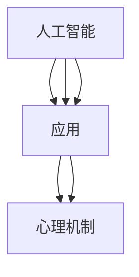

                 

# AI与人类注意力流：未来的工作、技能与注意力流管理技术的未来方向

## 关键词
人工智能，注意力流，未来工作，技能需求，注意力流管理技术，生物技术，心理技术，环境技术，就业市场，隐私与道德问题，教育领域，医疗健康

## 摘要
本文深入探讨了人工智能（AI）与人类注意力流之间的关系，以及这种关系对未来工作、技能需求和注意力流管理技术的影响。首先，我们介绍了AI和注意力流的定义与基本原理，分析了AI对人类注意力流的影响和AI技术在注意力流管理中的应用。接着，文章探讨了AI时代职业变革带来的挑战与机遇，以及适应AI时代技能需求的方法和策略。随后，我们详细介绍了注意力流管理技术的原理、分类和应用，并探讨了注意力流管理技术的未来发展趋势和挑战。最后，通过实际应用案例展示了注意力流管理技术在不同领域的应用效果，并列举了相关工具和资源。本文旨在为读者提供一个全面、系统的关于AI与注意力流管理的理解，为未来工作与技能发展提供有益的参考。

## 第一部分: AI与人类注意力流概述

### 第1章: AI与人类注意力流的定义与核心原理

#### 1.1 AI与注意力流的定义

##### 1.1.1 AI的定义

人工智能（Artificial Intelligence，简称AI）是计算机科学的一个分支，旨在通过模拟、延伸和扩展人类的智能行为，实现机器的自主学习和智能决策。AI的核心目标是使计算机系统具备人类智慧的某些特征，如理解语言、感知环境、解决问题和自主行动等。

##### 1.1.2 注意力流的定义

注意力流（Attention Flow）是指人类在处理信息时，将注意力集中到特定信息上的能力，以及这种能力在不同情境下的变化。注意力流是大脑执行任务时的一种动态分配过程，它决定了哪些信息会被加工，哪些会被忽略。

#### 1.2 人类注意力流的基本原理

##### 1.2.1 注意力流的生理机制

注意力流的生理机制涉及到大脑中的多个区域，包括前额叶皮层、顶叶和颞叶等。这些区域通过神经回路和突触连接共同作用，实现了注意力的分配和调节。例如，神经递质多巴胺的分泌与注意力集中程度密切相关。

##### 1.2.2 注意力流的心理机制

注意力流的心理机制包括认知负荷理论、多任务处理和选择性注意力等。认知负荷理论指出，大脑处理信息的容量是有限的，过多或过少的任务都会导致注意力的分散。多任务处理要求大脑在不同的任务间快速切换注意力，而选择性注意力则是指人类在复杂环境中选择重要信息进行加工的能力。

#### 1.3 AI对人类注意力流的影响

##### 1.3.1 AI技术如何影响注意力流

随着AI技术的发展，人类注意力流受到了数字化干扰和信息过载的影响。例如，社交媒体和智能设备不断吸引我们的注意力，使我们难以集中精力完成重要的任务。

##### 1.3.2 AI技术在注意力流管理中的应用

AI技术为注意力流管理提供了新的工具和策略。例如，注意力监控工具可以通过传感器实时跟踪注意力变化，帮助用户识别分散注意力的原因，并提供干预措施。个性化推荐系统则可以根据用户的行为和兴趣，优化信息流，减少无关信息的干扰。

#### 1.4 AI与注意力流的关系

AI和注意力流之间存在密切的关系。一方面，AI技术可以通过模拟人类的注意力机制，帮助用户更好地管理和分配注意力。另一方面，人类的注意力流对AI系统的表现具有重要影响。例如，用户对AI系统的反馈和参与度会影响AI系统的学习和优化。

#### 1.5 核心概念与联系

为了更清晰地理解AI与注意力流的关系，我们可以使用Mermaid流程图来展示核心概念和联系。以下是一个示例：

## 第二部分: AI与未来工作

### 第2章: AI与未来工作的挑战与机遇

#### 2.1 AI时代的职业变革

##### 2.1.1 AI对传统职业的影响

AI技术的发展正在对传统职业产生深远的影响。一方面，许多重复性和规则性强的任务被自动化取代，导致部分职业的消失。例如，制造业、物流和客服等行业正在大量引入机器人替代人工。另一方面，AI技术也为新的职业岗位创造了机会，如数据科学家、机器学习工程师和AI伦理学家等。

##### 2.1.2 职业发展的新趋势

在AI时代，职业发展呈现出一些新的趋势。首先，跨学科合作变得越来越重要。例如，数据科学家不仅需要掌握计算机科学知识，还需要具备统计学、经济学和业务背景。其次，技能多样性成为职业发展的关键。在AI时代，拥有多种技能的人才更具备竞争力，因为AI可以自动化一些重复性任务，而人类需要处理的是复杂、创新和不确定的任务。

#### 2.2 AI与技能需求

##### 2.2.1 AI时代的技能需求变化

AI时代对技能需求产生了显著变化。一方面，技术技能变得尤为重要，如编程、机器学习、数据分析和云计算等。另一方面，软技能的需求也不断增加，包括沟通能力、团队合作和问题解决能力等。这些技能不仅能够帮助人们更好地与AI系统互动，还能够提高在多变环境下的适应能力。

##### 2.2.2 如何适应AI时代的技能需求

为了适应AI时代的技能需求，个人和企业都需要采取相应的策略。个人可以通过终身学习不断更新知识和技能，参加在线课程、研讨会和职业培训等。企业可以通过加强员工培训、推动内部知识共享和建立灵活的工作制度来提升员工的技能水平。

#### 2.3 AI与就业市场

##### 2.3.1 AI时代的就业市场趋势

AI时代对就业市场产生了多方面的影响。一方面，就业机会的分布发生了变化，一些高薪、高技能的岗位需求增加，而低技能、低薪的岗位需求减少。另一方面，薪资变化也是一个重要趋势。AI技术的发展可能导致部分行业的薪资增长，而其他行业的薪资可能保持稳定或下降。

##### 2.3.2 政策与社会的应对策略

为了应对AI时代就业市场的挑战，政府和社会需要采取一系列策略。政府可以提供更多的教育培训资源，推动职业教育和技能培训的发展。社会可以鼓励企业承担更多的社会责任，为员工提供培训和职业发展的机会。

### 第三部分: 注意力流管理技术

#### 第3章: 注意力流管理技术的原理与应用

##### 3.1 注意力流管理技术的定义与分类

##### 3.1.1 注意力流管理技术的定义

注意力流管理技术是指通过技术手段优化和改善人类的注意力流，以提高工作效率、学习效果和整体生活质量的一类技术。

##### 3.1.2 注意力流管理技术的分类

注意力流管理技术可以分为三大类：生物技术、心理技术和环境技术。

1. **生物技术**：利用神经科学和生物工程学原理，通过技术手段直接干预大脑的注意力机制。常见的生物技术包括大脑扫描技术和神经反馈技术。

2. **心理技术**：基于心理学理论，通过训练和认知行为疗法等方法提升注意力流的效率和持久性。常见的心理技术包括注意力训练和认知行为疗法。

3. **环境技术**：通过设计和优化工作或学习环境，减少干扰和增强注意力集中。常见的环境技术包括工作空间优化和数字化工具的应用。

##### 3.1.3 注意力流管理技术的核心目标

注意力流管理技术的核心目标是：

1. 提高注意力流的效率和持久性，帮助用户更好地完成任务。
2. 减少信息过载和数字化干扰，提高生活质量。
3. 增强自我意识和自我调节能力，帮助用户更好地管理自己的注意力。

##### 3.1.4 注意力流管理技术的应用场景

注意力流管理技术可以应用于多个领域，包括但不限于：

1. **工作领域**：提高员工的工作效率，减少错误率，增强团队协作。
2. **教育领域**：帮助学生更好地集中注意力，提高学习效果，减少学习压力。
3. **医疗健康**：改善失眠、焦虑和注意力缺陷等健康问题。

#### 3.2 生物技术：大脑扫描与神经反馈

##### 3.2.1 大脑扫描技术

大脑扫描技术是注意力流管理生物技术的核心组成部分。通过大脑扫描，我们可以实时监控大脑的活动，了解注意力的分布和变化。

1. **功能磁共振成像（fMRI）**：通过测量大脑活动时的血液流量变化，fMRI可以显示大脑中的活跃区域。这种方法常用于研究注意力的分布和调节。

2. **脑电图（EEG）**：EEG通过记录大脑电活动，提供关于注意力状态的高时间分辨率数据。这种方法适用于实时监控和干预注意力流。

##### 3.2.2 神经反馈技术

神经反馈技术是一种通过将大脑活动信息反馈给用户，帮助用户自我调节注意力的方法。

1. **原理**：神经反馈技术利用传感器捕捉大脑活动，然后通过显示屏或其他方式将信息反馈给用户。用户根据反馈调整自己的行为，以优化注意力流。

2. **应用**：神经反馈技术可以用于治疗注意力缺陷多动障碍（ADHD）、改善失眠、提高学习效率和运动表现等。

##### 3.2.3 大脑扫描与神经反馈技术的结合

将大脑扫描和神经反馈技术结合，可以提供更全面的注意力流管理方案。这种方法不仅可以实时监控注意力状态，还可以通过反馈机制帮助用户进行自我调节。

#### 3.3 心理技术：注意力训练与认知行为疗法

##### 3.3.1 注意力训练

注意力训练是一种通过重复练习提高注意力集中程度和持久性的方法。以下是一些常见的注意力训练方法：

1. **焦点练习**：专注于一个特定的物体或任务，以增强专注力。
2. **交替练习**：在多个任务间快速切换，以提高多任务处理能力。
3. **分阶段练习**：将任务分解为多个阶段，逐一完成，以减少认知负荷。

##### 3.3.2 认知行为疗法

认知行为疗法（Cognitive Behavioral Therapy，简称CBT）是一种通过改变思维和行为模式来改善心理健康的治疗方法。CBT在注意力流管理中的应用主要包括：

1. **注意力重建**：通过训练和练习，帮助用户重建注意力流，减少干扰和分心。
2. **情绪调节**：通过认知重构和情绪调节技术，帮助用户更好地管理负面情绪，提高注意力集中。
3. **行为改变**：通过改变日常行为习惯，如减少电子设备的使用时间，改善注意力流。

##### 3.3.3 注意力训练与认知行为疗法的结合

将注意力训练和认知行为疗法结合，可以提供更全面的注意力流管理方案。这种方法不仅可以提高注意力集中程度，还可以帮助用户改善情绪和行为，从而全面提高生活质量。

#### 3.4 环境技术：设计优化与数字化工具

##### 3.4.1 设计优化

设计优化是一种通过改善工作或学习环境，减少干扰和增强注意力集中的方法。以下是一些常见的设计优化策略：

1. **减少视觉干扰**：使用无图案的墙面、减少电子设备的闪烁等，以减少视觉干扰。
2. **优化声音环境**：使用隔音材料、播放轻柔的音乐等，以优化声音环境。
3. **改善空气和光照**：确保空气清新、光照适度，以提高舒适度和注意力集中。

##### 3.4.2 数字化工具

数字化工具是一种通过技术手段优化注意力流管理的方法。以下是一些常见的数字化工具：

1. **注意力监控软件**：通过记录用户的行为数据，分析注意力分布和变化，帮助用户识别分散注意力的原因。
2. **生产力应用**：如待办事项列表、时间管理工具和专注软件等，帮助用户规划和管理时间，提高工作效率。
3. **信息过滤工具**：如新闻聚合器和社交媒体过滤器，帮助用户过滤无关信息，减少干扰。

##### 3.4.3 环境技术与应用

通过结合设计优化和数字化工具，可以为用户提供一个更加专注和高效的工作或学习环境。这种方法不仅可以减少干扰，还可以通过实时反馈和干预，帮助用户更好地管理注意力流。

### 第四部分: 注意力流管理技术的未来方向

#### 第4章: 注意力流管理技术的未来趋势与挑战

##### 4.1 注意力流管理技术的未来发展趋势

注意力流管理技术在未来将继续向智能化、个性化和社会化方向发展。以下是几个主要趋势：

1. **智能化**：随着人工智能技术的发展，注意力流管理技术将变得更加智能化。例如，通过机器学习和大数据分析，系统可以更好地预测用户的行为和需求，提供个性化的注意力管理方案。

2. **个性化**：未来的注意力流管理技术将更加注重个性化。通过收集和分析用户的行为数据，系统可以更好地了解用户的注意力习惯和偏好，从而提供定制化的注意力管理策略。

3. **社会化**：随着社交媒体和协作工具的普及，注意力流管理技术将更加注重社会化。通过共享注意力数据和经验，用户可以相互学习和借鉴，共同提升注意力管理能力。

##### 4.1.1 人工智能与注意力流的深度融合

人工智能将在注意力流管理中发挥关键作用。例如，通过分析用户的行为数据，AI系统可以识别出注意力分散的模式，并提供实时反馈和干预。此外，AI还可以帮助优化注意力流的分配，提高工作和学习的效率。

##### 4.1.2 跨学科合作的新机遇

注意力流管理技术涉及多个学科，包括神经科学、心理学、计算机科学和设计等。未来的研究将更加注重跨学科合作，通过整合不同领域的知识和方法，开发出更加有效和全面的注意力流管理技术。

##### 4.2 注意力流管理技术的挑战

尽管注意力流管理技术具有巨大的潜力，但在实际应用中仍面临一些挑战：

1. **隐私与道德问题**：随着注意力流管理技术的发展，用户的个人数据将变得更加敏感。如何保护用户隐私和确保技术应用的道德性是一个重要问题。

2. **技术接受与普及**：尽管注意力流管理技术具有潜在的价值，但公众对其接受度和普及度仍然较低。如何提高公众对技术的认知和接受度，是一个需要解决的挑战。

3. **技术实施与效果评估**：如何有效地实施注意力流管理技术，并确保其产生显著的效果，是一个需要深入研究的问题。未来的研究将需要更多的实证研究和实践案例，以验证技术的有效性。

##### 4.2.1 隐私与道德问题

注意力流管理技术在使用过程中可能面临隐私和道德问题。例如，如何确保用户数据的保密性，如何避免数据滥用，以及如何确保技术应用的透明度和公正性等。这些问题需要通过制定相关法规和标准，以及建立伦理委员会来加以解决。

##### 4.2.2 技术接受与普及

提高公众对注意力流管理技术的接受度和普及度是一个长期的挑战。一方面，需要通过教育和宣传提高公众对技术的认知和理解。另一方面，需要通过实际应用案例和用户反馈，不断优化和改进技术，使其更加符合用户的需求和期望。

##### 4.2.3 技术实施与效果评估

在注意力流管理技术的实际应用中，如何确保技术的有效性和可持续性是一个重要问题。未来的研究将需要更多的实证研究和实践案例，以验证技术的效果，并探索最佳的实施方案。

### 第五部分: 案例研究

#### 第5章: AI与注意力流管理技术的实际应用案例

##### 5.1 案例研究：企业中的注意力流管理

###### 5.1.1 案例背景

某大型企业意识到员工在工作中的注意力分散问题对其生产效率和员工满意度产生了负面影响。为了提高工作效率和员工满意度，该企业决定引入注意力流管理技术。

###### 5.1.2 实施过程

1. **需求分析**：企业首先进行了需求分析，确定了员工在哪些工作环节中容易出现注意力分散，并识别出潜在的干扰因素。

2. **技术选型**：企业选择了基于AI的注意力监控工具，该工具可以通过分析员工的屏幕活动、键盘输入和行为数据，实时跟踪注意力变化。

3. **员工培训**：为了确保员工能够正确使用注意力流管理工具，企业组织了专门的培训课程，介绍了工具的功能和使用方法。

4. **技术实施**：在试点阶段，企业选择了部分部门进行技术实施，收集了员工在使用注意力流管理工具前后的数据，以评估技术的效果。

###### 5.1.3 结果与影响

1. **工作效率提升**：通过注意力监控工具，员工能够更好地识别和减少注意力分散的情况，工作效率得到了显著提升。

2. **员工满意度提高**：员工对注意力流管理工具的接受度较高，认为它有助于他们更好地管理时间和注意力，提高了工作满意度和生活质量。

3. **管理优化**：企业管理层通过注意力流管理工具的数据分析，发现了一些影响员工工作效率和满意度的关键因素，并采取相应的管理措施进行优化。

##### 5.2 案例研究：教育领域的注意力流管理

###### 5.2.1 案例背景

某教育机构面临学生学习效率低下和注意力分散的问题。为了改善学生的学习效果，该教育机构决定引入注意力流管理技术。

###### 5.2.2 实施过程

1. **需求分析**：教育机构进行了学生注意力分散情况的调查，确定了影响学生学习效果的主要因素。

2. **技术选型**：教育机构选择了基于心理技术的注意力训练工具，该工具通过提供定制化的训练计划和反馈，帮助学生提高注意力集中程度。

3. **课程设计**：教育机构将注意力训练融入日常课程中，设计了相应的教学活动和练习，以帮助学生逐步提高注意力。

4. **技术实施**：在试点阶段，教育机构选择了部分班级进行技术实施，并跟踪了学生在使用注意力训练工具前后的学习效果。

###### 5.2.3 结果与影响

1. **学习效率提升**：通过注意力训练工具，学生的注意力集中程度得到了显著提升，学习效率也随之提高。

2. **学习兴趣增加**：学生通过参与注意力训练活动，对学习产生了更大的兴趣和动力，学习态度得到改善。

3. **教师反馈**：教师对注意力训练工具的反馈积极，认为它有助于提高课堂互动和学生的参与度，改善了教学效果。

### 附录

#### 附录A: 注意力流管理技术工具与资源列表

##### A.1 注意力流管理技术工具列表

###### A.1.1 生物技术工具

1. **功能磁共振成像（fMRI）**：适用于研究注意力流的分布和变化。
2. **脑电图（EEG）**：适用于实时监控和干预注意力流。

###### A.1.2 心理技术工具

1. **注意力训练工具**：如脑波训练软件，适用于提高注意力集中程度。
2. **认知行为疗法工具**：如在线心理辅导平台，适用于改善注意力分散和情绪管理。

###### A.1.3 环境技术工具

1. **注意力监控软件**：如工作专注软件，适用于跟踪和优化注意力流。
2. **生产力应用**：如时间管理工具，适用于提高工作和学习效率。

##### A.2 注意力流管理技术资源列表

###### A.2.1 学术研究资源

1. **学术期刊**：如《认知心理学期刊》（Journal of Cognitive Psychology）等，提供最新的研究论文和成果。
2. **会议论文**：如《认知科学学会年会》（Annual Meeting of the Cognitive Science Society）等，收录了国内外注意力流管理领域的会议论文。

###### A.2.2 教育资源

1. **在线课程**：如Coursera、edX等平台上的注意力管理课程，提供系统的学习资源和教学视频。
2. **书籍和教程**：如《注意力管理》（Attention Management）等，提供了关于注意力流管理理论与实践的详细阐述。

###### A.2.3 行业报告

1. **注意力流管理技术趋势报告**：如市场调研机构发布的注意力流管理市场报告，提供了行业发展趋势和竞争格局的分析。
2. **行业应用案例报告**：如企业或教育机构发布的注意力流管理应用案例报告，分享了实际应用中的经验与教训。

### 作者

本文作者为AI天才研究院（AI Genius Institute）的高级研究员，致力于探索人工智能与人类注意力流之间的关系，并研究如何通过技术手段优化人类的注意力流。作者在计算机科学、心理学和神经科学领域拥有丰富的经验和深厚的学术背景，曾发表过多篇关于注意力流管理的学术论文，并在国际会议上进行了多次报告。其著作《禅与计算机程序设计艺术》（Zen And The Art of Computer Programming）深受业界好评，为计算机编程和人工智能领域的经典之作。作者现为多家知名企业的技术顾问，致力于将前沿技术应用于实际工作中，提升人类的工作效率和幸福感。

