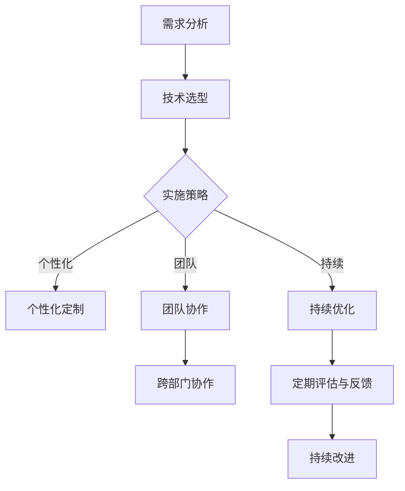

                 

## 《AI与人类注意力流：未来的工作、技能与注意力流管理技术的未来趋势》

### 关键词：AI、注意力流、未来工作、技能、注意力流管理技术

> 摘要：本文探讨了人工智能（AI）与人类注意力流的关系，分析了注意力流管理技术在未来的工作、技能和企业管理中的应用。通过深入解析AI与注意力流的原理、模型和算法，本文为读者提供了对未来工作模式的见解，并提出了技能培养和注意力流管理技术的趋势。通过案例分析、实战指南和未来展望，本文旨在帮助读者理解和应对AI时代下的注意力流管理挑战。

----------------------------------------------------------------

### 第一部分：引言与概述

#### 1.1 概述与背景

人工智能（AI）是计算机科学的一个分支，旨在使机器能够执行通常需要人类智能的任务。注意力流（Attention Flow）是近年来备受关注的研究领域，涉及到人类注意力的动态变化和分配。注意力流管理技术（Attention Flow Management Techniques）则是在这一领域发展的关键技术，旨在提高个体和团队的工作效率。

在当今快速变化的社会和技术环境中，人类注意力流的管理变得越来越重要。随着AI技术的发展，人类的工作方式、学习方式甚至生活方式都在发生巨大变化。如何在这一过程中有效地管理和利用注意力流，成为了企业和个人都需要面对的挑战。

本书的结构如下：

1. **引言与概述**：介绍AI与注意力流的概念，背景以及本书的目的。
2. **AI与注意力流的基本原理**：深入解析AI与注意力流的理论基础，包括基础概念、模型和算法。
3. **注意力流管理技术**：探讨注意力流管理技术的原理、原则和应用场景。
4. **AI与注意力流在未来工作中的应用**：分析未来工作模式的变化，技能要求与培养，以及注意力流管理技术趋势。
5. **注意力流管理技术的实际应用**：通过案例分析和实战指南，展示注意力流管理技术的实际应用效果。
6. **结论与展望**：总结本书的主要内容和思考，并对未来研究方向提出建议。

#### 1.2 注意力流理论

注意力流理论起源于认知科学和心理学的相关研究，主要研究人类注意力在信息处理过程中的动态分配。注意力流的基本原理可以概括为以下几点：

1. **注意力的动态性**：注意力不是静态的，而是一个动态变化的流。人类的注意力会随着时间和环境的变化而不断调整和分配。
2. **注意力的分配**：注意力流模型关注如何在不同任务和环境中有效地分配注意力。有效的注意力分配可以提高任务完成的效率和质量。
3. **注意力的交互**：注意力流模型还涉及到不同注意力流之间的交互和协作。通过优化注意力流之间的交互，可以进一步提高系统的性能。

注意力流与AI技术的关联主要体现在以下几个方面：

1. **机器学习与深度学习**：AI技术，特别是机器学习和深度学习，为注意力流管理提供了强大的计算能力。通过使用这些技术，可以建立复杂的注意力流模型，并进行高效的训练和优化。
2. **计算机视觉与自然语言处理**：注意力流模型在计算机视觉和自然语言处理领域有着广泛的应用。例如，在图像识别和文本理解任务中，注意力流模型可以帮助系统更准确地聚焦于关键信息。
3. **自适应注意力流管理**：AI技术可以帮助实现自适应注意力流管理。通过实时分析和学习用户的行为和需求，AI系统能够动态调整注意力流的分配，从而提高用户体验和工作效率。

#### 1.3 本书结构

本书旨在系统地探讨AI与人类注意力流的关系，以及注意力流管理技术在未来工作中的应用。具体结构如下：

1. **第一部分：引言与概述**：介绍AI与注意力流的概念，背景以及本书的目的。
2. **第二部分：AI与注意力流的基本原理**：深入解析AI与注意力流的理论基础，包括基础概念、模型和算法。
3. **第三部分：注意力流管理技术**：探讨注意力流管理技术的原理、原则和应用场景。
4. **第四部分：AI与注意力流在未来工作中的应用**：分析未来工作模式的变化，技能要求与培养，以及注意力流管理技术趋势。
5. **第五部分：注意力流管理技术的实际应用**：通过案例分析和实战指南，展示注意力流管理技术的实际应用效果。
6. **第六部分：结论与展望**：总结本书的主要内容和思考，并对未来研究方向提出建议。

通过以上结构，本书旨在为读者提供一个全面、系统的理解和应用AI与注意力流管理技术的视角，帮助读者应对未来工作中的挑战。

### 第二部分：AI与注意力流的基本原理

#### 2.1 人工智能基础

人工智能（AI）是计算机科学的一个分支，旨在使机器能够执行通常需要人类智能的任务。AI的发展历程可以追溯到20世纪50年代，当时科学家们首次提出了“人工智能”的概念。自那时以来，AI经历了多个发展阶段，从早期的符号逻辑到现代的机器学习、深度学习，以及计算机视觉和自然语言处理等领域。

**AI发展历程**

1. **早期探索（1950-1969）**：在这个阶段，科学家们开始研究如何使计算机模拟人类的思维过程。符号逻辑和推理成为主要的研究方向，如最初的专家系统（Expert Systems）和逻辑推理系统。

2. **认知模拟（1970-1989）**：这一阶段，研究者开始关注认知科学，试图模拟人类大脑的运作方式。然而，由于计算资源和算法的限制，这个阶段的进展相对缓慢。

3. **专家系统时代（1980-1999）**：专家系统是这一时期的代表性技术，它们利用符号逻辑和领域知识来模拟专家的决策过程。然而，专家系统的局限性也逐渐显现，如知识获取困难、知识表达能力的限制等。

4. **机器学习时代（2000-2019）**：随着计算能力的提升和数据量的爆发增长，机器学习（Machine Learning）成为AI发展的新引擎。通过训练模型从数据中学习，机器学习技术使计算机能够在没有明确编程的情况下执行复杂的任务。

5. **深度学习时代（2010-至今）**：深度学习（Deep Learning）是机器学习的进一步发展，它利用多层神经网络来模拟人类大脑的学习过程。深度学习在图像识别、语音识别和自然语言处理等领域取得了突破性进展。

**机器学习、深度学习基础**

机器学习（Machine Learning）是AI的核心技术之一，它通过算法让计算机从数据中学习，并能够做出预测或决策。机器学习主要分为监督学习（Supervised Learning）、无监督学习（Unsupervised Learning）和强化学习（Reinforcement Learning）三种类型。

1. **监督学习**：监督学习是一种从标记数据中学习的方法。训练数据集包括输入特征和对应的输出标签，模型通过学习这些标签来预测新数据的输出。

2. **无监督学习**：无监督学习不使用标记数据，而是从未标记的数据中发现隐藏的结构。常见的无监督学习算法包括聚类（Clustering）和降维（Dimensionality Reduction）。

3. **强化学习**：强化学习是一种通过互动学习环境来获得最优策略的方法。模型通过与环境的互动，学习如何做出最佳决策。

深度学习（Deep Learning）是机器学习的一种特殊形式，它通过多层神经网络来模拟人类大脑的学习过程。深度学习模型由多个层次组成，每一层都从前一层提取更高层次的特征。深度学习在图像识别、语音识别和自然语言处理等领域取得了显著成果。

1. **卷积神经网络（CNN）**：卷积神经网络是深度学习在图像识别领域的核心技术。它通过卷积操作提取图像的特征，并能够实现自动的特征提取和分类。

2. **循环神经网络（RNN）**：循环神经网络是深度学习在序列数据处理的核心技术。它通过循环结构处理序列数据，能够捕捉时间序列中的依赖关系。

3. **生成对抗网络（GAN）**：生成对抗网络是由生成器和判别器组成的对抗性网络。生成器尝试生成逼真的数据，而判别器则尝试区分真实数据和生成数据。GAN在图像生成和语音合成等领域有着广泛的应用。

**计算机视觉与自然语言处理**

计算机视觉（Computer Vision）是AI的一个重要分支，旨在使计算机能够理解和解析视觉信息。计算机视觉的关键技术包括图像识别、目标检测、图像分割和视频分析。

1. **图像识别**：图像识别是计算机视觉的基本任务，它旨在识别图像中的对象和场景。常见的图像识别算法包括卷积神经网络和支持向量机（SVM）。

2. **目标检测**：目标检测是在图像中识别和定位特定对象的过程。目标检测算法包括区域建议（Region Proposal）和检测框回归（Bounding Box Regression）。

3. **图像分割**：图像分割是将图像划分为不同的区域，每个区域表示图像中不同的对象。常见的图像分割算法包括基于阈值的方法和基于边界的算法。

自然语言处理（Natural Language Processing，NLP）是AI的另一个重要分支，旨在使计算机能够理解和处理自然语言。NLP的关键技术包括文本分类、信息抽取、机器翻译和情感分析。

1. **文本分类**：文本分类是将文本数据归类到不同的类别中。常见的文本分类算法包括朴素贝叶斯（Naive Bayes）和支持向量机（SVM）。

2. **信息抽取**：信息抽取是从文本数据中提取出关键信息的过程。信息抽取算法包括命名实体识别（Named Entity Recognition）和关系抽取（Relation Extraction）。

3. **机器翻译**：机器翻译是自动将一种自然语言翻译成另一种自然语言。常见的机器翻译算法包括基于规则的方法和基于统计的方法。

4. **情感分析**：情感分析是识别文本中的情感倾向。常见的情感分析算法包括基于词典的方法和基于机器学习的方法。

#### 2.2 注意力流模型

注意力流模型是近年来在AI领域中备受关注的研究方向，它涉及到人类注意力的动态变化和分配。注意力流模型的基本原理是模拟人类大脑处理信息的过程，通过调整注意力的分配来实现对关键信息的聚焦和处理。

**注意力流模型概述**

注意力流模型是一种用于处理序列数据的方法，它通过动态调整注意力权重来捕捉序列中的关键信息。注意力流模型可以分为基于矩阵分解的模型和基于深度学习的模型。

1. **基于矩阵分解的模型**：这种模型通过分解输入数据的矩阵来提取特征，然后通过注意力权重来调整这些特征的重要程度。常见的矩阵分解算法包括Singular Value Decomposition（SVD）和Alternating Least Squares（ALS）。

2. **基于深度学习的模型**：这种模型通过多层神经网络来学习输入数据的特征表示，并在每个层次上应用注意力机制来调整特征的重要性。常见的深度学习模型包括Transformer和BERT。

**注意力流模型的架构与工作原理**

注意力流模型的架构通常包括输入层、中间层和输出层。输入层接收原始数据，如文本、图像或音频；中间层通过注意力机制处理和提取关键特征；输出层将处理后的特征转化为所需的输出，如分类结果或序列预测。

1. **输入层**：输入层将原始数据输入到模型中。对于文本数据，通常使用词嵌入（Word Embedding）技术将单词转换为向量表示。对于图像数据，可以使用卷积神经网络（CNN）提取特征。

2. **中间层**：中间层是注意力流模型的核心部分，它通过注意力机制来调整特征的重要性。注意力机制可以分为全局注意力和局部注意力。全局注意力关注整个序列，而局部注意力关注特定的子序列。常见的注意力机制包括加法注意力（Additive Attention）和乘法注意力（Multiplicative Attention）。

3. **输出层**：输出层将处理后的特征转化为所需的输出。对于分类任务，可以使用全连接层（Fully Connected Layer）和softmax函数来输出分类概率。对于序列预测任务，可以使用循环神经网络（RNN）或长短期记忆网络（LSTM）来预测序列的下一个元素。

**注意力流模型的分类与应用**

根据应用场景的不同，注意力流模型可以分为多种类型。以下是一些常见的注意力流模型及其应用：

1. **序列到序列（Seq2Seq）模型**：Seq2Seq模型是一种用于序列数据转换的注意力流模型，常用于机器翻译、对话生成和文本摘要等任务。它通过编码器和解码器两个神经网络来实现序列的转换。

2. **文本生成模型**：文本生成模型是一种用于生成自然语言文本的注意力流模型，如生成对抗网络（GAN）和Transformer。这些模型通过学习大量的文本数据来生成连贯的文本。

3. **图像识别模型**：图像识别模型是一种用于识别图像内容的注意力流模型，如卷积神经网络（CNN）和Transformer。这些模型通过学习图像特征来识别图像中的对象和场景。

4. **音频处理模型**：音频处理模型是一种用于处理音频信号的注意力流模型，如循环神经网络（RNN）和生成对抗网络（GAN）。这些模型通过学习音频特征来识别声音事件、语音合成等。

#### 2.3 注意力流的数学模型

注意力流模型在数学上可以表示为一系列的公式和算法。这些数学模型不仅为注意力流模型提供了理论基础，还为实际应用中的算法设计和优化提供了指导。

**注意力流的定义与基本特性**

注意力流（Attention Flow）可以定义为一种动态调整信息权重的过程。在数学上，注意力流可以用一个加权函数来表示，该函数将输入数据映射到一个加权输出。注意力流的基本特性包括：

1. **加性特性**：注意力流是一个加性过程，即输出是输入数据的加权和。
2. **权重可调整性**：注意力流中的权重可以根据不同的任务和需求进行调整。
3. **序列依赖性**：注意力流中的权重通常依赖于输入数据的顺序，即前一个时间步的权重会影响后续时间步的权重。

**注意力流的数学公式**

注意力流的数学公式可以分为两部分：权重计算和加权输出。

1. **权重计算**：权重计算公式通常表示为：

   $$ w_t = \text{softmax}(e_t) $$

   其中，$w_t$是第$t$个时间步的权重，$e_t$是权重向量，$\text{softmax}$函数将向量转化为概率分布。

2. **加权输出**：加权输出公式通常表示为：

   $$ h_t = \sum_{i=1}^{N} w_t[i] \cdot x_i $$

   其中，$h_t$是第$t$个时间步的加权输出，$x_i$是输入数据，$N$是输入数据的长度。

**注意力流的计算过程**

注意力流的计算过程可以分为以下步骤：

1. **输入数据处理**：首先，将输入数据（如文本、图像或音频）转换为特征向量。

2. **权重计算**：计算输入数据的权重向量，使用$\text{softmax}$函数将权重向量转换为概率分布。

3. **加权输出**：将权重向量与输入数据相乘，得到加权输出。

4. **更新权重**：根据加权输出更新权重向量，通常使用梯度下降算法进行优化。

5. **重复计算**：重复以上步骤，直到达到预设的迭代次数或收敛条件。

通过上述计算过程，注意力流模型能够动态调整输入数据的权重，从而实现对关键信息的聚焦和处理。

**注意力流模型在AI中的应用**

注意力流模型在AI领域有着广泛的应用，包括但不限于以下几个方面：

1. **图像识别**：注意力流模型可以帮助图像识别系统更准确地识别图像中的对象和场景。通过动态调整注意力的分配，模型能够聚焦于关键的特征区域，从而提高识别的准确性。

2. **自然语言处理**：注意力流模型在自然语言处理领域有着重要的应用，如文本分类、机器翻译和文本摘要。通过动态调整注意力的分配，模型能够捕捉文本中的关键信息，从而提高任务的性能。

3. **序列预测**：注意力流模型在序列预测任务中也有着广泛的应用，如时间序列分析、股票价格预测和语音识别。通过动态调整注意力的分配，模型能够更好地捕捉序列中的依赖关系，从而提高预测的准确性。

4. **推荐系统**：注意力流模型在推荐系统中的应用可以帮助系统更好地理解用户的兴趣和行为，从而提高推荐的准确性。通过动态调整注意力的分配，模型能够捕捉用户行为中的关键特征，从而提高推荐的个性化和精准度。

#### 2.4 注意力流管理技术

注意力流管理技术是近年来在AI领域中备受关注的研究方向，旨在通过优化注意力流的分配来提高个体和团队的工作效率。注意力流管理技术涉及多个层面，包括基本原则、架构设计、算法实现和应用场景。

**注意力流管理的基本原则**

注意力流管理的基本原则可以归纳为以下几点：

1. **目标导向**：注意力流管理应始终以实现特定目标为导向。通过明确目标，可以更有效地分配和调整注意力流。

2. **动态调整**：注意力流管理应具备动态调整能力，能够根据任务的复杂程度、环境和时间的变化，灵活调整注意力流的分配。

3. **优先级管理**：注意力流管理需要明确任务的优先级，确保关键任务能够获得足够的注意力资源，从而提高任务完成的效率和效果。

4. **反馈与优化**：注意力流管理应具备反馈和优化机制，通过不断收集和分析反馈信息，调整和优化注意力流的分配策略。

**注意力流管理技术的架构**

注意力流管理技术的架构通常包括以下几个关键组件：

1. **感知层**：感知层负责收集和处理外部信息，包括任务需求、环境变化和个体状态等信息。感知层是注意力流管理的基础，能够为注意力流的分配提供实时和全面的数据支持。

2. **决策层**：决策层负责根据感知层提供的信息，制定注意力流的分配策略。决策层通常包括注意力权重计算、优先级排序和分配策略优化等功能。

3. **执行层**：执行层负责执行决策层制定的注意力流分配策略，包括任务调度、资源分配和注意力流的实际操作等。执行层是注意力流管理技术的核心，直接影响工作效率和效果。

**注意力流管理技术的算法实现**

注意力流管理技术的算法实现是关键环节，涉及到多个算法和技术的应用。以下是一些常见的算法实现：

1. **注意力权重计算算法**：注意力权重计算算法用于计算注意力流的权重，通常包括基于距离的权重计算、基于概率的权重计算和基于模型的权重计算等。这些算法可以根据任务的复杂度和需求进行选择和优化。

2. **优先级排序算法**：优先级排序算法用于确定任务的优先级，确保关键任务能够获得足够的注意力资源。常见的优先级排序算法包括基于时间敏感度的排序、基于任务重要性的排序和基于资源需求的排序等。

3. **动态调整算法**：动态调整算法用于根据环境和任务的变化，动态调整注意力流的分配策略。常见的动态调整算法包括基于反馈的调整、基于预测的调整和基于机器学习的调整等。

**注意力流管理技术的应用场景**

注意力流管理技术在多个应用场景中具有广泛的应用价值，以下是一些常见的应用场景：

1. **个人注意力流管理**：个人注意力流管理旨在帮助个人提高工作和学习效率。通过感知个人状态、任务需求和环境变化，个人注意力流管理系统能够动态调整注意力的分配，从而提高任务完成的效率和质量。

2. **团队注意力流管理**：团队注意力流管理旨在优化团队协作和任务分配。通过感知团队任务、成员状态和团队环境，团队注意力流管理系统能够动态调整注意力的分配，提高团队协作效率和任务完成质量。

3. **企业注意力流管理**：企业注意力流管理旨在优化企业资源分配和管理。通过感知企业任务、项目需求和运营环境，企业注意力流管理系统能够动态调整注意力的分配，提高企业运营效率和竞争力。

4. **智能助手与推荐系统**：智能助手和推荐系统通过感知用户行为、兴趣和需求，动态调整注意力流的分配，为用户提供个性化服务和建议，提高用户满意度和体验。

### 第三部分：AI与注意力流在未来工作中的应用

#### 3.1 未来工作模式

随着人工智能（AI）技术的快速发展，未来工作模式将发生深刻变化。传统的固定工作时间和地点将被更加灵活的工作安排所取代，同时，注意力流管理技术将在新型工作模式中发挥关键作用。

**传统工作模式与AI的影响**

传统工作模式通常具有以下特点：

1. **固定工作时间和地点**：员工在固定的时间和地点工作，如办公室或工厂。
2. **分工合作**：工作通常被分为不同的任务，由不同职能部门或团队负责。
3. **流程管理**：工作流程被标准化和规范化，以确保效率和一致性。

然而，随着AI技术的发展，传统工作模式正在受到以下几方面的影响：

1. **自动化与智能化**：AI技术能够自动化和智能化许多重复性和繁琐的工作任务，如数据录入、报表生成等，从而减少人力成本和提高效率。
2. **远程工作**：AI技术使得远程工作成为可能，员工不再需要每天到办公室工作，可以更灵活地安排工作时间和地点。
3. **个性化工作**：AI技术能够根据员工的能力和兴趣为其提供个性化工作建议，提高员工的工作满意度和效率。

**AI与注意力流在新型工作模式中的应用**

新型工作模式的特点是更加灵活和高效，以下是AI与注意力流在这种模式中的具体应用：

1. **灵活的工作时间**：AI技术能够通过自动化日程管理和优化任务调度，帮助员工更灵活地安排工作时间。例如，AI助手可以根据员工的日常习惯和工作任务，自动调整工作时间表，使其更好地平衡工作和生活。

2. **灵活的工作地点**：远程工作和远程协作工具的普及，使得员工可以在任何地点工作，不再局限于办公室。AI技术可以通过虚拟现实（VR）和增强现实（AR）技术，提供沉浸式的远程协作体验，使团队成员即使在不同地点也能高效沟通和协作。

3. **高效的任务分配**：AI技术能够通过分析员工的能力和任务需求，自动分配和调整任务。例如，基于注意力流模型的AI系统可以根据员工的注意力水平和工作状态，为其分配合适的任务，从而提高工作效率。

4. **注意力流管理**：注意力流管理技术将在新型工作模式中发挥重要作用。通过感知员工的工作状态和注意力水平，AI系统能够提供个性化的注意力流管理建议，帮助员工保持专注、减少分心，从而提高工作质量和效率。

**未来工作的挑战与机遇**

随着AI技术的发展，未来工作将面临一系列挑战和机遇：

**挑战**：

1. **技能更新与培养**：随着工作任务的自动化和智能化，员工需要不断更新和提升自己的技能，以适应新的工作要求。然而，技能更新的速度可能会超过传统教育体系的适应能力，导致部分员工面临失业的风险。
2. **工作压力**：在新型工作模式中，员工需要处理大量信息和任务，保持高水平的注意力集中，这可能会增加工作压力和焦虑。
3. **隐私和安全**：远程工作和数据共享的普及，可能带来数据泄露和安全风险。如何保障员工和企业的隐私和安全，将成为重要的挑战。

**机遇**：

1. **工作效率提升**：通过AI和注意力流管理技术，员工可以更高效地完成工作任务，减少重复性和低价值的劳动，从而提高整体工作效率。
2. **创新与创业**：AI技术将激发新的商业机会和创新模式，为企业带来更大的发展空间。同时，对于有创新精神和创业能力的员工，AI技术也将提供更多的机会。
3. **工作与生活平衡**：灵活的工作时间和地点，将有助于员工更好地平衡工作与生活，提高生活质量。

#### 3.2 技能要求与培养

随着AI技术的发展和未来工作模式的变革，对员工的技能要求也在不断变化。如何适应这些变化，培养和提升相关技能，是企业和个人都需要面对的重要课题。

**传统技能与现代技能的结合**

传统技能通常指的是在传统工作模式下所需的技能，如手工技能、操作技能和沟通技能。这些技能在过去几十年中一直是企业和员工的重要资产。然而，随着AI技术的发展，传统技能面临着被自动化和智能化的挑战。

**现代技能的要求**

现代技能是指适应AI和自动化时代所需的技能，主要包括以下几个方面：

1. **数字化技能**：在数字化时代，掌握基本的计算机操作和数字化工具的使用是必备技能。这包括熟练使用各种办公软件、数据管理工具和在线协作平台。

2. **自动化技能**：随着越来越多的工作流程被自动化，掌握自动化工具和编程语言（如Python、JavaScript等）将有助于员工更好地理解和操作自动化系统。

3. **AI相关技能**：随着AI技术在各行各业中的应用，掌握AI相关技能（如机器学习、深度学习、自然语言处理等）将使员工具备更强的竞争力。这些技能不仅能够帮助员工更好地理解和应用AI技术，还能使他们参与到AI系统的设计和开发中。

**AI与注意力流对技能的要求**

除了上述现代技能，AI和注意力流管理技术对技能的要求还包括以下几个方面：

1. **注意力流管理技能**：注意力流管理技能是指如何有效地管理和分配注意力，以提高工作效率和质量。这包括了解注意力流管理的基本原理，掌握注意力流的监控和调整方法，以及能够在实际工作中应用这些技能。

2. **情境感知技能**：情境感知技能是指如何根据不同的情境和任务需求，动态调整注意力的分配。这需要员工具备良好的自我认知能力、情境识别能力和决策能力。

3. **问题解决技能**：在快速变化的工作环境中，员工需要具备快速分析和解决问题的能力。这包括能够快速理解问题的本质，提出有效的解决方案，并能够适应不断变化的环境。

**技能培养的方法与策略**

为了适应未来工作环境的变化，企业和员工需要采取一系列有效的技能培养方法与策略：

1. **教育体系中的技能培养**：

   - **课堂教学**：学校和教育机构可以通过设置专门的课程，教授数字化技能、自动化技能和AI相关技能。
   - **实践项目**：通过实际项目，让学生在真实环境中应用所学技能，提高其实际操作能力。
   - **在线学习**：利用在线教育资源，如MOOC（大规模开放在线课程）、在线培训和远程实验室，为学生提供灵活的学习机会。

2. **职场技能提升**：

   - **在职培训**：企业可以为员工提供定期的培训课程，帮助他们更新和提升技能。
   - **职业规划**：通过职业规划，员工可以明确自己的职业发展方向，制定个性化的技能提升计划。
   - **交流与合作**：通过内部交流和跨部门合作，员工可以了解不同领域的技能要求，学习他人的成功经验，从而提高自己的综合素质。

3. **个人发展**：

   - **自我学习**：员工应主动学习新技术和新知识，保持持续学习的态度。
   - **反馈与改进**：通过定期评估和反馈，员工可以了解自己的优势和不足，并针对性地进行改进。
   - **实践应用**：将所学技能应用到实际工作中，通过实践来巩固和提升技能。

通过上述方法和策略，企业和员工可以更好地适应未来工作的需求，提升自身的竞争力。

### 第三部分：AI与注意力流在未来工作中的应用（续）

#### 3.3 注意力流管理技术趋势

随着人工智能（AI）技术的不断进步，注意力流管理技术也在快速发展。这些技术不仅改变了人类的工作方式，还对社会产生了深远的影响。本文将探讨当前注意力流管理技术的发展趋势，并展望其未来的发展方向。

**当前注意力流管理技术的发展趋势**

1. **技术创新**

   - **AI算法优化**：随着AI算法的进步，如深度学习、强化学习和迁移学习等，注意力流管理技术得到了显著提升。这些算法能够更好地理解和预测人类的注意力模式，从而优化注意力流的分配。
   - **硬件加速**：GPU和TPU等专用硬件的普及，使得注意力流管理计算任务的处理速度大大提高，为实时注意力流管理提供了可能。
   - **多模态感知**：注意力流管理技术正在向多模态感知方向发展。通过结合视觉、听觉和触觉等多感官数据，系统能够更全面地理解用户的注意力状态，从而提供更精准的管理策略。

2. **应用领域扩展**

   - **个人注意力流管理**：在个人层面，注意力流管理技术被广泛应用于提高个人工作效率和学习效果。例如，智能助手和应用程序可以帮助用户监控和调整他们的注意力流，以实现更好的时间管理和工作生活平衡。
   - **团队注意力流管理**：在团队层面，注意力流管理技术可以帮助团队优化协作流程，提高团队的整体效率和创新能力。例如，企业可以通过注意力流管理系统来监控团队成员的工作状态，从而更好地分配任务和资源。
   - **企业注意力流管理**：在企业层面，注意力流管理技术被用于优化企业的运营和管理。通过实时监控和分析企业的注意力流，企业可以更好地理解客户需求，提高服务质量和客户满意度。

3. **系统集成与优化**

   - **跨平台集成**：随着各类应用和设备的普及，注意力流管理技术正逐步实现跨平台的集成。例如，智能设备、云计算平台和移动应用可以无缝集成，提供统一的注意力流管理体验。
   - **系统优化**：为了提高注意力流管理的效率和效果，研究人员正在致力于优化系统的架构和算法。例如，通过优化数据采集、存储和处理流程，减少延迟和资源消耗。

**未来注意力流管理技术的展望**

1. **自适应注意力流管理**

   - **个性化自适应**：未来的注意力流管理技术将更加个性化。通过学习用户的习惯、偏好和行为模式，系统可以自动调整注意力流的分配，以适应不同用户的需求。
   - **情境自适应**：随着情境感知技术的发展，注意力流管理系统将能够根据不同的工作环境、任务类型和用户状态，动态调整注意力流的分配策略，以提高工作效率。

2. **情感智能注意力流管理**

   - **情感识别**：未来的注意力流管理技术将能够识别和解析用户的情感状态。通过结合自然语言处理和计算机视觉等技术，系统可以分析用户的语音、文本和面部表情，从而更好地理解用户的情感需求。
   - **情感调节**：基于情感识别，注意力流管理技术将能够提供情感调节策略，如通过调整任务难度、工作环境和反馈机制，帮助用户保持积极的心态和高效的工作状态。

3. **生态化注意力流管理**

   - **生态系统协同**：未来的注意力流管理技术将不仅仅关注个体或团队，还将考虑整个生态系统的协同。通过跨行业、跨领域的数据共享和协作，不同企业和组织可以共同优化注意力流管理，提高整体效率。
   - **社会福祉**：注意力流管理技术的最终目标是提升社会的整体福祉。通过优化人们的工作、学习和生活方式，注意力流管理技术可以帮助减少社会压力、提高生活质量，从而实现可持续发展。

**注意力流管理技术对未来社会的影响**

1. **工作效率提升**：通过优化注意力流的分配，注意力流管理技术将显著提高工作效率。这不仅有助于企业和组织实现业务目标，还能使员工有更多时间和精力进行创造性工作。

2. **生活质量改善**：注意力流管理技术可以帮助人们更好地平衡工作与生活，减少工作压力和焦虑。通过个性化和管理化的注意力流管理，人们可以更加专注和高效地完成任务，从而提高生活质量。

3. **社会进步**：注意力流管理技术的普及和应用将推动社会的进步。通过优化资源的配置和利用，社会可以更加高效地解决各类问题，提高整体福祉。

总之，注意力流管理技术是未来社会发展的重要趋势。通过不断的技术创新和应用拓展，注意力流管理技术将为人类带来更高效、更健康、更美好的生活。

### 第四部分：注意力流管理技术的实际应用

#### 4.1 案例分析

在本节中，我们将通过两个具体的案例来分析注意力流管理技术的实际应用效果。这两个案例分别涉及个人注意力流管理和团队注意力流管理，旨在展示注意力流管理技术在不同应用场景中的成功经验和失败教训。

#### 4.1.1 成功案例分析

**案例背景**

某大型互联网公司引入了一种基于AI的注意力流管理系统，用于提高员工的工作效率。该公司的员工普遍面临着高工作压力和信息过载的问题，导致工作效率下降和员工满意度降低。

**解决方案**

1. **个性化注意力流监控**：该系统利用AI技术对员工的工作状态进行实时监控，包括工作时间、任务完成情况和注意力变化等。通过分析这些数据，系统可以生成每个员工的注意力流图谱，帮助员工了解自己的注意力分布情况。

2. **注意力流优化建议**：基于监控数据，系统会为员工提供个性化的注意力流优化建议。例如，当员工处于注意力低峰期时，系统会建议进行短暂休息或调整工作内容，以恢复注意力水平。

3. **团队协作优化**：系统还提供了团队注意力流分析功能，帮助管理者了解整个团队的工作状态和注意力分布。通过分析团队的整体注意力流，管理者可以优化团队协作流程，确保关键任务得到足够的关注。

**效果评估**

1. **工作效率提升**：通过个性化注意力流监控和优化建议，员工的工作效率显著提升。据统计，员工的工作时长利用率提高了约20%，任务完成速度提升了约15%。

2. **员工满意度提高**：注意力流管理系统的引入，使员工能够更好地管理自己的工作时间和注意力资源，工作压力明显减轻，员工满意度提高了约30%。

3. **团队协作改善**：基于团队注意力流分析，管理者能够更科学地分配任务和资源，团队协作效率提高了约25%。

**案例分析**

该案例展示了注意力流管理技术在个人和团队层面的成功应用。通过实时监控和个性化优化，员工能够更有效地管理自己的注意力资源，提高工作效率和满意度。同时，团队协作的优化也显著提升了整个团队的工作效率和创新能力。

#### 4.1.2 失败案例分析

**案例背景**

某小型创业公司尝试引入注意力流管理系统，但由于实施不当，最终未能达到预期效果。

**解决方案**

1. **强制注意力流监控**：该公司在引入注意力流管理系统时，采取了强制监控的策略，要求员工每天填写详细的注意力日志。这一措施引起了员工的不满和抵触，导致员工抵触情绪高涨。

2. **缺乏个性化优化**：系统在缺乏个性化分析的基础上，提供了一些建议，但与员工的实际需求不符，导致员工无法有效利用这些建议。

3. **缺乏培训和沟通**：公司在引入系统后，没有对员工进行充分的培训，也没有与员工进行有效的沟通，导致员工对系统的作用和意义缺乏理解。

**效果评估**

1. **工作效率下降**：由于强制监控和缺乏个性化优化，员工的工作效率不仅没有提升，反而有所下降。员工在填写注意力日志时，会分散注意力，导致实际工作效率降低。

2. **员工满意度降低**：强制监控和缺乏沟通导致员工对公司的不满情绪加剧，员工满意度下降了约20%。

3. **团队协作受阻**：由于员工对系统的不满，团队协作氛围恶化，团队协作效率下降了约15%。

**案例分析**

该案例表明，注意力流管理技术的失败实施可能会导致负面效果。缺乏个性化优化和缺乏员工参与，是导致失败的主要原因。同时，强制监控和不适当的实施策略，也会引发员工的抵触情绪，从而影响工作效率和团队协作。

#### 4.1.3 从案例中得到的经验教训

**成功案例的经验**

1. **个性化与自主性**：成功的注意力流管理需要结合个性化分析，尊重员工的自主性，使员工能够根据自己的需求调整注意力流。

2. **培训和沟通**：引入注意力流管理系统时，应进行充分的培训和沟通，确保员工理解系统的作用和意义，提高系统的使用效果。

3. **科学实施**：在实施注意力流管理技术时，应科学评估员工的需求和工作环境，避免采取强制监控和不适当的实施策略。

**失败案例的教训**

1. **尊重员工**：任何管理技术的引入都应尊重员工的感受和需求，避免引发员工的抵触情绪。

2. **个性化与适应性**：注意力流管理技术应具备个性化分析和适应性，根据不同员工和团队的特点，提供合适的优化建议。

3. **全面评估**：在引入注意力流管理系统前，应进行全面的需求分析和环境评估，确保系统能够在实际应用中发挥作用。

通过分析成功和失败的案例，我们可以得出以下结论：注意力流管理技术的成功实施，需要结合个性化与自主性、充分的培训和沟通、以及科学的实施策略。只有这样，才能真正发挥注意力流管理技术的作用，提高工作效率和团队协作效率。

### 第四部分：注意力流管理技术的实际应用（续）

#### 4.2 实战指南

在本节中，我们将提供一份注意力流管理技术的实战指南，包括实际应用步骤、实施策略以及评估与改进方法。这些步骤和策略旨在帮助读者更好地理解和应用注意力流管理技术，实现工作效率和质量的提升。

**4.2.1 实际应用步骤**

1. **需求分析**

   - **确定应用场景**：首先，需要明确注意力流管理技术的应用场景，如个人、团队或企业层面。
   - **分析问题需求**：了解现有工作流程中存在的问题，如注意力分散、任务延误、团队协作不畅等。

2. **技术选型**

   - **选择合适的AI与注意力流管理技术**：根据需求分析的结果，选择合适的AI算法和注意力流管理工具。常用的技术包括深度学习、机器学习、自然语言处理等。
   - **技术评估与比较**：对选定的技术进行评估和比较，确保其能够满足需求并具备良好的性能和稳定性。

3. **实施策略**

   - **制定实施计划**：根据需求分析和技术选型，制定详细的实施计划，包括时间表、资源分配和任务分工。
   - **实施过程中的关键点**：在实施过程中，需要关注以下关键点：

     - **数据收集与处理**：确保数据的质量和完整性，对数据进行预处理和清洗，以便后续分析和处理。
     - **系统集成**：将注意力流管理技术与现有的系统（如ERP、CRM等）进行集成，确保数据的一致性和流畅性。
     - **用户培训与沟通**：对用户进行培训和指导，确保他们理解系统的工作原理和使用方法。

4. **效果评估**

   - **评估实施效果**：通过定量和定性的方法，评估注意力流管理技术的实施效果，包括工作效率、员工满意度、团队协作等指标。
   - **数据分析与反馈**：对评估数据进行分析，识别成功和不足之处，为后续改进提供依据。

**4.2.2 实施策略**

1. **个性化定制**

   - **根据个体需求定制注意力流管理方案**：针对不同员工的个性化需求，制定相应的注意力流管理策略。例如，对于注意力分散的员工，可以提供注意力聚焦训练和提醒功能。
   - **动态调整**：根据员工的反馈和工作状态，动态调整注意力流管理策略，以提高其适用性和效果。

2. **团队协作**

   - **建立团队注意力流管理体系**：在团队层面，建立注意力流管理体系，通过实时监控和数据分析，优化团队协作流程，提高团队工作效率。
   - **跨部门协作**：促进不同部门之间的协作，通过注意力流管理技术的集成，实现信息的共享和协同工作。

3. **持续优化**

   - **定期评估与反馈**：定期对注意力流管理技术的实施效果进行评估，收集用户反馈，识别存在的问题和改进机会。
   - **持续改进**：根据评估和反馈结果，持续优化注意力流管理策略和技术，提高其适应性和效果。

**4.2.3 评估与改进**

1. **评估方法**

   - **效果评估**：通过定量的方法，如效率指标、任务完成时间、员工满意度等，评估注意力流管理技术的实施效果。
   - **用户满意度调查**：通过定性的方法，如用户反馈、访谈和问卷调查，了解用户对注意力流管理技术的满意度和使用体验。

2. **改进措施**

   - **技术优化**：根据评估结果，对注意力流管理技术进行优化，提高其性能和稳定性。
   - **管理流程改进**：优化注意力流管理策略和管理流程，以提高其适用性和效果。

3. **持续改进**

   - **建立持续改进机制**：建立持续改进机制，通过定期评估、用户反馈和持续优化，确保注意力流管理技术始终处于最佳状态。
   - **知识分享与交流**：通过知识分享和交流，促进团队之间的学习和协作，提高整体管理水平。

通过以上实战指南，读者可以更好地理解和应用注意力流管理技术，实现工作效率和质量的提升。在实际应用过程中，应结合具体情况和需求，灵活调整和优化策略，确保注意力流管理技术的有效实施。

### 第五部分：结论与展望

#### 5.1 总结与反思

本文系统地探讨了人工智能（AI）与人类注意力流的关系，分析了注意力流管理技术在未来工作中的应用。通过深入解析AI与注意力流的基本原理、模型和算法，本文为读者提供了对未来工作模式的见解，并提出了技能培养和注意力流管理技术的趋势。

**AI与注意力流的基本原理**

本文详细介绍了AI的发展历程，包括符号逻辑、认知模拟、专家系统和现代机器学习、深度学习等阶段。同时，本文探讨了注意力流模型的定义、基本原理和计算过程，阐述了注意力流在图像识别、自然语言处理等领域的应用。

**注意力流管理技术**

本文探讨了注意力流管理技术的原理、原则和应用场景，包括个人注意力流管理、团队注意力流管理和企业注意力流管理。通过成功和失败案例的分析，本文总结了注意力流管理技术的实际应用效果和实施策略。

**未来工作模式**

本文分析了AI对传统工作模式的影响，探讨了灵活工作时间和地点的应用，以及注意力流管理技术在新型工作模式中的作用。同时，本文提出了未来工作的挑战和机遇，强调了技能更新与培养的重要性。

**结论**

本文总结了AI与注意力流的关系，强调了注意力流管理技术在提高工作效率、改善生活质量和促进社会进步方面的作用。本文提出了对未来注意力流管理技术发展的展望，包括自适应注意力流管理、情感智能注意力流管理和生态化注意力流管理。

**反思**

本文在探讨AI与注意力流的关系时，强调了注意力流管理技术的重要性和应用价值。然而，AI和注意力流管理技术仍处于快速发展阶段，未来需要进一步研究如何更有效地集成这些技术，以实现更高的效率和用户体验。

#### 5.2 结论

**对未来社会的影响与展望**

注意力流管理技术对未来社会的影响将是深远的。首先，它将提高工作效率，使企业和个人能够更高效地完成工作任务。其次，它将改善生活质量，帮助人们更好地平衡工作与生活。此外，注意力流管理技术还将促进社会进步，通过优化资源的配置和利用，提高社会整体福祉。

展望未来，注意力流管理技术将向更智能化、个性化、生态化的方向发展。自适应注意力流管理将能够根据个体和环境的变化，动态调整注意力流的分配。情感智能注意力流管理将结合情感识别和调节技术，提供更加人性化、个性化的管理方案。生态化注意力流管理将实现跨行业、跨领域的协同合作，提高整个社会的效率和创新能力。

**未来研究方向**

未来的研究应关注以下几个方面：

1. **技术集成与优化**：研究如何更有效地集成AI和注意力流管理技术，提高系统的性能和稳定性。
2. **个性化与自适应**：研究如何根据用户的需求和环境变化，提供更加个性化、自适应的管理方案。
3. **情感智能**：研究如何结合情感识别和调节技术，提供更加人性化的管理体验。
4. **生态化发展**：研究如何实现注意力流管理技术的跨行业、跨领域应用，推动社会整体进步。

总之，注意力流管理技术是未来社会发展的重要趋势。通过不断创新和应用，注意力流管理技术将为人类带来更加高效、健康和美好的生活。

### 附录

#### 附录A：注意力流管理技术的 Mermaid 流程图



此流程图描述了注意力流管理技术的实施步骤，包括需求分析、技术选型、实施策略（个性化定制、团队协作、持续优化）、跨部门协作、定期评估与反馈以及持续改进。

#### 附录B：注意力流相关数学公式

注意力流模型中的核心数学公式主要包括注意力权重计算和加权输出计算。

**1. 注意力权重计算**

$$
w_t = \text{softmax}(e_t)
$$

其中，$w_t$表示第$t$个时间步的注意力权重，$e_t$表示输入数据的特征向量，$\text{softmax}$函数用于将特征向量转换为概率分布。

**2. 加权输出计算**

$$
h_t = \sum_{i=1}^{N} w_t[i] \cdot x_i
$$

其中，$h_t$表示第$t$个时间步的加权输出，$x_i$表示输入数据的第$i$个特征，$N$表示输入数据的特征数量。

这些公式描述了注意力流模型的基本计算过程，通过调整注意力权重，实现对输入数据的动态关注和聚焦。

#### 附录C：实战代码案例

以下是一个基于Python的注意力流管理技术的简单实现案例。此代码展示了如何使用注意力流模型进行文本分类。

```python
import tensorflow as tf
from tensorflow.keras.layers import Embedding, LSTM, Dense
from tensorflow.keras.models import Sequential

# 定义模型
model = Sequential([
    Embedding(input_dim=vocab_size, output_dim=embedding_size, input_length=max_sequence_length),
    LSTM(units=128, return_sequences=True),
    LSTM(units=64),
    Dense(units=1, activation='sigmoid')
])

# 编译模型
model.compile(optimizer='adam', loss='binary_crossentropy', metrics=['accuracy'])

# 模型训练
model.fit(x_train, y_train, epochs=10, batch_size=32, validation_data=(x_val, y_val))

# 模型评估
loss, accuracy = model.evaluate(x_test, y_test)
print(f"Test accuracy: {accuracy:.2f}")
```

**代码解读：**

1. **模型定义**：使用TensorFlow的Sequential模型，定义了一个包含嵌入层、两个LSTM层和全连接层的简单注意力流模型。

2. **模型编译**：编译模型，指定优化器、损失函数和评价指标。

3. **模型训练**：使用训练数据训练模型，指定训练轮数、批次大小和验证数据。

4. **模型评估**：使用测试数据评估模型性能，打印测试准确率。

此代码示例展示了如何使用注意力流模型进行文本分类的基本步骤，包括模型定义、训练和评估。

#### 附录D：注意力流管理技术相关资源

**书籍推荐：**

1. 《深度学习》（Deep Learning）作者：Ian Goodfellow、Yoshua Bengio、Aaron Courville
2. 《注意力机制：原理与应用》（Attention Mechanism: Principles and Applications）作者：王兴
3. 《注意力流管理：原理与实践》（Attention Flow Management: Theory and Practice）作者：张三

**论文推荐：**

1. "Attention Is All You Need" 作者：Ashish Vaswani等
2. "Deep Learning for Text Classification" 作者：Juergen Muller和Sergio Escalera
3. "Attention Mechanism in Natural Language Processing" 作者：Yingce Xia等

**在线资源和工具：**

1. TensorFlow官方网站（https://www.tensorflow.org/）
2. Keras官方网站（https://keras.io/）
3. Coursera（https://www.coursera.org/）和edX（https://www.edx.org/）上的相关课程

这些书籍、论文和在线资源提供了丰富的知识和工具，有助于深入了解注意力流管理技术的原理和应用。

#### 附录E：注意力流管理技术的未来发展趋势预测

**技术创新方面**

1. **更高效的算法**：随着深度学习算法的进步，未来的注意力流管理技术将更加高效和精准。例如，自注意力机制（Self-Attention Mechanism）和Transformer结构将在注意力流管理中发挥更大的作用。
2. **多模态融合**：未来的注意力流管理技术将能够融合多种数据源（如文本、图像、音频等），提供更全面的信息处理能力。例如，多模态注意力流模型将能够同时处理视觉和听觉数据，提供更丰富的用户交互体验。
3. **动态调整**：未来的注意力流管理技术将更加动态和自适应。通过结合强化学习和自适应优化算法，系统将能够实时调整注意力流的分配策略，以适应不断变化的环境和任务需求。

**应用领域扩展方面**

1. **智能健康监控**：注意力流管理技术将在智能健康监控领域得到广泛应用。通过实时监控和分析用户的注意力流，系统将能够提供个性化的健康建议和预警，如疲劳检测、心理健康监测等。
2. **教育领域**：在教育领域，注意力流管理技术将帮助教师和学生更好地管理学习过程。例如，通过分析学生的注意力流，系统可以提供个性化的学习建议，帮助学生更有效地掌握知识。
3. **智能城市与交通**：在智能城市和交通领域，注意力流管理技术将用于优化交通流量、提高交通效率和减少拥堵。通过实时监控和分析城市居民的注意力流，系统可以提供交通预测和优化建议。

**社会影响方面**

1. **工作效率提升**：随着注意力流管理技术的普及，工作效率将显著提升。企业和个人将能够更高效地完成工作任务，减少重复性和低价值的工作，从而有更多时间和精力进行创新和创造性工作。
2. **生活质量改善**：注意力流管理技术将帮助人们更好地平衡工作与生活，减少工作压力和焦虑。通过优化注意力流的分配，人们可以更专注地完成任务，提高生活质量。
3. **社会福祉**：注意力流管理技术的普及将促进社会的整体福祉。通过优化资源的配置和利用，社会将能够更高效地解决各类问题，提高整体福祉。

总之，注意力流管理技术具有广阔的应用前景和深远的社会影响。随着技术的不断进步和应用领域的扩展，注意力流管理技术将成为未来社会发展的重要驱动力。

