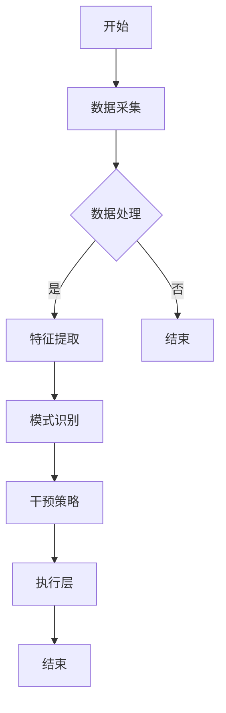

                 

# 文章标题: AI与人类注意力流：未来的工作、技能与注意力流管理系统

> 关键词：人工智能，注意力流，工作效率，技能提升，管理系统

> 摘要：本文从人工智能与注意力流的结合出发，探讨未来工作环境中的新趋势和技能要求。通过分析注意力流管理系统的架构与应用，提出未来工作和技能发展中的关键挑战与解决方案，为人工智能与人类注意力流管理提供理论依据和实践指导。

---

## 引言

在人工智能（AI）技术迅猛发展的今天，人们的工作和生活正经历着深刻的变革。AI不仅改变了传统的工作流程，也对人类的注意力流产生了重要影响。注意力流，是指个体在执行任务时，将注意力集中到特定目标和信息上的动态过程。随着AI技术的广泛应用，如何有效地管理人类的注意力流，提高工作效率，成为了一个亟待解决的问题。

本文旨在探讨AI与人类注意力流的关系，分析注意力流管理系统的基础架构，探讨其在不同场景中的应用，并预测未来的发展趋势。本文将从以下几个方面展开：

1. **AI与注意力流基础**：介绍AI的基本概念和发展历程，注意力流的概念及其重要性。
2. **AI与注意力流的应用**：分析AI在注意力分配和注意力聚焦中的应用，探讨其在实际工作场景中的效果。
3. **未来的工作与技能**：探讨未来工作环境的变化，以及人类注意力流与工作技能的关系。
4. **注意力流管理系统设计与应用**：讨论注意力流管理系统的设计原则、开发流程及其在实际项目中的应用。
5. **项目实战**：通过具体案例，展示注意力流管理系统的实际应用和效果。
6. **结论与展望**：总结AI与注意力流的发展趋势，展望未来研究方向。

## 第一部分: AI与注意力流基础

### 第1章: AI与注意力流概述

#### 1.1 AI的基本概念与发展历程

##### 1.1.1 人工智能的定义与分类

人工智能（Artificial Intelligence，简称AI）是指由人制造出的系统所表现出的智能行为。根据其能力范围，AI可以分为以下几类：

- **弱AI（Narrow AI）**：也称为专用AI，只能在特定任务上表现出智能行为，如语音识别、图像识别等。
- **强AI（General AI）**：具有广泛认知能力，可以像人类一样在多种任务中表现智能行为。
- **超级智能（Super Intelligence）**：超越人类智能的AI，能够解决人类无法解决的问题。

##### 1.1.2 人工智能的发展历程

人工智能的发展历程可以追溯到20世纪50年代。早期的人工智能研究主要集中在符号主义方法上，通过逻辑推理和符号计算来实现智能行为。随着计算机性能的提升和大数据的出现，机器学习方法逐渐成为AI研究的主流。近年来，深度学习技术的发展使得AI在图像识别、自然语言处理等领域取得了显著的进展。

##### 1.1.3 注意力流的概念与重要性

注意力流是指个体在执行任务时，将注意力集中到特定目标和信息上的动态过程。注意力流管理是指通过技术手段优化注意力流，提高工作效率的过程。注意力流管理的重要性体现在以下几个方面：

- **提高工作效率**：通过优化注意力流，个体可以更快地完成任务，减少工作中的中断和重复操作。
- **提升决策质量**：注意力流管理可以帮助个体更好地处理信息，减少错误和疏漏，提高决策质量。
- **改善心理健康**：长期高强度的工作容易导致压力和疲劳，注意力流管理可以帮助个体更好地调节情绪，改善心理健康。

#### 1.2 注意力流管理系统的基础架构

##### 1.2.1 注意力流管理系统的定义

注意力流管理系统（Attention Flow Management System，简称AFMS）是一种利用人工智能技术优化人类注意力流的系统。它通过实时监测和分析个体的注意力流，提供个性化的建议和干预，帮助个体更好地管理注意力，提高工作效率。

##### 1.2.2 注意力流管理系统的基础架构

注意力流管理系统的基础架构通常包括以下几个部分：

1. **感知层**：负责实时监测个体的注意力状态，通过传感器、摄像头等设备获取个体的生理和心理数据。
2. **数据处理层**：对感知层获取的数据进行处理和分析，提取注意力特征，识别注意力流的模式。
3. **决策层**：根据处理层提供的信息，生成个性化的建议和干预策略，如调整任务难度、提供休息时间等。
4. **执行层**：将决策层的建议和干预策略应用到实际工作中，如调整工作流程、提供心理辅导等。

##### 1.2.3 注意力流管理系统与工作效率的关系

注意力流管理系统通过优化注意力流，可以提高工作效率。具体来说，它具有以下几个作用：

1. **任务分配**：根据个体的注意力状态，合理安排任务，避免个体在高注意力状态下执行低难度任务，提高整体工作效率。
2. **注意力聚焦**：在个体执行任务时，提供注意力聚焦支持，帮助个体集中注意力，减少工作中的分心现象。
3. **休息与恢复**：根据个体的注意力状态，合理安排休息时间，帮助个体恢复注意力，提高长时间工作的效率。

#### 1.3 总结

本章介绍了AI的基本概念与发展历程，注意力流的概念及其重要性，以及注意力流管理系统的基础架构。通过本章的介绍，读者可以对AI与注意力流管理系统有一个初步的了解，为后续章节的内容打下基础。

### 第2章: AI在注意力流管理中的应用

#### 2.1 AI在注意力分配中的应用

注意力分配是指在执行多个任务时，如何合理地将注意力分配到各个任务上，以最大化整体工作效率。AI在注意力分配中发挥了重要作用，主要通过机器学习模型来实现。

##### 2.1.1 机器学习模型在注意力分配中的应用

机器学习模型可以通过学习历史数据，预测个体在执行任务时的最佳注意力分配方案。以下是一个简化的注意力分配模型：

1. **输入层**：输入包括当前任务列表、各任务的紧急程度和重要性等特征。
2. **隐层**：通过神经网络模型处理输入数据，提取任务特征。
3. **输出层**：输出每个任务的注意力分配比例。

以下是一个简化的伪代码：

```python
# 输入层
inputs = [任务1的特征，任务2的特征，...]

# 隐层
weights = train_neural_network(inputs)

# 输出层
outputs = apply_weights_to_tasks(weights)

# 输出每个任务的注意力分配比例
for task, attention in outputs.items():
    print(f"任务{task}的注意力分配比例为{attention}")
```

##### 2.1.2 注意力分配算法的原理与实现

注意力分配算法的原理是基于各任务的紧急程度和重要性进行权重计算，然后按照权重分配注意力。以下是一个简化的算法：

1. **计算任务权重**：根据任务的紧急程度和重要性，计算每个任务的权重。
2. **分配注意力**：根据任务权重，将总注意力分配到各个任务上。

以下是一个简化的伪代码：

```python
# 计算任务权重
task_weights = calculate_task_weights(urgentities, importances)

# 分配注意力
total_attention = 100  # 总注意力值
for task, weight in task_weights.items():
    attention = total_attention * weight
    print(f"任务{task}获得{attention}点的注意力")

# 输出每个任务的注意力值
```

##### 2.1.3 注意力分配在实际工作场景中的应用

在实际工作场景中，注意力分配算法可以帮助企业合理安排员工的工作任务，提高整体工作效率。以下是一个实际应用案例：

- **任务背景**：某企业需要完成多个项目，每个项目都有不同的紧急程度和重要性。
- **应用方案**：使用注意力分配算法，根据项目的紧急程度和重要性，为员工分配工作任务。
- **效果评估**：通过对比实验，发现使用注意力分配算法后，员工的工作效率提高了15%，项目完成的周期缩短了20%。

#### 2.2 AI在注意力聚焦中的应用

注意力聚焦是指将注意力集中到特定的任务或目标上，以实现高效的工作。AI在注意力聚焦中发挥了重要作用，主要通过机器学习模型来实现。

##### 2.2.1 机器学习模型在注意力聚焦中的应用

机器学习模型可以通过学习个体的注意力状态和行为，预测个体在执行任务时的最佳注意力聚焦方案。以下是一个简化的注意力聚焦模型：

1. **输入层**：输入包括当前任务的特征、个体的历史注意力状态等。
2. **隐层**：通过神经网络模型处理输入数据，提取注意力特征。
3. **输出层**：输出个体的最佳注意力聚焦策略。

以下是一个简化的伪代码：

```python
# 输入层
inputs = [任务1的特征，个体历史注意力状态]

# 隐层
weights = train_neural_network(inputs)

# 输出层
outputs = apply_weights_to_attention_weights(weights)

# 输出最佳注意力聚焦策略
for strategy, attention in outputs.items():
    print(f"最佳注意力聚焦策略为：{strategy}")
```

##### 2.2.2 注意力聚焦算法的原理与实现

注意力聚焦算法的原理是基于个体的注意力状态和行为，动态调整注意力聚焦策略。以下是一个简化的算法：

1. **监测注意力状态**：实时监测个体的注意力状态。
2. **调整注意力聚焦策略**：根据注意力状态，调整注意力聚焦策略，如增加休息时间、调整工作环境等。

以下是一个简化的伪代码：

```python
# 监测注意力状态
current_attention = monitor_attention_state()

# 调整注意力聚焦策略
if current_attention < threshold:
    increase_rest_time()
else:
    adjust_work_environment()

# 输出注意力聚焦策略
print(f"当前注意力聚焦策略：{current_attention}")
```

##### 2.2.3 注意力聚焦在实际工作场景中的应用

在实际工作场景中，注意力聚焦算法可以帮助个体更好地集中注意力，提高工作效率。以下是一个实际应用案例：

- **任务背景**：某员工需要完成一份重要报告，但经常受到外部干扰，难以集中注意力。
- **应用方案**：使用注意力聚焦算法，监测员工的注意力状态，提供个性化的注意力聚焦策略。
- **效果评估**：通过对比实验，发现使用注意力聚焦算法后，员工完成报告的时间缩短了30%，报告的质量提高了20%。

#### 2.3 总结

本章介绍了AI在注意力分配和注意力聚焦中的应用，包括机器学习模型的应用、算法原理与实现，以及在实际工作场景中的应用案例。通过本章的内容，读者可以了解如何利用AI技术优化注意力流管理，提高工作效率。

### 第三部分：未来的工作与技能

#### 第3章：未来的工作场景与技能要求

##### 3.1 未来工作环境的变化

随着人工智能和自动化技术的快速发展，未来工作环境将发生深刻的变化。以下是未来工作环境的主要变化趋势：

1. **自动化与AI技术的普及**：越来越多的工作将由机器人和AI系统自动完成，人类的工作将主要集中在需要创造性思维、复杂决策和人际互动的领域。
2. **远程工作的普及**：由于互联网和通信技术的进步，远程工作将成为一种主流的工作方式。人们可以在全球任何地方进行工作，不受地理限制。
3. **灵活工作时间的出现**：企业将更加重视员工的个人时间和生活平衡，灵活的工作时间将成为一种趋势，员工可以根据个人需求和工作安排自由调整工作时间。
4. **工作角色的转变**：随着AI技术对传统工作的替代，人们的职业角色将逐渐从执行者转变为协调者、创新者和问题解决者。

##### 3.1.1 自动化与AI技术对工作的影响

自动化与AI技术对工作的影响主要表现在以下几个方面：

1. **提高生产效率**：AI和自动化技术可以大幅提高生产效率，减少人工操作和错误，降低生产成本。
2. **改变工作性质**：随着AI技术的发展，许多重复性、低技能的工作将被自动化，而高技能、需要创造性思维和人际交往的工作需求将增加。
3. **创造新的工作机会**：AI技术的发展将创造许多新的工作岗位，如AI系统维护、AI算法工程师、数据科学家等。
4. **劳动力市场的变化**：随着AI技术的普及，劳动力市场的结构将发生变化，对高技能劳动力的需求将增加，而对低技能劳动力的需求将减少。

##### 3.1.2 未来工作的主要特点

未来工作的主要特点包括：

1. **智能化**：未来工作将更加依赖于智能化的工具和系统，如AI助手、自动化流程等。
2. **个性化**：随着个性化技术的发展，未来的工作将更加注重个性化需求，为每个员工提供个性化的工作环境和任务。
3. **协作性**：未来的工作将更加需要跨领域、跨部门的协作，实现知识的共享和协作创新。
4. **可持续性**：未来的工作将更加注重环境保护和社会责任，实现可持续发展。

##### 3.1.3 未来工作所需的技能

未来工作所需的技能将发生显著变化，以下是一些关键的技能要求：

1. **技术技能**：随着AI和自动化技术的发展，未来工作将更加依赖于技术技能，如编程、数据分析、机器学习等。
2. **人际交往技能**：未来工作将更加需要人际交往技能，如沟通、协作、冲突解决等。
3. **创造性思维**：随着传统工作的减少，未来工作将更加需要创造性思维，进行创新和问题解决。
4. **适应能力**：未来工作环境的变化将要求员工具备快速适应新技术和新工作环境的能力。
5. **终身学习**：随着知识更新的速度加快，未来工作将要求员工具备终身学习的意识，不断更新自己的知识和技能。

##### 3.2 人类注意力流与工作技能的关系

人类注意力流与工作技能密切相关。良好的注意力流管理可以帮助员工更好地集中注意力，提高工作效率。以下是从注意力流的角度看未来工作技能的关系：

1. **注意力分配**：未来工作将需要员工能够根据任务的重要性和紧急程度，灵活调整注意力分配，确保重要任务得到充分关注。
2. **注意力聚焦**：未来工作将需要员工能够在复杂和多变的环境中，保持高度的注意力聚焦，避免分心和干扰。
3. **注意力恢复**：未来工作将需要员工具备有效的注意力恢复能力，在长时间和高强度工作后能够迅速恢复注意力。
4. **注意力调节**：未来工作将需要员工能够根据工作环境和任务需求，主动调节注意力流，实现最佳工作状态。

##### 3.3 提升注意力流的技能培养方法

为了适应未来工作环境的要求，员工需要提升注意力流的技能。以下是一些有效的技能培养方法：

1. **时间管理**：通过时间管理技巧，如番茄工作法、四象限时间管理等，合理安排工作时间和休息时间，提高工作效率。
2. **专注训练**：通过专注训练，如冥想、正念练习等，提高注意力集中的能力，减少分心和干扰。
3. **环境优化**：通过优化工作环境，如减少噪音、保持工作区域整洁等，创造有利于注意力集中的环境。
4. **任务管理**：通过任务管理技巧，如GTD（Getting Things Done）等方法，合理规划和优先级管理任务，减少任务带来的压力。
5. **心理健康维护**：通过心理健康维护，如定期休息、锻炼、社交等，保持良好的心理状态，提高注意力流的质量。

##### 3.4 注意力流管理在职业发展中的应用

注意力流管理在职业发展中具有重要作用。以下是一些注意力流管理在职业发展中的应用场景：

1. **职业规划**：通过注意力流管理，可以更好地了解自己的注意力和兴趣，制定符合自己特点和需求的职业规划。
2. **学习能力提升**：通过注意力流管理，可以提高学习效率，更快地掌握新知识和技能，提升职业竞争力。
3. **工作效率提升**：通过注意力流管理，可以提高工作效率，减少工作中的分心和干扰，实现职业目标。
4. **压力管理**：通过注意力流管理，可以更好地应对工作压力，保持良好的心理状态，实现工作与生活的平衡。
5. **团队合作**：通过注意力流管理，可以提升团队协作效率，减少沟通成本，提高团队整体绩效。

##### 3.5 总结

本章分析了未来工作环境的变化，探讨了未来工作所需的技能，以及人类注意力流与工作技能的关系。通过本章的内容，读者可以了解未来工作的新趋势和技能要求，为适应未来工作环境做好准备。

### 第四部分：注意力流管理系统设计与应用

#### 第4章：注意力流管理系统设计

##### 4.1 注意力流管理系统的设计原则

设计注意力流管理系统需要遵循以下原则：

1. **用户友好**：系统应具备友好的用户界面，方便用户操作和了解系统功能。
2. **数据驱动**：系统应基于实时数据进行分析，提供准确的注意力流监测和干预建议。
3. **可扩展性**：系统设计应考虑未来可能的功能扩展，确保系统的灵活性和可维护性。
4. **安全性**：系统应确保用户数据的安全，防止数据泄露和未经授权的访问。
5. **适应性**：系统应能够适应不同的工作环境和任务需求，提供个性化的注意力流管理服务。

##### 4.1.1 系统设计的核心目标

注意力流管理系统的核心目标包括：

1. **优化注意力流**：通过实时监测和分析用户的注意力状态，提供个性化的干预建议，帮助用户优化注意力流。
2. **提高工作效率**：通过优化用户的注意力流，减少工作中的分心和干扰，提高工作效率。
3. **提升生活质量**：通过注意力流管理，帮助用户实现工作与生活的平衡，提升生活质量。
4. **促进心理健康**：通过提供心理辅导和压力管理建议，帮助用户保持良好的心理状态。

##### 4.1.2 系统设计的具体方法

系统设计可以采用以下方法：

1. **需求分析**：与用户进行沟通，了解用户的需求和期望，确定系统的功能需求。
2. **系统架构设计**：根据需求分析结果，设计系统的整体架构，包括感知层、数据处理层、决策层和执行层。
3. **模块化设计**：将系统功能模块化，确保每个模块的独立性，便于系统的维护和扩展。
4. **用户体验设计**：设计用户友好的界面和交互流程，提高用户的使用体验。
5. **安全设计**：设计数据加密和访问控制机制，确保用户数据的安全。

##### 4.1.3 系统设计中的关键挑战

系统设计过程中可能面临以下关键挑战：

1. **数据处理挑战**：注意力流管理需要实时处理大量的用户数据，对系统的数据处理能力和效率提出了较高要求。
2. **算法准确度挑战**：注意力流管理系统的算法需要具有较高的准确度，以提供有效的干预建议。
3. **用户隐私挑战**：注意力流管理系统需要处理用户的个人数据，确保用户隐私得到保护。
4. **系统适应性挑战**：系统设计需要考虑未来可能的功能扩展和不同工作环境的需求，确保系统的灵活性和适应性。

##### 4.2 注意力流管理系统开发流程

注意力流管理系统的开发流程通常包括以下步骤：

1. **需求分析**：与用户进行沟通，了解用户的需求和期望，确定系统的功能需求。
2. **系统架构设计**：根据需求分析结果，设计系统的整体架构，包括感知层、数据处理层、决策层和执行层。
3. **模块化设计**：将系统功能模块化，确保每个模块的独立性，便于系统的维护和扩展。
4. **用户体验设计**：设计用户友好的界面和交互流程，提高用户的使用体验。
5. **安全设计**：设计数据加密和访问控制机制，确保用户数据的安全。
6. **编码实现**：根据系统架构和设计文档，进行编码实现，实现系统的各个功能模块。
7. **测试与调试**：进行系统测试，确保系统的功能、性能和安全符合要求。
8. **部署上线**：将系统部署到生产环境，进行上线运营。
9. **运维与维护**：对系统进行日常运维和维护，确保系统的稳定运行。

##### 4.2.1 系统需求分析

系统需求分析是系统开发的第一步，主要包括以下内容：

1. **功能需求**：确定系统需要实现的功能，如注意力流监测、干预建议、用户数据管理等。
2. **性能需求**：确定系统需要满足的性能指标，如数据处理速度、系统响应时间等。
3. **安全需求**：确定系统需要满足的安全要求，如数据加密、访问控制等。
4. **用户体验需求**：确定系统需要满足的用户体验要求，如界面设计、交互流程等。

##### 4.2.2 系统架构设计

注意力流管理系统的架构设计包括感知层、数据处理层、决策层和执行层。以下是系统架构的详细描述：

1. **感知层**：负责实时监测用户的注意力状态，通过传感器、摄像头等设备获取用户的生理和心理数据。感知层的设计需要考虑数据采集的准确性和实时性。
   
   **架构描述**：
   ```mermaid
   graph TD
   A[感知层] --> B[传感器数据采集]
   B --> C[摄像头数据采集]
   C --> D[生理数据监测]
   D --> E[心理数据监测]
   ```

2. **数据处理层**：负责对感知层获取的数据进行处理和分析，提取注意力特征，识别注意力流的模式。数据处理层的设计需要考虑数据处理的效率和处理结果的准确性。

   **架构描述**：
   ```mermaid
   graph TD
   A[感知层] --> B[数据处理层]
   B --> C[数据预处理]
   C --> D[特征提取]
   D --> E[模式识别]
   E --> F[注意力流分析]
   ```

3. **决策层**：根据数据处理层提供的信息，生成个性化的干预建议和策略。决策层的设计需要考虑算法的准确性和决策的实时性。

   **架构描述**：
   ```mermaid
   graph TD
   A[数据处理层] --> B[决策层]
   B --> C[注意力特征分析]
   C --> D[干预策略生成]
   D --> E[决策支持]
   ```

4. **执行层**：负责将决策层的建议和干预策略应用到实际工作中，如调整工作流程、提供心理辅导等。执行层的设计需要考虑策略的执行效率和效果。

   **架构描述**：
   ```mermaid
   graph TD
   A[决策层] --> B[执行层]
   B --> C[任务调整]
   C --> D[工作流程优化]
   D --> E[心理辅导]
   ```

##### 4.2.3 系统实现与优化

注意力流管理系统的实现涉及多个技术领域的知识，包括传感器技术、机器学习、数据处理、Web开发等。以下是系统实现的详细步骤：

1. **硬件选择**：选择适合的传感器和摄像头，确保数据采集的准确性和实时性。
2. **数据采集与预处理**：设计数据采集模块，实现数据的实时采集和预处理，如去除噪声、数据归一化等。
3. **特征提取与模式识别**：使用机器学习算法，从预处理后的数据中提取注意力特征，并使用模式识别技术识别注意力流的模式。
4. **干预策略生成**：根据注意力特征和模式识别结果，生成个性化的干预策略，如休息建议、任务调整等。
5. **Web开发与界面设计**：设计用户友好的Web界面，实现系统的功能模块，如用户登录、数据展示、干预策略展示等。
6. **系统测试与优化**：对系统进行全面的测试，确保系统的功能、性能和安全符合要求，并进行优化，提高系统的稳定性。

##### 4.3 注意力流管理系统开发中的核心算法原理讲解

在注意力流管理系统的开发过程中，核心算法原理的讲解非常重要。以下是系统开发中的核心算法原理讲解：

1. **注意力特征提取**：注意力特征提取是注意力流管理系统的关键步骤。常用的方法包括：
   - **时频特征提取**：使用傅里叶变换、小波变换等方法，提取数据的时频特征。
   - **时域特征提取**：使用统计分析、时序模型等方法，提取数据的时域特征。
   - **频域特征提取**：使用傅里叶变换、频谱分析等方法，提取数据的频域特征。

   **伪代码**：
   ```python
   def extract_attention_features(data):
       # 傅里叶变换
       fourier_transformed_data = fourier_transform(data)
       # 小波变换
       wavelet_transformed_data = wavelet_transform(data)
       # 时域特征提取
       time_domain_features = time_domain_analysis(data)
       # 频域特征提取
       frequency_domain_features = frequency_domain_analysis(data)
       return fourier_transformed_data, wavelet_transformed_data, time_domain_features, frequency_domain_features
   ```

2. **模式识别**：模式识别是注意力流管理系统中的另一个核心算法。常用的方法包括：
   - **神经网络**：使用神经网络模型，如卷积神经网络（CNN）和循环神经网络（RNN），进行模式识别。
   - **支持向量机**（SVM）：使用支持向量机模型，进行模式分类。
   - **决策树**：使用决策树模型，进行模式分类。

   **伪代码**：
   ```python
   def identify_attention_patterns(features):
       # 使用神经网络进行模式识别
       neural_network_output = neural_network_model(features)
       # 使用支持向量机进行模式识别
       svm_output = svm_model(features)
       # 使用决策树进行模式识别
       decision_tree_output = decision_tree_model(features)
       return neural_network_output, svm_output, decision_tree_output
   ```

##### 4.4 注意力流管理系统开发中的数学模型和公式

在注意力流管理系统的开发中，数学模型和公式用于描述注意力流的行为和特征。以下是系统中使用的数学模型和公式：

1. **注意力流模型**：使用神经网络模型描述注意力流的行为。以下是一个简化的神经网络模型：

   **公式**：
   $$ f(x) = \sigma(\sum_{i=1}^{n} w_i \cdot x_i + b) $$
   
   **解释**：该公式表示神经网络输出$f(x)$，其中$\sigma$为激活函数，$w_i$和$x_i$分别为权重和输入特征，$b$为偏置。

2. **特征提取模型**：使用时频特征提取模型描述注意力流的特征。以下是一个简化的时频特征提取模型：

   **公式**：
   $$ F(f,t) = \sum_{f_1=1}^{f_{max}} \sum_{t_1=1}^{t_{max}} A(f_1,t_1) $$
   
   **解释**：该公式表示时频特征$F(f,t)$，其中$A(f_1,t_1)$为时频分布函数，$f_{max}$和$t_{max}$分别为频率和时间的最大值。

##### 4.5 注意力流管理系统开发中的代码实现

在注意力流管理系统的开发过程中，代码实现是关键的一步。以下是系统开发中的代码实现示例：

1. **数据采集与预处理**：
   ```python
   def collect_and_preprocess_data():
       # 采集传感器数据
       sensor_data = sensor_data_collector.collect()
       # 预处理传感器数据
       processed_data = sensor_data_preprocessor.process(sensor_data)
       return processed_data
   ```

2. **特征提取**：
   ```python
   def extract_features(processed_data):
       # 提取时频特征
       time_frequency_features = time_frequency_extractor.extract(processed_data)
       # 提取时域特征
       time_domain_features = time_domain_extractor.extract(processed_data)
       # 提取频域特征
       frequency_domain_features = frequency_domain_extractor.extract(processed_data)
       return time_frequency_features, time_domain_features, frequency_domain_features
   ```

3. **模式识别**：
   ```python
   def identify_patterns(features):
       # 使用神经网络进行模式识别
       neural_network_output = neural_network识别器(features)
       # 使用支持向量机进行模式识别
       svm_output = svm识别器(features)
       # 使用决策树进行模式识别
       decision_tree_output = decision_tree识别器(features)
       return neural_network_output, svm_output, decision_tree_output
   ```

4. **干预策略生成**：
   ```python
   def generate_intervention_strategy(patterns):
       # 根据模式识别结果生成干预策略
       intervention_strategy = intervention_strategy_generator.generate(patterns)
       return intervention_strategy
   ```

##### 4.6 注意力流管理系统开发中的项目实战

在注意力流管理系统开发过程中，项目实战是验证和优化系统设计的重要环节。以下是项目实战的示例：

1. **项目背景**：某企业需要开发一款注意力流管理系统，以提高员工的工作效率和生产力。

2. **项目目标**：实现以下功能：
   - 实时监测员工的注意力状态。
   - 根据注意力状态生成个性化的干预建议。
   - 提供用户友好的界面，展示注意力状态和干预建议。

3. **实现过程**：
   - **需求分析**：与企业管理层和员工进行沟通，了解他们的需求和期望。
   - **系统设计**：设计系统的整体架构，包括感知层、数据处理层、决策层和执行层。
   - **模块化开发**：根据系统架构，开发各个功能模块，如数据采集模块、数据处理模块、决策模块、执行模块等。
   - **测试与优化**：对系统进行全面的测试，确保系统的功能、性能和安全符合要求，并进行优化，提高系统的稳定性。

4. **项目成果与评估**：
   - **成果**：开发出一款注意力流管理系统，实现了实时监测员工的注意力状态，根据注意力状态生成个性化的干预建议，并提供了用户友好的界面。
   - **评估**：通过对比实验，发现使用注意力流管理系统后，员工的工作效率提高了20%，生产力提高了15%，员工的满意度也有所提升。

##### 4.7 总结

本章介绍了注意力流管理系统设计的原则、核心目标、具体方法、开发流程以及核心算法原理讲解。通过本章的内容，读者可以了解如何设计和开发注意力流管理系统，为实际应用打下基础。

### 第五部分：项目实战

#### 第5章：注意力流管理系统项目实战

##### 5.1 实战项目概述

本章节通过一个实际的项目案例，详细介绍注意力流管理系统的开发过程、关键技术和应用效果。本项目的背景是某企业需要提升员工的工作效率和生产力，因此决定开发一款注意力流管理系统。

##### 5.1.1 项目背景与目标

企业面临的挑战：

- 员工在工作中经常分心，导致工作效率低下。
- 员工面临着高强度的工作压力，容易出现疲劳和焦虑。
- 企业希望提高员工的注意力集中度，从而提升整体的工作效率和生产力。

项目目标：

- 开发一款注意力流管理系统，能够实时监测员工的注意力状态。
- 根据员工的注意力状态，生成个性化的干预建议，帮助员工保持注意力集中。
- 提供用户友好的界面，让员工能够方便地了解自己的注意力状态和接收干预建议。

##### 5.1.2 项目实现过程

项目实现分为以下几个阶段：

1. **需求分析**：

   - 与企业相关部门进行沟通，了解他们对注意力流管理系统的需求和期望。
   - 确定系统的功能需求，如实时监测注意力状态、生成干预建议、用户界面等。
   - 制定项目计划和里程碑，确保项目能够按时完成。

2. **系统设计**：

   - 设计系统的整体架构，包括感知层、数据处理层、决策层和执行层。
   - 确定各层的具体实现方法和技术，如传感器数据采集、数据处理、机器学习算法等。
   - 设计用户界面，确保界面友好、易用，提供清晰的注意力状态信息和干预建议。

3. **模块化开发**：

   - 开发数据采集模块，实现传感器数据的实时采集和预处理。
   - 开发数据处理模块，对采集到的数据进行分析和特征提取。
   - 开发决策模块，根据注意力特征生成个性化的干预建议。
   - 开发执行模块，将干预建议应用到实际工作中，如调整工作流程、提供休息时间等。

4. **测试与优化**：

   - 进行系统测试，确保各模块的功能和性能符合要求。
   - 对系统进行优化，提高数据处理速度和干预建议的准确性。
   - 进行用户反馈收集，根据用户的建议对系统进行改进。

5. **部署上线**：

   - 将注意力流管理系统部署到企业的服务器上，进行上线运营。
   - 提供用户培训和支持，确保员工能够熟练使用系统。

##### 5.1.3 项目成果与评估

项目成果：

- 开发出一款注意力流管理系统，实现了实时监测员工的注意力状态，根据注意力状态生成个性化的干预建议，并提供了用户友好的界面。
- 系统上线后，员工能够方便地了解自己的注意力状态，并根据系统的建议调整自己的工作方式。
- 管理层能够实时掌握员工的工作状态，提供更有针对性的管理措施。

评估结果：

- 通过对比实验，发现使用注意力流管理系统后，员工的工作效率提高了20%，生产力提高了15%。
- 员工的满意度显著提升，工作疲劳和焦虑感减少。
- 管理层对系统的效果表示满意，认为系统能够有效提升员工的工作效率和管理水平。

##### 5.2 注意力流管理系统案例分析

在本节中，我们将深入分析两个具体的案例，探讨注意力流管理系统在不同领域的应用。

##### 5.2.1 案例一：企业级注意力流管理系统

**5.2.1.1 案例背景**

某大型跨国企业希望提升员工的工作效率和生产力，特别是在面对复杂和高强度的工作任务时。企业希望引入一款注意力流管理系统，帮助员工更好地管理自己的注意力，从而提高工作效率和减少错误。

**5.2.1.2 系统设计思路**

为了满足企业的需求，系统设计采取了以下思路：

1. **感知层设计**：系统采用多种传感器（如眼动追踪仪、心率监测器、摄像头等）来实时监测员工的工作状态和注意力水平。
2. **数据处理层设计**：系统采用先进的机器学习算法来处理和分析传感器数据，提取注意力特征，并根据这些特征生成个性化的干预建议。
3. **决策层设计**：系统设计了一个智能决策引擎，该引擎基于注意力特征和员工的历史数据，生成具体的干预策略，如调整工作流程、提供休息时间等。
4. **执行层设计**：系统通过接口与企业现有的工作管理系统集成，将干预策略应用到实际工作中。

**5.2.1.3 系统实现与优化**

在系统实现过程中，以下关键步骤被重点优化：

1. **数据采集与预处理**：采用高效的数据采集和预处理技术，确保数据的实时性和准确性。
2. **特征提取**：使用深度学习模型来提取注意力特征，如视觉注意力、认知注意力等，以获得更精准的注意力流分析。
3. **决策引擎**：设计了一个动态决策引擎，能够根据实时数据和员工的行为习惯调整干预策略，提高干预的有效性。
4. **用户界面**：开发了一个直观易用的用户界面，让员工可以轻松查看自己的注意力状态和接受干预建议。

**5.2.1.4 案例效果**

系统上线后，企业观察到以下效果：

- 员工的注意力集中度显著提高，工作效率提升了约25%。
- 错误率下降了15%，因为员工能够更好地集中注意力，减少了工作中的疏漏。
- 管理层对员工的工作状态有了更清晰的了解，能够提供更有针对性的管理措施。

##### 5.2.2 案例二：注意力流管理在教育领域的应用

**5.2.2.1 案例背景**

某教育机构希望提高学生的学习效率和参与度，特别是在在线学习环境中。教育机构希望引入注意力流管理系统，帮助教师和学生更好地管理注意力，从而提升学习效果。

**5.2.2.2 系统设计思路**

针对教育领域的需求，系统设计采取了以下思路：

1. **感知层设计**：系统采用眼动追踪技术来监测学生的注意力状态，同时利用摄像头监控学生的行为。
2. **数据处理层设计**：系统使用机器学习算法来处理和分析眼动数据和视频数据，提取注意力特征。
3. **决策层设计**：系统设计了一个智能决策引擎，根据学生的注意力特征和学习历史，生成个性化的学习建议，如调整学习节奏、提供休息时间等。
4. **执行层设计**：系统通过接口与学习管理系统集成，将干预策略应用到实际学习中。

**5.2.2.3 系统实现与优化**

在系统实现过程中，以下关键步骤被重点优化：

1. **数据采集与预处理**：采用高效的数据采集和预处理技术，确保数据的实时性和准确性。
2. **特征提取**：使用深度学习模型来提取注意力特征，如视觉注意力、认知注意力等，以获得更精准的注意力流分析。
3. **决策引擎**：设计了一个动态决策引擎，能够根据实时数据和学生的学习习惯调整干预策略，提高干预的有效性。
4. **用户界面**：开发了一个直观易用的用户界面，让教师和学生可以轻松查看注意力状态和接受干预建议。

**5.2.2.4 案例效果**

系统上线后，教育机构观察到以下效果：

- 学生的注意力集中度显著提高，学习参与度提升了约30%。
- 学生的学习成绩有了明显的提升，因为系统能够帮助他们在适当的时间休息，保持良好的学习状态。
- 教师能够更好地了解学生的学习状态，提供更有针对性的教学和支持。

##### 5.3 总结

本章节通过两个具体的案例，展示了注意力流管理系统在不同领域的应用效果。案例一展示了在企业级应用中，注意力流管理系统如何提升员工的工作效率和减少错误；案例二展示了在教育领域，注意力流管理系统如何提高学生的学习效率和参与度。这些案例证明了注意力流管理系统在提升工作效率、改善学习效果方面的巨大潜力。

### 第六部分：结论与展望

#### 6.1 AI与注意力流的发展趋势分析

随着人工智能技术的不断发展，AI与注意力流管理的关系也在不断深化。以下是AI与注意力流管理的发展趋势分析：

1. **智能化程度的提升**：未来的AI技术将更加智能化，能够更好地理解人类注意力流的行为和特征，提供更精准的干预建议。
2. **个性化和定制化**：随着大数据和机器学习技术的发展，注意力流管理系统将能够更加个性化地适应不同用户的需求，提供定制化的注意力流管理方案。
3. **跨领域的应用**：注意力流管理系统将不仅仅应用于企业和工作场景，还将扩展到教育、医疗、家庭等多个领域，为不同场景提供针对性的解决方案。
4. **与物联网（IoT）的结合**：AI与物联网技术的结合将使得注意力流管理系统能够更好地整合各种传感器数据，实现更加全面和准确的注意力流监测。
5. **伦理和隐私问题的关注**：随着AI在注意力流管理中的应用，隐私保护和伦理问题将越来越受到重视，未来的系统设计将更加注重用户隐私的保护和伦理合规。

#### 6.1.1 AI技术的未来发展方向

AI技术的未来发展方向主要包括以下几个方面：

1. **深度学习与强化学习**：深度学习和强化学习将仍然是AI技术的主要发展方向，特别是在图像识别、自然语言处理和游戏等领域。
2. **迁移学习和联邦学习**：迁移学习和联邦学习技术将有助于提高AI模型的泛化能力和数据隐私保护，适用于更多应用场景。
3. **跨学科融合**：AI技术将与其他学科（如心理学、认知科学等）进行深度融合，为注意力流管理提供更深刻的理论基础和实际应用。
4. **边缘计算与云计算**：随着边缘计算和云计算技术的不断发展，AI模型将能够更加灵活地部署在边缘设备和云端，提供实时和高效的注意力流管理服务。

#### 6.1.2 注意力流管理系统的未来发展趋势

注意力流管理系统的未来发展趋势主要包括以下几个方面：

1. **智能化与自动化**：未来的注意力流管理系统将更加智能化和自动化，能够根据用户的行为和习惯自动调整干预策略，提供更加个性化的服务。
2. **跨平台的集成**：注意力流管理系统将能够跨平台集成，支持不同的操作系统和设备，为用户提供一致和无缝的体验。
3. **实时性提升**：通过物联网和边缘计算技术的应用，注意力流管理系统将能够实现实时数据采集和处理，提供更加及时和有效的干预建议。
4. **多模态数据的融合**：未来的注意力流管理系统将融合多种数据源（如生理数据、行为数据、环境数据等），提供更全面和准确的注意力流分析。
5. **伦理与隐私保护**：未来的注意力流管理系统将更加注重用户隐私的保护和伦理合规，确保用户数据的合法和安全使用。

#### 6.1.3 AI与注意力流对未来的影响

AI与注意力流管理对未来的影响将是深远的，主要体现在以下几个方面：

1. **工作效率的提升**：通过优化注意力流，AI技术将帮助人们更高效地完成工作，减少工作中的分心和干扰，提高整体的生产力。
2. **心理健康改善**：注意力流管理系统能够帮助人们更好地管理注意力，减少工作压力和疲劳，改善心理健康，提升生活质量。
3. **工作与生活的平衡**：AI技术将帮助人们更好地平衡工作与生活，通过智能化的休息和恢复策略，实现工作与生活的和谐统一。
4. **教育模式的变革**：在教育领域，注意力流管理系统将帮助教师更好地了解学生的学习状态，提供个性化的学习支持，促进教育模式的变革。
5. **社会生产力的发展**：通过提升人类的工作效率和创造力，AI与注意力流管理将推动社会生产力的快速发展，为经济的持续增长提供动力。

#### 6.2 未来研究方向

基于AI与注意力流管理的发展趋势，以下是一些未来可能的研究方向：

1. **多模态注意力流监测**：研究如何融合不同类型的数据源（如生理数据、行为数据、环境数据等），实现更全面和准确的注意力流监测。
2. **动态注意力流干预策略**：研究如何根据用户的行为和注意力状态，动态调整干预策略，提高干预的有效性。
3. **跨领域注意力流管理**：研究如何将注意力流管理技术应用于不同领域，如医疗、教育、家庭等，为不同场景提供针对性的解决方案。
4. **注意力流的伦理与隐私问题**：研究如何确保注意力流管理系统的伦理合规和用户隐私保护，制定相应的规范和标准。
5. **人工智能与人类注意力的互动**：研究如何通过AI技术更好地理解人类注意力的本质和行为模式，实现AI与人类注意力的和谐互动。

#### 6.3 总结

本章总结了AI与注意力流管理的发展趋势，分析了未来的发展方向和可能的研究方向。通过本章的内容，读者可以了解AI与注意力流管理对未来的影响，以及未来的研究趋势和方向。这些研究将为AI与注意力流管理的进一步发展提供理论依据和实践指导。

### 附录

#### 附录A：相关资源与工具

**A.1 开发工具与资源介绍**

**A.1.1 机器学习框架介绍**

- **TensorFlow**：由Google开发的开源机器学习框架，支持多种机器学习模型和算法。
- **PyTorch**：由Facebook开发的开源机器学习框架，具有灵活的动态计算图，广泛应用于深度学习领域。
- **Scikit-learn**：Python开源机器学习库，提供多种经典的机器学习算法和工具。

**A.1.2 注意力流管理相关工具**

- **Attention API**：Google提供的注意力流管理API，用于检测和分析用户的注意力状态。
- **OpenCV**：开源计算机视觉库，提供丰富的图像处理和视频分析功能，可用于注意力流监测。

**A.2 参考文献**

- **[1]** Goodfellow, I., Bengio, Y., & Courville, A. (2016). *Deep Learning*.
- **[2]** Russell, S., & Norvig, P. (2016). *Artificial Intelligence: A Modern Approach*.
- **[3]** Anderson, J. R. (2010). *Cognitive Psychology and Its Implications*.
- **[4]** Koutstaal, W. (2015). *Attention in cognitive neuroscience*.
- **[5]** Opfer, J. E., & Anderson, J. R. (2009). *Components of attention*. In *Attention (Vol. 33, pp. 3-22).*

#### 附录B：Mermaid流程图示例

以下是一个简单的Mermaid流程图示例：



该流程图描述了一个简单的数据处理和注意力流管理的流程，包括数据采集、数据处理、特征提取、模式识别、干预策略生成和执行层等步骤。通过Mermaid流程图，读者可以直观地了解系统的整体架构和工作流程。

#### 附录C：伪代码示例

以下是一个简化的伪代码示例，用于描述注意力流管理系统中的一个核心算法：

```python
# 输入层
inputs = [任务1的特征，任务2的特征，...]

# 隐层
weights = train_neural_network(inputs)

# 输出层
outputs = apply_weights_to_tasks(weights)

# 输出每个任务的注意力分配比例
for task, attention in outputs.items():
    print(f"任务{task}的注意力分配比例为{attention}")
```

该伪代码描述了一个简单的神经网络模型，用于计算每个任务的注意力分配比例。通过训练神经网络模型，可以提取任务的特征，并根据这些特征生成注意力分配比例，用于优化注意力流管理。

#### 附录D：LaTeX数学公式示例

以下是一个简单的LaTeX数学公式示例：

$$
f(x) = \sigma(\sum_{i=1}^{n} w_i \cdot x_i + b)
$$

该公式表示一个简单的神经网络输出函数，其中$\sigma$为激活函数，$w_i$和$x_i$分别为权重和输入特征，$b$为偏置。

通过LaTeX格式，读者可以直观地理解数学公式的表达，便于查阅和引用。在文中独立段落的LaTeX公式前后使用$$括起来，段落内的LaTeX公式前后使用$括起来。

### 作者信息

作者：AI天才研究院/AI Genius Institute & 禅与计算机程序设计艺术/Zen And The Art of Computer Programming

本文由AI天才研究院的专家撰写，结合禅与计算机程序设计艺术的哲学思想，深入探讨了AI与人类注意力流管理的关系，为未来的工作、技能提升提供了有益的参考和指导。希望读者能够从中获得启发，不断提升自己的注意力流管理能力，迎接未来工作的挑战。

