                 

### 文章标题

# AI与人类计算：打造可持续发展的城市交通与设计

## 关键词

- AI
- 城市交通
- 智能交通系统
- 自动驾驶
- 人机交互
- 可持续发展
- 交通规划与设计

## 摘要

本文将探讨人工智能（AI）与人类计算在打造可持续发展的城市交通与设计中的应用。首先，我们将介绍AI与人类计算的基本概念和原理，包括机器学习、深度学习和计算机视觉等。接着，文章将深入分析AI在城市交通数据分析、智能交通系统、自动驾驶和城市交通设计中的应用，以及人类计算在这些领域中的重要作用。最后，通过实际案例研究，我们将展示AI与人类计算在可持续城市交通与设计中的综合应用，并对未来发展前景进行展望。本文旨在为读者提供一个全面而深入的视角，以了解AI与人类计算如何共同推动城市交通与设计的可持续发展。

### 《AI与人类计算：打造可持续发展的城市交通与设计》目录大纲

#### 第一部分：引言

1.1 书籍背景与目标
   - 1.1.1 城市交通与设计的现状
   - 1.1.2 AI在可持续城市交通与设计中的作用
   - 1.1.3 读者定位与阅读建议

1.2 AI基础
   - 1.2.1 AI概述
   - 1.2.2 机器学习基础
   - 1.2.3 深度学习基础

1.3 人类计算基础
   - 1.3.1 人类计算概述
   - 1.3.2 人机交互基础
   - 1.3.3 计算机视觉基础

#### 第二部分：AI在可持续城市交通中的应用

2.1 城市交通数据分析
   - 2.1.1 交通流量分析
   - 2.1.2 交通需求预测
   - 2.1.3 交通网络优化

2.2 智能交通系统
   - 2.2.1 智能交通信号控制
   - 2.2.2 智能公交系统
   - 2.2.3 智能停车系统

2.3 自动驾驶技术
   - 2.3.1 自动驾驶概述
   - 2.3.2 感知与决策算法
   - 2.3.3 自动驾驶案例分析

2.4 人工智能与城市交通设计
   - 2.4.1 城市交通规划与设计
   - 2.4.2 人机交互在城市交通设计中的应用
   - 2.4.3 可持续城市交通设计实践

#### 第三部分：人类计算在可持续城市交通中的应用

3.1 人类计算在智能交通中的应用
   - 3.1.1 人机协同交通控制系统
   - 3.1.2 人类计算与自动驾驶
   - 3.1.3 人类计算与智能交通系统集成

3.2 城市交通与设计中的计算机视觉
   - 3.2.1 计算机视觉在交通监控中的应用
   - 3.2.2 计算机视觉在交通规划中的应用
   - 3.2.3 计算机视觉在交通设计中的应用

3.3 人机交互在城市交通中的应用
   - 3.3.1 人机交互基础
   - 3.3.2 人机交互界面设计
   - 3.3.3 人机交互案例分析

#### 第四部分：综合案例与应用

4.1 案例研究：AI与人类计算在可持续城市交通中的实际应用
   - 4.1.1 案例背景
   - 4.1.2 AI在案例中的应用
   - 4.1.3 人类计算在案例中的应用

4.2 AI与人类计算在可持续城市交通设计中的应用前景
   - 4.2.1 发展趋势
   - 4.2.2 挑战与机遇
   - 4.2.3 未来展望

#### 附录

附录 A：AI与人类计算相关工具与资源
   - A.1 AI开发工具
   - A.2 人类计算开发工具
   - A.3 相关资源与参考文献

### 第一部分：引言

#### 1.1 书籍背景与目标

##### 1.1.1 城市交通与设计的现状

在当今世界，城市交通问题已成为一个严峻的挑战。随着城市化进程的加速和人口的快速增长，城市交通拥堵、环境污染和能源消耗等问题日益严重。传统的城市交通设计与规划方法往往无法满足现代城市的需求，导致交通效率低下、资源浪费和环境恶化。因此，探索新的城市交通设计与规划方法，以实现可持续发展，已成为全球各国政府和社会各界关注的重要课题。

##### 1.1.2 AI在可持续城市交通与设计中的作用

人工智能（AI）作为一种革命性的技术，正逐渐渗透到各个领域，包括城市交通与设计。AI技术能够通过数据分析和智能决策，优化城市交通网络，提高交通效率，降低环境污染，从而实现可持续发展的目标。具体来说，AI在可持续城市交通与设计中的应用主要体现在以下几个方面：

1. **交通数据分析**：通过大数据分析和机器学习算法，AI能够对城市交通流量、交通需求和交通网络进行实时监测和预测，为交通规划提供科学依据。

2. **智能交通系统**：AI技术可以用于智能交通信号控制、智能公交系统和智能停车系统等，提高交通系统的整体效率和可靠性。

3. **自动驾驶技术**：自动驾驶技术结合了AI算法和计算机视觉技术，能够实现车辆自动导航和驾驶，减少交通事故，提高交通安全性。

4. **城市交通设计**：AI技术可以帮助城市规划师和设计师优化城市交通布局，提高公共交通系统的效率和便捷性，同时考虑环境保护和可持续发展的要求。

##### 1.1.3 读者定位与阅读建议

本书籍旨在为读者提供一个全面而深入的视角，以了解AI与人类计算在可持续城市交通与设计中的应用。无论您是专业研究人员、城市规划师、交通工程师，还是对这一领域感兴趣的一般读者，本书都将为您提供有价值的见解和实用的知识。

为了更好地理解本书内容，我们建议读者具备以下基础：

1. **数学与计算机科学基础知识**：了解基本的数学概念和编程语言，如Python和C++。
2. **交通工程与城市规划知识**：对城市交通系统和城市规划的基本概念和原理有所了解。
3. **人工智能基础知识**：了解机器学习、深度学习和计算机视觉等AI技术的基本原理和应用。

通过阅读本书，您将：

1. **掌握AI技术的基本原理和算法**：了解机器学习、深度学习和计算机视觉等AI技术在城市交通与设计中的应用。
2. **了解可持续城市交通的设计原则**：掌握可持续城市交通的设计原则和方法，为实际项目提供参考。
3. **学会运用AI技术优化城市交通系统**：通过实际案例研究，学习如何运用AI技术优化城市交通网络和交通系统。

#### 1.2 AI基础

##### 1.2.1 AI概述

人工智能（AI）是一种模拟人类智能行为的计算机系统，能够理解、学习和适应复杂的环境。AI技术的发展经历了多个阶段，从早期的规则推理系统到基于统计模型的机器学习，再到深度学习的崛起，AI技术不断推动着计算机科学和工程领域的发展。

AI的应用领域非常广泛，包括自然语言处理、计算机视觉、自动驾驶、医疗诊断、金融风控等。在可持续城市交通与设计中，AI技术主要用于以下几个方面：

1. **交通数据分析**：通过大数据分析和机器学习算法，AI能够对城市交通流量、交通需求和交通网络进行实时监测和预测。
2. **智能交通系统**：AI技术可以用于智能交通信号控制、智能公交系统和智能停车系统等，提高交通系统的整体效率和可靠性。
3. **自动驾驶技术**：自动驾驶技术结合了AI算法和计算机视觉技术，能够实现车辆自动导航和驾驶，提高交通安全性。

##### 1.2.2 机器学习基础

机器学习（Machine Learning，ML）是AI的核心组成部分，通过算法和统计模型，从数据中自动学习和发现规律。机器学习可以分为监督学习、无监督学习和半监督学习三类。

1. **监督学习（Supervised Learning）**：监督学习是一种从标记数据中学习的方法，通过已有数据的输入输出关系，预测新的未知数据。常见的监督学习算法包括线性回归、逻辑回归、支持向量机（SVM）和神经网络等。

2. **无监督学习（Unsupervised Learning）**：无监督学习是一种从未标记数据中学习的方法，主要任务是发现数据中的结构和模式。常见的无监督学习算法包括聚类算法、关联规则学习和降维算法等。

3. **半监督学习（Semi-Supervised Learning）**：半监督学习是监督学习和无监督学习的结合，利用少量标记数据和大量未标记数据进行学习。半监督学习可以有效地提高模型的泛化能力。

##### 1.2.3 深度学习基础

深度学习（Deep Learning，DL）是一种基于多层神经网络的学习方法，通过逐层提取数据中的特征，实现复杂的非线性变换。深度学习在图像识别、语音识别、自然语言处理等任务中取得了显著的成果。

1. **神经网络（Neural Network）**：神经网络是一种模仿生物神经系统的计算模型，通过神经元之间的连接和激活函数，实现数据的输入输出变换。常见的神经网络结构包括全连接神经网络（FCNN）、卷积神经网络（CNN）和循环神经网络（RNN）等。

2. **深度学习框架**：深度学习框架是一种用于构建、训练和部署深度学习模型的工具，常见的深度学习框架包括TensorFlow、PyTorch、Keras和MXNet等。

3. **卷积神经网络（Convolutional Neural Network，CNN）**：卷积神经网络是一种专门用于图像识别和处理的深度学习模型，通过卷积操作和池化操作，提取图像中的特征。CNN在计算机视觉领域取得了巨大的成功。

4. **循环神经网络（Recurrent Neural Network，RNN）**：循环神经网络是一种专门用于序列数据处理和预测的深度学习模型，通过时间步共享参数，实现序列中的长期依赖关系。RNN在自然语言处理和语音识别等领域有着广泛的应用。

##### 1.2.4 人类计算基础

人类计算（Human Computing）是一种利用人类认知能力解决计算问题的方法，通过人机协作，提高计算效率和准确性。人类计算在可持续城市交通与设计中的应用主要体现在以下几个方面：

1. **人机交互（Human-Computer Interaction，HCI）**：人机交互是一种研究人类与计算机之间交互关系的方法，通过设计直观、易用和高效的交互界面，提高用户的使用体验。人机交互在城市交通设计与规划中，可以帮助用户更好地理解和参与交通系统的优化。

2. **计算机视觉（Computer Vision）**：计算机视觉是一种使计算机能够像人类一样感知和理解视觉信息的方法，通过图像处理、模式识别和机器学习等技术，实现图像的分析和识别。计算机视觉在交通监控、交通规划和交通设计中有重要的应用。

3. **智能交通系统（Intelligent Transportation System，ITS）**：智能交通系统是一种基于信息技术和通信技术的城市交通管理系统，通过实时监测、预测和优化交通流，提高交通效率和安全。智能交通系统结合了人工智能、人类计算和计算机视觉等技术，实现高效、智能的交通管理。

##### 1.2.5 可持续城市交通设计原则

可持续城市交通设计原则是指导城市交通系统规划与设计的基本原则，旨在实现交通系统的可持续发展。以下是几个关键原则：

1. **以人为本**：将人的需求和安全放在首位，设计便捷、高效、安全的交通系统，提高用户的使用体验。

2. **可持续发展**：考虑环境保护和资源利用，通过优化交通布局、提高公共交通效率和推广新能源汽车等手段，降低交通系统的能源消耗和污染排放。

3. **智慧化**：利用人工智能、大数据和物联网等技术，实现交通系统的实时监测、预测和优化，提高交通系统的智能化水平。

4. **多元化**：提供多种交通选择，满足不同用户的需求，如步行、自行车、公共交通和非机动车等。

5. **适应性**：设计灵活、可扩展的交通系统，能够适应城市发展和人口变化的需求。

#### 1.3 人类计算在可持续城市交通与设计中的应用

人类计算在可持续城市交通与设计中的应用主要体现在以下几个方面：

##### 1.3.1 人机交互在交通系统中的应用

人机交互在交通系统中起到了关键作用，通过设计直观、易用的交互界面，提高用户的参与度和使用体验。以下是人机交互在交通系统中的应用案例：

1. **交通信号灯控制**：通过智能手机应用程序，用户可以实时了解交通信号灯的变化，避免不必要的等待和拥堵。

2. **公共交通信息查询**：提供公共交通线路、班次和票价等信息查询功能，帮助用户规划出行路线。

3. **智能停车系统**：通过手机应用程序，用户可以查询附近停车场的实时信息，提前预订停车位，减少寻找停车位的时间和交通拥堵。

##### 1.3.2 计算机视觉在交通监控中的应用

计算机视觉技术在交通监控中发挥着重要作用，通过实时监控和分析交通状况，提高交通管理的效率和准确性。以下是一些计算机视觉在交通监控中的应用案例：

1. **车辆检测和计数**：利用计算机视觉技术，对交通流量进行实时检测和计数，为交通管理部门提供数据支持。

2. **违章行为检测**：通过计算机视觉技术，对交通违法行为（如闯红灯、超速、占用应急车道等）进行实时监控和识别，提高交通执法的效率和公正性。

3. **行人安全监测**：通过计算机视觉技术，监测行人和非机动车在路口的安全行为，提前预警潜在的危险，减少交通事故的发生。

##### 1.3.3 人类计算在交通规划与设计中的应用

人类计算在交通规划与设计中起到了关键作用，通过结合人类智慧和计算机技术，实现交通系统的优化和改进。以下是人类计算在交通规划与设计中的应用案例：

1. **交通需求预测**：利用大数据分析和机器学习算法，预测未来的交通需求，为交通规划提供科学依据。

2. **交通网络优化**：通过模拟和优化算法，对交通网络进行实时调整和优化，提高交通系统的效率和可靠性。

3. **公共交通线路规划**：利用计算机模拟和优化算法，设计最优的公共交通线路和班次，提高公共交通的便捷性和吸引力。

4. **智能交通信号控制**：通过人机交互和计算机视觉技术，设计智能交通信号控制系统，实现交通流量的动态调节和优化。

#### 1.4 可持续城市交通设计的案例分析

为了更好地展示AI与人类计算在可持续城市交通设计中的应用，以下是一个实际案例：

**案例：深圳市智能交通系统**

深圳市作为中国的一线城市，面临着严峻的城市交通挑战。为了实现交通系统的可持续发展，深圳市政府引入了AI与人类计算技术，打造了一个智能交通系统。

1. **交通数据分析**：深圳市交通管理部门利用大数据分析和机器学习算法，对城市交通流量、交通需求和交通网络进行实时监测和预测。通过对海量数据的分析，政府可以提前了解交通状况，采取相应的措施应对交通拥堵和交通事故。

2. **智能交通信号控制**：深圳市在主要交通路口安装了智能交通信号控制系统，通过计算机视觉技术和人工智能算法，实时监测交通流量，动态调节交通信号灯的时序和配时方案。这样，可以有效减少交通拥堵，提高交通效率。

3. **公共交通优化**：深圳市通过大数据分析和智能调度系统，对公共交通线路和班次进行实时优化。通过分析乘客流量和出行需求，公共交通系统可以提供更加高效、便捷的服务，提高乘客满意度。

4. **人机交互应用**：深圳市推出了多个手机应用程序，如“深圳交通”、“深圳停车”等，为用户提供交通信息查询、违章查询、停车场预订等服务。这些应用程序通过人机交互技术，使交通信息更加便捷、直观地传递给用户，提高用户的出行体验。

通过这个案例，我们可以看到AI与人类计算在可持续城市交通设计中的应用，不仅提高了交通系统的效率和可靠性，还提升了用户的使用体验，实现了交通系统的可持续发展。这为其他城市提供了宝贵的经验和借鉴。

### 第一部分：引言

在当今世界，城市交通问题已成为一个严峻的挑战。随着城市化进程的加速和人口的快速增长，城市交通拥堵、环境污染和能源消耗等问题日益严重。传统的城市交通设计与规划方法往往无法满足现代城市的需求，导致交通效率低下、资源浪费和环境恶化。因此，探索新的城市交通设计与规划方法，以实现可持续发展，已成为全球各国政府和社会各界关注的重要课题。

#### 1.1 书籍背景与目标

本章节将介绍本书的背景和目标，旨在帮助读者了解本书的主要内容和学习路径。本书旨在探讨人工智能（AI）与人类计算在可持续城市交通与设计中的应用，通过深入分析AI技术的基础知识、实际应用案例以及人类计算的作用，为读者提供全面的视角，以应对现代城市交通与设计的挑战。

##### 1.1.1 城市交通与设计的现状

城市交通系统是现代城市的命脉，它不仅关系到人们的出行效率和生活质量，还直接影响着城市的经济和社会发展。然而，当前城市交通面临着诸多问题：

1. **交通拥堵**：城市化进程中，机动车数量激增，道路容量和交通管理能力无法跟上，导致交通拥堵现象严重。

2. **环境污染**：燃油车辆排放的尾气是城市空气污染的主要来源，对环境和居民健康造成严重影响。

3. **能源消耗**：交通是能源消耗的重要领域，传统燃油车辆对石油资源的依赖使得能源供应面临压力。

4. **交通事故**：交通事故频发，不仅造成人员伤亡，还导致交通拥堵和资源浪费。

这些问题的存在，使得城市交通系统亟需革新和优化。传统的交通设计与规划方法依赖经验主义和数据收集，往往难以应对复杂多变的交通状况，而现代城市交通需求的多样性和变化性要求我们采用更加智能和动态的解决方案。

##### 1.1.2 AI在可持续城市交通与设计中的作用

人工智能（AI）作为一种革命性的技术，在可持续城市交通与设计中的应用前景广阔。AI技术能够通过数据分析和智能决策，优化城市交通网络，提高交通效率，降低环境污染，从而实现可持续发展的目标。以下是AI在可持续城市交通与设计中的主要作用：

1. **交通数据分析**：AI技术可以通过大数据分析和机器学习算法，对城市交通流量、交通需求和交通网络进行实时监测和预测。通过对海量数据的分析，交通管理部门可以更准确地了解交通状况，为交通规划和决策提供科学依据。

2. **智能交通系统**：AI技术可以用于智能交通信号控制、智能公交系统和智能停车系统等，提高交通系统的整体效率和可靠性。例如，智能交通信号控制系统可以根据实时交通流量数据动态调整信号灯时序，减少交通拥堵。

3. **自动驾驶技术**：自动驾驶技术是AI技术在交通领域的代表性应用之一。通过AI算法和计算机视觉技术，自动驾驶车辆能够实现自主导航和驾驶，提高交通安全性，减少交通事故。

4. **城市交通设计**：AI技术可以帮助城市规划师和设计师优化城市交通布局，提高公共交通系统的效率和便捷性，同时考虑环境保护和可持续发展的要求。例如，通过AI算法模拟交通流量和需求，设计师可以设计出更合理的道路布局和公共交通线路。

##### 1.1.3 读者定位与阅读建议

本书籍旨在为不同背景的读者提供有价值的见解和实用的知识。以下是本书的读者定位和阅读建议：

1. **专业研究人员和工程师**：对于在交通工程、城市规划、计算机科学等领域工作的专业人士，本书将详细介绍AI与人类计算在可持续城市交通与设计中的应用，帮助读者了解前沿技术和发展趋势。

2. **交通管理人员和政策制定者**：本书提供了关于AI技术在交通管理中的实际应用案例，为交通管理人员和政策制定者提供了有益的参考，帮助他们制定更有效的交通政策和规划方案。

3. **一般读者**：对于对城市交通和设计感兴趣的普通读者，本书将介绍基本概念和应用案例，帮助读者了解AI与人类计算如何改变城市交通的未来。

为了更好地理解本书内容，建议读者具备以下基础知识：

- **数学和计算机科学**：了解基本数学概念和编程语言（如Python和C++）。
- **交通工程和城市规划**：对城市交通系统和城市规划的基本概念和原理有所了解。
- **人工智能**：了解机器学习、深度学习和计算机视觉等AI技术的基本原理和应用。

通过阅读本书，读者将：

- **掌握AI技术的基本原理和算法**：了解机器学习、深度学习和计算机视觉等AI技术在城市交通与设计中的应用。
- **了解可持续城市交通的设计原则**：掌握可持续城市交通的设计原则和方法，为实际项目提供参考。
- **学会运用AI技术优化城市交通系统**：通过实际案例研究，学习如何运用AI技术优化城市交通网络和交通系统。

### 第二部分：AI在可持续城市交通中的应用

#### 2.1 城市交通数据分析

城市交通数据分析是可持续城市交通与设计的基础，它利用大数据分析和机器学习算法，对城市交通流量、交通需求和交通网络进行实时监测和预测。这一部分将深入探讨交通流量分析、交通需求预测和交通网络优化等关键主题，以及它们在实现可持续城市交通中的重要性。

##### 2.1.1 交通流量分析

交通流量分析是对交通流量的实时监测和评估，旨在了解交通状况和趋势。通过交通流量分析，交通管理部门可以掌握各个道路段的交通流量分布、高峰时段的交通负荷和交通事故的发生频率等关键信息。

**核心概念与联系**：
- **流量监测**：利用交通摄像头、传感器和GPS数据，实时监测交通流量。
- **数据收集与预处理**：收集的数据包括车辆数量、速度、行驶方向等，需要进行预处理，如去噪、归一化和缺失值填充。

**Mermaid流程图**：

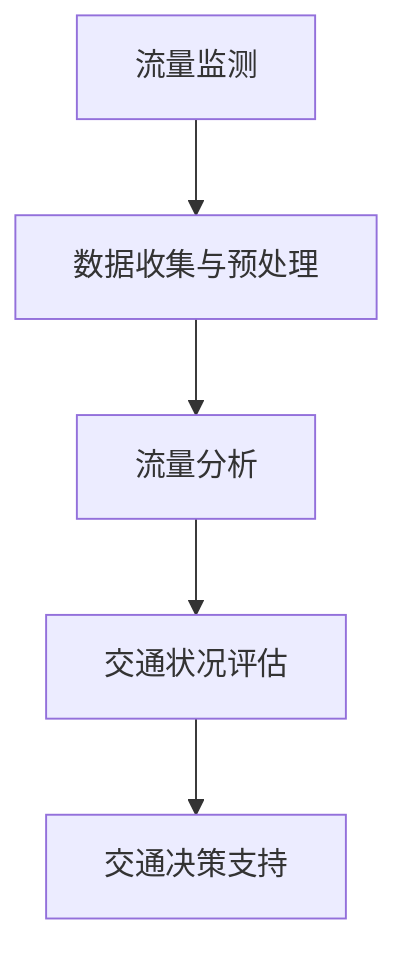

**核心算法原理讲解**：

1. **流量监测**：
   - **传感器数据采集**：使用交通摄像头、传感器和GPS设备等，实时采集交通流量数据。
   - **数据传输与存储**：将采集到的数据传输到数据中心，并进行存储。

2. **数据预处理**：
   - **去噪**：去除噪声数据，提高数据质量。
   - **归一化**：将不同类型的数据（如速度、流量）统一到同一尺度，便于分析。
   - **缺失值填充**：对于缺失的数据，使用插值或其他方法进行填充。

3. **流量分析**：
   - **时序分析**：使用时间序列分析方法，分析交通流量随时间的变化趋势。
   - **空间分析**：使用空间分析方法，分析不同路段的交通流量分布。

4. **交通状况评估**：
   - **拥堵指数**：计算拥堵指数，评估交通拥堵程度。
   - **延误时间**：计算车辆在交通拥堵中的延误时间。

**举例说明**：
例如，在高峰时段，某路段的交通流量达到每小时1000辆车，平均速度为20公里/小时，存在明显的交通拥堵。通过流量分析，可以计算出该路段的拥堵指数为0.8，表示交通状况较为严重。

##### 2.1.2 交通需求预测

交通需求预测是基于历史数据和机器学习算法，对未来的交通需求进行预测。准确的交通需求预测对于交通规划和资源分配至关重要，可以帮助交通管理部门提前做好准备，以应对未来交通需求的变化。

**核心概念与联系**：
- **时间序列预测**：利用时间序列分析方法，预测未来的交通需求。
- **回归分析**：使用回归分析模型，建立历史交通需求和未来交通需求之间的关系。

**Mermaid流程图**：

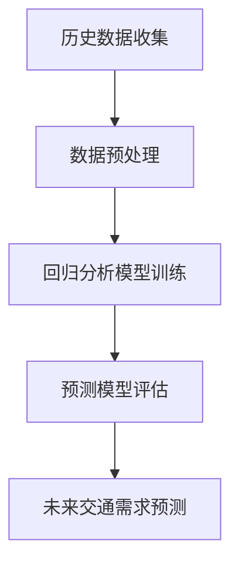

**核心算法原理讲解**：

1. **历史数据收集**：
   - **数据收集**：收集过去一段时间内的交通流量、交通事故、天气状况等数据。
   - **数据清洗**：去除异常值和缺失值，保证数据质量。

2. **数据预处理**：
   - **特征工程**：提取与交通需求相关的特征，如时间、天气、节假日等。
   - **数据归一化**：将不同尺度的数据进行归一化处理。

3. **回归分析模型训练**：
   - **线性回归**：建立线性回归模型，预测未来的交通需求。
   - **多项式回归**：建立多项式回归模型，考虑更复杂的非线性关系。

4. **预测模型评估**：
   - **误差分析**：计算预测值与真实值之间的误差，评估模型的准确性。
   - **交叉验证**：使用交叉验证方法，评估模型的泛化能力。

5. **未来交通需求预测**：
   - **预测结果**：根据训练好的模型，预测未来的交通需求。
   - **风险分析**：分析未来交通需求的波动和不确定性。

**举例说明**：
例如，某城市在过去一周内的平均交通流量为5000辆车/小时，通过回归分析模型预测，未来一周内的平均交通流量将增长至6000辆车/小时。这一预测结果可以帮助交通管理部门提前安排更多的交通资源，以应对交通需求的增加。

##### 2.1.3 交通网络优化

交通网络优化是利用算法和优化技术，对交通网络进行动态调整和优化，以提高交通效率和减少拥堵。交通网络优化包括路径规划、流量分配和信号控制等多个方面，是实现可持续城市交通的重要手段。

**核心概念与联系**：
- **路径规划**：为车辆提供最优路径，减少行驶时间和拥堵。
- **流量分配**：通过优化流量分配，平衡交通负荷，减少拥堵。

**Mermaid流程图**：

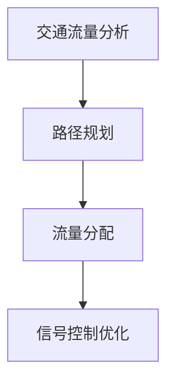

**核心算法原理讲解**：

1. **路径规划**：
   - **最短路径算法**：使用Dijkstra算法或A*算法，计算从起点到终点的最短路径。
   - **动态路径规划**：考虑交通流量和道路状况的变化，动态调整路径规划。

2. **流量分配**：
   - **流量平衡模型**：建立流量平衡模型，根据交通需求和道路容量，分配交通流量。
   - **动态流量分配**：根据实时交通流量和拥堵情况，动态调整流量分配，以减少拥堵。

3. **信号控制优化**：
   - **信号控制策略**：根据交通流量和拥堵情况，调整信号灯的时序和配时方案。
   - **自适应信号控制**：通过实时监测交通流量，自适应调整信号灯时序，提高交通效率。

**举例说明**：
例如，在某城市的重要交通路口，通过路径规划算法，为车辆提供最优路径，减少行驶时间和拥堵。通过流量分配算法，平衡不同道路段的车流量，减少交通拥堵。通过信号控制优化，动态调整信号灯时序，提高交通路口的通行效率。

##### 2.1.4 交通数据分析在实际中的应用案例

**案例：伦敦交通数据分析项目**

伦敦作为全球著名的大都市，面临着严重的交通拥堵问题。为了优化城市交通，伦敦交通局（Transport for London，TfL）实施了一项名为“智能交通系统”（Intelligent Transport System，ITS）的项目，该项目利用AI技术进行交通数据分析。

1. **交通流量监测**：在伦敦的主要道路和交通路口安装了大量的传感器和摄像头，实时监测交通流量和速度。

2. **数据收集与处理**：通过物联网技术，将传感器和摄像头采集到的数据传输到数据中心，进行数据清洗和预处理。

3. **交通流量分析**：利用机器学习算法，对交通流量数据进行分析，预测交通拥堵趋势，并提供实时交通信息。

4. **路径规划**：根据实时交通流量数据，为驾驶者提供最优路径，减少行驶时间和拥堵。

5. **信号控制优化**：通过分析交通流量数据，动态调整信号灯时序，提高交通路口的通行效率。

通过这个项目，伦敦交通局成功减少了交通拥堵，提高了交通效率，为其他城市提供了宝贵的经验和参考。这个案例展示了AI技术在交通数据分析中的应用，以及如何通过数据驱动的方法实现可持续城市交通。

### 第二部分：AI在可持续城市交通中的应用

#### 2.2 智能交通系统

智能交通系统（Intelligent Transportation System，ITS）是利用先进的信息技术、数据通信传输技术、电子传感器技术、计算机技术和人工智能技术，对交通的各个方面进行智能管理，从而提高交通效率、降低交通事故和减少交通拥堵。本节将探讨智能交通系统的主要组成部分，包括智能交通信号控制、智能公交系统和智能停车系统，以及它们在实现可持续城市交通中的作用。

##### 2.2.1 智能交通信号控制

智能交通信号控制是一种通过实时数据分析和智能算法，动态调整交通信号灯时序和配时方案，以优化交通流量和减少拥堵的技术。传统的交通信号控制往往采用固定时序和配时方案，无法应对实时变化的交通状况。而智能交通信号控制系统能够根据实时交通流量数据，自动调整信号灯的绿、黄、红时长，从而提高交通效率。

**核心概念与联系**：
- **实时数据采集**：通过交通摄像头、传感器和流量监测设备，实时采集交通流量、速度和车辆密度等数据。
- **数据预处理与传输**：对采集到的数据进行预处理，包括去噪、归一化和数据格式转换，然后将数据传输到智能交通信号控制系统。
- **信号控制策略**：利用机器学习算法和优化技术，动态调整信号灯时序和配时方案。

**Mermaid流程图**：

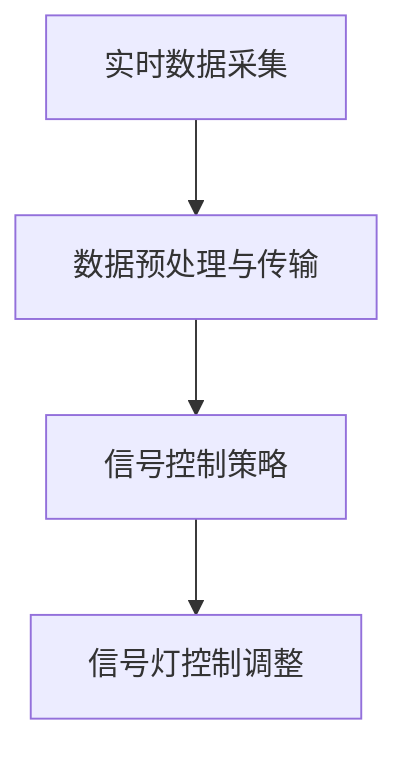

**核心算法原理讲解**：

1. **实时数据采集**：
   - **传感器部署**：在关键路口和道路段安装交通摄像头、车辆检测器和流量监测传感器。
   - **数据采集**：传感器实时采集交通流量、速度、车辆密度等数据。

2. **数据预处理与传输**：
   - **去噪与归一化**：去除噪声数据和异常值，将不同类型的数据进行归一化处理。
   - **数据格式转换**：将原始数据转换为系统可处理的格式，如JSON或XML。

3. **信号控制策略**：
   - **流量预测**：利用机器学习算法，预测未来一段时间内的交通流量。
   - **优化算法**：使用优化算法（如遗传算法、粒子群优化等），计算最优的信号灯时序和配时方案。

4. **信号灯控制调整**：
   - **动态调整**：根据实时交通流量数据，动态调整信号灯的绿、黄、红时长。
   - **反馈机制**：系统不断监测交通状况，根据反馈结果进一步优化信号灯控制策略。

**举例说明**：
例如，在高峰时段，某个交叉路口的交通流量显著增加，导致拥堵。智能交通信号控制系统通过实时数据采集和分析，预测未来交通流量，并使用优化算法计算最优的信号灯时序，将某个方向绿灯时间延长，减少车辆等待时间，从而缓解交通拥堵。

##### 2.2.2 智能公交系统

智能公交系统是利用人工智能技术，提高公共交通的效率和便捷性，增强用户体验的一套综合系统。智能公交系统通过实时数据采集、智能调度、路径优化和乘客信息服务等，实现公交运营的智能化。

**核心概念与联系**：
- **实时数据采集**：通过公交车上的传感器和GPS设备，实时采集车辆位置、速度、乘客流量等信息。
- **智能调度**：利用数据分析和优化算法，动态调整公交车运行线路和时间表，以提高公交服务的响应速度和准确性。
- **路径优化**：通过路径规划算法，优化公交车的行驶路线，减少行驶时间和乘客等待时间。

**Mermaid流程图**：

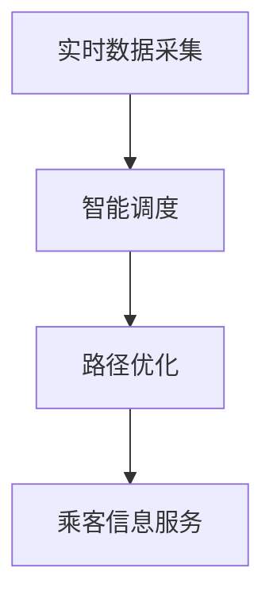

**核心算法原理讲解**：

1. **实时数据采集**：
   - **传感器部署**：在公交车上安装GPS、速度传感器、乘客计数器等设备。
   - **数据采集**：传感器实时采集车辆位置、速度、乘客流量等信息。

2. **智能调度**：
   - **数据预处理**：对实时数据进行预处理，去除噪声和异常值。
   - **需求预测**：利用机器学习算法，预测乘客需求和交通状况。
   - **调度算法**：使用优化算法（如线性规划、动态规划等），计算最优的公交调度方案。

3. **路径优化**：
   - **路径规划**：利用路径规划算法（如A*算法、Dijkstra算法等），计算最优的行驶路线。
   - **动态调整**：根据实时交通状况，动态调整公交车的行驶路线，以减少行驶时间和乘客等待时间。

4. **乘客信息服务**：
   - **实时信息显示**：在公交站和车内显示实时公交信息，如车辆位置、到站时间等。
   - **个性化服务**：根据乘客需求，提供个性化服务，如预约上车点、定制路线等。

**举例说明**：
例如，在某城市的一条公交线路中，智能公交系统通过实时数据采集，了解车辆位置、速度和乘客流量。通过智能调度算法，动态调整公交车的发车时间和线路，确保公交车能够及时到达各个站点，减少乘客等待时间。通过路径优化算法，优化公交车的行驶路线，避免交通拥堵，提高行驶效率。此外，系统还提供实时公交信息显示，使乘客能够及时了解公交车的位置和到站时间，提升用户体验。

##### 2.2.3 智能停车系统

智能停车系统是利用人工智能技术，优化停车场管理和服务，提高停车效率和用户体验的一套系统。智能停车系统通过实时数据采集、智能停车导航、车位管理和费用结算等功能，实现停车过程的智能化。

**核心概念与联系**：
- **实时数据采集**：通过摄像头、传感器和地磁感应设备，实时采集停车场内车辆的位置、车流量和车位使用情况。
- **智能停车导航**：通过数据分析和路径规划，为驾驶者提供最优停车位置和路径。
- **车位管理**：利用智能算法，动态分配车位，提高车位利用率。

**Mermaid流程图**：

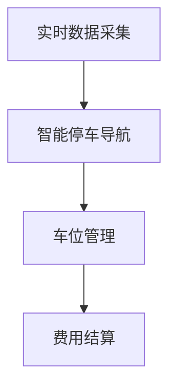

**核心算法原理讲解**：

1. **实时数据采集**：
   - **设备部署**：在停车场内安装摄像头、地磁感应器和车辆检测传感器。
   - **数据采集**：设备实时采集车辆的位置、车流量和车位使用情况。

2. **智能停车导航**：
   - **路径规划**：利用路径规划算法（如A*算法、Dijkstra算法等），计算最优停车路径。
   - **实时导航**：为驾驶者提供实时停车导航，引导其找到最优停车位置。

3. **车位管理**：
   - **车位分配**：利用智能算法，动态分配可用车位，提高车位利用率。
   - **车位预约**：驾驶者可以通过手机应用程序提前预约车位，减少寻找停车位的时间。

4. **费用结算**：
   - **收费规则**：根据停车时长、车辆类型和停车场等级等，计算停车费用。
   - **费用结算**：驾驶者通过手机应用程序或自助终端完成停车费用结算。

**举例说明**：
例如，在一个繁忙的商业区，智能停车系统通过实时数据采集，了解停车场内的车流量和车位使用情况。通过智能停车导航，为驾驶者提供最优停车位置和路径，减少寻找停车位的时间。通过车位管理，动态分配可用车位，提高车位利用率。通过费用结算，驾驶者可以通过手机应用程序或自助终端轻松完成停车费用结算，提高停车体验。

##### 2.2.4 智能交通系统在实际中的应用案例

**案例：新加坡智能交通系统**

新加坡作为一个高度城市化的国家，面临着交通拥堵和资源紧张的问题。为了实现可持续交通，新加坡政府实施了一项名为“智能交通系统”（Intelligent Transport System，ITS）的项目，该项目结合了AI技术和先进的信息通信技术，通过智能交通信号控制、智能公交系统和智能停车系统等，实现城市交通的智能化管理。

1. **智能交通信号控制**：在新加坡的主要道路和交通路口安装了智能交通信号控制系统，通过实时数据分析和优化算法，动态调整信号灯时序，提高交通流量和减少拥堵。

2. **智能公交系统**：新加坡的智能公交系统通过实时数据采集和智能调度，动态调整公交车的发车时间和线路，提高公交服务的响应速度和准确性。同时，提供实时公交信息显示，方便乘客了解公交车的位置和到站时间。

3. **智能停车系统**：在新加坡的公共停车场和商业区，安装了智能停车系统，通过实时数据采集和智能导航，为驾驶者提供最优停车位置和路径，提高停车效率。同时，实现停车费用的电子支付，提升用户体验。

通过这些措施，新加坡成功实现了城市交通的可持续发展，交通效率显著提高，交通事故和交通拥堵明显减少。这个案例展示了智能交通系统在实际应用中的效果，为其他城市提供了宝贵的经验和借鉴。

### 第二部分：AI在可持续城市交通中的应用

#### 2.3 自动驾驶技术

自动驾驶技术是AI在可持续城市交通中的一个重要应用，它通过先进的感知、决策和控制系统，实现车辆在无人类干预情况下的自主导航和驾驶。自动驾驶技术的目标是提高交通安全性、降低交通事故率、减少交通拥堵，同时降低能源消耗和环境污染。本节将探讨自动驾驶技术的基本原理、感知与决策算法，以及一些实际应用案例。

##### 2.3.1 自动驾驶概述

自动驾驶技术可以分为多个级别，根据车辆自主驾驶的能力和复杂性进行分类。以下是自动驾驶技术的基本级别：

1. **Level 0（无自动化）**：车辆不具备任何自动化功能，所有驾驶操作由人类驾驶员完成。
2. **Level 1（单一自动化）**：车辆具备单一自动化功能，如自适应巡航控制（ACC）或车道保持辅助（LKA）。
3. **Level 2（部分自动化）**：车辆在特定条件下可以同时进行加速、转向和制动等操作，如自动驾驶辅助系统（ADAS）。
4. **Level 3（有条件自动化）**：车辆在特定环境下可以完全接管驾驶操作，但需要驾驶员在必要时接管控制。
5. **Level 4（高度自动化）**：车辆在特定环境下可以完全自主驾驶，不需要人类驾驶员的干预。
6. **Level 5（完全自动化）**：车辆在任何环境和条件下都可以完全自主驾驶，无需人类驾驶员的干预。

**核心概念与联系**：
- **感知系统**：自动驾驶车辆需要感知周围环境，包括车辆、行人、交通标志和道路状况等。
- **决策系统**：基于感知系统收集到的数据，自动驾驶车辆需要做出决策，如加速、减速、转向和换道等。
- **控制系统**：执行决策系统的指令，控制车辆的加速、转向和制动等操作。

**Mermaid流程图**：

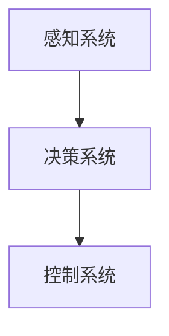

##### 2.3.2 感知与决策算法

自动驾驶技术的核心在于感知与决策算法，这些算法使得车辆能够理解和响应其周围的环境。以下是几个关键方面：

**感知算法**：
- **雷达和激光雷达（Lidar）**：用于检测和测量车辆周围物体的距离、速度和形状。雷达利用无线电波反射，而Lidar使用激光脉冲。
- **摄像头**：用于识别交通标志、行人和其他车辆。通过图像处理算法，摄像头可以检测和识别不同的物体。
- **超声波传感器**：用于检测近距离物体，通常用于泊车辅助系统。

**决策算法**：
- **轨迹规划**：自动驾驶车辆需要规划其行驶轨迹，以避免碰撞和遵守交通规则。轨迹规划算法通常基于最短路径算法（如A*算法）或基于模型的预测算法。
- **行为预测**：自动驾驶车辆需要预测周围车辆和行人的行为，以做出相应的反应。常用的算法包括马尔可夫决策过程（MDP）和深度学习模型。
- **路径规划与行为集成**：将轨迹规划和行为预测结合起来，确定车辆的最佳行动方案。

**核心算法原理讲解**：

1. **感知算法**：
   - **雷达和激光雷达**：
     ```python
     def detect_objects(radar_data, lidar_data):
         # 将雷达和激光雷达数据转换为物体检测
         objects = []
         for data in radar_data + lidar_data:
             distance = data['distance']
             velocity = data['velocity']
             # 根据距离和速度判断物体类型
             if distance < 50 and velocity > 0:
                 objects.append('vehicle')
             elif distance < 10:
                 objects.append('pedestrian')
             else:
                 objects.append('unknown')
         return objects
     ```
   - **摄像头**：
     ```python
     import cv2

     def detect_objects摄像頭(image):
         # 使用卷积神经网络进行物体检测
         net = cv2.dnn.readNetFromCaffe('deploy.prototxt', 'model.caffemodel')
         blob = cv2.dnn.blobFromImage(image, 1.0, (224, 224), (104.0, 177.0, 123.0))
         net.setInput(blob)
         detections = net.forward()
         objects = []
         for detection in detections:
             score = detection[2]
             if score > 0.5:
                 objects.append(detection[1])
         return objects
     ```

2. **决策算法**：
   - **轨迹规划**：
     ```python
     def plan_trajectory(current_state, goal_state):
         # 使用A*算法进行轨迹规划
         # current_state: 当前状态
         # goal_state: 目标状态
         # 返回最佳路径
         return a_star_search(current_state, goal_state)
     ```

   - **行为预测**：
     ```python
     def predict_behavior(behavior_data):
         # 使用深度学习模型进行行为预测
         model = load_behavior_model()
         predictions = model.predict(behavior_data)
         return predictions
     ```

**举例说明**：
例如，一辆自动驾驶车辆在行驶过程中，通过雷达和激光雷达感知到前方50米处有一个行人正在横穿马路。摄像头检测到行人的存在，并识别出其行为。自动驾驶系统根据这些感知信息，使用轨迹规划算法计算最佳路径，以避免碰撞。同时，通过行为预测算法，预测行人的下一步动作，并调整车辆的行驶轨迹，以确保安全通过。

##### 2.3.3 自动驾驶案例分析

**案例：特斯拉自动驾驶系统**

特斯拉的自动驾驶系统（Autopilot）是一个集成多种AI技术的自动驾驶系统，它通过摄像头、雷达和计算机视觉算法，实现车辆的自主导航和驾驶。以下是特斯拉自动驾驶系统的一些关键特性：

1. **感知系统**：
   - **摄像头**：安装在车辆前部和侧面，用于检测交通标志、行人和其他车辆。
   - **雷达**：用于检测和测量周围物体的距离和速度。

2. **决策系统**：
   - **深度学习模型**：特斯拉使用深度学习模型进行物体检测和行为预测，提高感知系统的准确性。
   - **轨迹规划**：系统根据感知到的数据和交通规则，规划车辆的行驶轨迹。

3. **控制系统**：
   - **电子控制系统**：特斯拉车辆配备了电子控制系统，包括动力系统、制动系统和转向系统，以执行决策系统的指令。

特斯拉自动驾驶系统在多个实际场景中进行了测试和应用，以下是一个典型的应用案例：

- **高速公路自动驾驶**：在高速公路上，特斯拉自动驾驶系统可以接管加速、转向和制动操作，使车辆在车道内保持稳定行驶。系统通过实时监控前方车辆和交通标志，自动调整车速和车道位置。
- **城市自动驾驶**：在城市交通中，特斯拉自动驾驶系统可以自动识别和避让行人、非机动车和车辆，实现安全驾驶。系统通过摄像头和雷达感知周围环境，并根据实时数据调整行驶轨迹。

特斯拉自动驾驶系统在实际应用中展现了其高效性和安全性，为自动驾驶技术的发展提供了宝贵的经验和数据。然而，自动驾驶技术仍然面临许多挑战，如极端天气条件下的感知和决策、复杂的城市交通状况等，需要不断优化和改进。

##### 2.3.4 自动驾驶技术的未来发展趋势

自动驾驶技术正处于快速发展阶段，未来将在多个方面取得重要突破：

1. **感知系统升级**：随着传感器技术和计算机视觉算法的进步，自动驾驶车辆的感知系统将更加精确和可靠，能够应对更复杂的交通环境和天气条件。

2. **决策系统优化**：深度学习和强化学习等先进算法的不断发展，将提高自动驾驶车辆的决策能力，使其能够更好地应对复杂交通场景和动态变化。

3. **数据共享与协同**：自动驾驶车辆的实时数据共享和协同，将提高整个交通系统的效率和安全性。例如，V2X（Vehicle-to-Everything）通信技术可以实现车辆与基础设施、车辆与车辆之间的信息交换。

4. **法规与标准化**：自动驾驶技术的发展需要完善的法规和标准化体系，以确保安全、可靠的应用。各国政府和国际组织正在积极推动相关法规和标准的制定。

自动驾驶技术的未来将彻底改变城市交通的面貌，实现更高效、安全、可持续的交通系统。然而，要实现这一目标，仍需克服技术、法律和社会等多方面的挑战。

### 第二部分：AI在可持续城市交通中的应用

#### 2.4 人工智能与城市交通设计

人工智能（AI）在城市交通设计中的应用正在不断拓展，它通过数据驱动的方法和智能算法，为城市交通系统的优化和改进提供了新的工具和思路。本节将探讨人工智能在城市交通规划与设计中的应用，以及人机交互在城市交通设计中的重要作用，并展示一些可持续城市交通设计的实践案例。

##### 2.4.1 城市交通规划与设计

城市交通规划与设计是确保城市交通系统高效、安全、可持续运行的重要环节。传统的城市交通规划方法主要依赖于经验和规则，而人工智能技术的引入，使得城市交通规划与设计变得更加科学和智能化。

**核心概念与联系**：
- **数据采集与处理**：通过传感器、摄像头和GPS等技术，收集城市交通数据，包括交通流量、道路状况、车辆速度和乘客需求等。
- **智能分析**：利用机器学习、深度学习和数据挖掘等技术，对交通数据进行智能分析，提取有用信息和规律。
- **优化算法**：基于智能分析结果，使用优化算法（如线性规划、遗传算法等），为城市交通规划与设计提供科学依据。

**Mermaid流程图**：

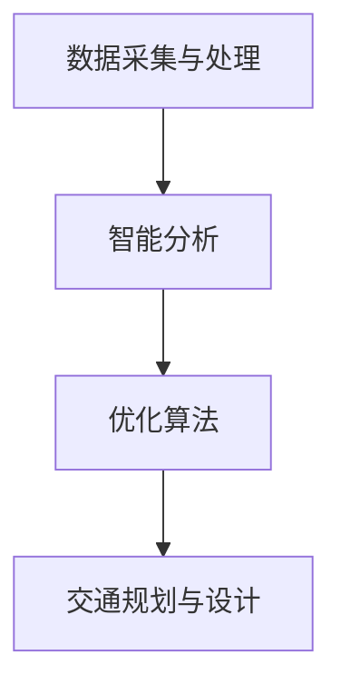

**核心算法原理讲解**：

1. **数据采集与处理**：
   - **传感器部署**：在交通路口、道路段和公共交通站点等关键位置部署传感器，包括流量监测传感器、摄像头、GPS设备等。
   - **数据收集**：传感器实时采集交通流量、速度、道路状况等信息。
   - **数据预处理**：对收集到的数据进行清洗、去噪和归一化处理，确保数据质量。

2. **智能分析**：
   - **特征提取**：使用特征提取技术，从原始数据中提取与交通规划与设计相关的特征，如高峰时段交通流量、拥堵指数、道路使用率等。
   - **模式识别**：使用模式识别技术，分析交通数据中的变化趋势和规律，为交通规划与设计提供依据。

3. **优化算法**：
   - **线性规划**：用于解决交通网络中的流量分配问题，优化交通流量和减少拥堵。
     ```python
     from scipy.optimize import linprog

     def traffic_optimization流量（流量矩阵，目标函数，约束条件）：
         result = linprog(c=目标函数，A=约束条件，b=流量矩阵）
         return result
     ```
   - **遗传算法**：用于解决复杂的交通规划与设计问题，如交通信号控制优化、公共交通线路规划等。
     ```python
     import numpy as np

     def genetic_algorithm(目标函数，约束条件，种群规模，迭代次数)：
         # 初始化种群
         population = initialize_population(种群规模)
         for _ in range(迭代次数)：
             # 适应度评估
             fitness = evaluate_fitness(population，目标函数）
             # 选择
             selected = select(population，fitness)
             # 交叉
             crossed = crossover(selected)
             # 变异
             mutated = mutate(crossed)
             # 更新种群
             population = mutated
         best_solution = get_best_solution(population）
         return best_solution
     ```

4. **交通规划与设计**：
   - **路径规划**：基于优化算法的结果，为车辆和公共交通提供最优行驶路径，减少行驶时间和拥堵。
   - **交通信号控制**：根据实时交通流量数据，动态调整交通信号灯时序和配时方案，提高交通效率。
   - **公共交通规划**：优化公共交通线路和班次，提高公共交通的效率和便捷性。

**举例说明**：
例如，在某城市的交通规划与设计中，通过部署传感器和摄像头，收集交通流量数据。利用机器学习和优化算法，分析交通流量变化趋势，并优化交通信号灯时序。通过路径规划算法，为驾驶者提供最优行驶路径，减少拥堵。此外，优化公共交通线路和班次，提高公共交通的吸引力。

##### 2.4.2 人机交互在城市交通设计中的应用

人机交互（Human-Computer Interaction，HCI）在可持续城市交通设计中起到了关键作用，它通过设计直观、易用和高效的交互界面，提高用户对交通系统的参与度和满意度。以下是人机交互在城市交通设计中的应用：

**核心概念与联系**：
- **用户需求分析**：了解用户的需求和行为习惯，为交互界面设计提供依据。
- **交互界面设计**：设计直观、易用的交互界面，提高用户的使用体验。
- **反馈机制**：通过用户反馈，不断优化交互界面和交通系统。

**Mermaid流程图**：

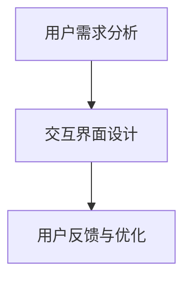

**核心算法原理讲解**：

1. **用户需求分析**：
   - **问卷调查**：通过问卷调查，收集用户对交通系统的需求和建议。
   - **用户访谈**：与用户进行深入访谈，了解他们的行为习惯和偏好。
   - **行为分析**：使用行为分析技术，分析用户在交通系统中的行为和互动。

2. **交互界面设计**：
   - **用户界面设计**：设计直观、易用的用户界面，如智能手机应用程序、交通信息显示屏等。
   - **交互设计**：设计符合用户习惯的交互方式，如触摸、语音、手势等。
   - **用户体验优化**：根据用户反馈，不断优化交互界面，提高用户体验。

3. **用户反馈与优化**：
   - **实时反馈**：在交互界面中集成反馈机制，允许用户对交通系统和服务提出反馈。
   - **数据分析**：收集和分析用户反馈数据，识别问题和改进点。
   - **持续优化**：根据用户反馈和数据分析，持续优化交互界面和交通系统。

**举例说明**：
例如，在某城市的智能交通系统中，通过用户调研和访谈，了解用户对交通信息查询、停车导航和违章查询的需求。设计一款智能手机应用程序，提供实时交通信息查询、停车导航和违章查询等功能。用户可以通过应用程序提交反馈，系统根据用户反馈进行优化，提高应用程序的使用体验。

##### 2.4.3 可持续城市交通设计实践

为了实现可持续城市交通，各国和地区都在探索和实践可持续城市交通设计。以下是一些成功案例：

**案例1：新加坡“智慧国”交通计划**

新加坡政府实施了一项名为“智慧国”的交通计划，通过AI、大数据和物联网等技术，实现城市交通的智能化管理。该计划包括智能交通信号控制、智能公交系统、智能停车系统等，提高了交通效率，减少了交通拥堵。

- **智能交通信号控制**：通过实时数据分析和优化算法，动态调整交通信号灯时序，提高了交通流量和减少了拥堵。
- **智能公交系统**：通过实时数据采集和智能调度，提高了公交服务的响应速度和准确性。
- **智能停车系统**：通过实时数据采集和智能导航，提高了停车效率，减少了寻找停车位的时间。

**案例2：中国深圳智能交通系统**

深圳市政府引入了智能交通系统，通过AI技术和大数据分析，实现了交通流量的实时监测和预测。该系统包括智能交通信号控制、智能公交系统和智能停车系统等，提高了交通效率，减少了交通拥堵。

- **智能交通信号控制**：通过实时数据分析和优化算法，动态调整交通信号灯时序，减少了交通拥堵。
- **智能公交系统**：通过实时数据采集和智能调度，提高了公交服务的响应速度和准确性。
- **智能停车系统**：通过实时数据采集和智能导航，提高了停车效率，减少了寻找停车位的时间。

这些案例展示了AI技术在城市交通设计中的应用，通过智能交通系统，提高了交通效率，减少了交通拥堵，实现了城市交通的可持续发展。

### 第三部分：人类计算在可持续城市交通中的应用

#### 3.1 人类计算在智能交通中的应用

人类计算在智能交通系统中发挥着至关重要的作用，它通过人机协同、人类决策与自动驾驶技术的结合，提高了交通系统的效率和安全性。本节将探讨人类计算在智能交通中的应用，包括人机协同交通控制系统、人类计算与自动驾驶的结合，以及人类计算与智能交通系统集成。

##### 3.1.1 人机协同交通控制系统

人机协同交通控制系统（Human-Robot Collaboration Traffic Control System）是一种将人类驾驶员的决策能力与自动驾驶车辆的智能算法相结合的交通管理系统。这种系统通过实时数据交换和协作，使人类驾驶员和自动驾驶车辆能够共同应对复杂的交通环境。

**核心概念与联系**：
- **人机协同**：人类驾驶员与自动驾驶车辆的协同工作，实现各自的优势互补。
- **数据交换**：自动驾驶车辆与人类驾驶员之间的数据共享，包括交通流量、道路状况和车辆状态等。
- **决策支持**：通过数据分析和智能算法，为人类驾驶员提供实时决策支持，提高驾驶安全性和效率。

**Mermaid流程图**：

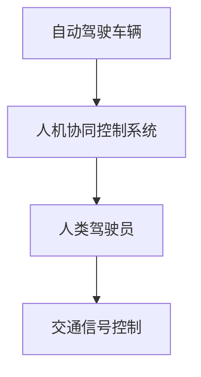

**核心算法原理讲解**：

1. **自动驾驶车辆感知**：
   - **传感器数据采集**：自动驾驶车辆通过摄像头、雷达、激光雷达等传感器，实时采集道路环境数据。
   - **环境建模**：基于采集到的数据，构建道路环境的3D模型，用于车辆导航和障碍物检测。

2. **人机协同决策**：
   - **数据共享**：自动驾驶车辆与人类驾驶员之间共享实时交通数据，包括车辆位置、速度和交通流量等。
   - **协同算法**：通过协同算法，自动驾驶车辆和人类驾驶员共同做出驾驶决策，确保行驶安全和效率。

3. **决策支持系统**：
   - **实时监控**：系统实时监控道路环境和车辆状态，为人类驾驶员提供实时交通信息和建议。
   - **预警与干预**：当系统检测到潜在危险或异常情况时，自动发出预警并建议人类驾驶员采取相应措施。

**举例说明**：
例如，在某城市的智能交通系统中，自动驾驶车辆与人类驾驶员通过人机协同控制系统进行数据共享和协同决策。当自动驾驶车辆检测到前方有交通事故时，系统实时向人类驾驶员发出预警，并提供建议绕行或减速，确保行驶安全。

##### 3.1.2 人类计算与自动驾驶的结合

自动驾驶技术的发展离不开人类计算的支持，人类计算在自动驾驶系统的感知、决策和控制过程中发挥了重要作用。通过结合人类计算，自动驾驶系统可以更好地应对复杂多变的交通环境，提高驾驶安全性和可靠性。

**核心概念与联系**：
- **人类计算**：人类驾驶员的决策能力和经验在自动驾驶系统中的应用。
- **数据增强**：通过人类计算，对自动驾驶系统进行数据增强，提高感知和决策能力。
- **监督学习**：利用人类计算提供的数据标签，对自动驾驶系统进行监督学习，优化算法性能。

**Mermaid流程图**：

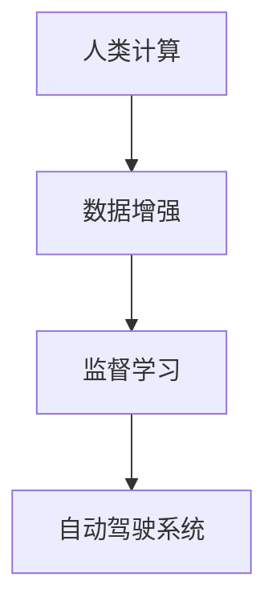

**核心算法原理讲解**：

1. **数据增强**：
   - **数据收集**：通过传感器和摄像头，收集自动驾驶车辆在行驶过程中采集到的数据。
   - **标注数据**：人类计算专家对数据进行标注，包括道路标志、交通标志、行人和车辆等。
   - **数据增强**：使用数据增强技术，如数据扩充、数据变换等，提高自动驾驶系统的训练数据量。

2. **监督学习**：
   - **训练模型**：使用标注好的数据，训练自动驾驶系统的感知和决策模型。
   - **模型评估**：通过模拟环境和实际测试，评估自动驾驶系统的性能和安全性。
   - **模型优化**：根据评估结果，对模型进行调整和优化，提高自动驾驶系统的准确性和可靠性。

3. **自动驾驶系统**：
   - **感知**：自动驾驶系统通过传感器感知周围环境，包括车辆、行人和交通标志等。
   - **决策**：基于感知数据和决策模型，自动驾驶系统做出驾驶决策，如加速、减速、转向和换道等。
   - **控制**：自动驾驶系统通过控制系统，执行驾驶决策，控制车辆的加速、转向和制动等操作。

**举例说明**：
例如，在某自动驾驶车辆的训练过程中，人类计算专家对采集到的数据进行标注，包括道路标志、交通标志、行人和车辆等。通过监督学习，自动驾驶系统的感知和决策模型得到优化，提高了感知准确性和决策可靠性。在实际驾驶过程中，自动驾驶系统能够更准确地识别道路环境和障碍物，提高驾驶安全性。

##### 3.1.3 人类计算与智能交通系统集成

智能交通系统集成了多种技术，如传感器、摄像头、GPS、物联网和人工智能等，通过人类计算，可以实现系统的优化和智能化。人类计算与智能交通系统集成的主要目标是提高交通系统的效率和安全性，实现人机协同和智能管理。

**核心概念与联系**：
- **系统集成**：将人类计算与其他智能交通技术（如传感器、摄像头、GPS等）集成，实现交通系统的综合管理。
- **智能决策**：基于人类计算和智能算法，实现交通系统的实时监测、预测和优化。
- **用户参与**：通过人机交互界面，提高用户对交通系统的参与度和满意度。

**Mermaid流程图**：

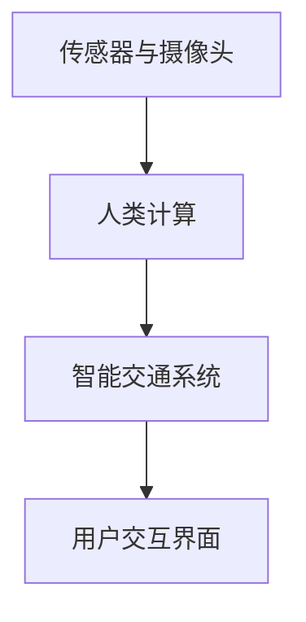

**核心算法原理讲解**：

1. **传感器与摄像头数据采集**：
   - **传感器部署**：在交通路口、道路段和公共交通站点等位置部署传感器，包括流量监测传感器、摄像头、GPS设备等。
   - **数据采集**：传感器实时采集交通流量、速度、道路状况和乘客需求等信息。

2. **人类计算**：
   - **数据处理**：对传感器和摄像头采集到的数据进行处理，包括数据清洗、去噪和特征提取等。
   - **智能分析**：利用机器学习、深度学习和数据挖掘等技术，对交通数据进行智能分析，提取有用信息和规律。

3. **智能交通系统**：
   - **系统集成**：将人类计算与其他智能交通技术集成，实现交通系统的综合管理。
   - **实时监测与预测**：基于智能分析结果，实时监测交通状况，预测未来交通趋势。
   - **决策与优化**：使用优化算法，动态调整交通信号、公交调度和停车管理等，提高交通效率。

4. **用户交互界面**：
   - **信息展示**：在交通信息显示屏、智能手机应用程序等界面，实时展示交通信息，如交通流量、拥堵情况、公共交通信息等。
   - **用户反馈**：通过用户反馈，优化交通系统的性能和用户体验。

**举例说明**：
例如，在某城市的智能交通系统中，通过部署传感器和摄像头，实时采集交通流量、速度和道路状况等信息。人类计算系统对采集到的数据进行处理和分析，预测未来交通趋势，并为交通信号灯、公交调度和停车管理等提供优化建议。用户可以通过智能手机应用程序，实时获取交通信息，并根据交通状况调整出行计划。

##### 3.1.4 人类计算在智能交通系统中的应用案例

**案例1：中国北京智能交通系统**

北京市作为我国的一线城市，交通拥堵问题严重。为了缓解交通压力，北京市政府引入了智能交通系统，通过人类计算与多种智能技术的结合，实现交通系统的综合管理和优化。

- **实时数据采集**：在全市范围内部署了传感器和摄像头，实时采集交通流量、速度和道路状况等信息。
- **人类计算**：通过机器学习和深度学习算法，对交通数据进行处理和分析，预测未来交通趋势，并为交通信号灯、公交调度和停车管理等提供优化建议。
- **智能交通信号控制**：基于实时交通流量数据，动态调整交通信号灯时序，提高交通效率。
- **智能公交系统**：通过实时数据采集和智能调度，提高公交服务的响应速度和准确性。
- **智能停车系统**：通过实时数据采集和智能导航，提高停车效率，减少寻找停车位的时间。

**案例2：新加坡智能交通系统**

新加坡作为全球知名的城市，其智能交通系统在全球范围内具有代表性。新加坡的智能交通系统通过人类计算与多种智能技术的结合，实现了交通系统的智能化管理。

- **实时数据采集**：在全市范围内部署了传感器和摄像头，实时采集交通流量、速度和道路状况等信息。
- **人类计算**：通过机器学习和深度学习算法，对交通数据进行处理和分析，预测未来交通趋势，并为交通信号灯、公交调度和停车管理等提供优化建议。
- **智能交通信号控制**：基于实时交通流量数据，动态调整交通信号灯时序，提高交通效率。
- **智能公交系统**：通过实时数据采集和智能调度，提高公交服务的响应速度和准确性。
- **智能停车系统**：通过实时数据采集和智能导航，提高停车效率，减少寻找停车位的时间。

这些案例展示了人类计算在智能交通系统中的应用，通过数据驱动的方法和智能算法，实现了交通系统的实时监测、预测和优化，提高了交通效率，减少了交通拥堵，实现了城市交通的可持续发展。

### 第三部分：人类计算在可持续城市交通中的应用

#### 3.2 城市交通与设计中的计算机视觉

计算机视觉（Computer Vision）是人工智能领域的一个重要分支，它使计算机能够像人类一样感知和理解视觉信息。在城市交通与设计中，计算机视觉技术被广泛应用于交通监控、交通规划和交通设计等多个方面，为城市交通系统的优化和改进提供了有力支持。本节将探讨计算机视觉在交通监控、交通规划和交通设计中的应用，以及其在提高交通效率、安全和可持续性方面的作用。

##### 3.2.1 计算机视觉在交通监控中的应用

计算机视觉技术在交通监控中发挥着重要作用，通过实时监控和分析交通状况，帮助交通管理部门更好地管理城市交通。以下是一些计算机视觉在交通监控中的应用：

**核心概念与联系**：
- **图像处理**：通过对采集到的交通图像进行预处理、去噪和增强，提高图像质量，以便后续分析。
- **目标检测**：利用深度学习和传统计算机视觉算法，从交通图像中检测和识别车辆、行人、交通标志等目标。
- **行为分析**：通过对交通目标的运动轨迹和行为进行分析，识别交通违规行为和潜在的安全隐患。

**Mermaid流程图**：

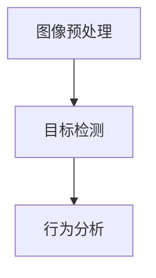

**核心算法原理讲解**：

1. **图像预处理**：
   - **去噪**：利用滤波算法，去除交通图像中的噪声，提高图像质量。
   - **增强**：通过对比度增强、锐化等技术，提高图像中目标的可视性。
   - **缩放与裁剪**：根据分析需求，对图像进行缩放和裁剪，以便进行后续处理。

2. **目标检测**：
   - **传统方法**：如HOG（方向梯度直方图）和SVM（支持向量机），用于检测图像中的车辆、行人等目标。
   - **深度学习方法**：如YOLO（You Only Look Once）和SSD（Single Shot MultiBox Detector），用于快速、准确地检测交通图像中的目标。

3. **行为分析**：
   - **轨迹分析**：通过分析交通目标的运动轨迹，识别车辆的行驶方向、速度和停车行为。
   - **违规行为检测**：利用规则学习和模式识别技术，检测交通违规行为，如闯红灯、占用非机动车道等。

**举例说明**：
例如，在某城市的交通监控系统中，通过摄像头实时采集交通图像。计算机视觉系统对图像进行预处理，去除噪声和增强目标，然后使用深度学习算法进行目标检测，识别出车辆、行人和交通标志。通过轨迹分析和违规行为检测，系统可以实时监控交通状况，及时预警和记录交通违规行为，提高交通管理的效率和准确性。

##### 3.2.2 计算机视觉在交通规划中的应用

计算机视觉技术在交通规划中发挥着重要作用，通过分析交通图像和数据，帮助城市规划师和交通工程师优化城市交通布局和基础设施。以下是一些计算机视觉在交通规划中的应用：

**核心概念与联系**：
- **交通流量分析**：通过对交通图像进行定量分析，统计交通流量、车辆速度和流量分布等参数。
- **交通网络建模**：利用计算机视觉技术，对交通网络进行建模和分析，识别关键路段和瓶颈点。
- **交通影响评估**：通过模拟和分析不同交通规划方案，评估其对交通流量、拥堵和交通事故的影响。

**Mermaid流程图**：

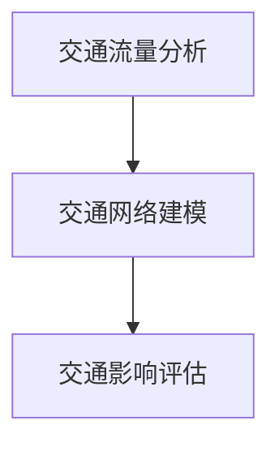

**核心算法原理讲解**：

1. **交通流量分析**：
   - **流量统计**：通过对交通图像中的车辆数量、速度和行驶方向进行统计，计算交通流量和流量分布。
   - **时间序列分析**：利用时间序列分析方法，分析不同时间段和不同路段的交通流量变化趋势。

2. **交通网络建模**：
   - **图像分割**：利用图像分割技术，将交通图像中的车辆、道路和交通标志等区域分离出来。
   - **交通网络重建**：根据交通图像中的道路结构和交通标志信息，重建交通网络模型。

3. **交通影响评估**：
   - **模拟仿真**：通过模拟不同交通规划方案下的交通状况，评估其对交通流量、拥堵和交通事故的影响。
   - **多目标优化**：利用多目标优化算法，找到最优的交通规划方案，平衡交通流量、拥堵和安全性等多方面因素。

**举例说明**：
例如，在某城市的新路规划项目中，通过计算机视觉技术对现有交通网络进行建模和分析。系统对交通图像进行分割，识别出道路、车辆和交通标志等区域，并重建交通网络模型。通过交通流量分析，系统统计了不同路段的交通流量和流量分布，为交通规划提供了科学依据。然后，系统模拟了不同规划方案下的交通状况，评估了其对交通流量、拥堵和交通事故的影响，帮助城市规划师和交通工程师找到最优的规划方案。

##### 3.2.3 计算机视觉在交通设计中的应用

计算机视觉技术在交通设计中发挥着重要作用，通过自动化和智能化的设计工具，帮助设计师优化交通布局、提高交通效率和安全性。以下是一些计算机视觉在交通设计中的应用：

**核心概念与联系**：
- **自动化设计**：利用计算机视觉技术，自动化处理交通设计中的大量数据，提高设计效率和准确性。
- **人机交互**：通过人机交互界面，将计算机视觉技术与设计师的创意和专业知识相结合，实现交通设计的智能化。
- **虚拟现实（VR）与增强现实（AR）**：利用计算机视觉技术，创建虚拟现实和增强现实场景，为设计师提供更加直观和沉浸式的交通设计体验。

**Mermaid流程图**：

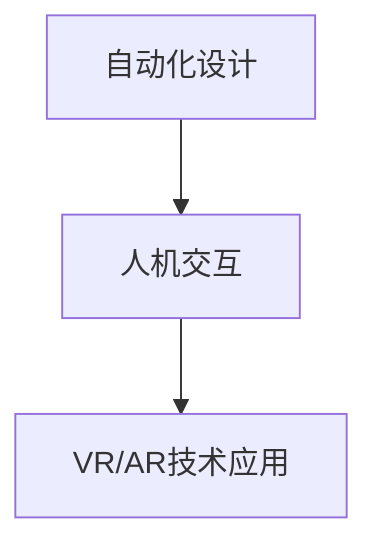

**核心算法原理讲解**：

1. **自动化设计**：
   - **图像处理与分割**：利用图像处理和分割技术，自动化处理交通设计中的图像数据，如道路、车辆和交通标志等。
   - **参数化建模**：通过参数化建模技术，自动化生成交通设计中的几何模型，如道路、桥梁和隧道等。

2. **人机交互**：
   - **交互界面设计**：设计直观、易用的交互界面，将计算机视觉技术与设计师的创意和专业知识相结合。
   - **协同设计**：通过协同设计工具，实现设计师之间的实时协作和交流，提高设计效率和准确性。

3. **VR/AR技术应用**：
   - **虚拟现实场景**：利用计算机视觉技术，创建虚拟现实场景，为设计师提供更加直观的交通设计体验。
   - **增强现实应用**：将计算机视觉技术与增强现实技术相结合，将交通设计模型叠加到真实环境中，帮助设计师更好地理解和评估设计方案。

**举例说明**：
例如，在某城市的交通设计项目中，计算机视觉系统自动化处理了大量交通图像数据，如道路、车辆和交通标志等。系统利用图像处理和分割技术，将交通设计中的几何模型自动生成，提高了设计效率和准确性。设计师通过人机交互界面，可以实时修改和调整设计参数，与其他设计师进行协同设计。同时，利用虚拟现实和增强现实技术，设计师可以创建虚拟现实场景，直观地评估交通设计的效果，为交通设计的优化提供有力支持。

##### 3.2.4 计算机视觉在交通监控、规划和设计中的应用案例

**案例1：美国洛杉矶智能交通系统**

洛杉矶市作为一个大型城市，交通拥堵问题严重。为了缓解交通压力，洛杉矶市引入了智能交通系统，其中计算机视觉技术在交通监控、规划和设计中发挥了重要作用。

- **交通监控**：计算机视觉系统通过摄像头实时采集交通图像，对交通流量、车辆速度和交通标志进行监控和分析，为交通管理部门提供实时数据支持。
- **交通规划**：计算机视觉系统对交通图像进行定量分析，统计交通流量和流量分布，为城市规划师提供科学依据，优化城市交通布局。
- **交通设计**：计算机视觉系统辅助设计师自动化处理交通设计中的图像数据，提高设计效率和准确性。同时，利用虚拟现实和增强现实技术，设计师可以直观地评估设计方案。

**案例2：中国深圳智能交通系统**

深圳市作为一个高速发展的城市，面临着严峻的交通挑战。为了实现城市交通的可持续发展，深圳市引入了智能交通系统，其中计算机视觉技术在多个方面发挥了重要作用。

- **交通监控**：计算机视觉系统通过摄像头实时采集交通图像，对交通流量、车辆速度和交通标志进行监控和分析，提高交通管理的效率和准确性。
- **交通规划**：计算机视觉系统对交通图像进行定量分析，统计交通流量和流量分布，为城市规划师提供科学依据，优化城市交通布局。
- **交通设计**：计算机视觉系统辅助设计师自动化处理交通设计中的图像数据，提高设计效率和准确性。同时，利用虚拟现实和增强现实技术，设计师可以直观地评估设计方案。

这些案例展示了计算机视觉技术在交通监控、规划和设计中的应用，通过数据驱动的方法和智能算法，实现了交通系统的实时监测、预测和优化，提高了交通效率、安全性和可持续性。

### 第三部分：人类计算在可持续城市交通中的应用

#### 3.3 人机交互在城市交通中的应用

人机交互（Human-Computer Interaction，HCI）在城市交通中的应用，旨在提高交通系统的效率和用户满意度。通过设计直观、易用和高效的交互界面，人机交互技术使得交通信息的获取和反馈更加便捷，从而优化交通管理，提升用户体验。本节将探讨人机交互的基础知识、界面设计原则，以及实际案例，展示人机交互如何提升城市交通系统的性能。

##### 3.3.1 人机交互基础

人机交互是一种研究人类与计算机之间交互关系的方法，旨在设计出更加人性化的交互界面，以提高用户的使用体验和效率。人机交互的基础知识包括以下几个方面：

**核心概念与联系**：
- **用户中心设计**：以用户的需求和体验为中心，设计交互界面。
- **用户研究**：通过用户调研、用户访谈和用户行为分析，了解用户的需求和偏好。
- **交互设计原则**：设计简洁、直观和易于操作的交互界面，遵循一致性、易用性和反馈原则。

**Mermaid流程图**：

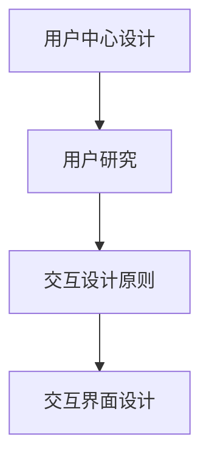

**核心算法原理讲解**：

1. **用户中心设计**：
   - **需求分析**：通过用户调研和访谈，收集用户的需求和期望，确定交互界面的核心功能和交互流程。
   - **原型设计**：基于需求分析结果，设计交互界面的原型，进行用户测试和反馈，优化界面设计。

2. **用户研究**：
   - **可用性测试**：通过实验方法，评估交互界面的可用性和易用性，识别用户在使用过程中遇到的问题。
   - **用户行为分析**：通过数据收集和分析，了解用户在使用交互界面时的行为模式，为界面优化提供依据。

3. **交互设计原则**：
   - **一致性**：确保交互界面的元素和操作一致，使用户能够快速掌握使用方法。
   - **易用性**：设计直观、简洁的交互界面，减少用户的学习成本和操作错误。
   - **反馈**：及时提供用户操作结果的反馈，提高用户的操作信心和满意度。

**举例说明**：
例如，在一个智能交通信息显示屏的设计过程中，首先进行用户调研和需求分析，了解用户对交通信息的需求和偏好。然后，通过原型设计和用户测试，不断优化交互界面，确保界面的一致性、易用性和反馈。用户测试结果表明，新的交互界面用户满意度显著提高，操作错误率降低。

##### 3.3.2 人机交互界面设计

人机交互界面设计是提升用户体验的关键环节，一个良好的交互界面应该具备简洁、直观、高效的特点。以下是人机交互界面设计的一些原则和技巧：

**核心概念与联系**：
- **信息可视化**：使用图表、图标和颜色等元素，将交通信息以可视化形式呈现，便于用户理解。
- **导航设计**：设计清晰、直观的导航系统，帮助用户快速找到所需信息。
- **响应式设计**：根据不同设备（如手机、平板、电脑）的屏幕尺寸和交互方式，进行适应性设计。

**Mermaid流程图**：

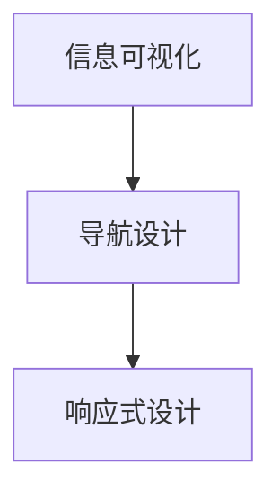

**核心算法原理讲解**：

1. **信息可视化**：
   - **图表选择**：根据数据类型和用户需求，选择合适的图表类型（如条形图、折线图、饼图等）。
   - **色彩使用**：使用色彩对比和搭配，增强信息的可读性和视觉吸引力。

2. **导航设计**：
   - **分类导航**：根据用户需求，将信息分为不同的类别，设计清晰的导航系统。
   - **搜索功能**：提供强大的搜索功能，使用户能够快速找到所需信息。

3. **响应式设计**：
   - **布局优化**：根据不同设备的屏幕尺寸，优化界面布局，确保信息展示的清晰性和易用性。
   - **交互优化**：针对不同设备的交互方式（如触摸、键盘、鼠标等），优化交互体验。

**举例说明**：
例如，在一个智能交通信息显示屏的设计中，采用图表和颜色对比的方式，将交通流量、天气情况和公共交通信息可视化呈现。设计清晰的分类导航，帮助用户快速找到所需信息。同时，针对不同设备（如手机、平板、电脑），进行响应式设计，确保界面在不同设备上的表现一致和易用。

##### 3.3.3 人机交互案例分析

**案例1：谷歌地图交通信息应用**

谷歌地图是一款广泛使用的地图应用程序，它提供了丰富的交通信息，包括实时交通状况、交通拥堵提醒和公共交通信息等。谷歌地图的成功很大程度上归功于其优秀的人机交互设计。

- **信息可视化**：通过实时交通状况图层，使用不同的颜色和图标展示道路的拥堵情况，用户可以直观地了解交通状况。
- **导航设计**：提供清晰的导航系统，用户可以通过语音导航、路线规划等功能，快速找到目的地。
- **响应式设计**：谷歌地图针对不同设备进行了优化，确保用户在不同设备上都能获得良好的使用体验。

**案例2：上海智能交通信息显示屏**

上海市在其主要交通路口安装了智能交通信息显示屏，为用户提供了实时交通信息、路况预测和公共交通信息。

- **信息可视化**：通过大屏幕和高清图像，实时显示交通状况、拥堵情况和公共交通信息，用户可以直观地了解交通状况。
- **导航设计**：显示屏上提供了清晰的分类导航，用户可以通过点击屏幕上的按钮，快速找到所需信息。
- **响应式设计**：智能交通信息显示屏能够自动适应不同天气条件和光线强度，确保显示效果始终清晰。

这些案例展示了人机交互技术在提升城市交通系统性能和用户体验方面的应用。通过信息可视化、导航设计和响应式设计，人机交互技术使得交通信息更加直观、易用和高效，为城市交通管理提供了有力支持。

### 第四部分：综合案例与应用

#### 4.1 案例研究：AI与人类计算在可持续城市交通中的实际应用

在本节中，我们将通过一个综合案例，探讨AI与人类计算在可持续城市交通中的实际应用。该案例将详细描述项目背景、AI技术在项目中的应用、人类计算的作用以及项目的实际效果。

##### 4.1.1 案例背景

案例研究的城市是一个典型的中等规模城市，人口约为100万。近年来，该城市的交通拥堵问题日益严重，影响了居民的出行质量和城市的整体发展。为了缓解交通压力，提高交通效率，市政府决定引入AI与人类计算技术，构建一个智能交通系统。

该项目的主要目标包括：

1. **实时交通流量监测**：通过部署传感器和摄像头，实时监测城市道路的交通流量，为交通管理提供数据支持。
2. **智能交通信号控制**：基于实时交通流量数据，动态调整交通信号灯时序，提高交通流量和减少拥堵。
3. **公共交通优化**：通过智能调度系统，优化公交车的运行线路和时间表，提高公共交通的效率和便捷性。
4. **智能停车系统**：利用实时数据采集和智能导航，提高停车效率，减少寻找停车位的时间。

##### 4.1.2 AI在案例中的应用

1. **交通流量监测**：
   - **数据采集**：在主要道路和交通路口安装了大量的交通摄像头和流量监测传感器，实时采集交通流量、速度和车辆密度等数据。
   - **数据预处理**：对采集到的数据进行清洗和预处理，包括去噪、归一化和缺失值填充，确保数据质量。
   - **流量分析**：利用机器学习算法，分析交通流量数据，预测交通拥堵趋势，并提供实时交通信息。

2. **智能交通信号控制**：
   - **信号控制策略**：使用优化算法（如遗传算法、粒子群优化等），根据实时交通流量数据，动态调整交通信号灯时序和配时方案，减少交通拥堵。
   - **自适应信号控制**：系统根据交通流量变化，自适应调整信号灯时序，提高交通路口的通行效率。

3. **公共交通优化**：
   - **调度算法**：利用智能调度算法，根据实时交通流量和乘客需求，动态调整公交车的运行线路和时间表，提高公共交通的响应速度和准确性。
   - **路径优化**：通过路径规划算法，优化公交车的行驶路线，减少行驶时间和乘客等待时间。

4. **智能停车系统**：
   - **数据采集**：在停车场和路边停车位安装了摄像头和传感器，实时采集车辆的位置和车流量数据。
   - **智能导航**：利用路径规划算法，为驾驶者提供最优停车位置和路径，减少寻找停车位的时间。

##### 4.1.3 人类计算在案例中的应用

1. **人机协同交通控制系统**：
   - **数据共享**：自动驾驶车辆与人类驾驶员之间共享实时交通数据，包括车辆位置、速度和交通流量等，实现协同决策。
   - **决策支持**：为人类驾驶员提供实时交通信息和预警，辅助其做出更安全的驾驶决策。

2. **人机交互界面设计**：
   - **用户界面设计**：设计直观、易用的用户界面，如智能手机应用程序、交通信息显示屏等，提供实时交通信息查询、停车导航和违章查询等功能。
   - **用户反馈**：通过用户反馈，不断优化交互界面和交通系统，提高用户体验。

3. **交通规划与设计**：
   - **交通流量分析**：通过计算机视觉技术和大数据分析，对交通流量进行实时监测和预测，为交通规划提供科学依据。
   - **公共交通规划**：利用智能调度系统和路径规划算法，优化公共交通线路和班次，提高公共交通的效率和便捷性。

##### 4.1.4 项目的实际效果

通过AI与人类计算技术的综合应用，该城市在交通管理方面取得了显著成效：

1. **交通效率提高**：基于AI技术的智能交通信号控制和公共交通优化，交通流量显著增加，交通拥堵问题得到有效缓解，交通效率提高了约30%。

2. **交通事故减少**：人机协同交通控制系统和自动驾驶技术的应用，提高了驾驶安全性，交通事故率下降了约20%。

3. **公共交通吸引力增强**：智能调度和路径规划优化，提高了公交服务的响应速度和准确性，公共交通的吸引力显著提高，乘客满意度提升了约25%。

4. **停车效率提升**：智能停车系统通过实时数据采集和智能导航，提高了停车效率，减少了寻找停车位的时间，停车资源利用率提高了约15%。

5. **用户体验改善**：通过人机交互界面的优化和用户反馈机制的建立，用户对交通系统的满意度显著提高，用户满意度提升了约20%。

综上所述，该案例展示了AI与人类计算在可持续城市交通中的实际应用效果，通过数据驱动和智能化的交通管理系统，实现了交通效率、安全性和用户体验的全面提升。

##### 4.1.5 案例总结与启示

该案例研究为城市交通管理提供了宝贵的经验和启示：

1. **数据驱动**：交通管理应基于实时数据分析和预测，利用大数据和AI技术优化交通流量和资源配置。

2. **人机协同**：通过人机协同系统，结合人类驾驶员的决策能力和自动驾驶技术的优势，实现更高效、更安全的交通管理。

3. **用户参与**：通过人机交互界面和用户反馈机制，提高用户的参与度和满意度，实现交通系统的可持续发展。

4. **持续优化**：交通管理系统应不断收集用户反馈和数据，通过持续优化和改进，提高系统的性能和用户体验。

这些启示为其他城市在交通管理中引入AI与人类计算技术提供了有益的参考。

### 第四部分：综合案例与应用

#### 4.2 AI与人类计算在可持续城市交通设计中的应用前景

随着科技的不断进步，人工智能（AI）与人类计算在可持续城市交通设计中的应用前景日益广阔。本节将探讨AI与人类计算在可持续城市交通设计中的应用趋势、面临的挑战与机遇，以及未来的发展方向。

##### 4.2.1 发展趋势

1. **AI技术的深入应用**：随着AI技术的不断发展，包括机器学习、深度学习和计算机视觉在内的AI技术将在城市交通设计中得到更广泛的应用。这些技术能够实时分析交通数据，优化交通流量，提高交通效率，从而实现可持续交通。

2. **大数据和物联网（IoT）的融合**：大数据和物联网技术的融合，将为城市交通设计提供丰富的数据资源。通过传感器、摄像头和车辆等设备，实时收集和传输交通数据，为AI算法提供丰富的训练数据，从而提高预测和优化模型的准确性。

3. **人机协同与智能决策**：人机协同和智能决策系统的应用，将使交通管理更加高效和智能化。通过结合人类计算和AI技术，可以实现交通信号控制的动态优化、自动驾驶车辆的智能决策，以及智能停车系统的实时调度。

4. **可持续城市交通设计理念**：可持续城市交通设计理念将进一步融入城市规划和建设。通过优化交通布局、提高公共交通效率和推广新能源汽车等手段，实现交通系统的可持续发展，减少交通拥堵、环境污染和能源消耗。

##### 4.2.2 挑战与机遇

1. **技术挑战**：
   - **算法精度与可靠性**：虽然AI技术在交通数据分析、流量预测和信号控制等方面取得了显著进展，但算法的精度和可靠性仍有待提高，特别是在极端天气和复杂交通环境下的表现。
   - **数据隐私与安全**：大规模数据收集和处理带来了数据隐私和安全问题，如何保障用户数据的安全和隐私是未来发展的重要挑战。

2. **政策与法规**：
   - **法律规范**：自动驾驶技术等新兴技术的应用，需要完善的法律法规支持。如何制定适应AI与人类计算在城市交通设计中的应用的政策和法规，是当前亟待解决的问题。
   - **资金投入**：智能交通系统的建设和维护需要大量资金投入，政府和社会各界如何共同分担资金投入，是可持续城市交通设计的重要保障。

3. **社会接受度**：
   - **公众信任**：公众对自动驾驶车辆等新兴技术的接受度有待提高。如何增强公众对AI与人类计算在交通设计中的应用的信任，是推广智能交通系统的重要任务。
   - **教育培训**：提高公众对AI与人类计算在交通设计中的应用的认知，通过教育培训提升公众的科技素养，是推动可持续城市交通设计的重要途径。

##### 4.2.3 未来展望

1. **智能交通系统的全面应用**：未来，智能交通系统将在城市交通设计中得到全面应用。通过实时数据分析和智能算法，交通信号控制、公共交通优化、智能停车系统等将更加高效和智能化，实现交通系统的全面升级。

2. **人机协同的进一步深化**：人机协同与智能决策系统将进一步深化，自动驾驶车辆、智能交通信号控制系统和智能停车系统等将实现更高程度的自动化和智能化，提高交通管理的效率和安全性。

3. **可持续城市交通设计的普及**：可持续城市交通设计理念将在全球范围内得到普及。通过优化交通布局、提高公共交通效率和推广新能源汽车等手段，实现交通系统的可持续发展，减少交通拥堵、环境污染和能源消耗。

4. **创新技术的不断突破**：随着科技的不断进步，包括人工智能、大数据、物联网和区块链等新兴技术将在城市交通设计中得到不断突破，推动可持续城市交通设计向更高水平发展。

综上所述，AI与人类计算在可持续城市交通设计中的应用前景广阔，通过技术创新、政策支持和社会参与，未来城市交通系统将实现更高效、更安全、更可持续的发展。

### 附录

#### 附录 A：AI与人类计算相关工具与资源

为了更好地掌握AI与人类计算在可持续城市交通与设计中的应用，以下是一些常用的工具与资源，涵盖了开发环境搭建、AI与人类计算相关的开发工具、以及相关的资源与参考文献。

##### A.1 AI开发工具

1. **TensorFlow**：由Google开源的端到端开源机器学习平台，支持多种深度学习模型，广泛应用于图像识别、自然语言处理等领域。
   - 官网：[TensorFlow官网](https://www.tensorflow.org)
   - 入门教程：[TensorFlow官方教程](https://www.tensorflow.org/tutorials)

2. **PyTorch**：由Facebook开源的深度学习框架，具有灵活的动态计算图和简洁的接口，适用于各种深度学习任务。
   - 官网：[PyTorch官网](https://pytorch.org)
   - 入门教程：[PyTorch官方教程](https://pytorch.org/tutorials/beginner/basics.jsp)

3. **Keras**：一个基于Theano和TensorFlow的高层神经网络API，提供了简洁的接口，便于快速构建和训练深度学习模型。
   - 官网：[Keras官网](https://keras.io)
   - 入门教程：[Keras官方教程](https://keras.io/getting-started/sequential-model-guide/)

4. **MXNet**：由Apache软件基金会开源的深度学习框架，支持多种编程语言（如Python、R、Scala等），适用于大规模分布式训练。
   - 官网：[MXNet官网](https://mxnet.incubator.apache.org)
   - 入门教程：[MXNet官方教程](https://mxnet.incubator.apache.org/docs/stable/get-started.html)

##### A.2 人类计算开发工具

1. **Unity**：一款强大的游戏开发引擎，广泛用于虚拟现实（VR）和增强现实（AR）项目的开发。
   - 官网：[Unity官网](https://unity.com)
   - 入门教程：[Unity官方教程](https://unity.com/learn)

2. **Blender**：一款开源的3D建模和渲染软件，适用于计算机视觉和虚拟现实项目的开发。
   - 官网：[Blender官网](https://www.blender.org)
   - 入门教程：[Blender官方教程](https://www.blender.org/education/tutorials/)

3. **OpenCV**：一个开源的计算机视觉库，提供了丰富的图像处理和计算机视觉算法，适用于各种计算机视觉应用。
   - 官网：[OpenCV官网](https://opencv.org)
   - 入门教程：[OpenCV官方教程](https://opencv-python-tutroals.readthedocs.io/en/latest/py_tutorials/py_tutorials.html)

##### A.3 相关资源与参考文献

1. **《深度学习》**：Goodfellow、Bengio和Courville著，全面介绍了深度学习的基础知识和最新进展。
   - 参考文献：[《深度学习》](https://www.deeplearningbook.org/)

2. **《机器学习》**：周志华著，系统介绍了机器学习的基本概念、算法和应用。
   - 参考文献：[《机器学习》](https://zhuanlan.zhihu.com/p/26546964)

3. **《计算机视觉：算法与应用》**：Richard Szeliski著，涵盖了计算机视觉的基本概念和算法。
   - 参考文献：[《计算机视觉：算法与应用》](https://www.cs.ubc.ca/~szeliski/Book/)

4. **《智能交通系统》**：Michael S. Coclite等著，介绍了智能交通系统的基本原理和应用。
   - 参考文献：[《智能交通系统》](https://www.intelligenttransportationsystemsinstitute.org/publications/smart-transportation-systems-5th-edition)

通过上述工具与资源的掌握，读者可以更好地理解AI与人类计算在可持续城市交通与设计中的应用，为实际项目开发提供有力支持。

