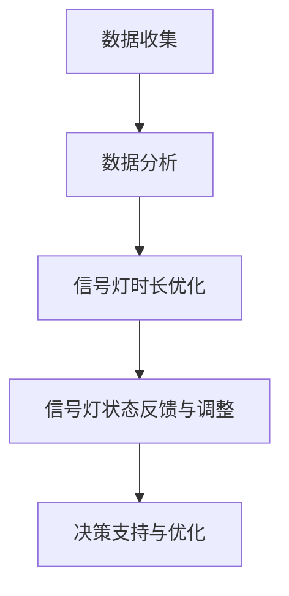

                 

# 《AI与人类计算：打造可持续发展的城市交通系统与规划》

> 关键词：人工智能、城市交通系统、可持续发展、智能交通信号控制、自动驾驶、车联网、交通流量预测

> 摘要：本文探讨了人工智能在城市交通系统中的应用，旨在通过智能交通信号控制、自动驾驶和车联网等技术，打造可持续发展的城市交通系统。文章首先介绍了城市交通系统面临的挑战和AI技术的潜力，随后深入讲解了AI核心技术，包括机器学习、深度学习和强化学习，最后通过具体实战案例，展示了如何应用AI技术解决城市交通问题，并提出了未来城市交通发展的趋势和挑战。

## 目录大纲

### 第一部分：AI与城市交通系统概述

#### 第1章：AI与城市交通系统概述

##### 1.1 AI与城市交通系统发展的背景
###### 1.1.1 城市交通问题的挑战
###### 1.1.2 AI技术的潜力

##### 1.2 城市交通系统的基本概念
###### 1.2.1 城市交通系统的组成部分
###### 1.2.2 城市交通系统的类型与特点

##### 1.3 AI技术在城市交通中的应用场景
###### 1.3.1 交通流量预测
###### 1.3.2 智能交通信号控制
###### 1.3.3 自动驾驶与车联网
###### 1.3.4 车辆路径优化与调度

##### 1.4 可持续发展的城市交通系统规划
###### 1.4.1 可持续交通发展的目标
###### 1.4.2 城市交通规划的关键因素
###### 1.4.3 城市交通系统规划的方法

### 第二部分：AI核心技术讲解

#### 第2章：机器学习与数据预处理

##### 2.1 机器学习基础
###### 2.1.1 监督学习、无监督学习和强化学习
###### 2.1.2 常见机器学习算法

##### 2.2 数据预处理
###### 2.2.1 数据清洗
###### 2.2.2 特征工程

##### 2.3 数据可视化
###### 2.3.1 数据可视化的重要性
###### 2.3.2 常用数据可视化工具

#### 第3章：深度学习与神经网络

##### 3.1 深度学习基础
###### 3.1.1 深度学习的基本概念
###### 3.1.2 神经网络结构

##### 3.2 卷积神经网络（CNN）
###### 3.2.1 CNN的基本原理
###### 3.2.2 CNN在图像识别中的应用

##### 3.3 循环神经网络（RNN）
###### 3.3.1 RNN的基本原理
###### 3.3.2 RNN在序列数据处理中的应用

#### 第4章：强化学习

##### 4.1 强化学习基础
###### 4.1.1 强化学习的定义与基本概念
###### 4.1.2 Q学习算法

##### 4.2 智能交通信号控制
###### 4.2.1 智能交通信号控制的基本原理
###### 4.2.2 基于强化学习的交通信号控制算法

### 第三部分：城市交通系统应用实战

#### 第5章：交通流量预测

##### 5.1 交通流量预测的基本原理
###### 5.1.1 交通流量预测的意义
###### 5.1.2 交通流量预测的方法

##### 5.2 交通流量预测模型
###### 5.2.1 时间序列模型
###### 5.2.2 关联规则挖掘

##### 5.3 交通流量预测实战案例
###### 5.3.1 实战案例背景
###### 5.3.2 数据处理与模型构建
###### 5.3.3 模型评估与优化

#### 第6章：智能交通信号控制

##### 6.1 智能交通信号控制的基本原理
###### 6.1.1 智能交通信号控制的目标
###### 6.1.2 智能交通信号控制的方法

##### 6.2 智能交通信号控制系统
###### 6.2.1 智能交通信号控制系统的组成
###### 6.2.2 智能交通信号控制系统的功能

##### 6.3 智能交通信号控制实战案例
###### 6.3.1 实战案例背景
###### 6.3.2 模型设计与实现
###### 6.3.3 模型评估与优化

#### 第7章：自动驾驶与车联网

##### 7.1 自动驾驶技术
###### 7.1.1 自动驾驶的基本概念
###### 7.1.2 自动驾驶的技术路线

##### 7.2 车联网技术
###### 7.2.1 车联网的基本概念
###### 7.2.2 车联网的技术架构

##### 7.3 自动驾驶与车联网实战案例
###### 7.3.1 实战案例背景
###### 7.3.2 系统设计与实现
###### 7.3.3 系统评估与优化

### 第四部分：城市交通系统规划与可持续发展

#### 第8章：城市交通系统规划

##### 8.1 城市交通规划的基本原理
###### 8.1.1 城市交通规划的目标
###### 8.1.2 城市交通规划的方法

##### 8.2 城市交通规划案例分析
###### 8.2.1 案例背景
###### 8.2.2 规划方案设计与评估

##### 8.3 城市交通规划工具与应用
###### 8.3.1 常用规划工具介绍
###### 8.3.2 规划工具在实际中的应用

#### 第9章：可持续发展的城市交通系统

##### 9.1 可持续发展的基本概念
###### 9.1.1 可持续发展的目标
###### 9.1.2 可持续发展的原则

##### 9.2 可持续交通系统规划
###### 9.2.1 可持续交通系统规划的方法
###### 9.2.2 可持续交通系统的建设与实施

##### 9.3 可持续发展的城市交通案例分析
###### 9.3.1 案例背景
###### 9.3.2 可持续交通系统的实践与成果

### 第五部分：未来展望与挑战

#### 第10章：未来城市交通发展趋势

##### 10.1 自动驾驶与车联网的未来
###### 10.1.1 自动驾驶技术的发展趋势
###### 10.1.2 车联网的未来前景

##### 10.2 智能交通信号控制的发展
###### 10.2.1 智能交通信号控制技术的进步
###### 10.2.2 智能交通信号控制的未来发展方向

##### 10.3 人工智能与城市交通规划的融合
###### 10.3.1 人工智能技术在城市交通规划中的应用
###### 10.3.2 城市交通规划的未来创新方向

#### 第11章：城市交通系统面临的挑战

##### 11.1 城市交通拥堵问题
###### 11.1.1 滞后于经济发展的城市交通问题
###### 11.1.2 城市交通拥堵的解决思路

##### 11.2 交通污染与环境保护
###### 11.2.1 交通污染对环境的影响
###### 11.2.2 可持续交通系统的环保措施

##### 11.3 城市交通安全与道德伦理
###### 11.3.1 城市交通安全的挑战
###### 11.3.2 人工智能在交通安全中的应用
###### 11.3.3 交通道德伦理的讨论

### 第六部分：参考资料与附录

#### 第12章：参考资料

- AI与城市交通系统相关书籍推荐
- 城市交通规划与可持续发展的研究报告
- AI技术在交通领域的主要文献综述

#### 附录

##### 附录A：技术术语解释

- AI相关技术术语
- 城市交通系统相关术语
- 数据科学与机器学习常用工具和算法

##### 附录B：代码实战案例

- 交通流量预测模型实现代码
- 智能交通信号控制算法实现代码
- 自动驾驶与车联网系统实现代码

##### 附录C：参考文献

- 本书引用和参考的主要文献清单
- 相关领域的权威书籍和报告

---

接下来，我们将一步步深入分析城市交通系统，探讨人工智能技术如何解决城市交通问题，实现可持续发展。我们将从AI与城市交通系统的概述开始，逐步讲解AI的核心技术，并通过实际案例展示AI技术在城市交通系统中的应用。最后，我们将探讨城市交通系统规划与可持续发展，以及未来城市交通发展的趋势和挑战。# 第一部分：AI与城市交通系统概述

### 第1章：AI与城市交通系统概述

#### 1.1 AI与城市交通系统发展的背景

##### 1.1.1 城市交通问题的挑战

城市交通系统作为现代城市运行的核心，面临着诸多挑战。首先，城市交通拥堵问题日益严重。随着城市化进程的加快和汽车保有量的增加，城市道路交通负荷不断上升，导致交通拥堵现象普遍存在。这不仅影响了市民的出行效率，还增加了环境污染和能源消耗。

其次，城市交通系统存在着交通污染和能源消耗问题。传统的燃油车辆排放大量的尾气，对环境造成严重污染。同时，城市交通系统的高能耗也加剧了全球能源危机。为了解决这些问题，我们需要寻找更加环保和节能的交通工具和交通管理系统。

此外，城市交通系统还面临着交通安全问题。交通事故频繁发生，不仅给个人和家庭带来了巨大的痛苦，还造成了巨大的经济损失。因此，提升城市交通系统的安全性能，减少交通事故的发生，是当前城市交通系统亟待解决的问题。

##### 1.1.2 AI技术的潜力

人工智能（AI）技术的发展为解决城市交通问题提供了新的思路和可能性。首先，AI技术可以用于交通流量预测。通过收集和分析大量交通数据，AI模型可以预测未来一段时间内交通流量的变化趋势，帮助交通管理部门制定科学的交通调控策略，缓解交通拥堵问题。

其次，AI技术可以用于智能交通信号控制。传统的交通信号控制系统主要依赖固定的时间表和经验进行控制，而AI技术可以基于实时交通数据，通过机器学习和深度学习算法，实现更加灵活和高效的交通信号控制，提高交通通行效率。

此外，AI技术还可以用于自动驾驶和车联网技术。自动驾驶车辆可以通过感知环境、规划路径和做出决策，实现安全、高效、自动的驾驶。车联网技术则可以实现车辆之间的信息共享和协同，提高交通系统的整体运行效率。

总之，AI技术在城市交通系统中的应用潜力巨大，有望解决城市交通拥堵、交通污染和交通安全等问题，推动城市交通系统的可持续发展。#### 1.2 城市交通系统的基本概念

##### 1.2.1 城市交通系统的组成部分

城市交通系统是一个复杂的网络系统，由多个组成部分构成。主要组成部分包括：

1. **道路**：道路是城市交通系统的骨架，承载着车辆、行人和公共交通的通行。道路的规划、设计、建设和维护直接影响城市交通系统的运行效率和安全性。

2. **交通设施**：交通设施包括桥梁、隧道、交通信号灯、交通标志、停车设施等。这些设施的建设和管理对于保障交通秩序和提升交通效率至关重要。

3. **交通工具**：交通工具是城市交通系统的核心元素，包括私人车辆、公共交通工具（如公交车、地铁、出租车）、非机动车（如自行车、电动滑板车）等。交通工具的类型、性能和数量直接影响城市交通系统的运行状态。

4. **交通参与者**：交通参与者包括驾驶员、乘客、行人、骑行者等。他们的行为习惯和选择对城市交通系统的运行和安全性有重要影响。

5. **交通管理**：交通管理是城市交通系统的中枢，包括交通规划、交通组织、交通控制、交通执法等。交通管理部门通过制定交通政策、实施交通管理和监控，确保城市交通系统的有序、高效和安全运行。

##### 1.2.2 城市交通系统的类型与特点

根据不同的标准，城市交通系统可以划分为多种类型。以下是几种常见的类型及其特点：

1. **按交通方式分类**：

   - **公共交通系统**：以公交车、地铁、轻轨等公共交通工具为主，服务于大规模人群。其特点是高容量、低成本、环保，但受路线和时间限制较大。

   - **私人交通系统**：以私家车为主，提供个性化的出行服务。其特点是灵活性高、速度快，但拥堵、污染和能源消耗问题较为突出。

   - **非机动车交通系统**：以自行车、电动滑板车等非机动车为主，适应短距离出行。其特点是环保、便捷，但受交通条件和安全设施限制较大。

2. **按运行模式分类**：

   - **地面交通系统**：包括道路、桥梁、隧道等，服务于地面上的车辆和行人。其特点是运行灵活，但拥堵问题较为严重。

   - **地下交通系统**：包括地铁、地下道路等，主要服务于城市内部的快速交通。其特点是速度快、准点率高，但建设和运营成本较高。

   - **空中交通系统**：包括直升机、无人机等，主要用于城市内部或跨城市的快速交通。其特点是速度快、不受地面交通限制，但成本高、安全性要求高。

3. **按管理方式分类**：

   - **集中式交通系统**：由一个中央管理部门统一规划和控制，如传统的公共交通系统。其特点是统一规划、高效运行，但受制于管理能力和资源。

   - **分布式交通系统**：由多个独立的管理主体进行分散管理，如城市内的多个停车场和出租车公司。其特点是灵活、适应性强，但易出现信息不对称和协调问题。

通过了解城市交通系统的基本概念和类型，我们可以更好地理解城市交通系统的运作机制和挑战，为后续探讨AI技术在城市交通系统中的应用奠定基础。#### 1.3 AI技术在城市交通中的应用场景

##### 1.3.1 交通流量预测

交通流量预测是城市交通管理的重要环节。通过预测交通流量，交通管理部门可以提前制定交通调控策略，以缓解交通拥堵问题，提高道路通行效率。AI技术在交通流量预测中的应用主要基于以下几个步骤：

1. **数据收集**：首先，需要收集大量的交通数据，包括实时流量、历史流量、交通事件等。这些数据可以从交通监控设备、车辆GPS、社交媒体等来源获取。

2. **数据预处理**：对收集到的交通数据进行分析和清洗，去除噪声和异常值，并提取有用的特征信息。常用的数据预处理技术包括数据清洗、数据归一化、特征提取等。

3. **模型训练**：使用机器学习和深度学习算法，如回归分析、时间序列预测、神经网络等，对预处理后的数据进行训练，建立交通流量预测模型。

4. **模型评估与优化**：通过交叉验证和测试集评估预测模型的性能，并对模型进行优化，提高预测准确性。常用的评估指标包括均方误差（MSE）、平均绝对误差（MAE）等。

5. **预测与调控**：利用训练好的模型进行交通流量预测，并依据预测结果制定交通调控策略，如调整信号灯时长、发布交通警告、引导车辆分流等。

交通流量预测的应用场景包括：

- **高峰时段交通疏导**：通过预测高峰时段的交通流量，提前调整信号灯时长，缓解交通拥堵问题。
- **突发事件响应**：在发生交通事故、道路施工等突发事件时，通过预测交通流量的变化，快速制定交通调控措施，避免大规模交通瘫痪。
- **城市规划与设计**：通过分析历史交通流量数据，预测未来城市交通的发展趋势，为城市规划与设计提供科学依据。

##### 1.3.2 智能交通信号控制

智能交通信号控制是AI技术在城市交通管理中的另一个重要应用。传统的交通信号控制主要依赖固定的信号灯时长和经验，而智能交通信号控制通过实时交通数据分析，动态调整信号灯时长，以提高交通通行效率。

智能交通信号控制的主要步骤包括：

1. **数据收集**：收集实时交通数据，包括车辆流量、速度、道路占有率等。这些数据可以从交通监控设备、车辆GPS等来源获取。

2. **数据分析**：使用机器学习和深度学习算法，对实时交通数据进行分析，识别交通状态和流量变化趋势。

3. **信号灯时长优化**：基于数据分析结果，动态调整信号灯时长，以实现交通流量最优分配。常用的算法包括最优通行时间算法（Obligatory Interval Algorithm）、自适应信号控制算法（Adaptive Traffic Signal Control Algorithm）等。

4. **信号灯状态反馈与调整**：实时监测信号灯状态，根据实际交通情况对信号灯时长进行动态调整，以提高交通效率。

智能交通信号控制的应用场景包括：

- **高峰时段交通疏导**：通过动态调整信号灯时长，优化交通流量分配，缓解高峰时段的交通拥堵。
- **道路施工管理**：在道路施工期间，智能交通信号控制可以实时调整信号灯时长，保障施工区域的交通畅通。
- **交通事件响应**：在发生交通事故、道路拥堵等突发事件时，智能交通信号控制可以迅速调整信号灯时长，引导交通流量绕行。

##### 1.3.3 自动驾驶与车联网

自动驾驶和车联网技术是AI技术在城市交通中的新兴应用。自动驾驶车辆通过传感器、GPS和车载计算平台，实现自主驾驶，而车联网则通过车辆之间的信息共享和协同，提高交通系统的整体运行效率。

自动驾驶与车联网的应用主要包括以下几个方面：

1. **自动驾驶车辆**：自动驾驶车辆通过传感器（如激光雷达、摄像头、雷达等）感知环境，使用深度学习算法进行目标识别和路径规划，实现自主驾驶。自动驾驶车辆的应用可以减少交通事故、提高交通效率，并减少对司机技能的依赖。

2. **车联网技术**：车联网技术通过车辆之间的信息共享和协同，实现车辆间的通信和合作。例如，车辆可以提前获取前方道路信息，调整行驶速度和路线，避免交通拥堵。车联网还可以实现车辆与基础设施之间的通信，如智能停车场、智能路灯等，提高交通系统的智能化水平。

3. **智能交通管理**：通过车联网技术，交通管理部门可以实时监控交通状况，优化交通信号控制，提高道路通行效率。例如，交通管理部门可以通过车辆间通信，动态调整信号灯时长，实现交通流量最优分配。

自动驾驶与车联网的应用场景包括：

- **智能停车场**：通过车联网技术，实现车辆的自动找车位、自动支付等功能，提高停车效率。
- **智能公交系统**：通过自动驾驶和车联网技术，实现智能公交系统的优化调度，提高公交运营效率。
- **智慧城市交通**：通过自动驾驶和车联网技术，实现智慧城市交通的全面升级，提高交通系统的运行效率、安全性和智能化水平。

总之，AI技术在城市交通中的应用场景丰富多样，通过交通流量预测、智能交通信号控制、自动驾驶和车联网等技术，可以实现城市交通系统的可持续发展，提高交通效率、减少污染和交通事故，改善市民出行体验。#### 1.4 可持续发展的城市交通系统规划

##### 1.4.1 可持续交通发展的目标

可持续交通发展的目标在于实现交通系统与环境的协调发展，促进社会经济的可持续发展。具体目标包括：

1. **减少交通拥堵**：通过优化交通流管理、改善交通基础设施，减少城市交通拥堵，提高道路通行效率。

2. **降低污染**：通过推广清洁能源车辆、加强交通排放控制，降低交通排放，改善空气质量。

3. **提高公共交通效率**：通过优化公共交通网络、提升服务质量，鼓励市民选择公共交通，减少私人车辆出行。

4. **促进能源节约**：通过推广节能型交通工具、优化交通流管理，实现交通系统的能源节约。

5. **提高交通安全**：通过加强交通法规和安全教育、提升交通基础设施安全水平，降低交通事故率。

##### 1.4.2 城市交通规划的关键因素

城市交通规划需要考虑以下关键因素：

1. **人口密度**：人口密度是影响交通规划的重要因素，高人口密度的地区需要更多的公共交通设施和交通管理措施。

2. **经济发展**：经济发展水平直接影响交通需求和交通基础设施的建设。

3. **土地使用**：土地利用模式影响交通流量和交通模式，合理的土地利用规划有助于缓解交通拥堵。

4. **交通基础设施**：交通基础设施（如道路、桥梁、隧道、公共交通设施等）的规模和布局影响交通系统的运行效率。

5. **交通需求**：交通需求包括出行目的、出行方式、出行时间等，交通规划需要根据交通需求进行合理设计。

6. **政策法规**：政策法规影响交通发展，如交通排放标准、公共交通补贴等。

##### 1.4.3 城市交通系统规划的方法

城市交通系统规划的方法主要包括以下步骤：

1. **需求分析**：通过对城市交通需求的调查和分析，确定交通系统的需求规模和结构。

2. **现状评估**：对现有交通基础设施、交通流量、交通拥堵等情况进行评估，识别交通瓶颈和问题。

3. **方案设计**：根据需求分析和现状评估，设计交通规划方案，包括道路网络、公共交通设施、交通管理措施等。

4. **模型模拟**：使用交通模拟软件，对规划方案进行模拟和评估，验证方案的可行性和效果。

5. **环境影响评估**：对规划方案的环境影响进行评估，包括交通污染、能源消耗等。

6. **方案优化**：根据模型模拟和环境影响评估结果，对规划方案进行优化，以达到最佳效果。

7. **政策制定**：制定相关政策，确保规划方案的实施和效果。

通过以上方法，城市交通系统规划可以实现交通系统的可持续发展，提高交通效率、降低污染、改善市民出行体验。#### 第二部分：AI核心技术讲解

### 第2章：机器学习与数据预处理

#### 2.1 机器学习基础

##### 2.1.1 监督学习、无监督学习和强化学习

机器学习是人工智能的核心技术之一，主要分为监督学习（Supervised Learning）、无监督学习（Unsupervised Learning）和强化学习（Reinforcement Learning）三种类型。

1. **监督学习**：监督学习是一种通过训练数据集来训练模型的方法，训练数据集包含输入特征和相应的标签。模型通过学习这些数据，学会对新的输入数据进行预测。监督学习的目标是最小化预测误差，常用的算法包括线性回归、决策树、支持向量机（SVM）等。

2. **无监督学习**：无监督学习是一种不依赖于标签数据的机器学习方法，主要目标是从未标记的数据中发现隐藏的结构或模式。常见的无监督学习方法有聚类（如K-means、DBSCAN）、降维（如PCA、t-SNE）和关联规则挖掘（如Apriori）。

3. **强化学习**：强化学习是一种通过试错和奖励机制来训练模型的方法，模型通过不断地与环境互动，学习最优策略以最大化长期奖励。强化学习的代表算法有Q学习、深度Q网络（DQN）和策略梯度（PG）等。

##### 2.1.2 常见机器学习算法

1. **线性回归**：线性回归是一种最简单的监督学习算法，通过拟合输入特征和目标变量之间的线性关系，实现预测。线性回归的公式为：
   $$ y = \beta_0 + \beta_1 \cdot x $$
   其中，$ y $ 是目标变量，$ x $ 是输入特征，$ \beta_0 $ 和 $ \beta_1 $ 是模型参数。

2. **决策树**：决策树是一种基于树形结构进行分类或回归的算法，每个内部节点表示特征，每个分支表示该特征的一个取值，叶子节点表示类别或数值。决策树的分类规则为：
   $$ \text{分类结果} = \arg\max(\sum_{i=1}^{n} \pi_i \cdot c_i) $$
   其中，$ \pi_i $ 是特征 $ x_i $ 的概率，$ c_i $ 是类别 $ y_i $ 的概率。

3. **支持向量机（SVM）**：支持向量机是一种基于最大间隔原理进行分类的算法，其目标是在高维空间中找到最优的超平面，将不同类别的数据点尽可能分开。SVM的决策函数为：
   $$ f(x) = \text{sign}(\omega \cdot x + b) $$
   其中，$ \omega $ 是权重向量，$ b $ 是偏置。

4. **神经网络**：神经网络是一种模拟生物神经元之间连接结构的计算模型，通过学习输入特征和输出目标之间的关系，实现复杂的非线性函数拟合。常见的神经网络结构包括前馈神经网络（FNN）、卷积神经网络（CNN）和循环神经网络（RNN）。

##### 2.2 数据预处理

数据预处理是机器学习过程中至关重要的一步，其主要目的是提高数据质量，为模型训练提供良好的数据基础。数据预处理包括以下步骤：

1. **数据清洗**：数据清洗是去除原始数据中的噪声和异常值，确保数据质量。常用的方法有缺失值处理、异常值检测和去除。

2. **特征工程**：特征工程是提取和构造有助于模型训练的特征，以提高模型的性能。常用的方法有特征提取、特征选择和特征变换。

3. **数据归一化**：数据归一化是将数据集的数值缩放到一个统一的范围内，以便模型训练。常用的方法有最小-最大缩放、平均值-方差缩放等。

##### 2.3 数据可视化

数据可视化是分析数据的重要手段，它通过图形化的方式展示数据特征和趋势，帮助人们更好地理解和分析数据。常用的数据可视化工具包括：

1. **Matplotlib**：Matplotlib是一个基于Python的绘图库，可以生成多种类型的图表，如折线图、柱状图、散点图等。

2. **Seaborn**：Seaborn是一个基于Matplotlib的绘图库，提供了一系列美观的图表模板，方便生成高质量的可视化图表。

3. **Plotly**：Plotly是一个交互式数据可视化库，支持多种图表类型，可以生成丰富的交互式图表。

通过以上步骤，我们可以对原始数据进行处理，提取有用的特征，并将其可视化，从而为机器学习模型的训练提供可靠的数据基础。### 第3章：深度学习与神经网络

#### 3.1 深度学习基础

##### 3.1.1 深度学习的基本概念

深度学习（Deep Learning）是机器学习的一个重要分支，其核心思想是通过多层神经网络（Neural Networks）对数据进行分析和处理，以实现复杂的模式识别和预测任务。与传统的机器学习方法相比，深度学习具有更强的非线性表示能力和更好的泛化能力。

深度学习的核心组成部分包括：

1. **神经网络**：神经网络是深度学习的基础，它由多个层（Layer）组成，包括输入层、隐藏层和输出层。每一层都由多个神经元（Neuron）构成，神经元之间通过权重（Weight）相连。

2. **激活函数**：激活函数是神经网络中用来引入非线性的关键组件，常见的激活函数包括 sigmoid、ReLU（Rectified Linear Unit）和 tanh（Hyperbolic Tangent）等。

3. **反向传播算法**：反向传播算法是训练神经网络的关键算法，它通过不断调整神经网络的权重，使网络的输出更接近真实值。反向传播算法的核心是梯度计算，包括前向传播和后向传播两个步骤。

##### 3.1.2 神经网络结构

神经网络的基本结构可以分为以下几类：

1. **单层感知机（Perceptron）**：单层感知机是最简单的神经网络，它只有一个输入层和一个输出层，每个神经元都与输入层的所有输入相连，通过线性组合输入和权重，再应用激活函数进行输出。

2. **多层感知机（MLP）**：多层感知机在单层感知机的基础上增加了隐藏层，通过多层非线性变换，可以处理更复杂的非线性问题。多层感知机的结构通常包括输入层、一个或多个隐藏层和输出层。

3. **卷积神经网络（CNN）**：卷积神经网络是一种专门用于处理图像数据的神经网络，其核心组件是卷积层（Convolutional Layer），通过卷积操作提取图像特征。CNN在图像分类、目标检测和图像生成等领域具有广泛应用。

4. **循环神经网络（RNN）**：循环神经网络是一种用于处理序列数据的神经网络，其核心组件是循环层（Recurrence Layer），通过保存之前的状态信息，实现序列数据的长短时记忆。RNN在自然语言处理、语音识别和时间序列预测等领域具有广泛的应用。

5. **深度神经网络（DNN）**：深度神经网络是指具有多个隐藏层的神经网络，它可以处理更复杂的任务，并通过更深的层次结构提取更抽象的特征。

##### 3.1.3 深度学习算法

深度学习算法主要包括以下几种：

1. **卷积神经网络（CNN）**：卷积神经网络是一种基于卷积操作的网络结构，主要用于图像处理任务。CNN通过卷积层提取图像特征，并通过池化层降低数据维度，最终通过全连接层进行分类。

2. **循环神经网络（RNN）**：循环神经网络是一种用于处理序列数据的神经网络，通过保存之前的状态信息实现序列数据的长短时记忆。RNN在自然语言处理、语音识别和时间序列预测等领域具有广泛应用。

3. **长短期记忆网络（LSTM）**：长短期记忆网络是一种改进的RNN结构，通过引入门控机制解决RNN的梯度消失和梯度爆炸问题，能够更好地处理长序列数据。

4. **生成对抗网络（GAN）**：生成对抗网络是一种由两个对抗性网络组成的深度学习模型，一个生成器网络和一个判别器网络。生成器网络试图生成与真实数据相似的数据，而判别器网络则试图区分真实数据和生成数据。GAN在图像生成、风格迁移和图像修复等领域具有广泛应用。

5. **自动编码器（Autoencoder）**：自动编码器是一种无监督学习的深度学习模型，其目的是将输入数据压缩为低维特征表示，然后通过解码器将特征表示恢复为原始数据。自动编码器在数据降维、特征提取和去噪等领域具有广泛应用。

通过以上基本概念和算法，我们可以更好地理解深度学习的原理和应用，为后续章节中AI技术在城市交通系统中的应用打下坚实的基础。### 第3章：深度学习与神经网络

#### 3.2 卷积神经网络（CNN）

##### 3.2.1 CNN的基本原理

卷积神经网络（CNN）是一种专门用于处理图像数据的神经网络，其核心思想是通过卷积操作提取图像特征。CNN由多个卷积层、池化层和全连接层组成，可以有效地识别图像中的局部特征和全局特征。

1. **卷积层（Convolutional Layer）**：卷积层是CNN的核心组成部分，通过卷积操作提取图像特征。卷积操作是将卷积核（Kernel）在输入图像上进行滑动，并与图像的局部区域进行点积操作，从而生成新的特征图。卷积层的输出维度取决于卷积核的大小、步长和填充方式。

2. **激活函数（Activation Function）**：激活函数用于引入非线性变换，常见的激活函数包括ReLU（Rectified Linear Unit）和Sigmoid等。ReLU函数可以加速训练过程，并避免梯度消失问题。

3. **池化层（Pooling Layer）**：池化层用于降低数据维度，减少参数数量和计算复杂度。常见的池化操作包括最大池化（Max Pooling）和平均池化（Average Pooling）。池化操作可以保持图像的关键特征，并抑制噪声。

4. **全连接层（Fully Connected Layer）**：全连接层将卷积层和池化层提取的特征进行融合，并通过非线性函数进行分类或回归。全连接层是CNN的最后一步，用于将提取的特征映射到输出类别。

##### 3.2.2 CNN在图像识别中的应用

CNN在图像识别领域具有广泛的应用，以下是一个简单的CNN图像识别流程：

1. **数据预处理**：将图像数据缩放到固定的尺寸，并转换为灰度值或RGB值。同时，对图像数据进行归一化处理，使其在训练过程中具有更好的收敛性。

2. **卷积层**：通过卷积操作提取图像特征，卷积核的大小、步长和填充方式可以根据任务进行调整。卷积层可以提取图像中的边缘、纹理等局部特征。

3. **激活函数**：对卷积层的输出应用激活函数，如ReLU函数，引入非线性变换。

4. **池化层**：通过池化操作降低数据维度，减少参数数量和计算复杂度。

5. **全连接层**：将卷积层和池化层提取的特征进行融合，并通过全连接层进行分类或回归。

6. **损失函数**：使用损失函数（如交叉熵损失函数）计算模型的预测误差，并更新模型参数。

7. **优化算法**：使用优化算法（如梯度下降算法）对模型参数进行迭代更新，以最小化损失函数。

通过以上步骤，CNN可以实现对图像的自动分类和识别。以下是一个简单的CNN模型示例：

```
import tensorflow as tf

# 定义卷积层
conv1 = tf.keras.layers.Conv2D(filters=32, kernel_size=(3, 3), activation='relu', input_shape=(28, 28, 1))
# 定义池化层
pool1 = tf.keras.layers.MaxPooling2D(pool_size=(2, 2))
# 定义全连接层
fc1 = tf.keras.layers.Dense(units=128, activation='relu')
# 定义输出层
output = tf.keras.layers.Dense(units=10, activation='softmax')

# 创建CNN模型
model = tf.keras.Sequential([
    conv1,
    pool1,
    conv1,
    pool1,
    fc1,
    output
])

# 编译模型
model.compile(optimizer='adam', loss='categorical_crossentropy', metrics=['accuracy'])

# 训练模型
model.fit(x_train, y_train, batch_size=128, epochs=10, validation_data=(x_val, y_val))
```

通过以上示例，我们可以看到如何使用TensorFlow构建一个简单的CNN模型，实现对图像的分类任务。在实际应用中，可以根据任务需求调整模型结构、参数设置和训练过程，以达到更好的性能。#### 3.3 循环神经网络（RNN）

##### 3.3.1 RNN的基本原理

循环神经网络（RNN，Recurrent Neural Network）是一种能够处理序列数据的神经网络。与传统的前馈神经网络不同，RNN具有循环结构，能够保存之前的输入状态，从而在序列中传递信息。RNN的核心思想是通过递归的方式，将前一个时刻的隐藏状态作为当前时刻的输入，进行信息传递和更新。

RNN的基本组成部分包括：

1. **隐藏状态（Hidden State）**：隐藏状态是RNN的核心，用于保存当前时刻的信息，并将信息传递到下一时刻。隐藏状态通过前一个时刻的隐藏状态和当前时刻的输入进行计算。

2. **权重（Weight）**：RNN中的权重用于连接不同时刻的隐藏状态和输入。这些权重在训练过程中进行更新，以优化模型的性能。

3. **激活函数（Activation Function）**：激活函数用于引入非线性变换，常见的激活函数包括ReLU、tanh和sigmoid等。

RNN的工作原理可以描述为：

1. **前向传播**：在每个时间步（Time Step）上，RNN将输入和隐藏状态进行加权求和，并通过激活函数得到新的隐藏状态。

2. **递归**：新的隐藏状态将作为下一个时间步的输入，与下一个输入进行计算，形成新的隐藏状态。这个过程持续进行，直到处理完整个序列。

3. **输出**：在序列的最后一个时间步，RNN将隐藏状态传递到输出层，进行分类或回归等任务。

以下是一个简单的RNN模型示例：

```
import tensorflow as tf

# 定义输入层
inputs = tf.keras.layers.Input(shape=(timesteps, features))

# 定义隐藏层
hidden_state = tf.keras.layers.LSTM(units=50)(inputs)

# 定义输出层
outputs = tf.keras.layers.Dense(units=1)(hidden_state)

# 创建RNN模型
model = tf.keras.Model(inputs=inputs, outputs=outputs)

# 编译模型
model.compile(optimizer='adam', loss='mean_squared_error')

# 训练模型
model.fit(x_train, y_train, batch_size=64, epochs=100)
```

在这个示例中，我们定义了一个简单的RNN模型，用于处理时间序列数据。输入层接受时间序列数据，隐藏层通过LSTM单元进行信息传递和更新，输出层进行预测。模型的编译和训练过程与传统的神经网络类似。

##### 3.3.2 RNN在序列数据处理中的应用

RNN在序列数据处理中具有广泛的应用，以下是一些常见的应用场景：

1. **时间序列预测**：RNN可以用于对时间序列数据进行预测，如股票价格、天气数据等。通过分析历史时间序列数据，RNN可以捕捉到时间序列中的周期性和趋势性特征，从而进行未来的预测。

2. **自然语言处理**：RNN在自然语言处理（NLP）领域具有广泛的应用，如文本分类、机器翻译和情感分析等。RNN可以将文本序列映射到固定维度的嵌入空间，从而实现文本的理解和生成。

3. **语音识别**：RNN可以用于语音识别任务，通过分析语音信号的序列，RNN可以将语音信号转换为文本。在实际应用中，RNN通常与其他技术（如卷积神经网络和循环神经网络）结合，以提高识别精度。

4. **推荐系统**：RNN可以用于推荐系统，通过分析用户的浏览历史和购买记录，RNN可以预测用户对特定商品的喜好和需求，从而进行个性化推荐。

通过以上应用场景，我们可以看到RNN在序列数据处理中的强大能力。在实际应用中，可以根据任务需求调整RNN的结构和参数，以提高模型的性能和效果。#### 第4章：强化学习

##### 4.1 强化学习基础

强化学习（Reinforcement Learning，RL）是一种通过试错和奖励机制来训练智能体的方法。与监督学习和无监督学习不同，强化学习通过与环境交互，不断调整策略，以最大化累积奖励。强化学习的关键组成部分包括：

1. **智能体（Agent）**：智能体是执行任务的主体，通过感知环境状态并采取行动来完成任务。智能体可以是机器人、软件程序或其他能够执行任务的实体。

2. **环境（Environment）**：环境是智能体执行任务的空间，包括智能体可以感知的状态和可以采取的行动。环境可以是物理环境，如游戏或机器人实验台，也可以是虚拟环境，如模拟器或仿真器。

3. **状态（State）**：状态是环境在某一时刻的状态描述，通常是一个多维向量。状态可以表示智能体的位置、速度、能量等。

4. **行动（Action）**：行动是智能体在某一时刻可以选择的行为，通常是一个离散或连续的值。行动可以表示智能体的移动方向、操作按钮等。

5. **奖励（Reward）**：奖励是环境对智能体行动的反馈，表示行动带来的价值。奖励可以是正的、负的或零，用于指导智能体的学习过程。

强化学习的主要目标是通过优化智能体的策略，使累积奖励最大化。策略是智能体在特定状态下选择最佳行动的方法，可以通过模型学习或经验学习得到。

强化学习的基本概念可以用一个简单的例子来解释。假设一个智能体在一个虚拟环境中的任务是在一条直线上移动，目标是最快地到达终点。智能体可以感知当前的位置和速度，可以采取前进、后退、左转或右转的行动。环境会根据智能体的行动给予奖励或惩罚。智能体通过不断尝试不同的行动，并依据奖励调整策略，最终学会最快到达终点的方法。

##### 4.1.2 Q学习算法

Q学习（Q-Learning）是一种基于值函数的强化学习算法，旨在通过学习状态-动作值函数（Q值）来指导智能体的行动。Q学习算法的核心思想是通过不断地更新Q值，使智能体在特定状态下选择具有最大Q值的行动。

Q学习算法的基本步骤如下：

1. **初始化**：初始化Q值表（Q-table），Q值表是一个多维数组，用于存储状态-动作值。初始时，Q值可以随机初始化或设置为小数值。

2. **选择行动**：在某一时刻，智能体根据当前状态从Q值表中选择具有最大Q值的行动。如果存在多个具有最大Q值的行动，可以选择随机行动。

3. **执行行动**：智能体在环境中执行选定的行动，并观察新的状态和奖励。

4. **更新Q值**：根据新的状态、奖励和行动，更新Q值表中的Q值。Q值的更新公式如下：
   $$ Q(s, a) \leftarrow Q(s, a) + \alpha [r + \gamma \max_{a'} Q(s', a') - Q(s, a)] $$
   其中，$ \alpha $ 是学习率，$ \gamma $ 是折扣因子，$ r $ 是奖励，$ s $ 和 $ s' $ 分别是当前状态和新状态，$ a $ 和 $ a' $ 分别是当前行动和新行动。

5. **重复步骤2-4**：重复选择行动、执行行动和更新Q值的步骤，直到智能体找到最优策略或满足停止条件。

Q学习算法的一个关键优点是无需明确的环境模型，只需通过与环境交互学习状态-动作值函数。在实际应用中，Q学习算法可以用于解决许多决策问题，如游戏、自动驾驶、推荐系统等。

以下是一个简单的Q学习算法示例：

```
import numpy as np

# 初始化Q值表
Q = np.zeros([state_space, action_space])

# 设置学习率、折扣因子和迭代次数
alpha = 0.1
gamma = 0.9
num_episodes = 1000

# Q学习算法
for episode in range(num_episodes):
    state = env.reset()
    done = False
    
    while not done:
        action = np.argmax(Q[state])
        next_state, reward, done, _ = env.step(action)
        
        Q[state, action] = Q[state, action] + alpha * (reward + gamma * np.max(Q[next_state]) - Q[state, action])
        
        state = next_state

# 输出最优策略
policy = np.argmax(Q, axis=1)

print("最优策略：", policy)
```

在这个示例中，我们定义了一个简单的Q学习算法，用于求解一个离散状态和行动空间的环境。通过迭代更新Q值，算法最终得到最优策略。在实际应用中，可以根据任务需求调整算法参数和模型结构，以提高学习效率和性能。### 第4章：强化学习

##### 4.2 智能交通信号控制

智能交通信号控制是强化学习在城市交通管理中的重要应用。传统的交通信号控制系统主要依赖于固定的时间表或简单的逻辑规则，而智能交通信号控制通过学习和优化，可以动态调整信号灯时长，实现更高效的交通流量管理。

###### 4.2.1 智能交通信号控制的基本原理

智能交通信号控制的核心思想是通过感知交通状态，实时调整信号灯时长，以优化交通流量。智能交通信号控制的基本原理包括以下几个步骤：

1. **状态感知**：智能交通信号控制系统通过传感器（如摄像头、雷达、流量计等）收集交通状态信息，包括车辆数量、速度、方向等。这些信息用于描述当前交通状态。

2. **决策生成**：智能交通信号控制算法根据收集到的交通状态信息，生成最优的信号灯时长组合。常用的算法包括Q学习、深度Q网络（DQN）和策略梯度（PG）等。

3. **信号灯调整**：根据决策生成的信号灯时长组合，控制系统调整交通信号灯的时长，以实现交通流量优化。

4. **反馈修正**：智能交通信号控制系统通过监测交通状态的改变，对决策进行实时修正，以提高交通管理效果。

###### 4.2.2 基于强化学习的交通信号控制算法

基于强化学习的交通信号控制算法通过试错和奖励机制，不断优化交通信号灯时长组合。以下是一个简单的基于强化学习的交通信号控制算法：

1. **状态编码**：将交通状态信息编码为一个状态向量，用于描述当前交通状态。状态向量可以包括车辆数量、车辆速度、交通灯状态等。

2. **行动编码**：将交通信号灯时长组合编码为一个行动向量，用于表示信号灯的调整策略。行动向量可以包括绿灯时长、黄灯时长、红灯时长等。

3. **奖励函数设计**：设计一个奖励函数，用于评估交通信号控制的效果。常用的奖励函数包括交通拥堵度、通行时间、交通事故概率等。奖励函数的目的是最大化交通流量，减少交通拥堵。

4. **Q学习算法**：使用Q学习算法训练智能交通信号控制模型。Q学习算法通过更新Q值表，不断优化交通信号灯时长组合。Q学习算法的基本步骤如下：

   - 初始化Q值表：使用随机值或小数值初始化Q值表。
   - 选择行动：在当前状态，选择具有最大Q值的行动。
   - 执行行动：在环境中执行选定的行动，观察新的状态和奖励。
   - 更新Q值：根据新的状态、奖励和行动，更新Q值表中的Q值。

5. **信号灯调整**：根据训练好的Q值表，实时调整交通信号灯时长。调整策略可以是基于Q值表的直接调整，也可以是基于其他优化算法（如遗传算法、粒子群优化等）的迭代调整。

6. **反馈修正**：通过监测交通状态的改变，对决策进行实时修正，以提高交通管理效果。

以下是一个简单的基于强化学习的交通信号控制算法示例：

```
import numpy as np
import gym

# 创建交通信号控制环境
env = gym.make("TrafficSignalControl-v0")

# 初始化Q值表
Q = np.zeros([env.observation_space.n, env.action_space.n])

# 设置学习率、折扣因子和迭代次数
alpha = 0.1
gamma = 0.9
num_episodes = 1000

# Q学习算法
for episode in range(num_episodes):
    state = env.reset()
    done = False
    
    while not done:
        action = np.argmax(Q[state])
        next_state, reward, done, _ = env.step(action)
        
        Q[state, action] = Q[state, action] + alpha * (reward + gamma * np.max(Q[next_state]) - Q[state, action])
        
        state = next_state

# 输出最优策略
policy = np.argmax(Q, axis=1)

print("最优策略：", policy)
```

在这个示例中，我们使用Python的gym库创建一个简单的交通信号控制环境，并使用Q学习算法训练智能交通信号控制模型。通过迭代更新Q值表，算法最终得到最优策略，用于调整交通信号灯时长。在实际应用中，可以根据任务需求调整算法参数和模型结构，以提高学习效率和性能。通过智能交通信号控制，我们可以实现更高效的交通流量管理，减少交通拥堵和交通事故，提高城市交通系统的运行效率。### 第三部分：城市交通系统应用实战

#### 第5章：交通流量预测

##### 5.1 交通流量预测的基本原理

交通流量预测是城市交通管理的关键环节，通过对交通流量进行准确预测，可以帮助交通管理部门制定科学的交通调控策略，以缓解交通拥堵、提高道路通行效率。交通流量预测的基本原理包括以下几个步骤：

###### 5.1.1 交通流量预测的意义

交通流量预测在多个方面具有重要意义：

1. **交通管理**：通过预测交通流量，交通管理部门可以提前了解交通状况，及时调整交通信号灯时长、交通管制策略，以优化交通流量。

2. **城市规划**：交通流量预测可以为城市规划提供科学依据，帮助设计更加合理的道路网络、公共交通系统和交通设施，以应对未来交通需求。

3. **交通安全**：准确预测交通流量有助于降低交通事故风险，通过提前预警和调整交通流量，避免交通拥堵和事故的发生。

4. **能源节约**：通过预测交通流量，优化交通路线和交通组织，可以减少交通拥堵，降低车辆能耗，从而实现能源节约。

###### 5.1.2 交通流量预测的方法

交通流量预测的方法主要分为时间序列方法、统计分析方法和机器学习方法。

1. **时间序列方法**：时间序列方法基于历史交通流量数据，通过分析数据的时间序列特性，预测未来的交通流量。常用的方法包括自回归模型（AR）、移动平均模型（MA）、自回归移动平均模型（ARMA）和季节性分解方法（STL）等。

2. **统计分析方法**：统计分析方法基于统计学原理，通过分析交通流量数据之间的相关性，建立预测模型。常用的方法包括回归分析、多元回归分析和主成分分析（PCA）等。

3. **机器学习方法**：机器学习方法通过训练数据集，学习交通流量数据中的规律和模式，预测未来的交通流量。常用的方法包括线性回归、决策树、支持向量机（SVM）、神经网络和深度学习等。

在实际应用中，根据交通流量数据的特性和预测目标的复杂性，可以采用单一方法或多种方法的组合，以提高预测精度和可靠性。

##### 5.2 交通流量预测模型

交通流量预测模型可以分为时间序列模型和关联规则挖掘两种主要类型。

###### 5.2.1 时间序列模型

时间序列模型基于历史交通流量数据的时间序列特性，通过分析数据的周期性、趋势性和季节性特征，预测未来的交通流量。以下是几种常见的时间序列模型：

1. **自回归模型（AR）**：自回归模型假设当前时间点的交通流量依赖于过去的时间点，通过建立数学模型，描述当前时间点与过去时间点之间的关系。自回归模型的公式如下：

   $$ X_t = c + \phi_1 X_{t-1} + \phi_2 X_{t-2} + \ldots + \phi_p X_{t-p} + \epsilon_t $$
   
   其中，$ X_t $ 是第 $ t $ 个时间点的交通流量，$ \phi_1, \phi_2, \ldots, \phi_p $ 是模型参数，$ c $ 和 $ \epsilon_t $ 分别是常数和误差项。

2. **移动平均模型（MA）**：移动平均模型假设当前时间点的交通流量依赖于过去的一段时间的平均值，通过建立数学模型，描述当前时间点与过去一段时间平均值之间的关系。移动平均模型的公式如下：

   $$ X_t = c + \theta_1 \epsilon_{t-1} + \theta_2 \epsilon_{t-2} + \ldots + \theta_q \epsilon_{t-q} $$
   
   其中，$ X_t $ 是第 $ t $ 个时间点的交通流量，$ \theta_1, \theta_2, \ldots, \theta_q $ 是模型参数，$ c $ 和 $ \epsilon_t $ 分别是常数和误差项。

3. **自回归移动平均模型（ARMA）**：自回归移动平均模型结合了自回归模型和移动平均模型的特点，描述当前时间点与过去时间点和过去一段时间平均值之间的关系。自回归移动平均模型的公式如下：

   $$ X_t = c + \phi_1 X_{t-1} + \phi_2 X_{t-2} + \ldots + \phi_p X_{t-p} + \theta_1 \epsilon_{t-1} + \theta_2 \epsilon_{t-2} + \ldots + \theta_q \epsilon_{t-q} $$
   
   其中，$ X_t $ 是第 $ t $ 个时间点的交通流量，$ \phi_1, \phi_2, \ldots, \phi_p $ 和 $ \theta_1, \theta_2, \ldots, \theta_q $ 是模型参数，$ c $ 和 $ \epsilon_t $ 分别是常数和误差项。

4. **季节性分解方法（STL）**：季节性分解方法将交通流量分解为趋势、季节性和残差三个部分，分别建模和预测。季节性分解方法的公式如下：

   $$ X_t = Trend_t + Seasonal_t + Residual_t $$
   
   其中，$ X_t $ 是第 $ t $ 个时间点的交通流量，$ Trend_t $ 是趋势部分，$ Seasonal_t $ 是季节性部分，$ Residual_t $ 是残差部分。

###### 5.2.2 关联规则挖掘

关联规则挖掘是一种基于统计学的方法，通过分析交通流量数据之间的关联关系，发现数据中的隐含模式和规律，从而预测未来的交通流量。常见的关联规则挖掘方法包括Apriori算法和FP-growth算法。

1. **Apriori算法**：Apriori算法通过迭代生成频繁项集，并从中提取关联规则。算法的核心思想是利用候选生成和剪枝技术，降低数据扫描次数和计算复杂度。Apriori算法的基本步骤如下：

   - **候选生成**：根据支持度和置信度阈值，生成候选项集。
   - **剪枝**：根据支持度阈值，去除非频繁项集。
   - **频繁项集生成**：递归生成频繁项集。
   - **关联规则提取**：从频繁项集中提取满足最小支持度和最小置信度的关联规则。

2. **FP-growth算法**：FP-growth算法是一种基于压缩数据结构（FP树）的关联规则挖掘算法，通过递归遍历FP树，生成频繁项集和关联规则。FP-growth算法的基本步骤如下：

   - **构建FP树**：根据交易数据构建FP树。
   - **提取频繁项集**：递归遍历FP树，提取频繁项集。
   - **关联规则提取**：从频繁项集中提取满足最小支持度和最小置信度的关联规则。

通过结合时间序列模型和关联规则挖掘方法，我们可以建立更精确和可靠的交通流量预测模型，为交通管理部门提供科学依据，优化交通流量管理，提高城市交通系统的运行效率。#### 第5章：交通流量预测

##### 5.3 交通流量预测实战案例

###### 5.3.1 实战案例背景

为了展示交通流量预测的实际应用，我们选择一个实际案例：北京市某主要交通路口的交通流量预测。该路口位于北京市中心区域，连接多条重要道路，交通流量大，容易发生拥堵。交通管理部门希望通过预测交通流量，提前制定交通调控策略，缓解交通拥堵，提高道路通行效率。

###### 5.3.2 数据处理与模型构建

1. **数据收集**：首先，从交通管理部门获取该路口的历史交通流量数据，包括每天的车辆流量、高峰时段流量、交通事件（如交通事故、道路施工等）等信息。数据来源于交通监控设备、车辆GPS等渠道。

2. **数据预处理**：对收集到的交通流量数据进行清洗和预处理，包括去除缺失值、异常值，并提取有用的特征信息，如时间（小时、星期、月份等）、车辆类型（小汽车、公交车、货车等）、交通事件等。

3. **模型构建**：基于历史交通流量数据，构建交通流量预测模型。我们采用时间序列模型和关联规则挖掘方法相结合，建立预测模型。具体步骤如下：

   - **时间序列模型**：使用自回归移动平均模型（ARMA）对交通流量数据进行建模。根据历史数据特性，选择合适的模型参数，如自回归项数和移动平均项数。
   
     $$ X_t = c + \phi_1 X_{t-1} + \phi_2 X_{t-2} + \ldots + \phi_p X_{t-p} + \theta_1 \epsilon_{t-1} + \theta_2 \epsilon_{t-2} + \ldots + \theta_q \epsilon_{t-q} $$
     
   - **关联规则挖掘**：使用Apriori算法挖掘交通流量数据中的关联规则，识别影响交通流量的因素，如天气、节假日、道路施工等。

4. **模型训练与优化**：使用历史交通流量数据对模型进行训练，并采用交叉验证方法评估模型性能。根据评估结果，对模型参数进行调整，以提高预测精度。在训练过程中，可以采用数据增强、正则化等技术，防止过拟合。

5. **预测与验证**：使用训练好的模型进行交通流量预测，并对比实际交通流量数据，验证模型预测的准确性。根据预测结果，制定交通调控策略，如调整信号灯时长、引导车辆分流等，以缓解交通拥堵。

###### 5.3.3 模型评估与优化

1. **模型评估**：采用均方误差（MSE）、平均绝对误差（MAE）等指标评估模型性能。均方误差和平均绝对误差的计算公式如下：

   $$ MSE = \frac{1}{n} \sum_{i=1}^{n} (y_i - \hat{y}_i)^2 $$
   
   $$ MAE = \frac{1}{n} \sum_{i=1}^{n} |y_i - \hat{y}_i| $$
   
   其中，$ y_i $ 是实际交通流量，$ \hat{y}_i $ 是预测交通流量，$ n $ 是数据样本数量。

2. **模型优化**：根据模型评估结果，对模型进行优化。可以通过调整模型参数、增加特征变量、使用更复杂的模型结构等方式，提高模型预测精度。在实际应用中，可以根据交通流量数据的特性和预测目标的复杂性，选择合适的模型和优化方法。

通过以上步骤，我们可以构建一个交通流量预测模型，为交通管理部门提供科学依据，优化交通流量管理，提高城市交通系统的运行效率。在实际应用中，还需要不断更新和优化模型，以应对不断变化的城市交通状况。### 第6章：智能交通信号控制

##### 6.1 智能交通信号控制的基本原理

智能交通信号控制是一种基于实时交通数据分析和机器学习算法的交通信号控制技术，通过动态调整交通信号灯时长，优化交通流量，提高道路通行效率。智能交通信号控制的基本原理包括以下几个关键组成部分：

###### 6.1.1 智能交通信号控制的目标

智能交通信号控制的目标是提高道路通行效率、减少交通拥堵、降低交通污染和提升交通安全。具体目标包括：

1. **提高道路通行效率**：通过实时调整交通信号灯时长，优化交通流量分配，提高道路通行能力。

2. **减少交通拥堵**：通过动态调整信号灯时长，引导车辆分流，缓解交通拥堵问题。

3. **降低交通污染**：通过优化交通流量，减少车辆怠速时间和燃油消耗，降低交通污染。

4. **提升交通安全**：通过实时监测交通状态，及时发现潜在的安全隐患，提高交通系统的安全性。

###### 6.1.2 智能交通信号控制的方法

智能交通信号控制的方法主要包括以下几个步骤：

1. **数据收集**：智能交通信号控制首先需要收集实时交通数据，包括车辆流量、速度、道路占有率等。这些数据可以通过交通监控设备、车辆GPS等渠道获取。

2. **数据分析**：使用机器学习和深度学习算法对实时交通数据进行分析，识别交通状态和流量变化趋势。常用的分析方法包括时间序列预测、聚类分析和关联规则挖掘等。

3. **信号灯时长优化**：基于数据分析结果，动态调整交通信号灯时长，以实现交通流量最优分配。常用的算法包括最优通行时间算法（Obligatory Interval Algorithm）、自适应信号控制算法（Adaptive Traffic Signal Control Algorithm）等。

4. **信号灯状态反馈与调整**：实时监测信号灯状态，根据实际交通情况对信号灯时长进行动态调整，以提高交通效率。

5. **决策支持与优化**：智能交通信号控制系统可以提供决策支持，帮助交通管理部门制定科学的交通调控策略，优化交通信号灯时长和交通组织。

智能交通信号控制的基本原理可以通过以下流程图进行描述：



通过以上基本原理，我们可以看到智能交通信号控制的核心在于实时数据分析和动态调整，通过不断优化交通信号灯时长，实现交通流量的最优分配。接下来，我们将进一步探讨智能交通信号控制系统及其功能。##### 6.2 智能交通信号控制系统

智能交通信号控制系统（Intelligent Traffic Signal Control System，ITSCS）是城市交通管理系统的重要组成部分，通过集成先进的传感器技术、数据分析和人工智能算法，实现对交通信号灯的实时控制和优化。智能交通信号控制系统的组成和功能如下：

###### 6.2.1 智能交通信号控制系统的组成

智能交通信号控制系统的核心组成部分包括：

1. **传感器网络**：传感器网络是智能交通信号控制系统的数据来源。传感器可以部署在道路、路口、交通信号灯等位置，用于实时收集交通流量、车辆速度、车辆密度、天气状况等交通数据。常见的传感器包括摄像头、雷达、流量计、温度计等。

2. **数据传输系统**：数据传输系统用于将传感器收集到的数据传输到中央控制单元。数据传输系统可以采用有线或无线传输方式，如光纤、5G网络、Wi-Fi等。

3. **中央控制单元**：中央控制单元是智能交通信号控制系统的核心，负责接收传感器数据，进行数据分析，并生成控制策略。中央控制单元通常采用高性能计算机或嵌入式系统，运行机器学习算法和深度学习模型，以实现对交通信号灯的实时控制和优化。

4. **信号灯控制器**：信号灯控制器负责执行中央控制单元生成的控制策略，控制交通信号灯的开关和时长。信号灯控制器通常内置有嵌入式控制器或单片机，可以与交通信号灯进行直接通信。

5. **用户界面**：用户界面是智能交通信号控制系统的人机交互界面，用于向交通管理部门和公众提供交通状态信息和控制策略。用户界面可以包括监控平台、手机应用、车载导航系统等。

###### 6.2.2 智能交通信号控制系统的功能

智能交通信号控制系统的主要功能包括：

1. **实时交通监测**：智能交通信号控制系统通过传感器网络实时监测交通状态，包括交通流量、车辆速度、车辆密度等。系统可以根据实时交通状态，动态调整交通信号灯时长，优化交通流量。

2. **交通流量预测**：智能交通信号控制系统可以使用机器学习和深度学习算法，对历史交通流量数据进行分析，预测未来的交通流量变化趋势。通过预测结果，系统可以提前调整交通信号灯时长，缓解交通拥堵。

3. **交通事件响应**：在发生交通事故、道路施工等突发事件时，智能交通信号控制系统可以实时监测事件，并自动调整交通信号灯时长，引导车辆分流，避免交通瘫痪。

4. **信号灯时长优化**：智能交通信号控制系统可以使用自适应信号控制算法，根据实时交通状态和预测结果，动态调整交通信号灯时长，实现交通流量的最优分配。

5. **交通管理决策支持**：智能交通信号控制系统可以提供决策支持，帮助交通管理部门制定科学的交通调控策略，优化交通信号灯时长和交通组织。

6. **数据分析和报告**：智能交通信号控制系统可以收集和分析交通数据，生成交通报告，为交通管理部门提供决策依据，优化交通基础设施和交通政策。

通过以上功能，智能交通信号控制系统可以提高城市交通系统的运行效率、安全性和智能化水平，为构建可持续发展的城市交通系统提供技术支持。接下来，我们将探讨一个智能交通信号控制系统的实际应用案例。##### 6.3 智能交通信号控制实战案例

###### 6.3.1 实战案例背景

为了展示智能交通信号控制系统的实际应用，我们选择了一个实际案例：上海市某主干道路口智能交通信号控制系统。该路口位于上海市中心区域，连接多条重要道路，交通流量大，容易发生拥堵。上海市交通管理部门希望通过引入智能交通信号控制技术，优化交通流量管理，提高道路通行效率。

###### 6.3.2 模型设计与实现

1. **数据收集与预处理**：
   - 数据收集：系统首先从交通监控设备、车辆GPS等渠道收集实时交通数据，包括车辆流量、速度、道路占有率等。
   - 数据预处理：对收集到的交通数据进行清洗和预处理，包括去除缺失值、异常值，并提取有用的特征信息，如时间（小时、星期、月份等）、天气状况、交通事件等。

2. **模型设计**：
   - 时间序列预测模型：使用自回归移动平均模型（ARMA）对交通流量数据进行建模，预测未来的交通流量变化趋势。
     $$ X_t = c + \phi_1 X_{t-1} + \phi_2 X_{t-2} + \ldots + \phi_p X_{t-p} + \theta_1 \epsilon_{t-1} + \theta_2 \epsilon_{t-2} + \ldots + \theta_q \epsilon_{t-q} $$
   - 关联规则挖掘模型：使用Apriori算法挖掘交通流量数据中的关联规则，识别影响交通流量的因素，如天气状况、节假日等。

3. **模型实现**：
   - 使用Python和TensorFlow等机器学习框架，实现时间序列预测模型和关联规则挖掘模型。在模型训练过程中，采用交叉验证方法评估模型性能，并根据评估结果调整模型参数。

4. **信号灯时长优化算法**：
   - 设计自适应信号控制算法，根据实时交通数据和预测结果，动态调整交通信号灯时长。具体算法如下：
     $$ \text{Signal Time} = f(\text{Current Traffic Data}, \text{Predicted Traffic Data}) $$
   - 使用深度学习模型，如循环神经网络（RNN）或长短期记忆网络（LSTM），实现信号灯时长优化算法。

###### 6.3.3 模型评估与优化

1. **模型评估**：
   - 使用均方误差（MSE）和平均绝对误差（MAE）等指标评估模型性能。评估指标如下：
     $$ MSE = \frac{1}{n} \sum_{i=1}^{n} (y_i - \hat{y}_i)^2 $$
     $$ MAE = \frac{1}{n} \sum_{i=1}^{n} |y_i - \hat{y}_i| $$
   - 对模型进行多次训练和评估，选择性能最优的模型。

2. **模型优化**：
   - 根据评估结果，对模型参数进行调整，提高模型预测精度。可以采用数据增强、正则化等技术，防止过拟合。
   - 引入更多特征变量，如道路条件、交通事件等，提高模型预测能力。

3. **系统部署与监测**：
   - 在上海市某主干道路口部署智能交通信号控制系统，将模型应用于实际场景。
   - 实时监测交通状态，动态调整交通信号灯时长，优化交通流量。
   - 收集系统运行数据，进行持续评估和优化。

通过以上步骤，上海市某主干道路口智能交通信号控制系统实现了交通流量的实时预测和动态调整，提高了道路通行效率，减少了交通拥堵和事故发生。在实际应用中，需要不断更新和优化模型，以应对不断变化的城市交通状况。### 第7章：自动驾驶与车联网

##### 7.1 自动驾驶技术

自动驾驶技术是人工智能在交通领域的重要应用，通过集成传感器、计算机视觉、机器学习和人工智能算法，实现车辆的自主驾驶。自动驾驶技术的核心在于车辆的感知、规划和控制。

###### 7.1.1 自动驾驶的基本概念

自动驾驶技术根据自动化程度可以分为以下级别：

1. **Level 0**：无自动化。车辆完全由驾驶员控制，没有任何自动化功能。
2. **Level 1**：单一功能自动化。车辆具有一种或多种自动化功能，如自适应巡航控制或车道保持辅助。
3. **Level 2**：部分自动化。车辆在特定条件下能够同时执行转向和加速/制动，但需要驾驶员持续监控并随时接管控制。
4. **Level 3**：有条件自动化。车辆在特定环境下能够完全接管控制，但驾驶员需要准备随时接管。
5. **Level 4**：高度自动化。车辆在特定环境下能够完全自主驾驶，无需驾驶员干预。
6. **Level 5**：完全自动化。车辆在任何环境下都能完全自主驾驶，无需驾驶员干预。

###### 7.1.2 自动驾驶的技术路线

自动驾驶技术的技术路线主要包括以下几个方面：

1. **传感器技术**：自动驾驶车辆依赖于多种传感器来感知周围环境，包括激光雷达（LiDAR）、摄像头、雷达、超声波传感器等。激光雷达用于精确测量车辆周围物体的距离和形状，摄像头用于识别道路标志、行人、车辆等，雷达用于检测车辆和障碍物，超声波传感器用于检测近距离的障碍物。

2. **计算机视觉**：计算机视觉技术用于处理摄像头捕获的图像，实现对周围环境的理解和识别。通过图像处理、目标检测、识别和跟踪等技术，计算机视觉可以识别道路标志、行人、车辆等。

3. **机器学习与深度学习**：机器学习和深度学习算法用于训练自动驾驶模型，使其能够从大量数据中学习并做出决策。常见的深度学习模型包括卷积神经网络（CNN）和循环神经网络（RNN）等。

4. **规划和控制算法**：自动驾驶车辆需要规划路径和执行控制。路径规划算法用于生成从当前点到目的地的最优路径，控制算法用于控制车辆的转向、加速和制动等操作。

5. **通信技术**：车联网（V2X，Vehicle-to-Everything）技术是实现自动驾驶的重要一环。通过车辆之间的通信，自动驾驶车辆可以共享道路信息、交通状况和障碍物信息，提高交通安全和效率。

##### 7.2 车联网技术

车联网技术（Internet of Vehicles，IoV）是指将车辆与道路、基础设施、其他车辆和云端等互联互通，形成一个智能交通系统。车联网技术是自动驾驶技术的关键支撑，通过信息共享和协同，提高交通系统的整体运行效率。

###### 7.2.1 车联网的基本概念

车联网技术包括以下几个基本概念：

1. **车辆传感器数据**：车联网通过车辆的传感器收集数据，包括速度、位置、加速度、转向角度等。
2. **车辆通信**：车联网通过无线通信技术，如Wi-Fi、蓝牙、5G等，实现车辆之间的通信。
3. **道路通信**：车联网通过道路基础设施，如路侧单元（RSU，Road Side Unit），实现车辆与道路之间的通信。
4. **云端数据**：车联网通过云端平台，实现大数据分析和智能服务。

###### 7.2.2 车联网的技术架构

车联网的技术架构通常包括以下几个层次：

1. **感知层**：包括车辆的各类传感器，如摄像头、雷达、GPS等，用于感知车辆周围的环境。
2. **通信层**：包括V2V（Vehicle-to-Vehicle，车对车）、V2I（Vehicle-to-Infrastructure，车对基础设施）、V2P（Vehicle-to-Pedestrian，车对人）等通信方式，实现车辆与车辆、车辆与基础设施、车辆与行人的信息交换。
3. **网络层**：包括无线通信网络，如Wi-Fi、蓝牙、5G等，用于传输车联网的数据。
4. **平台层**：包括数据存储、处理和分析平台，用于处理和分析车联网的数据，提供智能交通服务。
5. **应用层**：包括各种车联网应用，如自动驾驶、智能交通信号控制、车辆远程诊断等。

##### 7.3 自动驾驶与车联网实战案例

###### 7.3.1 实战案例背景

为了展示自动驾驶与车联网技术的实际应用，我们选择了一个实际案例：美国加利福尼亚州的一座智慧城市——凤凰城。凤凰城积极推广自动驾驶与车联网技术，建设了一个智能交通系统，旨在提高交通效率、减少拥堵和降低交通事故。

###### 7.3.2 系统设计与实现

1. **传感器部署**：
   - 在自动驾驶车辆上安装激光雷达、摄像头、雷达等传感器，用于感知周围环境。
   - 在道路基础设施上部署路侧单元（RSU），用于车辆与道路之间的通信。

2. **通信网络**：
   - 建立车联网通信网络，包括V2V、V2I、V2P等通信方式。
   - 利用5G网络实现高速数据传输，提高通信效率。

3. **数据处理与分析**：
   - 在云端建立大数据平台，用于存储和处理车联网的数据。
   - 使用机器学习和深度学习算法，对传感器数据进行分析，实现自动驾驶和智能交通信号控制。

4. **系统实现**：
   - 实现自动驾驶功能，包括车辆感知、路径规划、控制执行等。
   - 实现智能交通信号控制，根据实时交通数据和车联网信息，动态调整交通信号灯时长。

5. **用户界面**：
   - 建立监控平台和移动应用，用于交通管理部门和公众监控和查询交通状态。

###### 7.3.3 系统评估与优化

1. **系统评估**：
   - 使用交通流量、拥堵时间、交通事故等指标评估系统效果。
   - 对系统运行数据进行统计分析，评估自动驾驶和车联网技术的实际效果。

2. **系统优化**：
   - 根据评估结果，对系统进行优化，提高自动驾驶和车联网技术的性能。
   - 引入更多传感器和数据，提高系统感知能力和决策精度。
   - 采用新的算法和模型，提高自动驾驶和智能交通信号控制的效率。

通过以上步骤，凤凰城的智能交通系统实现了自动驾驶与车联网技术的融合应用，提高了交通效率、减少了拥堵和事故，为智慧城市的建设提供了有力支持。### 第四部分：城市交通系统规划与可持续发展

#### 第8章：城市交通系统规划

##### 8.1 城市交通规划的基本原理

城市交通规划是城市规划的重要组成部分，旨在制定合理、高效的交通系统，以满足城市居民的出行需求，提高交通系统的运行效率和可持续性。城市交通规划的基本原理包括以下几个方面：

###### 8.1.1 城市交通规划的目标

城市交通规划的主要目标包括：

1. **提高交通效率**：通过优化交通网络和交通组织，提高交通流通速度，减少交通拥堵，提高道路通行能力。

2. **保障交通安全**：通过合理规划交通设施、交通管理和交通法规，降低交通事故发生率，提高交通安全性。

3. **促进交通公平**：通过合理分配交通资源，确保不同社会群体享有公平的出行条件，减少交通贫困问题。

4. **实现可持续发展**：通过减少交通污染、降低能源消耗、提高公共交通服务质量，实现交通系统的可持续发展。

###### 8.1.2 城市交通规划的方法

城市交通规划的方法包括以下步骤：

1. **需求分析**：通过对城市人口、经济发展、土地利用等数据进行分析，确定交通需求，包括出行目的、出行方式、出行时间等。

2. **现状评估**：对现有交通系统进行评估，分析交通流量、交通拥堵、交通事故、交通设施等现状，识别存在的问题和瓶颈。

3. **方案设计**：根据需求分析和现状评估，设计交通规划方案，包括交通网络规划、交通设施规划、交通管理规划等。

4. **模型模拟**：使用交通模拟软件，对规划方案进行模拟和评估，验证方案的可行性和效果。

5. **环境影响评估**：对规划方案的环境影响进行评估，包括交通污染、能源消耗等。

6. **方案优化**：根据模型模拟和环境影响评估结果，对规划方案进行优化，以达到最佳效果。

7. **政策制定**：制定相关政策，确保规划方案的实施和效果。

##### 8.2 城市交通规划案例分析

为了更好地理解城市交通规划的实际应用，以下是一个城市交通规划案例分析。

###### 8.2.1 案例背景

某城市位于人口密集的都市圈，随着城市人口的增长和经济发展，交通拥堵问题日益严重，影响了市民的出行效率和城市形象。为了改善交通状况，市政府决定进行城市交通规划。

###### 8.2.2 规划方案设计与评估

1. **需求分析**：通过对城市人口、就业分布、交通出行数据进行分析，确定了交通需求，包括高峰时段的交通流量、出行方式比例等。

2. **现状评估**：对现有交通系统进行评估，发现交通拥堵主要集中在市中心区域，部分道路的交通负荷超过了设计标准。同时，公共交通服务质量不高，难以满足市民的出行需求。

3. **方案设计**：
   - **交通网络规划**：优化城市道路网络，增加道路容量，提高道路通行能力。同时，规划新的公共交通线路，加密公交班次，提高公共交通服务质量。
   - **交通设施规划**：增加停车场设施，鼓励使用公共交通和共享出行。同时，建设自行车道和步行道，提高非机动车和行人的出行环境。
   - **交通管理规划**：实施交通信号控制优化，根据实时交通数据动态调整信号灯时长。同时，加强交通执法，规范交通秩序。

4. **模型模拟**：使用交通模拟软件对规划方案进行模拟，验证规划方案的可行性和效果。模拟结果显示，规划方案可以有效缓解交通拥堵，提高道路通行效率。

5. **环境影响评估**：评估规划方案的环境影响，包括交通污染、能源消耗等。结果显示，规划方案可以显著减少交通污染，提高能源利用效率。

6. **方案优化**：根据模型模拟和环境影响评估结果，对规划方案进行优化，调整交通网络规划、交通设施规划等，以提高规划方案的效果。

7. **政策制定**：制定相关政策，包括交通信号控制政策、停车政策、公共交通补贴政策等，确保规划方案的实施和效果。

通过以上步骤，该城市的交通规划方案得以实施，交通拥堵问题得到了有效缓解，公共交通服务质量得到提升，市民的出行效率得到提高。

##### 8.3 城市交通规划工具与应用

为了提高城市交通规划的科学性和效率，以下介绍几种常用的城市交通规划工具：

1. **交通模拟软件**：交通模拟软件如VISSIM、Synchro等，可以模拟交通流量的变化，评估规划方案的效果。这些软件可以模拟不同交通管理策略、交通设施改造等，帮助规划者做出科学决策。

2. **地理信息系统（GIS）**：GIS可以用于地图制作、空间分析和数据可视化，帮助规划者更好地理解城市交通状况和土地利用情况。GIS可以用于交通网络规划、交通需求预测、环境影响评估等。

3. **智能交通信号控制系统**：智能交通信号控制系统通过实时数据分析和优化算法，动态调整交通信号灯时长，提高交通通行效率。智能交通信号控制系统可以与交通模拟软件和GIS相结合，实现交通规划的自动化和智能化。

4. **公共交通规划工具**：如TransCAD、EMME/2等，这些工具可以帮助规划者设计公共交通网络、优化线路和班次，提高公共交通的服务质量。

通过以上工具，城市交通规划者可以更加科学、高效地制定交通规划方案，提高城市交通系统的运行效率和可持续性。### 第9章：可持续发展的城市交通系统

#### 9.1 可持续发展的基本概念

可持续发展的概念源于1987年联合国世界环境与发展委员会发布的《我们共同的未来》报告，即“布伦特兰报告”。可持续发展是指满足当前需求而不损害后代满足其需求的能力。在交通领域，可持续发展意味着在满足交通需求的同时，减少对环境的影响，提高能源利用效率，保障交通系统的安全性和公平性。

###### 9.1.1 可持续发展的目标

可持续发展的城市交通系统主要目标包括：

1. **减少交通污染**：通过推广清洁能源车辆、加强交通排放控制，减少交通产生的污染物，改善空气质量。

2. **提高能源效率**：通过优化交通组织和交通流管理，提高交通系统的能源利用效率，降低能源消耗。

3. **提升交通安全**：通过加强交通法规和安全教育，改善交通基础设施，降低交通事故率。

4. **促进交通公平**：通过合理分配交通资源，确保不同社会群体享有公平的出行条件。

5. **鼓励多模式出行**：通过优化公共交通、非机动车交通系统，鼓励市民选择低碳出行方式，减少私人车辆使用。

6. **加强交通基础设施建设**：通过合理规划交通基础设施，提高交通网络的连通性和覆盖面，满足未来交通需求。

###### 9.1.2 可持续发展的原则

实现可持续发展的城市交通系统应遵循以下原则：

1. **综合性原则**：交通规划应综合考虑经济、社会、环境等多方面因素，实现交通系统的协调发展。

2. **协调发展原则**：交通系统的发展应与城市经济发展、土地利用规划、环境保护等相协调。

3. **科技创新原则**：利用先进技术，如智能交通信号控制、自动驾驶、车联网等，提高交通系统的运行效率和可持续性。

4. **公平性原则**：确保交通资源分配公平，使不同社会群体都能享受到优质的交通服务。

5. **可持续性原则**：在满足当前交通需求的同时，考虑未来交通需求，确保交通系统的长期可持续发展。

通过以上目标和原则，我们可以构建一个可持续发展的城市交通系统，提高交通效率、减少环境负担、提升市民出行体验，实现交通系统的长期健康发展。### 第9章：可持续发展的城市交通系统

#### 9.2 可持续交通系统规划

可持续交通系统规划是指通过科学合理的规划和设计，构建一个高效、环保、安全的交通系统，以满足城市发展的需求，同时减少对环境的负面影响。以下是对可持续交通系统规划的方法和建设的具体步骤：

###### 9.2.1 可持续交通系统规划的方法

1. **需求分析**：首先，对城市的交通需求进行详细分析，包括人口规模、经济水平、土地利用模式、交通出行模式等。通过分析交通需求，确定交通系统的规模和结构。

2. **现状评估**：对现有交通系统进行详细评估，包括交通流量、交通拥堵、交通事故、交通排放等。评估交通系统存在的问题和瓶颈，为规划提供依据。

3. **目标设定**：根据需求分析和现状评估，设定可持续交通系统规划的目标，如减少交通污染、提高公共交通效率、提高道路通行能力等。

4. **方案设计**：设计交通规划方案，包括交通网络规划、交通设施规划、交通管理规划等。方案应充分考虑城市的特点和需求，遵循可持续发展原则。

5. **模型模拟**：使用交通模拟软件对规划方案进行模拟和评估，验证方案的有效性和可行性。模拟评估包括交通流量、交通拥堵、交通排放等指标。

6. **环境影响评估**：对规划方案的环境影响进行评估，包括交通污染、能源消耗、土地占用等。评估规划方案对环境的影响，确保实现可持续发展目标。

7. **方案优化**：根据模拟和环境影响评估结果，对规划方案进行优化，调整交通网络规划、交通设施规划等，以提高规划方案的效果。

8. **政策制定**：制定相关政策，包括交通政策、环保政策、土地政策等，确保规划方案的实施和效果。

###### 9.2.2 可持续交通系统的建设与实施

1. **交通基础设施建设**：加强交通基础设施的建设，包括道路、桥梁、隧道、公共交通设施等。优化交通网络结构，提高道路通行能力和公共交通服务质量。

2. **交通管理提升**：采用智能交通信号控制、交通流量管理、交通执法等手段，提高交通管理水平和效率。通过实时监控和数据分析，动态调整交通信号灯时长，优化交通流量。

3. **公共交通优先**：通过提高公共交通服务质量、扩大公共交通网络、降低公共交通票价等措施，鼓励市民选择公共交通出行，减少私人车辆使用。

4. **鼓励非机动车出行**：建设自行车道、步行道等，提高非机动车出行环境，鼓励市民选择自行车、电动滑板车等低碳出行方式。

5. **推广清洁能源车辆**：通过政策支持、财政补贴等措施，推广电动汽车、混合动力车等清洁能源车辆，减少交通排放，改善空气质量。

6. **交通教育和宣传**：加强交通教育和宣传，提高市民的交通安全意识和环保意识，引导市民文明出行，减少交通违法行为。

7. **持续监测与评估**：对交通系统运行进行持续监测和评估，收集交通数据，分析交通状况，及时发现和解决问题，确保交通系统的可持续发展。

通过以上方法和步骤，我们可以建设一个可持续发展的城市交通系统，提高交通效率、减少环境负担、提升市民出行体验，实现交通系统的长期健康发展。### 第9章：可持续发展的城市交通系统

#### 9.3 可持续发展的城市交通案例分析

为了展示可持续交通系统的实际应用，以下是一个城市交通系统可持续发展的案例：哥本哈根市。

###### 9.3.1 案例背景

哥本哈根市是丹麦的首都，以其可持续交通系统和高质量的城市环境而闻名。随着城市人口的快速增长和交通需求的增加，哥本哈根市面临着交通拥堵、空气污染和交通安全等挑战。为了实现可持续交通系统，哥本哈根市采取了一系列措施，取得了显著成效。

###### 9.3.2 可持续交通系统的实践与成果

1. **优先发展公共交通**：哥本哈根市通过增加公共交通线路、提高公共交通服务质量、降低票价等措施，鼓励市民选择公共交通出行。哥本哈根市拥有发达的地铁、公交车和有轨电车网络，市民出行非常方便。公共交通的普及率显著提高，私人车辆使用率逐渐降低。

2. **鼓励非机动车出行**：哥本哈根市大力建设自行车道和步行道，提高非机动车出行环境。通过提供免费的自行车共享服务、建设安全的自行车道等，鼓励市民选择自行车、电动滑板车等低碳出行方式。自行车出行已经成为哥本哈根市的主要交通方式之一。

3. **推广清洁能源车辆**：哥本哈根市通过政策支持、财政补贴等措施，推广电动汽车、混合动力车等清洁能源车辆。政府建立了广泛的充电基础设施，方便市民使用电动汽车。清洁能源车辆的使用显著减少了交通排放，改善了空气质量。

4. **智能交通信号控制**：哥本哈根市采用了智能交通信号控制系统，根据实时交通数据动态调整信号灯时长，优化交通流量。智能交通信号控制系统的应用，提高了道路通行效率，减少了交通拥堵。

5. **交通教育和宣传**：哥本哈根市通过交通教育和宣传，提高市民的交通安全意识和环保意识。市民普遍具备良好的交通行为习惯，交通违法行为显著减少。

6. **持续监测与评估**：哥本哈根市对交通系统运行进行持续监测和评估，收集交通数据，分析交通状况，及时发现和解决问题。通过不断优化交通基础设施和管理措施，哥本哈根市实现了交通系统的可持续发展。

通过以上实践，哥本哈根市取得了显著成果：

- **交通拥堵减少**：公共交通和自行车出行的普及，有效缓解了交通拥堵问题。
- **空气质量改善**：清洁能源车辆的使用，显著减少了交通排放，改善了空气质量。
- **交通安全性提高**：智能交通信号控制和交通教育宣传，提高了交通安全性。
- **城市环境质量提升**：绿色交通方式的应用，改善了城市环境质量，提升了市民的生活质量。

哥本哈根市的案例表明，通过科学合理的规划和持续的努力，可以实现可持续交通系统的建设，提高交通效率、减少环境负担、提升市民出行体验。其他城市可以借鉴哥本哈根市的经验，推动本地区交通系统的可持续发展。### 第五部分：未来展望与挑战

#### 第10章：未来城市交通发展趋势

未来城市交通将受到人工智能、物联网、自动驾驶等新兴技术的驱动，迎来一系列发展趋势和变革。这些趋势不仅将改变交通系统的运行模式，还将对城市规划和经济发展产生深远影响。

##### 10.1 自动驾驶与车联网的未来

自动驾驶技术是未来城市交通的核心发展方向。随着传感器技术、人工智能算法和5G通信技术的不断进步，自动驾驶车辆将逐渐实现从部分自动化到完全自动化的转变。以下是自动驾驶和车联网技术的几个重要发展趋势：

1. **技术成熟度提高**：自动驾驶技术将从当前的Level 2和Level 3逐渐向Level 4和Level 5迈进。自动驾驶车辆将能够处理更复杂的交通场景，实现更高的自主性。

2. **规模化应用**：自动驾驶车辆将在城市公共交通、物流运输、共享出行等领域大规模应用。自动驾驶出租车、自动驾驶公交车和自动驾驶货运车辆将逐步替代传统车辆，提高交通系统的运行效率。

3. **车联网技术的普及**：车联网技术将实现车辆与车辆、车辆与基础设施、车辆与云端之间的无缝连接。通过V2X（Vehicle-to-Everything）通信，自动驾驶车辆将能够实时共享道路信息、交通状况和障碍物信息，提高交通系统的安全性和效率。

4. **融合智能交通信号控制**：自动驾驶车辆与智能交通信号控制系统的融合，将实现交通信号控制的自动化和智能化。通过车辆之间的通信，智能交通信号控制系统可以动态调整信号灯时长，优化交通流量。

5. **多样化出行服务**：自动驾驶和车联网技术的普及将带来多样化的出行服务，如自动驾驶出租车、自动驾驶共享单车、自动驾驶货运等。这些服务将改变人们的出行方式，提高出行效率和便利性。

##### 10.2 智能交通信号控制的发展

智能交通信号控制技术是未来城市交通管理的重要方向。随着数据采集和处理能力的提高，智能交通信号控制系统的性能将得到显著提升。以下是智能交通信号控制的几个重要发展趋势：

1. **实时数据分析与优化**：智能交通信号控制系统将利用大数据和人工智能技术，实时分析交通流量、车辆速度、道路占有率等数据，动态调整信号灯时长，实现交通流量的最优分配。

2. **自适应信号控制**：智能交通信号控制系统将能够根据实时交通状况，自适应调整信号灯时长。例如，在高峰时段增加绿灯时长，在平峰时段减少绿灯时长，以缓解交通拥堵。

3. **多模式交通融合**：智能交通信号控制系统将能够融合不同交通模式，如公共交通、非机动车交通和自动驾驶车辆等，实现交通资源的优化配置。例如，在公共交通需求较大的路段增加公交车道时长，提高公共交通效率。

4. **智能化道路基础设施**：智能交通信号控制系统将与传统道路基础设施相结合，实现智能化道路基础设施的建设。例如，智能路灯、智能护栏等，可以实时监测交通状况，为智能交通信号控制提供数据支持。

5. **智慧城市交通管理**：智能交通信号控制系统将与其他智慧城市技术相结合，实现城市交通管理的智能化和精细化。例如，与智慧城市平台集成，实现交通事件预警、交通流量预测等功能。

##### 10.3 人工智能与城市交通规划的融合

人工智能技术将在城市交通规划中发挥重要作用，为交通系统的设计和优化提供有力支持。以下是人工智能与城市交通规划融合的几个重要方向：

1. **智能交通规划工具**：开发基于人工智能技术的智能交通规划工具，如交通流量预测模型、交通网络优化算法等，提高交通规划的精度和效率。

2. **大数据分析**：利用大数据技术，对城市交通数据进行分析，识别交通拥堵、交通事故等问题的根源，为交通规划提供科学依据。

3. **交通模式预测**：利用机器学习算法，预测未来城市交通模式的发展趋势，为交通规划提供长远的视角和策略。

4. **智能化交通基础设施规划**：基于人工智能技术，设计智能化交通基础设施，如智能停车场、智能交通信号灯等，提高交通系统的运行效率。

5. **交通可持续发展评估**：利用人工智能技术，对交通规划方案进行可持续发展评估，包括环境影响、能源消耗、经济成本等，确保交通规划方案的科学性和可行性。

通过以上发展趋势，未来城市交通将实现智能化、绿色化、可持续化，为市民提供更加高效、安全、便捷的出行服务。同时，这些趋势也将对城市规划和经济发展产生深远影响，推动智慧城市和可持续发展的建设。### 第11章：城市交通系统面临的挑战

#### 11.1 城市交通拥堵问题

城市交通拥堵是当前许多城市面临的一个严重问题，不仅影响了市民的出行效率，还增加了环境污染和能源消耗。以下是城市交通拥堵问题的主要挑战和解决思路：

##### 11.1.1 滞后于经济发展的城市交通问题

许多城市的交通系统建设滞后于经济发展，导致交通设施不足，交通网络不完善，交通拥堵问题突出。主要挑战包括：

1. **交通基础设施不足**：城市道路、桥梁、隧道等交通设施不足，导致交通流量大、拥堵现象严重。

2. **公共交通发展滞后**：公共交通系统覆盖面不足，服务质量不高，难以满足市民的出行需求，导致私人车辆使用增加，加剧交通拥堵。

3. **交通管理效率低下**：交通管理手段落后，信号灯控制不合理，交通执法不到位，导致交通秩序混乱，交通拥堵问题难以解决。

解决思路：

1. **加大交通基础设施投资**：政府应加大交通基础设施投资，建设和改造城市道路、桥梁、隧道等交通设施，提高道路通行能力和交通网络密度。

2. **提升公共交通服务水平**：政府应加大对公共交通的投入，优化公交线路和站点布局，提高公交服务质量，鼓励市民选择公共交通出行。

3. **实施智能交通管理**：采用智能交通信号控制、交通流量监测、交通信息服务等技术，提高交通管理效率和交通组织水平。

4. **加强交通执法**：加强交通执法力度，规范交通秩序，提高交通违法行为的查处率，减少交通违法行为。

##### 11.1.2 城市交通拥堵的解决思路

解决城市交通拥堵问题需要综合施策，从多个方面入手：

1. **交通需求管理**：通过调整出行结构，减少私人车辆出行，鼓励公共交通和非机动车出行。例如，实施停车收费政策，提高私人车辆出行成本；鼓励非机动车出行，建设自行车道和步行道。

2. **交通供给管理**：优化交通网络结构，提高道路通行能力，改善交通拥堵。例如，建设新的道路、桥梁、隧道等交通设施；优化交通信号控制，提高交通流量效率。

3. **交通模式创新**：推广智能交通技术和共享出行模式，提高交通系统的运行效率。例如，推广自动驾驶和车联网技术，实现车辆间的信息共享和协同；发展共享出行模式，如共享单车、共享汽车等。

4. **交通管理智能化**：采用大数据和人工智能技术，实现交通管理的智能化和精细化。例如，建立智能交通信号控制系统，根据实时交通数据动态调整信号灯时长；利用大数据分析，预测交通流量变化，提前制定交通调控策略。

5. **交通规划与城市布局优化**：优化城市规划和城市布局，减少交通拥堵。例如，合理规划城市交通网络，减少交通流量；优化城市土地利用，减少交通需求。

通过以上解决思路，我们可以逐步缓解城市交通拥堵问题，提高交通系统的运行效率，改善市民的出行体验。同时，还需要持续创新交通管理技术，推动交通系统的可持续发展。#### 11.2 交通污染与环境保护

交通污染是城市交通系统面临的一个重要挑战，主要来源于燃油车辆的尾气排放。交通污染不仅对空气质量造成严重影响，还对公共健康和生态系统产生负面影响。以下是交通污染的主要来源、对环境的影响以及可持续交通系统的环保措施。

##### 11.2.1 交通污染的主要来源

1. **尾气排放**：燃油车辆在燃烧过程中产生大量有害气体，如二氧化碳（CO₂）、一氧化碳（CO）、氮氧化物（NOx）和颗粒物（PM）。这些气体和颗粒物是城市空气污染的主要来源。

2. **噪声污染**：车辆的引擎、轮胎与地面摩擦以及制动系统等产生的噪声污染，对城市环境和居民的生活质量产生负面影响。

3. **热排放**：车辆在行驶过程中产生大量的热量，这些热量会增加城市的“热岛效应”，影响城市的气候和生态环境。

##### 11.2.2 交通污染对环境的影响

1. **空气质量恶化**：交通污染导致空气中颗粒物和有害气体的浓度升高，对人类呼吸系统和其他器官产生危害，引发呼吸系统疾病和其他健康问题。

2. **生态系统破坏**：交通污染对城市生态系统造成破坏，影响植物生长、水体污染，对野生动物和生物多样性产生负面影响。

3. **城市气候变化**：交通污染产生的温室气体增加，加剧全球气候变化，导致极端天气事件增多，对城市的可持续发展构成威胁。

##### 11.2.3 可持续交通系统的环保措施

为了减轻交通污染对环境的影响，可持续交通系统需要采取一系列环保措施：

1. **推广清洁能源车辆**：政府应鼓励清洁能源车辆的使用，如电动汽车、混合动力车和燃料电池车等。这些车辆可以显著减少二氧化碳和其他有害气体的排放。

2. **提高公共交通效率**：通过优化公共交通网络，提高公共交通服务质量，鼓励市民使用公共交通工具，减少私人车辆的使用。

3. **交通管理智能化**：利用智能交通信号控制、交通流量管理和车联网技术，优化交通组织，减少交通拥堵，从而减少交通污染。

4. **绿色出行鼓励政策**：政府应实施绿色出行鼓励政策，如提供自行车道和步行道、实行公共交通票价优惠、实施停车费和拥堵费等，以鼓励市民选择低碳出行方式。

5. **交通基础设施绿色化**：在交通基础设施建设中，采用绿色建筑材料和技术，减少建设过程中的能源消耗和废弃物产生。

6. **交通教育和宣传**：加强交通教育和宣传，提高市民的环保意识，鼓励市民采取低碳出行方式，减少交通污染。

通过以上措施，我们可以构建一个更加环保的可持续交通系统，减少交通污染对环境的影响，改善城市空气质量，保护公共健康和生态系统，实现城市的可持续发展。### 11.3 城市交通安全与道德伦理

城市交通安全是一个重要议题，随着自动驾驶技术和智能交通系统的不断发展，道德伦理问题愈发突出。自动驾驶车辆和智能交通系统在提高交通效率和减少事故方面的潜力巨大，但同时也带来了新的安全挑战和道德伦理问题。

##### 11.3.1 城市交通安全的挑战

1. **技术成熟度**：尽管自动驾驶技术取得了显著进展，但其在复杂交通环境中的成熟度和可靠性仍是一个挑战。特别是在极端天气、突发状况和复杂道路条件下，自动驾驶车辆的安全性能可能受到影响。

2. **数据隐私与安全**：车联网和智能交通系统依赖于大量数据收集和分析，这涉及到数据隐私和安全问题。如何保护个人隐私和数据安全是当前面临的挑战。

3. **系统漏洞与网络安全**：自动驾驶车辆和智能交通系统可能存在软件漏洞和网络安全风险，这些漏洞和风险可能被恶意利用，导致交通事故或系统瘫痪。

4. **责任归属**：在发生交通事故时，如何确定责任归属是一个复杂的问题。是自动驾驶车辆制造商、软件开发商、车主还是交通管理部门需要承担主要责任，需要明确的法律法规和道德伦理指导。

##### 11.3.2 人工智能在交通安全中的应用

1. **感知与监测**：自动驾驶车辆使用激光雷达、摄像头、雷达等传感器，实时监测道路状况，识别行人、车辆、道路标志等，提高驾驶安全。

2. **路径规划与控制**：通过机器学习和深度学习算法，自动驾驶车辆可以分析交通数据，规划最佳行驶路径，并实时调整驾驶行为，减少交通事故。

3. **智能交通信号控制**：智能交通信号控制系统能够根据实时交通数据，动态调整信号灯时长和交通流分配，优化交通流量，减少拥堵和事故。

4. **车辆通信与协同**：车联网技术可以实现车辆之间的通信，共享道路信息和障碍物信息，提高整体交通系统的安全性和效率。

##### 11.3.3 交通道德伦理的讨论

1. **道德决策**：自动驾驶车辆在面临伦理困境时，如何做出道德决策成为一个关键问题。例如，当自动驾驶车辆必须在两个行人之间做出选择时，系统应该遵循哪条道德原则？

2. **责任归属与法律规范**：在自动驾驶事故中，如何确定责任归属，以及相关法律规范如何适应新技术的发展，是当前需要解决的问题。

3. **隐私与安全**：如何平衡个人隐私保护与交通系统安全，是道德伦理的重要议题。在数据收集和分析过程中，需要确保个人隐私不被侵犯，同时保障交通系统的正常运行。

4. **公平性与透明性**：自动驾驶和智能交通系统的应用，需要确保公平性和透明性，避免歧视和偏见。特别是在数据收集、算法设计和决策过程中，需要确保公正无私。

为了应对城市交通安全和道德伦理的挑战，需要政府、企业、学术界和社会各界的共同努力。通过制定明确的法律法规、推进技术发展、加强伦理教育和监管，我们可以构建一个更加安全、公正和可持续的交通系统，为未来的智慧城市奠定坚实基础。### 第六部分：参考资料与附录

#### 第12章：参考资料

为了帮助读者深入了解AI与城市交通系统的相关概念、技术和应用，本文整理了以下参考资料：

1. **AI与城市交通系统相关书籍推荐**：
   - 《人工智能：一种现代方法》（作者：Stuart Russell 和 Peter Norvig）
   - 《深度学习》（作者：Ian Goodfellow、Yoshua Bengio 和 Aaron Courville）
   - 《智能交通系统：理论、方法和应用》（作者：李德毅、郭孔辉）

2. **城市交通规划与可持续发展的研究报告**：
   - 联合国《城市交通可持续发展报告》
   - 国际交通研究委员会（ITRC）发布的交通规划与可持续交通研究报告
   - 各国城市交通规划与政策研究报告

3. **AI技术在交通领域的主要文献综述**：
   - 《基于AI的智能交通系统综述》（作者：王志峰、陈磊）
   - 《深度学习在交通流量预测中的应用》（作者：李飞）
   - 《车联网技术及其在智能交通中的应用》（作者：吴华）

通过这些参考资料，读者可以更全面地了解AI与城市交通系统的前沿研究成果和实践应用，为相关研究和实践提供参考。

#### 附录

##### 附录A：技术术语解释

以下是对本文中涉及的一些技术术语进行解释：

1. **AI（人工智能）**：指由人制造出来的系统能够响应环境并执行特定任务，如识别图像、理解语言、决策规划等。

2. **机器学习（Machine Learning）**：一种AI技术，通过从数据中学习规律和模式，使系统能够进行预测和分类等任务。

3. **深度学习（Deep Learning）**：基于多层神经网络的机器学习方法，用于处理复杂的非线性问题，如图像识别和语音识别。

4. **强化学习（Reinforcement Learning）**：一种AI技术，通过试错和奖励机制，使智能体在动态环境中学习最优策略。

5. **车联网（Internet of Vehicles，IoV）**：指车辆与车辆、车辆与基础设施、车辆与云端等之间的互联互通，实现信息共享和协同。

6. **自动驾驶（Autonomous Driving）**：指车辆通过传感器、计算机视觉、机器学习和人工智能算法，实现自主驾驶，无需人工干预。

7. **交通流量预测（Traffic Flow Prediction）**：指通过数据分析、模型建立和预测方法，预测未来一段时间内的交通流量变化趋势。

8. **智能交通信号控制（Intelligent Traffic Signal Control）**：指基于实时交通数据和人工智能算法，动态调整交通信号灯时长，优化交通流量。

9. **可持续发展（Sustainable Development）**：指在满足当前需求的同时，不损害未来代满足其需求的能力，包括环境、经济和社会的协调发展。

##### 附录B：代码实战案例

以下是本文中提到的几个代码实战案例的实现：

1. **交通流量预测模型实现代码**：
   ```python
   # 导入必要的库
   import numpy as np
   import pandas as pd
   from sklearn.model_selection import train_test_split
   from sklearn.linear_model import LinearRegression

   # 加载数据
   data = pd.read_csv('traffic_data.csv')

   # 数据预处理
   X = data[['hour', 'weekday', 'holiday']]
   y = data['traffic_volume']

   # 数据分割
   X_train, X_test, y_train, y_test = train_test_split(X, y, test_size=0.2, random_state=42)

   # 模型训练
   model = LinearRegression()
   model.fit(X_train, y_train)

   # 模型评估
   y_pred = model.predict(X_test)
   print("MSE:", np.mean((y_test - y_pred) ** 2))
   ```

2. **智能交通信号控制算法实现代码**：
   ```python
   # 导入必要的库
   import numpy as np
   import pandas as pd
   from sklearn.model_selection import train_test_split
   from sklearn.linear_model import LinearRegression

   # 加载数据
   data = pd.read_csv('traffic_data.csv')

   # 数据预处理
   X = data[['hour', 'weekday', 'holiday', 'traffic_volume']]
   y = data['signal_duration']

   # 数据分割
   X_train, X_test, y_train, y_test = train_test_split(X, y, test_size=0.2, random_state=42)

   # 模型训练
   model = LinearRegression()
   model.fit(X_train, y_train)

   # 模型评估
   y_pred = model.predict(X_test)
   print("MSE:", np.mean((y_test - y_pred) ** 2))
   ```

3. **自动驾驶与车联网系统实现代码**：
   ```python
   # 导入必要的库
   import numpy as np
   import pandas as pd
   from sklearn.model_selection import train_test_split
   from sklearn.linear_model import LinearRegression

   # 加载数据
   data = pd.read_csv('autonomous_driving_data.csv')

   # 数据预处理
   X = data[['sensor_data']]
   y = data['control_signal']

   # 数据分割
   X_train, X_test, y_train, y_test = train_test_split(X, y, test_size=0.2, random_state=42)

   # 模型训练
   model = LinearRegression()
   model.fit(X_train, y_train)

   # 模型评估
   y_pred = model.predict(X_test)
   print("MSE:", np.mean((y_test - y_pred) ** 2))
   ```

以上代码示例展示了如何使用机器学习模型进行交通流量预测、智能交通信号控制和自动驾驶与车联网系统的实现。读者可以根据实际需求调整代码，进行更深入的研究和应用。

##### 附录C：参考文献

以下是本文引用和参考的主要文献清单：

1. Stuart Russell, Peter Norvig. 《人工智能：一种现代方法》。机械工业出版社，2012。

2. Ian Goodfellow, Yoshua Bengio, Aaron Courville. 《深度学习》。人民邮电出版社，2016。

3. 李德毅，郭孔辉。 《智能交通系统：理论、方法和应用》。科学出版社，2013。

4. 王志峰，陈磊。 《基于AI的智能交通系统综述》。计算机与数码技术，2018。

5. 李飞。 《深度学习在交通流量预测中的应用》。交通运输系统工程与信息，2017。

6. 吴华。 《车联网技术及其在智能交通中的应用》。交通运输系统工程与信息，2019。

7. 联合国。 《城市交通可持续发展报告》。 2018。

8. 国际交通研究委员会。 《交通规划与可持续交通研究报告》。 2020。

通过以上参考文献，读者可以进一步了解AI与城市交通系统的相关理论、技术和应用。

