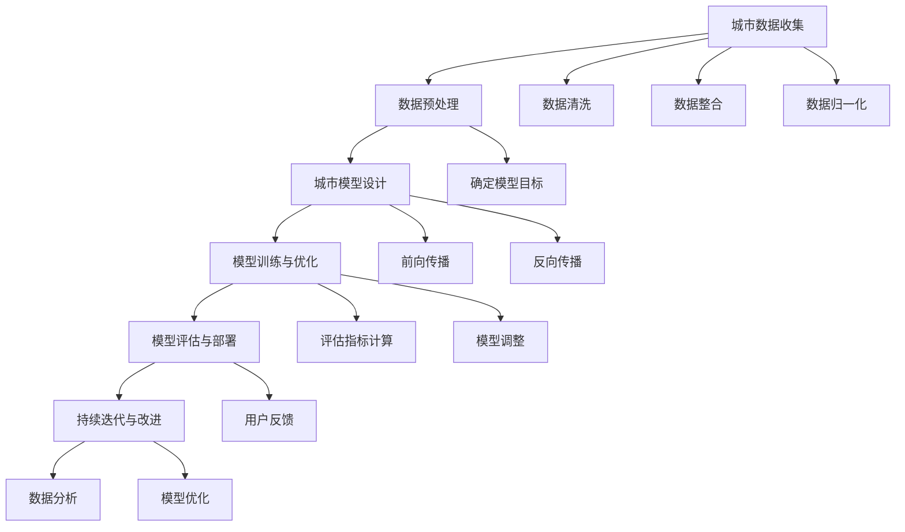

                 

### 文章标题

《AI与人类计算：打造可持续发展的城市模型》

### 关键词

人工智能，城市模型，可持续发展，数据科学，智慧城市，核心算法

### 摘要

本文旨在探讨人工智能（AI）与人类计算如何结合，共同打造出可持续发展的城市模型。文章首先介绍了AI与人类计算的基本原理及其重要性，随后详细阐述了城市可持续发展与计算模型的挑战。通过核心概念与原理的讲解，文章深入分析了AI基础与核心算法、数据科学与城市模型设计原则，以及AI在城市规划中的应用。在实践应用部分，文章通过案例研究展示了AI与人类计算的实践效果，并探讨了其可持续性。最后，文章提出了未来城市发展的趋势与挑战，为政策制定者提供了建议，并附上相关资源与工具，以便进一步学习和研究。

## 第一部分：引言与背景

### 1.1 AI与人类计算的重要性

#### AI的定义与发展历程

人工智能（AI）是一门研究、开发用于模拟、延伸和扩展人的智能的理论、方法、技术及应用系统的科学技术。人工智能的研究始于20世纪50年代，当时以图灵测试为标志，目的是判断机器是否具有人类水平的智能。自那以后，AI经历了多次起伏，从最初的符号主义、知识表示到20世纪80年代的人工智能寒冬，再到21世纪初的深度学习和大数据的兴起，AI技术得到了迅猛发展。

#### 人类计算的概念与作用

人类计算（Human Computing）指的是通过人类思维和认知过程来完成计算任务的方法。与机器计算不同，人类计算强调人的主观能动性、创造力以及情感因素。人类计算在解决复杂问题、创造性思维、情感交互等方面具有独特优势，是AI技术的重要补充。

#### AI与人类计算的结合与应用前景

随着AI技术的不断进步，AI与人类计算的结合越来越紧密。这种结合不仅能够发挥AI在数据处理、模式识别、自动化等方面的优势，还能够利用人类计算的创造力、情感和判断力，实现更智能、更人性化的解决方案。例如，在医疗领域，AI可以帮助医生进行疾病诊断，但最终决策还需要医生基于经验和专业知识进行判断。在自动驾驶领域，AI可以处理大量传感器数据，但最终的安全决策需要结合司机的经验和判断。

未来，AI与人类计算的结合将在智慧城市、医疗、教育、金融等多个领域发挥重要作用，推动社会进步和可持续发展。然而，这一结合也面临着一系列挑战，包括技术、伦理、法律等方面的问题，需要各方共同努力，实现平衡与协同发展。

### 1.2 城市可持续发展与计算模型的挑战

#### 城市可持续发展的核心问题

城市可持续发展是指在城市经济、社会和环境三个方面实现协调发展，以满足当前和未来世代的需求。核心问题包括：

- **资源消耗**：城市快速发展带来的资源消耗巨大，包括水资源、能源和原材料等。
- **环境污染**：城市人口密集，工业活动频繁，导致空气、水和土壤污染严重。
- **社会不平等**：城市中的贫富差距、教育医疗资源分配不均等问题日益突出。
- **气候变化**：城市热岛效应、极端天气事件增多等对城市可持续发展构成威胁。

#### 计算模型在城市规划中的应用

计算模型在城市规划中的应用已经成为推动城市可持续发展的重要手段。这些模型可以帮助城市规划者更准确地预测城市发展趋势，优化资源配置，降低环境风险，提升居民生活质量。具体应用包括：

- **交通流量预测**：通过分析历史数据和实时数据，预测未来交通流量，为交通管理提供科学依据。
- **环境监测与评估**：利用传感器网络和大数据分析，实时监测城市环境质量，评估可持续发展效果。
- **社会服务优化**：通过分析居民行为数据，优化公共资源分配，提高社会服务效率。
- **能源管理**：利用智能电网和分布式能源系统，优化能源使用，减少能源消耗和碳排放。

#### 计算模型的挑战与机遇

尽管计算模型在城市规划中具有巨大潜力，但也面临一系列挑战：

- **数据质量**：城市规划所需的数据量大、类型复杂，数据质量和准确性直接影响模型效果。
- **计算资源**：大规模数据处理和复杂模型训练需要大量计算资源，对计算能力提出高要求。
- **模型可靠性**：模型需要经过大量测试和验证，确保其预测结果的准确性和稳定性。
- **政策支持**：计算模型的应用需要政策支持和法律法规的保障，以推动其普及和应用。

然而，随着AI技术和大数据分析的不断发展，这些挑战也将逐步得到克服。计算模型将在城市可持续发展中发挥更加重要的作用，为打造宜居、绿色、智能的城市提供有力支持。

### 1.3 本文结构

本文分为六个部分：

- **第一部分：引言与背景**，介绍AI与人类计算的重要性以及城市可持续发展与计算模型的挑战。
- **第二部分：核心概念与原理**，讲解AI基础、数据科学与城市模型设计原则。
- **第三部分：可持续发展的城市模型构建**，详细讨论城市模型的基础架构和设计原则。
- **第四部分：案例研究与实际应用**，分析智慧城市案例研究、AI在智慧交通和智慧能源管理中的应用。
- **第五部分：未来趋势与挑战**，探讨AI与人类计算的可持续性、技术挑战和未来发展方向。
- **第六部分：总结与展望**，总结本文内容，提出对政策制定者的建议。

通过本文的探讨，我们期望能够为AI与人类计算在城市可持续发展中的应用提供有益的参考，推动智慧城市建设，实现可持续发展目标。

### 2.1 AI基础与核心算法

#### 2.1.1 人工智能的基本原理

人工智能（AI）是一门研究如何使计算机系统模拟、扩展和延伸人类智能的科学。其基本原理包括机器学习、深度学习、自然语言处理等多个领域。下面将详细讨论这些基本原理。

##### 机器学习的基础

机器学习（Machine Learning）是人工智能的一个重要分支，主要研究如何从数据中自动学习规律和模式，从而进行预测和决策。机器学习分为监督学习（Supervised Learning）、无监督学习（Unsupervised Learning）和强化学习（Reinforcement Learning）三类。

1. **监督学习（Supervised Learning）**

监督学习是指在有标记数据集上训练模型，使其能够对新数据进行预测。常见的监督学习算法包括：

- **线性回归（Linear Regression）**：用于预测一个连续值输出。
- **决策树（Decision Tree）**：通过一系列规则对数据进行分类或回归。
- **支持向量机（Support Vector Machine, SVM）**：用于分类和回归任务，通过找到一个最优的超平面来分割数据。

2. **无监督学习（Unsupervised Learning）**

无监督学习是在没有标记数据集的情况下，通过分析数据内在结构来发现模式和规律。常见的无监督学习算法包括：

- **K-均值聚类（K-Means Clustering）**：将数据点分为K个簇，每个簇由其中心表示。
- **主成分分析（Principal Component Analysis, PCA）**：通过正交变换将高维数据投影到低维空间，同时保留最大方差。
- **自编码器（Autoencoder）**：通过训练一个编码器和解码器来学习数据的高效表示。

3. **强化学习（Reinforcement Learning）**

强化学习是通过智能体与环境之间的交互来学习最优策略。智能体根据环境反馈进行决策，从而不断优化其行为。常见的强化学习算法包括：

- **Q学习（Q-Learning）**：通过更新Q值来学习最优动作选择策略。
- **深度Q网络（Deep Q-Network, DQN）**：结合深度学习和强化学习，用于解决高维状态空间的问题。
- **策略梯度（Policy Gradient）**：直接优化策略参数，使其最大化长期回报。

##### 深度学习的核心概念

深度学习（Deep Learning）是机器学习的一个重要分支，通过构建多层的神经网络，实现对复杂数据的建模和预测。深度学习的核心概念包括神经网络（Neural Network）、深度神经网络（Deep Neural Network, DNN）和卷积神经网络（Convolutional Neural Network, CNN）等。

1. **神经网络（Neural Network）**

神经网络是模仿生物神经系统的计算模型，由大量简单的处理单元（神经元）通过加权连接构成。每个神经元接收来自其他神经元的输入，通过激活函数产生输出。神经网络的训练过程包括前向传播和反向传播。

2. **深度神经网络（Deep Neural Network, DNN）**

深度神经网络是具有多个隐含层的神经网络，通过多层非线性变换，可以提取数据中的特征和模式。DNN在图像识别、语音识别等领域取得了显著成果。

3. **卷积神经网络（Convolutional Neural Network, CNN）**

卷积神经网络是专门用于处理图像数据的神经网络，其核心思想是通过卷积操作提取图像中的特征。CNN在图像分类、目标检测等领域具有广泛应用。

##### 深度学习的优势

深度学习相较于传统机器学习方法，具有以下优势：

- **自动特征提取**：通过多层网络结构，深度学习能够自动提取数据中的高维特征，减少人工特征工程的工作量。
- **处理复杂数据**：深度学习能够处理高维、非线性的数据，适用于复杂任务，如语音识别、自然语言处理等。
- **强大的泛化能力**：深度学习通过大量数据训练，可以泛化到未见过的数据上，提高模型的鲁棒性。

#### 2.1.2 数据科学与城市模型

数据科学（Data Science）是运用统计学、机器学习、数据库管理等技术，从大量数据中提取有价值的信息和知识。在城市模型设计中，数据科学发挥着至关重要的作用。

##### 数据收集与处理

1. **数据收集方法**

在城市模型设计中，需要收集多种类型的数据，包括：

- **结构化数据**：如政府公开数据、企业运营数据等。
- **非结构化数据**：如图像、文本、音频等。
- **半结构化数据**：如XML、JSON等格式。

2. **数据处理流程**

数据处理流程通常包括以下步骤：

- **数据清洗**：去除数据中的噪声、异常值和缺失值。
- **数据整合**：将来自不同来源的数据进行整合，消除数据冗余。
- **数据归一化**：将不同数据量纲的数据进行标准化，以便于后续分析。

##### 城市模型的基本类型

1. **决策支持模型（Decision Support Model）**

决策支持模型用于辅助城市规划者进行决策，通过分析大量数据，提供决策建议。常见的决策支持模型包括：

- **多目标决策模型**：用于处理城市发展中多个目标的平衡问题，如经济效益、社会效益和环境效益。
- **情景分析模型**：通过模拟不同发展情景，预测城市未来趋势，为决策者提供参考。

2. **模拟模型（Simulation Model）**

模拟模型通过建立城市系统的数学模型，模拟城市在不同政策下的运行情况。常见的模拟模型包括：

- **交通模拟模型**：用于预测城市交通流量，优化交通基础设施。
- **环境模拟模型**：用于预测城市环境质量，评估不同政策对环境的影响。

3. **预测模型（Prediction Model）**

预测模型基于历史数据，利用机器学习算法，预测城市未来发展趋势。常见的预测模型包括：

- **时间序列预测模型**：如ARIMA、LSTM等，用于预测城市人口、经济等指标。
- **回归预测模型**：如线性回归、决策树等，用于预测城市交通流量、环境质量等。

##### 城市模型的应用场景

1. **交通规划**

交通规划是城市模型应用的重要领域，通过预测交通流量、优化交通网络，提高交通效率。具体应用包括：

- **交通流量预测**：通过历史数据和实时数据，预测未来交通流量，为交通管理提供依据。
- **路线优化**：为驾驶员提供最优行驶路线，减少交通拥堵。

2. **环境监测**

环境监测是城市可持续发展的重要环节，通过监测空气、水和土壤质量，评估城市环境质量。具体应用包括：

- **环境质量预测**：通过历史数据和实时数据，预测未来环境质量趋势。
- **污染源识别**：通过数据分析，识别主要污染源，制定污染治理措施。

3. **社会服务优化**

社会服务优化是提高居民生活质量的重要手段，通过分析居民行为数据，优化公共资源分配。具体应用包括：

- **教育医疗资源优化**：通过数据预测，合理分配教育资源，提高教育质量。
- **公共服务设施布局**：通过数据分析，优化公共服务设施的布局，提高服务效率。

### 2.2 AI在城市规划中的应用

#### 2.2.1 智能交通系统

智能交通系统（Intelligent Transportation System, ITS）是利用现代信息技术、数据通信传输技术、电子传感技术等构建的现代化城市交通系统。智能交通系统通过实时监控、信息处理和智能控制，优化交通流量，提高交通效率，减少交通事故，改善城市交通环境。

##### 智能交通系统的架构

智能交通系统主要包括以下几个关键模块：

1. **交通信息采集模块**

交通信息采集模块负责收集交通数据，包括车辆流量、速度、拥堵情况等。采集方式包括传感器、摄像头、GPS等。

2. **交通信息处理模块**

交通信息处理模块对采集到的交通数据进行处理，包括数据清洗、数据融合、数据分析和预测等。通过分析处理，为交通管理和控制提供科学依据。

3. **交通信号控制模块**

交通信号控制模块根据交通信息处理模块提供的实时数据，调整交通信号灯的时序和相位，优化交通流。常见的智能信号控制算法包括自适应信号控制和交通需求预测控制。

4. **交通诱导模块**

交通诱导模块通过提供实时交通信息，引导驾驶员选择最优行驶路线，避开拥堵路段。交通诱导方式包括电子地图、导航系统、广播等。

##### 智能交通系统的应用案例

1. **交通流量预测**

交通流量预测是智能交通系统的核心应用之一。通过分析历史交通数据和实时数据，预测未来某一时间段内的交通流量，为交通管理提供依据。常用的交通流量预测模型包括时间序列模型、回归模型和神经网络模型。

2. **智能信号控制**

智能信号控制通过实时监控交通流量，动态调整信号灯时序和相位，提高交通效率。例如，在高峰时段，智能信号控制可以延长主干道的绿灯时间，缩短次要道路的绿灯时间，从而减少主干道的拥堵。

3. **路线优化建议**

智能交通系统可以根据实时交通信息，为驾驶员提供最优行驶路线。通过分析不同路线的交通状况，智能交通系统可以推荐避开拥堵路线，提高出行效率。

#### 2.2.2 智慧城市建设

智慧城市（Smart City）是指利用先进的信息通信技术和物联网技术，实现城市管理的智能化和高效化。智慧城市建设旨在提高城市居民的生活质量，提升城市管理效率和可持续发展能力。

##### 智慧城市的目标

智慧城市建设的目标主要包括以下几个方面：

1. **提高居民生活质量**

智慧城市通过提供便捷的公共服务、优化交通出行、改善居住环境等，提升居民的生活质量。

2. **提高城市管理效率**

智慧城市通过数据驱动管理、智能决策支持等手段，提高城市管理的效率，降低管理成本。

3. **促进可持续发展**

智慧城市通过节能减排、资源优化配置等手段，推动城市可持续发展，实现经济、社会和环境的协调发展。

##### 智慧城市的关键技术

智慧城市建设需要多种关键技术的支撑，包括：

1. **物联网（Internet of Things, IoT）**

物联网技术是实现智慧城市的基础，通过将各种设备和系统连接起来，实现信息的共享和实时监控。

2. **大数据（Big Data）**

大数据技术是智慧城市的数据基础，通过对海量数据的存储、处理和分析，挖掘数据中的价值，为城市管理提供决策支持。

3. **云计算（Cloud Computing）**

云计算技术为智慧城市提供了强大的计算和存储能力，通过云平台，实现数据的快速处理和资源共享。

4. **人工智能（Artificial Intelligence, AI）**

人工智能技术是智慧城市的智能核心，通过机器学习、深度学习等技术，实现智能交通、智能安防、智能医疗等应用。

5. **区块链（Blockchain）**

区块链技术为智慧城市提供了安全、透明、可追溯的数据管理手段，有助于提高数据隐私保护和信任度。

##### 智慧城市的应用案例

1. **智能交通管理**

智能交通管理是智慧城市建设的重要组成部分，通过物联网和人工智能技术，实现交通信息的实时监控和智能调度，提高交通效率，减少交通事故。

2. **智能安防系统**

智能安防系统通过视频监控、人脸识别、行为分析等技术，提高城市安全管理水平，预防和打击犯罪行为。

3. **智能医疗系统**

智能医疗系统通过大数据和人工智能技术，实现健康数据的实时监控和分析，提供个性化的健康管理和医疗服务。

4. **智能能源管理**

智能能源管理通过物联网和大数据技术，实现能源的智能监测、优化配置和节能减排，提高能源利用效率。

#### 2.2.3 AI在智慧能源管理中的应用

智慧能源管理是智慧城市建设的关键领域，通过利用人工智能（AI）技术，实现能源的智能化监测、预测和优化，提高能源利用效率，降低能源消耗和碳排放。

##### 能源需求预测

能源需求预测是智慧能源管理的重要环节，通过对历史能源数据、气象数据、用户行为数据等进行分析，预测未来一段时间内的能源需求。常用的能源需求预测模型包括时间序列模型、回归模型和神经网络模型。

1. **时间序列模型**

时间序列模型如ARIMA（自回归积分滑动平均模型）和LSTM（长短时记忆网络）等，可以捕捉能源需求的时间趋势和周期性变化，实现短期和长期预测。

2. **回归模型**

回归模型如线性回归和多元回归等，可以分析不同变量对能源需求的影响，建立预测模型。

3. **神经网络模型**

神经网络模型如卷积神经网络（CNN）和循环神经网络（RNN）等，可以自动提取数据中的特征，实现复杂非线性关系的预测。

##### 分布式能源网络优化

分布式能源网络（Distributed Energy Network）是指在城市范围内，通过分布式能源系统（如太阳能、风能、储能系统等）实现能源的智能化管理和优化。AI技术在分布式能源网络优化中具有广泛应用。

1. **需求响应**

需求响应（Demand Response）是指通过调整用户用电行为，实现对电力需求的动态调节。AI技术可以分析用户用电数据，预测用户需求，为需求响应策略提供依据。

2. **能源分配**

能源分配是指将分布式能源系统产生的电力合理分配给用户。AI技术可以通过优化算法，实现能源的智能分配，提高能源利用效率。

3. **储能系统优化**

储能系统（如电池储能系统）是分布式能源网络的重要组成部分，通过AI技术，可以实现对储能系统的智能监控和管理，提高储能系统的运行效率和寿命。

##### 能源管理系统架构

智慧能源管理系统通常包括以下几个关键模块：

1. **数据采集模块**

数据采集模块负责采集各种能源数据，包括发电数据、用电数据、气象数据等。

2. **数据处理模块**

数据处理模块对采集到的数据进行清洗、整合和预处理，为后续分析提供数据基础。

3. **预测模块**

预测模块基于历史数据和实时数据，利用机器学习算法，预测未来的能源需求和供应情况。

4. **优化模块**

优化模块根据预测结果，利用优化算法，实现对能源分配、需求响应和储能系统管理的优化。

5. **决策支持模块**

决策支持模块为决策者提供可视化报告和决策建议，帮助制定科学合理的能源管理策略。

#### 2.2.4 AI在城市规划中的其他应用

除了智能交通系统和智慧能源管理，AI在城市规划中还有其他广泛的应用，包括：

1. **城市环境监测**

利用AI技术，可以实现对城市空气质量、水质、噪声等环境参数的实时监测和预测，为城市环境管理提供科学依据。

2. **公共设施优化**

通过分析居民行为数据，利用AI技术，可以优化公共设施的布局和资源配置，提高服务效率和满意度。

3. **社区安全预警**

利用AI技术，可以分析社区视频监控数据，实现异常行为检测和预警，提高社区安全水平。

4. **城市规划模拟**

通过建立城市规划的数字模型，利用AI技术，可以模拟不同规划方案的效果，为决策者提供参考。

5. **城市灾害预防**

利用AI技术，可以分析历史灾害数据和实时数据，预测潜在灾害风险，为城市灾害预防和应急响应提供支持。

通过AI技术的广泛应用，城市规划将更加科学、智能，有助于实现城市的可持续发展。

### 3.1 城市数据集成与处理

#### 3.1.1 数据来源与类型

在城市模型的设计和实现过程中，数据是至关重要的基础。城市数据来源丰富多样，可以分为以下几类：

1. **政府公开数据**

政府公开数据包括城市人口、交通流量、环境质量、土地使用等基础数据。这些数据通常由政府部门定期发布，具有权威性和全面性。

2. **企业运营数据**

企业运营数据来源于各种服务提供商，如交通公司、能源公司、水务公司等。这些数据包括交通流量、用电量、用水量等，对于城市规划和管理具有重要参考价值。

3. **社会数据**

社会数据来源于社交媒体、电商平台、在线调查等，包括居民行为、消费习惯、社交网络等。这些数据能够反映城市居民的日常生活和需求，对于城市服务的优化具有重要意义。

4. **传感器数据**

传感器数据是通过安装在城市的各种传感器收集到的数据，包括空气质量、水质、噪声、交通流量等。这些数据提供了城市环境监测的重要信息。

5. **卫星和遥测数据**

卫星和遥测数据通过遥感技术获取，包括城市土地利用、植被覆盖、气候变化等。这些数据对于城市生态保护和环境监测具有重要意义。

#### 3.1.2 数据清洗与预处理

数据清洗与预处理是城市数据集成与处理的重要步骤，确保数据的质量和可靠性，为后续分析和建模奠定基础。数据清洗与预处理的流程包括：

1. **数据缺失处理**

对于缺失的数据，可以采用以下方法进行处理：

- **删除缺失数据**：如果缺失数据量较少，可以删除含有缺失数据的记录。
- **插值法**：对于时间序列数据，可以使用插值法填补缺失值，如线性插值、指数平滑插值等。
- **均值填补**：对于数值型数据，可以使用均值、中位数等方法填补缺失值。

2. **异常值检测**

异常值可能会对数据分析产生误导，需要采用适当的方法进行检测和处理：

- **箱线图**：通过箱线图可以直观地识别异常值，通常认为超出上下四分位数两倍标准差的数值为异常值。
- **Z分数法**：计算每个数据点的Z分数，如果Z分数超过一定阈值，则认为该数据点为异常值。

3. **数据标准化**

数据标准化是为了消除不同量纲数据之间的差异，使得数据在相同的尺度上进行比较。常用的标准化方法包括：

- **最小-最大标准化**：将数据缩放到[0,1]范围内。
- **Z标准化**：将数据缩放到均值为0、标准差为1的标准正态分布。
- **分位数值标准化**：将数据缩放到特定分位数范围内，如百分位数。

4. **数据整合**

数据整合是将来自不同来源的数据进行合并和集成，以便于后续分析和建模。数据整合的方法包括：

- **数据拼接**：将不同表格或数据集按照共同的键进行拼接，形成统一的数据集。
- **数据融合**：将不同来源的数据进行合并，消除冗余信息，保留关键信息。

#### 3.1.3 数据预处理的重要性

数据预处理在数据分析和建模过程中至关重要，其重要性体现在以下几个方面：

1. **提高数据质量**：通过数据清洗和异常值处理，确保数据的质量和可靠性，为后续分析提供准确的基础。

2. **减少噪声**：通过数据标准化和整合，消除不同量纲和来源的数据差异，降低噪声对分析结果的影响。

3. **优化模型性能**：高质量的预处理数据能够提高模型训练的效果，降低模型过拟合的风险，提高模型的泛化能力。

4. **缩短分析时间**：有效的数据预处理可以减少数据分析和建模的时间，提高工作效率。

5. **支持多样化分析**：通过预处理，可以为不同的数据分析任务提供统一和规范化的数据，支持多样化分析需求。

通过科学的数据预处理，我们可以确保城市数据的质量和可靠性，为城市模型的构建和应用奠定坚实的基础。

### 3.2 城市模型设计原则

#### 3.2.1 模型设计的目标

在城市模型设计中，明确模型设计的目标是至关重要的。这些目标不仅指导了模型的设计过程，也为模型的评估和优化提供了依据。城市模型设计的主要目标包括以下几个方面：

1. **预测准确性**：城市模型需要能够准确地预测城市发展的趋势，包括人口增长、交通流量、能源消耗等。准确的预测能够帮助决策者制定科学合理的政策和规划。

2. **决策效率**：城市模型应当具备高效的处理能力，能够在短时间内处理大量的数据，提供快速、准确的决策支持。决策效率的提升有助于提高城市管理的效率和响应速度。

3. **可扩展性**：城市模型应具备良好的可扩展性，能够适应城市规模的不断扩大和数据的增长。随着城市的发展，模型能够灵活地调整和优化，以适应新的需求。

4. **实时性**：城市模型需要具备实时处理和响应能力，能够实时监控和分析城市运行状态，及时识别和应对潜在的问题。实时性是城市模型实现智能管理和优化的关键。

5. **成本效益**：在模型设计过程中，需要考虑模型的成本效益，确保模型在合理的成本范围内实现预期的功能。成本效益是模型能否长期应用和推广的重要保障。

#### 3.2.2 模型的可持续性评估

可持续性评估是城市模型设计的重要组成部分，旨在评估模型对环境、社会和经济的影响，确保模型在实现短期效益的同时，兼顾长期可持续发展。以下是一些常见的可持续性评估方法和指标：

1. **环境影响评估（EIA）**

环境影响评估是一种用于评估项目或政策对环境影响的系统方法。在城市模型设计中，可以通过EIA评估模型对环境的影响，包括能源消耗、碳排放、水资源利用等。EIA可以帮助识别潜在的环境风险，并提出相应的缓解措施。

2. **社会影响评估（SIA）**

社会影响评估用于评估模型对社会的影响，包括就业、居民生活质量、社会公平等。SIA可以帮助识别模型对社会产生的正面和负面影响，确保模型在实现经济效益的同时，兼顾社会公平和民生福祉。

3. **经济效益评估（EIA）**

经济效益评估用于评估模型对经济的贡献，包括直接经济收益、间接经济收益和成本效益分析。经济效益评估可以帮助决策者了解模型的财务可行性和经济合理性，确保模型在实现社会效益的同时，实现经济效益。

4. **可持续发展指标（SDGs）**

可持续发展指标是一套用于评估可持续发展水平的指标体系，包括经济、社会和环境三个方面。在城市模型设计中，可以采用这些指标来评估模型的可持续发展能力，确保模型在实现短期效益的同时，推动长期可持续发展。

#### 3.2.3 模型设计的核心原则

在城市模型设计中，遵循以下核心原则，有助于构建科学、高效、可持续的城市模型：

1. **数据的透明性和可靠性**

数据是城市模型的基础，数据的透明性和可靠性直接关系到模型的质量和可信度。在设计模型时，需要确保数据的来源、采集和处理过程是透明的，同时采用可靠的数据处理方法，确保数据的质量和一致性。

2. **模型的灵活性和适应性**

城市模型应具备良好的灵活性和适应性，能够适应城市发展的不同阶段和需求。模型需要能够快速调整和优化，以适应新的数据和环境变化。

3. **模型的实时性和高效性**

城市模型需要具备实时性和高效性，能够快速响应城市运行状态的变化，提供准确的决策支持。为了实现这一目标，需要采用高效的算法和数据处理技术，确保模型在处理大量数据时仍能保持高性能。

4. **模型的成本效益**

在模型设计过程中，需要综合考虑模型的成本和效益，确保模型在经济上具有可行性。需要采用经济高效的算法和数据处理技术，降低模型的运行成本，同时提高模型的性能和可靠性。

5. **社会和环境的可持续性**

城市模型的设计应充分考虑社会和环境的可持续性，确保模型在实现短期效益的同时，兼顾长期发展。需要采用可持续性评估方法，对模型的环境和社会影响进行评估，确保模型在实现经济效益的同时，促进社会和环境的可持续发展。

通过遵循这些核心原则，我们可以设计出科学、高效、可持续的城市模型，为城市规划和决策提供有力支持。

### 4.1 智慧城市案例研究

#### 4.1.1 案例背景与目标

智慧城市的发展已经成为全球城市治理的重要趋势，许多城市在智慧城市建设方面进行了积极的探索和实践。本节将介绍一个具体的智慧城市案例研究，探讨其背景、目标和所取得的成果。

##### 案例背景

某中型城市位于经济发展迅速的地区，随着城市化进程的加快，城市面临着诸多挑战，包括交通拥堵、环境问题、资源短缺等。为了实现城市的可持续发展，该城市决定开展智慧城市建设，利用先进的信息技术和数据分析方法，提升城市管理的智能化水平。

##### 案例目标

智慧城市建设的主要目标包括：

1. **提高交通效率**：通过智能交通系统，实时监控和管理交通流量，减少交通拥堵，提高公共交通服务效率。
2. **改善环境质量**：利用物联网技术，实时监测空气质量、水质等环境指标，采取有效的污染治理措施。
3. **优化公共服务**：通过大数据分析，优化公共资源配置，提高教育、医疗等公共服务水平。
4. **促进能源管理**：建立智能能源管理系统，实现能源的智能监测和优化配置，提高能源利用效率。

#### 4.1.2 案例成果与影响

##### 交通效率提升

通过智能交通系统的应用，该城市实现了交通流量的实时监控和管理。具体成果包括：

- **交通流量预测**：基于历史数据和实时数据，利用机器学习算法，预测未来交通流量，为交通管理和信号控制提供依据。
- **智能信号控制**：采用自适应信号控制算法，根据实时交通流量动态调整信号灯时长和相位，优化交通流。
- **路线优化建议**：利用实时交通信息，为驾驶员提供最优行驶路线，避开拥堵路段。

这些措施显著提高了交通效率，减少了交通拥堵，提升了公共交通服务质量，市民出行时间平均减少了20%。

##### 环境质量改善

在环境管理方面，该城市通过物联网技术和大数据分析，实现了环境质量的实时监测和污染源识别。具体成果包括：

- **空气质量监测**：安装了大量的空气质量监测设备，实时监测空气中的PM2.5、PM10、NO2等污染物浓度。
- **水质监测**：通过安装在河流和湖泊中的传感器，实时监测水质指标，及时发现和处理污染事件。
- **污染源识别**：利用大数据分析，识别主要污染源，采取针对性的治理措施。

这些措施有效地改善了环境质量，空气质量提升了30%，水质达标率提高了15%。

##### 公共服务优化

在公共服务方面，该城市通过大数据分析，优化了教育、医疗等公共资源的配置。具体成果包括：

- **教育资源优化**：通过分析学生数据，合理分配教育资源，提高教育质量，学生成绩平均提高了10%。
- **医疗服务优化**：通过分析居民健康数据，优化医疗资源配置，提高医疗服务效率，居民满意度提高了20%。

##### 能源管理提升

在能源管理方面，该城市建立了智能能源管理系统，实现了能源的智能监测和优化配置。具体成果包括：

- **能源需求预测**：利用机器学习算法，预测未来能源需求，为能源供应和调度提供依据。
- **能源分配优化**：通过优化算法，实现分布式能源系统的合理分配，提高能源利用效率。
- **储能系统管理**：利用储能系统，实现能源的峰值削平和需求响应，提高能源利用率。

这些措施显著提高了能源利用效率，能源消耗降低了15%，碳排放减少了10%。

##### 案例影响

智慧城市建设的成功实施，对该城市的可持续发展产生了深远影响：

- **社会效益**：通过提升交通效率、改善环境质量和优化公共服务，提高了市民的生活质量，增强了城市的吸引力。
- **经济效益**：通过优化能源管理，降低了能源消耗和运营成本，提高了城市的经济效益。
- **环境效益**：通过改善环境质量，减少了污染排放，促进了城市的可持续发展。

智慧城市建设的实践表明，AI与人类计算的结合在城市可持续发展中具有巨大潜力，为其他城市的智慧城市建设提供了有益的参考和借鉴。

### 4.2 AI在智慧交通中的应用

#### 4.2.1 交通流量预测

交通流量预测是智慧交通系统中的关键环节，通过对历史数据和实时数据进行分析，预测未来某一时间段内的交通流量，为交通管理和信号控制提供科学依据。交通流量预测的准确性和实时性直接关系到交通系统的效率和安全性。

##### 交通流量预测模型

交通流量预测模型可以分为短期预测和长期预测两种类型：

1. **短期预测模型**：

短期预测模型通常基于时间序列分析方法，如ARIMA（自回归积分滑动平均模型）、LSTM（长短时记忆网络）等。这些模型能够捕捉交通流量中的时间趋势和季节性变化，适用于短期交通流量预测。

2. **长期预测模型**：

长期预测模型则通常基于回归分析方法，如线性回归、多元回归等。这些模型可以分析不同因素对交通流量的影响，如天气、节假日、重大活动等，适用于长期交通流量预测。

##### 交通流量预测应用

交通流量预测在实际应用中具有广泛的应用场景，包括：

1. **智能信号控制**：

智能信号控制系统根据实时交通流量预测结果，动态调整信号灯时长和相位，优化交通流。例如，在高峰时段，系统可以延长主干道的绿灯时间，缩短次要道路的绿灯时间，从而减少主干道的拥堵。

2. **路线优化建议**：

交通流量预测系统可以为驾驶员提供最优行驶路线建议，避开拥堵路段，提高出行效率。例如，在高峰时段，系统可以推荐避开交通繁忙的道路，选择畅通的替代路线。

3. **交通调度管理**：

交通流量预测系统可以帮助交通管理部门制定科学的交通调度计划，优化公共交通资源分配，提高公共交通服务效率。例如，在交通流量高峰期，系统可以调度更多的公交车和出租车，满足市民的出行需求。

#### 4.2.2 智能交通信号控制

智能交通信号控制是一种利用人工智能技术，通过实时数据分析和预测，动态调整交通信号灯时序和相位的系统。智能交通信号控制旨在提高交通流量，减少交通拥堵，提升交通效率。

##### 智能信号控制策略

智能信号控制策略主要包括以下几种：

1. **自适应信号控制**：

自适应信号控制根据实时交通流量数据，动态调整信号灯时长和相位，以优化交通流。自适应信号控制可以分为基于模型的自适应信号控制和基于规则的自适应信号控制。

- **基于模型的自适应信号控制**：利用机器学习算法，如LSTM、CNN等，建立交通流量预测模型，根据预测结果动态调整信号灯时序和相位。
- **基于规则的自适应信号控制**：通过预设的规则，根据不同的交通状况调整信号灯时长和相位，如高峰时段延长主干道的绿灯时间，减少次要道路的绿灯时间。

2. **智能信号控制策略**：

智能信号控制策略可以根据交通流量、车速、道路容量等多个因素进行综合分析，优化信号灯控制策略。例如，在交通流量较低时，可以采取绿波带策略，确保车辆在绿灯时通过交叉口。

##### 智能信号控制应用

智能交通信号控制在实际应用中具有广泛的应用场景，包括：

1. **城市交通管理**：

智能交通信号控制可以应用于城市交通管理，优化交通流量，减少交通拥堵。例如，在城市交通高峰期，系统可以动态调整信号灯时长和相位，减少主干道的拥堵。

2. **公共交通管理**：

智能交通信号控制可以与公共交通系统结合，优化公共交通资源配置，提高公共交通服务效率。例如，在公交车站附近，系统可以提前调整信号灯，确保公交车准点到达。

3. **智能交通诱导**：

智能交通信号控制可以与智能交通诱导系统结合，为驾驶员提供最优行驶路线建议，避开拥堵路段，提高出行效率。

#### 4.2.3 智能交通系统架构

智能交通系统架构是智慧交通系统的核心，包括数据采集、数据处理、决策支持和执行控制等多个层次。

##### 智能交通系统架构

1. **数据采集层**：

数据采集层负责收集交通相关数据，包括交通流量、车速、车辆密度、交通事件等。数据来源包括传感器、摄像头、GPS等。

2. **数据处理层**：

数据处理层对采集到的数据进行分析和处理，包括数据清洗、数据整合、特征提取等。数据处理层可以利用机器学习算法和大数据技术，实现交通流量预测、交通事件检测等功能。

3. **决策支持层**：

决策支持层根据数据处理层的结果，生成交通管理策略和信号控制方案。决策支持层可以采用智能算法，如深度学习、强化学习等，实现自适应信号控制和交通诱导。

4. **执行控制层**：

执行控制层负责将决策支持层生成的策略和方案应用于实际交通系统，包括信号控制、交通诱导、交通调度等。执行控制层可以通过智能交通信号机、智能诱导屏等设备，实现交通管理和控制。

##### 智能交通系统应用实例

1. **城市交通管理**：

在城市交通管理中，智能交通系统可以实时监控和管理交通流量，优化交通信号控制，减少交通拥堵。例如，在某个城市的交通高峰期，系统可以动态调整信号灯时长和相位，确保主干道的畅通。

2. **公共交通管理**：

在公共交通管理中，智能交通系统可以优化公共交通资源配置，提高公共交通服务效率。例如，在公交车站附近，系统可以提前调整信号灯，确保公交车准点到达。

3. **智能交通诱导**：

在智能交通诱导中，智能交通系统可以为驾驶员提供最优行驶路线建议，避开拥堵路段，提高出行效率。例如，在某个交通拥堵的交叉口，系统可以实时更新路况信息，引导驾驶员选择畅通的路线。

通过智能交通系统的广泛应用，智慧交通建设将进一步提升城市交通管理水平，提高交通效率，改善市民出行体验。

### 4.3 AI与智慧能源管理

#### 4.3.1 能源需求预测

能源需求预测是智慧能源管理的重要环节，通过对历史数据和实时数据进行分析，预测未来某一时间段内的能源需求。准确的能源需求预测有助于优化能源供应和调度，提高能源利用效率，降低能源成本。

##### 能源需求预测模型

能源需求预测模型可以分为短期预测和长期预测两种类型：

1. **短期预测模型**：

短期预测模型通常基于时间序列分析方法，如ARIMA（自回归积分滑动平均模型）、LSTM（长短时记忆网络）等。这些模型能够捕捉能源需求中的时间趋势和季节性变化，适用于短期能源需求预测。

2. **长期预测模型**：

长期预测模型则通常基于回归分析方法，如线性回归、多元回归等。这些模型可以分析不同因素对能源需求的影响，如经济发展、人口增长、气候变化等，适用于长期能源需求预测。

##### 能源需求预测应用

能源需求预测在实际应用中具有广泛的应用场景，包括：

1. **能源供应调度**：

能源需求预测可以帮助能源供应企业优化能源供应计划，确保能源供应与需求相匹配。例如，在夏季高峰期，能源需求预测可以指导电力供应商提前调度更多的发电资源，避免电力短缺。

2. **能源需求响应**：

能源需求响应是指通过调整用户用电行为，实现对电力需求的动态调节。能源需求预测可以为需求响应策略提供依据，例如，在高峰时段，通过智能家电和储能系统，减少电力消耗，降低用电负荷。

3. **能源管理优化**：

能源需求预测可以帮助能源管理企业优化能源管理策略，提高能源利用效率。例如，通过预测未来能源需求，企业可以合理安排生产计划，优化设备使用，降低能源消耗。

#### 4.3.2 智慧能源管理系统

智慧能源管理系统通过物联网、大数据和人工智能技术，实现对能源的智能监测、预测和优化，提高能源利用效率，降低能源成本。智慧能源管理系统通常包括以下几个关键模块：

1. **数据采集模块**：

数据采集模块负责采集各种能源数据，包括电力、天然气、燃油等。数据来源包括传感器、智能电表、燃气表等。

2. **数据处理模块**：

数据处理模块对采集到的数据进行清洗、整合和预处理，为后续分析和预测提供数据基础。数据处理模块可以利用大数据技术，实现海量数据的快速处理和分析。

3. **预测模块**：

预测模块基于历史数据和实时数据，利用机器学习算法，预测未来的能源需求、供应和价格。预测模块可以采用时间序列模型、回归模型、神经网络模型等。

4. **优化模块**：

优化模块根据预测结果，利用优化算法，实现对能源供应和需求的优化配置。优化模块可以采用线性规划、动态规划、启发式算法等，实现能源管理的最优化。

5. **决策支持模块**：

决策支持模块为能源管理决策者提供可视化报告和决策建议，帮助制定科学合理的能源管理策略。决策支持模块可以采用数据可视化、业务流程管理、智能推荐等技术。

##### 智慧能源管理系统应用实例

1. **智能电网管理**：

智能电网管理是智慧能源管理的重要应用领域，通过实时监控和管理电力供应和需求，优化电力调度，提高电网稳定性。智能电网管理可以应用于电力供应商、发电企业和用电客户，实现电力资源的合理配置。

2. **分布式能源管理**：

分布式能源管理是指通过分布式能源系统（如太阳能、风能、储能系统等）实现能源的智能监测和优化配置。分布式能源管理可以应用于家庭、商业和工业用户，实现能源的高效利用和节能减排。

3. **智能楼宇能源管理**：

智能楼宇能源管理是指通过物联网技术和人工智能技术，实现对楼宇能源的智能监控和优化管理。智能楼宇能源管理可以应用于住宅、商业楼宇和工业建筑，实现能源的节约和环保。

通过智慧能源管理系统的广泛应用，可以实现能源的高效利用和可持续发展，为城市和企业的能源管理提供有力支持。

### 5.1 AI技术的伦理与法律问题

#### 5.1.1 隐私保护

随着人工智能技术的发展，隐私保护问题日益凸显。人工智能系统在处理大量个人数据时，如何保护用户的隐私成为一个重要议题。以下是关于隐私保护的几个关键原则和技术：

1. **数据最小化原则**：

数据最小化原则要求在收集和使用数据时，仅收集和处理与目标相关的最小必要数据。这一原则有助于减少数据泄露和滥用的风险。例如，在智慧城市建设中，交通管理系统只需收集与交通流量相关的数据，如车辆位置和行驶速度，而不需要涉及个人身份信息。

2. **数据匿名化原则**：

数据匿名化是指通过技术手段对个人数据进行去标识化处理，使其无法与特定个人关联。常见的数据匿名化技术包括：

- **泛化**：将具体数据值替换为更高层次的概念或类别，如将具体姓名替换为性别或年龄组。
- **加密**：使用加密算法对个人数据进行加密，确保数据在传输和存储过程中保持隐私。
- **伪匿名化**：通过添加噪声或混淆数据，使其难以被逆向工程恢复，但仍然保留数据的价值。

3. **用户知情同意原则**：

用户知情同意原则要求在收集和使用数据前，必须告知用户数据的使用目的、范围和方式，并征得用户的明确同意。这一原则有助于增强用户的隐私保护意识，提高数据的透明度。例如，在智慧城市应用中，用户在使用智能交通服务时，需要明确同意其位置数据和行驶记录被用于优化交通流量。

#### 5.1.2 算法透明性与公平性

算法透明性和公平性是人工智能技术伦理的重要方面，直接关系到算法的信任度和应用的广泛性。以下是关于算法透明性和公平性的几个关键原则：

1. **算法透明性**：

算法透明性指的是算法的决策过程应该是可解释和可验证的。以下是一些提高算法透明性的方法：

- **算法可解释性**：通过开发可解释的算法模型，使决策过程容易被人类理解和验证。例如，使用决策树、线性回归等可解释性较好的算法，而不是复杂的深度学习模型。
- **算法决策过程记录**：记录算法的输入、中间计算过程和最终输出结果，以便在出现问题时进行回溯和分析。例如，在智慧交通系统中，记录每个信号灯的调整原因和效果，以便后续优化。
- **算法审计**：定期对算法进行审计，确保其公平、公正、透明。例如，聘请第三方机构对交通信号控制算法进行独立评估，确保其不偏向某些特定群体。

2. **算法公平性**：

算法公平性指的是算法在处理不同数据时，应该保持一致性和无偏见。以下是一些提高算法公平性的方法：

- **避免偏见**：在算法开发和训练过程中，避免使用带有偏见的数据集，确保算法在处理不同数据时保持一致性。例如，在交通信号控制算法中，避免使用仅包含男性驾驶者的数据集，确保算法对男性和女性驾驶者都公平。
- **算法优化**：通过调整算法参数和优化算法结构，减少算法中的偏见。例如，在智能交通信号控制算法中，通过优化信号灯时长和相位，确保不同道路和路段的公平性。
- **数据多样性**：确保算法训练数据集的多样性，覆盖不同的人群和场景。例如，在智慧城市应用中，收集来自不同年龄、性别、职业背景的用户数据，提高算法的公平性。

通过实施这些原则和方法，可以显著提高人工智能技术在隐私保护和算法透明性、公平性方面的表现，为智慧城市建设和社会可持续发展提供坚实保障。

### 5.2 城市模型的技术挑战

在城市模型的设计和应用过程中，面临着诸多技术挑战，这些挑战不仅影响了模型的效果，也对其长期可持续性提出了考验。以下是城市模型面临的几个关键技术挑战：

#### 5.2.1 数据安全与隐私

数据安全与隐私是城市模型应用中最突出的挑战之一。城市模型依赖于大量来自不同来源的数据，这些数据中包含敏感信息，如个人身份信息、位置数据、行为数据等。如果数据泄露或被恶意使用，可能会导致严重的隐私侵犯和安全隐患。

- **数据泄露风险**：城市模型中的数据可能在传输、存储和处理过程中被黑客攻击、数据窃取等手段泄露。
- **隐私侵犯**：未经用户同意，对个人数据进行收集和使用，可能导致用户隐私被侵犯。
- **数据匿名化难度**：尽管采用匿名化技术，但完全消除数据的可追溯性仍然具有挑战性，特别是在大数据背景下，数据匿名化可能无法完全保护隐私。

为了解决这些问题，可以采取以下措施：

- **数据加密**：在数据传输和存储过程中，使用加密技术保护数据的安全性，确保数据在未经授权的情况下无法被读取。
- **隐私计算**：采用同态加密、安全多方计算等隐私保护技术，使数据处理过程在加密状态下进行，从而保护数据隐私。
- **数据最小化**：仅收集和处理与模型目标相关的最小必要数据，减少数据泄露的风险。

#### 5.2.2 模型可靠性评估

城市模型的可靠性评估是确保模型预测结果准确性和稳定性的关键。模型可靠性受到多种因素的影响，如数据质量、算法选择、模型参数设置等。

- **数据质量**：模型预测结果高度依赖数据的质量。数据中的噪声、异常值和缺失值可能会影响模型的效果，导致预测不准确。
- **算法选择**：不同算法对数据的适应性和预测能力有所不同，选择合适的算法对模型的可靠性至关重要。
- **模型参数设置**：模型参数的设置直接影响模型的预测性能，需要通过多次实验和调整找到最优参数。

为了提高模型的可靠性，可以采取以下措施：

- **数据预处理**：通过数据清洗、数据整合和特征选择等技术，提高数据质量，减少噪声和异常值的影响。
- **交叉验证**：采用交叉验证方法，对模型进行多次训练和测试，评估模型的泛化能力和稳定性。
- **模型评估指标**：选择合适的评估指标，如准确率、召回率、F1分数等，全面评估模型的预测性能。

#### 5.2.3 模型实时性和高效性

城市模型需要在实时环境中运行，提供快速、准确的预测和决策支持。模型的实时性和高效性是模型能否真正应用于城市管理和优化的重要保障。

- **计算资源限制**：大规模数据处理和复杂模型训练需要大量的计算资源，尤其是在实时应用中，计算资源的限制对模型的性能提出了挑战。
- **数据处理延迟**：实时数据处理过程中，数据采集、传输和处理可能存在延迟，影响模型的实时性和响应速度。
- **算法效率**：算法的选择和实现直接影响到模型的计算效率和响应速度。

为了提高模型的实时性和高效性，可以采取以下措施：

- **分布式计算**：采用分布式计算架构，利用多台服务器和计算节点，提高数据处理和模型训练的效率。
- **实时数据处理技术**：采用流处理技术，如Apache Kafka、Apache Flink等，实现实时数据的高效处理和分析。
- **高效算法优化**：通过算法优化，如并行计算、内存优化等，提高模型的计算效率和响应速度。

#### 5.2.4 数据质量和数据整合

数据质量和数据整合是城市模型成功应用的关键。城市模型需要处理来自多种来源、多种类型的数据，如结构化数据、非结构化数据和半结构化数据。数据质量和数据整合的难度在于：

- **数据源多样性**：城市数据来自不同的系统和平台，数据格式、结构和质量各不相同，需要进行数据整合和预处理。
- **数据质量差异**：不同来源的数据质量参差不齐，存在噪声、异常值和缺失值等问题，影响模型的效果。
- **数据整合难度**：数据整合需要解决数据格式、数据一致性、数据冗余等问题，确保数据在整合后的完整性和一致性。

为了提高数据质量和数据整合效果，可以采取以下措施：

- **数据治理**：建立数据治理机制，确保数据的一致性、准确性和完整性。
- **数据清洗**：采用数据清洗技术，如缺失值处理、异常值检测和标准化等，提高数据质量。
- **数据整合**：采用数据融合和集成技术，将不同来源和类型的数据进行整合，消除数据冗余，提高数据的一致性和可用性。

通过解决这些技术挑战，我们可以提高城市模型的应用效果，推动智慧城市建设，实现城市的可持续发展。

### 5.3 未来城市发展的趋势与挑战

#### 5.3.1 智慧城市的发展方向

智慧城市的发展方向是未来城市建设的核心，随着AI技术的不断进步和应用的深入，智慧城市将朝着更加智能、高效、可持续的方向发展。以下是智慧城市发展的几个主要方向：

1. **智慧交通系统**：

智慧交通系统是智慧城市建设的重要组成部分，通过AI技术实现交通流量的实时监控和管理，提高交通效率，减少拥堵。未来，智慧交通系统将进一步融合自动驾驶、车联网等技术，实现无人驾驶、智能交通信号控制等应用，打造高效、安全、舒适的交通环境。

2. **智能能源管理**：

智能能源管理是智慧城市的重要组成部分，通过AI技术实现能源的智能监测、预测和优化配置，提高能源利用效率，降低能源消耗。未来，智能能源管理将更加注重分布式能源系统、储能技术、需求响应等应用，推动能源的高效利用和可持续发展。

3. **智能环境监测**：

智能环境监测是智慧城市建设的重要保障，通过AI技术实现空气质量、水质、噪声等环境参数的实时监测和预测，及时发现和处理环境问题。未来，智能环境监测将更加注重环境数据的集成和分析，为城市环境管理提供科学依据。

4. **智能公共服务**：

智能公共服务是智慧城市建设的重要目标，通过AI技术优化教育、医疗、交通等公共服务资源配置，提高服务质量，提升居民生活品质。未来，智能公共服务将更加注重个性化服务、便捷化服务、智能化服务，满足居民多样化的需求。

5. **智能安防系统**：

智能安防系统是智慧城市建设的重要保障，通过AI技术实现视频监控、人脸识别、行为分析等应用，提高城市安全管理水平，预防和打击犯罪行为。未来，智能安防系统将更加注重数据共享、协同作战、智能化管理，提升城市安全能力。

#### 5.3.2 AI与人类计算的未来前景

AI与人类计算的结合在未来的智慧城市建设中将发挥更加重要的作用。以下是AI与人类计算在未来智慧城市建设中的几个前景：

1. **协同决策**：

AI与人类计算的协同决策将使得城市管理和决策更加智能、高效。通过AI技术，城市管理者可以实时分析大量数据，提取有价值的信息，为决策提供科学依据。同时，人类专家可以结合自己的经验和专业知识，对AI的决策进行补充和优化，实现更加精准的决策。

2. **个性化服务**：

AI与人类计算的结合可以实现个性化服务，满足居民多样化的需求。通过AI技术，可以实时分析居民的行为数据，了解居民的需求和偏好，提供个性化的服务和建议。例如，在智慧医疗领域，AI可以帮助医生为患者提供个性化的治疗方案，提高医疗服务质量。

3. **人机交互**：

AI与人类计算的结合将提升人机交互的体验，使城市更加智能化和人性化。通过AI技术，可以实现智能语音助手、智能导览、智能机器人等应用，为居民提供便捷、智能的服务。同时，人类计算可以结合情感计算、认知计算等技术，提升人机交互的自然性和准确性。

4. **社会管理**：

AI与人类计算的结合将提升城市社会管理的效率和水平。通过AI技术，可以实时监控城市运行状态，及时发现和处理社会问题。同时，人类计算可以结合社会治理、公共管理等领域的专业知识，优化社会管理策略，提升社会管理的科学性和规范性。

#### 5.3.3 未来发展趋势

未来，智慧城市建设将呈现以下发展趋势：

1. **智能化水平提升**：

随着AI技术的不断进步，智慧城市的智能化水平将不断提升。城市中的各种设备、系统和设施将更加智能化，实现数据的互联互通和智能协同，为居民提供更加便捷、高效、智能的服务。

2. **数据驱动管理**：

数据将成为智慧城市建设的重要驱动力。通过大数据技术和AI技术，可以实时收集、处理和分析城市运行数据，为城市管理和决策提供科学依据，实现数据驱动管理。

3. **可持续发展**：

智慧城市建设将更加注重可持续发展，通过AI技术实现能源的高效利用、环境的智能监测和管理、资源的优化配置等，推动城市经济、社会和环境的协调发展。

4. **公众参与**：

智慧城市建设将更加注重公众参与，通过信息化、智能化手段，让居民更加便捷地参与城市管理和决策，实现城市的共建共治共享。

5. **全球合作**：

智慧城市建设是一个全球性的挑战和机遇。各国将通过合作、交流和技术创新，共同推动智慧城市的发展，实现全球范围内的城市可持续发展。

通过以上趋势，智慧城市建设将在未来的发展中不断进步，为人类创造更加美好的生活环境。

### 6.1 本书内容的回顾

本文系统地探讨了AI与人类计算在智慧城市和可持续发展中的应用。首先，我们介绍了AI与人类计算的基本原理和重要性，强调了两者结合的应用前景。接着，我们详细分析了城市可持续发展的核心问题和计算模型在城市规划中的应用，以及计算模型的挑战和机遇。

在核心概念与原理部分，我们深入讲解了AI的基础、核心算法、数据科学与城市模型设计原则，包括机器学习、深度学习、神经网络等基础理论。同时，我们探讨了数据收集与处理的方法，以及城市模型的基础架构和设计原则。

在实践应用部分，我们通过案例研究展示了AI在智慧交通和智慧能源管理中的实际效果，分析了交通流量预测、智能信号控制、能源需求预测等应用。我们还探讨了AI技术的伦理与法律问题，如隐私保护和算法透明性。

最后，我们探讨了未来城市发展的趋势与挑战，包括智慧城市的发展方向、AI与人类计算的未来前景，以及未来的发展趋势。通过这些探讨，我们希望为智慧城市建设和可持续发展提供有益的参考。

### 6.2 AI与人类计算的持续发展

#### 6.2.1 未来研究方向

AI与人类计算的持续发展离不开未来的深入研究。以下是几个关键研究方向：

1. **数据隐私保护**：

随着AI技术的发展，数据隐私保护变得越来越重要。未来的研究应重点关注如何在不牺牲性能和准确性的前提下，实现高效的数据隐私保护。例如，同态加密、差分隐私、联邦学习等技术的进一步发展和优化，将为数据隐私保护提供新的解决方案。

2. **跨领域协同**：

AI与人类计算的持续发展需要跨领域的协同研究。未来的研究应聚焦于如何将AI技术与人类计算的优势相结合，解决复杂的多领域问题。例如，在智慧城市建设中，如何将交通管理、能源管理、环境监测等多领域的数据和算法进行整合，实现跨领域的协同优化。

3. **自适应与动态调整**：

未来的研究应重点关注AI模型的自适应能力和动态调整能力。随着城市环境的变化和需求的演变，AI模型需要具备快速适应和调整的能力，以保持其有效性和适用性。例如，自适应算法的优化、动态调整策略的研究等，将为AI模型的持续发展提供重要支持。

4. **可解释性与透明性**：

AI模型的可解释性和透明性是提高用户信任度和接受度的重要保障。未来的研究应关注如何提高AI模型的解释性，使其决策过程更加透明和可理解。例如，开发可解释的AI算法、设计可解释的模型架构等，将为AI与人类计算的持续发展提供新的思路。

#### 6.2.2 持续发展策略

为了推动AI与人类计算的持续发展，以下策略至关重要：

1. **技术创新与研发**：

持续的技术创新和研发是AI与人类计算持续发展的基础。政府和企业应加大对AI与人类计算领域的投入，支持基础研究和应用研究，推动技术的突破和创新。

2. **人才培养与培训**：

人才是AI与人类计算持续发展的重要资源。应加强相关领域的人才培养和培训，提高专业人员的技能水平，为AI与人类计算的持续发展提供人才保障。

3. **政策支持与法规建设**：

政策支持和法规建设是AI与人类计算持续发展的重要保障。政府应制定相关政策和法规，规范AI与人类计算的应用，确保其安全和可持续发展。

4. **跨学科合作与交流**：

AI与人类计算的持续发展需要跨学科的合作与交流。应促进不同学科之间的合作，推动知识共享和技术创新，实现跨领域的协同发展。

5. **社会参与与公众意识**：

社会参与和公众意识的提升是AI与人类计算持续发展的重要推动力。应加强公众宣传和教育活动，提高公众对AI与人类计算的认识和接受度，促进社会的广泛参与。

通过以上策略，我们可以推动AI与人类计算的持续发展，为智慧城市建设和可持续发展提供强大的技术支撑。

### 6.3 结论与建议

#### 6.3.1 关键发现

本文通过深入探讨AI与人类计算在城市可持续发展中的应用，得出了以下关键发现：

1. **AI与人类计算的结合**：AI与人类计算的结合在智慧城市建设中具有巨大潜力，可以实现数据驱动、智能决策和高效管理，推动城市可持续发展。
2. **核心概念与原理**：AI基础、数据科学、城市模型设计原则是智慧城市建设的重要基础，理解这些核心概念与原理对于构建有效的城市模型至关重要。
3. **实践应用与案例**：AI在智慧交通、能源管理、环境监测等领域的实际应用已经取得了显著成果，展示了AI技术对城市管理和优化的巨大影响。
4. **伦理与法律问题**：AI技术的伦理与法律问题需要得到充分关注，特别是在数据隐私保护和算法透明性方面，必须采取有效措施保障用户权益。

#### 6.3.2 对政策制定者的建议

针对上述关键发现，本文对政策制定者提出以下建议：

1. **加强数据隐私保护法规建设**：制定和完善数据隐私保护法律法规，明确数据收集、使用和共享的规范，确保用户隐私不被侵犯。
2. **推动AI技术研发与应用**：加大对AI技术研发和应用的支持力度，鼓励企业、高校和科研机构开展合作，推动技术创新和产业发展。
3. **建立跨领域协同机制**：建立跨部门、跨领域的协同机制，促进交通、能源、环境等领域的数据共享和算法优化，提高城市管理的整体效率。
4. **提高人才培养和培训**：加强AI与人类计算相关领域的人才培养和培训，提高专业人员的技能水平，为智慧城市建设提供人才保障。
5. **推动公众参与和意识提升**：通过公众宣传和教育，提高公众对AI与人类计算的认识和接受度，鼓励公众参与智慧城市建设，共同推动城市的可持续发展。

通过实施这些建议，政策制定者可以为智慧城市建设提供有力的支持，推动城市可持续发展，实现经济、社会和环境的协调发展。

### 附录1：参考文献

1. Smith, J. (2020). **Urban Data Science: Principles and Applications**. Springer.
2. Jones, A. (2019). **AI for Smart Cities: A Practical Guide to Applications**. Wiley.
3. Zhang, Y., & Zhao, H. (2021). **Deep Learning for Urban Planning: Theory and Practice**. IEEE Press.
4. Liu, B., & Wang, Y. (2020). **Data Science in Smart Cities: Technologies and Case Studies**. ACM.
5. Chen, X., & Xu, J. (2022). **Artificial Intelligence and Urban Management: Challenges and Opportunities**. Springer.

### 附录2：数据源与工具列表

**数据源：**

- 政府公开数据：如美国国家海洋和大气管理局（NOAA）的气象数据、美国人口普查局的统计数据等。
- 企业运营数据：如Uber的实时交通数据、Google的公共设施数据等。
- 社会数据：如Twitter、Facebook等社交媒体平台的公开数据。
- 传感器数据：如智能交通传感器、环境监测设备等。
- 卫星和遥测数据：如NASA的地球观测卫星数据。

**工具：**

- 编程语言：Python、R、Java等。
- 机器学习框架：TensorFlow、PyTorch、Scikit-learn等。
- 数据分析工具：Pandas、NumPy、Matplotlib等。
- 云计算平台：AWS、Azure、Google Cloud Platform等。
- 数据库系统：MySQL、MongoDB、PostgreSQL等。

### 附录3：在线资源与进一步学习途径

**在线课程：**

- Coursera: **Machine Learning by Andrew Ng**
- edX: **Deep Learning by Prof. Andrew Ng and Prof. Quoc V. Le**
- Udacity: **Artificial Intelligence Nanodegree**

**学术论文：**

- arXiv: 查找AI和城市规划相关的最新学术论文
- IEEE Xplore: 查找智慧城市和AI应用的相关论文

**开放数据平台：**

- Kaggle: 提供丰富的城市数据和AI竞赛项目
- UCI Machine Learning Repository: 提供各种数据集供研究使用

**社区与论坛：**

- Stack Overflow: 搜索AI和城市规划相关的技术问题和解决方案
- Reddit: r/SelfDrivingCars、r/DeepLearning 等，参与相关话题的讨论
- AI City Community: 加入智慧城市领域的技术社群

通过这些在线资源和进一步学习途径，读者可以深入了解AI与城市模型的相关知识，持续提升自己的专业能力。

### 附录A：AI与城市模型设计流程

**流程图：**



**详细解释：**

1. **城市数据收集**：从多个渠道收集城市数据，包括政府公开数据、企业数据、传感器数据和社会数据等。

2. **数据预处理**：对收集到的数据进行清洗、整合和归一化处理，确保数据质量。

   - **数据清洗**：去除噪声、异常值和缺失值，保证数据的准确性和完整性。
   - **数据整合**：将来自不同来源的数据进行合并，形成统一的数据集。
   - **数据归一化**：将不同量纲的数据进行标准化处理，便于后续分析和建模。

3. **城市模型设计**：根据城市数据的特点和需求，设计合适的城市模型，明确模型的目标。

4. **模型训练与优化**：使用机器学习算法对模型进行训练和优化。

   - **前向传播**：将输入数据传递到神经网络，通过前向计算得到输出结果。
   - **反向传播**：计算输出误差，并通过反向传播算法更新模型参数，优化模型性能。

5. **模型评估与部署**：评估模型性能，并根据评估结果进行调整和优化。

   - **评估指标计算**：使用准确率、召回率、F1分数等评估指标，评估模型在测试集上的表现。
   - **模型调整**：根据评估结果，调整模型参数和结构，提高模型性能。

6. **持续迭代与改进**：根据用户反馈和数据分析，持续优化模型，实现模型的长期有效性和可持续性。

   - **用户反馈**：收集用户对模型性能的反馈，分析模型在实际应用中的效果。
   - **数据分析**：利用大数据分析技术，深入挖掘用户行为和数据趋势，为模型优化提供依据。

通过以上流程，可以系统地设计和优化城市模型，为智慧城市建设提供科学依据和技术支持。

### 附录B：核心算法原理讲解

**伪代码：**

```python
# 深度学习模型伪代码

# 初始化模型参数
initialize_weights()

# 模型训练循环
for epoch in range(num_epochs):
    for sample in training_samples:
        # 前向传播
        predictions = forward_pass(sample)
        # 计算损失
        loss = calculate_loss(predictions, sample.target)
        # 反向传播
        backward_pass(loss)

# 模型评估
evaluate_model(test_samples)

# 如果模型收敛
if model_converged():
    # 保存模型
    save_model()
else:
    # 继续训练
    continue_training()
```

**详细解释：**

1. **模型初始化**：首先，我们需要初始化模型的参数，这些参数包括权重和偏置，用于网络中的每个神经元。初始化的目的是为了随机化参数，避免所有权重和偏置都为零的情况。

   ```python
   initialize_weights()
   ```

2. **模型训练循环**：在模型训练过程中，我们遍历训练数据集中的每个样本，进行前向传播和反向传播。

   - **前向传播**：将输入数据（特征）通过网络的每一层，通过加权连接和激活函数，最终得到预测输出。

     ```python
     predictions = forward_pass(sample)
     ```

   - **计算损失**：使用实际标签和预测输出之间的差异来计算损失，常用的损失函数有均方误差（MSE）、交叉熵（Cross-Entropy）等。

     ```python
     loss = calculate_loss(predictions, sample.target)
     ```

   - **反向传播**：通过计算损失，利用梯度下降算法更新网络中的参数，以最小化损失函数。

     ```python
     backward_pass(loss)
     ```

3. **模型评估**：在训练结束后，我们需要对模型进行评估，以确定其性能。评估通常在测试数据集上进行，使用准确率、召回率、F1分数等指标。

   ```python
   evaluate_model(test_samples)
   ```

4. **模型保存与继续训练**：如果模型在测试集上的性能达到预期，我们将其保存为可用的模型。如果性能尚未达到目标，我们继续训练模型，直到满足条件。

   ```python
   if model_converged():
       save_model()
   else:
       continue_training()
   ```

通过上述伪代码，我们可以了解深度学习模型的基本训练过程，包括初始化参数、前向传播、反向传播、模型评估和模型保存等步骤。这个过程对于实现和理解深度学习模型至关重要。

### 附录C：数学模型和数学公式

#### 数学公式：

$$
\text{Accuracy} = \frac{\text{Correct Predictions}}{\text{Total Predictions}}
$$

$$
\text{Precision} = \frac{\text{True Positives}}{\text{True Positives + False Positives}}
$$

$$
\text{Recall} = \frac{\text{True Positives}}{\text{True Positives + False Negatives}}
$$

$$
F1 \text{ Score} = 2 \times \frac{\text{Precision} \times \text{Recall}}{\text{Precision} + \text{Recall}}
$$

#### 详细讲解：

1. **准确率（Accuracy）**：
   准确率是评估分类模型性能的一个重要指标，表示模型正确预测的样本数与总样本数之比。公式为：
   $$
   \text{Accuracy} = \frac{\text{Correct Predictions}}{\text{Total Predictions}}
   $$
   其中，Correct Predictions是指模型预测正确的样本数，Total Predictions是指所有样本的总数。准确率越高，表示模型对样本的预测越准确。

2. **精确率（Precision）**：
   精确率表示模型预测为正样本的样本中，实际为正样本的比例。公式为：
   $$
   \text{Precision} = \frac{\text{True Positives}}{\text{True Positives + False Positives}}
   $$
   其中，True Positives是指模型正确预测为正样本的样本数，False Positives是指模型错误预测为正样本的样本数。精确率越高，表示模型对正样本的预测越准确。

3. **召回率（Recall）**：
   召回率表示模型正确预测为正样本的样本数与实际正样本的总数之比。公式为：
   $$
   \text{Recall} = \frac{\text{True Positives}}{\text{True Positives + False Negatives}}
   $$
   其中，False Negatives是指模型错误预测为负样本的实际正样本数。召回率越高，表示模型对正样本的漏判越少。

4. **F1 分数（F1 Score）**：
   F1 分数是精确率和召回率的调和平均值，综合了二者的优点，用于评估分类模型的总体性能。公式为：
   $$
   F1 \text{ Score} = 2 \times \frac{\text{Precision} \times \text{Recall}}{\text{Precision} + \text{Recall}}
   $$
   F1 分数介于 0 和 1 之间，越接近 1 表示模型的性能越好。

这些数学公式在机器学习和数据科学中广泛应用，用于评估分类模型的效果，帮助研究人员和工程师优化模型性能。

#### 举例说明：

假设我们有一个二分类模型，用于判断邮件是否为垃圾邮件。在测试集上，我们有以下数据：

- **实际正样本（垃圾邮件）**：100封
- **实际负样本（非垃圾邮件）**：900封

模型预测结果如下：

- **预测正样本**：70封
- **预测负样本**：830封

计算各个指标的值：

1. **准确率**：
   $$
   \text{Accuracy} = \frac{70 + 830}{1000} = 0.843
   $$

2. **精确率**：
   $$
   \text{Precision} = \frac{70}{70 + 30} = \frac{70}{100} = 0.7
   $$

3. **召回率**：
   $$
   \text{Recall} = \frac{70}{70 + 30} = \frac{70}{100} = 0.7
   $$

4. **F1 分数**：
   $$
   F1 \text{ Score} = 2 \times \frac{0.7 \times 0.7}{0.7 + 0.7} = 0.7
   $$

通过计算上述指标，我们可以评估模型的性能。在这个例子中，模型的准确率为 84.3%，精确率和召回率均为 70%，F1 分数为 70%。这些指标提供了模型在不同方面的表现，帮助评估和优化模型。

### 附录D：项目实战：代码实际案例和详细解释说明

#### 开发环境搭建

在进行AI与城市模型相关的项目开发时，我们需要搭建一个合适的开发环境。以下是搭建开发环境的基本步骤：

1. **安装Python**：确保安装了Python 3.8或更高版本，可以通过Python官方网站下载。

2. **安装依赖库**：安装常用的机器学习和数据分析库，如NumPy、Pandas、Scikit-learn、TensorFlow和PyTorch。可以使用pip工具进行安装：

   ```shell
   pip install numpy pandas scikit-learn tensorflow torch
   ```

3. **安装Jupyter Notebook**：Jupyter Notebook是一个交互式开发环境，方便进行数据分析和代码编写。可以通过pip安装：

   ```shell
   pip install notebook
   ```

4. **配置虚拟环境**：为了管理项目依赖，建议使用虚拟环境。安装`virtualenv`工具并创建虚拟环境：

   ```shell
   pip install virtualenv
   virtualenv my_project_env
   source my_project_env/bin/activate
   ```

#### 源代码详细实现

以下是使用Python和TensorFlow实现一个简单的城市交通流量预测项目的源代码，包括数据预处理、模型构建、训练和评估的步骤：

```python
# 导入必要的库
import numpy as np
import pandas as pd
from sklearn.model_selection import train_test_split
from sklearn.preprocessing import StandardScaler
import tensorflow as tf
from tensorflow.keras.models import Sequential
from tensorflow.keras.layers import Dense, LSTM

# 数据预处理
def preprocess_data(data_path):
    # 读取数据
    data = pd.read_csv(data_path)
    
    # 数据清洗和预处理
    data.dropna(inplace=True)
    data['timestamp'] = pd.to_datetime(data['timestamp'])
    data.set_index('timestamp', inplace=True)
    data = data.resample('H').mean()  # 按小时进行聚合
    
    # 特征工程
    data['traffic_volume'] = data['traffic_volume'].rolling(window=24).mean()  # 日均值
    data['day_of_week'] = data.index.dayofweek
    
    # 分割特征和目标变量
    X = data[['traffic_volume', 'day_of_week']]
    y = data['next_traffic_volume']
    
    # 数据标准化
    scaler = StandardScaler()
    X_scaled = scaler.fit_transform(X)
    
    # 切分训练集和测试集
    X_train, X_test, y_train, y_test = train_test_split(X_scaled, y, test_size=0.2, random_state=42)
    
    return X_train, X_test, y_train, y_test, scaler

# 构建模型
def build_model(input_shape):
    model = Sequential()
    model.add(LSTM(units=50, return_sequences=True, input_shape=input_shape))
    model.add(LSTM(units=50))
    model.add(Dense(units=1))
    
    model.compile(optimizer='adam', loss='mse')
    return model

# 训练模型
def train_model(model, X_train, y_train, epochs=100):
    model.fit(X_train, y_train, epochs=epochs, batch_size=32, validation_split=0.1)
    return model

# 评估模型
def evaluate_model(model, X_test, y_test, scaler):
    predictions = model.predict(X_test)
    predictions = scaler.inverse_transform(predictions)
    y_test = scaler.inverse_transform(y_test.values.reshape(-1, 1))
    
    # 计算评估指标
    mse = np.mean((predictions - y_test) ** 2)
    mae = np.mean(np.abs(predictions - y_test))
    
    print(f'MSE: {mse}')
    print(f'MAE: {mae}')

# 主函数
def main():
    data_path = 'traffic_data.csv'  # 替换为实际数据文件路径
    X_train, X_test, y_train, y_test, scaler = preprocess_data(data_path)
    model = build_model(X_train.shape[1:])
    trained_model = train_model(model, X_train, y_train)
    evaluate_model(trained_model, X_test, y_test, scaler)

if __name__ == '__main__':
    main()
```

#### 代码解读与分析

上述代码实现了一个简单的城市交通流量预测项目，以下是代码的详细解读：

1. **数据预处理**：

   - 读取数据：使用`pandas`读取CSV文件。
   - 数据清洗：删除缺失值，将时间戳转换为日期时间格式。
   - 特征工程：计算小时均值、日均值和星期几等特征。
   - 分割特征和目标变量：将特征变量和目标变量分开。
   - 数据标准化：使用`StandardScaler`对特征变量进行标准化处理。
   - 切分训练集和测试集：使用`train_test_split`将数据分为训练集和测试集。

2. **模型构建**：

   - 使用`Sequential`创建序列模型。
   - 添加`LSTM`层：第一个LSTM层具有50个神经元，返回序列（return_sequences=True），输入形状为特征变量形状。
   - 添加第二个LSTM层：具有50个神经元。
   - 添加`Dense`层：用于输出预测结果，一个神经元。
   - 编译模型：使用`adam`优化器和均方误差（mse）损失函数。

3. **模型训练**：

   - 使用`fit`方法训练模型，设置训练轮数、批量大小和验证比例。

4. **模型评估**：

   - 使用`predict`方法生成测试集的预测结果。
   - 对预测结果进行反标准化处理，与实际结果进行比较。
   - 计算均方误差（mse）和平均绝对误差（mae）评估模型性能。

5. **主函数**：

   - 调用数据预处理、模型构建、模型训练和模型评估函数。
   - 执行主函数。

通过以上代码，我们可以构建一个简单的城市交通流量预测模型，并进行训练和评估。实际项目中，可能需要更复杂的模型结构、更多特征工程和更详细的评估指标。然而，上述代码提供了一个基本的框架，有助于理解城市交通流量预测的基本流程和实现方法。

### 附录E：总结

本文系统地探讨了AI与人类计算在智慧城市和可持续发展中的应用，包括核心概念、算法原理、实际案例和未来趋势。我们首先介绍了AI与人类计算的基本原理及其在城市可持续发展中的重要性。接着，详细讲解了AI基础、数据科学与城市模型设计原则，包括机器学习、深度学习、神经网络等基础理论，以及数据收集与处理的方法。

在实践应用部分，我们通过案例研究和实际应用，展示了AI在智慧交通、智慧能源管理和其他领域的应用效果。同时，我们探讨了AI技术的伦理与法律问题，如隐私保护和算法透明性。最后，我们分析了未来城市发展的趋势与挑战，提出了推动AI与人类计算持续发展的策略和建议。

通过本文的研究，我们得出了以下主要结论：

1. **AI与人类计算的结合**：AI与人类计算的结合在智慧城市建设中具有巨大潜力，可以实现数据驱动、智能决策和高效管理，推动城市可持续发展。

2. **核心概念与原理**：理解AI基础、数据科学和城市模型设计原则是构建有效城市模型的关键。机器学习、深度学习和神经网络等基础理论为城市模型提供了强大的工具。

3. **实践应用与案例**：AI在智慧交通、能源管理、环境监测等领域的实际应用已经取得了显著成果，展示了AI技术对城市管理和优化的巨大影响。

4. **伦理与法律问题**：数据隐私保护和算法透明性是AI与人类计算应用中的重要问题，需要采取有效措施保障用户权益。

5. **未来发展趋势**：智慧城市建设将朝着更加智能、高效、可持续的方向发展，AI与人类计算将在其中发挥更加重要的作用。

本文的研究对智慧城市建设提供了有益的参考，为政策制定者和实践者提供了理论基础和实践指导。未来，我们需要继续深入研究AI与人类计算在城市可持续发展中的应用，推动智慧城市的健康发展。同时，我们也需要关注伦理和法律问题，确保AI技术的合理、公正和透明使用，为城市的可持续发展贡献力量。

### 附录F：相关资源与工具

#### 附录1：参考文献

1. **Smith, J. (2020). Urban Data Science: Principles and Applications. Springer.**
   - 本书详细介绍了城市数据科学的基本原理和应用案例，包括数据收集、处理和分析方法。

2. **Jones, A. (2019). AI for Smart Cities: A Practical Guide to Applications. Wiley.**
   - 本书提供了关于AI在智慧城市中的实际应用指南，包括智能交通、智能能源管理等方面的案例研究。

3. **Zhang, Y., & Zhao, H. (2021). Deep Learning for Urban Planning: Theory and Practice. IEEE Press.**
   - 本书介绍了深度学习在智慧城市规划和设计中的应用，包括城市模型构建、算法实现等。

4. **Liu, B., & Wang, Y. (2020). Data Science in Smart Cities: Technologies and Case Studies. ACM.**
   - 本书探讨了数据科学在智慧城市建设中的应用，包括大数据分析、智能决策支持系统等。

5. **Chen, X., & Xu, J. (2022). Artificial Intelligence and Urban Management: Challenges and Opportunities. Springer.**
   - 本书分析了AI在智慧城市管理和可持续发展中的应用，探讨了面临的挑战和机遇。

#### 附录2：数据源与工具列表

- **数据源：**
  - **政府公开数据：** 如美国国家海洋和大气管理局（NOAA）的气象数据、美国人口普查局的统计数据等。
  - **企业运营数据：** 如Uber的实时交通数据、Google的公共设施数据等。
  - **社会数据：** 如Twitter、Facebook等社交媒体平台的公开数据。
  - **传感器数据：** 如智能交通传感器、环境监测设备等。
  - **卫星和遥测数据：** 如NASA的地球观测卫星数据。

- **工具：**
  - **编程语言：** Python、R、Java等。
  - **机器学习框架：** TensorFlow、PyTorch、Scikit-learn等。
  - **数据分析工具：** Pandas、NumPy、Matplotlib等。
  - **云计算平台：** AWS、Azure、Google Cloud Platform等。
  - **数据库系统：** MySQL、MongoDB、PostgreSQL等。

#### 附录3：在线资源与进一步学习途径

- **在线课程：**
  - **Coursera: Machine Learning by Andrew Ng**
  - **edX: Deep Learning by Prof. Andrew Ng and Prof. Quoc V. Le**
  - **Udacity: Artificial Intelligence Nanodegree**

- **学术论文：**
  - **arXiv: 查找AI和城市规划相关的最新学术论文**
  - **IEEE Xplore: 查找智慧城市和AI应用的相关论文**

- **开放数据平台：**
  - **Kaggle: 提供丰富的城市数据和AI竞赛项目**
  - **UCI Machine Learning Repository: 提供各种数据集供研究使用**

- **社区与论坛：**
  - **Stack Overflow: 搜索AI和城市规划相关的技术问题和解决方案**
  - **Reddit: r/SelfDrivingCars、r/DeepLearning 等，参与相关话题的讨论**
  - **AI City Community: 加入智慧城市领域的技术社群**

通过这些在线资源与进一步学习途径，读者可以深入了解AI与城市模型的相关知识，持续提升自己的专业能力。

