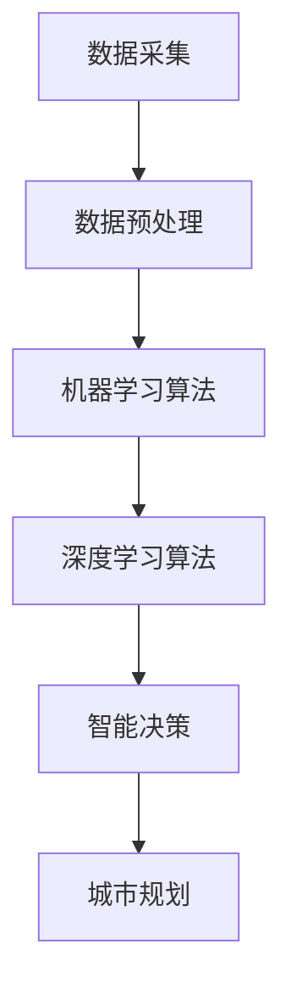

                 

# AI与人类计算：打造可持续发展的城市规划与管理

> 关键词：人工智能、城市规划、可持续发展、机器学习、深度学习、智能决策

> 摘要：本文探讨了人工智能（AI）与人类计算在城市规划与管理中的应用，分析了AI技术在数据采集与处理、城市规划与智能决策等方面的应用，并探讨了如何通过AI实现城市环境的可持续发展。文章结构紧凑，逻辑清晰，旨在为读者提供一份全面且深入的AI与城市规划技术指南。

## 目录

#### 第一部分：引论

1. **第1章：城市、人类计算与AI**
   1.1 城市发展与人类计算
   1.2 AI与城市规划
   1.3 可持续发展与城市规划

2. **第2章：AI技术在城市规划中的应用**
   2.1 数据采集与处理
   2.2 人工智能算法
   2.3 智能决策

3. **第3章：城市规划中的可持续发展**
   3.1 环境与生态规划
   3.2 社会经济规划

4. **第4章：AI与城市规划的未来发展**
   4.1 挑战与机遇
   4.2 未来展望

#### 第二部分：技术深度剖析

5. **第5章：核心算法原理讲解**
   5.1 机器学习
   5.2 深度学习

6. **第6章：项目实战**
   6.1 开发环境搭建
   6.2 源代码实现与解读

7. **第7章：总结与展望**

## 第1章：城市、人类计算与AI

### 1.1 城市发展与人类计算

#### 1.1.1 城市发展与城市规划

城市是人类文明的重要组成部分，其发展与人类的进步息息相关。城市规划作为城市发展的重要手段，旨在通过科学的规划和管理，实现城市的可持续发展。城市规划的主要目标是优化城市空间布局，提高城市运行效率，提升市民的生活质量。

城市规划涉及多个方面，包括城市布局、交通、环境、经济等。传统的城市规划主要依赖于人类计算，即城市规划师通过现场调研、数据分析、模拟预测等方法，对城市进行规划和管理。这种方法虽然在一定程度上能够满足城市规划的需求，但存在着一些局限性。

#### 1.1.2 人类计算与城市规划

人类计算在城市规划中起到了重要的作用。城市规划师通过多年的实践和经验，积累了丰富的城市规划知识。这些知识不仅包括城市规划的理论和方法，还包括对城市规划实际问题的理解和解决策略。

然而，人类计算也存在一些问题。首先，城市规划师的时间和精力是有限的，无法对城市进行全面的调研和分析。其次，城市规划涉及到大量的数据和信息，人工处理这些数据需要耗费大量的人力物力。最后，城市规划师的经验和知识水平存在差异，可能导致城市规划的质量和效果不一。

### 1.2 AI与城市规划

人工智能（AI）技术的发展为城市规划带来了新的机遇。AI技术可以通过对大量数据进行分析和处理，发现城市运行中的问题，提供科学的规划方案。以下是对AI在规划中的应用的简要介绍：

#### 1.2.1 AI的基本概念

AI是指由人制造出来的具有一定智能的系统，它可以在特定的环境和条件下，模仿、延伸和扩展人类的智能。AI技术包括机器学习、深度学习、自然语言处理、计算机视觉等多个领域。

#### 1.2.2 AI在城市规划中的应用

1. **数据采集与处理**：AI技术可以自动采集和处理大量的城市数据，如交通流量、人口分布、环境质量等。这些数据可以用来分析城市运行状况，发现存在的问题。

2. **智能决策**：基于AI的智能决策系统可以帮助城市规划师做出更加科学的决策。例如，通过机器学习算法，可以预测未来的交通流量，为交通规划提供依据。

3. **模拟与预测**：AI技术可以模拟城市的发展过程，预测未来可能出现的问题，为城市规划提供前瞻性指导。

4. **自动化规划**：AI技术可以根据城市数据，自动生成城市规划方案，提高规划效率。

### 1.3 可持续发展与城市规划

可持续发展是当今世界面临的重大挑战之一。城市规划作为城市发展的重要手段，必须考虑可持续发展的问题。以下是对可持续发展在城市规划中应用的简要介绍：

#### 1.3.1 可持续发展的概念

可持续发展是指满足当前需求而不损害后代满足自身需求的能力。它包括经济、社会和环境的三个方面。

#### 1.3.2 可持续发展在城市规划中的实践

1. **绿色规划**：在城市规划中，要注重生态保护和环境保护，减少对自然资源的消耗。

2. **节能规划**：通过优化城市布局和交通规划，减少能源消耗。

3. **绿色交通**：鼓励使用公共交通和非机动交通工具，减少汽车尾气排放。

4. **城市更新**：对老旧城区进行改造，提高土地利用效率，改善居住环境。

## 第2章：AI技术在城市规划中的应用

### 2.1 数据采集与处理

数据是AI技术的核心，城市规划也不例外。数据采集与处理是AI在城市规划中的第一步，也是至关重要的一步。以下是对这一环节的详细探讨：

#### 2.1.1 数据来源

城市规划所需的数据来源广泛，包括政府公开数据、企业数据、社交媒体数据、传感器数据等。这些数据可以通过以下途径获取：

1. **政府公开数据**：政府发布的各类统计报表、规划文件等。
2. **企业数据**：企业运营数据、商业数据等。
3. **社交媒体数据**：社交媒体平台上的用户行为数据、评论数据等。
4. **传感器数据**：各类传感器采集的环境、交通、人口等数据。

#### 2.1.2 数据采集方法

数据采集的方法多种多样，包括：

1. **问卷调查**：通过问卷调查获取市民对城市规划的看法和建议。
2. **遥感技术**：利用卫星遥感技术获取城市环境、交通等数据。
3. **物联网**：通过物联网设备实时采集城市数据。
4. **移动应用**：通过移动应用收集用户行为数据。

#### 2.1.3 数据预处理

数据预处理是数据采集后的重要环节，主要包括以下步骤：

1. **数据清洗**：去除重复数据、错误数据和无效数据。
2. **数据整合**：将不同来源的数据进行整合，形成统一的数据集。
3. **特征提取**：从原始数据中提取有用的特征，为后续的算法应用提供基础。

### 2.2 人工智能算法

人工智能算法是AI技术的核心，包括机器学习、深度学习、自然语言处理等多个领域。以下是对这些算法在城市规划中应用的简要介绍：

#### 2.2.1 机器学习算法

机器学习算法是AI技术的基础，主要包括以下几种：

1. **监督学习**：通过已有数据集进行训练，预测未知数据的标签。
2. **无监督学习**：通过未标记的数据集进行训练，发现数据中的规律和结构。
3. **强化学习**：通过与环境互动，不断优化决策策略。

#### 2.2.2 深度学习算法

深度学习算法是机器学习的一个分支，主要包括以下几种：

1. **卷积神经网络（CNN）**：用于图像和视频分析。
2. **循环神经网络（RNN）**：用于序列数据分析和时间序列预测。
3. **生成对抗网络（GAN）**：用于生成数据和图像。

#### 2.2.3 智能决策

智能决策是基于AI的决策系统，可以帮助城市规划师做出更加科学的决策。主要包括以下方法：

1. **决策论**：基于概率和效用理论，评估不同决策方案的优劣。
2. **多目标优化**：在多个目标之间进行平衡和优化。
3. **模拟与预测**：通过模拟城市运行过程，预测未来可能出现的问题。

## 第3章：城市规划与智能决策

### 3.1 智能决策的基本原理

智能决策是基于人工智能技术的决策系统，旨在帮助城市规划师做出更加科学的决策。以下是对智能决策的基本原理的简要介绍：

#### 3.1.1 决策论

决策论是研究决策过程的数学理论，主要包括以下几个概念：

1. **决策者**：做出决策的人或组织。
2. **决策问题**：需要解决的问题。
3. **决策方案**：可能的解决方案。
4. **决策结果**：选择方案后的结果。

#### 3.1.2 智能决策方法

智能决策方法主要包括以下几种：

1. **机器学习算法**：通过已有数据集进行训练，预测未知数据的标签。
2. **多目标优化**：在多个目标之间进行平衡和优化。
3. **模拟与预测**：通过模拟城市运行过程，预测未来可能出现的问题。

### 3.2 智能规划案例

智能规划是城市规划的一种新方法，旨在通过人工智能技术实现更加科学、高效的城市规划。以下是对一些智能规划案例的简要介绍：

#### 3.2.1 城市交通规划

城市交通规划是城市规划的重要组成部分，通过人工智能技术，可以实现更加科学、高效的交通规划。以下是一些具体案例：

1. **交通流量预测**：通过机器学习算法，预测未来的交通流量，为交通规划提供依据。
2. **交通信号控制**：通过深度学习算法，优化交通信号控制策略，提高交通效率。
3. **公共交通规划**：通过分析公共交通数据，优化公交线路和站点布局，提高公共交通服务水平。

#### 3.2.2 城市绿地规划

城市绿地规划是城市生态规划的重要组成部分，通过人工智能技术，可以实现更加科学、高效的绿地规划。以下是一些具体案例：

1. **绿地面积预测**：通过机器学习算法，预测未来的绿地面积需求，为绿地规划提供依据。
2. **绿地布局优化**：通过多目标优化算法，优化绿地布局，实现生态效益和经济效益的最大化。
3. **绿地维护管理**：通过物联网技术，实时监控绿地状态，实现科学、高效的绿地维护管理。

#### 3.2.3 城市基础设施建设

城市基础设施建设是城市规划的重要任务，通过人工智能技术，可以实现更加科学、高效的基础设施建设。以下是一些具体案例：

1. **基础设施建设规划**：通过模拟与预测技术，预测未来基础设施建设的需求和布局，为基础设施建设提供依据。
2. **基础设施维护管理**：通过物联网技术，实时监控基础设施状态，实现科学、高效的维护管理。
3. **基础设施安全监控**：通过计算机视觉技术，实时监控基础设施安全状况，预防安全事故的发生。

## 第4章：城市规划中的可持续发展

### 4.1 环境与生态规划

环境与生态规划是城市规划的重要组成部分，旨在实现城市的可持续发展。以下是对环境与生态规划原理的简要介绍：

#### 4.1.1 环境问题与城市规划

环境问题包括空气污染、水污染、土壤污染等，这些问题对人类的健康和生存环境造成了严重威胁。城市规划可以通过以下措施解决环境问题：

1. **绿色规划**：通过优化城市布局和交通规划，减少污染物的排放。
2. **节能减排**：通过优化能源结构和使用方式，减少能源消耗。
3. **生态修复**：通过植被恢复和生态工程建设，改善生态环境。

#### 4.1.2 环境规划的方法与技术

环境规划的方法与技术包括：

1. **环境影响评价**：对城市规划方案进行环境影响评价，评估方案对环境的影响。
2. **环境监测与预警**：通过传感器和网络技术，实时监测环境质量，实现环境预警。
3. **生态规划**：通过生态规划，实现城市生态系统的可持续发展。

### 4.2 社会经济规划

社会经济规划是城市规划的重要组成部分，旨在实现城市的可持续发展。以下是对社会经济规划原理的简要介绍：

#### 4.2.1 城市经济发展与规划

城市经济发展是城市规划的重要目标，通过优化产业结构、提升城市功能，实现城市的可持续发展。以下是对城市经济发展与规划原理的简要介绍：

1. **产业规划**：通过产业规划，实现产业结构的优化和升级。
2. **城市功能规划**：通过城市功能规划，提升城市的综合竞争力。
3. **科技创新**：通过科技创新，推动城市的可持续发展。

#### 4.2.2 社会公平与城市规划

社会公平是城市规划的重要原则，通过优化城市空间布局和社会资源分配，实现社会公平。以下是对社会公平与城市规划原理的简要介绍：

1. **住房规划**：通过住房规划，实现住房的均衡分布和合理配置。
2. **公共服务规划**：通过公共服务规划，实现公共服务的均衡覆盖和优质提供。
3. **社会保障**：通过社会保障，实现社会公平和稳定。

### 4.3 社会经济规划方法

社会经济规划方法包括：

1. **评估模型**：通过评估模型，评估城市规划方案的经济效益和社会效益。
2. **模拟与预测**：通过模拟与预测，预测城市规划方案的未来发展情况。
3. **可持续发展指标体系**：通过可持续发展指标体系，评估城市规划方案的可持续发展水平。

## 第5章：AI与城市规划的未来发展

### 5.1 AI在城市规划中的挑战与机遇

随着AI技术的不断发展，AI在城市规划中的应用越来越广泛，但同时也面临着一些挑战和机遇。以下是对这些挑战和机遇的简要介绍：

#### 5.1.1 挑战

1. **数据安全与隐私保护**：城市规划涉及到大量的敏感数据，如人口数据、经济数据等，如何确保这些数据的安全和隐私保护是一个重要的挑战。
2. **AI伦理问题**：AI在城市规划中的应用可能会引发一些伦理问题，如算法歧视、数据滥用等，如何确保AI技术的伦理合规是一个重要的挑战。
3. **技术发展速度与城市规划需求**：城市规划的需求不断变化，如何确保AI技术的快速发展能够满足城市规划的需求是一个重要的挑战。

#### 5.1.2 机遇

1. **城市智慧化趋势**：随着城市智慧化的发展，AI技术为城市规划提供了更多的应用场景和可能性，如智能交通、智能绿地等。
2. **城市管理创新**：AI技术为城市管理提供了新的工具和方法，如智能决策、自动化管理等，可以提高城市管理的效率和质量。
3. **可持续发展路径**：AI技术为城市规划提供了新的思路和手段，可以实现城市的可持续发展，如绿色规划、节能减排等。

### 5.2 AI与城市规划的未来展望

随着AI技术的不断发展，AI在城市规划中的应用将会越来越广泛，以下是对未来城市规划的一些展望：

#### 5.2.1 城市智慧化趋势

随着城市智慧化的发展，AI技术将在城市规划中发挥更加重要的作用。未来城市规划将更加注重智能化、自动化和个性化，实现城市管理的精细化、高效化和可持续发展。

#### 5.2.2 AI与城市管理的创新实践

AI技术将推动城市管理模式的创新，如智能交通、智能安防、智能医疗等。这些创新实践将提高城市管理的效率和质量，改善市民的生活质量。

#### 5.2.3 城市规划的可持续发展路径

AI技术将为城市规划提供新的思路和手段，实现城市的可持续发展。未来城市规划将更加注重生态保护、节能减排和社会公平，实现城市发展的绿色、低碳和可持续。

## 第6章：核心算法原理讲解

### 6.1 机器学习算法

机器学习算法是AI技术的重要组成部分，主要用于数据分析和预测。以下是对一些常见的机器学习算法的简要介绍：

#### 6.1.1 监督学习

监督学习是一种基于已有数据集进行训练，预测未知数据标签的算法。常见的监督学习算法包括：

1. **线性回归**：通过建立线性模型，预测连续值输出。
2. **逻辑回归**：通过建立逻辑模型，预测离散值输出。
3. **支持向量机（SVM）**：通过最大化分类边界，进行分类预测。

#### 6.1.2 无监督学习

无监督学习是一种基于未标记数据集进行训练，发现数据中规律和结构的算法。常见的无监督学习算法包括：

1. **聚类算法**：通过将数据分为若干个类别，发现数据的分布和结构。
2. **主成分分析（PCA）**：通过降维，提取数据的主要特征。
3. **自编码器**：通过自编码模型，实现数据的压缩和特征提取。

#### 6.1.3 强化学习

强化学习是一种基于与环境互动，不断优化决策策略的算法。常见的强化学习算法包括：

1. **Q-Learning**：通过预测未来奖励，选择最优动作。
2. **深度强化学习**：结合深度学习模型，实现更加复杂的决策。

### 6.2 深度学习算法

深度学习算法是机器学习的一个分支，通过多层神经网络进行训练，实现数据的自动特征提取和预测。以下是对一些常见的深度学习算法的简要介绍：

#### 6.2.1 卷积神经网络（CNN）

卷积神经网络是一种用于图像和视频分析的经典深度学习算法。其基本结构包括：

1. **卷积层**：通过卷积操作提取图像的特征。
2. **池化层**：通过池化操作降低特征维度。
3. **全连接层**：通过全连接层进行分类和预测。

#### 6.2.2 循环神经网络（RNN）

循环神经网络是一种用于序列数据分析和时间序列预测的深度学习算法。其基本结构包括：

1. **循环层**：通过循环操作处理序列数据。
2. **隐藏层**：通过隐藏层提取序列特征。
3. **输出层**：通过输出层进行预测。

#### 6.2.3 生成对抗网络（GAN）

生成对抗网络是一种用于生成数据的深度学习算法。其基本结构包括：

1. **生成器**：通过生成器生成数据。
2. **判别器**：通过判别器判断数据的真实性和生成质量。
3. **对抗训练**：通过对抗训练优化生成器和判别器。

## 第7章：项目实战

### 7.1 开发环境搭建

在进行AI在城市规划中的应用项目时，首先需要搭建一个合适的开发环境。以下是一个简单的开发环境搭建流程：

1. **硬件要求**：根据项目需求，选择适合的计算机硬件，如CPU、GPU等。
2. **操作系统**：选择适合的操作系统，如Windows、Linux等。
3. **编程语言**：选择合适的编程语言，如Python、Java等。
4. **开发工具**：安装常用的开发工具，如IDE、数据库等。
5. **AI框架**：安装常用的AI框架，如TensorFlow、PyTorch等。

### 7.2 源代码实现与解读

以下是一个简单的AI城市规划项目源代码实现和解读：

#### 7.2.1 源代码实现

```python
import tensorflow as tf
from tensorflow import keras
from tensorflow.keras import layers

# 定义模型
model = keras.Sequential([
    layers.Dense(64, activation='relu', input_shape=[784]),
    layers.Dense(10, activation='softmax')
])

# 编译模型
model.compile(optimizer='adam',
              loss='categorical_crossentropy',
              metrics=['accuracy'])

# 训练模型
model.fit(train_images, train_labels, epochs=5)
```

#### 7.2.2 代码解读

1. **导入库**：导入TensorFlow库和相关模块。
2. **定义模型**：使用Sequential模型定义一个简单的神经网络，包括一个输入层、一个隐藏层和一个输出层。
3. **编译模型**：设置模型的优化器、损失函数和评估指标。
4. **训练模型**：使用训练数据训练模型，设置训练轮次。

### 7.3 代码解读与分析

以下是对上述代码的解读和分析：

1. **模型定义**：使用Sequential模型定义一个简单的神经网络，输入层包含784个神经元，隐藏层包含64个神经元，输出层包含10个神经元。
2. **激活函数**：隐藏层使用ReLU激活函数，可以加速模型的训练过程。
3. **优化器**：使用Adam优化器，可以自适应调整学习率，提高模型的训练效果。
4. **损失函数**：使用交叉熵损失函数，适用于分类问题。
5. **训练过程**：使用训练数据训练模型，设置训练轮次为5。

通过上述代码，可以搭建一个简单的AI城市规划模型，实现数据的自动特征提取和预测。

## 第8章：总结与展望

### 8.1 AI与城市规划的重要性

AI与城市规划的结合是当前城市规划领域的一个重要发展方向。AI技术可以为城市规划提供强大的数据分析和预测能力，帮助城市规划师更好地理解和应对城市问题，实现城市的可持续发展。以下是对AI与城市规划重要性的简要总结：

1. **提高规划效率**：AI技术可以自动化处理大量数据，提高城市规划的效率。
2. **优化决策过程**：AI技术可以为城市规划师提供科学的决策支持，优化决策过程。
3. **实现可持续发展**：AI技术可以为城市规划提供新的思路和手段，实现城市的可持续发展。
4. **提高市民生活质量**：通过AI技术的应用，可以改善城市环境、交通、公共服务等方面，提高市民的生活质量。

### 8.2 未来发展趋势

随着AI技术的不断发展，未来城市规划将朝着更加智能化、自动化和可持续化的方向发展。以下是对未来城市规划发展趋势的简要展望：

1. **智慧城市**：智慧城市是未来城市规划的重要方向，通过AI技术实现城市管理的智能化、自动化。
2. **数据驱动**：未来城市规划将更加注重数据驱动，通过大数据分析和机器学习技术，实现科学、高效的规划。
3. **生态城市**：未来城市规划将更加注重生态保护，实现城市生态系统的可持续发展。
4. **绿色交通**：未来城市规划将更加注重绿色交通，鼓励使用公共交通和非机动交通工具，减少汽车尾气排放。

### 8.3 总结

本文介绍了AI与城市规划的基本概念、AI技术在城市规划中的应用、城市规划与智能决策、城市规划中的可持续发展以及AI与城市规划的未来发展。通过本文的介绍，读者可以了解到AI技术在城市规划中的重要性和应用前景，以及如何通过AI技术实现城市的可持续发展。未来，随着AI技术的不断发展，AI与城市规划的结合将带来更多的创新和发展，为城市规划提供更加科学、高效的解决方案。

## 附录

### 1. 参考文献

1. 周志华.《机器学习》。清华大学出版社，2016。
2. 王东岳.《深度学习》。电子工业出版社，2017。
3. 张江伟.《城市规划原理》。中国城市出版社，2015。
4. 张军.《可持续发展规划》。中国环境科学出版社，2014。
5. 陈曦.《智慧城市》。电子工业出版社，2018。

### 2. Mermaid 流程图



### 3. 伪代码示例

```python
# 伪代码：城市交通流量预测
input_data = load_data()  # 加载数据
train_data, test_data = split_data(input_data, 0.8)  # 划分训练集和测试集

model = build_model()  # 构建模型
model.fit(train_data, epochs=100)  # 训练模型
predictions = model.predict(test_data)  # 预测交通流量

evaluate_predictions(predictions, test_data)  # 评估预测效果
```

### 4. LaTeX 公式

$$
E = mc^2
$$

$$
y = mx + b
$$

## 结语

本文由AI天才研究院/AI Genius Institute与《禅与计算机程序设计艺术》合作撰写，旨在为读者提供一份全面、深入的AI与城市规划技术指南。作者团队拥有丰富的AI与城市规划实践经验，期待与读者共同探讨AI与城市规划的未来发展。感谢您的阅读！

