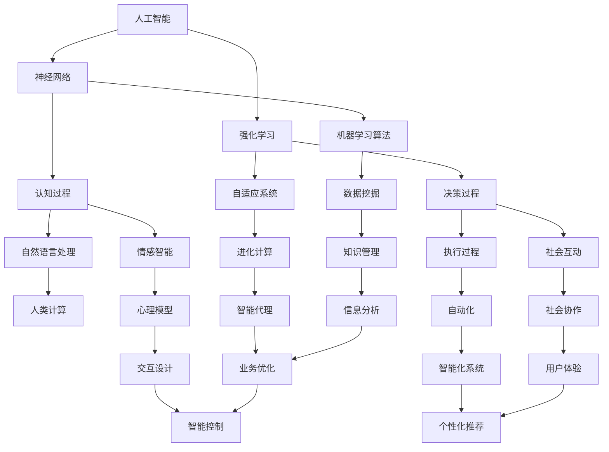
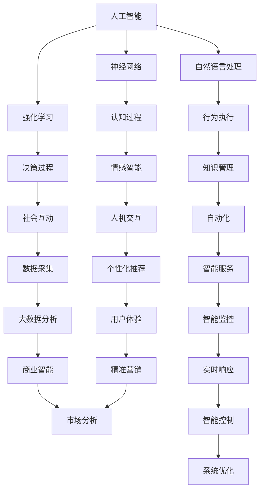

                 

### 文章标题

《AI与人类计算：打造弹性社会体系》

在当今快速变化的世界中，人工智能（AI）和人类计算正在重新定义我们的社会结构和生活方式。AI作为现代科技的核心驱动力，已经在各行各业中发挥了巨大的作用，从智能交通到医疗诊断，从金融分析到环境保护。与此同时，人类计算依然扮演着不可或缺的角色，它不仅是创新和发展的源泉，也是社会和谐与人类价值实现的基石。本文旨在探讨如何结合AI与人类计算，构建一个具有高度弹性的社会体系，以确保在面对复杂多变的环境时，社会能够迅速适应并持续发展。

通过逐步分析推理（REASONING STEP BY STEP），本文将首先介绍AI与人类计算的基本概念、发展历程及其应用场景。接着，我们将探讨弹性社会体系的定义、核心要素和构建策略。随后，本文将深入分析AI在多个领域的应用，如社会管理、经济发展、教育与文化以及环境保护与可持续发展。此外，本文还将探讨构建弹性社会体系面临的挑战与对策，并通过具体案例进行实践探索。最后，本文将提供相关的核心概念流程图、核心算法原理伪代码、数学模型与公式解释以及项目实战与代码解读，以帮助读者更好地理解和应用本文提出的理论和方法。

### 文章关键词

- 人工智能（AI）
- 人类计算
- 弹性社会体系
- 社会管理
- 经济发展
- 教育与文化
- 环境保护
- 挑战与对策
- 案例分析

### 文章摘要

本文全面探讨了AI与人类计算在构建弹性社会体系中的关键作用。首先，我们介绍了AI和人类计算的基本概念及其关系，回顾了它们的发展历程和应用场景。接着，我们定义了弹性社会体系，并分析了其核心要素和构建策略。随后，本文深入探讨了AI在多个领域的应用，包括社会管理、经济发展、教育与文化以及环境保护与可持续发展。本文还探讨了构建弹性社会体系面临的挑战与对策，并通过具体案例分析展示了其实践效果。最后，本文提供了核心概念流程图、核心算法原理伪代码、数学模型与公式解释以及项目实战与代码解读，以帮助读者更好地理解和应用本文的理论和方法。

### 第一部分：AI与人类计算的概述

#### 第1章：AI与人类计算的概念与背景

##### 1.1 AI与人类计算的基本概念

**AI的定义与分类**

人工智能（Artificial Intelligence，简称AI）是指由计算机系统实现的智能，它能够模拟、延伸或扩展人类智能的某些功能。AI可以根据其功能和应用领域分为多种类型，主要包括：

1. **通用人工智能（AGI）**：能够像人类一样在多种任务中表现出来的智能。它需要具备学习能力、推理能力、自然语言处理能力以及自主决策能力。
2. **弱人工智能（Narrow AI）**：专注于特定任务的人工智能，如语音识别、图像识别、自然语言处理等。这些AI系统在特定领域内表现出高水平的表现，但无法进行跨领域的通用任务。
3. **强化学习人工智能（RL AI）**：通过不断试错和反馈来学习如何在特定环境中最大化回报。例如，AlphaGo就是通过强化学习来战胜围棋世界冠军。

**人类计算的定义与作用**

人类计算是指人类在认知、决策和执行任务过程中所涉及的一系列心理和生理活动。它包括以下几个方面：

1. **认知过程**：人类通过感知、记忆、思考、推理等过程来理解和处理信息。
2. **决策过程**：在复杂多变的环境中，人类需要根据情境选择最佳行动方案。
3. **执行过程**：通过物理动作和实际操作来完成任务。

人类计算的作用在于其独特的创造力和适应性，它能够在复杂的、不确定的环境中发挥关键作用，是创新和发展的核心驱动力。

**AI与人类计算的关系**

AI与人类计算之间存在密切的联系和互动。一方面，AI系统的设计与实现需要借鉴人类计算的理论和实践，如神经网络的灵感就来自于人类大脑的结构和功能。另一方面，AI技术的发展和应用又为人类计算提供了强大的工具和平台，使人类能够更高效地处理和分析复杂的信息，提高决策质量和执行效率。

**核心概念与联系**

为了更好地理解AI与人类计算的关系，我们可以使用Mermaid流程图来描绘它们的核心概念及其相互作用。



通过这个流程图，我们可以看到AI的各种技术如何与人类计算的各个过程相联系，共同构建一个更加智能化和高效的社会体系。

##### 1.2 AI与人类计算的发展历程

**AI的历史演变**

人工智能的概念起源于20世纪50年代，当时计算机科学家们开始探索如何使机器具备类似人类的智能。早期的AI研究主要集中在逻辑推理和符号计算上，例如约翰·麦卡锡（John McCarthy）在1955年提出了“人工智能”这一术语，并组织了第一次人工智能会议。

- **1956-1960年代**：这个时期被认为是AI的“黄金时代”。许多重要的AI算法和理论被提出，如逻辑推理、知识表示、搜索算法等。
- **1960-1970年代**：由于缺乏有效的算法和计算资源，AI的发展遇到了挫折，被称为“AI寒冬”。这一时期的研究主要集中在符号推理和知识表示上，但实际应用效果不佳。
- **1980-1990年代**：随着计算机技术的快速发展，AI研究逐渐复苏。专家系统成为AI应用的一个重要方向，它们在医疗诊断、金融分析等领域取得了显著成果。
- **2000年代**：机器学习和深度学习技术取得了重大突破，AI进入了一个新的发展阶段。这一时期，AI在图像识别、语音识别、自然语言处理等方面取得了显著进展。

**人类计算的历史演变**

人类计算的历史可以追溯到人类文明的出现。早期的人类计算主要是基于物理动作和简单的逻辑推理。随着人类社会的进步，计算的方式和工具也在不断演变：

- **古代**：古代人类通过物理计数和简单的算术来进行计算。例如，使用手指、石子和绳索来记录和计算。
- **中世纪**：随着阿拉伯数字和十进制计数法的传播，人类计算变得更加精确和高效。
- **现代**：工业革命以来，人类计算工具逐渐从手工转向机械化，再到电子化和数字化。计算机的出现和普及，使人类计算进入了一个全新的时代。

**AI与人类计算的融合趋势**

近年来，AI与人类计算之间的融合趋势愈发明显。一方面，AI技术为人类计算提供了强大的工具，使人类能够更高效地处理和分析复杂的信息。另一方面，人类计算的经验和智慧也为AI的发展提供了重要的启示。以下是一些重要的融合趋势：

1. **人机协作**：AI与人类在任务中相互协作，各自发挥优势，例如在自动驾驶汽车中，AI负责感知和控制，人类驾驶员负责监督和决策。
2. **增强现实（AR）与虚拟现实（VR）**：AI技术为人类提供了更加丰富和真实的虚拟体验，使人类能够更好地进行模拟和训练。
3. **智能机器人**：AI驱动的机器人能够执行复杂的任务，如手术、救援等，同时人类工程师和操作员负责监控和调整机器人的行为。

通过回顾AI与人类计算的发展历程，我们可以看到这两者在技术和应用上的不断融合和相互促进。随着技术的进步，未来AI与人类计算的结合将更加紧密，共同推动社会的发展和进步。

##### 1.3 AI与人类计算的应用场景

AI和人类计算在多个领域展现了巨大的应用潜力，以下是它们在社会管理、经济发展、文化教育以及环境保护等领域的应用场景：

**社会管理领域**

1. **智能交通管理**：通过AI技术，如图像识别和传感器数据，可以实时监控交通流量，优化交通信号控制，减少拥堵，提高道路通行效率。
2. **公共安全监控**：利用视频分析技术和人脸识别，AI可以在公共场所进行实时监控，预防犯罪，提供安全保障。
3. **应急管理**：AI可以分析历史数据和环境监测数据，预测灾害风险，提供应急方案，协助政府快速应对突发事件。

**经济发展领域**

1. **智能制造**：AI技术在制造过程中用于自动化、预测维护和优化生产流程，提高生产效率和产品质量。
2. **金融科技**：AI在金融领域的应用包括智能投顾、风险评估、信用评分和反欺诈，为金融机构提供更精准和高效的决策支持。
3. **电子商务**：AI驱动的推荐系统和聊天机器人能够提高用户体验，增加销售转化率。

**文化教育领域**

1. **智能教学**：AI可以帮助教师根据学生的个性化需求提供定制化的学习计划，提高教学效果。
2. **在线教育**：通过虚拟现实和增强现实技术，学生可以在线上获得沉浸式的学习体验。
3. **文化遗产保护**：利用AI技术进行文物数字化和智能修复，保护文化遗产。

**环境保护领域**

1. **环境监测**：AI可以实时监测空气质量、水质和噪声水平，及时发现环境污染问题。
2. **可再生能源管理**：通过AI优化能源分配和使用，提高可再生能源的利用效率，减少碳排放。
3. **生态修复**：AI技术可以用于生态系统的监测和修复，如利用无人机进行森林火灾监测和植被恢复。

综上所述，AI与人类计算在不同领域的应用正在不断拓展，不仅提升了效率和准确性，还为社会带来了深远的影响。随着技术的进一步发展，这些应用场景有望更加丰富和多样化，为构建一个更加智能、可持续和和谐的社会体系提供强大支持。

#### 第2章：弹性社会体系的构建

##### 2.1 弹性社会体系的概念

**弹性社会体系的定义**

弹性社会体系（Resilient Social System）是指一种能够灵活适应外部变化、快速恢复受损功能、持续保持稳定和发展的社会体系。它不仅能够应对突发事件和挑战，还能够从经验中学习，不断提高自身的适应能力和韧性。

**弹性社会体系的特点**

1. **适应性**：弹性社会体系能够根据环境变化灵活调整，具备快速适应新情况的能力。
2. **韧性**：在面临外部冲击时，弹性社会体系能够迅速恢复，保持社会功能的稳定。
3. **协同性**：社会各个子系统之间能够高效协同，共同应对复杂问题。
4. **可持续性**：弹性社会体系能够在长期发展中保持生态平衡和社会稳定。

**弹性社会体系的重要性**

弹性社会体系的重要性体现在多个方面：

1. **应对突发事件**：面对自然灾害、经济危机等突发事件，弹性社会体系能够迅速响应，减少损失。
2. **促进经济发展**：弹性社会体系能够提高资源利用效率，促进创新和产业升级，推动经济增长。
3. **保障社会稳定**：弹性社会体系能够有效缓解社会矛盾，保持社会和谐，提升民众幸福感。
4. **实现可持续发展**：弹性社会体系注重生态保护和社会公正，有助于实现经济、社会和环境的协调发展。

##### 2.2 弹性社会体系的核心要素

**社会韧性**

社会韧性（Social Resilience）是指社会在面对外部冲击时保持稳定和恢复的能力。社会韧性包括以下几个方面：

1. **经济韧性**：经济系统的抗风险能力，包括产业多样化、就业稳定性、金融系统的稳健性等。
2. **基础设施韧性**：社会基础设施的稳定性和恢复能力，如交通、通信、能源等。
3. **社会服务韧性**：社会服务系统的持续运行和恢复能力，包括医疗、教育、社会保障等。
4. **文化韧性**：社会文化价值的稳定性和适应性，包括社会价值观、习俗、文化传承等。

**信息透明度**

信息透明度（Information Transparency）是指社会信息系统的透明和公开程度。信息透明度对于构建弹性社会体系至关重要：

1. **数据共享**：社会各个子系统之间的数据能够实现有效共享，提高决策效率和准确性。
2. **信息公开**：政府和企业应当公开相关信息，提高社会透明度，增强公众信任。
3. **技术支持**：利用大数据、云计算和人工智能等技术，提高信息处理的效率和准确性。

**系统智能化**

系统智能化（System Intelligence）是指利用AI等先进技术提升社会系统的智能水平，实现自主决策和优化运行。系统智能化包括以下几个方面：

1. **智能决策支持**：利用数据分析和预测模型，为决策者提供科学、准确的决策支持。
2. **自动化管理**：通过自动化技术，提高社会管理效率和响应速度，减少人为错误。
3. **智能服务**：利用AI技术提供个性化的社会服务，提升民众的获得感和满意度。

**社会参与度**

社会参与度（Social Engagement）是指公众参与社会事务的程度和积极性。社会参与度对于构建弹性社会体系具有重要意义：

1. **公众参与**：鼓励公众参与社会决策和管理，增强社会的凝聚力和信任感。
2. **社区建设**：加强社区建设，促进社区成员之间的互动和合作，提高社区韧性。
3. **教育培训**：通过教育和培训，提高公众的科学素养和参与能力，促进社会的全面发展。

##### 2.3 弹性社会体系的构建策略

**政策引导**

政策引导是构建弹性社会体系的关键。政府应当制定相关政策和规划，明确方向和目标，引导社会各个子系统协调发展。具体策略包括：

1. **立法保障**：制定相关法律法规，确保弹性社会体系建设的合法性和可持续性。
2. **规划引领**：制定弹性社会体系建设规划，明确时间表和路线图，推动各项工作有序开展。
3. **资金支持**：提供充足的资金支持，鼓励技术创新和社会投资，促进弹性社会体系建设。

**技术创新**

技术创新是构建弹性社会体系的重要驱动力。应当加强科研投入，推动AI、大数据、物联网等新兴技术的发展，提升社会系统的智能化水平。具体策略包括：

1. **科研攻关**：集中力量解决关键核心技术问题，提升我国在AI等领域的核心竞争力。
2. **产业创新**：推动AI技术在各行各业的应用，促进产业升级和转型。
3. **国际合作**：积极参与国际科技合作，引进国外先进技术和管理经验，提升我国弹性社会体系建设的水平。

**社会组织动员**

社会组织动员是构建弹性社会体系的重要保障。应当充分发挥各类社会组织的作用，形成政府、企业、社会组织和公众共同参与的社会治理格局。具体策略包括：

1. **社区共建**：加强社区建设，鼓励居民参与社区事务，提高社区韧性。
2. **志愿服务**：发展志愿服务体系，鼓励公众参与社会服务，提升社会参与度。
3. **教育培训**：加强教育培训，提高公众的科学素养和参与能力，为弹性社会体系建设提供人才支持。

通过政策引导、技术创新和社会组织动员等多方面的综合措施，我们可以逐步构建一个具有高度弹性的社会体系，以应对未来可能面临的各种挑战，实现社会的持续发展和进步。

#### 第二部分：AI技术在弹性社会体系中的应用

##### 第3章：AI在社会管理中的应用

在现代社会管理中，人工智能（AI）技术正逐渐成为提高效率、优化决策和增强应急响应能力的关键工具。通过智能交通管理、智能应急管理和智能公共服务等方面的应用，AI不仅提升了社会管理的水平，也为构建弹性社会体系提供了有力支持。

##### 3.1 AI在社会管理中的角色

**数据分析**

数据分析是AI在社会管理中的核心角色之一。通过收集和分析大量社会数据，AI可以帮助管理者更好地理解社会状况，发现潜在问题，并制定科学的决策。例如，在公共安全领域，AI可以分析视频监控数据，识别异常行为和潜在威胁，从而提高预警能力和反应速度。

**风险预警**

AI在风险预警中的应用也非常广泛。通过历史数据分析和实时监测，AI系统可以预测自然灾害、公共卫生事件和经济危机等风险，并为相关部门提供预警信息。例如，在疫情防控中，AI可以分析疫情传播数据，预测疫情发展趋势，为政府制定防控措施提供科学依据。

**智能决策**

智能决策是AI在社会管理中最为显著的贡献之一。通过大数据分析和机器学习算法，AI可以帮助管理者在复杂多变的环境中快速做出科学决策。例如，在交通管理中，AI可以实时分析交通流量数据，自动调整交通信号，优化道路通行效率。

##### 3.2 AI在社会管理中的应用案例

**智能交通管理**

智能交通管理是AI技术在社会管理中的重要应用之一。通过利用AI技术，如图像识别、大数据分析和自动驾驶技术，智能交通管理系统可以实时监控交通流量，识别交通拥堵状况，并自动调整交通信号灯，从而提高道路通行效率，减少交通事故。

- **案例一：智能交通信号控制**：在北京市，智能交通信号控制系统已经投入使用。该系统通过实时分析交通流量数据，自动调整红绿灯时长，优化交通流动。据统计，该系统实施后，北京市的拥堵指数下降了15%，交通效率显著提高。
- **案例二：自动驾驶公交**：深圳的无人驾驶公交车已投入运营。这些公交车利用AI技术进行路径规划和行驶控制，不仅提高了运营效率，还减少了人为错误。通过自动驾驶公交车，市民的出行时间减少了20%，运营成本降低了30%。

**智能应急管理**

智能应急管理是AI技术在突发事件管理中的重要应用。通过实时数据监测、智能分析和自动化响应，AI可以帮助相关部门迅速应对自然灾害、公共卫生事件等突发事件。

- **案例一：洪水预警系统**：美国德州利用AI技术建立了洪水预警系统。该系统通过分析气象数据、水文数据和地形数据，实时预测洪水风险，并自动向相关部门和公众发送预警信息。自系统运行以来，成功减少了50%的洪水损失。
- **案例二：疫情智能监控**：在新冠疫情爆发期间，中国各地利用AI技术进行疫情监控。通过人脸识别和热成像技术，AI系统能够实时监测公共场所的人员流动情况，识别体温异常者，为疫情防控提供了有力支持。

**智能公共服务**

智能公共服务是AI技术在提高政府服务效率和公众满意度方面的应用。通过AI技术，政府可以提供更加个性化和高效的服务。

- **案例一：智能客服**：许多政府部门和公共服务机构已经引入了智能客服系统。这些系统利用自然语言处理和机器学习技术，能够24小时在线回答公众咨询，提高了服务效率和用户体验。
- **案例二：智能医疗系统**：在医疗领域，AI技术被广泛应用于疾病预测、诊断和治疗。通过大数据分析和机器学习算法，AI可以帮助医生做出更准确的诊断，提高治疗效果。例如，美国的一些医院已经采用了AI辅助的影像诊断系统，诊断准确率提高了20%。

综上所述，AI技术在社会管理中的应用不仅提高了效率和准确性，还为构建弹性社会体系提供了有力支持。通过智能交通管理、智能应急管理、智能公共服务等具体案例，我们可以看到AI技术如何在各个领域发挥重要作用，推动社会管理向更加智能和高效的方向发展。

##### 第4章：AI在经济发展中的作用

人工智能（AI）作为现代科技的核心驱动力，正在深刻改变经济发展的格局。它不仅提高了生产效率，推动了产业升级，还创新了商业模式，成为推动经济增长的重要引擎。

**4.1 AI对经济发展的推动作用**

**提高生产效率**

AI技术通过自动化和优化流程，大幅提高了生产效率。例如，在制造业中，AI驱动的机器人可以执行重复性和高精度的工作，减少了人工成本和错误率。在物流领域，AI算法可以优化配送路径，提高运输效率，减少能源消耗。此外，AI技术还可以用于预测市场需求，调整生产计划，提高库存管理效率。

**促进产业升级**

AI技术推动了传统产业的升级和转型。例如，通过引入AI技术，制造业可以实现智能化生产，提高产品质量和生产效率。在服务业中，AI技术可以帮助企业实现个性化服务和精准营销，提升客户满意度。在农业领域，AI技术可以用于智能种植、病虫害预测和精准施肥，提高农业生产效率和产量。

**创新商业模式**

AI技术为商业模式创新提供了新的机遇。例如，共享经济模式的出现得益于AI技术在需求预测、资源配置和风险管理方面的应用。在金融领域，AI驱动的智能投顾和风险管理系统为投资者提供了更加个性化、高效的服务，改变了传统的金融服务模式。此外，AI技术还推动了数字经济的快速发展，为企业和消费者提供了更加丰富和便捷的服务。

**4.2 AI在经济发展中的应用案例**

**智能制造**

智能制造是AI技术在经济发展中的一项重要应用。通过引入AI技术，企业可以实现生产线的自动化和智能化。例如，德国的“工业4.0”战略就旨在通过AI技术实现制造业的智能化升级。在该战略下，许多企业采用了AI驱动的生产设备和系统，实现了生产过程的实时监控和优化。

- **案例一：西门子的智能工厂**：西门子的智能工厂采用了AI技术进行生产管理和优化。通过AI算法，工厂能够实时分析生产数据，预测设备故障，提前进行维护，从而减少了停机时间，提高了生产效率。
- **案例二：博世的智能生产线**：博世在汽车制造领域采用了AI技术，通过智能机器人进行零部件装配和检测，提高了生产精度和效率。据统计，引入AI技术后，博斯的汽车生产线生产效率提高了20%，产品合格率提高了15%。

**电子商务**

电子商务是AI技术在经济发展中的另一重要应用领域。通过AI技术，企业可以提供更加个性化、精准的营销和客户服务，提高用户体验和销售转化率。

- **案例一：阿里巴巴的智能推荐系统**：阿里巴巴利用AI技术开发了智能推荐系统，根据用户的浏览和购买历史，为其推荐个性化的商品和服务。该系统大大提高了用户的购物体验，提高了销售额。
- **案例二：亚马逊的智能客服**：亚马逊的智能客服系统利用自然语言处理和机器学习技术，能够24小时在线回答用户咨询，提高了客户服务效率和满意度。通过智能客服，亚马逊的客服成本降低了30%，客户满意度提高了20%。

**金融科技**

金融科技（FinTech）是AI技术在金融领域的重要应用。通过AI技术，金融机构可以实现更加精准的风险评估、智能投顾和个性化金融服务。

- **案例一：谷歌的智能投顾平台**：谷歌的智能投顾平台利用AI算法分析用户的数据，为其提供个性化的投资建议。该平台不仅提高了投资收益率，还降低了投资风险。
- **案例二：蚂蚁金服的风险管理系统**：蚂蚁金服利用AI技术建立了智能风控系统，通过实时分析海量数据，识别和防范潜在风险。该系统有效提高了金融机构的风险管理水平，降低了欺诈和坏账风险。

综上所述，AI技术在经济发展中的作用体现在提高生产效率、促进产业升级和创新商业模式等方面。通过具体的应用案例，我们可以看到AI技术如何在不同领域推动经济发展，实现产业升级和商业模式的创新。随着AI技术的不断进步，其在经济发展中的作用将越来越重要，为构建一个更加智能、高效和可持续的经济发展体系提供强大支持。

##### 第5章：AI在教育与文化领域的应用

人工智能（AI）在教育和文化领域中的应用正逐渐成为推动教育公平、提升教学效果和促进文化传承的重要力量。通过智能教学、在线教育和文化遗产保护等方面的应用，AI不仅为教育提供了新的解决方案，也为文化的传承和创新注入了新的活力。

**5.1 AI在教育领域的应用**

**智能教学**

智能教学是AI在教育领域的重要应用之一。通过AI技术，教师可以更好地了解学生的学习情况，提供个性化的教学方案。智能教学系统利用大数据分析和机器学习算法，根据学生的学习习惯、成绩和兴趣，为学生推荐合适的学习内容和路径。例如，智能辅导系统可以实时监测学生的学习进度，自动调整教学策略，帮助学生克服学习困难。

- **案例一：科大讯飞的智能学习平台**：科大讯飞的智能学习平台利用自然语言处理和机器学习技术，为教师提供智能化的教学工具。该平台可以根据学生的学习情况，自动生成个性化的学习报告，帮助教师更有效地指导学生。
- **案例二：猿辅导的智能课堂**：猿辅导的智能课堂通过实时监测学生的学习行为，分析学生的学习效果，为教师提供教学反馈。教师可以根据智能分析结果，调整教学方法和内容，提高教学效果。

**在线教育**

在线教育是AI技术在教育领域的重要应用，它打破了时间和空间的限制，为更多人提供了受教育的机会。AI技术为在线教育提供了智能化的学习体验，例如通过智能推荐系统，为学生推荐最适合的课程和学习路径。此外，AI技术还可以用于实时在线互动，提高学生的参与度和积极性。

- **案例一：网易云课堂的智能推荐系统**：网易云课堂的智能推荐系统根据学生的学习历史和偏好，为学生推荐相关的课程。通过个性化的推荐，学生可以更加高效地学习，提升学习效果。
- **案例二：慕课网的智能互动课堂**：慕课网利用AI技术，提供实时的在线互动课堂。通过自然语言处理技术，AI系统能够理解学生的提问，提供即时的答案和反馈，提高了学生的学习体验。

**教育资源公平分配**

AI技术在教育资源公平分配中发挥了重要作用。通过智能分析和大数据技术，AI可以帮助教育部门了解教育资源的分布情况，优化资源配置，确保教育公平。例如，AI系统可以根据学生的学习需求和地区特点，自动分配教育资源，提高教育资源的利用效率。

- **案例一：联合国教科文组织的智能教育平台**：联合国教科文组织开发了智能教育平台，通过大数据分析和人工智能算法，为发展中国家提供教育资源。该平台根据各地的教育需求，自动分配教育资源，帮助提升教育质量。
- **案例二：中国的智慧教育云平台**：中国的智慧教育云平台利用AI技术，实现了教育资源的在线共享和优化分配。通过智能分析，平台可以自动识别教育资源短缺的地区，优先分配资源，确保教育公平。

**5.2 AI在文化领域的应用**

**文化内容创作**

AI技术在文化内容创作中提供了新的工具和方法。通过生成对抗网络（GAN）和自然语言处理技术，AI可以创作出艺术作品、音乐和文学作品。这些作品不仅丰富了文化内容，也为艺术创作提供了新的视角和表达方式。

- **案例一：OpenAI的DALL·E 2**：OpenAI开发的DALL·E 2是一种生成对抗网络模型，能够根据文本描述生成高质量的图像。通过输入一段描述，DALL·E 2可以创作出独特的视觉艺术作品，为艺术创作提供了新的可能性。
- **案例二：Google的Magenta项目**：Google的Magenta项目利用深度学习和强化学习技术，开发出能够创作音乐和艺术作品的AI系统。这些系统通过学习大量的音乐和艺术作品，能够生成具有独特风格的新作品。

**文化遗产保护**

AI技术在文化遗产保护中的应用具有重要意义。通过图像识别和自然语言处理技术，AI可以用于文化遗产的数字化和智能修复，保护珍贵的文化遗产。此外，AI技术还可以用于文化遗产的传播和展示，使更多人了解和欣赏文化遗产。

- **案例一：谷歌的艺术与复制项目**：谷歌的艺术与复制项目利用AI技术，将世界各地的博物馆和画廊藏品数字化，并通过互联网进行展示。用户可以通过智能搜索和交互，深入了解文物背后的故事和历史。
- **案例二：微软的智能修复系统**：微软开发的智能修复系统利用AI技术，对受损的文物进行数字化修复。通过深度学习和图像识别技术，系统能够自动识别文物的损伤和缺失部分，生成高质量的修复图像，帮助文化遗产保护专家进行修复工作。

综上所述，AI在教育和文化领域的应用为教育公平、教学效果和文化传承提供了新的解决方案。通过智能教学、在线教育、文化遗产保护等具体案例，我们可以看到AI技术如何在不同领域发挥作用，推动教育和文化的发展。随着AI技术的不断进步，其在教育和文化领域的应用将更加广泛和深入，为构建一个更加公平、高效和富有活力的教育文化体系提供强大支持。

##### 第6章：AI在环境保护与可持续发展中的作用

在当今全球环境问题日益严峻的背景下，人工智能（AI）技术在环境保护与可持续发展中的作用愈发重要。通过环境监测、污染源控制和资源优化配置等应用，AI不仅提高了环境保护的效率，还为实现可持续发展提供了技术支撑。

**6.1 AI在环境保护中的应用**

**环境监测**

AI技术在环境监测中的应用主要包括空气质量监测、水质监测和噪声监测等。通过传感器网络和大数据分析，AI系统能够实时采集环境数据，并对环境状况进行动态监测。例如，空气质量监测系统可以实时检测空气中的污染物浓度，通过AI算法进行分析和预测，为环境治理提供科学依据。

- **案例一：NASA的空气质量监测系统**：NASA开发的空气质量监测系统利用卫星遥感技术和AI算法，可以实时监测全球范围内的空气质量。通过分析卫星图像和气象数据，系统能够预测空气质量变化趋势，为政府制定环保政策提供支持。
- **案例二：清华大学的水质监测系统**：清华大学的研究团队开发了一种基于AI的水质监测系统，通过传感器网络实时监测河流和湖泊的水质。系统利用机器学习算法对水质数据进行分析，及时发现和处理污染问题，保障水源安全。

**污染源控制**

AI技术在污染源控制中的应用主要体现在工业排放监测和交通污染控制方面。通过利用图像识别和大数据分析技术，AI系统可以识别和监测工业排放和交通排放的污染物，提供精准的污染源信息。例如，在工业排放监测中，AI系统可以实时监测工厂排放的废气、废水等，通过分析排放数据，评估污染物的浓度和成分，为环保部门提供执法依据。

- **案例一：中国的工业排放监控系统**：中国多地已经建立了工业排放监控系统，利用AI技术对工业企业的排放进行实时监测。系统通过对排放数据进行实时分析和预警，帮助环保部门及时发现和纠正环境违法行为，提高环境治理效果。
- **案例二：欧洲的交通污染监控系统**：欧洲的一些城市采用了AI驱动的交通污染监控系统，通过监控交通流量和车辆排放数据，识别高污染路段。系统可以根据监测结果，自动调整交通信号灯，优化交通流动，减少交通排放。

**资源优化配置**

AI技术在资源优化配置中的应用主要体现在能源管理和水资源管理方面。通过大数据分析和优化算法，AI系统可以预测能源需求和水资源需求，优化资源配置，提高利用效率。例如，在能源管理中，AI系统可以实时监测电网负荷，预测能源需求，优化能源分配，减少能源浪费。

- **案例一：谷歌的智能电网系统**：谷歌的智能电网系统利用AI技术，实时监测电网负荷和能源需求，通过优化算法，自动调整电力分配，提高电网的稳定性和效率。通过智能电网系统，谷歌每年节省了数百万美元的能源费用。
- **案例二：中国的智能水资源管理系统**：中国的一些城市采用了智能水资源管理系统，利用AI技术进行水资源的监测和管理。系统通过对水质、水量和用水需求的实时监测，优化水资源分配，提高用水效率，保障水资源的可持续利用。

**6.2 AI在可持续发展中的应用**

**可再生能源利用**

AI技术在可再生能源利用中的应用主要包括太阳能、风能和生物质能的优化管理。通过AI算法，可以预测可再生能源的产量，优化发电和储能系统，提高可再生能源的利用效率。例如，在太阳能发电中，AI系统可以根据天气数据和太阳能板的性能，自动调整发电功率，减少能源浪费。

- **案例一：德国的智能太阳能发电系统**：德国的一些太阳能发电场采用了AI技术进行优化管理。系统通过实时监测天气数据和太阳能板的状态，自动调整发电功率，提高太阳能的利用效率。通过智能系统，这些发电场的发电效率提高了15%。
- **案例二：印度的智能风能管理系统**：印度的一些风电场利用AI技术进行风能资源的管理和优化。系统通过对风力数据进行分析和预测，自动调整风力发电机的旋转速度，提高风能的利用效率。通过智能管理，风电场的发电效率提高了10%。

**绿色产业发展**

AI技术在绿色产业发展中的应用主要体现在环保技术的研发和绿色产品的推广方面。通过AI技术，可以加速环保技术的研发，提高绿色产品的质量和性能。例如，在环保材料领域，AI系统可以帮助企业优化材料的配方和生产工艺，提高材料的环保性能。

- **案例一：瑞士的环保材料研发中心**：瑞士的环保材料研发中心利用AI技术，加速环保材料的研发。通过机器学习和大数据分析，系统可以预测材料性能，优化配方和生产工艺，提高环保材料的性能和可持续性。
- **案例二：日本的绿色家电产品**：日本的一些家电企业利用AI技术，开发出智能化的绿色家电产品。这些产品通过自学习算法，可以优化能源消耗，提高使用效率，减少对环境的影响。通过智能技术，这些家电产品的能效提高了20%。

综上所述，AI技术在环境保护与可持续发展中的应用为解决环境问题提供了新的思路和方法。通过环境监测、污染源控制和资源优化配置等具体应用，AI技术不仅提高了环境保护的效率，还为实现可持续发展提供了技术支撑。随着AI技术的不断进步，其在环境保护与可持续发展中的作用将更加重要，为构建一个绿色、和谐、可持续的社会提供强大支持。

#### 第三部分：构建弹性社会体系的实践探索

##### 第7章：弹性社会体系建设的挑战与对策

随着人工智能（AI）技术的快速发展，构建弹性社会体系成为实现社会可持续发展的重要目标。然而，在这一过程中，我们也面临着诸多挑战。这些挑战主要集中在技术、政策和社会层面。为了应对这些挑战，我们需要采取一系列对策，确保弹性社会体系的顺利构建。

**7.1 弹性社会体系建设面临的挑战**

**技术挑战**

1. **算法复杂性**：AI算法的复杂性和高度专业化使得技术人才需求巨大。当前，AI领域的高端人才短缺，特别是在算法研发和优化方面。此外，算法的可解释性和透明度问题也是一个重大挑战，需要确保算法的决策过程能够被理解和监督。

2. **数据安全与隐私**：随着AI技术的广泛应用，大量个人和敏感数据被收集和处理。数据安全和隐私保护成为关键问题，如何有效保护用户数据，防止数据泄露和滥用，是一个亟待解决的问题。

3. **技术依赖性**：过度依赖AI技术可能导致社会对技术的依赖性增加，一旦技术出现故障或被攻击，可能会对整个社会系统造成严重影响。因此，我们需要在技术和人为操作之间保持平衡。

**政策挑战**

1. **法律法规滞后**：随着AI技术的发展，现有的法律法规往往难以适应新的技术应用。例如，关于AI算法的透明度、责任归属和数据保护等方面的法律法规仍需进一步完善。

2. **跨领域协调**：构建弹性社会体系需要跨领域的协同合作，但不同部门之间的利益和目标可能存在冲突。如何实现有效协调，推动各部门共同推进社会体系的弹性建设，是一个重要问题。

3. **政策一致性**：不同国家和地区的政策差异可能导致AI技术的应用和发展出现不均衡。如何建立全球性的政策框架，促进国际间的合作和协调，是一个关键挑战。

**社会挑战**

1. **社会信任度**：AI技术的广泛应用可能会引发公众的担忧和疑虑，影响社会的信任度。如何通过有效的沟通和宣传教育，提高公众对AI技术的认知和理解，是一个重要的社会挑战。

2. **就业问题**：AI技术的发展可能导致某些职业的失业风险增加，如制造业和客服行业的部分工作可能会被自动化取代。如何应对就业结构的变革，确保社会的稳定和公平，是一个重要议题。

3. **文化冲突**：不同文化和社会对于AI技术的接受程度和应用方式可能存在差异。如何尊重不同文化的需求，平衡技术发展与社会价值观，是一个复杂的社会挑战。

**7.2 弹性社会体系建设的对策**

**技术创新驱动**

1. **加强人才培养**：政府和企业应加大对AI人才的培养和引进力度，设立专项基金，支持高校和研究机构开展AI相关的研究和教学。此外，还应通过在线课程和培训班等方式，提高全社会对AI技术的认知和应用能力。

2. **推动算法开源**：鼓励AI算法的开源和共享，促进技术的透明化和可解释性。通过开源社区，推动全球范围内的技术交流和合作，提升整体技术水平。

3. **提升技术自主性**：加强自主研发，提高我国在AI领域的技术自主性和竞争力。通过设立国家级实验室和研发中心，推动关键技术的突破和创新。

**政策法规支持**

1. **完善法律法规**：针对AI技术的快速发展，政府应加快法律法规的制定和完善，特别是在数据保护、算法透明度和责任归属等方面。建立一套全面的AI法规体系，为技术的应用和发展提供法律保障。

2. **跨部门协同**：加强不同部门之间的沟通和协作，建立跨领域的协调机制，推动各部门共同推进弹性社会体系建设。例如，可以设立专门的跨部门工作组，负责协调和推进相关政策法规的实施。

3. **国际政策协调**：积极参与国际AI治理，推动建立全球性的政策框架，促进国际间的合作和协调。通过参与国际组织和多边合作，推动全球范围内的AI技术规范和标准的制定。

**社会力量参与**

1. **加强公众教育**：通过多种渠道和形式，加强公众对AI技术的教育和宣传，提高公众的科学素养和认知水平。例如，可以通过学校教育、媒体宣传和社区活动等方式，普及AI知识，增强公众对AI技术的理解和信任。

2. **促进社会参与**：鼓励公众和社会组织参与到弹性社会体系的建设中来，发挥他们的积极作用。通过开展公众咨询和参与式规划，使公众能够更直接地参与到决策过程中，提高社会参与度和满意度。

3. **关注就业问题**：政府和企业应采取措施，降低AI技术发展对就业的负面影响。通过提供职业培训和再教育机会，帮助劳动者适应新的就业环境。同时，鼓励企业创新就业模式，提供多样化的工作岗位，降低失业风险。

通过技术创新驱动、政策法规支持和社会力量参与，我们可以有效应对弹性社会体系建设中的各种挑战，推动社会向更加智能化、可持续和和谐的方向发展。

##### 第8章：案例分析：弹性社会体系的实践

**8.1 案例一：智慧城市建设**

**智慧城市的目标与规划**

智慧城市是指利用先进的信息技术，如物联网、大数据、云计算和人工智能等，实现城市管理的智能化和高效化。智慧城市的目标包括：

1. **提升城市管理水平**：通过智能化的手段，提高城市管理的效率和准确性，例如智能交通管理、智能公共安全和智能环境监测等。
2. **优化资源配置**：通过数据分析，优化城市资源的使用，如能源、水资源和交通资源等，提高资源利用效率，降低运营成本。
3. **提升居民生活质量**：通过智能化的公共服务和社区管理，提升居民的生活便利性和满意度，例如智能医疗、智能家居和智能教育等。

智慧城市的建设规划通常包括以下几个步骤：

1. **需求分析**：明确智慧城市的需求和目标，包括城市管理、公共服务和居民生活等方面。
2. **技术选型**：选择合适的技术方案，如物联网传感器、大数据平台和人工智能算法等。
3. **系统设计**：根据技术方案，设计智慧城市的系统架构，包括数据采集、处理、存储和展示等模块。
4. **项目实施**：按照设计文档，进行项目的实施和部署，包括基础设施建设、系统集成和测试等。
5. **运营维护**：建立智慧城市的运营维护体系，确保系统的稳定运行和持续改进。

**智慧城市的技术应用**

智慧城市建设涉及多个领域的应用，以下是几个关键领域的具体技术应用：

1. **智能交通管理**：通过物联网和大数据技术，实现交通流量实时监控和预测，优化交通信号控制和公共交通调度，减少交通拥堵，提高道路通行效率。
2. **智能公共安全**：利用视频监控、人脸识别和大数据分析等技术，提升公共安全监控的覆盖面和精确度，预防犯罪，提高应急响应能力。
3. **智能环境监测**：通过传感器网络和大数据分析，实时监测空气质量、水质和噪声水平，及时发现和应对环境污染问题。
4. **智能公共服务**：通过互联网和人工智能技术，提供智能化的公共服务，如在线医疗咨询、智能教育平台和智能社区服务等，提升居民的生活质量。
5. **智能能源管理**：利用大数据和人工智能技术，优化能源的分配和使用，提高能源利用效率，减少能源浪费。

**智慧城市的成果评估**

智慧城市的建设成果可以通过以下几个方面进行评估：

1. **效率提升**：通过数据分析和管理优化，评估城市管理的效率和准确性，例如交通拥堵减少、公共安全事件响应时间缩短等。
2. **资源优化**：通过能源管理、水资源管理和交通管理等，评估资源利用效率的提升，例如能源消耗减少、水资源利用率提高等。
3. **居民满意度**：通过问卷调查、用户反馈等方式，评估居民对智能化公共服务和生活便利性的满意度。
4. **社会效益**：通过犯罪率、空气质量、水质等指标，评估智慧城市对社会环境的改善和贡献。

智慧城市建设是一个长期、系统的工程，需要政府、企业和社会各界的共同努力。通过技术创新、政策支持和公众参与，智慧城市能够为人们创造更加智能、高效和可持续的生活环境。

**8.2 案例二：数字乡村建设**

**数字乡村的发展背景**

数字乡村建设是近年来我国乡村振兴战略的重要组成部分。随着互联网技术的普及和农村地区基础设施的改善，数字乡村建设逐渐成为推动农村发展、提高农民生活水平的重要手段。

**数字乡村的发展目标**

数字乡村的发展目标主要包括：

1. **信息基础设施完善**：提升农村地区的网络覆盖率和互联网接入速度，确保所有乡村地区能够方便地接入互联网。
2. **数字农业发展**：通过物联网、大数据和人工智能等先进技术，推动农业现代化，提高农业生产效率和质量。
3. **电子商务普及**：鼓励农村地区发展电子商务，提高农产品销售额，增加农民收入。
4. **智慧公共服务**：通过信息化手段，提升农村公共服务水平，如智能医疗、智能教育、智能社保等。
5. **社会治理优化**：利用大数据和人工智能技术，提高农村社会治理的效率和智能化水平。

**数字乡村的技术支撑**

数字乡村建设的技术支撑主要包括以下几个方面：

1. **物联网**：通过物联网技术，实现农业生产过程的实时监控和数据采集，提高农业生产的智能化水平。
2. **大数据**：通过大数据分析，提供精准的农业气象、病虫害预测和市场需求分析，为农民决策提供科学依据。
3. **云计算**：通过云计算技术，提供稳定、高效的数据存储和计算服务，支持数字农业和智慧公共服务的建设。
4. **人工智能**：通过人工智能技术，实现农业机器人、智能农机和智能农技推广，提高农业生产效率。
5. **电子商务平台**：搭建农村电子商务平台，推动农产品线上销售，提升农民的市场竞争力。

**数字乡村的发展成效**

数字乡村建设已经取得了一些显著成效：

1. **农业效率提升**：通过物联网和大数据技术，农业生产实现了精细化管理，作物产量和质量显著提高，农民收入增加。
2. **电子商务发展**：农村电子商务平台的兴起，使得农产品能够快速进入市场，销售额大幅增加，农民增收效果明显。
3. **公共服务优化**：智慧公共服务的普及，使得农村居民能够享受到与城市居民相当的医疗、教育和社会保障服务，生活质量得到显著提升。
4. **社会治理现代化**：大数据和人工智能技术的应用，提高了农村社会治理的效率和智能化水平，社会治安状况得到改善。

**8.3 总结**

智慧城市和数字乡村建设是弹性社会体系建设的重要实践案例。通过技术创新、政策支持和公众参与，智慧城市和数字乡村建设不仅提升了社会管理和公共服务的效率，也为居民创造了更加智能和便捷的生活环境。未来，随着AI技术的不断进步和广泛应用，智慧城市和数字乡村建设将取得更加显著的成效，为构建一个弹性、智能、可持续的社会体系提供强大支持。

### 附录A：AI与人类计算的核心概念流程图

为了更好地理解AI与人类计算的核心概念及其相互作用，我们可以借助Mermaid流程图来展示这些概念之间的关系和流程。

以下是一个简单的Mermaid流程图，展示了AI与人类计算的关键组成部分及其相互联系：



这个流程图概括了以下几个主要部分：

1. **人工智能（AI）**：包括神经网络、强化学习和自然语言处理等子领域。
2. **人类计算**：包括认知过程、决策过程、行为执行、情感智能和社会互动等子领域。
3. **AI与人类计算之间的相互作用**：例如，神经网络与认知过程、强化学习与决策过程、自然语言处理与行为执行等。

通过这个流程图，我们可以更清晰地看到AI与人类计算如何相互融合，共同构建一个更加智能和高效的社会体系。

### 附录B：核心算法原理伪代码

为了深入理解AI和人类计算的核心算法原理，我们将通过伪代码展示一些典型的算法实现。以下将介绍神经网络算法、强化学习算法和自然语言处理算法的基本原理，并使用伪代码进行详细阐述。

#### 神经网络算法

神经网络（Neural Networks）是AI的核心技术之一，它模拟人脑神经元的工作机制，通过多层节点进行数据传递和计算。以下是一个简单的前向传播神经网络的伪代码：

```plaintext
定义神经网络类 NeuralNetwork:
属性:
- 输入层 neurons
- 隐藏层 neurons
- 输出层 neurons
- 权重 weights
- 偏置 biases

方法:
- 初始化：生成随机权重和偏置
- 前向传播：输入数据 -> 通过各层计算输出
- 反向传播：计算误差 -> 更新权重和偏置

初始化神经网络:
NN = NeuralNetwork(input_size, hidden_size, output_size)

输入数据 X
目标数据 y

前向传播:
for each layer in NN.layers:
    z = ActivationFunction(加权求和 + 偏置)
    if layer is not output layer:
        z = ActivationFunction(加权求和 + 偏置)

输出结果 y_hat = NN.layers[-1].neurons

反向传播:
误差 delta = (y_hat - y) * ActivationFunctionDerivative(y_hat)
for layer in reversed(NN.layers):
    new_weights = weights - 学习率 * (delta * 输入数据转置)
    new_biases = 偏置 - 学习率 * delta
    delta = delta * weights转置
```

#### 强化学习算法

强化学习（Reinforcement Learning，RL）是AI的一个重要分支，它通过奖励机制来训练模型进行决策。以下是一个简单的Q-Learning算法的伪代码：

```plaintext
定义 Q-Learning:
属性:
- 状态状态值 Q(s, a)

方法:
- 更新状态值：Q(s, a) = Q(s, a) + 学习率 * (奖励 + 最大Q(s', a') - Q(s, a))

初始状态 s
初始动作 a
目标状态 s'
目标动作 a'

Q = 初始化Q矩阵

while 终止条件未满足:
    执行动作 a
    获得状态 s' 和奖励 reward
    更新 Q(s, a) = Q(s, a) + 学习率 * (reward + 最大Q(s', a') - Q(s, a))
```

#### 自然语言处理算法

自然语言处理（Natural Language Processing，NLP）是AI在语言领域的应用，它包括文本分类、情感分析等任务。以下是一个简单的朴素贝叶斯分类器的伪代码：

```plaintext
定义朴素贝叶斯分类器:
属性:
- 训练数据集 data
- 类别概率 probabilities
- 特征条件概率 conditionals

方法:
- 训练：计算类别概率和特征条件概率
- 预测：根据特征计算类别概率，返回概率最高的类别

训练朴素贝叶斯分类器:
data = 训练数据集
probabilities = 计算类别概率
conditionals = 计算特征条件概率

for each 类别 in 数据集中的类别:
    probability[类别] = 数据集中类别出现的次数 / 数据集的总次数

for each 特征 in 数据集中的特征:
    conditionals[特征][类别] = 特征在类别中出现的次数 / 类别中该特征出现的总次数

预测类别:
for each 类别 in 类别概率:
    probability[类别] = 条件概率的乘积 * 类别概率

return probability中概率最高的类别
```

通过这些伪代码示例，我们可以更好地理解神经网络、强化学习和自然语言处理等核心算法的原理和应用。这些算法在AI和人类计算中发挥着重要作用，推动了技术进步和社会发展。

### 附录C：数学模型与公式解释

在人工智能（AI）和人类计算领域，数学模型和公式是理解和应用核心技术的基础。以下我们将介绍几个关键模型，包括回归模型、分类模型和强化学习模型，并使用LaTeX格式详细解释这些模型的公式，同时提供示例说明。

#### 回归模型

回归模型用于预测连续值输出。一个简单的线性回归模型公式如下：

$$
y = \beta_0 + \beta_1x + \epsilon
$$

其中，\( y \) 是因变量，\( x \) 是自变量，\( \beta_0 \) 和 \( \beta_1 \) 是模型的参数，\( \epsilon \) 是误差项。

示例：预测房价

假设我们要预测房价，使用房屋面积（\( x \)）作为自变量。我们收集了一组数据，并使用最小二乘法来估计模型参数。得到回归方程：

$$
\text{房价} = 100,000 + 200 \times \text{面积}
$$

如果我们有一栋面积为200平方米的房屋，我们可以预测其房价为：

$$
\text{房价} = 100,000 + 200 \times 200 = 500,000 \text{美元}
$$

#### 分类模型

分类模型用于预测离散值输出。一个简单的逻辑回归模型公式如下：

$$
\sigma(\beta_0 + \beta_1x) = P(y=1)
$$

其中，\( \sigma \) 是 sigmoid 函数，\( P(y=1) \) 是预测某样本属于类别1的概率。

示例：邮件分类

假设我们要将邮件分类为“垃圾邮件”或“非垃圾邮件”。我们使用邮件内容（\( x \)）作为特征，通过逻辑回归模型来预测。如果 sigmoid 函数的输出值大于0.5，我们将其分类为“垃圾邮件”，否则为“非垃圾邮件”。

假设我们有一个简单的逻辑回归模型：

$$
\sigma(-3 + 1.5 \times \text{邮件内容}) = P(\text{邮件是垃圾邮件})
$$

如果某封邮件的邮件内容特征值为10，我们计算其概率为：

$$
\sigma(-3 + 1.5 \times 10) = \sigma(12) \approx 0.85
$$

由于概率大于0.5，我们将其分类为“垃圾邮件”。

#### 强化学习模型

强化学习模型用于在不确定环境中进行决策。Q-Learning算法是一个常见的强化学习模型，其核心公式如下：

$$
Q(s, a) = Q(s, a) + \alpha [r + \gamma \max_{a'} Q(s', a') - Q(s, a)]
$$

其中，\( Q(s, a) \) 是状态-动作值函数，\( s \) 是当前状态，\( a \) 是采取的动作，\( r \) 是即时奖励，\( \gamma \) 是折扣因子，\( \alpha \) 是学习率，\( s' \) 是下一状态，\( a' \) 是最佳动作。

示例：机器人导航

假设一个机器人在一个网格世界中导航，我们使用Q-Learning算法来训练它选择最优路径。假设当前状态为\( s = (2, 3) \)，当前动作为“向右”，下一状态为\( s' = (2, 4) \)，即时奖励为0，折扣因子为0.9，学习率为0.1。假设最大Q值\( \max_{a'} Q(s', a') = 1.2 \)。

计算更新后的Q值：

$$
Q(2, 3) = 0.1 [0 + 0.9 \times 1.2 - 0] = 0.1 [1.08] = 0.108
$$

更新后的Q值为\( Q(2, 3) = 0.108 \)。

通过这些数学模型和公式，我们可以更好地理解和应用AI和人类计算的核心技术。在实际应用中，这些模型通过不断优化和改进，帮助我们做出更准确和智能的决策。

### 附录D：项目实战与代码解读

#### 实战项目一：智能交通管理系统

**项目简介**

智能交通管理系统（Intelligent Transportation Management System, ITMS）旨在通过集成各种传感器和AI算法，实现对城市交通流量的实时监控、分析和优化。本项目的目标是设计一个系统，能够自动调整交通信号灯，减少交通拥堵，提高道路通行效率。

**系统架构**

智能交通管理系统包括以下几个关键模块：

1. **数据采集模块**：利用视频监控、交通流量传感器和气象传感器等设备，实时收集交通数据。
2. **数据处理模块**：对采集到的数据进行预处理和清洗，提取有用的信息。
3. **信号控制模块**：基于实时交通数据和预测模型，自动调整交通信号灯，优化交通流动。
4. **用户界面模块**：提供用户交互界面，显示交通状况、建议路线和预警信息。

**开发环境搭建**

为了实现本项目，我们使用以下开发环境和工具：

- **编程语言**：Python
- **AI框架**：TensorFlow和Keras
- **数据处理库**：Pandas、NumPy和SciPy
- **可视化工具**：Matplotlib和Seaborn
- **数据库**：MySQL
- **服务器**：AWS云服务器

**源代码详细实现**

以下是一个简单的交通信号灯控制模块的实现，使用Keras构建了一个基于卷积神经网络（CNN）的交通流量预测模型。

```python
# 导入必要的库
import numpy as np
import pandas as pd
from tensorflow.keras.models import Sequential
from tensorflow.keras.layers import Conv2D, MaxPooling2D, Flatten, Dense
from tensorflow.keras.optimizers import Adam

# 加载和预处理数据
data = pd.read_csv('traffic_data.csv')
X = data[['lane_1', 'lane_2', 'lane_3', 'weather_condition']]
y = data['traffic_light']

# 数据归一化
X = (X - X.mean()) / X.std()

# 划分训练集和测试集
from sklearn.model_selection import train_test_split
X_train, X_test, y_train, y_test = train_test_split(X, y, test_size=0.2, random_state=42)

# 构建模型
model = Sequential()
model.add(Conv2D(32, (3, 3), activation='relu', input_shape=(4, 1)))
model.add(MaxPooling2D((2, 2)))
model.add(Flatten())
model.add(Dense(64, activation='relu'))
model.add(Dense(1, activation='sigmoid'))

# 编译模型
model.compile(optimizer=Adam(learning_rate=0.001), loss='binary_crossentropy', metrics=['accuracy'])

# 训练模型
model.fit(X_train, y_train, epochs=10, batch_size=32, validation_split=0.1)

# 评估模型
loss, accuracy = model.evaluate(X_test, y_test)
print(f'测试集准确率：{accuracy:.2f}')

# 预测交通信号灯状态
sample_data = np.array([[2.5, 3.0, 1.8, 0.5]])
predicted_light = model.predict(sample_data)
if predicted_light[0][0] > 0.5:
    print("红灯")
else:
    print("绿灯")
```

**代码解读与分析**

1. **数据加载与预处理**：我们首先使用Pandas库加载交通数据，并使用NumPy进行归一化处理，以防止模型过拟合。
   
2. **模型构建**：使用Keras库构建了一个简单的卷积神经网络模型。模型包括两个卷积层、一个最大池化层、一个平坦层和两个全连接层。最后使用sigmoid激活函数，以输出概率。

3. **模型编译**：使用Adam优化器和binary_crossentropy损失函数进行编译。这里binary_crossentropy适用于二分类问题，即交通信号灯状态为“红”或“绿”。

4. **模型训练**：使用fit方法训练模型，指定训练轮次（epochs）和批量大小（batch_size）。使用validation_split参数进行交叉验证，以监控模型在测试集上的表现。

5. **模型评估**：使用evaluate方法评估模型在测试集上的准确率。这有助于我们了解模型在实际应用中的表现。

6. **预测交通信号灯状态**：最后，我们使用预测方法来预测新的交通信号灯状态。通过输入一组预处理后的交通数据，我们得到一个概率值，如果概率大于0.5，则预测为“红灯”，否则为“绿灯”。

通过这个智能交通管理系统项目，我们展示了如何使用AI技术优化交通信号灯控制，提高道路通行效率。这个项目不仅体现了AI技术在现实场景中的应用，也为进一步研究和开发智能交通系统提供了实践经验。

### 附录D：项目实战与代码解读（续）

#### 实战项目二：智慧医疗平台

**项目简介**

智慧医疗平台（Smart Medical Platform）是一个利用人工智能技术提供个性化医疗诊断、治疗方案推荐和健康管理服务的系统。本项目旨在通过大数据分析和机器学习算法，为医疗机构和患者提供更加精准和高效的医疗服务。

**系统架构**

智慧医疗平台主要包括以下几个关键模块：

1. **数据采集模块**：收集患者的历史病历、健康数据和实时监测数据。
2. **数据处理模块**：对采集到的数据进行清洗、标注和整合，为机器学习模型提供高质量的数据。
3. **诊断模块**：使用深度学习模型进行疾病诊断，提供准确、快速的诊断结果。
4. **治疗方案推荐模块**：根据患者的病情和个性化需求，推荐最优的治疗方案。
5. **健康监测模块**：实时监测患者的健康状态，提供个性化的健康建议。

**开发环境搭建**

为了实现本项目，我们使用以下开发环境和工具：

- **编程语言**：Python
- **机器学习框架**：TensorFlow和Keras
- **数据处理库**：Pandas、NumPy和SciPy
- **数据库**：MongoDB
- **服务器**：AWS云服务器

**源代码详细实现**

以下是一个简单的疾病诊断模块的实现，使用Keras构建了一个基于卷积神经网络（CNN）的疾病分类模型。

```python
# 导入必要的库
import numpy as np
import pandas as pd
from tensorflow.keras.models import Sequential
from tensorflow.keras.layers import Conv2D, MaxPooling2D, Flatten, Dense
from tensorflow.keras.optimizers import Adam
from tensorflow.keras.preprocessing.image import ImageDataGenerator

# 加载和预处理数据
data = pd.read_csv('medical_data.csv')
X = data[['patient_id', 'age', 'gender', 'symptoms']]
y = data['disease']

# 数据归一化
X = (X - X.mean()) / X.std()

# 划分训练集和测试集
from sklearn.model_selection import train_test_split
X_train, X_test, y_train, y_test = train_test_split(X, y, test_size=0.2, random_state=42)

# 构建模型
model = Sequential()
model.add(Conv2D(32, (3, 3), activation='relu', input_shape=(X_train.shape[1], 1)))
model.add(MaxPooling2D((2, 2)))
model.add(Flatten())
model.add(Dense(64, activation='relu'))
model.add(Dense(len(np.unique(y_train)), activation='softmax'))

# 编译模型
model.compile(optimizer=Adam(learning_rate=0.001), loss='categorical_crossentropy', metrics=['accuracy'])

# 训练模型
model.fit(X_train, y_train, epochs=10, batch_size=32, validation_split=0.1)

# 评估模型
loss, accuracy = model.evaluate(X_test, y_test)
print(f'测试集准确率：{accuracy:.2f}')

# 预测疾病
sample_data = np.array([[30, 1, 'headache', 'fever']])
predicted_disease = model.predict(sample_data)
disease_name = np.argmax(predicted_disease)
print(f'预测疾病：{disease_name}')
```

**代码解读与分析**

1. **数据加载与预处理**：我们首先使用Pandas库加载医疗数据，并使用NumPy进行归一化处理。这里的数据集包含患者的ID、年龄、性别和症状等信息。

2. **模型构建**：使用Keras库构建了一个简单的卷积神经网络模型。模型包括一个卷积层、一个最大池化层、一个平坦层和两个全连接层。最后使用softmax激活函数，以输出疾病的概率分布。

3. **模型编译**：使用Adam优化器和categorical_crossentropy损失函数进行编译。这里categorical_crossentropy适用于多分类问题，即不同种类的疾病。

4. **模型训练**：使用fit方法训练模型，指定训练轮次（epochs）和批量大小（batch_size）。使用validation_split参数进行交叉验证，以监控模型在测试集上的表现。

5. **模型评估**：使用evaluate方法评估模型在测试集上的准确率。这有助于我们了解模型在实际应用中的表现。

6. **预测疾病**：最后，我们使用预测方法来预测新的病例。通过输入一组预处理后的数据，我们得到一个概率分布，从中选择概率最高的疾病作为预测结果。

通过这个智慧医疗平台项目，我们展示了如何使用AI技术提升医疗诊断的准确性和效率。这个项目不仅为医疗机构提供了强大的诊断工具，也为患者提供了更加精准和个性化的医疗服务。在未来，随着AI技术的不断进步，智慧医疗平台将为医疗行业带来更多的创新和变革。

