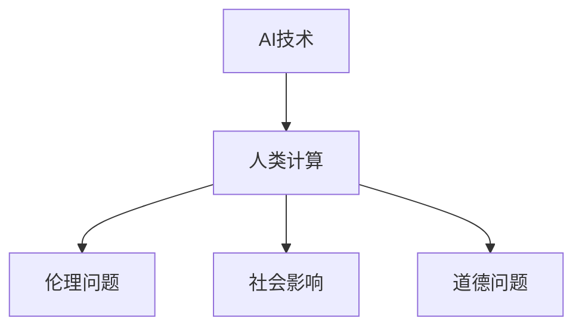

                 

### 文章标题：AI与人类计算：道德、伦理和社会影响

> 关键词：人工智能，道德，伦理，社会影响，计算

> 摘要：本文旨在探讨人工智能（AI）在道德、伦理和社会影响方面的重要性。我们将通过逐步分析AI的核心概念、道德与伦理问题、社会影响以及具体案例，探讨AI技术在现代社会中的应用及其带来的挑战。通过深入思考和理性分析，我们希望能够为AI技术的发展和应用提供有益的指导和建议。

---

## 第一部分：AI与人类计算概述

### 第1章：引言

随着人工智能（AI）技术的迅猛发展，其在社会各个领域的应用越来越广泛。从智能家居到自动驾驶，从医疗诊断到金融分析，AI正在深刻地改变着我们的生活方式。然而，随着AI技术的广泛应用，其带来的道德、伦理和社会影响也日益凸显。本文将围绕AI与人类计算这一主题，从道德、伦理和社会影响三个方面展开讨论。

### 1.1 AI与人类计算的定义与联系

#### AI技术

人工智能是指计算机系统通过模拟人类智能行为，实现感知、学习、推理和决策等功能的综合技术。AI技术的发展可以分为三个层次：弱AI、强AI和超AI。

- **弱AI**：弱AI专注于特定任务的智能化，例如语音识别、图像识别、自然语言处理等。
- **强AI**：强AI能够理解、学习和推理复杂任务，具有广泛的知识和智能水平，类似于人类的智慧。
- **超AI**：超AI超越了人类智能，能够在任何领域超越人类的表现。

#### 人类计算

人类计算是指人类利用大脑和认知能力进行信息处理和决策的过程。它包括感知、记忆、推理、规划和问题解决等多个方面。人类计算具有灵活、自适应和创造性的特点，能够处理复杂和不确定的信息。

#### AI与人类计算的关系图

下面是一个简单的Mermaid流程图，展示了AI与人类计算的关系：



### 1.2 道德与伦理的基础概念

#### 道德

道德是指指导人们行为的规范和准则，通常由社会和文化因素决定。道德的核心目标是追求善，避免恶。道德规范可以分为三类：个人道德、社会道德和职业道德。

- **个人道德**：个人道德是指个体在面对道德冲突时如何做出正确的选择。例如，诚实、善良、尊重他人等。
- **社会道德**：社会道德是指社会成员在共同生活中遵循的行为准则。例如，公平、正义、和谐等。
- **职业道德**：职业道德是指特定职业群体在职业活动中应遵循的行为规范。例如，医生应当尊重患者生命、教师应当公正教学等。

#### 伦理

伦理是指研究道德问题的学科，探讨道德原则、道德规范和道德判断。伦理学主要包括规范伦理学和元伦理学两个分支。

- **规范伦理学**：规范伦理学关注道德规范的形成和评价，探讨道德规范的合理性和适用性。
- **元伦理学**：元伦理学研究道德概念本身，探讨道德术语的意义、道德判断的有效性和道德事实的存在性。

### 第2章：AI的道德与伦理问题

随着AI技术的不断发展，其道德和伦理问题也日益引起关注。AI的道德和伦理问题主要包括AI偏见与歧视、隐私保护、算法透明性和责任归属等。在本章中，我们将对这些问题进行深入探讨。

#### 2.1 AI偏见与歧视

AI偏见与歧视是指AI系统在处理数据和应用中，对某些群体或个体存在不公平的倾向。这种偏见可能源于数据集的不平衡、算法的设计缺陷或训练过程中的错误。

- **数学模型与公式**

为了定量分析AI偏见，我们可以使用以下数学模型和公式：

$$
\text{Bias} = \frac{\sum (\text{预期输出} - \text{实际输出})}{\text{数据集大小}}
$$

其中，预期输出是指在没有偏见的情况下，AI系统应该产生的输出；实际输出是指在有偏见的情况下，AI系统实际产生的输出。偏见的大小可以通过该公式计算。

- **案例分析**

一个典型的案例是招聘过程中的AI偏见。一些公司在招聘时使用基于AI的简历筛选系统，但这些系统可能会对某些种族、性别或年龄群体存在歧视。例如，研究表明，某些AI系统对女性和少数族裔的简历接受率较低，这反映了系统内部的偏见。

为了解决这些问题，可以采取以下措施：

1. **数据清洗**：确保数据集的多样性和代表性，减少偏见数据的影响。
2. **算法优化**：改进算法设计，减少偏见。
3. **监督与审查**：建立监督机制，对AI系统的输出进行定期审查和评估。

#### 2.2 隐私保护

隐私保护是AI伦理问题中的重要一环。随着AI技术的广泛应用，大量个人数据被收集和处理，这引发了隐私泄露和数据滥用的风险。

- **算法原理**

为了保护个人隐私，可以采用以下算法原理：

```python
def protect_privacy(data):
    encrypted_data = encrypt(data)
    return encrypted_data
```

其中，`encrypt` 函数用于对数据进行加密，以确保数据在传输和存储过程中的安全性。

- **案例分析**

一个典型的案例是社交媒体平台的隐私保护问题。一些社交媒体平台在用户不知情的情况下，收集和利用用户数据，用于广告投放和个性化推荐。这种行为引发了用户对隐私保护的担忧。

为了解决这些问题，可以采取以下措施：

1. **数据最小化**：只收集必要的个人信息，避免过度收集。
2. **透明度**：提高数据收集和处理的透明度，让用户了解自己的数据如何被使用。
3. **法律监管**：加强隐私保护法律的制定和执行，确保用户权益。

### 第3章：AI与社会影响

AI技术的发展对社会产生了深远的影响。这些影响不仅体现在经济、教育和就业等方面，还涉及到社会结构和人类行为的变化。

#### 3.1 AI对就业市场的影响

AI技术的发展和应用对就业市场产生了显著的影响。一方面，AI技术促进了新产业的兴起，创造了大量就业机会；另一方面，AI技术也导致了部分传统岗位的减少。

- **数学模型**

为了定量分析AI对就业市场的影响，我们可以使用以下数学模型：

$$
\text{就业率变化} = \frac{\text{失业人数}}{\text{就业人数}} \times 100\%
$$

其中，失业人数是指由于AI技术导致失业的人数；就业人数是指就业市场中总人数。

- **案例分析**

一个典型的案例是自动化对制造业的影响。随着自动化技术的发展，许多制造业岗位被自动化设备取代，导致失业人数增加。然而，同时也有新的就业机会产生，如AI系统维护和开发。

为了应对这些问题，可以采取以下措施：

1. **教育培训**：提高劳动者的技能水平，适应新的就业需求。
2. **政策调整**：制定相关政策，促进就业市场的稳定和转型。
3. **就业指导**：提供就业指导服务，帮助劳动者找到新的就业机会。

### 第4章：AI与隐私保护

隐私保护是AI伦理问题中的重要一环。随着AI技术的广泛应用，大量个人数据被收集和处理，这引发了隐私泄露和数据滥用的风险。

#### 4.1 数据隐私保护法律与伦理

数据隐私保护法律是确保个人数据安全的重要手段。这些法律通常规定了数据收集、处理和使用的规则，以保护个人隐私。

- **算法原理**

为了保护个人隐私，可以采用以下算法原理：

```python
def protect_privacy(data):
    encrypted_data = encrypt(data)
    return encrypted_data
```

其中，`encrypt` 函数用于对数据进行加密，以确保数据在传输和存储过程中的安全性。

- **案例分析**

一个典型的案例是社交媒体平台的隐私保护问题。一些社交媒体平台在用户不知情的情况下，收集和利用用户数据，用于广告投放和个性化推荐。这种行为引发了用户对隐私保护的担忧。

为了解决这些问题，可以采取以下措施：

1. **数据最小化**：只收集必要的个人信息，避免过度收集。
2. **透明度**：提高数据收集和处理的透明度，让用户了解自己的数据如何被使用。
3. **法律监管**：加强隐私保护法律的制定和执行，确保用户权益。

### 第5章：AI在医疗领域的道德问题

AI技术在医疗领域的应用日益广泛，包括诊断、治疗和预测等方面。然而，AI技术在医疗领域的应用也引发了一系列道德问题。

#### 5.1 AI在医疗诊断中的应用

AI在医疗诊断中的应用具有巨大的潜力。通过深度学习和大数据分析，AI系统可以辅助医生进行诊断，提高诊断的准确性和效率。

- **数学模型**

为了定量分析AI在医疗诊断中的应用，我们可以使用以下数学模型：

$$
\text{诊断准确性} = \frac{\text{正确诊断数量}}{\text{总诊断数量}} \times 100\%
$$

其中，正确诊断数量是指AI系统辅助医生诊断正确的病例数量；总诊断数量是指AI系统辅助医生诊断的所有病例数量。

- **案例分析**

一个典型的案例是AI在癌症诊断中的应用。通过分析患者的影像数据和基因信息，AI系统可以辅助医生进行癌症的早期诊断，提高治疗效果。

为了确保AI在医疗诊断中的道德应用，可以采取以下措施：

1. **数据质量控制**：确保诊断数据的准确性和可靠性。
2. **医生监督**：医生在AI系统的辅助下进行诊断，确保诊断结果的准确性和安全性。
3. **患者知情同意**：在诊断过程中，确保患者了解AI系统的作用和限制，并自愿参与诊断。

### 第6章：AI与教育伦理

AI技术在教育领域的应用日益广泛，包括在线教育、个性化学习和智能评估等方面。然而，AI技术在教育领域的应用也引发了一系列伦理问题。

#### 6.1 AI在教育评估中的应用

AI在教育评估中的应用可以提高评估的效率和准确性。通过大数据分析和机器学习算法，AI系统可以对学生进行智能评估，提供个性化的学习建议。

- **数学模型**

为了定量分析AI在教育评估中的应用，我们可以使用以下数学模型：

$$
\text{评估准确性} = \frac{\text{正确评估数量}}{\text{总评估数量}} \times 100\%
$$

其中，正确评估数量是指AI系统评估正确的学生数量；总评估数量是指AI系统评估的所有学生数量。

- **案例分析**

一个典型的案例是AI在线教育平台的评估系统。通过分析学生的在线学习行为和考试成绩，AI系统可以为学生提供个性化的学习建议，提高学习效果。

为了确保AI在教育评估中的道德应用，可以采取以下措施：

1. **数据质量控制**：确保评估数据的准确性和可靠性。
2. **教师监督**：教师在AI系统的辅助下进行评估，确保评估结果的准确性和公正性。
3. **学生知情同意**：在评估过程中，确保学生了解AI系统的作用和限制，并自愿参与评估。

### 第7章：AI与全球伦理问题

随着AI技术的全球化发展，其在全球范围内的伦理问题也日益凸显。这些问题涉及到跨国合作、数据安全和人权等方面。

#### 7.1 AI在全球化背景下的道德挑战

AI在全球化背景下面临的道德挑战主要包括数据跨境传输、算法透明性和技术垄断等。

- **数学模型**

为了定量分析AI在全球化背景下的道德挑战，我们可以使用以下数学模型：

$$
\text{全球化指数} = \frac{\text{国际合作数量}}{\text{总国际关系数量}} \times 100\%
$$

其中，国际合作数量是指不同国家之间在AI技术领域的合作数量；总国际关系数量是指所有国际关系的总和。

- **案例分析**

一个典型的案例是跨国公司AI技术的应用。跨国公司通过在海外设立研发中心，利用全球范围内的数据和技术资源，推动AI技术的发展。然而，这也引发了数据安全和人权问题。

为了应对这些问题，可以采取以下措施：

1. **国际合作**：加强跨国合作，共同制定AI技术标准和伦理规范。
2. **数据安全**：加强数据保护，确保数据在跨境传输过程中的安全性。
3. **人权保护**：确保AI技术的应用符合人权原则，尊重个人隐私和自由。

### 第8章：AI伦理的未来与责任

随着AI技术的不断发展，其伦理问题也面临着新的挑战。未来，我们需要在AI伦理方面做出更多的努力，确保AI技术的健康发展。

#### 8.1 AI伦理的未来趋势

AI伦理的未来趋势将体现在以下几个方面：

1. **算法透明性**：提高算法的透明度，使人们能够理解和监督AI系统的运行过程。
2. **责任归属**：明确AI系统的责任归属，确保在出现问题时能够追究责任。
3. **数据隐私**：加强数据隐私保护，确保个人数据的合法使用和安全。

#### 8.2 AI开发者与政策制定者的责任

AI开发者与政策制定者在AI伦理方面承担着重要的责任。他们需要：

1. **开发者责任**：在开发AI系统时，充分考虑道德和伦理问题，确保系统的公正性和透明性。
2. **政策制定者责任**：制定相关政策，规范AI技术的应用，确保AI技术的发展符合社会利益。

### 结论

人工智能技术正在深刻地改变着我们的生活，其在道德、伦理和社会影响方面的问题也日益凸显。通过逐步分析AI的核心概念、道德与伦理问题、社会影响以及具体案例，我们能够更好地理解AI技术的应用及其带来的挑战。未来，我们需要在AI伦理方面做出更多的努力，确保AI技术的健康发展，为人类社会带来更多的福祉。

---

作者：AI天才研究院/AI Genius Institute & 禅与计算机程序设计艺术 /Zen And The Art of Computer Programming

---

本文通过逐步分析AI与人类计算在道德、伦理和社会影响方面的关系，探讨了AI技术在不同领域的应用和挑战。希望本文能够为读者提供对AI技术的深入理解，并引发对AI伦理问题的思考。在未来，我们需要共同努力，确保AI技术的健康发展，为人类社会带来更多的福祉。

