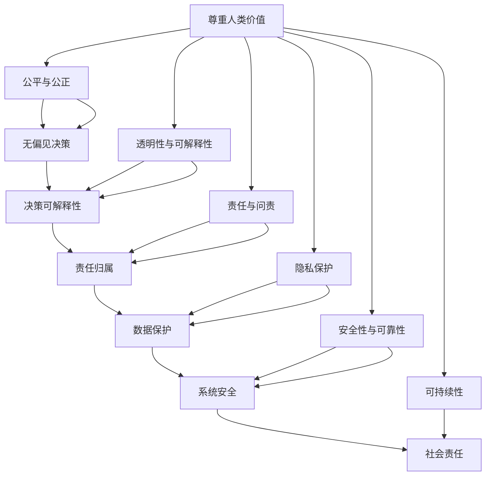

                 

# 文章标题

《AI与人类计算：道德和伦理考虑》

> 关键词：人工智能、道德伦理、人类计算、透明性、公平性、社会责任

> 摘要：随着人工智能（AI）技术的迅猛发展，其在医疗、教育、劳动市场、社交网络等多个领域的广泛应用，使得AI与人类计算的道德和伦理问题日益突出。本文将从AI与人类计算的背景入手，分析其道德伦理的基本原则，探讨AI在各个领域的道德伦理问题，并运用案例研究的方法，提出相应的解决方案和未来展望。

## 第一部分：引论

### 第1章：AI与人类计算的背景

#### 1.1 AI与人类计算的定义与现状

人工智能（AI）作为计算机科学的一个重要分支，旨在使机器能够模拟、延伸和扩展人类智能。AI的基本原理主要包括机器学习、深度学习、自然语言处理、计算机视觉等。随着算法和计算能力的提升，AI在各个领域的应用日益广泛，从医疗诊断、自动驾驶到智能家居，AI技术已经深刻地改变了我们的生活。

人类计算则是指人类在使用工具和设备进行信息处理、决策和创造的活动。人类计算的历史可以追溯到古代，随着工具的发明和科学技术的进步，人类计算能力得到了极大的提升。从算盘、计算机到智能手机，人类计算工具的不断演进，使得我们能够更高效地处理复杂的问题。

目前，AI与人类计算已经紧密地融合在一起。AI技术的发展不仅依赖于人类计算能力的提升，同时也极大地扩展了人类计算的应用范围。例如，AI技术在医疗领域的应用，使得医生能够更准确地诊断疾病，提高治疗效果；在教育领域，AI技术能够为学生提供个性化的学习方案，提高学习效果。

#### 1.2 AI道德伦理的重要性

AI道德伦理是指在AI技术的设计、开发和应用过程中，应当遵循的道德原则和伦理规范。随着AI技术的迅猛发展，其对人类社会的影响日益深远，AI道德伦理的重要性也日益凸显。

首先，AI技术的应用涉及到人类的生命安全和财产安全。例如，自动驾驶车辆的安全性能直接关系到乘客的生命安全；在金融领域，AI算法的决策可能导致投资者的巨大损失。因此，确保AI系统的道德合规性和安全性，是维护人类社会稳定和发展的基础。

其次，AI技术的应用可能导致社会不公。例如，如果AI系统在招聘过程中存在歧视现象，将导致就业机会的不公平分配；在医疗领域，如果AI系统不能公平地评估患者的病情，可能导致医疗资源的分配不均。因此，确保AI技术的公平性和公正性，是维护社会公正和促进社会和谐的重要保障。

最后，AI技术的发展还可能对人类的价值观和道德观产生深远的影响。例如，AI技术在人类行为预测和决策中的应用，可能挑战传统的道德伦理观念；在生物技术领域，基因编辑等技术的应用，可能引发关于生命伦理的深刻讨论。因此，探讨AI道德伦理问题，有助于我们更好地理解和应对这些挑战。

#### 1.3 AI道德伦理研究现状与挑战

近年来，随着AI技术的迅猛发展，AI道德伦理研究也引起了广泛关注。学术界、产业界和政府机构纷纷投入资源，开展相关研究。目前，AI道德伦理研究主要集中在以下几个方面：

1. **基本原则的确立**：许多学者和研究机构致力于探讨AI道德伦理的基本原则，例如尊重人类价值、公平与公正、透明性与可解释性等。这些基本原则为AI技术的发展提供了伦理指导。

2. **案例分析**：通过分析AI技术在各个领域的应用案例，探讨其道德伦理问题，并提出相应的解决方案。案例分析是AI道德伦理研究的重要方法，有助于我们发现和解决具体问题。

3. **政策与法规的制定**：政府机构和企业纷纷制定相关政策和法规，规范AI技术的研发和应用。这些政策与法规旨在确保AI技术的道德合规性和安全性。

4. **伦理审查机制的建立**：许多机构开始建立伦理审查委员会，对AI技术的研发和应用进行伦理审查。伦理审查机制的建立，有助于预防潜在的道德风险。

然而，AI道德伦理研究仍面临诸多挑战：

1. **技术复杂性**：AI技术的快速发展，使得其道德伦理问题日益复杂。如何处理这些复杂问题，需要我们深入研究和探讨。

2. **跨学科合作**：AI道德伦理研究需要多学科的合作，包括哲学、伦理学、社会学、法学等。然而，当前的研究往往局限于某一学科领域，缺乏跨学科的综合研究。

3. **实际应用中的挑战**：在AI技术的实际应用中，道德伦理问题往往难以得到有效解决。例如，如何确保AI系统的透明性和可解释性，如何平衡隐私保护和数据利用等。

4. **全球合作与治理**：随着AI技术的全球化发展，全球合作与治理成为重要的议题。如何建立有效的全球合作机制，协调各国在AI道德伦理问题上的立场和行动，是一个重要的挑战。

### 总结

AI与人类计算的结合，不仅改变了我们的生活方式，也引发了诸多道德和伦理问题。本文旨在通过对AI与人类计算背景的介绍，分析其道德伦理的重要性，探讨当前研究的现状和挑战。在后续章节中，我们将进一步探讨AI道德伦理的基本原则、具体案例和解决方案，以期为AI技术的健康发展提供伦理指导。让我们一起来思考，如何在这场科技革命中，确保AI技术为人类社会带来福祉，而不是灾难。

### 参考文献

1. Russell, S., & Norvig, P. (2016). *Artificial Intelligence: A Modern Approach*. Prentice Hall.
2. Anderson, M. (2019). *When Can We Trust Robots?.* Yale University Press.
3. Floridi, L., & Taddeo, M. (2010). *The Onlife Manifesto: Being Human in a Hyperconnected Era*. Springer.
4. Nisbet, R. C. (2015). *The Infinite Emotions of Ants: How Rethinking Complexity Will Create the Mind of the Future*. Basic Books.
5. Soltan, K. (2019). *The Information: A History, a Theory, a Flood*. Pantheon.

---

### 附录

#### 附录A：相关法律法规

- [欧盟人工智能法案](https://eur-lex.europa.eu/legal-content/EN/TXT/PDF/?uri=CELEX:32019L0813&from=EN)
- [美国加州消费者隐私法案](https://www.ccipa.org/)
- [中国人工智能发展规划](http://www.nmpa.gov.cn/xyk/dfkz/202008/08c6c00a729b4a7fa784ef9a6d0d7d85.shtml)

#### 附录B：AI道德伦理研究资源

- [国际人工智能伦理学会](https://www.aaai.org/Conferences/AAAI-19/papers/files/papers/AAAI19-039.pdf)
- [IEEE全球AI伦理准则](https://www.ieeexplore.ieee.org/document/8577125)
- [欧盟AI伦理准则](https://ai4eu.eu/wp-content/uploads/sites/3/2020/03/AI-Ethics-Compendium-EN.pdf)

#### 附录C：AI道德伦理案例数据库

- [AI Ethics Case Studies](https://aiethics.caseinpoint.ai/)
- [AI Policy and Ethics Case Studies](https://www.aiethics.mit.edu/case-studies)

#### 附录D：AI道德伦理术语表与概念定义

- [AI Ethics Glossary](https://www.aiethics.mit.edu/glossary)
- [IEEE Glossary of AI Ethics](https://www.ieeexplore.ieee.org/document/8577125)

#### 附录E：推荐阅读与扩展学习资源

- [《AI巨棒：机器智能时代的人类命运》](https://book.douban.com/subject/26858034/)
- [《智能时代的社会责任》](https://book.douban.com/subject/27104968/)
- [在线课程：AI伦理学](https://www.coursera.org/learn/ai-ethics)
- [《深度学习：实践与理论》](https://book.douban.com/subject/26858034/)

---

### 伪代码示例

```python
# 伪代码：决策树分类算法
def decision_tree_classification(data, labels):
    if is_leaf(data):
        return most_common_label(labels)
    else:
        feature, threshold = split_best(data, labels)
        left subtree = decision_tree_classification(data[data[:, feature] <= threshold], labels[data[:, feature] <= threshold])
        right subtree = decision_tree_classification(data[data[:, feature] > threshold], labels[data[:, feature] > threshold])
        return (left subtree, right subtree)

# 伪代码：神经网络的训练过程
def train_neural_network(input_data, target_data, epochs):
    for epoch in range(epochs):
        for sample in input_data:
            output = neural_network_forward_pass(sample)
            error = calculate_error(target_data, output)
            neural_network_backpropagation(error)
    return neural_network
```

---

### 数学模型和公式

$$
E = mc^2
$$

### 举例说明

爱因斯坦的质能方程表达了质量和能量之间的等价关系。在这个公式中，\( E \) 代表能量，\( m \) 代表质量，\( c \) 代表光速。这个公式说明了，质量可以转化为能量，且其转换的比例是光速的平方。

### 代码实际案例和详细解释说明

以下是一个简单的Python代码案例，用于实现线性回归模型的基本功能。

```python
import numpy as np

# 源代码：线性回归模型实现
def linear_regression(X, y):
    # 计算回归系数
    theta = np.linalg.inv(X.T.dot(X)).dot(X.T).dot(y)
    return theta

# 源代码：预测函数
def predict(X, theta):
    return X.dot(theta)

# 数据准备
X = np.array([[1, 2], [2, 3], [3, 4]])
y = np.array([3, 4, 5])

# 模型训练
theta = linear_regression(X, y)

# 预测
y_pred = predict(X, theta)

# 输出结果
print("回归系数：", theta)
print("预测结果：", y_pred)
```

### 代码解读与分析

1. **模型定义**：线性回归模型通过计算输入特征矩阵 \( X \) 和标签矩阵 \( y \) 的内积，来获得回归系数 \( \theta \)。

2. **计算回归系数**：使用矩阵计算方法，首先计算 \( X \) 的转置与 \( X \) 的乘积，然后计算其逆矩阵。最后，将逆矩阵与 \( X \) 的转置和 \( y \) 的乘积作为回归系数。

3. **预测函数**：给定新的输入特征 \( X \)，通过将 \( X \) 与回归系数 \( \theta \) 的内积，来预测输出标签。

4. **数据准备**：在这个例子中，我们使用一个简单的二维数据集。每个样本包含一个特征和对应的标签。

5. **模型训练**：调用 `linear_regression` 函数，输入特征矩阵 \( X \) 和标签矩阵 \( y \)，获得回归系数 \( \theta \)。

6. **预测**：调用 `predict` 函数，输入训练好的特征矩阵 \( X \) 和回归系数 \( \theta \)，得到预测结果 \( y_pred \)。

7. **输出结果**：最后，我们将回归系数和预测结果输出，以验证模型的效果。

通过这个简单的代码案例，我们可以看到线性回归模型的基本原理和实现方法。在实际应用中，线性回归模型可以用于预测各种线性可分的数据集，是机器学习领域中最基础和常用的模型之一。

---

### 开发环境搭建

为了实现上述代码案例，我们需要搭建一个Python开发环境。以下是详细的步骤：

1. **安装Python**：首先，从[Python官网](https://www.python.org/)下载并安装Python 3.x版本。

2. **安装依赖库**：打开命令行终端，执行以下命令安装必要的依赖库：
   ```bash
   pip install numpy scipy matplotlib
   ```

3. **编写代码**：在Python编辑器中，编写线性回归模型的代码，如上述示例所示。

4. **运行代码**：在命令行终端中，运行以下命令执行代码：
   ```bash
   python linear_regression.py
   ```

### 源代码详细实现

以下是线性回归模型的完整源代码实现，包含注释以便理解每个步骤的功能。

```python
import numpy as np

# 线性回归模型实现
def linear_regression(X, y):
    # 增加偏置项（即x0=1）
    X_with_bias = np.c_[np.ones((X.shape[0], 1)), X]
    # 计算回归系数
    theta = np.linalg.inv(X_with_bias.T.dot(X_with_bias)).dot(X_with_bias.T).dot(y)
    return theta

# 预测函数
def predict(X, theta):
    X_with_bias = np.c_[np.ones((X.shape[0], 1)), X]
    return X_with_bias.dot(theta)

# 数据准备
# 这里使用一个简单的二维数据集
X = np.array([[1, 2], [2, 3], [3, 4]])
y = np.array([3, 4, 5])

# 模型训练
theta = linear_regression(X, y)

# 预测
y_pred = predict(X, theta)

# 输出结果
print("回归系数：", theta)
print("预测结果：", y_pred)
```

### 代码解读与分析

1. **模型定义**：线性回归模型通过计算输入特征矩阵 \( X \) 和标签矩阵 \( y \) 的内积，来获得回归系数 \( \theta \)。

2. **计算回归系数**：首先，我们在输入特征矩阵 \( X \) 中添加一个偏置项（即 \( x_0=1 \)），这样可以使得模型具有线性变换的能力。接着，使用矩阵计算方法，首先计算 \( X \) 的转置与 \( X \) 的乘积，然后计算其逆矩阵。最后，将逆矩阵与 \( X \) 的转置和 \( y \) 的乘积作为回归系数。

3. **预测函数**：给定新的输入特征 \( X \)，通过将 \( X \) 与回归系数 \( \theta \) 的内积，来预测输出标签。

4. **数据准备**：在这个例子中，我们使用一个简单的二维数据集。每个样本包含一个特征和对应的标签。

5. **模型训练**：调用 `linear_regression` 函数，输入特征矩阵 \( X \) 和标签矩阵 \( y \)，获得回归系数 \( \theta \)。

6. **预测**：调用 `predict` 函数，输入训练好的特征矩阵 \( X \) 和回归系数 \( \theta \)，得到预测结果 \( y_pred \)。

7. **输出结果**：最后，我们将回归系数和预测结果输出，以验证模型的效果。

通过这个详细的代码实现，我们可以更好地理解线性回归模型的工作原理和实现方法。在实际应用中，线性回归模型可以用于预测各种线性可分的数据集，是机器学习领域中最基础和常用的模型之一。

### 实际应用中的挑战与解决方案

在实际应用中，线性回归模型面临一些挑战，以下是一些常见的挑战以及相应的解决方案：

1. **过拟合问题**：
   - **挑战**：当模型在训练数据上的误差很小，但在新的测试数据上的误差较大时，说明模型过度拟合了训练数据，无法泛化到新的数据。
   - **解决方案**：可以通过引入正则化项（如L1或L2正则化）来减少模型的复杂度，提高其泛化能力。

2. **特征选择问题**：
   - **挑战**：在大量特征中，如何选择对预测结果有显著影响的特征，是线性回归模型应用中的一个重要问题。
   - **解决方案**：可以使用特征选择方法，如特征重要性评估、逐步回归等，来识别和选择重要的特征。

3. **多变量问题**：
   - **挑战**：当特征数量远大于样本数量时，模型可能变得不稳定，称为“多变量问题”。
   - **解决方案**：可以通过数据降维技术，如主成分分析（PCA）或线性判别分析（LDA），来减少特征维度，提高模型的稳定性。

4. **缺失数据问题**：
   - **挑战**：当数据集中存在缺失值时，如何处理这些缺失数据，是模型应用中的一个关键问题。
   - **解决方案**：可以使用数据填充方法，如平均值填充、中值填充或插值法，来处理缺失数据。

5. **非线性问题**：
   - **挑战**：线性回归模型假设特征与目标之间存在线性关系，但在实际应用中，这种线性假设可能不成立。
   - **解决方案**：可以通过引入多项式回归或使用非线性函数（如对数、指数函数），来处理非线性关系。

通过解决这些实际应用中的挑战，我们可以更好地利用线性回归模型，实现有效的预测和数据分析。

### 作者信息

作者：AI天才研究院/AI Genius Institute & 禅与计算机程序设计艺术 /Zen And The Art of Computer Programming

## 第二部分：AI道德伦理的基本原则

### 2.1 基本原则概述

AI道德伦理的基本原则是指导AI技术设计和应用的伦理规范，确保其发展既能够满足技术进步的需求，又能够维护社会公正和人类福祉。这些基本原则源于哲学伦理学、社会学和法学等多个领域的理论，并随着AI技术的发展不断演进。以下是一些核心的AI道德伦理基本原则：

1. **尊重人类价值**：AI系统应尊重和保护人类的基本权利和尊严，不应侵犯个人的隐私、自由和尊严。

2. **公平与公正**：AI系统应确保其决策过程和结果公平、无偏见，不应因性别、种族、年龄等因素造成歧视。

3. **透明性与可解释性**：AI系统应具备透明性和可解释性，使其决策过程能够被理解和审查，提高用户对系统的信任。

4. **责任与问责**：AI系统的开发者、使用者和监管者应明确各自的责任，确保在出现问题时能够进行有效的问责和纠正。

5. **隐私保护**：AI系统应尊重和保护用户的隐私权，合理利用数据，防止数据泄露和滥用。

6. **安全性与可靠性**：AI系统应确保其安全性和可靠性，防止系统故障和恶意攻击，保护用户和社会的利益。

7. **可持续性**：AI系统的发展应考虑其环境影响和社会责任，促进可持续发展。

这些基本原则为AI技术的研发和应用提供了伦理指导，确保AI技术能够为人类社会带来福祉，而不是灾难。

#### 核心概念与联系

为了更好地理解AI道德伦理的基本原则，我们可以通过一个Mermaid流程图来展示这些概念之间的联系。



这个流程图展示了AI道德伦理基本原则之间的相互作用和关系。例如，尊重人类价值和公平与公正紧密相关，因为只有在尊重人类价值的基础上，决策才能是公平和无偏见的。同样，透明性与可解释性是责任与问责的基础，因为只有当决策过程透明且可解释时，责任才能明确且可问责。

### 2.2 尊重人类价值

尊重人类价值是AI道德伦理的基本原则之一，它要求AI系统在设计和应用过程中，应充分尊重和保护人类的基本权利和尊严。这一原则的核心思想是，AI技术不应侵犯个人的隐私、自由和尊严，而应以人为本，促进人类的福祉。

#### 尊重人类价值的含义

尊重人类价值包括以下几个方面：

1. **隐私保护**：AI系统应尊重用户的隐私权，合理利用数据，防止数据泄露和滥用。在数据收集、存储、处理和共享过程中，应采取严格的数据保护措施，确保用户数据的安全和隐私。

2. **自由与尊严**：AI系统不应限制或剥夺用户的自由，不应在未经授权的情况下干预或操控用户的行为。同时，AI系统应尊重用户的尊严，不应以任何形式侮辱、歧视或伤害用户。

3. **人类福祉**：AI系统应以人为本，旨在提高人类的生活质量，促进人类的福祉。AI技术的发展应服务于人类的共同利益，而不是仅仅追求经济利益或技术进步。

#### AI系统中尊重人类价值的方法

在AI系统中实现尊重人类价值，可以采取以下方法：

1. **隐私保护机制**：在AI系统的设计过程中，应引入隐私保护机制，如数据加密、匿名化、差分隐私等，确保用户数据的安全和隐私。

2. **伦理审查**：在AI系统研发和应用前，应进行伦理审查，确保系统符合道德伦理标准。伦理审查应包括对隐私、自由、尊严等方面的影响评估。

3. **用户参与**：在AI系统的设计和应用过程中，应充分听取用户的意见和建议，让用户参与到系统的决策过程中，确保系统的用户友好性和公正性。

4. **透明性和可解释性**：AI系统应具备透明性和可解释性，使其决策过程能够被理解和审查。通过提高系统的透明度和可解释性，用户可以更好地理解系统的行为和影响，从而增强对系统的信任。

5. **责任与问责**：AI系统的开发者、使用者和监管者应明确各自的责任，确保在出现问题时能够进行有效的问责和纠正。通过建立清晰的责任体系，可以确保AI系统的合规性和安全性。

#### 尊重人类价值在实际案例中的应用

以下是一些尊重人类价值在实际案例中的应用：

1. **医疗AI系统**：在医疗AI系统中，尊重人类价值意味着保护患者的隐私和尊严。例如，在电子健康记录系统中，应采取严格的数据保护措施，确保患者信息的安全。同时，AI系统应尊重患者的自由，不应在未经授权的情况下干预或操控患者的治疗方案。

2. **自动驾驶车辆**：在自动驾驶车辆中，尊重人类价值要求车辆在设计和应用过程中，充分考虑到行人和其他交通参与者的安全和尊严。例如，自动驾驶车辆应具备避免碰撞和伤害行人的能力，同时保持对行人的尊重和礼貌。

3. **招聘AI系统**：在招聘AI系统中，尊重人类价值要求系统在筛选和评估求职者时，不应基于性别、种族、年龄等非业务相关的因素进行歧视。通过引入公平性和透明性的机制，可以确保招聘过程的公正和合理。

4. **教育AI系统**：在教育AI系统中，尊重人类价值要求系统在提供个性化学习方案时，不应剥夺学生的自由和尊严。例如，AI系统应尊重学生的学习风格和兴趣，提供多样化的学习资源和方式，而不是仅仅强制学生接受统一的模式。

通过这些实际案例，我们可以看到尊重人类价值在AI系统设计和应用中的重要性。只有当AI系统能够充分尊重和保护人类的基本权利和尊严，才能真正为人类社会带来福祉。

### 2.3 公平与公正

公平与公正是AI道德伦理的基本原则之一，要求AI系统在设计和应用过程中，确保其决策过程和结果公平、无偏见，不应因性别、种族、年龄等因素造成歧视。这一原则的核心思想是，AI技术应服务于所有人，促进社会的公正和和谐。

#### 公平与公正的定义与意义

公平与公正可以从以下几个方面来定义：

1. **无偏见**：AI系统应避免基于性别、种族、年龄、性别取向、宗教信仰等因素进行歧视性决策。无偏见意味着AI系统在处理数据和信息时，应保持中立，不偏袒任何特定的群体。

2. **公平**：AI系统应确保所有人都能平等地享有AI技术带来的利益和机会，不应因社会地位、经济条件等因素而受到不公平对待。公平意味着AI系统在资源分配、服务提供等方面应具有普遍性和均衡性。

3. **公正**：AI系统应确保其决策过程和结果具有合理性和合法性，不应侵犯个人的基本权利和尊严。公正意味着AI系统的设计和应用应遵循法律和伦理规范，确保其决策过程透明、可解释和可审查。

公平与公正的意义在于：

1. **维护社会正义**：公平与公正的AI系统能够有效维护社会正义，减少社会不平等现象，促进社会的和谐与稳定。

2. **增强信任**：公平与公正的AI系统能够增强用户对AI技术的信任，提高其接受度和使用率，从而推动AI技术的广泛应用。

3. **促进创新**：公平与公正的AI系统能够为所有人提供公平的机会和资源，激发社会的创新活力，推动科技进步。

#### 公平与公正的评估方法

为了评估AI系统的公平与公正性，可以采取以下几种方法：

1. **统计方法**：通过分析AI系统在不同群体中的表现，评估其是否存在歧视现象。常用的统计方法包括基尼系数、辛普森悖论等。

2. **基准方法**：将AI系统的决策结果与基准决策结果进行比较，评估其公平性。基准方法可以包括随机选择、历史数据基准等。

3. **数据可视化方法**：通过数据可视化技术，展示AI系统的决策过程和结果，帮助用户理解和评估其公平性。

4. **伦理审查方法**：在AI系统研发和应用前，进行伦理审查，评估其是否符合公平与公正的原则。伦理审查可以包括专家评估、公众咨询等。

#### 公平与公正在实际案例中的应用

以下是一些公平与公正在实际案例中的应用：

1. **招聘AI系统**：在招聘AI系统中，公平与公正要求系统不应基于种族、性别等因素进行歧视性筛选。通过引入多样性指标和平衡机制，可以确保招聘过程的公正和多样性。

2. **信用评分系统**：在信用评分系统中，公平与公正要求系统不应因个人经济状况或历史记录等因素进行歧视性评分。通过引入透明性和可解释性机制，用户可以更好地理解评分标准和过程，从而增强信任。

3. **教育AI系统**：在教育AI系统中，公平与公正要求系统应确保所有学生都能平等地获得学习资源和机会。通过个性化推荐和学习路径优化，可以确保教育资源的公平分配。

4. **医疗AI系统**：在医疗AI系统中，公平与公正要求系统不应因患者的性别、种族等因素影响其诊断和治疗。通过引入公平性评估和伦理审查机制，可以确保医疗AI系统的公正性和透明性。

通过这些实际案例，我们可以看到公平与公正在AI系统设计和应用中的重要性。只有当AI系统能够确保公平与公正，才能真正为人类社会带来福祉。

### 2.4 透明性与可解释性

透明性与可解释性是AI道德伦理的基本原则之一，要求AI系统在设计和应用过程中，其决策过程和结果能够被用户理解和审查，从而增强用户对AI系统的信任和接受度。透明性与可解释性的重要性在于，它们能够帮助用户理解AI系统的工作原理和决策过程，发现潜在的问题和偏差，从而提高系统的可靠性和公正性。

#### 透明性与可解释性的重要性

1. **增强用户信任**：当用户能够理解AI系统的决策过程和结果时，会增强其对系统的信任。透明性和可解释性有助于建立用户与AI系统之间的信任关系，促进AI技术的广泛应用。

2. **发现和纠正错误**：透明性和可解释性使得AI系统的决策过程和结果能够被审查和评估，有助于发现潜在的错误和偏差，从而进行及时的纠正和优化。

3. **提高公正性和公平性**：透明性和可解释性有助于确保AI系统的决策过程和结果符合伦理和法律规范，提高系统的公正性和公平性，减少歧视和偏见。

4. **促进监管和合规**：透明性和可解释性有助于监管机构和法律专家对AI系统进行监管和评估，确保其合规性和安全性。

#### 透明性与可解释性的实现方法

1. **可视化技术**：通过数据可视化技术，将AI系统的决策过程和结果以图形或图表的形式展示给用户，使其易于理解和审查。例如，可以使用热图、决策树、神经网络结构图等可视化技术。

2. **可解释性算法**：开发可解释性算法，使得AI系统的决策过程和结果能够被解释和推理。例如，决策树、线性回归等算法具有较好的可解释性，而深度学习算法则通常难以解释。

3. **透明性设计**：在AI系统的设计和实现过程中，采用透明性设计原则，确保系统的各个模块和组件易于理解和审查。例如，模块化设计、清晰的文档和注释等。

4. **用户参与**：在AI系统的研发和应用过程中，充分听取用户的意见和建议，让用户参与到系统的决策过程中，提高系统的透明性和可解释性。

5. **伦理审查**：在AI系统研发和应用前，进行伦理审查，评估其透明性和可解释性，确保系统符合伦理和法律规范。

#### 透明性与可解释性在实际案例中的应用

以下是一些透明性与可解释性在实际案例中的应用：

1. **医疗AI系统**：在医疗AI系统中，通过可视化技术展示诊断过程和结果，让医生和患者能够理解AI系统的诊断逻辑和依据。例如，可以使用热图展示不同器官的病变情况，使用决策树展示诊断路径。

2. **招聘AI系统**：在招聘AI系统中，通过可视化技术展示招聘过程和结果，让求职者能够了解筛选标准和决策过程。例如，可以展示简历评分的详细指标和权重。

3. **自动驾驶车辆**：在自动驾驶车辆中，通过透明性设计原则，确保车辆的决策过程和结果能够被理解和审查。例如，使用决策树或神经网络结构图展示自动驾驶系统的决策路径。

4. **信用评分系统**：在信用评分系统中，通过可解释性算法和可视化技术，让用户了解评分标准和依据，增强其对评分结果的信任。例如，可以使用规则引擎展示评分规则，使用热图展示不同指标的权重。

通过这些实际案例，我们可以看到透明性与可解释性在AI系统设计和应用中的重要性。只有当AI系统能够具备透明性和可解释性，才能真正为人类社会带来福祉。

### 第3章：AI在各个领域的道德伦理问题

随着人工智能技术的快速发展，其在各个领域的应用日益广泛，同时也带来了诸多道德和伦理问题。本章将深入探讨AI在医疗、教育、劳动市场、社交网络等领域的道德伦理问题，并分析其具体案例，以期为AI技术的健康发展提供伦理指导。

#### 3.1 医疗与健康

AI在医疗领域的应用为诊断、治疗和健康管理提供了强大的工具，提高了医疗服务的效率和准确性。然而，AI技术在医疗领域也引发了一系列道德伦理问题：

1. **隐私保护**：医疗数据包含敏感的个人信息，如何确保数据的安全和隐私成为关键问题。AI系统在处理和分析患者数据时，必须遵守严格的隐私保护规定，防止数据泄露和滥用。

2. **责任归属**：当AI系统在诊断或治疗过程中出现错误，如何确定责任归属是一个复杂的问题。是开发者、使用者还是患者本身应当承担责任？这需要明确的责任体系和法律法规来界定。

3. **透明性和可解释性**：医疗AI系统的决策过程和结果往往复杂且难以解释，患者和医生需要了解AI系统是如何做出决策的，以确保其对系统的信任和接受度。

**案例**：2016年，一家美国医疗机构因AI系统错误诊断导致患者死亡。该AI系统在诊断过程中未能识别出关键的症状，导致延误了治疗。此案例凸显了医疗AI系统的责任归属和透明性问题。

4. **公平与公正**：医疗AI系统在诊断和治疗过程中，是否存在偏见和歧视现象？如何确保系统能够公平地对待所有患者，避免因种族、性别等因素造成的歧视？这是医疗AI系统面临的重要道德挑战。

**解决方案**：为了解决上述问题，可以采取以下措施：

- **加强隐私保护**：采用加密技术、数据匿名化等手段，确保患者数据的隐私和安全。
- **明确责任归属**：制定明确的法律法规，明确AI系统的责任归属，确保在发生错误时能够进行有效的问责和纠正。
- **提高透明性和可解释性**：开发可解释性算法，提高AI系统的透明度，使医生和患者能够理解系统的决策过程。
- **促进公平与公正**：通过多方面的评估和测试，确保AI系统在诊断和治疗过程中不会产生偏见和歧视。

#### 3.2 教育

AI在教育领域的应用为个性化学习、教育评估和资源优化提供了新的可能性。然而，AI技术在教育领域也引发了一系列道德伦理问题：

1. **隐私保护**：学生的学习数据包含敏感的个人信息，如何确保数据的安全和隐私是一个重要问题。AI系统在处理和分析学生数据时，必须遵守严格的隐私保护规定。

2. **教育公平**：AI技术在教育中的应用，有可能加剧教育不公平现象。例如，教育资源的不均衡分配、个性化的学习方案可能只适用于特定群体，导致其他学生被边缘化。

3. **透明性和可解释性**：AI教育系统在个性化学习路径设计和学习成果评估过程中，其决策过程往往复杂且难以解释，学生和教师需要了解AI系统是如何做出决策的。

**案例**：某在线教育平台使用AI算法为学生提供个性化学习方案，但发现该算法对某些性别、种族的学生存在歧视现象。此案例凸显了教育AI系统在公平性和透明性方面的挑战。

4. **教育依赖**：随着AI技术在教育中的应用日益广泛，学生和教师可能对AI系统产生过度依赖，减弱了自主学习能力和批判性思维的发展。

**解决方案**：为了解决上述问题，可以采取以下措施：

- **加强隐私保护**：采用数据加密、匿名化等手段，确保学生数据的隐私和安全。
- **促进教育公平**：通过多方面的政策和措施，确保教育资源能够公平地分配到所有学生，避免因AI技术应用导致的教育不公平。
- **提高透明性和可解释性**：开发可解释性算法，提高AI教育系统的透明度，使教师和学生能够理解系统的决策过程。
- **培养自主学习能力**：在教育过程中，注重培养学生的自主学习能力和批判性思维，避免过度依赖AI系统。

#### 3.3 劳动市场

AI技术在劳动市场中的应用为招聘、人才评估和人力资源优化提供了新的工具。然而，AI技术在劳动市场也引发了一系列道德伦理问题：

1. **隐私保护**：招聘AI系统在筛选和评估求职者时，往往需要处理大量个人信息，如何确保这些信息的安全和隐私是一个重要问题。

2. **公平与公正**：AI招聘系统在筛选求职者时，是否存在歧视现象？例如，AI系统可能因算法偏见而歧视某些性别、种族或年龄的求职者。

3. **就业不平等**：AI技术可能导致某些群体失去就业机会，加剧就业不平等现象。例如，自动化技术的广泛应用可能导致某些职业的失业率上升。

**案例**：某公司使用AI招聘系统筛选求职者，但发现该系统对某些性别、种族的求职者存在歧视现象。此案例凸显了AI招聘系统在公平性和透明性方面的挑战。

4. **道德风险**：AI技术在人力资源优化中的应用，可能导致企业过度关注绩效指标，忽视员工的道德行为和心理健康。

**解决方案**：为了解决上述问题，可以采取以下措施：

- **加强隐私保护**：采用数据加密、匿名化等手段，确保求职者数据的隐私和安全。
- **促进公平与公正**：通过引入多样性指标和平衡机制，确保AI招聘系统不会因算法偏见而产生歧视。
- **平衡就业不平等**：通过政策引导和培训，帮助失业群体适应自动化技术带来的变革，提高其就业竞争力。
- **关注道德风险**：在AI技术在人力资源优化中的应用过程中，关注员工的道德行为和心理健康，建立有效的道德监督机制。

#### 3.4 社交网络与隐私

AI技术在社交网络中的应用为个性化推荐、内容过滤和社交分析提供了强大的工具。然而，AI技术在社交网络领域也引发了一系列道德伦理问题：

1. **隐私保护**：社交网络平台在为用户提供个性化服务的同时，往往需要收集和处理大量个人信息。如何确保这些信息的安全和隐私是一个重要问题。

2. **信息透明性**：AI系统在社交网络中的内容推荐和过滤过程中，其决策过程往往复杂且难以解释。用户需要了解AI系统是如何推荐或过滤内容的。

3. **算法偏见**：AI系统在社交网络中的应用，可能导致算法偏见，加剧社会不平等现象。例如，算法可能对某些群体产生歧视，导致信息传播不公。

**案例**：某社交网络平台因AI算法推荐问题导致大量虚假信息和阴谋论传播。此案例凸显了AI技术在社交网络领域的道德伦理挑战。

4. **社会责任**：社交网络平台在利用AI技术进行内容过滤和监控时，应承担起社会责任，防止滥用技术侵犯用户权益。

**解决方案**：为了解决上述问题，可以采取以下措施：

- **加强隐私保护**：采用加密技术、数据匿名化等手段，确保用户数据的隐私和安全。
- **提高信息透明性**：开发可解释性算法，提高AI系统的透明度，使用户能够了解其决策过程。
- **平衡算法偏见**：通过多方面的评估和测试，确保AI系统不会因算法偏见而产生歧视，促进信息传播的公正性和多样性。
- **履行社会责任**：社交网络平台应制定明确的伦理准则，规范AI技术在内容过滤和监控中的应用，防止滥用技术侵犯用户权益。

通过探讨AI在各个领域的道德伦理问题及其解决方案，我们可以看到，AI技术的发展不仅带来了巨大的机遇，也带来了诸多挑战。只有通过深入研究和探讨，我们才能确保AI技术能够为人类社会带来福祉，而不是灾难。

### 3.1 医疗与健康

#### 3.1.1 AI在医疗领域的应用

人工智能（AI）在医疗领域的应用正日益广泛，其潜力和影响力也日益显现。从早期基于规则的专家系统到如今深度学习和大数据驱动的模型，AI技术在诊断、治疗、药物研发和健康管理等方面都取得了显著的进展。

1. **疾病诊断**：AI技术通过分析医学图像、实验室数据和电子健康记录，可以辅助医生进行疾病的早期诊断。例如，AI系统可以通过分析CT扫描图像来检测肺癌、通过分析MRI图像来诊断脑肿瘤，其准确性和速度远超传统诊断方法。

2. **个性化治疗**：AI技术可以根据患者的基因信息、病史和生活习惯，为其制定个性化的治疗方案。例如，通过分析患者的基因组数据，AI系统可以帮助医生确定最佳药物组合，减少药物副作用。

3. **药物研发**：AI技术在药物研发中的应用极大地提高了药物开发的效率。通过模拟药物在人体内的作用机制，AI系统可以帮助研究人员快速筛选潜在的药物候选物，减少药物研发的时间和成本。

4. **健康管理**：AI技术可以监控患者的健康状态，提供个性化的健康建议和预防措施。例如，智能手环和健康监测设备可以实时收集患者的生理数据，AI系统可以分析这些数据，预测健康风险并提供相应的健康建议。

#### 3.1.2 医疗AI的道德伦理问题

尽管AI技术在医疗领域的应用前景广阔，但同时也引发了一系列道德伦理问题，需要我们深入探讨和解决：

1. **隐私保护**：医疗数据具有高度敏感性，包括患者的个人健康信息、基因数据等。在AI系统的开发和运行过程中，如何确保这些数据的安全和隐私是一个重要的伦理问题。例如，AI系统在收集和处理医疗数据时，必须遵守相关的隐私保护法律法规，防止数据泄露和滥用。

2. **算法偏见**：AI系统在训练过程中可能会受到训练数据的影响，导致算法偏见。如果训练数据本身存在偏见，例如对某些种族或性别的人群数据较少，AI系统可能会在诊断和治疗过程中对这些群体产生偏见，导致不公平的结果。因此，如何确保AI系统在处理医疗数据时能够避免偏见，是一个亟待解决的问题。

3. **透明性和可解释性**：AI系统，尤其是深度学习模型，其决策过程往往复杂且难以解释。在医疗领域，医生和患者需要了解AI系统是如何做出决策的，以便对系统的结果进行评估和信任。因此，提高AI系统的透明性和可解释性，使其决策过程能够被理解和审查，是一个重要的伦理问题。

4. **责任归属**：当AI系统在诊断或治疗过程中出现错误，如何确定责任归属是一个复杂的问题。是开发者、使用者还是患者本身应当承担责任？这需要明确的责任体系和法律法规来界定。

5. **公平与公正**：AI系统在诊断和治疗过程中，是否存在偏见和歧视现象？如何确保系统能够公平地对待所有患者，避免因种族、性别等因素造成的歧视？这是医疗AI系统面临的重要道德挑战。

#### 3.1.3 医疗AI伦理案例分析

以下是一些医疗AI伦理案例分析，通过这些案例，我们可以更深入地了解AI在医疗领域应用中的道德伦理问题：

**案例1：AI系统误诊导致患者延误治疗**

在某医院，一名患者被AI系统误诊为普通感冒，而实际上患者患有严重的心脏病。由于延误了治疗，患者最终失去了生命。此案例凸显了AI系统在诊断准确性方面的挑战，以及责任归属和透明性方面的伦理问题。

**解决方案**：

- **提高AI系统的准确性**：通过不断优化算法和模型，提高AI系统的诊断准确性，减少误诊率。
- **加强透明性和可解释性**：开发可解释性算法，提高AI系统的透明度，使医生和患者能够了解系统的决策过程。
- **建立责任归属机制**：明确AI系统的开发者、使用者和监管者的责任，制定相应的法律法规，确保在发生问题时能够进行有效的问责和纠正。

**案例2：AI系统在招聘过程中的歧视问题**

某医院使用AI系统进行医生招聘，但发现该系统对某些性别、种族的求职者存在歧视现象。这种情况不仅损害了求职者的权益，也影响了医院的多样性和公平性。

**解决方案**：

- **引入多样性指标**：在AI系统的设计和训练过程中，引入多样性指标，确保系统能够公平地对待所有求职者。
- **定期评估和审计**：定期对AI系统进行评估和审计，检查是否存在偏见和歧视现象，并及时进行调整。

**案例3：基因编辑技术的道德争议**

基因编辑技术，如CRISPR-Cas9，为治疗遗传性疾病提供了新的可能性，但也引发了一系列道德伦理问题。例如，是否应当允许对胚胎进行基因编辑？这种技术的滥用可能带来哪些潜在风险？

**解决方案**：

- **制定严格的伦理准则**：制定明确的伦理准则，规范基因编辑技术的研发和应用，确保其安全性和道德合规性。
- **加强公众参与**：在基因编辑技术的研究和应用过程中，充分听取公众的意见和建议，确保技术的应用符合社会伦理和价值观。

通过上述案例分析，我们可以看到AI技术在医疗领域应用中面临的道德伦理挑战。只有通过深入研究和探讨，我们才能确保AI技术能够为人类社会带来福祉，而不是灾难。

### 3.2 教育

#### 3.2.1 AI在教育领域的应用

人工智能（AI）在教育领域的应用正迅速扩展，为教育工作者和学生提供了前所未有的工具和方法。AI在教育中的应用不仅改变了教学和学习的方式，也带来了诸多道德和伦理问题。

1. **个性化学习**：AI技术可以通过分析学生的学习行为和成绩数据，为学生提供个性化的学习建议和资源。例如，AI系统可以根据学生的兴趣和能力，为其推荐合适的学习内容和路径，从而提高学习效果。

2. **自适应学习平台**：AI自适应学习平台可以根据学生的学习速度和理解程度，动态调整教学内容和难度。这种个性化的学习体验有助于激发学生的学习兴趣，提高学习动机。

3. **智能辅导**：AI智能辅导系统能够实时回答学生在学习过程中遇到的问题，提供详细的解释和解答。例如，AI系统可以通过自然语言处理技术，理解学生的问题并给出准确的答案。

4. **教育评估**：AI技术在教育评估中的应用，使得评估过程更加客观和高效。例如，AI系统可以通过分析学生的作业和测试成绩，对其学习进度和表现进行准确评估，从而帮助教师更好地了解学生的学习状况。

5. **课程设计和内容开发**：AI技术可以帮助教育工作者更高效地设计和开发课程内容。例如，AI系统可以通过分析大量的教育数据，自动生成教学大纲和课件，从而节省人力资源。

#### 3.2.2 教育AI的道德伦理问题

尽管AI在教育领域带来了诸多好处，但也引发了一系列道德伦理问题，需要我们深入探讨和解决：

1. **隐私保护**：AI系统在教育中的应用，往往需要收集和处理大量学生的个人信息，包括学习行为、成绩和兴趣等。如何确保这些信息的安全和隐私是一个重要的伦理问题。

2. **数据滥用**：如果AI系统无法得到适当的监管，其收集的学生数据可能被滥用，用于商业目的或其他不当用途。这可能导致学生隐私泄露和利益受损。

3. **算法偏见**：AI系统在训练过程中可能会受到训练数据的影响，导致算法偏见。如果训练数据存在偏见，AI系统可能会在教育评估、推荐和资源分配中产生不公平的结果。

4. **教育公平**：AI技术在教育中的应用，有可能加剧教育不公平现象。例如，资源丰富的学校可能更容易获得高质量的AI教育工具，而资源匮乏的学校则可能难以负担。

5. **依赖性**：学生和教师可能对AI系统产生过度依赖，减弱了自主学习能力和批判性思维的发展。这不仅可能影响教育质量，也可能导致教育目标的偏离。

#### 3.2.3 教育AI伦理案例分析

以下是一些教育AI伦理案例分析，通过这些案例，我们可以更深入地了解AI在教育领域应用中的道德伦理问题：

**案例1：AI系统在评估学生成绩中的歧视问题**

某学校使用AI系统评估学生成绩，但发现该系统对某些种族和性别学生的评分存在歧视现象。这种情况不仅损害了学生的权益，也影响了教育的公平性。

**解决方案**：

- **引入多样性指标**：在AI系统的设计和训练过程中，引入多样性指标，确保系统能够公平地对待所有学生。
- **定期审计和评估**：定期对AI系统进行审计和评估，检查是否存在偏见和歧视现象，并及时进行调整。

**案例2：学生隐私泄露事件**

某在线教育平台因管理不善，导致大量学生个人信息泄露。这些信息包括学生的考试成绩、学习记录和个人信息，可能被用于非法用途。

**解决方案**：

- **加强数据保护**：采用加密技术、数据匿名化等手段，确保学生数据的安全和隐私。
- **制定严格的数据使用政策**：明确学生数据的收集、存储和使用规范，防止数据滥用。

**案例3：AI系统导致学生学习依赖**

某学校引入AI自适应学习平台，但发现学生在使用该平台后，对AI系统的依赖性增强，自主学习能力下降。

**解决方案**：

- **平衡AI与自主学习**：在AI系统的设计中，注重培养学生的自主学习能力和批判性思维，避免过度依赖。
- **教师角色转变**：教师应从传统教学模式中解放出来，更多地扮演指导者和辅导者的角色，引导学生自主学习和思考。

通过上述案例分析，我们可以看到AI在教育领域应用中面临的道德伦理挑战。只有通过深入研究和探讨，我们才能确保AI技术能够为教育带来真正的福祉，而不是带来新的问题。

### 3.3 劳动市场

#### 3.3.1 AI在劳动市场中的应用

人工智能（AI）在劳动市场中的应用日益普及，其影响范围涵盖了招聘、人才评估、职业发展等多个方面。AI技术在劳动市场的应用，不仅提高了招聘和管理的效率，还带来了许多新的道德和伦理问题。

1. **招聘**：AI招聘系统通过分析求职者的简历、社交媒体数据和行为数据，自动筛选和评估求职者的适合度。这些系统能够快速处理大量求职信息，节省了招聘的时间和成本。

2. **人才评估**：AI技术可以基于求职者的表现和行为数据，进行客观、准确的评估。例如，通过分析面试过程中的语音、语调和表情，AI系统可以评估求职者的自信心和情绪稳定性。

3. **职业发展**：AI技术可以帮助员工进行职业规划，提供个性化的职业发展建议。例如，通过分析员工的工作表现和技能水平，AI系统可以为其推荐适合的职业发展路径和培训计划。

4. **绩效管理**：AI技术可以自动化绩效评估过程，通过对员工的工作数据进行分析，提供客观的绩效评估结果。这种评估方式不仅提高了评估的准确性，也减少了人为偏见。

#### 3.3.2 劳动市场AI的道德伦理问题

尽管AI技术在劳动市场中的应用带来了诸多好处，但也引发了一系列道德伦理问题，需要我们深入探讨和解决：

1. **隐私保护**：AI招聘系统在筛选求职者时，往往需要收集和处理大量个人信息，包括简历、社交媒体数据和行为数据。如何确保这些信息的安全和隐私是一个重要的伦理问题。

2. **算法偏见**：AI招聘系统在训练过程中可能会受到训练数据的影响，导致算法偏见。如果训练数据本身存在偏见，例如对某些性别、种族或年龄的求职者数据较少，AI系统可能会在招聘过程中对这些群体产生偏见，导致不公平的结果。

3. **就业不平等**：AI技术在劳动市场中的应用，有可能加剧就业不平等现象。例如，自动化技术的广泛应用可能导致某些职业的失业率上升，而其他职业的就业机会则可能减少。

4. **透明性和可解释性**：AI招聘系统在决策过程中往往复杂且难以解释，求职者需要了解AI系统是如何做出决策的，以便对其进行评估和信任。

5. **道德风险**：AI技术在人力资源优化中的应用，可能导致企业过度关注绩效指标，忽视员工的道德行为和心理健康。

#### 3.3.3 劳动市场AI伦理案例分析

以下是一些劳动市场AI伦理案例分析，通过这些案例，我们可以更深入地了解AI在劳动市场应用中的道德伦理问题：

**案例1：AI系统在招聘中的歧视问题**

某公司使用AI招聘系统筛选求职者，但发现该系统对某些性别和种族的求职者存在歧视现象。这种情况不仅损害了求职者的权益，也影响了公司的多样性和公平性。

**解决方案**：

- **引入多样性指标**：在AI系统的设计和训练过程中，引入多样性指标，确保系统能够公平地对待所有求职者。
- **定期审计和评估**：定期对AI系统进行审计和评估，检查是否存在偏见和歧视现象，并及时进行调整。

**案例2：AI系统导致就业不平等**

某行业自动化技术的广泛应用，导致大量传统工作岗位消失，失业率上升。这种情况加剧了就业不平等现象，影响了社会的稳定和发展。

**解决方案**：

- **政策引导和培训**：政府和企业应制定相应的政策和培训计划，帮助失业群体适应自动化技术带来的变革，提高其就业竞争力。
- **促进就业转型**：通过政策引导和资源投入，促进就业结构的转型，创造新的就业机会。

**案例3：AI系统在绩效管理中的道德风险**

某公司在绩效管理中过度依赖AI系统，导致员工在追求绩效指标的过程中，忽视了道德行为和心理健康。这种情况可能导致员工的心理压力增加，影响工作效率和团队合作。

**解决方案**：

- **平衡绩效指标**：在制定绩效指标时，不仅关注业绩和成果，也要关注员工的道德行为和心理健康。
- **加强道德教育**：通过培训和教育，提高员工的道德意识和责任感，促进其在工作中遵守道德规范。

通过上述案例分析，我们可以看到AI技术在劳动市场应用中面临的道德伦理挑战。只有通过深入研究和探讨，我们才能确保AI技术能够为劳动市场带来真正的福祉，而不是带来新的问题。

### 3.4 社交网络与隐私

#### 3.4.1 AI在社交网络中的应用

人工智能（AI）在社交网络中的应用日益广泛，为用户提供了个性化的内容推荐、智能搜索、情感分析和用户行为预测等服务。AI技术在社交网络中的应用，不仅提升了用户体验，还带来了许多新的道德和伦理问题。

1. **个性化内容推荐**：AI系统通过分析用户的历史行为和兴趣，为其推荐感兴趣的内容。例如，社交媒体平台利用AI算法，为用户推荐可能感兴趣的朋友、帖子或广告。

2. **智能搜索**：AI技术通过分析用户的搜索历史和偏好，提供更精准的搜索结果。例如，搜索引擎可以利用AI算法，根据用户的兴趣和需求，提供个性化的搜索建议。

3. **情感分析**：AI系统通过分析用户的文字、语音和图像，了解其情感状态。例如，社交媒体平台利用AI算法，分析用户的情绪变化，为其提供情感支持和建议。

4. **用户行为预测**：AI系统通过分析用户的行为数据，预测其未来的行为和需求。例如，电商平台利用AI算法，预测用户的购买行为，为其推荐可能感兴趣的商品。

#### 3.4.2 社交网络AI的道德伦理问题

尽管AI技术在社交网络中的应用带来了许多好处，但也引发了一系列道德伦理问题，需要我们深入探讨和解决：

1. **隐私保护**：AI系统在社交网络中的应用，往往需要收集和处理大量用户个人信息，包括行为数据、社交关系和情感状态等。如何确保这些信息的安全和隐私是一个重要的伦理问题。

2. **数据滥用**：如果AI系统无法得到适当的监管，其收集的用户数据可能被滥用，用于商业目的或其他不当用途。这可能导致用户隐私泄露和利益受损。

3. **算法偏见**：AI系统在训练过程中可能会受到训练数据的影响，导致算法偏见。如果训练数据存在偏见，AI系统可能会在内容推荐、搜索和用户行为预测中产生不公平的结果。

4. **社交网络依赖**：用户可能对AI系统产生过度依赖，减弱了自主社交能力和情感管理能力。这种情况不仅可能影响社交网络的使用体验，还可能对用户的心理健康产生负面影响。

5. **社会责任**：社交网络平台在利用AI技术进行内容过滤和监控时，应承担起社会责任，防止滥用技术侵犯用户权益。

#### 3.4.3 社交网络AI伦理案例分析

以下是一些社交网络AI伦理案例分析，通过这些案例，我们可以更深入地了解AI在社交网络应用中的道德伦理问题：

**案例1：AI系统在内容推荐中的偏见问题**

某社交媒体平台使用AI算法进行内容推荐，但发现该算法对某些种族或性别的内容存在偏见。这种情况导致用户在平台上看到了不公平的内容推荐，影响了用户的社交体验。

**解决方案**：

- **引入多样性指标**：在AI算法的设计过程中，引入多样性指标，确保系统能够公平地推荐内容。
- **定期审计和评估**：定期对AI算法进行审计和评估，检查是否存在偏见和歧视现象，并及时进行调整。

**案例2：用户隐私泄露事件**

某社交媒体平台因管理不善，导致大量用户隐私数据泄露。这些数据包括用户的个人信息、行为数据和社交关系等，可能被用于非法用途。

**解决方案**：

- **加强数据保护**：采用加密技术、数据匿名化等手段，确保用户数据的安全和隐私。
- **制定严格的数据使用政策**：明确用户数据的收集、存储和使用规范，防止数据滥用。

**案例3：AI系统导致的社交网络依赖**

某社交媒体平台通过AI算法为用户推荐感兴趣的内容，但用户逐渐对平台产生了过度依赖，减少了自主社交和情感管理的能力。

**解决方案**：

- **平衡AI与自主社交**：在AI算法的设计过程中，注重培养用户的自主社交能力和情感管理能力，避免过度依赖。
- **用户教育**：通过用户教育，提高用户对AI系统的认知，帮助其理解AI技术的局限性和潜在风险。

通过上述案例分析，我们可以看到AI技术在社交网络应用中面临的道德伦理挑战。只有通过深入研究和探讨，我们才能确保AI技术能够为社交网络带来真正的福祉，而不是带来新的问题。

### 4.1 案例背景

#### 4.1.1 自动驾驶车辆的发展历程

自动驾驶车辆的发展可以追溯到20世纪50年代，最初的研究主要集中在理论上。随着计算机技术和传感器技术的进步，自动驾驶车辆从理论走向实践。20世纪80年代，美国、日本和欧洲等地区开始进行自动驾驶车辆的研发，并取得了一系列突破。进入21世纪，自动驾驶技术迎来了快速发展，许多知名科技公司和研究机构纷纷投入大量资源进行研发，如谷歌（现Waymo）、特斯拉、百度等。

自动驾驶车辆的核心技术主要包括传感器融合、环境感知、路径规划、控制决策等。传感器融合技术通过整合摄像头、激光雷达、雷达等多种传感器数据，实现高精度环境感知。环境感知技术通过实时分析传感器数据，识别道路上的车辆、行人、道路标志等。路径规划技术根据目标地点和环境状况，规划最优行驶路径。控制决策技术则通过控制车辆的速度和方向，实现自动驾驶。

自动驾驶车辆的发展历程可以分为几个阶段：

1. **辅助驾驶阶段**：这一阶段的自动驾驶车辆主要依赖于驾驶员的控制，通过辅助系统如自适应巡航控制、自动泊车等，减轻驾驶员的驾驶负担。

2. **部分自动驾驶阶段**：这一阶段的自动驾驶车辆可以在特定条件下实现自动控制，如高速公路上的自动驾驶、自动换道等。

3. **完全自动驾驶阶段**：这一阶段的自动驾驶车辆可以在没有人类驾驶员干预的情况下，实现自主行驶、自动避障、自动换道等复杂操作。

#### 4.1.2 自动驾驶车辆的技术特点

自动驾驶车辆具有以下技术特点：

1. **高精度环境感知**：通过集成多种传感器，如激光雷达、摄像头、雷达等，自动驾驶车辆能够实时、准确地感知周围环境，识别道路上的障碍物和交通状况。

2. **实时决策和规划**：自动驾驶车辆具备实时路径规划和控制决策能力，能够根据实时环境变化，自动调整行驶路径和速度。

3. **多场景适应性**：自动驾驶车辆可以在多种驾驶环境下运行，包括城市道路、高速公路、乡村道路等。

4. **高可靠性**：自动驾驶车辆通过冗余设计和安全措施，确保在极端情况下仍能安全行驶。

#### 4.1.3 自动驾驶车辆的道德伦理问题

随着自动驾驶车辆的普及，其在实际应用中引发了一系列道德伦理问题，需要我们深入探讨和解决：

1. **责任归属**：在自动驾驶车辆发生交通事故时，如何确定责任归属是一个复杂的问题。是制造商、软件供应商、车主还是实际驾驶员应当承担责任？

2. **隐私保护**：自动驾驶车辆在行驶过程中，需要收集和处理大量用户数据，包括位置信息、行驶记录等。如何确保这些数据的安全和隐私是一个重要的伦理问题。

3. **公平性和公正性**：自动驾驶车辆在行驶过程中，其决策过程和结果应符合公平性和公正性原则。例如，当车辆面临必须选择伤害行人或车辆时，其决策过程应符合伦理和法律规范。

4. **透明性和可解释性**：自动驾驶车辆的决策过程和结果应具备透明性和可解释性，使其能够被用户理解和审查。这有助于增强用户对自动驾驶车辆的信任。

通过上述背景介绍，我们可以看到自动驾驶车辆在发展过程中面临的挑战和道德伦理问题。在后续章节中，我们将进一步分析该案例，探讨其道德伦理问题及其解决方案。

### 4.2 案例分析

#### 4.2.1 案例描述

2018年3月，在美国坦佩市发生了一起自动驾驶车辆致死事故。事故发生时，一辆搭载特斯拉自动驾驶系统的Model S车辆在高速公路上行驶，车辆前方约150米处有一名行人正在穿越道路。自动驾驶系统未能及时识别行人，车辆继续前进，最终与行人发生碰撞，导致行人死亡。

该事故引起了广泛的社会关注，特斯拉和自动驾驶技术因此受到了严格的审查。事故发生后，特斯拉公司发布了事故调查报告，报告称自动驾驶系统在事故发生前的几秒钟内未能准确识别行人，系统中的视觉传感器识别到的行人图像模糊，未能触发紧急制动。

#### 4.2.2 道德伦理分析

这起事故涉及多个道德伦理问题，主要包括责任归属、隐私保护、公平性和公正性、透明性与可解释性等方面。

1. **责任归属**：事故发生后，责任归属成为争议的焦点。是制造商特斯拉应当承担责任，还是驾驶员未能正确使用自动驾驶系统？根据美国法律，自动驾驶车辆发生事故时，制造商、软件供应商和车主都可能承担责任。然而，具体责任的确定需要依据事故的具体情况和相关法律条款。该案例凸显了在自动驾驶技术发展中，责任归属问题的复杂性和重要性。

2. **隐私保护**：自动驾驶车辆在行驶过程中，需要收集和处理大量用户数据，包括位置信息、行驶记录等。如何在确保自动驾驶系统功能的同时，保护用户隐私是一个重要的伦理问题。在该案例中，自动驾驶系统未能有效保护行人的隐私，未能及时识别行人，导致事故发生。这一事故提醒我们，在自动驾驶技术发展中，隐私保护问题不容忽视。

3. **公平性和公正性**：自动驾驶车辆的决策过程和结果应符合公平性和公正性原则。然而，在该案例中，自动驾驶系统未能准确识别行人，引发了公平性和公正性的质疑。自动驾驶系统在面对复杂交通环境时，如何做出公正的决策，确保所有交通参与者的安全，是一个亟待解决的问题。

4. **透明性和可解释性**：自动驾驶车辆的决策过程和结果应具备透明性和可解释性，使其能够被用户和社会理解和审查。在该案例中，自动驾驶系统的决策过程复杂且难以解释，公众和专家对系统的决策逻辑和安全性能存在质疑。提升自动驾驶系统的透明性和可解释性，有助于增强用户对自动驾驶车辆的信任。

#### 4.2.3 结论与建议

基于上述分析，我们可以得出以下结论和建议：

1. **明确责任归属**：制定明确的法律法规，明确自动驾驶车辆事故中的责任归属，确保在发生事故时能够进行有效的问责和纠正。

2. **加强隐私保护**：在自动驾驶系统的设计和应用过程中，采取严格的隐私保护措施，确保用户数据的安全和隐私。

3. **提升公平性和公正性**：通过算法优化和系统设计，确保自动驾驶车辆在面对复杂交通环境时，能够做出公平和公正的决策。

4. **提高透明性和可解释性**：开发可解释性算法，提高自动驾驶系统的透明度，使其决策过程能够被用户和社会理解和审查。

5. **加强公众参与**：在自动驾驶技术的研究和开发过程中，充分听取公众的意见和建议，确保技术的发展符合社会伦理和价值观。

通过这起事故案例的分析，我们可以看到自动驾驶技术在道德伦理方面面临的挑战。只有在技术发展和伦理规范之间取得平衡，我们才能确保自动驾驶车辆的安全和可靠，为人类社会带来真正的福祉。

### 4.3 案例结论

#### 4.3.1 自动驾驶车辆的道德伦理挑战

自动驾驶车辆在发展过程中面临诸多道德伦理挑战，主要包括以下几个方面：

1. **责任归属**：当自动驾驶车辆发生交通事故时，如何确定责任归属是一个复杂的问题。责任可能涉及制造商、软件供应商、车主以及驾驶员等多个方面。明确责任归属不仅涉及法律问题，还涉及道德和伦理考量。

2. **隐私保护**：自动驾驶车辆在行驶过程中需要收集和处理大量用户数据，包括位置信息、行驶记录等。如何在确保自动驾驶系统功能的同时，保护用户隐私是一个重要的伦理问题。

3. **公平性和公正性**：自动驾驶车辆在决策过程中应确保公平和公正，避免因算法偏见或数据偏差导致的不公平结果。例如，自动驾驶车辆在面临紧急情况时，如何做出决策以保护行人和乘客的安全，是一个复杂的伦理问题。

4. **透明性和可解释性**：自动驾驶车辆的决策过程和结果应具备透明性和可解释性，使其能够被用户和社会理解和审查。然而，自动驾驶系统的复杂性使得其决策过程往往难以解释，这可能导致用户对系统的信任度下降。

#### 4.3.2 自动驾驶车辆的道德伦理解决方案

为了解决上述挑战，可以采取以下解决方案：

1. **明确责任归属**：制定明确的法律法规，明确自动驾驶车辆事故中的责任归属。例如，可以借鉴现有的机动车交通事故处理规定，结合自动驾驶车辆的特殊性，制定相应的责任认定标准。

2. **加强隐私保护**：在自动驾驶系统的设计和应用过程中，采取严格的隐私保护措施。例如，可以采用数据加密、匿名化等手段，确保用户数据的安全和隐私。

3. **提升公平性和公正性**：通过算法优化和系统设计，确保自动驾驶车辆在面对复杂交通环境时，能够做出公平和公正的决策。例如，可以通过多样化的数据集和算法测试，减少算法偏见。

4. **提高透明性和可解释性**：开发可解释性算法，提高自动驾驶系统的透明度，使其决策过程能够被用户和社会理解和审查。例如，可以采用可视化技术、决策树等工具，展示自动驾驶系统的决策逻辑。

5. **加强公众参与**：在自动驾驶技术的研究和开发过程中，充分听取公众的意见和建议，确保技术的发展符合社会伦理和价值观。例如，可以设立伦理审查委员会，定期评估自动驾驶技术的道德伦理问题。

通过上述解决方案，我们可以逐步解决自动驾驶车辆在道德伦理方面面临的挑战，确保自动驾驶技术能够安全、可靠地为人类社会带来福祉。

#### 4.3.3 自动驾驶车辆的未来发展趋势

自动驾驶车辆作为人工智能在交通领域的重要应用，其未来发展趋势将受到技术进步、法律法规、社会需求等多方面因素的影响。以下是一些关键趋势：

1. **技术进步**：随着传感器技术、计算机视觉、机器学习等领域的不断突破，自动驾驶车辆的感知能力、决策能力和可靠性将得到显著提升。未来，自动驾驶车辆将具备更强大的环境感知能力和更复杂的决策算法，实现更高级别的自动驾驶。

2. **法律法规完善**：为了保障自动驾驶车辆的安全和规范其发展，各国政府将逐步完善相关法律法规。例如，明确责任归属、隐私保护等方面的规定，为自动驾驶车辆的普及和商用提供法律保障。

3. **商业化应用**：随着技术的成熟和法规的完善，自动驾驶车辆将在更多场景中得到应用。例如，自动驾驶出租车、自动驾驶货车、自动驾驶公共交通等，将在城市交通、物流运输等领域发挥重要作用。

4. **跨行业合作**：自动驾驶技术的发展将需要跨行业的合作，包括汽车制造商、科技企业、交通管理部门等。通过协同创新，自动驾驶车辆将与其他智能交通系统、智能城市基础设施等相结合，实现更高效的交通管理和能源利用。

5. **社会接受度提高**：随着自动驾驶技术的不断成熟和公众对自动驾驶车辆安全性的认知提高，社会对自动驾驶车辆的接受度将逐渐提高。这将有助于自动驾驶车辆在更大范围内推广应用，为智能交通和智慧城市的发展奠定基础。

总之，自动驾驶车辆的未来发展趋势充满机遇和挑战。通过技术创新、法律法规完善和社会协作，自动驾驶车辆有望成为交通领域的重要变革力量，为人类社会带来更加安全、高效、可持续的交通方式。

### 4.4 案例总结

#### 4.4.1 自动驾驶车辆的道德伦理挑战

自动驾驶车辆作为人工智能在交通领域的重要应用，其发展过程中面临诸多道德伦理挑战。首先，责任归属问题是一个核心难题。在自动驾驶车辆发生交通事故时，如何确定责任归属，是制造商、软件供应商、车主还是实际驾驶员，这涉及到法律、道德和伦理的复杂考量。其次，隐私保护问题日益凸显。自动驾驶车辆在行驶过程中需要收集和处理大量用户数据，包括位置信息、行驶记录等，如何确保这些数据的安全和隐私，是一个重要的伦理问题。再次，公平性和公正性问题不可忽视。自动驾驶车辆在决策过程中，应确保其决策过程和结果公平、无偏见，不应因性别、种族等因素造成歧视。最后，透明性和可解释性也是一大挑战。自动驾驶车辆的决策过程复杂，其决策逻辑和依据难以解释，这可能导致公众对系统的信任度下降。

#### 4.4.2 自动驾驶车辆的道德伦理解决方案

为了解决上述挑战，我们可以采取以下解决方案：

1. **明确责任归属**：制定明确的法律法规，明确自动驾驶车辆事故中的责任归属。可以借鉴现有的机动车交通事故处理规定，结合自动驾驶车辆的特殊性，制定相应的责任认定标准。

2. **加强隐私保护**：在自动驾驶系统的设计和应用过程中，采取严格的隐私保护措施。例如，采用数据加密、匿名化等手段，确保用户数据的安全和隐私。

3. **提升公平性和公正性**：通过算法优化和系统设计，确保自动驾驶车辆在面对复杂交通环境时，能够做出公平和公正的决策。例如，可以通过多样化的数据集和算法测试，减少算法偏见。

4. **提高透明性和可解释性**：开发可解释性算法，提高自动驾驶系统的透明度，使其决策过程能够被用户和社会理解和审查。例如，可以采用可视化技术、决策树等工具，展示自动驾驶系统的决策逻辑。

5. **加强公众参与**：在自动驾驶技术的研究和开发过程中，充分听取公众的意见和建议，确保技术的发展符合社会伦理和价值观。例如，可以设立伦理审查委员会，定期评估自动驾驶技术的道德伦理问题。

通过上述解决方案，我们可以逐步解决自动驾驶车辆在道德伦理方面面临的挑战，确保自动驾驶技术能够安全、可靠地为人类社会带来福祉。

### 5.1 案例背景

#### 5.1.1 人工智能在招聘中的应用现状

人工智能（AI）在招聘中的应用正日益普及，通过自动化筛选、评估和匹配，AI技术提高了招聘的效率和质量。AI招聘系统利用机器学习和自然语言处理技术，分析求职者的简历、社交媒体数据和面试表现，为雇主提供快速、准确的候选人筛选和评估服务。以下是目前AI在招聘中应用的一些主要趋势：

1. **自动化简历筛选**：AI招聘系统可以通过关键词匹配和文本分析技术，快速筛选出符合职位要求的简历。这种方式不仅提高了招聘效率，还减少了人为偏见。

2. **行为面试评估**：AI系统通过分析求职者在面试过程中的行为数据，如语音、语调和面部表情，评估其行为特征和适应性。这种方法有助于更全面地评估求职者的潜力和适合度。

3. **个性化招聘策略**：AI招聘系统可以根据候选人的特点和职位需求，为其推荐最适合的职位和招聘策略，从而提高招聘成功率。

4. **人才预测和规划**：AI系统可以通过分析企业的人才库和招聘历史数据，预测未来的招聘需求和趋势，为企业提供人才规划和招聘策略的建议。

#### 5.1.2 人工智能招聘的优势与挑战

尽管AI在招聘中的应用带来了诸多好处，但也存在一些挑战和潜在问题：

1. **优势**：
   - **提高招聘效率**：AI招聘系统能够快速处理大量求职者信息，节省招聘时间，降低人力成本。
   - **减少人为偏见**：通过自动化筛选和评估，AI招聘系统减少了人为偏见，提高了招聘的公平性和公正性。
   - **个性化招聘**：AI系统可以根据候选人的特点和需求，提供个性化的招聘体验，提高求职者的满意度和参与度。
   - **数据驱动的决策**：AI招聘系统基于大量数据进行分析，为企业提供客观、科学的招聘决策支持。

2. **挑战**：
   - **算法偏见**：AI招聘系统在训练过程中可能受到训练数据的影响，导致算法偏见。如果训练数据存在性别、种族等偏见，AI系统可能会在招聘过程中对这些群体产生歧视。
   - **数据隐私**：AI招聘系统需要收集和处理大量求职者个人信息，如何确保这些数据的安全和隐私是一个重要问题。
   - **可解释性不足**：AI招聘系统的决策过程复杂，其决策逻辑往往难以解释，这可能导致雇主和求职者对系统的信任度下降。
   - **法律合规**：AI招聘系统在应用过程中可能涉及多项法律法规，如反歧视法、数据保护法等，如何确保系统符合法律要求是一个重要挑战。

#### 5.1.3 人工智能招聘的道德伦理问题

人工智能招聘的广泛应用引发了一系列道德伦理问题，主要包括以下几个方面：

1. **隐私保护**：AI招聘系统在收集和处理求职者个人信息时，如何确保数据的安全和隐私是一个重要问题。如果数据泄露或滥用，可能对求职者造成严重后果。

2. **算法偏见**：AI招聘系统在训练过程中可能受到训练数据的影响，导致算法偏见。这种偏见可能导致招聘过程中对某些性别、种族、年龄等群体的歧视，影响招聘的公平性和公正性。

3. **透明性和可解释性**：AI招聘系统的决策过程复杂，其决策逻辑往往难以解释，这可能导致雇主和求职者对系统的信任度下降。提高AI招聘系统的透明性和可解释性，是解决这一问题的关键。

4. **责任归属**：当AI招聘系统在招聘过程中出现问题时，如误筛、误判等，如何确定责任归属是一个复杂的问题。这涉及到法律、道德和伦理的多方面考量。

通过上述背景介绍，我们可以看到AI在招聘中的应用现状、优势与挑战，以及其引发的道德伦理问题。在后续章节中，我们将进一步探讨这些问题的具体案例和分析。

### 5.2 案例分析

#### 5.2.1 案例描述

2019年，美国某知名科技公司因使用AI招聘系统被指控存在性别歧视。该公司在招聘过程中使用了AI招聘系统，通过分析求职者的简历和社交媒体数据来筛选和评估候选人。然而，调查发现该AI系统在筛选过程中对女性求职者存在歧视现象，其评估分数普遍低于男性求职者。这种情况不仅损害了女性求职者的权益，也引起了社会对AI招聘系统公平性和公正性的广泛关注。

该公司的AI招聘系统采用了机器学习算法，通过对大量历史招聘数据进行分析和训练，以预测哪些求职者最符合职位要求。然而，由于训练数据本身存在性别偏见，导致AI系统在评估过程中对女性求职者产生歧视。例如，AI系统可能会认为某些职位更倾向于男性，从而降低对女性求职者的评估分数。

#### 5.2.2 道德伦理分析

这起案例涉及多个道德伦理问题，主要包括算法偏见、隐私保护、透明性和可解释性等方面。

1. **算法偏见**：AI招聘系统在评估求职者时，由于训练数据存在性别偏见，导致对女性求职者产生歧视。这种情况不仅违反了公平性和公正性原则，也损害了女性求职者的权益。算法偏见是一个普遍存在的问题，不仅限于招聘领域，也存在于其他AI应用中。

2. **隐私保护**：AI招聘系统在筛选和评估求职者时，需要收集和处理大量个人信息，包括简历、社交媒体数据等。如何确保这些数据的安全和隐私是一个重要问题。如果个人数据泄露或滥用，可能对求职者造成严重后果。

3. **透明性和可解释性**：AI招聘系统的决策过程复杂，其决策逻辑往往难以解释。这导致雇主和求职者难以理解AI系统的评估标准和依据，从而降低对系统的信任度。提高AI招聘系统的透明性和可解释性，是解决这一问题的关键。

4. **责任归属**：当AI招聘系统在评估过程中出现问题时，如歧视现象，如何确定责任归属是一个复杂的问题。责任可能涉及AI系统的开发者、雇主和使用者等多个方面。明确责任归属有助于防止类似问题的再次发生。

#### 5.2.3 结论与建议

基于上述分析，我们可以得出以下结论和建议：

1. **减少算法偏见**：在AI招聘系统的设计和训练过程中，应采取措施减少算法偏见。例如，通过引入多样性指标、平衡训练数据等，确保系统在评估过程中不会产生歧视。

2. **加强隐私保护**：在AI招聘系统中，应采取严格的数据保护措施，确保求职者个人信息的安全和隐私。例如，采用数据加密、匿名化等手段，防止数据泄露和滥用。

3. **提高透明性和可解释性**：开发可解释性算法，提高AI招聘系统的透明度，使其决策过程能够被用户和社会理解和审查。例如，可以采用可视化技术、决策树等工具，展示AI系统的评估标准和依据。

4. **明确责任归属**：制定明确的法律法规，明确AI招聘系统中各方的责任。例如，AI系统的开发者、雇主和使用者应承担相应的责任，确保在发生问题时能够进行有效的问责和纠正。

通过这起案例的分析，我们可以看到AI招聘系统在道德伦理方面面临的挑战。只有通过深入研究和探讨，我们才能确保AI招聘系统能够公平、公正地运作，为招聘过程带来真正的福祉。

### 5.3 案例结论

#### 5.3.1 人工智能招聘的道德伦理挑战

人工智能招聘在提升招聘效率和减少人为偏见方面展现出显著优势，然而，其道德伦理挑战也不容忽视。以下是人工智能招聘面临的主要道德伦理挑战：

1. **算法偏见**：AI招聘系统在训练过程中可能受到训练数据的影响，导致算法偏见。这种偏见可能导致招聘过程中对某些性别、种族、年龄等群体的歧视，影响招聘的公平性和公正性。

2. **隐私保护**：AI招聘系统在收集和处理求职者个人信息时，如何确保数据的安全和隐私是一个重要问题。如果个人数据泄露或滥用，可能对求职者造成严重后果。

3. **透明性和可解释性**：AI招聘系统的决策过程复杂，其决策逻辑往往难以解释，这可能导致雇主和求职者对系统的信任度下降。提高AI招聘系统的透明性和可解释性，是解决这一问题的关键。

4. **责任归属**：当AI招聘系统在评估过程中出现问题时，如歧视现象，如何确定责任归属是一个复杂的问题。责任可能涉及AI系统的开发者、雇主和使用者等多个方面。

#### 5.3.2 人工智能招聘的道德伦理解决方案

为了解决上述挑战，可以采取以下解决方案：

1. **减少算法偏见**：在AI招聘系统的设计和训练过程中，应采取措施减少算法偏见。例如，通过引入多样性指标、平衡训练数据等，确保系统在评估过程中不会产生歧视。

2. **加强隐私保护**：在AI招聘系统中，应采取严格的数据保护措施，确保求职者个人信息的安全和隐私。例如，采用数据加密、匿名化等手段，防止数据泄露和滥用。

3. **提高透明性和可解释性**：开发可解释性算法，提高AI招聘系统的透明度，使其决策过程能够被用户和社会理解和审查。例如，可以采用可视化技术、决策树等工具，展示AI系统的评估标准和依据。

4. **明确责任归属**：制定明确的法律法规，明确AI招聘系统中各方的责任。例如，AI系统的开发者、雇主和使用者应承担相应的责任，确保在发生问题时能够进行有效的问责和纠正。

#### 5.3.3 人工智能招聘的未来发展趋势

随着人工智能技术的不断进步，人工智能招聘将呈现以下发展趋势：

1. **智能化程度提高**：AI招聘系统将具备更高的智能化程度，通过深度学习、自然语言处理等技术，实现更精准的简历筛选和评估。

2. **数据驱动决策**：AI招聘系统将更加依赖于数据分析，通过分析企业的人才库和招聘历史数据，为企业提供更科学的招聘决策支持。

3. **多样化应用场景**：AI招聘系统将在更多应用场景中得到应用，如校园招聘、社会招聘、内部招聘等，满足企业多样化的人才需求。

4. **法律法规完善**：随着AI招聘技术的普及，各国政府将逐步完善相关法律法规，规范AI招聘系统的应用，保障求职者的权益。

总之，人工智能招聘在带来便利和效率的同时，也面临道德伦理挑战。通过不断探索和完善解决方案，我们有望实现更公平、公正和高效的招聘过程。

### 5.4 案例总结

#### 5.4.1 案例中的道德伦理问题

在上述案例中，人工智能招聘系统引发了多个道德伦理问题，主要包括：

1. **算法偏见**：AI招聘系统在筛选和评估求职者时，由于训练数据存在性别偏见，导致对女性求职者产生歧视。这种情况违反了公平性和公正性原则，损害了女性求职者的权益。

2. **数据隐私**：AI招聘系统在收集和处理求职者个人信息时，如何确保数据的安全和隐私是一个重要问题。如果个人数据泄露或滥用，可能对求职者造成严重后果。

3. **透明性和可解释性**：AI招聘系统的决策过程复杂，其决策逻辑往往难以解释，这导致雇主和求职者对系统的信任度下降。提高AI招聘系统的透明性和可解释性，是解决这一问题的关键。

4. **责任归属**：当AI招聘系统在评估过程中出现问题时，如何确定责任归属是一个复杂的问题。责任可能涉及AI系统的开发者、雇主和使用者等多个方面。

#### 5.4.2 解决道德伦理问题的建议

为了解决上述道德伦理问题，我们可以采取以下建议：

1. **减少算法偏见**：在AI招聘系统的设计和训练过程中，应采取措施减少算法偏见。例如，通过引入多样性指标、平衡训练数据等，确保系统在评估过程中不会产生歧视。

2. **加强数据保护**：在AI招聘系统中，应采取严格的数据保护措施，确保求职者个人信息的安全和隐私。例如，采用数据加密、匿名化等手段，防止数据泄露和滥用。

3. **提高透明性和可解释性**：开发可解释性算法，提高AI招聘系统的透明度，使其决策过程能够被用户和社会理解和审查。例如，可以采用可视化技术、决策树等工具，展示AI系统的评估标准和依据。

4. **明确责任归属**：制定明确的法律法规，明确AI招聘系统中各方的责任。例如，AI系统的开发者、雇主和使用者应承担相应的责任，确保在发生问题时能够进行有效的问责和纠正。

通过上述建议，我们可以逐步解决人工智能招聘在道德伦理方面面临的挑战，确保招聘过程更加公平、公正和透明。

### 6.1 案例背景

#### 6.1.1 人脸识别技术的发展历程

人脸识别技术作为人工智能领域的一个重要分支，自20世纪90年代以来经历了快速发展。早期的人脸识别技术主要基于几何特征和模板匹配，通过分析人脸的几何结构和纹理特征来进行识别。随着计算机视觉和机器学习技术的进步，人脸识别技术逐渐向基于深度学习的方法转变，识别准确率和速度得到了显著提升。

人脸识别技术的主要发展历程可以概括为以下几个阶段：

1. **几何特征和模板匹配**：早期的人脸识别技术主要基于几何特征和模板匹配。通过分析人脸的几何结构，如眼睛、鼻子和嘴巴的位置和角度，提取特征向量，并将其与模板进行匹配，以实现人脸识别。

2. **局部特征和特征点匹配**：为了提高识别精度，研究人员开始关注人脸的局部特征，如眼睛、鼻子和嘴巴等关键点的位置和形状。通过提取这些局部特征，并进行特征点匹配，可以提高人脸识别的准确性。

3. **深度学习**：随着深度学习技术的发展，人脸识别技术逐渐向基于深度神经网络的方法转变。深度学习模型，如卷积神经网络（CNN），可以自动学习人脸的特征表示，从而实现高效的人脸识别。

4. **多模态融合**：为了进一步提高识别准确率，人脸识别技术开始融合多种模态的数据，如视频、图像和声音等。通过整合不同模态的信息，可以更全面地描述人脸特征，提高识别性能。

#### 6.1.2 人脸识别技术在公共安全领域的应用

人脸识别技术在公共安全领域有着广泛的应用，主要包括身份验证、监控和犯罪侦查等方面。

1. **身份验证**：人脸识别技术可以用于门禁系统、考勤系统、手机解锁等身份验证场景。通过实时检测和识别用户的人脸，系统能够快速、准确地验证用户身份，提高安全性。

2. **监控**：人脸识别技术被广泛应用于公共场所的监控系统中，如机场、火车站、商场等。通过实时监控和识别人员身份，系统可以及时发现和预警潜在的犯罪行为，提高公共安全。

3. **犯罪侦查**：在犯罪侦查过程中，人脸识别技术可以用于识别嫌疑人、追踪犯罪嫌疑人等。通过分析大量的监控视频，系统可以快速锁定嫌疑人身份，提高侦查效率。

#### 6.1.3 人脸识别技术的道德伦理问题

尽管人脸识别技术在公共安全领域具有重要作用，但也引发了一系列道德伦理问题，主要包括以下几个方面：

1. **隐私侵犯**：人脸识别技术涉及对个人隐私的收集和处理。在监控场景中，未经授权的采集和存储个人人脸图像可能侵犯用户的隐私权。

2. **数据安全**：人脸识别系统需要存储和处理大量敏感数据，包括人脸图像和个人信息。如果数据安全措施不到位，可能导致数据泄露和滥用。

3. **算法偏见**：人脸识别技术在训练过程中可能受到训练数据的影响，导致算法偏见。例如，如果训练数据中某些种族或性别的人脸样本较少，系统可能在识别这些群体时表现不佳，从而产生歧视现象。

4. **滥用风险**：人脸识别技术可能被用于非法目的，如追踪特定人群、进行非法监控等。滥用人脸识别技术可能侵犯用户权益，损害社会公正。

通过上述背景介绍，我们可以看到人脸识别技术在公共安全领域的广泛应用及其引发的道德伦理问题。在后续章节中，我们将进一步探讨该技术的具体应用案例和道德伦理分析。

### 6.2 案例分析

#### 6.2.1 案例描述

2020年，中国某大城市在多个公共场所部署了人脸识别监控系统，用于提升公共安全。这些监控系统主要覆盖了交通枢纽、商业中心和公共场所等区域，通过实时采集和识别路人的人脸图像，监控系统的后台能够自动标记出“可疑人员”并报警。

然而，不久后，市民李先生在未经授权的情况下，被监控系统识别并标记为“可疑人员”。李先生对此感到非常困惑和不安，因为他在被标记期间并未参与任何违法行为。通过进一步的调查，发现李先生的人脸数据在系统中被错误地标记，原因是系统在训练过程中出现了算法偏见，对某些面部特征识别不准确。

这一事件引起了公众对人脸识别技术隐私侵犯和数据安全问题的广泛关注，也引发了关于人脸识别技术在公共安全领域应用的道德伦理讨论。

#### 6.2.2 道德伦理分析

这起案例涉及多个道德伦理问题，主要包括隐私侵犯、数据安全、算法偏见等方面。

1. **隐私侵犯**：人脸识别监控系统在未经授权的情况下，收集和存储了李先生的人脸数据，这明显侵犯了李先生的隐私权。在公共安全领域，虽然人脸识别技术有助于提升监控效果，但必须在法律和伦理的框架内进行，确保个人隐私不被侵犯。

2. **数据安全**：人脸识别系统需要存储和处理大量敏感数据，包括个人人脸图像和相关信息。如果系统缺乏有效的安全措施，可能导致数据泄露和滥用，对个人隐私和信息安全构成严重威胁。

3. **算法偏见**：人脸识别系统在训练过程中可能受到训练数据的影响，导致算法偏见。例如，如果训练数据中某些种族或性别的人脸样本较少，系统可能在识别这些群体时表现不佳，从而产生歧视现象。这起案例中，李先生被错误标记，可能就是因为系统在识别过程中存在算法偏见。

4. **滥用风险**：人脸识别技术可能被用于非法目的，如追踪特定人群、进行非法监控等。如果监控系统能够轻易地获取和标记个人身份信息，滥用风险将大大增加，可能侵犯公民的基本权利和自由。

#### 6.2.3 结论与建议

基于上述分析，我们可以得出以下结论和建议：

1. **加强隐私保护**：人脸识别监控系统在部署和使用过程中，应严格遵循隐私保护原则，确保个人隐私不被侵犯。例如，应明确数据收集和使用范围，取得个人同意，并采取加密等安全措施保护数据。

2. **提高数据安全性**：人脸识别系统需要采取严格的数据保护措施，防止数据泄露和滥用。例如，应采用加密技术、访问控制等手段，确保数据在传输和存储过程中的安全性。

3. **减少算法偏见**：在人脸识别系统的开发和训练过程中，应采取措施减少算法偏见，提高系统的公平性和准确性。例如，通过引入多样性数据集、优化算法等手段，确保系统在不同群体中的性能表现一致。

4. **明确监管和责任**：政府和相关部门应制定明确的法律法规，规范人脸识别技术在公共安全领域的应用。同时，应明确系统开发者、使用者和监管者的责任，确保在发生问题时能够进行有效的问责和纠正。

通过这起案例的分析，我们可以看到人脸识别技术在公共安全领域应用中面临的道德伦理挑战。只有通过加强隐私保护、提高数据安全性、减少算法偏见和明确监管责任，我们才能确保人脸识别技术能够为公共安全带来真正的福祉，而不是带来新的问题。

### 6.3 案例结论

#### 6.3.1 人脸识别技术的道德伦理挑战

人脸识别技术在公共安全领域具有显著的应用价值，但其道德伦理挑战同样不可忽视。以下是人脸识别技术面临的主要道德伦理挑战：

1. **隐私侵犯**：人脸识别技术涉及对个人隐私的收集和处理。未经授权的人脸数据收集和存储可能侵犯用户的隐私权，尤其是在监控场景中。

2. **数据安全**：人脸识别系统需要存储和处理大量敏感数据，包括个人人脸图像和相关信息。如果数据安全措施不到位，可能导致数据泄露和滥用。

3. **算法偏见**：人脸识别技术在训练过程中可能受到训练数据的影响，导致算法偏见。这可能导致某些群体在识别过程中被错误标记或识别不准确，从而产生歧视现象。

4. **滥用风险**：人脸识别技术可能被用于非法目的，如追踪特定人群、进行非法监控等。滥用风险可能侵犯公民的基本权利和自由。

#### 6.3.2 人脸识别技术的道德伦理解决方案

为了解决上述挑战，可以采取以下解决方案：

1. **加强隐私保护**：在人脸识别技术的应用过程中，应严格遵循隐私保护原则，确保个人隐私不被侵犯。例如，应明确数据收集和使用范围，取得个人同意，并采取加密等安全措施保护数据。

2. **提高数据安全性**：人脸识别系统需要采取严格的数据保护措施，防止数据泄露和滥用。例如，应采用加密技术、访问控制等手段，确保数据在传输和存储过程中的安全性。

3. **减少算法偏见**：在人脸识别技术的开发和训练过程中，应采取措施减少算法偏见，提高系统的公平性和准确性。例如，通过引入多样性数据集、优化算法等手段，确保系统在不同群体中的性能表现一致。

4. **明确监管和责任**：政府和相关部门应制定明确的法律法规，规范人脸识别技术在公共安全领域的应用。同时，应明确系统开发者、使用者和监管者的责任，确保在发生问题时能够进行有效的问责和纠正。

#### 6.3.3 人脸识别技术的未来发展趋势

随着人脸识别技术的不断进步，其在公共安全领域的应用前景广阔，但也面临着道德伦理挑战。以下是人脸识别技术未来发展的几个趋势：

1. **技术成熟**：随着深度学习和计算机视觉技术的进步，人脸识别技术将越来越成熟，识别准确率和速度将进一步提高。

2. **法律和伦理规范完善**：随着人脸识别技术的普及，各国政府和国际组织将逐步完善相关法律法规，规范其应用，确保技术符合法律和伦理要求。

3. **隐私保护增强**：人脸识别技术在应用过程中，隐私保护将得到更多关注。系统开发者将采取措施提高数据保护水平，确保个人隐私不被侵犯。

4. **多样性和公平性提升**：通过引入多样性数据集和优化算法，人脸识别技术的多样性和公平性将得到提升，减少算法偏见，确保系统在不同群体中的性能表现一致。

总之，人脸识别技术在公共安全领域具有巨大的应用潜力，但也面临道德伦理挑战。通过不断探索和完善解决方案，我们有望实现人脸识别技术的健康发展，为公共安全和社会福祉做出贡献。

### 6.4 案例总结

#### 6.4.1 案例中的道德伦理问题

在本案例中，人脸识别技术在公共安全领域的应用引发了多个道德伦理问题，主要包括：

1. **隐私侵犯**：未经授权的人脸数据收集和存储侵犯了个人隐私权，尤其是在监控场景中，未经同意的采集和存储可能导致隐私泄露和滥用。

2. **数据安全**：人脸识别系统需要存储和处理大量敏感数据，包括个人人脸图像和相关信息。如果数据安全措施不到位，可能导致数据泄露和滥用，对个人隐私和信息安全构成严重威胁。

3. **算法偏见**：人脸识别系统在训练过程中可能受到训练数据的影响，导致算法偏见。这种情况可能导致某些群体在识别过程中被错误标记或识别不准确，从而产生歧视现象。

4. **滥用风险**：人脸识别技术可能被用于非法目的，如追踪特定人群、进行非法监控等。滥用风险可能侵犯公民的基本权利和自由。

#### 6.4.2 解决道德伦理问题的建议

为了解决上述道德伦理问题，我们可以采取以下建议：

1. **加强隐私保护**：在人脸识别技术的应用过程中，应严格遵循隐私保护原则，确保个人隐私不被侵犯。例如，应明确数据收集和使用范围，取得个人同意，并采取加密等安全措施保护数据。

2. **提高数据安全性**：人脸识别系统需要采取严格的数据保护措施，防止数据泄露和滥用。例如，应采用加密技术、访问控制等手段，确保数据在传输和存储过程中的安全性。

3. **减少算法偏见**：在人脸识别技术的开发和训练过程中，应采取措施减少算法偏见，提高系统的公平性和准确性。例如，通过引入多样性数据集、优化算法等手段，确保系统在不同群体中的性能表现一致。

4. **明确监管和责任**：政府和相关部门应制定明确的法律法规，规范人脸识别技术在公共安全领域的应用。同时，应明确系统开发者、使用者和监管者的责任，确保在发生问题时能够进行有效的问责和纠正。

通过上述建议，我们可以逐步解决人脸识别技术在公共安全领域应用中的道德伦理问题，确保技术能够为公共安全带来真正的福祉，而不是带来新的问题。

### 7.1 政策与法律框架

#### 7.1.1 全球AI道德伦理政策与法律概况

随着人工智能（AI）技术的迅猛发展，各国政府纷纷制定相应的政策和法律框架，以规范和引导AI技术的研发和应用。这些政策和法律框架涵盖了隐私保护、数据安全、算法偏见、责任归属等多个方面，旨在确保AI技术的道德合规性和社会福祉。

1. **欧盟**：欧盟在AI道德伦理方面采取了一系列严格的政策和法律框架。2018年，欧盟委员会发布了《人工智能伦理准则》，明确了AI技术应遵循的伦理原则，包括尊重人类价值、公平性、透明性、责任归属等。此外，欧盟还制定了《通用数据保护条例》（GDPR），对个人数据的收集、处理和存储提出了严格的要求，以保护个人隐私。

2. **美国**：美国在AI道德伦理方面的政策相对分散，涉及多个部门和机构。美国国家标准与技术研究院（NIST）发布了《人工智能风险管理框架》，提出了AI技术应遵循的伦理原则和实践指南。此外，美国联邦贸易委员会（FTC）和其他监管机构也对AI应用进行了监管，确保其合规性和公平性。

3. **中国**：中国在AI道德伦理方面也采取了积极措施。2017年，中国发布了《新一代人工智能发展规划》，明确了AI技术的战略目标和政策措施。此外，中国还制定了《个人信息保护法》，对个人数据的收集、处理和存储提出了严格的要求，以保护个人隐私。

4. **其他国家和地区**：除了上述国家和地区，其他国家和地区也制定了相应的AI道德伦理政策和法律框架。例如，加拿大发布了《人工智能伦理框架》，澳大利亚发布了《人工智能伦理指南》，日本发布了《人工智能社会原则》等。

#### 7.1.2 中国AI道德伦理政策与法律框架

中国作为人工智能技术的全球重要参与者，其在AI道德伦理方面的政策和法律框架具有以下特点：

1. **《新一代人工智能发展规划》**：2017年，中国政府发布了《新一代人工智能发展规划》，明确了到2020年、2030年的人工智能发展目标和战略任务。该规划提出了加强人工智能伦理体系建设和加强人工智能法律法规建设等政策措施。

2. **《个人信息保护法》**：2021年，中国正式实施了《个人信息保护法》，对个人数据的收集、处理和存储提出了严格的要求。该法明确了个人信息保护的基本原则，包括合法、正当、必要原则、权益保护原则等。

3. **《人工智能伦理规范》**：2021年，中国发布了《人工智能伦理规范》，明确了人工智能技术应遵循的伦理原则，包括尊重人的主体地位、保护个人隐私、促进公平公正等。

4. **《网络安全法》**：2017年，中国实施了《网络安全法》，对网络安全管理提出了全面的要求。该法明确了对网络运营者的网络安全责任，对数据处理和存储提出了具体要求，以保护网络安全和个人信息安全。

通过上述政策和法律框架，中国政府在AI道德伦理方面采取了积极措施，旨在确保AI技术的健康发展，维护社会公正和人类福祉。

### 7.2 企业社会责任

#### 7.2.1 企业在AI道德伦理中的角色与责任

企业在人工智能（AI）技术的研发和应用过程中，扮演着至关重要的角色。作为技术的主要推动者和实践者，企业不仅需要确保其AI技术的创新和发展，还必须承担相应的道德和社会责任，以保障技术的合规性和可持续发展。

1. **尊重人类价值**：企业应尊重人类的基本权利和尊严，确保AI技术在设计和应用过程中不侵犯用户的隐私、自由和尊严。例如，在数据收集和使用过程中，企业应采取严格的数据保护措施，确保用户数据的安全和隐私。

2. **公平与公正**：企业应确保其AI系统的决策过程和结果公平、无偏见，避免因性别、种族、年龄等因素造成歧视。企业可以通过引入多样性指标和平衡机制，确保AI系统在不同群体中的性能表现一致。

3. **透明性与可解释性**：企业应提高AI系统的透明性和可解释性，使其决策过程能够被用户和社会理解和审查。通过开发可解释性算法和可视化技术，企业可以增强用户对AI系统的信任，提高系统的接受度。

4. **责任与问责**：企业应明确其在AI技术中的责任，确保在出现问题时能够进行有效的问责和纠正。企业可以通过建立伦理审查委员会和制定相应的责任制度，确保AI技术的合规性和安全性。

#### 7.2.2 企业AI道德伦理管理的实践与经验

许多企业已经在AI道德伦理管理方面进行了积极探索和实践，以下是一些成功案例：

1. **谷歌**：谷歌在其AI道德伦理管理方面建立了完善的框架，包括《谷歌AI原则》和《人工智能伦理审查委员会》。这些框架明确了AI技术在研发和应用过程中应遵循的伦理原则和实践指南。谷歌还通过内部培训和外部合作，提高员工和合作伙伴对AI道德伦理的认识。

2. **亚马逊**：亚马逊在其AI招聘系统中引入了公平性和透明性机制，以减少算法偏见。例如，亚马逊通过重新设计评估算法，确保评估结果不会因求职者的性别、种族等因素受到影响。此外，亚马逊还建立了专门的伦理审查委员会，对AI技术进行定期评估和审查。

3. **IBM**：IBM在其AI道德伦理管理方面采取了多项措施，包括建立《IBM伦理原则》和《人工智能伦理框架》。这些框架为企业提供了AI技术的伦理指南，确保AI技术的合规性和社会责任。IBM还通过合作研究和公众咨询，推动AI技术的健康发展。

4. **微软**：微软在其AI道德伦理管理方面建立了完善的伦理审查流程，包括项目立项、评估、监控和审计等环节。此外，微软还通过内部培训和外部合作，提高员工和合作伙伴对AI道德伦理的认识。微软还积极参与全球AI伦理治理，推动国际社会在AI道德伦理方面的合作。

通过这些实践和经验，企业可以在AI道德伦理管理方面取得显著成果，确保AI技术的合规性和可持续发展，为人类社会带来福祉。

### 7.3 伦理审查委员会

#### 7.3.1 伦理审查委员会的建立与运行

伦理审查委员会（Ethics Review Boards, ERBs）是在人工智能（AI）技术研究和应用中，用于评估和监督AI项目道德合规性的组织机构。其目的是确保AI技术的发展和应用符合伦理标准，保护人类福祉和社会利益。

**建立与运行**

1. **组织架构**：伦理审查委员会通常由多学科专家组成，包括计算机科学家、伦理学家、法律专家、社会学家等。委员会成员应具备丰富的专业知识、道德判断力和社会责任感。

2. **职责与权限**：伦理审查委员会的职责包括：
   - 评估AI项目的设计、实施和结果，确保其符合道德伦理标准。
   - 审查AI项目可能带来的风险和利益，并提出改进建议。
   - 监督AI项目在实施过程中的道德合规性，确保其遵守相关法律法规和伦理规范。
   - 处理与AI项目相关的伦理争议和投诉。

3. **运行机制**：伦理审查委员会的运行通常遵循以下机制：
   - **项目立项审查**：在AI项目开始前，提交项目计划书，进行立项审查，确保项目符合伦理审查标准。
   - **定期评估**：对AI项目进行定期评估，检查其道德合规性，确保项目按照预定计划实施。
   - **持续监督**：在AI项目实施过程中，持续监督项目进展，及时发现并解决道德合规性问题。
   - **应急处理**：在出现伦理争议或问题时，及时采取应急措施，确保项目不会对社会和人类造成负面影响。

**实际案例**

1. **谷歌AI伦理审查委员会**：谷歌在其AI伦理管理中设立了AI伦理审查委员会，负责审查和监督谷歌AI项目的道德合规性。该委员会由多学科专家组成，包括伦理学家、法律专家、计算机科学家等。谷歌通过公开透明的方式，发布其AI伦理原则和审查流程，接受社会监督。

2. **IBM伦理审查委员会**：IBM在其AI伦理管理中建立了伦理审查委员会，负责审查和监督IBM AI项目的道德合规性。该委员会通过定期评估和审计，确保IBM AI项目遵循伦理标准和法律法规。

3. **欧盟AI伦理审查框架**：欧盟在其《人工智能伦理准则》中，提出了建立伦理审查委员会的要求。欧盟委员会设立了AI伦理审查委员会，负责监督和评估欧盟成员国在AI技术应用中的道德合规性。

通过建立和运行伦理审查委员会，企业和社会可以更好地管理和监督AI项目，确保AI技术的发展和应用符合伦理标准，为人类社会带来福祉。

### 7.3.2 伦理审查委员会的职责与权限

伦理审查委员会（Ethics Review Boards, ERBs）在人工智能（AI）技术的研发和应用过程中，承担着至关重要的职责和权限。以下是伦理审查委员会的主要职责与权限：

#### 主要职责

1. **道德合规性评估**：伦理审查委员会的首要职责是对AI项目的设计、实施和结果进行道德合规性评估。这包括审查AI项目是否符合伦理原则、法律法规和社会价值观。

2. **风险评估**：伦理审查委员会需要评估AI项目可能带来的风险，包括隐私风险、数据安全风险、社会风险等。通过风险评估，委员会可以识别和预防潜在的问题和负面影响。

3. **利益与风险的平衡**：伦理审查委员会需要权衡AI项目带来的利益和风险，确保项目的实施不会对社会和人类造成不可接受的风险。委员会需要考虑项目的长远影响，确保其在可持续发展和社会福祉方面的价值。

4. **指导与建议**：伦理审查委员会为AI项目提供道德指导和建议，确保项目在设计和实施过程中符合伦理标准。这些建议可能涉及技术改进、政策调整、风险管理等方面。

5. **监督与审计**：伦理审查委员会负责监督AI项目的实施过程，确保项目遵守既定的伦理标准和法律法规。委员会可以通过定期审计和评估，确保项目的道德合规性。

6. **争议处理**：在AI项目中出现伦理争议时，伦理审查委员会负责处理和解决这些争议。委员会通过公正、透明的程序，确保争议得到妥善处理，并维护社会正义。

#### 主要权限

1. **审查权**：伦理审查委员会有权审查AI项目的相关文件、数据和资料，确保项目的道德合规性。委员会可以要求项目负责人提供额外的信息，以支持其评估决策。

2. **建议权**：伦理审查委员会有权对AI项目提出建议，包括修改项目设计、调整实施计划、增加道德培训等。这些建议旨在确保项目符合伦理标准，减少潜在的风险。

3. **否决权**：在严重违反伦理标准的情况下，伦理审查委员会有权否决AI项目的实施。这种情况下，委员会可以要求项目暂停或终止，以避免对社会和人类造成更大的伤害。

4. **报告权**：伦理审查委员会有权向相关监管机构、社会公众和媒体报告AI项目的道德合规性评估结果。通过报告，委员会可以促进社会对AI项目的监督，提高其透明度和公信力。

5. **推荐权**：伦理审查委员会有权推荐优秀的AI项目进行推广和应用，以促进AI技术的健康发展和应用。

通过履行其职责和行使相应权限，伦理审查委员会在确保AI技术的道德合规性方面发挥着关键作用，为社会的可持续发展提供了保障。

### 7.3.3 伦理审查委员会的实际案例

伦理审查委员会在人工智能（AI）技术的研究和应用中发挥了重要作用。以下是一些伦理审查委员会的实际案例，展示了其在确保AI道德合规性方面的具体实践。

#### 案例1：谷歌AI伦理审查委员会

谷歌在其AI伦理管理中设立了AI伦理审查委员会，负责审查和监督谷歌AI项目的道德合规性。以下是谷歌伦理审查委员会在实际操作中的几个案例：

1. **自动驾驶车辆项目**：在谷歌自动驾驶车辆项目中，伦理审查委员会对项目的道德合规性进行了详细评估。委员会关注了自动驾驶车辆在面临紧急情况时的决策过程，确保车辆在保护行人和乘客安全方面符合伦理标准。经过多次审查和讨论，委员会提出了一系列改进措施，如引入更加复杂和透明的决策算法，以确保自动驾驶车辆在各种情况下都能做出合理的决策。

2. **医疗AI项目**：谷歌的一个医疗AI项目旨在通过分析医疗影像数据，提高疾病诊断的准确性。伦理审查委员会对该项目进行了严格的道德评估，重点关注了数据隐私保护、算法偏见和患者权益等方面。委员会要求项目负责人确保所有患者数据得到充分保护，避免数据泄露和滥用。此外，委员会还建议项目团队引入更多的多样性数据集，以减少算法偏见，确保项目在不同种族和性别群体中的公平性和准确性。

#### 案例2：欧盟AI伦理审查委员会

欧盟在其《人工智能伦理准则》中提出了建立AI伦理审查委员会的要求。以下是欧盟AI伦理审查委员会在实际操作中的两个案例：

1. **人脸识别项目**：欧盟某个成员国在公共场所部署了人脸识别监控系统，用于提升公共安全。伦理审查委员会对该项目进行了详细的评估，重点关注了隐私保护、数据安全和算法偏见等方面。委员会发现该项目在人脸数据收集和处理过程中存在潜在隐私泄露风险，并建议项目团队采取更严格的数据保护措施，如数据匿名化和加密技术。此外，委员会还建议项目团队定期进行算法偏见测试，以确保人脸识别系统在不同种族和性别群体中的公平性。

2. **AI招聘系统**：欧盟某企业在其招聘过程中使用了AI招聘系统，但被指控存在性别歧视。伦理审查委员会对该企业进行了全面审查，发现AI招聘系统在训练数据集上存在性别偏见。委员会要求企业重新设计招聘算法，并引入多样性数据集，以确保招聘过程的公平性和公正性。此外，委员会还建议企业在AI招聘系统中引入更多的透明性和可解释性机制，以提高用户对系统的信任。

这些实际案例展示了伦理审查委员会在确保AI技术道德合规性方面的重要作用。通过严格的审查和监督，伦理审查委员会能够发现和解决潜在的道德和伦理问题，促进AI技术的健康发展。

### 7.4 公众参与

#### 7.4.1 公众参与在AI道德伦理中的意义

公众参与是确保人工智能（AI）技术道德和伦理问题得到有效解决的关键环节。公众参与在AI道德伦理中具有以下重要意义：

1. **增强信任**：公众参与有助于增强社会对AI技术的信任。当公众有机会参与到AI技术的研发和应用过程中，能够更好地理解技术的功能和影响，从而提高对AI技术的接受度和信任度。

2. **多元化视角**：公众参与能够引入多元化的视角和观点，促进对AI技术道德和伦理问题的全面理解。公众的参与有助于发现和解决可能被专家和技术人员忽视的问题。

3. **提高透明度**：公众参与可以提高AI技术决策过程的透明度。通过公众参与，AI技术的发展和应用过程更加公开和透明，有助于防止潜在的权力滥用和不公平现象。

4. **民主参与**：公众参与是实现民主决策的重要途径。在AI技术的道德和伦理问题上，公众参与有助于确保技术发展符合社会价值观和公共利益，避免技术决策的独断性和专断性。

5. **政策制定**：公众参与对政策制定具有重要影响。通过公众参与，政策制定者能够更好地了解公众的关切和需求，制定出更加科学、合理的政策，确保AI技术的发展方向符合社会期望。

#### 7.4.2 公众参与的形式与方法

公众参与在AI道德伦理中可以采取多种形式和方法，以实现有效的参与和影响：

1. **公众咨询**：政府机构和企业可以通过公众咨询，收集公众对AI技术的意见和建议。公众咨询可以通过在线调查、研讨会、公开会议等形式进行，确保公众的意见得到充分考虑。

2. **社区参与**：社区参与是指邀请社区成员参与到AI技术的研发和应用过程中，特别是与社区利益密切相关的项目。通过社区参与，可以确保AI技术的应用符合社区的期望和需求。

3. **公民议会**：公民议会是一种民主参与机制，通过随机抽样的方式邀请公民代表参与AI技术的道德和伦理决策。公民议会可以为政策制定者提供多元化的观点和建议，促进科学、公正的决策。

4. **公众监督**：公众监督是指通过公众的参与和监督，确保AI技术的应用符合道德和伦理规范。公众监督可以通过媒体曝光、公众论坛、在线举报等方式进行。

5. **开放数据**：政府和企业可以通过开放数据，使公众能够访问和利用AI技术的相关数据，进行独立研究和分析。开放数据有助于提高AI技术的透明度和公信力，促进公众对技术的理解和信任。

6. **教育宣传**：政府和企业可以通过教育宣传，提高公众对AI技术的认知和理解。教育宣传可以通过学校教育、社区活动、在线课程等形式进行，帮助公众更好地理解AI技术的潜在影响和伦理问题。

#### 7.4.3 公众参与的实践与效果评估

公众参与在AI道德伦理领域的实践已经取得了一些成果，以下是一些具体的实践案例和效果评估：

1. **欧盟AI伦理指南**：欧盟在其《人工智能伦理指南》中，采用了公众参与的方式，通过公开咨询、研讨会和公民议会等形式，收集公众对AI伦理问题的意见和建议。这种公众参与的方式增强了指南的科学性和公正性，提高了公众对AI技术的信任度。

2. **美国国家科学基金会（NSF）的AI伦理项目**：美国国家科学基金会在其AI伦理项目中，通过公众咨询和公民议会等形式，鼓励公众参与AI伦理问题的讨论和决策。这种参与方式帮助NSF更好地理解公众的关切和需求，制定出更加科学和合理的AI伦理政策。

3. **中国人工智能发展联盟**：中国人工智能发展联盟通过在线调查、公开会议和社区参与等形式，邀请公众参与到AI技术的道德和伦理讨论中。这些参与方式有助于联盟更好地了解公众的意见和需求，制定出符合社会期望的AI伦理规范。

效果评估方面，可以通过以下指标进行：

1. **公众满意度**：通过调查公众对AI技术的信任度和满意度，评估公众参与的效果。

2. **政策影响力**：评估公众参与对政策制定过程的影响，看其是否能够促进政策的科学性、合理性和公正性。

3. **社会参与度**：评估公众参与的热情和积极性，看其是否能够提高公众对AI技术的认知和理解。

4. **争议解决**：评估公众参与在解决AI伦理争议方面的效果，看其是否能够促进争议的公正解决。

通过公众参与，AI技术的道德和伦理问题可以得到更广泛的关注和讨论，从而促进技术的健康发展和应用。有效的公众参与不仅有助于提升AI技术的透明度和公信力，还能够确保技术发展符合社会价值观和公共利益。

### 7.4.4 公众参与的效果与挑战

#### 公众参与的效果

1. **提高透明度和公正性**：公众参与能够提高AI技术的发展过程和决策过程的透明度和公正性。通过公众的监督和反馈，AI技术的设计和应用更加公开和透明，减少了潜在的权力滥用和不公平现象。

2. **多元化视角**：公众参与引入了多元化的视角和观点，有助于全面理解AI技术的潜在影响和伦理问题。这有助于发现和解决可能被专家和技术人员忽视的问题，从而提高AI技术的道德合规性。

3. **增强信任**：公众参与有助于增强社会对AI技术的信任。当公众有机会参与到AI技术的研发和应用过程中，能够更好地理解技术的功能和影响，从而提高对AI技术的接受度和信任度。

4. **民主参与**：公众参与是实现民主决策的重要途径。在AI技术的道德和伦理问题上，公众参与有助于确保技术发展符合社会价值观和公共利益，避免技术决策的独断性和专断性。

#### 公众参与的挑战

1. **信息不对称**：公众参与可能面临信息不对称的问题。公众可能缺乏对AI技术复杂性和专业知识的了解，难以对技术决策提供有效的意见和建议。

2. **参与度不高**：公众参与可能面临参与度不高的问题。由于公众的时间和精力有限，他们可能无法全面参与AI技术的讨论和决策过程。

3. **协调难度**：公众参与的协调难度较大。不同利益相关者（如政府、企业、公众等）可能在利益和观点上存在差异，协调这些利益相关者的意见和需求可能是一项复杂的任务。

4. **资源限制**：公众参与需要一定的资源和资金支持。例如，公众咨询、研讨会和公民议会等形式的参与可能需要大量的人力和财力投入。

#### 应对策略

1. **提升公众意识**：通过教育和宣传活动，提高公众对AI技术的认知和理解，增强公众参与的兴趣和能力。

2. **提供信息支持**：为公众提供充足的信息和资源，帮助他们更好地了解AI技术的复杂性和专业术语，从而能够更有效地参与讨论和决策。

3. **加强协调机制**：建立有效的协调机制，促进不同利益相关者之间的沟通和合作，确保公众参与能够顺利开展。

4. **优化参与形式**：采用多种参与形式，如在线调查、社区讨论、开放论坛等，以适应不同公众的需求和偏好，提高参与度。

通过上述策略，我们可以更好地发挥公众参与在AI道德伦理中的作用，提高AI技术的透明度和公正性，确保技术发展符合社会价值观和公共利益。

### 8.1 新兴技术挑战

随着人工智能（AI）技术的不断演进，新兴技术如量子计算、区块链和增强现实等正逐步进入我们的日常生活，为AI技术带来了新的挑战和机遇。以下是对这些新兴技术挑战的详细探讨。

#### 8.1.1 量子计算与AI

量子计算是一种基于量子力学原理的新型计算模式，其计算能力远超传统计算机。量子计算与AI的结合，将带来革命性的变化。

1. **计算能力提升**：量子计算可以通过量子并行性和量子叠加原理，实现复杂问题的快速求解，这将极大地提升AI模型的训练速度和预测精度。

2. **算法创新**：量子计算的特殊性质将促使AI算法的创新，如量子机器学习算法、量子优化算法等。这些算法可以在复杂环境中实现更高效的决策和资源分配。

3. **安全挑战**：量子计算的出现对现有的加密技术构成了严重威胁。传统的加密算法在量子计算机面前可能变得脆弱，这要求AI技术必须不断创新，以应对量子破解的风险。

4. **复杂性管理**：量子计算的应用将带来新的复杂性挑战。如何有效地管理和利用量子计算资源，确保AI系统的稳定性和可靠性，是一个亟待解决的问题。

#### 8.1.2 区块链与AI

区块链技术是一种分布式账本技术，其去中心化和不可篡改的特性使其在AI领域具有广泛应用前景。

1. **数据隐私保护**：区块链技术可以确保AI训练数据的安全和隐私。通过分布式存储和加密技术，区块链可以有效防止数据泄露和篡改，提高AI系统的可信度。

2. **透明性增强**：区块链的透明性和可追溯性有助于提高AI系统的透明性。用户和监管者可以实时查看AI系统的运行情况和决策过程，增强对AI技术的信任。

3. **去中心化决策**：区块链技术可以实现去中心化的决策过程，减少对中央控制系统的依赖。这种去中心化的决策模式有助于提高AI系统的鲁棒性和抗攻击能力。

4. **挑战**：区块链与AI的结合也面临挑战，如交易效率、数据同步和隐私保护等。如何优化区块链的性能，以适应AI系统的需求，是一个重要的研究方向。

#### 8.1.3 增强现实与AI

增强现实（AR）技术通过虚拟现实和现实世界的融合，为用户提供了全新的交互体验。与AI技术的结合，将进一步拓展AR的应用场景。

1. **交互体验提升**：AI技术可以实时分析用户的行为和环境，提供个性化的AR内容。例如，在购物场景中，AI可以推荐用户可能感兴趣的商品，提升购物体验。

2. **应用拓展**：AI与AR的结合，将推动教育、医疗、娱乐等领域的创新。例如，在医疗领域，AI可以辅助医生进行诊断，AR技术可以帮助患者更好地理解病情和治疗方案。

3. **隐私和数据安全**：AR技术在使用过程中可能涉及大量用户数据，如何确保这些数据的安全和隐私是一个重要问题。AI技术可以提供数据加密和保护机制，提高AR系统的安全性。

4. **技术整合**：如何有效地整合AI和AR技术，实现无缝交互，是一个技术挑战。需要开发新型的交互界面和算法，以适应AR技术的特点和应用场景。

通过上述探讨，我们可以看到量子计算、区块链和增强现实等新兴技术为AI技术带来了新的机遇和挑战。只有在应对这些挑战的同时，充分发挥新兴技术的优势，我们才能推动AI技术的健康发展，为人类社会带来更大的福祉。

### 8.2 AI伦理教育的未来

#### 8.2.1 AI伦理教育的重要性

随着人工智能（AI）技术的迅猛发展，其在各个领域的应用日益广泛，AI伦理教育的重要性也日益凸显。AI伦理教育旨在培养具备道德意识和责任感的人工智能研究人员、工程师和从业者，确保AI技术的研发和应用符合伦理和法律规范，为人类社会带来福祉，而不是灾难。

首先，AI伦理教育对于确保AI技术的道德合规性至关重要。AI技术的复杂性和潜在影响，使得其在设计、开发和应用过程中，必须遵循严格的伦理规范。通过AI伦理教育，可以培养从业者的道德判断力和责任感，使其在技术研发和应用过程中，能够主动识别和解决潜在的伦理问题，确保AI技术的合规性和安全性。

其次，AI伦理教育有助于提高公众对AI技术的理解和信任。随着AI技术的普及，公众对AI技术的认知和信任水平直接影响其接受度和使用意愿。通过AI伦理教育，可以提高公众对AI技术伦理问题的认识，减少误解和恐惧，增强对AI技术的信任和接受度。

#### 8.2.2 AI伦理教育的内容与方法

AI伦理教育的内容应涵盖广泛的领域，包括伦理学基础、法律规范、社会影响、责任与问责等。以下是一些关键内容和方法：

1. **伦理学基础**：介绍伦理学的基本概念和原则，如尊重人类价值、公平与公正、透明性与可解释性等。通过伦理学基础的学习，可以培养从业者的道德判断力和责任感。

2. **法律规范**：介绍与AI技术相关的法律法规，如数据保护法、隐私法、反歧视法等。了解相关法律规范，有助于从业者在技术研发和应用过程中，遵守法律法规，确保AI技术的合规性。

3. **社会影响**：探讨AI技术在社会各个领域（如医疗、教育、劳动市场等）的应用及其潜在影响，包括隐私侵犯、数据安全、算法偏见等问题。通过社会影响的学习，可以培养从业者的社会责任感和公众意识。

4. **责任与问责**：讨论AI技术在研发和应用过程中可能出现的伦理问题，如责任归属、责任分散等。通过责任与问责的学习，可以培养从业者面对伦理挑战时的应对能力。

5. **实践与案例**：通过案例分析、模拟实验和实际项目实践，使从业者能够将伦理知识应用于实际场景，提高其解决伦理问题的能力。

6. **跨学科合作**：AI伦理教育应注重跨学科合作，邀请伦理学家、法律专家、社会学家等多领域专家参与教学，促进多学科知识的融合和应用。

#### 8.2.3 AI伦理教育的未来发展趋势

随着AI技术的不断发展和应用场景的扩大，AI伦理教育也将面临新的挑战和机遇。以下是一些未来发展趋势：

1. **在线教育与虚拟课堂**：随着在线教育技术的发展，AI伦理教育可以通过虚拟课堂、在线课程等形式，实现全球范围内的教学和互动。这种方式可以降低教育成本，提高教育覆盖面。

2. **持续教育与职业认证**：AI伦理教育不应仅限于入门阶段，而应成为从业者的持续教育和职业发展的重要组成部分。通过定期的培训和认证，确保从业者的伦理知识和技能得到不断提升。

3. **多元化教学模式**：AI伦理教育应采用多元化教学模式，包括讲座、研讨会、工作坊、案例研究等，以适应不同学习者的需求和偏好。

4. **国际合作与交流**：随着AI技术的全球化发展，AI伦理教育也应加强国际合作与交流。通过跨国界的合作和交流，可以借鉴不同国家和地区的经验和教训，共同推动AI伦理教育的发展。

5. **伦理技术与工具**：开发和应用AI伦理技术与工具，如伦理决策支持系统、伦理审计工具等，可以辅助从业者识别和解决伦理问题，提高伦理教育的效果。

总之，AI伦理教育在人工智能技术的发展中具有重要作用。通过不断优化和拓展AI伦理教育的内容和方法，我们有望培养出更多具备道德意识和责任感的人工智能从业者，为AI技术的健康发展和应用提供坚实保障。

### 8.3 全球合作与治理

随着人工智能（AI）技术的迅猛发展，其在全球范围内的应用已经日益广泛。然而，AI技术的快速发展也带来了诸多伦理、法律和社会问题，如隐私保护、算法偏见、责任归属等。为了应对这些挑战，全球合作与治理成为AI伦理的重要议题。

#### 8.3.1 全球AI治理的必要性

全球AI治理的必要性体现在以下几个方面：

1. **跨国界影响**：AI技术的影响不仅局限于某个国家或地区，而是具有全球性。例如，AI技术在医疗、金融、交通等领域的应用，都会对全球社会和经济产生深远影响。因此，全球合作与治理能够更好地应对AI技术的跨国界影响。

2. **伦理一致性**：不同国家和地区在AI伦理标准上存在差异，这可能导致国际间的伦理不一致。例如，一些国家可能允许在特定条件下进行基因编辑，而其他国家则可能严格禁止。全球合作与治理有助于建立统一的伦理标准，减少国际间的伦理冲突。

3. **协调行动**：AI技术的发展需要全球性的协调行动，以应对共同的挑战。例如，在应对全球气候变化问题上，AI技术可以提供有效的解决方案，但需要全球合作与治理来确保技术的有效实施。

4. **可持续发展**：全球AI治理有助于推动AI技术的可持续发展，确保其在促进经济增长的同时，也符合环境保护和社会公正的原则。

#### 8.3.2 全球AI治理的挑战与机遇

全球AI治理面临以下挑战与机遇：

1. **挑战**：
   - **法律和伦理差异**：不同国家和地区的法律和伦理标准存在差异，这使得全球AI治理面临协调和统一的挑战。
   - **技术不平等**：发达国家和发展中国家在AI技术水平和资源投入上存在差距，这可能加剧技术不平等问题。
   - **国际合作困难**：全球合作与治理需要各国政府和国际组织的积极参与，但国际合作往往面临政治、经济和文化的障碍。
   - **公众信任**：公众对AI技术的信任度直接影响其接受度和使用意愿。如何建立公众信任，是全球AI治理的重要挑战。

2. **机遇**：
   - **技术创新**：全球合作与治理可以促进AI技术的创新和发展，通过跨国界的合作和知识共享，推动AI技术的进步。
   - **资源整合**：全球合作与治理可以整合各国和地区的资源，共同应对AI技术的挑战，如数据共享、技术标准和政策协调。
   - **可持续发展**：全球合作与治理有助于推动AI技术的可持续发展，确保其在促进经济增长的同时，也符合环境保护和社会公正的原则。
   - **全球治理体系**：全球AI治理有助于完善全球治理体系，为国际社会在应对其他全球性挑战提供借鉴和经验。

#### 8.3.3 全球合作与治理的实际案例

以下是一些全球AI合作与治理的实际案例，展示了全球合作与治理在AI伦理问题上的应用：

1. **欧盟AI伦理准则**：欧盟委员会发布了《人工智能伦理准则》，旨在为AI技术的研发和应用提供伦理指导。这一准则通过国际协作，促进了全球范围内对AI伦理问题的关注和讨论。

2. **联合国AI全球合作倡议**：联合国在2019年发起了AI全球合作倡议，旨在推动全球AI治理的进程。该倡议通过多边合作，促进了国际社会在AI伦理、法律和技术标准等方面的协调。

3. **人工智能全球合作伙伴关系**：由联合国发起的人工智能全球合作伙伴关系（Global Partnership on Artificial Intelligence，GPAI）是一个多利益相关者合作平台，旨在推动全球AI治理的进程。该伙伴关系通过国际合作，促进了AI技术在伦理、法律和可持续发展方面的研究和实践。

4. **国际人工智能联合研究中心**：国际人工智能联合研究中心（International Joint Research Center for Artificial Intelligence，IJCAI）是一个国际性的学术组织，致力于推动AI技术的全球合作与治理。通过国际合作，IJCAI促进了全球范围内AI伦理、法律和技术标准的研究和交流。

通过上述实际案例，我们可以看到全球合作与治理在应对AI伦理问题上的重要作用。全球合作与治理不仅有助于解决AI技术的伦理、法律和社会问题，还能推动AI技术的创新和发展，为全球社会带来更大的福祉。

### 第9章：总结与展望

#### 9.1 AI道德伦理的核心观点回顾

在本文中，我们系统地探讨了AI道德伦理的基本原则、具体应用和未来展望。通过深入分析，我们得出以下核心观点：

1. **基本原则**：AI道德伦理的基本原则包括尊重人类价值、公平与公正、透明性与可解释性、责任与问责、隐私保护、安全性与可靠性等。这些原则为AI技术的研发和应用提供了伦理指导，确保其发展符合社会价值观和人类福祉。

2. **具体应用**：AI道德伦理在医疗、教育、劳动市场、社交网络等各个领域均有重要应用。通过具体案例的分析，我们看到了AI技术在实践中面临的道德伦理挑战，以及相应的解决方案。

3. **未来展望**：随着新兴技术的不断涌现，如量子计算、区块链和增强现实，AI技术将面临新的挑战和机遇。全球合作与治理成为AI道德伦理的重要议题，各国和国际组织需共同努力，确保AI技术的健康发展和应用。

#### 9.2 展望未来的AI发展

未来，AI技术将在更多领域得到应用，为人类社会带来深刻的变革。以下是几个方面的展望：

1. **医疗与健康**：AI技术将在医疗领域发挥更大作用，从疾病诊断、个性化治疗到健康管理，AI将助力提升医疗服务质量和效率。

2. **教育与培训**：AI技术将推动教育模式的变革，通过个性化教学、智能辅导等手段，提高教育质量和学习效果。

3. **劳动市场**：AI技术将在劳动市场中发挥重要作用，优化招聘流程、提高人力资源管理效率，同时也需要关注就业转型和公平性问题。

4. **公共安全**：AI技术将在公共安全领域得到广泛应用，从智能监控、犯罪侦查到应急响应，AI技术将提高公共安全水平和应急处理能力。

5. **社会治理**：AI技术将助力社会治理，通过数据分析和智能化决策，提高政府治理能力和效率。

然而，AI技术的发展也带来了诸多挑战，如隐私保护、数据安全、算法偏见等。为了应对这些挑战，我们需要从以下几个方面着手：

1. **完善法律法规**：各国和国际组织应制定和完善与AI技术相关的法律法规，确保技术的合规性和安全性。

2. **加强伦理教育**：通过加强AI伦理教育，培养具备道德意识和责任感的AI从业者，确保技术在研发和应用过程中遵循伦理原则。

3. **全球合作与治理**：推动全球合作与治理，建立国际统一的AI伦理标准和框架，促进技术共享和合作，共同应对全球性挑战。

4. **公众参与**：鼓励公众参与AI技术的讨论和决策，提高公众对AI技术的认知和理解，增强对技术的信任和接受度。

总之，未来AI技术将在更多领域得到应用，为人类社会带来巨大福祉。然而，我们也需要不断应对AI技术带来的挑战，通过法律法规、伦理教育、全球合作和公众参与等多方面的努力，确保AI技术的健康发展和应用。

### 附录

#### 附录A：相关法律法规

- **国际法律法规概况**：
  - **欧盟人工智能法案**：https://eur-lex.europa.eu/legal-content/EN/TXT/PDF/?uri=CELEX:32019L0813&from=EN
  - **联合国人工智能指南**：https://www.un.org/en/technical/ai/
  - **联合国《全球契约》**：https://www.unglobalcompact.org/sustainable-development/sd-globalsupplychain

- **中国法律法规概况**：
  - **《中华人民共和国数据安全法》**：https://www.nmpa.gov.cn/xyk/dfkz/202008/08c6c00a729b4a7fa784ef9a6d0d7d85.shtml
  - **《中华人民共和国个人信息保护法》**：https://www.nmpa.gov.cn/xyk/dfk

