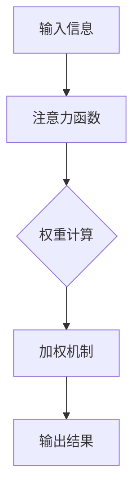
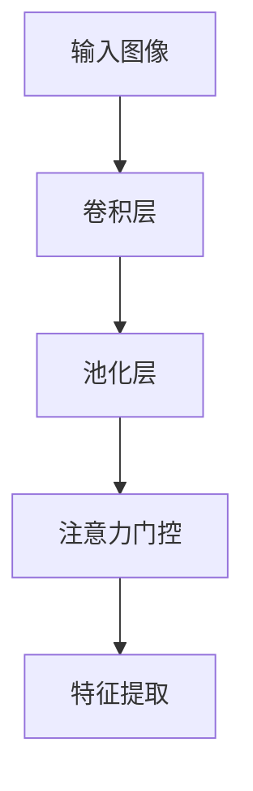
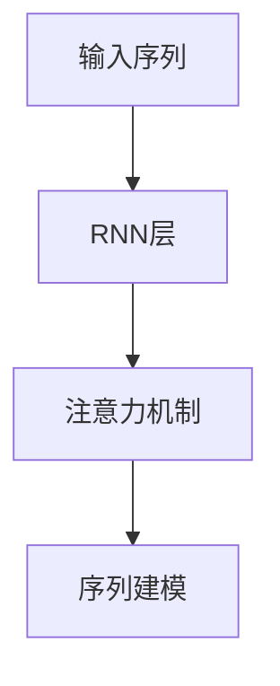
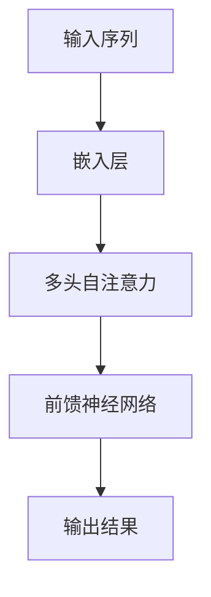

                 

# AI与注意力管理：保持人类优势

## 关键词
- 人工智能
- 注意力管理
- 注意力障碍
- 算法优化
- 人类优势

## 摘要
随着人工智能（AI）技术的飞速发展，人们的注意力管理能力面临前所未有的挑战。本文首先介绍了AI与注意力管理的概念和联系，然后探讨了注意力管理的核心概念与架构，以及AI算法中的注意力管理原理。接着，文章详细分析了AI在注意力管理中的应用，包括治疗、工具优化和教育等方面。最后，本文探讨了注意力管理在职业、学习和未来展望中的应用，强调了保持人类优势的重要性。

## 第一部分: AI与注意力管理概述

### 第1章: AI与注意力管理的概念与联系

#### 1.1 AI的崛起与注意力管理的必要性

**定义AI与注意力管理**：人工智能是指通过计算机系统模拟人类智能行为的能力，包括学习、推理、感知和决策等。注意力管理则是指对注意力资源的分配和调节，以实现高效的信息处理和认知功能。

**AI发展的背景**：自20世纪50年代以来，人工智能技术经历了多个发展阶段，从早期的符号主义和规则驱动，到基于数据驱动和机器学习的现代方法。随着深度学习和大数据技术的发展，AI在各个领域取得了显著的成果。

**注意力管理的起源与重要性**：注意力管理学起源于认知心理学领域，旨在研究注意力资源如何在人类认知过程中进行分配和调节。在信息爆炸的时代，如何有效管理注意力资源，提高信息处理效率，成为人们关注的焦点。

#### 1.2 注意力管理的核心概念与架构

**注意力管理学的理论基础**：注意力管理学结合了认知心理学、神经科学和信息处理理论，形成了其核心理论基础。认知心理学研究了注意力在不同认知任务中的作用和机制；神经科学揭示了注意力在大脑中的生理基础；信息处理理论提供了对注意力资源分配和调节的数学模型。

**注意力管理的基本架构**：注意力管理的基本架构包括三个主要部分：注意力源、注意力分配机制和注意力效应。注意力源是指产生注意力的信息来源，如视觉、听觉和触觉等；注意力分配机制是指如何将注意力资源分配到不同的任务和情境中；注意力效应是指注意力分配对认知功能和行为的影响。

**注意力管理的关键概念**：关键概念包括选择注意力、分配注意力和转换注意力。选择注意力是指从众多信息中选择重要信息进行处理；分配注意力是指将注意力资源分配到不同的任务中；转换注意力是指在不同任务之间切换注意力。

#### 1.3 AI与注意力管理的交叉领域研究

**注意力机制在AI中的应用**：注意力机制是AI中用于提高信息处理效率的关键技术。在深度学习模型中，注意力机制被广泛应用于图像识别、自然语言处理和语音识别等领域。例如，Transformer模型中的自注意力机制使得模型能够捕捉到长文本中的长距离依赖关系。

**AI技术对注意力管理的影响**：AI技术不仅为注意力管理提供了新的方法和工具，还改变了人们的信息处理方式。例如，智能助手和个性化推荐系统能够根据用户的行为和偏好，自动调整信息的呈现方式和内容，从而帮助用户更好地管理注意力。

**未来发展趋势**：未来，AI与注意力管理将朝着更智能、更个性化的方向发展。生物识别技术、多模态感知和深度学习等新技术将进一步提升注意力管理的效率和效果。同时，AI技术将在教育、医疗和职场等领域广泛应用，为人们提供更加智能化的注意力管理解决方案。

### 第2章: AI算法与注意力管理原理

#### 2.1 注意力机制的基本原理

**注意力机制的数学模型**：注意力机制的数学模型通常由注意力函数和加权机制组成。注意力函数用于计算每个信息点的权重，加权机制则将这些权重应用到后续的信息处理过程中。

**注意力函数的构造**：常见的注意力函数包括点积注意力、加性注意力、乘性注意力等。点积注意力通过计算输入向量和查询向量的点积来产生权重；加性注意力通过将输入向量与权重向量相加来产生加权向量；乘性注意力通过将输入向量与权重向量相乘来产生加权向量。

**注意力机制的优缺点**：注意力机制的优点包括提高信息处理效率、增强模型的表达能力、减少过拟合等。缺点则包括计算复杂度高、参数调优困难等。

#### 2.2 常见的AI算法与注意力管理

**卷积神经网络（CNN）与注意力**：卷积神经网络是一种常用的图像处理算法，通过卷积层和池化层来提取图像特征。在CNN中，注意力机制可以用于提高特征提取的效果。例如，通过使用注意力门控机制，可以使得模型在处理复杂图像时更加关注重要的区域。

**循环神经网络（RNN）与注意力**：循环神经网络是一种用于处理序列数据的算法，通过循环结构来捕捉序列中的时间依赖关系。在RNN中，注意力机制可以用于提高序列建模的效果。例如，通过使用注意力机制，可以使得模型在处理文本数据时更加关注重要的词汇。

**Transformer模型与注意力**：Transformer模型是一种基于注意力机制的序列建模算法，它在自然语言处理领域取得了显著的成果。Transformer模型中的多头注意力机制使得模型能够同时关注多个位置的信息，从而提高模型的表达能力和泛化能力。

#### 2.3 AI算法的注意力管理优化

**注意力分配优化**：注意力分配优化是指通过调整注意力权重，提高模型在特定任务上的性能。常见的优化方法包括自适应权重调整、注意力门控和注意力修剪等。

**注意力管理算法的评估与选择**：注意力管理算法的评估与选择是确保模型性能的关键步骤。评估指标包括准确率、召回率、F1值等。在选择合适的注意力管理算法时，需要考虑模型的复杂度、计算效率和实际应用场景。

**注意力管理的挑战与解决方案**：注意力管理面临的主要挑战包括计算复杂度、模型解释性和参数调优等。解决方案包括使用轻量级注意力机制、增加模型解释性和开发自动化调参工具等。

### 第3章: AI技术在注意力管理中的应用

#### 3.1 AI在注意力障碍治疗中的应用

**注意力障碍的识别与评估**：注意力障碍是指个体在注意力管理方面存在的困难，如注意力分散、多任务处理困难等。AI技术可以通过分析个体在完成特定任务时的表现，识别和评估注意力障碍的程度。

**个性化注意力训练方案**：AI技术可以根据个体的注意力特点，为其定制个性化的注意力训练方案。例如，通过分析个体的注意力分布和变化规律，设计针对性的训练任务和策略，以提高个体的注意力管理能力。

**治疗效果分析**：AI技术可以实时监测个体的注意力变化，评估注意力训练方案的效果。通过对比训练前后的注意力表现，分析注意力障碍的改善情况，为后续的治疗提供依据。

#### 3.2 AI在注意力管理优化工具中的应用

**智能助手与注意力管理**：智能助手是一种基于AI技术的应用，可以帮助用户管理日常生活中的注意力。例如，智能助手可以提醒用户重要任务的截止时间，自动过滤无关信息，帮助用户保持专注。

**注意力跟踪与分析工具**：注意力跟踪工具可以实时记录个体的注意力变化，分析注意力分布和注意力转移规律。通过这些工具，用户可以了解自己的注意力状态，制定更有效的注意力管理策略。

**注意力管理策略的优化**：AI技术可以根据用户的注意力状态和行为模式，自动调整注意力管理策略。例如，在用户注意力较低时，系统可以自动减少干扰信息，帮助用户恢复注意力。

#### 3.3 AI在注意力管理教育与培训中的应用

**注意力管理教育课程**：AI技术可以用于设计注意力管理的教育课程，帮助用户了解注意力管理的基本原理和方法。例如，通过在线课程、互动游戏和案例分析，用户可以学习如何管理自己的注意力，提高学习效果。

**注意力训练游戏与活动**：AI技术可以设计具有趣味性和挑战性的注意力训练游戏和活动，帮助用户在轻松愉快的氛围中提高注意力管理能力。例如，通过解决迷宫、找不同等游戏，用户可以在不知不觉中锻炼注意力。

**注意力管理学习效果评估**：AI技术可以实时监测用户在学习过程中的注意力变化，评估学习效果。通过分析用户的注意力分布和注意力转移规律，教师可以了解学生的学习状态，调整教学策略，提高教学效果。

## 第二部分: 注意力管理与人类优势的结合

### 第4章: 注意力管理在职业中的应用

#### 4.1 高效工作与注意力管理

**工作场景下的注意力管理策略**：在职业环境中，高效的工作往往依赖于良好的注意力管理。以下是一些常见的工作注意力管理策略：

- **任务优先级排序**：根据任务的紧急程度和重要性，合理安排工作顺序，确保关键任务得到优先处理。
- **注意力集中时间段**：设定固定的注意力集中时间段，例如每天上午9点到11点，用于处理重要和复杂的工作任务。
- **避免多任务处理**：尽量避免在同一时间处理多个任务，因为这会分散注意力，降低工作效率。

**时间管理与注意力优化**：时间管理是注意力管理的重要组成部分。以下是一些时间管理技巧，有助于优化注意力和提高工作效率：

- **时间块安排**：将工作时间划分为若干个时间段，每个时间段专注于一项任务，避免任务切换带来的注意力分散。
- **日计划和周计划**：制定详细的日计划和周计划，明确每天和每周的工作目标和任务，有助于集中注意力完成任务。
- **休息与放松**：定期休息和放松，有助于恢复注意力，提高工作效率。例如，每工作45分钟后，休息5-10分钟，进行短暂的休息和放松。

**注意力恢复与休息策略**：在长时间的工作中，注意力会逐渐下降，需要通过休息和恢复来提高工作效率。以下是一些注意力恢复与休息策略：

- **短暂休息**：每工作一段时间后，进行短暂的休息，例如起身活动、喝杯水、散步等，帮助恢复注意力和精力。
- **深度休息**：在长时间的工作后，进行深度休息，例如午睡、瑜伽冥想等，有助于恢复体力和精神。
- **注意力转移**：在工作间隙，转移注意力到其他放松的活动上，例如听音乐、阅读书籍等，有助于缓解工作压力。

#### 4.2 创意思维与注意力管理

**注意力在创意思维中的作用**：创意思维是职业成功的重要因素之一，而注意力管理在创意思维中起着关键作用。以下是一些关于注意力在创意思维中作用的观点：

- **专注力激发创意**：专注力是创意思维的重要前提。当个体能够将注意力集中在某个问题上时，更容易产生独特的观点和创意。
- **注意力分散促进创意**：适当的注意力分散有助于激发创意思维。在创意过程中，个体可以在不同想法和观点之间切换，从而产生新的联想和创意。
- **注意力平衡**：在创意思维过程中，保持注意力平衡是非常重要的。既要避免注意力过度集中，导致思维僵化，也要避免注意力过度分散，导致思维混乱。

**激发创意的注意力策略**：以下是一些激发创意的注意力策略：

- **思维导图**：通过绘制思维导图，将创意思维过程中的各种想法和观点进行可视化，有助于激发创意和整理思路。
- **换位思考**：尝试从不同的角度和立场思考问题，例如从竞争对手、用户、客户等角度，有助于发现新的创意和解决方案。
- **放松身心**：在创意思维过程中，适当的放松身心有助于提高创意产生的可能性。例如，进行瑜伽、冥想或短暂的休息，有助于放松大脑，激发创意思维。

**注意力管理的创意案例**：以下是一些利用注意力管理策略激发创意的案例：

- **谷歌的“20%时间”政策**：谷歌曾实行“20%时间”政策，允许员工将20%的工作时间用于个人感兴趣的项目，这为员工提供了更多的自由空间来激发创意，谷歌的许多创新产品，如AdSense和Gmail，都源于这一政策。
- **创意工作坊**：创意工作坊是一种专门用于激发创意的思维训练活动。通过一系列引导性问题、头脑风暴和团队协作，参与者能够在短时间内产生大量的创意。

#### 4.3 领导力与注意力管理

**领导力与注意力管理的关系**：领导力是领导者带领团队实现目标的能力，而注意力管理在领导力中起着关键作用。以下是一些关于领导力与注意力管理之间关系的观点：

- **领导者的注意力分配**：领导者需要具备良好的注意力管理能力，能够在不同任务和情境之间灵活切换。领导者需要关注团队的整体发展，同时关注个体成员的需求和问题。
- **领导者的决策力**：注意力管理能力直接影响领导者的决策力。领导者需要在关键时刻保持清醒的头脑，快速做出正确的决策。
- **领导者的榜样作用**：领导者的注意力管理能力对团队成员具有示范作用。领导者通过自己的行为，向团队成员传递正确的注意力管理理念和方法。

**领导者的注意力策略**：以下是一些领导者的注意力策略：

- **目标导向**：领导者需要明确团队的目标，将注意力集中在实现目标的关键任务上，避免分散注意力。
- **优先级排序**：领导者需要学会优先处理重要和紧急的任务，确保团队目标的顺利实现。
- **沟通与协调**：领导者需要积极与团队成员沟通，了解他们的需求和问题，并通过协调资源和支持，帮助他们解决问题。

**团队注意力管理的协调**：在团队中，领导者需要协调团队成员的注意力，以实现团队目标的最大化。以下是一些团队注意力管理的协调方法：

- **团队目标共识**：领导者需要与团队成员共同明确团队目标，确保每个成员都理解并认同这些目标。
- **任务分配**：领导者需要根据团队成员的能力和兴趣，合理分配任务，确保任务与成员的注意力相匹配。
- **团队协作**：领导者需要鼓励团队协作，通过团队会议、头脑风暴和团队活动等方式，促进团队成员之间的沟通和协作，提高团队的整体注意力管理能力。

## 第三部分: 注意力管理的未来展望

### 第6章: 注意力管理技术的未来趋势

#### 6.1 注意力管理技术的发展方向

**生物识别技术在注意力管理中的应用**：随着生物识别技术的不断发展，如脑波监测、眼动追踪等，未来注意力管理技术将能够更加精确地监测个体的注意力状态。通过实时监测个体的生理和脑部活动，注意力管理系统能够提供个性化的注意力管理方案，帮助个体更好地调节和管理注意力。

**多模态注意力管理系统的构建**：多模态注意力管理系统结合了多种传感器和数据处理技术，如脑波监测、眼动追踪、声音识别等，能够全面捕捉个体的注意力状态。这种系统可以通过分析多模态数据，提供更准确和全面的注意力管理服务，如自动调整工作环境、智能提醒和个性化的学习方案等。

**注意力管理算法的智能化**：随着机器学习和人工智能技术的发展，注意力管理算法将变得更加智能和自适应。通过训练模型，系统能够根据个体的行为模式和学习历史，自动调整注意力管理策略，提供个性化的注意力管理方案。这将有助于提高个体的学习效率和工作效能。

#### 6.2 注意力管理在人类行为研究中的应用

**注意力在人类行为中的作用**：注意力是影响个体行为的关键因素之一。在人类行为研究中，注意力管理技术可以帮助研究人员更好地理解个体在特定情境下的注意力分配和调节方式。通过分析注意力数据，研究人员可以揭示注意力与行为之间的复杂关系，为心理健康、学习障碍和职业发展等领域的研究提供重要参考。

**注意力与心理健康的关系**：注意力管理对个体的心理健康具有重要影响。通过注意力管理技术，研究人员可以探索注意力障碍与心理健康问题之间的关联，如注意力缺陷多动障碍（ADHD）和抑郁症等。这些研究有助于开发针对性的治疗方法和干预策略，改善个体的心理健康。

**注意力管理的公共卫生应用**：注意力管理技术在公共卫生领域的应用潜力巨大。通过监测和干预个体的注意力状态，公共卫生机构可以设计出更有效的健康教育和预防策略。例如，通过注意力管理技术，可以更好地引导个体关注健康信息，提高健康行为的执行效果，从而降低疾病发生的风险。

### 第7章: 注意力管理的伦理与社会影响

**注意力管理的伦理问题**：随着注意力管理技术的发展，伦理问题也日益凸显。例如，注意力管理技术可能会侵犯个体隐私，滥用注意力数据。此外，注意力管理技术的过度依赖可能导致个体在信息处理过程中的自主性降低，甚至出现注意力贫困等问题。因此，伦理审查和监管机制对于注意力管理技术的健康发展至关重要。

**注意力管理的社会影响**：注意力管理技术将对社会行为和人际关系产生深远影响。一方面，注意力管理技术可以提高个体的工作效率和生活质量；另一方面，过度依赖注意力管理技术可能导致个体在社交互动和情感交流方面的能力下降。因此，社会需要关注注意力管理技术对社会文化和人际关系的潜在影响，并寻求平衡发展。

**注意力管理的政策建议**：针对注意力管理技术的伦理和社会影响，政府和社会组织可以采取以下政策建议：

- **加强伦理审查和监管**：制定相关法律法规，明确注意力管理技术的伦理规范，加强对注意力数据的保护和管理。
- **推广科学教育**：通过教育普及注意力管理知识，提高公众对注意力管理技术的认识和接受度。
- **促进技术创新**：鼓励企业和科研机构开展注意力管理技术的研发，推动技术创新和应用。
- **社会融合与平衡**：倡导社会各界关注注意力管理技术对社会行为和人际关系的影响，促进社会融合和平衡发展。

### 附录

#### 附录A: 注意力管理与AI技术资源汇总

**主流注意力管理算法介绍**：介绍了当前主流的注意力管理算法，包括点积注意力、加性注意力、乘性注意力等，以及它们在不同领域的应用案例。

**注意力管理工具与平台推荐**：推荐了一些用于注意力管理的实用工具和平台，如注意力监测软件、注意力训练游戏等，以帮助用户更好地管理注意力。

**注意力管理研究报告与文献**：汇总了一些关于注意力管理的权威研究报告和学术文献，供读者进一步学习。

#### 附录B: Mermaid流程图示例

**注意力管理的基本流程**：使用Mermaid绘制了注意力管理的基本流程图，展示了注意力源、注意力分配机制和注意力效应之间的关系。

#### 附录C: 伪代码与数学模型

**注意力机制的伪代码实现**：提供了注意力机制的伪代码示例，详细解释了注意力函数的构造和加权机制的计算过程。

**注意力管理的数学模型**：使用LaTeX格式展示了注意力管理的数学模型，包括输入向量、查询向量、权重向量和输出结果等参数的数学表达式。

#### 附录D: 代码实战与案例分析

**注意力管理应用案例代码**：提供了实际注意力管理应用的代码示例，包括开发环境搭建、源代码实现和代码解读，以帮助读者理解注意力管理算法的实践应用。

**注意力管理算法优化实践**：介绍了如何对注意力管理算法进行优化，提升模型性能，包括注意力分配优化、算法评估与选择以及面临的挑战与解决方案。

