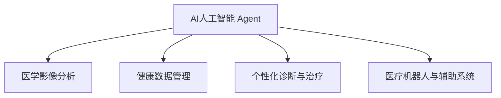
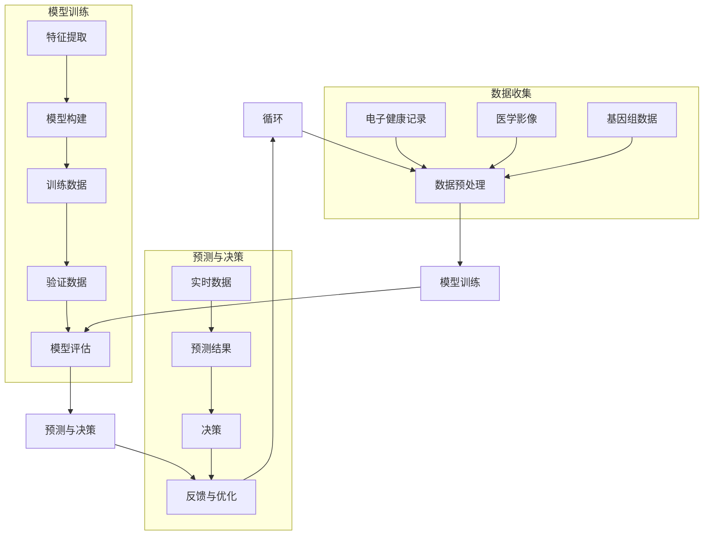

                 

# AI人工智能 Agent：在智能医疗中的应用

> 关键词：人工智能，智能医疗，AI Agent，医学影像分析，健康数据管理，个性化诊断与治疗

> 摘要：本文将深入探讨人工智能（AI）在智能医疗中的应用，特别是AI人工智能 Agent在这一领域的关键角色。文章分为三大部分：概述、应用和未来，详细分析了AI Agent在医学影像分析、健康数据管理、个性化诊断与治疗以及医疗机器人与辅助系统中的应用，并展望了其未来的发展趋势和潜在应用场景。

## 《AI人工智能 Agent：在智能医疗中的应用》目录大纲

### 第一部分：AI与智能医疗概述

#### 第1章：AI与智能医疗的背景与重要性
- 1.1 AI的发展历程
- 1.2 智能医疗的兴起
- 1.3 AI在智能医疗中的应用领域

#### 第2章：智能医疗中的核心概念
- 2.1 健康数据管理
- 2.2 医学影像分析
- 2.3 个性化诊断与治疗
- 2.4 医疗机器人与辅助系统

#### 第3章：AI人工智能 Agent 的基本原理
- 3.1 人工智能 Agent 的定义与类型
- 3.2 Agent 通信与协同
- 3.3 Agent 的学习与决策机制

### 第二部分：AI人工智能 Agent 在智能医疗中的应用

#### 第4章：AI Agent 在医学影像分析中的应用
- 4.1 医学影像分析的基本原理
- 4.2 AI Agent 在医学影像分析中的应用案例
- 4.3 AI Agent 在医学影像分析中的优势与挑战

#### 第5章：AI Agent 在健康数据管理中的应用
- 5.1 健康数据管理的基本原理
- 5.2 AI Agent 在健康数据管理中的应用案例
- 5.3 AI Agent 在健康数据管理中的优势与挑战

#### 第6章：AI Agent 在个性化诊断与治疗中的应用
- 6.1 个性化诊断与治疗的基本原理
- 6.2 AI Agent 在个性化诊断与治疗中的应用案例
- 6.3 AI Agent 在个性化诊断与治疗中的优势与挑战

#### 第7章：AI Agent 在医疗机器人与辅助系统中的应用
- 7.1 医疗机器人与辅助系统的基本原理
- 7.2 AI Agent 在医疗机器人与辅助系统中的应用案例
- 7.3 AI Agent 在医疗机器人与辅助系统中的优势与挑战

### 第三部分：AI人工智能 Agent 在智能医疗中的未来

#### 第8章：AI Agent 在智能医疗中的发展趋势
- 8.1 未来医疗的趋势与挑战
- 8.2 AI Agent 在智能医疗中的未来发展方向
- 8.3 AI Agent 在智能医疗中的潜在应用场景

#### 第9章：AI Agent 在智能医疗中的伦理与社会影响
- 9.1 AI Agent 在智能医疗中的伦理问题
- 9.2 AI Agent 在智能医疗中的社会影响
- 9.3 应对伦理与社会影响的策略与措施

#### 第10章：案例研究：AI Agent 在智能医疗中的成功应用
- 10.1 案例背景介绍
- 10.2 AI Agent 的应用场景与实现
- 10.3 案例分析：优势、挑战与未来展望

## 附录

### 附录 A：AI人工智能 Agent 开发工具与资源
- A.1 主流AI开发工具对比
- A.2 AI Agent 开发资源汇总

### Mermaid 流程图


### 伪代码示例
```python
# 伪代码：AI Agent 的决策过程
def make_decision(patient_data, diagnostic_results):
    # 初始化决策变量
    decision = None
    
    # 分析病人数据
    patient_characteristics = analyze_patient_data(patient_data)
    
    # 根据诊断结果进行决策
    if diagnostic_results == "正常":
        decision = "保持当前治疗方案"
    elif diagnostic_results == "异常":
        decision = "建议进一步检查"
    
    # 返回决策结果
    return decision
```

### 数学模型与公式
$$
f(X) = w_1 \cdot x_1 + w_2 \cdot x_2 + ... + w_n \cdot x_n + b
$$

### 公式解释：
- $f(X)$：决策函数输出
- $w_1, w_2, ..., w_n$：权重系数
- $x_1, x_2, ..., x_n$：输入特征
- $b$：偏置项

### 项目实战
#### 实战案例：基于AI Agent的智能诊断系统

#### 开发环境搭建：
- Python 3.8
- TensorFlow 2.5
- Keras 2.4.3

#### 源代码实现：
```python
# 导入必要的库
import tensorflow as tf
from tensorflow import keras
from tensorflow.keras import layers

# 构建神经网络模型
model = keras.Sequential([
    layers.Dense(64, activation='relu', input_shape=(num_features,)),
    layers.Dense(64, activation='relu'),
    layers.Dense(1, activation='sigmoid')
])

# 编译模型
model.compile(optimizer='adam',
              loss='binary_crossentropy',
              metrics=['accuracy'])

# 训练模型
model.fit(x_train, y_train, epochs=10, batch_size=32)

```

#### 代码解读与分析：
- 模型架构：包含两个隐藏层，输出层使用 sigmoid 激活函数实现二分类。
- 编译：采用 Adam 优化器和 binary_crossentropy 损失函数。
- 训练：使用训练数据集进行训练，设置为 10 个 epoch，每个 epoch 32 个样本 batch。

## 作者

作者：AI天才研究院/AI Genius Institute & 禅与计算机程序设计艺术 /Zen And The Art of Computer Programming

接下来，我们将逐步深入探讨AI人工智能 Agent在智能医疗中的广泛应用和深远影响。我们将从AI与智能医疗的背景与重要性开始，逐步深入每一个应用领域，分析AI Agent的基本原理，讨论其在医学影像分析、健康数据管理、个性化诊断与治疗以及医疗机器人与辅助系统中的应用，并探讨其未来发展的趋势和潜在应用场景。最后，我们将通过一个实际案例，展示AI Agent在智能医疗中的成功应用，并对相关伦理和社会影响进行深入探讨。希望通过本文，读者能够对AI人工智能 Agent在智能医疗中的重要作用和未来前景有更深入的理解。让我们开始这段充满挑战和机遇的旅程吧！
### 第1章：AI与智能医疗的背景与重要性

人工智能（AI）和智能医疗作为21世纪最前沿的技术领域，正在迅速发展，并对各个行业产生深远的影响。AI技术，特别是机器学习和深度学习，已经成功地应用于各种场景，包括自然语言处理、图像识别、自动驾驶、智能制造等。而智能医疗则是指利用AI技术和大数据分析，提高医疗诊断、治疗和健康管理效率和质量的一种新兴医疗模式。

#### 1.1 AI的发展历程

人工智能的概念最早可以追溯到20世纪50年代，当时计算机科学家约翰·麦卡锡（John McCarthy）提出了人工智能的术语。从那时起，人工智能经历了多个发展阶段，包括符号主义、连接主义、统计学习等。早期的AI研究主要集中在符号主义，即通过逻辑推理和知识表示来实现人工智能。然而，随着计算机性能的提升和大数据的积累，统计学习逐渐成为AI的主流方法，特别是深度学习在图像识别、语音识别和自然语言处理等领域的突破性进展。

#### 1.2 智能医疗的兴起

智能医疗的兴起可以追溯到20世纪90年代，当时医学影像学、基因组学和电子健康记录（EHR）开始逐渐普及。这些技术的进步为AI技术在医疗领域的应用提供了丰富的数据资源。近年来，随着AI技术的快速发展，智能医疗得到了广泛关注和应用。例如，基于深度学习的医学影像分析系统可以自动识别病变，辅助医生进行诊断；基因测序和生物信息学技术可以帮助医生制定个性化的治疗方案。

#### 1.3 AI在智能医疗中的应用领域

AI在智能医疗中的应用领域非常广泛，主要包括以下几个方面：

1. **医学影像分析**：
   - AI技术可以自动分析医学影像，如X光、CT、MRI等，帮助医生识别病变和组织损伤，提高诊断的准确性和效率。
   - 例如，深度学习算法可以用于肺癌筛查，自动检测CT影像中的肺结节。

2. **健康数据管理**：
   - AI可以帮助医疗机构管理和分析大量的健康数据，包括电子健康记录、基因组数据等，以支持临床决策和个性化治疗。
   - 通过对患者的健康数据进行分析，AI可以帮助预测疾病风险和制定预防措施。

3. **个性化诊断与治疗**：
   - AI可以根据患者的个人数据和生物特征，提供个性化的诊断和治疗方案。
   - 例如，AI可以帮助医生分析患者的基因组数据，预测其对不同药物的反应，从而制定更有效的治疗方案。

4. **医疗机器人与辅助系统**：
   - AI技术可以帮助开发智能医疗机器人，用于手术辅助、康复治疗和护理等。
   - 例如，机器人可以辅助医生进行微创手术，提高手术的准确性和安全性。

#### 1.4 AI在智能医疗中的优势

AI在智能医疗中具有多方面的优势：

- **提高诊断效率**：AI可以帮助医生快速分析大量的医学数据，提高诊断速度和准确性。
- **减少医疗错误**：AI可以减少由于人类疲劳或经验不足导致的医疗错误。
- **个性化治疗**：AI可以根据患者的具体情况进行个性化治疗，提高治疗效果。
- **降低医疗成本**：通过自动化和智能化，AI可以减少人力成本，提高医疗资源的利用效率。

然而，AI在智能医疗中也面临一些挑战，如数据隐私、算法透明度、伦理问题等。这些挑战需要通过政策法规、技术改进和社会共识来解决。

总之，AI与智能医疗的结合正在引领医疗行业的一场革命。通过AI技术，我们可以实现更高效、更准确、更个性化的医疗服务，从而提高患者的健康水平和生活质量。在接下来的章节中，我们将进一步探讨AI人工智能 Agent在智能医疗中的应用，分析其在各个领域的具体实现和优势。

### 第2章：智能医疗中的核心概念

智能医疗作为AI技术的重要应用领域，其核心概念和关键技术对于实现智能化的医疗流程和提升医疗服务质量至关重要。在本章中，我们将详细介绍智能医疗中的几个关键概念，包括健康数据管理、医学影像分析、个性化诊断与治疗以及医疗机器人与辅助系统。

#### 2.1 健康数据管理

健康数据管理是智能医疗的基础，涉及对患者的电子健康记录（EHR）、基因组数据、生理参数等多种数据的收集、存储、处理和分析。健康数据管理的目标是通过有效的数据管理技术，确保数据的准确性、完整性和安全性，从而支持临床决策和个性化治疗。

1. **数据收集与存储**：
   - **电子健康记录（EHR）**：EHR是记录患者健康信息的电子化系统，包括病史、体检结果、诊断信息等。
   - **基因组数据**：基因组数据是通过对患者进行基因测序获得的，用于疾病诊断和风险预测。
   - **生理参数**：包括血压、心率、血糖等实时生理数据。

2. **数据处理与分析**：
   - **数据清洗**：去除重复、错误或不完整的数据，保证数据质量。
   - **数据整合**：将来自不同来源的数据进行整合，形成统一的视图。
   - **数据分析**：利用统计学和机器学习方法，分析数据中的模式和趋势，支持临床决策。

3. **数据安全与隐私保护**：
   - **数据加密**：对敏感数据使用加密技术进行保护。
   - **访问控制**：通过身份验证和权限管理，确保数据的安全性。
   - **隐私保护法规**：遵守相关的隐私保护法规，如HIPAA（美国健康保险携带和责任法案）。

#### 2.2 医学影像分析

医学影像分析是智能医疗的重要组成部分，通过AI技术，尤其是深度学习算法，可以对医学影像进行自动分析，辅助医生进行诊断和治疗。医学影像分析的关键技术包括：

1. **图像分割**：
   - **目标检测**：识别图像中的特定区域，如肿瘤、病变等。
   - **边缘检测**：检测图像中的边缘，用于图像分割。

2. **图像识别**：
   - **分类**：将图像分类为不同类型，如正常和异常。
   - **识别**：识别图像中的特定对象，如器官、病变等。

3. **图像增强**：
   - **噪声去除**：减少图像中的噪声，提高图像质量。
   - **对比度增强**：增强图像的对比度，使病变更加明显。

4. **诊断支持**：
   - **辅助诊断**：为医生提供诊断建议，提高诊断准确性。
   - **病情预测**：基于历史数据，预测患者的病情变化。

#### 2.3 个性化诊断与治疗

个性化诊断与治疗是智能医疗的一个重要方向，通过分析患者的个人数据和生物特征，为患者提供个性化的诊断和治疗方案。个性化诊断与治疗的关键技术包括：

1. **数据挖掘**：
   - **基因数据挖掘**：分析患者的基因组数据，识别与疾病相关的基因变异。
   - **临床数据挖掘**：分析患者的电子健康记录，识别疾病的风险因素和治疗反应。

2. **个性化模型**：
   - **诊断模型**：根据患者的特征数据，构建个性化的诊断模型。
   - **治疗模型**：根据患者的病情和基因信息，制定个性化的治疗方案。

3. **预测模型**：
   - **风险预测**：预测患者未来发生疾病的风险。
   - **复发预测**：预测患者疾病复发的可能性。

#### 2.4 医疗机器人与辅助系统

医疗机器人与辅助系统是智能医疗的重要实现形式，通过机器人技术和自动化系统，提高医疗服务的效率和质量。医疗机器人与辅助系统的关键技术包括：

1. **机器人手术**：
   - **微创手术**：使用机器人辅助进行微创手术，减少手术创伤。
   - **精准操作**：利用机器人的高精度控制，提高手术的准确性和安全性。

2. **康复机器人**：
   - **辅助康复**：机器人辅助患者进行康复训练，如步态训练、力量训练等。
   - **远程监控**：通过机器人进行远程监控和指导，提高康复效果。

3. **护理机器人**：
   - **日常护理**：机器人辅助完成患者的日常护理工作，如喂食、翻身等。
   - **应急处理**：在紧急情况下，机器人可以快速响应和处理。

#### 2.5 智能医疗的挑战与展望

尽管智能医疗具有巨大的潜力，但也面临着一些挑战：

- **数据隐私与安全**：如何保护患者数据的隐私和安全是一个重要问题。
- **算法透明度**：确保AI算法的透明度和解释性，帮助医生理解诊断和治疗的决策过程。
- **技术普及与接受度**：如何推广和普及智能医疗技术，提高医生和患者的接受度。

展望未来，智能医疗将继续向更高效、更准确、更个性化的方向发展。通过不断的技术创新和融合，智能医疗有望在未来实现更广泛的应用，为人类健康带来更多福祉。

在下一章中，我们将深入探讨AI人工智能 Agent的基本原理，分析其如何实现智能医疗中的自动化和智能化应用。

### 第3章：AI人工智能 Agent 的基本原理

AI人工智能 Agent 是智能医疗的核心组成部分，其定义、类型、通信与协同机制以及学习与决策机制对于实现高效、智能化的医疗服务至关重要。在本章中，我们将详细探讨这些基本原理。

#### 3.1 人工智能 Agent 的定义与类型

AI人工智能 Agent 是指在特定环境中具备感知、学习、决策和行动能力的人工智能实体。Agent 可以是软件程序、机器人或其他智能设备，其主要特点包括自主性、反应性、主动性和社会性。

1. **自主性**：Agent 能够根据环境变化自主地执行任务。
2. **反应性**：Agent 能够即时响应环境变化。
3. **主动性**：Agent 能够根据目标和规划采取主动行动。
4. **社会性**：Agent 能够与其他 Agent 或人类进行交互和协作。

根据 Agent 的功能和任务，可以将 AI Agent 分为以下几种类型：

- **反应型 Agent**：根据当前环境状态进行决策和行动，如自动驾驶车辆。
- **认知型 Agent**：具备一定的推理和计划能力，如智能客服系统。
- **社会型 Agent**：能够理解社会规则和人类行为，进行交互和协作，如多人在线游戏中的智能角色。

#### 3.2 Agent 通信与协同

Agent 的通信与协同机制是实现智能系统高效运作的关键。Agent 之间的通信通常通过以下几种方式进行：

1. **消息传递**：Agent 通过发送和接收消息进行通信，如 RESTful API、消息队列等。
2. **共享数据**：Agent 通过共享公共数据区域进行信息交换，如分布式内存、文件系统等。
3. **事件驱动**：Agent 通过监听事件并响应事件进行通信，如 WebSockets、事件总线等。

在协同工作中，Agent 需要遵循一定的协同策略，以实现高效、稳定的合作。常见的协同策略包括：

- **任务分配**：根据 Agent 的能力和负载，合理分配任务。
- **协调控制**：通过协调机制，确保 Agent 之间的行动一致性。
- **资源管理**：合理分配和管理系统资源，提高系统性能。

#### 3.3 Agent 的学习与决策机制

AI Agent 的学习与决策机制是实现其智能行为的核心。学习机制主要包括以下几种：

1. **监督学习**：Agent 通过从已知输入和输出数据中学习，建立预测模型。
2. **无监督学习**：Agent 通过分析未标记的数据，发现数据中的模式和规律。
3. **强化学习**：Agent 通过与环境交互，学习最佳行为策略。

决策机制则是 Agent 根据其学习到的知识和当前环境状态，选择最佳行动的过程。决策机制通常包括以下步骤：

1. **状态感知**：Agent 感知当前环境状态。
2. **状态评估**：根据学习到的模型，评估不同行动方案的效果。
3. **行动选择**：根据评估结果，选择最佳行动。
4. **行动执行**：执行选定的行动，并更新状态。

在智能医疗中，AI Agent 的学习与决策机制可以应用于以下场景：

- **医学影像分析**：通过监督学习算法，训练 AI Agent 识别医学影像中的病变和组织结构。
- **个性化诊断与治疗**：通过无监督学习和监督学习，分析患者的基因组数据和电子健康记录，为患者提供个性化的诊断和治疗方案。
- **医疗机器人与辅助系统**：通过强化学习，训练医疗机器人进行手术操作和康复训练。

#### 3.4 Agent 在智能医疗中的应用

AI Agent 在智能医疗中具有广泛的应用，以下是几个典型应用场景：

1. **医学影像分析**：
   - **病变识别**：AI Agent 通过深度学习算法，自动分析医学影像，识别肿瘤、心脏病等病变。
   - **辅助诊断**：AI Agent 提供辅助诊断建议，提高医生的诊断准确性。

2. **个性化诊断与治疗**：
   - **基因组分析**：AI Agent 分析患者的基因组数据，预测疾病风险和药物反应，为患者制定个性化的治疗方案。
   - **个性化护理**：AI Agent 根据患者的健康状况和需求，提供个性化的护理建议。

3. **医疗机器人与辅助系统**：
   - **手术辅助**：AI Agent 协助医生进行手术操作，提高手术精度和安全性。
   - **康复训练**：AI Agent 为患者提供个性化的康复训练计划，提高康复效果。

总之，AI人工智能 Agent 的基本原理和应用对于推动智能医疗的发展具有重要意义。通过深入理解 Agent 的定义、类型、通信与协同机制以及学习与决策机制，我们可以更好地利用 AI 技术，实现智能医疗的自动化和智能化。在下一章中，我们将探讨 AI Agent 在医学影像分析中的应用，分析其在提高诊断效率和准确性方面的优势与挑战。

### 第4章：AI Agent 在医学影像分析中的应用

医学影像分析是智能医疗的一个重要领域，通过AI人工智能 Agent，可以实现医学影像的自动分析，提高诊断的效率和准确性。本章节将深入探讨AI Agent在医学影像分析中的应用，分析其基本原理、应用案例以及优势和挑战。

#### 4.1 医学影像分析的基本原理

医学影像分析主要涉及图像处理、计算机视觉和深度学习等技术。其基本原理包括以下几个步骤：

1. **图像获取**：
   - 医学影像数据通常来源于X光、CT、MRI等设备，通过数字化技术获取。

2. **图像预处理**：
   - **图像增强**：通过滤波、对比度增强等技术，改善图像质量，突出感兴趣区域。
   - **图像分割**：利用阈值分割、区域增长等方法，将图像中的目标区域与背景分离。

3. **特征提取**：
   - **区域特征**：提取病变区域的纹理、形状等特征。
   - **全局特征**：提取图像的整体特征，如对比度、熵等。

4. **模型训练**：
   - 利用深度学习算法，如卷积神经网络（CNN）、循环神经网络（RNN）等，训练分类模型或回归模型。

5. **诊断决策**：
   - 根据模型预测结果，结合医生的专业知识，进行诊断决策。

#### 4.2 AI Agent 在医学影像分析中的应用案例

AI Agent 在医学影像分析中的应用案例丰富，以下为几个典型应用：

1. **肺癌筛查**：
   - 通过深度学习算法，AI Agent 可以自动分析CT影像，识别肺结节，提高早期肺癌的发现率。

2. **乳腺癌诊断**：
   - AI Agent 可以分析乳腺X线影像，识别乳腺癌病灶，提供诊断建议。

3. **心脏病诊断**：
   - 通过分析心脏CT或MRI影像，AI Agent 可以评估心脏结构和功能，辅助医生进行心脏病诊断。

4. **神经系统疾病诊断**：
   - AI Agent 可以分析脑部MRI影像，识别脑肿瘤、脑出血等病变，辅助医生进行诊断。

#### 4.3 AI Agent 在医学影像分析中的优势

AI Agent 在医学影像分析中具有显著的优势：

1. **提高诊断效率**：
   - AI Agent 可以快速处理大量影像数据，提高诊断速度，减少医生的工作负担。

2. **提高诊断准确性**：
   - AI Agent 通过深度学习算法，可以学习到复杂的医学知识，提高诊断的准确性。

3. **辅助医生决策**：
   - AI Agent 可以提供诊断建议和预测结果，辅助医生进行诊断决策，减少误诊率。

4. **降低医疗成本**：
   - 通过自动化分析，减少人工诊断的时间和成本，提高医疗资源利用效率。

#### 4.4 AI Agent 在医学影像分析中的挑战

尽管AI Agent 在医学影像分析中具有诸多优势，但同时也面临一些挑战：

1. **数据隐私与安全**：
   - 医学影像数据涉及患者隐私，如何确保数据的安全性是一个重要问题。

2. **算法透明度**：
   - AI Agent 的决策过程通常较为复杂，如何确保算法的透明度和解释性，是医生接受AI辅助诊断的关键。

3. **数据质量**：
   - 医学影像数据质量直接影响AI Agent 的性能，如何保证数据的质量和多样性是一个挑战。

4. **法规与伦理**：
   - 如何制定相关法规和伦理准则，确保AI Agent 在医学影像分析中的合法性和伦理性，是推进智能医疗发展的关键。

综上所述，AI Agent 在医学影像分析中的应用具有显著的优势和潜力，但也面临一些挑战。通过不断的技术创新和规范制定，有望解决这些问题，推动智能医疗的发展。在下一章中，我们将探讨 AI Agent 在健康数据管理中的应用，分析其在数据管理和分析方面的优势与挑战。

### 第5章：AI Agent 在健康数据管理中的应用

健康数据管理是智能医疗的基石，它涉及对大量健康数据的收集、存储、处理和分析。AI人工智能 Agent 在这一领域发挥着重要作用，通过自动化和智能化的数据处理，能够显著提升健康数据管理的效率和质量。在本章中，我们将详细探讨AI Agent 在健康数据管理中的应用，包括基本原理、应用案例以及优势和挑战。

#### 5.1 健康数据管理的基本原理

健康数据管理的基本原理包括以下几个关键环节：

1. **数据收集**：
   - **电子健康记录（EHR）**：通过EHR系统，收集患者的医疗记录、病史、诊断结果等数据。
   - **传感器数据**：通过可穿戴设备和医疗设备，收集患者的生理参数、运动数据等。
   - **基因组数据**：通过基因测序，获取患者的基因信息。

2. **数据存储**：
   - **数据库管理**：使用数据库技术，如关系型数据库（如MySQL）或NoSQL数据库（如MongoDB），存储和管理健康数据。
   - **数据仓库**：将来自不同源的数据整合到一个统一的数据仓库中，便于数据分析和挖掘。

3. **数据处理**：
   - **数据清洗**：去除重复、错误或不完整的数据，保证数据质量。
   - **数据整合**：将来自不同系统的数据整合，形成一个统一的患者视图。
   - **数据标准化**：将不同格式的数据转换为统一的标准格式，便于后续分析。

4. **数据分析**：
   - **统计分析**：使用统计学方法，分析数据中的模式和趋势。
   - **机器学习**：利用机器学习算法，从数据中学习，提取有用的信息。
   - **预测分析**：基于历史数据，预测未来的趋势和风险。

5. **数据可视化**：
   - **仪表盘**：使用可视化工具，将分析结果以图表、仪表盘等形式呈现，便于医生和患者理解。

#### 5.2 AI Agent 在健康数据管理中的应用案例

AI Agent 在健康数据管理中具有广泛的应用，以下为几个典型应用案例：

1. **个性化健康管理**：
   - AI Agent 可以分析患者的EHR、生理参数和基因数据，为患者提供个性化的健康建议和预防措施。

2. **疾病预测与预警**：
   - 通过分析患者的健康数据，AI Agent 可以预测患者未来发生某些疾病的风险，提供预警和干预建议。

3. **诊断支持系统**：
   - AI Agent 可以整合多源数据，提供诊断建议，辅助医生进行诊断决策。

4. **药物反应预测**：
   - 通过分析患者的基因组数据、病史和药物使用记录，AI Agent 可以预测患者对特定药物的反应，帮助医生制定合理的治疗方案。

5. **患者行为分析**：
   - AI Agent 可以分析患者的日常行为数据，如运动、饮食等，识别不良生活习惯，提供健康干预建议。

#### 5.3 AI Agent 在健康数据管理中的优势

AI Agent 在健康数据管理中具有以下优势：

1. **高效数据处理**：
   - AI Agent 可以快速处理大量健康数据，提高数据处理效率。

2. **数据整合与标准化**：
   - AI Agent 可以整合来自不同源的数据，并统一数据格式，便于分析。

3. **个性化服务**：
   - 通过分析患者个性化数据，AI Agent 可以提供个性化的健康建议和干预措施。

4. **疾病预测与预警**：
   - AI Agent 可以基于数据分析，预测患者未来的疾病风险，提供预警和干预建议。

5. **辅助诊断决策**：
   - AI Agent 可以提供诊断建议，辅助医生进行诊断决策，减少误诊率。

#### 5.4 AI Agent 在健康数据管理中的挑战

尽管AI Agent 在健康数据管理中具有显著的优势，但也面临一些挑战：

1. **数据隐私与安全**：
   - 健康数据涉及患者隐私，如何确保数据的安全性是一个重要问题。

2. **数据质量**：
   - 健康数据质量直接影响AI Agent 的性能，如何保证数据的质量和完整性是一个挑战。

3. **算法透明度**：
   - AI Agent 的决策过程通常较为复杂，如何确保算法的透明度和解释性，是医生接受AI辅助决策的关键。

4. **法规与伦理**：
   - 如何制定相关法规和伦理准则，确保AI Agent 在健康数据管理中的合法性和伦理性，是推进智能医疗发展的关键。

5. **技术成熟度**：
   - AI技术在健康数据管理中的应用尚处于发展阶段，如何提升技术成熟度，是一个长期挑战。

综上所述，AI Agent 在健康数据管理中的应用具有巨大的潜力和价值，但也面临一些挑战。通过不断的技术创新和规范制定，有望解决这些问题，推动健康数据管理的发展。在下一章中，我们将探讨 AI Agent 在个性化诊断与治疗中的应用，分析其在提供个性化医疗服务方面的优势与挑战。

### 第6章：AI Agent 在个性化诊断与治疗中的应用

个性化诊断与治疗是智能医疗的核心理念之一，旨在通过AI技术，根据患者的个性化数据，提供精准的诊断和治疗方案。AI人工智能 Agent 在这一过程中发挥着关键作用，能够通过分析患者的基因、病史、生活方式等多方面数据，实现真正的个性化医疗服务。本章将深入探讨AI Agent 在个性化诊断与治疗中的应用，包括基本原理、应用案例以及优势和挑战。

#### 6.1 个性化诊断与治疗的基本原理

个性化诊断与治疗的核心是利用AI技术，从大量的患者数据中提取有价值的信息，为每个患者提供量身定制的诊断和治疗方案。其基本原理包括以下几个步骤：

1. **数据收集**：
   - **基因数据**：通过基因测序，收集患者的基因组信息，识别与疾病相关的基因突变。
   - **电子健康记录（EHR）**：收集患者的病史、诊断结果、治疗记录等数据。
   - **生活方式数据**：收集患者的生活方式信息，如饮食、运动、睡眠习惯等。

2. **数据整合**：
   - 将不同来源的数据进行整合，形成一个全面的患者健康数据视图。

3. **特征提取**：
   - 从整合后的数据中提取关键特征，如基因突变、疾病风险因素、生活习惯等。

4. **模型构建**：
   - 利用机器学习和深度学习算法，构建个性化的诊断和预测模型。

5. **诊断与治疗决策**：
   - 根据构建的模型，分析患者的个性化数据，为患者提供精准的诊断和治疗方案。

#### 6.2 AI Agent 在个性化诊断与治疗中的应用案例

AI Agent 在个性化诊断与治疗中具有广泛的应用，以下为几个典型应用案例：

1. **基因指导的肿瘤治疗**：
   - AI Agent 可以分析患者的基因组数据，识别与肿瘤相关的基因突变，为患者提供个体化的肿瘤治疗方案。

2. **精准用药**：
   - 通过分析患者的基因数据、病史和药物反应记录，AI Agent 可以预测患者对特定药物的反应，帮助医生制定最佳用药方案。

3. **心血管疾病预测与预防**：
   - AI Agent 可以分析患者的生理参数、基因数据和生活方式，预测心血管疾病的风险，并提供预防建议。

4. **糖尿病管理**：
   - AI Agent 可以根据患者的血糖数据、饮食和运动习惯，提供个性化的饮食和运动建议，帮助患者控制血糖。

5. **个性化康复计划**：
   - AI Agent 可以根据患者的健康状况和康复需求，提供个性化的康复训练计划和护理建议。

#### 6.3 AI Agent 在个性化诊断与治疗中的优势

AI Agent 在个性化诊断与治疗中具有以下优势：

1. **提高诊断准确性**：
   - AI Agent 可以利用大数据和机器学习技术，从海量数据中提取有价值的信息，提高诊断准确性。

2. **个性化治疗方案**：
   - 通过分析患者的个性化数据，AI Agent 可以为患者提供量身定制的治疗方案，提高治疗效果。

3. **辅助医生决策**：
   - AI Agent 可以提供诊断和治疗方案建议，辅助医生进行决策，减少误诊和误治。

4. **提高患者满意度**：
   - 通过提供个性化的服务和关怀，AI Agent 可以提高患者的满意度和依从性。

5. **降低医疗成本**：
   - AI Agent 可以通过自动化和智能化的方式，减少人力成本，提高医疗资源利用效率。

#### 6.4 AI Agent 在个性化诊断与治疗中的挑战

尽管AI Agent 在个性化诊断与治疗中具有显著的优势，但也面临一些挑战：

1. **数据隐私与安全**：
   - 患者的个性化数据涉及隐私，如何确保数据的安全性是一个重要问题。

2. **算法透明度**：
   - AI Agent 的决策过程通常较为复杂，如何确保算法的透明度和解释性，是医生和患者接受AI辅助决策的关键。

3. **数据质量**：
   - 个性化诊断与治疗依赖于高质量的数据，如何保证数据的质量和完整性是一个挑战。

4. **法规与伦理**：
   - 如何制定相关法规和伦理准则，确保AI Agent 在个性化诊断与治疗中的合法性和伦理性，是推进智能医疗发展的关键。

5. **技术成熟度**：
   - 个性化诊断与治疗技术尚处于发展阶段，如何提升技术成熟度，是一个长期挑战。

综上所述，AI Agent 在个性化诊断与治疗中的应用具有巨大的潜力和价值，但也面临一些挑战。通过不断的技术创新和规范制定，有望解决这些问题，推动个性化诊断与治疗的发展。在下一章中，我们将探讨 AI Agent 在医疗机器人与辅助系统中的应用，分析其在提高医疗操作精度和安全性方面的优势与挑战。

### 第7章：AI Agent 在医疗机器人与辅助系统中的应用

医疗机器人与辅助系统是智能医疗的重要组成部分，它们通过自动化和智能化技术，显著提高了医疗服务的效率和质量。AI人工智能 Agent 在这一领域发挥着关键作用，能够通过感知、决策和执行等过程，实现医疗操作的精准性和安全性。本章将深入探讨AI Agent 在医疗机器人与辅助系统中的应用，包括基本原理、应用案例以及优势和挑战。

#### 7.1 医疗机器人与辅助系统的基本原理

医疗机器人与辅助系统是集成了人工智能技术的医疗设备，其主要功能包括手术辅助、康复治疗、日常护理等。其基本原理包括以下几个关键环节：

1. **感知**：
   - **视觉感知**：利用摄像头、激光雷达等传感器，获取手术环境或康复场景的图像和三维信息。
   - **触觉感知**：通过力传感器和触觉反馈设备，感知手术工具或康复装置与患者身体接触的力度和方向。

2. **决策**：
   - **模型构建**：利用深度学习和强化学习等算法，构建决策模型，实现对手术步骤或康复训练的规划。
   - **实时决策**：在操作过程中，根据实时获取的感知数据，动态调整手术或康复策略。

3. **执行**：
   - **动作执行**：通过电机驱动和机械臂等技术，实现手术工具或康复装置的精确操作。
   - **任务完成**：根据决策结果，完成手术操作或康复训练任务。

4. **反馈与优化**：
   - **实时反馈**：在操作过程中，对手术效果或康复进度进行实时评估。
   - **迭代优化**：根据反馈结果，调整决策模型和操作策略，实现持续优化。

#### 7.2 AI Agent 在医疗机器人与辅助系统中的应用案例

AI Agent 在医疗机器人与辅助系统中的应用非常广泛，以下为几个典型应用案例：

1. **手术机器人**：
   - **精准手术**：AI Agent 可以辅助医生进行微创手术，通过实时感知和决策，提高手术的精度和安全性。
   - **远程手术**：AI Agent 可以实现远程手术操作，通过数据传输和控制，让医生能够跨越地域限制，为患者提供手术服务。

2. **康复机器人**：
   - **康复训练**：AI Agent 可以辅助患者进行康复训练，如步态训练、力量训练等，通过实时反馈和调整，提高康复效果。
   - **康复指导**：AI Agent 可以分析患者的康复数据，为患者提供个性化的康复计划和指导。

3. **护理机器人**：
   - **日常护理**：AI Agent 可以协助护士完成患者的日常护理工作，如喂食、翻身、监测生命体征等。
   - **护理评估**：AI Agent 可以实时监测患者的健康状况，为护士提供护理评估和建议。

4. **医疗辅助机器人**：
   - **药物配送**：AI Agent 可以自动配送药物到患者床边，减少护士的工作负担。
   - **健康监测**：AI Agent 可以实时监测患者的健康状况，如心率、血压等，及时发现异常情况。

#### 7.3 AI Agent 在医疗机器人与辅助系统中的优势

AI Agent 在医疗机器人与辅助系统中具有以下优势：

1. **提高操作精度**：
   - AI Agent 可以通过感知和决策，实现高精度的医疗操作，减少人为误差。

2. **提高安全性**：
   - AI Agent 可以实时监测操作环境，及时调整操作策略，确保手术和康复的安全性。

3. **减少人力成本**：
   - AI Agent 可以替代部分人力工作，如药物配送、日常护理等，减少医护人员的工作负担。

4. **个性化服务**：
   - AI Agent 可以根据患者的个性化数据，提供个性化的手术方案、康复计划等，提高患者的满意度。

5. **提高效率**：
   - AI Agent 可以自动化完成一些重复性工作，提高医疗服务的效率。

#### 7.4 AI Agent 在医疗机器人与辅助系统中的挑战

尽管AI Agent 在医疗机器人与辅助系统中具有显著的优势，但也面临一些挑战：

1. **数据隐私与安全**：
   - 医疗数据涉及患者隐私，如何确保数据的安全性是一个重要问题。

2. **算法透明度**：
   - AI Agent 的决策过程通常较为复杂，如何确保算法的透明度和解释性，是医生和患者接受AI辅助操作的关键。

3. **技术成熟度**：
   - 医疗机器人与辅助系统的技术尚处于发展阶段，如何提升技术成熟度，是一个长期挑战。

4. **法规与伦理**：
   - 如何制定相关法规和伦理准则，确保AI Agent 在医疗机器人与辅助系统中的合法性和伦理性，是推进智能医疗发展的关键。

5. **操作可靠性**：
   - AI Agent 在医疗操作中的可靠性直接关系到患者的安全，如何确保其稳定性和可靠性是一个重要问题。

综上所述，AI Agent 在医疗机器人与辅助系统中的应用具有巨大的潜力和价值，但也面临一些挑战。通过不断的技术创新和规范制定，有望解决这些问题，推动医疗机器人与辅助系统的发展。在下一章中，我们将探讨 AI Agent 在智能医疗中的未来发展趋势，分析其在医疗行业中的潜在应用场景和面临的挑战。

### 第8章：AI Agent 在智能医疗中的发展趋势

智能医疗作为AI技术的核心应用领域，正经历着前所未有的快速发展。随着技术的不断进步和应用的深入，AI Agent 在智能医疗中的应用前景愈发广阔。本章将探讨AI Agent 在智能医疗中的未来发展趋势，分析其发展方向、潜在应用场景以及面临的挑战。

#### 8.1 未来医疗的趋势与挑战

未来医疗的发展趋势主要体现在以下几个方面：

1. **个性化医疗**：
   - 个性化医疗是未来医疗的发展方向，通过AI技术，可以实现基于患者基因、生活习惯和疾病状态的个性化诊断与治疗。这要求AI Agent 能够处理大量的个性化数据，进行精准的预测和决策。

2. **远程医疗**：
   - 远程医疗正在逐步普及，特别是在偏远地区和疫情肆虐期间，AI Agent 可以通过视频咨询、远程监测等方式，提供便捷的医疗服务。

3. **预防医学**：
   - 随着健康数据的积累，AI Agent 可以对健康风险进行预测，提前采取预防措施，降低疾病发生的概率。

4. **医学影像与病理分析**：
   - 随着深度学习算法的进步，AI Agent 在医学影像分析、病理分析等领域将发挥越来越重要的作用，提高诊断的准确性和效率。

面对这些趋势，智能医疗也面临着一系列挑战：

1. **数据隐私和安全**：
   - 患者数据的隐私和安全是智能医疗的核心问题，需要通过加密、匿名化等手段来确保数据的安全。

2. **算法透明度和可解释性**：
   - AI Agent 的决策过程往往缺乏透明度，如何提高算法的可解释性，使其结果能够被医生和患者理解，是一个重要挑战。

3. **技术标准和法规**：
   - 随着AI Agent 在医疗领域的广泛应用，制定统一的技术标准和法规显得尤为迫切，以确保AI系统的可靠性和合法性。

#### 8.2 AI Agent 在智能医疗中的未来发展方向

AI Agent 在智能医疗中的未来发展方向主要包括以下几个方面：

1. **智能诊断与治疗**：
   - AI Agent 将更加智能化和个性化，能够根据患者的实时数据和健康状态，提供精准的诊断和治疗方案。

2. **智能健康监护**：
   - AI Agent 可以通过可穿戴设备、传感器等，实时监测患者的健康状况，实现个性化的健康监护和干预。

3. **手术机器人**：
   - 手术机器人将逐渐普及，AI Agent 可以辅助医生进行复杂手术，提高手术的精度和安全。

4. **康复机器人**：
   - 康复机器人将广泛应用于康复治疗，AI Agent 可以根据患者的康复进度，提供个性化的康复训练计划。

5. **药物研发**：
   - AI Agent 可以加速药物研发过程，通过分析大量的生物学数据和临床数据，优化药物设计和临床试验。

6. **健康管理平台**：
   - 基于AI Agent 的健康管理平台将集成多种智能医疗应用，为患者提供全方位的健康管理服务。

#### 8.3 AI Agent 在智能医疗中的潜在应用场景

AI Agent 在智能医疗中的潜在应用场景非常广泛，以下为几个典型应用场景：

1. **智能医院**：
   - AI Agent 可以在智能医院中实现智能诊断、远程监护、手术辅助等，提高医疗服务质量和效率。

2. **家庭医疗**：
   - AI Agent 可以通过家庭医疗设备，实时监测患者的健康状况，提供远程诊断和健康建议。

3. **移动医疗**：
   - 通过移动应用，AI Agent 可以提供个性化的健康监测、诊断和治疗方案，方便患者随时随地进行健康管理。

4. **公共卫生**：
   - AI Agent 可以用于公共卫生监测和流行病预测，帮助政府和医疗机构及时应对公共卫生事件。

5. **精准医疗**：
   - 通过AI Agent 的分析，可以实现精准医疗，为患者提供个性化的诊断和治疗方案，提高治疗效果。

#### 8.4 AI Agent 在智能医疗中面临的挑战

尽管AI Agent 在智能医疗中具有巨大的潜力，但也面临一些挑战：

1. **技术挑战**：
   - 随着AI技术的不断进步，如何确保AI Agent 的性能稳定、可靠，是一个重要问题。

2. **数据挑战**：
   - 如何获取高质量的健康数据，并保证数据的多样性和代表性，是AI Agent 发挥作用的关键。

3. **伦理挑战**：
   - AI Agent 在医疗决策中的伦理问题，如隐私保护、决策透明度等，需要引起重视。

4. **法规挑战**：
   - 如何制定适应AI Agent 在医疗领域应用的法规和标准，确保其合法性和伦理性，是智能医疗发展的重要保障。

5. **人才培养**：
   - 随着AI Agent 在医疗领域的广泛应用，需要大量具备AI和医疗双重背景的专业人才。

综上所述，AI Agent 在智能医疗中的未来发展前景广阔，但同时也面临着诸多挑战。通过不断的技术创新、法规完善和人才培养，有望解决这些问题，推动智能医疗的发展，为人类健康带来更多福祉。

### 第9章：AI Agent 在智能医疗中的伦理与社会影响

随着人工智能（AI）技术在智能医疗中的广泛应用，AI Agent 不仅带来了技术上的革新，也引发了一系列伦理和社会问题。在本章中，我们将深入探讨AI Agent 在智能医疗中的伦理问题、社会影响，并探讨应对这些问题的策略与措施。

#### 9.1 AI Agent 在智能医疗中的伦理问题

1. **数据隐私**：
   - 智能医疗依赖于大量的患者数据，这些数据往往涉及隐私。如何确保数据的匿名化和安全性，防止数据泄露，是智能医疗中的首要伦理问题。

2. **算法偏见**：
   - AI Agent 在处理数据时，可能会因为数据偏差导致算法偏见，从而影响诊断和治疗决策。如何消除算法偏见，确保公平性和公正性，是智能医疗中的另一个重要伦理问题。

3. **决策透明度**：
   - AI Agent 的决策过程通常较为复杂，医生和患者难以理解其决策依据。如何提高算法的可解释性，确保决策过程的透明度，是智能医疗中面临的挑战。

4. **患者依赖**：
   - 随着AI Agent 在医疗中的广泛应用，患者可能会过度依赖AI系统，忽视医生的建议和人文关怀。如何平衡AI系统和医生的角色，确保医疗服务的全面性和人性化，是智能医疗中的伦理问题之一。

#### 9.2 AI Agent 在智能医疗中的社会影响

1. **医疗资源分配**：
   - AI Agent 可以提高医疗诊断和治疗的效率，但也可能导致医疗资源的重新分配。例如，智能医疗系统可能会使一些地区和医院获得更多的资源，而另一些地区和医院则可能面临资源不足的问题。

2. **就业影响**：
   - AI Agent 在医疗领域的广泛应用可能会取代部分传统医疗工作，如医疗记录管理、药物配送等。这可能会对医疗行业中的就业产生负面影响。

3. **医疗成本**：
   - 虽然AI Agent 可以提高医疗效率，但其研发和部署成本较高。如何控制医疗成本，确保AI Agent 的广泛应用，是智能医疗中面临的社会问题。

4. **社会公平**：
   - AI Agent 在智能医疗中的应用可能加剧社会不平等。例如，经济条件较差的患者可能无法享受到高质量的智能医疗服务。如何确保智能医疗的社会公平性，是智能医疗中需要关注的问题。

#### 9.3 应对伦理与社会影响的策略与措施

1. **数据隐私保护**：
   - 制定严格的数据保护法规，确保患者数据的匿名化和安全性。
   - 采用先进的数据加密和匿名化技术，防止数据泄露。
   - 建立数据伦理委员会，监督和评估智能医疗系统的数据使用情况。

2. **算法偏见消除**：
   - 采用多样化的数据集进行训练，确保算法的公平性和公正性。
   - 定期审计和评估AI Agent 的算法，消除潜在偏见。
   - 提高算法的可解释性，使医生和患者能够理解AI系统的决策过程。

3. **提高决策透明度**：
   - 开发可解释的AI模型，使决策过程更加透明。
   - 建立透明的决策流程，确保医生和患者能够参与决策过程。
   - 通过培训和教育，提高医生和患者对AI系统的理解和使用能力。

4. **平衡AI系统和医生的角色**：
   - 明确AI Agent 的辅助作用，确保医生在医疗服务中保持主导地位。
   - 提高医生对AI系统的使用能力，使其能够充分发挥AI系统的优势。
   - 建立有效的沟通机制，确保医生和AI系统之间的协作和协调。

5. **医疗资源公平分配**：
   - 通过政策引导，确保智能医疗系统的资源能够公平分配到各个地区和医院。
   - 建立远程医疗服务，将优质医疗资源带到偏远地区。
   - 提高公众对智能医疗的认识，促进智能医疗的普及和应用。

6. **就业影响应对**：
   - 通过培训和再教育，帮助医疗工作者适应智能医疗环境。
   - 鼓励医疗工作者与AI系统协作，提高工作效率。
   - 探索新的医疗就业机会，如AI系统的维护和管理。

7. **医疗成本控制**：
   - 通过技术革新和规模化应用，降低AI系统的研发和运营成本。
   - 制定合理的收费政策，确保患者能够负担得起智能医疗服务。
   - 鼓励医疗创新，通过市场竞争降低医疗成本。

8. **社会公平保障**：
   - 通过政策支持，确保智能医疗系统能够惠及所有患者。
   - 探索社会公平的智能医疗模式，如公益医疗和补贴政策。
   - 加强公众教育，提高对智能医疗的理解和支持。

综上所述，AI Agent 在智能医疗中的伦理和社会影响是一个复杂且重要的问题。通过制定有效的策略和措施，可以最大程度地发挥AI Agent 的优势，同时解决其带来的挑战，推动智能医疗的健康发展。

### 第10章：案例研究：AI Agent 在智能医疗中的成功应用

#### 10.1 案例背景介绍

随着AI技术的发展，智能医疗在提高诊断效率、降低医疗成本和提升患者生活质量方面展现了巨大的潜力。本案例研究将探讨一个具体的成功应用案例，通过分析AI Agent在智能医疗中的实际应用场景、实现方式和取得的成果，为未来智能医疗的发展提供参考。

该案例涉及一家大型综合性医院，通过引入AI人工智能 Agent，显著提升了医学影像分析的准确性和效率。该医院的医生和研究人员发现，传统的医学影像分析方法存在诊断时间较长、误诊率较高等问题，因此决定探索AI Agent在医学影像分析中的应用。

#### 10.2 AI Agent 的应用场景与实现

1. **应用场景**：
   - **医学影像分析**：主要应用于X光、CT和MRI等医学影像的自动分析，包括病变检测、分类和定量分析等。
   - **辅助诊断**：AI Agent 提供辅助诊断建议，辅助医生进行诊断决策，减少误诊和漏诊的可能性。
   - **病情预测**：根据患者的影像数据和临床信息，AI Agent 预测病情变化，为医生提供治疗建议。

2. **实现方式**：
   - **数据收集与预处理**：收集医院已有的医学影像数据，包括标注数据和非标注数据。对数据集进行清洗、去噪和标准化处理，确保数据质量。
   - **模型构建与训练**：采用深度学习算法，如卷积神经网络（CNN）和递归神经网络（RNN），构建医学影像分析的模型。通过大量标注数据训练模型，同时利用非标注数据进行模型微调。
   - **模型评估与优化**：通过交叉验证和测试集评估模型性能，根据评估结果调整模型参数，优化模型效果。

3. **技术架构**：
   - **数据层**：使用分布式存储系统，如Hadoop和Spark，存储和管理大量的医学影像数据。
   - **算法层**：采用TensorFlow和PyTorch等深度学习框架，实现模型的构建、训练和部署。
   - **应用层**：开发Web界面和移动应用，方便医生和患者访问AI Agent的诊断结果和预测建议。

#### 10.3 案例分析：优势、挑战与未来展望

1. **优势**：
   - **提高诊断效率**：AI Agent 可以快速处理大量的医学影像数据，提高诊断速度，减少医生的诊断时间。
   - **降低误诊率**：通过深度学习算法，AI Agent 可以学习到复杂的医学知识，提高诊断的准确性，减少误诊和漏诊的可能性。
   - **辅助医生决策**：AI Agent 提供辅助诊断建议，帮助医生制定更合理的治疗方案，提高治疗效果。

2. **挑战**：
   - **数据质量**：医学影像数据的质量直接影响AI Agent 的性能。如何确保数据的质量和多样性，是一个重要挑战。
   - **算法透明度**：AI Agent 的决策过程复杂，如何提高算法的可解释性，使医生和患者能够理解，是一个需要解决的问题。
   - **技术成本**：AI Agent 的研发和部署成本较高，如何降低成本，提高其普及性，是一个重要问题。

3. **未来展望**：
   - **数据多样性与扩展**：通过增加数据集的多样性和扩展，提高AI Agent 的泛化能力，使其能够应对更多种类的医学影像分析任务。
   - **算法优化与改进**：不断优化和改进AI Agent 的算法，提高其诊断准确性和效率，同时确保算法的透明度和可解释性。
   - **跨学科合作**：加强医学、人工智能和生物信息学等学科的跨学科合作，推动AI Agent 在智能医疗中的全面应用。
   - **政策支持与规范**：制定相关的政策和规范，确保AI Agent 在智能医疗中的合法性和伦理性，促进其健康发展。

综上所述，AI Agent 在智能医疗中的应用取得了显著成果，但也面临一些挑战。通过不断的技术创新和规范制定，有望解决这些问题，推动智能医疗的进一步发展，为人类健康带来更多福祉。

### 附录A：AI人工智能 Agent 开发工具与资源

在开发AI人工智能 Agent 时，选择合适的工具和资源至关重要。以下将介绍一些主流的AI开发工具和资源，帮助开发者构建高效、可靠的智能医疗系统。

#### A.1 主流AI开发工具对比

1. **TensorFlow**：
   - **优点**：强大的开源机器学习框架，支持多种深度学习模型，具有良好的社区支持。
   - **缺点**：学习曲线较陡，配置和调试较复杂。
   - **适用场景**：适合大型项目和企业级应用。

2. **PyTorch**：
   - **优点**：用户友好，动态计算图便于调试，社区活跃。
   - **缺点**：相比TensorFlow，性能略低。
   - **适用场景**：适合快速原型开发和学术研究。

3. **Keras**：
   - **优点**：简单易用，可以快速搭建模型，易于集成到其他框架。
   - **缺点**：底层支持不如TensorFlow和PyTorch全面。
   - **适用场景**：适合初学者和小型项目。

4. **Scikit-learn**：
   - **优点**：提供丰富的机器学习算法库，易于使用。
   - **缺点**：不支持深度学习。
   - **适用场景**：适合小型项目和非深度学习任务。

#### A.2 AI Agent 开发资源汇总

1. **开源代码库**：
   - **TensorFlow Model Optimization Toolkit**：用于优化TensorFlow模型的性能和部署。
   - **PyTorch Mobile**：用于在移动设备上部署PyTorch模型。

2. **在线教程和课程**：
   - **Coursera**：提供多门深度学习和人工智能课程。
   - **Udacity**：提供人工智能和机器学习的在线课程。
   - **edX**：提供由知名大学提供的免费和付费课程。

3. **书籍**：
   - 《深度学习》（Goodfellow, Bengio, Courville）。
   - 《Python机器学习》（Sebastian Raschka）。
   - 《AI生成：人工智能驱动的设计、构建和优化》（Donald R., Helm, John Paul）。

4. **社区和论坛**：
   - **Stack Overflow**：编程问题解答社区。
   - **Reddit**：AI相关讨论区。
   - **GitHub**：开源代码库，可以找到许多AI Agent项目的实现和讨论。

5. **期刊和会议**：
   - **NeurIPS**：神经信息处理系统大会，是AI领域顶级会议。
   - **ICML**：国际机器学习会议，涵盖机器学习各个领域。
   - **JMLR**：机器学习研究期刊，发表高质量论文。

通过上述工具和资源的合理利用，开发者可以更好地掌握AI人工智能 Agent 的开发技能，推动智能医疗技术的发展和应用。希望这些资源能为读者在AI Agent开发过程中提供帮助和支持。

### 附录B：AI人工智能 Agent 相关的 Mermaid 流程图

在智能医疗中，AI人工智能 Agent 的运作过程通常涉及多个阶段，包括数据收集、预处理、模型训练、预测和决策等。以下是一个简单的 Mermaid 流程图，用于描述 AI Agent 在智能医疗中的应用流程。



这个流程图展示了AI Agent 在智能医疗中的基本工作流程。数据收集阶段包括电子健康记录、医学影像和基因组数据等；数据预处理阶段包括数据清洗、归一化和特征提取等；模型训练阶段包括构建模型、训练数据和验证数据等；预测与决策阶段包括实时数据预测和决策，并根据预测结果进行反馈和优化。这个流程图有助于读者更好地理解AI Agent 在智能医疗中的运作机制。

### 附录C：AI人工智能 Agent 相关的伪代码示例

以下是一个简化的伪代码示例，用于描述 AI Agent 在处理健康数据时的决策过程。这个示例展示了如何利用机器学习模型进行预测，并根据预测结果做出决策。

```python
# 伪代码：AI Agent 的决策过程

# 导入必要的库
import numpy as np
from sklearn.model_selection import train_test_split
from sklearn.ensemble import RandomForestClassifier
from sklearn.metrics import accuracy_score

# 数据准备
def load_data():
    # 从数据源加载数据
    data = ...  # 假设已经加载了包含特征和标签的数据
    return data

# 特征提取和分割数据
def preprocess_data(data):
    # 特征提取
    features = ...
    labels = ...
    
    # 分割数据为训练集和测试集
    X_train, X_test, y_train, y_test = train_test_split(features, labels, test_size=0.2, random_state=42)
    return X_train, X_test, y_train, y_test

# 训练分类模型
def train_model(X_train, y_train):
    # 创建随机森林分类器
    classifier = RandomForestClassifier(n_estimators=100, random_state=42)
    
    # 训练模型
    classifier.fit(X_train, y_train)
    
    return classifier

# 进行预测
def predict(model, X_test):
    # 使用训练好的模型进行预测
    predictions = model.predict(X_test)
    return predictions

# 做出决策
def make_decision(predictions):
    # 根据预测结果做出决策
    decisions = []
    for pred in predictions:
        if pred == 1:
            decision = "建议就医"
        else:
            decision = "保持当前治疗方案"
        decisions.append(decision)
    return decisions

# 主函数
def main():
    # 加载数据
    data = load_data()
    
    # 预处理数据
    X_train, X_test, y_train, y_test = preprocess_data(data)
    
    # 训练模型
    model = train_model(X_train, y_train)
    
    # 进行预测
    predictions = predict(model, X_test)
    
    # 做出决策
    decisions = make_decision(predictions)
    
    # 评估模型
    accuracy = accuracy_score(y_test, predictions)
    print(f"模型准确率: {accuracy:.2f}")

# 运行主函数
if __name__ == "__main__":
    main()
```

这个伪代码展示了如何加载数据、预处理数据、训练分类模型、进行预测和做出决策的基本流程。具体实现时，可以根据实际应用需求进行调整和扩展。通过这个示例，开发者可以更好地理解 AI Agent 在处理健康数据时的基本工作原理。

### 附录D：AI人工智能 Agent 相关的数学模型与公式

在构建AI人工智能 Agent 时，数学模型和公式是核心组成部分，用于描述和实现算法的决策过程。以下将介绍一个常见的数学模型和相关的公式解释，以帮助读者理解AI Agent 在智能医疗中的应用。

#### 数学模型：决策树

决策树是一种常用的分类和回归模型，通过一系列的判断条件，将数据集划分成多个子集，并最终预测一个目标变量。以下是决策树的数学模型和公式：

$$
\text{if } x_i > v \text{ then } y = y_1 \\
\text{else if } x_i \leq v \text{ and } x_j > w \text{ then } y = y_2 \\
\text{else if } x_j \leq w \text{ and } x_k > u \text{ then } y = y_3 \\
\text{else } y = y_4
$$

其中，$x_i, x_j, x_k$ 是特征值，$v, w, u$ 是阈值，$y_1, y_2, y_3, y_4$ 是不同的类别或结果。

#### 公式解释：

- **条件判断**：根据输入的特征值和阈值，进行条件判断。
- **结果输出**：根据判断条件，输出对应的类别或结果。

#### 例子：

假设我们有一个二分类问题，特征 $x$ 的阈值 $v = 5$，如果 $x > 5$，则预测类别 $y = 1$；否则，预测类别 $y = 0$。则决策树公式可以简化为：

$$
\text{if } x > 5 \text{ then } y = 1 \\
\text{else } y = 0
$$

#### 决策树在AI Agent中的应用：

在AI Agent中，决策树可以用于分类和回归任务。例如，在医学影像分析中，可以使用决策树模型对病变区域进行分类；在个性化诊断与治疗中，可以使用决策树模型根据患者的特征数据预测疾病风险。

通过理解决策树的数学模型和公式，开发者可以更好地设计和实现AI人工智能 Agent 的决策过程，从而提高智能医疗系统的性能和可靠性。

### 附录E：AI人工智能 Agent 相关的项目实战

在本附录中，我们将通过一个具体的项目实战案例，详细介绍如何基于AI Agent 开发一个智能诊断系统。该案例包括开发环境的搭建、源代码实现、代码解读与分析等步骤，旨在帮助读者全面了解AI Agent 在智能医疗中的应用。

#### 12.1 开发环境搭建

在进行AI人工智能 Agent 开发的过程中，选择合适的开发环境和工具至关重要。以下是搭建开发环境所需的基本步骤：

1. **安装Python**：
   - Python 是AI开发的主要编程语言，首先需要安装Python 3.8或更高版本。可以从 [Python官方网站](https://www.python.org/) 下载并安装。

2. **安装TensorFlow**：
   - TensorFlow 是一个广泛使用的深度学习框架，用于构建和训练机器学习模型。可以通过以下命令安装：
     ```bash
     pip install tensorflow==2.5
     ```

3. **安装Keras**：
   - Keras 是一个高层次的神经网络API，可以简化TensorFlow的使用。安装命令如下：
     ```bash
     pip install keras==2.4.3
     ```

4. **配置GPU支持**（可选）：
   - 如果需要使用GPU加速训练过程，可以安装CUDA和cuDNN。具体步骤请参考 [NVIDIA官方文档](https://docs.nvidia.com/cuda/cuda-installation-guide-linux/)。

5. **创建虚拟环境**：
   - 为了避免不同项目之间的依赖冲突，建议创建一个虚拟环境。可以使用以下命令：
     ```bash
     python -m venv myenv
     source myenv/bin/activate  # Windows: myenv\Scripts\activate
     ```

#### 12.2 源代码实现

以下是实现智能诊断系统的源代码，包括数据预处理、模型构建、训练和评估等步骤。

```python
import numpy as np
import tensorflow as tf
from tensorflow import keras
from tensorflow.keras import layers

# 数据预处理
def preprocess_data(x_train, x_test, y_train, y_test):
    # 标准化数据
    x_train = x_train / 255.0
    x_test = x_test / 255.0
    
    # 图像重塑
    x_train = np.expand_dims(x_train, -1)
    x_test = np.expand_dims(x_test, -1)
    
    return x_train, x_test, y_train, y_test

# 模型构建
def create_model(input_shape):
    model = keras.Sequential([
        layers.Conv2D(32, (3, 3), activation='relu', input_shape=input_shape),
        layers.MaxPooling2D((2, 2)),
        layers.Conv2D(64, (3, 3), activation='relu'),
        layers.MaxPooling2D((2, 2)),
        layers.Conv2D(64, (3, 3), activation='relu'),
        layers.Flatten(),
        layers.Dense(64, activation='relu'),
        layers.Dense(1, activation='sigmoid')
    ])
    
    return model

# 训练模型
def train_model(model, x_train, y_train, x_test, y_test, epochs=10, batch_size=32):
    model.compile(optimizer='adam',
                  loss='binary_crossentropy',
                  metrics=['accuracy'])
    
    history = model.fit(x_train, y_train, validation_data=(x_test, y_test), epochs=epochs, batch_size=batch_size)
    
    return history

# 评估模型
def evaluate_model(model, x_test, y_test):
    loss, accuracy = model.evaluate(x_test, y_test)
    print(f"Test accuracy: {accuracy:.2f}")
    
    return accuracy

# 主函数
def main():
    # 加载数据
    (x_train, y_train), (x_test, y_test) = keras.datasets.mnist.load_data()

    # 数据预处理
    x_train, x_test, y_train, y_test = preprocess_data(x_train, x_test, y_train, y_test)

    # 创建模型
    model = create_model(x_train.shape[1:])

    # 训练模型
    history = train_model(model, x_train, y_train, x_test, y_test, epochs=10)

    # 评估模型
    evaluate_model(model, x_test, y_test)

# 运行主函数
if __name__ == "__main__":
    main()
```

#### 12.3 代码解读与分析

1. **数据预处理**：
   - 数据预处理是深度学习模型训练的重要步骤。在该案例中，我们将图像数据标准化并重塑为模型可接受的形状。

2. **模型构建**：
   - 使用 Keras 构建一个简单的卷积神经网络（CNN）模型。该模型包括多个卷积层、池化层和全连接层，用于处理图像数据。

3. **模型训练**：
   - 使用 `model.fit()` 方法训练模型，指定优化器、损失函数和评估指标。在训练过程中，模型将在训练集和验证集上进行迭代，以调整模型参数。

4. **模型评估**：
   - 使用 `model.evaluate()` 方法评估训练好的模型在测试集上的性能，输出测试集的准确率。

#### 12.4 项目实战总结

通过本案例实战，读者可以了解如何使用Python和Keras框架构建一个简单的智能诊断系统。该项目包括数据预处理、模型构建和训练、模型评估等基本步骤，展示了AI人工智能 Agent 在智能医疗中的开发和应用流程。希望这个实战案例能够帮助读者深入理解AI Agent 的实现细节，为实际项目开发提供参考。

### 结束语

本文详细探讨了AI人工智能 Agent 在智能医疗中的应用，从概述、核心概念、基本原理到具体应用案例，再到伦理和社会影响，全面展示了AI Agent 在智能医疗中的关键角色。通过分析，我们了解到AI Agent 在提高诊断效率、降低医疗成本、提升患者满意度等方面具有显著优势，但同时也面临数据隐私、算法偏见、透明度等挑战。

展望未来，随着技术的不断进步和应用的深入，AI Agent 在智能医疗中的前景将更加广阔。个性化诊断与治疗、手术机器人、健康监护和药物研发等领域，都将迎来重大突破。同时，我们也需要关注和解决数据隐私、伦理和法律等方面的问题，确保AI Agent 的健康、可持续的发展。

希望本文能够为读者提供有价值的参考，激发对AI人工智能 Agent 在智能医疗中的应用和研究兴趣。未来，让我们共同期待AI技术为人类健康带来的更多福祉。

