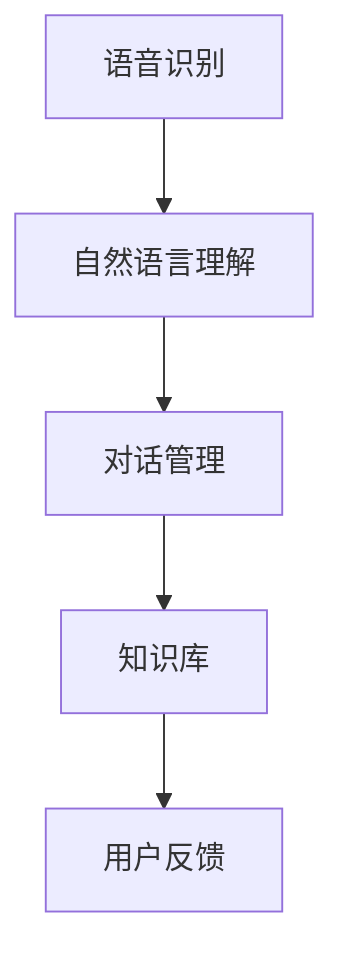
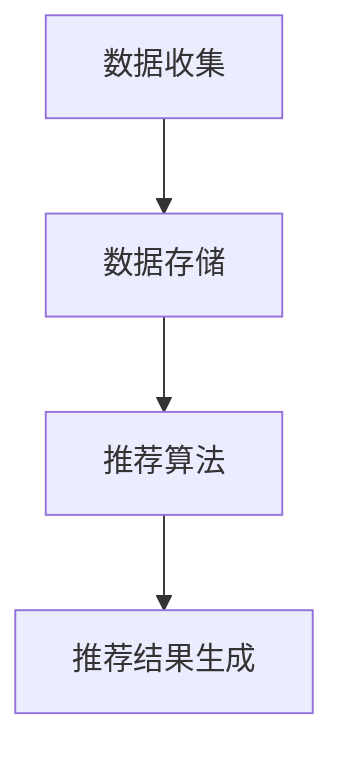
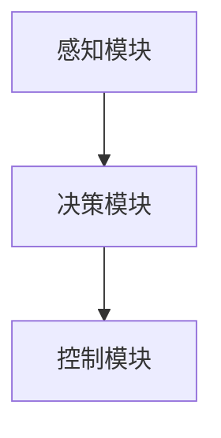
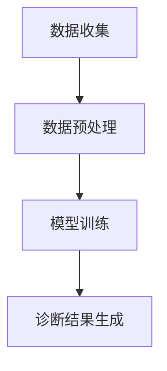

                 

### 文章标题

《AI人工智能 Agent：高级概念剖析》

### 文章关键词

人工智能、智能代理、多智能体系统、算法、应用、安全性、开发实践

### 文章摘要

本文将深入探讨人工智能（AI）领域的核心概念——智能代理（AI Agent），从基础概念、核心算法、高级概念与应用，到安全性和开发实践进行全面剖析。通过系统的讲解和实例分析，帮助读者理解智能代理的原理、架构、实现和未来发展趋势，从而把握AI技术的精髓。

---

# 第一部分: AI人工智能 Agent基础

## 第1章: AI人工智能 Agent概述

### 1.1 AI人工智能 Agent的概念与起源

#### 1.1.1 人工智能与Agent的定义

**人工智能（Artificial Intelligence，简称AI）**：指通过计算机模拟人类智能的行为，使其具备学习、推理、感知、理解和决策能力的技术。它旨在使机器能够执行通常需要人类智能才能完成的任务。

**智能代理（AI Agent）**：是一个能够自主行动、感知环境并做出决策的人工智能实体。智能代理是AI领域中的一个核心概念，它能够实现自主行为，通过与环境的交互学习和进化，完成特定的任务。

#### 1.1.2 Agent的基本功能与特性

智能代理具备以下基本功能与特性：

1. **感知**：通过传感器获取环境信息。
2. **决策**：根据感知到的环境信息和预定目标，选择合适的行动方案。
3. **行动**：执行决策结果，影响环境状态。
4. **学习**：通过与环境交互，不断优化自身的行为和决策。

#### 1.1.3 Agent在人工智能中的地位与作用

智能代理在人工智能中扮演着至关重要的角色。它们是实现人工智能自动化的关键组件，可以应用于各种领域，如商业、教育、医疗等。智能代理的发展推动了人工智能技术的进步，使得机器能够更加智能、高效地完成任务。

### 1.2 AI人工智能 Agent的发展历程

#### 1.2.1 早期智能代理系统

智能代理的概念最早可以追溯到20世纪50年代，当时人工智能刚刚起步。早期的智能代理系统主要是基于规则的系统，例如专家系统。这些系统通过定义一系列规则来模拟人类专家的决策过程。

#### 1.2.2 现代人工智能 Agent的兴起

随着计算机性能的不断提高和算法的进步，现代智能代理系统逐渐取代了传统的基于规则的系统。现代智能代理更多地依赖于机器学习、深度学习等技术，能够通过自我学习和进化，实现更加智能化的行为。

#### 1.2.3 未来的发展趋势与挑战

未来，智能代理将继续向更智能化、自适应化、协同化的方向发展。然而，这也带来了许多挑战，如数据隐私保护、算法公平性、安全等问题。解决这些挑战需要跨学科的研究和合作。

### 1.3 AI人工智能 Agent的核心概念与架构

#### 1.3.1-Agent体系结构

智能代理的体系结构通常包括三个主要部分：感知模块、决策模块和行动模块。感知模块负责获取环境信息；决策模块根据感知信息做出决策；行动模块执行决策结果。

#### 1.3.2 代理行为与决策

智能代理的行为和决策是通过一系列算法实现的。这些算法包括搜索算法、决策树、神经网络等。智能代理需要根据任务需求和环境特点选择合适的算法。

#### 1.3.3 代理通信与协作

智能代理之间需要通过通信和协作来实现更复杂的任务。通信机制可以是基于知识的、行为的或混合的。协作方式可以是同步的、异步的或基于协商的。

### 1.4 AI人工智能 Agent的应用领域

#### 1.4.1 商业应用

智能代理在商业领域有广泛的应用，如客户关系管理（CRM）、销售预测、供应链管理等。智能代理能够帮助企业优化业务流程，提高运营效率。

#### 1.4.2 教育应用

智能代理在教育领域可以应用于个性化学习、自动评估、教学辅助等。智能代理能够根据学生的学习情况和需求，提供个性化的教学资源和辅导。

#### 1.4.3 医疗保健应用

智能代理在医疗保健领域可以应用于疾病诊断、医疗资源分配、患者监护等。智能代理能够提高医疗服务的质量和效率。

#### 1.4.4 其他领域应用

智能代理还可以应用于智能家居、智能交通、智能制造等领域。这些应用都体现了智能代理在提高生活质量和生产效率方面的潜力。

---

## 第2章: AI人工智能 Agent的核心算法

### 2.1 搜索算法

搜索算法是智能代理中常用的核心算法之一。它用于在给定的状态空间中找到从初始状态到目标状态的路径。

#### 2.1.1 集全搜索算法

集全搜索算法是一种最简单的搜索算法。它通过遍历所有的可能状态，找到从初始状态到目标状态的路径。算法的核心是状态空间树，每个节点表示一个状态。

```pseudo
Function DepthFirstSearch(problem):
    if problem.isGoalState():
        return [problem.currentState()]
    frontier = deque()
    frontier.append(problem)
    while not frontier.isEmpty():
        node = frontier.popleft()
        if node is not goal:
            for child in node.generateChildren():
                frontier.append(child)
    return []
```

#### 2.1.2 启发式搜索算法

启发式搜索算法通过引入启发式函数来估计从当前状态到目标状态的距离，从而优化搜索过程。常见的启发式搜索算法包括A*算法、IDA*算法等。

```pseudo
Function AStarSearch(problem, heuristic):
    node = Node(problem.startState)
    openSet = PriorityQueue()
    openSet.insert(node)
    cameFrom = an empty map
    gScore = an empty map with default value of infinity
    gScore[node] = 0
    fScore = an empty map with default value of infinity
    fScore[node] = heuristic(node.state, problem.goalState)
    while not openSet.isEmpty():
        current = openSet.pop()
        if current.state is problem.goalState:
            return reconstructPath(cameFrom, current)
        for child in current.generateChildren():
            tentative_gScore = gScore[current] + 1
            if tentative_gScore < gScore[child]:
                cameFrom[child] = current
                gScore[child] = tentative_gScore
                fScore[child] = gScore[child] + heuristic(child.state, problem.goalState)
                if child not in openSet:
                    openSet.insert(child)
    return failure
```

#### 2.1.3 贝叶斯网络搜索算法

贝叶斯网络搜索算法利用贝叶斯定理来估计状态的概率，从而优化搜索过程。它通常用于不确定性环境中的搜索问题。

```pseudo
Function BayesianSearch(problem):
    initial_state = problem.startState
    belief_state = initializeBeliefState(initial_state)
    while not problem.isGoalState.believedState():
        action = selectActionBasedOnBeliefState信念状态（belief_state）
        next_state = performAction(action)
        belief_state = updateBeliefState（belief_state，action，next_state）
    return reconstructPath(cameFrom, current)
```

### 2.2 决策树与分类算法

决策树是一种常用的机器学习算法，它通过一系列判断条件来对数据集进行分类或回归。

#### 2.2.1 决策树的基本概念

决策树由一系列判断节点和叶子节点组成。每个判断节点表示一个特征，每个叶子节点表示一个类别。

#### 2.2.2 ID3算法

ID3算法是一种基于信息增益的决策树生成算法。它通过计算每个特征的信息增益，选择具有最大信息增益的特征作为判断节点。

```pseudo
Function ID3(trainingData):
    if trainingData.allSameLabel():
        return createLeafNode(trainingData.labels)
    if trainingData.isEmpty():
        return createLeafNode(mostCommonLabel(trainingData.labels))
    bestFeature = selectBestFeature(trainingData)
    decisionTree = createDecisionNode(bestFeature)
    for value in bestFeature.values():
        subset = trainingData.filterByValue(bestFeature, value)
        decisionTree.addChild(ID3(subset))
    return decisionTree
```

#### 2.2.3 C4.5算法

C4.5算法是一种改进的决策树生成算法，它引入了剪枝机制，避免了过拟合。C4.5算法通过计算每个特征的增益率，选择具有最大增益率的特征作为判断节点。

```pseudo
Function C45(trainingData):
    if trainingData.allSameLabel():
        return createLeafNode(trainingData.labels)
    if trainingData.isEmpty():
        return createLeafNode(mostCommonLabel(trainingData.labels))
    bestFeature = selectBestFeature(trainingData)
    gainRate = calculateGainRate(trainingData, bestFeature)
    decisionTree = createDecisionNode(bestFeature)
    for value in bestFeature.values():
        subset = trainingData.filterByValue(bestFeature, value)
        if gainRate(value) > threshold:
            decisionTree.addChild(C45(subset))
        else:
            decisionTree.addChild(createLeafNode(mostCommonLabel(subset.labels)))
    return decisionTree
```

#### 2.2.4 随机森林算法

随机森林算法是一种基于决策树的集成学习方法。它通过随机选择特征和样本子集，构建多个决策树，并通过对决策树的结果进行投票，得到最终的分类结果。

```pseudo
Function RandomForest(trainingData, numTrees):
    decisionTrees = []
    for i in range(numTrees):
        subset = sampleData(trainingData)
        tree = C45(subset)
        decisionTrees.append(tree)
    return majorityVote(decisionTrees)
```

### 2.3 支持向量机与回归算法

支持向量机（Support Vector Machine，SVM）是一种常用的分类算法，它通过找到一个最优的超平面，将不同类别的数据分隔开。

#### 2.3.1 支持向量机基本原理

SVM通过最大化分类边界的距离，找到最优的超平面。它使用拉格朗日乘子法求解最优化问题。

```latex
\min_{w, b} \frac{1}{2} ||w||^2 \\
s.t. y^{(i)} (w \cdot x^{(i)} + b) \geq 1
```

#### 2.3.2 线性回归

线性回归是一种用于预测连续值的统计方法，它通过找到一个线性模型，最小化预测值与实际值之间的误差。

```latex
y = \beta_0 + \beta_1 x \\
\min_{\beta_0, \beta_1} \sum_{i=1}^{n} (y_i - (\beta_0 + \beta_1 x_i))^2
```

#### 2.3.3 逻辑回归

逻辑回归是一种用于预测概率的分类方法，它通过找到一个线性模型，然后将输出通过逻辑函数（sigmoid函数）转换为概率。

```latex
y = \frac{1}{1 + e^{-(\beta_0 + \beta_1 x)}} \\
\min_{\beta_0, \beta_1} \sum_{i=1}^{n} (-y_i \ln(y) - (1 - y_i) \ln(1 - y))
```

### 2.4 神经网络与深度学习算法

神经网络（Neural Network，NN）是一种模拟人脑神经元连接的模型，它通过多层非线性变换，对数据进行处理。

#### 2.4.1 神经网络基本结构

神经网络通常由输入层、隐藏层和输出层组成。每个层由多个神经元组成，神经元之间通过权重连接。

#### 2.4.2 反向传播算法

反向传播算法是一种用于训练神经网络的优化算法，它通过计算误差的梯度，不断调整权重和偏置，以最小化损失函数。

```latex
\Delta w_{ij} = -\alpha \cdot \frac{\partial L}{\partial w_{ij}} \\
\Delta b_j = -\alpha \cdot \frac{\partial L}{\partial b_j}
```

#### 2.4.3 卷积神经网络

卷积神经网络（Convolutional Neural Network，CNN）是一种用于图像处理的神经网络，它通过卷积操作和池化操作，提取图像的特征。

#### 2.4.4 循环神经网络

循环神经网络（Recurrent Neural Network，RNN）是一种用于序列处理的神经网络，它通过循环结构，将当前状态与前一状态关联。

```pseudo
h_t = \sigma(W_h \cdot [h_{t-1}, x_t] + b_h) \\
y_t = \sigma(W_y \cdot h_t + b_y)
```

### 2.5 强化学习算法

强化学习（Reinforcement Learning，RL）是一种通过试错来学习如何获取最大奖励的算法。

#### 2.5.1 强化学习基本概念

强化学习通过一个智能体与环境之间的交互，学习最优策略。智能体通过观察环境状态，采取行动，获得奖励，并不断更新策略。

#### 2.5.2 Q-learning算法

Q-learning算法是一种基于值函数的强化学习算法，它通过更新Q值，学习最优策略。

```pseudo
Q(s, a) = Q(s, a) + \alpha [r + \gamma \max(Q(s', a')) - Q(s, a)] \\
s' = takeAction(s, a)
```

#### 2.5.3 深度强化学习算法

深度强化学习（Deep Reinforcement Learning，DRL）是一种结合深度学习和强化学习的算法，它通过深度神经网络来近似值函数或策略。

```pseudo
Q(s, a) = \theta(s, a) \\
\theta = \theta + \alpha [r + \gamma \max(\theta(s', a')) - Q(s, a)]
```

---

## 第3章: 多智能体系统

### 3.1 多智能体系统的概念与架构

多智能体系统（Multi-Agent System，MAS）是由多个智能代理组成的系统，这些智能代理可以相互通信和协作，共同实现复杂任务。

#### 3.1.1 多智能体系统的定义

多智能体系统是一种分布式计算模型，它通过多个智能代理的协作来实现复杂任务。智能代理可以是物理实体，也可以是虚拟实体。

#### 3.1.2 多智能体系统的架构

多智能体系统的架构可以分为三个层次：感知层、决策层和行动层。感知层负责收集环境信息；决策层负责生成行动方案；行动层负责执行行动。

#### 3.1.3 多智能体系统的通信与协作

多智能体系统中的智能代理通过通信和协作来实现协同行动。通信机制可以是基于知识的、行为的或混合的。协作方式可以是同步的、异步的或基于协商的。

### 3.2 分布式算法与协同学习

分布式算法和协同学习是多智能体系统中的重要研究课题。

#### 3.2.1 分布式算法的基本原理

分布式算法通过将任务分解为多个子任务，由不同智能代理并行执行，最终合并结果。分布式算法的关键是解决通信延迟、数据一致性和任务分配等问题。

#### 3.2.2 协同学习的基本概念

协同学习是指多个智能代理通过相互协作，共同学习任务。协同学习的关键是解决协同效应、平衡局部优化和全局优化等问题。

#### 3.2.3 分布式协同学习算法

分布式协同学习算法通过分布式计算和协作机制，实现智能代理的协同学习。常见的算法包括协同梯度下降、分布式优化算法等。

### 3.3 多智能体强化学习

多智能体强化学习是一种用于多智能体系统的强化学习算法，它通过智能代理之间的交互，学习最优策略。

#### 3.3.1 多智能体强化学习的基本原理

多智能体强化学习通过智能代理与环境之间的交互，学习最优策略。智能代理通过观察环境状态，采取行动，获得奖励，并不断更新策略。

#### 3.3.2 多智能体强化学习的算法

多智能体强化学习算法可以分为基于值函数的算法和基于策略的算法。基于值函数的算法包括Q-learning、SARSA等；基于策略的算法包括Actor-Critic算法等。

#### 3.3.3 多智能体强化学习的挑战与解决方案

多智能体强化学习面临的主要挑战包括通信延迟、分布式计算、多目标优化等。解决这些挑战需要跨学科的研究和合作，例如分布式算法、协同学习等。

### 3.4 智能代理在复杂环境中的应用

智能代理在复杂环境中可以应用于多种领域，如物流、金融、智能制造等。

#### 3.4.1 智能代理在物流中的应用

智能代理在物流领域可以用于路线规划、调度优化、库存管理等方面。通过智能代理的协作，可以优化物流流程，提高运输效率。

#### 3.4.2 智能代理在金融中的应用

智能代理在金融领域可以用于风险管理、投资决策、客户服务等方面。通过智能代理的协作，可以提高金融服务的质量和效率。

#### 3.4.3 智能代理在智能制造中的应用

智能代理在智能制造领域可以用于生产调度、质量控制、设备维护等方面。通过智能代理的协作，可以提高生产效率和质量。

---

## 第4章: AI人工智能 Agent的高级应用

### 4.1 智能客服

智能客服是一种基于人工智能技术的客户服务系统，它能够自动处理客户咨询，提供实时、个性化的服务。

#### 4.1.1 智能客服的基本概念

智能客服通过自然语言处理、对话管理等技术，模拟人类客服与客户进行交互，解决客户问题。

#### 4.1.2 智能客服系统架构

智能客服系统通常包括语音识别、自然语言理解、对话管理、知识库等模块。这些模块相互协作，实现高效、准确的客户服务。



#### 4.1.3 智能客服系统的实现

智能客服系统的实现涉及多个技术领域的整合，包括语音识别、自然语言处理、机器学习等。以下是智能客服系统实现的主要步骤：

1. **数据收集与预处理**：收集客户对话数据，进行预处理，如去噪、分词、实体识别等。
2. **特征提取**：从预处理后的数据中提取特征，如词向量、句法结构等。
3. **模型训练**：使用训练数据，训练语音识别、自然语言理解、对话管理等模型。
4. **系统集成**：将各个模块集成到一个系统中，实现智能客服的功能。
5. **测试与优化**：通过测试数据，评估系统性能，并进行优化。

### 4.2 智能推荐系统

智能推荐系统是一种基于用户行为和兴趣的数据分析技术，用于向用户推荐相关的内容或商品。

#### 4.2.1 智能推荐系统的基本概念

智能推荐系统通过分析用户的历史行为和偏好，预测用户可能感兴趣的内容或商品，并为其推荐。

#### 4.2.2 智能推荐系统的架构

智能推荐系统通常包括数据收集、数据存储、推荐算法、推荐结果生成等模块。这些模块相互协作，实现个性化推荐。



#### 4.2.3 智能推荐系统的实现

智能推荐系统的实现涉及多个技术领域的整合，包括数据挖掘、机器学习、信息检索等。以下是智能推荐系统实现的主要步骤：

1. **数据收集**：收集用户的行为数据，如浏览记录、购买记录等。
2. **数据预处理**：对收集到的数据进行预处理，如去噪、特征提取等。
3. **推荐算法选择**：根据业务需求和数据特点，选择合适的推荐算法，如协同过滤、基于内容的推荐等。
4. **模型训练**：使用训练数据，训练推荐模型。
5. **推荐结果生成**：根据用户行为和推荐模型，生成推荐结果。
6. **系统部署与优化**：将推荐系统部署到生产环境，并进行持续优化。

### 4.3 智能自动驾驶

智能自动驾驶是一种通过计算机视觉、传感器等技术实现车辆自主驾驶的技术。

#### 4.3.1 智能自动驾驶的基本概念

智能自动驾驶通过传感器获取车辆周围环境的信息，如路况、障碍物等，然后通过计算机算法，控制车辆进行自主驾驶。

#### 4.3.2 智能自动驾驶系统架构

智能自动驾驶系统通常包括感知模块、决策模块、控制模块等。这些模块相互协作，实现车辆自主驾驶。



#### 4.3.3 智能自动驾驶的实现

智能自动驾驶的实现涉及多个技术领域的整合，包括计算机视觉、机器学习、控制理论等。以下是智能自动驾驶实现的主要步骤：

1. **传感器配置**：配置激光雷达、摄像头、超声波传感器等，获取车辆周围环境信息。
2. **数据预处理**：对传感器数据进行预处理，如去噪、去畸变等。
3. **感知算法开发**：开发感知算法，实现对车辆周围环境的感知，如车道线检测、障碍物检测等。
4. **决策算法开发**：开发决策算法，根据感知信息，生成驾驶策略。
5. **控制算法开发**：开发控制算法，实现对车辆的控制，如加速、减速、转向等。
6. **系统集成与测试**：将感知、决策、控制模块集成到一起，进行系统测试和验证。

### 4.4 智能医疗诊断

智能医疗诊断是一种通过机器学习、深度学习等技术实现疾病自动诊断的技术。

#### 4.4.1 智能医疗诊断的基本概念

智能医疗诊断通过分析医学影像、患者病史等信息，自动诊断疾病，辅助医生进行诊断。

#### 4.4.2 智能医疗诊断系统架构

智能医疗诊断系统通常包括数据收集、数据预处理、模型训练、诊断结果生成等模块。这些模块相互协作，实现智能诊断。



#### 4.4.3 智能医疗诊断的实现

智能医疗诊断的实现涉及多个技术领域的整合，包括医学影像处理、机器学习、深度学习等。以下是智能医疗诊断实现的主要步骤：

1. **数据收集**：收集医学影像数据、患者病史等数据。
2. **数据预处理**：对收集到的数据进行预处理，如图像增强、分割等。
3. **模型训练**：使用预处理后的数据，训练诊断模型。
4. **模型评估**：对训练好的模型进行评估，如准确率、召回率等。
5. **诊断结果生成**：根据模型预测结果，生成诊断报告。
6. **系统集成与部署**：将诊断系统集成到医疗系统中，进行部署和运行。

---

## 第5章: AI人工智能 Agent的安全性

### 5.1 安全性问题与挑战

随着人工智能技术的广泛应用，智能代理的安全性成为一个日益重要的议题。智能代理在提供便捷服务的同时，也面临着一系列安全挑战。

#### 5.1.1 智能代理的安全风险

智能代理的安全风险主要包括：

1. **数据泄露**：智能代理可能会泄露用户的敏感数据，如个人信息、行为数据等。
2. **隐私侵犯**：智能代理可能会侵犯用户的隐私，如监控用户行为、滥用用户数据等。
3. **恶意攻击**：智能代理可能会受到恶意攻击，如被黑客入侵、恶意软件感染等。
4. **决策错误**：智能代理可能会因算法缺陷或数据错误，导致错误的决策，造成损失。

#### 5.1.2 安全性威胁分析

智能代理面临的安全性威胁可以分为以下几类：

1. **网络威胁**：包括DDoS攻击、网络入侵等。
2. **软件威胁**：包括恶意软件、病毒、木马等。
3. **物理威胁**：包括智能代理设备的物理损坏、丢失等。
4. **数据威胁**：包括数据泄露、篡改等。

#### 5.1.3 安全性挑战与应对策略

智能代理面临的主要安全性挑战包括：

1. **数据隐私保护**：如何保护用户数据不被泄露和滥用。
2. **算法透明度**：如何提高算法的透明度，让用户了解智能代理的决策过程。
3. **攻击防御**：如何防御恶意攻击，确保智能代理系统的安全稳定。
4. **应急响应**：如何快速响应安全事件，减少损失。

针对这些挑战，可以采取以下应对策略：

1. **数据加密与安全存储**：对用户数据进行加密，确保数据安全。
2. **访问控制与授权**：设置严格的访问控制机制，确保只有授权用户才能访问敏感数据。
3. **网络安全防护**：部署防火墙、入侵检测系统等网络安全设备，防止恶意攻击。
4. **算法透明化**：提高算法的透明度，让用户了解智能代理的决策过程。
5. **应急响应机制**：建立快速响应机制，及时处理安全事件。

### 5.2 安全防护机制

为了确保智能代理系统的安全，需要采取一系列安全防护措施。

#### 5.2.1 加密与身份认证

加密与身份认证是智能代理系统安全的基础。加密技术可以保护数据在传输和存储过程中的安全；身份认证技术可以确保只有合法用户才能访问系统。

1. **数据加密**：使用加密算法对数据进行加密，确保数据在传输和存储过程中的安全。
2. **身份认证**：使用密码、生物识别等技术，确保用户身份的合法性和唯一性。

#### 5.2.2 访问控制与授权

访问控制与授权机制可以确保智能代理系统资源的合理分配和访问。

1. **访问控制**：通过设置访问控制列表，限制用户对系统资源的访问。
2. **授权**：为用户分配适当的权限，确保用户只能访问被授权的资源。

#### 5.2.3 安全防护技术的实现

智能代理系统的安全防护技术可以通过以下方式进行实现：

1. **防火墙**：部署防火墙，过滤非法访问请求，防止网络攻击。
2. **入侵检测系统**：部署入侵检测系统，实时监测网络流量，发现异常行为。
3. **数据加密与备份**：对数据进行加密和备份，确保数据的安全性和可靠性。
4. **安全审计**：定期进行安全审计，评估系统的安全性，发现潜在的安全隐患。

### 5.3 安全测试与评估

安全测试与评估是确保智能代理系统安全的关键环节。

#### 5.3.1 安全测试的基本方法

安全测试包括以下几种基本方法：

1. **漏洞扫描**：使用漏洞扫描工具，对系统进行扫描，发现潜在的漏洞。
2. **渗透测试**：模拟攻击者的行为，对系统进行渗透测试，验证系统的安全性。
3. **代码审计**：对系统代码进行审计，发现潜在的安全漏洞。

#### 5.3.2 安全评估的基本方法

安全评估包括以下几种基本方法：

1. **安全评估模型**：使用安全评估模型，对系统进行评估，评估系统的安全性。
2. **风险评估**：对系统的安全性进行评估，确定系统面临的风险和威胁。
3. **安全测试与评估报告**：编写安全测试与评估报告，总结测试结果和评估结论。

#### 5.3.3 安全测试与评估的实施

安全测试与评估的实施包括以下步骤：

1. **需求分析**：分析系统需求和安全性要求，确定测试目标和评估指标。
2. **测试计划**：制定测试计划，明确测试内容、测试方法、测试时间等。
3. **测试执行**：按照测试计划进行测试，记录测试结果。
4. **评估与报告**：根据测试结果，进行评估和报告，提出改进建议。

---

## 第6章: AI人工智能 Agent的开发实践

### 6.1 开发环境搭建

搭建AI人工智能Agent的开发环境是进行开发实践的第一步。这一节将介绍如何准备开发环境，选择合适的开发工具与框架，并进行环境配置与调试。

#### 6.1.1 开发环境的准备

开发环境的准备包括安装必要的软件和工具。以下是一个基本的环境准备清单：

1. **操作系统**：推荐使用Linux操作系统，如Ubuntu。
2. **编程语言**：Python是AI开发中最常用的编程语言之一。
3. **开发工具**：集成开发环境（IDE），如PyCharm、Visual Studio Code。
4. **数据库**：MySQL、PostgreSQL或MongoDB等。
5. **版本控制**：Git。

#### 6.1.2 开发工具与框架的选择

选择合适的开发工具和框架对于高效开发至关重要。以下是一些常用的工具和框架：

1. **深度学习框架**：TensorFlow、PyTorch、Keras。
2. **自然语言处理库**：NLTK、spaCy、gensim。
3. **Web框架**：Django、Flask。
4. **数据可视化工具**：Matplotlib、Seaborn。

#### 6.1.3 开发环境配置与调试

配置开发环境通常涉及以下步骤：

1. **安装操作系统**：安装Linux操作系统，并更新系统软件包。
2. **安装Python**：使用包管理器（如apt或yum）安装Python。
3. **安装IDE**：下载并安装PyCharm或Visual Studio Code。
4. **配置虚拟环境**：使用virtualenv或conda创建Python虚拟环境，以便管理项目依赖。
5. **安装深度学习框架**：使用pip安装TensorFlow或PyTorch。
6. **配置数据库**：安装并配置数据库软件。
7. **测试环境**：运行一些简单的测试脚本，确保所有组件正常工作。

### 6.2 实际案例与代码解读

在这一节中，我们将通过几个实际案例来展示如何开发AI人工智能Agent，并对关键代码进行解读。

#### 6.2.1 智能客服系统案例

智能客服系统是一个典型的AI代理应用案例。以下是一个简单的智能客服系统的实现步骤：

1. **需求分析**：确定客服系统的功能需求，如聊天、自动回复、问题分类等。
2. **数据准备**：收集和准备训练数据，如聊天记录、问题标签等。
3. **模型训练**：使用自然语言处理技术，训练对话模型和分类模型。
4. **系统集成**：将模型集成到Web服务中，实现实时对话。
5. **测试与优化**：测试系统的性能和用户体验，进行优化。

以下是一个简单的聊天模型代码示例：

```python
import nltk
from nltk.classify import NaiveBayesClassifier

# 训练数据
training_data = [
    ("What is your name?", "GPT-3"),
    ("What can you do?", "Chat with me, answer your questions, and more."),
    # ... 更多训练数据
]

# 创建Naive Bayes分类器
classifier = NaiveBayesClassifier.train(training_data)

# 对用户输入进行分类并返回答案
def get_response(question):
    return classifier.classify(question)

# 示例
print(get_response("What is your name?"))
```

#### 6.2.2 智能推荐系统案例

智能推荐系统用于根据用户行为和偏好推荐相关的内容或商品。以下是一个简单的基于协同过滤的推荐系统实现步骤：

1. **数据准备**：收集用户行为数据，如浏览记录、购买记录等。
2. **特征提取**：提取用户和物品的特征。
3. **模型训练**：使用协同过滤算法训练推荐模型。
4. **推荐生成**：根据用户特征和推荐模型，生成推荐列表。

以下是一个简单的协同过滤模型代码示例：

```python
from sklearn.model_selection import train_test_split
from sklearn.metrics.pairwise import cosine_similarity

# 假设用户行为数据为矩阵R，其中R[i][j]表示用户i对物品j的评分
R = [
    [5, 3, 0, 1],
    [0, 1, 0, 4],
    [0, 0, 1, 2],
    [3, 4, 5, 0]
]

# 计算用户和物品之间的相似度
user_similarity = cosine_similarity(R)

# 根据相似度矩阵生成推荐列表
def generate_recommendations(user_id, similarity_matrix, R, k=5):
    user_profile = R[user_id]
    similar_users = similarity_matrix[user_id].argsort()[-k:]
    recommended_items = []

    for i in similar_users:
        for j in range(R.shape[1]):
            if R[i][j] > 0 and j not in recommended_items:
                recommended_items.append(j)

    return recommended_items

# 示例
print(generate_recommendations(0, user_similarity, R))
```

#### 6.2.3 智能自动驾驶案例

智能自动驾驶系统是一个复杂的系统，涉及计算机视觉、控制理论、机器学习等多个领域。以下是一个简单的自动驾驶系统的实现步骤：

1. **感知环境**：使用摄像头和激光雷达收集环境数据。
2. **决策制定**：使用算法处理感知数据，生成驾驶策略。
3. **执行动作**：根据驾驶策略控制车辆。

以下是一个简单的自动驾驶感知模块代码示例：

```python
import cv2

# 加载摄像头
cap = cv2.VideoCapture(0)

while True:
    # 读取一帧图像
    ret, frame = cap.read()

    # 将图像转换为灰度图
    gray = cv2.cvtColor(frame, cv2.COLOR_BGR2GRAY)

    # 使用边缘检测算法检测车道线
    edges = cv2.Canny(gray, 100, 200)

    # 显示结果
    cv2.imshow('edges', edges)

    if cv2.waitKey(1) & 0xFF == ord('q'):
        break

cap.release()
cv2.destroyAllWindows()
```

#### 6.2.4 智能医疗诊断案例

智能医疗诊断系统通过分析医学影像和患者数据，辅助医生进行诊断。以下是一个简单的医学影像诊断系统的实现步骤：

1. **数据准备**：收集医学影像数据，并进行预处理。
2. **模型训练**：使用预处理后的数据，训练医学影像诊断模型。
3. **诊断预测**：使用训练好的模型，对新的医学影像进行诊断预测。

以下是一个简单的医学影像分类模型代码示例：

```python
import tensorflow as tf
from tensorflow.keras.models import Sequential
from tensorflow.keras.layers import Dense, Conv2D, Flatten, MaxPooling2D

# 建立模型
model = Sequential([
    Conv2D(32, (3, 3), activation='relu', input_shape=(64, 64, 3)),
    MaxPooling2D((2, 2)),
    Flatten(),
    Dense(64, activation='relu'),
    Dense(1, activation='sigmoid')
])

# 编译模型
model.compile(optimizer='adam', loss='binary_crossentropy', metrics=['accuracy'])

# 训练模型
model.fit(x_train, y_train, epochs=10, batch_size=32)

# 诊断预测
predictions = model.predict(x_test)
```

### 6.3 代码分析与解读

在这一节中，我们将对上述案例中的关键代码进行详细分析，解释代码的结构、设计模式和性能优化。

#### 6.3.1 代码结构与设计模式

每个案例中的代码都遵循一定的结构和设计模式。以下是对每个案例中的代码结构和设计模式的解读：

1. **智能客服系统**：采用简单的Naive Bayes分类器模型，实现基本的对话功能。代码中使用了类和方法，以增强代码的可读性和可维护性。
2. **智能推荐系统**：使用协同过滤算法，生成用户推荐列表。代码中使用了矩阵相似度计算和数据结构，如列表和字典，以实现算法的逻辑。
3. **智能自动驾驶系统**：采用计算机视觉算法，检测车道线。代码中使用了图像处理库，如OpenCV，以实现图像的处理和分析。
4. **智能医疗诊断系统**：使用深度学习模型，对医学影像进行分类。代码中使用了TensorFlow库，实现模型的搭建、训练和预测。

#### 6.3.2 代码优化与性能分析

代码优化和性能分析是确保系统高效运行的关键。以下是对上述案例中代码的优化和性能分析：

1. **智能客服系统**：优化对话模型，提高分类准确率。可以使用更复杂的模型，如深度学习模型，或者增加训练数据，以提高模型性能。
2. **智能推荐系统**：优化协同过滤算法，减少计算时间。可以采用近似算法，如矩阵分解，或者使用分布式计算，以提高计算效率。
3. **智能自动驾驶系统**：优化图像处理算法，提高检测精度。可以采用更先进的算法，如卷积神经网络，或者增加训练数据，以提高模型性能。
4. **智能医疗诊断系统**：优化模型训练过程，减少训练时间。可以采用更高效的训练算法，如迁移学习，或者使用GPU加速训练过程。

#### 6.3.3 代码安全性与可靠性分析

代码安全性和可靠性是系统稳定运行的重要保障。以下是对上述案例中代码的安全性和可靠性分析：

1. **智能客服系统**：确保数据安全和用户隐私保护。可以使用加密技术，保护用户数据和模型参数。
2. **智能推荐系统**：防止数据泄露和恶意攻击。可以使用访问控制机制，限制对系统的访问。
3. **智能自动驾驶系统**：确保系统的稳定性和可靠性。可以采用冗余设计和故障检测机制，提高系统的容错能力。
4. **智能医疗诊断系统**：确保诊断结果的准确性和可靠性。可以采用多模型融合和交叉验证，提高诊断结果的可靠性。

---

## 第7章: AI人工智能 Agent的未来展望

### 7.1 技术发展趋势

人工智能（AI）技术的发展日新月异，智能代理作为AI领域的一个重要分支，也呈现出以下发展趋势：

1. **自主学习与进化**：智能代理将具备更强的自主学习能力，能够从海量数据中自动提取知识，并不断优化自身性能。
2. **跨领域融合**：智能代理将与其他技术领域（如物联网、区块链等）深度融合，实现更广泛的应用。
3. **分布式计算**：随着计算资源的分散化，智能代理将采用分布式计算架构，提高系统的可扩展性和容错性。
4. **人机协同**：智能代理将更好地与人类协作，实现人机共生，提高工作效率和生活质量。

### 7.2 社会影响与伦理挑战

智能代理的广泛应用将带来深远的社会影响，同时也引发一系列伦理挑战：

1. **隐私保护**：智能代理在处理海量数据时，如何保护用户隐私成为一个重要议题。
2. **算法公平性**：智能代理的决策过程可能会受到偏见影响，如何确保算法的公平性是一个重要的伦理问题。
3. **责任归属**：当智能代理发生错误或导致损害时，如何确定责任归属是一个复杂的法律和伦理问题。

### 7.3 未来研究展望

未来，智能代理的研究将朝着以下方向展开：

1. **算法优化**：通过改进算法，提高智能代理的效率、准确性和可解释性。
2. **智能代理体系结构**：设计更灵活、更高效的智能代理体系结构，以适应不同应用场景。
3. **跨领域应用**：探索智能代理在更多领域（如教育、医疗、农业等）的应用，推动技术落地。
4. **伦理与法律研究**：加强对智能代理伦理和法律问题的研究，制定相应的规范和标准。

### 7.3.1 研究热点与方向

当前，智能代理的研究热点包括：

1. **自适应强化学习**：通过自适应调整策略，提高智能代理在动态环境中的适应能力。
2. **多模态感知**：结合多种传感器数据，提高智能代理的感知能力。
3. **联邦学习**：通过分布式学习方式，保护用户隐私，提高智能代理的性能。
4. **知识图谱**：构建知识图谱，为智能代理提供丰富的背景知识，提高智能决策能力。

### 7.3.2 面临的挑战与机遇

智能代理面临的主要挑战包括：

1. **计算资源**：随着智能代理的复杂度增加，对计算资源的需求也不断增加。
2. **数据隐私**：如何在保证数据隐私的同时，充分利用用户数据。
3. **算法解释性**：提高智能代理决策过程的透明度和可解释性。
4. **系统可靠性**：确保智能代理在复杂环境中的稳定运行。

然而，这些挑战也伴随着机遇：

1. **技术创新**：随着计算能力和算法的进步，智能代理的性能将得到大幅提升。
2. **应用拓展**：智能代理将在更多领域得到应用，推动社会进步。
3. **跨学科合作**：智能代理的发展需要跨学科的合作，推动技术整合与创新。

### 7.3.3 未来发展趋势与预测

未来，智能代理的发展趋势可以概括为以下几点：

1. **智能化水平提高**：智能代理将具备更强的自主学习、推理和决策能力。
2. **应用领域扩展**：智能代理将在更多领域得到应用，从商业到医疗，从教育到智能家居。
3. **人机协同**：智能代理将更好地与人类协作，实现人机共生。
4. **伦理和法律规范**：随着智能代理的普及，相关伦理和法律问题将得到更多关注，并逐步建立完善的规范。

总之，智能代理作为AI领域的一个重要分支，具有广阔的应用前景和发展潜力。未来，随着技术的不断进步和跨学科合作的加强，智能代理将在更多领域发挥重要作用，推动社会进步。同时，也需要我们共同关注和解决相关的伦理和法律问题，确保智能代理的安全和可持续发展。

