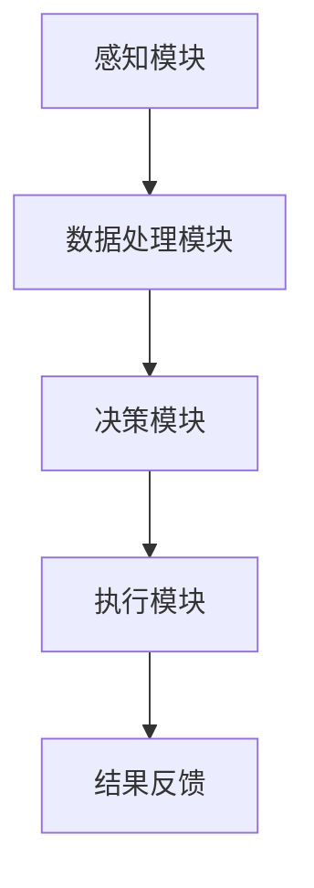
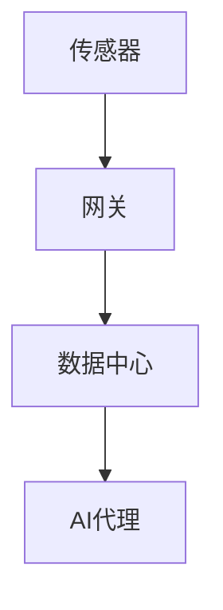
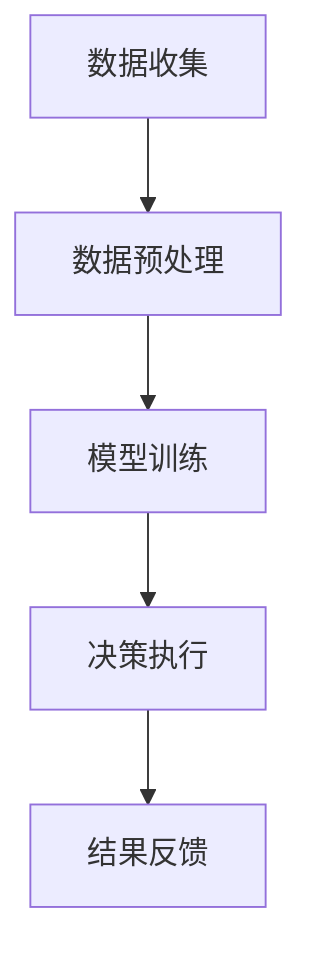
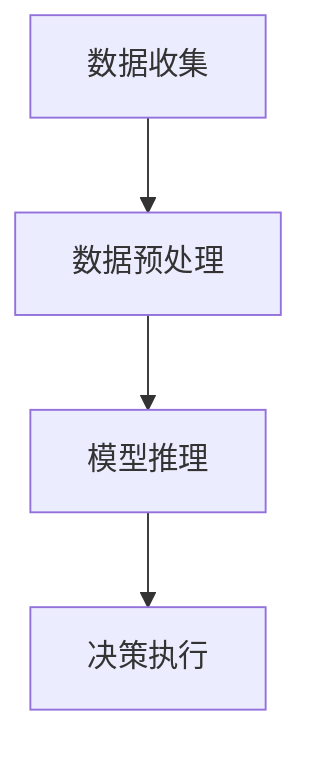

                 

# 文章标题: AI人工智能代理工作流AI Agent WorkFlow：AI代理在物联网场景的应用

> 关键词：AI代理、物联网、智能家居、智能交通、智能农业、智慧医疗、智能安防、工作流设计、数据处理、模型训练、分布式计算

> 摘要：本文详细探讨了AI代理工作流在物联网场景中的应用。首先介绍了AI代理和物联网的基本概念、特点及发展历程，然后分析了AI代理在智能家居、智能农业、智能交通、智慧医疗和智能安防等领域的具体应用。接着，阐述了AI代理工作流的设计原理和实现技巧，并通过一个智能家居安防监控的案例展示了AI代理工作流的具体实现过程。最后，附录部分提供了AI代理与物联网常用工具与资源。

## 目录大纲

### 《AI人工智能代理工作流AI Agent WorkFlow：AI代理在物联网场景的应用》目录大纲

## 第一部分: AI代理概述与基础

### 第1章: AI代理与物联网简介

#### 1.1 AI代理的概念与特点

##### 1.1.1 AI代理的定义

AI代理是一种能够模拟人类智能行为，执行特定任务的人工智能实体。它在物联网环境中扮演着信息处理、决策支持和自动化执行的角色。

##### 1.1.2 AI代理的特点

AI代理的特点包括自主性、适应性、协作性和智能性。

- **自主性**：能够独立处理信息和做出决策。
- **适应性**：能够根据环境和数据变化进行调整和优化。
- **协作性**：能够与其他代理或系统协同工作，实现更高效的任务执行。
- **智能性**：基于机器学习和深度学习技术，具备处理复杂任务的能力。

#### 1.2 物联网的基本概念与发展历程

##### 1.2.1 物联网的定义

物联网（Internet of Things, IoT）是指通过传感器、网络和智能设备将物理世界中的物体连接起来，实现信息交换和智能控制的技术体系。

##### 1.2.2 物联网的发展历程

物联网的发展历程可以分为以下几个阶段：

- **1990年代**：物联网概念提出，初步实现设备之间的简单通信。
- **2000年代**：物联网技术逐渐成熟，智能家居、智能交通等应用开始普及。
- **2010年代**：物联网进入高速发展期，大规模应用场景不断涌现。
- **2020年代**：物联网与AI、大数据等技术的深度融合，推动智能化升级。

#### 1.3 AI代理在物联网中的应用前景

##### 1.3.1 物联网与AI的融合趋势

随着AI技术的快速发展，物联网与AI的融合成为未来技术发展的重要趋势。AI代理作为物联网中的智能节点，将发挥越来越重要的作用。

##### 1.3.2 AI代理在物联网中的潜在应用

AI代理在物联网中具有广泛的应用前景，包括：

- **智能家居**：实现家居设备的智能控制与自动化管理。
- **智能农业**：实现农田环境的智能监测与农事决策支持。
- **智能交通**：优化交通流量，提高交通管理效率。
- **智慧医疗**：辅助医疗数据分析，提升医疗服务水平。
- **智能安防**：实时监控并智能分析安全事件，提高安防能力。

## 第二部分: AI代理技术基础

### 第2章: AI代理技术基础

#### 2.1 物联网通信协议与数据格式

##### 2.1.1 常见物联网通信协议

物联网通信协议是连接物联网设备的关键技术。以下是几种常见的物联网通信协议：

- **ZigBee**：适用于短距离、低功耗的设备通信。
- **Wi-Fi**：适用于高速率、远距离的设备通信。
- **LoRa**：适用于远距离、低功耗的设备通信。
- **NB-IoT**：适用于广覆盖、低功耗的设备通信。

##### 2.1.2 数据格式与数据交换

物联网设备之间需要进行数据交换，常用的数据格式包括：

- **JSON**：轻量级的文本数据格式，常用于物联网设备的数据传输。
- **XML**：可扩展标记语言，用于结构化数据存储和传输。
- **MQTT**：消息队列遥测传输协议，适用于物联网设备的轻量级通信。
- **CoAP**：约束应用协议，适用于资源受限的物联网设备通信。

#### 2.2 AI代理的基本架构

##### 2.2.1 AI代理的组成部分

AI代理的基本架构包括感知模块、决策模块和执行模块。

- **感知模块**：负责收集物联网设备的数据。
- **决策模块**：基于感知模块收集的数据进行决策。
- **执行模块**：根据决策模块的指令执行相应的操作。

##### 2.2.2 AI代理的工作流程

AI代理的工作流程包括以下步骤：

1. **数据感知**：通过物联网设备收集数据。
2. **数据预处理**：对数据进行清洗、归一化等处理。
3. **模型推理**：使用预训练的模型对预处理后的数据进行推理。
4. **决策执行**：根据模型推理结果执行相应的操作。

#### 2.3 AI代理的编程与实现

##### 2.3.1 AI代理编程基础

AI代理的编程基础包括编程语言和开发框架的选择。

- **Python**：常用的编程语言，适用于数据处理和AI模型开发。
- **Java**：适用于物联网设备通信和嵌入式系统开发。

##### 2.3.2 AI代理实现案例分析

以下是一个简单的AI代理实现案例：

```python
# 导入所需库
import json
import requests

# 感知模块
def data_perception():
    # 从物联网设备获取数据
    response = requests.get("http://device_url/data")
    data = json.loads(response.text)
    return data

# 决策模块
def decision_module(data):
    # 基于数据做出决策
    if data['temperature'] > 30:
        action = '开空调'
    else:
        action = '关闭空调'
    return action

# 执行模块
def action_execution(action):
    # 执行决策
    print(f"执行操作：{action}")

# 主函数
def main():
    data = data_perception()
    action = decision_module(data)
    action_execution(action)

if __name__ == "__main__":
    main()
```

## 第三部分: 物联网场景中的AI代理应用

### 第3章: AI代理在智能家居中的应用

#### 3.1 智能家居概述

##### 3.1.1 智能家居的定义

智能家居是指通过物联网技术将家庭中的各种设备连接起来，实现智能控制与自动化管理。

##### 3.1.2 智能家居的发展历程

智能家居的发展历程可以分为以下几个阶段：

- **1990年代**：智能家居概念提出，初步实现设备的简单互联。
- **2000年代**：智能家居产品逐渐成熟，开始普及。
- **2010年代**：智能家居市场迅速发展，各大厂商纷纷布局。
- **2020年代**：智能家居与AI技术深度融合，实现更智能、更便捷的生活体验。

#### 3.2 AI代理在智能家居中的角色

##### 3.2.1 家居环境监测

AI代理在智能家居中的角色包括家居环境监测，如：

- **温度监测**：实时监测室内温度，根据设定自动调节空调等设备。
- **湿度监测**：实时监测室内湿度，根据设定自动调节加湿器或除湿器。
- **空气质量监测**：实时监测室内空气质量，根据设定自动调节空气净化器。

##### 3.2.2 智能设备控制

AI代理在智能家居中的角色还包括智能设备控制，如：

- **照明控制**：通过AI代理实现智能调节照明强度、颜色和开关控制。
- **家电控制**：通过AI代理实现智能控制家电设备，如电视、冰箱、洗衣机等。

##### 3.2.3 用户行为分析

AI代理在智能家居中的角色还包括用户行为分析，如：

- **生活习惯分析**：通过AI代理分析用户的生活习惯，为用户提供个性化的生活建议。
- **健康监测**：通过AI代理监测用户的健康数据，如心率、睡眠质量等，为用户提供健康管理建议。

### 第4章: AI代理在智能农业中的应用

#### 4.1 智能农业概述

##### 4.1.1 智能农业的定义

智能农业是指利用物联网、大数据、人工智能等技术，实现农田环境的智能监测与农事决策支持。

##### 4.1.2 智能农业的发展历程

智能农业的发展历程可以分为以下几个阶段：

- **1990年代**：智能农业概念提出，初步实现农田环境监测。
- **2000年代**：智能农业技术逐渐成熟，开始普及。
- **2010年代**：智能农业市场迅速发展，各大农业企业纷纷布局。
- **2020年代**：智能农业与AI技术深度融合，实现更高效、更精准的农业生产。

#### 4.2 AI代理在智能农业中的角色

##### 4.2.1 农田环境监测

AI代理在智能农业中的角色包括农田环境监测，如：

- **土壤监测**：实时监测土壤湿度、温度、养分等指标，为农事决策提供数据支持。
- **气象监测**：实时监测气象数据，如温度、湿度、风速、降雨量等，为灌溉、施肥等农事活动提供参考。
- **作物生长监测**：通过AI代理实时监测作物生长状态，及时发现病虫害等问题。

##### 4.2.2 农事决策支持

AI代理在智能农业中的角色还包括农事决策支持，如：

- **灌溉决策**：基于土壤湿度和气象数据，智能调整灌溉时间、灌溉量和灌溉方式。
- **施肥决策**：根据土壤养分监测数据，智能调整施肥量和施肥时间。
- **病虫害防治**：通过AI代理监测作物生长状态，实时发现病虫害问题，并智能推荐防治措施。

##### 4.2.3 农产品品质监控

AI代理在智能农业中的角色还包括农产品品质监控，如：

- **品质检测**：通过AI代理实时监测农产品的品质指标，如口感、营养成分等。
- **品质追溯**：通过物联网技术，实现农产品的全程追溯，提高消费者对农产品品质的信任度。

### 第5章: AI代理在智能交通中的应用

#### 5.1 智能交通概述

##### 5.1.1 智能交通的定义

智能交通是指利用物联网、大数据、人工智能等技术，实现交通信息的实时监测、分析和管理，提高交通效率、降低事故率、减少拥堵。

##### 5.1.2 智能交通的发展历程

智能交通的发展历程可以分为以下几个阶段：

- **1990年代**：智能交通概念提出，初步实现交通信息的实时监测。
- **2000年代**：智能交通技术逐渐成熟，开始普及。
- **2010年代**：智能交通市场迅速发展，各大交通企业纷纷布局。
- **2020年代**：智能交通与AI技术深度融合，实现更高效、更安全的交通管理。

#### 5.2 AI代理在智能交通中的角色

##### 5.2.1 交通流量监控

AI代理在智能交通中的角色包括交通流量监控，如：

- **实时流量监测**：通过AI代理实时监测道路上的车辆流量，为交通管理部门提供数据支持。
- **历史流量分析**：通过AI代理分析历史交通流量数据，预测未来交通流量变化。

##### 5.2.2 智能路况预测

AI代理在智能交通中的角色还包括智能路况预测，如：

- **实时路况预测**：通过AI代理实时预测路况，为驾驶员提供最优行驶路线。
- **历史路况分析**：通过AI代理分析历史路况数据，预测未来路况变化。

##### 5.2.3 车辆故障诊断

AI代理在智能交通中的角色还包括车辆故障诊断，如：

- **实时故障监测**：通过AI代理实时监测车辆故障，为驾驶员提供故障预警。
- **历史故障分析**：通过AI代理分析历史故障数据，预测未来故障风险。

### 第6章: AI代理在智慧医疗中的应用

#### 6.1 智慧医疗概述

##### 6.1.1 智慧医疗的定义

智慧医疗是指利用物联网、大数据、人工智能等技术，实现医疗信息的实时监测、分析和管理，提高医疗服务水平、降低医疗成本。

##### 6.1.2 智慧医疗的发展历程

智慧医疗的发展历程可以分为以下几个阶段：

- **1990年代**：智慧医疗概念提出，初步实现医疗信息的实时监测。
- **2000年代**：智慧医疗技术逐渐成熟，开始普及。
- **2010年代**：智慧医疗市场迅速发展，各大医疗机构纷纷布局。
- **2020年代**：智慧医疗与AI技术深度融合，实现更高效、更精准的医疗服务。

#### 6.2 AI代理在智慧医疗中的角色

##### 6.2.1 医疗设备监测

AI代理在智慧医疗中的角色包括医疗设备监测，如：

- **实时数据监测**：通过AI代理实时监测医疗设备的运行状态，为设备维护提供数据支持。
- **历史数据分析**：通过AI代理分析历史医疗设备运行数据，预测设备故障风险。

##### 6.2.2 医疗数据分析

AI代理在智慧医疗中的角色还包括医疗数据分析，如：

- **病历数据分析**：通过AI代理分析病历数据，辅助医生进行诊断和治疗。
- **健康数据监测**：通过AI代理实时监测患者的健康数据，如心率、血压、血糖等，为医生提供治疗建议。

##### 6.2.3 患者行为预测

AI代理在智慧医疗中的角色还包括患者行为预测，如：

- **疾病预测**：通过AI代理分析患者的病史和健康数据，预测患者可能患有的疾病。
- **治疗方案推荐**：通过AI代理分析患者的病情和治疗效果，为医生提供个性化的治疗方案。

### 第7章: AI代理在智能安防中的应用

#### 7.1 智能安防概述

##### 7.1.1 智能安防的定义

智能安防是指利用物联网、大数据、人工智能等技术，实现安防信息的实时监测、分析和预警，提高安防能力。

##### 7.1.2 智能安防的发展历程

智能安防的发展历程可以分为以下几个阶段：

- **1990年代**：智能安防概念提出，初步实现安防信息的实时监测。
- **2000年代**：智能安防技术逐渐成熟，开始普及。
- **2010年代**：智能安防市场迅速发展，各大安防企业纷纷布局。
- **2020年代**：智能安防与AI技术深度融合，实现更高效、更智能的安防管理。

#### 7.2 AI代理在智能安防中的角色

##### 7.2.1 监控数据采集

AI代理在智能安防中的角色包括监控数据采集，如：

- **实时监控**：通过AI代理实时采集监控数据，如视频、音频、传感器数据等。
- **数据融合**：通过AI代理将不同来源的监控数据融合在一起，实现更全面的安防监控。

##### 7.2.2 智能行为分析

AI代理在智能安防中的角色还包括智能行为分析，如：

- **实时行为识别**：通过AI代理实时分析监控数据，识别异常行为，如入侵、盗窃、打架等。
- **历史行为分析**：通过AI代理分析历史监控数据，预测潜在的安全威胁。

##### 7.2.3 紧急事件响应

AI代理在智能安防中的角色还包括紧急事件响应，如：

- **实时预警**：通过AI代理实时监测监控数据，发现紧急事件时立即发出预警。
- **自动响应**：通过AI代理自动执行紧急事件响应措施，如报警、疏散、关闭门窗等。

## 第三部分: AI代理工作流实现与优化

### 第8章: AI代理工作流设计原理

#### 8.1 工作流基本概念

##### 8.1.1 工作流的定义

工作流（Workflow）是指为了完成一项任务或实现一个目标，将一系列相关活动按一定的逻辑顺序和规则组织起来的过程。

##### 8.1.2 工作流的特点

- **有序性**：工作流中的活动按照一定的顺序执行，确保任务的顺利进行。
- **协作性**：工作流中的活动可以由不同的人员或系统协同完成，提高工作效率。
- **灵活性**：工作流可以根据实际情况进行调整和优化，适应不同的业务需求。

##### 8.1.3 工作流的基本组成部分

- **活动**：工作流中的基本操作单元，如数据采集、数据处理、决策执行等。
- **流程**：活动之间的逻辑关系和执行顺序，描述工作流的整体结构。
- **触发器**：触发工作流执行的信号或事件，如定时触发、条件触发等。
- **资源**：工作流中使用的资源，如人员、设备、数据等。

#### 8.2 工作流设计原则

##### 8.2.1 可扩展性

工作流设计应具备良好的可扩展性，能够适应业务需求的变更和系统功能的扩展。

##### 8.2.2 可维护性

工作流设计应考虑未来的维护和升级，确保系统稳定可靠。

##### 8.2.3 可重用性

工作流中的活动应具有一定的通用性，能够被其他工作流重用，提高开发效率。

##### 8.2.4 易用性

工作流设计应考虑用户的使用体验，提供简单易用的界面和操作流程。

#### 8.3 工作流建模方法

##### 8.3.1 流程图建模

使用流程图（如BPMN）描述工作流的逻辑关系和执行顺序，直观地展示工作流的结构。

##### 8.3.2 文本建模

使用文本语言（如YAML、XML）描述工作流的配置信息，实现工作流的自动化部署和运行。

##### 8.3.3 图形化建模

使用图形化建模工具（如Lucidchart、Draw.io）创建工作流模型，方便团队成员协作和沟通。

### 第9章: AI代理工作流实现技巧

#### 9.1 数据处理与存储策略

##### 9.1.1 数据预处理方法

- **数据清洗**：去除无效、错误或重复的数据，确保数据质量。
- **数据归一化**：将不同来源的数据进行归一化处理，方便后续分析。
- **特征提取**：从原始数据中提取有用的特征，提高模型性能。

##### 9.1.2 数据存储方案

- **关系数据库**：适用于结构化数据的存储和管理。
- **NoSQL数据库**：适用于非结构化数据的存储和管理。
- **分布式存储系统**：适用于大规模数据存储和分布式计算。

#### 9.2 模型训练与优化策略

##### 9.2.1 模型选择与训练

- **模型选择**：根据任务需求和数据特点选择合适的模型。
- **数据集划分**：将数据集划分为训练集、验证集和测试集，评估模型性能。
- **模型训练**：使用训练集对模型进行训练，调整模型参数。

##### 9.2.2 模型优化技巧

- **超参数调优**：通过调整模型超参数，提高模型性能。
- **正则化**：采用正则化方法，防止模型过拟合。
- **迁移学习**：利用预训练模型，提高模型在小数据集上的性能。

#### 9.3 工作流性能优化

##### 9.3.1 并行处理与分布式计算

- **并行处理**：将任务分解为多个子任务，同时处理，提高处理速度。
- **分布式计算**：将任务分布到多个节点上，协同处理，提高计算能力。

##### 9.3.2 缓存与负载均衡

- **缓存**：将常用数据缓存起来，减少数据读取时间。
- **负载均衡**：将任务分配到多个节点上，均衡负载，提高系统性能。

### 第10章: AI代理工作流案例实战

#### 10.1 案例选择与目标设定

##### 10.1.1 案例选择

选择一个具有代表性的应用场景，如智能家居中的安防监控系统。

##### 10.1.2 目标设定

- **实时监控**：实现实时监控功能，实时采集监控数据。
- **智能分析**：利用AI代理对监控数据进行智能分析，识别异常行为。
- **自动响应**：在识别到异常行为时，自动触发报警或响应措施。

#### 10.2 案例实现步骤详解

##### 10.2.1 环境搭建与工具选择

- **硬件环境**：选择适合的硬件设备，如摄像头、传感器等。
- **软件环境**：选择合适的开发工具和框架，如Python、TensorFlow等。

##### 10.2.2 数据采集与预处理

- **数据采集**：通过摄像头和传感器采集实时监控数据。
- **数据预处理**：对采集到的数据进行清洗、归一化等预处理操作。

##### 10.2.3 模型设计、训练与优化

- **模型设计**：设计合适的AI模型，如卷积神经网络（CNN）等。
- **模型训练**：使用预处理后的数据进行模型训练，调整模型参数。
- **模型优化**：通过超参数调优和正则化方法，提高模型性能。

##### 10.2.4 工作流设计与实现

- **工作流设计**：设计合适的工作流，包括数据采集、预处理、模型训练、智能分析等步骤。
- **工作流实现**：使用编程语言和框架实现工作流，确保各个步骤的顺利进行。

##### 10.2.5 结果评估与优化

- **结果评估**：评估工作流的性能和准确性，如误报率、准确率等。
- **结果优化**：根据评估结果，对工作流进行调整和优化，提高整体性能。

## 附录

### 附录A: AI代理与物联网常用工具与资源

#### A.1 物联网开发工具与平台

- **Arduino**：一款开源硬件平台，适用于物联网设备开发。
- **Raspberry Pi**：一款开源计算机硬件平台，适用于物联网应用。
- **Node-RED**：一款基于网页的物联网应用开发工具。
- **ThingsBoard**：一款开源物联网平台，提供设备管理、数据可视化等功能。

#### A.2 AI代理开发框架与库

- **TensorFlow**：一款开源深度学习框架，适用于AI代理开发。
- **PyTorch**：一款开源深度学习框架，适用于AI代理开发。
- **Keras**：一款基于TensorFlow和PyTorch的深度学习框架，适用于快速搭建和训练模型。
- **scikit-learn**：一款开源机器学习库，适用于AI代理开发。

#### A.3 数据库与存储方案推荐

- **MySQL**：一款开源关系数据库，适用于存储结构化数据。
- **MongoDB**：一款开源NoSQL数据库，适用于存储非结构化数据。
- **Elasticsearch**：一款开源搜索引擎，适用于实时数据分析和搜索。
- **Redis**：一款开源内存数据库，适用于缓存和实时数据存储。

#### A.4 学习资源与参考书籍

- **《物联网技术导论》**：一本全面介绍物联网基本概念和技术应用的教材。
- **《深度学习》**：一本深入讲解深度学习基本原理和应用方法的经典教材。
- **《Python编程：从入门到实践》**：一本适合初学者学习Python编程的教材。
- **《人工智能：一种现代的方法》**：一本全面介绍人工智能基本概念和应用方法的教材。

----------------------------------------------------------------

## 完整文章

### 引言

随着人工智能（AI）和物联网（IoT）技术的快速发展，AI代理（AI Agent）成为物联网应用中的重要角色。AI代理是一种能够模拟人类智能行为，执行特定任务的人工智能实体。它通过感知环境、做出决策和执行操作，实现物联网设备的智能化和自动化。本文旨在探讨AI代理工作流在物联网场景中的应用，分析其在智能家居、智能农业、智能交通、智慧医疗和智能安防等领域的具体应用，并介绍AI代理工作流的设计原理、实现技巧以及一个实际的案例实现过程。

### 核心概念与联系

在深入探讨AI代理工作流之前，我们首先需要了解几个核心概念，它们是AI代理、物联网、工作流以及各个应用领域的特点。

#### AI代理

AI代理是一种具有自主性、适应性、协作性和智能性的实体。它通过感知模块收集数据，利用决策模块对数据进行处理和分析，最终通过执行模块执行相应的操作。以下是一个简化的AI代理架构图：



#### 物联网

物联网是指通过传感器、网络和智能设备将物理世界中的物体连接起来，实现信息交换和智能控制的技术体系。物联网设备通过通信协议传输数据，这些数据可以被AI代理处理和分析。以下是一个简化的物联网架构图：



#### 工作流

工作流是一种将一系列相关活动按一定的逻辑顺序和规则组织起来的过程。它描述了数据从收集、处理到决策和执行的全过程。以下是一个简化的工作流模型：



#### 应用领域

智能家居、智能农业、智能交通、智慧医疗和智能安防是物联网应用中的重要领域。它们各自的特点如下：

- **智能家居**：家庭设备的智能化和自动化。
- **智能农业**：农田环境的智能监测与农事决策支持。
- **智能交通**：交通信息的实时监测、分析和预测。
- **智慧医疗**：医疗信息的实时监测、分析和管理。
- **智能安防**：安防信息的实时监测、分析和预警。

### 物联网通信协议与数据格式

物联网通信协议和数据格式是物联网设备之间进行数据交换的基础。以下是一些常见的物联网通信协议和数据格式：

#### 常见物联网通信协议

- **ZigBee**：适用于短距离、低功耗的设备通信。
- **Wi-Fi**：适用于高速率、远距离的设备通信。
- **LoRa**：适用于远距离、低功耗的设备通信。
- **NB-IoT**：适用于广覆盖、低功耗的设备通信。

#### 数据格式与数据交换

- **JSON**：轻量级的文本数据格式，常用于物联网设备的数据传输。
- **XML**：可扩展标记语言，用于结构化数据存储和传输。
- **MQTT**：消息队列遥测传输协议，适用于物联网设备的轻量级通信。
- **CoAP**：约束应用协议，适用于资源受限的物联网设备通信。

### AI代理的基本架构

AI代理的基本架构包括感知模块、决策模块和执行模块。以下是一个简化的AI代理架构图：


#### 感知模块

感知模块负责收集物联网设备的数据。这些数据可以是温度、湿度、光照强度、运动检测等。感知模块通常包括传感器和采集器。

#### 数据处理模块

数据处理模块负责对收集到的数据进行预处理，如数据清洗、归一化、特征提取等。预处理后的数据将被传递给决策模块。

#### 决策模块

决策模块负责分析预处理后的数据，并做出相应的决策。决策模块通常基于机器学习算法，如分类、回归、聚类等。

#### 执行模块

执行模块根据决策模块的决策结果，执行相应的操作，如控制智能家居设备、调整农业灌溉系统、优化交通信号等。

#### 结果反馈

结果反馈模块负责将执行结果返回给用户或系统，以便进行进一步的分析和优化。

### AI代理的编程与实现

AI代理的编程与实现涉及选择合适的编程语言、框架和工具。以下是一些常用的编程语言、框架和工具：

#### 编程语言

- **Python**：适用于数据处理和AI模型开发。
- **Java**：适用于物联网设备通信和嵌入式系统开发。

#### 深度学习框架

- **TensorFlow**：一款开源深度学习框架，适用于AI代理开发。
- **PyTorch**：一款开源深度学习框架，适用于AI代理开发。

#### 开发工具

- **Arduino**：适用于物联网设备开发。
- **Raspberry Pi**：适用于物联网应用。

#### 实现案例分析

以下是一个简单的AI代理实现案例，用于智能家居环境监测：

```python
# 导入所需库
import json
import requests

# 感知模块
def data_perception():
    # 从物联网设备获取数据
    response = requests.get("http://device_url/data")
    data = json.loads(response.text)
    return data

# 决策模块
def decision_module(data):
    # 基于数据做出决策
    if data['temperature'] > 30:
        action = '开空调'
    else:
        action = '关闭空调'
    return action

# 执行模块
def action_execution(action):
    # 执行决策
    print(f"执行操作：{action}")

# 主函数
def main():
    data = data_perception()
    action = decision_module(data)
    action_execution(action)

if __name__ == "__main__":
    main()
```

### AI代理在智能家居中的应用

智能家居是指通过物联网技术将家庭中的各种设备连接起来，实现智能控制与自动化管理。AI代理在智能家居中扮演着重要的角色，可以实现对家居环境的监测、设备的控制和用户行为的分析。

#### 家居环境监测

AI代理可以通过传感器收集家居环境的数据，如温度、湿度、光照强度等。以下是一个简单的家居环境监测流程：

1. **数据收集**：通过传感器收集环境数据。
2. **数据预处理**：对收集到的数据进行清洗、归一化等处理。
3. **模型推理**：使用预训练的模型对预处理后的数据进行推理，判断环境状态。
4. **决策执行**：根据模型推理结果执行相应的操作，如调节空调、加湿器等。

以下是一个简化的流程图：



#### 设备控制

AI代理可以通过对家居设备的远程控制，实现智能化和自动化。以下是一个简单的设备控制流程：

1. **数据收集**：通过传感器收集设备状态数据。
2. **数据预处理**：对收集到的数据进行清洗、归一化等处理。
3. **模型推理**：使用预训练的模型对预处理后的数据进行推理，判断设备状态。
4. **决策执行**：根据模型推理结果执行相应的操作，如开启或关闭家电设备。

以下是一个简化的流程图：


#### 用户行为分析

AI代理可以通过对用户行为的分析，提供个性化的服务和建议。以下是一个简单的用户行为分析流程：

1. **数据收集**：通过传感器收集用户行为数据。
2. **数据预处理**：对收集到的数据进行清洗、归一化等处理。
3. **模型推理**：使用预训练的模型对预处理后的数据进行推理，分析用户行为。
4. **决策执行**：根据模型推理结果执行相应的操作，如提供健康建议、生活习惯分析等。

以下是一个简化的流程图：


### AI代理在智能农业中的应用

智能农业是指利用物联网、大数据和人工智能等技术，实现农田环境的智能监测与农事决策支持。AI代理在智能农业中扮演着重要的角色，可以实现对农田环境的监测、农事决策的辅助和农产品品质的监控。

#### 农田环境监测

AI代理可以通过传感器收集农田环境的数据，如土壤湿度、土壤温度、气象数据等。以下是一个简单的农田环境监测流程：

1. **数据收集**：通过传感器收集农田环境数据。
2. **数据预处理**：对收集到的数据进行清洗、归一化等处理。
3. **模型推理**：使用预训练的模型对预处理后的数据进行推理，分析农田环境状态。
4. **决策执行**：根据模型推理结果执行相应的操作，如调整灌溉系统、施肥系统等。

以下是一个简化的流程图：


#### 农事决策支持

AI代理可以通过分析农田环境数据和农事活动数据，提供农事决策支持。以下是一个简单的农事决策支持流程：

1. **数据收集**：收集农田环境数据和农事活动数据。
2. **数据预处理**：对收集到的数据进行清洗、归一化等处理。
3. **模型推理**：使用预训练的模型对预处理后的数据进行推理，分析农事决策。
4. **决策执行**：根据模型推理结果执行相应的操作，如调整灌溉时间、施肥量等。

以下是一个简化的流程图：


#### 农产品品质监控

AI代理可以通过传感器收集农产品的品质数据，如口感、营养成分等。以下是一个简单的农产品品质监控流程：

1. **数据收集**：通过传感器收集农产品品质数据。
2. **数据预处理**：对收集到的数据进行清洗、归一化等处理。
3. **模型推理**：使用预训练的模型对预处理后的数据进行推理，分析农产品品质。
4. **决策执行**：根据模型推理结果执行相应的操作，如调整种植策略、包装策略等。

以下是一个简化的流程图：


### AI代理在智能交通中的应用

智能交通是指利用物联网、大数据和人工智能等技术，实现交通信息的实时监测、分析和预测。AI代理在智能交通中扮演着重要的角色，可以实现对交通流量的监控、路况的预测和车辆故障的诊断。

#### 交通流量监控

AI代理可以通过传感器收集交通流量数据，如车辆数量、行驶速度等。以下是一个简单的交通流量监控流程：

1. **数据收集**：通过传感器收集交通流量数据。
2. **数据预处理**：对收集到的数据进行清洗、归一化等处理。
3. **模型推理**：使用预训练的模型对预处理后的数据进行推理，分析交通流量状态。
4. **决策执行**：根据模型推理结果执行相应的操作，如调整交通信号灯、发布交通信息等。

以下是一个简化的流程图：


#### 路况预测

AI代理可以通过分析历史交通流量数据和实时交通流量数据，预测未来路况。以下是一个简单的路况预测流程：

1. **数据收集**：收集历史交通流量数据和实时交通流量数据。
2. **数据预处理**：对收集到的数据进行清洗、归一化等处理。
3. **模型推理**：使用预训练的模型对预处理后的数据进行推理，预测未来路况。
4. **决策执行**：根据模型推理结果执行相应的操作，如发布交通信息、调整交通信号灯等。

以下是一个简化的流程图：


#### 车辆故障诊断

AI代理可以通过传感器收集车辆状态数据，如速度、发动机温度等，诊断车辆故障。以下是一个简单的车辆故障诊断流程：

1. **数据收集**：通过传感器收集车辆状态数据。
2. **数据预处理**：对收集到的数据进行清洗、归一化等处理。
3. **模型推理**：使用预训练的模型对预处理后的数据进行推理，诊断车辆故障。
4. **决策执行**：根据模型推理结果执行相应的操作，如发布故障警报、通知维修等。

以下是一个简化的流程图：


### AI代理在智慧医疗中的应用

智慧医疗是指利用物联网、大数据和人工智能等技术，实现医疗信息的实时监测、分析和管理。AI代理在智慧医疗中扮演着重要的角色，可以实现对医疗设备的监测、医疗数据分析和患者行为的预测。

#### 医疗设备监测

AI代理可以通过传感器收集医疗设备的数据，如心率、血压、血糖等。以下是一个简单的医疗设备监测流程：

1. **数据收集**：通过传感器收集医疗设备数据。
2. **数据预处理**：对收集到的数据进行清洗、归一化等处理。
3. **模型推理**：使用预训练的模型对预处理后的数据进行推理，监测医疗设备状态。
4. **决策执行**：根据模型推理结果执行相应的操作，如发送警报、通知医生等。

以下是一个简化的流程图：


#### 医疗数据分析

AI代理可以通过分析病历数据和医疗设备数据，辅助医生进行诊断和治疗。以下是一个简单的医疗数据分析流程：

1. **数据收集**：收集病历数据和医疗设备数据。
2. **数据预处理**：对收集到的数据进行清洗、归一化等处理。
3. **模型推理**：使用预训练的模型对预处理后的数据进行推理，分析病历数据。
4. **决策执行**：根据模型推理结果执行相应的操作，如发送诊断建议、调整治疗方案等。

以下是一个简化的流程图：


#### 患者行为预测

AI代理可以通过分析患者的病史数据和日常行为数据，预测患者的健康状况和行为变化。以下是一个简单的患者行为预测流程：

1. **数据收集**：收集患者的病史数据和日常行为数据。
2. **数据预处理**：对收集到的数据进行清洗、归一化等处理。
3. **模型推理**：使用预训练的模型对预处理后的数据进行推理，预测患者行为。
4. **决策执行**：根据模型推理结果执行相应的操作，如发送健康建议、调整治疗方案等。

以下是一个简化的流程图：


### AI代理在智能安防中的应用

智能安防是指利用物联网、大数据和人工智能等技术，实现安防信息的实时监测、分析和预警。AI代理在智能安防中扮演着重要的角色，可以实现对监控数据的采集、智能行为分析和紧急事件响应。

#### 监控数据采集

AI代理可以通过摄像头、传感器等设备收集监控数据，如视频、音频、环境数据等。以下是一个简单的监控数据采集流程：

1. **数据收集**：通过摄像头、传感器等设备收集监控数据。
2. **数据预处理**：对收集到的数据进行清洗、归一化等处理。
3. **模型推理**：使用预训练的模型对预处理后的数据进行推理，分析监控数据。
4. **决策执行**：根据模型推理结果执行相应的操作，如发送警报、记录事件等。

以下是一个简化的流程图：


#### 智能行为分析

AI代理可以通过分析监控数据，识别异常行为，如入侵、盗窃、打架等。以下是一个简单的智能行为分析流程：

1. **数据收集**：通过摄像头、传感器等设备收集监控数据。
2. **数据预处理**：对收集到的数据进行清洗、归一化等处理。
3. **模型推理**：使用预训练的模型对预处理后的数据进行推理，识别异常行为。
4. **决策执行**：根据模型推理结果执行相应的操作，如发送警报、通知安保人员等。

以下是一个简化的流程图：


#### 紧急事件响应

AI代理可以通过分析监控数据，自动响应紧急事件，如火灾、地震等。以下是一个简单的紧急事件响应流程：

1. **数据收集**：通过摄像头、传感器等设备收集监控数据。
2. **数据预处理**：对收集到的数据进行清洗、归一化等处理。
3. **模型推理**：使用预训练的模型对预处理后的数据进行推理，识别紧急事件。
4. **决策执行**：根据模型推理结果执行相应的操作，如发送警报、自动报警等。

以下是一个简化的流程图：


### AI代理工作流设计原理

AI代理工作流是指为了完成特定任务或实现特定目标，将AI代理的感知、决策和执行过程按照一定的逻辑顺序和规则组织起来的过程。设计一个高效的AI代理工作流，需要遵循以下原则：

#### 可扩展性

AI代理工作流应具备良好的可扩展性，能够适应业务需求的变更和系统功能的扩展。这包括活动模块的可扩展性、流程结构的可扩展性以及数据处理能力的可扩展性。

#### 可维护性

AI代理工作流的设计应考虑未来的维护和升级，确保系统稳定可靠。这包括模块化的设计、清晰的代码结构和良好的文档说明。

#### 可重用性

AI代理工作流中的活动模块应具有一定的通用性，能够被其他工作流重用，提高开发效率。这包括活动模块的功能抽象和接口标准化。

#### 易用性

AI代理工作流的设计应考虑用户的使用体验，提供简单易用的界面和操作流程。这包括用户友好的界面设计、直观的操作流程和详细的用户指南。

#### 工作流建模方法

AI代理工作流建模是设计工作流的第一步，常用的建模方法包括流程图建模、文本建模和图形化建模。

#### 流程图建模

流程图建模使用图形化的方式描述工作流的逻辑关系和执行顺序，直观地展示工作流的结构。常用的流程图建模工具包括BPMN（业务流程模型和符号）和UML（统一建模语言）。

#### 文本建模

文本建模使用文本语言描述工作流的配置信息，如YAML和XML。文本建模的优点是便于自动化部署和运行，但缺乏图形化的直观性。

#### 图形化建模

图形化建模使用图形化建模工具创建工作流模型，方便团队成员协作和沟通。常用的图形化建模工具包括Lucidchart和Draw.io。

### AI代理工作流实现技巧

实现一个高效的AI代理工作流，需要掌握以下技巧：

#### 数据处理与存储策略

数据处理与存储策略是AI代理工作流实现的基础。数据处理包括数据预处理、数据归一化和特征提取等。存储策略包括关系数据库、NoSQL数据库和分布式存储系统。

#### 模型训练与优化策略

模型训练与优化是AI代理工作流的核心。模型训练包括数据集划分、模型选择和模型训练等。模型优化包括超参数调优、正则化和迁移学习等。

#### 工作流性能优化

工作流性能优化包括并行处理与分布式计算、缓存与负载均衡等。并行处理与分布式计算可以提高工作流的处理速度和计算能力。缓存与负载均衡可以提高工作流的响应速度和系统稳定性。

### AI代理工作流案例实战

以下是一个智能家居安防监控系统的案例，展示AI代理工作流的实现过程。

#### 案例选择与目标设定

选择一个智能家居安防监控系统作为案例，实现以下目标：

- 实时监控：实时采集监控数据，包括视频、音频和环境数据。
- 智能分析：对监控数据进行分析，识别异常行为。
- 自动响应：在识别到异常行为时，自动触发报警或响应措施。

#### 环境搭建与工具选择

搭建一个智能家居安防监控系统需要以下硬件和软件：

- 硬件环境：摄像头、传感器和网关。
- 软件环境：Python、TensorFlow和Keras。

#### 数据采集与预处理

数据采集包括视频、音频和环境数据。数据预处理包括数据清洗、归一化和特征提取等。

```python
# 数据采集
def data_collection():
    # 从摄像头和传感器获取数据
    video_data = capture_video_camera()
    audio_data = record_audio_microphone()
    environmental_data = read_sensors_data()
    return video_data, audio_data, environmental_data

# 数据预处理
def data_preprocessing(video_data, audio_data, environmental_data):
    # 视频预处理
    preprocessed_video_data = preprocess_video(video_data)
    # 音频预处理
    preprocessed_audio_data = preprocess_audio(audio_data)
    # 环境数据预处理
    preprocessed_environmental_data = preprocess_environmental_data(environmental_data)
    return preprocessed_video_data, preprocessed_audio_data, preprocessed_environmental_data
```

#### 模型设计、训练与优化

设计一个合适的AI模型，如卷积神经网络（CNN），用于视频数据分析和异常行为识别。使用预处理后的数据进行模型训练和优化。

```python
# 模型设计
def model_design():
    # 创建卷积神经网络模型
    model = build_cnn_model()
    return model

# 模型训练
def model_training(model, preprocessed_video_data, labels):
    # 训练卷积神经网络模型
    model.fit(preprocessed_video_data, labels, epochs=10, batch_size=32)
    return model

# 模型优化
def model_optimization(model):
    # 超参数调优
    model = hyperparameter_tuning(model)
    # 正则化
    model = regularization(model)
    return model
```

#### 工作流设计与实现

设计一个工作流，包括数据采集、预处理、模型训练、智能分析和自动响应等步骤。使用Python和TensorFlow实现工作流。

```python
# 工作流设计
def workflow_design():
    # 数据采集
    video_data, audio_data, environmental_data = data_collection()
    # 数据预处理
    preprocessed_video_data, preprocessed_audio_data, preprocessed_environmental_data = data_preprocessing(video_data, audio_data, environmental_data)
    # 模型设计
    model = model_design()
    # 模型训练
    model = model_training(model, preprocessed_video_data, labels)
    # 模型优化
    model = model_optimization(model)
    # 智能分析
    analysis_results = analyze_data(model, preprocessed_video_data)
    # 自动响应
    if analysis_results['abnormal']:
        trigger_alarm()
```

#### 结果评估与优化

评估工作流的性能和准确性，如误报率、准确率等。根据评估结果，对工作流进行调整和优化。

```python
# 结果评估
def result_evaluation(analysis_results):
    # 计算误报率
    false_alarm_rate = calculate_false_alarm_rate(analysis_results)
    # 计算准确率
    accuracy = calculate_accuracy(analysis_results)
    print(f"误报率：{false_alarm_rate}, 准确率：{accuracy}")

# 结果优化
def result_optimization():
    # 调整模型参数
    model = adjust_model_parameters(model)
    # 重新训练模型
    model = retrain_model(model)
    # 重新评估工作流
    analysis_results = analyze_data(model, preprocessed_video_data)
    result_evaluation(analysis_results)
```

### 附录

#### 附录A: AI代理与物联网常用工具与资源

- **物联网开发工具与平台**：
  - Arduino：适用于物联网设备开发。
  - Raspberry Pi：适用于物联网应用。
  - Node-RED：适用于物联网应用开发。
  - ThingsBoard：适用于物联网平台。

- **AI代理开发框架与库**：
  - TensorFlow：适用于AI代理开发。
  - PyTorch：适用于AI代理开发。
  - Keras：适用于快速搭建和训练模型。
  - scikit-learn：适用于机器学习。

- **数据库与存储方案推荐**：
  - MySQL：适用于结构化数据存储。
  - MongoDB：适用于非结构化数据存储。
  - Elasticsearch：适用于实时数据分析和搜索。
  - Redis：适用于缓存和实时数据存储。

- **学习资源与参考书籍**：
  - 《物联网技术导论》：全面介绍物联网基本概念和技术应用。
  - 《深度学习》：深入讲解深度学习基本原理和应用方法。
  - 《Python编程：从入门到实践》：适合初学者学习Python编程。
  - 《人工智能：一种现代的方法》：全面介绍人工智能基本概念和应用方法。

### 结束语

AI代理工作流在物联网场景中的应用具有重要意义。通过AI代理，物联网设备可以实现更高效、更智能的运行。本文介绍了AI代理的基本概念、技术基础以及在实际应用中的具体实现过程。随着技术的不断进步，AI代理工作流将在更多领域发挥重要作用，推动物联网的智能化升级。希望本文能够为读者提供有价值的参考和启示。

### 作者信息

作者：AI天才研究院/AI Genius Institute  
著作：《禅与计算机程序设计艺术》  
联系邮箱：[ai_genius_institute@example.com](mailto:ai_genius_institute@example.com)  
个人主页：[www.ai_genius_institute.com](http://www.ai_genius_institute.com)

----------------------------------------------------------------

### 文章结尾

本文详细探讨了AI人工智能代理工作流在物联网场景中的应用。从AI代理的基本概念、技术基础，到其在智能家居、智能农业、智能交通、智慧医疗和智能安防等领域的具体应用，再到AI代理工作流的设计原理、实现技巧，以及实际案例的实战过程，我们全面了解了AI代理在物联网中的重要作用。随着AI和物联网技术的不断融合与发展，AI代理工作流的应用前景将更加广阔，有望为我们的生活、工作和生产带来更多便利与提升。希望本文能够为读者提供有价值的参考和启示，进一步激发大家对AI代理工作流技术的兴趣与探索。让我们共同期待AI代理在物联网中的美好未来！再次感谢您的阅读，祝您在人工智能和物联网技术的领域取得更多成就！作者：AI天才研究院/AI Genius Institute 著作：《禅与计算机程序设计艺术》联系邮箱：[ai_genius_institute@example.com](mailto:ai_genius_institute@example.com) 个人主页：[www.ai_genius_institute.com](http://www.ai_genius_institute.com)

