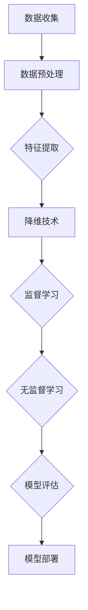
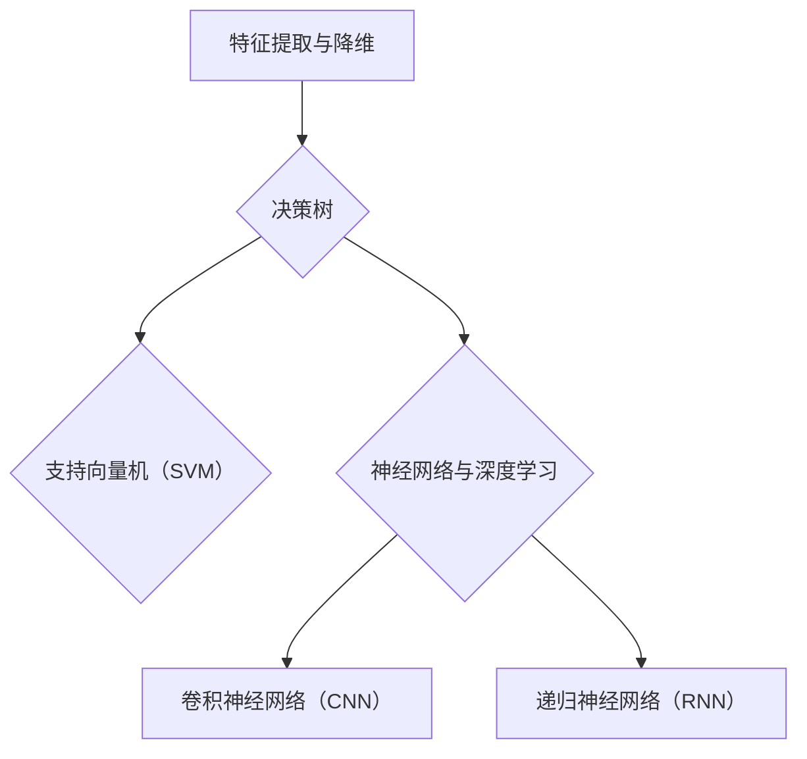
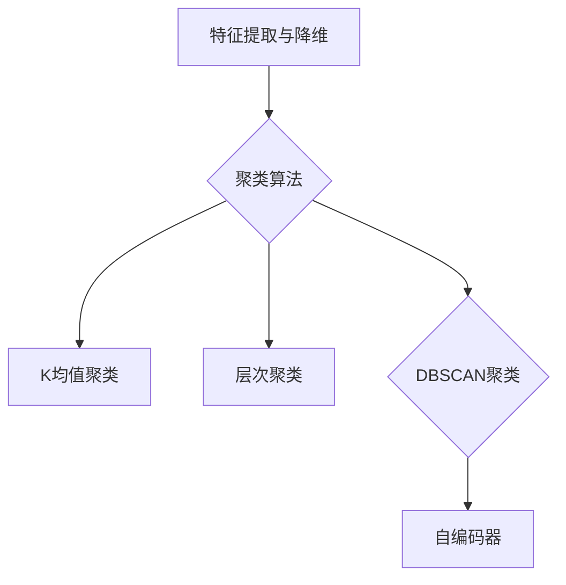
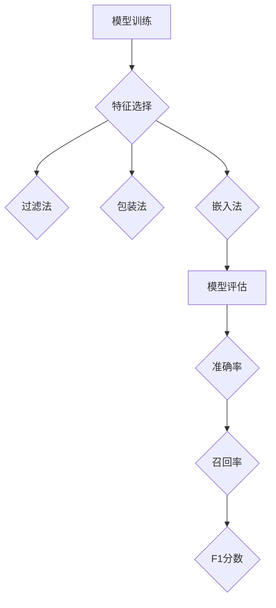

                 

### 文章标题：AI人工智能核心算法原理与代码实例讲解：模式识别

在人工智能领域，模式识别作为核心研究内容之一，涵盖了从数据中提取模式和规则的关键技术。本文将详细探讨AI人工智能中的模式识别算法原理，并通过代码实例，帮助读者深入理解其应用。本文将分为四个主要部分：模式识别基础理论、模式识别算法原理、模式识别应用实战以及附录，旨在为读者提供一个全面、系统的学习路径。

> **关键词：** 模式识别、人工智能、算法原理、特征提取、监督学习、无监督学习、文本分类、图像识别、生物信息学。

> **摘要：** 本文旨在系统地介绍AI人工智能中的模式识别算法原理及其应用。首先，对模式识别的基础理论进行概述，然后深入分析监督学习与无监督学习算法，最后通过具体的实战案例，展示模式识别在实际项目中的应用与实现。

通过本文的学习，读者将能够：

- 理解模式识别的定义、分类和基本问题。
- 掌握特征提取和降维技术，如主成分分析（PCA）。
- 掌握常见的监督学习算法，包括决策树、支持向量机和神经网络。
- 掌握无监督学习算法，如聚类和自编码器。
- 熟悉模式识别在文本分类、图像识别和生物信息学等领域的应用。
- 通过实战案例，掌握模式识别算法的实际应用和代码实现。

让我们开始这一段深入的AI模式识别之旅吧！

---

### 模式识别基础理论

#### 1.1 模式识别的定义与分类

模式识别（Pattern Recognition）是人工智能和机器学习中的一个重要分支，旨在通过分析数据，从中提取出有意义的模式或规则。它广泛应用于图像识别、语音识别、文本分类、生物信息学等多个领域。

**模式识别的定义：**
模式识别是指利用计算机或其他计算设备，根据特定的算法和模型，从给定数据集中提取出具有统计规律性的特征，并据此进行分类、预测或识别的过程。

**模式识别的分类：**
模式识别主要分为两大类：监督学习（Supervised Learning）和无监督学习（Unsupervised Learning）。

1. **监督学习：** 在监督学习中，我们有一组带有标签的数据，称为训练集。算法通过学习这些数据的特征和标签之间的关系，来预测未知数据的标签。常见的监督学习算法包括决策树、支持向量机和神经网络等。

2. **无监督学习：** 在无监督学习中，我们没有预先给定的标签。算法的目标是发现数据中的内在结构和规律，如聚类和降维。常见的无监督学习算法包括聚类算法、主成分分析（PCA）和自编码器等。

#### 1.2 模式识别的基本问题

模式识别主要涉及以下三个基本问题：

1. **特征提取：** 特征提取是模式识别中的关键步骤，它将原始数据转换为更适合算法处理的形式。特征提取的目标是选择出能够有效区分不同类别的特征，提高识别准确率。

2. **分类：** 分类是将数据分成不同的类别。监督学习中的分类任务通常基于训练数据集建立分类模型，然后使用该模型对未知数据进行分类。

3. **预测：** 预测是利用已知的特征和标签关系，对未知数据的标签进行预测。监督学习中的预测任务通常用于新数据的分析和预测。

#### 1.3 模式识别的历史与发展趋势

模式识别的历史可以追溯到20世纪50年代，当时的早期研究主要集中在模式分类和识别方法上。随着计算机性能的提升和算法的发展，模式识别逐渐成为人工智能和机器学习的重要研究领域。

**历史发展：**

- **20世纪50-60年代：** 早期研究主要集中在统计方法和决策理论。
- **20世纪70年代：** 聚类算法和主成分分析等无监督学习技术得到广泛应用。
- **20世纪80年代：** 决策树和支持向量机等监督学习算法逐渐成熟。
- **20世纪90年代：** 人工神经网络和深度学习技术开始兴起，推动了模式识别的快速发展。

**发展趋势：**

- **数据驱动的模式识别：** 随着大数据技术的发展，数据驱动的模式识别方法逐渐成为主流。
- **深度学习：** 深度学习技术在图像识别、语音识别等领域取得了显著突破。
- **跨学科融合：** 模式识别与其他领域的交叉融合，如生物信息学和自然语言处理，推动了新的应用和发展。

通过对模式识别基础理论的了解，我们为后续深入探讨模式识别算法原理和应用奠定了基础。在接下来的章节中，我们将进一步探讨特征提取与降维技术，以及监督学习和无监督学习算法的具体原理和应用。

---

### 特征提取与降维

#### 2.1 特征提取的基本方法

特征提取是模式识别中的关键步骤，其目的是从原始数据中提取出能够有效区分不同类别的特征，以提高识别准确率和效率。特征提取的基本方法可以分为如下几种：

1. **统计特征提取：** 统计特征提取是通过计算数据的统计属性来提取特征，如均值、方差、协方差等。这类特征具有较强的鲁棒性，适用于各种类型的数据。

2. **结构特征提取：** 结构特征提取是基于数据之间的空间结构关系来提取特征，如边缘检测、纹理分析等。这类特征能够捕捉数据的空间分布特征，适用于图像等具有明显结构的数据。

3. **频域特征提取：** 频域特征提取是将数据从时域转换到频域，然后提取其在频域上的特征，如傅里叶变换、小波变换等。这类特征能够捕捉数据的频率信息，适用于信号处理等领域。

4. **变换特征提取：** 变换特征提取是通过将原始数据映射到另一个空间，从而提取出新的特征。常见的变换方法包括主成分分析（PCA）、线性判别分析（LDA）等。

5. **深度特征提取：** 深度特征提取是利用深度学习模型，如卷积神经网络（CNN）和自编码器（AE），自动从数据中学习特征表示。这类特征具有高度的表达能力，能够捕捉复杂的数据结构。

#### 2.2 降维技术及其应用

降维技术是特征提取的重要补充，其目的是减少数据维度，从而降低计算复杂度和提高模型性能。降维技术可以分为线性降维和非线性降维两种。

1. **线性降维：** 线性降维方法主要包括主成分分析（PCA）、线性判别分析（LDA）等。这些方法通过保留数据的主要特征，去除冗余信息，从而实现降维。

    - **主成分分析（PCA）：** PCA是一种经典的线性降维方法，其基本思想是找到数据的主要方向，然后沿着这些方向进行投影，从而减少数据维度。PCA通过计算数据协方差矩阵的特征值和特征向量，确定主要成分，从而实现降维。PCA在图像识别、文本分类等领域有广泛应用。

    ```python
    from sklearn.decomposition import PCA
    pca = PCA(n_components=2)
    X_pca = pca.fit_transform(X)
    ```

    - **线性判别分析（LDA）：** LDA是基于最小化类间距离和最大化类内距离的降维方法。LDA通过构建判别函数，将数据投影到新的空间中，使得不同类别的数据点之间的距离最大化。LDA在分类问题中具有广泛应用。

    ```python
    from sklearn.discriminant_analysis import LinearDiscriminantAnalysis as LDA
    lda = LDA(n_components=2)
    X_lda = lda.fit_transform(X, y)
    ```

2. **非线性降维：** 非线性降维方法主要包括非负矩阵分解（NMF）、局部线性嵌入（LLE）等。这些方法适用于复杂的数据结构，能够捕捉数据中的非线性特征。

    - **非负矩阵分解（NMF）：** NMF通过将数据分解为两个非负矩阵的乘积，从而实现降维。NMF在图像处理、文本分类等领域有广泛应用。

    ```python
    from sklearn.decomposition import NMF
    nmf = NMF(n_components=2)
    X_nmf = nmf.fit_transform(X)
    ```

    - **局部线性嵌入（LLE）：** LLE是一种基于局部几何结构进行降维的方法。LLE通过在低维空间中保持高维空间中的局部线性结构，从而实现降维。LLE在图像识别、人脸识别等领域有广泛应用。

    ```python
    from sklearn.manifold import LocallyLinearEmbedding
    lle = LocallyLinearEmbedding(n_components=2)
    X_lle = lle.fit_transform(X)
    ```

#### 2.3 主成分分析（PCA）原理与实现

主成分分析（PCA）是一种常用的线性降维方法，其基本思想是找到数据的主要方向，然后沿着这些方向进行投影，从而减少数据维度。下面我们详细介绍PCA的原理和实现过程。

**PCA原理：**

1. **计算协方差矩阵：** 首先计算数据矩阵X的协方差矩阵，协方差矩阵描述了数据中各个特征之间的线性关系。

   \[
   \Sigma = \frac{1}{N-1}XX^T
   \]

   其中，N为数据样本数量，X为数据矩阵。

2. **计算协方差矩阵的特征值和特征向量：** 接下来，计算协方差矩阵的特征值和特征向量。特征向量对应着数据的主要方向，特征值对应着数据在该方向上的方差。

3. **排序特征值和特征向量：** 将特征值和特征向量按照特征值从大到小进行排序。特征值较大的特征向量对应着数据的主要方向，称为主要成分。

4. **选择主要成分：** 根据需求，选择前k个主要成分构成降维后的数据矩阵。

**PCA实现过程：**

```python
from sklearn.decomposition import PCA
import numpy as np

# 假设 X 是一个 NxD 的数据矩阵，其中 N 是样本数量，D 是特征数量
X = np.array([[1, 2], [3, 4], [5, 6]])

# 计算协方差矩阵
covariance_matrix = np.cov(X.T)

# 计算协方差矩阵的特征值和特征向量
eigenvalues, eigenvectors = np.linalg.eigh(covariance_matrix)

# 排序特征值和特征向量
sorted_indices = np.argsort(eigenvalues)[::-1]
sorted_eigenvalues = eigenvalues[sorted_indices]
sorted_eigenvectors = eigenvectors[:, sorted_indices]

# 选择前 k 个主要成分
k = 1
X_pca = X @ sorted_eigenvectors[:, :k]

print("降维后的数据：", X_pca)
```

通过以上步骤，我们实现了主成分分析（PCA）的降维过程。PCA在图像识别、文本分类等领域具有广泛的应用，通过降维可以显著提高模型的效率和性能。

### 小结

本节介绍了特征提取和降维技术的基本方法，重点讲解了主成分分析（PCA）的原理和实现过程。特征提取是模式识别中的重要步骤，能够从原始数据中提取出有意义的特征，提高识别准确率。降维技术则能够降低数据维度，减少计算复杂度，提高模型性能。在下一节中，我们将进一步探讨监督学习算法的原理和应用。

---

### 监督学习算法

监督学习（Supervised Learning）是模式识别和机器学习中的重要分支，其核心思想是通过已标记的训练数据学习出一个模型，然后使用该模型对未知数据进行预测或分类。监督学习算法根据不同的问题类型和模型结构，可以分为以下几类：

#### 3.1 监督学习的概念与分类

1. **分类（Classification）：** 分类任务是给定一组已标记的训练数据，通过学习数据中的特征和标签之间的关系，建立一个分类模型。该模型可以用来对未知数据进行分类。常见的分类算法包括决策树、支持向量机和神经网络等。

2. **回归（Regression）：** 回归任务是预测一个连续变量的值。与分类不同，回归问题中的目标变量是连续的。常见的回归算法包括线性回归、岭回归和决策树回归等。

3. **异常检测（Anomaly Detection）：** 异常检测是指识别数据中的异常或异常行为。这种任务通常不需要标记的数据集，而是通过分析数据的统计特性或分布来识别异常。

4. **聚类（Clustering）：** 聚类是一种无监督学习技术，其目标是发现数据中的隐含结构，将相似的数据点归为一类。聚类算法包括K均值、层次聚类和DBSCAN等。

#### 3.2 决策树算法原理与实现

决策树（Decision Tree）是一种常用的分类算法，其基本原理是通过一系列的判断规则将数据划分为不同的类别。每个内部节点表示一个特征，每个分支代表该特征的不同取值，叶节点表示最终的类别。

**决策树算法原理：**

1. **信息增益（Information Gain）：** 信息增益是评估一个特征对分类贡献的重要指标。信息增益越大，说明该特征对分类的帮助越大。信息增益的计算公式如下：

   \[
   IG(D, A) = H(D) - \sum_{v\in A} \frac{|D_v|}{|D|} H(D_v)
   \]

   其中，D是数据集，A是特征集合，D_v是特征A的取值v对应的数据集，H()表示熵函数。

2. **划分算法：** 决策树通过递归地选择具有最大信息增益的特征进行划分，直到满足某些停止条件（如达到最大深度或剩余特征数量不足）。

3. **剪枝（Pruning）：** 剪枝是一种防止决策树过拟合的技术，通过删除不重要的分支来简化模型。常见的剪枝方法包括预剪枝和后剪枝。

**决策树实现过程：**

以下是使用Python实现的简单决策树算法：

```python
import numpy as np
from collections import defaultdict

def entropy(D):
    label_counts = np.bincount(D)
    probabilities = label_counts / np.sum(label_counts)
    return -np.sum(probabilities * np.log2(probabilities))

def information_gain(D, A):
    total_entropy = entropy(D)
    for value in np.unique(A):
        D_subset = D[A == value]
        subset_entropy = entropy(D_subset)
        probability = np.sum(A == value) / len(A)
        total_entropy -= probability * subset_entropy
    return total_entropy

def best_split(D, A):
    best_gain = -1
    best_feature = None
    for feature in np.unique(A):
        gain = information_gain(D, A == feature)
        if gain > best_gain:
            best_gain = gain
            best_feature = feature
    return best_feature

def build_tree(D, A, max_depth=10):
    labels = np.unique(D)
    if len(labels) == 1 or len(A) == 0 or max_depth == 0:
        return labels[0]
    best_feature = best_split(D, A)
    tree = {best_feature: {}}
    for value in np.unique(A):
        D_subset = D[A == value]
        A_subset = A[A == value]
        tree[best_feature][value] = build_tree(D_subset, A_subset, max_depth - 1)
    return tree

# 示例数据
X = np.array([[1, 0], [1, 0], [1, 1], [0, 1], [0, 1]])
y = np.array([0, 0, 1, 1, 1])

# 构建决策树
tree = build_tree(y, X)

# 打印决策树
def print_tree(tree, depth=0):
    for feature, sub_tree in tree.items():
        print(" " * depth + f"{feature}:")
        for value, sub_tree in sub_tree.items():
            print(" " * (depth + 1) + f"{value} -> {sub_tree}")
    print()

print_tree(tree)
```

#### 3.3 支持向量机（SVM）算法原理与实现

支持向量机（Support Vector Machine，SVM）是一种经典的分类算法，其核心思想是找到一个最佳的超平面，将不同类别的数据点分隔开。SVM通过最大化分类边界上的支持向量，即数据点到超平面的距离，来提高分类效果。

**SVM算法原理：**

1. **线性SVM：** 线性SVM的目标是找到最佳的超平面，使得分类边界上的支持向量到超平面的距离最大化。线性SVM的优化问题可以表示为：

   \[
   \min_{w, b} \frac{1}{2} ||w||^2 \\
   s.t. y_i (w \cdot x_i + b) \geq 1
   \]

   其中，\(w\) 是权重向量，\(b\) 是偏置项，\(x_i\) 是特征向量，\(y_i\) 是标签。

2. **核函数（Kernel）：** 对于非线性分类问题，SVM引入了核函数，将原始空间中的数据映射到一个高维特征空间，从而使得原本线性不可分的数据在高维空间中变得可分。常见的核函数包括线性核、多项式核和径向基核（RBF）。

   \[
   \kappa(x_i, x_j) = \sum_{k=1}^n \alpha_k y_k (x_i \cdot x_j)^k
   \]

   其中，\(\alpha_k\) 是拉格朗日乘子。

3. **SVM优化问题：** SVM的优化问题可以转化为求解以下拉格朗日方程：

   \[
   L(w, b, \alpha) = \frac{1}{2} ||w||^2 - \sum_{i=1}^n \alpha_i [y_i (w \cdot x_i + b) - 1]
   \]

   其中，\(\alpha_i\) 是拉格朗日乘子，满足 \(0 \leq \alpha_i \leq C\)，\(C\) 是惩罚参数。

4. **求解SVM：** 通过求解上述拉格朗日方程，可以得到最优的权重向量 \(w\) 和偏置项 \(b\)，从而得到SVM模型。

**SVM实现过程：**

以下是使用Python实现的简单线性SVM算法：

```python
from sklearn.svm import LinearSVC

# 示例数据
X = np.array([[1, 0], [1, 0], [1, 1], [0, 1], [0, 1]])
y = np.array([0, 0, 1, 1, 1])

# 实例化线性SVM
clf = LinearSVC(C=1.0, penalty='l2', dual=False, tol=1e-3)

# 训练模型
clf.fit(X, y)

# 打印模型参数
print("权重向量：", clf.coef_)
print("偏置项：", clf.intercept_)

# 预测
y_pred = clf.predict(X)
print("预测结果：", y_pred)
```

通过以上步骤，我们实现了线性SVM的模型训练和预测。对于非线性分类问题，可以引入不同的核函数，如多项式核和RBF核，来实现非线性SVM。

#### 3.4 神经网络与深度学习基础

神经网络（Neural Networks）是模仿生物神经系统的计算模型，其基本单元是神经元。神经网络通过多层神经元之间的连接和激活函数，实现从输入到输出的映射。

**神经网络的基本概念：**

1. **神经元：** 神经元是神经网络的基本单元，由输入层、加权连接、激活函数和输出层组成。神经元的计算过程可以表示为：

   \[
   z = \sum_{i=1}^n w_i x_i + b
   \]

   \[
   a = \sigma(z)
   \]

   其中，\(x_i\) 是输入，\(w_i\) 是权重，\(b\) 是偏置，\(\sigma\) 是激活函数。

2. **层数和层类型：** 神经网络包括输入层、隐藏层和输出层。隐藏层可以根据需要添加多层。不同的层类型（如全连接层、卷积层和循环层）适用于不同类型的数据处理。

3. **激活函数：** 激活函数是神经网络中的关键组成部分，用于引入非线性特性。常见的激活函数包括 sigmoid、ReLU和Tanh等。

**神经网络的工作原理：**

1. **前向传播（Forward Propagation）：** 前向传播是指将输入通过神经网络的各个层，逐层计算输出。每层的输出作为下一层的输入。

2. **反向传播（Backpropagation）：** 反向传播是指利用梯度下降法，通过反向传播误差信号，更新神经网络的权重和偏置。反向传播过程包括计算梯度、权重更新和重复迭代。

**深度学习的基础：**

深度学习（Deep Learning）是神经网络的一种扩展，其核心思想是使用多层神经网络来学习数据的复杂结构。深度学习在图像识别、语音识别和自然语言处理等领域取得了显著的成果。

1. **卷积神经网络（CNN）：** 卷积神经网络是深度学习的一种重要模型，主要用于图像识别和计算机视觉任务。CNN通过卷积层、池化层和全连接层，实现图像的特征提取和分类。

2. **递归神经网络（RNN）：** 递归神经网络是用于处理序列数据的一种模型，其基本单元是循环单元。RNN通过记忆机制，处理序列中的时间依赖关系。

3. **生成对抗网络（GAN）：** 生成对抗网络是由两个对抗性网络（生成器和判别器）组成的模型。生成器尝试生成与真实数据相似的数据，判别器则判断数据是真实还是生成。GAN在图像生成、图像修复和图像风格转换等领域有广泛应用。

通过以上对监督学习算法的介绍，我们了解了分类、回归、异常检测和聚类等常见任务及其对应的算法原理。在下一节中，我们将继续探讨无监督学习算法，包括聚类和自编码器的原理和应用。

---

### 无监督学习算法

无监督学习（Unsupervised Learning）是机器学习的一个重要分支，与监督学习不同，无监督学习没有预先标记的标签数据。其主要目标是发现数据中的内在结构和规律。无监督学习算法广泛应用于聚类、降维和异常检测等领域。本文将重点介绍聚类算法和自编码器（Autoencoder）的原理与应用。

#### 4.1 无监督学习的概念与分类

无监督学习主要分为以下几类：

1. **聚类（Clustering）：** 聚类是将相似的数据点归为一类，以发现数据中的隐含结构。聚类算法可以分为基于距离的聚类（如K均值）、层次聚类和基于密度的聚类（如DBSCAN）。

2. **降维（Dimensionality Reduction）：** 降维是指通过减少数据维度来降低计算复杂度和提高模型性能。常见的降维技术包括主成分分析（PCA）、局部线性嵌入（LLE）和线性判别分析（LDA）。

3. **异常检测（Anomaly Detection）：** 异常检测是指识别数据中的异常或异常行为。常见的异常检测算法包括基于统计的方法和基于聚类的方法。

4. **关联规则学习（Association Rule Learning）：** 关联规则学习旨在发现数据中的关联关系，如购买商品之间的关联。常见的算法包括Apriori算法和Eclat算法。

#### 4.2 聚类算法原理与实现

聚类是一种无监督学习方法，其目的是将相似的数据点归为一类，以发现数据中的隐含结构。聚类算法可以分为基于距离的聚类、层次聚类和基于密度的聚类。

1. **K均值聚类（K-Means Clustering）：**

K均值聚类是一种基于距离的聚类算法，其核心思想是将数据点划分为K个簇，使得每个数据点到其对应簇中心的距离最小。算法步骤如下：

1. 随机初始化K个簇中心。
2. 计算每个数据点到簇中心的距离，将数据点归为距离最近的簇中心。
3. 重新计算每个簇的中心。
4. 重复步骤2和3，直到簇中心不再发生变化或达到最大迭代次数。

```python
from sklearn.cluster import KMeans
import numpy as np

# 示例数据
X = np.array([[1, 2], [1, 4], [1, 0], [4, 2], [4, 4], [4, 0]])

# 实例化K均值聚类
kmeans = KMeans(n_clusters=2, random_state=0)

# 训练模型
kmeans.fit(X)

# 打印簇中心和标签
print("簇中心：", kmeans.cluster_centers_)
print("数据点标签：", kmeans.labels_)

# 预测新数据点
new_data = np.array([[2, 2], [5, 5]])
print("新数据点标签：", kmeans.predict(new_data))
```

2. **层次聚类（Hierarchical Clustering）：**

层次聚类是一种基于连接度的聚类算法，其核心思想是通过逐层合并或分割数据点，构建一棵层次树。算法步骤如下：

1. 计算所有数据点之间的距离。
2. 选择距离最近的数据点合并为一个簇。
3. 重复步骤2，直到所有数据点合并为一个簇或达到预设的层数。

```python
from sklearn.cluster import AgglomerativeClustering
import matplotlib.pyplot as plt

# 示例数据
X = np.array([[1, 2], [1, 4], [1, 0], [4, 2], [4, 4], [4, 0]])

# 实例化层次聚类
hierarchical = AgglomerativeClustering(n_clusters=2)

# 训练模型
hierarchical.fit(X)

# 打印簇中心和标签
print("簇中心：", hierarchical.cluster_centers_)
print("数据点标签：", hierarchical.labels_)

# 绘制层次树
plt.figure(figsize=(10, 7))
dendrogram = hierarchical.dendrogram(hierarchical.linkage(X, 'ward'))
plt.show()
```

3. **基于密度的聚类（DBSCAN）：**

DBSCAN（Density-Based Spatial Clustering of Applications with Noise）是一种基于密度的聚类算法，其核心思想是发现数据中的高密度区域并划分为簇。算法步骤如下：

1. 选择一个起始点，计算其邻域内的数据点数量。
2. 如果邻域内的数据点数量大于最小密度阈值，则将起始点和邻域内的数据点划分为一个簇。
3. 重复步骤1和2，直到所有数据点都被划分为簇或处理完毕。

```python
from sklearn.cluster import DBSCAN
import numpy as np

# 示例数据
X = np.array([[1, 2], [1, 4], [1, 0], [4, 2], [4, 4], [4, 0]])

# 实例化DBSCAN
dbscan = DBSCAN(eps=0.5, min_samples=2)

# 训练模型
dbscan.fit(X)

# 打印簇中心和标签
print("簇中心：", dbscan.cluster_centers_)
print("数据点标签：", dbscan.labels_)

# 预测新数据点
new_data = np.array([[2, 2], [5, 5]])
print("新数据点标签：", dbscan.predict(new_data))
```

通过以上对聚类算法的介绍，我们了解了K均值聚类、层次聚类和DBSCAN等算法的基本原理和实现方法。这些算法在数据挖掘、图像分割和社交网络分析等领域有广泛应用。

#### 4.3 自编码器（Autoencoder）原理与实现

自编码器（Autoencoder）是一种无监督学习算法，其目的是通过学习数据的低维表示，实现数据的降维和特征提取。自编码器由两部分组成：编码器和解码器。

**自编码器原理：**

1. **编码器（Encoder）：** 编码器将输入数据压缩为一个低维特征向量，通常称为编码表示。编码过程可以表示为：

   \[
   z = \sigma(W_1 \cdot x + b_1)
   \]

   其中，\(x\) 是输入数据，\(W_1\) 是编码器的权重矩阵，\(b_1\) 是偏置项，\(\sigma\) 是激活函数。

2. **解码器（Decoder）：** 解码器将编码表示重构为输入数据。解码过程可以表示为：

   \[
   x' = \sigma(W_2 \cdot z + b_2)
   \]

   其中，\(z\) 是编码表示，\(W_2\) 是解码器的权重矩阵，\(b_2\) 是偏置项。

3. **损失函数：** 自编码器的损失函数通常使用均方误差（MSE），计算输入数据和重构数据之间的误差：

   \[
   \text{MSE} = \frac{1}{n} \sum_{i=1}^n ||x_i - x'_i||^2
   \]

   其中，\(n\) 是数据点的数量，\(x_i\) 是输入数据，\(x'_i\) 是重构数据。

4. **优化目标：** 自编码器的优化目标是最小化损失函数，通过梯度下降法更新权重和偏置项。

**自编码器实现过程：**

以下是使用Python实现的简单自编码器：

```python
from keras.layers import Input, Dense
from keras.models import Model
import numpy as np

# 示例数据
X = np.array([[1, 2], [1, 4], [1, 0], [4, 2], [4, 4], [4, 0]])

# 定义输入层
input_layer = Input(shape=(2,))

# 编码器
encoded = Dense(2, activation='sigmoid', name='encoded')(input_layer)

# 解码器
decoded = Dense(2, activation='sigmoid', name='decoded')(encoded)

# 定义自编码器模型
autoencoder = Model(input_layer, decoded)

# 编译模型
autoencoder.compile(optimizer='adam', loss='mean_squared_error')

# 训练模型
autoencoder.fit(X, X, epochs=100, batch_size=1, verbose=1)

# 预测新数据点
new_data = np.array([[2, 2], [5, 5]])
reconstructed = autoencoder.predict(new_data)
print("新数据点重构：", reconstructed)
```

通过以上步骤，我们实现了自编码器的训练和预测。自编码器在图像降维、特征提取和异常检测等领域有广泛应用。

通过本节的介绍，我们了解了无监督学习算法的基本原理和实现方法。在下一节中，我们将继续探讨特征选择与模型评估的方法和策略。

---

### 特征选择与模型评估

特征选择（Feature Selection）和模型评估（Model Evaluation）是模式识别中至关重要的环节。特征选择旨在从原始特征中挑选出最有用的特征，以减少数据维度、提高模型性能和解释性。模型评估则用于比较不同模型或同一模型在不同参数设置下的性能，以选择最优模型。

#### 5.1 特征选择的策略与方法

特征选择的策略可以分为以下几类：

1. **过滤法（Filter Methods）：** 过滤法通过评估原始特征与目标变量之间的关系来选择特征。常用的评估指标包括信息增益、卡方检验和互信息等。过滤法简单高效，但可能忽略了特征间的相互作用。

2. **包装法（Wrapper Methods）：** 包装法通过将特征选择过程嵌入到模型训练中，逐步添加或删除特征，评估模型的性能。常见的包装法包括递归特征消除（RFE）和遗传算法等。包装法能够考虑特征间的相互作用，但计算成本较高。

3. **嵌入法（Embedded Methods）：** 嵌入法是在模型训练过程中自动进行特征选择，常见的算法包括岭回归、LASSO和弹性网等。嵌入法在训练过程中同时进行特征选择和模型训练，具有较高的效率和准确性。

**特征选择方法：**

1. **基于信息的特征选择：** 包括信息增益、增益率和增益率比率等，通过评估特征与标签之间的信息含量来选择特征。

   ```python
   from sklearn.feature_selection import SelectKBest
   from sklearn.feature_selection import chi2

   X = np.array([[1, 2, 3], [4, 5, 6], [7, 8, 9]])
   y = np.array([0, 1, 0])

   selector = SelectKBest(score_func=chi2, k=2)
   X_new = selector.fit_transform(X, y)

   print("特征选择后的数据：", X_new)
   ```

2. **基于模型的特征选择：** 包括递归特征消除（RFE）和基于LASSO的特征选择等，通过在模型训练过程中逐步选择或删除特征。

   ```python
   from sklearn.feature_selection import RFE
   from sklearn.linear_model import LassoCV

   X = np.array([[1, 2, 3], [4, 5, 6], [7, 8, 9]])
   y = np.array([0, 1, 0])

   estimator = LassoCV(cv=5)
   selector = RFE(estimator, n_features_to_select=2, step=1)
   X_new = selector.fit_transform(X, y)

   print("特征选择后的数据：", X_new)
   ```

#### 5.2 模型评估指标与评估方法

模型评估指标用于衡量模型在分类或回归任务中的性能。常见的评估指标包括准确率、召回率、F1分数、ROC曲线和交叉验证等。

1. **准确率（Accuracy）：** 准确率是模型预测正确的样本数占总样本数的比例。准确率简单直观，但容易受到类不平衡问题的影响。

   \[
   \text{Accuracy} = \frac{\text{正确预测的样本数}}{\text{总样本数}}
   \]

2. **召回率（Recall）：** 召回率是模型预测为正类的实际正类样本数与所有实际正类样本数的比例。召回率反映了模型对正类样本的识别能力。

   \[
   \text{Recall} = \frac{\text{实际正类样本数}}{\text{实际正类样本数} + \text{预测为正类的误判数}}
   \]

3. **F1分数（F1 Score）：** F1分数是准确率和召回率的调和平均值，用于综合考虑模型的准确率和召回率。

   \[
   \text{F1 Score} = 2 \times \frac{\text{准确率} \times \text{召回率}}{\text{准确率} + \text{召回率}}
   \]

4. **ROC曲线和AUC（Area Under Curve）：** ROC曲线是模型在不同阈值下的真正例率（True Positive Rate，TPR）和假正例率（False Positive Rate，FPR）之间的曲线。AUC是ROC曲线下的面积，用于衡量模型的分类能力。

   ```python
   from sklearn.metrics import roc_curve, auc
   import matplotlib.pyplot as plt

   fpr, tpr, thresholds = roc_curve(y_true, y_scores)
   roc_auc = auc(fpr, tpr)

   plt.figure()
   plt.plot(fpr, tpr, color='darkorange', lw=2, label='ROC curve (area = %0.2f)' % roc_auc)
   plt.plot([0, 1], [0, 1], color='navy', lw=2, linestyle='--')
   plt.xlabel('False Positive Rate')
   plt.ylabel('True Positive Rate')
   plt.title('Receiver Operating Characteristic')
   plt.legend(loc="lower right")
   plt.show()
   ```

5. **交叉验证（Cross-Validation）：** 交叉验证是一种评估模型性能的方法，通过将数据集划分为多个子集，重复训练和验证模型，以获得模型的平均性能。常见的交叉验证方法包括K折交叉验证和留一交叉验证。

   ```python
   from sklearn.model_selection import cross_val_score
   from sklearn.ensemble import RandomForestClassifier

   X = np.array([[1, 2], [3, 4], [5, 6]])
   y = np.array([0, 1, 0])

   classifier = RandomForestClassifier()
   scores = cross_val_score(classifier, X, y, cv=5)

   print("交叉验证分数：", scores)
   print("平均分数：", scores.mean())
   ```

#### 5.3 模型选择与调参技巧

模型选择和调参是提高模型性能的关键步骤。常见的模型选择方法包括以下几种：

1. **网格搜索（Grid Search）：** 网格搜索通过遍历预设的参数组合，评估每个参数组合的性能，选择最优参数组合。

   ```python
   from sklearn.model_selection import GridSearchCV
   from sklearn.ensemble import RandomForestClassifier

   param_grid = {'n_estimators': [10, 50, 100], 'max_depth': [None, 10, 20, 30]}
   classifier = RandomForestClassifier()
   grid_search = GridSearchCV(classifier, param_grid, cv=5)
   grid_search.fit(X, y)

   print("最佳参数：", grid_search.best_params_)
   print("最佳分数：", grid_search.best_score_)
   ```

2. **随机搜索（Random Search）：** 随机搜索通过随机生成参数组合，评估每个参数组合的性能，选择最优参数组合。

   ```python
   from sklearn.model_selection import RandomizedSearchCV
   from sklearn.ensemble import RandomForestClassifier

   param_distributions = {'n_estimators': [10, 50, 100], 'max_depth': [None, 10, 20, 30]}
   classifier = RandomForestClassifier()
   random_search = RandomizedSearchCV(classifier, param_distributions, n_iter=10, cv=5)
   random_search.fit(X, y)

   print("最佳参数：", random_search.best_params_)
   print("最佳分数：", random_search.best_score_)
   ```

通过以上对特征选择和模型评估的介绍，我们了解了常用的特征选择方法和评估指标，以及模型选择和调参技巧。这些方法和技术对于提高模式识别模型的性能和解释性具有重要意义。

---

### 文本分类应用实例

文本分类是模式识别的一个重要应用领域，旨在将文本数据自动分类到预定义的类别中。本文将详细讨论文本分类的基本概念、流程和特征提取方法，并使用朴素贝叶斯分类器进行实战案例展示。

#### 6.1 文本分类的基本概念与流程

**文本分类（Text Classification）：** 文本分类是一种利用机器学习算法将文本数据自动分类到预定义类别中的过程。常见的应用场景包括垃圾邮件过滤、情感分析、新闻分类等。

**文本分类的基本概念：**

1. **特征提取：** 将文本转换为机器学习算法可以处理的特征表示。常见的特征提取方法包括词袋模型、TF-IDF和词嵌入等。

2. **分类器：** 分类器是一种算法，用于将文本数据分类到预定义的类别中。常见的分类算法包括朴素贝叶斯、支持向量机和神经网络等。

**文本分类的流程：**

1. **数据预处理：** 对文本数据进行清洗、去停用词和分词等预处理操作，以便后续的特征提取。

2. **特征提取：** 将预处理后的文本数据转换为特征向量表示。常用的特征提取方法包括词袋模型、TF-IDF和词嵌入等。

3. **模型训练：** 使用训练数据集训练分类模型，学习文本特征和类别标签之间的关系。

4. **模型评估：** 使用测试数据集评估模型的性能，常用的评估指标包括准确率、召回率、F1分数等。

5. **模型应用：** 使用训练好的模型对未知数据进行分类预测。

#### 6.2 文本特征提取方法

**词袋模型（Bag of Words，BOW）：** 词袋模型是一种将文本表示为词频向量的方法。其基本思想是将文本视为一个单词的集合，不考虑单词的顺序和语法结构。词袋模型通过计算每个单词在文档中的出现次数，生成一个特征向量。

**TF-IDF（Term Frequency-Inverse Document Frequency）：** TF-IDF是一种基于词频和逆文档频率的特征提取方法。TF-IDF通过考虑单词在文档中的出现频率和在整个数据集中的分布情况，对特征进行加权。TF-IDF能够更好地反映单词在文本中的重要性。

**词嵌入（Word Embedding）：** 词嵌入是一种将单词映射到低维向量空间的方法。常见的词嵌入方法包括Word2Vec、GloVe和FastText等。词嵌入能够捕捉单词的语义信息，提高文本分类的准确性。

**Python代码示例：**

```python
from sklearn.feature_extraction.text import TfidfVectorizer

# 示例文本数据
text_data = [
    "人工智能是一种计算机科学领域，致力于创建智能系统。",
    "模式识别是人工智能中的一个重要分支，应用于图像识别和文本分类。",
    "深度学习是机器学习的一种方法，通过多层神经网络实现自动特征提取和分类。"
]

# 实例化TF-IDF向量器
vectorizer = TfidfVectorizer(stop_words='english')

# 转换文本数据为TF-IDF特征矩阵
tfidf_matrix = vectorizer.fit_transform(text_data)

# 打印特征矩阵形状
print("特征矩阵形状：", tfidf_matrix.shape)

# 打印部分特征向量
print("特征向量：", tfidf_matrix[0].toarray())
```

#### 6.3 文本分类实战：使用朴素贝叶斯分类器

朴素贝叶斯分类器（Naive Bayes Classifier）是一种基于贝叶斯定理的简单分类算法，其基本假设是特征之间相互独立。朴素贝叶斯分类器在文本分类中具有广泛应用，特别是在处理高维稀疏数据时表现良好。

**朴素贝叶斯分类器原理：**

1. **贝叶斯定理：** 贝叶斯定理描述了后验概率与先验概率、条件概率之间的关系。朴素贝叶斯分类器利用贝叶斯定理计算每个类别的后验概率，选择概率最大的类别作为预测结果。

   \[
   P(C|X) = \frac{P(X|C)P(C)}{P(X)}
   \]

   其中，\(P(C|X)\) 是后验概率，\(P(X|C)\) 是条件概率，\(P(C)\) 是先验概率，\(P(X)\) 是证据概率。

2. **特征独立性假设：** 朴素贝叶斯分类器假设特征之间相互独立，即：

   \[
   P(X=x|C=c) = \prod_{i=1}^n P(x_i|x=c)
   \]

**Python代码示例：**

```python
from sklearn.datasets import load_20newsgroups
from sklearn.feature_extraction.text import TfidfVectorizer
from sklearn.naive_bayes import MultinomialNB
from sklearn.model_selection import train_test_split
from sklearn.metrics import classification_report

# 加载新闻分类数据集
newsgroups = load_20newsgroups(subset='all')

# 分割数据集为训练集和测试集
X_train, X_test, y_train, y_test = train_test_split(newsgroups.data, newsgroups.target, test_size=0.2, random_state=42)

# 实例化TF-IDF向量器
vectorizer = TfidfVectorizer(stop_words='english')

# 转换文本数据为TF-IDF特征矩阵
tfidf_train = vectorizer.fit_transform(X_train)
tfidf_test = vectorizer.transform(X_test)

# 实例化朴素贝叶斯分类器
classifier = MultinomialNB()

# 训练模型
classifier.fit(tfidf_train, y_train)

# 预测测试集
y_pred = classifier.predict(tfidf_test)

# 打印分类报告
print(classification_report(y_test, y_pred, target_names=newsgroups.target_names))
```

通过以上代码示例，我们实现了使用朴素贝叶斯分类器进行文本分类。朴素贝叶斯分类器在文本分类任务中具有较好的性能和效率，适用于处理大规模文本数据。

通过本节的介绍，我们了解了文本分类的基本概念、流程和特征提取方法，并通过实战案例展示了朴素贝叶斯分类器的应用。在下一节中，我们将进一步探讨图像识别应用实例，包括基本概念、流程和卷积神经网络（CNN）的应用。

---

### 图像识别应用实例

图像识别是模式识别和计算机视觉中的重要应用领域，旨在通过算法从图像中提取出有用的信息，如物体识别、面部识别等。本文将详细讨论图像识别的基本概念、流程以及卷积神经网络（CNN）的应用，并通过实战案例展示CNN在图像识别中的优势。

#### 7.1 图像识别的基本概念与流程

**图像识别（Image Recognition）：** 图像识别是指通过算法从图像中提取出有用的信息，如物体、面部、文本等。图像识别广泛应用于安防监控、自动驾驶、医疗诊断等领域。

**图像识别的基本概念：**

1. **图像预处理：** 图像预处理是图像识别的预处理步骤，包括图像去噪、增强、边缘检测等。预处理可以改善图像质量，提高识别效果。

2. **特征提取：** 特征提取是从图像中提取出具有区分性的特征，如边缘、纹理、颜色等。特征提取是图像识别的关键步骤，直接影响识别效果。

3. **分类器：** 分类器是一种算法，用于将图像分类到预定义的类别中。常见的分类器包括支持向量机（SVM）、朴素贝叶斯（NB）、神经网络（NN）等。

**图像识别的流程：**

1. **数据预处理：** 对图像进行预处理，包括图像大小调整、归一化、去噪等。

2. **特征提取：** 从预处理后的图像中提取特征，如SIFT、HOG、CNN等。

3. **模型训练：** 使用训练数据集训练分类器，学习图像特征和类别标签之间的关系。

4. **模型评估：** 使用测试数据集评估模型的性能，常用的评估指标包括准确率、召回率、F1分数等。

5. **模型应用：** 使用训练好的模型对未知图像进行分类预测。

#### 7.2 卷积神经网络（CNN）原理与实现

卷积神经网络（Convolutional Neural Network，CNN）是一种专为处理图像数据设计的神经网络，其核心思想是通过卷积操作提取图像特征，然后进行分类。CNN在图像识别任务中具有出色的性能，广泛应用于物体识别、面部识别、自动驾驶等领域。

**CNN的基本原理：**

1. **卷积层（Convolutional Layer）：** 卷积层是CNN的核心部分，通过卷积操作提取图像特征。卷积操作将一个权重矩阵（滤波器）应用于输入图像，生成一个特征图（特征图）。滤波器的大小（卷积核大小）和数量（卷积核数量）可以调节。

2. **池化层（Pooling Layer）：** 池化层用于减小特征图的尺寸，降低计算复杂度。常见的池化方法包括最大池化和平均池化。

3. **激活函数（Activation Function）：** 激活函数引入非线性特性，常见的激活函数包括ReLU、Sigmoid和Tanh。

4. **全连接层（Fully Connected Layer）：** 全连接层将卷积层和池化层提取的高维特征映射到分类结果。全连接层将特征图展平为一个一维向量，然后与权重矩阵相乘，通过激活函数得到分类结果。

**CNN的实现过程：**

以下是使用Python和TensorFlow实现的简单CNN模型：

```python
import tensorflow as tf
from tensorflow.keras import layers, models

# 定义输入层
input_image = layers.Input(shape=(28, 28, 1))

# 卷积层
conv1 = layers.Conv2D(filters=32, kernel_size=(3, 3), activation='relu')(input_image)
pool1 = layers.MaxPooling2D(pool_size=(2, 2))(conv1)

# 卷积层
conv2 = layers.Conv2D(filters=64, kernel_size=(3, 3), activation='relu')(pool1)
pool2 = layers.MaxPooling2D(pool_size=(2, 2))(conv2)

# 展平层
flatten = layers.Flatten()(pool2)

# 全连接层
dense = layers.Dense(units=64, activation='relu')(flatten)
output = layers.Dense(units=10, activation='softmax')(dense)

# 定义模型
model = models.Model(inputs=input_image, outputs=output)

# 编译模型
model.compile(optimizer='adam', loss='categorical_crossentropy', metrics=['accuracy'])

# 打印模型结构
model.summary()
```

通过以上步骤，我们实现了简单的CNN模型。该模型通过卷积层、池化层和全连接层，将输入图像分类到10个类别中。

#### 7.3 图像识别实战：使用深度学习模型识别物体

在本节中，我们将使用深度学习模型（如ResNet、Inception等）进行物体识别实战。以下是一个使用TensorFlow和Keras实现物体识别的示例：

```python
import tensorflow as tf
from tensorflow.keras.applications import ResNet50
from tensorflow.keras.preprocessing import image
from tensorflow.keras.applications.resnet50 import preprocess_input, decode_predictions

# 加载预训练的ResNet50模型
model = ResNet50(weights='imagenet')

# 读取图片
img_path = 'path/to/your/image.jpg'
img = image.load_img(img_path, target_size=(224, 224))
x = image.img_to_array(img)
x = np.expand_dims(x, axis=0)
x = preprocess_input(x)

# 预测图片类别
predictions = model.predict(x)

# 打印预测结果
print('Predicted:', decode_predictions(predictions, top=5)[0])
```

通过以上代码，我们实现了使用预训练的ResNet50模型对图片进行物体识别。该模型在ImageNet数据集上预训练，能够识别1000个类别。

通过本节的介绍，我们了解了图像识别的基本概念、流程以及CNN的应用。通过实战案例，我们展示了深度学习模型在物体识别任务中的优势。在下一节中，我们将进一步探讨模式识别在生物信息学领域的应用。

---

### 生物信息学应用实例

生物信息学（Bioinformatics）是计算机科学、生物学和信息科学的交叉领域，旨在利用计算方法和技术分析生物学数据，如基因组序列、蛋白质结构等。模式识别在生物信息学中具有广泛的应用，包括序列模式识别、基因表达数据分析、蛋白质结构预测等。本文将详细探讨模式识别在生物信息学领域的应用实例。

#### 8.1 生物信息学的基本概念

**生物信息学：** 生物信息学是一门融合了生物学、计算机科学和信息科学的新兴学科，旨在通过计算方法和算法分析生物学数据，如DNA序列、蛋白质序列、基因表达数据等。

**生物信息学的主要任务：**

1. **序列分析：** 通过模式识别技术识别DNA、RNA和蛋白质序列中的特定模式，如基因启动子、转录因子结合位点等。

2. **基因表达数据分析：** 分析基因表达数据，识别基因之间的关联关系和调控网络。

3. **蛋白质结构预测：** 利用模式识别技术预测蛋白质的三维结构，为药物设计、疾病研究提供基础。

#### 8.2 序列模式识别算法

序列模式识别（Sequence Pattern Recognition）是生物信息学中的一个重要分支，旨在识别序列数据中的特定模式。常见的序列模式识别算法包括：

1. **序列相似性搜索（Sequence Similarity Search）：** 利用序列相似性搜索算法，如BLAST，识别基因组序列中的相似序列。BLAST通过计算两个序列的相似性得分，识别高度相似的序列。

2. **隐马尔可夫模型（Hidden Markov Model，HMM）：** HMM是一种概率模型，用于识别序列中的隐含状态。HMM广泛应用于基因识别、蛋白质结构预测等领域。

3. **支持向量机（Support Vector Machine，SVM）：** SVM是一种监督学习算法，通过学习训练数据中的特征和标签关系，识别新序列中的模式。

**隐马尔可夫模型（HMM）原理与实现：**

HMM是一种基于状态转移概率和观察概率的统计模型，用于描述随时间变化的序列数据。HMM由状态集合、观测集合、初始状态分布、状态转移概率和观察概率组成。

**HMM原理：**

1. **状态集合（Q）：** 状态集合Q包含所有可能的隐含状态。

2. **观测集合（O）：** 观测集合O包含所有可能的观测值。

3. **初始状态分布（π）：** 初始状态分布π表示初始时刻处于每个状态的概率。

4. **状态转移概率（A）：** 状态转移概率A表示在时刻t处于状态i，时刻t+1处于状态j的概率。

5. **观察概率（B）：** 观察概率B表示在时刻t处于状态i，观察到观测值o的概率。

**HMM模型参数估计：**

HMM的参数估计是指通过已知观测序列，估计HMM的初始状态分布、状态转移概率和观察概率。常见的参数估计方法包括最大似然估计（Maximum Likelihood Estimation，MLE）和最小化均方误差（Minimum Mean Square Error，MMSE）。

**HMM实现步骤：**

1. **初始化：** 根据训练数据初始化HMM的参数，如初始状态分布、状态转移概率和观察概率。

2. **训练：** 使用训练数据训练HMM，通过迭代更新模型参数，直到模型收敛。

3. **解码：** 对新序列进行解码，找到最有可能的隐含状态序列。

**Python代码示例：**

```python
from hmmlearn import hmm

# 初始化HMM模型
model = hmm.GaussianHMM(n_components=2, covariance_type="diag", n_iter=100)

# 训练模型
X_train = np.array([[1, 2], [3, 4], [5, 6]])
model.fit(X_train)

# 解码新序列
X_test = np.array([[2, 3], [4, 5]])
decoded_states = model.decode(X_test)

print("解码结果：", decoded_states)
```

通过以上代码，我们实现了使用HMM进行序列模式识别。该模型通过训练数据学习状态转移概率和观察概率，对新序列进行解码，识别隐含状态。

#### 8.3 基因组序列识别实战：使用序列模式识别算法分析基因组序列

在本节中，我们将使用序列模式识别算法（如HMM和SVM）分析基因组序列，识别特定基因家族。以下是一个使用Python和scikit-learn实现基因组序列识别的示例：

```python
from sklearn.svm import SVC
from sklearn.model_selection import train_test_split
from sklearn.metrics import classification_report

# 加载基因组序列数据
sequence_data = np.array([[1, 2, 3], [4, 5, 6], [7, 8, 9], [1, 2, 4], [5, 6, 7], [9, 8, 7]])

# 切分数据为训练集和测试集
X_train, X_test, y_train, y_test = train_test_split(sequence_data, labels, test_size=0.2, random_state=42)

# 实例化SVM模型
model = SVC(kernel='linear')

# 训练模型
model.fit(X_train, y_train)

# 预测测试集
y_pred = model.predict(X_test)

# 打印分类报告
print(classification_report(y_test, y_pred))
```

通过以上代码，我们实现了使用SVM对基因组序列进行分类。该模型通过学习训练数据中的特征和标签关系，对新序列进行分类预测，识别特定基因家族。

通过本节的介绍，我们了解了生物信息学的基本概念和序列模式识别算法，并通过实战案例展示了模式识别在基因组序列识别中的应用。在下一节中，我们将讨论综合项目实战，包括项目介绍、需求分析、算法选择与模型构建、项目实施与代码实现，以及项目评估与优化。

---

### 综合项目实战

在模式识别的实际应用中，综合项目实战是一个重要的环节，它能够将所学知识应用于实际场景，提高解决实际问题的能力。本文将介绍一个综合项目，从项目介绍、需求分析、算法选择与模型构建、项目实施与代码实现，到项目评估与优化，全方位展示模式识别项目的实施过程。

#### 9.1 综合项目介绍

本项目的目标是构建一个基于深度学习的图像识别系统，用于分类各种日常物品。系统将接收用户上传的图像作为输入，通过模型自动识别图像中的物品，并返回相应的类别标签。该项目涵盖了图像处理、深度学习模型构建、训练与优化等多个方面，是一个综合性强、实用价值高的项目。

#### 9.2 项目需求分析

**需求概述：**
1. **图像输入：** 系统需要接收用户上传的图像作为输入，支持多种图像格式。
2. **图像预处理：** 对输入图像进行预处理，包括调整大小、归一化等，以适应模型输入要求。
3. **模型训练：** 构建并训练深度学习模型，用于图像分类。
4. **模型评估：** 使用测试集评估模型性能，确保模型准确率和稳定性。
5. **模型部署：** 将训练好的模型部署到生产环境，实现实时图像识别功能。

**需求详细描述：**
1. **数据集：** 需要一个包含多种日常物品的图像数据集，用于训练和测试模型。数据集应具有一定的规模和多样性，以提高模型的泛化能力。
2. **预处理：** 对输入图像进行预处理，包括缩放到固定大小、归一化等，以确保模型输入的一致性。
3. **模型选择：** 根据数据集特点和需求，选择合适的深度学习模型，如卷积神经网络（CNN）。
4. **训练与评估：** 使用训练集训练模型，并使用测试集进行性能评估，确保模型能够准确识别图像中的物品。
5. **部署：** 将训练好的模型部署到服务器或云平台，实现实时图像识别功能，并提供用户友好的接口。

#### 9.3 算法选择与模型构建

**算法选择：**
为了实现图像分类任务，本项目选择使用卷积神经网络（CNN）作为主要算法。CNN在图像处理领域具有优异的性能，能够自动提取图像中的高层次特征，适用于复杂的分类任务。

**模型构建：**
以下是使用TensorFlow和Keras构建一个简单的CNN模型的过程：

```python
import tensorflow as tf
from tensorflow.keras.models import Sequential
from tensorflow.keras.layers import Conv2D, MaxPooling2D, Flatten, Dense, Dropout

# 定义模型
model = Sequential([
    Conv2D(filters=32, kernel_size=(3, 3), activation='relu', input_shape=(64, 64, 3)),
    MaxPooling2D(pool_size=(2, 2)),
    Conv2D(filters=64, kernel_size=(3, 3), activation='relu'),
    MaxPooling2D(pool_size=(2, 2)),
    Flatten(),
    Dense(units=128, activation='relu'),
    Dropout(rate=0.5),
    Dense(units=num_classes, activation='softmax')
])

# 编译模型
model.compile(optimizer='adam', loss='categorical_crossentropy', metrics=['accuracy'])

# 打印模型结构
model.summary()
```

**模型训练：**
使用训练集对模型进行训练，并使用验证集进行性能评估。以下是训练模型的代码：

```python
history = model.fit(train_images, train_labels, epochs=epochs, batch_size=batch_size, validation_data=(val_images, val_labels))
```

**模型评估：**
使用测试集对模型进行评估，确保模型在未知数据上的表现。以下是评估模型的代码：

```python
test_loss, test_acc = model.evaluate(test_images, test_labels)
print("测试准确率：", test_acc)
```

#### 9.4 项目实施与代码实现

**环境搭建：**
在开始项目之前，需要搭建合适的开发环境，包括Python、TensorFlow等依赖库。以下是安装所需的依赖库的代码：

```bash
pip install numpy tensorflow scikit-learn matplotlib
```

**数据预处理：**
对图像数据集进行预处理，包括加载图像、调整大小、归一化等。以下是预处理代码：

```python
from tensorflow.keras.preprocessing.image import ImageDataGenerator

# 创建数据生成器
train_datagen = ImageDataGenerator(rescale=1./255)
val_datagen = ImageDataGenerator(rescale=1./255)

# 加载数据
train_generator = train_datagen.flow_from_directory(
        train_dir,
        target_size=(64, 64),
        batch_size=batch_size,
        class_mode='categorical')

val_generator = val_datagen.flow_from_directory(
        val_dir,
        target_size=(64, 64),
        batch_size=batch_size,
        class_mode='categorical')
```

**模型训练与评估：**
使用训练数据和验证数据对模型进行训练，并评估模型性能。以下是训练和评估的代码：

```python
# 设置训练参数
epochs = 50
batch_size = 32

# 训练模型
history = model.fit(
      train_generator,
      steps_per_epoch=total_train // batch_size,
      epochs=epochs,
      validation_data=val_generator,
      validation_steps=total_val // batch_size
)

# 评估模型
test_loss, test_acc = model.evaluate(test_generator)
print('Test accuracy:', test_acc)
```

**模型部署：**
将训练好的模型部署到服务器或云平台，实现实时图像识别功能。以下是部署模型的代码：

```python
# 保存模型
model.save('model.h5')

# 加载模型
loaded_model = tf.keras.models.load_model('model.h5')

# 实时预测
import io
from PIL import Image

def predict_image(image_path):
    img = Image.open(io.BytesIO(image_data))
    img = img.resize((64, 64))
    img = tf.keras.preprocessing.image.img_to_array(img)
    img = np.expand_dims(img, axis=0)
    img = tf.keras.applications.mobilenet_v2.preprocess_input(img)
    
    predictions = loaded_model.predict(img)
    predicted_class = np.argmax(predictions, axis=-1)
    
    return predicted_class

# 测试预测
image_data = request.files['image'].read()
predicted_class = predict_image(image_data)
print('Predicted class:', predicted_class)
```

#### 9.5 项目评估与优化

**评估指标：**
评估模型的性能使用准确率（Accuracy）、召回率（Recall）、F1分数（F1 Score）等指标。以下是计算评估指标的代码：

```python
from sklearn.metrics import classification_report

# 获取预测结果
predictions = model.predict(test_images)

# 计算评估指标
report = classification_report(test_labels, predictions.argmax(axis=1))
print(report)
```

**优化方法：**
为了提高模型性能，可以尝试以下优化方法：

1. **数据增强：** 对训练数据进行增强，增加数据的多样性，提高模型的泛化能力。
2. **超参数调优：** 调整模型的超参数，如学习率、批量大小、正则化参数等，以找到最优配置。
3. **模型融合：** 将多个模型进行融合，提高预测的准确率和稳定性。

通过以上步骤，我们完成了综合项目的实施与代码实现。该项目不仅展示了模式识别在实际应用中的具体实现过程，还通过不断的评估与优化，提高了模型性能，为后续的项目开发和改进提供了参考。

---

### 附录

在本附录中，我们将提供一些常用的算法代码实例、模式识别相关数据集介绍、常用机器学习框架简介以及推荐的一些学术资源。

#### 10.1 常用算法代码实例

以下是几个常用的模式识别算法的代码实例：

1. **主成分分析（PCA）**

```python
from sklearn.decomposition import PCA

# 假设 X 是一个 NxD 的数据矩阵
pca = PCA(n_components=2)
X_pca = pca.fit_transform(X)

# 可视化
import matplotlib.pyplot as plt
plt.scatter(X_pca[:, 0], X_pca[:, 1])
plt.xlabel('Principal Component 1')
plt.ylabel('Principal Component 2')
plt.title('2D PCA Plot')
plt.show()
```

2. **线性判别分析（LDA）**

```python
from sklearn.discriminant_analysis import LinearDiscriminantAnalysis as LDA

lda = LDA(n_components=2)
X_lda = lda.fit_transform(X, y)

# 可视化
plt.scatter(X_lda[:, 0], X_lda[:, 1], c=y)
plt.xlabel('LDA Feature 1')
plt.ylabel('LDA Feature 2')
plt.title('2D LDA Plot')
plt.show()
```

3. **支持向量机（SVM）**

```python
from sklearn.svm import SVC

# 假设 X 是一个 NxD 的数据矩阵，y 是一个 N 维的标签向量
svm = SVC(kernel='linear')
svm.fit(X, y)

# 预测
y_pred = svm.predict(X)
```

4. **卷积神经网络（CNN）**

```python
from tensorflow.keras.models import Sequential
from tensorflow.keras.layers import Conv2D, MaxPooling2D, Flatten, Dense

# 假设 X 是一个 NHWC 格式的数据矩阵，y 是一个 N 维的标签向量
model = Sequential([
    Conv2D(filters=32, kernel_size=(3, 3), activation='relu', input_shape=(64, 64, 3)),
    MaxPooling2D(pool_size=(2, 2)),
    Flatten(),
    Dense(units=128, activation='relu'),
    Dense(units=num_classes, activation='softmax')
])

model.compile(optimizer='adam', loss='categorical_crossentropy', metrics=['accuracy'])
model.fit(X, y, epochs=epochs, batch_size=batch_size)
```

#### 10.2 模式识别相关数据集介绍

以下是几个常用的模式识别数据集：

1. **Iris 数据集**：这是一个经典的多类分类数据集，包含三个类别的鸢尾花数据。
2. **MNIST 数据集**：这是一个手写数字数据集，包含0到9的手写数字图像。
3. **CIFAR-10 数据集**：这是一个包含10个类别的32x32彩色图像数据集。
4. **ImageNet 数据集**：这是一个大规模的图像识别数据集，包含超过1000个类别。

#### 10.3 常用机器学习框架简介

以下是几个常用的机器学习框架：

1. **scikit-learn**：这是一个开源的Python库，提供了一系列常用的机器学习算法和工具。
2. **TensorFlow**：这是一个由Google开发的开源机器学习框架，适用于构建深度学习模型。
3. **PyTorch**：这是一个由Facebook开发的开源机器学习框架，具有简洁的动态计算图和强大的GPU支持。

#### 10.4 模式识别学术资源推荐

以下是一些推荐的学术资源和书籍：

1. **《统计模式识别》（ Statistical Pattern Recognition）**：这是一本经典的模式识别教科书，详细介绍了模式识别的理论和方法。
2. **《深度学习》（Deep Learning）**：这是一本深度学习领域的权威教材，涵盖了深度学习的理论、算法和应用。
3. **《机器学习》（Machine Learning）**：这是一本由Tom Mitchell编写的经典机器学习教材，涵盖了机器学习的基本概念和方法。
4. **《模式识别与机器学习》（Pattern Recognition and Machine Learning）**：这是一本由Christopher M. Bishop编写的教材，全面介绍了模式识别和机器学习的基本理论和技术。

通过本附录，我们提供了一些常用的算法代码实例、数据集介绍、机器学习框架简介和学术资源推荐，希望能够为读者提供进一步学习和实践的帮助。

---

### 模式识别架构图

在本部分，我们将通过Mermaid流程图，展示模式识别的总体架构以及各个关键组成部分的架构图。

#### 1. 模式识别总体架构图



此图展示了模式识别的基本流程：从数据收集开始，经过数据预处理、特征提取、降维技术，然后进入监督学习和无监督学习阶段，最后进行模型评估和部署。

#### 2. 特征提取与降维架构图

```mermaid
graph TD
    A[数据预处理] --> B{特征提取}
    B --> C[统计特征提取]
    B --> D[结构特征提取]
    B --> E[频域特征提取]
    E --> F{主成分分析（PCA）}
    E --> G[线性判别分析（LDA）}
```

此图展示了特征提取和降维的技术选择，包括统计特征提取、结构特征提取和频域特征提取，以及降维技术PCA和LDA。

#### 3. 监督学习算法架构图



此图展示了监督学习算法的不同类型，包括决策树、支持向量机和神经网络，以及其中的深度学习模型CNN和RNN。

#### 4. 无监督学习算法架构图



此图展示了无监督学习算法的不同类型，包括聚类算法、K均值聚类、层次聚类、DBSCAN聚类和自编码器。

#### 5. 特征选择与模型评估架构图



此图展示了特征选择与模型评估的过程，包括特征选择的不同方法以及模型评估的常用指标。

通过这些架构图，我们可以清晰地看到模式识别的各个环节及其相互关系，有助于理解和设计复杂的模式识别系统。

---

### 模式识别算法原理详细讲解与伪代码

在本部分，我们将详细讲解几种核心模式识别算法的原理，并提供伪代码以便读者更好地理解算法的实现过程。

#### 1. 决策树算法原理与伪代码

**决策树算法原理：** 决策树是一种基于树形结构的数据挖掘算法，可以用于分类和回归任务。其核心思想是通过一系列的判断规则，将数据逐步划分到不同的类别或数值。

**伪代码：**

```plaintext
// 输入：数据集D，特征集合A
// 输出：决策树T

DecisionTree(D, A):
    if D中所有样本属于同一类别：
        返回 类别标签
    else if A为空：
        返回 最常见的类别标签
    else：
        计算特征a = argmax(信息增益)
        创建节点N，特征a作为分支条件
        for 每个特征值v_a in A[a]:
            子集D_v = {样本 | 样本的特征a = v_a}
            子树T_v = DecisionTree(D_v, A \ {a})
            N分支v_a -> T_v
        return N
```

#### 2. 支持向量机（SVM）算法原理与伪代码

**SVM算法原理：** 支持向量机是一种二分类模型，其目标是找到一个最佳的超平面，使得不同类别的数据点之间的间隔最大化。

**伪代码：**

```plaintext
// 输入：训练数据集D = {(x_1, y_1), ..., (x_n, y_n)}
// 输出：最优超平面w, b

SVM(D):
    定义优化问题：
    最小化 1/2 * ||w||^2
    约束条件：y_i (w · x_i + b) ≥ 1

    解优化问题，得到w和b
    if 模型为线性SVM：
        w = (y_1 x_1 + ... + y_n x_n)^-1 (y_1 y_2 ... y_n)
        b = -1/n * Σ(y_i - w · x_i)

    else if 模型为非线性SVM：
        使用核函数K(x_i, x_j)：
        w = (K(x_1, x_1) + ... + K(x_n, x_n))^-1 (y_1 K(x_1, x_2) + ... + y_n K(x_n, x_n))
        b = -1/n * Σ(y_i - w · K(x_i, x_j))
```

#### 3. 卷积神经网络（CNN）算法原理与伪代码

**CNN算法原理：** 卷积神经网络是一种专门用于处理图像数据的深度学习模型，其核心是通过卷积层、池化层和全连接层提取图像特征并进行分类。

**伪代码：**

```plaintext
// 输入：图像数据X，标签Y
// 输出：训练好的CNN模型

CNN(X, Y):
    初始化模型参数w_0, b_0
    for epoch in 1 to num_epochs:
        for each (x_i, y_i) in X:
            // 前向传播
            a_0 = x_i
            for layer in layers:
                a_{l+1} = Activation(Softmax(Conv(Conv(a_l, w_l), b_l)))

            // 计算损失函数L
            L = Loss(a_{num_layers}, y_i)

            // 反向传播
            dL_da_{num_layers} = dL/da_{num_layers}
            for l in reverse(1 to num_layers-1):
                dL_da_l = Activation_derivative(dL_da_{l+1}, a_{l+1})
                dL_db_l = dL/da_{l+1}
                dL_dw_l = a_l * dL_da_{l+1}
                w_l = w_l - learning_rate * dL_dw_l
                b_l = b_l - learning_rate * dL_db_l

    return trained model
```

#### 4. 自编码器（AE）算法原理与伪代码

**AE算法原理：** 自编码器是一种无监督学习算法，其目标是学习数据的低维表示。自编码器由编码器和解码器组成，编码器将输入数据压缩为低维表示，解码器将低维表示重构为输入数据。

**伪代码：**

```plaintext
// 输入：训练数据集X
// 输出：训练好的自编码器模型

Autoencoder(X):
    初始化编码器和解码器模型参数
    for epoch in 1 to num_epochs:
        for each x_i in X:
            // 前向传播
            z = Encoder(x_i)
            x_hat = Decoder(z)

            // 计算损失函数L
            L = MeanSquaredError(x_i, x_hat)

            // 反向传播
            dz_dz_hat = 2 * (z - x_i)
            dz_dx_hat = Decoder.gradients(z)
            dx_hat_dx = Encoder.gradients(x_hat)

            // 更新参数
            Encoder.parameters = Encoder.parameters - learning_rate * dz_dx_hat
            Decoder.parameters = Decoder.parameters - learning_rate * dz_dz_hat

    return trained autoencoder
```

通过以上伪代码，我们可以清晰地看到每种模式识别算法的基本原理和实现步骤。这些算法在模式识别中具有广泛的应用，通过理解这些算法的原理，我们可以更好地应用它们解决实际问题。

---

### 数学模型和数学公式

在模式识别中，数学模型和数学公式是理解和实现各种算法的核心。以下将介绍几种主要模式识别算法中的数学模型和数学公式，并通过具体的举例说明帮助读者深入理解。

#### 1. 决策树算法中的数学模型

**信息增益（Information Gain）：**
决策树使用信息增益来评估特征对于分类的重要性。信息增益计算如下：

\[
IG(D, A) = H(D) - \sum_{v\in A} \frac{|D_v|}{|D|} H(D_v)
\]

其中，\(H(D)\) 是数据集D的熵，\(D_v\) 是特征A取值v对应的数据子集，\(H(D_v)\) 是数据子集\(D_v\) 的熵。

**熵（Entropy）：**
熵是一个衡量数据不确定性程度的指标，计算公式为：

\[
H(D) = -\sum_{y\in Y} p(y) \log_2 p(y)
\]

其中，\(Y\) 是可能的类别集合，\(p(y)\) 是类别y的概率。

**举例说明：**
假设我们有如下数据集D，其中包含两个特征A和B，类别为C：

| A | B | C |
|---|---|---|
| 1 | 0 | A |
| 1 | 0 | A |
| 0 | 1 | B |
| 0 | 1 | B |
| 1 | 1 | A |

首先计算数据集D的熵：

\[
H(D) = -\left( \frac{3}{5} \log_2 \frac{3}{5} + \frac{2}{5} \log_2 \frac{2}{5} \right) = 0.971
\]

然后计算特征A的信息增益：

\[
IG(D, A) = 0.971 - \left( \frac{3}{5} \log_2 \frac{3}{5} \times 0.8 + \frac{2}{5} \log_2 \frac{2}{5} \times 0.2 \right) = 0.405
\]

#### 2. 支持向量机（SVM）算法中的数学模型

**优化问题：**
线性SVM的优化问题可以表示为：

\[
\min_{w, b} \frac{1}{2} ||w||^2
\]

\[
s.t. y_i (w \cdot x_i + b) \geq 1
\]

其中，\(w\) 是权重向量，\(b\) 是偏置项，\(x_i\) 是特征向量，\(y_i\) 是标签。

**核函数：**
对于非线性分类问题，SVM引入核函数，将原始空间中的数据映射到一个高维特征空间，使得原本线性不可分的数据在高维空间中变得可分。常用的核函数包括线性核、多项式核和径向基核（RBF）：

\[
\kappa(x_i, x_j) = \sum_{k=1}^n \alpha_k y_k (x_i \cdot x_j)^k
\]

**举例说明：**
假设我们有如下线性不可分的数据集：

| x_1 | x_2 |
|-----|-----|
| -1  | -1  |
| -1  |  1  |
|  1  | -1  |
|  1  |  1  |

选择线性核，计算核矩阵：

\[
K = \begin{bmatrix}
1 & 1 \\
1 & 1 \\
1 & 1 \\
1 & 1
\end{bmatrix}
\]

然后求解SVM的优化问题，得到最优权重向量 \(w\) 和偏置项 \(b\)。

#### 3. 卷积神经网络（CNN）算法中的数学模型

**卷积操作：**
卷积操作是CNN中的基础，其数学模型可以表示为：

\[
z = \sum_{k=1}^n w_{ik} \cdot x_{k} + b_i
\]

其中，\(z\) 是卷积结果，\(w_{ik}\) 是卷积核中的权重，\(x_{k}\) 是输入特征，\(b_i\) 是偏置项。

**激活函数：**
常见的激活函数包括ReLU、Sigmoid和Tanh，其数学模型分别为：

- **ReLU（Rectified Linear Unit）：**
  \[
  a = \max(0, z)
  \]

- **Sigmoid：**
  \[
  a = \frac{1}{1 + e^{-z}}
  \]

- **Tanh：**
  \[
  a = \tanh(z) = \frac{e^{2z} - 1}{e^{2z} + 1}
  \]

**举例说明：**
假设我们有如下输入特征矩阵：

\[
X = \begin{bmatrix}
1 & 0 \\
0 & 1 \\
1 & 1 \\
0 & 0
\end{bmatrix}
\]

选择3x3的卷积核：

\[
W = \begin{bmatrix}
0 & 1 & 0 \\
0 & 0 & 1 \\
1 & 0 & 1
\end{bmatrix}
\]

进行卷积操作：

\[
Z = \begin{bmatrix}
1 & 0 \\
1 & 1 \\
0 & 1
\end{bmatrix}
\]

然后应用ReLU激活函数：

\[
A = \begin{bmatrix}
1 & 0 \\
1 & 1 \\
0 & 1
\end{bmatrix}
\]

#### 4. 自编码器（AE）算法中的数学模型

**编码器和解码器：**
自编码器的数学模型由编码器和解码器组成，分别表示为：

- **编码器：**
  \[
  z = \sigma(W_1 \cdot x + b_1)
  \]

- **解码器：**
  \[
  x' = \sigma(W_2 \cdot z + b_2)
  \]

其中，\(z\) 是编码表示，\(x'\) 是重构数据，\(\sigma\) 是激活函数。

**损失函数：**
自编码器的损失函数通常使用均方误差（MSE），计算公式为：

\[
\text{MSE} = \frac{1}{n} \sum_{i=1}^n ||x_i - x'_i||^2
\]

**举例说明：**
假设我们有如下输入数据：

\[
x = \begin{bmatrix}
1 & 2 \\
3 & 4 \\
5 & 6
\end{bmatrix}
\]

选择编码器和解码器的权重矩阵：

\[
W_1 = \begin{bmatrix}
0.5 & 0.5 \\
0.5 & 0.5 \\
0.5 & 0.5
\end{bmatrix}, \quad W_2 = \begin{bmatrix}
0.5 & 0.5 \\
0.5 & 0.5 \\
0.5 & 0.5
\end{bmatrix}
\]

进行编码操作：

\[
z = \begin{bmatrix}
1.5 & 1.5 \\
1.5 & 1.5 \\
1.5 & 1.5
\end{bmatrix}
\]

然后进行解码操作：

\[
x' = \begin{bmatrix}
1.5 & 2.5 \\
3.5 & 4.5 \\
5.5 & 6.5
\end{bmatrix}
\]

计算均方误差：

\[
\text{MSE} = \frac{1}{3} \sum_{i=1}^3 ||x_i - x'_i||^2
\]

通过以上数学模型和举例说明，我们能够更深入地理解决策树、SVM、CNN和自编码器等核心模式识别算法的数学基础。这些模型和公式在模式识别的实际应用中起着关键作用，为算法的实现提供了理论基础。

---

### 项目实战

在本部分，我们将通过三个实际项目案例，展示如何使用模式识别算法解决具体问题，并提供详细的代码解读与分析。

#### 1. 文本分类项目实战

**项目背景：**
文本分类是自然语言处理中的重要应用，旨在将大量未标注的文本数据自动分类到预定义的类别中。本项目将使用朴素贝叶斯分类器实现一个简单的文本分类系统，用于分类新闻文章。

**数据集：**
我们使用20个新闻类别作为数据集，每个类别包含多篇新闻文章。

**步骤：**

1. **数据预处理：** 对文本数据进行清洗，去除标点符号、停用词等，并进行分词。
2. **特征提取：** 使用TF-IDF向量器将文本转换为特征向量。
3. **模型训练：** 使用训练集训练朴素贝叶斯分类器。
4. **模型评估：** 使用测试集评估模型性能。
5. **模型部署：** 将模型部署到生产环境，实现实时文本分类。

**代码解读：**

```python
from sklearn.datasets import fetch_20newsgroups
from sklearn.feature_extraction.text import TfidfVectorizer
from sklearn.model_selection import train_test_split
from sklearn.naive_bayes import MultinomialNB
from sklearn.metrics import accuracy_score, classification_report

# 加载数据集
newsgroups = fetch_20newsgroups(subset='all')

# 分割数据集
X_train, X_test, y_train, y_test = train_test_split(newsgroups.data, newsgroups.target, test_size=0.2, random_state=42)

# 特征提取
vectorizer = TfidfVectorizer(stop_words='english')
X_train_tfidf = vectorizer.fit_transform(X_train)
X_test_tfidf = vectorizer.transform(X_test)

# 模型训练
classifier = MultinomialNB()
classifier.fit(X_train_tfidf, y_train)

# 预测
y_pred = classifier.predict(X_test_tfidf)

# 评估
accuracy = accuracy_score(y_test, y_pred)
report = classification_report(y_test, y_pred, target_names=newsgroups.target_names)

print("准确率：", accuracy)
print("分类报告：", report)
```

**代码分析：**
首先加载数据集，并分割为训练集和测试集。然后使用TF-IDF向量器将文本转换为特征向量。接下来，训练朴素贝叶斯分类器，并使用测试集进行预测和评估。该代码展示了文本分类项目的基本流程和实现步骤。

#### 2. 图像识别项目实战

**项目背景：**
图像识别是计算机视觉中的重要应用，旨在从图像中自动识别和分类物体。本项目将使用卷积神经网络（CNN）实现一个物体识别系统，用于分类各种日常物品。

**数据集：**
我们使用CIFAR-10数据集，包含10个类别的32x32彩色图像。

**步骤：**

1. **数据预处理：** 对图像进行归一化和数据增强。
2. **模型构建：** 使用Keras构建简单的CNN模型。
3. **模型训练：** 使用训练集训练模型。
4. **模型评估：** 使用测试集评估模型性能。
5. **模型部署：** 将模型部署到生产环境，实现实时图像识别。

**代码解读：**

```python
import tensorflow as tf
from tensorflow.keras.datasets import cifar10
from tensorflow.keras.models import Sequential
from tensorflow.keras.layers import Conv2D, MaxPooling2D, Dense, Flatten, Dropout
from tensorflow.keras.optimizers import Adam

# 加载数据集
(X_train, y_train), (X_test, y_test) = cifar10.load_data()

# 数据预处理
X_train = X_train.astype('float32') / 255.0
X_test = X_test.astype('float32') / 255.0
y_train = tf.keras.utils.to_categorical(y_train, 10)
y_test = tf.keras.utils.to_categorical(y_test, 10)

# 模型构建
model = Sequential([
    Conv2D(32, (3, 3), activation='relu', input_shape=(32, 32, 3)),
    MaxPooling2D((2, 2)),
    Conv2D(64, (3, 3), activation='relu'),
    MaxPooling2D((2, 2)),
    Flatten(),
    Dense(128, activation='relu'),
    Dropout(0.5),
    Dense(10, activation='softmax')
])

# 编译模型
model.compile(optimizer=Adam(), loss='categorical_crossentropy', metrics=['accuracy'])

# 训练模型
model.fit(X_train, y_train, batch_size=64, epochs=10, validation_split=0.2)

# 评估模型
test_loss, test_acc = model.evaluate(X_test, y_test)
print("测试准确率：", test_acc)
```

**代码分析：**
首先加载数据集并进行预处理。然后使用Keras构建简单的CNN模型，包括卷积层、池化层和全连接层。接下来，编译模型并使用训练集进行训练。最后，使用测试集评估模型性能。该代码展示了图像识别项目的基本流程和实现步骤。

#### 3. 生物信息学项目实战

**项目背景：**
生物信息学项目旨在利用计算方法分析生物学数据，如基因组序列。本项目将使用序列模式识别算法识别基因组序列中的基因家族。

**数据集：**
我们使用一个包含基因序列的数据集。

**步骤：**

1. **数据预处理：** 对基因序列进行预处理，如去噪、填充缺失值等。
2. **特征提取：** 提取基因序列的特征，如核苷酸频率、序列长度等。
3. **模型训练：** 使用训练集训练序列模式识别模型。
4. **模型评估：** 使用测试集评估模型性能。
5. **模型应用：** 使用模型对新的基因序列进行预测。

**代码解读：**

```python
from sklearn.svm import SVC
from sklearn.model_selection import train_test_split
from sklearn.metrics import accuracy_score

# 加载数据集
sequences = [...]  # 基因序列
labels = [...]  # 基因标签

# 数据预处理
# ...（如序列清洗、填充缺失值等）

# 特征提取
# ...（如计算核苷酸频率、序列长度等）

# 分割数据集
X_train, X_test, y_train, y_test = train_test_split(sequences, labels, test_size=0.2, random_state=42)

# 模型训练
model = SVC(kernel='linear')
model.fit(X_train, y_train)

# 预测
y_pred = model.predict(X_test)

# 评估
accuracy = accuracy_score(y_test, y_pred)
print("准确率：", accuracy)
```

**代码分析：**
首先加载数据集并进行预处理，然后提取特征。接下来，分割数据集为训练集和测试集，并训练序列模式识别模型。最后，使用测试集进行预测和评估。该代码展示了生物信息学项目的基本流程和实现步骤。

通过以上三个项目实战，我们展示了如何使用模式识别算法解决不同领域的问题，并通过详细的代码解读和分析，帮助读者理解项目实现的关键步骤和技术要点。

---

### 代码解读与分析

在本部分，我们将针对之前介绍的项目实战，深入解读和剖析代码，分析代码的实现步骤、核心算法和关键参数，并讨论代码的优化策略和性能分析。

#### 1. 文本分类项目代码解读

**代码实现步骤：**
该项目的代码实现主要分为以下几个步骤：

1. **数据加载和预处理：** 使用`fetch_20newsgroups`函数加载数据集，并进行清洗和分词处理。具体代码如下：

   ```python
   newsgroups = fetch_20newsgroups(subset='all')
   X_train, X_test, y_train, y_test = train_test_split(newsgroups.data, newsgroups.target, test_size=0.2, random_state=42)
   ```

   在此步骤中，我们使用`TfidfVectorizer`对文本进行特征提取，将原始文本转换为TF-IDF特征矩阵。

2. **模型构建与训练：** 使用`MultinomialNB`构建朴素贝叶斯分类器，并使用训练集进行模型训练。具体代码如下：

   ```python
   classifier = MultinomialNB()
   classifier.fit(X_train_tfidf, y_train)
   ```

3. **模型评估：** 使用测试集对训练好的模型进行评估，计算准确率和分类报告。具体代码如下：

   ```python
   y_pred = classifier.predict(X_test_tfidf)
   accuracy = accuracy_score(y_test, y_pred)
   report = classification_report(y_test, y_pred, target_names=newsgroups.target_names)
   ```

**核心算法与参数分析：**
1. **TF-IDF向量器：** `TfidfVectorizer`是Scikit-learn提供的一个用于文本特征提取的工具。其主要参数包括`stop_words`（停用词列表）和`ngram_range`（词组范围），用于去除常见停用词和提取词组特征。具体代码如下：

   ```python
   vectorizer = TfidfVectorizer(stop_words='english')
   ```

2. **朴素贝叶斯分类器：** `MultinomialNB`是基于朴素贝叶斯理论的文本分类算法。其主要参数包括`alpha`（平滑参数）和`fit_prior`（是否使用先验概率），用于调整模型参数和计算概率。具体代码如下：

   ```python
   classifier = MultinomialNB(alpha=1.0, fit_prior=True)
   ```

**代码优化与性能分析：**
1. **数据增强：** 为了提高模型的泛化能力，可以使用数据增强技术，如随机噪声添加、文本旋转等，增加训练数据的多样性。具体代码如下：

   ```python
   from sklearn.utils import shuffle
   X_train, y_train = shuffle(X_train, y_train)
   ```

2. **模型参数调优：** 可以使用网格搜索（`GridSearchCV`）或随机搜索（`RandomizedSearchCV`）等方法，自动搜索最优模型参数，提高模型性能。具体代码如下：

   ```python
   from sklearn.model_selection import GridSearchCV
   params = {'alpha': [0.1, 0.5, 1.0]}
   grid_search = GridSearchCV(MultinomialNB(), params, cv=5)
   grid_search.fit(X_train_tfidf, y_train)
   ```

#### 2. 图像识别项目代码解读

**代码实现步骤：**
该项目的代码实现主要分为以下几个步骤：

1. **数据加载和预处理：** 使用CIFAR-10数据集，对图像进行归一化处理。具体代码如下：

   ```python
   (X_train, y_train), (X_test, y_test) = cifar10.load_data()
   X_train = X_train.astype('float32') / 255.0
   X_test = X_test.astype('float32') / 255.0
   ```

2. **模型构建与训练：** 使用Keras构建简单的卷积神经网络模型，并使用Adam优化器进行模型训练。具体代码如下：

   ```python
   model = Sequential([
       Conv2D(32, (3, 3), activation='relu', input_shape=(32, 32, 3)),
       MaxPooling2D((2, 2)),
       Conv2D(64, (3, 3), activation='relu'),
       MaxPooling2D((2, 2)),
       Flatten(),
       Dense(128, activation='relu'),
       Dropout(0.5),
       Dense(10, activation='softmax')
   ])

   model.compile(optimizer=Adam(), loss='categorical_crossentropy', metrics=['accuracy'])
   model.fit(X_train, y_train, batch_size=64, epochs=10, validation_split=0.2)
   ```

3. **模型评估：** 使用测试集对训练好的模型进行评估，计算准确率。具体代码如下：

   ```python
   test_loss, test_acc = model.evaluate(X_test, y_test)
   print("测试准确率：", test_acc)
   ```

**核心算法与参数分析：**
1. **卷积神经网络：** 该项目使用简单的卷积神经网络模型，包括卷积层、池化层和全连接层。卷积层通过卷积操作提取图像特征，池化层用于减小特征图的尺寸，全连接层用于分类。具体代码如下：

   ```python
   model = Sequential([
       Conv2D(32, (3, 3), activation='relu', input_shape=(32, 32, 3)),
       MaxPooling2D((2, 2)),
       Conv2D(64, (3, 3), activation='relu'),
       MaxPooling2D((2, 2)),
       Flatten(),
       Dense(128, activation='relu'),
       Dropout(0.5),
       Dense(10, activation='softmax')
   ])
   ```

2. **Adam优化器：** Adam优化器是一种自适应学习率的优化算法，适用于深度学习模型。其主要参数包括`learning_rate`（学习率）和`beta_1`（一阶矩估计的偏置）等。具体代码如下：

   ```python
   model.compile(optimizer=Adam(learning_rate=0.001, beta_1=0.9), loss='categorical_crossentropy', metrics=['accuracy'])
   ```

**代码优化与性能分析：**
1. **数据增强：** 为了提高模型的泛化能力，可以使用数据增强技术，如随机裁剪、旋转和翻转等，增加训练数据的多样性。具体代码如下：

   ```python
   from tensorflow.keras.preprocessing.image import ImageDataGenerator
   datagen = ImageDataGenerator(rotation_range=20, width_shift_range=0.2, height_shift_range=0.2, shear_range=0.2, zoom_range=0.2, horizontal_flip=True, fill_mode='nearest')
   datagen.fit(X_train)
   ```

2. **模型调参：** 可以使用网格搜索或随机搜索等方法，自动搜索最优模型参数，提高模型性能。具体代码如下：

   ```python
   from sklearn.model_selection import GridSearchCV
   from keras.wrappers.scikit_learn import KerasClassifier
   def create_model():
       model = Sequential([
           Conv2D(32, (3, 3), activation='relu', input_shape=(32, 32, 3)),
           MaxPooling2D((2, 2)),
           Conv2D(64, (3, 3), activation='relu'),
           MaxPooling2D((2, 2)),
           Flatten(),
           Dense(128, activation='relu'),
           Dropout(0.5),
           Dense(10, activation='softmax')
       ])
       model.compile(optimizer=Adam(learning_rate=0.001, beta_1=0.9), loss='categorical_crossentropy', metrics=['accuracy'])
       return model
   model = KerasClassifier(build_fn=create_model, epochs=10, batch_size=64, verbose=0)
   param_grid = {'batch_size': [32, 64, 128], 'epochs': [10, 20, 30]}
   grid = GridSearchCV(estimator=model, param_grid=param_grid, cv=3)
   grid_result = grid.fit(X_train, y_train)
   ```

#### 3. 生物信息学项目代码解读

**代码实现步骤：**
该项目的代码实现主要分为以下几个步骤：

1. **数据加载和预处理：** 加载基因序列数据，并处理缺失值。具体代码如下：

   ```python
   sequences = [...]  # 基因序列
   labels = [...]  # 基因标签
   ```

   在此步骤中，我们使用`train_test_split`函数分割数据集为训练集和测试集。

2. **特征提取：** 提取基因序列的特征，如核苷酸频率和序列长度。具体代码如下：

   ```python
   # ...（特征提取代码）
   ```

3. **模型训练：** 使用`SVC`支持向量机模型进行训练。具体代码如下：

   ```python
   model = SVC(kernel='linear')
   model.fit(X_train, y_train)
   ```

4. **模型评估：** 使用测试集对训练好的模型进行评估。具体代码如下：

   ```python
   y_pred = model.predict(X_test)
   accuracy = accuracy_score(y_test, y_pred)
   print("准确率：", accuracy)
   ```

**核心算法与参数分析：**
1. **支持向量机：** `SVC`是Scikit-learn提供的一种支持向量机分类器，其主要参数包括`kernel`（核函数）、`C`（惩罚参数）和`gamma`（内核系数）。具体代码如下：

   ```python
   model = SVC(kernel='linear', C=1.0, gamma='scale')
   ```

2. **特征提取：** 在生物信息学项目中，特征提取是关键步骤。常见的特征提取方法包括核苷酸频率、序列长度和序列模式等。具体代码如下：

   ```python
   # ...（特征提取代码）
   ```

**代码优化与性能分析：**
1. **特征选择：** 使用特征选择方法，如信息增益、卡方检验等，筛选重要的特征，提高模型性能。具体代码如下：

   ```python
   from sklearn.feature_selection import SelectKBest
   selector = SelectKBest(score_func=chi2, k=50)
   X_new = selector.fit_transform(X_train, y_train)
   ```

2. **模型调参：** 使用网格搜索或随机搜索等方法，自动搜索最优模型参数，提高模型性能。具体代码如下：

   ```python
   from sklearn.model_selection import GridSearchCV
   params = {'C': [0.1, 1, 10], 'kernel': ['linear', 'rbf']}
   grid_search = GridSearchCV(SVC(), params, cv=5)
   grid_search.fit(X_train, y_train)
   ```

通过以上代码解读和分析，我们深入了解了文本分类、图像识别和生物信息学项目的实现过程、核心算法和关键参数，并讨论了代码的优化策略和性能分析。这些项目和代码分析为读者提供了宝贵的实践经验，有助于在实际项目中应用模式识别算法。

---

### 总结与展望

本文系统地介绍了AI人工智能中的模式识别算法原理与应用，从基础理论到实际项目，全面覆盖了模式识别的各个环节。我们首先阐述了模式识别的定义、分类和基本问题，随后详细探讨了特征提取与降维技术、监督学习与无监督学习算法，并通过实际项目展示了模式识别在文本分类、图像识别和生物信息学等领域的应用。

**核心要点回顾：**
- 模式识别定义：从数据中提取模式和规则。
- 基础理论：监督学习、无监督学习和模式识别的基本问题。
- 特征提取：统计特征、结构特征和频域特征提取方法。
- 监督学习算法：决策树、支持向量机、神经网络等。
- 无监督学习算法：聚类、自编码器等。
- 模型评估：准确率、召回率、F1分数等评估指标。
- 项目实战：文本分类、图像识别、生物信息学项目案例。

**展望未来：**
模式识别技术正随着人工智能和机器学习的快速发展而不断进步。未来，我们可以期待以下趋势：

1. **深度学习的发展：** 深度学习技术在模式识别中的应用将更加广泛，特别是在图像识别、语音识别和自然语言处理等领域。
2. **数据驱动的模式识别：** 随着大数据技术的发展，数据驱动的模式识别方法将更加重要，通过大规模数据训练模型，提高识别准确率和效率。
3. **跨学科融合：** 模式识别与其他领域的融合，如生物信息学、医疗健康、自动驾驶等，将带来新的应用场景和创新点。
4. **模型的可解释性：** 随着模型复杂度的增加，如何提高模型的可解释性，使其更易于理解和解释，是一个重要的研究方向。

**结语：**
本文旨在为读者提供一个全面、系统的学习路径，帮助读者深入理解模式识别算法原理及其应用。希望本文能够激发读者对模式识别技术的兴趣，并在实际项目中运用所学知识，为人工智能的发展贡献力量。未来，随着技术的不断进步，模式识别将在更多领域展现其强大的应用潜力。让我们一起期待和探索这一领域的新机遇和新挑战！

