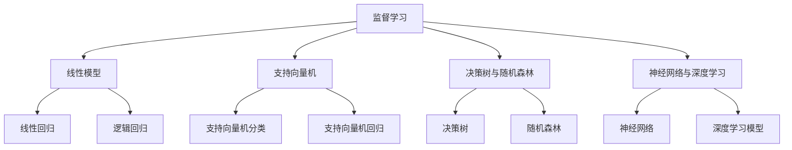

                 

# AI人工智能核心算法原理与代码实例讲解：监督学习

> 关键词：监督学习，人工智能，算法，深度学习，代码实例

> 摘要：本文深入讲解了监督学习这一人工智能核心算法的基本原理和实现细节。通过详细剖析线性模型、支持向量机、决策树和神经网络等经典算法，以及手写数字识别和垃圾邮件检测等实际应用案例，帮助读者理解监督学习的核心概念和应用方法。

## 目录大纲

### 第一部分: 监督学习基础

#### 第1章: 监督学习概述
1.1 监督学习的定义与类型
1.2 监督学习的基本概念
1.3 监督学习的发展与应用

#### 第2章: 数据预处理与特征工程
2.1 数据预处理
2.1.1 数据清洗
2.1.2 数据归一化与标准化
2.2 特征工程
2.2.1 特征提取
2.2.2 特征选择

#### 第3章: 线性模型
3.1 线性回归
3.1.1 线性回归模型
3.1.2 梯度下降算法
3.2 逻辑回归
3.2.1 逻辑回归模型
3.2.2 逻辑回归的梯度下降算法

#### 第4章: 支持向量机
4.1 支持向量机基础
4.1.1 支持向量机的基本概念
4.1.2 支持向量机的数学模型
4.2 支持向量机分类
4.2.1 线性可分支持向量机
4.2.2 非线性支持向量机
4.3 支持向量机回归
4.3.1 支持向量回归模型
4.3.2 支持向量回归的优化方法

#### 第5章: 决策树与随机森林
5.1 决策树基础
5.1.1 决策树的基本概念
5.1.2 决策树的构建过程
5.2 随机森林
5.2.1 随机森林的基本概念
5.2.2 随机森林的实现原理

#### 第6章: 神经网络与深度学习
6.1 神经网络基础
6.1.1 神经网络的基本结构
6.1.2 前向传播与反向传播
6.2 深度学习模型
6.2.1 卷积神经网络（CNN）
6.2.2 循环神经网络（RNN）
6.3 深度学习优化
6.3.1 梯度下降算法优化
6.3.2 学习率调整策略

#### 第7章: 监督学习应用实例
7.1 手写数字识别（handwritten digit recognition）
7.1.1 数据集介绍
7.1.2 手写数字识别模型设计
7.2 垃圾邮件检测（spam detection）
7.2.1 数据集介绍
7.2.2 垃圾邮件检测模型设计

#### 第8章: 监督学习的评估与优化
8.1 监督学习模型评估
8.1.1 评估指标
8.1.2 交叉验证方法
8.2 监督学习模型优化
8.2.1 超参数调优
8.2.2 模型集成方法

#### 附录
A.1 工具与资源
A.1.1 Python机器学习库
A.1.2 TensorFlow
A.1.3 PyTorch
A.2 监督学习相关论文推荐

### 核心概念与联系（Mermaid 流程图）

## 第一部分: 监督学习基础

### 第1章: 监督学习概述

监督学习是一种机器学习方法，通过利用标记的数据集，训练模型以预测未知数据的标签。在本章中，我们将介绍监督学习的定义、类型、基本概念以及其在实际中的应用。

#### 1.1 监督学习的定义与类型

监督学习可以分为以下几种类型：

1. **分类（Classification）**：将输入数据分配给不同的类别。例如，垃圾邮件检测、图像识别等。
2. **回归（Regression）**：预测一个连续的数值输出。例如，房价预测、股票价格预测等。
3. **异常检测（Anomaly Detection）**：识别数据中的异常或离群点。例如，信用卡欺诈检测、网络入侵检测等。

#### 1.2 监督学习的基本概念

监督学习涉及以下几个基本概念：

1. **特征（Features）**：用于描述数据属性的变量。
2. **标签（Labels）**：用于标记数据类别的变量。
3. **模型（Model）**：通过学习数据特征和标签之间的关系，用于预测未知数据的标签。
4. **损失函数（Loss Function）**：用于衡量模型预测值与真实值之间的差异。

#### 1.3 监督学习的发展与应用

监督学习在多个领域都有广泛应用，如自然语言处理、计算机视觉、金融、医疗等。随着深度学习的兴起，监督学习取得了显著的进展，尤其在图像识别、语音识别、文本分类等领域。

### 第2章: 数据预处理与特征工程

#### 2.1 数据预处理

数据预处理是监督学习过程中至关重要的一步，它包括以下内容：

1. **数据清洗**：处理缺失值、噪声数据和异常值，确保数据的质量。
2. **数据归一化与标准化**：将不同特征的数据缩放到相同的范围，以便模型能够更有效地处理数据。

#### 2.2 特征工程

特征工程是提高模型性能的关键步骤，包括以下内容：

1. **特征提取**：从原始数据中提取有用的特征，以便模型能够更好地学习。
2. **特征选择**：从提取的特征中选出对模型性能有显著影响的关键特征。

### 第3章: 线性模型

线性模型是一种简单的机器学习模型，它通过线性函数来预测输出。本章将详细介绍线性模型，包括线性回归和逻辑回归。

#### 3.1 线性回归

线性回归是一种用于预测连续值的模型，其基本形式为：

\[ y = \beta_0 + \beta_1x \]

其中，\( y \) 是因变量，\( x \) 是自变量，\( \beta_0 \) 是截距，\( \beta_1 \) 是斜率。

线性回归的优化通常采用梯度下降算法，其步骤如下：

1. 初始化参数 \( \beta_0 \) 和 \( \beta_1 \)。
2. 计算每个参数的梯度。
3. 更新参数值：\( \beta_0 = \beta_0 - \alpha \frac{\partial J}{\partial \beta_0} \)，\( \beta_1 = \beta_1 - \alpha \frac{\partial J}{\partial \beta_1} \)。
4. 重复步骤 2 和 3，直到满足停止条件（如梯度小于某个阈值）。

其中，\( J \) 是损失函数，通常使用均方误差（MSE）作为损失函数。

#### 3.2 逻辑回归

逻辑回归是一种用于分类的线性模型，其基本形式为：

\[ P(y=1) = \frac{1}{1 + e^{-(\beta_0 + \beta_1x)}} \]

其中，\( P(y=1) \) 是事件发生的概率，\( y \) 是因变量，\( x \) 是自变量，\( \beta_0 \) 是截距，\( \beta_1 \) 是斜率。

逻辑回归的损失函数通常使用对数似然损失（Log-Likelihood Loss），其优化过程与线性回归类似。

### 第4章: 支持向量机

支持向量机是一种强大的分类和回归模型，通过寻找最优的超平面来实现数据的分类。本章将介绍支持向量机的基本概念、数学模型以及优化方法。

#### 4.1 支持向量机基础

支持向量机的基本概念包括：

- **支持向量（Support Vectors）**：支持向量是距离超平面最近的那些数据点。
- **超平面（Hyperplane）**：超平面是一个将数据集划分为两个不同类别的直线或平面。
- **间隔（Margin）**：间隔是超平面到支持向量之间的距离。

支持向量机的数学模型可以分为线性可分支持向量机和非线性支持向量机。线性可分支持向量机的目标是找到最佳的超平面，使得不同类别的数据点在超平面的两侧尽可能分散。非线性支持向量机通过核函数将输入空间映射到高维空间，使得原本线性不可分的数据在高维空间中变得线性可分。

#### 4.2 支持向量机分类

线性可分支持向量机分类的目标是找到最佳的超平面，使得不同类别的数据点在超平面的两侧尽可能分散。非线性支持向量机分类通过核函数将输入空间映射到高维空间，使得原本线性不可分的数据在高维空间中变得线性可分。

#### 4.3 支持向量机回归

支持向量回归（SVR）是一种基于支持向量机的回归方法。SVR的目标是最小化预测值与真实值之间的误差，同时保持模型的一般性。

### 第5章: 决策树与随机森林

决策树和随机森林是常见的分类和回归模型，通过树形结构来实现预测。本章将介绍决策树和随机森林的基本概念、构建过程以及实现原理。

#### 5.1 决策树基础

决策树是一种基于特征进行分类或回归的树形结构。每个节点表示一个特征，每个分支表示该特征的一个取值，每个叶子节点表示一个类别或预测值。

#### 5.2 随机森林

随机森林是一种基于决策树的集成学习方法。随机森林通过组合多个决策树来提高模型的泛化能力和鲁棒性。

### 第6章: 神经网络与深度学习

神经网络和深度学习是近年来发展迅速的机器学习方法，通过模拟人脑的神经网络结构来实现复杂任务的预测。本章将介绍神经网络的基本结构、前向传播与反向传播以及深度学习模型。

#### 6.1 神经网络基础

神经网络的基本结构包括输入层、隐藏层和输出层。每个层由多个神经元组成，神经元之间通过连接权值进行信息传递。

#### 6.2 深度学习模型

深度学习模型包括卷积神经网络（CNN）、循环神经网络（RNN）等。CNN适用于图像处理任务，RNN适用于序列数据处理任务。

### 第7章: 监督学习应用实例

本章将介绍两个监督学习应用实例：手写数字识别和垃圾邮件检测。

#### 7.1 手写数字识别

手写数字识别是一种常见的图像分类任务，通过训练模型来识别手写数字图像。

#### 7.2 垃圾邮件检测

垃圾邮件检测是一种文本分类任务，通过训练模型来识别垃圾邮件和非垃圾邮件。

### 第8章: 监督学习的评估与优化

本章将介绍监督学习模型的评估方法、优化策略以及模型集成方法。

#### 8.1 监督学习模型评估

监督学习模型评估包括准确率、精确率、召回率和F1分数等指标。

#### 8.2 监督学习模型优化

监督学习模型优化包括超参数调优和模型集成等方法。

## 附录

### 附录A: 工具与资源

附录A将介绍Python机器学习库和监督学习相关论文推荐，以帮助读者深入了解监督学习。

### 附录B: Mermaid 流程图

以下是本文中使用的Mermaid流程图：

## 结束语

本文系统地介绍了监督学习这一人工智能核心算法的基本原理和应用方法。通过详细剖析线性模型、支持向量机、决策树和神经网络等经典算法，以及手写数字识别和垃圾邮件检测等实际应用案例，读者可以深入了解监督学习的核心概念和应用技巧。

在未来的学习和实践中，读者可以进一步探索监督学习的优化方法、模型集成技术以及深度学习模型，以应对更加复杂和多样化的任务。

最后，感谢读者对本文的关注和支持。希望本文能为您在人工智能领域的探索之路提供有益的指导和帮助。

### 作者信息

作者：AI天才研究院/AI Genius Institute & 禅与计算机程序设计艺术 /Zen And The Art of Computer Programming

