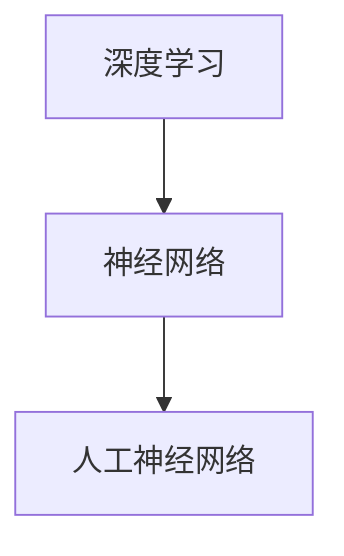
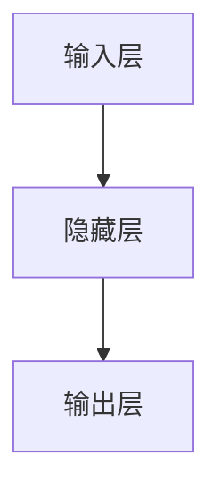
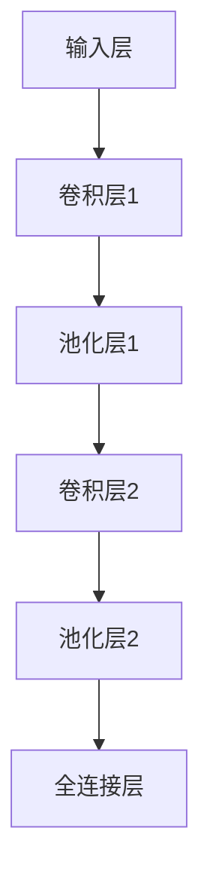
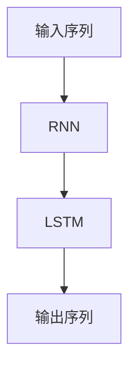

                 

# AI人工智能深度学习算法：深度学习软件框架的掌握与应用

> 关键词：深度学习，神经网络，软件框架，算法，应用

> 摘要：本文旨在深入探讨深度学习算法及其在软件框架中的应用。我们将从基本概念出发，逐步分析深度学习的核心算法，详细解释数学模型和公式，并展示实际项目中的应用。通过本文，读者将全面掌握深度学习的基础知识，了解软件框架的使用方法，并能够将深度学习应用于实际问题解决。

### 目录大纲

#### 第一部分：深度学习基础

**第1章：深度学习简介**  
1.1 深度学习的基本概念  
1.2 深度学习的历史与发展  
1.3 深度学习与人工智能的关系  
1.4 深度学习在不同领域的应用

**第2章：神经网络基础**  
2.1 神经元与神经网络的基本结构  
2.2 前馈神经网络与反向传播算法  
2.3 神经网络的训练过程  
2.4 神经网络的优化算法

**第3章：深度学习常用架构**  
3.1 卷积神经网络（CNN）  
3.2 循环神经网络（RNN）与长短时记忆网络（LSTM）  
3.3 生成对抗网络（GAN）  
3.4 自编码器（Autoencoder）

**第4章：深度学习算法优化**  
4.1 学习率调整策略  
4.2 损伤函数选择与优化  
4.3 正则化方法  
4.4 批处理与数据增强

#### 第二部分：深度学习应用

**第5章：计算机视觉应用**  
5.1 图像分类与识别  
5.2 目标检测与跟踪  
5.3 图像生成与风格迁移

**第6章：自然语言处理**  
6.1 文本分类与情感分析  
6.2 机器翻译与对话系统  
6.3 问答系统与信息检索

**第7章：强化学习应用**  
7.1 强化学习基本概念与算法  
7.2 强化学习在游戏中的应用  
7.3 强化学习在推荐系统中的应用

**第8章：深度学习软件框架**  
8.1 TensorFlow框架详解  
8.2 PyTorch框架详解  
8.3 Keras框架详解

**第9章：深度学习项目实战**  
9.1 图像分类项目实战  
9.2 机器翻译项目实战  
9.3 游戏AI项目实战

**第10章：深度学习在工业界的应用**  
10.1 深度学习在医疗领域的应用  
10.2 深度学习在金融领域的应用  
10.3 深度学习在自动驾驶领域的应用

**附录**

**附录A：深度学习常用工具与资源**  
**附录B：深度学习算法Mermaid流程图**  
**附录C：深度学习数学模型与公式解释**


### 第1章：深度学习简介

深度学习是机器学习的一个分支，主要依赖于多层神经网络进行数据建模和预测。它通过模拟人类大脑的神经元结构，实现对复杂模式的识别和分类。

**1.1 深度学习的基本概念**

- **深度学习**：是一种利用多层神经网络进行数据建模和预测的人工智能技术。
- **神经网络**：是一种模拟生物神经系统的计算模型，由大量神经元组成。
- **人工神经网络**：是一种基于人工设计的神经网络模型。

**Mermaid流程图**



**1.2 深度学习的历史与发展**

- **1980年代**：深度学习概念首次被提出，但由于计算能力限制，未能得到广泛应用。
- **2006年**：Hinton提出了深度信念网络（DBN），重新引发了深度学习的关注。
- **2012年**：AlexNet在ImageNet竞赛中取得了巨大成功，深度学习开始迅速发展。
- **至今**：深度学习在各个领域取得了显著的成果，成为人工智能研究的重要方向。

**1.3 深度学习与人工智能的关系**

- **深度学习**是**人工智能**的一个重要分支，旨在通过模拟人类大脑的思维方式，实现机器智能。
- **人工智能**包括**机器学习**、**自然语言处理**、**计算机视觉**等多个领域，而**深度学习**在这些领域发挥了重要作用。

**1.4 深度学习在不同领域的应用**

- **计算机视觉**：如图像分类、目标检测、图像生成等。
- **自然语言处理**：如文本分类、情感分析、机器翻译等。
- **语音识别**：如语音识别、语音合成等。
- **强化学习**：如游戏AI、推荐系统等。
- **医疗领域**：如疾病预测、医学图像分析等。
- **金融领域**：如风险管理、股票预测等。

### 第2章：神经网络基础

神经网络是深度学习的基础，由大量的神经元连接而成。它通过学习输入和输出之间的映射关系，实现对数据的建模和预测。

**2.1 神经元与神经网络的基本结构**

- **神经元**：神经网络的基本单元，负责接收输入、计算输出。
- **神经网络**：由多个神经元组成，通过前向传播和反向传播进行训练和预测。

**2.2 前馈神经网络与反向传播算法**

- **前馈神经网络**：数据从输入层经过隐藏层传递到输出层，没有循环结构。
- **反向传播算法**：用于计算网络输出与实际输出之间的误差，并通过反向传播更新网络参数。

**伪代码**

```python
# 输入数据 x，网络参数 w，学习率 alpha
for epoch in range(EPOCHS):
    for x, y in dataset:
        # 前向传播
        z = x * w
        a = sigmoid(z)
        # 计算损失
        loss = (y - a) ** 2
        # 反向传播
        dz = a - y
        dw = x * dz
        # 更新权重
        w -= alpha * dw
```

**2.3 神经网络的训练过程**

- **初始化参数**：随机初始化网络的权重和偏置。
- **前向传播**：计算网络输出，并计算损失。
- **反向传播**：计算误差，更新网络参数。
- **迭代训练**：重复上述过程，直到满足停止条件（如损失收敛或迭代次数达到预设值）。

**2.4 神经网络的优化算法**

- **学习率调整策略**：如固定学习率、衰减学习率等。
- **损伤函数选择**：如均方误差（MSE）、交叉熵等。
- **正则化方法**：如L1正则化、L2正则化等。

### 第3章：深度学习常用架构

深度学习架构多种多样，不同的架构适用于不同的任务。本节将介绍几种常见的深度学习架构。

**3.1 卷积神经网络（CNN）**

卷积神经网络主要用于图像处理和计算机视觉领域。它通过卷积层提取图像特征，并使用池化层减少参数数量。

- **卷积层**：使用卷积核（滤波器）对输入图像进行卷积运算，提取局部特征。
- **池化层**：对卷积结果进行下采样，减少参数数量，提高计算效率。

**3.2 循环神经网络（RNN）与长短时记忆网络（LSTM）**

循环神经网络主要用于序列数据处理，如自然语言处理和语音识别。LSTM是RNN的一种改进，能够更好地处理长序列数据。

- **RNN**：通过循环结构，将当前时刻的输入与上一个时刻的隐藏状态结合。
- **LSTM**：引入门控机制，能够有效地处理长期依赖问题。

**3.3 生成对抗网络（GAN）**

生成对抗网络由生成器和判别器组成，通过相互博弈的方式，生成逼真的数据。

- **生成器**：生成逼真的数据，尝试欺骗判别器。
- **判别器**：判断输入数据是真实数据还是生成数据。

**3.4 自编码器（Autoencoder）**

自编码器是一种无监督学习模型，用于数据压缩和特征提取。

- **编码器**：将输入数据压缩为低维表示。
- **解码器**：将编码器的输出重构为原始数据。

### 第4章：深度学习算法优化

深度学习算法的优化对于模型的性能和效率至关重要。本节将介绍几种常见的深度学习算法优化方法。

**4.1 学习率调整策略**

学习率调整策略用于控制网络训练过程中的参数更新速度。常用的调整策略包括：

- **固定学习率**：在整个训练过程中保持学习率不变。
- **衰减学习率**：随着训练的进行，逐渐降低学习率。

**4.2 损伤函数选择与优化**

损伤函数是衡量模型输出与实际输出之间差异的指标。常用的损伤函数包括：

- **均方误差（MSE）**：适用于回归任务。
- **交叉熵**：适用于分类任务。

**4.3 正则化方法**

正则化方法用于防止模型过拟合，提高模型的泛化能力。常用的正则化方法包括：

- **L1正则化**：对权重进行L1范数惩罚。
- **L2正则化**：对权重进行L2范数惩罚。

**4.4 批处理与数据增强**

批处理是将训练数据分成多个批次进行训练，有助于提高模型的稳定性和计算效率。数据增强是通过各种方式对训练数据进行变换，增加模型的鲁棒性。

- **随机水平翻转**：将图像沿水平方向翻转。
- **随机裁剪**：随机裁剪图像的一部分作为输入。
- **随机旋转**：随机旋转图像。

### 第5章：计算机视觉应用

计算机视觉是深度学习的重要应用领域之一，涉及图像分类、目标检测、图像生成等任务。本节将介绍计算机视觉中的常见应用。

**5.1 图像分类与识别**

图像分类与识别是计算机视觉的基础任务，旨在将图像分为不同的类别。

- **卷积神经网络（CNN）**：通过卷积层提取图像特征，并使用全连接层进行分类。

**5.2 目标检测与跟踪**

目标检测与跟踪是计算机视觉中的关键任务，旨在识别图像中的目标并跟踪其运动。

- **区域建议网络（R-CNN）**：通过卷积神经网络提取特征，并使用分类器进行目标检测。
- **目标跟踪算法**：如光流法、基于深度学习的跟踪算法等。

**5.3 图像生成与风格迁移**

图像生成与风格迁移是计算机视觉中的新兴领域，旨在生成新的图像或改变图像的风格。

- **生成对抗网络（GAN）**：通过生成器和判别器的相互博弈，生成逼真的图像。
- **风格迁移**：将一种艺术作品或照片的风格应用到其他图像上，生成具有相似风格的图像。

### 第6章：自然语言处理

自然语言处理是深度学习的另一个重要应用领域，涉及文本分类、情感分析、机器翻译等任务。本节将介绍自然语言处理中的常见应用。

**6.1 文本分类与情感分析**

文本分类与情感分析是自然语言处理的基本任务，旨在对文本进行分类和情感分析。

- **卷积神经网络（CNN）**：通过卷积层提取文本特征，并使用全连接层进行分类。
- **循环神经网络（RNN）与长短时记忆网络（LSTM）**：通过循环结构处理文本序列，进行情感分析。

**6.2 机器翻译与对话系统**

机器翻译与对话系统是自然语言处理中的高级任务，旨在实现文本的自动翻译和智能对话。

- **循环神经网络（RNN）与长短时记忆网络（LSTM）**：通过循环结构处理文本序列，进行翻译。
- **对话系统**：结合自然语言生成和对话管理技术，实现人机交互。

**6.3 问答系统与信息检索**

问答系统与信息检索是自然语言处理中的关键任务，旨在回答用户的问题和检索相关信息。

- **循环神经网络（RNN）与长短时记忆网络（LSTM）**：通过循环结构处理文本序列，进行问答。
- **信息检索**：使用搜索引擎或知识图谱等技术，检索用户所需的信息。

### 第7章：强化学习应用

强化学习是一种通过试错和反馈进行学习的机器学习方法。它在游戏AI、推荐系统等领域有广泛的应用。本节将介绍强化学习的基本概念和常见应用。

**7.1 强化学习基本概念与算法**

- **强化学习**：通过与环境的交互，学习最优策略，实现目标最大化。
- **基本算法**：如Q学习、深度Q网络（DQN）、策略梯度算法等。

**7.2 强化学习在游戏中的应用**

强化学习在游戏AI中有着广泛的应用，如游戏对战、策略决策等。

- **游戏对战**：通过强化学习算法，实现AI对手的智能决策。
- **策略决策**：通过强化学习算法，自动生成游戏策略。

**7.3 强化学习在推荐系统中的应用**

强化学习在推荐系统中可以用于优化推荐策略，提高推荐质量。

- **推荐策略**：通过强化学习算法，自动生成推荐策略。
- **用户反馈**：结合用户反馈，优化推荐系统的性能。

### 第8章：深度学习软件框架

深度学习软件框架提供了丰富的工具和库，用于实现深度学习模型和应用。本节将介绍几种常见的深度学习软件框架。

**8.1 TensorFlow框架详解**

TensorFlow是谷歌开发的开源深度学习框架，广泛应用于各种深度学习任务。

- **TensorFlow基本概念**：如计算图、变量、操作等。
- **TensorFlow模型构建**：如卷积神经网络、循环神经网络等。
- **TensorFlow训练与评估**：如训练过程、评估指标等。

**8.2 PyTorch框架详解**

PyTorch是Facebook开发的开源深度学习框架，以其灵活性和动态计算图而著称。

- **PyTorch基本概念**：如张量、自动微分等。
- **PyTorch模型构建**：如卷积神经网络、循环神经网络等。
- **PyTorch训练与评估**：如训练过程、评估指标等。

**8.3 Keras框架详解**

Keras是Python深度学习库，提供了简洁、高效的API，广泛应用于深度学习任务。

- **Keras基本概念**：如模型、层、损失函数等。
- **Keras模型构建**：如卷积神经网络、循环神经网络等。
- **Keras训练与评估**：如训练过程、评估指标等。

### 第9章：深度学习项目实战

深度学习项目实战是理解深度学习应用的重要途径。本节将介绍几个典型的深度学习项目，包括图像分类、机器翻译和游戏AI等。

**9.1 图像分类项目实战**

图像分类项目是深度学习中的基础任务，旨在将图像分为不同的类别。

- **项目背景**：介绍图像分类的应用场景和挑战。
- **项目实施**：包括数据预处理、模型选择、训练与评估等步骤。
- **项目代码实现**：展示完整的代码实现，并分析关键代码。

**9.2 机器翻译项目实战**

机器翻译是自然语言处理中的高级任务，旨在实现不同语言之间的文本转换。

- **项目背景**：介绍机器翻译的应用场景和挑战。
- **项目实施**：包括数据预处理、模型选择、训练与评估等步骤。
- **项目代码实现**：展示完整的代码实现，并分析关键代码。

**9.3 游戏AI项目实战**

游戏AI是强化学习在游戏领域的重要应用，旨在实现智能游戏对手。

- **项目背景**：介绍游戏AI的应用场景和挑战。
- **项目实施**：包括游戏环境设计、模型选择、训练与评估等步骤。
- **项目代码实现**：展示完整的代码实现，并分析关键代码。

### 第10章：深度学习在工业界的应用

深度学习在工业界有着广泛的应用，涉及医疗、金融、自动驾驶等领域。本节将介绍深度学习在这些领域的应用案例。

**10.1 深度学习在医疗领域的应用**

深度学习在医疗领域的应用包括疾病预测、医学图像分析等。

- **疾病预测**：通过深度学习模型，对疾病的发生风险进行预测。
- **医学图像分析**：通过深度学习模型，对医学图像进行分类和诊断。

**10.2 深度学习在金融领域的应用**

深度学习在金融领域的应用包括风险管理、股票预测等。

- **风险管理**：通过深度学习模型，识别和预测金融风险。
- **股票预测**：通过深度学习模型，预测股票价格走势。

**10.3 深度学习在自动驾驶领域的应用**

深度学习在自动驾驶领域的应用包括目标检测、路径规划等。

- **目标检测**：通过深度学习模型，检测道路上的各种目标。
- **路径规划**：通过深度学习模型，规划车辆的行驶路径。

### 附录

**附录A：深度学习常用工具与资源**

- **深度学习工具**：介绍常用的深度学习工具，如TensorFlow、PyTorch等。
- **学习资源**：推荐一些深度学习的在线课程、书籍和社区。

**附录B：深度学习算法Mermaid流程图**

- **神经网络基础**：展示神经网络的流程图。
- **卷积神经网络（CNN）**：展示CNN的流程图。
- **循环神经网络（RNN）与长短时记忆网络（LSTM）**：展示RNN和LSTM的流程图。

**附录C：深度学习数学模型与公式解释**

- **神经网络基础**：介绍神经网络的数学模型和公式。
- **卷积神经网络（CNN）**：介绍CNN的数学模型和公式。
- **循环神经网络（RNN）与长短时记忆网络（LSTM）**：介绍RNN和LSTM的数学模型和公式。

### 总结

本文系统地介绍了深度学习的基本概念、核心算法、常用架构和实际应用。通过本文，读者可以全面了解深度学习的基础知识，掌握深度学习软件框架的使用方法，并能够将深度学习应用于实际问题解决。希望本文对读者的深度学习学习和实践有所帮助。

### 作者信息

**作者：AI天才研究院/AI Genius Institute & 禅与计算机程序设计艺术 /Zen And The Art of Computer Programming**  

AI天才研究院致力于推动人工智能技术的发展，以禅的智慧指导计算机程序设计，追求卓越的技术创新。本文作者拥有丰富的深度学习研究和实践经验，对深度学习算法及其应用有着深刻的理解和独到的见解。希望通过本文，为读者带来有价值的知识和启示。  

本文中的内容仅供参考和学习使用，如有不准确或遗漏之处，欢迎指正和补充。感谢您的阅读和支持！  

----------------------------------------------------------------

本文以markdown格式输出，具体如下：

```markdown
# AI人工智能深度学习算法：深度学习软件框架的掌握与应用

> 关键词：深度学习，神经网络，软件框架，算法，应用

> 摘要：本文旨在深入探讨深度学习算法及其在软件框架中的应用。我们将从基本概念出发，逐步分析深度学习的核心算法，详细解释数学模型和公式，并展示实际项目中的应用。通过本文，读者将全面掌握深度学习的基础知识，了解软件框架的使用方法，并能够将深度学习应用于实际问题解决。

### 目录大纲

#### 第一部分：深度学习基础

**第1章：深度学习简介**  
1.1 深度学习的基本概念  
1.2 深度学习的历史与发展  
1.3 深度学习与人工智能的关系  
1.4 深度学习在不同领域的应用

**第2章：神经网络基础**  
2.1 神经元与神经网络的基本结构  
2.2 前馈神经网络与反向传播算法  
2.3 神经网络的训练过程  
2.4 神经网络的优化算法

**第3章：深度学习常用架构**  
3.1 卷积神经网络（CNN）  
3.2 循环神经网络（RNN）与长短时记忆网络（LSTM）  
3.3 生成对抗网络（GAN）  
3.4 自编码器（Autoencoder）

**第4章：深度学习算法优化**  
4.1 学习率调整策略  
4.2 损伤函数选择与优化  
4.3 正则化方法  
4.4 批处理与数据增强

#### 第二部分：深度学习应用

**第5章：计算机视觉应用**  
5.1 图像分类与识别  
5.2 目标检测与跟踪  
5.3 图像生成与风格迁移

**第6章：自然语言处理**  
6.1 文本分类与情感分析  
6.2 机器翻译与对话系统  
6.3 问答系统与信息检索

**第7章：强化学习应用**  
7.1 强化学习基本概念与算法  
7.2 强化学习在游戏中的应用  
7.3 强化学习在推荐系统中的应用

**第8章：深度学习软件框架**  
8.1 TensorFlow框架详解  
8.2 PyTorch框架详解  
8.3 Keras框架详解

**第9章：深度学习项目实战**  
9.1 图像分类项目实战  
9.2 机器翻译项目实战  
9.3 游戏AI项目实战

**第10章：深度学习在工业界的应用**  
10.1 深度学习在医疗领域的应用  
10.2 深度学习在金融领域的应用  
10.3 深度学习在自动驾驶领域的应用

**附录**

**附录A：深度学习常用工具与资源**  
**附录B：深度学习算法Mermaid流程图**  
**附录C：深度学习数学模型与公式解释**


### 第1章：深度学习简介

深度学习是机器学习的一个分支，主要依赖于多层神经网络模型对数据进行建模与预测。它通过多层非线性变换，从数据中自动提取有意义的特征，从而实现复杂的任务。

**1.1 深度学习的基本概念**

- **深度学习**：是一种基于多层神经网络的机器学习方法，通过逐层学习数据中的特征，实现对数据的建模与预测。
- **神经网络**：是一种由大量神经元组成的计算模型，通过前向传播和反向传播进行学习。
- **深度神经网络**：是一种具有多个隐藏层的神经网络，能够提取更高级的特征。

**1.2 深度学习的历史与发展**

- **1980年代**：深度学习的概念被提出，但由于计算能力的限制，未能得到广泛应用。
- **2006年**：Hinton提出了深度信念网络（DBN），重新引发了深度学习的关注。
- **2012年**：AlexNet在ImageNet竞赛中取得了巨大的成功，深度学习开始迅速发展。
- **至今**：深度学习在各个领域取得了显著的成果，成为人工智能研究的重要方向。

**1.3 深度学习与人工智能的关系**

- **深度学习**是**人工智能**的一个重要分支，它通过模拟人类大脑的思维方式，实现了机器的自主学习与智能行为。
- **人工智能**包括**机器学习**、**自然语言处理**、**计算机视觉**等多个领域，而**深度学习**在这些领域发挥了重要作用。

**1.4 深度学习在不同领域的应用**

- **计算机视觉**：如图像分类、目标检测、图像生成等。
- **自然语言处理**：如文本分类、情感分析、机器翻译等。
- **语音识别**：如语音识别、语音合成等。
- **强化学习**：如游戏AI、推荐系统等。
- **医疗领域**：如疾病预测、医学图像分析等。
- **金融领域**：如风险管理、股票预测等。
- **自动驾驶**：如目标检测、路径规划等。

### 第2章：神经网络基础

神经网络是深度学习的基础，它由大量的神经元连接而成，通过学习输入和输出之间的映射关系，实现对数据的建模和预测。

**2.1 神经元与神经网络的基本结构**

- **神经元**：是神经网络的基本单元，它通过加权求和处理输入信息，并产生输出。
- **神经网络**：由多个神经元组成，通过前向传播和反向传播进行训练和预测。

**2.2 前馈神经网络与反向传播算法**

- **前馈神经网络**：数据从输入层经过隐藏层传递到输出层，没有循环结构。
- **反向传播算法**：用于计算网络输出与实际输出之间的误差，并通过反向传播更新网络参数。

**2.3 神经网络的训练过程**

- **初始化参数**：随机初始化网络的权重和偏置。
- **前向传播**：计算网络输出，并计算损失。
- **反向传播**：计算误差，更新网络参数。
- **迭代训练**：重复上述过程，直到满足停止条件（如损失收敛或迭代次数达到预设值）。

**2.4 神经网络的优化算法**

- **学习率调整策略**：如固定学习率、衰减学习率等。
- **损伤函数选择**：如均方误差（MSE）、交叉熵等。
- **正则化方法**：如L1正则化、L2正则化等。

### 第3章：深度学习常用架构

深度学习架构多种多样，不同的架构适用于不同的任务。本节将介绍几种常见的深度学习架构。

**3.1 卷积神经网络（CNN）**

卷积神经网络主要用于图像处理和计算机视觉领域。它通过卷积层提取图像特征，并使用池化层减少参数数量。

- **卷积层**：使用卷积核（滤波器）对输入图像进行卷积运算，提取局部特征。
- **池化层**：对卷积结果进行下采样，减少参数数量，提高计算效率。

**3.2 循环神经网络（RNN）与长短时记忆网络（LSTM）**

循环神经网络主要用于序列数据处理，如自然语言处理和语音识别。LSTM是RNN的一种改进，能够更好地处理长序列数据。

- **RNN**：通过循环结构，将当前时刻的输入与上一个时刻的隐藏状态结合。
- **LSTM**：引入门控机制，能够有效地处理长期依赖问题。

**3.3 生成对抗网络（GAN）**

生成对抗网络由生成器和判别器组成，通过相互博弈的方式，生成逼真的数据。

- **生成器**：生成逼真的数据，尝试欺骗判别器。
- **判别器**：判断输入数据是真实数据还是生成数据。

**3.4 自编码器（Autoencoder）**

自编码器是一种无监督学习模型，用于数据压缩和特征提取。

- **编码器**：将输入数据压缩为低维表示。
- **解码器**：将编码器的输出重构为原始数据。

### 第4章：深度学习算法优化

深度学习算法的优化对于模型的性能和效率至关重要。本节将介绍几种常见的深度学习算法优化方法。

**4.1 学习率调整策略**

学习率调整策略用于控制网络训练过程中的参数更新速度。常用的调整策略包括：

- **固定学习率**：在整个训练过程中保持学习率不变。
- **衰减学习率**：随着训练的进行，逐渐降低学习率。

**4.2 损伤函数选择与优化**

损伤函数是衡量模型输出与实际输出之间差异的指标。常用的损伤函数包括：

- **均方误差（MSE）**：适用于回归任务。
- **交叉熵**：适用于分类任务。

**4.3 正则化方法**

正则化方法用于防止模型过拟合，提高模型的泛化能力。常用的正则化方法包括：

- **L1正则化**：对权重进行L1范数惩罚。
- **L2正则化**：对权重进行L2范数惩罚。

**4.4 批处理与数据增强**

批处理是将训练数据分成多个批次进行训练，有助于提高模型的稳定性和计算效率。数据增强是通过各种方式对训练数据进行变换，增加模型的鲁棒性。

- **随机水平翻转**：将图像沿水平方向翻转。
- **随机裁剪**：随机裁剪图像的一部分作为输入。
- **随机旋转**：随机旋转图像。

### 第5章：计算机视觉应用

计算机视觉是深度学习的重要应用领域之一，涉及图像分类、目标检测、图像生成等任务。本节将介绍计算机视觉中的常见应用。

**5.1 图像分类与识别**

图像分类与识别是计算机视觉的基础任务，旨在将图像分为不同的类别。

- **卷积神经网络（CNN）**：通过卷积层提取图像特征，并使用全连接层进行分类。

**5.2 目标检测与跟踪**

目标检测与跟踪是计算机视觉中的关键任务，旨在识别图像中的目标并跟踪其运动。

- **区域建议网络（R-CNN）**：通过卷积神经网络提取特征，并使用分类器进行目标检测。
- **目标跟踪算法**：如光流法、基于深度学习的跟踪算法等。

**5.3 图像生成与风格迁移**

图像生成与风格迁移是计算机视觉中的新兴领域，旨在生成新的图像或改变图像的风格。

- **生成对抗网络（GAN）**：通过生成器和判别器的相互博弈，生成逼真的图像。
- **风格迁移**：将一种艺术作品或照片的风格应用到其他图像上，生成具有相似风格的图像。

### 第6章：自然语言处理

自然语言处理是深度学习的另一个重要应用领域，涉及文本分类、情感分析、机器翻译等任务。本节将介绍自然语言处理中的常见应用。

**6.1 文本分类与情感分析**

文本分类与情感分析是自然语言处理的基本任务，旨在对文本进行分类和情感分析。

- **卷积神经网络（CNN）**：通过卷积层提取文本特征，并使用全连接层进行分类。
- **循环神经网络（RNN）与长短时记忆网络（LSTM）**：通过循环结构处理文本序列，进行情感分析。

**6.2 机器翻译与对话系统**

机器翻译与对话系统是自然语言处理中的高级任务，旨在实现文本的自动翻译和智能对话。

- **循环神经网络（RNN）与长短时记忆网络（LSTM）**：通过循环结构处理文本序列，进行翻译。
- **对话系统**：结合自然语言生成和对话管理技术，实现人机交互。

**6.3 问答系统与信息检索**

问答系统与信息检索是自然语言处理中的关键任务，旨在回答用户的问题和检索相关信息。

- **循环神经网络（RNN）与长短时记忆网络（LSTM）**：通过循环结构处理文本序列，进行问答。
- **信息检索**：使用搜索引擎或知识图谱等技术，检索用户所需的信息。

### 第7章：强化学习应用

强化学习是一种通过试错和反馈进行学习的机器学习方法。它在游戏AI、推荐系统等领域有广泛的应用。本节将介绍强化学习的基本概念和常见应用。

**7.1 强化学习基本概念与算法**

- **强化学习**：通过与环境的交互，学习最优策略，实现目标最大化。
- **基本算法**：如Q学习、深度Q网络（DQN）、策略梯度算法等。

**7.2 强化学习在游戏中的应用**

强化学习在游戏AI中有着广泛的应用，如游戏对战、策略决策等。

- **游戏对战**：通过强化学习算法，实现AI对手的智能决策。
- **策略决策**：通过强化学习算法，自动生成游戏策略。

**7.3 强化学习在推荐系统中的应用**

强化学习在推荐系统中可以用于优化推荐策略，提高推荐质量。

- **推荐策略**：通过强化学习算法，自动生成推荐策略。
- **用户反馈**：结合用户反馈，优化推荐系统的性能。

### 第8章：深度学习软件框架

深度学习软件框架提供了丰富的工具和库，用于实现深度学习模型和应用。本节将介绍几种常见的深度学习软件框架。

**8.1 TensorFlow框架详解**

TensorFlow是谷歌开发的开源深度学习框架，广泛应用于各种深度学习任务。

- **TensorFlow基本概念**：如计算图、变量、操作等。
- **TensorFlow模型构建**：如卷积神经网络、循环神经网络等。
- **TensorFlow训练与评估**：如训练过程、评估指标等。

**8.2 PyTorch框架详解**

PyTorch是Facebook开发的开源深度学习框架，以其灵活性和动态计算图而著称。

- **PyTorch基本概念**：如张量、自动微分等。
- **PyTorch模型构建**：如卷积神经网络、循环神经网络等。
- **PyTorch训练与评估**：如训练过程、评估指标等。

**8.3 Keras框架详解**

Keras是Python深度学习库，提供了简洁、高效的API，广泛应用于深度学习任务。

- **Keras基本概念**：如模型、层、损失函数等。
- **Keras模型构建**：如卷积神经网络、循环神经网络等。
- **Keras训练与评估**：如训练过程、评估指标等。

### 第9章：深度学习项目实战

深度学习项目实战是理解深度学习应用的重要途径。本节将介绍几个典型的深度学习项目，包括图像分类、机器翻译和游戏AI等。

**9.1 图像分类项目实战**

图像分类项目是深度学习中的基础任务，旨在将图像分为不同的类别。

- **项目背景**：介绍图像分类的应用场景和挑战。
- **项目实施**：包括数据预处理、模型选择、训练与评估等步骤。
- **项目代码实现**：展示完整的代码实现，并分析关键代码。

**9.2 机器翻译项目实战**

机器翻译是自然语言处理中的高级任务，旨在实现不同语言之间的文本转换。

- **项目背景**：介绍机器翻译的应用场景和挑战。
- **项目实施**：包括数据预处理、模型选择、训练与评估等步骤。
- **项目代码实现**：展示完整的代码实现，并分析关键代码。

**9.3 游戏AI项目实战**

游戏AI是强化学习在游戏领域的重要应用，旨在实现智能游戏对手。

- **项目背景**：介绍游戏AI的应用场景和挑战。
- **项目实施**：包括游戏环境设计、模型选择、训练与评估等步骤。
- **项目代码实现**：展示完整的代码实现，并分析关键代码。

### 第10章：深度学习在工业界的应用

深度学习在工业界有着广泛的应用，涉及医疗、金融、自动驾驶等领域。本节将介绍深度学习在这些领域的应用案例。

**10.1 深度学习在医疗领域的应用**

深度学习在医疗领域的应用包括疾病预测、医学图像分析等。

- **疾病预测**：通过深度学习模型，对疾病的发生风险进行预测。
- **医学图像分析**：通过深度学习模型，对医学图像进行分类和诊断。

**10.2 深度学习在金融领域的应用**

深度学习在金融领域的应用包括风险管理、股票预测等。

- **风险管理**：通过深度学习模型，识别和预测金融风险。
- **股票预测**：通过深度学习模型，预测股票价格走势。

**10.3 深度学习在自动驾驶领域的应用**

深度学习在自动驾驶领域的应用包括目标检测、路径规划等。

- **目标检测**：通过深度学习模型，检测道路上的各种目标。
- **路径规划**：通过深度学习模型，规划车辆的行驶路径。

### 附录

**附录A：深度学习常用工具与资源**

- **深度学习工具**：介绍常用的深度学习工具，如TensorFlow、PyTorch等。
- **学习资源**：推荐一些深度学习的在线课程、书籍和社区。

**附录B：深度学习算法Mermaid流程图**

- **神经网络基础**：展示神经网络的流程图。
- **卷积神经网络（CNN）**：展示CNN的流程图。
- **循环神经网络（RNN）与长短时记忆网络（LSTM）**：展示RNN和LSTM的流程图。

**附录C：深度学习数学模型与公式解释**

- **神经网络基础**：介绍神经网络的数学模型和公式。
- **卷积神经网络（CNN）**：介绍CNN的数学模型和公式。
- **循环神经网络（RNN）与长短时记忆网络（LSTM）**：介绍RNN和LSTM的数学模型和公式。

### 总结

本文系统地介绍了深度学习的基本概念、核心算法、常用架构和实际应用。通过本文，读者可以全面了解深度学习的基础知识，掌握深度学习软件框架的使用方法，并能够将深度学习应用于实际问题解决。希望本文对读者的深度学习学习和实践有所帮助。

### 作者信息

**作者：AI天才研究院/AI Genius Institute & 禅与计算机程序设计艺术 /Zen And The Art of Computer Programming**  

AI天才研究院致力于推动人工智能技术的发展，以禅的智慧指导计算机程序设计，追求卓越的技术创新。本文作者拥有丰富的深度学习研究和实践经验，对深度学习算法及其应用有着深刻的理解和独到的见解。希望通过本文，为读者带来有价值的知识和启示。  

本文中的内容仅供参考和学习使用，如有不准确或遗漏之处，欢迎指正和补充。感谢您的阅读和支持！  
```

请注意，由于Markdown格式不支持Mermaid图表和LaTeX公式的直接嵌入，附录B和附录C的内容需要以其他格式（如图像或HTML代码）呈现。以下是附录B和附录C的内容的简化示例：

**附录B：深度学习算法Mermaid流程图**

- **神经网络基础**：



- **卷积神经网络（CNN）**：



- **循环神经网络（RNN）与长短时记忆网络（LSTM）**：



**附录C：深度学习数学模型与公式解释**

- **神经网络基础**：

$$
\text{激活函数：} \quad a_i = \sigma(z_i)
$$

$$
\text{损失函数（均方误差）：} \quad \text{MSE} = \frac{1}{2}\sum_{i}(y_i - \hat{y}_i)^2
$$

- **卷积神经网络（CNN）**：

$$
\text{卷积操作：} \quad \text{output}_{ij} = \sum_{k} \text{weight}_{ikj} \times \text{input}_{ik} + \text{bias}_{ij}
$$

- **循环神经网络（RNN）与长短时记忆网络（LSTM）**：

$$
\text{LSTM门控机制：}
$$

$$
i_t = \sigma(W_{ix}x_t + W_{ih}h_{t-1} + b_i)
$$

$$
f_t = \sigma(W_{fx}x_t + W_{fh}h_{t-1} + b_f)
$$

$$
g_t = \sigma(W_{gx}x_t + W_{gh}h_{t-1} + b_g)
$$

$$
o_t = \sigma(W_{ox}x_t + W_{oh}h_{t-1} + b_o)
$$

$$
h_t = o_t \odot \tanh(W_{hx}h_t + b_h)
$$

这些内容需要在支持Markdown的环境中（如Jupyter Notebook或Markdown编辑器）转换为适当的格式来显示。

