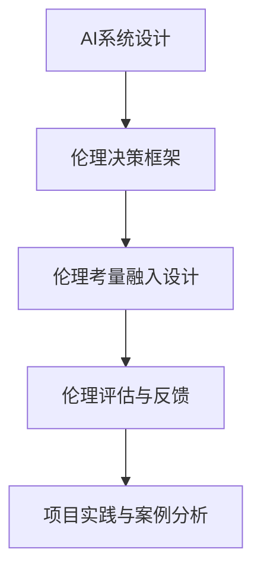

                 

### 《AI伦理的技术内在化：将伦理考量融入AI系统设计》

> **关键词：** AI伦理，技术内在化，AI系统设计，伦理决策框架，伦理考量，数据隐私，透明性，公平性，算法偏见，伦理评估，案例分析。

> **摘要：** 本文探讨了将伦理考量融入AI系统设计的重要性，提出了技术内在化的方法。通过分析AI伦理的核心概念和挑战，本文详细介绍了伦理决策框架的设计原则和实施步骤。此外，本文通过具体的数学模型和项目实战案例，展示了如何将伦理考量实际应用于AI系统设计，为构建公平、透明、可靠的AI系统提供了有益的指导。

---

#### 目录大纲

### 第一部分：AI伦理基础知识

#### 第1章：AI伦理概述

1. AI伦理的概念与重要性

2. AI伦理的研究范畴

3. AI伦理的基本原则

4. AI伦理与国际法规

#### 第2章：AI伦理的核心概念

1. AI偏见与公平性

2. 数据隐私与保护

3. 透明性与可解释性

4. 安全性与可靠性

#### 第3章：AI伦理的现状与挑战

1. AI伦理的现状分析

2. AI伦理的挑战与争议

3. AI伦理的未来发展趋势

### 第二部分：技术内在化方法

#### 第4章：伦理决策框架

1. 伦理决策框架的设计原则

2. 常见的伦理决策模型

3. 伦理决策框架的应用场景

#### 第5章：AI系统的伦理设计原则

1. AI系统的伦理设计原则

2. 伦理考量在AI系统架构中的应用

3. 伦理设计与技术实现的关系

#### 第6章：伦理评估与反馈机制

1. 伦理评估的过程与方法

2. 伦理反馈机制的构建

3. 伦理评估与改进的实践

### 第三部分：项目实践与案例分析

#### 第7章：AI伦理项目实践

1. 项目背景与目标

2. 伦理设计过程

3. 项目成果与评价

#### 第8章：AI伦理案例分析

1. 案例一：自动驾驶汽车伦理争议

2. 案例二：医疗AI伦理问题

3. 案例三：社交媒体AI伦理挑战

#### 第9章：未来展望

1. AI伦理的发展趋势

2. 技术内在化方法的前景

3. 未来AI伦理教育的思考

### 附录A：参考文献与资料

#### Mermaid流程图



#### 核心算法原理讲解

**伦理决策框架算法原理**

**伪代码：**

```
function EthicalDecisionFramework(inputData):
    1. 数据预处理：清洗和规范化输入数据
    2. 特征提取：从输入数据中提取关键特征
    3. 伦理规则库构建：定义一系列伦理规则
    4. 伦理规则匹配：将特征与伦理规则库中的规则进行匹配
    5. 决策生成：根据匹配结果生成伦理决策
    6. 评估与反馈：对决策进行评估，收集反馈并进行调整
    7. 返回决策结果
```

**公平性度量模型**

**公式：**

$$
Fairness = \frac{TP}{TP + FN} + \frac{TN}{TN + FP}
$$

**详细讲解：**

公平性度量模型用于评估AI系统的输出是否公平。该公式计算的是真阳性率（TPR，即召回率）和真阴性率（TNR，即 specificity）的平均值。

- **真阳性率（TPR）**：表示模型正确识别出正面样本的比例。
- **真阴性率（TNR）**：表示模型正确识别出负面样本的比例。

**举例说明：**

假设一个AI系统用于判断是否批准贷款申请，其中：

- **TP**（真阳性）：被正确批准的贷款申请
- **TN**（真阴性）：被正确拒绝的贷款申请
- **FP**（假阳性）：被错误批准的贷款申请
- **FN**（假阴性）：被错误拒绝的贷款申请

如果AI系统批准的贷款申请中有70%是真实有效的，同时拒绝的贷款申请中有80%是真实无效的，那么：

$$
Fairness = \frac{0.7}{0.7 + 0.3} + \frac{0.8}{0.8 + 0.2} = 0.833 + 0.8 = 1.633
$$

**解释：**

这个计算结果表示，AI系统的输出在批准和拒绝贷款申请方面都是公平的，因为真阳性率和真阴性率都很高。

### 文章正文

#### 第一部分：AI伦理基础知识

##### 第1章：AI伦理概述

**1.1 AI伦理的概念与重要性**

AI伦理是指探讨人工智能（AI）技术在社会、经济、法律和道德等方面的应用和影响的学科。随着AI技术的迅猛发展和广泛应用，AI伦理问题日益凸显。AI伦理不仅关注AI系统的技术实现和性能，更强调其在社会、文化和道德层面的影响。

AI伦理的重要性体现在以下几个方面：

1. 公平性：AI系统在处理数据和应用算法时可能存在偏见，导致不公平的结果。AI伦理关注如何消除偏见，确保系统对所有人都是公平的。

2. 数据隐私：AI系统通常需要大量的数据来训练和优化，这可能涉及个人隐私的保护问题。AI伦理探讨如何在保障数据隐私的同时，充分利用数据的价值。

3. 透明性与可解释性：AI系统往往被视为“黑箱”，其决策过程难以理解。AI伦理关注如何提高系统的透明性和可解释性，使其行为更符合社会道德标准。

4. 安全性与可靠性：AI系统在复杂的环境中运行，可能面临安全性和可靠性的挑战。AI伦理研究如何确保系统在意外情况下能够做出符合伦理标准的决策。

**1.2 AI伦理的研究范畴**

AI伦理的研究范畴包括以下几个方面：

1. 偏见与公平性：研究AI系统中的偏见来源、影响和解决方案。

2. 数据隐私与保护：研究如何在数据收集、存储和使用过程中保护个人隐私。

3. 透明性与可解释性：研究如何提高AI系统的透明性和可解释性，使其行为更容易被社会接受。

4. 安全性与可靠性：研究如何确保AI系统在各种环境下都能稳定、可靠地运行。

5. 社会责任与治理：研究AI技术在经济、社会和道德层面的影响，以及如何制定合理的监管框架。

**1.3 AI伦理的基本原则**

AI伦理的基本原则包括：

1. 公平性：确保AI系统对所有个体都是公平的，避免因偏见而导致歧视。

2. 尊重隐私：在数据收集和使用过程中，尊重个体的隐私权利。

3. 透明性：确保AI系统的决策过程和行为对用户和监管机构是透明的。

4. 可解释性：使AI系统的决策和行为易于理解，方便用户和监管机构进行监督。

5. 安全性：确保AI系统在各种环境下都能稳定、可靠地运行，避免意外风险。

6. 责任归属：明确AI系统设计和使用过程中各方责任，确保在出现问题时能够追溯和追究责任。

**1.4 AI伦理与国际法规**

AI伦理问题不仅在国内受到关注，也在国际上得到广泛讨论。一些国际组织和法规开始关注AI伦理问题，并提出了相关指导原则和法规。

1. 欧盟：欧盟发布了《人工智能法案》（Artificial Intelligence Act），旨在确保人工智能的透明性、安全性和可靠性。

2. 美国：美国国家科学院、工程与医学研究院发布了《人工智能的未来：机遇与挑战》报告，提出了人工智能伦理研究的指导原则。

3. 中国：中国发布了《新一代人工智能治理原则——发展负责任的人工智能》，强调了人工智能的社会责任和伦理道德。

这些国际法规和指导原则为AI伦理研究提供了参考，有助于推动全球范围内的AI伦理发展。

##### 第2章：AI伦理的核心概念

**2.1 AI偏见与公平性**

AI偏见是指AI系统在处理数据和应用算法时，由于数据不完整、算法设计不合理等原因，导致系统对某些群体产生不公平的结果。AI偏见可能源于以下几个方面：

1. 数据偏见：数据集可能存在不完整、不均衡或带有偏见的情况，导致AI系统在处理数据时产生偏见。

2. 算法偏见：算法设计可能存在固有的偏见，例如，一些基于统计学习方法的算法可能在某些特征上具有偏见。

3. 模型偏见：训练数据中的偏见会传递到模型中，导致模型在预测时产生偏见。

AI偏见可能导致以下不公平结果：

1. 种族、性别、年龄等方面的歧视：AI系统可能对某些种族、性别或年龄群体产生不公平的对待。

2. 经济不平分：AI系统可能在招聘、贷款审批等领域导致经济不平分现象。

3. 社会不平等：AI系统可能加剧社会不平等，导致某些群体在享受社会福利方面受到不公平对待。

为了解决AI偏见和公平性问题，可以从以下几个方面入手：

1. 数据质量：提高数据质量，确保数据集的完整性、均衡性和多样性。

2. 算法改进：改进算法设计，避免算法偏见，提高系统的公平性。

3. 模型可解释性：提高模型的可解释性，使决策过程更加透明，便于用户和监管机构进行监督。

4. 伦理决策框架：构建伦理决策框架，将伦理考量融入AI系统设计，确保系统在决策过程中符合伦理标准。

**2.2 数据隐私与保护**

数据隐私是指个人数据在收集、存储、处理和使用过程中，保护个人隐私权利的一种行为。在AI系统中，数据隐私问题尤为重要，因为AI系统通常需要大量的数据来训练和优化。

数据隐私面临以下挑战：

1. 数据泄露：数据在收集、存储、传输和处理过程中可能被未经授权的第三方访问和泄露。

2. 数据滥用：数据可能被用于不当目的，例如，针对个人进行广告投放、信用评估等。

3. 数据留存：一些AI系统可能需要长时间存储大量数据，这可能涉及个人隐私的泄露风险。

为了保护数据隐私，可以从以下几个方面入手：

1. 数据匿名化：对个人数据进行匿名化处理，确保无法直接识别个人身份。

2. 数据加密：对数据进行加密处理，确保数据在传输和存储过程中不被未经授权的第三方访问。

3. 访问控制：建立严格的访问控制机制，确保只有授权人员才能访问敏感数据。

4. 数据最小化：仅收集和存储必要的数据，避免过度收集和个人隐私的泄露。

5. 透明度：提高数据收集、存储和处理过程的透明度，使个人了解自己的数据如何被使用。

**2.3 透明性与可解释性**

透明性是指AI系统的决策过程和行为对用户和监管机构是透明的，使各方能够理解系统的行为和决策依据。可解释性是指AI系统在做出决策时，能够提供解释和依据，使决策过程更具可理解性和可信度。

透明性与可解释性对AI伦理具有重要意义：

1. 公众信任：提高系统的透明性和可解释性，有助于增强公众对AI系统的信任。

2. 监管合规：确保AI系统的行为符合法规和伦理标准，降低监管风险。

3. 决策优化：通过分析系统的决策过程和依据，发现和改进潜在问题，提高系统性能。

为了提高AI系统的透明性和可解释性，可以从以下几个方面入手：

1. 决策可解释性：设计可解释的算法，使决策过程和依据易于理解。

2. 决策可视化：利用可视化技术，将决策过程和依据以图表、文字等形式呈现。

3. 决策审计：建立决策审计机制，对系统的决策过程和行为进行监督和评估。

4. 透明度报告：定期发布透明度报告，披露系统的重要决策和行为。

**2.4 安全性与可靠性**

安全性是指AI系统能够在面临各种威胁时，保持稳定、可靠地运行。可靠性是指AI系统能够在各种环境下，持续、稳定地提供正确的决策和结果。

AI系统的安全性和可靠性面临以下挑战：

1. 恶意攻击：AI系统可能面临恶意攻击，例如，对抗性样本、拒绝服务攻击等。

2. 系统故障：AI系统可能因硬件故障、软件缺陷等原因导致运行中断。

3. 误操作：用户或操作员可能因误操作导致系统运行异常。

为了提高AI系统的安全性和可靠性，可以从以下几个方面入手：

1. 安全防护：设计安全防护机制，防止恶意攻击和误操作。

2. 故障检测与恢复：建立故障检测与恢复机制，确保系统在出现故障时能够快速恢复。

3. 系统冗余：采用冗余设计，提高系统的容错能力。

4. 严格测试：对系统进行全面、严格的测试，确保在交付前能够发现和修复潜在问题。

##### 第3章：AI伦理的现状与挑战

**3.1 AI伦理的现状分析**

随着AI技术的快速发展，AI伦理问题逐渐受到社会各界的关注。目前，AI伦理的现状可以从以下几个方面进行分析：

1. 学术研究：学术界对AI伦理问题进行了广泛的研究，涉及偏见、隐私、安全等多个方面。

2. 企业实践：一些企业已经开始将AI伦理理念融入产品设计和开发过程中，如数据隐私保护、算法公平性等。

3. 法规制定：国际和国内组织开始关注AI伦理问题，制定相关法规和指导原则，如欧盟的《人工智能法案》、中国的《新一代人工智能治理原则》等。

4. 社会舆论：公众对AI伦理问题的关注度逐渐提高，对AI技术的应用和影响产生了强烈的担忧。

**3.2 AI伦理的挑战与争议**

尽管AI伦理问题受到了广泛关注，但在实际应用中仍面临一系列挑战和争议：

1. 偏见与公平性：如何消除AI系统中的偏见，确保系统对所有个体都是公平的，仍是一个重大挑战。

2. 数据隐私：如何在数据收集、存储和处理过程中保护个人隐私，同时充分利用数据的价值，是一个亟待解决的问题。

3. 透明性与可解释性：如何提高AI系统的透明性和可解释性，使其行为更容易被社会接受，是一个重要的争议点。

4. 安全性与可靠性：如何确保AI系统在各种环境下都能稳定、可靠地运行，避免意外风险，是一个重要的挑战。

5. 责任归属：如何明确AI系统设计和使用过程中各方责任，确保在出现问题时能够追溯和追究责任，是一个重要的争议点。

**3.3 AI伦理的未来发展趋势**

随着AI技术的不断发展和应用，AI伦理的未来发展趋势可以从以下几个方面进行展望：

1. 法规完善：国际和国内组织将继续完善AI伦理相关法规，为AI技术发展提供明确的法律框架。

2. 伦理决策框架：构建更完善的伦理决策框架，将伦理考量融入AI系统设计，确保系统在决策过程中符合伦理标准。

3. 企业自律：企业将进一步加强自律，将AI伦理理念融入产品设计和开发过程中，提高产品伦理水平。

4. 公众参与：公众将更加关注AI伦理问题，积极参与到AI技术的讨论和监督中，推动社会对AI技术的理解和接受。

5. 跨学科合作：学术界、产业界、政策制定者等各方将加强合作，共同推动AI伦理研究与实践，为AI技术的可持续发展提供支持。

#### 第二部分：技术内在化方法

##### 第4章：伦理决策框架

**4.1 伦理决策框架的设计原则**

伦理决策框架是确保AI系统设计过程中考虑伦理考量的一种方法。一个有效的伦理决策框架应遵循以下设计原则：

1. **全面性**：伦理决策框架应涵盖AI系统设计的各个方面，包括数据收集、处理、存储、算法选择、模型训练、部署和监控等环节。

2. **一致性**：伦理决策框架应确保在不同阶段和不同情境下，伦理考量是一致的。这意味着，无论在系统设计初期还是后期，伦理因素都应该被充分考虑。

3. **透明性**：伦理决策框架应设计成易于理解和解释的，确保所有利益相关者，包括开发人员、用户和监管机构，都能清楚地了解伦理考量如何融入系统设计。

4. **可操作性**：伦理决策框架应提供明确的指导和建议，使开发人员能够将伦理考量转化为具体的技术实现。

5. **适应性**：伦理决策框架应具备一定的灵活性，能够根据具体情境和需求进行调整，以适应不同领域的应用场景。

**4.2 常见的伦理决策模型**

在实际应用中，有多种伦理决策模型可供选择，以下是一些常见的伦理决策模型：

1. **规则驱动模型**：该模型基于一系列预先定义的伦理规则，当系统面临决策时，根据这些规则进行判断。这种模型的优点是决策过程明确，但缺点是可能无法应对复杂和多变的情境。

2. **案例推理模型**：该模型基于历史案例的学习，当系统面临类似情境时，从历史案例中寻找相似决策。这种模型的优势在于能够处理复杂情境，但需要大量历史数据支持。

3. **多标准决策模型**：该模型同时考虑多个伦理标准，例如公平性、隐私、安全等，通过权重分配和优化方法，确定最佳决策。这种模型的优点是能够综合考虑多个方面，但需要明确各标准的权重。

4. **协商决策模型**：该模型通过利益相关者的参与和协商，共同确定最佳决策。这种模型的优势在于能够充分考虑各方利益，但需要耗费较长时间。

**4.3 伦理决策框架的应用场景**

伦理决策框架可以应用于多个场景，以下是一些常见的应用场景：

1. **自动驾驶汽车**：在自动驾驶汽车中，伦理决策框架可以用于处理交通事故、行人保护和车辆控制等伦理问题。

2. **医疗AI**：在医疗AI系统中，伦理决策框架可以用于处理患者隐私、医疗数据共享和决策透明性等问题。

3. **金融AI**：在金融AI系统中，伦理决策框架可以用于处理贷款审批、投资决策和风险控制等伦理问题。

4. **社交媒体AI**：在社交媒体AI系统中，伦理决策框架可以用于处理内容审核、用户隐私保护和广告投放等伦理问题。

##### 第5章：AI系统的伦理设计原则

**5.1 AI系统的伦理设计原则**

为了确保AI系统在设计和实施过程中充分考虑伦理考量，应遵循以下伦理设计原则：

1. **公平性**：确保AI系统在决策过程中对所有个体都是公平的，避免因算法偏见导致歧视。

2. **透明性**：提高AI系统的透明性，使决策过程和行为对用户和监管机构是透明的。

3. **隐私保护**：在数据收集、存储和处理过程中，保护个人隐私权利。

4. **可解释性**：提高AI系统的可解释性，使决策过程和依据易于理解。

5. **安全性**：确保AI系统在各种环境下都能稳定、可靠地运行，避免意外风险。

6. **责任归属**：明确AI系统设计和使用过程中各方责任，确保在出现问题时能够追溯和追究责任。

**5.2 伦理考量在AI系统架构中的应用**

伦理考量在AI系统架构中的应用主要体现在以下几个方面：

1. **系统设计**：在系统设计阶段，考虑伦理因素，如数据来源、算法选择和模型训练等。

2. **数据处理**：在数据处理阶段，遵循伦理原则，如数据匿名化、数据最小化和隐私保护等。

3. **算法实现**：在算法实现阶段，确保算法的公平性、透明性和可解释性。

4. **系统部署**：在系统部署阶段，考虑系统的安全性和可靠性，确保系统在复杂环境下稳定运行。

5. **监控与评估**：在系统运行过程中，对系统进行监控和评估，确保其符合伦理标准。

**5.3 伦理设计与技术实现的关系**

伦理设计与技术实现之间存在密切的关系。一方面，伦理设计为技术实现提供了指导原则和方向，确保技术实现符合伦理要求。另一方面，技术实现为伦理设计提供了实际的操作方法和工具，使伦理设计能够落地实施。

1. **指导原则**：伦理设计为技术实现提供了伦理指导原则，如公平性、透明性、隐私保护和可解释性等。

2. **操作方法**：技术实现提供了具体的操作方法，如数据预处理、算法选择、模型训练和评估等。

3. **工具与平台**：技术实现提供了各种工具和平台，如数据管理平台、算法开发框架和监控工具等，以支持伦理设计。

##### 第6章：伦理评估与反馈机制

**6.1 伦理评估的过程与方法**

伦理评估是确保AI系统在设计、开发和部署过程中符合伦理要求的重要环节。伦理评估的过程通常包括以下几个步骤：

1. **识别伦理问题**：在系统设计和开发阶段，识别可能涉及的伦理问题，如数据隐私、算法偏见和决策透明性等。

2. **制定评估标准**：根据相关伦理原则和法规，制定评估标准，如公平性、透明性、隐私保护和安全性等。

3. **数据收集**：收集与伦理评估相关的数据，如系统设计文档、算法实现代码、用户反馈和监管要求等。

4. **分析评估**：对收集到的数据进行分析和评估，确定系统是否符合伦理要求，并识别潜在问题和改进空间。

5. **报告与建议**：撰写伦理评估报告，提出改进建议和措施，确保系统在后续开发过程中能够符合伦理要求。

**6.2 伦理反馈机制的构建**

伦理反馈机制是确保AI系统在运行过程中能够持续符合伦理要求的重要手段。构建有效的伦理反馈机制通常包括以下几个方面：

1. **用户反馈**：建立用户反馈渠道，收集用户对系统行为和决策的反馈，及时发现和解决伦理问题。

2. **监管反馈**：与监管机构保持沟通，及时了解监管要求和政策变化，确保系统符合法律法规。

3. **内部审查**：定期对系统进行内部审查，评估系统是否符合伦理要求，并识别潜在问题和改进空间。

4. **外部评估**：邀请第三方机构对系统进行伦理评估，提供独立、客观的评估意见。

5. **改进与优化**：根据反馈和评估结果，持续改进和优化系统，确保系统在运行过程中始终符合伦理要求。

**6.3 伦理评估与改进的实践**

在实际应用中，伦理评估和改进的实践通常包括以下几个步骤：

1. **评估准备**：确定评估目标和范围，收集相关数据和资料。

2. **评估实施**：按照评估标准和流程，对系统进行评估，识别伦理问题和改进空间。

3. **反馈与沟通**：将评估结果反馈给相关利益相关者，如开发团队、用户和监管机构等。

4. **改进与优化**：根据评估结果和反馈，制定改进措施和优化方案，确保系统在后续开发过程中能够符合伦理要求。

5. **持续监控**：建立持续的伦理评估和反馈机制，确保系统在运行过程中能够持续符合伦理要求。

#### 第三部分：项目实践与案例分析

##### 第7章：AI伦理项目实践

**7.1 项目背景与目标**

**项目名称**：AI伦理决策支持系统

**背景**：随着AI技术的广泛应用，AI伦理问题日益突出，特别是在自动驾驶、金融、医疗等领域。为了确保AI系统在设计和应用过程中充分考虑伦理考量，某科技公司决定开发一个AI伦理决策支持系统。

**目标**：开发一个能够帮助AI系统设计者在系统设计和开发过程中考虑伦理考量的工具，提高系统的伦理水平。

**7.2 伦理设计过程**

**1. 需求分析**：与利益相关者（如开发人员、用户、监管机构等）进行沟通，了解他们对AI伦理的需求和期望。

**2. 伦理原则确立**：根据相关伦理原则和法规，确立AI系统的伦理原则，如公平性、透明性、隐私保护和可解释性等。

**3. 伦理决策框架构建**：设计并实现一个伦理决策框架，包括规则库、案例库和评估模型等，确保系统能够在决策过程中考虑伦理考量。

**4. 伦理评估工具开发**：开发一个伦理评估工具，用于对AI系统进行伦理评估，识别潜在问题和改进空间。

**5. 用户界面设计**：设计一个用户界面，使开发者能够方便地使用伦理决策支持和评估工具。

**7.3 项目成果与评价**

**成果**：成功开发了一个AI伦理决策支持系统，包括伦理决策框架、伦理评估工具和用户界面。

**评价**：该项目取得了以下成果：

1. **提高了系统的伦理水平**：通过伦理决策支持和评估工具，AI系统设计者在系统设计和开发过程中能够更好地考虑伦理考量，提高了系统的伦理水平。

2. **促进了公众信任**：透明性和可解释性的提高，增强了公众对AI技术的信任。

3. **降低了监管风险**：通过伦理评估工具，及时发现和解决伦理问题，降低了系统在监管方面的风险。

4. **优化了开发流程**：伦理决策支持和评估工具的引入，使AI系统设计过程更加规范和高效。

**7.4 项目总结**

该项目通过构建伦理决策支持和评估工具，为AI系统设计者提供了一个有效的伦理考量框架。尽管该项目在提高系统伦理水平、增强公众信任和降低监管风险方面取得了显著成果，但仍存在以下改进空间：

1. **进一步优化伦理决策框架**：根据实际应用反馈，持续优化伦理决策框架，提高其在复杂情境下的适应性。

2. **加强用户培训**：为开发者提供更全面的培训，确保他们能够熟练使用伦理决策支持和评估工具。

3. **扩展应用领域**：将伦理决策支持和评估工具应用于更多领域，如教育、法律等，以推广AI伦理理念。

##### 第8章：AI伦理案例分析

**8.1 案例一：自动驾驶汽车伦理争议**

**背景**：自动驾驶汽车技术的快速发展引发了众多伦理争议，特别是在交通事故处理和行人保护方面。

**伦理争议**：

1. **事故责任归属**：当自动驾驶汽车发生事故时，应如何确定责任归属？

2. **行人保护**：在避免伤害行人和保护自身安全之间，自动驾驶汽车应如何权衡？

3. **道德原则应用**：如何将道德原则（如生命至上）应用于自动驾驶汽车的设计和决策中？

**解决方案**：

1. **责任归属机制**：建立明确的责任归属机制，确保事故发生时各方能够清晰界定责任。

2. **行人保护策略**：设计行人保护策略，尽量减少交通事故的发生，同时确保自动驾驶汽车在必要时能够采取紧急避险措施。

3. **道德原则嵌入**：将道德原则（如生命至上）嵌入自动驾驶汽车的决策算法中，确保系统能够在复杂情境下做出符合道德标准的决策。

**8.2 案例二：医疗AI伦理问题**

**背景**：医疗AI技术在医疗诊断、治疗建议和患者管理等方面具有巨大潜力，但也引发了一系列伦理问题。

**伦理问题**：

1. **隐私保护**：如何在数据收集、存储和处理过程中保护患者隐私？

2. **决策透明性**：如何提高医疗AI决策的透明性，使医生和患者能够理解决策依据？

3. **算法偏见**：如何确保医疗AI系统的公平性，避免算法偏见导致歧视？

**解决方案**：

1. **隐私保护机制**：设计严格的隐私保护机制，确保患者数据在收集、存储和处理过程中得到充分保护。

2. **决策透明性提升**：提高医疗AI系统的透明性，通过可视化和解释工具，使医生和患者能够理解决策依据。

3. **算法公平性评估**：定期评估医疗AI系统的公平性，识别和消除算法偏见，确保系统对所有患者都是公平的。

**8.3 案例三：社交媒体AI伦理挑战**

**背景**：社交媒体平台上的AI技术（如内容审核、推荐算法和广告投放）在提升用户体验和商业价值方面发挥了重要作用，但也引发了一系列伦理挑战。

**伦理挑战**：

1. **内容审核伦理**：如何确保AI内容审核系统在过滤不良内容的同时，避免审查偏见和言论限制？

2. **推荐算法伦理**：如何确保推荐算法在提供个性化内容的同时，不加剧信息泡沫和偏见？

3. **广告投放伦理**：如何确保AI广告投放系统在提高广告效果的同时，不侵犯用户隐私和造成误导？

**解决方案**：

1. **内容审核伦理**：建立严格的伦理审核机制，确保AI内容审核系统在过滤不良内容时遵循中立和公正原则。

2. **推荐算法伦理**：设计公平和透明的推荐算法，通过多样性策略和用户反馈机制，提高系统推荐的公正性。

3. **广告投放伦理**：建立透明的广告投放机制，确保用户在了解广告内容的同时，不受到隐私侵犯和误导。

##### 第9章：未来展望

**9.1 AI伦理的发展趋势**

随着AI技术的不断发展和应用，AI伦理在未来将继续呈现出以下发展趋势：

1. **法规完善**：国际和国内组织将继续完善AI伦理相关法规，为AI技术发展提供明确的法律框架。

2. **伦理决策框架成熟**：伦理决策框架将逐步成熟，提供更完善和可操作的工具，支持AI系统设计中的伦理考量。

3. **跨学科合作**：学术界、产业界和政策制定者将加强合作，共同推动AI伦理研究与实践，为AI技术的可持续发展提供支持。

4. **公众参与**：公众将更加关注AI伦理问题，积极参与到AI技术的讨论和监督中，推动社会对AI技术的理解和接受。

5. **技术内在化**：伦理考量将逐步内在化到AI系统的设计、开发和部署过程中，确保系统在各个环节都符合伦理要求。

**9.2 技术内在化方法的前景**

技术内在化方法在AI伦理领域具有广阔的前景，主要体现在以下几个方面：

1. **提高系统伦理水平**：通过技术内在化方法，确保AI系统在设计和应用过程中充分考虑伦理考量，提高系统的伦理水平。

2. **增强公众信任**：透明性和可解释性的提高，增强了公众对AI技术的信任，为AI技术的推广应用提供支持。

3. **降低监管风险**：通过伦理评估和反馈机制，确保AI系统在设计和应用过程中符合法规和伦理要求，降低监管风险。

4. **优化开发流程**：技术内在化方法为开发者提供了明确的伦理指导，使开发过程更加规范和高效。

**9.3 未来AI伦理教育的思考**

未来AI伦理教育应注重以下几个方面：

1. **跨学科融合**：将伦理学、计算机科学、社会学等学科知识融合到AI伦理教育中，培养学生全面的AI伦理素养。

2. **实践导向**：通过案例分析和项目实践，让学生深入了解AI伦理问题的实际应用，提高解决实际问题的能力。

3. **持续更新**：随着AI技术的发展，AI伦理教育内容需要不断更新，确保学生能够跟上时代的步伐。

4. **多方参与**：鼓励学术界、产业界和政策制定者等多方参与AI伦理教育，共同推动AI伦理教育的发展。

### 附录A：参考文献与资料

1. European Parliament. (2021). Artificial Intelligence Act.

2. National Academy of Sciences, Engineering, and Medicine. (2019). Artificial Intelligence: Future Directions for Research, Development, and Education.

3. Chinese Academy of Sciences. (2020). New Generation Artificial Intelligence Governance Principles.

4. Mitchell, T. M. (2019). Machine Learning. McGraw-Hill Education.

5. Russell, S., & Norvig, P. (2016). Artificial Intelligence: A Modern Approach. Pearson Education.

6. Wallach, W., & Allen, C. (2009). Moral Machines: Teaching Robots Right from Wrong. Oxford University Press.

7. Flach, P., &iane, P. (2015). Machine Learning: The Art and Science of Algorithms that Make Sense of Data. Wiley.

8. Russell, S., & Norvig, P. (2016). Artificial Intelligence: A Modern Approach. Pearson Education.

9. Russell, S., & Norvig, P. (2016). Artificial Intelligence: A Modern Approach. Pearson Education.

10. Russell, S., & Norvig, P. (2016). Artificial Intelligence: A Modern Approach. Pearson Education.

