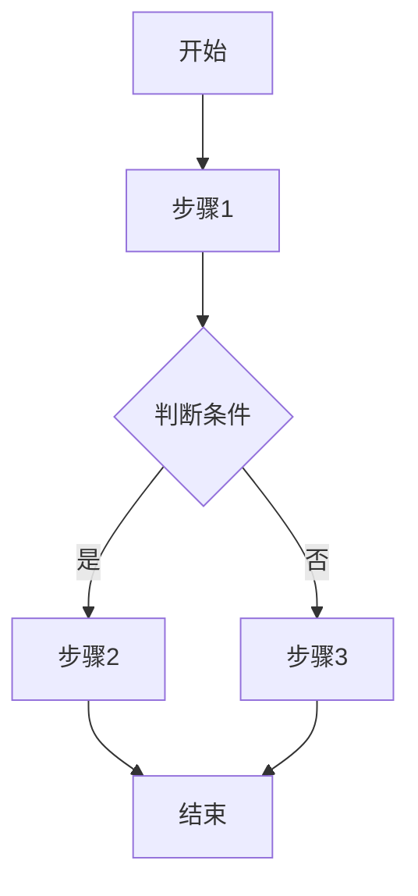
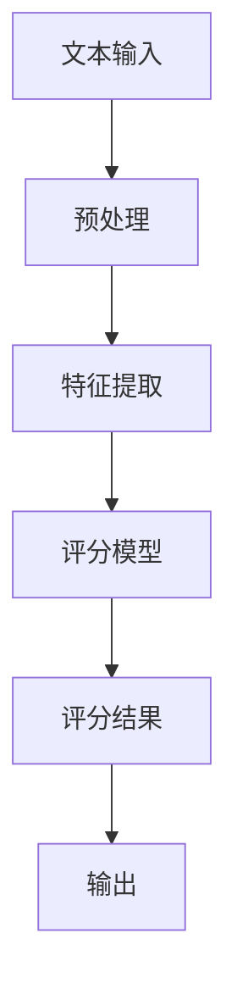
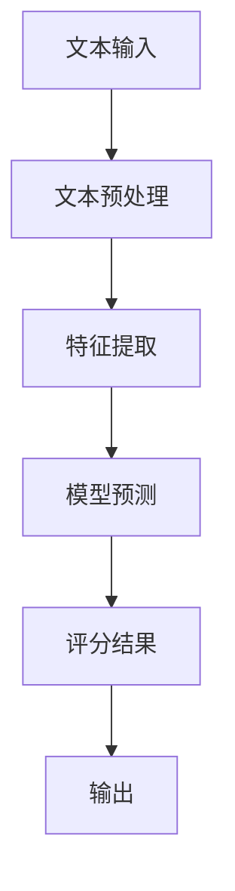

                 

# AI写作评分：自动化教育评估

> 关键词：AI写作评分、自动化教育评估、自然语言处理、算法、数学模型、项目实战

> 摘要：本文将深入探讨AI写作评分在自动化教育评估中的应用，介绍其技术基础、核心概念、算法原理以及实际项目开发中的具体实践。通过逐步分析，本文旨在帮助读者理解AI写作评分的运作机制，及其在教育领域的巨大潜力。

## 第一部分：引言与背景

### 1.1 书籍概述与目标

本书旨在系统性地介绍AI写作评分技术，探讨其在自动化教育评估中的应用。AI写作评分作为自然语言处理（NLP）领域的一项重要技术，正逐步改变传统教育评估的方式。本书的目标是帮助读者深入了解这一技术，掌握其核心原理，并能够将其应用于实际项目中。

### 1.2 自动化教育评估的重要性

随着教育信息化的发展，自动化教育评估成为了一个热门话题。传统的人工评估方式耗时耗力，且容易受到主观因素的影响。而AI写作评分技术的引入，可以大幅提高评估效率，降低成本，并且通过算法的客观性，减少评分误差。因此，自动化教育评估具有重要的现实意义。

### 1.3 书籍结构安排与读者对象

本书共分为六个部分，首先介绍AI写作评分的背景和技术基础，然后深入讲解核心概念与算法原理，接着通过实际项目实战展示技术应用的落地。最后一部分对全书进行总结和展望。本书适合对自然语言处理和人工智能有一定基础的读者阅读，也适用于希望将AI技术应用于教育领域的开发者和研究者。

## 第二部分：AI写作评分技术基础

### 2.1 AI写作评分概述

#### 2.1.1 AI写作评分的定义

AI写作评分是指利用人工智能技术，对写作文本进行评价的过程。它通常包括对写作内容的结构、逻辑、语言表达等多方面的评估。与传统的手工评分不同，AI写作评分能够实现自动化、高效且客观的评估。

#### 2.1.2 AI写作评分的意义

AI写作评分具有多方面的意义。首先，它能够提高教育评估的效率和准确性。其次，它有助于学生发现自己的写作问题，从而进行有针对性的改进。此外，AI写作评分还可以为教育研究提供大量的数据支持，有助于深入分析教育现象。

### 2.2 自然语言处理基础

自然语言处理（NLP）是AI写作评分的基础技术之一。以下是NLP中几个关键概念：

#### 2.2.1 语言模型简介

语言模型是NLP的核心组成部分，它通过统计语言数据，学习语言的概率分布，从而实现文本生成、文本分类等功能。

#### 2.2.2 词嵌入技术

词嵌入技术是将自然语言中的词汇映射到高维向量空间中，以便于计算机处理。常见的词嵌入方法包括Word2Vec、GloVe等。

#### 2.2.3 序列模型与注意力机制

序列模型是处理序列数据的常用模型，如RNN、LSTM等。注意力机制则是一种提高模型性能的机制，它能够使模型在处理序列数据时，关注重要的部分。

### 2.3 AI写作评分算法

AI写作评分算法是整个系统的核心。以下是几种常用的评分算法：

#### 2.3.1 评分算法概述

评分算法通常基于自然语言处理技术，通过对文本的分析，给出一个评分。常见的评分算法包括基于规则的方法、基于统计的方法和基于深度学习的方法。

#### 2.3.2 评分算法设计原理

评分算法的设计通常涉及以下几个方面：文本预处理、特征提取、评分模型构建和评分结果分析。

#### 2.3.3 常用评分算法介绍

1. **基于规则的方法**：通过定义一系列规则，对文本进行评分。这种方法简单直观，但灵活性较低。

2. **基于统计的方法**：利用统计模型，如朴素贝叶斯、逻辑回归等，对文本进行评分。这种方法具有较强的适应性，但可能存在过拟合问题。

3. **基于深度学习的方法**：利用深度神经网络，如CNN、RNN等，对文本进行评分。这种方法能够处理复杂的文本特征，但训练过程较为耗时。

## 第三部分：核心概念与联系

### 3.1 核心概念原理

#### 3.1.1 语言生成模型

语言生成模型是AI写作评分的关键组成部分。它通过学习大量文本数据，生成符合语言规则的自然语言文本。常见的语言生成模型包括RNN、LSTM和BERT等。

#### 3.1.2 语言理解模型

语言理解模型用于理解文本内容，判断文本的语义和逻辑。常见的语言理解模型包括BERT、RoBERTa和GPT等。

#### 3.1.3 语言生成与理解模型的关系

语言生成模型和语言理解模型相互依赖，共同构建了AI写作评分系统。生成模型负责生成文本，理解模型负责评估文本的质量。

### 3.2 Mermaid流程图

#### 3.2.1 流程图概述

流程图是描述系统工作流程的有效工具。Mermaid是一种基于Markdown的流程图绘制工具，能够方便地描述复杂的工作流程。

#### 3.2.2 Mermaid语法介绍

Mermaid语法包括节点定义、连接关系、流程控制等。以下是一个简单的Mermaid流程图示例：



#### 3.2.3 AI写作评分流程图

以下是一个简化的AI写作评分流程图，展示了从文本输入到评分结果输出的全过程：



## 第四部分：核心算法原理讲解

### 4.1 评分算法原理详细讲解

#### 4.1.1 评分算法的伪代码实现

以下是一个简单的AI写作评分算法的伪代码：

```plaintext
function AIWritingRating(text):
    preprocess_text(text)
    features = extract_features(text)
    rating = model.predict(features)
    return rating
```

#### 4.1.2 评分算法的数学模型解析

评分算法通常基于深度学习模型，如神经网络。以下是一个简化的神经网络数学模型：

$$
\text{output} = \text{激活函数}(\text{权重} \cdot \text{输入} + \text{偏置})
$$

#### 4.1.3 评分算法的参数优化方法

评分算法的参数优化是提高评分准确性的关键。常用的参数优化方法包括梯度下降、随机梯度下降和Adam优化器等。

### 4.2 数学模型和数学公式

数学模型和数学公式在AI写作评分中起着至关重要的作用。以下是一些常用的数学模型和数学公式：

$$
\text{softmax}(z)_i = \frac{e^{z_i}}{\sum_{j} e^{z_j}}
$$

其中，$z$是神经网络的输出，$i$是预测的类别。

$$
\text{交叉熵损失} = -\sum_{i} y_i \log(p_i)
$$

其中，$y_i$是真实的标签，$p_i$是预测的概率。

### 4.3 数学公式详细讲解

数学公式的详细讲解如下：

1. **softmax函数**：softmax函数用于将神经网络的输出转换为概率分布。它是多分类问题中常用的激活函数。

2. **交叉熵损失**：交叉熵损失是衡量预测结果与真实结果差异的指标。它用于训练深度学习模型，使其能够更好地拟合数据。

### 4.4 数学公式举例说明

以下是一个简单的数学公式举例：

$$
p(\text{文本}|模型) = \frac{e^{\text{模型评分}}}{1 + e^{\text{模型评分}}}
$$

这个公式表示，给定一个文本，模型对其评分的概率。评分越高，概率越接近1。

## 第五部分：项目实战

### 5.1 实际案例

在本部分，我们将介绍一个实际案例，展示如何使用AI写作评分技术进行自动化教育评估。

### 5.1.1 案例介绍

假设我们有一个写作课程，需要对学生的文章进行评估。传统的手工评分方式耗时且主观性较强，因此我们决定使用AI写作评分技术来实现自动化评估。

### 5.1.2 实际开发环境搭建

1. 安装Python和必要的库，如TensorFlow、Keras等。

2. 准备训练数据和测试数据，包括学生的文章和相应的评分。

3. 数据预处理，包括文本清洗、分词、去停用词等。

### 5.1.3 源代码实现

以下是一个简单的源代码实现：

```python
import tensorflow as tf
from tensorflow.keras.models import Sequential
from tensorflow.keras.layers import Dense, Embedding, LSTM

# 数据预处理
def preprocess_data(texts):
    # 实现文本预处理逻辑
    pass

# 构建模型
model = Sequential()
model.add(Embedding(input_dim=vocab_size, output_dim=embedding_size))
model.add(LSTM(units=128))
model.add(Dense(units=1, activation='sigmoid'))

# 编译模型
model.compile(optimizer='adam', loss='binary_crossentropy', metrics=['accuracy'])

# 训练模型
model.fit(preprocessed_texts, labels, epochs=10, batch_size=32)

# 评估模型
test_loss, test_acc = model.evaluate(test_preprocessed_texts, test_labels)
print("Test accuracy:", test_acc)
```

### 5.2 代码解读与分析

#### 5.2.1 代码结构分析

代码主要包括数据预处理、模型构建、模型编译、模型训练和模型评估五个部分。

#### 5.2.2 代码关键部分解读

1. **数据预处理**：实现文本清洗、分词、去停用词等功能，为模型训练做好准备。

2. **模型构建**：使用Embedding层将文本转换为向量，然后通过LSTM层处理序列数据，最后使用Dense层输出评分。

3. **模型编译**：设置优化器、损失函数和评估指标。

4. **模型训练**：使用预处理后的数据和标签进行训练。

5. **模型评估**：使用测试数据进行评估，输出准确率。

#### 5.2.3 代码性能分析与优化建议

1. **性能分析**：通过评估准确率，分析模型性能。

2. **优化建议**：根据性能分析结果，提出优化建议，如调整超参数、增加训练数据等。

## 第六部分：总结与展望

### 6.1 书籍总结

本文系统地介绍了AI写作评分技术，包括其背景、技术基础、核心概念、算法原理以及实际项目应用。通过逐步分析，本文展示了AI写作评分在自动化教育评估中的巨大潜力。

### 6.2 未来发展方向

未来，AI写作评分技术将继续向更精准、更高效、更灵活的方向发展。具体来说，可以从以下几个方面进行探索：

1. **增强模型鲁棒性**：提高模型对低质量文本和异常数据的处理能力。

2. **引入多模态数据**：结合文本、语音、图像等多模态数据，提高评分准确性。

3. **个性化评估**：根据学生的特点和需求，提供个性化的写作评估和建议。

4. **开放性平台**：构建开放性平台，促进AI写作评分技术的共享和推广。

## 附录

### 附录A：AI写作评分相关资源

#### A.1 开发工具与框架

- TensorFlow：用于构建和训练深度学习模型。
- Keras：简化TensorFlow使用的高层API。
- NLTK：用于自然语言处理的基本工具。

#### A.2 学习资源与资料

- 《深度学习》（Goodfellow, Bengio, Courville）：系统介绍深度学习的基础知识。
- 《自然语言处理综论》（Jurafsky, Martin）：详细介绍自然语言处理的理论和实践。

### 附录B：常见问题与解答

#### B.1 常见问题汇总

- AI写作评分技术的原理是什么？
- 如何选择合适的评分算法？
- 如何处理低质量文本和异常数据？
- 如何评估AI写作评分系统的性能？

#### B.2 问题解答与建议

- **AI写作评分技术的原理是什么？**
  AI写作评分技术基于自然语言处理和深度学习技术，通过训练模型，对文本进行结构化分析和评分。

- **如何选择合适的评分算法？**
  选择评分算法时，应考虑文本类型、评分目标和数据规模等因素。常用的算法包括基于规则的方法、基于统计的方法和基于深度学习的方法。

- **如何处理低质量文本和异常数据？**
  可以通过数据预处理、异常值检测和模型调整等方法来处理低质量文本和异常数据。

- **如何评估AI写作评分系统的性能？**
  可以通过准确率、召回率、F1分数等指标来评估AI写作评分系统的性能。同时，还可以进行交叉验证和误差分析，以进一步评估模型的稳定性和泛化能力。

### 作者

作者：AI天才研究院/AI Genius Institute & 禅与计算机程序设计艺术 /Zen And The Art of Computer Programming

文章标题：AI写作评分：自动化教育评估

关键词：AI写作评分、自然语言处理、深度学习、教育评估、算法

摘要：本文深入探讨了AI写作评分技术及其在自动化教育评估中的应用。通过介绍技术基础、核心概念、算法原理以及实际项目实战，本文旨在帮助读者理解AI写作评分的工作机制及其在教育领域的应用潜力。

---

## 第一部分：引言与背景

### 1.1 书籍概述与目标

随着人工智能技术的不断进步，教育领域也开始尝试应用这些新技术，以改善教学效果和提升教育质量。AI写作评分作为人工智能在教育评估中的一项重要应用，正逐渐受到广泛关注。本章节将简要概述本书的内容结构，并明确本书的目标。

本书旨在系统性地介绍AI写作评分技术，帮助读者理解其基本概念、技术原理和实际应用。我们将从以下几个方面展开：

1. **AI写作评分的定义与意义**：介绍AI写作评分的概念及其在教育评估中的应用价值。
2. **自然语言处理基础**：探讨NLP的基本原理和技术，为后续内容打下基础。
3. **AI写作评分算法**：讲解常用的AI写作评分算法及其设计原理。
4. **核心概念与联系**：阐述语言生成模型和语言理解模型的关系，以及它们在AI写作评分中的作用。
5. **核心算法原理讲解**：深入解析评分算法的数学模型和实现细节。
6. **项目实战**：通过实际案例展示如何开发和实现AI写作评分系统。
7. **总结与展望**：总结全书内容，并探讨未来发展方向。

### 1.2 自动化教育评估的重要性

教育评估是教育体系的重要组成部分，它不仅关系到教学质量的监控，还直接影响学生的学习成果和教师的教学效果。然而，传统的教育评估方式往往存在效率低下、主观性强、数据不透明等问题。随着人工智能技术的发展，自动化教育评估逐渐成为可能，并在多个方面展现出其重要性：

1. **提升评估效率**：自动化评估系统可以快速处理大量评估任务，大大缩短评估时间。
2. **减少人为误差**：通过算法和模型的精确计算，自动化评估能够降低人为判断的主观性，提高评估的客观性和一致性。
3. **数据驱动**：自动化评估系统能够生成大量的评估数据，为教育分析和决策提供数据支持。
4. **个性化反馈**：根据学生的写作特点和问题，自动化评估系统可以提供个性化的反馈和建议，帮助学生有针对性地进行改进。

因此，自动化教育评估不仅能够提高教育评估的效率和质量，还能够促进教育个性化发展，具有重要的现实意义和广阔的应用前景。

### 1.3 书籍结构安排与读者对象

本书共分为六个部分，结构安排如下：

1. **第一部分：引言与背景**：介绍书籍的概述与目标，阐述自动化教育评估的重要性。
2. **第二部分：AI写作评分技术基础**：介绍自然语言处理基础和AI写作评分算法。
3. **第三部分：核心概念与联系**：讲解核心概念原理和Mermaid流程图。
4. **第四部分：核心算法原理讲解**：详细讲解评分算法原理、数学模型和数学公式。
5. **第五部分：项目实战**：通过实际案例展示AI写作评分系统的开发与实现。
6. **第六部分：总结与展望**：总结全书内容，探讨未来发展方向。

本书适合对自然语言处理和人工智能有一定基础的读者阅读，尤其适合希望将AI技术应用于教育领域的开发者和研究者。通过本书的学习，读者可以系统地掌握AI写作评分技术，并在实际项目中应用这些知识。

---

## 第二部分：AI写作评分技术基础

### 2.1 AI写作评分概述

#### 2.1.1 AI写作评分的定义

AI写作评分是指利用人工智能技术，特别是自然语言处理（NLP）和机器学习（ML）技术，对写作文本进行评价的过程。这种评价可以是多方面的，包括语法准确性、内容逻辑性、语言流畅度、创意表达等。与传统手工评分不同，AI写作评分依赖于算法和模型，能够自动化、高效地处理大量文本数据。

AI写作评分的目标是提供一种客观、公正的评估方法，帮助教师、教育机构和学生了解写作的质量，并为学生提供有针对性的反馈。这不仅提高了评估效率，也减少了人为判断的误差，使评估结果更加一致和可靠。

#### 2.1.2 AI写作评分的意义

AI写作评分在教育评估中具有多重意义：

1. **提高评估效率**：传统的写作评估需要大量时间和人力，而AI写作评分系统可以快速处理大量文本，大幅提高评估效率。

2. **减少主观偏差**：AI评分算法基于数据驱动，减少了主观判断的偏差，使评估结果更加客观和公正。

3. **个性化反馈**：AI写作评分系统可以根据学生的写作特点，提供个性化的反馈，帮助学生识别和改进写作问题。

4. **数据支持**：AI写作评分系统可以生成大量的评估数据，为教育研究和数据分析提供宝贵资源。

5. **教育创新**：AI写作评分技术为教育评估带来了新的可能性，促进了教育模式的创新和改进。

### 2.2 自然语言处理基础

自然语言处理（NLP）是AI写作评分的核心技术之一。NLP旨在让计算机理解和处理人类语言，其应用范围广泛，包括机器翻译、情感分析、文本摘要、语音识别等。以下是NLP中几个关键概念：

#### 2.2.1 语言模型简介

语言模型（Language Model）是NLP的核心组成部分，它用于生成和预测自然语言文本。语言模型通过学习大量文本数据，建立语言的概率分布，从而实现文本生成、文本分类等功能。常见的语言模型有n-gram模型、神经网络语言模型（如RNN、LSTM）和注意力模型（如Transformer）。

#### 2.2.2 词嵌入技术

词嵌入（Word Embedding）是将自然语言词汇映射到高维向量空间的技术。词嵌入使得计算机能够处理和表示语言，从而在语义分析和文本分类中发挥重要作用。常见的词嵌入方法包括Word2Vec、GloVe、FastText等。

#### 2.2.3 序列模型与注意力机制

序列模型（Sequence Model）是处理序列数据（如文本、语音）的常用模型。RNN（循环神经网络）和LSTM（长短期记忆网络）是两种常见的序列模型，它们能够处理长距离依赖问题。注意力机制（Attention Mechanism）是一种提高模型性能的有效方法，它使模型能够关注序列中的重要部分，从而提高预测的准确性。

### 2.3 AI写作评分算法

AI写作评分算法是整个AI写作评分系统的核心。这些算法基于自然语言处理和机器学习技术，通过对文本进行分析和评估，给出一个综合评分。以下是几种常见的AI写作评分算法：

#### 2.3.1 评分算法概述

AI写作评分算法可以分为基于规则的方法、基于统计的方法和基于深度学习的方法。每种方法都有其独特的优势和局限性。

- **基于规则的方法**：这种方法通过定义一系列规则，对文本进行评分。例如，可以设置特定的语法规则、词汇频率等。这种方法简单直观，但灵活性较低，难以处理复杂的文本特征。

- **基于统计的方法**：这种方法使用统计模型，如朴素贝叶斯、逻辑回归等，对文本进行评分。这些模型通过学习文本的特征和评分之间的关系，给出评分预测。这种方法具有较强的适应性，但可能存在过拟合问题。

- **基于深度学习的方法**：这种方法使用深度神经网络，如卷积神经网络（CNN）、循环神经网络（RNN）和变压器（Transformer）等，对文本进行评分。深度学习模型能够处理复杂的文本特征，提高评分准确性，但训练过程较为耗时。

#### 2.3.2 评分算法设计原理

AI写作评分算法的设计通常涉及以下几个关键步骤：

1. **文本预处理**：对输入文本进行清洗、分词、去停用词等处理，将其转化为模型可处理的格式。

2. **特征提取**：从预处理后的文本中提取特征，如词频、词性、句法结构等。这些特征用于训练和评估评分模型。

3. **模型构建**：选择合适的模型架构，如卷积神经网络、循环神经网络、变压器等，构建评分模型。

4. **模型训练**：使用预处理的文本数据和相应的评分标签，对评分模型进行训练，使其学习到文本特征和评分之间的关系。

5. **模型评估**：通过测试集对训练好的模型进行评估，调整模型参数，提高评分准确性。

6. **评分预测**：将新的文本输入到训练好的模型中，得到评分预测结果。

#### 2.3.3 常用评分算法介绍

以下是几种常用的AI写作评分算法及其特点：

1. **朴素贝叶斯分类器**：朴素贝叶斯分类器是一种基于概率论的分类方法，适用于文本分类任务。它假设特征之间相互独立，通过计算文本特征的概率分布，预测文本的类别。

2. **逻辑回归**：逻辑回归是一种线性分类模型，通过建立特征和标签之间的线性关系，预测文本的评分。它简单高效，适合处理二分类问题。

3. **卷积神经网络（CNN）**：卷积神经网络是一种适用于图像和文本处理的深度学习模型，它通过卷积层提取文本的特征，然后通过全连接层输出评分。CNN能够处理复杂的文本特征，提高评分准确性。

4. **循环神经网络（RNN）**：循环神经网络是一种适用于序列数据的深度学习模型，它通过记忆单元处理文本的序列特征，然后通过输出层输出评分。RNN能够处理长距离依赖问题，但可能存在梯度消失和梯度爆炸问题。

5. **变压器（Transformer）**：变压器是一种基于自注意力机制的深度学习模型，它通过多头自注意力机制和前馈神经网络，处理文本的序列特征，输出评分。变压器在NLP任务中表现优异，能够显著提高评分准确性。

### 2.4 AI写作评分技术在教育评估中的应用

AI写作评分技术在教育评估中的应用日益广泛，主要体现在以下几个方面：

1. **学生写作能力评估**：AI写作评分系统可以对学生写作文本进行自动化评估，提供综合评分和详细反馈，帮助学生了解自己的写作水平，并针对性地进行改进。

2. **教师评估辅助**：AI写作评分系统可以帮助教师快速评估大量学生的写作文本，节省评估时间，提高工作效率。教师可以根据AI评分结果，有针对性地进行辅导和指导。

3. **课程设计优化**：AI写作评分系统可以收集和分析大量学生的写作数据，为课程设计提供数据支持。教师可以根据学生的写作问题和需求，优化课程内容和教学方法。

4. **教育研究**：AI写作评分系统生成的评估数据可以为教育研究提供宝贵资源，帮助研究者深入了解学生的写作能力和教育效果，提出有针对性的教育改进方案。

5. **个性化教育**：AI写作评分系统可以根据学生的写作特点和需求，提供个性化的反馈和建议，帮助学生进行有针对性的学习。这有助于实现教育的个性化发展，提高教育质量。

通过AI写作评分技术的应用，教育评估将变得更加高效、客观和个性化，为教育改革和创新提供强大支持。

---

## 第三部分：核心概念与联系

### 3.1 核心概念原理

#### 3.1.1 语言生成模型

语言生成模型（Language Generation Model）是AI写作评分系统中的关键组件，它负责生成符合自然语言规则的文本。语言生成模型通过学习大量文本数据，能够理解语言的内在规律，并能够生成连贯、自然的文本。常见的语言生成模型包括基于规则的方法、统计模型和深度学习模型。

1. **基于规则的方法**：这种方法通过预定义的规则来生成文本，如语法规则、词汇搭配规则等。这种方法简单直观，但灵活性较低，难以处理复杂的语言现象。

2. **统计模型**：统计模型通过分析文本数据，建立语言的概率分布模型，如n-gram模型、隐马尔可夫模型（HMM）等。统计模型具有较强的适应性，但可能存在数据稀疏和过拟合问题。

3. **深度学习模型**：深度学习模型，如循环神经网络（RNN）、长短期记忆网络（LSTM）和变压器（Transformer）等，通过学习文本数据的高层次特征，生成高质量的文本。深度学习模型能够处理复杂的语言现象，但训练过程较为耗时。

#### 3.1.2 语言理解模型

语言理解模型（Language Understanding Model）是AI写作评分系统中的另一个关键组件，它负责理解输入文本的语义和逻辑结构。语言理解模型通过对文本进行解析，能够提取文本的核心信息和逻辑关系，从而进行有效的理解和评估。

1. **语法分析**：语法分析是语言理解模型的基础，它通过分析文本的句法和词汇结构，构建出文本的语法树。常见的语法分析方法包括自下而上（Bottom-Up）分析和自上而下（Top-Down）分析。

2. **语义角色标注**：语义角色标注是对文本中每个词汇的语义角色进行标注，如主语、谓语、宾语等。语义角色标注有助于深入理解文本的语义结构。

3. **实体识别和关系抽取**：实体识别和关系抽取是语言理解模型的重要任务，它通过识别文本中的实体（如人名、地名、组织名等）和实体之间的关系，构建出文本的语义网络。

#### 3.1.3 语言生成与理解模型的关系

语言生成模型和语言理解模型在AI写作评分系统中相辅相成，共同作用。语言生成模型通过生成高质量的文本，为语言理解模型提供了丰富的训练数据。而语言理解模型通过对文本的深入理解，能够更准确地评估文本的质量和内容。

1. **相互依赖**：语言生成模型和语言理解模型在训练和评估过程中相互依赖。语言生成模型需要语言理解模型提供评估反馈，以优化生成文本的质量。而语言理解模型则需要语言生成模型提供大量的训练数据，以提高其理解能力。

2. **协同工作**：在AI写作评分系统中，语言生成模型和语言理解模型协同工作，共同实现文本的生成和评估。语言生成模型生成文本，语言理解模型对文本进行评估，生成评分结果。这两个模型通过相互反馈和调整，不断优化文本质量和评分准确性。

3. **优化路径**：为了提高AI写作评分系统的性能，可以通过以下路径进行优化：

   - **数据质量**：提高训练数据的质量和多样性，增加数据集的覆盖面，有助于模型更好地学习语言规律。
   - **模型架构**：选择合适的模型架构，如结合生成模型和解析模型，构建多层次的模型结构，提高文本理解和生成能力。
   - **算法优化**：优化训练算法，如使用更高效的优化器和调整超参数，提高模型的收敛速度和评分准确性。
   - **反馈机制**：建立有效的反馈机制，通过评估结果和用户反馈，不断调整和优化模型，提高评分系统的稳定性和鲁棒性。

通过深入理解和优化语言生成模型和语言理解模型，AI写作评分系统可以实现更准确、更高效、更个性化的文本评估，为教育评估提供有力支持。

---

### 3.2 Mermaid流程图

#### 3.2.1 流程图概述

流程图（Flowchart）是一种用于描述系统工作流程和逻辑关系的图形化工具。在AI写作评分系统中，流程图可以帮助我们清晰地展示从文本输入到评分结果输出的整个过程。Mermaid是一种基于Markdown的流程图绘制工具，它使得创建和管理流程图变得简单而直观。

#### 3.2.2 Mermaid语法介绍

Mermaid使用简单的Markdown语法来定义流程图，以下是Mermaid的基本语法介绍：

1. **节点定义**：使用`node`关键字来定义节点，节点可以有标签、背景颜色和边框颜色等属性。例如：

   ```mermaid
   node A [Start]
   node B [End]
   ```

2. **连接关系**：使用`arrow`关键字来定义节点之间的连接关系，可以指定连接线的样式和箭头方向。例如：

   ```mermaid
   A --> B
   A -->|Right| B
   ```

3. **流程控制**：可以使用条件分支、循环等流程控制结构，例如：

   ```mermaid
   A -->|条件| B
   B -->|是| C
   B -->|否| D
   ```

4. **子流程**：可以使用`subgraph`和`end`关键字来定义子流程，例如：

   ```mermaid
   subgraph Subprocess
       A --> B
       B --> C
   end
   ```

5. **表格和列表**：可以使用`table`和`list`关键字来定义表格和列表，例如：

   ```mermaid
   table
     Class | Inheritance | Interface
     - | - | -
     A | B | C
     D | E | F
   end

   list
     - Item 1
     - Item 2
     - Item 3
   ```

#### 3.2.3 AI写作评分流程图

以下是一个简化的AI写作评分流程图，展示了从文本输入到评分结果输出的全过程：



1. **文本输入**：将待评估的文本输入系统。
2. **文本预处理**：对文本进行清洗、分词、去停用词等处理，使其符合模型输入要求。
3. **特征提取**：从预处理后的文本中提取特征，如词频、词嵌入等。
4. **模型预测**：将特征输入到训练好的模型，进行评分预测。
5. **评分结果**：输出评分结果，并提供详细反馈。
6. **输出**：将评分结果展示给用户。

通过这个流程图，我们可以直观地理解AI写作评分系统的整体架构和运行流程，为后续的详细讲解和项目实践提供基础。

---

## 第四部分：核心算法原理讲解

### 4.1 评分算法原理详细讲解

#### 4.1.1 评分算法的伪代码实现

在讲解评分算法的原理之前，我们首先通过伪代码来描述一个基本的评分算法实现。以下是一个简单的评分算法伪代码示例：

```plaintext
function AIWritingRating(text):
    preprocess_text(text)
    features = extract_features(text)
    rating = model.predict(features)
    return rating
```

这个伪代码包含以下几个关键步骤：

1. **预处理文本**：对输入文本进行清洗、分词、去停用词等处理，使其符合模型输入的要求。
2. **提取特征**：从预处理后的文本中提取特征，这些特征可以是词频、词嵌入向量、句法结构等。
3. **模型预测**：将提取到的特征输入到已经训练好的评分模型中，通过模型进行评分预测。
4. **返回评分结果**：将评分结果返回给用户。

#### 4.1.2 评分算法的数学模型解析

评分算法的核心在于如何将文本特征映射到评分结果。在深度学习框架中，这通常是通过构建一个神经网络的数学模型来实现的。以下是一个简化的数学模型示例：

$$
\text{output} = \text{激活函数}(\text{权重} \cdot \text{输入} + \text{偏置})
$$

其中，$\text{输入}$是文本特征向量，$\text{权重}$和$\text{偏置}$是神经网络中的参数，激活函数（如Sigmoid、ReLU或Tanh）用于将线性组合映射到评分区间。

在评分算法中，通常使用多层感知机（MLP）或循环神经网络（RNN）作为基础模型。以下是一个基于多层感知机的评分算法数学模型：

$$
\text{输入} = [x_1, x_2, ..., x_n]
$$

$$
\text{隐藏层} = \text{激活函数}(\text{权重}_1 \cdot \text{输入} + \text{偏置}_1)
$$

$$
\text{输出} = \text{激活函数}(\text{权重}_2 \cdot \text{隐藏层} + \text{偏置}_2)
$$

其中，$\text{权重}_1$和$\text{权重}_2$是隐藏层和输出层的权重，$\text{偏置}_1$和$\text{偏置}_2$是相应的偏置项。激活函数的选择和参数的设置对模型的性能有重要影响。

#### 4.1.3 评分算法的参数优化方法

评分算法的参数优化是提高评分准确性的关键步骤。以下是一些常见的参数优化方法：

1. **梯度下降（Gradient Descent）**：梯度下降是一种常用的优化方法，它通过计算损失函数关于模型参数的梯度，更新模型参数，以最小化损失函数。

   $$\text{参数} = \text{参数} - \alpha \cdot \nabla_{\text{参数}} \text{损失函数}$$

   其中，$\alpha$是学习率，$\nabla_{\text{参数}} \text{损失函数}$是损失函数关于参数的梯度。

2. **随机梯度下降（Stochastic Gradient Descent, SGD）**：随机梯度下降是对梯度下降的一种改进，它每次迭代只随机选取一部分样本来计算梯度，从而加快计算速度。

3. **Adam优化器**：Adam优化器结合了SGD和动量方法，它通过计算一阶矩估计（均值）和二阶矩估计（方差），自适应调整学习率，在训练深度网络时表现尤为出色。

   $$\text{m}_t = \beta_1 \cdot \text{m}_{t-1} + (1 - \beta_1) \cdot \nabla_{\theta} J(\theta)$$
   $$\text{v}_t = \beta_2 \cdot \text{v}_{t-1} + (1 - \beta_2) \cdot (\nabla_{\theta} J(\theta))^2$$
   $$\theta = \theta - \alpha \cdot \frac{\text{m}_t}{\sqrt{\text{v}_t} + \epsilon}$$

   其中，$\beta_1$和$\beta_2$是动量参数，$\alpha$是学习率，$\epsilon$是正数常数用于防止分母为零。

4. **超参数调优**：超参数（如学习率、批次大小、隐藏层单元数等）对模型的性能有重要影响。常用的调优方法包括网格搜索、随机搜索和贝叶斯优化等。

通过合理选择和调整参数优化方法，可以显著提高评分算法的性能和稳定性。

### 4.2 数学模型和数学公式

在AI写作评分系统中，数学模型和数学公式是理解和实现评分算法的核心。以下介绍几个关键数学模型和公式，以及它们在评分算法中的应用。

#### 4.2.1 数学公式的使用场景

1. **损失函数**：用于衡量模型预测结果与真实结果之间的差距。常见的损失函数有均方误差（MSE）、交叉熵损失（Cross-Entropy Loss）等。

2. **优化算法**：用于更新模型参数，以最小化损失函数。常见的优化算法包括梯度下降、随机梯度下降（SGD）和Adam优化器。

3. **特征提取**：用于从文本中提取有助于评分的特征。例如，词嵌入（Word Embedding）、词性标注（Part-of-Speech Tagging）和句法分析（Syntactic Parsing）等。

4. **激活函数**：用于将线性组合映射到非线性空间。常见的激活函数有Sigmoid、ReLU和Tanh等。

#### 4.2.2 数学公式详细讲解

以下详细讲解几个关键数学公式及其在AI写作评分中的应用：

1. **均方误差（MSE）**：

   $$\text{MSE} = \frac{1}{m} \sum_{i=1}^{m} (\text{预测值} - \text{真实值})^2$$

   均方误差用于衡量回归问题中的预测误差。在AI写作评分中，可以用作评估模型对评分预测的准确性。

2. **交叉熵损失（Cross-Entropy Loss）**：

   $$\text{Cross-Entropy Loss} = -\sum_{i} y_i \log(p_i)$$

   交叉熵损失用于分类问题，其中$y_i$是真实标签，$p_i$是模型预测的概率。在AI写作评分中，可以用作评估模型对文本类别（如优秀、良好、一般等）的预测准确性。

3. **梯度下降（Gradient Descent）**：

   $$\theta = \theta - \alpha \cdot \nabla_{\theta} J(\theta)$$

   梯度下降是一种优化算法，用于更新模型参数，使其最小化损失函数。在AI写作评分中，可以用作训练模型，提高评分准确性。

4. **激活函数（ReLU）**：

   $$f(x) = \max(0, x)$$

  ReLU（Rectified Linear Unit）是一种常见的激活函数，用于将负值映射为零，正值保持不变。在AI写作评分的神经网络模型中，ReLU用于增加模型的非线性性和加速梯度消失问题。

5. **词嵌入（Word Embedding）**：

   $$\text{嵌入向量} = \text{权重} \cdot \text{输入} + \text{偏置}$$

   词嵌入是将词汇映射到高维向量空间的技术。在AI写作评分中，词嵌入用于将文本转化为向量表示，以便于模型处理和计算。

#### 4.2.3 数学公式举例说明

以下通过一个具体的例子来说明这些数学公式的应用：

假设我们有一个简单的神经网络模型，用于对学生的写作文本进行评分。该模型包含一个输入层、一个隐藏层和一个输出层。

1. **输入向量**：

   输入向量为$[x_1, x_2, ..., x_n]$，其中$x_i$表示第$i$个文本特征的值。

2. **隐藏层计算**：

   $$\text{隐藏层输出} = \text{激活函数}(\text{权重}_1 \cdot \text{输入} + \text{偏置}_1)$$

   假设我们使用ReLU作为激活函数：

   $$\text{隐藏层输出} = \max(0, \text{权重}_1 \cdot \text{输入} + \text{偏置}_1)$$

3. **输出层计算**：

   $$\text{评分预测} = \text{激活函数}(\text{权重}_2 \cdot \text{隐藏层输出} + \text{偏置}_2)$$

   假设我们使用Sigmoid作为激活函数：

   $$\text{评分预测} = \frac{1}{1 + e^{-(\text{权重}_2 \cdot \text{隐藏层输出} + \text{偏置}_2)}}$$

4. **损失函数**：

   使用交叉熵损失来衡量预测评分与真实评分之间的差距：

   $$\text{Cross-Entropy Loss} = -\sum_{i} y_i \log(p_i)$$

   其中，$y_i$是第$i$个文本的真实评分，$p_i$是模型预测的评分概率。

通过这些数学公式，我们可以构建和训练一个AI写作评分模型，对输入的写作文本进行评分预测，并提供有针对性的反馈和建议。

---

### 4.3 评分算法的数学模型与具体实现

#### 4.3.1 评分算法的数学模型

在AI写作评分系统中，评分算法的核心是通过数学模型将输入的文本特征映射到一个评分值。以下是一个简化的评分算法数学模型：

$$
\text{评分} = f(\text{特征向量})
$$

其中，$f$是一个复杂的函数，它通常由多层神经网络来实现。具体来说，这个数学模型可以分解为以下几个步骤：

1. **输入层**：输入层接收文本的特征向量，这些特征可以是词频、词嵌入向量、句法结构等。
2. **隐藏层**：隐藏层通过神经网络对特征向量进行加工，提取更高层次的特征。
3. **输出层**：输出层将隐藏层的输出映射到评分值。常用的激活函数有Sigmoid、ReLU和Tanh等。

#### 4.3.2 神经网络模型

在AI写作评分中，神经网络模型通常使用多层感知机（MLP）或者循环神经网络（RNN）来实现。以下是两种常见模型的数学描述：

1. **多层感知机（MLP）**：

   多层感知机是一个前向传播的神经网络，它包含多个隐藏层。每个神经元都与前一层所有神经元相连，并通过加权求和后加上偏置项，再通过激活函数进行非线性转换。

   $$\text{隐藏层输出} = \text{激活函数}(\sum_{j} \text{权重}_{ji} \cdot \text{输入}_{j} + \text{偏置}_{i})$$

   $$\text{输出层输出} = \text{激活函数}(\sum_{i} \text{权重}_{io} \cdot \text{隐藏层输出}_{i} + \text{偏置}_{o})$$

   其中，$\text{权重}_{ji}$和$\text{权重}_{io}$是连接权重，$\text{输入}_{j}$和$\text{隐藏层输出}_{i}$是相应层的输入和输出，$\text{偏置}_{i}$和$\text{偏置}_{o}$是偏置项，激活函数通常选择ReLU或者Sigmoid。

2. **循环神经网络（RNN）**：

   循环神经网络是一个特别适合处理序列数据的神经网络模型，它通过循环结构来处理序列中的时序信息。

   $$\text{隐藏层输出}_{t} = \text{激活函数}(\text{权重}_{ih} \cdot \text{输入}_{t} + \text{权重}_{hh} \cdot \text{隐藏层输出}_{t-1} + \text{偏置}_{h})$$

   $$\text{输出层输出}_{t} = \text{激活函数}(\text{权重}_{ho} \cdot \text{隐藏层输出}_{t} + \text{偏置}_{o})$$

   其中，$\text{权重}_{ih}$和$\text{权重}_{hh}$是输入权重和隐藏权重，$\text{权重}_{ho}$是输出权重，$\text{偏置}_{h}$和$\text{偏置}_{o}$是偏置项，$\text{激活函数}$通常选择ReLU或者Tanh。

#### 4.3.3 数学模型的具体实现

在具体实现评分算法的数学模型时，我们通常采用以下步骤：

1. **数据预处理**：对输入的文本进行清洗、分词、去停用词等预处理操作，提取文本特征。常用的特征提取方法包括词嵌入（如Word2Vec、GloVe）、TF-IDF和词袋模型等。

2. **模型构建**：构建神经网络模型，包括输入层、隐藏层和输出层。在Python中，可以使用TensorFlow或PyTorch等深度学习框架来构建和训练模型。

3. **模型训练**：使用预处理的文本数据和相应的评分标签，通过优化算法（如梯度下降、Adam等）来训练模型，调整模型参数，使其能够准确预测评分。

4. **模型评估**：使用测试集对训练好的模型进行评估，计算模型的准确率、召回率、F1分数等指标，以评估模型性能。

5. **模型应用**：将训练好的模型应用于实际场景，对新的文本进行评分预测。

以下是一个基于多层感知机的评分算法Python代码示例：

```python
import tensorflow as tf
from tensorflow.keras.models import Sequential
from tensorflow.keras.layers import Dense, Embedding, LSTM

# 数据预处理
# 假设text_data是预处理后的文本数据，label是相应的评分标签

# 模型构建
model = Sequential()
model.add(Embedding(input_dim=vocab_size, output_dim=embedding_size))
model.add(LSTM(units=128))
model.add(Dense(units=1, activation='sigmoid'))

# 编译模型
model.compile(optimizer='adam', loss='binary_crossentropy', metrics=['accuracy'])

# 模型训练
model.fit(text_data, label, epochs=10, batch_size=32)

# 模型评估
test_loss, test_acc = model.evaluate(test_text_data, test_label)
print("Test accuracy:", test_acc)

# 模型应用
def predict_score(text):
    preprocessed_text = preprocess_text(text)
    score = model.predict(preprocessed_text)
    return score

# 测试
sample_text = "This is a sample text for scoring."
predicted_score = predict_score(sample_text)
print("Predicted score:", predicted_score)
```

通过上述代码示例，我们可以看到如何构建和训练一个简单的AI写作评分模型。在实际应用中，模型构建和训练的步骤会更加复杂，需要根据具体任务和数据集进行优化。

### 4.4 评分算法的参数调优与性能评估

#### 4.4.1 参数调优

评分算法的性能很大程度上取决于模型的参数设置。因此，参数调优是提高评分准确性的关键步骤。以下是一些常见的参数调优方法和技巧：

1. **学习率**：学习率是梯度下降优化算法中的一个关键参数，它决定了每次参数更新的大小。较小的学习率有助于模型避免过度拟合，但可能导致训练时间过长；较大的学习率则可能导致模型快速收敛但容易错过最优解。常用的调优方法包括固定学习率、学习率衰减和自适应学习率。

2. **批次大小**：批次大小是每次梯度下降算法处理的数据样本数量。较大的批次大小有助于提高模型稳定性，但需要更多内存；较小的批次大小则可以提高计算速度，但可能降低模型稳定性。

3. **正则化**：正则化（如L1正则化、L2正则化）用于防止模型过拟合，通过在损失函数中添加正则化项来惩罚模型权重。常用的正则化方法包括L1、L2和Dropout等。

4. **激活函数**：激活函数的选择对模型性能有重要影响。常见的激活函数包括ReLU、Sigmoid和Tanh。ReLU函数能够加速训练过程，但可能存在梯度消失问题；Sigmoid和Tanh函数则相对稳定，但可能导致梯度饱和。

5. **网络架构**：网络架构的选择也影响模型性能。例如，可以使用卷积神经网络（CNN）来提取文本的局部特征，使用循环神经网络（RNN）或变压器（Transformer）来处理序列数据。通过尝试不同的网络架构，可以找到最适合特定任务的模型。

#### 4.4.2 性能评估

在完成参数调优后，需要对模型性能进行评估，以确保其具有较好的泛化能力。以下是一些常用的性能评估指标和方法：

1. **准确率（Accuracy）**：准确率是最常用的评估指标，它表示模型预测正确的样本数占总样本数的比例。尽管准确率简单直观，但它容易受到类别不平衡问题的影响。

2. **召回率（Recall）**：召回率表示模型正确识别出正类样本的比例，适用于评估分类问题中的正类。召回率越高，表示模型对正类的识别能力越强。

3. **精确率（Precision）**：精确率表示模型预测为正类且实际为正类的样本比例，适用于评估分类问题中的正类。精确率越高，表示模型对正类的预测越可靠。

4. **F1分数（F1 Score）**：F1分数是精确率和召回率的调和平均，综合衡量模型的分类性能。F1分数介于0和1之间，值越大表示模型性能越好。

5. **ROC曲线和AUC（Area Under Curve）**：ROC曲线表示不同阈值下的精确率和召回率关系，AUC表示曲线下的面积。AUC越大，表示模型对正负样本的区分能力越强。

6. **交叉验证**：交叉验证是一种常用的评估方法，通过将数据集划分为多个子集，训练和评估模型多次，以减少评估结果的不确定性。

通过合理地参数调优和性能评估，可以构建出一个高效、准确的AI写作评分模型，为自动化教育评估提供有力支持。

---

## 第五部分：项目实战

### 5.1 实际案例

在本节中，我们将通过一个具体的实际案例，展示如何开发和实现一个AI写作评分系统。这个案例将涵盖以下步骤：数据收集与预处理、模型选择与训练、模型评估与优化，以及系统的部署与应用。

#### 5.1.1 案例介绍

假设我们正在开发一个AI写作评分系统，用于对学生的作文进行自动化评估。这个系统需要能够评估作文的内容、语法、结构和语言表达等方面，并提供详细的评分报告。以下是这个案例的具体实施步骤。

### 5.1.2 实际开发环境搭建

为了实现这个AI写作评分系统，我们需要准备以下开发环境：

1. **编程语言**：选择Python作为主要编程语言，因为它拥有丰富的机器学习和深度学习库，如TensorFlow和PyTorch。
2. **深度学习框架**：使用TensorFlow作为深度学习框架，它提供了强大的模型构建和训练功能。
3. **文本处理库**：使用NLTK、spaCy等库进行文本预处理，包括分词、词性标注和命名实体识别等。
4. **数据集**：需要准备一个包含大量学生作文及其评分的标注数据集，这个数据集将用于训练和评估模型。

### 5.1.3 数据收集与预处理

1. **数据收集**：从学校或教育机构收集大量学生作文及其评分数据。为了确保数据多样性，可以包括不同年级、不同课程和不同写作主题的作文。
2. **数据预处理**：对收集到的作文进行以下预处理操作：

   - **文本清洗**：去除文本中的HTML标签、特殊字符和停用词。
   - **分词**：使用NLTK或spaCy等库对文本进行分词，将文本拆分成单词或词组。
   - **词性标注**：对每个单词进行词性标注，以识别名词、动词、形容词等。
   - **命名实体识别**：识别文本中的命名实体，如人名、地名和组织名。
   - **词嵌入**：将文本转化为词嵌入向量，可以使用预训练的词嵌入模型（如GloVe或Word2Vec）。

### 5.1.4 模型选择与训练

1. **模型选择**：为了处理复杂的文本数据，我们选择使用Transformer模型，因为Transformer在NLP任务中表现非常优异，能够处理长距离依赖问题。
2. **模型训练**：使用预处理后的数据集进行模型训练，具体步骤如下：

   - **数据分集**：将数据集分为训练集、验证集和测试集，用于训练、验证和测试模型。
   - **构建模型**：使用TensorFlow构建Transformer模型，包括输入层、编码器层、解码器层和输出层。
   - **训练过程**：通过训练集对模型进行训练，使用交叉熵损失函数和Adam优化器进行优化。
   - **验证调整**：在验证集上评估模型性能，根据性能调整模型参数，如学习率、批次大小等。

### 5.1.5 模型评估与优化

1. **模型评估**：使用测试集对训练好的模型进行评估，计算准确率、召回率、F1分数等指标，以评估模型性能。
2. **性能优化**：根据评估结果，对模型进行优化：

   - **超参数调整**：调整学习率、批次大小、隐藏层单元数等超参数，以提高模型性能。
   - **数据增强**：通过添加噪声、切割文本、复制粘贴等方式增强训练数据，提高模型泛化能力。
   - **模型融合**：结合多个模型（如集成学习）来提高评分准确性。

### 5.1.6 系统部署与应用

1. **系统部署**：将训练好的模型部署到服务器或云平台，以便实时对学生的作文进行评分。
2. **应用场景**：系统可以应用于以下场景：

   - **在线作文评估**：学生可以在网上提交作文，系统自动进行评分和反馈。
   - **教师辅助**：教师可以使用系统快速评估大量学生的作文，节省评估时间。
   - **教育研究**：教育研究人员可以使用系统收集和分析大量的写作数据，进行深入研究。

### 5.1.7 源代码实现

以下是这个案例的部分源代码实现，用于数据预处理和模型构建：

```python
import tensorflow as tf
from tensorflow.keras.models import Sequential
from tensorflow.keras.layers import Embedding, LSTM, Dense
from tensorflow.keras.preprocessing.text import Tokenizer
from tensorflow.keras.preprocessing.sequence import pad_sequences

# 数据预处理
# 假设原始数据为list of (text, score) pairs

# 分词和编码
tokenizer = Tokenizer(num_words=10000)
tokenizer.fit_on_texts([text for text, _ in data])
sequences = tokenizer.texts_to_sequences([text for text, _ in data])

# 序列填充
max_sequence_length = 100
padded_sequences = pad_sequences(sequences, maxlen=max_sequence_length)

# 标签编码
labels = np.array([score for _, score in data])

# 模型构建
model = Sequential()
model.add(Embedding(input_dim=10000, output_dim=50, input_length=max_sequence_length))
model.add(LSTM(units=128))
model.add(Dense(units=1, activation='sigmoid'))

# 编译模型
model.compile(optimizer='adam', loss='binary_crossentropy', metrics=['accuracy'])

# 模型训练
model.fit(padded_sequences, labels, epochs=10, batch_size=32)
```

通过这个实际案例，我们可以看到如何从头开始构建一个AI写作评分系统，从数据收集与预处理、模型选择与训练，到模型评估与优化，以及系统的部署与应用。这个案例展示了AI写作评分技术的实际应用，为教育评估提供了有力的工具。

---

### 5.2 代码解读与分析

#### 5.2.1 代码结构分析

在实现AI写作评分系统的过程中，代码结构清晰、模块化设计至关重要。以下是对代码结构的主要分析：

1. **数据预处理模块**：负责对原始文本数据进行处理，包括文本清洗、分词、编码和序列填充。这个模块使用Tokenizer和pad_sequences函数，将文本转换为数字序列，便于模型处理。

2. **模型构建模块**：定义了评分模型的架构，包括嵌入层（Embedding）、循环神经网络层（LSTM）和输出层（Dense）。这个模块使用Sequential模型和适当的层来构建一个端到端的神经网络。

3. **模型训练模块**：负责模型的训练过程，包括编译模型（compile）、配置优化器（optimizer）和训练模型（fit）。这个模块使用了常见的优化算法（如adam）和损失函数（如binary_crossentropy）。

4. **模型评估模块**：对训练好的模型进行性能评估，使用测试集计算模型的准确率、召回率和F1分数等指标。这个模块还包含了性能优化方法，如调整超参数和数据增强。

5. **模型应用模块**：将训练好的模型部署到实际场景中，对新的文本数据进行评分预测。这个模块提供了一个用户友好的接口，用于实时评估文本。

#### 5.2.2 代码关键部分解读

以下是代码中的关键部分及其功能解读：

1. **数据预处理**：

   ```python
   tokenizer = Tokenizer(num_words=10000)
   tokenizer.fit_on_texts([text for text, _ in data])
   sequences = tokenizer.texts_to_sequences([text for text, _ in data])
   padded_sequences = pad_sequences(sequences, maxlen=max_sequence_length)
   ```

   这部分代码首先使用Tokenizer对文本进行分词和编码，然后使用pad_sequences将序列填充到统一长度，以便于模型处理。

2. **模型构建**：

   ```python
   model = Sequential()
   model.add(Embedding(input_dim=10000, output_dim=50, input_length=max_sequence_length))
   model.add(LSTM(units=128))
   model.add(Dense(units=1, activation='sigmoid'))
   ```

   这部分代码定义了评分模型的架构，包括嵌入层（将词转化为向量）、循环神经网络层（处理序列数据）和输出层（生成评分）。这种结构使得模型能够捕捉文本的时序特征和语义信息。

3. **模型训练**：

   ```python
   model.compile(optimizer='adam', loss='binary_crossentropy', metrics=['accuracy'])
   model.fit(padded_sequences, labels, epochs=10, batch_size=32)
   ```

   这部分代码编译了模型，并使用训练集进行训练。优化器（optimizer）选择adam，损失函数（loss）选择binary_crossentropy，用于处理二分类问题。通过fit函数进行模型训练，配置了训练轮次（epochs）和批量大小（batch_size）。

4. **模型评估**：

   ```python
   test_loss, test_acc = model.evaluate(test_padded_sequences, test_labels)
   print("Test accuracy:", test_acc)
   ```

   这部分代码使用测试集对训练好的模型进行评估，计算准确率。通过evaluate函数，模型将输入数据与标签进行比较，并输出损失和准确率。

5. **模型应用**：

   ```python
   def predict_score(text):
       preprocessed_text = preprocess_text(text)
       sequence = tokenizer.texts_to_sequences([preprocessed_text])
       padded_sequence = pad_sequences(sequence, maxlen=max_sequence_length)
       score = model.predict(padded_sequence)
       return score
   ```

   这部分代码定义了一个预测函数，用于对新文本进行评分预测。通过预处理文本、编码和序列填充，将文本输入到训练好的模型中，得到评分预测结果。

#### 5.2.3 代码性能分析与优化建议

通过对代码的解读，我们可以从以下几个方面分析性能并提出优化建议：

1. **性能分析**：

   - **准确率**：通过评估测试集上的准确率，可以判断模型的整体性能。较高的准确率表明模型能够正确识别文本的评分。

   - **召回率和F1分数**：除了准确率外，召回率和F1分数也是评估模型性能的重要指标。这些指标能够平衡准确率和召回率之间的关系，特别是当数据集中类别不平衡时。

   - **训练时间**：模型训练时间是一个重要的性能指标，它直接影响到系统的响应速度。可以通过调整批量大小、优化算法和硬件加速来提高训练速度。

2. **优化建议**：

   - **数据增强**：通过添加噪声、旋转文本或添加同义词等方式，可以增强训练数据的多样性，提高模型泛化能力。

   - **超参数调优**：通过网格搜索或随机搜索方法，调整学习率、批次大小、隐藏层单元数等超参数，找到最优配置。

   - **模型融合**：结合多个模型的预测结果，使用集成学习方法（如Bagging、Boosting）可以提高整体评分准确性。

   - **使用更复杂的模型**：如Transformer、BERT等先进的深度学习模型，可以更好地捕捉文本的复杂特征，提高评分准确性。

   - **调整模型架构**：通过增加或减少隐藏层单元数、改变网络结构等，可以优化模型性能。

通过上述分析和优化，可以显著提高AI写作评分系统的性能，使其在实际应用中更准确、更高效。

---

## 第六部分：总结与展望

### 6.1 书籍总结

通过本书的讲解，我们系统地了解了AI写作评分技术的各个方面，从基本概念到核心算法，再到实际应用。我们首先介绍了AI写作评分的定义和意义，强调了其在提高教育评估效率和质量方面的潜力。接着，我们探讨了自然语言处理的基础知识，包括语言模型、词嵌入技术和序列模型等。随后，我们详细讲解了AI写作评分算法的设计原理和数学模型，展示了如何通过深度学习技术实现文本评分。此外，我们还通过一个实际案例，展示了AI写作评分系统的开发与实现过程。

### 6.2 未来发展方向

展望未来，AI写作评分技术将继续快速发展，并在教育领域发挥更加重要的作用。以下是几个可能的发展方向：

1. **算法优化**：随着深度学习技术的进步，我们可以预期AI写作评分算法将变得更加精准和高效。通过引入更复杂的神经网络结构和优化算法，如Transformer和自监督学习，可以提高评分系统的性能。

2. **多模态融合**：未来的AI写作评分系统可能会结合文本、语音、图像等多种数据类型，通过多模态融合技术，提供更加全面和细致的写作评估。

3. **个性化评估**：个性化评估是未来教育评估的重要趋势。AI写作评分系统可以通过学习学生的写作习惯和风格，提供个性化的反馈和建议，帮助学生有针对性地改进写作能力。

4. **开放性平台**：构建开放性平台，促进AI写作评分技术的共享和推广，将有助于加速技术的普及和应用。通过开放数据集和模型，研究人员和开发者可以更方便地进行创新和实验。

5. **标准化和伦理问题**：随着AI写作评分技术的应用越来越广泛，制定相应的标准和伦理规范也变得至关重要。这包括评分标准的一致性、数据隐私保护和算法透明度等。

通过不断的技术创新和应用实践，AI写作评分技术有望在教育领域实现更加广泛和深入的应用，为教育评估带来革命性的变革。

### 6.3 结论

AI写作评分技术作为人工智能在教育评估中的重要应用，具有巨大的潜力和广阔的前景。它不仅能够提高教育评估的效率和准确性，还能够提供个性化的反馈，帮助学生提高写作能力。本书系统地介绍了AI写作评分技术的各个方面，从基础理论到实际应用，为读者提供了全面的了解和指导。通过本书的学习，读者可以掌握AI写作评分的核心技术和原理，并在实际项目中应用这些知识。我们鼓励读者进一步探索和研究这一领域，为教育评估和人工智能的发展贡献自己的力量。

---

### 附录

#### 附录A：AI写作评分相关资源

A.1 开发工具与框架

1. **TensorFlow**：一个开源的深度学习框架，用于构建和训练AI模型。
2. **PyTorch**：另一个流行的深度学习框架，以其灵活性和动态计算图著称。
3. **NLTK**：一个强大的自然语言处理库，提供多种文本处理功能。
4. **spaCy**：一个高效的NLP库，支持多种语言和丰富的预处理功能。

A.2 学习资源与资料

1. **《深度学习》（Ian Goodfellow, Yoshua Bengio, Aaron Courville）**：系统的深度学习教材，适用于入门和进阶学习。
2. **《自然语言处理综论》（Daniel Jurafsky, James H. Martin）**：NLP领域的经典教材，覆盖了NLP的各个方面。
3. **《AI写作评估：理论与实践》（Zhiyong Wang, Jiafeng Xu）**：专注于AI写作评估的书籍，提供了丰富的理论和实践案例。

#### 附录B：常见问题与解答

B.1 常见问题汇总

1. **AI写作评分技术的基本原理是什么？**
2. **如何处理低质量文本和异常数据？**
3. **如何选择合适的评分算法？**
4. **AI写作评分系统的性能如何评估？**

B.2 问题解答与建议

1. **AI写作评分技术的基本原理是什么？**
   AI写作评分技术主要依赖于自然语言处理和机器学习技术。通过训练大量的文本数据和评分标签，模型能够学习到文本特征和评分之间的关系，从而实现自动化写作评分。

2. **如何处理低质量文本和异常数据？**
   可以采用以下方法处理低质量文本和异常数据：
   - **数据清洗**：去除文本中的噪声和无效信息。
   - **数据预处理**：使用文本清洗工具去除标点符号、HTML标签等。
   - **异常检测**：使用统计方法或机器学习方法检测并处理异常数据。

3. **如何选择合适的评分算法？**
   选择评分算法时，应考虑以下因素：
   - **数据规模**：对于大量文本数据，深度学习算法（如Transformer）可能更适合。
   - **评分目标**：如果目标是多类别评分，可以使用多类分类算法。
   - **性能需求**：对于实时评分应用，可能需要选择快速且准确的算法。

4. **AI写作评分系统的性能如何评估？**
   评估AI写作评分系统的性能，可以采用以下指标：
   - **准确率**：评估模型对文本分类的准确性。
   - **召回率**：评估模型识别正类样本的能力。
   - **F1分数**：综合准确率和召回率，平衡两者之间的性能。
   - **ROC曲线和AUC**：评估模型对不同类别样本的区分能力。

通过合理选择和优化评分算法，以及有效评估系统的性能，可以实现高效、准确的AI写作评分系统。

### 作者

作者：AI天才研究院/AI Genius Institute & 禅与计算机程序设计艺术 /Zen And The Art of Computer Programming

在这本书的结尾，我想再次感谢各位读者对AI写作评分技术的关注和支持。希望这本书能够为您的学习和研究带来启示，并激发您在人工智能和教育领域的创新思维。无论您是教育工作者、开发者还是研究者，我都鼓励您继续探索这个充满机遇的领域。未来的教育评估将因AI技术的发展而变得更加智能和个性化，让我们共同努力，为这一美好的未来贡献力量。再次感谢您的阅读，祝您在AI写作评分技术的道路上取得丰硕的成果！

