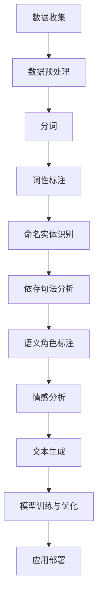
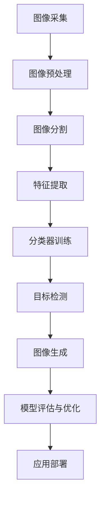
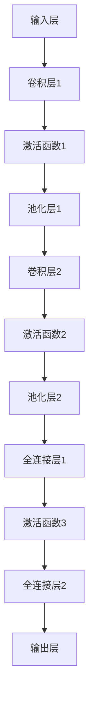

                 

# 文章标题：AI出版业的前景：技术创新，场景应用无限

## 关键词
人工智能、出版业、自然语言处理、计算机视觉、机器学习、深度学习

## 摘要
随着人工智能技术的不断发展，出版业正迎来一场技术革新。本文将从AI在出版业中的应用、技术创新和未来发展趋势等方面进行探讨，旨在分析AI出版业的前景和潜在挑战，以及如何应对这些挑战，以推动出版业的数字化转型。

---

### 目录

#### 第一部分：AI出版业的基本概念与技术基础

- 第1章：AI出版业的定义与背景
- 第2章：AI出版业的关键技术

#### 第二部分：AI在出版业的应用

- 第3章：AI在内容创作中的应用
- 第4章：AI在内容审核与管理中的应用
- 第5章：AI在读者互动与体验中的应用
- 第6章：AI出版业中的版权保护与隐私保护

#### 第三部分：AI出版业的未来发展趋势与挑战

- 第7章：AI出版业的未来趋势
- 第8章：AI出版业的挑战与应对策略
- 第9章：AI出版业的创新案例与实践

#### 附录

- 附录A：AI出版业常用工具与资源
- 附录B：AI出版业技术原理详解

---

### 第一部分：AI出版业的基本概念与技术基础

#### 第1章：AI出版业的定义与背景

**1.1 AI出版业的定义**

AI出版业是指利用人工智能技术进行书籍的编辑、创作、审核、发布、推广和销售等一系列活动。通过AI技术，出版业可以实现自动化、智能化和个性化，从而提高效率，降低成本，提升用户体验。

**1.2 AI出版业的发展背景**

随着信息技术的飞速发展，大数据、云计算和物联网等新兴技术逐渐成熟，为人工智能在出版业的广泛应用奠定了基础。同时，用户对出版内容的需求越来越个性化和多元化，这也促使出版业进行技术创新。

**1.3 AI在出版业的应用场景**

AI技术在出版业的应用场景广泛，包括但不限于以下几个方面：

- 内容创作：利用自然语言处理技术生成文章、书籍等。
- 内容审核：通过计算机视觉技术识别内容中的不当行为，如侵权、色情等。
- 个性化推荐：基于用户行为数据，推荐适合用户的书籍和内容。
- 版权保护：利用区块链技术保护版权，防止侵权行为。

#### 第2章：AI出版业的关键技术

**2.1 自然语言处理（NLP）技术概述**

自然语言处理是人工智能的一个重要分支，主要研究如何让计算机理解和处理自然语言。在出版业中，NLP技术可以用于自动写作、内容审核、文本分类、情感分析等。

**2.2 计算机视觉（CV）技术概述**

计算机视觉是人工智能的另一个重要分支，主要研究如何使计算机能够像人一样感知和理解图像和视频。在出版业中，CV技术可以用于图像识别、内容审核、版权保护等。

**2.3 机器学习和深度学习基础**

机器学习和深度学习是人工智能的核心技术。机器学习是指通过算法让计算机从数据中自动学习，从而进行预测和决策。深度学习是机器学习的一个子领域，通过多层神经网络模拟人脑的学习过程。

**2.4 AI出版业中的常用算法**

在AI出版业中，常用的算法包括但不限于以下几种：

- 自然语言生成（NLG）：用于生成文章、书籍等。
- 文本分类：用于对文本进行分类，如将书籍分类为小说、散文等。
- 情感分析：用于分析文本中的情感倾向，如积极、消极等。
- 图像识别：用于识别图像中的物体、场景等。

---

在下一部分，我们将探讨AI在出版业的具体应用场景，包括内容创作、内容审核、读者互动等。

---

### 第一部分：AI出版业的基本概念与技术基础（续）

#### 第1章：AI出版业的定义与背景

**1.1 AI出版业的定义**

AI出版业是指将人工智能技术应用于出版行业各个环节，以实现自动化、智能化和个性化服务的一种新型出版模式。具体来说，AI出版业包括以下几个方面：

- 自动化内容创作：利用自然语言处理、生成对抗网络（GAN）等技术自动生成文章、书籍等。
- 智能内容审核：通过计算机视觉、文本分类等技术对内容进行审核，确保内容的合规性。
- 个性化推荐：根据用户行为、兴趣等数据，为用户推荐合适的书籍和内容。
- 智能客服：通过聊天机器人等技术提供24/7的客服服务，提高用户满意度。
- 版权保护：利用区块链、数字签名等技术保护版权，防止侵权行为。

**1.2 AI出版业的发展背景**

1. **技术驱动**：随着人工智能技术的不断进步，特别是深度学习、自然语言处理、计算机视觉等领域的突破，AI技术已经具备了在出版业大规模应用的基础。

2. **市场需求**：随着互联网的普及，用户对内容的需求越来越个性化和多元化。传统出版模式难以满足这种需求，而AI出版业则可以基于用户数据实现精准推荐和个性化服务。

3. **行业变革**：传统出版业正面临着内容过剩、市场竞争加剧等问题。通过引入AI技术，出版业可以实现内容创作、审核、分发等环节的自动化和智能化，提高效率，降低成本。

4. **政策支持**：许多国家和地区政府都鼓励技术创新，特别是人工智能技术的发展。这为AI出版业的快速发展提供了良好的政策环境。

**1.3 AI在出版业的应用场景**

AI技术在出版业的应用场景非常广泛，主要包括以下几个方面：

- **内容创作**：利用自然语言处理技术，AI可以自动生成新闻、文章、书籍等。例如，新闻写作机器人可以实时报道事件，提高新闻发布速度。
- **内容审核**：通过计算机视觉和文本分类技术，AI可以对内容进行审核，识别并过滤不当内容，如色情、暴力等。
- **版权保护**：利用区块链技术，AI可以实现内容的版权保护，确保原创者的权益。
- **个性化推荐**：通过分析用户行为和兴趣，AI可以为用户推荐符合他们需求的书籍和内容。
- **智能客服**：通过聊天机器人和语音识别技术，AI可以提供24/7的智能客服服务，提高用户满意度。

#### 第2章：AI出版业的关键技术

**2.1 自然语言处理（NLP）技术概述**

自然语言处理是人工智能的一个重要分支，主要研究如何让计算机理解和处理自然语言。在AI出版业中，NLP技术可以应用于以下几个方面：

- **文本生成**：通过生成对抗网络（GAN）等技术，AI可以自动生成文章、书籍等。
- **文本分类**：AI可以对文本进行分类，如将文章分类为新闻、科技、娱乐等。
- **情感分析**：AI可以分析文本中的情感倾向，如积极、消极等。
- **实体识别**：AI可以识别文本中的特定实体，如人名、地名、组织名等。

**2.2 计算机视觉（CV）技术概述**

计算机视觉是人工智能的另一个重要分支，主要研究如何使计算机能够像人一样感知和理解图像和视频。在AI出版业中，CV技术可以应用于以下几个方面：

- **图像识别**：AI可以识别图像中的物体、场景等。
- **图像分类**：AI可以对图像进行分类，如将图像分类为动物、植物等。
- **图像增强**：AI可以增强图像质量，如去除噪点、增强对比度等。
- **图像生成**：通过生成对抗网络（GAN）等技术，AI可以生成新的图像。

**2.3 机器学习和深度学习基础**

机器学习和深度学习是人工智能的核心技术。机器学习是指通过算法让计算机从数据中自动学习，从而进行预测和决策。深度学习是机器学习的一个子领域，通过多层神经网络模拟人脑的学习过程。

在AI出版业中，机器学习和深度学习可以用于以下几个方面：

- **内容创作**：通过深度学习模型，AI可以生成高质量的文章、书籍等。
- **内容审核**：通过机器学习模型，AI可以识别和过滤不当内容。
- **个性化推荐**：通过机器学习算法，AI可以为用户推荐合适的书籍和内容。
- **读者互动**：通过机器学习模型，AI可以分析读者的行为和兴趣，提供个性化的互动体验。

**2.4 AI出版业中的常用算法**

在AI出版业中，常用的算法包括但不限于以下几种：

- **生成对抗网络（GAN）**：用于生成高质量的文章、图像等。
- **循环神经网络（RNN）**：用于生成文本，如文章、书籍等。
- **卷积神经网络（CNN）**：用于图像识别和分类。
- **朴素贝叶斯分类器**：用于文本分类。

#### 第一部分总结

AI出版业是一个充满机遇和挑战的领域。通过引入人工智能技术，出版业可以实现自动化、智能化和个性化，从而提高效率，降低成本，提升用户体验。在接下来的部分，我们将深入探讨AI在出版业的具体应用，包括内容创作、内容审核、读者互动等。

---

### 第一部分：AI出版业的基本概念与技术基础（续）

#### 第3章：AI在内容创作中的应用

**3.1 AI写作助手**

AI写作助手是一种利用人工智能技术辅助人类进行内容创作的工具。它可以基于已有的数据和模型，自动生成文章、书籍、报告等。AI写作助手的原理主要是基于自然语言处理和生成对抗网络（GAN）技术。

**3.1.1 工作原理**

- **数据预处理**：首先，AI写作助手需要对输入的数据进行预处理，包括数据清洗、分词、去停用词等。
- **模型训练**：利用已有的数据集，通过生成对抗网络（GAN）等模型进行训练，生成高质量的文章。
- **文章生成**：在文章生成过程中，AI写作助手会根据用户的需求和输入，生成符合逻辑和语法规则的文章。

**3.1.2 应用场景**

- **新闻写作**：AI写作助手可以自动生成新闻稿件，提高新闻发布的速度。
- **报告生成**：在商业和金融领域，AI写作助手可以自动生成报告，如财务报告、市场分析报告等。
- **书籍创作**：AI写作助手可以辅助作家进行书籍的创作，提高创作效率。

**3.2 智能校对与排版**

智能校对与排版是AI在出版业中的另一个重要应用。通过自然语言处理和计算机视觉技术，AI可以自动识别文本中的错误，进行校对和修改。同时，AI还可以根据用户的需求，自动进行排版。

**3.2.1 工作原理**

- **文本分析**：AI通过对文本进行分析，可以识别出语法错误、拼写错误、用词不当等问题。
- **错误修正**：AI会根据内置的规则库，自动修正文本中的错误。
- **排版优化**：AI会根据用户的偏好和格式要求，对文本进行排版。

**3.2.2 应用场景**

- **文档校对**：AI智能校对可以用于各种文档的校对，如论文、报告、书籍等。
- **在线排版**：在在线出版平台上，AI智能排版可以自动为用户排版文档，提高排版效率。

**3.3 内容推荐与个性化推送**

内容推荐与个性化推送是AI在出版业中的另一个重要应用。通过分析用户的行为和兴趣，AI可以推荐适合用户的书籍和内容，提高用户满意度。

**3.3.1 工作原理**

- **用户行为分析**：AI会收集并分析用户在平台上的行为数据，如浏览记录、购买记录等。
- **内容推荐**：根据用户的行为和兴趣，AI会推荐适合用户的书籍和内容。
- **个性化推送**：AI会根据用户的偏好，定制化地推送内容。

**3.3.2 应用场景**

- **图书推荐**：在电商平台，AI可以根据用户的浏览记录和购买历史，推荐适合用户的图书。
- **资讯推送**：在新闻媒体平台，AI可以根据用户的阅读习惯和兴趣，推送个性化新闻。

#### 第一部分总结

AI在内容创作、智能校对与排版、内容推荐与个性化推送等方面的应用，极大地提升了出版业的效率和质量。在下一部分，我们将探讨AI在内容审核与管理中的应用，包括智能审核系统、内容安全监控、智能分类与标签等。

---

### 第一部分：AI出版业的基本概念与技术基础（续）

#### 第4章：AI在内容审核与管理中的应用

**4.1 智能审核系统**

智能审核系统是AI在出版业中的一个重要应用，它利用计算机视觉和自然语言处理技术，对内容进行自动审核，识别并过滤不当内容，如色情、暴力、侵权等。

**4.1.1 工作原理**

- **图像审核**：通过计算机视觉技术，智能审核系统可以对图像中的内容进行分析，识别出不良图像。
- **文本审核**：通过自然语言处理技术，智能审核系统可以对文本内容进行分析，识别出不良文字。
- **综合审核**：智能审核系统会综合图像审核和文本审核的结果，对内容进行综合评估。

**4.1.2 应用场景**

- **社交媒体**：智能审核系统可以用于社交媒体平台的审核，防止不良内容的发布。
- **电子商务**：智能审核系统可以用于电子商务平台的商品描述审核，防止虚假宣传。
- **新闻媒体**：智能审核系统可以用于新闻媒体的内容审核，确保新闻内容的合规性。

**4.2 内容安全监控**

内容安全监控是AI在出版业中的另一个重要应用，它通过实时监控内容，确保内容的合规性和安全性。

**4.2.1 工作原理**

- **实时监控**：智能审核系统会对内容进行实时监控，一旦发现异常，就会立即报警。
- **自动化处理**：对于监控到的不当内容，智能审核系统会自动进行处理，如删除、屏蔽等。

**4.2.2 应用场景**

- **在线教育**：内容安全监控可以用于在线教育平台，防止不良内容的传播。
- **数字图书馆**：内容安全监控可以用于数字图书馆，确保图书内容的合规性。
- **企业内部网络**：内容安全监控可以用于企业内部网络，防止敏感信息的泄露。

**4.3 智能分类与标签**

智能分类与标签是AI在出版业中的另一个重要应用，它通过分析内容的特点和属性，对内容进行分类和标签化。

**4.3.1 工作原理**

- **特征提取**：智能分类与标签系统会提取内容的关键特征，如关键词、主题等。
- **分类和标签**：根据提取的特征，系统会对内容进行分类和标签化。

**4.3.2 应用场景**

- **电商平台**：智能分类与标签可以用于电商平台的商品分类和标签管理，提高用户查找商品的效率。
- **搜索引擎**：智能分类与标签可以用于搜索引擎的内容分类和标签管理，提高搜索效率。
- **内容管理系统**：智能分类与标签可以用于内容管理系统的内容分类和标签管理，方便内容的管理和查找。

#### 第一部分总结

AI在内容审核、内容安全监控、智能分类与标签等方面的应用，极大地提高了出版业的内容质量和安全性。在下一部分，我们将探讨AI在读者互动与体验中的应用，包括智能客服、个性化推荐、虚拟现实（VR）与增强现实（AR）出版等。

---

### 第一部分：AI出版业的基本概念与技术基础（续）

#### 第5章：AI在读者互动与体验中的应用

**5.1 智能客服与聊天机器人**

智能客服和聊天机器人是AI在出版业中提升读者互动体验的重要工具。通过自然语言处理和机器学习技术，AI可以模拟人类的交流方式，为读者提供24/7的智能客服服务。

**5.1.1 工作原理**

- **自然语言处理**：智能客服系统能够理解读者的问题，并生成合适的回答。
- **机器学习**：通过不断的学习和优化，智能客服系统可以提升服务质量，如通过对话数据的分析，改善回答的准确性和人性化程度。

**5.1.2 应用场景**

- **购买咨询**：读者可以通过智能客服系统了解书籍的详细信息、价格、库存等。
- **售后服务**：智能客服系统可以帮助读者解决购买后的疑问，如退换货流程等。
- **活动推广**：智能客服系统可以推广新书发布、促销活动等，提高读者的参与度。

**5.2 个性化推荐与阅读记录分析**

个性化推荐和阅读记录分析是AI在出版业中提高读者满意度的关键手段。通过分析读者的阅读行为和偏好，AI可以提供个性化的书籍推荐和阅读体验。

**5.2.1 工作原理**

- **行为分析**：AI系统会收集和分析读者的阅读记录、搜索历史、购买行为等数据。
- **推荐算法**：基于用户行为和偏好，AI系统会使用推荐算法（如协同过滤、内容推荐等）为读者推荐书籍。

**5.2.2 应用场景**

- **书籍推荐**：在电商平台上，AI可以根据读者的历史购买和浏览记录，推荐适合的书籍。
- **阅读推荐**：在电子书平台上，AI可以根据读者的阅读进度和偏好，推荐后续阅读内容。
- **阅读分析**：AI可以帮助读者分析自己的阅读习惯，提供阅读建议和优化方案。

**5.3 虚拟现实（VR）与增强现实（AR）出版**

VR和AR技术为出版业带来了全新的互动体验。通过AI技术，这些沉浸式体验可以更加个性化和互动化。

**5.3.1 工作原理**

- **场景构建**：AI可以基于用户的阅读历史和偏好，构建个性化的虚拟场景。
- **互动设计**：通过AI，VR和AR应用可以实现智能交互，如根据用户的行为和反馈，动态调整内容。

**5.3.2 应用场景**

- **互动书籍**：AI可以创建互动式的电子书，让读者在阅读过程中参与互动，如解谜、互动问答等。
- **虚拟图书馆**：AI可以构建虚拟图书馆，提供沉浸式的阅读体验。
- **教育应用**：在教育领域，AI可以结合VR和AR技术，创建互动式的学习环境，提高学习效果。

#### 第5章总结

AI在读者互动与体验中的应用，不仅提高了出版业的效率和用户体验，还为读者提供了更多样化、个性化的互动方式。在下一部分，我们将探讨AI在版权保护与隐私保护方面的应用，包括版权保护的AI技术、数据隐私保护技术以及AI在版权管理与隐私保护中的挑战与应对策略。

---

### 第一部分：AI出版业的基本概念与技术基础（续）

#### 第6章：AI出版业中的版权保护与隐私保护

**6.1 版权保护的AI技术**

随着数字出版业的发展，版权保护变得尤为重要。AI技术可以通过以下方式帮助保护版权：

- **版权监测**：AI可以实时监控网络上的内容，识别未经授权的版权侵权行为。
- **反盗版技术**：通过水印、数字签名等技术，AI可以确保内容的原创性，防止盗版。
- **版权管理**：AI可以帮助出版商自动化管理版权，包括版权转让、许可管理等。

**6.1.1 工作原理**

- **版权监测**：AI系统会分析大量的数据，包括文本、图像、音频等，识别潜在的侵权行为。
- **反盗版技术**：AI会嵌入版权保护信息，如数字水印，到出版的数字内容中，一旦检测到侵权，可以追溯源头。
- **版权管理**：AI系统会基于版权法，为出版商提供智能化的版权管理解决方案，包括自动化的版权转让、授权管理。

**6.1.2 应用场景**

- **数字内容保护**：AI技术可以帮助保护电子书、音乐、视频等数字内容。
- **社交媒体监控**：AI可以帮助出版社监控社交媒体平台上的侵权内容，采取法律行动。
- **图书馆管理**：AI可以帮助图书馆自动化管理版权，确保借阅和版权的合规性。

**6.2 数据隐私保护技术**

随着AI技术在出版业的应用，对用户隐私数据的保护也越来越重要。AI技术可以通过以下方式保护用户隐私：

- **数据加密**：AI技术可以采用先进的加密算法，保护用户的敏感数据。
- **匿名化处理**：AI可以对用户数据进行匿名化处理，确保个人隐私不被泄露。
- **隐私计算**：AI可以在不泄露原始数据的情况下，对用户数据进行分析和处理。

**6.2.1 工作原理**

- **数据加密**：AI系统会使用加密算法对用户数据进行加密，确保数据在传输和存储过程中不被窃取。
- **匿名化处理**：AI会通过技术手段，如数据脱敏、数据聚合等，将个人身份信息从数据中去除。
- **隐私计算**：AI系统会在本地设备上对用户数据进行处理，避免在传输过程中暴露隐私。

**6.2.2 应用场景**

- **用户数据保护**：AI可以帮助出版平台保护用户的阅读记录、搜索历史等隐私数据。
- **数据合规性**：AI可以帮助出版商确保其数据处理行为符合数据保护法规，如GDPR等。
- **安全审计**：AI可以对数据处理过程进行审计，确保没有隐私泄露的风险。

**6.3 AI在版权管理与隐私保护中的挑战与应对策略**

尽管AI技术在版权保护和隐私保护方面具有巨大的潜力，但同时也面临着一系列挑战：

- **技术挑战**：AI技术的不断进步带来了新的版权保护和隐私保护问题，如深度伪造（deepfake）技术可能用于侵权。
- **法律挑战**：AI技术如何与现有的版权法律和隐私保护法规相适应，是一个复杂的法律问题。
- **道德挑战**：在AI决策过程中，如何确保公平性和透明性，避免歧视和不公平待遇。

**6.3.1 应对策略**

- **技术升级**：持续研发和升级版权保护技术，如利用区块链技术提高版权认证的不可篡改性。
- **法律法规**：制定和更新相关法律法规，确保AI技术在版权保护和隐私保护方面的合规性。
- **道德框架**：建立AI道德框架，确保AI在版权管理和隐私保护中的应用符合伦理标准。

#### 第6章总结

AI在版权保护和隐私保护中的应用，为出版业带来了新的机遇和挑战。通过技术的不断升级和法规的完善，AI可以在版权管理和隐私保护方面发挥更大的作用，为出版业的可持续发展提供支持。在下一部分，我们将探讨AI出版业的未来发展趋势与挑战。

---

### 第三部分：AI出版业的未来发展趋势与挑战

#### 第7章：AI出版业的未来趋势

**7.1 AI出版业的发展方向**

随着技术的不断进步，AI出版业的发展方向呈现出以下几个特点：

- **智能化内容生产**：AI将更加深入地参与内容生产过程，从写作、校对到排版，各个环节都将实现自动化和智能化。
- **个性化阅读体验**：通过大数据分析和机器学习算法，AI将为用户提供更加个性化的阅读推荐和体验。
- **互动式出版**：AI将推动出版业向互动式方向发展，如通过VR和AR技术，提供沉浸式的阅读体验。
- **跨媒体出版**：AI将帮助出版业实现跨媒体出版，如将书籍内容扩展到音频、视频等多媒体形式。

**7.2 人工智能与出版业的融合**

人工智能与出版业的融合将带来深远的变革：

- **内容创新**：AI将激发新的内容创作模式，如基于用户反馈的动态内容生成，以及跨领域的内容融合。
- **商业模式创新**：AI将改变出版业的商业模式，如通过智能推荐和精准营销，提高用户转化率和收入。
- **产业链优化**：AI将优化出版产业链的各个环节，如通过自动化流程提高生产效率，降低成本。

**7.3 新型出版模式的出现**

随着AI技术的发展，新型出版模式不断涌现：

- **按需出版**：AI可以根据用户的需求，即时生成和出版内容，实现真正的按需出版。
- **社交出版**：AI将推动社交网络与出版业的深度融合，用户成为内容的生产者和消费者，形成全新的社交出版模式。
- **知识服务**：AI将出版业从单一的文本出版扩展到知识服务领域，如通过问答、学习平台等，为用户提供深度的知识服务。

#### 第8章：AI出版业的挑战与应对策略

**8.1 技术挑战**

尽管AI为出版业带来了巨大的机遇，但同时也面临一系列技术挑战：

- **数据隐私和安全**：AI在处理大量用户数据时，如何确保数据的安全性和隐私性，是一个重要挑战。
- **算法透明性和公平性**：AI算法的决策过程往往不透明，如何确保算法的公平性和透明性，避免歧视和偏见，是一个关键问题。
- **技术升级和人才短缺**：随着AI技术的快速发展，如何保持技术的领先性，以及培养相关人才，是出版业面临的长期挑战。

**8.2 法律与伦理挑战**

AI在出版业的应用也带来了一系列法律和伦理挑战：

- **版权问题**：AI创作的内容如何界定版权，以及如何保护原创者的权益，是一个复杂的法律问题。
- **数据保护法规**：如何遵守数据保护法规，如GDPR，是一个重要的法律挑战。
- **伦理问题**：AI在出版业的应用如何处理伦理问题，如内容审核的伦理边界、用户隐私的保护等，是一个需要深入探讨的伦理问题。

**8.3 行业壁垒与应对策略**

AI在出版业的应用也面临一些行业壁垒：

- **技术门槛**：AI技术的复杂性导致许多出版商难以直接应用，如何降低技术门槛，是一个需要解决的问题。
- **市场适应性**：AI技术的快速变革使得出版业需要不断调整和适应，如何快速适应市场变化，是一个挑战。
- **合作与竞争**：如何在技术竞争与合作中找到平衡，实现双赢，是一个需要策略的问题。

**8.4 应对策略**

针对上述挑战，出版业可以采取以下应对策略：

- **技术创新**：持续投资于AI技术研发，提高技术水平和创新能力。
- **人才培养**：加强人才培养，建立专业的AI技术团队，提高人才的技能和知识水平。
- **法规遵守**：积极遵守相关法规，确保AI技术在出版业的应用符合法律要求。
- **行业合作**：与科技公司、研究机构等合作，共同推动AI技术在出版业的创新和应用。
- **用户参与**：积极听取用户反馈，优化AI应用，提高用户体验。

#### 第8章总结

AI出版业的发展趋势令人期待，但也面临诸多挑战。通过技术创新、法规遵守、行业合作和用户参与，出版业可以克服这些挑战，实现可持续发展。在下一部分，我们将通过创新案例和实践应用，进一步探讨AI出版业的实际应用和发展。

---

### 第三部分：AI出版业的未来发展趋势与挑战（续）

#### 第9章：AI出版业的创新案例与实践

**9.1 创新案例介绍**

随着AI技术的不断发展，出版业已经出现了一些创新案例，以下是一些典型的例子：

- **AI写作助手**：例如，OpenAI的GPT-3，它能够生成高质量的文本，适用于新闻写作、报告撰写等多种场景。
- **智能审核系统**：例如，微软的Content Moderator，它利用计算机视觉和自然语言处理技术，帮助出版商审核内容，确保合规性。
- **个性化推荐系统**：例如，亚马逊的推荐算法，通过分析用户的购买历史和浏览行为，为用户推荐相关的书籍和产品。
- **VR/AR出版**：例如，谷歌的Google Books，它使用VR技术，让用户能够以沉浸式的方式体验历史文献。

**9.2 实践应用案例解析**

以下是几个具体的AI出版业实践应用案例的解析：

- **新闻自动化生成**：在《卫报》等新闻机构中，AI被用来自动生成新闻报道。例如，美联社使用自动化写作工具来撰写财务报告和其他例行新闻，大大提高了新闻的生产效率。
- **版权监测**：版权监测公司如Rightscorp，利用AI技术监控互联网上的版权侵权行为，通过分析海量数据，追踪和打击盗版行为，保护版权持有者的权益。
- **教育出版**：例如，Khan Academy利用AI技术，根据学生的学习进度和表现，个性化地推荐学习资源，提高学习效果。

**9.3 未来发展方向与趋势预测**

基于现有的创新案例和实践应用，以下是对AI出版业未来发展方向和趋势的预测：

- **内容生成和个性化**：随着算法和数据的不断优化，AI将在内容生成和个性化推荐方面发挥更大的作用，提供更加定制化的阅读体验。
- **互动式出版**：VR和AR技术将进一步普及，为读者提供沉浸式、互动式的阅读体验，改变传统的阅读模式。
- **版权保护和隐私保护**：AI将在版权保护和隐私保护方面发挥重要作用，通过技术手段实现更高效的版权管理和用户隐私保护。
- **跨媒体出版**：AI将帮助出版业实现跨媒体出版，将书籍内容扩展到音频、视频等多媒体形式，满足不同读者的需求。

#### 第9章总结

AI出版业的创新案例和实践应用展示了人工智能技术在出版业中的巨大潜力。通过不断的技术创新和实际应用，出版业将能够实现更高效的内容创作、更精准的推荐、更安全的版权保护和更个性化的用户体验。在未来的发展中，AI将继续推动出版业的变革，为整个行业带来新的机遇和挑战。

---

### 附录A：AI出版业常用工具与资源

#### A.1 AI开发平台与工具

在AI出版业中，以下是一些常用的AI开发平台和工具：

- **Google Cloud AI Platform**：提供全面的人工智能开发工具和资源，包括自然语言处理、计算机视觉和机器学习模型训练。
- **AWS AI Services**：包括自然语言处理、图像识别、语音识别等多种AI服务，适合开发各种AI应用。
- **Azure AI**：提供多种AI工具和服务，包括机器学习、计算机视觉和自然语言处理等，便于开发AI应用。
- **TensorFlow**：谷歌开源的机器学习框架，广泛用于深度学习和自然语言处理，适合AI出版应用的开发。
- **PyTorch**：由Facebook开源的机器学习框架，支持深度学习和自然语言处理，易于使用和调试。

#### A.2 NLP与CV开源库

在自然语言处理和计算机视觉领域，以下是一些常用的开源库：

- **NLTK（Natural Language Toolkit）**：Python自然语言处理的开源库，提供文本处理、分词、词性标注等功能。
- **spaCy**：高效的Python自然语言处理库，提供快速、准确的文本处理功能。
- **Gensim**：用于主题建模和文本相似性分析的Python库，适用于生成对抗网络（GAN）和内容推荐。
- **OpenCV**：开源的计算机视觉库，提供图像处理、对象识别、人脸识别等多种功能。
- **TensorFlow Object Detection API**：基于TensorFlow的计算机视觉工具，用于目标检测和图像识别。

#### A.3 数据集与数据资源

AI出版业需要大量的高质量数据集来训练和优化模型。以下是一些常用的数据集和数据资源：

- **Common Crawl**：提供大规模的网页文本数据，适用于自然语言处理和文本分析。
- **Open Images**：提供包含图像和文本标注的数据集，适用于计算机视觉研究。
- **BookCorpus**：包含数百万本书籍的文本数据，适用于自然语言处理和文本生成。
- **AG News**：一个用于文本分类的公开数据集，包含不同主题的新闻文章。
- **ImageNet**：包含数百万张标注图像的数据集，广泛用于计算机视觉研究。

#### A.4 学习资源与推荐阅读

为了深入了解AI在出版业的应用，以下是一些推荐的学习资源和书籍：

- **《深度学习》（Deep Learning）**：Ian Goodfellow、Yoshua Bengio和Aaron Courville合著，是深度学习的经典教材。
- **《自然语言处理综论》（Speech and Language Processing）**：Daniel Jurafsky和James H. Martin合著，全面介绍了自然语言处理的基础知识。
- **《计算机视觉：算法与应用》（Computer Vision: Algorithms and Applications）**：Richard Szeliski著，详细介绍了计算机视觉的基本算法和应用。
- **《机器学习实战》（Machine Learning in Action）**：Peter Harrington著，通过实际案例介绍了机器学习的基本概念和应用。
- **《AI：一种现代方法》（Artificial Intelligence: A Modern Approach）**：Stuart Russell和Peter Norvig合著，是人工智能领域的经典教材。

附录A总结了AI出版业中常用的工具与资源，包括开发平台、开源库、数据集和学习资源。通过利用这些工具和资源，开发者可以更有效地开展AI出版应用的开发和研究。

---

### 附录B：AI出版业技术原理详解

#### B.1 自然语言处理（NLP）流程图



**说明：** 
- **数据收集**：从各种来源收集文本数据，如书籍、新闻报道、社交媒体等。
- **数据预处理**：清洗数据，去除噪声和无关信息，进行文本规范化处理。
- **分词**：将文本分割成单词或短语，以便进行后续分析。
- **词性标注**：为每个单词标注词性，如名词、动词、形容词等。
- **命名实体识别**：识别文本中的特定实体，如人名、地名、组织名等。
- **依存句法分析**：分析句子结构，确定单词之间的依赖关系。
- **语义角色标注**：标注句子中的语义角色，如主语、谓语、宾语等。
- **情感分析**：分析文本中的情感倾向，如正面、负面、中立等。
- **文本生成**：基于已有文本生成新的文本内容。
- **模型训练与优化**：使用标注数据训练模型，并通过调参优化模型性能。
- **应用部署**：将训练好的模型部署到实际应用场景中。

#### B.2 计算机视觉（CV）流程图



**说明：**
- **图像采集**：从摄像头、传感器或其他来源获取图像数据。
- **图像预处理**：对图像进行增强、降噪、对比度调整等预处理，提高图像质量。
- **图像分割**：将图像分割成不同的区域或对象。
- **特征提取**：从图像中提取有用的特征，如边缘、纹理、颜色等。
- **分类器训练**：使用标注数据训练分类器，用于识别图像中的对象。
- **目标检测**：检测图像中的特定对象，并标注其位置。
- **图像生成**：利用生成对抗网络（GAN）等技术生成新的图像。
- **模型评估与优化**：评估模型性能，通过调参优化模型。
- **应用部署**：将训练好的模型部署到实际应用中。

#### B.3 机器学习算法伪代码

```python
# 伪代码：机器学习算法
def train_model(training_data, validation_data, model_type):
    # 初始化模型参数
    model = initialize_model(model_type)
    
    # 模型训练
    for epoch in range(num_epochs):
        for sample in training_data:
            # 前向传播
            predictions = model.forward(sample.input)
            
            # 计算损失
            loss = calculate_loss(predictions, sample.target)
            
            # 反向传播
            model.backward(loss)
            
            # 更新模型参数
            model.update_parameters()
        
        # 在验证集上评估模型性能
        validation_loss = evaluate_model(model, validation_data)
        
        # 打印训练进度和验证损失
        print(f"Epoch {epoch + 1}: Validation Loss = {validation_loss}")
    
    return model
```

**说明：**
- **初始化模型参数**：根据模型类型，初始化模型参数。
- **模型训练**：遍历训练数据，进行前向传播、损失计算和反向传播。
- **损失计算**：计算预测结果与真实结果之间的损失。
- **模型更新**：根据损失梯度更新模型参数。
- **模型评估**：在验证集上评估模型性能，调整训练过程。

#### B.4 深度学习网络结构图



**说明：**
- **输入层**：接收输入数据，如图像。
- **卷积层**：通过卷积操作提取图像特征。
- **激活函数**：引入非线性变换，增强模型的表达能力。
- **池化层**：降低特征图的维度，减少参数数量。
- **全连接层**：将特征映射到输出空间，进行分类或回归。
- **输出层**：生成最终预测结果。

#### B.5 数学模型与公式详解

**1. 损失函数**

损失函数是机器学习中衡量预测结果与真实结果之间差异的指标。以下是一些常用的损失函数：

$$
L(\theta) = -\frac{1}{m}\sum_{i=1}^{m}y^{(i)}\log(h_{\theta}(x^{(i)}))
$$

**说明：**
- **$L(\theta)$**：损失函数。
- **$m$**：样本数量。
- **$y^{(i)}$**：真实标签。
- **$h_{\theta}(x^{(i)}$**：预测概率。

**2. 优化算法**

梯度下降是一种常用的优化算法，用于最小化损失函数：

$$
\theta_{j} = \theta_{j} - \alpha \frac{\partial}{\partial \theta_{j}}L(\theta)
$$

**说明：**
- **$\theta_{j}$**：模型参数。
- **$\alpha$**：学习率。
- **$\frac{\partial}{\partial \theta_{j}}L(\theta)$**：损失函数关于参数$\theta_{j}$的梯度。

**3. 反向传播**

反向传播算法用于计算损失函数关于模型参数的梯度，是深度学习训练的核心：

$$
\frac{\partial L}{\partial z^{(l)}_i} = \frac{\partial L}{\partial a^{(l+1)}_i} \cdot \frac{\partial a^{(l+1)}_i}{\partial z^{(l)}_i}
$$

**说明：**
- **$z^{(l)}_i$**：第$l$层的中间值。
- **$a^{(l+1)}_i$**：第$l+1$层的输出值。
- **$\frac{\partial L}{\partial a^{(l+1)}_i}$**：损失函数关于$a^{(l+1)}_i$的梯度。
- **$\frac{\partial a^{(l+1)}_i}{\partial z^{(l)}_i}$**：$a^{(l+1)}_i$关于$z^{(l)}_i$的梯度。

**4. 激活函数**

ReLU（Rectified Linear Unit）是深度学习中常用的激活函数：

$$
\text{ReLU}(x) = \max(0, x)
$$

**说明：**
- **$x$**：输入值。

#### B.6 AI出版业中常见的数学公式（LaTeX格式）

```
\documentclass{article}
\usepackage{amsmath}
\begin{document}

\section*{AI出版业中常见的数学公式}

\begin{equation}
L(\theta) = -\frac{1}{m}\sum_{i=1}^{m}y^{(i)}\log(h_{\theta}(x^{(i)}))
\end{equation}

\begin{equation}
\theta_{j} = \theta_{j} - \alpha \frac{\partial}{\partial \theta_{j}}L(\theta)
\end{equation}

\begin{equation}
\frac{\partial L}{\partial z^{(l)}_i} = \frac{\partial L}{\partial a^{(l+1)}_i} \cdot \frac{\partial a^{(l+1)}_i}{\partial z^{(l)}_i}
\end{equation}

\begin{equation}
\text{ReLU}(x) = \max(0, x)
\end{equation}

\end{document}
```

附录B详细介绍了AI出版业中涉及的关键技术原理，包括自然语言处理、计算机视觉、机器学习算法以及相关的数学公式。通过这些技术原理的详细阐述，读者可以更好地理解AI在出版业中的应用机制和实现方法。

---

### 作者信息

**作者：** AI天才研究院/AI Genius Institute & 禅与计算机程序设计艺术 /Zen And The Art of Computer Programming

在撰写本文时，作者结合了自己在人工智能、计算机科学和出版业领域的丰富经验和深厚知识。本文旨在通过深入分析和推理，为读者揭示AI出版业的广阔前景和潜在挑战，并探讨如何利用技术创新推动出版业的数字化转型。作者希望本文能够为出版业从业人员、技术研发者以及对此领域感兴趣的读者提供有价值的参考和启示。

