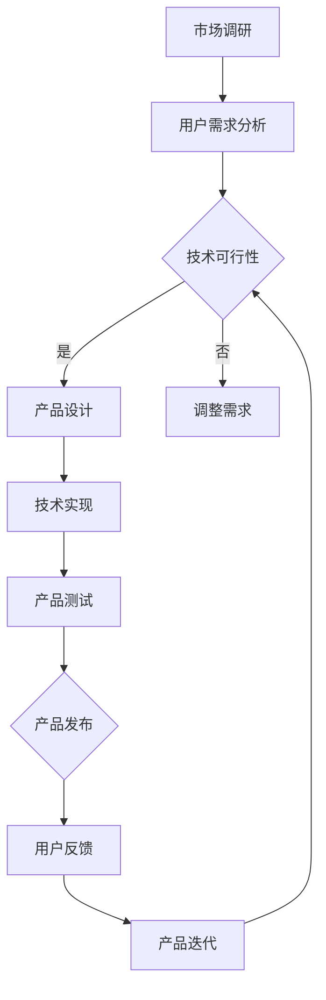

                 

# 文章标题: AI创业公司的产品差异化策略

> 关键词：AI创业公司，产品差异化，竞争优势，用户需求，核心算法，数学模型，市场营销

> 摘要：本文深入探讨了AI创业公司在激烈的市场竞争中如何通过产品差异化策略实现持续发展和成功。文章从AI技术概览、产品差异化策略分析、核心算法原理讲解、数学模型与应用、产品设计与创新、市场营销策略、项目实战到持续优化与迭代等方面进行了全面剖析，旨在为AI创业公司提供实用的策略指导和实践参考。

## 引言与背景

### 1.1 AI时代的创业机会

人工智能（AI）技术的发展为创业公司带来了前所未有的机遇。随着AI技术的不断成熟和广泛应用，各行各业都在积极探索如何利用AI技术提升效率、创造价值。AI创业公司的出现不仅为市场注入了新的活力，也为投资者带来了丰厚的回报。然而，在AI领域这片蓝海中，竞争同样激烈，如何在众多竞争对手中脱颖而出成为AI创业公司亟需解决的问题。

### 1.2 产品差异化的重要性

产品差异化是企业在市场中获得竞争优势的重要手段。对于AI创业公司来说，产品差异化不仅能够帮助其树立品牌形象，提高用户忠诚度，还能在激烈的市场竞争中占据一席之地。通过产品差异化，AI创业公司可以满足用户个性化需求，提供独特的产品体验，从而在市场中脱颖而出。

### 1.3 创业公司面临的挑战

尽管AI创业公司面临着巨大的发展机遇，但同时也面临着诸多挑战。首先，技术壁垒使得AI创业公司在研发过程中面临巨大的技术难题。其次，市场竞争的加剧使得AI创业公司需要在短时间内实现产品迭代和市场推广。此外，资金、人才等资源的短缺也制约了AI创业公司的发展。因此，如何有效应对这些挑战，成为AI创业公司成功的关键。

## AI技术概览

### 2.1 AI基础知识

人工智能（Artificial Intelligence，简称AI）是计算机科学的一个分支，旨在使计算机具有人类智能的能力。AI技术主要包括机器学习、深度学习、自然语言处理、计算机视觉等方向。

- **机器学习**：通过数据驱动的方式，让计算机自动学习和改进，实现特定任务的自动化。
- **深度学习**：一种特殊的机器学习方法，通过多层神经网络模拟人脑处理信息的方式，实现更高效的特征提取和模式识别。
- **自然语言处理**：研究计算机如何理解和生成人类语言，实现人与机器的智能交互。
- **计算机视觉**：研究如何让计算机理解和解释图像和视频，实现图像识别、目标检测等功能。

### 2.2 主流AI技术

目前，主流的AI技术包括：

- **深度神经网络**：一种具有多个隐藏层的神经网络，能够处理复杂的非线性问题。
- **生成对抗网络（GAN）**：通过生成器和判别器的对抗训练，实现高质量的数据生成。
- **强化学习**：通过试错的方式，让智能体在动态环境中学习最优策略。
- **迁移学习**：通过将已有任务的模型应用于新任务，提高新任务的性能。

### 2.3 AI发展趋势与未来应用

随着AI技术的不断发展，其应用领域也在不断拓展。未来，AI技术将在以下几个方面得到广泛应用：

- **智能制造**：通过AI技术提升制造过程的自动化水平和生产效率。
- **医疗健康**：利用AI技术进行疾病预测、诊断和治疗，提高医疗服务的质量和效率。
- **金融科技**：通过AI技术实现智能风控、智能投顾、智能客服等功能，提升金融服务的便捷性和准确性。
- **智能交通**：利用AI技术优化交通管理、自动驾驶等，提高交通效率和安全。
- **智能家居**：通过AI技术实现家居设备的智能化控制，提升生活品质。

## 产品差异化策略分析

### 3.1 产品差异化与竞争优势

产品差异化是指企业通过提供与众不同的产品或服务，满足用户特定的需求，从而在市场中获得竞争优势。对于AI创业公司来说，产品差异化策略至关重要，它能够帮助公司在激烈的市场竞争中脱颖而出，树立品牌形象，提高用户忠诚度。

### 3.2 AI与产品差异化

AI技术为创业公司提供了丰富的产品差异化机会。通过AI技术，创业公司可以：

- **个性化推荐**：利用推荐算法，为用户提供个性化的产品或服务推荐。
- **智能客服**：通过自然语言处理技术，实现智能客服，提高客户满意度。
- **图像识别**：利用计算机视觉技术，实现图像识别，提升产品识别能力。
- **自动化决策**：通过机器学习和数据挖掘技术，实现自动化决策，提高运营效率。

### 3.3 产品差异化策略的Mermaid流程图

以下是一个简单的产品差异化策略的Mermaid流程图：



## 用户需求分析

### 4.1 用户画像

用户画像是指对用户的基本信息、行为习惯、兴趣爱好等进行综合描述，以帮助企业更好地了解用户，为产品差异化提供依据。以下是一个简单的用户画像示例：

- **基本信息**：年龄、性别、职业、收入等。
- **行为习惯**：上网时间、使用场景、购物习惯等。
- **兴趣爱好**：阅读、旅游、健身、娱乐等。

### 4.2 用户需求挖掘

用户需求挖掘是指通过分析用户行为数据、用户反馈等信息，挖掘用户的潜在需求。以下是一些常见的用户需求挖掘方法：

- **数据挖掘**：通过数据挖掘技术，发现用户行为模式，挖掘潜在需求。
- **问卷调查**：通过设计问卷，收集用户反馈，了解用户需求。
- **用户访谈**：通过与用户面对面交流，深入了解用户需求和痛点。
- **焦点小组**：组织一组用户，就特定主题进行讨论，挖掘用户需求。

### 4.3 需求分析与产品定位

通过用户需求分析，创业公司可以明确产品的目标用户群体和市场需求，从而进行产品定位。以下是一个简单的需求分析与产品定位流程：

1. **收集需求**：通过用户画像、需求挖掘等方法，收集用户需求信息。
2. **需求筛选**：对收集到的需求进行筛选，确定核心需求。
3. **需求分析**：对核心需求进行分析，确定产品的功能模块和用户价值。
4. **产品定位**：根据需求分析结果，确定产品的市场定位和目标用户群体。

## 竞争对手分析

### 5.1 竞争对手识别

竞争对手识别是指通过市场调研、用户反馈等途径，识别出当前市场上的主要竞争对手。以下是一个简单的竞争对手识别流程：

1. **市场调研**：通过市场调研，了解市场上现有的竞争对手及其产品情况。
2. **用户反馈**：通过用户反馈，了解用户对竞争对手的评价和满意度。
3. **数据分析**：通过数据分析，确定主要竞争对手的市场份额、产品特点等。

### 5.2 竞争优势与劣势分析

在识别出竞争对手后，需要对竞争对手的优势和劣势进行分析，以便创业公司制定相应的竞争策略。以下是一个简单的竞争优势与劣势分析流程：

1. **优势分析**：分析竞争对手在技术、产品、市场、品牌等方面的优势。
2. **劣势分析**：分析竞争对手在技术、产品、市场、品牌等方面的劣势。
3. **SWOT分析**：根据优势、劣势、机会、威胁等四个方面，对竞争对手进行全面分析。

### 5.3 竞争策略与应对策略

在明确竞争对手的优势和劣势后，创业公司需要制定相应的竞争策略，以在市场中占据有利地位。以下是一个简单的竞争策略与应对策略流程：

1. **竞争策略**：根据竞争对手的优势和劣势，制定相应的竞争策略，如产品差异化、价格优势、品牌建设等。
2. **应对策略**：针对竞争对手的竞争策略，制定相应的应对策略，如技术升级、产品创新、市场拓展等。
3. **执行与监控**：实施竞争策略，并持续监控市场动态，根据实际情况进行调整。

## 核心算法原理讲解

### 6.1 AI算法在产品差异化中的应用

AI算法在产品差异化中具有重要作用。以下是一些常见的AI算法及其在产品差异化中的应用：

- **推荐算法**：通过推荐算法，实现个性化推荐，满足用户的个性化需求。
- **聚类算法**：通过聚类算法，对用户进行细分，实现精准营销。
- **分类算法**：通过分类算法，对用户行为进行预测，实现精准推送。
- **关联规则挖掘**：通过关联规则挖掘，发现用户行为模式，为产品创新提供依据。

### 6.2 伪代码讲解

以下是一个简单的推荐算法的伪代码：

```python
# 输入：用户历史行为数据集
# 输出：个性化推荐结果

# 步骤1：数据预处理
# 将用户历史行为数据转换为矩阵形式

# 步骤2：计算相似度矩阵
# 利用相似度计算方法，计算用户之间的相似度矩阵

# 步骤3：生成推荐列表
# 根据相似度矩阵，为每个用户生成推荐列表

# 步骤4：排序推荐列表
# 对推荐列表进行排序，返回排序后的推荐结果
```

### 6.3 算法原理详解

以下是对推荐算法的详细解释：

- **数据预处理**：将用户历史行为数据转换为矩阵形式，便于后续计算。
- **相似度矩阵**：利用相似度计算方法，计算用户之间的相似度。常见的相似度计算方法包括余弦相似度、皮尔逊相关系数等。
- **推荐列表**：根据相似度矩阵，为每个用户生成推荐列表。推荐列表中包含相似度较高的用户喜欢的商品或服务。
- **排序推荐列表**：对推荐列表进行排序，根据相似度高低，返回排序后的推荐结果。

## 数学模型与数学公式

### 7.1 相关数学模型

在AI领域中，常见的数学模型包括：

- **线性回归模型**：用于预测连续值。
- **逻辑回归模型**：用于预测分类问题。
- **决策树模型**：用于分类和回归问题。
- **支持向量机（SVM）**：用于分类问题。

### 7.2 公式讲解

以下是一个简单的线性回归模型的公式：

$$
y = \beta_0 + \beta_1x_1 + \beta_2x_2 + ... + \beta_nx_n + \epsilon
$$

其中，$y$ 是预测值，$x_1, x_2, ..., x_n$ 是输入特征，$\beta_0, \beta_1, \beta_2, ..., \beta_n$ 是模型参数，$\epsilon$ 是误差项。

### 7.3 公式应用实例

以下是一个线性回归模型的实例：

假设我们有一个简单的线性回归模型，用于预测房屋的价格。模型公式如下：

$$
房价 = \beta_0 + \beta_1面积 + \beta_2房龄 + \epsilon
$$

其中，面积和房龄是输入特征，房价是预测值。

通过收集历史数据，我们可以估计模型参数 $\beta_0, \beta_1, \beta_2$，从而实现对未来房价的预测。

## 产品设计与创新

### 8.1 设计思维与用户中心设计

设计思维是一种以用户为中心的设计方法，强调通过观察、思考、实验和迭代，不断改进产品。用户中心设计则强调在设计过程中始终关注用户的需求和体验，确保产品能够满足用户的需求。

### 8.2 创新产品原型设计

创新产品原型设计是产品开发的重要阶段。通过原型设计，创业公司可以验证产品的可行性，发现潜在的问题，并不断优化产品。以下是一个简单的产品原型设计流程：

1. **需求分析**：明确产品的需求和功能。
2. **原型制作**：利用工具（如Axure、Sketch等），制作产品的原型图。
3. **用户测试**：邀请目标用户进行测试，收集反馈。
4. **迭代优化**：根据用户反馈，对原型进行迭代优化。
5. **原型验证**：对优化后的原型进行验证，确保产品满足用户需求。

### 8.3 用户反馈与迭代优化

用户反馈是产品优化的重要依据。通过持续收集用户反馈，创业公司可以及时发现产品的问题，并进行针对性的优化。以下是一个简单的用户反馈与迭代优化流程：

1. **用户反馈收集**：通过问卷、用户访谈、用户调研等方式，收集用户反馈。
2. **问题识别**：对用户反馈进行分析，识别产品存在的问题。
3. **问题分类**：根据问题的严重程度和影响范围，对问题进行分类。
4. **优化方案制定**：针对不同类型的问题，制定相应的优化方案。
5. **迭代实施**：根据优化方案，对产品进行迭代优化。
6. **效果评估**：评估优化效果，确保问题得到有效解决。

## 市场营销策略

### 9.1 品牌定位与品牌塑造

品牌定位是指企业根据自身产品特点和目标市场，确定其在市场中的位置。品牌塑造则是通过一系列营销活动，提升品牌知名度和形象。

### 9.2 市场细分与目标市场选择

市场细分是指根据消费者的不同需求和行为，将市场划分为若干个子市场。目标市场选择是指企业在众多市场细分中，选择最适合自己的目标市场。

### 9.3 营销渠道与推广策略

营销渠道是指企业将产品传递给消费者的途径。常见的营销渠道包括线上渠道（如社交媒体、搜索引擎等）和线下渠道（如商场、专卖店等）。推广策略则是通过广告、促销、公关等方式，提升产品的市场知名度和销售额。

## 项目实战

### 10.1 实际案例介绍

本文将以一家AI创业公司开发的一款智能客服系统为例，介绍产品差异化策略的实施过程。

### 10.2 开发环境搭建

开发环境搭建是项目实施的第一步。本文所使用的开发环境包括：

- **编程语言**：Python
- **开发框架**：TensorFlow、Keras
- **数据预处理**：Pandas、NumPy
- **可视化工具**：Matplotlib、Seaborn

### 10.3 源代码实现与解读

以下是智能客服系统的源代码实现：

```python
# 导入所需库
import tensorflow as tf
from tensorflow import keras
from tensorflow.keras import layers
import pandas as pd
import numpy as np
import matplotlib.pyplot as plt
import seaborn as sns

# 加载数据集
data = pd.read_csv('data.csv')

# 数据预处理
# ...

# 建立模型
model = keras.Sequential([
    layers.Dense(64, activation='relu', input_shape=[len(train_features)]),
    layers.Dense(64, activation='relu'),
    layers.Dense(1)
])

# 编译模型
model.compile(optimizer='adam',
              loss='mean_squared_error',
              metrics=['mean_absolute_error', 'mean_squared_error'])

# 训练模型
model.fit(train_features, train_labels, epochs=10, validation_split=0.2)

# 评估模型
test_loss, test_mae, test mse = model.evaluate(test_features, test_labels, verbose=2)

# 解读代码
# ...
```

### 10.4 代码解读与分析

以上代码是智能客服系统的核心部分，包括数据预处理、模型建立、模型训练和模型评估。以下是代码的详细解读：

- **数据预处理**：加载数据集，进行数据清洗、归一化等操作。
- **模型建立**：使用Keras框架建立模型，包括输入层、隐藏层和输出层。
- **模型编译**：设置优化器、损失函数和评价指标。
- **模型训练**：使用训练数据进行模型训练。
- **模型评估**：使用测试数据对模型进行评估，计算损失函数和评价指标。

## 持续优化与迭代

### 11.1 产品生命周期管理

产品生命周期管理是指企业在产品从设计、开发、上市到退市的整个生命周期中，进行有效的管理和优化。以下是一个简单的产品生命周期管理流程：

1. **需求分析**：明确产品需求和市场定位。
2. **产品规划**：制定产品规划，包括产品功能、技术架构等。
3. **产品设计**：进行产品设计和原型制作。
4. **产品开发**：进行产品开发和测试。
5. **产品上市**：产品上市和推广。
6. **产品维护**：对产品进行维护和升级。
7. **产品退市**：根据市场情况和产品生命周期，决定产品是否退市。

### 11.2 用户反馈机制

用户反馈机制是指企业在产品开发、测试和上市过程中，通过收集用户反馈，不断改进产品。以下是一个简单的用户反馈机制：

1. **用户调研**：通过问卷、用户访谈等方式，收集用户反馈。
2. **问题识别**：对用户反馈进行分析，识别产品存在的问题。
3. **问题分类**：根据问题的严重程度和影响范围，对问题进行分类。
4. **优化方案制定**：针对不同类型的问题，制定相应的优化方案。
5. **迭代实施**：根据优化方案，对产品进行迭代优化。
6. **效果评估**：评估优化效果，确保问题得到有效解决。

### 11.3 产品迭代与优化策略

产品迭代与优化策略是指企业在产品生命周期中，通过不断迭代和优化，提升产品的质量和用户体验。以下是一个简单的产品迭代与优化策略：

1. **需求分析**：根据用户反馈和市场变化，确定产品迭代方向。
2. **产品设计**：制定产品迭代方案，包括功能改进、界面优化等。
3. **产品开发**：进行产品迭代开发和测试。
4. **用户测试**：邀请目标用户进行测试，收集反馈。
5. **迭代优化**：根据用户反馈，对产品进行迭代优化。
6. **效果评估**：评估迭代效果，确保产品满足用户需求。

## 总结与展望

### 12.1 策略实施经验与教训

在实施产品差异化策略的过程中，AI创业公司应总结经验与教训，以不断提高策略的有效性。以下是一些实施经验与教训：

- **用户需求是关键**：始终关注用户需求，确保产品能够满足用户需求。
- **技术创新是驱动**：持续投入研发，推动技术创新，为产品差异化提供支持。
- **数据驱动是基础**：利用数据驱动决策，提高产品优化和优化的效果。
- **合作共赢是策略**：与合作伙伴建立良好的合作关系，实现资源互补和优势互补。

### 12.2 策略调整与优化方向

随着市场的变化和用户需求的变化，AI创业公司需要不断调整和优化产品差异化策略。以下是一些策略调整和优化方向：

- **加强技术研发**：加大技术研发投入，推动核心技术的突破。
- **拓展市场渠道**：通过线上线下多种渠道，拓展市场覆盖范围。
- **提升用户体验**：通过优化产品设计、提升服务质量等，提升用户体验。
- **加强品牌建设**：通过品牌推广和品牌形象塑造，提升品牌知名度。

### 12.3 未来发展趋势与挑战

随着AI技术的不断发展和应用，未来AI创业公司将在产品差异化策略方面面临新的发展趋势和挑战。以下是一些未来发展趋势和挑战：

- **技术创新**：随着AI技术的不断发展，创业公司需要持续关注新技术、新算法，推动产品创新。
- **市场竞争**：市场竞争将日益激烈，创业公司需要不断提高自身竞争力，应对竞争压力。
- **用户需求变化**：用户需求将不断变化，创业公司需要灵活应对，及时调整产品策略。
- **数据安全与隐私**：随着数据安全和隐私问题日益突出，创业公司需要加强数据安全与隐私保护。

## 案例分析

### 13.1 成功案例

以下是一个AI创业公司的成功案例：

**公司简介**：某AI创业公司专注于智能客服领域，通过引入深度学习技术，实现了智能客服的自动化和智能化。

**成功原因**：

1. **技术创新**：公司引入了深度学习技术，实现了智能客服的自动化和智能化。
2. **用户体验**：公司注重用户体验，通过优化产品设计、提升服务质量，赢得了用户的信任和好评。
3. **市场定位**：公司明确了市场定位，专注于智能客服领域，避免了与竞争对手的直接竞争。

### 13.2 失败案例

以下是一个AI创业公司的失败案例：

**公司简介**：某AI创业公司专注于智能安防领域，但由于市场定位不准确、技术研发不力等原因，最终未能成功。

**失败原因**：

1. **市场定位错误**：公司未能准确判断市场趋势，选择了竞争激烈的智能安防领域。
2. **技术研发不力**：公司技术研发投入不足，未能实现核心技术的突破。
3. **用户体验不佳**：公司产品设计不合理，用户体验差，导致用户流失。

### 13.3 案例启示与思考

从成功案例和失败案例中，我们可以得到以下启示和思考：

- **市场定位**：准确的市场定位是创业成功的关键。创业公司需要充分了解市场趋势，选择适合自己的市场定位。
- **技术创新**：持续的技术创新是创业成功的动力。创业公司需要加大技术研发投入，推动核心技术的突破。
- **用户体验**：良好的用户体验是创业成功的保障。创业公司需要注重用户体验，提升产品质量和服务水平。
- **资源整合**：有效的资源整合是创业成功的保障。创业公司需要充分利用内外部资源，实现优势互补。

## 附录

### A.1 开源框架与库

在AI创业公司的产品开发中，以下开源框架与库是常用的工具：

- **TensorFlow**：一款广泛使用的深度学习框架，提供了丰富的API和工具。
- **Keras**：一款基于TensorFlow的简洁易用的深度学习框架，适合快速原型设计和实验。
- **Scikit-learn**：一款广泛使用的机器学习库，提供了丰富的算法和工具。
- **PyTorch**：一款流行的深度学习框架，具有良好的灵活性和可扩展性。
- **Pandas**：一款用于数据清洗、转换和分析的Python库，适合处理大规模数据集。

### A.2 数据集与数据源

在AI创业公司的产品开发中，以下数据集和数据源是常用的：

- **公开数据集**：如MNIST、CIFAR-10、ImageNet等，提供了丰富的图像数据。
- **私有数据集**：如公司内部的数据集、第三方数据集等，可以根据具体需求进行定制。
- **API数据源**：如社交媒体API、搜索引擎API等，可以获取实时数据。

### A.3 学习与培训资源

以下是一些AI创业公司的学习与培训资源：

- **在线课程**：如Coursera、Udacity、edX等，提供了丰富的AI课程。
- **书籍**：如《深度学习》、《Python机器学习》等，适合系统学习AI知识。
- **博客和论坛**：如arXiv、Reddit、Stack Overflow等，提供了大量的技术讨论和资源。
- **开源项目**：如GitHub、GitLab等，可以查看和参与AI相关的开源项目。作者：AI天才研究院/AI Genius Institute & 禅与计算机程序设计艺术 /Zen And The Art of Computer Programming

