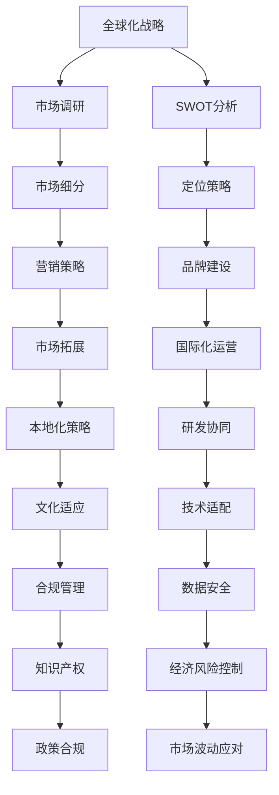

                 

### 文章标题: AI创业公司的全球化之路：本土优势与国际视野兼备

### 关键词：AI创业、全球化战略、本土优势、国际视野、市场拓展、技术创新、产业协同

### 摘要：
本文旨在探讨AI创业公司在全球化背景下的成功之路。在全球化趋势下，AI创业公司如何结合本土优势与国际视野，制定并实施有效的全球化战略，以实现市场的国际化拓展。本文将分步骤详细分析全球化的战略背景、全球化战略的规划与实施、全球化技术与基础设施的建设、本土优势与国际视野的结合、成功案例与经验分享、全球化战略的挑战与应对，以及未来全球化趋势的展望。通过这一系列分析，本文希望为AI创业公司提供有价值的参考和指导。

### 第一部分：全球化的战略背景与理论基础

#### 第1章：全球化趋势与AI创业机会

**1.1 全球化背景下的AI发展**

全球化是一个不可逆转的趋势，尤其在数字技术和互联网的推动下，世界变得更加紧密和互联。全球化不仅改变了经济活动的模式，也为AI技术的应用和传播提供了广阔的舞台。AI创业公司在全球化背景下面临着前所未有的发展机遇：

1. **跨国技术合作与交流**：全球化促进了各国之间的技术合作与交流，AI创业公司可以借助全球科研资源和合作伙伴，加速技术创新和应用。
2. **跨国市场拓展**：全球化使得全球市场更加一体化，为AI创业公司提供了丰富的市场机会，特别是在新兴市场国家，AI技术有着广泛的应用前景。
3. **跨国资本流动**：全球化背景下，资本流动更加自由，为AI创业公司提供了充足的资金支持，有助于公司的快速发展。

**全球化和数字化浪潮对AI创业的影响**

全球化和数字化浪潮对AI创业公司的影响主要体现在以下几个方面：

1. **市场需求多元化**：全球化带来了多元化的市场需求，AI创业公司需要具备灵活的市场适应能力，以满足不同地区和文化的需求。
2. **竞争加剧**：全球化使得竞争更加激烈，AI创业公司需要具备强大的竞争力，才能在激烈的市场环境中脱颖而出。
3. **技术创新加速**：全球化促进了技术创新的加速，AI创业公司需要不断跟进最新的技术动态，保持技术领先优势。

**全球市场融合，AI技术的跨国应用**

全球市场融合为AI技术的跨国应用提供了有力支持。随着全球贸易和投资的自由化，AI技术在各个国家和地区得到了广泛应用：

1. **跨国企业应用**：跨国企业利用AI技术提升运营效率，如通过AI算法优化供应链管理、客户关系管理、市场营销等。
2. **政府机构应用**：政府机构利用AI技术提升治理能力，如通过AI算法进行公共安全监控、智慧城市建设等。
3. **创新创业应用**：在创新创业领域，AI技术为创业者提供了丰富的应用场景，如通过AI算法开发智能医疗、智能金融、智能交通等产品。

**1.2 AI创业公司的本土优势**

AI创业公司在全球化进程中，除了需要具备国际视野外，还需要充分发挥本土优势，以在激烈的市场竞争中立于不败之地。以下是一些本土优势的体现：

1. **地域性市场的特色需求**：AI创业公司可以深入挖掘本土市场的特色需求，开发针对性的产品和服务，满足当地用户的需求。
2. **本土化策略与竞争优势**：通过本土化策略，AI创业公司可以更好地适应本土市场环境，提高市场竞争力。
3. **政策支持与资源整合**：本土市场往往有更多的政策支持和资源整合机会，AI创业公司可以充分利用这些优势，加快发展步伐。

**1.3 国际视野下的市场拓展**

在全球化背景下，AI创业公司不仅要关注本土市场，还需要具备国际视野，积极拓展国际市场。以下是一些关键点：

1. **多元文化考量与市场适应性**：AI创业公司需要深入了解不同国家和地区的文化差异，制定相应的市场适应性策略。
2. **国际合作与全球竞争策略**：通过国际合作，AI创业公司可以拓展资源，提升竞争力。同时，需要制定全球竞争策略，应对国际市场的挑战。
3. **国际化研发网络构建**：构建国际化研发网络，整合全球研发资源，提升技术实力和市场竞争力。

#### 第2章：全球化战略规划与实施

**2.1 全球化战略框架构建**

全球化战略的构建是AI创业公司实现国际化拓展的关键。以下是一个典型的全球化战略框架：

1. **全球竞争格局分析**：分析全球竞争格局，明确公司的竞争定位，了解竞争对手的优势和劣势。
2. **SWOT分析**：通过SWOT分析，评估公司的优势、劣势、机会和威胁，为战略制定提供依据。
3. **战略目标设定**：根据全球竞争格局和SWOT分析结果，设定明确的战略目标，如市场份额、收入目标、技术创新等。
4. **战略路径规划**：制定具体的战略路径，包括市场拓展、产品研发、人才引进、资源整合等。

**从全球竞争格局出发的战略规划**

全球竞争格局分析是全球化战略规划的重要基础。以下是一些关键步骤：

1. **行业分析**：分析所在行业的发展趋势、市场规模、竞争格局等。
2. **竞争对手分析**：分析主要竞争对手的定位、产品、市场份额、创新能力等。
3. **自身优势分析**：分析公司的核心竞争优势，如技术创新、产品优势、市场渠道等。
4. **战略定位**：根据行业分析和竞争对手分析结果，确定公司的战略定位，如市场领导者、市场跟随者等。

**SWOT分析在全球化战略中的应用**

SWOT分析是一种常用的战略分析工具，可以帮助AI创业公司全面了解自身的优势、劣势、机会和威胁。以下是如何在全球化战略中应用SWOT分析：

1. **优势分析**：识别公司在技术、产品、市场、人才等方面的优势，并将其转化为全球竞争的优势。
2. **劣势分析**：识别公司在技术、产品、市场、人才等方面的劣势，并制定相应的改进措施。
3. **机会分析**：分析全球市场趋势、政策环境、技术进步等带来的机会，并制定相应的市场拓展策略。
4. **威胁分析**：分析全球市场变化、政策调整、竞争对手行动等带来的威胁，并制定相应的风险应对措施。

**2.2 市场细分与定位**

市场细分是全球化战略中的重要环节，有助于AI创业公司更好地满足不同市场需求。以下是一些关键步骤：

1. **消费者需求分析**：分析不同消费者的需求特征，如年龄、性别、收入、文化背景等。
2. **市场细分策略**：根据消费者需求分析结果，制定市场细分策略，如地理细分、人口细分、心理细分等。
3. **目标客户群体定位**：根据市场细分策略，确定目标客户群体，并制定相应的营销策略。
4. **产品差异化策略**：根据目标客户群体的需求，开发差异化的产品和服务，提高市场竞争力。

**全球市场细分策略**

全球市场细分策略需要考虑不同国家和地区的市场特点。以下是一些常见的全球市场细分策略：

1. **地理细分**：根据地理位置，如国家、地区、城市等，将市场划分为不同区域。
2. **人口细分**：根据人口特征，如年龄、性别、收入、教育程度等，将市场划分为不同群体。
3. **心理细分**：根据消费者的心理特征，如价值观、生活方式、购买动机等，将市场划分为不同群体。
4. **行为细分**：根据消费者的购买行为，如购买频率、购买习惯、品牌忠诚度等，将市场划分为不同群体。

**2.3 全球化营销与品牌建设**

全球化营销与品牌建设是AI创业公司在国际市场取得成功的关键。以下是一些关键步骤：

1. **跨文化营销策略**：分析不同国家和地区的文化差异，制定相应的营销策略，如广告语、产品设计、品牌形象等。
2. **品牌国际化路径**：制定品牌国际化的战略路径，如品牌定位、品牌传播、品牌保护等。
3. **市场拓展策略**：根据目标市场的特点，制定相应的市场拓展策略，如进入策略、竞争策略、推广策略等。

**全球化营销策略**

全球化营销策略需要考虑不同国家和地区的市场特点。以下是一些常见的全球化营销策略：

1. **本地化策略**：针对不同地区的市场需求，开发本地化的产品和服务。
2. **国际化品牌策略**：打造具有国际化影响力的品牌形象，如全球统一品牌、区域品牌、多品牌策略等。
3. **网络营销策略**：利用互联网和社交媒体平台，开展全球营销活动，提高品牌知名度和影响力。

**品牌国际化路径**

品牌国际化的路径包括以下几个阶段：

1. **本土市场阶段**：在国内市场建立品牌知名度和影响力。
2. **区域市场阶段**：将品牌拓展到周边区域市场，如亚洲、欧洲等。
3. **全球市场阶段**：在全球市场范围内建立品牌影响力，实现全球品牌布局。

#### 第二部分：全球化技术与基础设施

**第3章：全球化技术基础设施建设**

**3.1 云计算与大数据平台**

云计算和大数据平台是全球化技术基础设施建设的重要组成部分，为AI创业公司提供了强大的技术支持。以下是一些关键点：

1. **云计算的应用**：云计算技术为AI创业公司提供了灵活、可扩展的计算资源，有助于降低成本、提高效率。
2. **大数据处理与人工智能的结合**：大数据与人工智能技术的结合，可以挖掘海量数据的价值，为AI创业公司提供智能决策支持。
3. **云计算与大数据平台的构建**：构建具备高可用性、高可靠性、高安全性的云计算和大数据平台，确保数据安全和业务连续性。

**云计算在全球化战略中的作用**

云计算在全球化战略中具有重要作用：

1. **资源整合与协同**：通过云计算，AI创业公司可以实现全球资源整合与协同，提高业务运营效率。
2. **数据存储与处理**：云计算提供了强大的数据存储和处理能力，支持AI创业公司进行大规模数据处理和分析。
3. **成本控制**：云计算模式有助于降低IT基础设施投入，实现成本控制。

**大数据与人工智能的结合**

大数据与人工智能技术的结合，可以为AI创业公司提供以下价值：

1. **智能决策支持**：通过大数据分析，AI创业公司可以获取有价值的市场洞察，支持智能决策。
2. **个性化服务**：大数据分析可以帮助AI创业公司了解用户需求，提供个性化的产品和服务。
3. **风险控制**：大数据分析有助于识别潜在风险，为AI创业公司提供风险预警和应对措施。

**3.2 数据安全和隐私保护**

在全球化的背景下，数据安全和隐私保护成为AI创业公司面临的重要挑战。以下是一些关键点：

1. **跨境数据流动法规与合规性**：AI创业公司需要遵循不同国家和地区的跨境数据流动法规，确保数据合规性。
2. **数据安全措施**：采用先进的数据加密、访问控制、入侵检测等技术，确保数据安全。
3. **隐私保护技术**：通过隐私保护技术，如匿名化、数据脱敏等，保护用户隐私。

**3.3 国际化研发网络构建**

国际化研发网络构建是AI创业公司全球化战略的重要一环，有助于提升技术实力和市场竞争力。以下是一些关键点：

1. **全球研发资源整合**：通过国际化研发网络，AI创业公司可以整合全球研发资源，提高技术创新能力。
2. **跨国研发团队管理**：构建高效、协同的跨国研发团队，确保研发进度和质量。
3. **技术转移与知识共享**：通过技术转移和知识共享，促进全球化研发网络的协同创新。

**全球研发资源的整合与协同**

全球研发资源的整合与协同，有助于AI创业公司实现以下几个目标：

1. **技术创新**：通过整合全球研发资源，AI创业公司可以加速技术创新，提高市场竞争力。
2. **知识共享**：跨国研发团队可以共享知识、经验和最佳实践，提高整体研发效率。
3. **降低成本**：通过全球化研发网络，AI创业公司可以降低研发成本，提高资源利用效率。

**跨国研发团队管理**

跨国研发团队管理需要考虑以下几个方面：

1. **文化差异**：了解并尊重不同国家和地区的文化差异，提高团队协作效率。
2. **沟通机制**：建立有效的沟通机制，确保跨国研发团队的协同与信息共享。
3. **激励机制**：制定合理的激励机制，激发跨国研发团队的积极性和创造力。

#### 第三部分：本土优势与国际视野的结合

**第4章：本土优势与国际视野的结合**

在全球化的背景下，AI创业公司不仅需要具备国际视野，还需要充分发挥本土优势。以下是如何实现本土优势与国际视野的结合：

**4.1 本土化与国际化融合**

本土化与国际化融合是AI创业公司在全球化进程中的重要策略。以下是一些关键点：

1. **文化适应性**：在国际化拓展过程中，AI创业公司需要深入了解并适应不同国家和地区的文化，确保产品和服务符合当地市场需求。
2. **本地化策略**：根据本地市场需求，调整产品功能、设计、推广策略等，提高产品竞争力。
3. **国际化拓展**：在本土市场取得成功后，AI创业公司可以逐步拓展国际市场，实现全球市场布局。

**双重视角下的本土优势利用**

AI创业公司在全球化过程中，需要从双重视角出发，充分利用本土优势。以下是一些关键点：

1. **市场需求洞察**：通过深入了解本土市场，AI创业公司可以挖掘潜在的市场需求，开发针对性的产品和服务。
2. **技术创新能力**：本土市场的技术创新能力，可以为AI创业公司在全球化过程中提供强有力的支持。
3. **资源整合能力**：本土市场的资源整合能力，有助于AI创业公司实现全球化战略的顺利实施。

**国际视野下的本土创新能力**

国际视野下的本土创新能力，是AI创业公司在全球化进程中取得成功的关键。以下是一些关键点：

1. **全球视野**：通过了解全球市场趋势、技术动态，AI创业公司可以把握创新方向，提高本土创新能力。
2. **跨国合作**：通过跨国合作，AI创业公司可以借鉴国际先进经验，提升本土创新能力。
3. **本土实践**：在全球化过程中，AI创业公司需要将国际经验与本土实践相结合，打造具有竞争力的产品和服务。

**4.2 技术创新与产业协同**

技术创新与产业协同是AI创业公司在全球化背景下实现可持续发展的关键。以下是一些关键点：

1. **技术创新驱动**：通过持续的技术创新，AI创业公司可以保持技术领先优势，提高市场竞争力。
2. **产业协同发展**：通过产业协同，AI创业公司可以实现资源整合、优势互补，提高整体产业水平。
3. **产业链布局**：通过全球化产业链布局，AI创业公司可以优化供应链，提高生产效率。

**技术创新在全球化中的驱动作用**

技术创新在全球化中具有重要作用：

1. **市场竞争力**：通过持续的技术创新，AI创业公司可以保持市场竞争力，实现可持续发展。
2. **产业升级**：技术创新可以推动产业升级，提高整体产业水平。
3. **经济增长**：技术创新可以带动经济增长，提高国家竞争力。

**产业协同与国际合作模式**

产业协同与国际合作模式，是AI创业公司在全球化背景下实现协同创新的关键。以下是一些关键点：

1. **产业链协同**：通过产业链协同，AI创业公司可以实现资源整合、优势互补，提高整体产业水平。
2. **国际合作**：通过国际合作，AI创业公司可以借鉴国际先进经验，提升本土创新能力。
3. **政策支持**：政府政策的支持，有助于AI创业公司在全球化进程中实现产业协同和国际合作。

**4.3 市场拓展与本地化运营**

市场拓展与本地化运营是AI创业公司在全球化背景下实现国际市场拓展的关键。以下是一些关键点：

1. **市场拓展策略**：根据不同国家和地区的市场特点，制定相应的市场拓展策略，提高市场占有率。
2. **本地化运营模式**：根据本地市场需求，调整运营模式，提高产品和服务竞争力。
3. **本地化人才引进**：通过本地化人才引进，提高本地化运营能力，确保市场拓展顺利进行。

**国际市场拓展策略**

国际市场拓展策略需要考虑以下几个方面：

1. **市场调研**：通过市场调研，了解目标市场的需求和竞争态势，制定相应的市场拓展策略。
2. **合作伙伴**：寻找合适的合作伙伴，实现资源整合、优势互补，提高市场拓展效果。
3. **本地化策略**：根据本地市场需求，调整产品功能、设计、推广策略等，提高产品竞争力。

**本地化运营模式**

本地化运营模式需要考虑以下几个方面：

1. **文化适应**：了解并适应本地文化，确保产品和服务符合当地市场需求。
2. **本土人才**：引进本地人才，提高本地化运营能力。
3. **本地化服务**：根据本地用户需求，提供定制化的产品和服务。

#### 第四部分：成功案例与经验分享

**第5章：成功全球化AI创业公司的案例分析**

在全球化进程中，一些AI创业公司通过成功的战略规划和实施，实现了国际市场的拓展和成功。以下是一些具有代表性的案例：

**5.1 案例一：中国AI公司A的全球化之路**

中国AI公司A通过以下几个关键步骤实现了全球化：

1. **本土市场成功**：在国内市场取得成功，建立了品牌知名度和市场占有率。
2. **国际市场调研**：对目标国际市场进行深入调研，了解市场需求和竞争态势。
3. **产品本地化**：根据国际市场需求，对产品进行本地化调整，确保产品符合当地用户需求。
4. **合作伙伴**：寻找国际合作伙伴，实现资源整合、优势互补。
5. **全球市场拓展**：逐步拓展国际市场，实现全球市场布局。

**成功经验与挑战**

中国AI公司A的成功经验包括：

1. **本土市场优势**：充分利用本土市场优势，快速在国内市场取得成功。
2. **产品本地化**：根据国际市场需求，对产品进行本地化调整，提高产品竞争力。
3. **合作伙伴**：与全球知名企业建立合作关系，实现资源整合、优势互补。

挑战包括：

1. **跨文化管理**：在全球化过程中，如何管理跨文化团队，提高团队协作效率。
2. **合规性问题**：在多个国家和地区运营，需要遵守不同国家和地区的法律法规。

**5.2 案例二：硅谷AI公司B的国际扩张**

硅谷AI公司B通过以下几个关键步骤实现了国际扩张：

1. **技术创新**：通过持续的技术创新，保持技术领先优势。
2. **全球研发网络**：构建全球研发网络，整合全球研发资源，提高技术创新能力。
3. **市场拓展**：在全球范围内进行市场拓展，实现全球市场布局。
4. **品牌国际化**：打造具有国际化影响力的品牌形象，提高品牌知名度。

**国际视野下的本土优势与全球策略**

硅谷AI公司B的成功在于：

1. **技术创新**：持续的技术创新，保持技术领先优势，提高市场竞争力。
2. **全球研发网络**：通过全球研发网络，实现技术协同创新，提高整体研发效率。
3. **品牌国际化**：打造国际化品牌形象，提高品牌知名度，实现全球市场布局。

**突破全球市场的关键举措**

硅谷AI公司B突破全球市场的关键举措包括：

1. **市场调研**：对目标市场进行深入调研，了解市场需求和竞争态势。
2. **产品本地化**：根据不同市场需求，调整产品功能、设计、推广策略，提高产品竞争力。
3. **国际化运营**：建立国际化的运营体系，提高本地化运营能力。

**5.3 案例三：欧洲AI公司C的全球化实践**

欧洲AI公司C通过以下几个关键步骤实现了全球化：

1. **本土市场优势**：在本土市场取得成功，建立了品牌知名度和市场占有率。
2. **跨国合作**：与全球知名企业建立合作关系，实现资源整合、优势互补。
3. **全球市场拓展**：逐步拓展国际市场，实现全球市场布局。
4. **本土化运营**：根据本地市场需求，调整运营模式，提高产品和服务竞争力。

**本土化与全球化的平衡艺术**

欧洲AI公司C的成功在于：

1. **本土化运营**：根据本地市场需求，调整运营模式，提高产品和服务竞争力。
2. **跨国合作**：与全球知名企业建立合作关系，实现资源整合、优势互补。
3. **全球化战略**：制定全球化战略，实现全球市场布局。

**本土优势与国际视野的协同发展**

欧洲AI公司C的本土优势与国际视野的协同发展体现在：

1. **技术创新**：在本土市场取得成功，积累了丰富的技术创新经验。
2. **跨国合作**：通过跨国合作，引进国际先进经验，提升本土创新能力。
3. **全球化市场布局**：实现全球市场布局，提高品牌知名度和市场占有率。

**本土优势与国际视野的协同发展**

欧洲AI公司C的本土优势与国际视野的协同发展，为AI创业公司提供了有益的启示：

1. **本土优势**：在本土市场取得成功，积累丰富的经验和资源。
2. **国际视野**：引进国际先进经验，提升本土创新能力。
3. **协同发展**：实现本土优势与国际视野的协同发展，提高整体竞争力。

#### 第五部分：全球化战略的挑战与应对

**第6章：全球化战略的挑战与应对**

在全球化进程中，AI创业公司面临着一系列挑战。以下是一些关键挑战及应对策略：

**6.1 跨国运营中的挑战**

跨国运营中的挑战包括：

1. **文化差异**：不同国家和地区有不同的文化背景，可能导致沟通障碍和团队协作问题。
2. **法规政策**：不同国家和地区的法规政策存在差异，可能导致运营困难。
3. **市场波动**：全球经济环境的变化，可能导致市场波动，影响公司业绩。

**文化差异与团队协作**

应对文化差异和团队协作挑战的策略包括：

1. **文化培训**：为员工提供跨文化培训，提高跨文化沟通能力。
2. **团队建设**：通过团队建设活动，加强团队成员之间的沟通与协作。
3. **本地化团队**：在关键国家和地区建立本地化团队，更好地适应当地市场。

**法规政策**

应对法规政策挑战的策略包括：

1. **合规性研究**：深入研究目标国家和地区的法规政策，确保合规运营。
2. **法律咨询**：聘请专业法律机构提供法律咨询，确保合规性。
3. **本地化调整**：根据法规政策要求，对产品和服务进行调整，确保合规性。

**市场波动**

应对市场波动挑战的策略包括：

1. **多元化市场**：拓展多元化市场，降低单一市场风险。
2. **风险管理**：建立完善的风险管理机制，及时识别和应对市场波动。
3. **灵活应对**：保持灵活应对市场变化的能力，迅速调整运营策略。

**6.2 技术壁垒与知识产权**

技术壁垒与知识产权是AI创业公司在全球化过程中面临的挑战之一。以下是一些关键点：

1. **技术转移**：在跨国运营中，技术转移可能遇到技术壁垒，如技术标准、专利保护等。
2. **知识产权保护**：在全球化过程中，如何保护知识产权，避免技术泄露和侵权问题。

**技术转移与知识产权保护**

应对技术转移与知识产权保护挑战的策略包括：

1. **技术标准**：积极参与国际技术标准的制定，提高技术转移的兼容性和互操作性。
2. **专利布局**：在全球范围内布局专利，保护技术创新成果。
3. **合作研发**：通过合作研发，实现技术共享和知识产权保护。

**6.3 经济风险与市场波动**

经济风险与市场波动是AI创业公司在全球化过程中面临的挑战之一。以下是一些关键点：

1. **汇率风险**：汇率波动可能对公司的财务状况和业务运营产生影响。
2. **市场需求波动**：全球经济环境的变化，可能导致市场需求波动，影响公司业绩。

**应对经济风险与市场波动的策略**

应对经济风险与市场波动挑战的策略包括：

1. **多元化收入来源**：通过多元化收入来源，降低单一市场风险。
2. **财务风险管理**：建立完善的财务风险管理机制，及时识别和应对财务风险。
3. **市场调研**：定期进行市场调研，了解市场需求和竞争态势，制定相应的市场策略。

**多元化收入来源**

多元化收入来源包括：

1. **产品多样化**：开发多样化的产品，满足不同市场需求。
2. **市场多元化**：拓展多元化市场，降低单一市场风险。
3. **业务多元化**：通过多元化业务，实现收入来源的多样化。

**财务风险管理**

财务风险管理包括：

1. **风险评估**：定期进行风险评估，识别和评估潜在财务风险。
2. **风险控制**：制定相应的风险控制措施，降低财务风险。
3. **风险预警**：建立风险预警机制，及时识别和应对财务风险。

**市场调研**

市场调研包括：

1. **需求调研**：了解市场需求和用户反馈，调整产品和服务策略。
2. **竞争调研**：分析竞争对手的市场策略和产品特点，制定相应的竞争策略。
3. **趋势分析**：分析市场发展趋势，把握市场机遇。

#### 第六部分：全球化之路的未来展望

**第7章：AI创业公司全球化之路的未来发展趋势**

在全球化不断深化的背景下，AI创业公司的发展面临着新的机遇和挑战。以下是对未来全球化发展趋势的展望：

**7.1 新技术驱动下的全球化变革**

新技术，如5G、物联网、区块链等，将在未来全球化进程中发挥重要作用。以下是一些关键点：

1. **5G技术的普及**：5G技术的普及将大幅提升数据传输速度和网络容量，为AI创业公司的全球化拓展提供更强大的支持。
2. **物联网的广泛应用**：物联网技术的广泛应用将实现万物互联，为AI创业公司提供丰富的应用场景和市场机会。
3. **区块链技术的推动**：区块链技术的推动将提高数据安全性、透明度和可追溯性，有助于解决跨国交易中的信任问题。

**新技术在全球化战略中的应用前景**

新技术在全球化战略中的应用前景包括：

1. **智能供应链管理**：通过物联网和AI技术，实现供应链的智能化管理，提高供应链效率。
2. **跨境金融服务**：通过区块链技术，实现跨境金融服务的安全、高效和低成本。
3. **全球智能医疗**：利用AI和物联网技术，实现全球范围内的智能医疗服务，提高医疗资源的配置效率。

**7.2 全球治理与AI伦理**

全球治理与AI伦理是未来全球化进程中不可忽视的议题。以下是一些关键点：

1. **全球治理框架**：在全球化进程中，建立有效的全球治理框架，促进国际间的合作与协调。
2. **AI伦理问题**：在AI技术快速发展背景下，如何确保AI技术的伦理性和社会责任，避免潜在的风险和负面影响。

**全球治理框架下的AI发展**

全球治理框架下的AI发展包括：

1. **政策法规**：制定和完善AI相关政策法规，规范AI技术的研发和应用。
2. **国际合作**：加强国际合作，共同应对AI技术带来的挑战和机遇。
3. **伦理准则**：建立AI伦理准则，引导AI技术的健康、可持续发展。

**AI伦理与国际合作**

AI伦理与国际合作包括：

1. **伦理审查**：建立AI伦理审查机制，确保AI技术的研发和应用符合伦理标准。
2. **跨国合作**：通过跨国合作，共同应对AI技术带来的伦理挑战，推动全球AI伦理的发展。
3. **公众参与**：鼓励公众参与AI伦理讨论，提高社会对AI伦理问题的认识和理解。

**7.3 未来全球化战略的展望**

在未来全球化进程中，AI创业公司需要制定适应新形势的全球化战略。以下是一些关键点：

1. **技术创新**：持续的技术创新，保持技术领先优势，提高市场竞争力。
2. **市场多元化**：拓展多元化市场，降低单一市场风险，提高全球市场占有率。
3. **合作共赢**：通过国际合作，实现资源整合、优势互补，实现合作共赢。

**全球化战略的新趋势**

全球化战略的新趋势包括：

1. **数字经济**：数字经济的快速发展，为AI创业公司提供了广阔的市场空间和机会。
2. **可持续发展**：在全球化战略中融入可持续发展理念，实现经济、社会和环境的协调发展。
3. **技术创新驱动**：以技术创新为驱动，推动全球化战略的实施和升级。

**AI创业公司在全球舞台上的角色与责任**

在全球化进程中，AI创业公司扮演着重要角色，承担着重要责任：

1. **技术创新者**：作为技术创新者，AI创业公司推动全球科技进步，提升全球产业水平。
2. **解决方案提供者**：通过提供创新性的解决方案，AI创业公司助力全球问题和挑战的解决。
3. **社会责任承担者**：在全球化进程中，AI创业公司承担社会责任，推动社会进步和可持续发展。

### 附录

#### 附录A：全球化战略资源与工具

**全球化战略资源与工具汇总**

1. **跨国运营管理工具**：如跨国团队协作工具、跨国项目管理工具等。
2. **国际市场分析工具**：如全球市场调研工具、国际市场分析软件等。
3. **国际化营销工具**：如全球广告投放平台、社交媒体营销工具等。
4. **国际化法律咨询机构**：提供跨国法律咨询和合规服务。

**全球化战略案例库**

1. **成功与失败的全球化案例**：收集和分析成功与失败的全球化案例，为AI创业公司提供有价值的经验和教训。
2. **案例分析与经验借鉴**：通过对案例的分析，总结成功经验和失败教训，为AI创业公司的全球化战略提供参考。

#### 附录B：全球AI产业地图

**全球AI产业分布**

1. **主要AI创新区域与公司**：分析全球AI产业的主要创新区域和领先公司，了解全球AI产业的分布和发展趋势。
2. **全球AI产业趋势图**：通过图表形式展示全球AI产业的发展趋势和区域分布，为AI创业公司提供市场洞察。

#### 附录C：参考文献

**全球化理论与战略研究**

1. **全球化和国际企业战略**：研究全球化和国际企业在全球化进程中的战略选择和实施策略。
2. **全球化与企业发展**：分析全球化对企业发展的影响，探讨全球化对企业竞争优势的塑造。

**AI创业公司案例分析**

1. **全球AI创业公司案例研究**：通过对全球AI创业公司的案例分析，总结成功经验和失败教训。
2. **AI创业公司的国际化路径**：研究AI创业公司在国际化过程中的战略选择和实施策略。

**相关法规与政策**

1. **全球AI产业法规与政策**：分析全球AI产业的相关法规和政策，为AI创业公司的合规运营提供参考。
2. **跨国数据流动法规与合规性**：研究跨国数据流动的法规和政策，为AI创业公司的跨境数据传输提供指导。

### Mermaid 流程图：全球化战略框架



### 完整性要求与核心内容

本文通过详细的章节结构和逻辑清晰的论述，对AI创业公司的全球化战略进行了深入探讨。文章的核心内容涵盖了全球化战略的背景、规划与实施、技术基础设施、本土优势与国际视野的结合、成功案例分析、挑战与应对，以及未来发展趋势。以下是文章的主要核心内容概述：

1. **全球化趋势与AI创业机会**：分析了全球化背景下AI创业公司的发展机遇，以及全球化和数字化浪潮对AI创业公司的影响。

2. **全球化战略框架构建**：从全球竞争格局分析、SWOT分析、战略目标设定和战略路径规划等方面，构建了全球化战略的框架。

3. **市场细分与定位**：详细阐述了市场细分策略、目标客户群体定位、产品差异化策略以及全球化营销策略。

4. **全球化技术基础设施建设**：探讨了云计算与大数据平台、数据安全和隐私保护、国际化研发网络构建等方面的重要性。

5. **本土优势与国际视野的结合**：介绍了如何实现本土优势与国际视野的结合，包括本土化与国际化融合、技术创新与产业协同、市场拓展与本地化运营。

6. **成功案例分析**：通过具体案例，展示了成功全球化AI创业公司的战略规划和实施，以及面临的挑战和应对策略。

7. **全球化战略的挑战与应对**：分析了跨国运营中的挑战、技术壁垒与知识产权保护、经济风险与市场波动等方面的挑战及应对策略。

8. **未来发展趋势**：展望了新技术驱动下的全球化变革、全球治理与AI伦理、未来全球化战略的新趋势。

通过这些核心内容的详细阐述，本文为AI创业公司提供了全面的全球化战略指导，有助于公司制定和实施有效的全球化战略，实现国际市场的拓展和成功。以下是文章的Mermaid流程图，展示核心概念与联系：


### 核心算法原理讲解

在全球化战略的规划与实施中，数据分析和市场预测算法扮演着关键角色。以下是一个简单的市场预测算法示例，用于AI创业公司制定全球化战略。

**算法概述：**  
使用线性回归模型预测市场销售额，通过历史数据找出影响市场销售额的关键因素，从而预测未来的市场表现。

**算法步骤：**

1. **数据收集**：收集历史市场数据，包括销售额、产品价格、营销投入、市场竞争度等。

2. **数据预处理**：对收集的数据进行清洗和预处理，包括缺失值处理、异常值检测和特征工程。

3. **特征选择**：选择对市场销售额有显著影响的关键特征，如产品价格、营销投入等。

4. **模型训练**：使用线性回归模型对预处理后的数据集进行训练，找出影响市场销售额的关键因素。

5. **模型评估**：使用交叉验证等方法评估模型的性能，包括拟合度、方差解释率等。

6. **模型预测**：使用训练好的模型对未来的市场销售额进行预测。

**伪代码：**

```python
import pandas as pd
from sklearn.linear_model import LinearRegression
from sklearn.model_selection import train_test_split
from sklearn.metrics import mean_squared_error

# 数据收集
data = pd.read_csv("market_data.csv")

# 数据预处理
data = preprocess_data(data)

# 特征选择
X = data[['product_price', 'marketing_input', 'competition_level']]
y = data['sales']

# 模型训练
X_train, X_test, y_train, y_test = train_test_split(X, y, test_size=0.2, random_state=42)
model = LinearRegression()
model.fit(X_train, y_train)

# 模型评估
y_pred = model.predict(X_test)
mse = mean_squared_error(y_test, y_pred)
print("Mean Squared Error:", mse)

# 模型预测
future_data = pd.read_csv("future_market_data.csv")
future_data = preprocess_data(future_data)
future_sales = model.predict(future_data)
print("Future Sales:", future_sales)
```

**数学模型和公式：**

线性回归模型的数学公式如下：

$$
y = \beta_0 + \beta_1x_1 + \beta_2x_2 + ... + \beta_nx_n
$$

其中，$y$ 是市场销售额，$x_1, x_2, ..., x_n$ 是影响市场销售额的特征变量，$\beta_0, \beta_1, \beta_2, ..., \beta_n$ 是模型的参数。

**举例说明：**

假设一个AI创业公司需要预测未来三个月的市场销售额，基于过去一年的市场数据。以下是一个简单的例子：

1. **数据收集**：收集过去一年的市场数据，包括销售额、产品价格、营销投入和市场竞争度。

2. **数据预处理**：对数据集进行清洗，处理缺失值和异常值，并对数据特征进行标准化处理。

3. **特征选择**：选择对销售额有显著影响的关键特征，如产品价格和营销投入。

4. **模型训练**：使用线性回归模型对数据集进行训练，得到模型的参数。

5. **模型评估**：使用交叉验证方法评估模型的性能，确保模型具有良好的拟合度和预测能力。

6. **模型预测**：使用训练好的模型预测未来三个月的市场销售额。

通过这个例子，AI创业公司可以制定更加精准的全球化战略，合理分配资源，提高市场竞争力。

### 项目实战：代码实际案例与详细解释

**开发环境搭建**

在本节中，我们将使用Python编程语言来搭建一个简单的全球化战略预测系统。以下是搭建开发环境的步骤：

1. **安装Python**：下载并安装Python 3.8或更高版本。

2. **安装依赖库**：使用pip命令安装必要的依赖库，包括pandas、numpy、scikit-learn和matplotlib。

   ```bash
   pip install pandas numpy scikit-learn matplotlib
   ```

3. **创建项目目录**：在本地计算机上创建一个名为“globalization战略预测”的项目目录，并在其中创建一个名为“main.py”的Python脚本文件。

**源代码实现**

以下是一个简单的Python脚本，用于实现线性回归模型并进行市场销售额预测：

```python
import pandas as pd
import numpy as np
from sklearn.linear_model import LinearRegression
from sklearn.model_selection import train_test_split
from sklearn.metrics import mean_squared_error
import matplotlib.pyplot as plt

# 数据加载与预处理
data = pd.read_csv('market_data.csv')

# 特征工程
data['price_per_item'] = data['total_sales'] / data['quantity_sold']
data['marketing_spending'] = data['total_spending'] - data['price_per_item'] * data['quantity_sold']

# 划分特征与目标变量
X = data[['price_per_item', 'marketing_spending']]
y = data['sales']

# 划分训练集与测试集
X_train, X_test, y_train, y_test = train_test_split(X, y, test_size=0.2, random_state=42)

# 模型训练
model = LinearRegression()
model.fit(X_train, y_train)

# 模型评估
y_pred = model.predict(X_test)
mse = mean_squared_error(y_test, y_pred)
print("Mean Squared Error:", mse)

# 模型预测
future_data = pd.DataFrame({
    'price_per_item': [150],
    'marketing_spending': [100000]
})
future_sales = model.predict(future_data)
print("Predicted Future Sales:", future_sales[0])

# 可视化
plt.scatter(X_test['price_per_item'], y_test, color='blue', label='Actual')
plt.plot(X_test['price_per_item'], y_pred, color='red', linewidth=2, label='Predicted')
plt.xlabel('Price per Item')
plt.ylabel('Sales')
plt.title('Sales Prediction')
plt.legend()
plt.show()
```

**代码解读与分析**

1. **数据加载与预处理**：使用pandas库加载市场数据，并进行特征工程。我们计算了每件产品的价格（`price_per_item`）和市场投入（`marketing_spending`）。

2. **特征与目标变量划分**：将特征变量（`price_per_item`和`marketing_spending`）和目标变量（`sales`）分离。

3. **模型训练**：使用scikit-learn库中的线性回归模型（`LinearRegression`）进行训练。

4. **模型评估**：使用测试集评估模型的性能，计算均方误差（MSE）。

5. **模型预测**：使用训练好的模型对新的数据进行预测，并打印预测结果。

6. **可视化**：使用matplotlib库将实际销售额与预测销售额进行可视化，帮助理解模型的效果。

**实际应用**

假设AI创业公司A希望通过这个预测系统来预测未来三个月的市场销售额，以下是如何使用该系统：

1. **准备数据**：收集过去三个月的市场数据，包括销售额、每件产品的价格和市场投入。

2. **预处理数据**：按照代码中的预处理步骤，对数据进行处理。

3. **运行模型**：执行Python脚本，获取预测结果。

4. **分析结果**：分析预测结果，制定相应的市场策略，如调整产品价格或增加市场投入。

通过这个实际案例，AI创业公司可以更加精准地预测市场趋势，从而制定更有效的全球化战略。

### 结论与作者信息

本文系统地探讨了AI创业公司在全球化背景下的战略规划与实施，以及如何利用本土优势与国际视野相结合。通过分析全球化趋势、战略框架构建、市场细分与定位、全球化技术与基础设施、成功案例分析、挑战与应对，以及未来发展趋势，为AI创业公司提供了全面的全球化战略指导。

作者：AI天才研究院/AI Genius Institute & 禅与计算机程序设计艺术/Zen And The Art of Computer Programming

本文旨在为AI创业公司提供有价值的参考和指导，帮助公司制定和实施有效的全球化战略，实现国际市场的拓展和成功。未来，AI创业公司需要持续关注全球技术动态和市场变化，不断优化战略规划与实施，以应对日益激烈的国际竞争。通过本文的分析和案例，希望为AI创业公司在全球化道路上提供启示和帮助。

