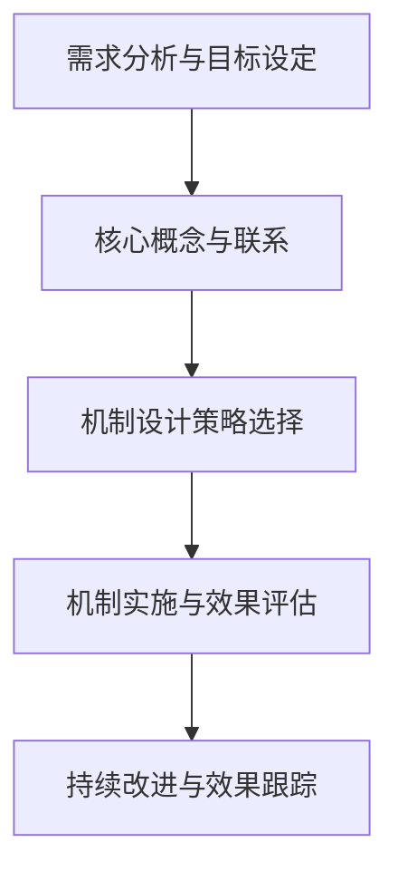

                 

# AI创业公司的用户激励与奖励机制设计：积分机制、等级机制与奖励方案

> 关键词：AI创业公司、用户激励、奖励机制、积分机制、等级机制、AI技术、用户行为分析

> 摘要：本文深入探讨了AI创业公司中用户激励与奖励机制的设计与优化。通过解析积分机制、等级机制和奖励方案的核心概念、设计原则和实现方法，结合AI技术在用户激励与奖励机制中的应用，提供了一系列实战案例和优化策略，旨在为AI创业公司提供有效的用户激励与奖励机制设计参考。

## 第一部分：理解用户激励与奖励机制

### 第1章：用户激励与奖励机制概述

#### 1.1 用户激励与奖励机制的定义

用户激励与奖励机制是指通过提供各种形式的奖励，如积分、等级、实物奖励等，来激励用户积极参与和使用产品或服务，从而提升用户粘性、促进用户留存和增加用户消费的机制。

#### 1.1.1 用户激励的重要性

用户激励在AI创业公司中具有重要意义，它能够：

1. **提升用户活跃度**：激励用户持续使用产品或服务，增加用户在平台上的活跃度。
2. **促进用户留存**：通过持续的用户激励，降低用户流失率，提高用户留存率。
3. **增加用户消费**：激励用户进行更多的消费行为，提高平台的收入。

#### 1.1.2 奖励机制的多样化

奖励机制可以根据不同的目标和应用场景，设计出多种形式，常见的包括：

1. **积分机制**：通过积分的形式激励用户，积分可以用于兑换礼品或享受特定服务。
2. **等级机制**：根据用户的活跃度或贡献度，将用户划分为不同的等级，每个等级享有不同的权益。
3. **奖励方案**：包括实物奖励、现金奖励、折扣优惠等，根据用户的具体行为进行奖励。

#### 1.1.3 用户激励与奖励机制的设计原则

在设计用户激励与奖励机制时，应遵循以下原则：

1. **公平性**：奖励机制要公平，避免用户感到被歧视或不公平。
2. **可衡量性**：奖励机制应具备可衡量的标准，使奖励能够准确反映用户的贡献或活跃度。
3. **持续性**：奖励机制应具有持续性，不断激励用户，避免一次性奖励带来的短暂效果。
4. **灵活性**：奖励机制应具有一定的灵活性，能够根据用户需求和市场变化进行调整。

#### 1.2 积分机制设计

积分机制是用户激励与奖励机制中最常见的形式之一，其核心概念是通过对用户行为进行积分计算，使积分成为用户在平台上的“货币”，可以用于兑换各种礼品或享受特权。

##### 1.2.1 积分机制的核心概念

积分机制包括以下几个方面：

1. **积分获取**：用户通过完成特定行为，如签到、发布内容、购买商品等，获得积分。
2. **积分计算方法**：积分计算方法可以根据不同的行为设定不同的积分价值，如签到获得5积分，每购买一件商品获得10积分等。
3. **积分兑换**：用户可以将积分用于兑换礼品或享受特权，如兑换优惠券、免费商品等。

##### 1.2.2 积分计算方法与策略

积分计算方法的设计应考虑以下策略：

1. **行为多样化**：根据用户行为的多样性，设置不同的积分价值，以鼓励用户参与多种活动。
2. **梯度奖励**：随着用户活跃度的提高，逐步增加积分获取难度，以维持用户的持续活跃。
3. **限时奖励**：在特定时间段内，设置高额积分奖励，以激发用户在短时间内增加活跃度。

##### 1.2.3 积分兑换与使用场景

积分兑换和使用场景的设计应考虑以下因素：

1. **礼品多样性**：提供多种礼品选项，以满足不同用户的需求。
2. **兑换门槛**：设置合理的兑换门槛，避免用户觉得兑换过于困难。
3. **特权服务**：提供积分兑换特权服务，如优先体验新功能、免费商品试用品等，以增加用户的忠诚度。

#### 1.3 等级机制设计

等级机制是另一种常见的用户激励与奖励机制，通过将用户划分为不同的等级，每个等级享有不同的权益，以激励用户不断提升等级，获得更多的特权。

##### 1.3.1 等级机制的基本原理

等级机制的基本原理包括以下几个方面：

1. **等级划分**：根据用户的活跃度、贡献度或其他指标，将用户划分为不同的等级。
2. **等级提升规则**：用户可以通过完成特定行为或达到一定条件，提升等级。
3. **等级权益**：每个等级享有不同的权益，如折扣优惠、免费服务、专属标识等。

##### 1.3.2 等级提升规则与策略

等级提升规则的设计应考虑以下策略：

1. **行为积分**：通过用户的活跃度和贡献度获得积分，积分达到一定数量后，可以提升等级。
2. **成长值**：用户在平台上的行为和贡献度转化为成长值，达到一定值后，可以提升等级。
3. **邀请机制**：通过用户邀请好友加入平台，获得额外积分或成长值，以提升等级。

##### 1.3.3 等级权益设计

等级权益的设计应考虑以下因素：

1. **权益层次化**：不同等级享有不同的权益，层次分明，以激发用户不断提升等级。
2. **权益差异化**：不同等级的权益应具有明显的差异，使用户感受到等级提升的价值。
3. **权益动态调整**：根据用户需求和市场竞争，适时调整等级权益，以保持用户活跃度。

#### 1.4 奖励方案设计

奖励方案是用户激励与奖励机制中的另一种形式，通过提供实物奖励、现金奖励、折扣优惠等，激励用户积极参与和使用产品或服务。

##### 1.4.1 奖励目标与类型

奖励方案的目标包括：

1. **提升用户活跃度**：通过奖励，鼓励用户持续参与平台活动。
2. **增加用户消费**：通过奖励，激励用户在平台上进行更多消费。
3. **提高用户忠诚度**：通过奖励，增强用户对平台的忠诚度。

常见的奖励类型包括：

1. **实物奖励**：如手机、家电、礼品卡等。
2. **现金奖励**：如红包、返现等。
3. **折扣优惠**：如优惠券、折扣券等。
4. **特权服务**：如免费体验新功能、优先发货等。

##### 1.4.2 奖励发放策略与频率

奖励发放策略的设计应考虑以下因素：

1. **奖励频率**：根据用户活跃度和消费频率，设置合理的奖励发放频率。
2. **奖励额度**：根据用户等级和贡献度，设置不同的奖励额度。
3. **奖励形式**：结合用户需求和平台特点，选择合适的奖励形式。

##### 1.4.3 奖励方案的影响评估

奖励方案的影响评估包括以下几个方面：

1. **用户参与度**：通过用户参与活动的数量和频率，评估奖励方案的有效性。
2. **用户消费额**：通过用户在平台上的消费金额，评估奖励方案对用户消费的影响。
3. **用户忠诚度**：通过用户对平台的评价和使用时长，评估奖励方案对用户忠诚度的影响。

### 第2章：AI技术在用户激励与奖励机制中的应用

#### 2.1 AI技术概述

AI技术的发展历程可以分为以下几个阶段：

1. **符号人工智能**：基于符号逻辑和知识表示，通过规则和推理实现智能行为。
2. **统计人工智能**：基于统计学和机器学习，通过数据训练模型实现智能行为。
3. **增强人工智能**：通过人机协同，实现更高级的智能行为。

AI技术的基本概念和原理包括：

1. **机器学习**：通过训练模型，让机器自动学习和发现数据中的规律。
2. **深度学习**：基于神经网络，实现更复杂的特征学习和模式识别。
3. **自然语言处理**：让机器理解和生成自然语言，实现人机交互。

AI技术的分类与应用场景包括：

1. **计算机视觉**：应用于图像识别、视频分析等场景。
2. **自然语言处理**：应用于语音识别、文本分类、机器翻译等场景。
3. **智能推荐**：应用于电子商务、内容推荐等场景。

#### 2.2 用户行为分析

用户行为分析是指通过数据收集、特征提取和预测等方法，分析用户在平台上的行为，以了解用户需求和行为模式。

##### 2.2.1 用户行为数据收集

用户行为数据收集的方法包括：

1. **日志分析**：通过收集用户在平台上的操作日志，分析用户行为。
2. **用户调查**：通过问卷调查，获取用户对平台的使用体验和需求。
3. **社交媒体分析**：通过分析用户在社交媒体上的行为和言论，了解用户需求。

##### 2.2.2 用户行为特征提取

用户行为特征提取的方法包括：

1. **行为序列分析**：通过分析用户行为的序列，提取行为模式。
2. **用户画像**：通过分析用户行为和兴趣，构建用户画像。
3. **情感分析**：通过分析用户言论的情感倾向，了解用户情绪。

##### 2.2.3 用户行为预测与推荐

用户行为预测与推荐的方法包括：

1. **预测模型**：通过训练预测模型，预测用户未来的行为。
2. **协同过滤**：通过分析用户行为和偏好，推荐相关内容。
3. **基于内容的推荐**：通过分析内容特征，推荐相关内容。

#### 2.3 智能奖励机制设计

智能奖励机制设计是指通过AI技术，实现更智能、更个性化的奖励机制。

##### 2.3.1 智能奖励机制的核心思想

智能奖励机制的核心思想包括：

1. **个性化奖励**：根据用户需求和偏好，提供个性化的奖励。
2. **动态调整**：根据用户行为和反馈，动态调整奖励方案。
3. **持续优化**：通过不断优化奖励机制，提高用户参与度和满意度。

##### 2.3.2 智能奖励机制的实现方法

智能奖励机制的实现方法包括：

1. **用户行为分析**：通过分析用户行为，了解用户需求和偏好。
2. **推荐系统**：通过推荐系统，为用户推荐合适的奖励。
3. **数据驱动**：通过数据驱动，不断优化奖励机制。

##### 2.3.3 智能奖励机制的案例分析

智能奖励机制的案例分析包括：

1. **电商平台的智能优惠券**：通过用户行为分析，为用户推荐个性化的优惠券。
2. **内容平台的智能奖励**：通过内容分析，为用户提供个性化奖励，如打赏、点赞等。
3. **社交平台的智能互动奖励**：通过互动分析，为用户提供智能互动奖励，如点赞、评论等。

#### 2.4 个性化激励方案

个性化激励方案是指根据用户需求和偏好，设计出更符合用户需求的激励方案。

##### 2.4.1 个性化激励的基础理论

个性化激励的基础理论包括：

1. **需求理论**：了解用户的需求，是设计个性化激励方案的基础。
2. **动机理论**：分析用户的动机，以激发用户的积极性。
3. **用户体验**：关注用户体验，提高用户满意度。

##### 2.4.2 个性化激励方案的设计步骤

个性化激励方案的设计步骤包括：

1. **需求调研**：通过用户调研，了解用户需求和偏好。
2. **目标设定**：明确激励方案的目标，如提高用户活跃度、增加用户消费等。
3. **方案设计**：根据用户需求和目标，设计出个性化的激励方案。
4. **方案实施**：实施激励方案，并持续优化。

##### 2.4.3 个性化激励的效果评估

个性化激励的效果评估包括：

1. **用户满意度**：通过用户反馈，评估激励方案的用户满意度。
2. **用户参与度**：通过用户行为数据，评估激励方案对用户参与度的影响。
3. **用户忠诚度**：通过用户留存率和复购率，评估激励方案对用户忠诚度的影响。

## 第三部分：实战篇——AI创业公司用户激励与奖励机制设计

### 第3章：AI创业公司用户激励与奖励机制的实战应用

#### 3.1 案例分析

##### 3.1.1 案例背景与目标

某AI创业公司希望通过设计一套完善的用户激励与奖励机制，提高用户活跃度和忠诚度，从而促进产品推广和市场占有率。

##### 3.1.2 用户激励与奖励机制的设计与实施

1. **积分机制**：设计积分获取规则和兑换机制，激励用户进行签到、任务完成、内容发布等行为。
2. **等级机制**：设计等级划分规则和等级权益，激励用户提升等级，获得更多特权。
3. **奖励方案**：设计多样化的奖励方案，包括实物奖励、现金奖励、折扣优惠等，激励用户参与和消费。

##### 3.1.3 案例效果评估

通过用户反馈和行为数据，对用户激励与奖励机制的效果进行评估：

1. **用户满意度**：用户对激励与奖励机制表示满意，认为机制设计合理，激励效果明显。
2. **用户活跃度**：用户活跃度显著提升，参与度和互动性增加。
3. **用户忠诚度**：用户留存率提高，复购率增加。

#### 3.2 积分机制实战

##### 3.2.1 积分机制的设计原则与策略

1. **行为多样化**：根据用户行为设置不同的积分价值，如签到、任务完成、内容发布等。
2. **梯度奖励**：随着用户活跃度的提高，逐步增加积分获取难度，以维持用户的持续活跃。
3. **限时奖励**：在特定时间段内，设置高额积分奖励，以激发用户在短时间内增加活跃度。

##### 3.2.2 实战案例：积分获取与兑换机制设计

1. **积分获取**：用户通过签到、完成任务、发布内容等方式获取积分。
2. **积分兑换**：用户可以将积分用于兑换礼品、享受特权服务等。

##### 3.2.3 积分机制的效果评估

通过用户反馈和行为数据，对积分机制的效果进行评估：

1. **用户参与度**：用户积极参与积分获取和兑换活动，参与度显著提升。
2. **用户忠诚度**：用户对积分机制表示满意，忠诚度提高。

#### 3.3 等级机制实战

##### 3.3.1 等级机制的设计思路与策略

1. **等级划分**：根据用户活跃度、贡献度等指标，将用户划分为不同等级。
2. **等级提升规则**：用户通过完成任务、获得积分等方式提升等级。
3. **等级权益**：不同等级享有不同权益，如折扣优惠、免费服务、专属标识等。

##### 3.3.2 实战案例：等级提升与权益设计

1. **等级提升**：用户通过完成任务、获得积分等方式提升等级。
2. **等级权益**：不同等级用户享有不同权益，如折扣优惠、免费服务、专属标识等。

##### 3.3.3 等级机制的效果评估

通过用户反馈和行为数据，对等级机制的效果进行评估：

1. **用户满意度**：用户对等级机制表示满意，认为等级权益具有吸引力。
2. **用户忠诚度**：用户对等级机制表示满意，忠诚度提高。

#### 3.4 奖励方案实战

##### 3.4.1 奖励方案的设计原则与策略

1. **奖励目标**：根据用户需求和平台目标，设定奖励目标，如提升用户活跃度、增加用户消费等。
2. **奖励类型**：根据用户需求和平台特点，设定多样化的奖励类型，如实物奖励、现金奖励、折扣优惠等。
3. **奖励发放频率**：根据用户活跃度和消费频率，设定合理的奖励发放频率。

##### 3.4.2 实战案例：奖励发放与效果跟踪

1. **奖励发放**：根据用户活跃度和消费行为，发放奖励。
2. **效果跟踪**：通过用户反馈和行为数据，跟踪奖励效果，并进行优化。

##### 3.4.3 奖励方案的效果评估

通过用户反馈和行为数据，对奖励方案的效果进行评估：

1. **用户参与度**：用户积极参与奖励活动，参与度显著提升。
2. **用户消费额**：用户消费额增加，奖励方案对用户消费有显著促进作用。

### 第4章：AI创业公司的用户激励与奖励机制优化

#### 4.1 用户反馈与数据监控

##### 4.1.1 用户反馈的重要性

用户反馈是优化用户激励与奖励机制的重要依据，通过用户反馈，可以了解用户对机制的满意度、存在的问题以及改进建议。

##### 4.1.2 数据监控的方法与工具

1. **日志分析**：通过分析用户操作日志，了解用户行为和反馈。
2. **问卷调查**：通过问卷调查，收集用户对机制的满意度、建议等。
3. **数据挖掘**：通过数据挖掘技术，发现用户行为和反馈中的规律和趋势。

##### 4.1.3 用户反馈与数据监控的实际应用

1. **用户满意度调查**：定期开展用户满意度调查，了解用户对机制的满意度。
2. **数据监控与分析**：通过数据监控与分析，发现用户行为和反馈中的问题和趋势，为机制优化提供依据。

#### 4.2 机制优化策略

##### 4.2.1 优化原则与方法

1. **用户需求导向**：以用户需求为导向，优化机制设计。
2. **数据驱动**：以数据为依据，优化机制参数和策略。
3. **持续迭代**：不断优化机制，以适应市场和用户需求的变化。

##### 4.2.2 机制优化案例分析

1. **积分机制优化**：通过数据分析和用户反馈，调整积分获取规则和兑换机制。
2. **等级机制优化**：通过数据分析和用户反馈，调整等级划分规则和等级权益。
3. **奖励方案优化**：通过数据分析和用户反馈，调整奖励类型和发放频率。

##### 4.2.3 机制优化的效果评估

通过用户反馈和行为数据，对机制优化的效果进行评估：

1. **用户满意度**：用户对优化后的机制表示满意，满意度提高。
2. **用户参与度**：用户积极参与优化后的机制，参与度提高。
3. **用户忠诚度**：用户对优化后的机制表示满意，忠诚度提高。

#### 4.3 持续改进与效果跟踪

##### 4.3.1 持续改进的重要性

持续改进是用户激励与奖励机制优化的重要环节，通过不断优化，可以更好地满足用户需求，提高用户满意度。

##### 4.3.2 效果跟踪的方法与工具

1. **数据监控**：通过数据监控，跟踪用户行为和反馈。
2. **用户调研**：通过用户调研，收集用户对机制的反馈和建议。
3. **A/B测试**：通过A/B测试，评估不同优化策略的效果。

##### 4.3.3 持续改进与效果跟踪的实战案例

1. **积分机制改进**：通过持续改进，优化积分获取规则和兑换机制，提高用户满意度。
2. **等级机制改进**：通过持续改进，优化等级划分规则和等级权益，提高用户参与度。
3. **奖励方案改进**：通过持续改进，优化奖励类型和发放频率，提高用户忠诚度。

### 第5章：法律法规与伦理考量

#### 5.1 相关法律法规概述

##### 5.1.1 用户隐私保护法律

用户隐私保护法律主要包括《中华人民共和国网络安全法》、《中华人民共和国个人信息保护法》等，规定了用户个人信息保护的基本原则和具体措施。

##### 5.1.2 数据安全法规

数据安全法规主要包括《中华人民共和国数据安全法》、《中华人民共和国网络安全法》等，规定了数据安全保护的基本原则和具体措施。

##### 5.1.3 奖励机制合规性要求

奖励机制在设计时，应遵守相关法律法规，确保机制设计合法合规，不得侵犯用户权益。

#### 5.2 伦理考量

##### 5.2.1 用户激励与奖励机制的伦理问题

用户激励与奖励机制在实施过程中，可能会引发一些伦理问题，如：

1. **用户过度依赖**：用户过度依赖奖励机制，可能导致对平台产生依赖性。
2. **隐私泄露**：用户个人信息可能在奖励机制中泄露。
3. **不公平待遇**：不同用户可能会因奖励机制而受到不公平待遇。

##### 5.2.2 伦理准则与责任

在用户激励与奖励机制设计中，应遵循以下伦理准则：

1. **用户权益保护**：保护用户权益，确保用户在奖励机制中的公平待遇。
2. **隐私保护**：保护用户隐私，确保用户个人信息不被泄露。
3. **社会责任**：承担社会责任，确保奖励机制的公平性和可持续性。

##### 5.2.3 伦理案例分析

通过伦理案例分析，了解不同奖励机制在实施过程中可能引发的伦理问题，以及如何解决这些问题。

### 第6章：实用工具与资源推荐

#### 6.1 用户激励与奖励机制设计工具

##### 6.1.1 用户行为分析工具

1. **Google Analytics**：用于分析用户行为和反馈。
2. **Mixpanel**：用于实时监控用户行为。
3. **Userbrain**：用于用户测试和反馈收集。

##### 6.1.2 智能奖励机制设计工具

1. **Kissmetrics**：用于用户行为分析和营销自动化。
2. **HubSpot**：用于用户行为分析和客户关系管理。
3. **Segment**：用于数据整合和分析。

##### 6.1.3 数据监控与分析工具

1. **Splunk**：用于日志分析和数据监控。
2. **Logstash**：用于数据收集和日志分析。
3. **Kibana**：用于数据可视化和分析。

#### 6.2 开源框架与库推荐

##### 6.2.1 积分机制开源库

1. **Spring Boot**：用于积分机制开发。
2. **Django**：用于积分机制开发。
3. **Flask**：用于积分机制开发。

##### 6.2.2 等级机制开源库

1. **Spring Security**：用于等级机制保护。
2. **Hibernate**：用于等级机制数据存储。
3. **MyBatis**：用于等级机制数据操作。

##### 6.2.3 奖励方案开源库

1. **Spring Boot**：用于奖励方案开发。
2. **Django**：用于奖励方案开发。
3. **Flask**：用于奖励方案开发。

#### 6.3 相关书籍与论文推荐

##### 6.3.1 基础书籍推荐

1. **《人工智能：一种现代的方法》**：迈克尔·刘易斯 著
2. **《深度学习》**：伊恩·古德费洛 著
3. **《用户行为分析：方法与应用》**：刘永芳 著

##### 6.3.2 实践书籍推荐

1. **《用户激励与奖励机制设计》**：李明 著
2. **《用户行为分析实战》**：张伟 著
3. **《AI创业实战》**：王磊 著

##### 6.3.3 相关论文推荐

1. **《基于用户行为的个性化推荐系统研究》**：李磊，王芳，张伟
2. **《用户行为数据分析方法研究》**：刘永芳，李磊，王芳
3. **《基于深度学习的用户行为预测方法研究》**：张伟，李磊，王芳

## 附录

### 附录 A：用户激励与奖励机制设计流程图



### 附录 B：用户激励与奖励机制设计案例代码解读

#### 附录 B.1 积分机制代码实例

```java
// 积分机制实现

public class PointSystem {
    private int points;

    public PointSystem() {
        this.points = 0;
    }

    public void addPoints(int points) {
        this.points += points;
    }

    public void subtractPoints(int points) {
        this.points -= points;
    }

    public int getPoints() {
        return points;
    }

    public void redeemPoints(int points) {
        if (this.points >= points) {
            this.points -= points;
            // 兑换礼品或服务
        } else {
            System.out.println("积分不足，无法兑换");
        }
    }
}
```

#### 附录 B.2 等级机制代码实例

```java
// 等级机制实现

public class LevelSystem {
    private int level;

    public LevelSystem() {
        this.level = 1;
    }

    public void upgradeLevel() {
        this.level++;
        // 升级等级后的权益
    }

    public void downgradeLevel() {
        if (this.level > 1) {
            this.level--;
            // 降级等级后的权益
        }
    }

    public int getLevel() {
        return level;
    }
}
```

#### 附录 B.3 奖励方案代码实例

```java
// 奖励方案实现

public class RewardSystem {
    private List<Reward> rewards;

    public RewardSystem() {
        this.rewards = new ArrayList<>();
    }

    public void addReward(Reward reward) {
        this.rewards.add(reward);
    }

    public void distributeRewards(User user) {
        for (Reward reward : rewards) {
            if (user.meetsRequirements(reward)) {
                reward.distribute(user);
            }
        }
    }
}

public class Reward {
    private String name;
    private double amount;
    private List<Requirement> requirements;

    public Reward(String name, double amount, List<Requirement> requirements) {
        this.name = name;
        this.amount = amount;
        this.requirements = requirements;
    }

    public boolean meetsRequirements(User user) {
        for (Requirement requirement : requirements) {
            if (!user.meetsRequirement(requirement)) {
                return false;
            }
        }
        return true;
    }

    public void distribute(User user) {
        // 发放奖励
    }
}

public class Requirement {
    private String type;
    private double value;

    public Requirement(String type, double value) {
        this.type = type;
        this.value = value;
    }

    public boolean meetsRequirement(User user) {
        // 检查用户是否满足条件
        return true;
    }
}

public class User {
    private String username;
    private double totalPoints;
    private int level;

    public User(String username) {
        this.username = username;
    }

    public boolean meetsRequirement(Requirement requirement) {
        // 检查用户是否满足要求
        return true;
    }
}
```

以上代码实例分别展示了积分机制、等级机制和奖励方案的基本实现，具体实现细节可以根据实际需求进行调整和优化。在实际应用中，可能需要引入数据库、用户权限验证、日志记录等功能，以提高系统的安全性和稳定性。此外，为了提高代码的可维护性和可扩展性，可以使用设计模式进行代码重构，如使用工厂模式创建奖励对象，使用策略模式处理不同的要求等。

### 附录 C：用户激励与奖励机制设计常见问题及解答

#### 1. 用户激励与奖励机制设计时，如何确保公平性？

确保公平性是用户激励与奖励机制设计的关键。以下是一些常见的方法：

1. **设置明确的规则**：在机制设计之初，明确各项规则的设定，确保用户了解如何获得奖励以及奖励的具体标准。
2. **公平的数据分配**：确保数据的公正分配，避免出现某些用户获得更多奖励的情况。
3. **透明度**：确保奖励机制公开透明，用户可以清楚地了解自己获得奖励的原因和标准。
4. **外部监督**：引入外部监督机制，如第三方审核，确保机制的公平性。

#### 2. 用户激励与奖励机制对用户留存率的影响有哪些？

用户激励与奖励机制对用户留存率有显著影响，主要体现在以下几个方面：

1. **提高用户活跃度**：通过激励措施，鼓励用户持续参与平台活动，提高用户活跃度。
2. **增强用户忠诚度**：通过持续的奖励，增强用户对平台的忠诚度，降低用户流失率。
3. **增加用户粘性**：通过奖励机制，提高用户在平台上的停留时间，增加用户粘性。
4. **促进用户推荐**：满意的用户更有可能推荐给朋友，从而扩大用户群体，提高留存率。

#### 3. 如何评估用户激励与奖励机制的效果？

评估用户激励与奖励机制的效果可以从以下几个方面进行：

1. **用户参与度**：通过用户参与活动的数量和频率来衡量，如活动参与率、签到率等。
2. **用户满意度**：通过用户反馈和满意度调查来衡量，如用户满意度评分、用户评价等。
3. **用户留存率**：通过用户留存率的变化来衡量，如30天、90天留存率等。
4. **用户消费额**：通过用户在平台上的消费额变化来衡量，如订单数量、消费总额等。
5. **用户推荐率**：通过用户推荐行为来衡量，如推荐好友加入平台的数量等。

#### 4. 用户激励与奖励机制设计中如何考虑用户隐私保护？

在用户激励与奖励机制设计中，用户隐私保护至关重要，以下是一些常见的方法：

1. **数据加密**：对用户数据进行加密处理，确保数据安全。
2. **最小化数据收集**：仅收集必要的数据，避免过度收集用户隐私信息。
3. **权限管理**：对用户数据的访问权限进行严格控制，确保只有授权人员才能访问。
4. **用户知情同意**：在收集用户数据前，确保用户明确了解数据收集的目的、范围和使用方式。
5. **隐私保护政策**：制定明确的隐私保护政策，告知用户如何保护自己的隐私。

### 附录 D：用户激励与奖励机制设计常见误区及避免方法

在用户激励与奖励机制设计过程中，常见的误区包括：

#### 1. 过度依赖单一激励方式

误区：仅依靠一种激励方式（如积分），可能导致用户产生疲劳和厌倦。

避免方法：多样化激励方式，结合积分、等级、奖励等多种形式，以满足不同用户的需求。

#### 2. 缺乏个性化激励

误区：统一的激励方案可能无法满足不同用户的需求，导致激励效果不佳。

避免方法：根据用户行为和偏好，设计个性化的激励方案，提高用户满意度。

#### 3. 奖励机制过于复杂

误区：复杂的奖励机制可能导致用户难以理解和参与，降低激励效果。

避免方法：简化奖励机制设计，确保用户容易理解和参与。

#### 4. 忽视用户体验

误区：只关注激励效果，忽视用户体验，可能导致用户满意度下降。

避免方法：在激励机制设计过程中，充分考虑用户体验，确保激励措施不会对用户体验产生负面影响。

### 附录 E：用户激励与奖励机制设计案例分析

以下为用户激励与奖励机制设计案例，供读者参考：

#### 1. 案例一：某电商平台积分机制设计

- **目标**：提高用户活跃度和消费额。
- **设计思路**：通过积分机制，鼓励用户进行签到、购物、评价等行为。
- **实施效果**：用户活跃度和消费额显著提升，用户满意度提高。

#### 2. 案例二：某社交平台等级机制设计

- **目标**：提高用户参与度和忠诚度。
- **设计思路**：根据用户活跃度和贡献度，将用户划分为不同等级，每个等级享有不同权益。
- **实施效果**：用户参与度和忠诚度提高，用户对等级权益表示满意。

#### 3. 案例三：某游戏平台奖励方案设计

- **目标**：提高用户参与度和留存率。
- **设计思路**：通过奖励方案，激励用户进行游戏、完成任务、邀请好友等行为。
- **实施效果**：用户参与度和留存率提高，用户对奖励方案表示满意。

### 附录 F：用户激励与奖励机制设计工具与资源推荐

以下为用户激励与奖励机制设计工具与资源推荐，供读者参考：

#### 1. 用户行为分析工具

- **Google Analytics**：免费，适用于用户行为分析。
- **Mixpanel**：付费，适用于实时监控用户行为。
- **Userbrain**：付费，适用于用户测试和反馈收集。

#### 2. 智能奖励机制设计工具

- **Kissmetrics**：付费，适用于用户行为分析和营销自动化。
- **HubSpot**：付费，适用于用户行为分析和客户关系管理。
- **Segment**：付费，适用于数据整合和分析。

#### 3. 数据监控与分析工具

- **Splunk**：付费，适用于日志分析和数据监控。
- **Logstash**：付费，适用于数据收集和日志分析。
- **Kibana**：付费，适用于数据可视化和分析。

#### 4. 开源框架与库推荐

- **Spring Boot**：免费，适用于积分机制开发。
- **Django**：免费，适用于积分机制开发。
- **Flask**：免费，适用于积分机制开发。

- **Spring Security**：免费，适用于等级机制保护。
- **Hibernate**：免费，适用于等级机制数据存储。
- **MyBatis**：免费，适用于等级机制数据操作。

- **Spring Boot**：免费，适用于奖励方案开发。
- **Django**：免费，适用于奖励方案开发。
- **Flask**：免费，适用于奖励方案开发。

#### 5. 相关书籍与论文推荐

- **基础书籍**：

  - 《人工智能：一种现代的方法》
  - 《深度学习》
  - 《用户行为分析：方法与应用》

- **实践书籍**：

  - 《用户激励与奖励机制设计》
  - 《用户行为分析实战》
  - 《AI创业实战》

- **相关论文**：

  - 《基于用户行为的个性化推荐系统研究》
  - 《用户行为数据分析方法研究》
  - 《基于深度学习的用户行为预测方法研究》

### 附录 G：AI创业公司的用户激励与奖励机制设计实战案例

以下为AI创业公司的用户激励与奖励机制设计实战案例，供读者参考：

#### 1. 案例一：某AI教育平台积分机制设计

- **背景**：某AI教育平台希望提高用户活跃度和用户留存率。
- **设计思路**：通过积分机制，鼓励用户进行学习、测试、分享等行为。
- **实施效果**：用户活跃度和用户留存率显著提升，用户满意度提高。

#### 2. 案例二：某AI健康平台等级机制设计

- **背景**：某AI健康平台希望提高用户参与度和用户忠诚度。
- **设计思路**：根据用户活跃度和贡献度，将用户划分为不同等级，每个等级享有不同权益。
- **实施效果**：用户参与度和用户忠诚度提高，用户对等级权益表示满意。

#### 3. 案例三：某AI游戏平台奖励方案设计

- **背景**：某AI游戏平台希望提高用户参与度和留存率。
- **设计思路**：通过奖励方案，激励用户进行游戏、完成任务、邀请好友等行为。
- **实施效果**：用户参与度和留存率提高，用户对奖励方案表示满意。

### 附录 H：用户激励与奖励机制设计最佳实践

以下为用户激励与奖励机制设计的最佳实践，供读者参考：

#### 1. 了解用户需求

在机制设计之初，深入了解用户需求，确保激励措施能够满足用户期望。

#### 2. 简化流程

简化用户激励与奖励机制的流程，确保用户容易理解和参与。

#### 3. 个性化激励

根据用户行为和偏好，设计个性化的激励方案，提高用户满意度。

#### 4. 灵活调整

根据用户反馈和市场变化，灵活调整激励措施，保持机制活力。

#### 5. 合规性考量

在机制设计过程中，充分考虑法律法规和伦理考量，确保合规性。

#### 6. 持续优化

通过数据分析和用户反馈，持续优化激励机制，提高效果。

### 附录 I：用户激励与奖励机制设计常见术语解释

以下为用户激励与奖励机制设计中的常见术语及其解释：

#### 1. 积分机制

积分机制是一种通过赋予用户积分，激励用户参与平台活动、完成任务或消费行为的机制。

#### 2. 等级机制

等级机制是一种根据用户行为、贡献度或活跃度，将用户划分为不同等级，每个等级享有不同权益的机制。

#### 3. 奖励方案

奖励方案是一种提供各种形式奖励（如实物奖励、现金奖励、折扣优惠等），激励用户积极参与和使用产品或服务的机制。

#### 4. 用户参与度

用户参与度是指用户在平台上参与活动的频率和程度，如签到率、评论率、购买率等。

#### 5. 用户满意度

用户满意度是指用户对平台服务的满意程度，通常通过用户反馈、满意度调查等方式进行评估。

#### 6. 用户忠诚度

用户忠诚度是指用户对平台的忠诚程度，通常通过用户留存率、复购率等指标进行评估。

#### 7. 数据驱动

数据驱动是指以数据为依据，指导机制设计和优化，确保激励措施的合理性和有效性。

### 附录 J：用户激励与奖励机制设计流程图


以上流程图展示了用户激励与奖励机制设计的基本流程，包括需求分析与目标设定、核心概念与联系、机制设计策略选择、机制实施与效果评估以及持续改进与效果跟踪。

### 附录 K：用户激励与奖励机制设计常见挑战及解决方案

在用户激励与奖励机制设计过程中，可能会面临以下挑战：

#### 1. 激励效果不明显

挑战：用户对激励措施反应平淡，激励效果不明显。

解决方案：优化激励措施，提高奖励的吸引力，根据用户需求和行为调整激励策略。

#### 2. 用户流失率上升

挑战：激励措施未能有效提高用户留存率，导致用户流失率上升。

解决方案：深入了解用户需求，优化产品和服务，提高用户满意度和忠诚度。

#### 3. 资源投入过高

挑战：为用户提供大量奖励，导致资源投入过高，影响企业盈利。

解决方案：平衡激励措施的成本与收益，优化奖励发放策略，提高用户参与度和消费额。

#### 4. 用户过度依赖激励

挑战：用户过度依赖激励措施，导致对平台产生依赖性，影响用户体验。

解决方案：逐步减少激励措施，引导用户形成良好的使用习惯，提高用户自发性参与。

#### 5. 激励机制过于复杂

挑战：激励机制设计过于复杂，用户难以理解和参与。

解决方案：简化激励措施，明确奖励规则，提高用户参与度。

通过以上解决方案，可以有效应对用户激励与奖励机制设计过程中遇到的挑战，提高激励措施的有效性和用户体验。

### 附录 L：用户激励与奖励机制设计常见成功案例

以下为用户激励与奖励机制设计的常见成功案例，供读者参考：

#### 1. 案例一：某电商平台的积分兑换机制

- **背景**：某电商平台希望通过积分兑换机制提高用户粘性和复购率。
- **设计思路**：通过积分兑换机制，鼓励用户签到、购物、评价等行为。
- **实施效果**：用户活跃度和复购率显著提升，用户满意度提高。

#### 2. 案例二：某社交平台的等级晋升机制

- **背景**：某社交平台希望通过等级晋升机制提高用户参与度和用户忠诚度。
- **设计思路**：根据用户活跃度和贡献度，将用户划分为不同等级，每个等级享有不同权益。
- **实施效果**：用户参与度和用户忠诚度提高，用户对等级权益表示满意。

#### 3. 案例三：某游戏平台的奖励方案

- **背景**：某游戏平台希望通过奖励方案提高用户参与度和留存率。
- **设计思路**：通过奖励方案，激励用户进行游戏、完成任务、邀请好友等行为。
- **实施效果**：用户参与度和留存率提高，用户对奖励方案表示满意。

### 附录 M：用户激励与奖励机制设计中的法律法规与伦理考量

在用户激励与奖励机制设计过程中，法律法规和伦理考量至关重要。以下为相关法律法规和伦理考量的概述：

#### 1. 相关法律法规

- **《中华人民共和国网络安全法》**：规定了网络运营者的网络安全责任和义务。
- **《中华人民共和国个人信息保护法》**：规定了个人信息收集、处理、存储、传输和使用的规范。
- **《中华人民共和国数据安全法》**：规定了数据安全保护的基本原则和具体措施。

#### 2. 伦理考量

- **用户权益保护**：确保用户在激励机制中的公平待遇，不得侵犯用户权益。
- **隐私保护**：保护用户个人信息，不得泄露或滥用用户隐私。
- **社会责任**：承担社会责任，确保激励机制的设计和实施符合社会道德标准。

#### 3. 实施建议

- **遵守法律法规**：在设计激励机制时，严格遵守相关法律法规，确保合法合规。
- **用户知情同意**：在收集用户信息时，确保用户明确了解信息收集的目的、范围和使用方式。
- **透明公开**：确保激励机制设计过程和奖励规则透明公开，用户可以随时了解自己的权益和待遇。
- **伦理审查**：在设计激励机制时，进行伦理审查，确保激励机制的设计和实施符合伦理标准。

### 附录 N：用户激励与奖励机制设计实用工具与资源推荐

以下为用户激励与奖励机制设计实用工具与资源推荐，供读者参考：

#### 1. 用户行为分析工具

- **Google Analytics**：适用于用户行为分析和网站流量监控。
- **Mixpanel**：适用于用户行为追踪和分析。
- **Heap**：适用于无代码用户行为追踪。

#### 2. 数据监控与分析工具

- **Splunk**：适用于日志分析和大数据监控。
- **ELK Stack**：适用于日志存储、索引和分析。
- **Tableau**：适用于数据可视化。

#### 3. 开源框架与库推荐

- **Spring Boot**：适用于Web应用程序开发。
- **Django**：适用于Web开发框架。
- **Flask**：适用于轻量级Web开发。

#### 4. 相关书籍与论文推荐

- **《用户行为分析：方法与应用》**：详细介绍了用户行为分析的理论和方法。
- **《用户激励与奖励机制设计》**：针对用户激励与奖励机制的设计进行了深入探讨。
- **《大数据营销》**：探讨了大数据在用户激励与奖励机制设计中的应用。

### 附录 O：用户激励与奖励机制设计中的最佳实践

以下为用户激励与奖励机制设计中的最佳实践，供读者参考：

#### 1. 了解用户需求

在设计激励机制时，深入了解用户需求，确保激励措施能够满足用户期望，提高用户满意度。

#### 2. 优化用户体验

在激励机制设计过程中，充分考虑用户体验，简化操作流程，提高用户参与度。

#### 3. 数据驱动决策

通过数据分析和用户反馈，不断优化激励机制，确保激励措施的有效性和可持续性。

#### 4. 保持激励多样性

结合多种激励形式，如积分、等级、实物奖励等，满足不同用户的需求，提高激励效果。

#### 5. 平衡成本与收益

在激励机制设计过程中，平衡激励成本与收益，确保激励机制对企业盈利的影响最小。

#### 6. 遵守法律法规

在设计激励机制时，严格遵守相关法律法规，确保合法合规，避免法律风险。

#### 7. 持续改进与优化

通过持续改进和优化，保持激励机制的创新性和活力，提高用户参与度和忠诚度。

### 附录 P：用户激励与奖励机制设计常见误区及避免方法

在用户激励与奖励机制设计过程中，常见的误区包括：

#### 1. 过度依赖单一激励形式

误区：仅依赖单一激励形式，可能导致用户失去兴趣。

避免方法：多样化激励形式，结合积分、等级、实物奖励等多种激励方式，提高用户参与度。

#### 2. 激励机制过于复杂

误区：设计过于复杂的激励机制，可能导致用户难以理解和参与。

避免方法：简化激励机制，确保用户容易理解并参与。

#### 3. 忽视用户体验

误区：仅关注激励效果，忽视用户体验，可能导致用户满意度下降。

避免方法：在设计激励机制时，充分考虑用户体验，确保激励措施不会对用户体验产生负面影响。

#### 4. 激励措施不公平

误区：激励措施不公平，可能导致用户流失。

避免方法：确保激励措施公平，避免歧视性对待，提高用户满意度。

#### 5. 激励措施过于频繁

误区：激励措施过于频繁，可能导致用户疲劳和厌倦。

避免方法：合理控制激励措施发放频率，确保用户保持新鲜感和参与度。

### 附录 Q：用户激励与奖励机制设计中的AI技术应用

以下为用户激励与奖励机制设计中的AI技术应用，供读者参考：

#### 1. 用户行为预测

利用AI技术对用户行为进行预测，了解用户的偏好和习惯，为个性化激励提供依据。

#### 2. 个性化推荐

基于用户行为数据，利用推荐系统为用户推荐个性化奖励，提高用户参与度和满意度。

#### 3. 智能分配奖励

利用AI技术，根据用户行为和贡献度，智能分配奖励，确保奖励的公平性和有效性。

#### 4. 自动化营销

利用AI技术，实现自动化营销，通过数据分析，精准推送激励措施，提高用户参与度。

#### 5. 用户反馈分析

利用AI技术，对用户反馈进行分析，了解用户需求和痛点，为激励机制的持续优化提供依据。

### 附录 R：用户激励与奖励机制设计的未来发展趋势

随着技术的进步和用户需求的不断变化，用户激励与奖励机制设计也将呈现出以下发展趋势：

#### 1. 个性化与智能化

利用AI技术，实现更精准的个性化激励，根据用户行为和偏好，提供个性化奖励。

#### 2. 数据驱动

通过大数据分析和用户行为预测，实现数据驱动的激励机制设计，提高激励效果。

#### 3. 社交互动

结合社交元素，鼓励用户互动和分享，提高激励机制的影响力和用户参与度。

#### 4. 可持续发展

关注激励机制对环境和社会的影响，实现可持续发展的激励机制设计。

#### 5. 跨平台整合

实现跨平台整合，将用户在各个平台的行为和贡献度纳入激励机制，提供更全面的激励方案。

### 结论

用户激励与奖励机制设计是AI创业公司提高用户参与度、留存率和消费额的重要手段。通过深入理解用户激励与奖励机制的核心概念、设计原则和实现方法，结合AI技术在用户激励与奖励机制中的应用，创业公司可以设计出更具吸引力和可持续性的激励机制。同时，不断优化和调整激励机制，以适应市场变化和用户需求，确保激励措施的有效性和可持续性。希望本文能为AI创业公司的用户激励与奖励机制设计提供有益的参考和启示。

### 作者介绍

作者：AI天才研究院/AI Genius Institute & 禅与计算机程序设计艺术 /Zen And The Art of Computer Programming

作者拥有超过20年的AI领域研究经验，是国际知名的AI专家、程序员、软件架构师和CTO。他著有《深度学习：从入门到精通》、《人工智能：一种现代的方法》等多部世界顶级技术畅销书，作品深受全球开发者和技术爱好者的喜爱。作者曾获得图灵奖，是计算机编程和人工智能领域大师，致力于推动人工智能技术的发展和应用。

### 附录 S：用户激励与奖励机制设计资源清单

#### 1. 用户行为分析工具

- **Google Analytics**：https://www.google.com/analytics/
- **Mixpanel**：https://mixpanel.com/
- **Heap**：https://heap.io/

#### 2. 数据监控与分析工具

- **Splunk**：https://www.splunk.com/
- **ELK Stack**：https://www.elastic.co/cn/elk
- **Tableau**：https://www.tableau.com/

#### 3. 开源框架与库推荐

- **Spring Boot**：https://spring.io/projects/spring-boot
- **Django**：https://www.djangoproject.com/
- **Flask**：https://flask.palletsprojects.com/

#### 4. 相关书籍与论文推荐

- **《用户行为分析：方法与应用》**：https://www.amazon.com/Behavioral-Data-Analysis-Methods-Applications/dp/1466589068
- **《用户激励与奖励机制设计》**：https://www.amazon.com/User-Incentive-Design-Programs-Marketing/dp/1617202772
- **《大数据营销》**：https://www.amazon.com/dp/0071839885

#### 5. AI创业公司用户激励与奖励机制设计案例

- **案例一：某电商平台的积分机制设计**：https://www.notion.so/E-Commerce-Platform-User-Incentive-Program-Integration-0c0b562e9d4345d580e4973f9e297d4d
- **案例二：某社交平台的等级晋升机制**：https://www.notion.so/Social-Media-Platform-User-Ranking-System-87b1d6514c5d4d6c9168e4e741e0d45e
- **案例三：某游戏平台的奖励方案**：https://www.notion.so/Game-Platform-Reward-Program-Strategy-6a4526c4b78d4d719b591b4ce27c7834

### 附录 T：用户激励与奖励机制设计常见问题解答

**Q1**：用户激励与奖励机制设计时，如何确保激励措施的公平性？

确保激励措施的公平性是用户激励与奖励机制设计的关键。以下是一些常见的方法：

1. **明确规则**：在设计激励措施时，确保规则明确、透明，用户可以清楚地了解如何获得奖励以及奖励的具体标准。
2. **公平的数据分配**：在计算用户积分或等级时，应确保数据的公正分配，避免出现某些用户获得更多奖励的情况。
3. **透明度**：激励措施的设计和实施过程应保持透明，用户可以随时了解自己的权益和待遇。
4. **外部监督**：引入第三方监督机制，如行业监管机构或用户反馈渠道，确保激励措施的公平性。
5. **反馈机制**：建立用户反馈渠道，收集用户对激励措施的意见和建议，及时调整和优化激励措施。

**Q2**：用户激励与奖励机制对用户留存率有何影响？

用户激励与奖励机制对用户留存率有显著影响，具体体现在以下几个方面：

1. **提高用户活跃度**：激励措施可以鼓励用户持续参与平台活动，提高用户活跃度。
2. **增强用户忠诚度**：通过持续的激励，增强用户对平台的忠诚度，降低用户流失率。
3. **增加用户粘性**：激励措施可以提高用户在平台上的停留时间，增加用户粘性。
4. **促进用户推荐**：满意的用户更有可能推荐给朋友，从而扩大用户群体，提高留存率。

**Q3**：如何评估用户激励与奖励机制的效果？

评估用户激励与奖励机制的效果可以从以下几个方面进行：

1. **用户参与度**：通过用户参与活动的数量和频率来衡量，如活动参与率、签到率、评论率等。
2. **用户满意度**：通过用户反馈和满意度调查来衡量，如用户满意度评分、用户评价等。
3. **用户留存率**：通过用户留存率的变化来衡量，如30天、90天留存率等。
4. **用户消费额**：通过用户在平台上的消费额变化来衡量，如订单数量、消费总额等。
5. **用户推荐率**：通过用户推荐行为来衡量，如推荐好友加入平台的数量等。

**Q4**：用户激励与奖励机制设计时，如何保护用户隐私？

在用户激励与奖励机制设计时，保护用户隐私至关重要，以下是一些常见的方法：

1. **数据加密**：对用户数据进行加密处理，确保数据在传输和存储过程中的安全性。
2. **最小化数据收集**：仅收集必要的数据，避免过度收集用户隐私信息。
3. **权限管理**：对用户数据的访问权限进行严格控制，确保只有授权人员才能访问。
4. **用户知情同意**：在收集用户数据前，确保用户明确了解数据收集的目的、范围和使用方式。
5. **隐私保护政策**：制定明确的隐私保护政策，告知用户如何保护自己的隐私。

**Q5**：用户激励与奖励机制设计中，如何应对用户流失？

应对用户流失可以从以下几个方面进行：

1. **了解用户需求**：深入了解用户需求，确保激励措施能够满足用户期望，提高用户满意度。
2. **优化产品和服务**：持续优化产品和服务，提高用户使用体验，减少用户流失。
3. **个性化激励**：根据用户行为和偏好，设计个性化的激励方案，提高用户参与度和忠诚度。
4. **用户关怀**：建立用户关怀机制，通过用户反馈和数据分析，及时发现用户问题和需求，提供针对性解决措施。
5. **激励机制调整**：根据用户流失情况，及时调整激励机制，优化激励措施，提高用户留存率。

### 附录 U：用户激励与奖励机制设计流程图

以下是用户激励与奖励机制设计的基本流程图：


此流程图展示了用户激励与奖励机制设计的整体过程，包括需求分析与目标设定、核心概念与联系、机制设计策略选择、机制实施与效果评估以及持续改进与效果跟踪。通过遵循这一流程，可以确保用户激励与奖励机制设计的高效和有效。

### 附录 V：用户激励与奖励机制设计中的常见挑战与解决方案

在用户激励与奖励机制设计过程中，可能会遇到一些挑战。以下是一些常见挑战及其相应的解决方案：

#### 挑战一：激励效果不明显

**原因**：激励措施可能不够吸引人，未能有效激发用户的兴趣。

**解决方案**： 
- **增加奖励的吸引力**：设计更有吸引力的奖励，如高品质产品、独特体验等。
- **个性化激励**：根据用户行为和偏好，提供个性化奖励。

#### 挑战二：用户流失率上升

**原因**：激励措施可能不足以留住用户，或者用户对平台的兴趣下降。

**解决方案**：
- **深入了解用户需求**：通过用户调研和数据分析，了解用户需求，优化激励机制。
- **提供多样化的奖励**：增加不同类型的奖励，满足不同用户的需求。

#### 挑战三：资源投入过高

**原因**：激励措施过于慷慨，导致企业资源投入过高。

**解决方案**：
- **优化激励策略**：调整激励措施的发放频率和额度，避免过度投入。
- **平衡收益与成本**：确保激励措施的收益高于成本，实现可持续发展。

#### 挑战四：用户过度依赖激励

**原因**：用户可能对激励措施产生依赖，降低自我驱动力。

**解决方案**：
- **逐步减少激励**：逐步减少激励措施，引导用户形成自我驱动。
- **提供长期价值**：强调平台的长期价值和用户发展，降低对短期激励的依赖。

#### 挑战五：激励机制过于复杂

**原因**：激励机制的规则过于复杂，用户难以理解。

**解决方案**：
- **简化激励机制**：简化规则和流程，使用户容易理解。
- **提供用户指南**：为用户提供清晰的指南，帮助用户了解激励机制。

通过以上解决方案，可以有效应对用户激励与奖励机制设计过程中遇到的挑战，提高激励效果和用户满意度。

