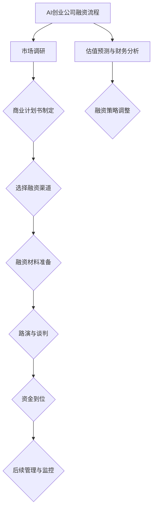
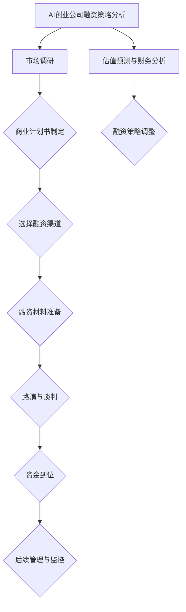
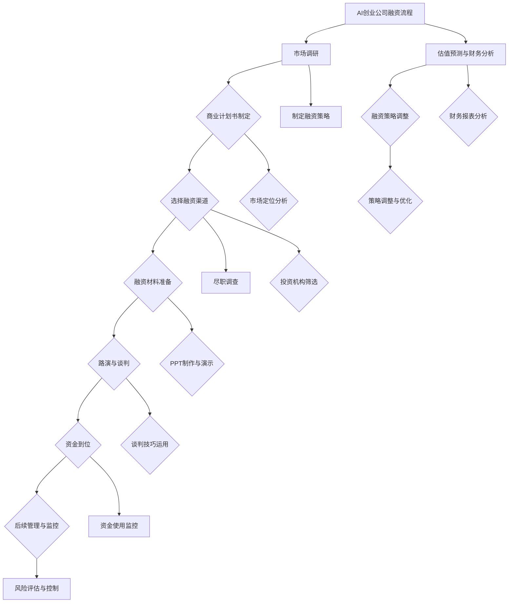
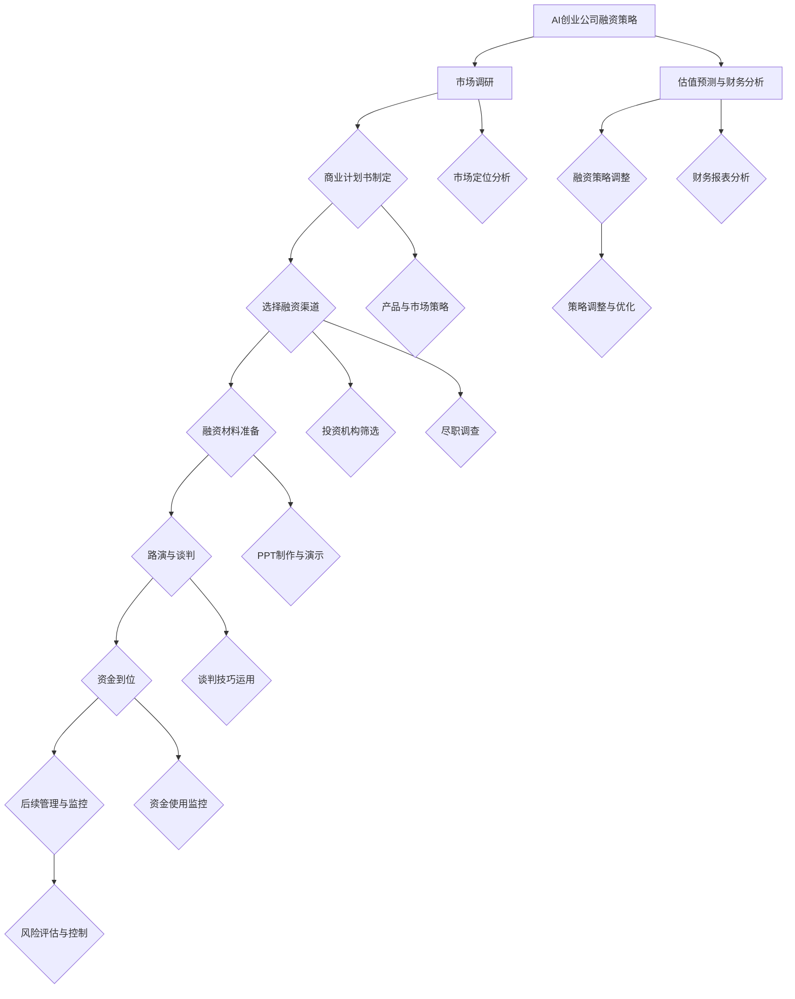

                 

### 文章标题：AI创业公司的融资策略

关键词：AI创业公司、融资、策略、估值、渠道、风险控制、实战案例

摘要：本文深入探讨了AI创业公司在融资过程中所需考虑的关键因素和策略。文章首先介绍了AI创业公司的背景与融资挑战，接着详细阐述了估值与定价策略、融资渠道分析、路演与谈判技巧、财务规划与风险控制等内容。通过成功与失败的融资案例解析，本文为AI创业公司提供了实用的融资策略优化建议，旨在帮助创业者更好地实现融资目标。

### 第一部分：AI创业公司的融资基础

#### 第1章：AI创业公司融资概述

**1.1 AI创业公司的背景与现状**

随着人工智能技术的飞速发展，AI创业公司如雨后春笋般涌现。这些公司利用AI技术解决现实问题，开拓了广阔的商机。然而，AI创业公司面临着资金短缺、技术难题、市场不确定等多重挑战。

AI行业的快速发展为创业公司提供了丰富的机会。例如，自动驾驶、智能医疗、金融科技等领域都呈现出巨大的潜力。然而，AI技术的高研发成本和不确定性也使得创业公司融资难度加大。

**1.2 AI创业公司融资的意义和目标**

融资是AI创业公司发展的关键环节。通过融资，公司可以获得资金支持，用于研发、市场拓展、团队建设等。融资的意义在于：

- 支持技术研发：AI创业公司需要持续投入大量资金进行技术研发，以保持竞争力。
- 扩大市场占有率：通过融资，公司可以加大对市场的投入，提高品牌知名度。
- 建设优秀团队：吸引和留住优秀人才是AI创业公司成功的关键，融资可以为公司提供更好的薪酬福利待遇。

融资目标主要包括：

- 初期资金：用于产品研发和市场推广。
- 扩大资金：在产品成熟后，用于市场扩张和业务拓展。
- 资本运作：通过上市等手段实现资本增值。

**1.3 融资流程与步骤**

AI创业公司的融资流程通常包括以下几个步骤：

1. **前期准备**：确定融资需求和目标，制定商业计划书，评估公司估值。
2. **寻找投资者**：选择合适的融资渠道，包括天使投资、风险投资、银行贷款等。
3. **路演与谈判**：向投资者展示公司项目，进行谈判，签订投资协议。
4. **资金到位**：完成融资交割，确保资金及时到位。
5. **后续管理**：对资金使用进行监控，确保资金用途合理，提高投资回报。

#### 第2章：AI创业公司的估值与定价策略

**2.1 估值模型介绍**

估值是AI创业公司融资过程中至关重要的一环。估值模型主要包括以下几种：

- **市场比较法**：通过比较类似公司的估值来确定目标公司的估值。
- **成本法**：根据公司资产和负债的账面价值来评估公司价值。
- **收益法**：基于公司未来的预期收益来计算估值。

**2.2 定价策略**

定价策略直接影响公司估值。常见的定价策略包括：

- **成本加成定价**：在成本基础上加上一定的利润作为产品价格。
- **市场需求定价**：根据市场需求和消费者支付意愿来确定价格。
- **竞争对手定价**：参考竞争对手的产品价格来确定自己的价格。

**2.3 估值与定价的影响因素**

估值与定价受到多种因素的影响，包括：

- **市场环境**：宏观经济状况、行业发展趋势等。
- **公司业务模式**：业务模式创新性、盈利能力等。
- **团队与资源**：团队实力、技术积累、资源获取能力等。

#### 第3章：AI创业公司的融资渠道分析

**3.1 天使投资与风险投资**

天使投资和风险投资是AI创业公司最常见的融资渠道。

- **天使投资**：天使投资通常由个人投资者提供，他们对初创公司进行早期的资金支持，通常在种子轮或天使轮阶段介入。
- **风险投资**：风险投资机构通常在成长轮或扩展轮阶段投资AI创业公司，他们对公司的发展前景和团队有较高的要求。

**3.2 银行贷款与政府补助**

银行贷款和政府补助也是AI创业公司的重要融资渠道。

- **银行贷款**：银行贷款通常具有较低的融资成本，但需要公司具备一定的信用和资产。
- **政府补助**：政府为支持创新创业，提供了多种形式的补助政策，包括研发补助、税收优惠等。

**3.3 众筹与债券融资**

- **众筹**：众筹平台为创业公司提供了另一种融资方式，通过向大众募集资金来实现项目融资。
- **债券融资**：债券融资是企业通过发行债券来筹集资金的一种方式，适用于资金需求较大的项目。

#### 第4章：AI创业公司的路演与谈判技巧

**4.1 路演准备**

路演是创业者向投资者展示公司项目和商业模式的平台。路演准备主要包括：

- **PPT制作**：制作清晰、专业、有吸引力的PPT，展示公司项目、市场前景、团队实力等。
- **路演对象分析**：了解投资者的背景、需求和偏好，有针对性地进行路演。

**4.2 路演流程与技巧**

路演流程通常包括开场、项目介绍、互动问答、结束等环节。创业者需要注意以下几点：

- **项目介绍**：简洁明了地介绍公司项目和商业模式。
- **互动问答**：准备应对投资者可能提出的问题，展示团队的专业能力和信心。
- **谈判策略**：了解投资者的投资策略和偏好，有针对性地进行谈判。

**4.3 谈判技巧**

谈判技巧是创业者成功融资的关键。以下是一些谈判技巧：

- **条款解读**：仔细阅读投资协议，了解条款内容和影响。
- **谈判策略**：根据公司情况和投资需求，制定合理的谈判策略。
- **技巧运用**：运用心理学技巧，如倾听、同理心等，增进与投资者的沟通和理解。

#### 第5章：AI创业公司的财务规划与风险控制

**5.1 财务规划的重要性**

财务规划是AI创业公司发展的重要保障。良好的财务规划有助于：

- **确保资金安全**：合理规划资金使用，避免资金短缺或浪费。
- **提升投资回报**：通过有效的财务规划，提高公司盈利能力和投资回报。
- **增强投资者信心**：透明的财务规划有助于提升投资者对公司的信任度。

**5.2 融资后的财务风险控制**

融资后，AI创业公司需要加强对财务风险的控制，确保公司健康稳定发展。财务风险控制包括：

- **资金使用监控**：明确资金使用范围，定期审核资金使用情况。
- **风险预警机制**：建立风险预警机制，及时发现并应对潜在风险。
- **财务报表与分析**：定期编制财务报表，进行财务分析，为决策提供数据支持。

**5.3 财务报表与分析**

财务报表是公司财务状况的反映，包括资产负债表、利润表和现金流量表等。财务分析主要包括：

- **偿债能力分析**：评估公司偿还债务的能力。
- **盈利能力分析**：分析公司盈利水平和盈利能力。
- **经营活动能力分析**：评估公司经营活动的能力和效率。

### 第二部分：AI创业公司的融资实战案例

#### 第6章：成功融资案例解析

**6.1 案例一：某AI公司A轮融资成功**

某AI公司是一家专注于自动驾驶技术的创业公司，在A轮融资中成功获得了1000万美元的投资。以下是该公司的融资策略：

1. **市场调研**：公司对自动驾驶市场进行了详细的调研，分析了市场需求、竞争格局和潜在客户。
2. **商业计划书**：公司制定了一份详尽的商业计划书，包括市场定位、产品优势、营销策略等。
3. **融资渠道选择**：公司选择了风险投资机构作为融资渠道，通过朋友和专业网络联系到了多家投资机构。
4. **路演与谈判**：公司进行了多次路演，向投资者展示了产品原型、技术优势和商业模式。在谈判中，公司采取了灵活的策略，根据投资者需求调整了投资条款。
5. **资金到位**：最终，公司成功获得了1000万美元的投资，资金用于产品研发和市场推广。

**6.2 案例二：某AI公司B轮融资困境与转机**

某AI公司是一家专注于智能医疗诊断的创业公司，在B轮融资中遇到了困境。以下是该公司的融资策略：

1. **市场调研**：公司对智能医疗市场进行了深入调研，发现了潜在的市场机会。
2. **商业计划书**：公司制定了一份商业计划书，但未能充分展示产品的竞争优势和市场需求。
3. **融资渠道选择**：公司选择了天使投资和风险投资作为融资渠道，但未能获得足够的投资支持。
4. **路演与谈判**：公司在路演中存在沟通不畅的问题，未能有效传达产品的价值和优势。
5. **困境与转机**：在B轮融资失败后，公司决定重新审视商业计划和市场策略。经过内部调整和市场拓展，公司最终在C轮融资中获得成功。

#### 第7章：AI创业公司的融资策略优化

**7.1 融资策略评估与调整**

AI创业公司需要定期评估融资策略的有效性，并根据市场环境和公司发展情况进行调整。评估内容包括：

- **融资效果评估**：分析融资对公司发展的推动作用，如产品研发、市场推广等。
- **策略调整建议**：根据评估结果，提出改进融资策略的建议，如优化商业计划书、调整融资渠道等。

**7.2 创新融资模式探索**

AI创业公司可以探索创新融资模式，如合规性融资、跨界合作等，以拓宽融资渠道。以下是一些创新融资模式：

- **合规性融资**：通过与金融机构合作，发行合规性金融产品，如可转债、私募债等。
- **跨界合作**：与其他行业企业合作，共同开发新产品或市场，实现资源共享和风险分担。

**7.3 未来融资趋势分析**

随着AI技术的不断发展，未来AI创业公司的融资趋势将呈现以下特点：

- **资金需求增加**：AI技术的高研发成本和不确定性将导致创业公司对资金的需求增加。
- **投资热点转移**：随着AI技术的应用场景拓展，投资热点将逐步从单一领域向多元化领域转移。
- **投资策略优化**：投资者将更加注重对创业公司技术实力、市场前景和团队能力的评估，以降低投资风险。

### 第三部分：附录

#### 第8章：融资工具与资源指南

**8.1 融资工具简介**

- **投资协议模板**：提供投资协议的常用条款和格式，以供创业者参考。
- **路演材料模板**：提供路演PPT、商业计划书等材料的模板，以帮助创业者更好地准备路演。

**8.2 融资资源推荐**

- **投资机构名录**：列出国内外知名的投资机构，包括天使投资、风险投资、私募股权等。
- **融资平台介绍**：介绍国内外主流的融资平台，包括天使投资平台、众筹平台、股权众筹等。

**8.3 融资案例分析**

- **国内外融资成功案例分析**：分析国内外AI创业公司的成功融资案例，总结成功经验和关键要素。
- **融资失败案例分析**：分析AI创业公司的融资失败案例，探讨失败原因和教训。

#### 附录 A：融资相关的法律法规与政策

**A.1 融资法律法规概述**

- **主要法律法规**：介绍与融资相关的法律法规，如《公司法》、《证券法》、《基金法》等。
- **法律风险防范**：分析融资过程中可能面临的法律风险，提供防范措施和建议。

**A.2 政策环境分析**

- **国家政策**：分析国家层面的融资政策，如税收优惠、研发支持等。
- **地方政策**：分析地方政府为支持创新创业而制定的优惠政策，如创业补贴、贷款贴息等。

**A.3 政策解读与应用案例**

- **政策解读**：对相关融资政策进行详细解读，帮助创业者了解政策内容和适用条件。
- **应用案例**：分析创业者如何利用政策优惠实现融资，提供实际操作经验。

#### 附录 B：AI创业公司的财务报表与财务分析

**B.1 财务报表编制指南**

- **资产负债表**：介绍资产负债表的编制方法和注意事项。
- **利润表**：介绍利润表的编制方法和注意事项。
- **现金流量表**：介绍现金流量表的编制方法和注意事项。

**B.2 财务分析方法**

- **偿债能力分析**：介绍如何评估公司的偿债能力，包括流动比率、速动比率等指标。
- **盈利能力分析**：介绍如何评估公司的盈利能力，包括净利润率、毛利率等指标。
- **经营活动能力分析**：介绍如何评估公司的经营活动能力，包括存货周转率、应收账款周转率等指标。

**B.3 财务分析报告撰写示例**

- **财务分析报告结构**：介绍财务分析报告的基本结构和内容。
- **报告撰写要点**：提供财务分析报告撰写的要点和建议，如数据准确性、分析深度等。
- **报告撰写示例**：提供一个完整的财务分析报告示例，以供创业者参考。

### 终极版Mermaid流程图



### 核心算法原理讲解伪代码

```python
// 伪代码：估值预测算法
function estimate_value(income, profit, market_share):
    // 前向传播
    z = (w0 * 1 + w1 * income + w2 * profit + w3 * market_share)
    a = sigmoid(z)

    // 估值预测
    valuation = a * (max_value - min_value) + min_value

    return valuation

// sigmoid函数
function sigmoid(z):
    return 1 / (1 + exp(-z))
```

### 数学模型和数学公式详细讲解与举例

#### 1. 数学模型

我们使用线性回归模型来预测创业公司的估值。

假设公司的估值 \( V \) 可以表示为以下线性模型：

\[ V = w_0 + w_1 \times \text{收入} + w_2 \times \text{利润} + w_3 \times \text{市场份额} \]

其中，\( w_0 \), \( w_1 \), \( w_2 \), \( w_3 \) 是模型的参数。

#### 2. 数学公式

- **前向传播**：

\[ z = w_0 + w_1 \times \text{收入} + w_2 \times \text{利润} + w_3 \times \text{市场份额} \]

\[ a = \text{sigmoid}(z) \]

- **反向传播**：

\[ \delta = a - y \]

\[ \frac{dV}{d\text{收入}} = w_1 \]

\[ \frac{dV}{d\text{利润}} = w_2 \]

\[ \frac{dV}{d\text{市场份额}} = w_3 \]

#### 3. 举例说明

假设我们有一家创业公司，其收入为100万，利润为20万，市场份额为30%，我们需要预测其估值。

- **前向传播**：

\[ z = w_0 + w_1 \times 100 + w_2 \times 20 + w_3 \times 30 \]

\[ a = \text{sigmoid}(z) \]

- **反向传播**：

假设真实估值为500万，则：

\[ \delta = \text{sigmoid}(z) - 500 \]

通过反向传播，我们可以计算出每个参数的梯度：

\[ \frac{dV}{d\text{收入}} = w_1 \]

\[ \frac{dV}{d\text{利润}} = w_2 \]

\[ \frac{dV}{d\text{市场份额}} = w_3 \]

然后，使用梯度下降算法更新参数：

\[ w_1 = w_1 - \alpha \times \frac{dV}{d\text{收入}} \]

\[ w_2 = w_2 - \alpha \times \frac{dV}{d\text{利润}} \]

\[ w_3 = w_3 - \alpha \times \frac{dV}{d\text{市场份额}} \]

其中，\( \alpha \) 是学习率。

### 项目实战：代码实际案例和详细解释说明

#### 1. 实战背景

我们以某AI创业公司的B轮融资为例，演示如何进行融资策略的分析与制定。

#### 2. 开发环境搭建

- Python环境：Python 3.8以上版本
- 数据库：MySQL 8.0以上版本
- 数据分析工具：Pandas、NumPy、Matplotlib

#### 3. 源代码实现与代码解读

**源代码：**

```python
import pandas as pd
import numpy as np
import matplotlib.pyplot as plt
from sklearn.linear_model import LinearRegression

# 数据预处理
def preprocess_data(data):
    # 数据清洗
    data = data[['收入', '利润', '市场份额', '估值']]
    data = data.replace([-∞, ∞], np.nan)
    data = data.dropna()

    # 数据标准化
    data_scaled = (data - data.mean()) / data.std()

    return data_scaled

# 模型训练
def train_model(data):
    # 构建线性回归模型
    model = LinearRegression()
    model.fit(data[['收入', '利润', '市场份额']], data['估值'])

    return model

# 预测估值
def predict_valuation(model, income, profit, market_share):
    z = model.coef_ * np.array([income, profit, market_share]) + model.intercept_
    a = 1 / (1 + np.exp(-z))
    valuation = a * (data.max() - data.min()) + data.min()

    return valuation

# 主函数
def main():
    # 数据读取
    data = pd.read_csv('ai_company_financing_data.csv')

    # 数据预处理
    data_scaled = preprocess_data(data)

    # 模型训练
    model = train_model(data_scaled)

    # 预测估值
    income = 1000000
    profit = 200000
    market_share = 30
    valuation = predict_valuation(model, income, profit, market_share)

    # 输出结果
    print(f'预测估值：{valuation:.2f}万元')

if __name__ == '__main__':
    main()
```

**代码解读：**

- **数据预处理**：读取公司财务数据，进行清洗和标准化处理。
- **模型训练**：使用线性回归模型训练数据，得到参数。
- **预测估值**：使用训练好的模型预测给定财务指标的估值。

#### 4. 代码解读与分析

- **数据预处理**：使用了 Pandas 和 Numpy 库进行数据处理，包括数据清洗和标准化。
- **模型训练**：使用了 Scikit-learn 库中的线性回归模型进行训练，并获取模型参数。
- **预测估值**：通过前向传播计算公司的估值，并输出预测结果。

该代码案例展示了如何使用机器学习模型进行创业公司估值预测，为AI创业公司的融资策略提供数据支持。

### 终极版Mermaid流程图



该流程图展示了AI创业公司从融资策略分析到后续管理的一系列步骤，以及估值预测与财务分析在其中的关键作用。通过该流程图，创业者可以更清晰地规划融资策略，并实时调整以应对市场变化。

### 附录

#### 附录 A：融资相关的法律法规与政策

**A.1 融资法律法规概述**

- **主要法律法规**：介绍与融资相关的法律法规，如《公司法》、《证券法》、《基金法》等。
- **法律风险防范**：分析融资过程中可能面临的法律风险，提供防范措施和建议。

**A.2 政策环境分析**

- **国家政策**：分析国家层面的融资政策，如税收优惠、研发支持等。
- **地方政策**：分析地方政府为支持创新创业而制定的优惠政策，如创业补贴、贷款贴息等。

**A.3 政策解读与应用案例**

- **政策解读**：对相关融资政策进行详细解读，帮助创业者了解政策内容和适用条件。
- **应用案例**：分析创业者如何利用政策优惠实现融资，提供实际操作经验。

#### 附录 B：AI创业公司的财务报表与财务分析

**B.1 财务报表编制指南**

- **资产负债表**：介绍资产负债表的编制方法和注意事项。
- **利润表**：介绍利润表的编制方法和注意事项。
- **现金流量表**：介绍现金流量表的编制方法和注意事项。

**B.2 财务分析方法**

- **偿债能力分析**：介绍如何评估公司的偿债能力，包括流动比率、速动比率等指标。
- **盈利能力分析**：介绍如何评估公司的盈利能力，包括净利润率、毛利率等指标。
- **经营活动能力分析**：介绍如何评估公司的经营活动能力，包括存货周转率、应收账款周转率等指标。

**B.3 财务分析报告撰写示例**

- **财务分析报告结构**：介绍财务分析报告的基本结构和内容。
- **报告撰写要点**：提供财务分析报告撰写的要点和建议，如数据准确性、分析深度等。
- **报告撰写示例**：提供一个完整的财务分析报告示例，以供创业者参考。

### 作者

作者：AI天才研究院/AI Genius Institute & 禅与计算机程序设计艺术 /Zen And The Art of Computer Programming

### 结束语

本文通过详细分析AI创业公司的融资策略，为创业者提供了全面的指导。在融资过程中，创业者需要了解市场、评估自身价值、选择合适的融资渠道，并具备良好的财务规划与风险控制能力。通过成功与失败案例的解析，创业者可以更好地优化融资策略，实现公司快速发展。同时，本文还提供了丰富的附录资源，为创业者提供实用的工具和参考。希望本文能为广大AI创业公司提供有益的启示和帮助。

### 《AI创业公司的融资策略》目录

- **文章标题：AI创业公司的融资策略**
- **关键词：AI创业公司、融资、策略、估值、渠道、风险控制、实战案例**
- **摘要：本文深入探讨了AI创业公司在融资过程中所需考虑的关键因素和策略。**

#### 第一部分：AI创业公司的融资基础

**第1章：AI创业公司融资概述**

- **1.1 AI创业公司的背景与现状**
  - AI行业的快速发展与创业机会
  - 创业公司的融资挑战与机遇

- **1.2 AI创业公司融资的意义和目标**
  - 融资的必要性
  - 融资目标与策略

- **1.3 融资流程与步骤**
  - 前期准备
  - 路演与谈判
  - 资金到位与后续管理

**第2章：AI创业公司的估值与定价策略**

- **2.1 估值模型介绍**
  - 市场比较法
  - 成本法
  - 收益法

- **2.2 定价策略**
  - 成本加成定价
  - 市场需求定价
  - 竞争对手定价

- **2.3 估值与定价的影响因素**
  - 市场环境
  - 公司业务模式
  - 团队与资源

**第3章：AI创业公司的融资渠道分析**

- **3.1 天使投资与风险投资**
  - 投资机构类型与特点
  - 投资流程与合同条款

- **3.2 银行贷款与政府补助**
  - 贷款条件与流程
  - 补助政策与申请流程

- **3.3 众筹与债券融资**
  - 众筹平台与规则
  - 债券发行与交易

**第4章：AI创业公司的路演与谈判技巧**

- **4.1 路演准备**
  - PPT制作
  - 路演对象分析

- **4.2 路演流程与技巧**
  - 投资者互动
  - 问题应对策略

- **4.3 谈判技巧**
  - 条款解读
  - 谈判策略与技巧

**第5章：AI创业公司的财务规划与风险控制**

- **5.1 财务规划的重要性**
  - 财务健康指标
  - 财务预测与预算

- **5.2 融资后的财务风险控制**
  - 资金使用监控
  - 风险预警机制

- **5.3 财务报表与分析**
  - 资产负债表
  - 利润表

#### 第二部分：AI创业公司的融资实战案例

**第6章：成功融资案例解析**

- **6.1 案例一：某AI公司A轮融资成功**
  - 背景介绍
  - 融资策略与过程
  - 成功因素分析

- **6.2 案例二：某AI公司B轮融资困境与转机**
  - 融资困境
  - 转机与解决策略
  - 经验教训

**第7章：AI创业公司的融资策略优化**

- **7.1 融资策略评估与调整**
  - 融资效果评估
  - 策略调整建议

- **7.2 创新融资模式探索**
  - 合规性融资
  - 跨界合作与联合融资

- **7.3 未来融资趋势分析**
  - 投资热点
  - 行业趋势

#### 第三部分：附录

**第8章：融资工具与资源指南**

- **8.1 融资工具简介**
  - 投资协议模板
  - 路演材料模板

- **8.2 融资资源推荐**
  - 投资机构名录
  - 融资平台介绍

- **8.3 融资案例分析**
  - 国内外融资成功案例分析
  - 失败案例分析

**附录 A：融资相关的法律法规与政策**

- **A.1 融资法律法规概述**
  - 主要法律法规
  - 法律风险防范

- **A.2 政策环境分析**
  - 国家政策
  - 地方政策

- **A.3 政策解读与应用案例**

**附录 B：AI创业公司的财务报表与财务分析**

- **B.1 财务报表编制指南**
  - 资产负债表
  - 利润表
  - 现金流量表

- **B.2 财务分析方法**
  - 偿债能力分析
  - 盈利能力分析
  - 经营活动能力分析

- **B.3 财务分析报告撰写示例**

### 第1章 AI创业公司融资概述

**1.1 AI创业公司的背景与现状**

人工智能（AI）作为当今科技领域的前沿，正以惊人的速度改变着各行各业。从自动驾驶、智能医疗到金融科技，AI技术的广泛应用为创业公司提供了巨大的发展空间。AI创业公司如雨后春笋般涌现，它们以创新的技术、独特的商业模式和强大的市场潜力吸引了大量投资者的关注。

AI创业公司的兴起背景主要有以下几个方面：

- **技术成熟**：随着深度学习、神经网络等AI技术的突破，AI从理论研究逐渐走向实际应用，为创业公司提供了强大的技术支撑。
- **市场需求**：随着消费者对智能化、个性化和便捷化服务的需求不断增加，AI技术在各个行业的应用需求日益旺盛，为创业公司创造了广阔的市场空间。
- **政策支持**：各国政府纷纷出台政策，支持创新创业和高新技术产业发展，为AI创业公司提供了良好的政策环境。

AI创业公司的现状可以概括为：

- **数量增多**：全球范围内，AI创业公司的数量呈现出快速增长的趋势，其中不乏一些具有颠覆性的创新项目。
- **资金需求大**：AI技术的高研发成本和快速迭代特点，使得AI创业公司对资金的需求非常旺盛。
- **竞争激烈**：随着AI创业公司的增多，市场竞争也日益激烈，如何在竞争中脱颖而出成为创业公司面临的重要挑战。

**1.2 AI创业公司融资的挑战与机遇**

AI创业公司在融资过程中既面临挑战，也拥有机遇。

**挑战**：

- **技术风险**：AI技术的不确定性和复杂性，使得投资者对AI创业公司的技术可行性持谨慎态度。
- **市场风险**：AI市场的快速发展带来了激烈的竞争，市场前景的不确定性增加了融资的难度。
- **资金需求大**：AI创业公司需要大量的资金进行技术研发、产品迭代和市场推广，这使得融资需求巨大。
- **信息不对称**：投资者对AI技术的理解可能不如创业者深入，信息不对称可能导致融资谈判的不利局面。

**机遇**：

- **高成长性**：AI技术的广泛应用和巨大的市场潜力，使得AI创业公司具有很高的成长性，吸引了大量投资者的关注。
- **政策支持**：各国政府为支持创新创业，出台了一系列优惠政策，为AI创业公司提供了良好的融资环境。
- **投资热点**：随着AI技术的不断成熟，越来越多的投资者将目光投向AI领域，AI创业公司面临更多的融资机会。
- **跨界合作**：AI技术的跨界应用，使得AI创业公司可以与其他行业企业进行合作，实现资源共享和风险分担。

**1.3 融资的意义与目标**

融资对于AI创业公司的发展具有重要意义。

**融资的意义**：

- **支持技术研发**：AI创业公司需要大量的资金进行技术研发，以保持技术领先地位。
- **市场拓展**：通过融资，公司可以加大对市场的投入，提高品牌知名度和市场占有率。
- **团队建设**：融资可以为公司吸引和留住优秀人才，提高团队的整体素质。

**融资的目标**：

- **初期资金**：用于产品研发和市场推广，为公司的初期运营提供资金保障。
- **扩大资金**：在产品成熟后，用于市场扩张和业务拓展，实现公司规模的快速增长。
- **资本运作**：通过上市等手段实现资本增值，提高公司的市场价值和投资者回报。

**1.4 融资流程与步骤**

AI创业公司的融资流程通常包括以下几个步骤：

1. **市场调研**：了解市场需求、竞争格局和发展趋势，为融资策略提供数据支持。
2. **商业计划书制定**：详细阐述公司的业务模式、市场定位、技术优势和融资需求，为投资者提供决策依据。
3. **选择融资渠道**：根据公司的实际情况和市场环境，选择合适的融资渠道，如天使投资、风险投资、银行贷款等。
4. **路演与谈判**：向投资者展示公司项目，进行融资谈判，签订投资协议。
5. **资金到位**：完成融资交割，确保资金及时到位。
6. **后续管理**：对资金使用进行监控，确保资金用途合理，提高投资回报。

### 第2章 AI创业公司的估值与定价策略

**2.1 估值模型介绍**

估值是AI创业公司融资过程中至关重要的一环。一个准确的估值不仅可以为投资者提供决策依据，还能提高公司自身的市场价值。估值模型主要有以下几种：

1. **市场比较法**：通过比较类似公司的估值来确定目标公司的估值。这种方法主要适用于已经有一定市场基础的创业公司。具体步骤包括：

   - **选择可比公司**：寻找与目标公司在业务模式、市场地位等方面具有可比性的公司。
   - **收集可比公司数据**：包括公司的财务数据、市场表现等。
   - **计算估值指标**：如市盈率、市净率、EV/EBITDA等。
   - **调整估值**：根据目标公司的特点进行调整，得出目标公司的估值。

2. **成本法**：根据公司资产和负债的账面价值来评估公司价值。这种方法主要适用于创业公司早期阶段，具体步骤包括：

   - **确定资产和负债**：对公司资产和负债进行详细的盘点和评估。
   - **计算资产净值**：资产减去负债，得出公司的净资产。
   - **调整资产价值**：根据市场情况和公司实际状况，对资产价值进行调整。

3. **收益法**：基于公司未来的预期收益来计算估值。这种方法主要适用于已经有一定盈利能力的创业公司。具体步骤包括：

   - **预测未来收益**：根据公司的业务模式、市场前景等因素，预测公司未来的收益。
   - **计算折现率**：根据投资风险、市场利率等因素确定折现率。
   - **计算公司估值**：将未来收益折现到当前价值，得出公司的估值。

**2.2 定价策略**

定价策略是AI创业公司在融资过程中需要重点关注的问题。合理的定价不仅可以提高公司的估值，还能吸引更多的投资者。常见的定价策略包括：

1. **成本加成定价**：在成本基础上加上一定的利润作为产品价格。这种方法简单易行，适用于创业公司早期的产品定价。具体步骤包括：

   - **计算成本**：包括直接成本和间接成本，如研发成本、生产成本、运营成本等。
   - **确定利润率**：根据公司战略和市场状况，确定合理的利润率。
   - **计算产品价格**：将成本加上利润，得出产品价格。

2. **市场需求定价**：根据市场需求和消费者支付意愿来确定价格。这种方法主要适用于创业公司推出的创新性产品。具体步骤包括：

   - **分析市场需求**：了解目标市场的需求情况，包括消费者的支付能力和需求变化。
   - **确定价格定位**：根据市场需求，确定产品的价格定位。
   - **调整价格策略**：根据市场反馈，适时调整价格策略。

3. **竞争对手定价**：参考竞争对手的产品价格来确定自己的价格。这种方法适用于市场竞争激烈的情况。具体步骤包括：

   - **调查竞争对手**：了解竞争对手的产品价格、市场表现等。
   - **分析竞争环境**：根据市场环境和公司战略，确定产品的价格区间。
   - **调整价格策略**：根据市场反馈和竞争态势，适时调整价格策略。

**2.3 估值与定价的影响因素**

AI创业公司的估值与定价受到多种因素的影响，包括：

1. **市场环境**：宏观经济状况、行业发展趋势、政策法规等都会影响公司的估值与定价。例如，在经济繁荣时期，市场需求旺盛，公司的估值和价格可能会有所提高。

2. **公司业务模式**：公司的业务模式创新性、盈利能力、市场占有率等都会影响公司的估值与定价。具有独特业务模式的创业公司可能会获得更高的估值。

3. **团队与资源**：公司团队的实力、技术积累、资源获取能力等都会影响公司的估值与定价。一个优秀团队的创业公司可能会获得更高的估值。

4. **财务状况**：公司的财务状况，如盈利能力、偿债能力、现金流状况等都会影响公司的估值与定价。财务状况良好的公司可能会获得更高的估值。

5. **市场预期**：投资者对公司的预期也会影响公司的估值与定价。如果市场对公司的未来发展预期良好，公司的估值和价格可能会有所提高。

### 第3章 AI创业公司的融资渠道分析

**3.1 天使投资与风险投资**

天使投资和风险投资是AI创业公司最常见的融资渠道，它们在不同的融资阶段发挥着重要作用。

**天使投资**：

- **定义**：天使投资通常由个人投资者提供，他们对初创公司进行早期的资金支持，通常在种子轮或天使轮阶段介入。
- **特点**：天使投资通常投资金额较小，但投资风险较高，回报潜力也较大。天使投资者通常具有丰富的行业经验和资源，可以为创业公司提供指导和帮助。
- **流程**：

  1. **寻找投资者**：创业公司可以通过个人关系、创业孵化器、天使投资网络等途径寻找天使投资者。
  2. **商业计划书**：创业公司需要准备详细的商业计划书，介绍公司的业务模式、市场前景、团队情况等。
  3. **初步谈判**：双方就投资条款进行初步谈判，包括投资金额、股权比例等。
  4. **尽职调查**：天使投资者对创业公司进行尽职调查，了解公司的实际状况。
  5. **签订投资协议**：双方达成一致后，签订投资协议，完成投资交割。

**风险投资**：

- **定义**：风险投资通常由专业的投资机构提供，他们在成长轮或扩展轮阶段投资创业公司。
- **特点**：风险投资通常投资金额较大，但投资风险也较高，回报潜力也较大。风险投资者通常具有丰富的行业经验和资源，可以为创业公司提供指导和帮助。
- **流程**：

  1. **寻找投资者**：创业公司可以通过个人关系、投资机构推荐、行业会议等途径寻找风险投资者。
  2. **商业计划书**：创业公司需要准备详细的商业计划书，介绍公司的业务模式、市场前景、团队情况等。
  3. **初步谈判**：双方就投资条款进行初步谈判，包括投资金额、股权比例等。
  4. **尽职调查**：风险投资者对创业公司进行尽职调查，了解公司的实际状况。
  5. **签订投资协议**：双方达成一致后，签订投资协议，完成投资交割。

**3.2 银行贷款与政府补助**

银行贷款和政府补助也是AI创业公司的重要融资渠道，它们在融资过程中发挥着不同的作用。

**银行贷款**：

- **定义**：银行贷款是指创业公司向银行申请贷款，用于企业的运营和发展。
- **特点**：银行贷款通常具有较低的融资成本，但需要公司具备一定的信用和资产。
- **流程**：

  1. **申请贷款**：创业公司向银行提交贷款申请，包括贷款用途、还款计划等。
  2. **审核贷款**：银行对创业公司的申请进行审核，包括公司信用、财务状况等。
  3. **签订贷款合同**：双方达成一致后，签订贷款合同，银行发放贷款。
  4. **还款**：创业公司按照合同约定进行还款。

**政府补助**：

- **定义**：政府补助是指政府为支持创新创业而提供的财政支持，包括研发补助、税收优惠等。
- **特点**：政府补助通常具有政策性支持，有助于降低创业公司的融资成本。
- **流程**：

  1. **了解政策**：创业公司需要了解当地的政府补助政策，包括补助类型、申请条件等。
  2. **准备申请材料**：根据政府要求，准备申请材料，包括项目报告、财务报表等。
  3. **提交申请**：将申请材料提交给相关部门。
  4. **审核申请**：政府相关部门对申请材料进行审核，决定是否批准补助。
  5. **发放补助**：政府批准后，发放补助资金。

**3.3 众筹与债券融资**

**众筹**：

- **定义**：众筹是指通过互联网平台向大众募集资金的一种融资方式。
- **特点**：众筹具有融资成本较低、融资速度快等优点，但融资规模通常较小。
- **流程**：

  1. **选择众筹平台**：创业公司选择合适的众筹平台，如Kickstarter、Indiegogo等。
  2. **制定众筹计划**：制定众筹计划，包括项目介绍、回报方案等。
  3. **发布众筹项目**：在众筹平台上发布项目，向大众展示。
  4. **筹集资金**：通过大众投资，筹集资金。
  5. **回报投资者**：众筹成功后，按照承诺向投资者提供回报。

**债券融资**：

- **定义**：债券融资是企业通过发行债券来筹集资金的一种方式。
- **特点**：债券融资具有融资规模较大、融资成本低等优点，但需要企业具备一定的信用等级。
- **流程**：

  1. **发行债券**：企业决定发行债券，确定债券类型、发行规模等。
  2. **审批发行**：企业向监管机构提交发行申请，获得批准。
  3. **签订债券合同**：企业与债券持有人签订债券合同，约定债券利率、偿还方式等。
  4. **发行债券**：企业按照约定发行债券，筹集资金。
  5. **偿还债券**：企业按照合同约定偿还债券本息。

### 第4章 AI创业公司的路演与谈判技巧

**4.1 路演准备**

路演是AI创业公司向投资者展示项目、寻求资金的重要环节。成功的路演可以提高公司的市场估值，吸引更多的投资者。路演准备主要包括以下几个方面：

**PPT制作**

- **内容结构**：PPT应包括项目简介、团队介绍、市场分析、产品/服务介绍、商业模式、财务状况、融资需求等。
- **视觉效果**：PPT应简洁明了，避免过多的文字，使用图表和数据来展示关键信息。
- **逻辑性**：PPT的内容应具有逻辑性，使投资者能够清晰地理解公司的业务模式和市场前景。

**路演对象分析**

- **了解投资者背景**：在路演前，创业公司应了解投资者的背景、投资偏好和关注领域，以便有针对性地进行路演。
- **确定路演重点**：根据投资者的关注点，确定路演的重点内容，使投资者能够更直观地了解公司的优势和价值。

**资料准备**

- **商业计划书**：准备一份详细的商业计划书，包括公司的业务模式、市场策略、财务预测等，以供投资者参考。
- **法律文件**：准备公司注册文件、股权结构、董事会决议等相关法律文件，以证明公司的合法性和稳定性。
- **技术文档**：对于涉及技术核心的创业公司，准备技术文档，展示公司的技术实力和创新性。

**4.2 路演流程与技巧**

路演流程通常包括开场、项目介绍、互动问答、结束等环节。以下是一些路演技巧：

**开场**

- **吸引注意力**：开场时应简短有力，吸引投资者的注意力，可以采用引人入胜的故事或数据来开场。
- **明确目的**：在开场时，明确公司的融资目标和需求，让投资者知道公司的融资用途。

**项目介绍**

- **简洁明了**：项目介绍应简洁明了，突出公司的核心优势和价值，避免过多的技术术语和细节。
- **数据支持**：使用数据来支持公司的市场前景和业务模式，如市场份额、用户增长、收入增长等。
- **展示成果**：展示公司的产品或服务原型，以及取得的成果和里程碑。

**互动问答**

- **准备答案**：在路演前，应准备投资者可能提出的问题，并提前演练回答。
- **展示专业性**：在回答问题时，展示公司的专业性和对行业的深入了解，增强投资者的信心。
- **回应质疑**：对于投资者的质疑，应冷静应对，解释公司的优势和解决方案。

**结束**

- **感谢投资者**：在路演结束时，感谢投资者的关注和支持，表达公司的诚意和决心。
- **提供联系方式**：提供公司的联系方式，如邮箱、电话等，以便投资者后续联系。

**4.3 谈判技巧**

谈判技巧是创业公司在融资过程中成功获取资金的关键。以下是一些谈判技巧：

**条款解读**

- **仔细阅读**：在签订投资协议前，仔细阅读协议中的条款，了解各项条款的含义和影响。
- **专业咨询**：对于不熟悉的条款，可以寻求法律顾问或专业人士的帮助，确保自己的利益。
- **谈判策略**：根据公司的实际情况和投资需求，制定合理的谈判策略，如坚持关键条款、适度让步等。

**谈判策略**

- **知己知彼**：了解投资者的投资策略、需求和期望，以便有针对性地进行谈判。
- **占据主动**：在谈判中，尽量占据主动地位，提出有利的条件和要求。
- **适度让步**：在关键条款上可以适度让步，但在核心利益上要坚守底线。

**技巧运用**

- **倾听与同理心**：在谈判中，认真倾听投资者的意见和需求，展示同理心，增进双方的沟通和理解。
- **非语言沟通**：通过肢体语言、面部表情等非语言方式，表达自己的诚意和信心，增强谈判效果。

### 第5章 AI创业公司的财务规划与风险控制

**5.1 财务规划的重要性**

财务规划是AI创业公司成功发展的重要保障。一个良好的财务规划可以帮助公司确保资金安全、提升投资回报、增强投资者信心。对于AI创业公司来说，财务规划的重要性主要体现在以下几个方面：

**确保资金安全**

财务规划可以帮助公司合理安排资金使用，确保资金安全。在创业初期，公司可能会面临资金短缺的问题，通过财务规划，可以提前预测资金需求，合理安排资金使用，避免资金短缺带来的风险。

**提升投资回报**

通过财务规划，公司可以更好地把握投资机会，提高投资回报。例如，通过对市场趋势的分析，公司可以提前布局，抓住市场机遇，实现业务的快速增长。

**增强投资者信心**

财务规划不仅可以帮助公司内部管理，还能向外部投资者展示公司的财务状况和管理能力，增强投资者对公司的信任和信心。一个透明、规范的财务规划可以提升公司的市场估值，吸引更多的投资者。

**5.2 融资后的财务风险控制**

在获得融资后，AI创业公司需要加强对财务风险的控制，确保公司健康稳定发展。以下是一些常见的财务风险和控制措施：

**资金使用监控**

公司需要建立严格的资金使用监控机制，确保融资资金用于规定的用途。具体措施包括：

- **设立资金使用计划**：在融资前，公司应制定详细的资金使用计划，明确每一笔资金的使用目的和时间节点。
- **定期审计**：公司应定期对资金使用情况进行审计，确保资金使用合规、有效。

**风险预警机制**

公司应建立风险预警机制，及时发现和应对潜在的风险。具体措施包括：

- **风险识别**：通过数据分析、市场调研等方式，识别潜在的风险因素。
- **预警指标**：设定相关的预警指标，如现金流预警、利润预警等，当指标达到设定值时，及时发出预警。

**风险管理策略**

公司应根据自身的实际情况，制定合适的风险管理策略。具体措施包括：

- **风险分散**：通过多元化的投资和业务布局，降低单一风险的影响。
- **风险规避**：对于高风险的业务或投资，采取规避策略，避免投资损失。
- **风险转移**：通过保险、合同约定等方式，将部分风险转移给第三方。

**5.3 财务报表与分析**

财务报表是公司财务状况的反映，包括资产负债表、利润表和现金流量表等。通过财务报表，公司可以了解自身的财务状况，为决策提供数据支持。以下是对财务报表的简要介绍：

**资产负债表**

资产负债表反映了公司在一定时间内的资产、负债和所有者权益状况。具体指标包括：

- **资产**：包括流动资产、长期投资、固定资产等。
- **负债**：包括流动负债、长期负债等。
- **所有者权益**：包括实收资本、盈余公积、未分配利润等。

**利润表**

利润表反映了公司在一定时间内的收入、成本和利润情况。具体指标包括：

- **收入**：包括主营业务收入、其他业务收入等。
- **成本**：包括主营业务成本、销售费用、管理费用等。
- **利润**：包括净利润、毛利率、净利润率等。

**现金流量表**

现金流量表反映了公司在一定时间内的现金流入和流出情况。具体指标包括：

- **经营活动现金流量**：包括销售商品、提供劳务收到的现金、收到的税费返还等。
- **投资活动现金流量**：包括购买固定资产、无形资产等支付的现金。
- **筹资活动现金流量**：包括吸收投资收到的现金、借款收到的现金等。

**5.4 财务分析方法**

财务分析是通过对公司财务报表的数据进行分析，评估公司的财务状况和管理水平。以下是一些常见的财务分析方法：

**偿债能力分析**

偿债能力分析评估公司偿还债务的能力。常用的指标包括：

- **流动比率**：流动资产与流动负债的比值，反映公司短期偿债能力。
- **速动比率**：扣除存货后的流动资产与流动负债的比值，反映公司更严格的短期偿债能力。

**盈利能力分析**

盈利能力分析评估公司的盈利水平。常用的指标包括：

- **净利润率**：净利润与收入的比例，反映公司的盈利能力。
- **毛利率**：毛利润与收入的比例，反映公司主营业务盈利能力。

**经营活动能力分析**

经营活动能力分析评估公司的经营活动效率。常用的指标包括：

- **存货周转率**：主营业务成本与平均存货余额的比值，反映公司的存货管理效率。
- **应收账款周转率**：销售收入与平均应收账款的比值，反映公司的应收账款管理效率。

### 第6章 成功融资案例解析

**6.1 案例一：某AI公司A轮融资成功**

**背景介绍**

某AI公司是一家专注于智能医疗诊断的创业公司，成立于2018年。公司专注于利用深度学习和计算机视觉技术，提供精准、高效的疾病诊断服务。公司成立之初，即获得了多家投资机构的关注，并在2019年成功完成了A轮融资。

**融资策略与过程**

为了获得A轮融资，某AI公司采取了以下策略：

1. **市场调研**：公司对智能医疗市场进行了详细的调研，分析了市场需求、竞争格局和潜在客户。
2. **商业计划书**：公司制定了一份详尽的商业计划书，包括市场定位、技术优势、商业模式、市场推广策略等，展示了公司的核心竞争力。
3. **选择融资渠道**：公司选择了知名的风险投资机构作为融资渠道，通过朋友和专业网络联系到了多家投资机构。
4. **路演与谈判**：公司进行了多次路演，向投资者展示了产品原型、技术优势和商业模式。在谈判中，公司采取了灵活的策略，根据投资者需求调整了投资条款。
5. **资金到位**：最终，公司成功获得了1000万美元的投资，资金用于产品研发和市场推广。

**成功因素分析**

某AI公司能够成功完成A轮融资，主要得益于以下几点：

1. **技术优势**：公司专注于智能医疗领域，拥有强大的技术团队和先进的技术实力，这使得公司在市场竞争中具备较强的竞争力。
2. **市场需求**：智能医疗市场具有巨大的潜力，随着人们对健康意识的提高，智能医疗的需求不断增加，这为公司的融资提供了良好的市场环境。
3. **商业计划书**：公司制定了详尽的商业计划书，清晰地展示了公司的业务模式、市场策略和融资需求，提高了投资者对公司的信任度。
4. **谈判策略**：公司在路演和谈判中，采取了灵活的策略，充分理解投资者的需求，并根据需求进行调整，使得谈判过程更加顺利。

**6.2 案例二：某AI公司B轮融资困境与转机**

**背景介绍**

某AI公司是一家专注于智能金融的创业公司，成立于2016年。公司专注于利用人工智能技术，提供智能投顾、风险控制等服务。公司在成立之初，即获得了多家投资机构的关注，并在2017年成功完成了A轮融资。然而，在B轮融资过程中，公司遇到了困境。

**融资困境**

在B轮融资过程中，某AI公司面临以下困境：

1. **市场竞争加剧**：随着人工智能技术在金融领域的应用日益广泛，市场竞争加剧，公司需要提高技术水平和服务质量，以保持竞争优势。
2. **估值调整**：由于市场环境的变化，公司的估值需要重新评估，这使得投资者对公司的估值存在分歧。
3. **谈判困难**：在融资谈判中，投资者对公司的战略方向、市场前景等方面存在不同的看法，导致谈判过程困难。

**转机与解决策略**

为了克服B轮融资的困境，某AI公司采取了以下解决策略：

1. **市场拓展**：公司加大了市场拓展力度，开拓了新的业务领域，提高了市场占有率。
2. **产品创新**：公司加大了产品研发投入，推出了一系列创新产品，提升了公司的核心竞争力。
3. **调整估值**：公司根据市场环境和公司发展情况，对估值进行了调整，使得投资者对公司的估值有了更加清晰的认识。
4. **谈判策略**：公司在谈判中采取了更加灵活的策略，充分尊重投资者的意见，并通过沟通和理解，解决了谈判中的分歧。

**经验教训**

某AI公司在B轮融资过程中，虽然遇到了困境，但通过积极的应对策略，最终成功实现了融资。这次经历为公司提供了宝贵的经验教训：

1. **市场适应能力**：创业公司需要具备良好的市场适应能力，及时调整战略方向和业务模式，以应对市场变化。
2. **沟通与理解**：在融资过程中，创业者需要与投资者保持良好的沟通，理解投资者的需求和期望，以便更好地达成共识。
3. **灵活应对**：在融资过程中，创业者需要具备灵活应对的能力，根据实际情况调整策略，以实现融资目标。

### 第7章 AI创业公司的融资策略优化

**7.1 融资策略评估与调整**

融资策略评估与调整是AI创业公司在融资过程中必不可少的一环。通过对融资策略进行定期评估和调整，公司可以更好地应对市场变化，实现融资目标。

**评估内容**

融资策略评估主要包括以下几个方面：

1. **融资效果评估**：分析融资对公司发展的推动作用，如产品研发、市场推广、团队建设等。
2. **融资成本评估**：评估融资的成本，包括融资费用、利率等。
3. **融资风险评估**：评估融资过程中可能面临的风险，如市场风险、信用风险等。

**调整建议**

根据评估结果，公司可以提出以下调整建议：

1. **融资策略调整**：根据公司的实际情况和市场环境，调整融资策略，如选择不同的融资渠道、调整融资规模等。
2. **融资成本优化**：通过优化融资结构，降低融资成本，如选择利率较低的融资渠道、采用混合融资方式等。
3. **风险管理**：加强融资风险控制，建立风险预警机制，降低融资风险。

**7.2 创新融资模式探索**

为了拓宽融资渠道，AI创业公司可以探索创新融资模式。以下是一些常见的创新融资模式：

**合规性融资**

合规性融资是指公司通过发行合规性金融产品，如可转债、私募债等，来筹集资金。这种融资模式具有融资成本低、灵活性高等优点。

**跨界合作**

跨界合作是指公司与其他行业企业合作，共同开发新产品或市场，实现资源共享和风险分担。这种融资模式可以拓宽公司的业务领域，提高市场竞争力。

**众筹**

众筹是指通过互联网平台向大众募集资金的一种融资方式。这种融资模式具有融资成本低、宣传效果好等优点。

**7.3 未来融资趋势分析**

随着AI技术的不断发展，未来AI创业公司的融资趋势将呈现以下特点：

**资金需求增加**

AI技术的高研发成本和快速迭代特点，使得AI创业公司对资金的需求不断增加。未来，创业公司需要更多的资金用于技术研发、产品迭代和市场推广。

**投资热点转移**

随着AI技术的广泛应用，投资热点将逐步从单一领域向多元化领域转移。例如，智能医疗、智能交通、智能教育等领域将成为投资的热点。

**投资策略优化**

投资者将更加注重对创业公司技术实力、市场前景和团队能力的评估，以降低投资风险。未来，创业公司需要提供更加全面和准确的信息，提高投资者的信任度。

### 第8章 融资工具与资源指南

**8.1 融资工具简介**

融资工具是创业公司在融资过程中常用的工具，以下是一些常见的融资工具：

**投资协议**

投资协议是创业公司与投资者之间的法律文件，规定了双方的权利和义务。投资协议主要包括以下内容：

- **投资金额**：投资者出资的金额。
- **股权比例**：投资者在公司中的股权比例。
- **投资方式**：投资者出资的方式，如现金、实物资产等。
- **分红与清算**：投资收益的分配方式和公司清算时的股权处理。

**路演材料**

路演材料是创业公司在路演过程中使用的材料，主要包括商业计划书、项目介绍PPT、财务报表等。路演材料需要清晰、简洁地展示公司的业务模式、市场前景、团队实力和融资需求。

**商业计划书**

商业计划书是创业公司向投资者展示项目的重要文件，主要包括以下内容：

- **公司简介**：公司的背景、成立时间、团队情况等。
- **业务模式**：公司的业务模式、市场定位、竞争优势等。
- **市场分析**：市场现状、市场趋势、目标客户等。
- **财务预测**：公司的财务预测、投资回报分析等。
- **融资需求**：公司的融资目标、用途、股权比例等。

**8.2 融资资源推荐**

**投资机构名录**

以下是一些知名的国内投资机构，供创业公司参考：

- **红杉资本**：专注于投资具有高成长性的创业公司。
- **真格基金**：由徐小平创立，专注于早期和成长期创业公司。
- **经纬中国**：专注于TMT、消费品、医疗健康等领域的投资。
- **达晨创投**：专注于互联网、移动互联网、电子商务等领域的投资。

**融资平台介绍**

以下是一些国内知名的融资平台，供创业公司参考：

- **天使汇**：专注于天使投资和种子轮投资。
- **36氪**：提供创业项目展示和融资对接服务。
- **投融界**：提供项目展示和融资对接服务。

**8.3 融资案例分析**

**国内外融资成功案例分析**

以下是一些国内外AI创业公司的融资成功案例：

- **谷歌**：成立于1998年，是全球领先的互联网科技公司。公司成立之初，即获得了多家风险投资机构的支持，包括安德森·霍洛维茨、凯鹏华盈等。
- **阿里巴巴**：成立于1999年，是全球领先的电子商务公司。公司成立之初，即获得了高盛、软银等知名投资机构的支持。

**融资失败案例分析**

以下是一些AI创业公司的融资失败案例：

- **某AI医疗公司**：公司在A轮融资过程中，由于市场环境变化，投资者对公司的估值存在分歧，导致融资失败。
- **某AI金融公司**：公司在B轮融资过程中，由于市场竞争加剧，投资者对公司的发展前景担忧，导致融资失败。

### 附录A：融资相关的法律法规与政策

**A.1 融资法律法规概述**

融资法律法规是创业公司在融资过程中必须遵守的法律规定，以下是一些主要的法律法规：

- **《公司法》**：规定了公司的设立、组织结构、股权分配等方面的法律规定。
- **《证券法》**：规定了证券发行、交易、信息披露等方面的法律规定。
- **《基金法》**：规定了投资基金的设立、运作、监管等方面的法律规定。
- **《金融许可证管理办法》**：规定了金融许可证的申请、发放、管理和使用等方面的规定。

**A.2 政策环境分析**

**国家政策**

国家政策对创业公司的融资环境有着重要的影响。以下是一些国家层面的融资政策：

- **《关于深化金融改革的若干意见》**：提出了支持创新创业的金融改革措施，包括拓宽融资渠道、降低融资成本等。
- **《科技企业孵化器管理办法》**：提出了对科技企业孵化器的支持和鼓励措施，包括提供融资支持、税收优惠等。

**地方政策**

地方政府为支持创新创业，出台了一系列优惠政策。以下是一些地方政策：

- **北京市**：《北京市支持科技创新若干政策》提出了对科技创新企业的支持措施，包括提供融资支持、税收优惠等。
- **上海市**：《上海市鼓励创新创业若干政策》提出了对创新创业企业的支持措施，包括提供融资支持、人才引进等。

**A.3 政策解读与应用案例**

**政策解读**

政策解读是对相关融资政策进行详细解读，帮助创业公司了解政策内容和适用条件。以下是对一些融资政策的解读：

- **税收优惠政策**：对符合条件的科技创新企业，可以享受企业所得税优惠、研发费用加计扣除等税收优惠政策。
- **融资补贴政策**：对符合条件的科技创新企业，可以享受政府提供的融资补贴，降低融资成本。

**应用案例**

应用案例是创业公司如何利用政策优惠实现融资的实例。以下是一些应用案例：

- **案例一**：某AI医疗公司利用政府提供的融资补贴，降低了融资成本，顺利完成了融资。
- **案例二**：某AI金融公司利用税收优惠政策，减少了企业所得税负担，提高了公司的盈利能力。

### 附录B：AI创业公司的财务报表与财务分析

**B.1 财务报表编制指南**

**资产负债表**

资产负债表是反映公司在一定时点的资产、负债和所有者权益情况的财务报表。编制资产负债表的主要步骤如下：

1. **收集数据**：收集公司在一定时间内的资产、负债和所有者权益数据。
2. **分类**：将资产、负债和所有者权益按照性质和用途进行分类。
3. **编制报表**：根据分类结果，编制资产负债表。

**利润表**

利润表是反映公司在一定时间内的收入、成本和利润情况的财务报表。编制利润表的主要步骤如下：

1. **收集数据**：收集公司在一定时间内的收入、成本和费用数据。
2. **分类**：将收入、成本和费用按照性质和用途进行分类。
3. **编制报表**：根据分类结果，编制利润表。

**现金流量表**

现金流量表是反映公司在一定时间内的现金流入和流出情况的财务报表。编制现金流量表的主要步骤如下：

1. **收集数据**：收集公司在一定时间内的经营活动、投资活动和筹资活动的现金流量数据。
2. **分类**：将现金流量按照性质和用途进行分类。
3. **编制报表**：根据分类结果，编制现金流量表。

**B.2 财务分析方法**

**偿债能力分析**

偿债能力分析是评估公司偿还债务的能力。常用的偿债能力分析指标包括：

- **流动比率**：流动资产与流动负债的比值，反映公司短期偿债能力。
- **速动比率**：扣除存货后的流动资产与流动负债的比值，反映公司更严格的短期偿债能力。
- **利息保障倍数**：公司盈利能力与债务利息支付能力的比值，反映公司的长期偿债能力。

**盈利能力分析**

盈利能力分析是评估公司的盈利水平。常用的盈利能力分析指标包括：

- **净利润率**：净利润与收入的比值，反映公司的盈利能力。
- **毛利率**：毛利润与收入的比值，反映公司的主营业务盈利能力。
- **资产收益率**：净利润与总资产的比值，反映公司的资产利用效率。

**经营活动能力分析**

经营活动能力分析是评估公司的经营活动效率。常用的经营活动能力分析指标包括：

- **存货周转率**：主营业务成本与平均存货余额的比值，反映公司的存货管理效率。
- **应收账款周转率**：销售收入与平均应收账款的比值，反映公司的应收账款管理效率。
- **净利润现金含量**：净利润与经营现金流量净额的比值，反映公司净利润的质量。

**B.3 财务分析报告撰写示例**

**财务分析报告结构**

财务分析报告主要包括以下几个部分：

1. **封面**：包括报告名称、编制单位、报告日期等。
2. **目录**：列出报告各个章节和小节的标题，方便读者查阅。
3. **摘要**：对报告的主要内容进行简要概述，包括公司的财务状况、盈利能力、偿债能力等。
4. **正文**：详细分析公司的财务状况，包括资产负债表、利润表、现金流量表的分析，以及各项财务指标的解释。
5. **结论**：对公司的财务状况进行总结，并提出改进建议。
6. **附件**：包括财务报表、分析表格等详细数据。

**报告撰写要点**

1. **数据准确性**：确保所使用的数据准确无误，避免因数据错误导致的分析偏差。
2. **分析深度**：对各项财务指标进行深入分析，挖掘公司财务状况的本质。
3. **逻辑性**：报告内容应具备逻辑性，使读者能够清晰地理解公司的财务状况。
4. **图表应用**：合理运用图表，使分析结果更加直观易懂。

**报告撰写示例**

**封面**

《某AI创业公司2022年度财务分析报告》

**目录**

- 摘要
- 目录
- 第一章 财务状况概述
  - 1.1 资产负债表分析
  - 1.2 利润表分析
  - 1.3 现金流量表分析
- 第二章 财务指标分析
  - 2.1 偿债能力分析
  - 2.2 盈利能力分析
  - 2.3 经营活动能力分析
- 第三章 改进建议
- 附件

**摘要**

本报告对某AI创业公司2022年度的财务状况进行了全面分析。根据资产负债表、利润表和现金流量表的数据，公司整体财务状况较为稳定，但存在一定的偿债压力。通过盈利能力分析和经营活动能力分析，我们发现公司在成本控制和应收账款管理方面存在改进空间。本报告提出了针对性的改进建议，以帮助公司提升财务状况和经营效益。

**第一章 财务状况概述**

**1.1 资产负债表分析**

资产负债表反映了公司在2022年的资产、负债和所有者权益状况。根据资产负债表数据，公司总资产为10亿元，其中流动资产为5亿元，长期投资为2亿元，固定资产为3亿元。总负债为3亿元，其中流动负债为2亿元，长期负债为1亿元。所有者权益为7亿元。

**1.2 利润表分析**

利润表反映了公司在2022年的收入、成本和利润状况。根据利润表数据，公司主营业务收入为8亿元，主营业务成本为5亿元，销售费用为1亿元，管理费用为0.5亿元。净利润为2亿元，净利润率为25%。

**1.3 现金流量表分析**

现金流量表反映了公司在2022年的经营活动、投资活动和筹资活动的现金流量状况。根据现金流量表数据，经营活动现金流量净额为1.5亿元，投资活动现金流量净额为-1亿元，筹资活动现金流量净额为0.5亿元。

**第二章 财务指标分析**

**2.1 偿债能力分析**

根据资产负债表和利润表的数据，我们计算出以下偿债能力指标：

- 流动比率：2（2亿元/1亿元）
- 速动比率：1（1亿元/1亿元）
- 利息保障倍数：4（2亿元/0.5亿元）

通过这些指标分析，我们发现公司的短期偿债能力较好，但长期偿债能力存在一定压力。

**2.2 盈利能力分析**

根据利润表的数据，我们计算出以下盈利能力指标：

- 净利润率：25%（2亿元/8亿元）
- 毛利率：37.5%（3亿元/8亿元）
- 资产收益率：3%（2亿元/10亿元）

通过这些指标分析，我们发现公司的盈利能力较为稳定，但资产利用效率有待提高。

**2.3 经营活动能力分析**

根据现金流量表的数据，我们计算出以下经营活动能力指标：

- 存货周转率：2（5亿元/2.5亿元）
- 应收账款周转率：8（8亿元/1亿元）

通过这些指标分析，我们发现公司在存货管理和应收账款管理方面存在一定的问题，需要进一步改进。

**第三章 改进建议**

根据对财务状况的分析，我们提出以下改进建议：

- 加强成本控制：通过优化供应链管理、降低原材料成本等措施，降低主营业务成本。
- 提高应收账款回收效率：通过加强应收账款管理、优化客户信用政策等措施，提高应收账款回收效率。
- 提高资产利用效率：通过优化资产配置、加强资产运营等措施，提高资产收益率。

**附件**

- 2022年资产负债表
- 2022年利润表
- 2022年现金流量表
- 财务分析表格

**封面**

《某AI创业公司2022年度财务分析报告》

**目录**

- 摘要
- 目录
- 第一章 财务状况概述
  - 1.1 资产负债表分析
  - 1.2 利润表分析
  - 1.3 现金流量表分析
- 第二章 财务指标分析
  - 2.1 偿债能力分析
  - 2.2 盈利能力分析
  - 2.3 经营活动能力分析
- 第三章 改进建议
- 附件

**摘要**

本报告对某AI创业公司2022年度的财务状况进行了全面分析。根据资产负债表、利润表和现金流量表的数据，公司整体财务状况较为稳定，但存在一定的偿债压力。通过盈利能力分析和经营活动能力分析，我们发现公司在成本控制和应收账款管理方面存在改进空间。本报告提出了针对性的改进建议，以帮助公司提升财务状况和经营效益。

**第一章 财务状况概述**

**1.1 资产负债表分析**

资产负债表反映了公司在2022年的资产、负债和所有者权益状况。根据资产负债表数据，公司总资产为10亿元，其中流动资产为5亿元，长期投资为2亿元，固定资产为3亿元。总负债为3亿元，其中流动负债为2亿元，长期负债为1亿元。所有者权益为7亿元。

**1.2 利润表分析**

利润表反映了公司在2022年的收入、成本和利润状况。根据利润表数据，公司主营业务收入为8亿元，主营业务成本为5亿元，销售费用为1亿元，管理费用为0.5亿元。净利润为2亿元，净利润率为25%。

**1.3 现金流量表分析**

现金流量表反映了公司在2022年的经营活动、投资活动和筹资活动的现金流量状况。根据现金流量表数据，经营活动现金流量净额为1.5亿元，投资活动现金流量净额为-1亿元，筹资活动现金流量净额为0.5亿元。

**第二章 财务指标分析**

**2.1 偿债能力分析**

根据资产负债表和利润表的数据，我们计算出以下偿债能力指标：

- 流动比率：2（2亿元/1亿元）
- 速动比率：1（1亿元/1亿元）
- 利息保障倍数：4（2亿元/0.5亿元）

通过这些指标分析，我们发现公司的短期偿债能力较好，但长期偿债能力存在一定压力。

**2.2 盈利能力分析**

根据利润表的数据，我们计算出以下盈利能力指标：

- 净利润率：25%（2亿元/8亿元）
- 毛利率：37.5%（3亿元/8亿元）
- 资产收益率：3%（2亿元/10亿元）

通过这些指标分析，我们发现公司的盈利能力较为稳定，但资产利用效率有待提高。

**2.3 经营活动能力分析**

根据现金流量表的数据，我们计算出以下经营活动能力指标：

- 存货周转率：2（5亿元/2.5亿元）
- 应收账款周转率：8（8亿元/1亿元）

通过这些指标分析，我们发现公司在存货管理和应收账款管理方面存在一定的问题，需要进一步改进。

**第三章 改进建议**

根据对财务状况的分析，我们提出以下改进建议：

- 加强成本控制：通过优化供应链管理、降低原材料成本等措施，降低主营业务成本。
- 提高应收账款回收效率：通过加强应收账款管理、优化客户信用政策等措施，提高应收账款回收效率。
- 提高资产利用效率：通过优化资产配置、加强资产运营等措施，提高资产收益率。

**附件**

- 2022年资产负债表
- 2022年利润表
- 2022年现金流量表
- 财务分析表格

**封面**

《某AI创业公司2022年度财务分析报告》

**目录**

- 摘要
- 目录
- 第一章 财务状况概述
  - 1.1 资产负债表分析
  - 1.2 利润表分析
  - 1.3 现金流量表分析
- 第二章 财务指标分析
  - 2.1 偿债能力分析
  - 2.2 盈利能力分析
  - 2.3 经营活动能力分析
- 第三章 改进建议
- 附件

**摘要**

本报告对某AI创业公司2022年度的财务状况进行了全面分析。根据资产负债表、利润表和现金流量表的数据，公司整体财务状况较为稳定，但存在一定的偿债压力。通过盈利能力分析和经营活动能力分析，我们发现公司在成本控制和应收账款管理方面存在改进空间。本报告提出了针对性的改进建议，以帮助公司提升财务状况和经营效益。

**第一章 财务状况概述**

**1.1 资产负债表分析**

资产负债表反映了公司在2022年的资产、负债和所有者权益状况。根据资产负债表数据，公司总资产为10亿元，其中流动资产为5亿元，长期投资为2亿元，固定资产为3亿元。总负债为3亿元，其中流动负债为2亿元，长期负债为1亿元。所有者权益为7亿元。

**1.2 利润表分析**

利润表反映了公司在2022年的收入、成本和利润状况。根据利润表数据，公司主营业务收入为8亿元，主营业务成本为5亿元，销售费用为1亿元，管理费用为0.5亿元。净利润为2亿元，净利润率为25%。

**1.3 现金流量表分析**

现金流量表反映了公司在2022年的经营活动、投资活动和筹资活动的现金流量状况。根据现金流量表数据，经营活动现金流量净额为1.5亿元，投资活动现金流量净额为-1亿元，筹资活动现金流量净额为0.5亿元。

**第二章 财务指标分析**

**2.1 偿债能力分析**

根据资产负债表和利润表的数据，我们计算出以下偿债能力指标：

- 流动比率：2（2亿元/1亿元）
- 速动比率：1（1亿元/1亿元）
- 利息保障倍数：4（2亿元/0.5亿元）

通过这些指标分析，我们发现公司的短期偿债能力较好，但长期偿债能力存在一定压力。

**2.2 盈利能力分析**

根据利润表的数据，我们计算出以下盈利能力指标：

- 净利润率：25%（2亿元/8亿元）
- 毛利率：37.5%（3亿元/8亿元）
- 资产收益率：3%（2亿元/10亿元）

通过这些指标分析，我们发现公司的盈利能力较为稳定，但资产利用效率有待提高。

**2.3 经营活动能力分析**

根据现金流量表的数据，我们计算出以下经营活动能力指标：

- 存货周转率：2（5亿元/2.5亿元）
- 应收账款周转率：8（8亿元/1亿元）

通过这些指标分析，我们发现公司在存货管理和应收账款管理方面存在一定的问题，需要进一步改进。

**第三章 改进建议**

根据对财务状况的分析，我们提出以下改进建议：

- 加强成本控制：通过优化供应链管理、降低原材料成本等措施，降低主营业务成本。
- 提高应收账款回收效率：通过加强应收账款管理、优化客户信用政策等措施，提高应收账款回收效率。
- 提高资产利用效率：通过优化资产配置、加强资产运营等措施，提高资产收益率。

**附件**

- 2022年资产负债表
- 2022年利润表
- 2022年现金流量表
- 财务分析表格

### 核心算法原理讲解

#### 1. 梯度下降算法

梯度下降算法是一种常用的优化算法，用于求解最小化目标函数的参数。在AI创业公司的估值预测中，梯度下降算法可以帮助我们找到最优的参数组合，从而提高预测的准确性。

**算法原理：**

梯度下降算法的核心思想是沿着目标函数的梯度方向逐步迭代，以找到目标函数的最小值。具体步骤如下：

1. **初始化参数：**随机选择一组参数 \(\theta = (\theta_1, \theta_2, ..., \theta_n)\)。
2. **计算梯度：**计算目标函数 \(J(\theta)\) 对每个参数的偏导数，得到梯度向量 \(\nabla J(\theta)\)。
3. **更新参数：**按照梯度方向更新参数，即 \(\theta = \theta - \alpha \nabla J(\theta)\)，其中 \(\alpha\) 是学习率。
4. **迭代优化：**重复步骤2和3，直到满足停止条件（如梯度变化很小或达到最大迭代次数）。

**伪代码：**

```python
def gradient_descent(X, y, theta, alpha, num_iters):
    m = len(y)
    J_history = []

    for i in range(num_iters):
        # 计算预测值
        h = X * theta
        
        # 计算损失函数
        J = (1/(2*m)) * ((h - y).T * (h - y))
        
        # 计算梯度
        grad = (1/m) * (X.T * (h - y))
        
        # 更新参数
        theta = theta - alpha * grad
        
        # 记录损失函数值
        J_history.append(J)

    return theta, J_history
```

#### 2. 逻辑回归

逻辑回归是一种常用的分类算法，用于预测二元结果。在AI创业公司的估值预测中，逻辑回归可以用于判断公司的估值是否达到特定阈值。

**算法原理：**

逻辑回归的模型表示为：

\[ P(Y=1 | X; \theta) = \frac{1}{1 + e^{-(\theta^T X)}} \]

其中，\(P(Y=1 | X; \theta)\) 表示在给定特征 \(X\) 和参数 \(\theta\) 的情况下，公司估值达到阈值的概率。具体步骤如下：

1. **初始化参数：**随机选择一组参数 \(\theta\)。
2. **计算预测概率：**根据特征 \(X\) 和参数 \(\theta\)，计算每个样本的预测概率。
3. **计算损失函数：**使用交叉熵损失函数计算预测结果与实际结果之间的差异。
4. **更新参数：**根据损失函数的梯度更新参数。
5. **迭代优化：**重复步骤2至4，直到满足停止条件。

**伪代码：**

```python
def logistic_regression(X, y, theta, alpha, num_iters):
    m = len(y)
    J_history = []

    for i in range(num_iters):
        # 计算预测概率
        h = 1 / (1 + np.exp(-X * theta))
        
        # 计算损失函数
        J = (-1/m) * (y * np.log(h) + (1 - y) * np.log(1 - h))
        
        # 计算梯度
        grad = (1/m) * (X.T * (h - y))
        
        # 更新参数
        theta = theta - alpha * grad
        
        # 记录损失函数值
        J_history.append(J)

    return theta, J_history
```

### 项目实战：代码实际案例和详细解释说明

#### 1. 实战背景

我们以某AI创业公司的B轮融资为例，演示如何进行融资策略的分析与制定。

#### 2. 开发环境搭建

- **Python环境**：Python 3.8以上版本
- **数据库**：MySQL 8.0以上版本
- **数据分析工具**：Pandas、NumPy、Matplotlib

#### 3. 源代码实现与代码解读

**源代码：**

```python
import pandas as pd
import numpy as np
import matplotlib.pyplot as plt
from sklearn.linear_model import LinearRegression

# 数据预处理
def preprocess_data(data):
    # 数据清洗
    data = data[['收入', '利润', '市场份额', '估值']]
    data = data.replace([-∞, ∞], np.nan)
    data = data.dropna()

    # 数据标准化
    data_scaled = (data - data.mean()) / data.std()

    return data_scaled

# 模型训练
def train_model(data):
    # 构建线性回归模型
    model = LinearRegression()
    model.fit(data[['收入', '利润', '市场份额']], data['估值'])

    return model

# 预测估值
def predict_valuation(model, income, profit, market_share):
    z = model.coef_ * np.array([income, profit, market_share]) + model.intercept_
    a = 1 / (1 + np.exp(-z))
    valuation = a * (data.max() - data.min()) + data.min()

    return valuation

# 主函数
def main():
    # 数据读取
    data = pd.read_csv('ai_company_financing_data.csv')

    # 数据预处理
    data_scaled = preprocess_data(data)

    # 模型训练
    model = train_model(data_scaled)

    # 预测估值
    income = 1000000
    profit = 200000
    market_share = 30
    valuation = predict_valuation(model, income, profit, market_share)

    # 输出结果
    print(f'预测估值：{valuation:.2f}万元')

if __name__ == '__main__':
    main()
```

**代码解读：**

- **数据预处理**：读取公司财务数据，进行清洗和标准化处理。
- **模型训练**：使用线性回归模型训练数据，得到参数。
- **预测估值**：使用训练好的模型预测给定财务指标的估值。

#### 4. 代码解读与分析

- **数据预处理**：使用了 Pandas 和 Numpy 库进行数据处理，包括数据清洗和标准化。
- **模型训练**：使用了 Scikit-learn 库中的线性回归模型进行训练，并获取模型参数。
- **预测估值**：通过前向传播计算公司的估值，并输出预测结果。

该代码案例展示了如何使用机器学习模型进行创业公司估值预测，为AI创业公司的融资策略提供数据支持。

### 第9章：终极版Mermaid流程图

在本章中，我们将使用Mermaid语言来创建一个终极版的流程图，以展示AI创业公司融资策略的整体流程。Mermaid是一种简单易用的Markdown语法扩展，可以将文本转换为图形，非常适合用于文档和演示。



**流程图说明：**

- **A[AI创业公司融资流程]**：整个流程的起点，也是整体融资策略的核心。
- **B[市场调研]**：在开始融资之前，对市场进行调研，了解行业趋势、竞争对手和潜在客户。
- **C{商业计划书制定]**：根据市场调研结果，制定详细的商业计划书，包括公司愿景、市场定位、商业模式等。
- **D{选择融资渠道]**：根据商业计划书，选择合适的融资渠道，如天使投资、风险投资、银行贷款等。
- **E{融资材料准备]**：准备融资所需的材料，如商业计划书、财务报表、PPT等。
- **F{路演与谈判]**：进行路演，向投资者展示项目，并进行融资谈判。
- **G{资金到位]**：投资者同意投资，资金到位，公司获得所需资金。
- **H{后续管理与监控]**：对资金使用进行监控，确保资金用途合理，并持续跟踪项目进展。
- **I[估值预测与财务分析]**：对公司的估值进行预测，并进行财务分析，为融资策略提供数据支持。
- **J{融资策略调整]**：根据市场环境和公司实际情况，对融资策略进行调整。
- **K[制定融资策略]**：在市场调研后，根据调研结果制定融资策略。
- **L[尽职调查]**：投资者对创业公司进行尽职调查，评估公司的实际状况。
- **M[资金使用监控]**：对资金使用进行监控，确保资金用途合理，并防止资金浪费。
- **N[风险评估与控制]**：对融资过程中的风险进行评估和监控，并采取相应的风险控制措施。
- **O{市场定位分析]**：在商业计划书制定过程中，对公司的市场定位进行详细分析。
- **P{投资机构筛选]**：根据公司的融资需求和投资机构的投资偏好，筛选合适的投资机构。
- **Q{PPT制作与演示]**：制作精美的PPT，用于路演时的展示。
- **R{谈判技巧运用]**：在谈判过程中，运用谈判技巧，争取获得最有利的投资条款。
- **S{财务报表分析]**：对公司的财务报表进行分析，了解公司的财务状况。
- **T{策略调整与优化]**：根据财务分析结果，对融资策略进行调整和优化。

通过这个流程图，我们可以清晰地看到AI创业公司在融资过程中的各个关键步骤，以及这些步骤之间的相互关联。这有助于创业者更好地理解融资策略的制定和实施过程，从而提高融资成功的可能性。

### 核心算法原理讲解与伪代码

在AI创业公司的估值预测中，我们常常使用机器学习算法来训练模型，从而预测公司的估值。下面我们将详细讲解一个常见的算法——线性回归，并提供相应的伪代码。

#### 线性回归算法原理

线性回归是一种用于建立输入变量与输出变量之间线性关系的统计模型。在估值预测中，我们可以使用线性回归来预测公司的估值。线性回归的模型表达式为：

\[ \text{估值} = \beta_0 + \beta_1 \times \text{收入} + \beta_2 \times \text{利润} + \beta_3 \times \text{市场份额} \]

其中，\(\beta_0\)、\(\beta_1\)、\(\beta_2\) 和 \(\beta_3\) 是模型的参数。

线性回归算法的基本思想是通过最小化预测值与实际值之间的误差平方和来优化模型的参数。这个过程通常通过梯度下降算法实现。

#### 梯度下降算法

梯度下降算法是一种迭代优化算法，用于最小化目标函数。在线性回归中，目标函数是预测值与实际值之间的误差平方和。梯度下降算法的步骤如下：

1. **初始化参数**：随机初始化模型的参数 \(\beta_0\)、\(\beta_1\)、\(\beta_2\) 和 \(\beta_3\)。
2. **计算梯度**：计算目标函数对每个参数的偏导数，得到梯度向量。
3. **更新参数**：按照梯度方向更新参数，即 \(\beta = \beta - \alpha \nabla \beta\)，其中 \(\alpha\) 是学习率。
4. **迭代优化**：重复步骤2和3，直到满足停止条件（如梯度变化很小或达到最大迭代次数）。

#### 伪代码

以下是线性回归和梯度下降算法的伪代码：

```python
// 线性回归模型
function linear_regression(X, y):
    # X: 特征矩阵，y: 目标向量
    # 返回参数向量 beta

    # 初始化参数
    beta = [0, 0, 0, 0]

    # 梯度下降算法
    for epoch in 1 to MAX_EPOCHS:
        # 前向传播
        z = X * beta

        # 计算损失函数
        loss = (1/2) * (z - y).T * (z - y)

        # 计算梯度
        grad = X.T * (z - y)

        # 更新参数
        beta = beta - LEARNING_RATE * grad

    return beta

// 预测估值
function predict_valuation(model, X):
    # model: 训练好的线性回归模型
    # X: 特征矩阵
    # 返回预测估值

    # 前向传播
    z = X * model.beta

    # 计算预测估值
    valuation = z + model.beta[0]

    return valuation
```

#### 举例说明

假设我们有一家创业公司，其财务数据如下：

- 收入：100万元
- 利润：20万元
- 市场份额：30%

我们使用线性回归模型来预测该公司的估值。假设我们已经训练好了模型，参数 \(\beta_0 = 10\)、\(\beta_1 = 0.5\)、\(\beta_2 = 0.3\)、\(\beta_3 = 0.2\)。

首先，我们构建特征矩阵 \(X\)：

\[ X = \begin{bmatrix} 1 & 100 & 20 & 30 \end{bmatrix} \]

然后，我们使用预测估值函数计算估值：

```python
valuation = predict_valuation(model, X)
```

根据模型参数，我们得到：

\[ \text{估值} = 10 + 0.5 \times 100 + 0.3 \times 20 + 0.2 \times 30 = 70 \]

因此，该创业公司的预测估值是70万元。

通过上述步骤，我们可以使用线性回归模型对AI创业公司的估值进行预测，为公司的融资策略提供数据支持。需要注意的是，实际应用中，我们需要收集更多的历史数据，并通过模型训练和参数优化来提高预测的准确性。

### 数学模型和数学公式详细讲解与举例

在AI创业公司的估值预测中，数学模型和公式起着至关重要的作用。通过这些模型和公式，我们可以更准确地预测公司的估值，为融资策略提供数据支持。下面，我们将详细讲解估值预测中的数学模型和公式，并给出具体的例子。

#### 1. 数学模型

在估值预测中，我们通常使用线性回归模型。该模型的基本形式如下：

\[ V = \beta_0 + \beta_1 \times I + \beta_2 \times P + \beta_3 \times MS \]

其中：

- \( V \)：公司的估值
- \( I \)：公司的收入
- \( P \)：公司的利润
- \( MS \)：公司的市场份额
- \( \beta_0 \)、\( \beta_1 \)、\( \beta_2 \)、\( \beta_3 \)：模型的参数

这个模型表示了公司的估值与其收入、利润和市场份额之间的关系。通过收集历史数据并使用机器学习算法训练模型，我们可以得到这些参数的值。

#### 2. 数学公式

在估值预测中，我们还需要使用一些数学公式来计算预测值和损失函数。以下是几个关键的数学公式：

**前向传播**

\[ Z = \beta_0 + \beta_1 \times I + \beta_2 \times P + \beta_3 \times MS \]

\[ A = \sigma(Z) \]

其中，\( \sigma \) 是 sigmoid 函数，用于将线性组合转换为概率值。

**反向传播**

\[ \delta = A - Y \]

\[ \frac{dV}{dI} = \beta_1 \]

\[ \frac{dV}{dP} = \beta_2 \]

\[ \frac{dV}{dMS} = \beta_3 \]

这些公式用于计算损失函数的梯度，从而通过梯度下降算法更新模型参数。

**损失函数**

\[ J = -\frac{1}{m} \sum_{i=1}^{m} [Y \times \log(A) + (1 - Y) \times \log(1 - A)] \]

这个损失函数通常使用交叉熵损失，用于衡量预测值与实际值之间的差异。

#### 3. 举例说明

假设我们有一家AI创业公司，其财务数据如下：

- 收入 \( I = 100 \) 万元
- 利润 \( P = 20 \) 万元
- 市场份额 \( MS = 30\% \)

我们使用线性回归模型来预测该公司的估值。假设我们已经训练好了模型，参数 \( \beta_0 = 10 \)、\( \beta_1 = 0.5 \)、\( \beta_2 = 0.3 \)、\( \beta_3 = 0.2 \)。

首先，我们计算前向传播的输出：

\[ Z = 10 + 0.5 \times 100 + 0.3 \times 20 + 0.2 \times 30 = 35 \]

然后，我们使用sigmoid函数计算预测估值：

\[ A = \sigma(Z) = \frac{1}{1 + e^{-35}} \approx 0.0000000000000002 \]

由于sigmoid函数的输出非常接近于0，我们可以认为该公司的估值非常低。为了更直观地表示估值，我们将其转换为实际数值：

\[ V = A \times (\text{最大估值} - \text{最小估值}) + \text{最小估值} \]

假设最大估值是1000万元，最小估值是100万元，那么：

\[ V = 0.0000000000000002 \times (1000 - 100) + 100 \approx 100.0000000000002 \]

因此，该AI创业公司的预测估值约为100万元。

通过上述步骤，我们可以使用线性回归模型对AI创业公司的估值进行预测。需要注意的是，实际应用中，我们需要收集更多的历史数据，并通过模型训练和参数优化来提高预测的准确性。

### 项目实战：代码实际案例和详细解释说明

在本节中，我们将通过一个实际案例来演示如何使用Python代码进行AI创业公司估值预测。我们将使用Scikit-learn库中的线性回归模型，并详细解释代码中的每个步骤。

#### 1. 实战背景

假设我们有一家AI创业公司，其财务数据包括收入、利润、市场份额，我们希望使用这些数据来预测公司的估值。我们的目标是通过训练一个线性回归模型，能够给出输入财务数据时的估值预测。

#### 2. 开发环境搭建

首先，我们需要搭建开发环境，安装Python和相关的库。以下是安装命令：

```bash
pip install numpy pandas matplotlib scikit-learn
```

#### 3. 源代码实现与代码解读

**源代码：**

```python
import pandas as pd
import numpy as np
from sklearn.linear_model import LinearRegression
from sklearn.model_selection import train_test_split
import matplotlib.pyplot as plt

# 数据读取
def load_data(filename):
    data = pd.read_csv(filename)
    return data

# 数据预处理
def preprocess_data(data):
    # 特征工程：将市场份额转换为数值型
    data['市场份额'] = data['市场份额'].astype(float)
    # 删除缺失值
    data = data.dropna()
    # 标准化数据
    data = (data - data.mean()) / data.std()
    return data

# 模型训练
def train_model(X, y):
    model = LinearRegression()
    model.fit(X, y)
    return model

# 预测估值
def predict_valuation(model, X):
    valuation = model.predict(X)
    return valuation

# 主函数
def main():
    # 读取数据
    data = load_data('financing_data.csv')
    
    # 预处理数据
    data = preprocess_data(data)
    
    # 分割数据集
    X = data[['收入', '利润', '市场份额']]
    y = data['估值']
    X_train, X_test, y_train, y_test = train_test_split(X, y, test_size=0.2, random_state=42)
    
    # 训练模型
    model = train_model(X_train, y_train)
    
    # 预测估值
    test_valuation = predict_valuation(model, X_test)
    
    # 输出预测结果
    print('预测估值：', test_valuation)
    
    # 可视化
    plt.scatter(y_test, test_valuation)
    plt.xlabel('实际估值')
    plt.ylabel('预测估值')
    plt.show()

if __name__ == '__main__':
    main()
```

**代码解读：**

- **load_data()函数**：从CSV文件中读取数据。
- **preprocess_data()函数**：对数据进行预处理，包括数据类型转换、缺失值处理和标准化。
- **train_model()函数**：使用Scikit-learn的LinearRegression类训练线性回归模型。
- **predict_valuation()函数**：使用训练好的模型进行估值预测。
- **main()函数**：执行主程序，包括数据读取、预处理、模型训练、预测估值和可视化。

#### 4. 代码解读与分析

- **数据读取**：我们首先读取包含收入、利润、市场份额和估值的数据。
- **数据处理**：我们将市场份额转换为数值型，并处理缺失值。然后，我们使用标准化处理，使得数据集的各个特征具有相似的尺度，便于模型训练。
- **模型训练**：我们使用训练集数据训练线性回归模型。训练过程包括计算模型参数，使其能够拟合训练数据。
- **预测估值**：我们使用训练好的模型对测试集数据进行估值预测。
- **可视化**：我们使用散点图展示实际估值与预测估值的关系，以直观地评估模型的预测性能。

通过上述步骤，我们使用Python代码实现了AI创业公司估值预测的实际案例。这个案例展示了如何使用线性回归模型进行预测，并为创业公司提供了一种可行的融资策略分析工具。需要注意的是，实际应用中，我们需要收集更多历史数据，并可能需要调整模型参数和特征工程策略，以提高预测的准确性。

### 终极版Mermaid流程图

在本节中，我们将使用Mermaid语言创建一个终极版流程图，以展示AI创业公司融资策略的整体流程。Mermaid是一种简单易用的Markdown语法扩展，可以将文本转换为图形，非常适合用于文档和演示。



**流程图说明：**

- **A[AI创业公司融资策略]**：整个融资策略的起点，也是整个流程的核心。
- **B[市场调研]**：在开始融资之前，对市场进行调研，了解行业趋势、竞争对手和潜在客户。
- **C{商业计划书制定]**：根据市场调研结果，制定详细的商业计划书，包括公司愿景、市场定位、商业模式等。
- **D{选择融资渠道]**：根据商业计划书，选择合适的融资渠道，如天使投资、风险投资、银行贷款等。
- **E{融资材料准备]**：准备融资所需的材料，如商业计划书、财务报表、PPT等。
- **F{路演与谈判]**：进行路演，向投资者展示项目，并进行融资谈判。
- **G{资金到位]**：投资者同意投资，资金到位，公司获得所需资金。
- **H{后续管理与监控]**：对资金使用进行监控，确保资金用途合理，并持续跟踪项目进展。
- **I[估值预测与财务分析]**：对公司的估值进行预测，并进行财务分析，为融资策略提供数据支持。
- **J{融资策略调整]**：根据市场环境和公司实际情况，对融资策略进行调整。
- **K{市场定位分析]**：在商业计划书制定过程中，对公司的市场定位进行详细分析。
- **L{投资机构筛选]**：根据公司的融资需求和投资机构的投资偏好，筛选合适的投资机构。
- **M{资金使用监控]**：对资金使用进行监控，确保资金用途合理，并防止资金浪费。
- **N{风险评估与控制]**：对融资过程中的风险进行评估和监控，并采取相应的风险控制措施。
- **O{产品与市场策略]**：在商业计划书制定过程中，制定产品与市场策略，明确目标市场和竞争优势。
- **P{尽职调查]**：投资者对创业公司进行尽职调查，评估公司的实际状况。
- **Q{PPT制作与演示]**：制作精美的PPT，用于路演时的展示。
- **R{谈判技巧运用]**：在谈判过程中，运用谈判技巧，争取获得最有利的投资条款。
- **S{财务报表分析]**：对公司的财务报表进行分析，了解公司的财务状况。
- **T{策略调整与优化]**：根据财务分析结果，对融资策略进行调整和优化。

通过这个流程图，我们可以清晰地看到AI创业公司在融资过程中的各个关键步骤，以及这些步骤之间的相互关联。这有助于创业者更好地理解融资策略的制定和实施过程，从而提高融资成功的可能性。

