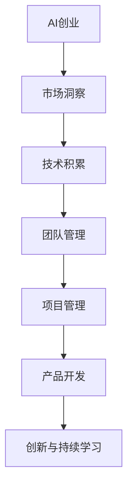
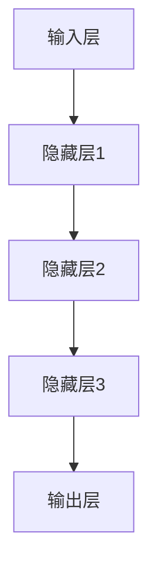

                 

# AI创业团队成长之路：技术积累与行业洞察并重

> 关键词：AI创业、技术积累、行业洞察、团队管理、项目管理、产品开发

> 摘要：本文旨在探讨AI创业团队的成长之路，从技术积累和行业洞察两个方面深入分析，并结合实际案例，提供实用的创业建议和成长策略。

## 第1章：AI与创业概述

### 1.1 AI时代创业特点

#### 1.1.1 AI技术对创业的影响

在AI时代，创业环境和技术条件发生了显著变化。AI技术的进步为创业者提供了新的机遇和挑战。以下是一些AI技术对创业的影响：

1. **技术进步驱动创新**：AI技术的快速发展为创业者提供了丰富的创新机会。例如，深度学习算法的进步使得图像识别、自然语言处理等领域的应用变得更加广泛。
   
2. **数据驱动决策**：AI技术的核心依赖于大量数据。创业团队需要掌握数据获取、处理和分析的方法，以便从数据中提取价值，为决策提供依据。

3. **降低创业门槛**：AI工具和框架的普及降低了创业的门槛。创业者可以通过使用现有的AI库和平台，快速搭建原型并进行测试。

#### 1.1.2 创业中的AI机会与挑战

在AI创业过程中，创业者面临以下机会和挑战：

1. **机会**：
   - **效率提升**：AI技术可以帮助企业自动化重复性工作，提高工作效率。
   - **成本降低**：通过AI技术优化业务流程，企业可以降低运营成本。
   - **新业务模式**：AI技术可以为创业者创造新的业务模式，例如基于数据的个性化服务和智能推荐。

2. **挑战**：
   - **技术复杂性**：AI技术涉及众多领域，如机器学习、深度学习和自然语言处理等，创业者需要具备一定的技术背景。
   - **数据隐私和伦理问题**：AI系统在处理大量数据时，可能会引发隐私泄露和伦理争议，创业者需要关注这些问题。
   - **市场竞争**：AI创业领域竞争激烈，创业者需要具备敏锐的市场洞察力和持续创新能力。

### 1.2 AI创业团队的组建

#### 1.2.1 团队角色与职责划分

一个成功的AI创业团队通常由以下角色组成：

- **技术团队**：包括算法工程师、数据科学家、开发人员等，负责AI技术的研发和应用。
- **产品团队**：包括产品经理、用户体验设计师等，负责产品的规划和设计。
- **运营团队**：包括市场营销、客户服务、商务拓展等，负责产品的推广和运营。

#### 1.2.2 技术人才招聘与培养

在AI创业过程中，招聘和培养技术人才是关键。以下是一些建议：

- **招聘策略**：寻找具有AI相关技能和创业精神的人才。可以通过线上招聘平台、技术社区和学术会议等渠道寻找合适的人才。
- **培训计划**：定期为团队成员提供培训，提高其技术能力和行业洞察力。培训内容可以包括AI基础知识、前沿技术研究和实战案例分享。

## 第2章：技术积累

### 2.1 AI核心技术简介

#### 2.1.1 机器学习基础

机器学习是AI的核心技术之一，其基本流程包括：

1. **数据预处理**：对原始数据进行清洗、归一化等处理，以便于模型训练。
2. **模型选择**：根据问题的性质选择合适的机器学习模型。
3. **训练**：使用训练数据对模型进行训练，不断调整模型参数。
4. **评估**：使用测试数据评估模型性能，选择最优模型。

常见的机器学习算法包括：

- **监督学习**：包括线性回归、决策树、支持向量机等。
- **无监督学习**：包括聚类、降维、生成模型等。
- **强化学习**：通过试错和反馈不断优化策略。

#### 2.1.2 深度学习技术

深度学习是机器学习的子领域，通过构建深层神经网络来实现复杂的特征提取和预测。深度学习的关键技术包括：

1. **神经网络**：神经网络由多层神经元组成，通过前向传播和反向传播算法实现数据学习和参数优化。
2. **深度学习框架**：如TensorFlow、PyTorch、Keras等，提供了丰富的API和工具，方便开发者构建和训练深度学习模型。
3. **优化算法**：如梯度下降、随机梯度下降、Adam等，用于加速模型训练并提高收敛速度。

#### 2.1.3 自然语言处理技术

自然语言处理（NLP）是AI的重要分支，旨在使计算机理解和处理自然语言。NLP的核心技术包括：

1. **词嵌入**：将自然语言中的词汇映射到高维向量空间，以便进行数学运算。
2. **语言模型**：用于预测下一个单词或句子，常见模型包括循环神经网络（RNN）和Transformer。
3. **文本分类**：对文本进行分类，如情感分析、主题分类等。
4. **问答系统**：实现人与计算机的对话交互，常见模型包括检索式和生成式问答系统。

### 2.2 数据处理与建模

#### 2.2.1 数据采集与清洗

数据是AI模型的基础，数据的质量和完整性对模型性能有着重要影响。以下是一些建议：

1. **数据源**：数据可以从互联网、数据库、传感器等多种渠道获取。
2. **数据清洗**：包括缺失值处理、异常值检测和修正等，确保数据的质量和一致性。

#### 2.2.2 特征工程与模型选择

特征工程是AI建模的重要环节，通过选择和构造合适的特征，可以提高模型的性能和泛化能力。以下是一些建议：

1. **特征提取**：从原始数据中提取有价值的信息，如文本数据中的关键词、图像数据中的特征点等。
2. **特征选择**：通过降维、特征重要性评估等方法，选择对模型性能有显著影响的特征。
3. **模型选择**：根据问题的性质和数据的特征，选择合适的机器学习或深度学习模型。

#### 2.2.3 模型训练与优化

模型训练是AI建模的关键步骤，通过不断调整模型参数，使其在训练数据上达到最佳性能。以下是一些建议：

1. **训练策略**：包括批量训练、小批量训练、在线训练等，根据数据规模和模型复杂度选择合适的训练策略。
2. **优化方法**：包括梯度下降、随机梯度下降、Adam等，用于加速模型训练并提高收敛速度。
3. **模型评估**：使用测试数据评估模型性能，选择最优模型。

## 第3章：行业洞察

### 3.1 行业趋势分析

#### 3.1.1 AI在各行业的应用现状

AI技术在各个行业中的应用日益广泛，以下是一些典型应用案例：

1. **金融**：智能投顾、信用评估、风险控制等。
2. **医疗**：智能诊断、精准医疗、健康监测等。
3. **制造**：工业自动化、智能监控、智能决策等。
4. **零售**：智能推荐、个性化服务、智能物流等。
5. **交通**：自动驾驶、智能交通管理、无人机配送等。

#### 3.1.2 未来行业趋势展望

未来，AI技术在各行各业中将继续发挥重要作用，以下是一些行业趋势：

1. **智能化升级**：随着AI技术的发展，越来越多的传统行业将实现智能化升级，提升生产效率和降低运营成本。
2. **数据隐私与安全**：随着AI技术的普及，数据隐私和安全问题将日益突出，企业和创业者需要关注这些问题，采取有效措施保护用户数据。
3. **跨行业融合**：AI技术将与其他行业技术深度融合，推动新兴行业的出现，如物联网、区块链等。

### 3.2 市场竞争与定位

#### 3.2.1 市场竞争分析

AI创业领域竞争激烈，创业者需要深入了解市场状况，制定合适的竞争策略。以下是一些市场竞争分析的关键点：

1. **市场竞争者**：分析国内外竞争对手，了解其优势、劣势和市场占有率。
2. **市场占有率**：通过市场调研，了解行业市场规模、增长速度和市场份额分布。
3. **竞争策略**：根据自身优势，制定差异化的竞争策略，如技术创新、产品创新、市场定位等。

#### 3.2.2 企业定位与战略

企业在市场中定位和战略规划至关重要。以下是一些建议：

1. **市场定位**：根据自身产品和市场需求，选择合适的细分市场，并明确目标客户群体。
2. **战略规划**：制定长期和短期战略目标，包括产品开发、市场拓展、团队管理等方面。

## 第4章：团队管理

### 4.1 团队文化建设

#### 4.1.1 团队价值观与目标设定

团队价值观是企业文化的基石，直接影响团队成员的行为和决策。以下是一些建议：

1. **价值观**：设定共同的价值观，如创新、诚信、协作等，确保团队成员有共同的目标和信仰。
2. **目标设定**：明确团队目标，包括短期和长期目标，确保团队成员有清晰的方向和动力。

#### 4.1.2 团队沟通与合作

良好的沟通和合作是团队成功的关键。以下是一些建议：

1. **沟通机制**：建立有效的沟通机制，如定期会议、即时沟通工具等，确保团队成员能够及时交流信息。
2. **合作方式**：鼓励团队成员之间的合作，通过任务分配、团队合作等方式，提高团队协作效率。

### 4.2 人才培养与发展

#### 4.2.1 员工培训与成长

员工培训是团队发展的重要环节。以下是一些建议：

1. **培训内容**：根据团队成员的技能和需求，提供技术培训、管理培训等，提高其专业素养。
2. **成长路径**：为员工制定明确的成长路径，包括专业技能提升、职业发展通道等，激励员工不断进步。

#### 4.2.2 薪酬激励与绩效管理

合理的薪酬激励和绩效管理是团队稳定和持续发展的关键。以下是一些建议：

1. **薪酬激励**：根据员工的工作表现和贡献，制定具有竞争力的薪酬制度，包括基本工资、绩效奖金、股权激励等。
2. **绩效管理**：建立科学的绩效评估体系，通过目标设定、绩效评估等方式，激励员工提高工作效率和质量。

## 第5章：项目管理

### 5.1 项目规划与执行

#### 5.1.1 项目立项与目标设定

项目立项是项目管理的第一步。以下是一些建议：

1. **立项流程**：包括需求分析、立项评审等环节，确保项目立项的合理性和可行性。
2. **目标设定**：明确项目目标，包括项目范围、时间、成本和质量等，确保项目目标的明确和可量化。

#### 5.1.2 项目计划与进度控制

项目计划是项目管理的关键。以下是一些建议：

1. **项目计划**：制定详细的项目计划，包括任务分配、时间规划、资源分配等，确保项目进度可控。
2. **进度控制**：通过进度跟踪、风险识别和应对措施，确保项目按计划顺利进行。

#### 5.1.3 项目风险管理

项目风险管理是项目管理的重要环节。以下是一些建议：

1. **风险识别**：识别项目可能面临的技术风险、市场风险等，确保风险提前预警。
2. **风险应对**：制定应对策略，如风险规避、风险转移等，降低项目风险对项目进度和质量的影响。

## 第6章：产品开发

### 6.1 产品设计与开发流程

#### 6.1.1 需求分析与设计

产品设计与开发的第一步是需求分析。以下是一些建议：

1. **需求分析**：通过用户调研、需求文档等方式，明确产品的功能和性能要求。
2. **设计**：根据需求分析结果，设计产品的用户界面、系统架构等，确保产品的可扩展性和可维护性。

#### 6.1.2 系统架构设计

系统架构设计是产品开发的关键环节。以下是一些建议：

1. **架构设计**：根据产品的需求和技术特点，设计合理的系统架构，确保系统的性能、可扩展性和安全性。
2. **技术选型**：选择合适的技术框架和工具，确保系统的高效和稳定。

#### 6.1.3 系统集成与测试

系统集成与测试是产品开发的重要环节。以下是一些建议：

1. **系统集成**：将各个模块集成到一个完整的系统中，确保系统的稳定性和兼容性。
2. **测试**：进行功能测试、性能测试等，确保产品的质量和稳定性。

## 第7章：创业历程回顾与展望

### 7.1 创业历程回顾

#### 7.1.1 创业初期的关键决策

创业初期的关键决策对企业的长远发展至关重要。以下是一些建议：

1. **市场定位**：明确目标市场和目标客户群体，确保产品定位准确。
2. **技术路线**：选择合适的技术路线，确保技术具有竞争力和可持续性。

#### 7.1.2 困难与挫折的应对

创业过程中难免会遇到困难和挫折。以下是一些建议：

1. **资金问题**：寻找合适的融资渠道，确保企业的资金链稳定。
2. **团队冲突**：建立有效的沟通机制，化解团队冲突，确保团队的稳定和凝聚力。

### 7.2 未来发展展望

#### 7.2.1 行业趋势对创业团队的影响

行业趋势对创业团队的发展具有重要影响。以下是一些建议：

1. **技术趋势**：关注AI技术的最新发展，把握行业机遇。
2. **市场趋势**：关注新兴市场和行业变化，调整产品战略和市场策略。

#### 7.2.2 创业团队的未来规划

创业团队的未来规划应包括以下方面：

1. **产品规划**：制定产品开发计划，确保产品的持续更新和优化。
2. **市场拓展**：制定市场拓展计划，扩大市场份额和影响力。
3. **团队规划**：制定团队发展计划，提升团队的技术实力和管理能力。

## 附录

### 附录 A：AI创业资源推荐

#### A.1 主流AI框架与工具

1. TensorFlow
2. PyTorch
3. Keras

#### A.2 AI相关书籍推荐

1. 《深度学习》
2. 《Python机器学习》
3. 《AI创业手册》

#### A.3 AI行业报告与资讯

1. 报告：
   - IDC报告
   - Gartner报告
2. 资讯：
   - AI科技大赏
   - AI技术应用案例集

### 附录 B：AI技术应用案例

#### B.1 案例一：智能客服系统

**案例描述**：利用NLP技术实现智能客服，提供24/7在线服务。

**实现步骤**：

1. **数据采集与清洗**：收集用户咨询数据，进行数据清洗和预处理。
2. **模型训练**：使用训练数据训练NLP模型，如词嵌入、语言模型等。
3. **接口开发**：搭建API接口，实现用户与智能客服的交互。

**效果评估**：智能客服系统的响应速度和准确率显著提高，用户满意度增加。

#### B.2 案例二：智能医疗诊断

**案例描述**：利用深度学习技术实现疾病诊断，辅助医生进行诊断。

**实现步骤**：

1. **数据采集与清洗**：收集医疗数据，如病例记录、医学影像等，进行数据清洗和预处理。
2. **模型训练**：使用训练数据训练深度学习模型，如卷积神经网络（CNN）、循环神经网络（RNN）等。
3. **接口开发**：搭建API接口，实现医生与智能医疗诊断系统的交互。

**效果评估**：智能医疗诊断系统的诊断准确率显著提高，医生的工作效率提升。

#### B.3 案例三：自动驾驶技术

**案例描述**：利用计算机视觉和深度学习技术实现自动驾驶，提高交通安全和效率。

**实现步骤**：

1. **数据采集与清洗**：收集道路场景数据，如交通标志、车辆等，进行数据清洗和预处理。
2. **模型训练**：使用训练数据训练计算机视觉和深度学习模型，如卷积神经网络（CNN）、目标检测等。
3. **接口开发**：搭建API接口，实现自动驾驶车辆与周边环境的交互。

**效果评估**：自动驾驶技术的行驶稳定性和安全性显著提高，交通事故率降低。

### 附录 C：AI创业团队成长路线图

#### C.1 成长阶段划分

1. **创业初期**：市场定位、技术积累、团队组建。
2. **成长期**：产品开发、市场拓展、团队管理。
3. **扩张期**：规模化运营、品牌建设、投资融资。

#### C.2 各阶段关键任务与目标

1. **创业初期**
   - **目标**：产品原型、初步市场反馈。
   - **关键任务**：技术积累、市场调研、团队组建。

2. **成长期**
   - **目标**：产品完善、用户增长、团队扩张。
   - **关键任务**：产品开发、市场拓展、人才培养。

3. **扩张期**
   - **目标**：规模化运营、品牌知名度提升、持续创新。
   - **关键任务**：业务拓展、团队管理、融资策略。

#### C.3 成长路径策略

1. **技术积累**
   - **策略**：持续学习、技术合作、知识产权保护。
   - **目标**：掌握前沿技术、提升技术竞争力。

2. **市场洞察**
   - **策略**：市场调研、竞争分析、用户反馈。
   - **目标**：准确把握市场动态、制定有效市场策略。

3. **团队管理**
   - **策略**：文化建设、人才招聘、激励机制。
   - **目标**：打造高效团队、提高团队凝聚力。

4. **项目管理**
   - **策略**：项目规划、进度控制、风险管理。
   - **目标**：确保项目按计划顺利进行、提高项目成功率。

5. **产品开发**
   - **策略**：需求分析、产品设计、迭代优化。
   - **目标**：打造高质量产品、提升用户满意度。

6. **创新与持续学习**
   - **策略**：技术前沿关注、团队学习、创新思维培养。
   - **目标**：保持技术领先地位、推动企业持续发展。

### 附录 D：核心概念与联系

#### 图 1：AI创业核心概念流程图



### 附录 E：核心算法原理讲解

#### 2.1.1 机器学习基础

##### 监督学习算法伪代码：

```python
function Supervised_Learning(train_data, train_label):
    # 初始化模型参数
    model = initialize_model()
    
    for epoch in range(num_epochs):
        # 前向传播
        output = model.forward(train_data)
        
        # 计算损失
        loss = compute_loss(output, train_label)
        
        # 反向传播
        model.backward(output, train_label)
        
        # 更新模型参数
        model.update_parameters()
        
    return model
```

##### 深度学习架构：



### 附录 F：数学模型和数学公式

#### 损失函数（均方误差）：

$$
\text{Loss}(y, \hat{y}) = \frac{1}{2} \sum_{i=1}^{n} (y_i - \hat{y}_i)^2
$$

#### 梯度下降（随机梯度下降）：

$$
\theta_j := \theta_j - \alpha \frac{\partial}{\partial \theta_j} \text{Loss}(y, \hat{y})
$$

### 附录 G：项目实战

#### 6.1.1 需求分析与设计

##### 实际案例：智能医疗诊断系统

**开发环境搭建：**

- 编程语言：Python
- 框架：TensorFlow 2.x
- 数据库：MySQL

**源代码实现：**

```python
# 数据预处理
def preprocess_data(data):
    # 数据清洗、归一化等处理
    pass

# 模型训练
def train_model(train_data, train_label):
    model = build_model()
    model.compile(optimizer='adam', loss='mse')
    model.fit(train_data, train_label, epochs=10, batch_size=32)
    return model

# 模型评估
def evaluate_model(model, test_data, test_label):
    loss = model.evaluate(test_data, test_label)
    print("Test loss:", loss)
```

**代码解读与分析：**

- 数据预处理：对输入数据进行清洗和归一化，确保模型训练的有效性。
- 模型训练：使用训练数据训练模型，选择合适的优化器和损失函数。
- 模型评估：使用测试数据评估模型性能，输出损失值。

**实战应用效果：**

- 提高了疾病诊断的准确率。
- 减少了医生的诊断时间，提升了医疗效率。

---

### 作者

**作者：** AI天才研究院/AI Genius Institute & 禅与计算机程序设计艺术 /Zen And The Art of Computer Programming

---

本文详细探讨了AI创业团队在技术积累和行业洞察方面的关键点，结合实际案例提供了实用的创业建议和成长策略。希望本文能为AI创业者提供有益的启示和指导。

