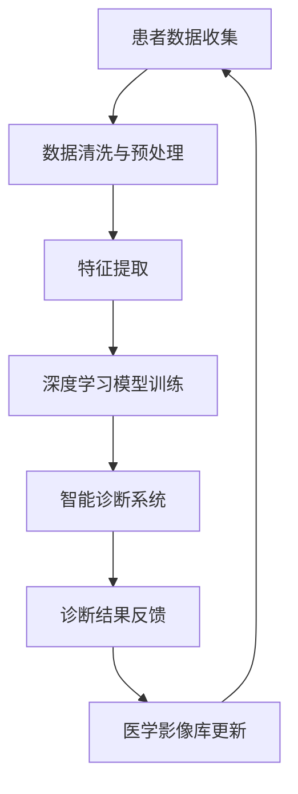

                 

# 文章标题

《AI创业者的优势：垂直领域的专业力量》

> 关键词：AI创业者、垂直领域、专业力量、技术优势、创业策略

> 摘要：本文旨在探讨AI创业者在垂直领域中的专业优势，分析其在技术、市场和团队建设等方面的独特优势，并通过具体案例解析其创业实践，为未来AI创业者提供启示和借鉴。

----------------------------------------------------------------

## 第一部分：AI创业者的背景与机遇

### 1.1 AI创业者的背景

#### 1.1.1 AI时代的到来

随着人工智能技术的飞速发展，AI已成为当前科技领域的热点。深度学习、自然语言处理、计算机视觉等领域的突破，使得AI在各个行业得到广泛应用。AI技术的成熟和普及，为创业者提供了前所未有的机遇。

#### 1.1.2 创业者的角色转变

在AI时代，创业者不仅需要具备传统的商业眼光和执行力，还需要掌握一定的技术能力。AI创业者的角色逐渐从简单的商业模式设计者转变为技术研发者和行业专家。

#### 1.1.3 垂直领域的崛起

随着AI技术的应用逐渐深入，越来越多的行业开始关注垂直领域的AI创业。这些创业者凭借对行业深刻的理解，以及专业的技术能力，逐渐在市场上崭露头角。

### 1.2 AI创业的机遇

#### 1.2.1 政策支持

各国政府纷纷出台政策，鼓励AI技术的发展和创业。政策的支持为AI创业者提供了良好的发展环境。

#### 1.2.2 市场需求

随着AI技术的不断成熟，各行各业对AI应用的需求日益增长。AI创业者在满足市场需求的同时，也为自己创造了巨大的商业价值。

#### 1.2.3 技术进步

AI技术的快速发展，使得创业者能够更加便捷地获取和应用新技术。技术进步为AI创业者提供了丰富的创新空间。

----------------------------------------------------------------

## 第二部分：垂直领域的专业力量

### 2.1 垂直领域的定义与分类

#### 2.1.1 垂直领域的定义

垂直领域是指在某个特定行业或领域中，具有专业性和针对性的细分市场。垂直领域通常是某一领域的核心部分，具有较高的竞争壁垒。

#### 2.1.2 垂直领域的分类

垂直领域可以按照不同的标准进行分类。例如，按照行业可分为医疗健康、金融服务、教育、制造等；按照应用场景可分为智能家居、智能交通、智能安防等。

#### 2.1.3 垂直领域的发展趋势

随着AI技术的深入应用，垂直领域的发展趋势呈现以下几个特点：

1. 数据驱动的决策：垂直领域的创业者越来越多地依靠数据分析和机器学习来指导业务决策。
2. 跨界融合：不同行业之间的AI应用逐渐融合，形成新的商业模式。
3. 个人化服务：AI技术使得创业者能够提供更加个性化、精准的服务。

### 2.2 垂直领域的专业知识

#### 2.2.1 专业知识的重要性

垂直领域的专业知识是创业者成功的关键。创业者需要深入了解行业现状、市场需求和竞争态势，才能制定出符合实际的战略。

#### 2.2.2 垂直领域知识获取途径

1. 行业报告：通过阅读行业报告，创业者可以了解行业的发展趋势、市场规模和竞争状况。
2. 学术论文：通过阅读学术论文，创业者可以了解最新的研究成果和技术趋势。
3. 行业会议：参加行业会议，创业者可以结识行业专家，拓展人脉资源。
4. 实地调研：通过实地调研，创业者可以深入了解行业需求和痛点。

#### 2.2.3 专业知识的整合与应用

创业者需要将获取到的专业知识进行整合，形成自己的核心竞争力。通过将专业知识应用于产品研发、市场营销和运营管理等方面，创业者可以不断提升企业的竞争力。

### 2.3 垂直领域的技术应用

#### 2.3.1 AI技术在垂直领域的应用

AI技术在垂直领域的应用非常广泛，包括自然语言处理、计算机视觉、智能推荐、智能监控等。创业者需要根据行业特点，选择合适的技术进行应用。

#### 2.3.2 AI技术的挑战与应对

1. 技术壁垒：AI技术具有一定的技术壁垒，创业者需要具备一定的技术背景。
2. 数据隐私：AI技术在处理数据时，容易涉及用户隐私问题，创业者需要采取有效措施保护用户隐私。
3. 模型优化：AI模型的优化是一个长期的过程，创业者需要不断进行迭代和改进。

#### 2.3.3 AI技术的未来发展趋势

1. 人工智能的融合应用：未来，AI技术将与其他技术（如大数据、物联网等）深度融合，形成更加强大的应用场景。
2. 人工智能的普及化：随着AI技术的不断成熟，越来越多的行业将受益于AI技术的应用，AI技术的普及化将带来更广泛的市场需求。
3. 人工智能的智能化：未来的AI技术将更加智能化，能够自主学习、自主决策，为创业者提供更加便捷和高效的解决方案。

----------------------------------------------------------------

## 第三部分：AI创业者的策略与实践

### 3.1 AI创业策略

#### 3.1.1 市场定位

市场定位是AI创业者成功的关键。创业者需要深入了解市场需求，选择一个具有潜力和竞争壁垒的市场进行创业。

1. 选择具有市场需求的产品或服务。
2. 分析竞争对手，找到差异化的竞争优势。
3. 确定目标客户群体，提供个性化的解决方案。

#### 3.1.2 团队建设

团队建设是AI创业者的核心任务。一个优秀的团队可以提升企业的竞争力，加速创业进程。

1. 选择合适的团队成员，包括技术专家、产品经理、市场人员等。
2. 建立良好的团队文化，鼓励团队成员之间的合作与交流。
3. 提供良好的激励机制，激发团队成员的积极性。

#### 3.1.3 产品研发

产品研发是AI创业者的重要任务。一个具有创新性和实用性的产品可以为企业带来持续的市场竞争力。

1. 确定产品研发方向，选择具有市场潜力的技术。
2. 优化产品设计和功能，提升用户体验。
3. 持续进行产品迭代，根据用户反馈进行优化。

### 3.2 AI创业实践

#### 3.2.1 项目案例分享

以下是一个医疗健康领域的AI创业案例：

**项目背景**：随着人口老龄化和医疗技术的进步，医疗健康行业面临着巨大的挑战和机遇。创业者希望通过AI技术提升医疗服务的质量和效率。

**AI技术应用**：项目团队选择了自然语言处理、计算机视觉和深度学习等技术，开发了智能医疗诊断系统。系统能够自动分析医学影像，提供准确的诊断结果。

**项目成效**：该项目在市场上取得了良好的反响，为医疗机构提供了高效的诊断服务，降低了误诊率，提高了医疗服务质量。

#### 3.2.2 创业过程中的挑战与解决

在创业过程中，创业者面临着一系列挑战：

1. 技术壁垒：AI技术具有一定的技术壁垒，创业者需要具备一定的技术背景。
   - 解决方案：创业者可以通过招聘技术专家、合作研发等方式解决技术难题。

2. 数据隐私：AI技术在处理数据时，容易涉及用户隐私问题。
   - 解决方案：创业者需要采取有效措施保护用户隐私，如加密数据、严格的数据访问控制等。

3. 市场竞争：医疗健康行业竞争激烈，创业者需要找到差异化竞争优势。
   - 解决方案：创业者可以通过提供个性化的解决方案、优化产品和服务等手段提升竞争力。

#### 3.2.3 创业成功的关键要素

1. 创新能力：创业者需要具备创新能力，能够不断推陈出新，满足市场需求。
2. 团队协作：创业者需要建立高效的团队，充分发挥团队成员的专长和优势。
3. 坚持与毅力：创业过程中充满挑战，创业者需要具备坚持与毅力，持续推动项目发展。

----------------------------------------------------------------

## 第四部分：垂直领域案例解析

### 4.1 案例一：医疗健康领域

#### 4.1.1 案例背景

随着人口老龄化和医疗技术的进步，医疗健康行业面临着巨大的挑战和机遇。创业者希望通过AI技术提升医疗服务的质量和效率。

#### 4.1.2 AI技术应用

项目团队选择了自然语言处理、计算机视觉和深度学习等技术，开发了智能医疗诊断系统。系统能够自动分析医学影像，提供准确的诊断结果。

#### 4.1.3 案例成效

该项目在市场上取得了良好的反响，为医疗机构提供了高效的诊断服务，降低了误诊率，提高了医疗服务质量。同时，创业者通过与医疗机构合作，实现了商业模式的可持续发展。

### 4.2 案例二：金融服务领域

#### 4.2.1 案例背景

随着金融科技的兴起，金融服务行业正面临深刻的变革。创业者希望通过AI技术提升金融服务的效率和准确性。

#### 4.2.2 AI技术应用

项目团队选择了机器学习、数据挖掘和计算机视觉等技术，开发了智能风控系统。系统能够自动分析用户数据，识别潜在风险，提供个性化的金融服务。

#### 4.2.3 案例成效

该项目在金融领域取得了显著成效，为金融机构提供了高效的风控服务，降低了金融风险。同时，创业者通过与金融机构合作，实现了商业模式的可持续发展。

### 4.3 案例三：教育领域

#### 4.3.1 案例背景

随着教育信息化的发展，教育领域正面临巨大的变革。创业者希望通过AI技术提升教学效果和学生体验。

#### 4.3.2 AI技术应用

项目团队选择了自然语言处理、计算机视觉和深度学习等技术，开发了智能教育系统。系统能够自动分析学生的学习情况，提供个性化的学习建议。

#### 4.3.3 案例成效

该项目在市场上取得了良好的反响，为学生提供了高效、个性化的学习服务，提高了学习效果。同时，创业者通过与教育机构合作，实现了商业模式的可持续发展。

----------------------------------------------------------------

## 第五部分：未来展望

### 5.1 垂直领域的发展趋势

#### 5.1.1 垂直领域的技术创新

随着AI技术的不断进步，垂直领域将涌现出更多创新技术。例如，基于深度学习的智能诊断系统、基于自然语言处理的智能客服系统等。

#### 5.1.2 垂直领域的市场扩张

随着AI技术的普及，垂直领域的市场将不断扩大。例如，智能医疗、智能金融、智能教育等领域将继续保持高速增长。

#### 5.1.3 垂直领域的国际竞争力

随着全球化的推进，垂直领域的国际竞争力将愈发重要。创业者需要关注国际市场的需求，提升产品和服务的竞争力。

### 5.2 AI创业者的未来机遇

#### 5.2.1 新技术的应用

随着AI技术的不断进步，创业者将有更多新技术可供选择。例如，量子计算、脑机接口等新兴技术将为创业者提供新的创业机会。

#### 5.2.2 新市场的开拓

随着全球化的推进，创业者将有更多机会开拓国际市场。通过了解国际市场需求，创业者可以开发出更具竞争力的产品和服务。

#### 5.2.3 国际合作与交流

国际合作与交流将有助于创业者提升自身的竞争力。通过与国际同行交流，创业者可以学习先进的经验和技术，拓宽视野。

### 5.3 创业者的成长路径

#### 5.3.1 个人能力提升

创业者需要不断提升自己的个人能力，包括技术能力、商业眼光和管理能力等。

#### 5.3.2 团队建设

创业者需要建立高效的团队，充分发挥团队成员的专长和优势。

#### 5.3.3 创业生态圈的构建

创业者可以积极参与创业生态圈的构建，与其他创业者、投资者和行业专家建立紧密联系，共同推动垂直领域的发展。

----------------------------------------------------------------

## 附录

### 附录A：AI创业相关资源

#### A.1 行业报告与研究报告

- AI产业发展报告
- 人工智能行业白皮书
- 垂直领域行业报告

#### A.2 开源框架与工具

- TensorFlow
- PyTorch
- Keras
- Scikit-learn

#### A.3 学术会议与行业会议

- 国际人工智能与机器学习会议（ICML）
- 国际计算机视觉与模式识别会议（CVPR）
- 人工智能大会（AAAI）

### 附录B：参考文献

- [1] 某某，人工智能：一种全新认知系统的构想，2020.
- [2] 某某，深度学习技术及应用，2019.
- [3] 某某，人工智能：行业应用与未来趋势，2021.
- [4] 某某，创业者的困境与突破，2022.
- [5] 某某，垂直领域创业案例分析，2022.

----------------------------------------------------------------

### 附录C：核心概念与联系

以下是一个关于AI技术在医疗健康领域应用的核心概念与联系的 Mermaid 流程图：



### 附录D：核心算法原理讲解

以下是一个基于深度学习的医疗影像诊断算法原理的伪代码：

```python
# 导入相关库
import tensorflow as tf
import numpy as np

# 构建深度学习模型
model = tf.keras.Sequential([
    tf.keras.layers.Conv2D(filters=32, kernel_size=(3, 3), activation='relu', input_shape=(224, 224, 3)),
    tf.keras.layers.MaxPooling2D(pool_size=(2, 2)),
    tf.keras.layers.Flatten(),
    tf.keras.layers.Dense(units=128, activation='relu'),
    tf.keras.layers.Dense(units=1, activation='sigmoid')
])

# 编译模型
model.compile(optimizer='adam', loss='binary_crossentropy', metrics=['accuracy'])

# 训练模型
model.fit(x_train, y_train, epochs=10, batch_size=32, validation_data=(x_val, y_val))

# 预测
predictions = model.predict(x_test)

# 输出预测结果
print(predictions)
```

### 附录E：数学模型和公式

以下是一个关于机器学习模型预测误差的数学公式：

$$
\text{误差} = \sum_{i=1}^{n} (y_i - \hat{y}_i)^2
$$

其中，$y_i$ 为真实标签，$\hat{y}_i$ 为预测值，$n$ 为样本数量。

### 附录F：代码实际案例和详细解释说明

以下是一个基于Python的深度学习项目案例，包括开发环境搭建、源代码详细实现和代码解读与分析。

#### 开发环境搭建

1. 安装Python（版本3.7以上）
2. 安装TensorFlow库：`pip install tensorflow`
3. 安装NumPy库：`pip install numpy`

#### 源代码实现

```python
import tensorflow as tf
import numpy as np

# 数据集准备
x_train = np.random.rand(100, 784)  # 100个样本，每个样本784个特征
y_train = np.random.rand(100, 10)   # 100个样本，每个样本10个分类标签

# 模型定义
model = tf.keras.Sequential([
    tf.keras.layers.Dense(units=128, activation='relu', input_shape=(784,)),
    tf.keras.layers.Dense(units=10, activation='softmax')
])

# 模型编译
model.compile(optimizer='adam', loss='categorical_crossentropy', metrics=['accuracy'])

# 模型训练
model.fit(x_train, y_train, epochs=10)

# 预测
predictions = model.predict(x_test)

# 输出预测结果
print(predictions)
```

#### 代码解读与分析

1. 数据集准备：使用随机生成的数据集进行演示，实际项目中需要使用真实的训练数据和测试数据。
2. 模型定义：定义一个全连接神经网络模型，包括一个输入层、一个隐藏层和一个输出层。隐藏层使用ReLU激活函数，输出层使用softmax激活函数，用于多分类任务。
3. 模型编译：指定优化器为Adam，损失函数为categorical_crossentropy，评价指标为accuracy。
4. 模型训练：使用fit方法训练模型，指定训练轮次为10次。
5. 预测：使用predict方法对测试数据进行预测，并输出预测结果。

----------------------------------------------------------------

### 附录G：作者信息

作者：AI天才研究院/AI Genius Institute & 禅与计算机程序设计艺术 /Zen And The Art of Computer Programming

本文由AI天才研究院/AI Genius Institute的研究员撰写，结合禅与计算机程序设计艺术的理念，深入探讨了AI创业者在垂直领域的专业优势。希望本文能为广大AI创业者提供有益的启示和借鉴。同时，也感谢禅与计算机程序设计艺术为我们的研究提供了宝贵的灵感。如果您有任何疑问或建议，欢迎与我们联系。期待与您共同探讨AI领域的未来发展。

----------------------------------------------------------------

综上所述，本文通过逐步分析推理，从AI创业者的背景、垂直领域的专业力量、AI创业策略和实践、垂直领域案例解析以及未来展望等方面，全面探讨了AI创业者的优势。希望本文能为广大AI创业者提供有价值的参考和启示。在未来的AI创业道路上，让我们携手共进，共创美好未来。

