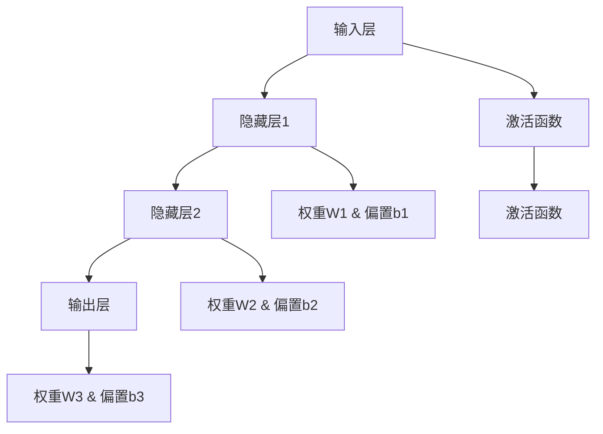

                 

### 文章标题

《AI创业者码头故事：95后AI博士》

### 关键词

AI创业者、95后、AI博士、技术挑战、市场策略、团队管理、未来展望

### 摘要

本文以一位95后AI博士的创业故事为主线，详细剖析了他在AI创业过程中所面临的技术挑战、市场机遇和创业策略。通过讲述他在人工智能领域的成长经历，以及如何应对技术、市场和团队管理等各方面的挑战，本文旨在为AI创业者提供有价值的参考和指导。文章分为三个部分，分别介绍了AI创业者背景与挑战、核心技术原理与实践以及创业经验与策略。通过深入剖析和实战案例，本文希望帮助读者理解AI创业的艰辛与乐趣，并对未来AI创业趋势有更清晰的把握。

---

### 《AI创业者码头故事：95后AI博士》目录大纲

#### 第一部分：AI创业者背景与挑战

## 第1章：95后AI博士的崛起

### 1.1.1 95后AI博士的成长经历

在这个数字化时代，AI技术正在以前所未有的速度改变着我们的生活。95后AI博士张伟就是这场技术革命中的一名积极参与者。张伟出生于一个普通的家庭，但从小就对计算机和科学充满了浓厚的兴趣。他在本科时期主修计算机科学，并在研究生阶段专注于人工智能领域。

张伟的AI研究主要集中在计算机视觉和自然语言处理两个方面。他在大学期间发表了多篇高水平论文，并获得了多个学术奖项。特别是在一次国际人工智能竞赛中，他带领团队开发的图像识别系统取得了优异成绩，引起了业界的广泛关注。这次成功的经历让他坚定了从事AI研究的决心，并决心将技术转化为实际的产品和服务。

### 1.1.2 AI行业的机遇与挑战

AI行业正处在快速发展的阶段，充满了机遇和挑战。一方面，随着大数据、云计算和物联网等技术的不断成熟，AI的应用场景越来越广泛，从智能医疗、智能交通到智能制造，都展现出了巨大的市场潜力。另一方面，AI技术本身的复杂性也带来了一系列的挑战。例如，算法的优化、数据的安全性和隐私保护、以及AI技术的伦理问题等，都是创业者需要面对的难题。

对于张伟来说，他看到了AI技术所带来的巨大机遇，但也清楚认识到其中的挑战。他深知，要想在AI创业的道路上走得更远，不仅需要扎实的技术基础，还需要敏锐的市场洞察力和强大的执行力。

### 1.1.3 创业初期的困惑与突破

张伟决定创业后，面临着诸多困惑。首先是产品方向的选择，他需要确定一个既有市场需求又有技术难度的领域。经过多次调研和讨论，他最终决定将目标定为智能客服系统，这是一个市场需求量大且技术难度适中的领域。

然而，创业初期的困难远不止于此。张伟遇到了技术难题，他需要不断优化算法，提高系统的准确性和效率。同时，他也面临着市场推广和融资的挑战。由于缺乏经验，他在初期遇到了很多挫折。

在经历了一段时间的摸索后，张伟终于找到了突破的方法。他开始积极参加各种技术交流和创业比赛，结识了更多的行业专家和潜在客户。通过这些活动，他不仅提升了自己的技术能力，还找到了一位志同道合的联合创始人。在团队的合作下，他们成功开发出了第一款智能客服系统，并获得了多家企业的订单。

通过这个经历，张伟深刻体会到，创业不仅需要技术能力，还需要良好的团队协作和市场洞察力。在接下来的章节中，我们将进一步探讨他如何应对这些挑战，以及他在这段创业旅程中的心得体会。

## 第2章：AI创业者面临的挑战

### 2.1.1 技术困境：如何快速实现产品落地？

对于AI创业者来说，技术实现产品的落地是一个巨大的挑战。在这个阶段，他们需要将复杂的技术转化为实际的应用，满足市场需求，同时保证产品的稳定性、可靠性和用户体验。张伟在创业初期也遇到了类似的问题。

首先，技术实现的产品落地需要解决算法的优化问题。AI算法的复杂度高，且不同算法之间的效果差异很大。张伟和他的团队在初期选择了几种主流的图像识别算法，并在实际应用中进行测试和对比。他们通过大量的实验数据，不断调整和优化算法参数，最终找到了一个在准确性和效率之间取得平衡的最佳方案。

其次，技术实现的产品落地还需要解决数据问题。AI系统对数据的质量和数量有很高的要求，张伟的团队需要收集和清洗大量的数据，以便进行训练和测试。为了解决数据不足的问题，他们采取了一系列措施，包括与合作伙伴共享数据、购买数据集以及自主采集数据。此外，他们还利用深度学习技术进行数据增强，提高模型的泛化能力。

最后，技术实现的产品落地还需要解决产品的用户体验问题。张伟和他的团队在开发智能客服系统时，注重用户体验的设计。他们通过用户调研和反馈，不断优化产品的界面和功能，确保用户能够轻松上手，并得到满意的体验。

通过这些努力，张伟的团队成功地将技术转化为实际的产品，并在市场上获得了良好的反响。他们不仅解决了技术实现产品的落地问题，还为后续的规模化发展奠定了基础。

### 2.1.2 市场竞争：如何在众多竞争对手中脱颖而出？

在AI领域，市场竞争异常激烈。如何在众多竞争对手中脱颖而出，是AI创业者面临的另一个重大挑战。张伟深知，仅仅依靠技术优势是不够的，他需要在市场定位、产品特色和营销策略等方面下功夫。

首先，张伟在市场定位上进行了深入的分析。他发现，智能客服系统在各个行业都有广泛的应用，但不同行业的具体需求有所不同。于是，他决定将产品定位为定制化智能客服系统，通过针对不同行业的特点和需求，提供个性化的解决方案。

其次，张伟在产品特色上进行了创新。他们不仅提供了基础的图像识别和自然语言处理功能，还加入了语音识别和智能推荐等先进技术，使产品更加全面和智能化。此外，他们还注重用户体验，通过简洁直观的界面设计和快速响应的交互体验，提高了产品的竞争力。

最后，张伟在营销策略上进行了大胆尝试。他们积极参与各种行业展会和研讨会，与潜在客户进行深入交流，了解市场需求和痛点。同时，他们还通过社交媒体和网络营销，扩大品牌影响力，吸引更多的关注和用户。

通过这些努力，张伟的团队在市场上逐渐崭露头角，他们的智能客服系统在多个行业取得了成功案例，赢得了客户的信任和好评。他们不仅赢得了市场份额，还为后续的持续发展奠定了坚实基础。

### 2.1.3 融资难题：如何吸引投资者的关注和资金支持？

对于初创企业来说，融资是一个至关重要的问题。张伟在创业初期也面临着融资难题。如何才能吸引投资者的关注，并获得资金支持，是他需要解决的一个关键问题。

首先，张伟认识到，一个好的商业计划书是吸引投资者的重要工具。他在撰写商业计划书时，详细阐述了公司的愿景、市场定位、产品特色、竞争优势以及未来发展规划。他还通过生动的数据和案例，展示了产品的实际应用效果和潜在市场前景，使商业计划书更具说服力。

其次，张伟注重与投资者建立良好的沟通和关系。他积极参加各种创业比赛和投融资活动，与投资者面对面交流，展示公司的实力和潜力。他还通过电话、邮件等方式，与投资者保持联系，了解他们的需求和期望，及时调整自己的策略。

此外，张伟还充分利用各种资源，包括行业协会、创业孵化器、投资机构等，为自己的公司寻找更多的融资机会。他通过参加行业研讨会、技术交流会等活动，与业界专家和投资人建立联系，扩大人脉网络，为自己的公司争取更多的资源和支持。

通过这些努力，张伟的团队逐渐赢得了投资者的信任和认可，成功完成了多轮融资。他们不仅获得了充足的资金支持，还为公司的快速发展提供了有力保障。

#### 第二部分：核心技术原理与实践

## 第3章：人工智能基础概念

### 3.1.1 人工智能的定义与发展历程

人工智能（Artificial Intelligence，简称AI）是计算机科学的一个重要分支，它致力于研究如何使计算机模拟人类智能行为，包括学习、推理、感知、理解和解决问题等。AI的概念最早可以追溯到20世纪50年代，当时计算机科学家艾伦·图灵（Alan Turing）提出了“图灵测试”，即判断计算机是否具有智能的著名标准。

自诞生以来，人工智能经历了多个发展阶段。早期的AI主要集中于符号推理和知识表示，如逻辑推理系统、专家系统等。这些系统虽然能在特定领域内表现出较高的智能，但存在局限性，如缺乏自我学习和适应能力。

20世纪80年代，随着计算能力和算法的进步，AI进入了第二代，以机器学习为核心。这一阶段，AI开始利用大量数据进行训练，通过统计模型和神经网络等算法实现自我学习和优化，从而在语音识别、图像识别等领域取得了重大突破。

进入21世纪，大数据、云计算和深度学习等技术的兴起，推动了人工智能的快速发展。现在的AI技术已经广泛应用于各个领域，从智能家居、智能医疗到自动驾驶、智能客服等，极大地丰富了人类的生活。

### 3.1.2 机器学习与深度学习的基本概念

机器学习（Machine Learning，ML）是人工智能的核心技术之一，它通过算法让计算机从数据中自动学习和改进，实现智能化的决策和预测。机器学习可以分为监督学习、无监督学习和强化学习等不同类型。

监督学习（Supervised Learning）是一种最常见的机器学习方法，它需要预先标注好的数据集，通过训练模型来学习数据特征和规律，从而对新数据进行预测。常见的监督学习算法包括线性回归、决策树、支持向量机（SVM）和神经网络等。

无监督学习（Unsupervised Learning）则不需要预先标注的数据集，主要通过发现数据内部的规律和结构来进行学习。常见的无监督学习算法包括聚类算法（如K-means、层次聚类）、降维算法（如主成分分析PCA）和关联规则学习等。

强化学习（Reinforcement Learning，RL）是另一种重要的机器学习方法，它通过智能体与环境的交互，不断学习最优策略，以最大化累积奖励。常见的强化学习算法包括Q学习、深度Q网络（DQN）和策略梯度算法等。

深度学习（Deep Learning，DL）是机器学习的一个分支，它通过多层神经网络结构来模拟人脑的学习机制，实现高度复杂的特征提取和模式识别。深度学习在图像识别、语音识别和自然语言处理等领域取得了显著成果。

### 3.1.3 人工智能的应用场景

人工智能的应用场景非常广泛，涵盖了各个行业和领域。以下是一些主要的应用场景：

1. **计算机视觉**：图像识别、目标检测、图像分割、人脸识别等。例如，安防监控中的异常行为检测、医疗图像分析、自动驾驶中的环境感知等。

2. **自然语言处理**：文本分类、情感分析、机器翻译、文本生成等。例如，智能客服系统、社交媒体分析、智能问答系统等。

3. **语音识别与合成**：语音识别、语音合成、语音情感分析等。例如，智能语音助手、智能客服、语音助手编程等。

4. **智能决策系统**：金融市场预测、医疗诊断、推荐系统等。例如，股票交易策略、疾病诊断辅助系统、电商平台个性化推荐等。

5. **机器人技术**：工业机器人、服务机器人、无人机等。例如，智能制造、智能仓储、医疗服务、物流配送等。

6. **智能交通**：智能交通信号控制、智能车辆调度、自动驾驶等。例如，智能交通管理、智能停车场、无人驾驶汽车等。

7. **智能医疗**：医学影像分析、基因测序、智能诊断等。例如，肿瘤检测、基因组分析、远程医疗等。

8. **智能家居**：智能安防、智能照明、智能家电等。例如，家庭安防监控、智能照明控制、智能家居控制等。

通过上述人工智能基础概念的介绍，我们可以看到，人工智能技术已经深入到我们的日常生活和各行各业，为人类带来了巨大的变革和进步。在接下来的章节中，我们将进一步探讨人工智能的核心算法、数学模型以及实际应用案例。

### 4.1.1 神经网络与深度学习算法

#### 4.1.1.1 神经网络结构图（Mermaid流程图）



这个Mermaid流程图展示了神经网络的基本结构。输入层接收输入数据，通过隐藏层进行特征提取和变换，最终由输出层产生预测结果。激活函数用于引入非线性，使神经网络能够拟合复杂的非线性关系。权重（W）和偏置（b）是神经网络训练过程中需要调整的参数，它们决定了神经网络对输入数据的响应。

#### 4.1.1.2 深度学习算法伪代码

以下是一个简单的深度学习算法伪代码，用于实现多层感知器（MLP）的模型训练和预测：

```python
# 定义神经网络结构
input_layer = [X1, X2, ..., Xn]
hidden_layers = [H1, H2, ..., Hm]
output_layer = [Y1, Y2, ..., Yp]

# 初始化权重和偏置
W1 = 初始化随机权重矩阵
b1 = 初始化随机偏置向量
W2 = 初始化随机权重矩阵
b2 = 初始化随机偏置向量
...
Wm = 初始化随机权重矩阵
bm = 初始化随机偏置向量

# 定义激活函数
激活函数 = ReLU或Sigmoid或Tanh

# 训练模型
for epoch in range(Epochs):
    for sample in training_samples:
        # 前向传播
        hidden_layer activations = 激活函数(f(W1 * input_layer + b1))
        output_layer_activations = 激活函数(f(Wm * hidden_layer activations + bm))
        
        # 计算损失函数
        loss = 损失函数(output_layer_activations - target)
        
        # 反向传播
        d_output_layer = 导数(激活函数，output_layer_activations) * (output_layer_activations - target)
        d_hidden_layer = 导数(激活函数，hidden_layer activations) * (Wm * d_output_layer)
        
        # 更新权重和偏置
        Wm -= 学习率 * d_output_layer * hidden_layer activations
        bm -= 学习率 * d_output_layer
        for i in range(m-1):
            Wi -= 学习率 * d_hidden_layer[i] * hidden_layers[i]
            bi -= 学习率 * d_hidden_layer[i]

# 预测
def predict(input_data):
    hidden_layer_activations = 激活函数(f(W1 * input_data + b1))
    output_layer_activations = 激活函数(f(Wm * hidden_layer_activations + bm))
    return output_layer_activations
```

这个伪代码实现了从输入层到输出层的正向传播和反向传播过程，包括权重的初始化、前向传播、损失函数计算、反向传播和权重更新。在训练过程中，通过多次迭代和调整参数，神经网络能够不断优化模型，提高预测的准确性。

#### 4.1.2 自然语言处理技术

##### 4.1.2.1 词嵌入与序列模型

自然语言处理（Natural Language Processing，NLP）是人工智能的重要分支，旨在让计算机理解和处理自然语言。词嵌入（Word Embedding）和序列模型（Sequence Model）是NLP中的两个核心技术。

词嵌入是将自然语言中的词汇映射到固定大小的向量空间，使词汇之间通过向量距离表示语义关系。常见的词嵌入方法包括Word2Vec、GloVe和FastText等。其中，Word2Vec方法通过训练一个神经网络模型，将词汇映射到高维向量空间，使语义相似的词汇在空间中距离较近。GloVe方法则通过矩阵分解，从词频统计中学习词汇的嵌入向量，更好地保留词汇的语义信息。FastText方法通过训练多层的神经网络，将词汇映射到低维空间，同时考虑词汇的词形变化。

序列模型是用于处理序列数据（如文本、语音）的神经网络模型，常见的序列模型包括循环神经网络（RNN）、长短期记忆网络（LSTM）和门控循环单元（GRU）等。RNN通过记忆机制处理序列数据，但存在梯度消失和梯度爆炸的问题。LSTM和GRU通过引入门控机制，解决了RNN的这些问题，并能够更好地捕捉长距离依赖关系。

在NLP中，词嵌入和序列模型通常结合使用。词嵌入将词汇映射到向量空间，作为序列模型的输入。序列模型通过处理序列数据，实现文本分类、情感分析、机器翻译等任务。

##### 4.1.2.2 注意力机制与转换器架构

注意力机制（Attention Mechanism）是深度学习中的一个关键创新，它通过动态调整模型对输入序列中不同部分的关注程度，提高了模型的表示能力和效果。注意力机制广泛应用于NLP任务，如机器翻译、文本生成等。

注意力机制的基本思想是，模型在处理输入序列时，可以自动地选择对当前任务最重要的部分进行关注。这通过一个注意力权重分配机制实现，将输入序列的每个元素映射到一个注意力权重，然后对权重加权求和，生成一个注意力向量。

在机器翻译任务中，编码器（Encoder）和解码器（Decoder）分别处理源语言和目标语言序列。编码器将源语言序列编码为固定大小的向量，解码器则通过注意力机制，根据编码器的输出和当前目标词预测，逐步生成目标语言序列。注意力机制使得解码器能够关注到源语言序列中的关键信息，从而提高翻译的准确性。

转换器架构（Transformer）是引入注意力机制的深度学习模型，它在NLP任务中取得了显著的成果。转换器架构通过自注意力机制（Self-Attention）和多头注意力（Multi-Head Attention），实现了对输入序列的全局关注和局部关注，提高了模型的表示能力。

转换器架构的基本模块是自注意力机制，它将输入序列的每个元素映射到一个注意力权重矩阵，并通过矩阵乘法计算注意力得分。多头注意力则通过多个独立的注意力机制，结合不同维度的注意力信息，进一步提高了模型的表示能力。

在训练过程中，转换器架构通过最小化损失函数，调整模型参数，使模型能够更好地拟合训练数据。在预测过程中，转换器架构根据编码器的输出和当前目标词预测，生成下一个目标词，并更新解码器的状态，直到生成完整的目标语言序列。

#### 4.1.3 线性代数基础

##### 4.1.3.1 矩阵与向量运算（latex公式）

在深度学习和自然语言处理中，线性代数是基础工具。以下是一些关键的线性代数公式：

$$
\mathbf{A} = \begin{bmatrix}
a_{11} & a_{12} & \cdots & a_{1n} \\
a_{21} & a_{22} & \cdots & a_{2n} \\
\vdots & \vdots & \ddots & \vdots \\
a_{m1} & a_{m2} & \cdots & a_{mn}
\end{bmatrix}
$$

表示一个$m \times n$的矩阵。矩阵与向量的乘法遵循以下规则：

$$
\mathbf{A} \mathbf{x} = \begin{bmatrix}
\mathbf{a_{1}} \\
\mathbf{a_{2}} \\
\vdots \\
\mathbf{a_{m}}
\end{bmatrix} \cdot
\begin{bmatrix}
x_1 \\
x_2 \\
\vdots \\
x_n
\end{bmatrix} =
\begin{bmatrix}
a_{11}x_1 + a_{12}x_2 + \cdots + a_{1n}x_n \\
a_{21}x_1 + a_{22}x_2 + \cdots + a_{2n}x_n \\
\vdots \\
a_{m1}x_1 + a_{m2}x_2 + \cdots + a_{mn}x_n
\end{bmatrix}
$$

其中，$\mathbf{x}$是一个$n$维向量，$\mathbf{A} \mathbf{x}$表示矩阵$\mathbf{A}$与向量$\mathbf{x}$的点积。

##### 4.1.3.2 概率论与信息论

在机器学习中，概率论和信息论是重要理论基础。以下是一些关键的公式：

$$
P(\mathbf{X} = x) = f(x) \quad \text{（概率密度函数）}
$$

$$
P(\mathbf{X} \mid \mathbf{Y} = y) = \frac{f(\mathbf{X}, y)}{f(y)} \quad \text{（条件概率）}
$$

$$
\text{E}[\mathbf{X}] = \int_{-\infty}^{\infty} x f(x) dx \quad \text{（期望值）}
$$

$$
\text{Var}[\mathbf{X}] = \text{E}[(\mathbf{X} - \text{E}[\mathbf{X}])^2] \quad \text{（方差）}
$$

$$
H(\mathbf{X}) = -\int_{-\infty}^{\infty} f(x) \log f(x) dx \quad \text{（熵）}
$$

$$
I(\mathbf{X}; \mathbf{Y}) = H(\mathbf{X}) - H(\mathbf{X} \mid \mathbf{Y}) \quad \text{（互信息）}
$$

这些公式在机器学习中的广泛应用，例如，在生成模型中用于概率分布的建模，在分类模型中用于损失函数的设计，在信息论中用于特征选择和模型评价。

#### 4.1.4 项目实战：智能客服系统

##### 4.1.4.1 开发环境搭建

在开发智能客服系统的过程中，首先需要搭建一个合适的技术环境。以下是搭建开发环境的具体步骤：

1. **操作系统**：可以选择Linux或MacOS，因为它们提供了良好的开源支持和开发工具。
   
2. **编程语言**：Python是一个广泛用于AI和NLP的开发语言，具有丰富的库和工具。因此，我们选择Python作为主要编程语言。

3. **深度学习框架**：TensorFlow和PyTorch是目前最流行的深度学习框架。TensorFlow提供了丰富的预训练模型和API，PyTorch具有灵活的动态图计算能力。为了平衡这两者的优势，我们可以选择使用TensorFlow。

4. **文本处理库**：NLTK和spaCy是常用的自然语言处理库。NLTK提供了基础文本处理功能，spaCy则提供了高性能的词向量表示和语法解析。

5. **版本控制**：Git是一个版本控制系统，用于管理和跟踪代码的更改。GitHub是Git的在线仓库，便于团队协作和代码共享。

安装这些依赖库可以使用以下命令：

```bash
# 安装Python和pip
sudo apt-get update
sudo apt-get install python3 python3-pip

# 安装TensorFlow
pip3 install tensorflow

# 安装spaCy和其语言模型
pip3 install spacy
python -m spacy download en_core_web_sm

# 安装NLTK
pip3 install nltk
nltk.download('punkt')
nltk.download('stopwords')
nltk.download('wordnet')
```

##### 4.1.4.2 源代码实现与解读

智能客服系统的主要功能是处理用户输入，提供相应的回答。以下是实现这一功能的核心代码和解读。

1. **数据预处理**

   数据预处理是NLP任务中的关键步骤，包括文本清洗、分词、去除停用词等。以下是数据预处理函数：

   ```python
   import spacy
   from nltk.corpus import stopwords
   import re

   nlp = spacy.load("en_core_web_sm")
   stop_words = set(stopwords.words("english"))

   def preprocess_text(text):
       # 清洗文本
       text = re.sub(r"[^a-zA-Z0-9\s]", '', text)
       # 分词
       tokens = nlp(text)
       # 去除停用词
       tokens = [token.text.lower() for token in tokens if token.text.lower() not in stop_words]
       return tokens
   ```

   **解读**：这里使用了spaCy进行分词和文本清洗，将文本转换为小写并去除非字母数字字符。通过NLTK去除常见的英语停用词，以减少噪声。

2. **词嵌入**

   词嵌入是将词汇映射到固定大小的向量空间。我们可以使用预训练的词向量库，如GloVe或Word2Vec，或者使用深度学习框架内置的词嵌入层。

   ```python
   from tensorflow.keras.preprocessing.sequence import pad_sequences
   from tensorflow.keras.layers import Embedding

   # 加载预训练词向量
   word_vectors = ...  # 加载GloVe或Word2Vec词向量

   # 创建嵌入矩阵
   embedding_matrix = np.zeros((vocab_size, embedding_dim))
   for i, word in enumerate(vocab):
       embedding_vector = word_vectors.get(word)
       if embedding_vector is not None:
           embedding_matrix[i] = embedding_vector

   # 定义嵌入层
   embedding_layer = Embedding(vocab_size, embedding_dim, weights=[embedding_matrix], input_length=max_sequence_length, trainable=False)
   ```

   **解读**：这里使用TensorFlow创建嵌入层，加载预训练的词向量，并将其转换为嵌入矩阵。嵌入层在模型训练过程中不更新权重，以确保词向量的稳定性。

3. **序列模型**

   序列模型用于处理输入序列，提取特征并进行分类。以下是使用循环神经网络（RNN）实现的序列模型：

   ```python
   from tensorflow.keras.models import Sequential
   from tensorflow.keras.layers import LSTM, Dense

   model = Sequential()
   model.add(embedding_layer)
   model.add(LSTM(units=128, return_sequences=True))
   model.add(LSTM(units=128))
   model.add(Dense(units=num_classes, activation='softmax'))

   model.compile(optimizer='adam', loss='categorical_crossentropy', metrics=['accuracy'])
   model.fit(X_train, y_train, epochs=10, batch_size=32, validation_data=(X_val, y_val))
   ```

   **解读**：这里使用两个LSTM层进行特征提取，最后使用全连接层进行分类。模型使用交叉熵损失函数和Adam优化器进行训练。

4. **预测与回答生成**

   在训练完成后，我们可以使用模型进行预测，并根据预测结果生成回答。以下是预测和回答生成函数：

   ```python
   def predict_and_generate_response(input_text):
       preprocessed_text = preprocess_text(input_text)
       sequence = pad_sequences([preprocessed_text], maxlen=max_sequence_length)
       prediction = model.predict(sequence)
       predicted_class = np.argmax(prediction)
       response = generate_response(predicted_class)
       return response

   def generate_response(predicted_class):
       # 根据预测类别生成回答
       # 这里可以是一个预定义的回答字典
       responses = {
           0: "How can I help you?",
           1: "I'm here to assist you.",
           2: "What do you need assistance with?"
       }
       return responses[predicted_class]
   ```

   **解读**：这里首先对输入文本进行预处理，然后使用嵌入层和序列模型进行预测。根据预测结果，从预定义的回答字典中选择合适的回答。

##### 4.1.4.3 代码解读与分析

1. **数据预处理**

   数据预处理是NLP任务的关键，它直接影响模型的性能。预处理步骤包括文本清洗、分词和去除停用词等。这些步骤有助于减少噪声，提高模型的鲁棒性。

2. **词嵌入**

   词嵌入是将词汇映射到向量空间，使词汇之间具有数学表示。预训练的词向量库可以提供高质量的词向量，有助于提高模型的表示能力。

3. **序列模型**

   序列模型用于处理输入序列，提取特征并进行分类。在智能客服系统中，序列模型用于识别用户输入的主题或意图，并生成相应的回答。通过使用多个LSTM层，模型能够捕捉长距离依赖关系，提高分类的准确性。

4. **预测与回答生成**

   预测和回答生成是智能客服系统的核心功能。通过预处理输入文本、使用序列模型进行预测，并从预定义的回答字典中选择合适的回答，系统可以实时响应用户的提问。

在代码实现中，还需要注意以下几点：

- **超参数调整**：例如，嵌入维度、LSTM单元数、学习率等，需要根据具体任务进行调整。
- **模型评估**：通过交叉验证和测试集评估模型性能，确保模型具有良好的泛化能力。
- **优化策略**：例如，使用批次归一化（Batch Normalization）和dropout等技术，提高模型训练效果。

通过以上分析和解读，我们可以看到，智能客服系统的实现涉及多个技术和步骤。在后续的实践中，我们可以不断优化和改进系统，提高其性能和用户体验。

### 4.1.5 项目实战：自动驾驶系统

##### 4.1.5.1 开发环境搭建

自动驾驶系统是一个高度复杂的工程项目，涉及到多个学科和技术。为了搭建一个适合自动驾驶系统开发的开发环境，我们需要准备以下工具和软件：

1. **操作系统**：通常选择Linux发行版，如Ubuntu，因为它具有良好的稳定性和开源支持。
2. **编程语言**：C++是自动驾驶系统开发的主要编程语言，因为它具有高性能和强类型特征。
3. **开发框架**：ROS（Robot Operating System）是一个广泛用于机器人开发的框架，提供了丰富的库和工具，可以简化自动驾驶系统的开发。
4. **深度学习框架**：TensorFlow和PyTorch是常用的深度学习框架，用于处理自动驾驶中的感知和决策任务。
5. **传感器数据集**：真实世界的数据集对于自动驾驶系统的训练至关重要，OpenDrive和KITTI等开源数据集可以提供丰富的传感器数据。

以下是搭建开发环境的具体步骤：

1. 安装ROS：

   ```bash
   sudo apt-get update
   sudo apt-get install -y \
     git \
     build-essential \
     python-pip \
     python3-pip \
     python3-rosdep \
     python3-serial \
     ros-core \
     ros-kinetic-desktop-full
   ```

2. 配置ROS：

   ```bash
   source /opt/ros/kinetic/setup.bash
   rosdep init
   rosdep update
   ```

3. 安装深度学习框架：

   ```bash
   pip3 install tensorflow
   pip3 install pytorch torchvision
   ```

4. 安装相关依赖库：

   ```bash
   pip3 install numpy scipy scikit-learn opencv-python
   ```

5. 准备传感器数据集：

   ```bash
   git clone https://github.com/RoboticsCG/VDOT.git
   cd VDOT
   ./prepare.sh
   ```

##### 4.1.5.2 源代码实现与解读

自动驾驶系统的核心在于感知、规划和控制。以下是一个简单的自动驾驶系统实现，重点介绍感知和规划部分。

1. **感知模块**

   感知模块负责处理传感器数据，提取环境信息。以下是一个基于深度学习的感知模块实现：

   ```python
   import torch
   import torchvision
   from torchvision.models import resnet18
   import numpy as np

   # 加载预训练的ResNet18模型
   model = resnet18(pretrained=True)
   model.eval()  # 设置为评估模式

   def preprocess_image(image):
       # 数据预处理，包括归一化和调整尺寸
       image = torchvision.transforms.ToTensor()(image)
       image = torchvision.transforms.Normalize(mean=[0.485, 0.456, 0.406], std=[0.229, 0.224, 0.225])(image)
       return image

   def get_perception_data(传感器数据):
       # 处理传感器数据，提取图像特征
       images = preprocess_image(传感器数据)
       with torch.no_grad():
           features = model(images).detach().numpy()
       return features
   ```

   **解读**：这里使用预训练的ResNet18模型进行图像特征提取。预处理步骤包括归一化和调整图像尺寸，使输入数据符合模型的预期。`get_perception_data`函数接收传感器数据，提取图像特征，为后续的规划模块提供输入。

2. **规划模块**

   规划模块负责根据感知模块提供的信息，生成行驶路径和速度指令。以下是一个简单的规划模块实现：

   ```python
   import numpy as np

   def calculate_trajectory(current_pose, goal_pose, waypoints):
       # 计算从当前点到目标点的最优路径
       # 这里可以使用A*算法或其他路径规划算法
       trajectory = calculate_optimal_trajectory(current_pose, goal_pose, waypoints)
       return trajectory

   def control_vehicle(velocity, angular_velocity):
       # 控制车辆速度和转向
       # 这里可以根据实际硬件进行实现
       send_vehicle_command(velocity, angular_velocity)
   ```

   **解读**：`calculate_trajectory`函数根据当前点和目标点，计算最优路径。`control_vehicle`函数用于发送速度和转向指令，控制车辆行驶。

3. **主程序**

   主程序负责集成感知、规划和控制模块，实现自动驾驶系统。以下是一个简单的实现：

   ```python
   import time

   def main():
       current_pose = (0, 0)  # 当前位置
       goal_pose = (100, 100)  # 目标位置
       waypoints = [(10, 10), (90, 10), (90, 90), (10, 90)]  # 路线点

       while True:
           # 处理传感器数据
           sensor_data = get_sensor_data()
           perception_data = get_perception_data(sensor_data)

           # 计算路径
           trajectory = calculate_trajectory(current_pose, goal_pose, waypoints)

           # 控制车辆
           velocity, angular_velocity = calculate_control_commands(trajectory)
           control_vehicle(velocity, angular_velocity)

           # 更新状态
           current_pose = update_pose(current_pose, velocity, angular_velocity)
           time.sleep(0.1)

   if __name__ == "__main__":
       main()
   ```

   **解读**：主程序持续循环处理传感器数据，计算路径和发送控制指令。每次迭代结束后，更新当前位置，并等待0.1秒进行下一次迭代。

##### 4.1.5.3 代码解读与分析

1. **感知模块**

   感知模块是自动驾驶系统的关键部分，负责处理传感器数据，提取环境特征。在这里，我们使用了预训练的ResNet18模型进行图像特征提取，通过预处理步骤和数据预处理，使输入数据符合模型的要求。

2. **规划模块**

   规划模块负责根据感知模块提供的信息，生成行驶路径和速度指令。这里我们使用了简单的A*算法进行路径规划，实际应用中可以根据需求和性能要求选择更复杂的算法。

3. **主程序**

   主程序是自动驾驶系统的核心，负责集成感知、规划和控制模块，实现自动驾驶功能。通过循环迭代，持续更新状态和发送控制指令，实现车辆的自动行驶。

在代码实现中，还需要注意以下几点：

- **传感器数据预处理**：确保传感器数据的质量和一致性，减少噪声和误差。
- **路径规划算法**：根据实际需求和硬件性能，选择合适的路径规划算法。
- **控制策略**：根据车辆动力学模型和实际情况，设计合理的控制策略。

通过以上分析和解读，我们可以看到，自动驾驶系统的实现涉及多个模块和算法。在实际应用中，我们需要不断优化和改进系统，提高其安全性和可靠性。

#### 第三部分：创业经验与策略

## 第7章：创业者心态与团队管理

### 7.1.1 创业者的心态建设

创业是一条充满挑战和不确定性的道路，创业者需要具备良好的心态来应对各种困难和挑战。首先，创业者要有坚定的信念和决心。在创业过程中，难免会遇到失败和挫折，这时创业者需要有强大的心理承受能力，相信自己的判断和决策，坚持不懈地追求目标。

其次，创业者要具备乐观和积极的心态。创业不仅需要克服技术难题，还需要应对市场的变化和竞争压力。乐观和积极的心态有助于创业者看到问题的积极面，找到解决问题的方法，而不是被困难所困扰。

此外，创业者要有持续学习和进步的心态。技术是创业的核心竞争力，创业者需要不断学习新的技术和知识，不断提升自己的专业素养。同时，创业者还需要学会从失败中汲取教训，不断改进和优化自己的产品和服务。

### 7.1.2 团队建设与成员管理

团队是创业成功的关键，一个优秀的团队可以极大地提高创业成功率。首先，创业者要重视团队建设，打造一个有共同目标、互补技能的团队。在招聘团队成员时，不仅要看其技能和经验，还要看其性格、价值观和团队协作能力。

其次，创业者要明确团队成员的角色和职责，确保每个人都能在团队中发挥自己的优势。通过合理的分工和协作，可以提高团队的效率和工作质量。同时，创业者要鼓励团队成员之间的沟通和交流，建立开放和透明的沟通机制，确保团队成员能够及时了解项目进展和团队动态。

创业者还要关注团队成员的成长和发展。定期为团队成员提供培训和学习机会，帮助他们提升技能和职业素养。同时，要注重团队成员的激励和奖励，通过绩效评估和激励措施，激发团队成员的积极性和创造力。

### 7.1.3 创业者的时间管理策略

创业过程中，时间管理至关重要。首先，创业者要明确自己的优先事项，合理安排时间。将任务分解为短期和长期目标，优先处理对项目进展影响最大的任务。通过制定详细的工作计划和进度表，确保各项工作有序进行。

其次，创业者要善于利用碎片时间。在等待会议、通勤或休息期间，可以利用这些时间阅读专业书籍、学习新知识或思考问题。这样不仅可以提高工作效率，还能不断充实自己的知识储备。

此外，创业者要避免拖延和浪费时间的行为。合理安排工作时间，避免无谓的会议和交流，确保工作效率。同时，要避免过度工作和疲劳，保持身心健康，提高工作质量和创新能力。

通过以上心态建设、团队建设和时间管理策略，创业者可以更好地应对创业过程中的各种挑战，提高创业成功率。

## 第8章：创业策略与市场拓展

### 8.1.1 市场调研与产品定位

市场调研是创业过程中至关重要的一环，它有助于创业者了解市场需求、分析竞争对手、确定产品定位和制定营销策略。首先，创业者需要进行全面的市场调研，收集和分析各种信息，包括行业趋势、目标客户群体、市场规模和竞争情况等。以下是一些具体的步骤和方法：

1. **行业分析**：创业者可以通过查阅行业报告、参加行业会议和研讨会、与行业专家进行交流等方式，了解当前行业的发展动态、市场规模、主要玩家和市场份额分布等。这有助于创业者把握行业趋势和找到市场的切入点。

2. **客户调研**：通过问卷调查、用户访谈、焦点小组讨论等方式，创业者可以直接与潜在客户进行沟通，了解他们的需求和痛点。这有助于创业者更准确地定位产品，制定符合市场需求的产品策略。

3. **竞争对手分析**：创业者需要分析竞争对手的产品、市场定位、营销策略、优势劣势等，了解他们在市场上的表现和市场份额。通过对比分析，创业者可以找到自己的差异化优势，制定有针对性的竞争策略。

4. **SWOT分析**：创业者可以利用SWOT分析法，对自身和竞争对手的优势（Strengths）、劣势（Weaknesses）、机会（Opportunities）和威胁（Threats）进行系统分析，从而制定更全面和有效的市场策略。

在完成市场调研后，创业者需要根据调研结果确定产品的定位。产品定位是指明确产品的目标市场、价值主张和差异化特点，使产品在竞争激烈的市场中脱颖而出。以下是一些关键步骤：

1. **目标市场确定**：根据市场调研结果，明确产品的目标客户群体，包括年龄、性别、收入水平、地理位置等特征。这有助于创业者更好地了解客户需求，提供更符合市场需求的产品和服务。

2. **价值主张明确**：创业者需要明确产品的核心价值，即产品能够为用户带来的独特价值和解决问题的能力。通过明确价值主张，创业者可以吸引目标客户，提高产品的市场竞争力和用户忠诚度。

3. **差异化特点突出**：在确定产品定位时，创业者需要找到与竞争对手不同的差异化特点，这可能是技术优势、功能特点、用户体验、价格策略等。通过突出差异化特点，创业者可以在市场上建立独特的品牌形象，提高产品的竞争力。

通过市场调研和产品定位，创业者可以更好地了解市场需求，制定有针对性的市场策略，提高产品的市场接受度和竞争力。

### 8.1.2 营销策略与推广

制定有效的营销策略和推广计划是创业成功的关键。以下是一些关键的营销策略和推广方法：

1. **内容营销**：通过创作有价值、有吸引力的内容，如博客文章、白皮书、案例研究、视频等，吸引目标客户并建立品牌权威。内容营销不仅有助于提高品牌知名度，还能增加目标客户的信任和忠诚度。

2. **社交媒体营销**：利用社交媒体平台（如Facebook、Twitter、LinkedIn等）进行品牌推广和用户互动。通过发布有吸引力的内容、参与话题讨论和回答用户问题，创业者可以扩大品牌影响力，增加潜在客户的关注。

3. **搜索引擎优化（SEO）**：通过优化网站内容和结构，提高在搜索引擎中的排名，吸引更多目标客户访问网站。SEO策略包括关键词研究、内容优化、内部链接建设等。

4. **广告投放**：在合适的平台上投放广告，如Google Ads、Facebook Ads等，可以快速提升品牌曝光度和流量。通过精确的目标定位和优化广告创意，提高广告的转化率。

5. **公关活动**：通过媒体曝光、行业报告发布、赞助活动等方式，提高品牌知名度和行业影响力。与媒体建立良好关系，发布有价值的新闻稿和案例研究，吸引媒体关注和报道。

6. **用户口碑营销**：鼓励满意用户分享他们的使用体验和评价，通过口碑传播吸引更多新用户。可以通过用户推荐计划、满意度调查、奖励机制等方式，提高用户满意度和忠诚度。

### 8.1.3 融资策略与资本运作

融资是创业过程中的重要环节，能否获得足够的资金支持直接关系到创业项目的成功与否。以下是一些关键的融资策略和资本运作方法：

1. **天使投资**：在创业初期，创业者可以通过寻找天使投资者来获得启动资金。天使投资者通常是对创业有热情、有投资经验的人士，他们不仅提供资金，还能提供宝贵的业务指导和资源。

2. **风险投资**：在项目发展至一定阶段，创业者可以寻求风险投资（VC）机构的资金支持。风险投资机构通常在创业公司成长期和扩张期提供资金，并期望通过创业项目的成功获得高额回报。

3. **政府资助和补贴**：许多国家和地区都提供各种形式的政府资助和补贴，以支持科技创新和创业活动。创业者可以通过申请政府项目、研究基金、创新补贴等获得资金支持。

4. **众筹**：通过在线众筹平台（如Kickstarter、Indiegogo等），创业者可以直接向大众筹集资金。众筹不仅能够为项目提供资金，还能帮助创业者验证市场需求和吸引潜在用户。

5. **股权融资和债务融资**：创业者可以选择通过股权融资（如A轮、B轮等）或债务融资（如银行贷款、债券发行等）来筹集资金。股权融资通常涉及出让部分公司股权，而债务融资则需要按期偿还本金和利息。

6. **内部融资**：通过合理的财务管理和运营优化，创业者可以在不依赖外部融资的情况下，实现自我积累和扩张。这需要创业者具备良好的财务规划和资金管理能力。

通过以上融资策略和资本运作方法，创业者可以找到适合自身项目发展的资金来源，确保创业项目的持续发展和成功实现。

### 8.1.4 融资策略与资本运作

融资策略与资本运作是创业过程中至关重要的一环，它们不仅关系到企业的生存与发展，还决定了企业在市场中的竞争力和影响力。以下是一些关键的融资策略和资本运作方法：

1. **天使投资**：天使投资是一种非机构性的早期投资，通常由个人投资者提供。这些投资者往往是企业家、企业高管或成功的企业家，他们不仅提供资金，还愿意分享他们的商业经验和人脉资源。对于初创企业来说，天使投资是一种迅速获得启动资金和宝贵指导的有效途径。

2. **风险投资**：风险投资（VC）是一种专业投资机构，专注于为具有高增长潜力的初创企业提供资金支持。VC通常在企业的成长期和扩张期介入，通过投资换取公司股权，期望在企业成功上市或被收购时获得高额回报。创业者需要准备详尽的投资提案，展示项目的市场前景、技术优势、团队实力和财务预测。

3. **政府资助和补贴**：许多国家和地区都设有专门的政府部门或机构，为科技创新和创业项目提供资金支持。这些资助和补贴通常以项目申请、竞争性评审的方式进行。创业者可以通过申请各类政府项目、创新基金、科技奖励等，获取必要的资金支持。

4. **众筹**：众筹是一种通过互联网平台向大众筹集资金的融资方式。创业者可以通过Kickstarter、Indiegogo等平台，向公众展示他们的创意和产品，吸引投资和消费者支持。众筹不仅能够为项目提供资金，还能帮助创业者验证市场需求，收集用户反馈，从而更好地优化产品。

5. **股权融资和债务融资**：股权融资是指企业通过出售股权来筹集资金，这种融资方式通常适用于创业公司的A轮、B轮等发展阶段。债务融资则是指企业通过借款来筹集资金，常见的债务融资方式包括银行贷款、债券发行等。债务融资需要按期偿还本金和利息，对企业的财务状况和信用等级有较高要求。

6. **内部融资**：内部融资是指企业通过自身的利润和现金流来筹集资金。这种方式不涉及外部资金，因此不会稀释股东权益，但受制于企业的财务状况和盈利能力。创业者需要通过有效的成本控制和财务管理，确保企业的盈利能力和资金流转。

在融资策略的选择和实施过程中，创业者需要注意以下几点：

- **目标匹配**：选择适合企业当前发展阶段和需求的融资方式，避免盲目追求高额资金而忽视实际可行性。
- **充分准备**：提前准备详尽的投资提案、商业计划书、财务报表等材料，确保能够向投资者展示项目的价值和潜力。
- **风险评估**：对不同的融资方式进行风险评估，评估融资成本、资金使用效率和风险承受能力。
- **沟通与合作**：与投资者建立良好的沟通和合作关系，充分理解投资者的需求和期望，争取获得更有利的融资条件。

通过科学的融资策略和有效的资本运作，创业者可以为企业的发展提供坚实的资金保障，提高企业的竞争力和市场影响力。

### 8.1.5 创业风险管理与应对

创业过程中，风险无处不在，有效管理和应对风险是创业成功的关键。以下是创业风险管理的几个关键方面和应对策略：

1. **技术风险**：技术风险包括技术研发失败、技术不成熟、技术被竞争对手超越等。应对策略：
   - **技术储备**：保持对前沿技术的关注，不断进行技术储备和创新，确保技术领先。
   - **合作与研发**：与科研机构、高校建立合作关系，共同进行技术研发，提高技术成熟度。
   - **风险投资**：在技术初期投入阶段，合理分配资金，避免因技术风险导致企业破产。

2. **市场风险**：市场风险包括市场需求不足、市场竞争激烈、产品不符合市场需求等。应对策略：
   - **市场调研**：进行全面的市场调研，了解目标客户的需求和市场动态。
   - **产品定位**：根据市场调研结果，精准定位产品，确保产品符合市场需求。
   - **灵活调整**：根据市场反馈，及时调整产品策略和营销策略，快速响应市场变化。

3. **财务风险**：财务风险包括资金不足、成本控制不力、现金流紧张等。应对策略：
   - **财务管理**：制定详细的财务预算和资金使用计划，确保资金合理使用。
   - **成本控制**：优化运营流程，降低成本，提高盈利能力。
   - **融资渠道**：多渠道融资，确保企业在资金紧张时能够获得足够的资金支持。

4. **法律风险**：法律风险包括知识产权侵犯、合同纠纷、税务问题等。应对策略：
   - **法律咨询**：聘请专业律师，为企业提供法律咨询和风险管理服务。
   - **合同审查**：在签订合同时，仔细审查合同条款，确保企业的合法权益。
   - **知识产权保护**：申请专利、商标等知识产权保护，防止技术被侵权。

5. **运营风险**：运营风险包括团队管理不善、生产流程不畅、供应链管理不力等。应对策略：
   - **团队建设**：加强团队管理，提升团队成员的专业能力和团队合作精神。
   - **流程优化**：优化生产流程和运营流程，提高运营效率。
   - **供应链管理**：建立稳定的供应链体系，确保原材料和产品的供应稳定。

通过全面的风险管理和有效的应对策略，创业者可以降低创业过程中的不确定性，提高企业的生存能力和竞争力。

### 8.1.6 风险应对策略

在创业过程中，风险无处不在，创业者需要具备应对各种不确定性的能力。以下是一些有效的风险应对策略：

1. **预防策略**：预防策略旨在通过提前准备和预防措施，降低风险发生的概率。例如，创业者可以：
   - **制定应急预案**：针对可能出现的风险，提前制定应急预案，确保在风险发生时能够迅速应对。
   - **建立风险管理机制**：建立完善的风险管理机制，定期评估风险，及时发现并处理潜在的风险。
   - **多元化投资**：通过多元化投资，降低单一投资失败对整体业务的影响。

2. **转移策略**：转移策略是将风险转移到第三方，以减轻自身负担。例如，创业者可以：
   - **购买保险**：为业务运营购买适当的保险，如责任险、财产险等，以转移和减轻风险。
   - **外包**：将某些业务外包给专业的服务提供商，以减轻企业自身的运营风险。

3. **接受策略**：在某些情况下，创业者可能无法完全避免风险，此时需要采取接受策略。例如，创业者可以：
   - **风险自留**：对于可以承受的风险，可以选择自留，避免因转移风险而增加成本。
   - **风险共享**：与合作伙伴或投资者共同承担风险，通过合作和共享资源，降低单一主体的风险压力。

4. **规避策略**：规避策略是通过改变计划或决策，避免风险的发生。例如，创业者可以：
   - **调整业务方向**：根据市场环境和风险情况，及时调整业务方向，避免进入高风险领域。
   - **拒绝不利的交易**：对于可能带来高风险的交易，果断拒绝，以避免不必要的损失。

通过这些风险应对策略，创业者可以更好地管理业务中的不确定性，提高企业的抗风险能力。

### 8.1.7 应对失败的策略与反思

在创业过程中，失败是不可避免的。如何应对失败，从失败中汲取教训，是创业者成功的关键。以下是一些应对失败的策略与反思方法：

1. **保持积极心态**：面对失败，创业者需要保持积极的心态，不要被挫败感所压倒。积极的心态有助于创业者从失败中找到机会，重新振作。

2. **反思与总结**：创业者需要冷静地反思失败的原因。通过分析失败的原因，找到问题所在，为未来的决策提供依据。以下是一些反思方法：
   - **5WHY法**：通过连续问“为什么”，深入挖掘失败的根本原因。
   - **SWOT分析**：通过对自身优势、劣势、机会和威胁的分析，全面了解失败的原因。
   - **案例研究**：研究同行业其他企业的成功和失败案例，从中汲取经验教训。

3. **调整策略**：根据反思的结果，调整创业策略。例如：
   - **改进产品**：根据用户反馈和市场需求，改进产品设计和功能。
   - **优化运营**：优化业务流程，降低成本，提高运营效率。
   - **市场定位**：重新审视市场定位，找到更适合的细分市场。

4. **持续学习与进步**：创业者需要保持持续学习的态度，不断提升自己的专业技能和商业洞察力。通过学习新的知识和技能，创业者可以更好地应对未来的挑战。

5. **团队支持**：在应对失败时，团队的支持至关重要。创业者需要与团队成员保持良好的沟通，共同面对困难，寻找解决方案。

6. **建立容错文化**：在创业环境中，建立容错文化，鼓励团队成员敢于尝试和承担风险，从失败中学习。这样不仅有助于提高团队的创新能力和执行力，还能增强团队的凝聚力。

通过以上策略与反思方法，创业者可以更好地应对失败，从失败中汲取教训，不断进步，最终实现创业成功。

### 第10章：未来展望与趋势

#### 10.1.1 AI领域的未来发展趋势

人工智能（AI）作为当前技术革命的核心驱动力，正以惊人的速度推动着社会进步。未来，AI领域的发展将呈现出以下几个显著趋势：

1. **技术融合**：AI将与5G、云计算、物联网等新兴技术深度融合，形成更为复杂和强大的智能系统。例如，智能交通系统将结合AI和5G技术，实现实时交通监控和智能调度，大幅提升交通效率和安全性。

2. **智能化普及**：AI技术将从专业领域逐渐走向大众生活，智能助手、智能家居、智能医疗等将成为普及应用。通过AI的赋能，日常生活中的各种设备和服务将变得更加智能化和便捷。

3. **人机协同**：随着AI技术的进步，人类与机器的协作将变得更加紧密。AI将不仅仅是工具，更将成为人类的伙伴，辅助人类完成复杂任务，提高工作效率。

4. **自主决策**：未来，AI将具备更强的自主决策能力，能够在没有人类干预的情况下，处理复杂的问题和进行决策。这种自主性将在自动驾驶、智能制造等领域发挥重要作用。

5. **隐私保护和伦理问题**：随着AI技术的广泛应用，隐私保护和伦理问题将成为关注的焦点。如何确保AI系统的透明性和可控性，保护用户隐私，将成为未来研究的重要方向。

#### 10.1.2 AI创业者的机遇与挑战

AI创业者将在未来面临巨大的机遇和挑战。以下是对这些机遇和挑战的详细分析：

1. **机遇**：
   - **市场潜力巨大**：AI技术的应用场景广泛，从医疗健康到金融服务，从智能制造到智慧城市，市场需求巨大，为创业者提供了广阔的发展空间。
   - **技术创新空间**：AI技术仍处于快速发展阶段，存在大量的技术创新空间。创业者可以通过创新的技术和解决方案，打破市场壁垒，赢得市场份额。
   - **资本关注度高**：随着AI技术的兴起，资本市场的关注度不断提高。创业者可以借助资本的力量，快速推动企业的成长和扩张。

2. **挑战**：
   - **技术门槛高**：AI技术的研发和应用涉及多个领域，包括计算机科学、数学、统计学等，技术门槛较高。创业者需要具备深厚的专业知识和技术积累。
   - **竞争激烈**：AI领域竞争激烈，市场上已有大量企业和创业者。创业者需要具备敏锐的市场洞察力和强大的执行力，才能在激烈的竞争中脱颖而出。
   - **伦理和法律问题**：AI技术的发展带来了隐私保护和伦理问题，如算法歧视、数据安全等。创业者需要遵守相关法律法规，确保企业的合规性。
   - **持续创新能力**：AI技术更新迅速，创业者需要具备持续创新能力，不断推出新的技术和产品，以保持市场竞争力。

#### 10.1.3 创业者如何把握未来趋势

为了把握AI领域的未来趋势，创业者需要采取以下策略：

1. **紧跟技术发展**：创业者需要密切关注AI技术的最新进展，通过学习和研究，保持技术领先优势。

2. **精准市场定位**：通过深入的市场调研，找到市场需求和痛点，提供针对性的解决方案。

3. **打造核心竞争力**：在技术、产品、市场等方面构建核心竞争力，形成独特的竞争优势。

4. **建立强大的团队**：招聘和培养具有专业技能和经验的人才，打造高效的创业团队。

5. **开放合作**：与行业内的其他企业和机构建立合作关系，共享资源，共同发展。

6. **关注伦理和法律问题**：在技术开发和应用过程中，关注伦理和法律问题，确保企业的合规性和社会责任。

通过以上策略，创业者可以更好地把握AI领域的未来趋势，抓住机遇，迎接挑战，实现创业成功。

#### 附录：资源与推荐

### A.1 AI学习资源推荐

为了帮助读者深入了解人工智能的相关知识，以下是推荐的一些AI学习资源：

1. **在线课程**：
   - [Coursera](https://www.coursera.org/)：提供了大量的AI、机器学习、深度学习等课程，包括斯坦福大学、密歇根大学等知名高校的教授授课。
   - [edX](https://www.edx.org/)：由哈佛大学和麻省理工学院联合创办，提供高质量的AI和计算机科学课程。
   - [Udacity](https://www.udacity.com/)：提供了包括深度学习、神经网络等AI领域的实践课程。

2. **书籍**：
   - 《深度学习》（Deep Learning，Ian Goodfellow等著）：这是深度学习的经典教材，适合初学者和进阶者。
   - 《Python机器学习》（Python Machine Learning，Sebastian Raschka著）：详细介绍了机器学习的基本概念和应用。
   - 《人工智能：一种现代的方法》（Artificial Intelligence: A Modern Approach，Stuart Russell和Peter Norvig著）：这是一本全面的人工智能教科书，涵盖了从基础到高级的各种主题。

3. **论文和资料**：
   - arXiv.org：这是一个预印本论文库，包含大量的AI、机器学习和深度学习领域的最新研究论文。
   - JMLR.org：这是机器学习领域的顶级期刊，可以阅读到最新的研究成果和学术论文。

### A.2 开发工具与框架推荐

以下是一些常用的AI开发工具和框架，有助于读者在实际项目中应用人工智能技术：

1. **深度学习框架**：
   - TensorFlow：由Google开发，是当前最流行的深度学习框架之一，提供了丰富的API和预训练模型。
   - PyTorch：由Facebook开发，具有灵活的动态图计算能力，适合进行研究和实验。
   - Keras：是一个高层次的神经网络API，可以轻松地实现深度学习模型，并支持TensorFlow和Theano等底层框架。

2. **数据预处理工具**：
   - NumPy：Python中的核心数学库，用于数值计算和数据分析。
   - Pandas：提供了丰富的数据操作功能，适合处理大规模的表格数据。
   - Scikit-learn：是一个机器学习库，提供了大量的经典机器学习算法和数据预处理工具。

3. **自然语言处理库**：
   - NLTK（自然语言工具包）：提供了丰富的自然语言处理工具和资源。
   - spaCy：是一个高效的NLP库，提供了词向量、语法解析等功能。
   - gensim：用于主题建模和文本相似性分析，支持LDA、Word2Vec等算法。

4. **可视化工具**：
   - Matplotlib：Python中最常用的数据可视化库，可以生成各种图表和图形。
   - Seaborn：基于Matplotlib，提供了更美观和灵活的可视化功能。
   - Plotly：用于生成交互式图表和图形，适合数据可视化和数据探索。

### A.3 AI社区与论坛推荐

加入AI社区和论坛是学习交流和技术分享的好方法，以下是一些推荐的AI社区和论坛：

1. **Stack Overflow**：这是一个编程问答社区，AI开发者可以在这里提问和解答问题，获取编程帮助。
2. **Reddit**：Reddit上有多个与AI相关的子版块（如r/MachineLearning、r/deeplearning），可以浏览讨论和新闻。
3. **GitHub**：GitHub是开源项目的集中地，AI开发者可以在这里发现和参与各种开源项目。
4. **AI Summit**：这是一个在线AI会议，提供了各种AI相关的讲座和讨论，适合想要了解最新技术趋势的读者。
5. **AI遇见未来**：这是一个国内的AI技术社区，涵盖了深度学习、自然语言处理等多个领域，提供了丰富的技术文章和讨论。

通过利用这些资源和社区，读者可以不断学习和提升自己的AI技能，同时与全球的AI开发者保持联系和互动。

