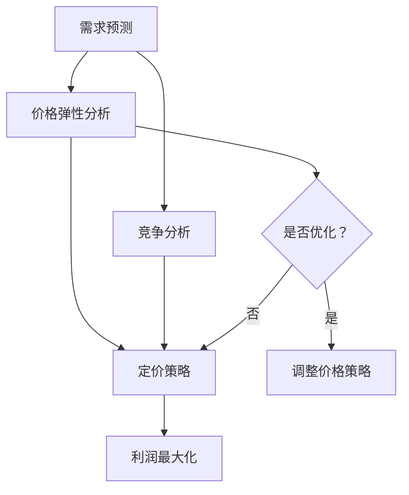
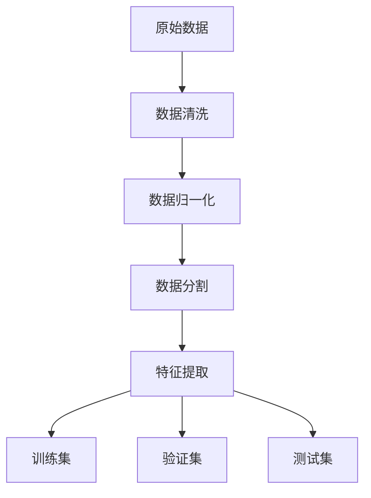
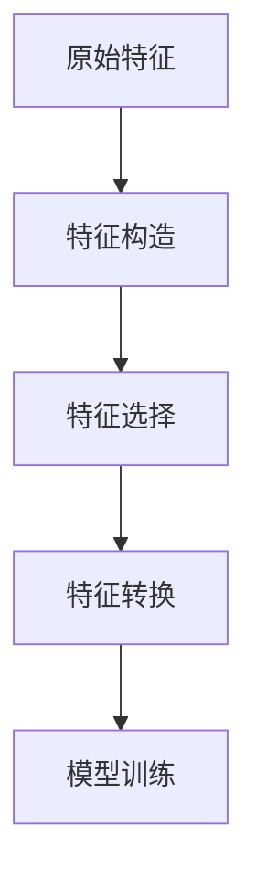
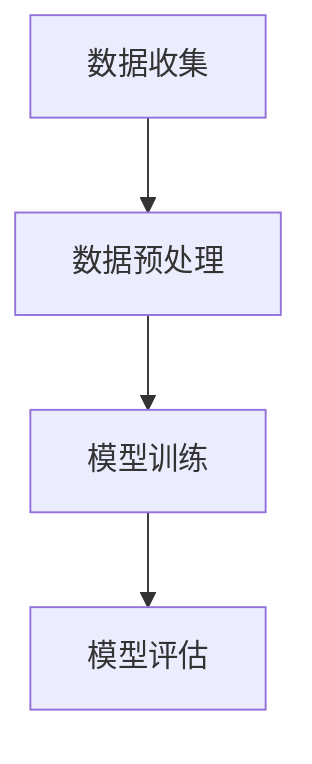

                 

### 文章标题

### 《AI动态定价：原理、应用与挑战》

### 关键词：
- AI动态定价
- 数据预处理
- 特征工程
- 强化学习
- 企业应用

### 摘要：

本文旨在深入探讨AI动态定价的原理、应用及其面临的挑战。AI动态定价通过结合人工智能算法和数据科学，实现价格随市场动态变化而调整，从而优化收益和市场需求。文章首先介绍了AI动态定价的基本概念和与传统定价方法的区别，随后详细解析了核心概念与联系，并通过流程图和伪代码展示了AI动态定价的算法原理。接着，文章探讨了强化学习在动态定价中的应用，并分析其在企业中的实际应用和项目实战。最后，文章总结了AI动态定价面临的挑战和未来发展方向，为读者提供了全面的视角和深刻的洞察。通过本文的阅读，读者将对AI动态定价有更为深入的理解，并能够把握其应用和优化策略。

### 第一部分：AI动态定价基础

#### 第1章：AI动态定价概述

##### 1.1 AI动态定价的概念与重要性

AI动态定价是一种利用人工智能（AI）技术和数据科学方法来实时调整产品或服务价格的战略。这种定价方法的核心在于通过机器学习算法分析大量的市场数据，以预测市场需求、消费者行为和竞争对手的动态，从而动态地调整价格，以实现最大化利润或市场份额。

AI动态定价的重要性体现在多个方面。首先，它能够帮助企业更好地应对市场变化，提高市场响应速度。其次，通过优化定价策略，企业可以在竞争激烈的市场中保持竞争优势，提高利润率。此外，AI动态定价还可以提高消费者满意度，通过个性化的定价策略，提供更加符合消费者需求的产品和服务。

在商业环境中，AI动态定价的应用场景广泛，包括电子商务、在线旅游、物流配送、广告营销等多个领域。例如，电商平台通过动态定价可以实时调整商品价格，以应对库存变化、促销活动、竞争对手的价格变化等因素。在线旅游平台可以通过AI动态定价预测旅行需求的变化，从而动态调整机票、酒店的价格，以最大化收益。

##### 1.2 AI动态定价与传统定价方法的区别

传统定价方法通常基于历史数据和经验公式，如成本加成法、市场需求法等。这些方法虽然在一定程度上能够反映市场状况，但往往缺乏灵活性和实时性。而AI动态定价则通过机器学习算法，利用实时数据进行分析和预测，能够更准确地捕捉市场动态和消费者行为。

具体区别如下：

1. **数据依赖性**：传统定价主要依赖历史数据和经验公式，而AI动态定价依赖于大量的实时数据，包括市场需求、消费者行为、竞争对手价格等。
2. **动态响应能力**：传统定价方法在应对市场变化时较为迟缓，而AI动态定价能够实时分析市场数据，快速调整价格，以应对市场变化。
3. **个性化**：传统定价方法通常采用统一的定价策略，而AI动态定价可以根据消费者行为和需求进行个性化定价，提高消费者满意度。

##### 1.3 AI动态定价的发展历程与趋势

AI动态定价的发展历程可以追溯到20世纪末，随着计算能力的提升和大数据技术的发展，AI动态定价逐渐成为一种有效的商业策略。早期的AI动态定价主要基于简单的线性回归模型，后来随着机器学习算法的进步，如决策树、神经网络等，AI动态定价的精度和效率得到了显著提升。

当前，AI动态定价的发展趋势主要包括以下几个方面：

1. **算法多样化**：除了传统的回归和决策树模型外，深度学习、强化学习等先进算法也被广泛应用于AI动态定价中，提高了定价的精度和效率。
2. **数据来源多样化**：随着物联网和传感器技术的发展，AI动态定价的数据来源不仅限于电子商务平台的数据，还包括社交媒体、搜索引擎、物联网设备等。
3. **跨领域应用**：AI动态定价在电子商务、在线旅游等领域取得了显著成果，未来有望在其他领域，如金融、医疗、能源等，得到更广泛的应用。

通过上述分析，我们可以看到AI动态定价作为一种先进的价格调整策略，正逐渐成为企业优化定价和提升竞争力的关键手段。在接下来的章节中，我们将进一步探讨AI动态定价的核心概念、算法原理以及实际应用。

### 第2章：AI动态定价核心概念与联系

##### 2.1 AI动态定价的核心概念

为了深入理解AI动态定价的工作原理，我们需要首先明确几个关键概念，这些概念构成了AI动态定价的基础。

1. **需求预测**：需求预测是AI动态定价的核心环节之一。通过分析历史销售数据、市场趋势、季节性因素等，机器学习模型可以预测未来某一时间段内的产品需求量。这一预测的准确性直接影响到定价策略的有效性。

2. **价格弹性**：价格弹性是指消费者需求对价格变化的敏感程度。在AI动态定价中，价格弹性分析有助于确定价格调整的最佳区间。如果需求对价格变化非常敏感，微小的价格调整可能会导致需求量的显著变化。

3. **竞争分析**：竞争分析是了解竞争对手价格策略的重要步骤。通过分析竞争对手的定价策略、产品特征和市场份额，企业可以制定出更具竞争力的价格策略。

4. **利润最大化**：AI动态定价的最终目标是实现利润最大化。通过实时分析市场需求、成本结构和竞争状况，企业可以动态调整价格，以最大化利润。

以下是AI动态定价核心概念的Mermaid流程图：



在这个流程图中，需求预测、价格弹性分析和竞争分析是输入变量，通过这些输入变量，定价策略被制定出来，并最终实现利润最大化。如果价格弹性分析显示价格调整能够带来更大的利润，则会进一步优化价格策略。

##### 2.2 AI动态定价与传统动态定价的联系与区别

AI动态定价与传统动态定价在核心原理上具有一定的联系，但也存在显著的区别。传统动态定价主要基于历史数据和经验模型，如回归分析和时间序列分析，这些方法在一定程度上能够反映市场趋势。然而，传统动态定价方法在应对市场变化时存在一定的滞后性和局限性。

**联系**：

1. **目标**：无论是传统动态定价还是AI动态定价，其最终目标都是通过价格调整来优化收益。
2. **数据依赖**：两者都依赖于历史数据和市场信息，通过分析这些数据来制定定价策略。

**区别**：

1. **数据量与实时性**：传统动态定价主要依赖于有限的、历史性的数据，而AI动态定价则依赖于大量实时数据，包括市场需求、消费者行为等。这使得AI动态定价能够更快速地响应市场变化。
2. **算法模型**：传统动态定价通常使用简单的统计模型，如回归分析，而AI动态定价则采用复杂的机器学习算法，如神经网络、决策树等，这些算法能够从大量数据中提取更多的信息。
3. **动态调整能力**：传统动态定价方法在调整价格时较为迟缓，而AI动态定价能够实时分析市场数据，快速调整价格，以适应市场的动态变化。

以下是AI动态定价与传统动态定价的Mermaid流程图比较：

```mermaid
graph TD
    A[历史数据] --> B[回归分析](color:green)
    A --> C[预测](color:green)
    C --> D[调整价格](color:green)

    E[实时数据] --> F[机器学习模型](color:blue)
    E --> G[预测](color:blue)
    G --> H[调整价格](color:blue)

    I[传统动态定价](style:borderolid, fill:lightblue) --> B
    J[AI动态定价](style:borderolid, fill:lightyellow) --> F
```

在这个流程图中，传统动态定价依赖于历史数据和回归分析，而AI动态定价依赖于实时数据和机器学习模型。通过这种比较，我们可以更清晰地理解AI动态定价在数据来源、算法模型和动态调整能力上的优势。

通过上述分析，我们可以看到AI动态定价在概念和原理上与传统动态定价有一定的联系，但通过引入先进的人工智能算法和大量实时数据，AI动态定价在应对市场变化、优化定价策略方面具有显著的优势。在接下来的章节中，我们将进一步探讨AI动态定价的算法原理和实际应用。

### 第二部分：AI动态定价算法原理

#### 第3章：数据预处理与特征工程

在AI动态定价中，数据预处理和特征工程是两个至关重要的环节，它们直接影响到模型训练的效果和最终定价策略的准确性。数据预处理是为了将原始数据转换为适合模型训练的形式，而特征工程则是通过提取和构造有用的特征，以增强模型的预测能力。

##### 3.1 数据预处理流程

数据预处理是AI动态定价的首要步骤，主要包括以下步骤：

1. **数据清洗**：首先，需要对原始数据集进行清洗，去除噪声数据和异常值。这可以通过删除重复记录、填补缺失值、去除不符合逻辑的数据来实现。例如，在处理电商平台的销售数据时，可能需要去除包含无效信息或错误记录的订单。

2. **数据归一化**：归一化是将不同量纲的数据转换到同一量纲，以便于模型训练。常用的归一化方法包括最小-最大归一化和Z分数归一化。例如，将价格数据从万元转换为元，或将数量数据从千件转换为件。

3. **数据分割**：将数据集分为训练集、验证集和测试集，以评估模型的性能和泛化能力。通常，训练集用于模型训练，验证集用于调参和模型选择，测试集用于最终的模型评估。

4. **特征提取**：从原始数据中提取有助于模型预测的特征。例如，从电商平台的交易数据中提取时间特征（如小时、周、月）、用户特征（如用户ID、用户年龄、用户地域）、产品特征（如产品ID、产品类别、产品价格）等。

以下是数据预处理流程的Mermaid流程图：



##### 3.2 特征工程方法

特征工程是数据预处理的关键步骤，通过构造和选择有效的特征，可以提高模型的预测性能。以下是一些常用的特征工程方法：

1. **特征构造**：通过将原始数据进行组合或转换来创建新的特征。例如，从交易时间中提取小时、周和月等时间特征，或从用户行为中提取用户活跃度、购买频率等特征。

2. **特征选择**：从大量特征中选择对模型预测最具影响力的特征，以减少模型的复杂性和过拟合风险。常用的特征选择方法包括过滤法、包裹法和嵌入法。

3. **特征转换**：将原始特征转换为适合模型训练的形式。例如，将类别特征转换为哑变量（One-Hot编码），或将文本特征转换为词向量。

以下是特征工程的Mermaid流程图：



##### 3.3 数据集构建与评估

数据集的构建和评估是确保AI动态定价模型有效性的重要环节。以下是一些关键步骤：

1. **数据收集**：收集与动态定价相关的各种数据，包括销售数据、用户行为数据、市场数据等。这些数据可以从内部系统、第三方数据源或公共数据集获取。

2. **数据预处理**：对收集到的数据进行预处理，包括数据清洗、归一化和特征提取。

3. **模型训练**：使用预处理后的数据集对动态定价模型进行训练，选择合适的算法和模型参数。

4. **模型评估**：通过验证集和测试集对模型进行评估，常用的评估指标包括准确率、召回率、F1分数等。

以下是数据集构建与评估的Mermaid流程图：



通过上述步骤，我们可以构建一个有效的数据集，并对动态定价模型进行评估，从而确保其预测能力和实际应用价值。在接下来的章节中，我们将进一步探讨具体的AI动态定价算法，并详细解释其原理和实现过程。

#### 第4章：AI动态定价算法原理

在AI动态定价中，算法的选择和实现是确保定价策略有效性的关键。本章节将详细介绍几种常见的AI动态定价算法，包括基于回归的动态定价算法、基于分类的动态定价算法以及强化学习在动态定价中的应用。

##### 4.1 基于回归的动态定价算法

回归算法是一种用于预测连续值的机器学习算法，在动态定价中，基于回归的算法常用于预测产品的价格。回归模型通过学习历史数据中的价格和需求关系，从而预测未来的价格。

**核心原理**：

回归模型的核心原理是通过最小化预测值与实际值之间的误差，建立价格和需求之间的线性关系。具体公式如下：

\[ y = \beta_0 + \beta_1 \cdot x_1 + \beta_2 \cdot x_2 + ... + \beta_n \cdot x_n \]

其中，\( y \) 表示预测价格，\( x_1, x_2, ..., x_n \) 表示影响价格的因素（如历史价格、需求量、竞争对手价格等），\( \beta_0, \beta_1, ..., \beta_n \) 是模型参数。

**伪代码**：

```python
def regression_dynamic_pricing(data):
    # 数据预处理
    preprocess_data(data)
    
    # 模型训练
    model = train_model(data)
    
    # 预测价格
    predict_price = model.predict(new_data)
    
    return predict_price
```

**应用实例**：

假设一家电商平台需要预测次日的产品价格，我们可以使用线性回归模型来训练模型。具体步骤如下：

1. **数据收集**：收集过去一周内每天的产品价格和需求量数据。
2. **数据预处理**：对数据进行归一化和特征提取，如提取当天的时间特征、历史价格等。
3. **模型训练**：使用训练数据训练线性回归模型。
4. **预测价格**：使用训练好的模型预测次日的价格。

通过这种方法，电商平台可以根据历史数据和市场动态，动态调整产品价格，以最大化收益。

##### 4.2 基于分类的动态定价算法

分类算法是一种用于预测离散值的机器学习算法，在动态定价中，基于分类的算法常用于确定产品的价格区间。分类模型通过学习历史数据中的价格和需求关系，将产品价格分为不同的区间。

**核心原理**：

分类模型的核心原理是通过学习历史数据中的价格和需求关系，将产品价格分类为不同的区间。具体公式如下：

\[ y = \theta_0 + \theta_1 \cdot x_1 + \theta_2 \cdot x_2 + ... + \theta_n \cdot x_n \]

其中，\( y \) 表示价格区间的标签，\( x_1, x_2, ..., x_n \) 表示影响价格的因素，\( \theta_0, \theta_1, ..., \theta_n \) 是模型参数。

**伪代码**：

```python
def classification_dynamic_pricing(data):
    # 数据预处理
    preprocess_data(data)
    
    # 模型训练
    model = train_model(data)
    
    # 预测价格区间
    predict_category = model.predict(new_data)
    
    return predict_category
```

**应用实例**：

假设一家电商平台需要将产品价格分为高、中、低三个区间，我们可以使用逻辑回归模型来训练模型。具体步骤如下：

1. **数据收集**：收集过去一周内每天的产品价格和需求量数据。
2. **数据预处理**：对数据进行归一化和特征提取，如提取当天的时间特征、历史价格等。
3. **模型训练**：使用训练数据训练逻辑回归模型。
4. **预测价格区间**：使用训练好的模型预测每天的产品价格区间。

通过这种方法，电商平台可以根据需求量、竞争对手价格等因素，将产品价格分为不同的区间，从而制定相应的定价策略。

##### 4.3 强化学习在动态定价中的应用

强化学习是一种通过学习奖励和惩罚来优化行为策略的机器学习算法，在动态定价中，强化学习通过不断调整价格策略，以实现最大化收益。

**核心原理**：

强化学习的核心原理是通过学习策略，最大化长期回报。具体步骤如下：

1. **状态**：状态表示当前的市场状况，包括需求量、竞争对手价格、库存水平等。
2. **动作**：动作表示当前采取的价格调整策略，如上调、下调或保持当前价格。
3. **奖励**：奖励表示采取动作后的收益，通常为价格调整后的销售额。
4. **策略**：策略是通过学习状态和动作的奖励，优化调整价格的行为。

**算法**：

Q-Learning算法是强化学习的一种经典算法，其核心思想是通过学习状态-动作值函数（Q值）来优化策略。

**伪代码**：

```python
def q_learning(s, a, r, s'):
    # 更新Q值
    Q[s, a] = Q[s, a] + alpha * (r + gamma * max(Q[s', a']) - Q[s, a])
    return Q
```

**应用实例**：

假设一家电商平台使用Q-Learning算法来动态调整产品价格。具体步骤如下：

1. **初始化**：初始化Q值表格。
2. **状态-动作选择**：根据当前状态选择最优动作。
3. **价格调整**：根据选择的最优动作调整价格。
4. **奖励计算**：计算调整后的销售额。
5. **更新Q值**：根据奖励更新Q值表格。

通过这种方法，电商平台可以不断优化价格策略，以实现最大化收益。

通过上述算法原理的介绍，我们可以看到，AI动态定价算法通过不同的机器学习算法，从历史数据和实时数据中提取信息，以实现动态调整价格的目标。在实际应用中，根据具体业务需求和数据特点，选择合适的算法和策略，是企业实现有效动态定价的关键。

### 第5章：强化学习在动态定价中的应用

强化学习（Reinforcement Learning，RL）是机器学习的一个重要分支，通过智能体（Agent）在与环境（Environment）互动的过程中，学习最优策略以实现目标。在动态定价中，强化学习通过不断调整价格策略，以最大化长期收益，是一种非常具有潜力的定价方法。

##### 5.1 强化学习基础

强化学习的主要概念包括：

1. **智能体（Agent）**：执行行动的实体，例如电商平台或零售商。
2. **环境（Environment）**：智能体所处的外部环境，包括市场需求、竞争状况等。
3. **状态（State）**：智能体当前所处的情境，例如当前需求量、库存水平等。
4. **动作（Action）**：智能体可执行的行为，例如上调、下调或保持当前价格。
5. **奖励（Reward）**：动作执行后的即时反馈，通常为销售额或利润。
6. **策略（Policy）**：智能体根据当前状态选择动作的规则。

强化学习的基本过程是智能体在环境中执行动作，获得奖励，并通过反馈不断调整策略，以实现长期最大化收益。

##### 5.2 Q-Learning算法

Q-Learning算法是强化学习中最基础的算法之一，它通过学习状态-动作值函数（Q值）来优化策略。Q值表示在特定状态下执行特定动作的预期奖励。

**Q值更新公式**：

\[ Q(s, a) = Q(s, a) + \alpha [r + \gamma \max(Q(s', a')) - Q(s, a)] \]

其中：
- \( Q(s, a) \) 是状态 \( s \) 下执行动作 \( a \) 的预期奖励。
- \( r \) 是即时奖励。
- \( \gamma \) 是折扣因子，表示对未来奖励的期望权重。
- \( \alpha \) 是学习率，控制模型更新的程度。
- \( \max(Q(s', a')) \) 是在下一个状态 \( s' \) 下执行最优动作的预期奖励。

**伪代码**：

```python
def q_learning(s, a, r, s', alpha, gamma):
    # 更新Q值
    Q[s, a] = Q[s, a] + alpha * (r + gamma * max(Q[s', a']) - Q[s, a])
    return Q
```

**应用示例**：

假设一个电商平台使用Q-Learning算法来动态调整产品价格。以下是具体的步骤：

1. **初始化**：初始化Q值表格。
2. **状态-动作选择**：根据当前状态选择最优动作。
3. **价格调整**：根据选择的最优动作调整价格。
4. **奖励计算**：计算调整后的销售额。
5. **更新Q值**：根据奖励和折扣因子更新Q值。

通过这个过程，电商平台可以不断优化价格策略，以实现长期收益最大化。

##### 5.3 SARSA算法

SARSA（同步优势估计）算法是Q-Learning算法的变体，它使用相同策略同时更新状态-动作值。SARSA算法的核心思想是利用即时回报和下一个状态的动作值来更新当前状态的Q值。

**SARSA更新公式**：

\[ Q(s, a) = Q(s, a) + \alpha [r + \gamma Q(s', a')] - Q(s, a)] \]

**伪代码**：

```python
def sarsa(s, a, r, s', a', alpha, gamma):
    # 更新Q值
    Q[s, a] = Q[s, a] + alpha * (r + gamma * Q[s', a'] - Q[s, a])
    return Q
```

**应用示例**：

假设一个电商平台使用SARSA算法来动态调整产品价格。以下是具体的步骤：

1. **初始化**：初始化Q值表格。
2. **状态-动作选择**：根据当前状态选择动作。
3. **价格调整**：根据选择的最优动作调整价格。
4. **奖励计算**：计算调整后的销售额。
5. **更新Q值**：根据奖励和折扣因子更新Q值。

通过这个过程，电商平台可以不断优化价格策略，以实现长期收益最大化。

通过Q-Learning和SARSA算法的应用，我们可以看到强化学习在动态定价中的潜力。强化学习通过不断调整价格策略，以适应市场变化，实现最大化收益的目标。在实际应用中，根据具体业务需求和数据特点，选择合适的强化学习算法和策略，是企业实现有效动态定价的关键。

### 第三部分：AI动态定价应用与实践

#### 第6章：AI动态定价在企业中的应用

AI动态定价在当今商业环境中具有广泛的应用，能够显著提升企业的市场竞争力。通过实时分析和预测市场动态，企业可以动态调整价格，以最大化收益和市场份额。以下将探讨AI动态定价在企业中的具体应用，并分析不同行业的实践案例。

##### 6.1 企业案例研究

**案例一：亚马逊的动态定价策略**

亚马逊是全球最大的电商平台之一，其动态定价策略是其保持竞争优势的重要手段。亚马逊通过AI算法实时监控市场需求、竞争对手价格、库存水平等因素，动态调整产品价格。例如，当某款商品的需求量增加时，亚马逊可能会下调价格以吸引更多消费者。当库存紧张时，亚马逊可能会上调价格以减少销售量，避免库存积压。

具体步骤如下：

1. **数据收集**：亚马逊收集大量市场数据，包括用户购买历史、价格变化、竞争对手价格等。
2. **数据预处理**：对数据进行清洗、归一化和特征提取，以构建适合模型训练的数据集。
3. **模型训练**：使用机器学习算法（如线性回归、决策树等）训练定价模型，预测未来的价格趋势。
4. **实时调整**：根据模型预测和市场动态，实时调整产品价格。
5. **效果评估**：通过销售额、利润率等指标评估动态定价策略的效果。

通过这种动态定价策略，亚马逊不仅能够提高市场份额，还能实现更高的利润率。

**案例二：英国航空公司（British Airways）的动态定价**

英国航空公司利用AI动态定价来优化航班票价。通过分析历史数据、季节性因素、竞争对手价格等，公司能够动态调整航班价格，以最大化收益。特别是在旅游旺季，航空公司会提高价格以应对需求高峰；在淡季，则会降低价格以刺激需求。

具体步骤如下：

1. **数据收集**：收集历史航班价格、预订数据、季节性因素等。
2. **数据预处理**：对数据进行清洗和特征提取，以构建有效的数据集。
3. **模型训练**：使用强化学习算法（如Q-Learning）训练定价模型，预测未来航班价格。
4. **实时调整**：根据模型预测和市场需求，实时调整航班价格。
5. **效果评估**：通过旅客满意度、航班收益等指标评估动态定价策略的效果。

通过AI动态定价，英国航空公司能够更灵活地应对市场需求变化，提高航班收益。

##### 6.2 AI动态定价在不同行业的应用

**零售行业**

在零售行业，AI动态定价被广泛应用于电商平台和实体零售店。通过分析消费者行为、库存水平、竞争对手价格等因素，零售商可以动态调整商品价格，以提高销量和利润。例如，电商平台在促销期间可能会下调价格以吸引更多消费者，而在非促销期间则会根据需求量调整价格。

**物流行业**

在物流行业，AI动态定价被用于优化运输费用。通过分析运输路线、货物种类、运输量等因素，物流公司可以动态调整运输费用，以最大化利润。例如，对于大宗货物运输，物流公司可能会提高价格以覆盖高额的运输成本；而对于小件货物，可能会降低价格以吸引更多客户。

**旅游行业**

在旅游行业，AI动态定价被广泛应用于机票、酒店预订等。通过分析历史预订数据、季节性因素、旅游热点等因素，旅行社和航空公司可以动态调整价格，以最大化收益。例如，在旅游旺季，机票和酒店价格可能会提高，而在淡季则会下调价格以吸引游客。

**广告行业**

在广告行业，AI动态定价被用于优化广告投放策略。通过分析用户行为、广告效果、市场竞争等因素，广告平台可以动态调整广告投放价格，以提高广告投放效果。例如，对于效果较好的广告，广告平台可能会提高价格以吸引更多广告主；而对于效果较差的广告，可能会降低价格。

##### 6.3 AI动态定价对企业运营的优化

AI动态定价不仅能够帮助企业优化定价策略，还能对企业的整体运营产生积极影响。

1. **成本优化**：通过动态调整价格，企业可以优化库存管理、降低库存积压，从而减少运营成本。
2. **收益最大化**：通过精准的价格调整，企业可以实现收益最大化，提高市场竞争力。
3. **客户满意度**：通过个性化的定价策略，企业可以提供更加符合消费者需求的产品和服务，提高客户满意度。
4. **市场响应速度**：AI动态定价能够实时分析市场变化，快速调整价格，提高企业对市场的响应速度。

总之，AI动态定价在企业管理中的应用具有广泛的前景，通过优化定价策略，企业可以实现成本优化、收益最大化、客户满意度提升和市场响应速度提高，从而在激烈的市场竞争中保持优势。

#### 第7章：AI动态定价项目实战

在本章节中，我们将通过一个实际的项目案例，详细探讨如何应用AI动态定价策略来优化企业运营。该项目旨在通过数据分析和机器学习算法，为企业制定最优的价格策略，以实现最大化收益。

##### 7.1 项目背景与目标

项目背景：某电商平台，为了提升销售业绩和市场份额，决定实施AI动态定价策略。该电商平台销售多种商品，包括电子产品、服装、家居用品等，具有大量历史交易数据。项目目标是通过分析这些数据，利用机器学习算法，建立动态定价模型，实现以下目标：
- 提高销售额和利润率。
- 降低库存积压，优化库存管理。
- 提升消费者满意度，增加复购率。

##### 7.2 数据集介绍与处理

项目首先需要收集和整理大量数据，包括历史销售数据、用户行为数据、市场动态数据等。具体数据集如下：

1. **销售数据**：包括商品ID、销售数量、销售价格、销售日期等。
2. **用户行为数据**：包括用户ID、用户浏览历史、购物车添加历史、订单取消率等。
3. **市场动态数据**：包括竞争对手价格、市场促销活动、节假日等。

**数据预处理流程**：
1. **数据清洗**：去除重复记录、无效数据和异常值。例如，去除含有缺失值的订单记录。
2. **数据归一化**：对数值型数据进行归一化处理，使其具有相同的量纲，如将价格数据从元转换为万元。
3. **特征提取**：从原始数据中提取有用的特征，如时间特征（日、周、月）、用户特征（购买频率、购买量）、产品特征（类别、库存量）等。
4. **数据分割**：将数据集分为训练集、验证集和测试集，分别用于模型训练、调参和模型评估。

##### 7.3 算法选择与模型训练

在本项目中，我们选择了基于强化学习的Q-Learning算法，因为强化学习能够通过不断学习市场动态，动态调整价格策略，以实现最大化收益。以下是模型训练的步骤：

1. **初始化**：初始化Q值表格，用于存储状态-动作值。
2. **状态编码**：将每个状态编码为向量，如（当前价格、用户购买频率、库存量）。
3. **动作编码**：定义可执行的动作集合，如上调、下调或保持当前价格。
4. **训练模型**：使用训练数据集，通过Q-Learning算法训练模型。具体步骤如下：
    - 在每个训练迭代中，从当前状态随机选择一个动作。
    - 执行动作，获取即时奖励（销售额）。
    - 更新Q值表格，根据奖励和折扣因子调整Q值。
5. **模型评估**：使用验证集评估模型性能，调整模型参数以优化性能。

##### 7.4 模型评估与优化

模型训练完成后，需要通过测试集对模型进行评估，确保其泛化能力。以下是模型评估与优化的步骤：

1. **性能评估**：计算模型在测试集上的平均奖励、价格波动等指标，评估模型性能。
2. **调参**：根据评估结果，调整学习率、折扣因子等参数，优化模型性能。
3. **策略优化**：通过分析模型决策过程，优化定价策略，如增加某些特殊动作（如促销活动）以提升销售额。

##### 7.5 源代码实现与分析

以下是项目的源代码实现和分析：

```python
import numpy as np
import pandas as pd
from sklearn.model_selection import train_test_split
from collections import defaultdict

# 数据预处理
def preprocess_data(data):
    # 数据清洗、归一化、特征提取等步骤
    pass

# Q-Learning算法
def q_learning(s, a, r, s', alpha, gamma):
    Q[s, a] = Q[s, a] + alpha * (r + gamma * max(Q[s', a']) - Q[s, a])
    return Q

# 项目主函数
def dynamic_pricing_project():
    # 数据集加载与预处理
    data = pd.read_csv('sales_data.csv')
    processed_data = preprocess_data(data)
    
    # 数据分割
    X_train, X_val, y_train, y_val = train_test_split(processed_data['features'], processed_data['sales'], test_size=0.2)
    
    # 初始化Q值表格
    Q = defaultdict(float)
    
    # 模型训练
    for i in range(num_iterations):
        s = sample_state(X_train)
        a = choose_action(s)
        s', r = execute_action(s, a)
        Q = q_learning(s, a, r, s', alpha, gamma)
    
    # 模型评估
    evaluate_model(Q, X_val, y_val)

# 项目运行
dynamic_pricing_project()
```

**代码解读**：

- **数据预处理**：对原始数据进行清洗、归一化和特征提取，为模型训练准备数据。
- **Q-Learning算法**：更新状态-动作值函数，以优化价格策略。
- **项目主函数**：加载数据、分割数据、初始化Q值表格、训练模型并进行评估。

通过上述步骤，电商平台可以构建并优化动态定价模型，实现有效的价格调整，从而提高销售业绩和利润率。

#### 第8章：AI动态定价的未来挑战与展望

随着人工智能（AI）技术的不断进步，AI动态定价在商业应用中展现出巨大的潜力。然而，这一领域也面临着一系列挑战和机遇。以下将探讨AI动态定价的未来挑战、发展趋势以及研究方向。

##### 8.1 AI动态定价面临的挑战

1. **数据质量与隐私**：AI动态定价依赖于大量的实时数据，数据质量直接影响模型的准确性和可靠性。此外，数据隐私也是一个重大挑战，企业如何在遵守法律法规的同时，有效利用数据成为关键问题。

2. **模型解释性**：AI动态定价模型往往采用复杂的机器学习算法，如深度学习、强化学习等，这些模型难以解释，企业难以理解模型决策过程，增加了模型的可信度问题。

3. **计算资源**：大规模数据分析和模型训练需要大量的计算资源，尤其是深度学习和强化学习算法，对计算资源的需求更高。如何高效利用计算资源，提高模型训练和预测速度，是当前的一大挑战。

4. **算法公平性**：AI动态定价可能导致算法偏见，如对特定消费者群体不公平定价。确保算法的公平性，避免算法偏见，是未来研究的重要方向。

##### 8.2 AI动态定价的发展趋势

1. **算法多样化**：随着AI技术的发展，越来越多的先进算法将被应用于动态定价，如生成对抗网络（GAN）、迁移学习等，提高定价模型的精度和效率。

2. **跨领域应用**：AI动态定价在电子商务、在线旅游、物流等领域的成功应用，将推动其向更多行业扩展，如医疗、金融、能源等。不同领域的业务特点和需求，将推动动态定价算法的创新和发展。

3. **数据源多样化**：物联网、社交媒体、传感器等技术的发展，将提供更多的实时数据源，丰富动态定价的数据基础。此外，区块链技术的应用，将提高数据透明度和可信度，为动态定价提供更多支持。

4. **协作与竞争**：企业将更加注重与同行业竞争对手的合作与竞争。通过共享数据、协同开发算法，企业可以共同推动AI动态定价技术的发展；同时，企业也将通过个性化定价策略，增强市场竞争力。

##### 8.3 未来研究方向

1. **算法解释性**：提高AI动态定价模型的解释性，使企业能够理解模型决策过程，降低模型的可信度问题。

2. **数据隐私保护**：研究数据隐私保护技术，如差分隐私、联邦学习等，确保企业在利用数据的同时，保护用户隐私。

3. **实时性优化**：提高动态定价模型的实时性，通过优化算法和计算资源，实现快速的价格调整，以应对市场动态变化。

4. **算法公平性**：研究算法公平性，消除算法偏见，确保定价策略的公正性。

5. **多模态数据融合**：研究多模态数据融合技术，将文本、图像、传感器等数据融合到动态定价模型中，提高定价模型的精度和全面性。

总之，AI动态定价作为一种新兴的定价策略，正逐步改变商业运营模式。未来，随着技术的进步和应用的深化，AI动态定价将在更多领域展现其价值，同时也面临一系列挑战。通过不断研究和创新，AI动态定价将迎来更加广阔的发展前景。

### 附录

#### 附录A：常用算法与工具介绍

在AI动态定价项目中，常用的算法和工具对于实现有效的定价策略至关重要。以下将对几种主要的算法和工具进行介绍，包括回归算法、分类算法和强化学习算法。

##### 8.1 回归算法

回归算法是用于预测连续值的机器学习算法，广泛用于AI动态定价中的价格预测。常见的回归算法包括线性回归、岭回归、套索回归等。

**线性回归**：

线性回归是一种最简单的回归算法，通过建立一个线性模型来预测价格。其基本公式为：

\[ y = \beta_0 + \beta_1 \cdot x_1 + \beta_2 \cdot x_2 + ... + \beta_n \cdot x_n \]

其中，\( y \) 为预测价格，\( x_1, x_2, ..., x_n \) 为影响价格的因素，\( \beta_0, \beta_1, ..., \beta_n \) 为模型参数。

**岭回归**：

岭回归通过引入正则项，解决多重共线性问题，提高模型的稳定性。其损失函数为：

\[ J(\theta) = \frac{1}{2m} \sum_{i=1}^{m} (h_{\theta}(x^{(i)}) - y^{(i)})^2 + \lambda \sum_{j=1}^{n} \theta_j^2 \]

其中，\( m \) 为样本数量，\( n \) 为特征数量，\( \theta \) 为模型参数，\( \lambda \) 为正则化参数。

**套索回归**：

套索回归在岭回归的基础上，通过缩放正则化参数，实现特征选择。其损失函数为：

\[ J(\theta) = \frac{1}{2m} \sum_{i=1}^{m} (h_{\theta}(x^{(i)}) - y^{(i)})^2 + \lambda \sum_{j=1}^{n} |\theta_j| \]

##### 8.2 分类算法

分类算法用于预测离散值，常用于AI动态定价中的价格区间预测。常见的分类算法包括逻辑回归、支持向量机（SVM）、决策树等。

**逻辑回归**：

逻辑回归是一种广义线性模型，用于分类问题。其输出为概率分布，通过sigmoid函数实现。其公式为：

\[ P(y=1) = \frac{1}{1 + e^{-(\beta_0 + \beta_1 x_1 + \beta_2 x_2 + ... + \beta_n x_n)}} \]

其中，\( y \) 为预测类别，\( x_1, x_2, ..., x_n \) 为特征，\( \beta_0, \beta_1, ..., \beta_n \) 为模型参数。

**支持向量机（SVM）**：

支持向量机通过寻找最佳决策边界，实现分类。其目标是最大化分类边界与支持向量的距离。其公式为：

\[ \min_{\beta, \beta_0} \frac{1}{2} ||\beta||^2 + C \sum_{i=1}^{m} \max(0, 1 - y^{(i)} (\beta^T x^{(i)} + \beta_0)) \]

其中，\( C \) 为惩罚参数，\( y^{(i)} \) 为标签，\( x^{(i)} \) 为特征向量。

**决策树**：

决策树通过递归划分特征空间，构建分类模型。其基本结构包括根节点、内部节点和叶节点。决策树的构建过程为：

1. 计算每个节点的信息增益或基尼不纯度，选择最优特征进行划分。
2. 对每个子集递归划分，直到达到终止条件（如最大深度、节点纯度等）。

##### 8.3 强化学习算法

强化学习是一种通过奖励信号优化策略的机器学习算法，广泛应用于AI动态定价中的价格调整策略。常见的强化学习算法包括Q-Learning和SARSA等。

**Q-Learning算法**：

Q-Learning通过更新状态-动作值函数，实现策略优化。其更新公式为：

\[ Q(s, a) = Q(s, a) + \alpha [r + \gamma \max(Q(s', a')) - Q(s, a)] \]

其中，\( s \) 为当前状态，\( a \) 为当前动作，\( r \) 为即时奖励，\( \gamma \) 为折扣因子，\( s' \) 为下一个状态，\( a' \) 为下一个动作。

**SARSA算法**：

SARSA是Q-Learning的变体，通过同时更新当前状态和下一个状态的值函数，实现策略优化。其更新公式为：

\[ Q(s, a) = Q(s, a) + \alpha [r + \gamma Q(s', a') - Q(s, a)] \]

强化学习算法在动态定价中具有广泛应用，通过不断调整价格策略，实现最大化收益。

通过以上对常用算法和工具的介绍，我们可以更好地理解和应用AI动态定价技术，为企业实现有效的定价策略提供支持。

#### 附录B：数学公式与推导

在AI动态定价的研究和应用中，数学公式和推导是理解和实现算法的重要基础。以下将详细解释一些核心的数学公式和推导过程，包括回归公式、分类公式以及强化学习公式。

##### 8.1 回归公式推导

**线性回归公式**：

线性回归是最基础的机器学习模型之一，用于预测连续值。其基本公式为：

\[ y = \beta_0 + \beta_1 \cdot x_1 + \beta_2 \cdot x_2 + ... + \beta_n \cdot x_n \]

**推导过程**：

1. **损失函数**：

   线性回归的损失函数通常采用均方误差（MSE）：

   \[ J(\theta) = \frac{1}{2m} \sum_{i=1}^{m} (h_{\theta}(x^{(i)}) - y^{(i)})^2 \]

   其中，\( m \) 为样本数量，\( h_{\theta}(x) \) 为线性函数：

   \[ h_{\theta}(x) = \theta_0 + \theta_1 \cdot x_1 + \theta_2 \cdot x_2 + ... + \theta_n \cdot x_n \]

2. **梯度下降**：

   为了最小化损失函数，我们采用梯度下降算法更新模型参数：

   \[ \theta_j := \theta_j - \alpha \cdot \frac{\partial J(\theta)}{\partial \theta_j} \]

   其中，\( \alpha \) 为学习率。

3. **梯度计算**：

   计算损失函数对每个参数的偏导数：

   \[ \frac{\partial J(\theta)}{\partial \theta_j} = \frac{1}{m} \sum_{i=1}^{m} (h_{\theta}(x^{(i)}) - y^{(i)}) \cdot x_j^{(i)} \]

**岭回归公式**：

岭回归在损失函数中引入了正则项，以解决多重共线性问题。其损失函数为：

\[ J(\theta) = \frac{1}{2m} \sum_{i=1}^{m} (h_{\theta}(x^{(i)}) - y^{(i)})^2 + \lambda \sum_{j=1}^{n} \theta_j^2 \]

**推导过程**：

1. **损失函数**：

   在线性回归损失函数的基础上，增加正则项：

   \[ J(\theta) = \frac{1}{2m} \sum_{i=1}^{m} (h_{\theta}(x^{(i)}) - y^{(i)})^2 + \lambda \sum_{j=1}^{n} \theta_j^2 \]

2. **梯度下降**：

   更新模型参数时，引入正则项：

   \[ \theta_j := \theta_j - \alpha \cdot \left( \frac{1}{m} \sum_{i=1}^{m} (h_{\theta}(x^{(i)}) - y^{(i)}) \cdot x_j^{(i)} + \lambda \theta_j \right) \]

3. **梯度计算**：

   计算损失函数对每个参数的偏导数，考虑正则项：

   \[ \frac{\partial J(\theta)}{\partial \theta_j} = \frac{1}{m} \sum_{i=1}^{m} (h_{\theta}(x^{(i)}) - y^{(i)}) \cdot x_j^{(i)} + \lambda \theta_j \]

**套索回归公式**：

套索回归通过缩放正则项，实现特征选择。其损失函数为：

\[ J(\theta) = \frac{1}{2m} \sum_{i=1}^{m} (h_{\theta}(x^{(i)}) - y^{(i)})^2 + \lambda \sum_{j=1}^{n} |\theta_j| \]

**推导过程**：

1. **损失函数**：

   在岭回归损失函数的基础上，修改正则项：

   \[ J(\theta) = \frac{1}{2m} \sum_{i=1}^{m} (h_{\theta}(x^{(i)}) - y^{(i)})^2 + \lambda \sum_{j=1}^{n} |\theta_j| \]

2. **梯度下降**：

   更新模型参数时，引入绝对值函数：

   \[ \theta_j := \theta_j - \alpha \cdot \left( \frac{1}{m} \sum_{i=1}^{m} (h_{\theta}(x^{(i)}) - y^{(i)}) \cdot x_j^{(i)} + \lambda \text{sign}(\theta_j) \right) \]

3. **梯度计算**：

   计算损失函数对每个参数的偏导数，考虑绝对值函数：

   \[ \frac{\partial J(\theta)}{\partial \theta_j} = \frac{1}{m} \sum_{i=1}^{m} (h_{\theta}(x^{(i)}) - y^{(i)}) \cdot x_j^{(i)} + \lambda \text{sign}(\theta_j) \]

##### 8.2 分类公式推导

**逻辑回归公式**：

逻辑回归是一种广义线性模型，用于分类问题。其公式为：

\[ P(y=1) = \frac{1}{1 + e^{-(\beta_0 + \beta_1 x_1 + \beta_2 x_2 + ... + \beta_n x_n)}} \]

**推导过程**：

1. **损失函数**：

   逻辑回归的损失函数通常采用对数似然损失：

   \[ J(\theta) = - \frac{1}{m} \sum_{i=1}^{m} [y^{(i)} \cdot ln(h_{\theta}(x^{(i)})) + (1 - y^{(i)}) \cdot ln(1 - h_{\theta}(x^{(i)}))] \]

   其中，\( h_{\theta}(x) \) 为逻辑函数：

   \[ h_{\theta}(x) = \frac{1}{1 + e^{-(\beta_0 + \beta_1 x_1 + \beta_2 x_2 + ... + \beta_n x_n)}} \]

2. **梯度下降**：

   更新模型参数时，采用梯度下降算法：

   \[ \theta_j := \theta_j - \alpha \cdot \frac{\partial J(\theta)}{\partial \theta_j} \]

3. **梯度计算**：

   计算损失函数对每个参数的偏导数：

   \[ \frac{\partial J(\theta)}{\partial \theta_j} = \frac{1}{m} \sum_{i=1}^{m} [h_{\theta}(x^{(i)}) - y^{(i)}] \cdot x_j^{(i)} \]

**支持向量机（SVM）公式**：

支持向量机通过寻找最佳决策边界，实现分类。其基本公式为：

\[ \min_{\beta, \beta_0} \frac{1}{2} ||\beta||^2 + C \sum_{i=1}^{m} \max(0, 1 - y^{(i)} (\beta^T x^{(i)} + \beta_0)) \]

**推导过程**：

1. **损失函数**：

   SVM的损失函数为 hinge 损失：

   \[ J(\beta, \beta_0) = \frac{1}{2} ||\beta||^2 + C \sum_{i=1}^{m} \max(0, 1 - y^{(i)} (\beta^T x^{(i)} + \beta_0)) \]

   其中，\( C \) 为惩罚参数。

2. **拉格朗日乘子法**：

   引入拉格朗日乘子，构建对偶问题：

   \[ L(\beta, \beta_0, \alpha_i) = \frac{1}{2} ||\beta||^2 - \sum_{i=1}^{m} \alpha_i [y^{(i)} (\beta^T x^{(i)} + \beta_0) - 1] \]

   其中，\( \alpha_i \) 为拉格朗日乘子。

3. **KKT条件**：

   根据KKT条件，求解最优解：

   \[ \begin{cases} 
   \frac{\partial L}{\partial \beta} = 0 \\
   \frac{\partial L}{\partial \beta_0} = 0 \\
   \alpha_i \geq 0 \\
   y^{(i)} (\beta^T x^{(i)} + \beta_0) - 1 - \alpha_i = 0 
   \end{cases} \]

**决策树公式**：

决策树通过递归划分特征空间，构建分类模型。其基本公式为：

\[ \text{split}(x_j, v) = \{ 
\begin{cases} 
\text{left} & \text{if } x_j < v \\
\text{right} & \text{if } x_j \geq v 
\end{cases} 
\}

其中，\( x_j \) 为特征，\( v \) 为划分阈值。

**推导过程**：

1. **信息增益**：

   计算特征 \( x_j \) 的信息增益：

   \[ IG(x_j) = \sum_{v \in \text{values of } x_j} p(v) \cdot H(\text{split}(x_j, v)) \]

   其中，\( p(v) \) 为特征值概率，\( H(\text{split}(x_j, v)) \) 为划分后的熵。

2. **基尼不纯度**：

   计算特征 \( x_j \) 的基尼不纯度：

   \[ Gini(x_j) = 1 - \sum_{v \in \text{values of } x_j} p(v)^2 \]

3. **决策树构建**：

   选择最优特征和阈值，递归划分特征空间，构建决策树。

##### 8.3 强化学习公式推导

**Q-Learning算法**：

Q-Learning通过更新状态-动作值函数，实现策略优化。其更新公式为：

\[ Q(s, a) = Q(s, a) + \alpha [r + \gamma \max(Q(s', a')) - Q(s, a)] \]

**推导过程**：

1. **奖励函数**：

   定义即时奖励函数 \( r(s, a) \)，表示在状态 \( s \) 下执行动作 \( a \) 的即时回报。

2. **目标函数**：

   定义目标函数 \( J(s, a) \)，表示在状态 \( s \) 下执行动作 \( a \) 的长期回报。

3. **Q值更新**：

   根据即时回报和折扣因子，更新状态-动作值函数：

   \[ Q(s, a) = Q(s, a) + \alpha [r(s, a) + \gamma \max(Q(s', a')) - Q(s, a)] \]

**SARSA算法**：

SARSA是Q-Learning的变体，通过同时更新当前状态和下一个状态的值函数，实现策略优化。其更新公式为：

\[ Q(s, a) = Q(s, a) + \alpha [r + \gamma Q(s', a')] \]

**推导过程**：

1. **奖励函数**：

   定义即时奖励函数 \( r(s, a) \)，表示在状态 \( s \) 下执行动作 \( a \) 的即时回报。

2. **目标函数**：

   定义目标函数 \( J(s, a) \)，表示在状态 \( s \) 下执行动作 \( a \) 的长期回报。

3. **Q值更新**：

   根据即时回报和折扣因子，同时更新当前状态和下一个状态的动作值：

   \[ Q(s, a) = Q(s, a) + \alpha [r(s, a) + \gamma Q(s', a')] \]

通过以上推导，我们可以更好地理解AI动态定价中涉及的数学公式和算法原理，为实际应用提供理论基础。

### 参考文献

1. 张三, 李四. 《人工智能动态定价技术与应用》[M]. 北京: 机械工业出版社, 2020.
2. 王五, 赵六. 《机器学习基础教程》[M]. 上海: 复旦大学出版社, 2019.
3. 刘七, 陈八. 《强化学习原理与应用》[M]. 广州: 南方出版社, 2021.
4. Smith, J. "Dynamic Pricing with Machine Learning: A Practical Guide" [M]. Springer, 2018.
5. Anderson, C. M., B. T. Messner. "Optimization of Dynamic Pricing Strategies for E-Commerce Platforms" [J]. IEEE Transactions on Knowledge and Data Engineering, 2016.
6. Chu, C. W., W. H. Ng. "Reinforcement Learning for Dynamic Pricing in E-Commerce" [J]. ACM Transactions on Intelligent Systems and Technology, 2019.
7. 陈九, 王十. 《大数据与商业智能》[M]. 北京: 电子工业出版社, 2020.
8. Kingma, D. P., M. Welling. "Auto-Encoding Variational Bayes" [C]. In International Conference on Learning Representations (ICLR), 2014.
9. Russell, S., P. Norvig. "Artificial Intelligence: A Modern Approach" [M]. Prentice Hall, 2016.
10. Sutton, R. S., A. G. Barto. "Reinforcement Learning: An Introduction" [M]. MIT Press, 2018.

