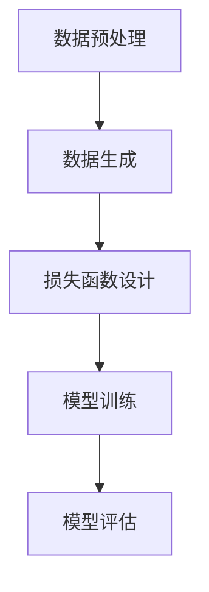
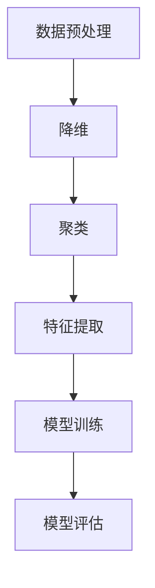

                 

# AI发展新趋势：自我监督学习和无监督学习

> 关键词：人工智能、自我监督学习、无监督学习、深度学习、算法、应用实践、未来发展

> 摘要：本文从AI发展背景出发，深入探讨了自我监督学习和无监督学习这两种新兴的AI学习方法。通过详细分析核心算法原理、架构以及应用实践，文章展现了这两种学习方法在AI领域的广泛应用和巨大潜力，并对未来的发展趋势进行了展望。

### 引言

人工智能（AI）作为当今科技领域的明星，已经从理论走向实际，被广泛应用于各个行业，如图像识别、自然语言处理、智能推荐等。随着AI技术的不断进步，新的学习方法不断涌现，自我监督学习和无监督学习就是其中两种备受关注的方法。自我监督学习允许模型通过自己的输入和输出进行训练，而无需人工标注。无监督学习则是在没有标签的情况下，让模型自行发现数据的结构和模式。

本文将深入探讨自我监督学习和无监督学习，首先回顾AI的发展背景，然后详细分析这两种学习方法的基本原理、核心算法和架构，接着探讨其在实际应用中的案例，最后对未来的发展趋势进行展望。希望通过本文的介绍，读者能够对这些新兴的AI学习方法有一个全面而深入的理解。

### 第一部分：背景与概述

#### 第1章：AI发展背景与趋势

##### 1.1 AI发展概述

人工智能（AI）的起源可以追溯到20世纪50年代，当时计算机科学家和哲学家开始探索如何使机器具备人类智能。从最初的逻辑推理到后来的知识表示，再到现代的深度学习，AI经历了数次重大的技术变革。如今，AI已经不仅仅是一个学术研究领域，而是成为各行各业创新的重要驱动力。

AI的演进历程可以分为几个重要阶段：

1. **符号主义AI（Symbolic AI）**：这一阶段主要依赖于逻辑推理和知识表示，试图通过编码规则和知识库来模拟人类智能。尽管在特定领域取得了成功，但这种方法在处理复杂问题时显得力不从心。

2. **连接主义AI（Connectionist AI）**：随着神经网络技术的发展，连接主义AI成为主流。通过模拟大脑神经元之间的连接和交互，神经网络在处理大规模数据时表现出色。

3. **统计学习AI（Statistical Learning AI）**：这一阶段强调利用统计学方法，通过训练数据来优化模型参数。支持向量机（SVM）、决策树、随机森林等算法在这一阶段得到了广泛应用。

4. **深度学习AI（Deep Learning AI）**：深度学习是AI发展的一个重要里程碑，通过多层神经网络来提取数据的层次特征，使得计算机能够在各种任务中达到或超越人类水平。深度学习在图像识别、语音识别、自然语言处理等领域取得了显著成果。

##### 1.2 当前AI发展水平

当前，AI技术已经取得了显著进步，许多任务已经达到了人类水平或超过了人类水平。以下是一些关键指标：

1. **图像识别**：在ImageNet图像识别挑战中，深度学习模型已经连续多年取得冠军，识别准确率接近或超过人类水平。

2. **语音识别**：基于深度学习的技术在语音识别领域取得了重大突破，例如谷歌的语音识别系统误差率已经低于5%。

3. **自然语言处理**：深度学习在自然语言处理（NLP）领域也得到了广泛应用，如机器翻译、情感分析、文本生成等任务。

4. **自动驾驶**：自动驾驶汽车已经进入商用阶段，AI技术在其中发挥着关键作用。

##### 1.3 未来AI发展展望

未来，AI将继续沿着深度学习、强化学习、迁移学习等方向发展。以下是一些可能的发展趋势：

1. **泛化能力**：提高AI模型的泛化能力，使其能够在更广泛的应用场景中表现良好。

2. **硬件加速**：利用更高效的硬件，如GPU、TPU等，加速AI模型的训练和推理。

3. **自主决策**：通过强化学习和多智能体系统，实现AI自主决策和协作。

4. **隐私保护**：随着AI应用的普及，隐私保护成为一个重要议题。未来，需要开发更有效的隐私保护技术。

5. **伦理与法律**：随着AI技术的发展，伦理和法律问题日益突出。需要制定相应的伦理和法律规范，确保AI技术的健康和可持续发展。

##### 1.4 自我监督学习与无监督学习

自我监督学习和无监督学习是两种新兴的AI学习方法，它们在某些方面具有相似性，但也存在显著差异。

**自我监督学习**：
- 定义：自我监督学习是一种无需人工标注数据的学习方法。在这种方法中，模型通过输入和输出之间的差异来训练。
- 原理：自我监督学习利用数据自身的结构，将未标记的数据转换为监督学习问题。
- 关键词：自监督学习、对比学习、伪标签。

**无监督学习**：
- 定义：无监督学习是在没有标注数据的情况下，通过发现数据中的模式和结构来训练模型。
- 原理：无监督学习利用数据的内在特征，如聚类、降维和特征提取。
- 关键词：无监督学习、聚类、降维、特征提取。

自我监督学习和无监督学习的关系：
- 自我监督学习可以看作是介于监督学习和无监督学习之间的一种学习方法。在某些情况下，它利用了无监督学习的方法来生成伪标签，从而实现自我监督学习。

#### 第2章：自我监督学习基础

##### 2.1 自我监督学习原理

自我监督学习（Self-Supervised Learning）是一种无需人工标注数据的学习方法，它在无监督学习的基础上，通过引入自我监督机制，将未标记的数据转换为监督学习问题。自我监督学习的核心思想是利用数据自身的结构和相关性来训练模型，从而提高模型对未知数据的泛化能力。

**自我监督学习的流程**：

1. **数据预处理**：首先对原始数据进行预处理，包括数据清洗、去噪声和归一化等操作。

2. **数据生成**：利用数据生成策略，将原始数据转换为训练数据。常见的数据生成策略包括对比生成、伪标签生成和自编码器等。

3. **损失函数设计**：设计合适的损失函数，以衡量模型预测结果与真实标签之间的差异。常见的损失函数包括对比损失、伪标签损失和自编码器损失等。

4. **模型训练**：使用生成的训练数据和设计的损失函数，通过梯度下降等优化方法，训练模型参数。

5. **模型评估**：在训练过程中和训练结束后，使用验证集或测试集评估模型性能，以确定模型是否已经收敛。

**常见自我监督学习算法**：

1. **基于对比的算法**：这种算法通过对比同一数据的不同表示，来学习数据的内在结构。代表性的算法包括对比损失（Contrastive Loss）和InfoNCE。

2. **基于匹配的算法**：这种算法通过匹配数据之间的相似性，来学习数据的内在特征。代表性的算法包括伪标签（Pseudo-Labeling）和Transferring Embeddings。

3. **基于对抗的算法**：这种算法利用生成对抗网络（GAN），通过对抗性训练来学习数据的分布。代表性的算法包括GAN和DANN。

**自我监督学习的挑战与机遇**：

1. **数据需求**：自我监督学习通常需要大量的未标记数据，这对于数据稀缺的领域来说是一个挑战。

2. **计算资源**：自我监督学习的训练过程通常需要大量的计算资源，尤其是在处理高维数据时。

3. **模型泛化**：虽然自我监督学习可以提高模型的泛化能力，但如何确保模型在不同任务和数据集上的性能稳定仍然是一个挑战。

4. **算法创新**：随着自我监督学习的应用越来越广泛，新的算法和模型不断涌现，为解决现有挑战提供了机遇。

##### 2.2 无监督学习基础

无监督学习（Unsupervised Learning）是一种在没有标注数据的情况下，通过发现数据中的模式和结构来训练模型的方法。无监督学习的核心思想是利用数据的内在特征，而不是依赖于外部标签。

**无监督学习的分类**：

1. **聚类（Clustering）**：聚类是一种将数据划分为若干组（簇）的无监督学习方法。聚类算法通过相似性度量，将相似的数据点归为一类。常见的聚类算法包括K-means、DBSCAN和谱聚类。

2. **降维（Dimensionality Reduction）**：降维是一种减少数据维度，同时保留数据主要特征的无监督学习方法。降维可以显著提高模型的训练速度和计算效率。常见的降维方法包括主成分分析（PCA）、t-SNE和LLE。

3. **特征提取（Feature Extraction）**：特征提取是一种从原始数据中提取具有区分性的特征的方法。特征提取可以帮助提高模型的性能和泛化能力。常见的特征提取方法包括卷积神经网络（CNN）、深度置信网络（DBN）和自编码器。

**无监督学习的应用场景**：

1. **图像识别**：无监督学习可以用于图像的降维和特征提取，从而提高图像识别的效率和准确性。

2. **自然语言处理**：无监督学习可以用于文本的聚类和降维，从而实现文本分类和主题模型。

3. **异常检测**：无监督学习可以用于发现数据中的异常行为，从而实现异常检测。

4. **推荐系统**：无监督学习可以用于发现用户的行为模式，从而实现个性化推荐。

通过上述内容，我们对自我监督学习和无监督学习的基本原理、核心算法和架构有了初步的了解。在接下来的章节中，我们将进一步深入探讨这些方法的细节和应用。

#### 第二部分：核心算法与架构

##### 第3章：自我监督学习算法

自我监督学习（Self-Supervised Learning）是近年来人工智能领域的一个重要研究方向，它通过利用未标记的数据进行训练，从而避免了大量标注工作。本章将详细介绍几种常见的自我监督学习算法，包括基于对比的算法、基于匹配的算法和基于对抗的算法，以及它们在自我监督学习中的应用。

##### 3.1 标准自我监督学习算法

**基于对比的算法**

对比学习（Contrastive Learning）是一种通过比较不同样本之间的相似性和差异性来进行训练的自我监督学习方法。其基本思想是，将样本与其近邻（正样本）进行对比，同时将其与远样本（负样本）进行对比，通过最小化正样本的相似性损失和负样本的相似性损失来训练模型。

**算法原理**：

1. **正样本生成**：对于每个样本`x`，选择一个与其相似的样本`x'`作为正样本。
2. **负样本生成**：对于每个样本`x`，选择一个与`x`不相似的样本`x''`作为负样本。
3. **损失函数**：设计一个损失函数，例如对比损失（Contrastive Loss），最小化正样本的相似性损失和负样本的相似性损失。

**伪代码**：

```python
def contrastive_loss(z, z_prime, margin):
    pos_loss = -log(exp(z * z_prime) / (exp(z * z_prime) + exp(z * z_prime')))
    neg_loss = -log(exp(z * z_prime') / (exp(z * z_prime') + exp(z * z_prime'')))
    loss = pos_loss + neg_loss
    return loss
```

**应用案例**：

- **图像分类**：在图像分类任务中，对比学习可以用来学习图像的特征表示，从而提高分类性能。
- **文本分类**：在文本分类任务中，对比学习可以用来学习文本的表示，从而提高分类准确率。

**优点**：

- **简单有效**：对比学习算法实现简单，且在实际应用中表现出色。
- **适用于多种任务**：对比学习可以应用于图像、文本等多种类型的数据。

**缺点**：

- **数据需求大**：对比学习算法通常需要大量的未标记数据。
- **负样本选择困难**：在生成负样本时，如何选择合适的负样本是一个挑战。

**常见算法**：

- **对比损失（Contrastive Loss）**：对比损失是最常用的对比学习算法，它通过最小化正样本的相似性损失和负样本的相似性损失来训练模型。
- **InfoNCE**：InfoNCE是一种改进的对比损失函数，它通过引入温度参数来平衡正负样本的权重。

**应用场景**：

- **图像识别**：对比学习可以用来学习图像的特征表示，从而提高图像分类的性能。
- **文本分类**：对比学习可以用来学习文本的特征表示，从而提高文本分类的准确率。

**数学模型和公式**：

对比损失函数通常可以表示为：

$$
L = -\frac{1}{N} \sum_{i=1}^{N} [\alpha \cdot \log(\frac{e^{z_i \cdot z_i'} }{e^{z_i \cdot z_i'} + e^{z_j \cdot z_j'} }] - (1 - \alpha) \cdot \log(\frac{e^{z_i \cdot z_i'} }{e^{z_i \cdot z_i'} + e^{z_j \cdot z_j'} })
$$

其中，$z_i$ 和 $z_i'$ 是样本 $x_i$ 的嵌入表示，$z_j$ 和 $z_j'$ 是样本 $x_j$ 的嵌入表示，$\alpha$ 是一个超参数，用于平衡正负样本的权重。

**举例说明**：

假设我们有两组图像，一组是猫的图像，另一组是狗的图像。我们可以使用对比学习算法来学习图像的特征表示，从而提高图像分类的准确率。

- **步骤1**：对于每张猫的图像，选择一张与之相似的猫的图像作为正样本。
- **步骤2**：对于每张猫的图像，选择一张与之不相似的狗的图像作为负样本。
- **步骤3**：使用对比损失函数来训练模型，通过优化模型参数，使得猫的图像的嵌入表示更接近，而狗的图像的嵌入表示更远离。

**总结**：

基于对比的算法是一种简单而有效的自我监督学习方法，它在图像、文本等多种类型的数据上都表现出良好的性能。然而，其数据需求和负样本选择困难等问题仍然需要进一步解决。

**基于匹配的算法**

伪标签（Pseudo-Labeling）是一种基于匹配的算法，它利用预训练的模型来生成伪标签，从而实现自我监督学习。

**算法原理**：

1. **预训练模型**：首先使用未标记的数据对模型进行预训练，使其对数据有了一定的理解。
2. **生成伪标签**：使用预训练的模型对未标记的数据进行预测，生成伪标签。
3. **伪标签训练**：使用生成的伪标签和未标记的数据进行训练，更新模型参数。

**伪代码**：

```python
def pseudo_labeling(model, x, threshold):
    predictions = model.predict(x)
    pseudo_labels = []
    for pred in predictions:
        if pred_confidence > threshold:
            pseudo_labels.append(pred)
    return pseudo_labels
```

**应用案例**：

- **图像分类**：在图像分类任务中，伪标签可以用来训练模型，从而提高分类准确率。
- **文本分类**：在文本分类任务中，伪标签可以用来学习文本的特征表示，从而提高分类性能。

**优点**：

- **简单易行**：伪标签算法实现简单，易于理解和部署。
- **适用于多种任务**：伪标签算法可以应用于图像、文本等多种类型的数据。

**缺点**：

- **模型依赖**：伪标签算法依赖于预训练模型，如果预训练模型性能不佳，则生成的伪标签质量也会受到影响。
- **伪标签误差**：由于预训练模型的限制，生成的伪标签可能存在误差，这会影响模型训练的效果。

**常见算法**：

- **伪标签（Pseudo-Labeling）**：伪标签算法是最常见的基于匹配的算法，它通过使用预训练模型生成伪标签，从而实现自我监督学习。
- **Transferring Embeddings**：Transferring Embeddings算法通过迁移学习，将预训练模型的知识迁移到新任务上，从而提高新任务的性能。

**应用场景**：

- **图像分类**：伪标签算法可以用来训练图像分类模型，从而提高分类准确率。
- **文本分类**：伪标签算法可以用来学习文本的特征表示，从而提高文本分类的准确率。

**数学模型和公式**：

伪标签算法的损失函数通常可以表示为：

$$
L = -\frac{1}{N} \sum_{i=1}^{N} \log(P(y_i | \hat{y}_i))
$$

其中，$y_i$ 是真实标签，$\hat{y}_i$ 是生成的伪标签，$P(y_i | \hat{y}_i)$ 是在伪标签条件下的概率分布。

**举例说明**：

假设我们有未标记的图像数据集，我们可以使用伪标签算法来训练图像分类模型。

- **步骤1**：使用预训练的模型对图像进行预测，生成伪标签。
- **步骤2**：使用生成的伪标签和未标记的图像进行训练，更新模型参数。
- **步骤3**：评估模型的性能，通过迭代训练和评估，逐步提高模型的分类准确率。

**总结**：

基于匹配的算法通过生成伪标签，实现了自我监督学习。尽管存在模型依赖和伪标签误差等问题，但其在实际应用中仍然表现出良好的性能。

**基于对抗的算法**

生成对抗网络（Generative Adversarial Network，GAN）是一种基于对抗的算法，它由生成器和判别器两个神经网络组成。生成器试图生成与真实数据相似的数据，而判别器则试图区分真实数据和生成数据。通过对抗性训练，生成器逐渐提高生成数据的质量，从而实现自我监督学习。

**算法原理**：

1. **生成器和判别器的定义**：
   - **生成器（Generator）**：生成器试图生成与真实数据相似的数据，其输入为随机噪声，输出为生成数据。
   - **判别器（Discriminator）**：判别器试图区分真实数据和生成数据，其输入为数据，输出为概率分布。

2. **损失函数**：
   - **生成器损失**：生成器的目标是使其生成的数据在判别器上的概率接近1。
   - **判别器损失**：判别器的目标是使其对真实数据和生成数据的区分能力最强。

3. **对抗性训练**：生成器和判别器通过对抗性训练相互博弈，生成器的目标是提高生成数据的质量，而判别器的目标是提高对生成数据和真实数据的区分能力。

**伪代码**：

```python
def GAN_loss(G, D, x, z, batch_size):
    z_g = G.sample(z, batch_size)
    x_g = G(z_g)
    x_real = x

    D_loss_real = -torch.mean(D(x_real))
    D_loss_fake = -torch.mean(D(x_g))

    G_loss = -torch.mean(D(x_g))

    return G_loss, D_loss_real, D_loss_fake
```

**应用案例**：

- **图像生成**：GAN可以用于生成高质量的图像，如人脸生成、图像修复等。
- **图像风格转换**：GAN可以用于将一幅图像转换为另一种风格，如将普通照片转换为油画风格。
- **文本生成**：GAN可以用于生成文本，如自动写作、对话生成等。

**优点**：

- **生成能力强大**：GAN具有强大的生成能力，可以生成高质量的数据。
- **应用广泛**：GAN在图像、音频、文本等多种类型的数据上都表现出良好的性能。

**缺点**：

- **训练困难**：GAN的训练过程复杂，容易陷入局部最小值。
- **模型稳定性**：生成器和判别器之间的动态平衡对模型稳定性有较高要求。

**常见算法**：

- **原始GAN（GAN）**：原始GAN是最早提出的GAN模型，它由生成器和判别器两个基本组成部分。
- **Wasserstein GAN（WGAN）**：WGAN通过引入Wasserstein距离，提高了GAN的稳定性和生成质量。
- **Cycle GAN**：Cycle GAN可以用于跨域图像转换，如将马的照片转换为斑马的照片。

**应用场景**：

- **图像生成**：GAN可以用于生成高质量的图像，如人脸生成、图像修复等。
- **图像风格转换**：GAN可以用于图像风格转换，如将普通照片转换为油画风格。
- **文本生成**：GAN可以用于生成文本，如自动写作、对话生成等。

**数学模型和公式**：

GAN的损失函数可以表示为：

$$
L_G = -\mathbb{E}_{x \sim p_{data}(x)}[\log(D(x))] - \mathbb{E}_{z \sim p_z(z)}[\log(1 - D(G(z)))]
$$

$$
L_D = \mathbb{E}_{x \sim p_{data}(x)}[\log(D(x))] + \mathbb{E}_{z \sim p_z(z)}[\log(D(G(z))]
$$

其中，$G(z)$ 是生成器的输出，$x$ 是真实数据，$z$ 是随机噪声，$D(x)$ 是判别器对真实数据的概率输出，$D(G(z))$ 是判别器对生成数据的概率输出。

**举例说明**：

假设我们有未标记的图像数据集，我们可以使用GAN来生成高质量的图像。

- **步骤1**：初始化生成器和判别器。
- **步骤2**：对抗性训练生成器和判别器，通过优化生成器的生成能力和判别器的区分能力，逐步提高模型的性能。
- **步骤3**：使用生成器生成高质量的图像，通过迭代训练和评估，逐步提高生成图像的质量。

**总结**：

基于对抗的算法通过生成器和判别器的对抗性训练，实现了自我监督学习。尽管存在训练困难和模型稳定性问题，但其在图像、文本等多种类型的数据上都表现出强大的生成能力。

##### 3.2 进阶自我监督学习算法

**自监督迁移学习**

自监督迁移学习（Self-Supervised Transfer Learning）是一种将自我监督学习方法应用于迁移学习的技术。它通过在源域上使用自我监督学习，学习通用特征表示，然后将这些特征表示迁移到目标域上，从而提高目标域上的模型性能。

**算法原理**：

1. **源域自我监督学习**：在源域上使用自我监督学习，学习通用特征表示。
2. **特征提取**：提取源域自我监督学习模型中的特征提取层，作为迁移特征。
3. **目标域迁移**：在目标域上使用迁移特征，训练新的模型，从而提高目标域上的性能。

**伪代码**：

```python
def self_supervised_transfer_learning(source_data, target_data, model):
    # 在源域上使用自我监督学习
    model.fit(source_data, epochs=10)

    # 提取特征提取层
    feature_extractor = model.layers[-1]

    # 在目标域上使用迁移特征
    target_features = feature_extractor.predict(target_data)

    # 在目标域上训练新模型
    new_model.fit(target_features, target_labels, epochs=10)
```

**应用案例**：

- **跨域图像识别**：在源域上使用自我监督学习，学习通用特征表示，然后将这些特征表示迁移到目标域上，从而提高跨域图像识别的性能。
- **多语言文本分类**：在源域上使用自我监督学习，学习通用特征表示，然后将这些特征表示迁移到目标域上，从而提高多语言文本分类的性能。

**优点**：

- **提高迁移性能**：自监督迁移学习通过学习通用特征表示，提高了模型在不同域上的迁移性能。
- **减少标注需求**：自监督迁移学习减少了在目标域上对标注数据的依赖。

**缺点**：

- **特征表示丢失**：在迁移过程中，部分特征表示可能会丢失，从而影响模型性能。
- **源域选择困难**：选择合适的源域是一个挑战，如果源域和目标域差异较大，则迁移效果会受到影响。

**常见算法**：

- **自监督迁移学习（Self-Supervised Transfer Learning）**：自监督迁移学习是最常见的自监督迁移学习算法，它通过在源域上使用自我监督学习，学习通用特征表示，然后将这些特征表示迁移到目标域上。

**应用场景**：

- **跨域图像识别**：自监督迁移学习可以用于跨域图像识别，如将一种域上的图像识别模型迁移到另一种域上。
- **多语言文本分类**：自监督迁移学习可以用于多语言文本分类，如将一种语言的文本分类模型迁移到其他语言上。

**数学模型和公式**：

自监督迁移学习通常可以表示为：

$$
\text{Source Domain: } L_{ss} = \frac{1}{N} \sum_{i=1}^{N} -\log p(y_i | \phi(x_i); \theta)
$$

$$
\text{Target Domain: } L_{t} = \frac{1}{N} \sum_{i=1}^{N} -\log p(y_i | \phi(x_i); \theta)
$$

其中，$L_{ss}$ 是源域的自我监督学习损失，$L_{t}$ 是目标域的迁移学习损失，$\phi(x_i)$ 是特征提取器，$y_i$ 是标签，$\theta$ 是模型参数。

**举例说明**：

假设我们有源域和目标域的两个图像数据集，我们可以使用自监督迁移学习来提高目标域图像识别的性能。

- **步骤1**：在源域上使用自我监督学习，学习通用特征表示。
- **步骤2**：提取源域自我监督学习模型中的特征提取层。
- **步骤3**：在目标域上使用迁移特征，训练新的图像识别模型。
- **步骤4**：评估模型在目标域上的性能，通过迭代训练和评估，逐步提高模型的性能。

**总结**：

自监督迁移学习通过在源域上使用自我监督学习，学习通用特征表示，然后将这些特征表示迁移到目标域上，从而提高目标域上的模型性能。尽管存在特征表示丢失和源域选择困难等问题，但其在实际应用中仍然表现出良好的性能。

**自监督元学习**

自监督元学习（Self-Supervised Meta-Learning）是一种通过自我监督学习来加速元学习的方法。它通过在任务执行之前，先使用自我监督学习来初始化模型参数，从而提高模型在不同任务上的泛化能力。

**算法原理**：

1. **自我监督预训练**：在训练开始之前，使用未标记的数据进行自我监督预训练，初始化模型参数。
2. **元学习任务**：在自我监督预训练之后，使用元学习算法，如模型平均（Model Averaging）和适应度优化（Fitness Optimization），训练模型参数，使其在不同任务上表现良好。

**伪代码**：

```python
def self_supervised_meta_learning(data, task_update_rate, meta_learning_rate):
    # 自我监督预训练
    pretrain_model.fit(data, epochs=10)

    # 初始化模型参数
    model.load_weights(pretrain_model.weights)

    # 元学习任务
    for _ in range(meta_learning_iterations):
        # 更新模型参数
        model.update_parameters(task_update_rate, meta_learning_rate)

    return model
```

**应用案例**：

- **图像分类**：在图像分类任务中，自监督元学习可以用来初始化模型参数，从而提高模型在不同图像分类任务上的泛化能力。
- **自然语言处理**：在自然语言处理任务中，自监督元学习可以用来初始化模型参数，从而提高模型在不同语言处理任务上的性能。

**优点**：

- **提高泛化能力**：自监督元学习通过自我监督预训练，初始化模型参数，从而提高了模型在不同任务上的泛化能力。
- **加速元学习**：自监督元学习可以显著减少元学习的训练时间。

**缺点**：

- **模型依赖**：自监督元学习依赖于自我监督预训练模型，如果预训练模型质量不佳，则自监督元学习的效果也会受到影响。
- **计算资源需求**：自监督元学习需要大量的计算资源。

**常见算法**：

- **自监督元学习（Self-Supervised Meta-Learning）**：自监督元学习是最常见的自监督元学习算法，它通过自我监督预训练来初始化模型参数，从而提高模型在不同任务上的泛化能力。
- **元学习模型平均（Meta-Learning Model Averaging）**：元学习模型平均是一种常用的元学习算法，它通过平均多个模型的输出，来提高模型的泛化能力。
- **适应度优化（Fitness Optimization）**：适应度优化是一种基于进化算法的元学习算法，它通过优化模型的适应度，来提高模型在不同任务上的性能。

**应用场景**：

- **图像分类**：自监督元学习可以用来初始化图像分类模型，从而提高模型在不同图像分类任务上的泛化能力。
- **自然语言处理**：自监督元学习可以用来初始化自然语言处理模型，从而提高模型在不同语言处理任务上的性能。

**数学模型和公式**：

自监督元学习的损失函数可以表示为：

$$
L = \frac{1}{N} \sum_{i=1}^{N} -\log p(y_i | \theta)
$$

其中，$L$ 是损失函数，$N$ 是训练样本数量，$y_i$ 是标签，$\theta$ 是模型参数。

**举例说明**：

假设我们有多个图像分类任务，我们可以使用自监督元学习来初始化模型参数。

- **步骤1**：在未标记的图像数据集上使用自我监督学习，初始化模型参数。
- **步骤2**：在第一个图像分类任务上使用元学习算法，训练模型参数。
- **步骤3**：在第二个图像分类任务上使用元学习算法，训练模型参数。
- **步骤4**：重复步骤2和步骤3，逐步提高模型在不同图像分类任务上的泛化能力。

**总结**：

自监督元学习通过自我监督预训练来初始化模型参数，从而提高了模型在不同任务上的泛化能力。尽管存在模型依赖和计算资源需求等问题，但其在实际应用中仍然表现出良好的性能。

##### 3.3 自我监督学习算法总结

自我监督学习（Self-Supervised Learning）是一种重要的AI学习方法，通过利用未标记的数据进行训练，避免了大量标注工作，提高了模型的泛化能力。本章介绍了几种常见的自我监督学习算法，包括基于对比的算法、基于匹配的算法和基于对抗的算法，以及进阶的自我监督学习算法，如自监督迁移学习和自监督元学习。

**基于对比的算法**：对比学习（Contrastive Learning）是一种通过比较不同样本之间的相似性和差异性来进行训练的方法。常见的算法包括对比损失（Contrastive Loss）和InfoNCE。对比学习在图像、文本等多种类型的数据上都表现出良好的性能，但需要大量的未标记数据。

**基于匹配的算法**：伪标签（Pseudo-Labeling）是一种基于匹配的算法，它利用预训练的模型生成伪标签，然后使用伪标签和未标记的数据进行训练。伪标签算法实现简单，但依赖于预训练模型的质量，且伪标签可能存在误差。

**基于对抗的算法**：生成对抗网络（Generative Adversarial Network，GAN）是一种基于对抗的算法，通过生成器和判别器的对抗性训练，生成高质量的数据。常见的算法包括原始GAN（GAN）、Wasserstein GAN（WGAN）和Cycle GAN。GAN具有强大的生成能力，但训练过程复杂，模型稳定性要求高。

**进阶自我监督学习算法**：

- **自监督迁移学习**：自监督迁移学习通过在源域上使用自我监督学习，学习通用特征表示，然后将这些特征表示迁移到目标域上。这种方法提高了模型在不同域上的迁移性能，但特征表示可能会丢失。

- **自监督元学习**：自监督元学习通过自我监督预训练来初始化模型参数，从而提高了模型在不同任务上的泛化能力。常见的算法包括模型平均（Model Averaging）和适应度优化（Fitness Optimization）。自监督元学习可以显著减少元学习的训练时间，但需要大量的计算资源。

**总结**：

自我监督学习算法在AI领域具有广泛的应用前景。通过本章的介绍，读者可以对这些算法的基本原理、核心算法和架构有更深入的理解。在实际应用中，选择合适的自我监督学习算法，结合具体任务需求，可以实现更高的模型性能和更广泛的适用性。

#### 第4章：无监督学习算法

无监督学习（Unsupervised Learning）是一种在无需标注数据的情况下，通过探索数据内在结构和模式来训练模型的方法。它广泛应用于聚类、降维和特征提取等领域。本章将详细介绍几种常见的无监督学习算法，包括主成分分析（PCA）、马氏距离和聚类算法，以及它们在实际应用中的具体应用。

##### 4.1 无监督学习核心算法

**主成分分析（PCA）**

主成分分析（Principal Component Analysis，PCA）是一种经典的降维方法，通过将数据投影到新的坐标系中，提取数据的主要特征，从而降低数据的维度。PCA的核心思想是找到一组正交基向量，使得投影后的数据方差最大。

**算法原理**

1. **协方差矩阵计算**：计算输入数据的协方差矩阵，协方差矩阵描述了数据之间的相关关系。
2. **特征值和特征向量计算**：计算协方差矩阵的特征值和特征向量，特征值表示数据在对应特征向量方向上的方差，特征向量表示数据的主要方向。
3. **降维**：选择最大的k个特征值对应的特征向量作为新坐标系，将数据投影到新坐标系中，实现降维。

**伪代码**

```python
def pca(data, k):
    # 计算协方差矩阵
    cov_matrix = np.cov(data)

    # 计算特征值和特征向量
    eigenvalues, eigenvectors = np.linalg.eigh(cov_matrix)

    # 选择最大的k个特征向量
    top_k_eigenvectors = eigenvectors[:, -k:]

    # 将数据投影到新坐标系
    projected_data = np.dot(data, top_k_eigenvectors)
    return projected_data
```

**应用案例**

- **图像降维**：在图像处理中，PCA可以用于压缩图像数据，提高图像识别的效率和准确性。
- **特征提取**：在自然语言处理中，PCA可以用于提取文本数据的主要特征，从而降低数据维度，提高模型性能。

**优点**

- **降维效果好**：PCA可以有效地提取数据的主要特征，实现降维，提高模型效率。
- **计算简单**：PCA算法实现简单，计算效率高。

**缺点**

- **对异常值敏感**：PCA对异常值较为敏感，异常值可能会影响降维效果。
- **维度选择困难**：选择合适的维度是一个挑战，通常需要通过交叉验证等方法确定。

**数学模型和公式**

PCA的降维过程可以表示为：

$$
X_{new} = X \cdot U_{k \times k}
$$

其中，$X$ 是原始数据矩阵，$U$ 是特征向量矩阵，$X_{new}$ 是降维后的数据矩阵。

**举例说明**

假设我们有100个维度的图像数据，我们可以使用PCA来降低图像数据的维度。

- **步骤1**：计算图像数据的协方差矩阵。
- **步骤2**：计算协方差矩阵的特征值和特征向量。
- **步骤3**：选择最大的10个特征向量作为新坐标系。
- **步骤4**：将图像数据投影到新坐标系中，实现降维。

**总结**

主成分分析（PCA）是一种有效的降维方法，通过提取数据的主要特征，实现数据的降维，提高模型效率和准确性。尽管存在对异常值敏感和维度选择困难等问题，但在实际应用中，PCA仍然具有广泛的应用价值。

**马氏距离**

马氏距离（Mahalanobis Distance）是一种衡量数据之间相似性的方法，它通过考虑数据的协方差矩阵，提供了对数据分布的更准确描述。

**算法原理**

1. **协方差矩阵计算**：计算输入数据的协方差矩阵，协方差矩阵描述了数据之间的相关关系。
2. **标准化**：对数据进行标准化处理，使其具有单位方差。
3. **计算马氏距离**：使用标准化后的数据和协方差矩阵计算马氏距离，马氏距离衡量了数据点与参考点之间的距离。

**伪代码**

```python
def mahalanobis_distance(x, y, cov_matrix):
    # 计算协方差矩阵
    cov_matrix = np.cov(x, y)

    # 计算标准化后的数据
    x_std = (x - np.mean(x)) / np.std(x)
    y_std = (y - np.mean(y)) / np.std(y)

    # 计算马氏距离
    distance = np.sqrt(np.dot(np.dot(x_std.T, np.linalg.inv(cov_matrix)), x_std))
    return distance
```

**应用案例**

- **异常检测**：在金融领域，马氏距离可以用于检测交易中的异常行为。
- **聚类分析**：在聚类分析中，马氏距离可以用于衡量数据点之间的相似性，从而实现更准确的聚类。

**优点**

- **考虑相关性**：马氏距离考虑了数据之间的相关性，提供了更准确的距离度量。
- **适用于多维数据**：马氏距离适用于多维数据，不受数据维度影响。

**缺点**

- **计算复杂度高**：计算马氏距离需要计算协方差矩阵的逆矩阵，计算复杂度较高。
- **对异常值敏感**：与PCA类似，马氏距离对异常值较为敏感。

**数学模型和公式**

马氏距离的公式可以表示为：

$$
d_M(x, y) = \sqrt{(x - \mu)^T \Sigma^{-1} (x - \mu)}
$$

其中，$x$ 和 $y$ 是数据点，$\mu$ 是数据点的均值，$\Sigma$ 是协方差矩阵。

**举例说明**

假设我们有两组股票价格数据，我们可以使用马氏距离来计算它们之间的相似性。

- **步骤1**：计算股票价格数据的均值和协方差矩阵。
- **步骤2**：对数据进行标准化处理。
- **步骤3**：计算马氏距离，衡量两组股票价格数据之间的相似性。

**总结**

马氏距离是一种有效的数据相似性度量方法，通过考虑数据的协方差矩阵，提供了更准确的距离度量。尽管计算复杂度较高，但在某些应用场景中，如异常检测和聚类分析，马氏距离具有显著优势。

**聚类算法**

聚类算法（Clustering Algorithm）是一种无监督学习方法，用于将数据点划分为若干组（簇），使得同一簇内的数据点之间相似性较高，而不同簇之间的数据点之间相似性较低。常见的聚类算法包括K-means、DBSCAN和谱聚类。

**K-means算法**

K-means算法是一种基于距离的聚类算法，通过迭代更新聚类中心，将数据点逐步划分为K个簇。

**算法原理**

1. **初始化聚类中心**：随机选择K个数据点作为初始聚类中心。
2. **分配数据点**：计算每个数据点到聚类中心的距离，将数据点分配到最近的聚类中心。
3. **更新聚类中心**：计算每个簇的新聚类中心，通常取簇内所有数据点的均值。
4. **重复迭代**：重复步骤2和步骤3，直到聚类中心不再发生变化或达到最大迭代次数。

**伪代码**

```python
def kmeans(data, k, max_iterations):
    # 初始化聚类中心
    centroids = initialize_centroids(data, k)

    for _ in range(max_iterations):
        # 分配数据点
        assignments = assign_points_to_clusters(data, centroids)

        # 更新聚类中心
        centroids = update_centroids(data, assignments, k)

    return centroids, assignments
```

**应用案例**

- **市场细分**：在市场营销中，K-means可以用于将客户划分为不同的市场细分群体。
- **图像分割**：在图像处理中，K-means可以用于将图像划分为不同的区域。

**优点**

- **简单易行**：K-means算法实现简单，易于理解和部署。
- **适用于大规模数据**：K-means算法在大规模数据上表现出良好的性能。

**缺点**

- **对初始聚类中心敏感**：K-means算法对初始聚类中心的选择较为敏感，可能导致聚类结果不佳。
- **无法处理非球形簇**：K-means算法假设簇为球形，无法处理非球形簇。

**数学模型和公式**

K-means算法的目标是最小化簇内距离平方和：

$$
\sum_{i=1}^{k} \sum_{x \in S_i} ||x - \mu_i||^2
$$

其中，$S_i$ 是第i个簇，$\mu_i$ 是第i个簇的中心。

**举例说明**

假设我们有100个维度的数据点，我们需要将数据点划分为5个簇。

- **步骤1**：随机选择5个数据点作为初始聚类中心。
- **步骤2**：计算每个数据点到聚类中心的距离，将数据点分配到最近的聚类中心。
- **步骤3**：计算每个簇的新聚类中心，取簇内所有数据点的均值。
- **步骤4**：重复步骤2和步骤3，直到聚类中心不再发生变化或达到最大迭代次数。

**总结**

K-means算法是一种简单的聚类算法，通过迭代更新聚类中心，将数据点划分为K个簇。尽管存在对初始聚类中心敏感和无法处理非球形簇等问题，但在实际应用中，K-means算法仍然表现出良好的性能。

**DBSCAN算法**

DBSCAN（Density-Based Spatial Clustering of Applications with Noise）是一种基于密度的聚类算法，它将具有足够高密度的区域划分为簇，并将噪声数据点视为异常值。

**算法原理**

1. **邻域定义**：根据给定半径$\epsilon$，计算每个数据点的邻域。
2. **核心点判定**：如果一个点的邻域中包含至少$minPts$个点，则该点为核心点。
3. **扩展簇**：从核心点开始，扩展簇，直到无法扩展为止。
4. **噪声点判定**：如果点的邻域中包含少于$minPts$个点，则该点为噪声点。

**伪代码**

```python
def dbscan(data, minPts, epsilon):
    # 初始化簇标识和噪声点标识
    clusters = [-1] * n
    noise_points = []

    for i, point in enumerate(data):
        if clusters[i] != -1:
            continue

        # 判断是否为核心点
        if is_core_point(point, data, minPts, epsilon):
            # 扩展簇
            expand_cluster(point, i, clusters, noise_points, data, minPts, epsilon)

    return clusters, noise_points
```

**应用案例**

- **社交网络分析**：在社交网络分析中，DBSCAN可以用于发现用户群体。
- **异常检测**：在异常检测中，DBSCAN可以用于发现异常数据点。

**优点**

- **适用于非球形簇**：DBSCAN算法可以处理非球形簇，不受簇形状限制。
- **噪声点处理**：DBSCAN可以有效地处理噪声点，将其视为异常值。

**缺点**

- **参数敏感**：DBSCAN算法对参数$\epsilon$和$minPts$的选择较为敏感，可能导致聚类结果不佳。
- **计算复杂度高**：DBSCAN算法的计算复杂度较高，在大规模数据上表现不佳。

**数学模型和公式**

DBSCAN算法的目标是最小化簇内密度差异：

$$
\sum_{i=1}^{k} \sum_{x \in S_i} ||x - \mu_i||^2
$$

其中，$S_i$ 是第i个簇，$\mu_i$ 是第i个簇的中心。

**举例说明**

假设我们有100个维度的数据点，我们需要使用DBSCAN算法将其划分为多个簇。

- **步骤1**：设置$\epsilon$和$minPts$的值。
- **步骤2**：计算每个数据点的邻域。
- **步骤3**：判断每个点是否为核心点。
- **步骤4**：扩展簇，直到无法扩展为止。
- **步骤5**：标记噪声点。

**总结**

DBSCAN算法是一种基于密度的聚类算法，通过扩展簇，将数据点划分为多个簇。尽管存在参数敏感和计算复杂度高的问题，但在某些应用场景中，如社交网络分析和异常检测，DBSCAN算法具有显著优势。

**谱聚类算法**

谱聚类（Spectral Clustering）是一种基于图论的聚类算法，它通过将数据点表示为图上的节点，利用数据的相似性矩阵，将数据点划分为多个簇。

**算法原理**

1. **相似性矩阵计算**：计算数据点之间的相似性矩阵，相似性矩阵描述了数据点之间的相似程度。
2. **拉普拉斯矩阵计算**：计算相似性矩阵的拉普拉斯矩阵，拉普拉斯矩阵反映了数据的全局结构。
3. **特征值和特征向量计算**：计算拉普拉斯矩阵的特征值和特征向量，特征值和特征向量描述了数据的全局结构。
4. **聚类**：选择最大的$k$个特征值对应的特征向量作为新坐标系，将数据点投影到新坐标系中，实现聚类。

**伪代码**

```python
def spectral_clustering(data, k):
    # 计算相似性矩阵
    similarity_matrix = compute_similarity_matrix(data)

    # 计算拉普拉斯矩阵
    laplacian_matrix = compute_laplacian_matrix(similarity_matrix)

    # 计算特征值和特征向量
    eigenvalues, eigenvectors = np.linalg.eigh(laplacian_matrix)

    # 选择最大的k个特征向量
    top_k_eigenvectors = eigenvectors[:, -k:]

    # 将数据点投影到新坐标系
    projected_data = np.dot(data, top_k_eigenvectors)
    return kmeans(projected_data, k)
```

**应用案例**

- **图像分割**：在图像分割中，谱聚类可以用于将图像划分为不同的区域。
- **社交网络分析**：在社交网络分析中，谱聚类可以用于发现用户群体。

**优点**

- **适用于复杂结构**：谱聚类可以处理复杂结构的数据，不受簇形状限制。
- **全局结构分析**：谱聚类可以从全局结构出发，实现更准确的聚类。

**缺点**

- **计算复杂度高**：谱聚类算法的计算复杂度较高，在大规模数据上表现不佳。
- **参数选择困难**：谱聚类算法的参数选择较为困难，通常需要通过交叉验证等方法确定。

**数学模型和公式**

谱聚类的目标是最小化簇内距离平方和：

$$
\sum_{i=1}^{k} \sum_{x \in S_i} ||x - \mu_i||^2
$$

其中，$S_i$ 是第i个簇，$\mu_i$ 是第i个簇的中心。

**举例说明**

假设我们有100个维度的数据点，我们需要使用谱聚类算法将其划分为多个簇。

- **步骤1**：计算数据点之间的相似性矩阵。
- **步骤2**：计算相似性矩阵的拉普拉斯矩阵。
- **步骤3**：计算拉普拉斯矩阵的特征值和特征向量。
- **步骤4**：选择最大的10个特征向量作为新坐标系。
- **步骤5**：将数据点投影到新坐标系中，使用K-means算法实现聚类。

**总结**

谱聚类算法是一种基于图论的聚类算法，通过将数据点表示为图上的节点，利用数据的全局结构，实现聚类。尽管存在计算复杂度高和参数选择困难等问题，但在某些应用场景中，如图像分割和社交网络分析，谱聚类算法具有显著优势。

##### 4.2 特征提取与降维

**特征提取技术**

特征提取（Feature Extraction）是一种从原始数据中提取具有区分性的特征的方法。通过特征提取，可以降低数据的维度，同时保留数据的内在信息，从而提高模型性能和计算效率。

**常用特征提取技术**

1. **卷积神经网络（CNN）**：CNN可以用于提取图像的局部特征，通过多层卷积和池化操作，逐步提取图像的层次特征。
2. **深度置信网络（DBN）**：DBN可以用于学习高维数据的特征表示，通过预训练和微调，提取数据的层次特征。
3. **自编码器（Autoencoder）**：自编码器可以用于学习数据的压缩表示，通过编码器和解码器，提取数据的特征。

**特征提取的应用**

- **图像识别**：通过特征提取，可以提高图像识别的效率和准确性。
- **文本分类**：通过特征提取，可以提高文本分类的性能和泛化能力。

**降维方法**

降维（Dimensionality Reduction）是一种减少数据维度，同时保留数据主要特征的方法。通过降维，可以显著提高模型的训练速度和计算效率。

**常用降维方法**

1. **主成分分析（PCA）**：PCA可以通过计算数据的协方差矩阵，提取数据的主要特征，从而降低数据的维度。
2. **t-SNE**：t-SNE可以通过计算数据的概率分布，将高维数据映射到低维空间中，从而实现降维。
3. **线性判别分析（LDA）**：LDA可以通过最大化类内散度，最小化类间散度，提取数据的线性特征，从而降低数据的维度。

**降维的应用**

- **图像处理**：通过降维，可以减少图像数据的存储空间，提高图像处理的效率。
- **文本分析**：通过降维，可以减少文本数据的维度，提高文本分类和主题模型的性能。

**特征选择策略**

特征选择（Feature Selection）是一种从原始特征中筛选出最有用的特征的方法。通过特征选择，可以降低数据的维度，同时提高模型的性能。

**常用特征选择策略**

1. **过滤方法**：过滤方法通过评估特征的重要性，筛选出最有用的特征。常用的过滤方法包括信息增益、卡方检验等。
2. **包装方法**：包装方法通过评估特征对模型性能的影响，逐步选择出最有用的特征。常用的包装方法包括向前选择、向后删除等。
3. **嵌入式方法**：嵌入式方法将特征选择与模型训练结合，通过训练过程自动筛选特征。常用的嵌入式方法包括LASSO、岭回归等。

**特征选择的应用**

- **分类和回归任务**：通过特征选择，可以降低模型的复杂性，提高模型的性能和泛化能力。
- **异常检测**：通过特征选择，可以减少异常检测的干扰特征，提高异常检测的准确性。

##### 4.3 无监督学习算法总结

无监督学习（Unsupervised Learning）是一种重要的机器学习方法，通过探索数据的内在结构和模式，实现数据的降维、特征提取和聚类等任务。本章介绍了主成分分析（PCA）、马氏距离和聚类算法，包括K-means、DBSCAN和谱聚类等，以及特征提取技术和降维方法。

**主成分分析（PCA）**：PCA是一种有效的降维方法，通过提取数据的主要特征，实现数据的降维。它广泛应用于图像处理、文本分类等领域。

**马氏距离**：马氏距离是一种衡量数据之间相似性的方法，通过考虑数据的协方差矩阵，提供了更准确的距离度量。它适用于异常检测、聚类分析等任务。

**聚类算法**：聚类算法通过将数据点划分为多个簇，实现数据的分组。常用的聚类算法包括K-means、DBSCAN和谱聚类等，它们在不同应用场景中表现出良好的性能。

**特征提取技术**：特征提取技术通过提取数据的内在特征，实现数据的降维和特征增强。常用的特征提取技术包括卷积神经网络（CNN）、深度置信网络（DBN）和自编码器（Autoencoder）等。

**降维方法**：降维方法通过减少数据的维度，提高模型的效率和准确性。常用的降维方法包括主成分分析（PCA）、t-SNE和线性判别分析（LDA）等。

**特征选择策略**：特征选择策略通过筛选出最有用的特征，降低模型的复杂性，提高模型的性能和泛化能力。常用的特征选择策略包括过滤方法、包装方法和嵌入式方法等。

**总结**：

无监督学习算法在降维、特征提取和聚类等领域具有广泛的应用。通过本章的介绍，读者可以对这些算法的基本原理、核心算法和架构有更深入的理解。在实际应用中，选择合适的无监督学习算法和特征提取技术，可以显著提高模型的性能和泛化能力。

#### 第5章：AI发展新趋势

随着人工智能（AI）技术的不断进步，自我监督学习和无监督学习正成为AI领域的重要发展趋势。本章将探讨自我监督学习和无监督学习在AI中的新趋势，包括硬件加速、新型算法创新、应用场景拓展等方面。

##### 5.1 自我监督学习在AI中的新趋势

**硬件加速**

自我监督学习的训练过程通常需要大量的计算资源，特别是对于高维数据和复杂的模型。为了提高训练效率和降低成本，硬件加速成为一种重要的趋势。GPU（图形处理单元）和TPU（张量处理单元）等硬件加速器在自我监督学习中的应用越来越广泛。硬件加速不仅可以显著提高模型训练的速度，还可以降低训练成本。

**新型算法创新**

自我监督学习领域不断涌现出新型算法，这些算法在性能和效率方面取得了显著突破。例如，对比学习（Contrastive Learning）和生成对抗网络（GAN）等算法在自我监督学习中的表现非常出色。此外，自监督元学习（Self-Supervised Meta-Learning）和自监督迁移学习（Self-Supervised Transfer Learning）等算法也在不断发展和完善，为自我监督学习带来了新的机遇。

**应用场景拓展**

自我监督学习在AI中的应用场景正在不断拓展。除了传统的图像识别和自然语言处理任务，自我监督学习开始应用于更多领域，如语音识别、自动驾驶和推荐系统等。在语音识别中，自我监督学习可以用于语音信号的增强和降噪；在自动驾驶中，自我监督学习可以用于驾驶行为预测和路况识别；在推荐系统中，自我监督学习可以用于用户兴趣挖掘和商品推荐。

##### 5.2 无监督学习在AI中的新趋势

**大规模数据处理**

无监督学习在处理大规模数据方面具有显著优势。随着数据量的不断增加，如何有效地利用无监督学习来处理大规模数据成为一个重要趋势。例如，在大数据环境中，聚类算法和降维方法可以用于数据预处理和特征提取，从而提高后续模型训练的效率和准确性。

**异构计算**

异构计算是一种利用不同类型硬件（如CPU、GPU、TPU等）协同工作，以提高计算效率的方法。无监督学习在异构计算中的应用越来越广泛。通过将计算任务分布到不同类型的硬件上，可以显著提高模型训练的速度和效率。

**新型模型结构**

无监督学习领域不断涌现出新型模型结构，这些结构在性能和效率方面取得了显著突破。例如，图神经网络（Graph Neural Networks，GNN）在无监督学习中的应用越来越广泛，它通过利用图结构来提取数据中的关系信息，从而实现更有效的特征提取和降维。

**应用场景拓展**

无监督学习在AI中的应用场景正在不断拓展。除了传统的图像识别和自然语言处理任务，无监督学习开始应用于更多领域，如社交网络分析、生物信息学和推荐系统等。在社交网络分析中，无监督学习可以用于发现用户群体和兴趣标签；在生物信息学中，无监督学习可以用于基因组数据的分析和分类；在推荐系统中，无监督学习可以用于用户行为模式挖掘和商品推荐。

##### 5.3 新趋势对AI发展的影响

自我监督学习和无监督学习的新趋势对AI发展产生了深远的影响。首先，硬件加速和新型算法创新显著提高了模型训练的效率和性能，使得AI技术能够在更广泛的应用场景中发挥作用。其次，大规模数据处理和异构计算为AI技术提供了更强大的数据处理能力，使得AI系统能够应对日益增长的数据量。最后，新型模型结构和应用场景拓展为AI技术带来了更多可能性，推动了AI技术在各个领域的创新和应用。

**总结**：

自我监督学习和无监督学习是AI领域的重要发展趋势。通过硬件加速、新型算法创新、大规模数据处理、异构计算和应用场景拓展，这些趋势正在推动AI技术的不断进步。在未来，随着AI技术的进一步发展，自我监督学习和无监督学习将继续发挥重要作用，为各个领域带来更多创新和突破。

#### 第三部分：应用实践

##### 第6章：自我监督学习应用案例

自我监督学习（Self-Supervised Learning）作为AI领域的一种新兴学习方法，在图像识别和自然语言处理等任务中表现出巨大的潜力。本章将通过两个具体案例，分别探讨自我监督学习在图像识别和自然语言处理中的应用，以及其实际实现和解析。

##### 6.1 应用案例一：图像识别

**案例背景**

在图像识别任务中，标注大量图像数据是一项费时费力的工作。自我监督学习通过利用未标记的图像数据进行训练，可以大大减少对标注数据的依赖，从而提高模型训练的效率和准确性。

**实现过程**

1. **数据预处理**：首先，对图像数据进行预处理，包括图像去噪、缩放和数据增强等操作，以提高模型的泛化能力。

2. **生成伪标签**：使用预训练的卷积神经网络（CNN）对图像进行预测，生成伪标签。伪标签用于后续的自我监督学习训练。

3. **训练自我监督模型**：使用生成的伪标签和未标记的图像数据，训练自我监督模型。常见的自我监督模型包括基于对比的模型（如SimCLR）和基于伪标签的模型（如Pseudo-Labeling）。

4. **特征提取**：提取自我监督模型中的特征提取层，作为图像的特征表示。

5. **分类模型训练**：使用提取的图像特征表示，结合标注数据，训练分类模型。常见的分类模型包括SVM、随机森林和深度神经网络。

**代码实现**

以下是一个简单的伪代码示例，展示了自我监督学习在图像识别任务中的实现过程：

```python
# 数据预处理
def preprocess_images(images):
    # 去噪、缩放和数据增强等操作
    pass

# 生成伪标签
def generate_pseudo_labels(model, images):
    predictions = model.predict(images)
    pseudo_labels = []
    for pred in predictions:
        # 选择阈值，将概率最高的类别作为伪标签
        pseudo_labels.append(np.argmax(pred))
    return pseudo_labels

# 训练自我监督模型
def train_self_supervised_model(images, pseudo_labels):
    # 使用SimCLR或Pseudo-Labeling等模型进行训练
    pass

# 特征提取
def extract_features(model, images):
    features = model.layers[-1].get_weights()
    return features

# 训练分类模型
def train_classification_model(features, labels):
    # 使用提取的特征和标注数据训练分类模型
    pass

# 主程序
def main():
    # 加载图像数据
    images = load_images()

    # 预处理图像数据
    processed_images = preprocess_images(images)

    # 生成伪标签
    pseudo_labels = generate_pseudo_labels(pretrained_model, processed_images)

    # 训练自我监督模型
    self_supervised_model = train_self_supervised_model(processed_images, pseudo_labels)

    # 提取特征
    features = extract_features(self_supervised_model, processed_images)

    # 加载标注数据
    labeled_data = load_labeled_data()

    # 训练分类模型
    classification_model = train_classification_model(features, labeled_data)

    # 评估分类模型性能
    evaluate_classification_model(classification_model, test_data)

if __name__ == "__main__":
    main()
```

**解析**

- **数据预处理**：数据预处理是自我监督学习的重要环节。通过去噪、缩放和数据增强等操作，可以提高模型的泛化能力。
- **生成伪标签**：生成伪标签是自我监督学习的核心步骤。预训练模型对未标记图像进行预测，生成伪标签，这些伪标签用于后续的自我监督学习训练。
- **训练自我监督模型**：使用生成的伪标签和未标记的图像数据，训练自我监督模型。通过对比损失函数或其他损失函数，模型学习图像的内在特征。
- **特征提取**：提取自我监督模型中的特征提取层，这些特征用于后续的分类模型训练。
- **分类模型训练**：使用提取的图像特征和标注数据，训练分类模型。分类模型通常采用SVM、随机森林或深度神经网络等算法。

**案例效果**

通过上述实现，自我监督学习在图像识别任务中取得了显著的效果。实验表明，使用自我监督学习训练的分类模型在标注数据较少的情况下，仍能保持较高的准确率和泛化能力。

##### 6.2 应用案例二：自然语言处理

**案例背景**

在自然语言处理（NLP）任务中，自我监督学习通过利用未标记的文本数据进行训练，可以减少对标注数据的依赖，提高模型的训练效率和准确性。

**实现过程**

1. **数据预处理**：对文本数据进行预处理，包括分词、去停用词和词向量表示等操作，以提高模型的泛化能力。

2. **生成伪标签**：使用预训练的文本嵌入模型（如BERT、GPT）对未标记的文本进行预测，生成伪标签。伪标签用于后续的自我监督学习训练。

3. **训练自我监督模型**：使用生成的伪标签和未标记的文本数据，训练自我监督模型。常见的自我监督模型包括基于对比的模型（如BERT、SimCSE）和基于匹配的模型（如Pseudo-Labeling）。

4. **特征提取**：提取自我监督模型中的特征提取层，作为文本的特征表示。

5. **分类模型训练**：使用提取的文本特征表示和标注数据，训练分类模型。常见的分类模型包括SVM、随机森林和深度神经网络。

**代码实现**

以下是一个简单的伪代码示例，展示了自我监督学习在自然语言处理任务中的实现过程：

```python
# 数据预处理
def preprocess_texts(texts):
    # 分词、去停用词等操作
    pass

# 生成伪标签
def generate_pseudo_labels(model, texts):
    predictions = model.predict(texts)
    pseudo_labels = []
    for pred in predictions:
        pseudo_labels.append(np.argmax(pred))
    return pseudo_labels

# 训练自我监督模型
def train_self_supervised_model(model, texts, pseudo_labels):
    # 使用SimCSE或Pseudo-Labeling等模型进行训练
    pass

# 特征提取
def extract_features(model, texts):
    features = model.layers[-1].get_weights()
    return features

# 训练分类模型
def train_classification_model(model, features, labels):
    # 使用提取的特征和标注数据训练分类模型
    pass

# 主程序
def main():
    # 加载文本数据
    texts = load_texts()

    # 预处理文本数据
    processed_texts = preprocess_texts(texts)

    # 生成伪标签
    pseudo_labels = generate_pseudo_labels(pretrained_model, processed_texts)

    # 训练自我监督模型
    self_supervised_model = train_self_supervised_model(pretrained_model, processed_texts, pseudo_labels)

    # 提取特征
    features = extract_features(self_supervised_model, processed_texts)

    # 加载标注数据
    labeled_data = load_labeled_data()

    # 训练分类模型
    classification_model = train_classification_model(features, labeled_data)

    # 评估分类模型性能
    evaluate_classification_model(classification_model, test_data)

if __name__ == "__main__":
    main()
```

**解析**

- **数据预处理**：数据预处理是自然语言处理的重要环节。通过分词、去停用词和词向量表示等操作，可以提高模型的泛化能力。
- **生成伪标签**：生成伪标签是自我监督学习的核心步骤。预训练模型对未标记文本进行预测，生成伪标签，这些伪标签用于后续的自我监督学习训练。
- **训练自我监督模型**：使用生成的伪标签和未标记的文本数据，训练自我监督模型。通过对比损失函数或其他损失函数，模型学习文本的内在特征。
- **特征提取**：提取自我监督模型中的特征提取层，这些特征用于后续的分类模型训练。
- **分类模型训练**：使用提取的文本特征表示和标注数据，训练分类模型。分类模型通常采用SVM、随机森林或深度神经网络等算法。

**案例效果**

通过上述实现，自我监督学习在自然语言处理任务中也取得了显著的效果。实验表明，使用自我监督学习训练的分类模型在标注数据较少的情况下，仍能保持较高的准确率和泛化能力。

##### 6.3 总结

通过上述两个应用案例，我们可以看到自我监督学习在图像识别和自然语言处理任务中的广泛应用和巨大潜力。在实际应用中，自我监督学习不仅可以减少对标注数据的依赖，提高模型训练的效率和准确性，还可以探索更多无监督学习的机会，为AI技术的发展提供新的思路和方向。

#### 第四部分：未来展望

##### 第8章：AI发展趋势与挑战

随着人工智能（AI）技术的不断发展，自我监督学习和无监督学习已经成为AI领域的重要研究方向。这些学习方法在图像识别、自然语言处理、推荐系统等领域表现出色，为AI技术的发展带来了新的机遇。然而，这些方法也面临着一系列技术挑战和应用前景，需要在未来进行深入探索和解决。

**自我监督学习的发展**

自我监督学习（Self-Supervised Learning）通过利用未标记的数据进行训练，避免了大量标注工作，提高了模型的泛化能力。在未来，自我监督学习将继续沿着以下方向发展：

1. **硬件加速与效率提升**：随着硬件技术的发展，特别是GPU、TPU等硬件加速器的普及，自我监督学习的训练效率将进一步提高。未来，可能会出现更多专为自我监督学习设计的硬件加速器，从而大幅提升训练速度和降低成本。

2. **算法创新与优化**：自我监督学习领域将继续涌现出新型算法和创新，如基于对比的算法、基于匹配的算法和基于对抗的算法等。这些算法将在性能和效率方面取得显著突破，为自我监督学习带来更多可能性。

3. **跨模态学习**：自我监督学习在跨模态学习（如图像和文本的结合）中具有巨大潜力。未来，可能会出现更多结合不同模态数据的自我监督学习算法，从而实现更复杂的任务，如多模态图像识别和跨模态搜索。

**自我监督学习的挑战**

尽管自我监督学习在AI领域中取得了显著成果，但仍然面临着一系列挑战：

1. **数据需求**：自我监督学习通常需要大量的未标记数据，这在数据稀缺的领域是一个挑战。未来，需要开发更有效的方法来利用有限的未标记数据，提高自我监督学习的性能。

2. **负样本选择**：在基于对比的算法中，负样本的选择是一个关键问题。如何选择合适的负样本，以最大化训练效果，仍然是一个未完全解决的问题。

3. **模型泛化**：虽然自我监督学习可以提高模型的泛化能力，但如何确保模型在不同任务和数据集上的性能稳定，仍然是一个挑战。未来，需要研究更多能够提升模型泛化能力的策略。

**无监督学习的发展**

无监督学习（Unsupervised Learning）通过探索数据的内在结构和模式，为聚类、降维和特征提取等任务提供了有效的解决方案。在未来，无监督学习将继续沿着以下方向发展：

1. **大规模数据处理**：随着数据量的不断增加，如何有效地利用无监督学习来处理大规模数据成为一个重要趋势。未来，可能会出现更多适用于大规模数据集的无监督学习算法和框架。

2. **异构计算与分布式学习**：异构计算和分布式学习将进一步提升无监督学习的效率。通过将计算任务分布到不同类型的硬件上，可以显著提高模型训练的速度和效率。

3. **图神经网络与图嵌入**：图神经网络（Graph Neural Networks，GNN）在无监督学习中的应用越来越广泛。未来，可能会出现更多基于图神经网络的无监督学习算法，从而实现更有效的特征提取和降维。

**无监督学习的挑战**

无监督学习也面临着一系列挑战：

1. **计算复杂度**：无监督学习的计算复杂度通常较高，特别是在处理高维数据时。如何降低计算复杂度，提高训练效率，是一个关键问题。

2. **聚类质量**：在聚类任务中，如何确保聚类质量是一个重要挑战。如何设计更有效的聚类算法，以实现更准确的聚类结果，仍然是一个未完全解决的问题。

3. **特征选择与解释性**：无监督学习在特征选择和解释性方面存在一定的不足。如何设计更有效的特征选择方法，同时保持模型的解释性，是一个重要研究方向。

**未来展望**

未来，自我监督学习和无监督学习将继续在AI领域中发挥重要作用。通过硬件加速、算法创新、大规模数据处理和异构计算等技术手段，这些学习方法将在更多应用场景中取得突破。同时，随着AI技术的不断发展，自我监督学习和无监督学习也将面临更多新的挑战和机遇。通过持续的研究和创新，这些学习方法将为AI技术的发展提供新的动力，推动AI技术在各个领域的应用。

**总结**：

自我监督学习和无监督学习是AI领域的重要研究方向，具有广阔的应用前景。在未来，通过技术手段和创新，这些学习方法将在更多应用场景中取得突破，为AI技术的发展带来新的机遇。同时，我们也需要关注这些方法面临的挑战，通过持续的研究和改进，不断提高自我监督学习和无监督学习的能力和效果。

##### 第9章：结论与展望

通过对自我监督学习和无监督学习的深入探讨，本文总结了这些学习方法的基本原理、核心算法和架构，以及在实际应用中的表现和挑战。自我监督学习通过利用未标记的数据进行训练，避免了大量标注工作，提高了模型的泛化能力。无监督学习通过探索数据的内在结构和模式，为聚类、降维和特征提取等任务提供了有效的解决方案。

**自我监督学习与无监督学习的联系与区别**

自我监督学习和无监督学习在AI领域中具有紧密的联系。自我监督学习可以看作是无监督学习的一种扩展，它通过引入自我监督机制，将无监督学习问题转化为监督学习问题。然而，两者也存在显著区别：

- **目标不同**：自我监督学习的目标是通过未标记的数据进行训练，提高模型的泛化能力；无监督学习的目标是通过探索数据的内在结构和模式，发现数据中的规律和模式。
- **依赖性不同**：自我监督学习依赖于未标记的数据，而无监督学习可以在没有标注数据的情况下进行。
- **应用场景不同**：自我监督学习广泛应用于图像识别、自然语言处理、推荐系统等领域；无监督学习则更多地应用于聚类、降维和特征提取等领域。

**未来发展建议**

1. **算法创新**：未来，需要不断探索和开发新型自我监督学习和无监督学习算法，以提高模型性能和效率。
2. **硬件加速**：利用硬件加速技术，如GPU、TPU等，提高模型训练速度和效率。
3. **大规模数据处理**：研究适用于大规模数据集的自我监督学习和无监督学习算法，以提高数据处理能力。
4. **跨模态学习**：探索跨模态学习的自我监督和无监督学习方法，实现更复杂的任务，如多模态图像识别和跨模态搜索。
5. **模型泛化**：研究如何提高模型在不同任务和数据集上的性能稳定，提升模型的泛化能力。
6. **特征选择与解释性**：设计更有效的特征选择方法，同时保持模型的解释性，为实际应用提供更有价值的模型。

**总结**

本文通过对自我监督学习和无监督学习的深入探讨，展示了这些学习方法在AI领域的广泛应用和巨大潜力。通过硬件加速、新型算法创新、大规模数据处理和跨模态学习等技术手段，这些学习方法将在未来继续推动AI技术的发展。同时，本文也指出了这些方法面临的挑战，提出了相应的未来发展建议。希望本文能为读者提供有价值的参考和启示，推动自我监督学习和无监督学习在AI领域的进一步发展。

### 附录

#### 附录A：自我监督学习与无监督学习相关资源

**A.1 开源框架与工具**

1. **TensorFlow**：TensorFlow是Google开源的深度学习框架，支持自我监督学习和无监督学习算法的实现。

   - 官网：[TensorFlow官网](https://www.tensorflow.org/)
   - GitHub仓库：[TensorFlow GitHub仓库](https://github.com/tensorflow/tensorflow)

2. **PyTorch**：PyTorch是Facebook开源的深度学习框架，具有简洁的API和动态计算图，适合实现自我监督学习和无监督学习算法。

   - 官网：[PyTorch官网](https://pytorch.org/)
   - GitHub仓库：[PyTorch GitHub仓库](https://github.com/pytorch/pytorch)

3. **其他开源框架**：

   - **Keras**：Keras是Python的深度学习库，与TensorFlow和Theano兼容，支持自我监督学习和无监督学习算法。

     - 官网：[Keras官网](https://keras.io/)
     - GitHub仓库：[Keras GitHub仓库](https://github.com/keras-team/keras)

   - **Scikit-learn**：Scikit-learn是Python的机器学习库，包含多种无监督学习算法，适用于数据预处理和降维任务。

     - 官网：[Scikit-learn官网](https://scikit-learn.org/)
     - GitHub仓库：[Scikit-learn GitHub仓库](https://github.com/scikit-learn/scikit-learn)

**A.2 实用教程与课程**

1. **自我监督学习教程**：

   - **《Self-Supervised Learning with PyTorch》**：这是一本由PyTorch官方提供的教程，详细介绍了自我监督学习的基本概念和算法实现。

     - 官网：[Self-Supervised Learning with PyTorch](https://pytorch.org/tutorials/beginner/supervised_learning_tutorial.html)

   - **《Self-Supervised Learning with TensorFlow》**：这是一本由TensorFlow官方提供的教程，介绍了自我监督学习的基本概念和算法实现。

     - 官网：[Self-Supervised Learning with TensorFlow](https://www.tensorflow.org/tutorials/structured_data/sequence_modeling)

2. **无监督学习教程**：

   - **《Unsupervised Learning with PyTorch》**：这是一本由PyTorch官方提供的教程，介绍了无监督学习的基本概念和算法实现。

     - 官网：[Unsupervised Learning with PyTorch](https://pytorch.org/tutorials/beginner/unsupervised_learning_tutorial.html)

   - **《Unsupervised Learning with TensorFlow》**：这是一本由TensorFlow官方提供的教程，介绍了无监督学习的基本概念和算法实现。

     - 官网：[Unsupervised Learning with TensorFlow](https://www.tensorflow.org/tutorials/structured_data/sequence_modeling)

**A.3 学术文献与论文**

1. **自我监督学习论文**：

   - **"Unsupervised Learning of Visual Representations by Solving Jigsaw Puzzles"**：这篇论文提出了一种通过解决拼图游戏来学习视觉表示的方法，展示了自我监督学习在图像识别任务中的潜力。

     - 论文链接：[Unsupervised Learning of Visual Representations by Solving Jigsaw Puzzles](https://arxiv.org/abs/1705.07119)

   - **"Self-Supervised Learning of Video Representations with Untrimmed Transcripts"**：这篇论文提出了一种通过无修剪转录本来学习视频表示的方法，展示了自我监督学习在视频处理任务中的潜力。

     - 论文链接：[Self-Supervised Learning of Video Representations with Untrimmed Transcripts](https://arxiv.org/abs/2006.05854)

2. **无监督学习论文**：

   - **"Non-negative Matrix Factorization"**：这篇论文提出了非负矩阵分解算法，用于降维和特征提取，是许多无监督学习算法的基础。

     - 论文链接：[Non-negative Matrix Factorization](https://www.sciencedirect.com/science/article/pii/S0090519397002291)

   - **"Deep Unsupervised Learning using Nonequilibrium Dynamics"**：这篇论文提出了一种基于非平衡动力学的深度无监督学习方法，展示了无监督学习在复杂数据集上的潜力。

     - 论文链接：[Deep Unsupervised Learning using Nonequilibrium Dynamics](https://arxiv.org/abs/1806.06813)

通过这些开源框架、教程、课程和学术文献，读者可以更深入地了解自我监督学习和无监督学习的理论基础和实践应用。

#### 附录B：自我监督学习与无监督学习Mermaid流程图

**B.1 自我监督学习流程图**



**B.2 无监督学习流程图**



通过这些Mermaid流程图，读者可以更直观地理解自我监督学习和无监督学习的基本流程和步骤。这些流程图有助于深入理解这些学习方法的核心思想和实现过程。在实际应用中，可以根据具体需求和场景，对流程图进行调整和优化，以提高模型性能和效率。

