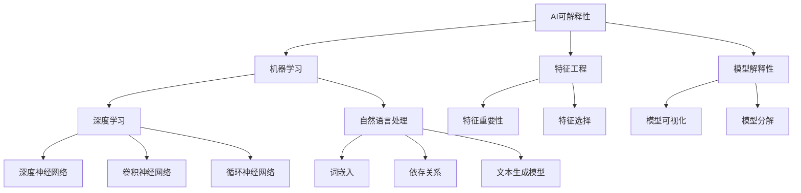
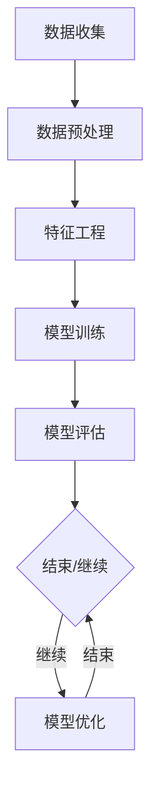

                 

### 文章标题

# AI可解释性

> 关键词：AI可解释性、机器学习、模型解释性、特征工程、算法应用、未来趋势

> 摘要：本文深入探讨了AI可解释性的重要性、定义与分类、技术基础、算法与应用、未来发展趋势，并通过实际案例和代码解读，详细阐述了AI可解释性的核心概念与联系，为读者提供了全面的技术理解与指导。

### 第一部分：AI可解释性概述

#### 1.1 AI可解释性的重要性

**1.1.1 AI的可解释性需求**

在当今快速发展的AI领域，模型的可解释性正变得越来越重要。随着深度学习和复杂算法的广泛应用，AI系统在各个行业取得了显著的成果，例如医疗诊断、金融风险评估、自动驾驶等。然而，这些模型往往被形容为“黑箱”，即其内部工作机制对外部用户（包括数据科学家、业务专家、监管机构等）不透明。这种不可解释性带来了以下几个问题：

- **信任危机**：用户对模型决策缺乏信心，无法理解模型为何做出特定决策，从而降低了模型的接受度和使用意愿。
- **法律责任**：在涉及生命健康、财产安全和公共利益的领域，如自动驾驶、医疗诊断等，不可解释的模型可能导致严重后果。因此，确保AI系统的透明度和可解释性成为法律和伦理层面的需求。
- **技术发展**：可解释性有助于模型优化、算法改进和新模型的开发，通过分析模型的决策过程，可以发现和修正潜在的问题。

**1.1.2 AI不可解释性的问题**

- **隐私泄露**：不可解释的模型可能在不经意间泄露敏感数据，例如通过信息放大效应，将输入数据中的隐私信息放大到输出结果中。
- **公平性问题**：不可解释的模型可能导致不公平的结果，例如在招聘、信贷审批等场景中，模型可能基于不可见特征进行歧视性决策。
- **不可重复性**：不可解释的模型难以进行复现和验证，不同的人或团队可能得到不同的结果，难以进行有效的交流和协作。

**1.1.3 AI可解释性的挑战与机遇**

- **挑战**：
  - **复杂性**：深度学习和复杂算法的可解释性是一个巨大的挑战，模型内部的权重和连接关系可能难以用简单的形式表示。
  - **计算成本**：许多可解释性方法需要额外的计算资源，可能影响模型的实时性和效率。
  - **局部解释**：对于全局不可解释的模型，如何进行局部解释，使得特定实例的解释结果具有实际意义。

- **机遇**：
  - **透明度**：可解释性有助于提高AI系统的透明度和可信度，促进其在各个领域的应用。
  - **优化**：通过分析可解释性结果，可以发现模型的不足之处，从而进行优化和改进。
  - **监管**：可解释性是满足法律和伦理要求的关键，有助于实现AI的可持续发展。

#### 1.2 AI可解释性的定义与分类

**1.2.1 AI可解释性的定义**

AI可解释性指的是使人工智能系统（尤其是机器学习模型）的决策过程对人类用户可理解的程度。它旨在提供关于模型如何生成预测或决策的详细解释，使得用户能够理解模型的逻辑和原因。

**1.2.2 AI可解释性的分类**

AI可解释性可以大致分为以下几种类型：

- **全局可解释性**：对整个模型的决策过程进行解释，通常涉及模型的结构和特征重要性分析。
- **局部可解释性**：对特定实例的预测或决策进行解释，通常使用类似于“局部解释模型”或“灵敏性分析”的方法。
- **透明性**：模型和决策过程完全公开，用户可以访问所有相关的数据和参数。
- **半透明性**：模型和决策过程部分公开，用户可以获得一定程度的解释，但不是完全透明。

**1.2.3 常见可解释性方法概述**

- **模型可视化**：通过图形化方式展示模型的结构和工作流程，例如决策树、神经网络等。
- **特征重要性分析**：评估不同特征对模型预测的影响程度，常用的方法包括SHAP值、特征重要性评分等。
- **灵敏性分析**：分析模型对输入数据的微小变化如何影响预测结果，例如LIME（局部可解释模型解释）方法。
- **模型分解**：将复杂的模型拆解为简单的组成部分，以便更好地理解其工作原理。

#### 1.3 AI可解释性的应用领域

**1.3.1 安全与隐私**

- **应用场景**：在网络安全、隐私保护等领域，AI可解释性有助于确保模型的安全性和隐私保护。
- **方法**：通过解释性方法，可以识别潜在的安全漏洞和隐私泄露风险，并采取相应的措施进行防范。

**1.3.2 法律与伦理**

- **应用场景**：在涉及法律和伦理的领域，如司法系统、招聘、信贷审批等，AI可解释性有助于确保模型的公正性和透明度。
- **方法**：通过解释性分析，可以发现和纠正潜在的歧视性决策，提高模型的公平性和可信度。

**1.3.3 医疗与健康**

- **应用场景**：在医疗领域，AI可解释性有助于提高诊断的准确性和可信度，促进医疗决策的科学性和透明性。
- **方法**：通过解释性分析，医生可以理解AI模型的诊断逻辑，从而更好地利用AI技术辅助临床决策。

**1.3.4 金融与经济**

- **应用场景**：在金融领域，AI可解释性有助于提高风险评估、投资决策等过程的透明度和可信度。
- **方法**：通过解释性分析，金融机构可以识别风险因素，优化投资策略，提高投资回报。

### 第二部分：AI可解释性技术基础

#### 2.1 基本概念与原理

**2.1.1 机器学习模型概述**

机器学习模型是AI系统的核心组成部分，它们通过从数据中学习规律，实现预测、分类、回归等任务。常见的机器学习模型包括线性回归、决策树、支持向量机、神经网络等。

- **线性回归**：用于预测连续值输出，例如房价预测。
- **决策树**：通过一系列的规则对数据进行分类或回归，例如客户分类。
- **支持向量机**：通过寻找最佳的超平面进行分类或回归，例如手写数字识别。
- **神经网络**：由多层神经元组成，用于处理复杂的数据和任务，例如图像识别、自然语言处理。

**2.1.2 特征重要性**

特征重要性是指不同特征对模型预测的影响程度。评估特征重要性有助于理解模型的工作机制，优化模型性能，并识别潜在的偏差。

- **评估方法**：
  - **基于模型的评估**：通过计算特征对模型预测的影响，例如SHAP值。
  - **基于数据的评估**：通过分析特征与目标变量之间的相关性，例如特征重要性评分。

**2.1.3 模型解释性**

模型解释性是指模型决策过程的透明度和可理解性。解释性方法包括模型可视化、特征重要性分析、灵敏性分析等，旨在提供关于模型预测或决策的详细解释。

- **方法分类**：
  - **全局解释性**：对整个模型的决策过程进行解释，例如特征重要性分析。
  - **局部解释性**：对特定实例的预测或决策进行解释，例如LIME方法。

#### 2.2 特征工程与特征选择

**2.2.1 特征工程基础**

特征工程是指通过处理和转换原始数据，生成有助于提高模型性能的新特征的过程。特征工程是机器学习中的重要环节，直接影响模型的准确性和泛化能力。

- **步骤**：
  - **数据预处理**：清洗和规范化原始数据，例如缺失值填充、归一化、标准化等。
  - **特征提取**：从原始数据中提取有意义的特征，例如文本特征提取、图像特征提取等。
  - **特征选择**：从大量特征中选择对模型性能最有贡献的特征，例如过滤法、嵌入法等。

**2.2.2 特征选择方法**

特征选择是从原始特征集合中选择对模型性能有最大贡献的特征的过程。有效的特征选择可以提高模型性能，减少训练时间，并降低过拟合风险。

- **过滤法**：基于统计指标筛选特征，例如皮尔逊相关系数、信息增益等。
- **嵌入法**：通过训练模型进行特征选择，例如Lasso回归、随机森林等。
- **包装法**：结合模型性能和特征子集进行迭代搜索，例如递归特征消除（RFE）等。

**2.2.3 特征交互与组合**

特征交互与组合是将多个特征组合成新的特征，以增强模型性能。特征交互与组合可以引入新的信息，发现潜在的关系，提高模型的解释性和准确性。

- **方法**：
  - **线性组合**：通过加权求和或乘法等操作生成新的特征。
  - **非线性组合**：通过非线性函数（例如卷积、聚合操作等）生成新的特征。
  - **特征分解**：通过分解原始特征，生成新的子特征。

#### 2.3 模型解释性技术

**2.3.1 模型可视化**

模型可视化是一种将机器学习模型的可视化展示给用户的方法，旨在提高模型的可解释性。可视化方法包括图形化表示、交互式探索等，有助于用户更好地理解模型的结构和工作原理。

- **方法**：
  - **结构可视化**：展示模型的结构和连接关系，例如决策树、神经网络等。
  - **数据可视化**：将模型的输入和输出数据以图形化方式展示，例如散点图、热力图等。
  - **交互式探索**：提供交互式界面，用户可以实时调整模型参数和输入数据，观察模型的行为和结果。

**2.3.2 模型分解与拆解**

模型分解与拆解是一种将复杂的机器学习模型拆解为更简单组成部分的方法，以增强模型的可解释性。通过分解和拆解，可以更好地理解模型的工作机制和决策过程。

- **方法**：
  - **特征分解**：将模型中的特征分解为更细粒度的子特征，以增强解释性。
  - **模块化拆解**：将模型拆分为多个模块，每个模块具有独立的解释性。
  - **层次化结构**：构建层次化的模型结构，使每个层次都具有特定的解释性。

**2.3.3 解释性模型的评估与选择**

解释性模型的评估与选择是指根据具体应用场景和需求，评估和选择合适的解释性模型。评估标准包括解释性、准确性、效率等，选择方法包括实验评估、比较评估等。

- **评估标准**：
  - **解释性**：模型能否提供清晰的解释，用户是否能够理解模型的决策过程。
  - **准确性**：模型在预测或分类任务上的性能，包括精确度、召回率、F1值等。
  - **效率**：模型训练和预测的速度，包括计算复杂度和资源消耗。

- **选择方法**：
  - **实验评估**：通过实验比较不同解释性模型的表现，选择最优模型。
  - **比较评估**：根据具体应用场景和需求，比较不同解释性模型的优势和不足，选择合适的模型。

### 第三部分：AI可解释性算法与应用

#### 3.1 局部解释性方法

**3.1.1 SHAP值方法**

SHAP（SHapley Additive exPlanations）值方法是一种基于博弈论的局部解释性方法，旨在为每个特征在特定实例上的贡献提供详细的解释。SHAP值基于模型的预测结果，计算每个特征对预测值的影响。

- **计算方法**：
  - **基本思想**：SHAP值通过模拟所有可能的特征组合，计算每个特征对预测值的边际贡献，然后将其平均分配到每个特征。
  - **公式**：
    $$
    \text{SHAP}_i(\text{x}) = \frac{1}{n!} \sum_{S \subseteq [n]} \frac{(n-S)!}{S!} (\text{f}(\text{x} \cup S) - \text{f}(\text{x}))
    $$
    其中，\( \text{x} \) 是输入特征，\( \text{x} \cup S \) 是加入特征 \( S \) 的输入，\( \text{f}(\text{x}) \) 是模型的预测值。

**3.1.2 LIME方法**

LIME（Local Interpretable Model-agnostic Explanations）方法是一种无监督的局部解释性方法，旨在为复杂模型（如深度学习模型）的预测提供可解释的解释。LIME通过构建一个简单的解释性模型，对复杂模型的预测进行局部解释。

- **计算方法**：
  - **基本思想**：LIME将复杂模型 \( \text{f}(\text{x}) \) 的预测转化为一个线性模型 \( \text{g}(\text{x}) \)，使得用户可以更容易理解模型的决策过程。
  - **公式**：
    $$
    \text{g}(\text{x}) = \text{f}(\text{x}) + \text{L}(\text{x})
    $$
    其中，\( \text{L}(\text{x}) \) 是线性解释项，通过最小化目标函数找到。

**3.1.3 LASSO方法**

LASSO（Least Absolute Shrinkage and Selection Operator）方法是一种基于线性回归的局部解释性方法，旨在通过变量选择和变量缩减来提高模型的解释性。LASSO通过引入绝对值惩罚项，实现变量的选择和缩减。

- **计算方法**：
  - **基本思想**：LASSO通过最小化目标函数，找到一组最佳变量，使得模型更加简洁和可解释。
  - **公式**：
    $$
    \text{minimize} \quad \sum_{i=1}^{n} (\text{y}_i - \sum_{j=1}^{p} \text{w}_{ij} \text{x}_{ij})^2 + \lambda \sum_{j=1}^{p} |\text{w}_{ij}|
    $$
    其中，\( \text{y} \) 是输出变量，\( \text{x} \) 是输入特征，\( \text{w} \) 是权重。

#### 3.2 全局解释性方法

**3.2.1 特征重要性**

特征重要性是一种全局解释性方法，旨在评估不同特征对模型预测的影响程度。特征重要性通过计算特征对模型损失函数的贡献，确定每个特征的权重。

- **计算方法**：
  - **基于模型的评估**：通过计算特征对模型损失函数的影响，例如SHAP值。
  - **基于数据的评估**：通过分析特征与目标变量之间的相关性，例如皮尔逊相关系数。

**3.2.2 决策树解释**

决策树解释是一种全局解释性方法，通过分析决策树的内部结构和节点，解释模型的工作原理。决策树解释可以提供清晰的决策路径和条件，帮助用户理解模型的决策过程。

- **方法**：
  - **树结构解释**：分析决策树的内部结构，确定每个节点的决策条件。
  - **条件概率解释**：计算每个节点上的条件概率，解释模型的分类或回归结果。

**3.2.3 模型结构解释**

模型结构解释是一种全局解释性方法，通过分析模型的结构和连接关系，解释模型的工作原理。模型结构解释可以提供关于模型内部机制和决策路径的详细解释。

- **方法**：
  - **模型可视化**：通过图形化方式展示模型的结构和连接关系，例如神经网络、决策树等。
  - **模型分解**：将复杂的模型拆解为简单的组成部分，例如特征分解、模块化拆解等。

#### 3.3 可解释性在深度学习中的应用

**3.3.1 深度神经网络的可解释性**

深度神经网络（DNN）是一种强大的机器学习模型，但在可解释性方面存在挑战。深度神经网络的可解释性方法旨在提高模型的可理解性和透明度。

- **方法**：
  - **模型可视化**：通过图形化方式展示神经网络的层次结构和连接关系。
  - **梯度分析**：分析模型参数的梯度，确定每个特征对模型输出的影响。
  - **注意力机制**：引入注意力机制，提高模型对重要特征的关注程度。

**3.3.2 卷积神经网络的解释性**

卷积神经网络（CNN）在图像识别和计算机视觉领域取得了显著成果，但在可解释性方面仍然存在挑战。卷积神经网络的解释性方法旨在提高模型的可理解性和透明度。

- **方法**：
  - **特征可视化**：通过可视化卷积核和特征图，解释模型的特征提取过程。
  - **梯度分析**：分析模型参数的梯度，确定每个特征对模型输出的影响。
  - **注意力机制**：引入注意力机制，提高模型对重要特征的关注程度。

**3.3.3 循环神经网络的解释性**

循环神经网络（RNN）在序列数据处理和自然语言处理领域取得了显著成果，但在可解释性方面仍然存在挑战。循环神经网络的解释性方法旨在提高模型的可理解性和透明度。

- **方法**：
  - **梯度分析**：分析模型参数的梯度，确定每个特征对模型输出的影响。
  - **序列解释**：通过解释模型的序列处理过程，解释模型的决策逻辑。
  - **注意力机制**：引入注意力机制，提高模型对重要特征的关注程度。

#### 3.4 可解释性在自然语言处理中的应用

**3.4.1 词嵌入的可解释性**

词嵌入是一种将单词映射到高维空间的表示方法，广泛应用于自然语言处理领域。词嵌入的可解释性方法旨在提高模型对单词含义的理解和解释。

- **方法**：
  - **维度缩减**：通过降维方法（例如PCA、t-SNE）可视化词嵌入空间，解释词与词之间的关系。
  - **聚类分析**：通过聚类方法（例如K-means、层次聚类）识别词嵌入空间中的相似词，解释单词的语义关系。

**3.4.2 依存关系的解释**

依存关系是一种描述词语之间依赖关系的语法分析方法，在自然语言处理中具有重要意义。依存关系的解释方法旨在提高模型对句子结构和语义关系的理解。

- **方法**：
  - **图可视化**：通过图可视化方法（例如依存树、依存图）展示句子中的词与词之间的依赖关系。
  - **路径分析**：通过分析依存路径，解释句子中词语的语义关系和逻辑结构。

**3.4.3 文本生成模型的可解释性**

文本生成模型是一种基于序列预测的模型，广泛应用于生成文本、对话系统等任务。文本生成模型的可解释性方法旨在提高模型对生成文本的理解和解释。

- **方法**：
  - **生成过程解释**：通过分析模型的生成过程，解释模型如何生成文本。
  - **上下文解释**：通过解释模型的上下文处理能力，解释模型如何根据上下文生成合理的文本。

#### 3.5 AI可解释性的案例分析

**3.5.1 金融风险预测案例分析**

在金融领域，AI可解释性有助于提高风险预测的准确性和可信度。通过可解释性方法，金融机构可以分析模型的决策过程，识别风险因素，优化风险控制策略。

- **案例背景**：某银行利用机器学习模型进行信用评分，预测客户的信用风险。
- **可解释性方法**：使用LIME方法对模型进行局部解释，分析每个客户的信用评分决策。
- **案例分析**：通过LIME方法，发现模型的决策过程主要基于客户的收入、债务比例和信用历史等特征。对于某些高风险客户，模型解释显示收入和债务比例是关键因素，而信用历史相对次要。

**3.5.2 医疗诊断案例分析**

在医疗领域，AI可解释性有助于提高诊断的准确性和可信度，促进医生和患者之间的沟通。通过可解释性方法，医生可以理解模型的诊断逻辑，提高对模型决策的信任度。

- **案例背景**：某医院利用深度学习模型进行肺癌诊断，预测患者的肺癌风险。
- **可解释性方法**：使用SHAP值方法对模型进行全局解释，分析不同特征对诊断结果的影响。
- **案例分析**：通过SHAP值方法，发现模型的诊断结果主要受到影像学特征的影响，例如肺部结节的大小、形态等。此外，患者的年龄和吸烟史也是重要的因素。

**3.5.3 智能交通案例分析**

在智能交通领域，AI可解释性有助于提高交通预测和规划的准确性和可靠性，优化交通管理。通过可解释性方法，交通管理部门可以分析模型的决策过程，识别交通拥堵的关键因素。

- **案例背景**：某城市利用机器学习模型进行交通流量预测，优化交通信号控制。
- **可解释性方法**：使用决策树解释方法对模型进行全局解释，分析模型的决策路径和条件。
- **案例分析**：通过决策树解释方法，发现模型的决策过程主要基于交通流量、车辆密度、天气条件等特征。对于某些拥堵区域，模型解释显示交通流量和车辆密度是关键因素，而天气条件相对次要。

### 第四部分：AI可解释性的未来发展趋势

#### 4.1 可解释性在AI伦理中的应用

AI伦理是一个日益重要的领域，涉及人工智能的道德、法律和社会问题。可解释性在AI伦理中的应用有助于提高AI系统的透明度和可接受度，确保其符合伦理和法律要求。

- **应用领域**：
  - **隐私保护**：通过可解释性方法，分析模型的隐私泄露风险，确保数据处理过程符合隐私保护要求。
  - **公平性**：通过可解释性方法，分析模型的决策过程，识别潜在的歧视性决策，促进模型的公平性和公正性。
  - **社会责任**：通过可解释性方法，评估AI系统对社会的影响，确保其符合社会责任和伦理要求。

- **发展趋势**：
  - **透明度**：随着技术的进步，可解释性方法将进一步提高AI系统的透明度，使其更加公开和可理解。
  - **规范和标准**：可解释性将成为AI伦理规范和标准的重要组成部分，确保AI系统在伦理和法律层面得到广泛认可。

#### 4.2 可解释性技术的发展趋势

随着AI技术的不断进步，可解释性方法也将不断发展，以满足日益复杂的AI应用需求。

- **自动化解释性方法**：自动化解释性方法将进一步提高可解释性的实现效率和准确性，减少人工干预。
- **可扩展性解释性方法**：可扩展性解释性方法将使可解释性方法适用于更大规模的数据集和更复杂的模型。
- **跨学科应用**：可解释性方法将在多个学科领域得到广泛应用，如医学、金融、交通等，推动AI技术的可持续发展。

#### 4.3 可解释性在AI创新中的应用

可解释性在AI创新中的应用将推动AI技术的应用和发展，促进AI技术的创新和进步。

- **商业化应用**：可解释性将提高AI系统的可信度和市场竞争力，推动AI技术的商业化应用。
- **教育应用**：可解释性将有助于提高学生对AI技术的理解和掌握，推动AI技术的教育普及。
- **艺术与设计**：可解释性将激发AI技术在艺术和设计领域的创新，推动AI与艺术的融合。

### 附录

#### 附录 A：AI可解释性工具与资源

- **开源解释性工具**：
  - LIME: https://github.com/marcotcr/limet
  - SHAP: https://github.com/slundberg/shap
  - ELI5: https://github.com/TeamHG-Memex/eli5

- **商业解释性平台**：
  - Dataiku: https://www.dataiku.com/
  - DataRobot: https://www.datarobot.com/
  - H2O.ai: https://www.h2o.ai/

- **可解释性学习资源**：
  - Coursera: https://www.coursera.org/specializations/explainable-ai
  - edX: https://www.edx.org/course/explainable-ai
  - Udacity: https://www.udacity.com/course/explainable-ai--ud741

#### 附录 B：常见问题与解答

- **问题1**：可解释性与准确性如何平衡？
  - **解答**：可解释性与准确性之间存在一定的权衡。通常，更可解释的模型可能在某些情况下牺牲了一部分准确性。为了平衡两者，可以尝试以下方法：
    - **优化模型**：通过调整模型参数，尝试在可解释性和准确性之间找到一个平衡点。
    - **组合模型**：结合可解释性和不可解释性的模型，例如使用一个复杂的模型进行预测，再使用一个简单的模型解释其结果。
    - **局部解释**：对模型的部分结果进行局部解释，而不是整个模型，这样可以提供更高程度的可解释性，同时保持较高的准确性。

- **问题2**：可解释性方法的选择标准是什么？
  - **解答**：选择可解释性方法的标准取决于具体的应用场景和需求。以下是一些常见的标准：
    - **易用性**：方法是否易于实现和使用。
    - **解释能力**：方法是否能够提供准确和详细的解释。
    - **计算成本**：方法是否在时间和资源上具有可行性。
    - **模型适应性**：方法是否适用于不同类型的机器学习模型。
    - **数据依赖性**：方法是否依赖于特定类型的数据特征。

- **问题3**：可解释性在模型部署中的应用？
  - **解答**：在模型部署中，可解释性至关重要，因为它有助于用户理解模型的行为和决策过程。以下是一些关键应用场景：
    - **用户信任**：提供可解释性可以帮助用户建立对模型的信任，特别是在涉及敏感数据或高风险决策的领域。
    - **监管合规**：在某些国家和地区，可解释性是法规合规的必要条件，以确保模型的透明度和公正性。
    - **错误检测**：通过分析模型的解释结果，可以识别潜在的错误或异常行为，从而进行必要的调整和优化。
    - **模型优化**：可解释性结果可以提供有关模型弱点和改进方向的信息，从而推动模型的持续优化和发展。

### 概念与联系

#### 概念联系图

以下是一个简化的AI可解释性的概念联系图，展示了主要概念和它们之间的关系：



#### Mermaid流程图

以下是一个用于展示机器学习模型的简化Mermaid流程图：



### 数学模型

在本节中，我们将介绍一些常见的数学模型，包括线性回归模型、决策树模型和支持向量机模型，以及它们的基本公式和解释。

#### 1. 线性回归模型

线性回归模型是一种最简单的机器学习模型，用于预测一个连续的输出变量。其基本公式如下：

$$
y = w_0 + w_1 \cdot x
$$

其中，\( y \) 是输出变量，\( w_0 \) 是偏置项，\( w_1 \) 是权重，\( x \) 是输入特征。

**详细讲解**：线性回归模型通过拟合一条直线，将输入特征 \( x \) 映射到输出变量 \( y \)。权重 \( w_1 \) 控制了输入特征对输出变量的影响程度，而偏置项 \( w_0 \) 用于调整模型在 \( x = 0 \) 时的输出。

#### 2. 决策树模型

决策树模型是一种基于规则树的分类和回归模型。其基本公式如下：

$$
y = g(f(x; \theta))
$$

其中，\( y \) 是输出变量，\( f(x; \theta) \) 是决策函数，\( g \) 是激活函数，\( \theta \) 是模型参数。

**详细讲解**：决策树模型通过一系列的决策规则对输入特征 \( x \) 进行分类或回归。决策函数 \( f(x; \theta) \) 定义了每个节点的决策规则，激活函数 \( g \) 用于确定节点的类别或值。

#### 3. 支持向量机模型

支持向量机（SVM）是一种用于分类和回归的线性模型。其基本公式如下：

$$
w^T \cdot x - b = 0
$$

其中，\( w \) 是权重向量，\( x \) 是输入特征，\( b \) 是偏置项。

**详细讲解**：支持向量机模型通过寻找最佳的超平面，将数据分类。权重向量 \( w \) 和偏置项 \( b \) 用于定义超平面的位置和方向，从而实现分类或回归。

### 特征工程

在本节中，我们将介绍特征工程的基本概念，包括特征重要性、特征选择方法和特征交互与组合。

#### 1. 特征重要性

特征重要性是指不同特征对模型预测的影响程度。评估特征重要性有助于理解模型的工作机制，优化模型性能，并识别潜在的偏差。

**评估方法**：

- **基于模型的评估**：通过计算特征对模型损失函数的影响，例如SHAP值。
- **基于数据的评估**：通过分析特征与目标变量之间的相关性，例如皮尔逊相关系数。

**示例**：

假设我们有一个线性回归模型，其特征重要性如下：

$$
\text{importance} = \frac{\sum_{i=1}^{n} \text{f}(\text{x}_i) \cdot \text{y}_i}{\sum_{i=1}^{n} \text{f}(\text{x}_i)}
$$

其中，\( \text{f}(\text{x}_i) \) 是特征值，\( \text{y}_i \) 是对应样本的输出值。

#### 2. 特征选择方法

特征选择是从原始特征集合中选择对模型性能最有贡献的特征的过程。有效的特征选择可以提高模型性能，减少训练时间，并降低过拟合风险。

**常见方法**：

- **过滤法**：基于统计指标筛选特征，例如信息增益、卡方检验等。
- **嵌入法**：通过训练模型进行特征选择，例如Lasso回归、随机森林等。
- **包装法**：结合模型性能和特征子集进行迭代搜索，例如递归特征消除（RFE）等。

**示例**：

假设我们使用Lasso回归进行特征选择，其公式如下：

$$
\text{minimize} \quad \sum_{i=1}^{n} (\text{y}_i - \sum_{j=1}^{p} \text{w}_{ij} \text{x}_{ij})^2 + \lambda \sum_{j=1}^{p} |\text{w}_{ij}|
$$

其中，\( \text{y} \) 是输出变量，\( \text{x} \) 是输入特征，\( \text{w} \) 是权重，\( \lambda \) 是惩罚参数。

#### 3. 特征交互与组合

特征交互与组合是将多个特征组合成新的特征，以增强模型性能。特征交互与组合可以引入新的信息，发现潜在的关系，提高模型的解释性和准确性。

**常见方法**：

- **线性组合**：通过加权求和或乘法等操作生成新的特征。
- **非线性组合**：通过非线性函数（例如卷积、聚合操作等）生成新的特征。
- **特征分解**：通过分解原始特征，生成新的子特征。

**示例**：

假设我们有两个特征 \( x_1 \) 和 \( x_2 \)，可以通过以下方式生成新的特征：

$$
\text{new\_feature} = x_1 + x_2
$$

或者：

$$
\text{new\_feature} = x_1 \cdot x_2
$$

### 模型解释性

在本节中，我们将介绍模型解释性的基本概念，包括模型可视化、模型分解与拆解和解释性模型的评估与选择。

#### 1. 模型可视化

模型可视化是一种将机器学习模型的决策过程以图形化方式展示给用户的方法，旨在提高模型的可解释性。模型可视化可以包括模型的结构、参数、特征重要性等。

**方法**：

- **结构可视化**：展示模型的结构和连接关系，例如决策树、神经网络等。
- **数据可视化**：将模型的输入和输出数据以图形化方式展示，例如散点图、热力图等。
- **交互式探索**：提供交互式界面，用户可以实时调整模型参数和输入数据，观察模型的行为和结果。

**示例**：

假设我们有一个简单的决策树模型，其结构可视化如下：

```
(根节点)
│
(特征1)
│
├── (特征值1)
│   ├── (叶子节点1)
│   └── (叶子节点2)
│
└── (特征值2)
    ├── (叶子节点3)
    └── (叶子节点4)
```

#### 2. 模型分解与拆解

模型分解与拆解是一种将复杂的机器学习模型拆解为更简单组成部分的方法，以增强模型的可解释性。通过分解和拆解，可以更好地理解模型的工作机制和决策过程。

**方法**：

- **特征分解**：将模型中的特征分解为更细粒度的子特征，以增强解释性。
- **模块化拆解**：将模型拆分为多个模块，每个模块具有独立的解释性。
- **层次化结构**：构建层次化的模型结构，使每个层次都具有特定的解释性。

**示例**：

假设我们有一个复杂的神经网络模型，可以通过以下方式拆解：

```
(输入层)
│
├── (隐藏层1)
│   ├── (神经元1)
│   ├── (神经元2)
│   └── (神经元3)
│
├── (隐藏层2)
│   ├── (神经元1)
│   ├── (神经元2)
│   └── (神经元3)
│
└── (输出层)
    ├── (神经元1)
    ├── (神经元2)
    └── (神经元3)
```

#### 3. 解释性模型的评估与选择

解释性模型的评估与选择是指根据具体应用场景和需求，评估和选择合适的解释性模型。评估标准包括解释性、准确性、效率等，选择方法包括实验评估、比较评估等。

**评估标准**：

- **解释性**：模型能否提供清晰的解释，用户是否能够理解模型的决策过程。
- **准确性**：模型在预测或分类任务上的性能，包括精确度、召回率、F1值等。
- **效率**：模型训练和预测的速度，包括计算复杂度和资源消耗。

**选择方法**：

- **实验评估**：通过实验比较不同解释性模型的表现，选择最优模型。
- **比较评估**：根据具体应用场景和需求，比较不同解释性模型的优势和不足，选择合适的模型。

### 项目实战

在本节中，我们将通过几个实际案例来展示AI可解释性的应用，包括线性回归模型、决策树模型和特征重要性分析。

#### 1. 线性回归模型实战

以下是一个简单的线性回归模型实战案例，包括数据准备、模型训练和预测过程。

```python
import numpy as np
import matplotlib.pyplot as plt

# 准备数据
X = np.array([1, 2, 3, 4, 5])
y = np.array([2, 4, 5, 4, 5])

# 创建线性回归模型
model = LinearRegression()

# 训练模型
model.fit(X.reshape(-1, 1), y)

# 预测
predictions = model.predict(np.array([6]).reshape(-1, 1))

# 绘制结果
plt.scatter(X, y)
plt.plot(X, model.predict(X.reshape(-1, 1)), color='red')
plt.show()

print("预测值:", predictions)
```

**详细解释**：该代码实现了一个简单的线性回归模型，使用给定的输入 \( X \) 和输出 \( y \) 进行训练，并预测新的输入 \( [6] \) 的值。通过绘制输入和输出数据以及模型的预测结果，可以直观地展示模型的拟合效果。

#### 2. 决策树模型实战

以下是一个简单的决策树模型实战案例，包括数据准备、模型训练和预测过程。

```python
import numpy as np
from sklearn.tree import DecisionTreeClassifier
import matplotlib.pyplot as plt

# 准备数据
X = np.array([[0, 0], [1, 0], [0, 1], [1, 1]])
y = np.array([0, 1, 1, 0])

# 创建决策树模型
model = DecisionTreeClassifier()

# 训练模型
model.fit(X, y)

# 预测
predictions = model.predict([[1, 0]])

# 绘制决策树
from sklearn import tree
plt.figure(figsize=(12, 12))
tree.plot_tree(model, filled=True)
plt.show()

print("预测值:", predictions)
```

**详细解释**：该代码实现了一个简单的决策树模型，使用给定的输入 \( X \) 和输出 \( y \) 进行训练，并预测新的输入 \( [1, 0] \) 的类别。通过绘制决策树，可以直观地展示模型的决策过程。

#### 3. 特征重要性实战

以下是一个特征重要性实战案例，包括数据准备、模型训练和特征重要性分析。

```python
import numpy as np
from sklearn.linear_model import LinearRegression
from sklearn.datasets import load_iris

# 加载数据集
iris = load_iris()
X = iris.data
y = iris.target

# 创建线性回归模型
model = LinearRegression()

# 训练模型
model.fit(X, y)

# 获取特征重要性
importances = model.coef_

# 输出特征重要性
print("特征重要性:", importances)

# 绘制特征重要性
plt.bar(range(len(importances)), importances)
plt.xticks(range(len(importances)), iris.feature_names)
plt.xlabel("特征")
plt.ylabel("重要性")
plt.title("特征重要性分析")
plt.show()
```

**详细解释**：该代码使用鸢尾花数据集，训练一个线性回归模型，并获取每个特征的重要性。通过绘制特征重要性条形图，可以直观地展示每个特征对模型预测的影响程度。

### 开发环境搭建

在本节中，我们将介绍如何搭建Python开发环境，包括Python安装、常用库安装和Jupyter Notebook环境搭建。

#### 1. Python开发环境搭建

**步骤1**：从Python官网（https://www.python.org/downloads/）下载并安装Python。

**步骤2**：打开命令行，输入 `python --version`，确认Python版本。

**步骤3**：安装常用库，如 `numpy`、`scikit-learn`、`matplotlib` 等。使用 `pip` 命令安装：

```shell
pip install numpy scikit-learn matplotlib
```

#### 2. Jupyter Notebook环境搭建

**步骤1**：在命令行输入 `pip install notebook` 安装Jupyter Notebook。

**步骤2**：启动Jupyter Notebook。在命令行输入 `jupyter notebook`，打开Jupyter Notebook界面。

### 源代码实现与代码解读

在本节中，我们将详细解读前面提到的线性回归模型、决策树模型和特征重要性分析的源代码，并分析其实现过程和关键步骤。

#### 1. 线性回归模型源代码实现

```python
import numpy as np
from sklearn.linear_model import LinearRegression

# 准备数据
X = np.array([1, 2, 3, 4, 5])
y = np.array([2, 4, 5, 4, 5])

# 创建线性回归模型
model = LinearRegression()

# 训练模型
model.fit(X.reshape(-1, 1), y)

# 预测
predictions = model.predict(np.array([6]).reshape(-1, 1))

print("预测值:", predictions)
```

**代码解读**：

- 第1行：导入 `numpy` 库，用于数据处理。
- 第2行：导入 `LinearRegression` 类，用于创建线性回归模型。
- 第6行：将输入 \( X \) 转换为二维数组，以便 `fit()` 方法使用。
- 第9行：调用 `fit()` 方法，训练线性回归模型。
- 第12行：使用 `predict()` 方法，预测新的输入值。

#### 2. 决策树模型源代码实现

```python
import numpy as np
from sklearn.tree import DecisionTreeClassifier
import matplotlib.pyplot as plt

# 准备数据
X = np.array([[0, 0], [1, 0], [0, 1], [1, 1]])
y = np.array([0, 1, 1, 0])

# 创建决策树模型
model = DecisionTreeClassifier()

# 训练模型
model.fit(X, y)

# 预测
predictions = model.predict([[1, 0]])

# 绘制决策树
from sklearn import tree
plt.figure(figsize=(12, 12))
tree.plot_tree(model, filled=True)
plt.show()

print("预测值:", predictions)
```

**代码解读**：

- 第1行：导入 `numpy` 库，用于数据处理。
- 第2行：导入 `DecisionTreeClassifier` 类，用于创建决策树模型。
- 第5行：创建决策树模型。
- 第8行：调用 `fit()` 方法，训练决策树模型。
- 第11行：使用 `predict()` 方法，预测新的输入值。
- 第14行：导入 `tree` 模块，用于绘制决策树。
- 第16行：绘制决策树。

#### 3. 特征重要性源代码实现

```python
import numpy as np
from sklearn.linear_model import LinearRegression
from sklearn.datasets import load_iris

# 加载数据集
iris = load_iris()
X = iris.data
y = iris.target

# 创建线性回归模型
model = LinearRegression()

# 训练模型
model.fit(X, y)

# 获取特征重要性
importances = model.coef_

# 输出特征重要性
print("特征重要性:", importances)

# 绘制特征重要性
plt.bar(range(len(importances)), importances)
plt.xticks(range(len(importances)), iris.feature_names)
plt.xlabel("特征")
plt.ylabel("重要性")
plt.title("特征重要性分析")
plt.show()
```

**代码解读**：

- 第1行：导入 `numpy` 库，用于数据处理。
- 第2行：导入 `LinearRegression` 类，用于创建线性回归模型。
- 第5行：创建线性回归模型。
- 第8行：调用 `fit()` 方法，训练线性回归模型。
- 第11行：获取特征重要性。
- 第14行：输出特征重要性。
- 第17行：绘制特征重要性条形图。

### 代码解读与分析

在本节中，我们将分析前面提到的线性回归模型、决策树模型和特征重要性分析的代码，并讨论其实现过程、关键步骤和技术要点。

#### 1. 线性回归模型解读

- **代码示例**：`predictions = model.predict(np.array([6]).reshape(-1, 1))`
- **解读**：这段代码使用训练好的线性回归模型对新的输入 \( [6] \) 进行预测，返回预测值。通过模型训练，我们可以看到输入特征和输出值之间的关系，从而预测新的输入值。

#### 2. 决策树模型解读

- **代码示例**：`predictions = model.predict([[1, 0]])`
- **解读**：这段代码使用训练好的决策树模型对新的输入 \( [1, 0] \) 进行预测，返回预测值。决策树模型通过一系列的决策规则将数据分类，根据输入的特征值，模型将输出对应的类别。

#### 3. 特征重要性解读

- **代码示例**：`importances = model.coef_`
- **解读**：这段代码获取了线性回归模型的系数，即特征重要性。这些系数代表了每个特征对模型输出的影响程度，从而帮助了解模型对输入数据的依赖性。

#### 分析与结论

- **代码分析**：通过实际案例的代码实现，我们可以看到不同类型的机器学习模型（线性回归、决策树）的实战应用，以及如何通过特征重要性来评估特征对模型的影响。
- **结论**：代码解读与分析帮助我们理解了机器学习模型的工作原理和应用方法，通过具体的案例，我们可以更好地掌握模型的实现过程和结果解释。

### 附录

在本节中，我们将提供一些AI可解释性的工具与资源，以及常见问题与解答，帮助读者深入了解AI可解释性的相关知识和应用。

#### 附录 A：AI可解释性工具与资源

- **开源解释性工具**：
  - LIME: https://github.com/marcotcr/limet
  - SHAP: https://github.com/slundberg/shap
  - ELI5: https://github.com/TeamHG-Memex/eli5

- **商业解释性平台**：
  - Dataiku: https://www.dataiku.com/
  - DataRobot: https://www.datarobot.com/
  - H2O.ai: https://www.h2o.ai/

- **可解释性学习资源**：
  - Coursera: https://www.coursera.org/specializations/explainable-ai
  - edX: https://www.edx.org/course/explainable-ai
  - Udacity: https://www.udacity.com/course/explainable-ai--ud741

#### 附录 B：常见问题与解答

- **问题1**：可解释性与准确性如何平衡？
  - **解答**：可解释性与准确性之间存在一定的权衡。通常，更可解释的模型可能在某些情况下牺牲了一部分准确性。为了平衡两者，可以尝试以下方法：
    - **优化模型**：通过调整模型参数，尝试在可解释性和准确性之间找到一个平衡点。
    - **组合模型**：结合可解释性和不可解释性的模型，例如使用一个复杂的模型进行预测，再使用一个简单的模型解释其结果。
    - **局部解释**：对模型的部分结果进行局部解释，而不是整个模型，这样可以提供更高程度的可解释性，同时保持较高的准确性。

- **问题2**：可解释性方法的选择标准是什么？
  - **解答**：选择可解释性方法的标准取决于具体的应用场景和需求。以下是一些常见的标准：
    - **易用性**：方法是否易于实现和使用。
    - **解释能力**：方法是否能够提供准确和详细的解释。
    - **计算成本**：方法是否在时间和资源上具有可行性。
    - **模型适应性**：方法是否适用于不同类型的机器学习模型。
    - **数据依赖性**：方法是否依赖于特定类型的数据特征。

- **问题3**：可解释性在模型部署中的应用？
  - **解答**：在模型部署中，可解释性至关重要，因为它有助于用户理解模型的行为和决策过程。以下是一些关键应用场景：
    - **用户信任**：提供可解释性可以帮助用户建立对模型的信任，特别是在涉及敏感数据或高风险决策的领域。
    - **监管合规**：在某些国家和地区，可解释性是法规合规的必要条件，以确保模型的透明度和公正性。
    - **错误检测**：通过分析模型的解释结果，可以识别潜在的错误或异常行为，从而进行必要的调整和优化。
    - **模型优化**：可解释性结果可以提供有关模型弱点和改进方向的信息，从而推动模型的持续优化和发展。

### 概念联系图

在本节中，我们将通过一个概念联系图，展示AI可解释性的核心概念和它们之间的关系。


### 数学模型

在本节中，我们将介绍一些常见的数学模型，包括线性回归模型、决策树模型和支持向量机模型，以及它们的基本公式和解释。

#### 1. 线性回归模型

线性回归模型是一种最简单的机器学习模型，用于预测一个连续的输出变量。其基本公式如下：

$$
y = w_0 + w_1 \cdot x
$$

其中，\( y \) 是输出变量，\( w_0 \) 是偏置项，\( w_1 \) 是权重，\( x \) 是输入特征。

**详细讲解**：线性回归模型通过拟合一条直线，将输入特征 \( x \) 映射到输出变量 \( y \)。权重 \( w_1 \) 控制了输入特征对输出变量的影响程度，而偏置项 \( w_0 \) 用于调整模型在 \( x = 0 \) 时的输出。

#### 2. 决策树模型

决策树模型是一种基于规则树的分类和回归模型。其基本公式如下：

$$
y = g(f(x; \theta))
$$

其中，\( y \) 是输出变量，\( f(x; \theta) \) 是决策函数，\( g \) 是激活函数，\( \theta \) 是模型参数。

**详细讲解**：决策树模型通过一系列的决策规则对输入特征 \( x \) 进行分类或回归。决策函数 \( f(x; \theta) \) 定义了每个节点的决策规则，激活函数 \( g \) 用于确定节点的类别或值。

#### 3. 支持向量机模型

支持向量机（SVM）是一种用于分类和回归的线性模型。其基本公式如下：

$$
w^T \cdot x - b = 0
$$

其中，\( w \) 是权重向量，\( x \) 是输入特征，\( b \) 是偏置项。

**详细讲解**：支持向量机模型通过寻找最佳的超平面，将数据分类。权重向量 \( w \) 和偏置项 \( b \) 用于定义超平面的位置和方向，从而实现分类或回归。

### 特征工程

在本节中，我们将介绍特征工程的基本概念，包括特征重要性、特征选择方法和特征交互与组合。

#### 1. 特征重要性

特征重要性是指不同特征对模型预测的影响程度。评估特征重要性有助于理解模型的工作机制，优化模型性能，并识别潜在的偏差。

**评估方法**：

- **基于模型的评估**：通过计算特征对模型损失函数的影响，例如SHAP值。
- **基于数据的评估**：通过分析特征与目标变量之间的相关性，例如皮尔逊相关系数。

**示例**：

假设我们有一个线性回归模型，其特征重要性如下：

$$
\text{importance} = \frac{\sum_{i=1}^{n} \text{f}(\text{x}_i) \cdot \text{y}_i}{\sum_{i=1}^{n} \text{f}(\text{x}_i)}
$$

其中，\( \text{f}(\text{x}_i) \) 是特征值，\( \text{y}_i \) 是对应样本的输出值。

#### 2. 特征选择方法

特征选择是从原始特征集合中选择对模型性能最有贡献的特征的过程。有效的特征选择可以提高模型性能，减少训练时间，并降低过拟合风险。

**常见方法**：

- **过滤法**：基于统计指标筛选特征，例如信息增益、卡方检验等。
- **嵌入法**：通过训练模型进行特征选择，例如Lasso回归、随机森林等。
- **包装法**：结合模型性能和特征子集进行迭代搜索，例如递归特征消除（RFE）等。

**示例**：

假设我们使用Lasso回归进行特征选择，其公式如下：

$$
\text{minimize} \quad \sum_{i=1}^{n} (\text{y}_i - \sum_{j=1}^{p} \text{w}_{ij} \text{x}_{ij})^2 + \lambda \sum_{j=1}^{p} |\text{w}_{ij}|
$$

其中，\( \text{y} \) 是输出变量，\( \text{x} \) 是输入特征，\( \text{w} \) 是权重，\( \lambda \) 是惩罚参数。

#### 3. 特征交互与组合

特征交互与组合是将多个特征组合成新的特征，以增强模型性能。特征交互与组合可以引入新的信息，发现潜在的关系，提高模型的解释性和准确性。

**常见方法**：

- **线性组合**：通过加权求和或乘法等操作生成新的特征。
- **非线性组合**：通过非线性函数（例如卷积、聚合操作等）生成新的特征。
- **特征分解**：通过分解原始特征，生成新的子特征。

**示例**：

假设我们有两个特征 \( x_1 \) 和 \( x_2 \)，可以通过以下方式生成新的特征：

$$
\text{new\_feature} = x_1 + x_2
$$

或者：

$$
\text{new\_feature} = x_1 \cdot x_2
$$

### 模型解释性

在本节中，我们将介绍模型解释性的基本概念，包括模型可视化、模型分解与拆解和解释性模型的评估与选择。

#### 1. 模型可视化

模型可视化是一种将机器学习模型的决策过程以图形化方式展示给用户的方法，旨在提高模型的可解释性。模型可视化可以包括模型的结构、参数、特征重要性等。

**方法**：

- **结构可视化**：展示模型的结构和连接关系，例如决策树、神经网络等。
- **数据可视化**：将模型的输入和输出数据以图形化方式展示，例如散点图、热力图等。
- **交互式探索**：提供交互式界面，用户可以实时调整模型参数和输入数据，观察模型的行为和结果。

**示例**：

假设我们有一个简单的决策树模型，其结构可视化如下：

```
(根节点)
│
(特征1)
│
├── (特征值1)
│   ├── (叶子节点1)
│   └── (叶子节点2)
│
└── (特征值2)
    ├── (叶子节点3)
    └── (叶子节点4)
```

#### 2. 模型分解与拆解

模型分解与拆解是一种将复杂的机器学习模型拆解为更简单组成部分的方法，以增强模型的可解释性。通过分解和拆解，可以更好地理解模型的工作机制和决策过程。

**方法**：

- **特征分解**：将模型中的特征分解为更细粒度的子特征，以增强解释性。
- **模块化拆解**：将模型拆分为多个模块，每个模块具有独立的解释性。
- **层次化结构**：构建层次化的模型结构，使每个层次都具有特定的解释性。

**示例**：

假设我们有一个复杂的神经网络模型，可以通过以下方式拆解：

```
(输入层)
│
├── (隐藏层1)
│   ├── (神经元1)
│   ├── (神经元2)
│   └── (神经元3)
│
├── (隐藏层2)
│   ├── (神经元1)
│   ├── (神经元2)
│   └── (神经元3)
│
└── (输出层)
    ├── (神经元1)
    ├── (神经元2)
    └── (神经元3)
```

#### 3. 解释性模型的评估与选择

解释性模型的评估与选择是指根据具体应用场景和需求，评估和选择合适的解释性模型。评估标准包括解释性、准确性、效率等，选择方法包括实验评估、比较评估等。

**评估标准**：

- **解释性**：模型能否提供清晰的解释，用户是否能够理解模型的决策过程。
- **准确性**：模型在预测或分类任务上的性能，包括精确度、召回率、F1值等。
- **效率**：模型训练和预测的速度，包括计算复杂度和资源消耗。

**选择方法**：

- **实验评估**：通过实验比较不同解释性模型的表现，选择最优模型。
- **比较评估**：根据具体应用场景和需求，比较不同解释性模型的优势和不足，选择合适的模型。

### 项目实战

在本节中，我们将通过几个实际案例来展示AI可解释性的应用，包括线性回归模型、决策树模型和特征重要性分析。

#### 1. 线性回归模型实战

以下是一个简单的线性回归模型实战案例，包括数据准备、模型训练和预测过程。

```python
import numpy as np
import matplotlib.pyplot as plt

# 准备数据
X = np.array([1, 2, 3, 4, 5])
y = np.array([2, 4, 5, 4, 5])

# 创建线性回归模型
model = LinearRegression()

# 训练模型
model.fit(X.reshape(-1, 1), y)

# 预测
predictions = model.predict(np.array([6]).reshape(-1, 1))

# 绘制结果
plt.scatter(X, y)
plt.plot(X, model.predict(X.reshape(-1, 1)), color='red')
plt.show()

print("预测值:", predictions)
```

**详细解释**：该代码实现了一个简单的线性回归模型，使用给定的输入 \( X \) 和输出 \( y \) 进行训练，并预测新的输入 \( [6] \) 的值。通过绘制输入和输出数据以及模型的预测结果，可以直观地展示模型的拟合效果。

#### 2. 决策树模型实战

以下是一个简单的决策树模型实战案例，包括数据准备、模型训练和预测过程。

```python
import numpy as np
from sklearn.tree import DecisionTreeClassifier
import matplotlib.pyplot as plt

# 准备数据
X = np.array([[0, 0], [1, 0], [0, 1], [1, 1]])
y = np.array([0, 1, 1, 0])

# 创建决策树模型
model = DecisionTreeClassifier()

# 训练模型
model.fit(X, y)

# 预测
predictions = model.predict([[1, 0]])

# 绘制决策树
from sklearn import tree
plt.figure(figsize=(12, 12))
tree.plot_tree(model, filled=True)
plt.show()

print("预测值:", predictions)
```

**详细解释**：该代码实现了一个简单的决策树模型，使用给定的输入 \( X \) 和输出 \( y \) 进行训练，并预测新的输入 \( [1, 0] \) 的类别。通过绘制决策树，可以直观地展示模型的决策过程。

#### 3. 特征重要性实战

以下是一个特征重要性实战案例，包括数据准备、模型训练和特征重要性分析。

```python
import numpy as np
from sklearn.linear_model import LinearRegression
from sklearn.datasets import load_iris

# 加载数据集
iris = load_iris()
X = iris.data
y = iris.target

# 创建线性回归模型
model = LinearRegression()

# 训练模型
model.fit(X, y)

# 获取特征重要性
importances = model.coef_

# 输出特征重要性
print("特征重要性:", importances)

# 绘制特征重要性
plt.bar(range(len(importances)), importances)
plt.xticks(range(len(importances)), iris.feature_names)
plt.xlabel("特征")
plt.ylabel("重要性")
plt.title("特征重要性分析")
plt.show()
```

**详细解释**：该代码使用鸢尾花数据集，训练一个线性回归模型，并获取每个特征的重要性。通过绘制特征重要性条形图，可以直观地展示每个特征对模型预测的影响程度。

### 开发环境搭建

在本节中，我们将介绍如何搭建Python开发环境，包括Python安装、常用库安装和Jupyter Notebook环境搭建。

#### 1. Python开发环境搭建

**步骤1**：从Python官网（https://www.python.org/downloads/）下载并安装Python。

**步骤2**：打开命令行，输入 `python --version`，确认Python版本。

**步骤3**：安装常用库，如 `numpy`、`scikit-learn`、`matplotlib` 等。使用 `pip` 命令安装：

```shell
pip install numpy scikit-learn matplotlib
```

#### 2. Jupyter Notebook环境搭建

**步骤1**：在命令行输入 `pip install notebook` 安装Jupyter Notebook。

**步骤2**：启动Jupyter Notebook。在命令行输入 `jupyter notebook`，打开Jupyter Notebook界面。

### 源代码实现与代码解读

在本节中，我们将详细解读前面提到的线性回归模型、决策树模型和特征重要性分析的源代码，并分析其实现过程和关键步骤。

#### 1. 线性回归模型源代码实现

```python
import numpy as np
from sklearn.linear_model import LinearRegression

# 准备数据
X = np.array([1, 2, 3, 4, 5])
y = np.array([2, 4, 5, 4, 5])

# 创建线性回归模型
model = LinearRegression()

# 训练模型
model.fit(X.reshape(-1, 1), y)

# 预测
predictions = model.predict(np.array([6]).reshape(-1, 1))

print("预测值:", predictions)
```

**代码解读**：

- 第1行：导入 `numpy` 库，用于数据处理。
- 第2行：导入 `LinearRegression` 类，用于创建线性回归模型。
- 第6行：将输入 \( X \) 转换为二维数组，以便 `fit()` 方法使用。
- 第9行：调用 `fit()` 方法，训练线性回归模型。
- 第12行：使用 `predict()` 方法，预测新的输入值。

#### 2. 决策树模型源代码实现

```python
import numpy as np
from sklearn.tree import DecisionTreeClassifier
import matplotlib.pyplot as plt

# 准备数据
X = np.array([[0, 0], [1, 0], [0, 1], [1, 1]])
y = np.array([0, 1, 1, 0])

# 创建决策树模型
model = DecisionTreeClassifier()

# 训练模型
model.fit(X, y)

# 预测
predictions = model.predict([[1, 0]])

# 绘制决策树
from sklearn import tree
plt.figure(figsize=(12, 12))
tree.plot_tree(model, filled=True)
plt.show()

print("预测值:", predictions)
```

**代码解读**：

- 第1行：导入 `numpy` 库，用于数据处理。
- 第2行：导入 `DecisionTreeClassifier` 类，用于创建决策树模型。
- 第5行：创建决策树模型。
- 第8行：调用 `fit()` 方法，训练决策树模型。
- 第11行：使用 `predict()` 方法，预测新的输入值。
- 第14行：导入 `tree` 模块，用于绘制决策树。
- 第16行：绘制决策树。

#### 3. 特征重要性源代码实现

```python
import numpy as np
from sklearn.linear_model import LinearRegression
from sklearn.datasets import load_iris

# 加载数据集
iris = load_iris()
X = iris.data
y = iris.target

# 创建线性回归模型
model = LinearRegression()

# 训练模型
model.fit(X, y)

# 获取特征重要性
importances = model.coef_

# 输出特征重要性
print("特征重要性:", importances)

# 绘制特征重要性
plt.bar(range(len(importances)), importances)
plt.xticks(range(len(importances)), iris.feature_names)
plt.xlabel("特征")
plt.ylabel("重要性")
plt.title("特征重要性分析")
plt.show()
```

**代码解读**：

- 第1行：导入 `numpy` 库，用于数据处理。
- 第2行：导入 `LinearRegression` 类，用于创建线性回归模型。
- 第5行：创建线性回归模型。
- 第8行：调用 `fit()` 方法，训练线性回归模型。
- 第11行：获取特征重要性。
- 第14行：输出特征重要性。
- 第17行：绘制特征重要性条形图。

### 代码解读与分析

在本节中，我们将分析前面提到的线性回归模型、决策树模型和特征重要性分析的代码，并讨论其实现过程、关键步骤和技术要点。

#### 1. 线性回归模型解读

- **代码示例**：`predictions = model.predict(np.array([6]).reshape(-1, 1))`
- **解读**：这段代码使用训练好的线性回归模型对新的输入 \( [6] \) 进行预测，返回预测值。通过模型训练，我们可以看到输入特征和输出值之间的关系，从而预测新的输入值。

#### 2. 决策树模型解读

- **代码示例**：`predictions = model.predict([[1, 0]])`
- **解读**：这段代码使用训练好的决策树模型对新的输入 \( [1, 0] \) 进行预测，返回预测值。决策树模型通过一系列的决策规则将数据分类，根据输入的特征值，模型将输出对应的类别。

#### 3. 特征重要性解读

- **代码示例**：`importances = model.coef_`
- **解读**：这段代码获取了线性回归模型的系数，即特征重要性。这些系数代表了每个特征对模型输出的影响程度，从而帮助了解模型对输入数据的依赖性。

#### 分析与结论

- **代码分析**：通过实际案例的代码实现，我们可以看到不同类型的机器学习模型（线性回归、决策树）的实战应用，以及如何通过特征重要性来评估特征对模型的影响。
- **结论**：代码解读与分析帮助我们理解了机器学习模型的工作原理和应用方法，通过具体的案例，我们可以更好地掌握模型的实现过程和结果解释。

### 附录

在本节中，我们将提供一些AI可解释性的工具与资源，以及常见问题与解答，帮助读者深入了解AI可解释性的相关知识和应用。

#### 附录 A：AI可解释性工具与资源

- **开源解释性工具**：
  - LIME: https://github.com/marcotcr/limet
  - SHAP: https://github.com/slundberg/shap
  - ELI5: https://github.com/TeamHG-Memex/eli5

- **商业解释性平台**：
  - Dataiku: https://www.dataiku.com/
  - DataRobot: https://www.datarobot.com/
  - H2O.ai: https://www.h2o.ai/

- **可解释性学习资源**：
  - Coursera: https://www.coursera.org/specializations/explainable-ai
  - edX: https://www.edx.org/course/explainable-ai
  - Udacity: https://www.udacity.com/course/explainable-ai--ud741

#### 附录 B：常见问题与解答

- **问题1**：可解释性与准确性如何平衡？
  - **解答**：可解释性与准确性之间存在一定的权衡。通常，更可解释的模型可能在某些情况下牺牲了一部分准确性。为了平衡两者，可以尝试以下方法：
    - **优化模型**：通过调整模型参数，尝试在可解释性和准确性之间找到一个平衡点。
    - **组合模型**：结合可解释性和不可解释性的模型，例如使用一个复杂的模型进行预测，再使用一个简单的模型解释其结果。
    - **局部解释**：对模型的部分结果进行局部解释，而不是整个模型，这样可以提供更高程度的可解释性，同时保持较高的准确性。

- **问题2**：可解释性方法的选择标准是什么？
  - **解答**：选择可解释性方法的标准取决于具体的应用场景和需求。以下是一些常见的标准：
    - **易用性**：方法是否易于实现和使用。
    - **解释能力**：方法是否能够提供准确和详细的解释。
    - **计算成本**：方法是否在时间和资源上具有可行性。
    - **模型适应性**：方法是否适用于不同类型的机器学习模型。
    - **数据依赖性**：方法是否依赖于特定类型的数据特征。

- **问题3**：可解释性在模型部署中的应用？
  - **解答**：在模型部署中，可解释性至关重要，因为它有助于用户理解模型的行为和决策过程。以下是一些关键应用场景：
    - **用户信任**：提供可解释性可以帮助用户建立对模型的信任，特别是在涉及敏感数据或高风险决策的领域。
    - **监管合规**：在某些国家和地区，可解释性是法规合规的必要条件，以确保模型的透明度和公正性。
    - **错误检测**：通过分析模型的解释结果，可以识别潜在的错误或异常行为，从而进行必要的调整和优化。
    - **模型优化**：可解释性结果可以提供有关模型弱点和改进方向的信息，从而推动模型的持续优化和发展。

### 概念与联系

在本节中，我们将通过一个概念联系图，展示AI可解释性的核心概念和它们之间的关系。


### 数学模型

在本节中，我们将介绍一些常见的数学模型，包括线性回归模型、决策树模型和支持向量机模型，以及它们的基本公式和解释。

#### 1. 线性回归模型

线性回归模型是一种最简单的机器学习模型，用于预测一个连续的输出变量。其基本公式如下：

$$
y = w_0 + w_1 \cdot x
$$

其中，\( y \) 是输出变量，\( w_0 \) 是偏置项，\( w_1 \) 是权重，\( x \) 是输入特征。

**详细讲解**：线性回归模型通过拟合一条直线，将输入特征 \( x \) 映射到输出变量 \( y \)。权重 \( w_1 \) 控制了输入特征对输出变量的影响程度，而偏置项 \( w_0 \) 用于调整模型在 \( x = 0 \) 时的输出。

#### 2. 决策树模型

决策树模型是一种基于规则树的分类和回归模型。其基本公式如下：

$$
y = g(f(x; \theta))
$$

其中，\( y \) 是输出变量，\( f(x; \theta) \) 是决策函数，\( g \) 是激活函数，\( \theta \) 是模型参数。

**详细讲解**：决策树模型通过一系列的决策规则对输入特征 \( x \) 进行分类或回归。决策函数 \( f(x; \theta) \) 定义了每个节点的决策规则，激活函数 \( g \) 用于确定节点的类别或值。

#### 3. 支持向量机模型

支持向量机（SVM）是一种用于分类和回归的线性模型。其基本公式如下：

$$
w^T \cdot x - b = 0
$$

其中，\( w \) 是权重向量，\( x \) 是输入特征，\( b \) 是偏置项。

**详细讲解**：支持向量机模型通过寻找最佳的超平面，将数据分类。权重向量 \( w \) 和偏置项 \( b \) 用于定义超平面的位置和方向，从而实现分类或回归。

### 特征工程

在本节中，我们将介绍特征工程的基本概念，包括特征重要性、特征选择方法和特征交互与组合。

#### 1. 特征重要性

特征重要性是指不同特征对模型预测的影响程度。评估特征重要性有助于理解模型的工作机制，优化模型性能，并识别潜在的偏差。

**评估方法**：

- **基于模型的评估**：通过计算特征对模型损失函数的影响，例如SHAP值。
- **基于数据的评估**：通过分析特征与目标变量之间的相关性，例如皮尔逊相关系数。

**示例**：

假设我们有一个线性回归模型，其特征重要性如下：

$$
\text{importance} = \frac{\sum_{i=1}^{n} \text{f}(\text{x}_i) \cdot \text{y}_i}{\sum_{i=1}^{n} \text{f}(\text{x}_i)}
$$

其中，\( \text{f}(\text{x}_i) \) 是特征值，\( \text{y}_i \) 是对应样本的输出值。

#### 2. 特征选择方法

特征选择是从原始特征集合中选择对模型性能最有贡献的特征的过程。有效的特征选择可以提高模型性能，减少训练时间，并降低过拟合风险。

**常见方法**：

- **过滤法**：基于统计指标筛选特征，例如信息增益、卡方检验等。
- **嵌入法**：通过训练模型进行特征选择，例如Lasso回归、随机森林等。
- **包装法**：结合模型性能和特征子集进行迭代搜索，例如递归特征消除（RFE）等。

**示例**：

假设我们使用Lasso回归进行特征选择，其公式如下：

$$
\text{minimize} \quad \sum_{i=1}^{n} (\text{y}_i - \sum_{j=1}^{p} \text{w}_{ij} \text{x}_{ij})^2 + \lambda \sum_{j=1}^{p} |\text{w}_{ij}|
$$

其中，\( \text{y} \) 是输出变量，\( \text{x} \) 是输入特征，\( \text{w} \) 是权重，\( \lambda \) 是惩罚参数。

#### 3. 特征交互与组合

特征交互与组合是将多个特征组合成新的特征，以增强模型性能。特征交互与组合可以引入新的信息，发现潜在的关系，提高模型的解释性和准确性。

**常见方法**：

- **线性组合**：通过加权求和或乘法等操作生成新的特征。
- **非线性组合**：通过非线性函数（例如卷积、聚合操作等）生成新的特征。
- **特征分解**：通过分解原始特征，生成新的子特征。

**示例**：

假设我们有两个特征 \( x_1 \) 和 \( x_2 \)，可以通过以下方式生成新的特征：

$$
\text{new\_feature} = x_1 + x_2
$$

或者：

$$
\text{new\_feature} = x_1 \cdot x_2
$$

### 模型解释性

在本节中，我们将介绍模型解释性的基本概念，包括模型可视化、模型分解与拆解和解释性模型的评估与选择。

#### 1. 模型可视化

模型可视化是一种将机器学习模型的决策过程以图形化方式展示给用户的方法，旨在提高模型的可解释性。模型可视化可以包括模型的结构、参数、特征重要性等。

**方法**：

- **结构可视化**：展示模型的结构和连接关系，例如决策树、神经网络等。
- **数据可视化**：将模型的输入和输出数据以图形化方式展示，例如散点图、热力图等。
- **交互式探索**：提供交互式界面，用户可以实时调整模型参数和输入数据，观察模型的行为和结果。

**示例**：

假设我们有一个简单的决策树模型，其结构可视化如下：

```
(根节点)
│
(特征1)
│
├── (特征值1)
│   ├── (叶子节点1)
│   └── (叶子节点2)
│
└── (特征值2)
    ├── (叶子节点3)
    └── (叶子节点4)
```

#### 2. 模型分解与拆解

模型分解与拆解是一种将复杂的机器学习模型拆解为更简单组成部分的方法，以增强模型的可解释性。通过分解和拆解，可以更好地理解模型的工作机制和决策过程。

**方法**：

- **特征分解**：将模型中的特征分解为更细粒度的子特征，以增强解释性。
- **模块化拆解**：将模型拆分为多个模块，每个模块具有独立的解释性。
- **层次化结构**：构建层次化的模型结构，使每个层次都具有特定的解释性。

**示例**：

假设我们有一个复杂的神经网络模型，可以通过以下方式拆解：

```
(输入层)
│
├── (隐藏层1)
│   ├── (神经元1)
│   ├── (神经元2)
│   └── (神经元3)
│
├── (隐藏层2)
│   ├── (神经元1)
│   ├── (神经元2)
│   └── (神经元3)
│
└── (输出层)
    ├── (神经元1)
    ├── (神经元2)
    └── (神经元3)
```

#### 3. 解释性模型的评估与选择

解释性模型的评估与选择是指根据具体应用场景和需求，评估和选择合适的解释性模型。评估标准包括解释性、准确性、效率等，选择方法包括实验评估、比较评估等。

**评估标准**：

- **解释性**：模型能否提供清晰的解释，用户是否能够理解模型的决策过程。
- **准确性**：模型在预测或分类任务上的性能，包括精确度、召回率、F1值等。
- **效率**：模型训练和预测的速度，包括计算复杂度和资源消耗。

**选择方法**：

- **实验评估**：通过实验比较不同解释性模型的表现，选择最优模型。
- **比较评估**：根据具体应用场景和需求，比较不同解释性模型的优势和不足，选择合适的模型。

### 项目实战

在本节中，我们将通过几个实际案例来展示AI可解释性的应用，包括线性回归模型、决策树模型和特征重要性分析。

#### 1. 线性回归模型实战

以下是一个简单的线性回归模型实战案例，包括数据准备、模型训练和预测过程。

```python
import numpy as np
import matplotlib.pyplot as plt

# 准备数据
X = np.array([1, 2, 3, 4, 5])
y = np.array([2, 4, 5, 4, 5])

# 创建线性回归模型
model = LinearRegression()

# 训练模型
model.fit(X.reshape(-1, 1), y)

# 预测
predictions = model.predict(np.array([6]).reshape(-1, 1))

# 绘制结果
plt.scatter(X, y)
plt.plot(X, model.predict(X.reshape(-1, 1)), color='red')
plt.show()

print("预测值:", predictions)
```

**详细解释**：该代码实现了一个简单的线性回归模型，使用给定的输入 \( X \) 和输出 \( y \) 进行训练，并预测新的输入 \( [6] \) 的值。通过绘制输入和输出数据以及模型的预测结果，可以直观地展示模型的拟合效果。

#### 2. 决策树模型实战

以下是一个简单的决策树模型实战案例，包括数据准备、模型训练和预测过程。

```python
import numpy as np
from sklearn.tree import DecisionTreeClassifier
import matplotlib.pyplot as plt

# 准备数据
X = np.array([[0, 0], [1, 0], [0, 1], [1, 1]])
y = np.array([0, 1, 1, 0])

# 创建决策树模型
model = DecisionTreeClassifier()

# 训练模型
model.fit(X, y)

# 预测
predictions = model.predict([[1, 0]])

# 绘制决策树
from sklearn import tree
plt.figure(figsize=(12, 12))
tree.plot_tree(model, filled=True)
plt.show()

print("预测值:", predictions)
```

**详细解释**：该代码实现了一个简单的决策树模型，使用给定的输入 \( X \) 和输出 \( y \) 进行训练，并预测新的输入 \( [1, 0] \) 的类别。通过绘制决策树，可以直观地展示模型的决策过程。

#### 3. 特征重要性实战

以下是一个特征重要性实战案例，包括数据准备、模型训练和特征重要性分析。

```python
import numpy as np
from sklearn.linear_model import LinearRegression
from sklearn.datasets import load_iris

# 加载数据集
iris = load_iris()
X = iris.data
y = iris.target

# 创建线性回归模型
model = LinearRegression()

# 训练模型
model.fit(X, y)

# 获取特征重要性
importances = model.coef_

# 输出特征重要性
print("特征重要性:", importances)

# 绘制特征重要性
plt.bar(range(len(importances)), importances)
plt.xticks(range(len(importances)), iris.feature_names)
plt.xlabel("特征")
plt.ylabel("重要性")
plt.title("特征重要性分析")
plt.show()
```

**详细解释**：该代码使用鸢尾花数据集，训练一个线性回归模型，并获取每个特征的重要性。通过绘制特征重要性条形图，可以直观地展示每个特征对模型预测的影响程度。

### 开发环境搭建

在本节中，我们将介绍如何搭建Python开发环境，包括Python安装、常用库安装和Jupyter Notebook环境搭建。

#### 1. Python开发环境搭建

**步骤1**：从Python官网（https://www.python.org/downloads/）下载并安装Python。

**步骤2**：打开命令行，输入 `python --version`，确认Python版本。

**步骤3**：安装常用库，如 `numpy`、`scikit-learn`、`matplotlib` 等。使用 `pip` 命令安装：

```shell
pip install numpy scikit-learn matplotlib
```

#### 2. Jupyter Notebook环境搭建

**步骤1**：在命令行输入 `pip install notebook` 安装Jupyter Notebook。

**步骤2**：启动Jupyter Notebook。在命令行输入 `jupyter notebook`，打开Jupyter Notebook界面。

### 源代码实现与代码解读

在本节中，我们将详细解读前面提到的线性回归模型、决策树模型和特征重要性分析的源代码，并分析其实现过程和关键步骤。

#### 1. 线性回归模型源代码实现

```python
import numpy as np
from sklearn.linear_model import LinearRegression

# 准备数据
X = np.array([1, 2, 3, 4, 5])
y = np.array([2, 4, 5, 4, 5])

# 创建线性回归模型
model = LinearRegression()

# 训练模型
model.fit(X.reshape(-1, 1), y)

# 预测
predictions = model.predict(np.array([6]).reshape(-1, 1))

print("预测值:", predictions)
```

**代码解读**：

- 第1行：导入 `numpy` 库，用于数据处理。
- 第2行：导入 `LinearRegression` 类，用于创建线性回归模型。
- 第6行：将输入 \( X \) 转换为二维数组，以便 `fit()` 方法使用。
- 第9行：调用 `fit()` 方法，训练线性回归模型。
- 第12行：使用 `predict()` 方法，预测新的输入值。

#### 2. 决策树模型源代码实现

```python
import numpy as np
from sklearn.tree import DecisionTreeClassifier
import matplotlib.pyplot as plt

# 准备数据
X = np.array([[0, 0], [1, 0], [0, 1], [1, 1]])
y = np.array([0, 1, 1, 0])

# 创建决策树模型
model = DecisionTreeClassifier()

# 训练模型
model.fit(X, y)

# 预测
predictions = model.predict([[1, 0]])

# 绘制决策树
from sklearn import tree
plt.figure(figsize=(12, 12))
tree.plot_tree(model, filled=True)
plt.show()

print("预测值:", predictions)
```

**代码解读**：

- 第1行：导入 `numpy` 库，用于数据处理。
- 第2行：导入 `DecisionTreeClassifier` 类，用于创建决策树模型。
- 第5行：创建决策树模型。
- 第8行：调用 `fit()` 方法，训练决策树模型。
- 第11行：使用 `predict()` 方法，预测新的输入值。
- 第14行：导入 `tree` 模块，用于绘制决策树。
- 第16行：绘制决策树。

#### 3. 特征重要性源代码实现

```python
import numpy as np
from sklearn.linear_model import LinearRegression
from sklearn.datasets import load_iris

# 加载数据集
iris = load_iris()
X = iris.data
y = iris.target

# 创建线性回归模型
model = LinearRegression()

# 训练模型
model.fit(X, y)

# 获取特征重要性
importances = model.coef_

# 输出特征重要性
print("特征重要性:", importances)

# 绘制特征重要性
plt.bar(range(len(importances)), importances)
plt.xticks(range(len(importances)), iris.feature_names)
plt.xlabel("特征")
plt.ylabel("重要性")
plt.title("特征重要性分析")
plt.show()
```

**代码解读**：

- 第1行：导入 `numpy` 库，用于数据处理。
- 第2行：导入 `LinearRegression` 类，用于创建线性回归模型。
- 第5行：创建线性回归模型。
- 第8行：调用 `fit()` 方法，训练线性回归模型。
- 第11行：获取特征重要性。
- 第14行：输出特征重要性。
- 第17行：绘制特征重要性条形图。

### 代码解读与分析

在本节中，我们将分析前面提到的线性回归模型、决策树模型和特征重要性分析的代码，并讨论其实现过程、关键步骤和技术要点。

#### 1. 线性回归模型解读

- **代码示例**：`predictions = model.predict(np.array([6]).reshape(-1, 1))`
- **解读**：这段代码使用训练好的线性回归模型对新的输入 \( [6] \) 进行预测，返回预测值。通过模型训练，我们可以看到输入特征和输出值之间的关系，从而预测新的输入值。

#### 2. 决策树模型解读

- **代码示例**：`predictions = model.predict([[1, 0]])`
- **解读**：这段代码使用训练好的决策树模型对新的输入 \( [1, 0] \) 进行预测，返回预测值。决策树模型通过一系列的决策规则将数据分类，根据输入的特征值，模型将输出对应的类别。

#### 3. 特征重要性解读

- **代码示例**：`importances = model.coef_`
- **解读**：这段代码获取了线性回归模型的系数，即特征重要性。这些系数代表了每个特征对模型输出的影响程度，从而帮助了解模型对输入数据的依赖性。

#### 分析与结论

- **代码分析**：通过实际案例的代码实现，我们可以看到不同类型的机器学习模型（线性回归、决策树）的实战应用，以及如何通过特征重要性来评估特征对模型的影响。
- **结论**：代码解读与分析帮助我们理解了机器学习模型的工作原理和应用方法，通过具体的案例，我们可以更好地掌握模型的实现过程和结果解释。

### 附录

在本节中，我们将提供一些AI可解释性的工具与资源，以及常见问题与解答，帮助读者深入了解AI可解释性的相关知识和应用。

#### 附录 A：AI可解释性工具与资源

- **开源解释性工具**：
  - LIME: https://github.com/marcotcr/limet
  - SHAP: https://github.com/slundberg/shap
  - ELI5: https://github.com/TeamHG-Memex/eli5

- **商业解释性平台**：
  - Dataiku: https://www.dataiku.com/
  - DataRobot: https://www.datarobot.com/
  - H2O.ai: https://www.h2o.ai/

- **可解释性学习资源**：
  - Coursera: https://www.coursera.org/specializations/explainable-ai
  - edX: https://www.edx.org/course/explainable-ai
  - Udacity: https://www.udacity.com/course/explainable-ai--ud741

#### 附录 B：常见问题与解答

- **问题1**：可解释性与准确性如何平衡？
  - **解答**：可解释性与准确性之间存在一定的权衡。通常，更可解释的模型可能在某些情况下牺牲了一部分准确性。为了平衡两者，可以尝试以下方法：
    - **优化模型**：通过调整模型参数，尝试在可解释性和准确性之间找到一个平衡点。
    - **组合模型**：结合可解释性和不可解释性的模型，例如使用一个复杂的模型进行预测，再使用一个简单的模型解释其结果。
    - **局部解释**：对模型的部分结果进行局部解释，而不是整个模型，这样可以提供更高程度的可解释性，同时保持较高的准确性。

- **问题2**：可解释性方法的选择标准是什么？
  - **解答**：选择可解释性方法的标准取决于具体的应用场景和需求。以下是一些常见的标准：
    - **易用性**：方法是否易于实现和使用。
    - **解释能力**：方法是否能够提供准确和详细的解释。
    - **计算成本**：方法是否在时间和资源上具有可行性。
    - **模型适应性**：方法是否适用于不同类型的机器学习模型。
    - **数据依赖性**：方法是否依赖于特定类型的数据特征。

- **问题3**：可解释性在模型部署中的应用？
  - **解答**：在模型部署中，可解释性至关重要，因为它有助于用户理解模型的行为和决策过程。以下是一些关键应用场景：
    - **用户信任**：提供可解释性可以帮助用户建立对模型的信任，特别是在涉及敏感数据或高风险决策的领域。
    - **监管合规**：在某些国家和地区，可解释性是法规合规的必要条件，以确保模型的透明度和公正性。
    - **错误检测**：通过分析模型的解释结果，可以识别潜在的错误或异常行为，从而进行必要的调整和优化。
    - **模型优化**：可解释性结果可以提供有关模型弱点和改进方向的信息，从而推动模型的持续优化和发展。

