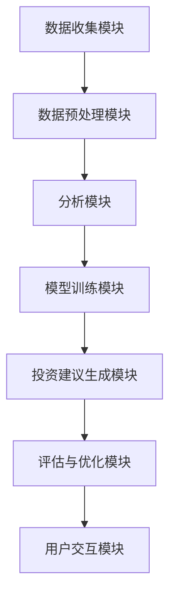

                 

### 文章标题

《AI在个人理财中的应用：智能投资建议》

### 文章关键词

人工智能、个人理财、智能投资建议、数据分析、投资策略、机器学习

### 文章摘要

本文将深入探讨人工智能（AI）在个人理财中的应用，尤其是智能投资建议系统。我们将从基础概念、核心算法原理、数学模型与公式解析，到实际应用案例进行详细讲解。通过本文，读者将了解AI在投资领域的应用场景、核心技术和未来发展。

### 目录

#### 第一部分: AI在个人理财中的基础概念

**第1章: AI与个人理财概述**

- 1.1 AI在个人理财中的角色
- 1.2 智能投资建议的概念
- 1.3 智能投资建议的原理

**第2章: 个人理财基础**

- 2.1 个人理财的目标
- 2.2 投资原则
- 2.3 投资策略分析

**第3章: AI在投资分析中的应用**

- 3.1 数据分析基础
- 3.2 AI与金融市场预测
- 3.3 AI与投资组合优化

**第4章: 智能投资建议系统的构建**

- 4.1 智能投资建议系统的架构
- 4.2 数据预处理
- 4.3 模型选择与训练

**第5章: 核心算法原理讲解**

- 5.1 监督学习与无监督学习的应用
- 5.2 回归分析与分类算法
- 5.3 强化学习在投资中的应用

**第6章: 数学模型与公式解析**

- 6.1 投资组合数学模型
- 6.2 风险评估与预期收益计算
- 6.3 期权定价模型

**第7章: 实战案例解析**

- 7.1 案例介绍
- 7.2 智能投资建议系统的实现
- 7.3 案例分析与评估

#### 第二部分: 智能投资建议的实践应用

**第8章: 智能投资建议的个性化推荐**

- 8.1 用户行为分析
- 8.2 风险偏好评估
- 8.3 投资建议生成与优化

**第9章: 智能投资建议在实践中的应用**

- 9.1 股票投资建议
- 9.2 基金投资建议
- 9.3 其他金融产品投资建议

**第10章: 智能投资建议的未来发展**

- 10.1 AI在投资领域的未来趋势
- 10.2 智能投资建议系统的改进方向
- 10.3 投资领域的AI伦理问题

### 附录

- 附录A: AI投资工具与资源

  - A.1 常用机器学习库
  - A.2 金融数据资源
  - A.3 实践项目参考

---

在接下来的部分，我们将一步一步深入探讨AI在个人理财中的应用，从基础概念到核心算法，再到实际应用，全面解析智能投资建议系统的构建和实现。准备好一起探索AI在理财领域的无限可能吧！### 第一部分: AI在个人理财中的基础概念

#### 第1章: AI与个人理财概述

##### 1.1 AI在个人理财中的角色

人工智能（AI）技术在个人理财领域的应用日益广泛，其主要角色体现在提供智能投资建议、优化投资组合、风险控制等方面。AI通过处理海量数据、挖掘市场趋势、分析用户行为，为投资者提供个性化的理财方案，从而提高投资效率和收益。

首先，AI能够处理和分析大量的市场数据。金融市场数据包括股票价格、交易量、财务报表、宏观经济指标等。通过机器学习算法，AI可以快速识别数据中的规律和趋势，为投资者提供实时的市场动态。

其次，AI在投资组合优化中发挥重要作用。传统的投资组合优化主要依赖于数学模型和统计方法，而AI可以更快速、更准确地计算出最优的投资组合。AI通过分析历史数据和市场趋势，预测不同资产类别的未来表现，从而为投资者提供最佳的投资建议。

最后，AI在风险控制方面也有显著作用。通过风险评估模型，AI可以实时监测市场风险，预测潜在的风险事件，并给出相应的风险规避策略。这样，投资者可以更好地管理风险，避免投资损失。

##### 1.2 智能投资建议的概念

智能投资建议是指利用人工智能技术，通过对市场数据、用户行为和投资目标的深入分析，为投资者提供个性化的投资建议。这些建议可以包括投资品种的选择、投资金额的分配、投资时间的选择等。

智能投资建议的核心在于个性化。传统的投资建议往往基于通用的投资原则和策略，而智能投资建议则可以根据每个投资者的具体情况进行定制。这种个性化的服务不仅提高了投资效率，还提高了投资的成功率。

智能投资建议的实现通常需要以下几个步骤：

1. **数据收集**：收集市场数据、用户行为数据和投资目标数据。
2. **数据处理**：对收集到的数据进行分析和处理，提取关键信息和特征。
3. **模型训练**：利用机器学习算法对处理后的数据进行训练，建立预测模型。
4. **投资建议生成**：根据训练好的模型，为投资者生成个性化的投资建议。
5. **建议评估与优化**：对生成的投资建议进行评估和优化，确保建议的准确性和有效性。

##### 1.3 智能投资建议的原理

智能投资建议的原理主要基于数据分析和机器学习算法。以下是对这两部分的具体解析：

**数据分析**

数据分析是智能投资建议的基础。通过数据分析，我们可以从大量数据中提取有用的信息，发现市场趋势和用户行为模式。数据分析通常包括以下步骤：

1. **数据收集**：收集股票价格、交易量、财务报表、宏观经济指标等数据。
2. **数据清洗**：处理缺失值、异常值和重复值，确保数据质量。
3. **特征工程**：提取数据中的关键特征，如技术指标、财务指标等。
4. **数据分析**：利用统计学和可视化工具对数据进行深入分析，发现市场趋势和用户行为模式。

**机器学习算法**

机器学习算法是智能投资建议的核心。通过机器学习算法，我们可以从历史数据中学习到市场规律和用户偏好，从而为投资者提供准确的预测和建议。机器学习算法通常包括以下几类：

1. **监督学习**：通过已知的输入和输出数据，训练模型来预测新的输入数据。常见的监督学习算法包括线性回归、决策树、随机森林等。
2. **无监督学习**：没有已知的输入和输出数据，通过分析数据结构来发现隐藏的模式。常见无监督学习算法包括聚类、降维、主成分分析等。
3. **强化学习**：通过不断尝试和反馈来学习最优策略。强化学习算法常用于投资策略的优化，如Q-learning、SARSA等。

通过结合数据分析和机器学习算法，智能投资建议系统能够为投资者提供高效、准确的理财服务。在下一章中，我们将进一步探讨个人理财的基础知识和投资原则，为深入理解智能投资建议提供基础。接下来，我们将讨论个人理财的目标和投资策略，帮助读者更好地理解AI在个人理财中的应用。

---

通过以上对AI在个人理财中角色、智能投资建议概念及原理的介绍，读者应该对AI在理财领域的基本概念和原理有了初步的了解。接下来，我们将进入第二部分，探讨个人理财的基础知识，包括理财目标、投资原则和投资策略分析。这部分内容将为理解AI如何为个人理财提供智能投资建议奠定基础。

#### 第2章: 个人理财基础

##### 2.1 个人理财的目标

个人理财的目标因人而异，但通常包括以下几个核心方面：

1. **储蓄**：储蓄是理财的基石。通过定期储蓄，个人可以积累一定的紧急备用金，以应对突发事件，如医疗费用、失业等。
   
2. **投资**：投资是为了实现长期的财富增长。通过将资金投入不同的资产类别，如股票、债券、房地产等，个人可以在承受一定风险的前提下，获取更高的收益。

3. **退休规划**：退休规划是确保个人在退休后仍能有稳定收入的重要手段。通过定期投资和合理配置资产，个人可以在退休时拥有充足的资金。

4. **子女教育**：教育是个人和家庭的重要投资。通过提前规划和投资，家长可以为子女的教育储备资金，确保他们能够接受良好的教育。

5. **风险管理**：风险管理是个人理财的重要组成部分。通过合理的保险规划和投资组合，个人可以降低风险，确保财务安全。

每个目标的具体实现方法会因个人情况和偏好而异。例如，对于储蓄，有些人可能选择定期存款，而有些人可能更愿意选择高收益的理财产品。对于投资，有些人可能倾向于股票市场，而有些人可能更喜欢债券和房地产。因此，个人理财的目标设定需要根据个人的实际情况进行。

##### 2.2 投资原则

投资原则是指导投资者进行投资决策的基本准则。以下是一些常见的投资原则：

1. **分散投资**：分散投资是指将资金投入不同的资产类别或不同行业的公司，以降低投资组合的整体风险。例如，可以将部分资金投资于股票，部分资金投资于债券和房地产。

2. **长期投资**：长期投资意味着投资者应持有投资多年，而不是短期交易。长期投资可以降低市场波动的影响，并利用复利效应实现财富增长。

3. **风险控制**：投资者应该根据自己的风险承受能力进行投资。高风险投资可能带来高收益，但也可能导致较大损失。适当的分散投资和投资组合优化可以帮助控制风险。

4. **定期调整**：投资市场不断变化，投资者应定期审视和调整自己的投资组合，确保其与投资目标和风险偏好保持一致。

5. **理性投资**：投资者应避免情绪化的投资决策，如盲目跟风或过度恐慌。理性投资意味着基于充分的研究和分析进行决策。

6. **持续学习**：投资是一个持续学习的过程。投资者应不断学习新的知识和技能，以应对市场的变化。

##### 2.3 投资策略分析

投资策略是投资者为实现其理财目标而采取的具体行动方案。以下是一些常见的投资策略：

1. **价值投资**：价值投资是指投资者通过分析公司的基本面，如财务报表、盈利能力、市场地位等，寻找被市场低估的股票进行投资。这种方法强调长期持有，并相信市场最终会认识到公司的真正价值。

2. **成长投资**：成长投资是指投资者通过分析公司的成长潜力，如市场份额、新产品研发等，寻找具有高速增长的潜力公司进行投资。这种方法通常涉及较高的风险，但也可能带来更高的收益。

3. **分散投资**：分散投资是指投资者将资金分散投资于不同的资产类别或不同行业的公司，以降低投资组合的整体风险。例如，可以将部分资金投资于股票，部分资金投资于债券和房地产。

4. **指数投资**：指数投资是指投资者通过购买指数基金来跟踪市场整体表现。这种方法简单高效，适合那些希望获得市场平均收益的投资者。

5. **量化投资**：量化投资是指投资者利用数学模型和统计分析来制定投资策略，并使用计算机程序自动执行交易。这种方法利用大量数据和算法来识别市场机会，实现高收益。

6. **避险投资**：避险投资是指投资者通过购买保险、债券等金融产品来降低风险。例如，购买人寿保险可以在意外情况下为家庭提供经济保障。

通过以上对个人理财目标、投资原则和投资策略的分析，读者应该对个人理财的基本概念有了更深入的理解。这些基础知识不仅有助于制定个人的理财计划，也为理解AI在个人理财中的应用提供了必要的背景。在下一章中，我们将探讨AI在投资分析中的应用，包括数据分析基础、AI与金融市场预测和AI与投资组合优化。这将进一步展示AI如何通过技术手段提升个人理财的效率和效果。

#### 第3章: AI在投资分析中的应用

##### 3.1 数据分析基础

数据分析是AI在投资分析中不可或缺的一环。数据分析的基础包括数据收集、数据预处理、特征工程和数据分析方法等。

**数据收集**

投资分析所需的数据来源广泛，包括但不限于：

1. **公开数据**：如股票市场数据、宏观经济指标、行业数据等，这些数据可以从官方机构、交易所和金融数据提供商获取。
2. **公司数据**：包括公司的财务报表、年度报告、盈利预测等，这些数据可以从公司官网、金融资讯平台获取。
3. **社交媒体数据**：如新闻、博客、社交媒体评论等，这些数据可以反映市场情绪和投资者的观点。

**数据预处理**

数据预处理是数据分析的重要步骤，包括数据清洗、缺失值处理、异常值检测和归一化等。

1. **数据清洗**：处理缺失值、异常值和重复值，确保数据质量。
2. **缺失值处理**：通过填补或删除缺失值，使数据更加完整。
3. **异常值检测**：识别并处理异常值，以防止其对数据分析结果造成误导。
4. **归一化**：将不同尺度的数据进行归一化处理，使其在同一尺度范围内进行比较。

**特征工程**

特征工程是提升数据分析效果的关键步骤。特征工程包括特征提取、特征选择和特征构造等。

1. **特征提取**：从原始数据中提取有用的特征，如技术指标、财务比率等。
2. **特征选择**：通过统计分析方法，筛选出对预测任务有显著贡献的特征，以降低模型的复杂性。
3. **特征构造**：通过组合原始特征，构造新的特征，以提升模型的预测能力。

**数据分析方法**

数据分析方法包括统计分析、时间序列分析和机器学习等。

1. **统计分析**：通过描述性统计、假设检验等方法，对数据进行分析，发现数据中的规律和趋势。
2. **时间序列分析**：利用时间序列模型，如ARIMA、GARCH等，对时间序列数据进行分析和预测。
3. **机器学习**：通过机器学习算法，如回归分析、决策树、支持向量机等，对数据进行分析和预测。

##### 3.2 AI与金融市场预测

金融市场预测是AI在投资分析中的重要应用之一。AI通过处理海量数据，挖掘市场趋势，为投资者提供准确的预测。

**预测方法**

AI在金融市场预测中常用的方法包括：

1. **回归分析**：通过建立回归模型，预测股票价格或其他金融指标。
2. **时间序列分析**：通过时间序列模型，如ARIMA、GARCH等，预测金融市场的走势。
3. **神经网络**：通过构建神经网络模型，对金融市场进行非线性预测。
4. **集成方法**：通过集成多种模型，提高预测的准确性。

**案例研究**

以下是一个使用神经网络预测股票价格的案例：

**数据集**：使用某股票过去一年的价格数据作为训练集。

**模型构建**：

1. **输入层**：选取技术指标（如移动平均、相对强弱指数）和财务指标作为输入。
2. **隐藏层**：设置多层隐藏层，每层包含多个神经元。
3. **输出层**：输出股票的未来价格。

**训练过程**：

1. **数据预处理**：对数据进行归一化处理，以消除不同指标的尺度差异。
2. **模型训练**：使用反向传播算法训练神经网络模型，调整模型参数，使其对训练数据进行准确预测。
3. **模型评估**：使用验证集评估模型性能，调整模型参数，直至达到满意的预测效果。

**预测结果**：

通过模型预测，可以得到股票在未来一段时间内的价格范围和置信区间。预测结果可以用于制定投资策略，提高投资的成功率。

##### 3.3 AI与投资组合优化

投资组合优化是AI在投资分析中的另一个重要应用。AI通过分析海量数据，优化投资组合的构成，提高投资收益。

**优化方法**

AI在投资组合优化中常用的方法包括：

1. **线性规划**：通过建立线性规划模型，优化投资组合的构成。
2. **遗传算法**：通过模拟自然进化过程，优化投资组合的构成。
3. **粒子群优化**：通过模拟鸟群觅食行为，优化投资组合的构成。
4. **基于风险调整的优化**：通过考虑投资组合的风险和收益，优化投资组合的构成。

**案例研究**

以下是一个使用遗传算法优化投资组合的案例：

**数据集**：使用某投资者的投资组合数据作为训练集。

**优化目标**：在风险可控的前提下，最大化投资组合的收益。

**优化过程**：

1. **初始化种群**：生成一组投资组合作为初始种群。
2. **适应度评估**：计算每个投资组合的收益和风险，评估其适应度。
3. **选择**：根据适应度值，选择适应度较高的投资组合进行交叉和变异操作。
4. **交叉和变异**：通过交叉和变异操作，生成新的投资组合。
5. **迭代**：重复选择、交叉和变异操作，直至达到预定的迭代次数或满足收敛条件。

**优化结果**：

通过遗传算法优化，可以得到一组最优的投资组合。优化后的投资组合可以提供更高的收益，同时控制风险在可接受范围内。

综上所述，AI在投资分析中的应用涵盖了数据分析基础、金融市场预测和投资组合优化等多个方面。通过这些应用，AI可以帮助投资者更准确地预测市场走势，优化投资组合，提高投资收益。在下一章中，我们将探讨智能投资建议系统的构建，包括系统架构、数据预处理和模型选择与训练。这将进一步展示AI如何实现智能投资建议，为个人理财提供个性化服务。

#### 第4章: 智能投资建议系统的构建

##### 4.1 智能投资建议系统的架构

智能投资建议系统是一个复杂的多层次系统，其架构通常包括以下几个主要模块：

1. **数据收集模块**：负责从各种来源收集金融数据、用户数据和投资目标数据。数据来源可能包括交易所、金融数据提供商、社交媒体和公司财报等。

2. **数据预处理模块**：对收集到的数据进行清洗、处理和特征工程，以生成高质量的数据集，供后续分析和模型训练使用。这个模块确保数据的一致性、完整性和准确性。

3. **分析模块**：利用机器学习算法和统计方法对预处理后的数据进行分析，提取关键信息和市场趋势。这一模块可以包括时间序列分析、回归分析、聚类分析和神经网络等。

4. **模型训练模块**：使用分析模块提取的特征和已标注的数据，训练预测模型。常见的机器学习算法包括监督学习（如线性回归、决策树、随机森林）和无监督学习（如K-均值聚类、主成分分析）。

5. **投资建议生成模块**：基于训练好的模型，为用户生成个性化的投资建议。这些建议可能包括投资品种的选择、投资金额的分配、投资时间点等。

6. **评估与优化模块**：对生成的投资建议进行评估和优化，确保其准确性和有效性。评估可以通过回测、交叉验证等方法进行，优化可以通过调整模型参数、改进特征工程等方法实现。

7. **用户交互模块**：提供用户界面，让用户可以轻松地输入投资目标和偏好，查看和接受投资建议。

**系统架构图**

以下是一个简单的智能投资建议系统架构的Mermaid流程图：



##### 4.2 数据预处理

数据预处理是构建智能投资建议系统的关键步骤，其质量直接影响模型的性能和投资建议的准确性。以下是一些常用的数据预处理技术：

**数据清洗**：处理缺失值、异常值和重复值。对于缺失值，可以使用填补方法（如平均值填补、前值或后值填补、插值法）或删除方法（如删除缺失值较多的记录）。对于异常值，可以使用统计方法（如标准差法、IQR法）或机器学习方法（如孤立森林）检测并处理。

**数据转换**：将非数值数据转换为数值数据，如将类别数据编码为数值。常用的编码方法包括独热编码（One-Hot Encoding）和标签编码（Label Encoding）。

**归一化**：将不同尺度的数据转换为相同的尺度范围，如将价格数据归一化为[0, 1]。常用的归一化方法包括最小-最大缩放（Min-Max Scaling）和Z-Score缩放。

**特征工程**：提取对模型有重要影响的特征，如技术指标、财务指标等。特征工程包括特征选择（如相关性分析、递归特征消除）和特征构造（如多项式特征、交互特征）。

**时间序列处理**：对于时间序列数据，可以进行差分、平滑处理，以消除季节性和趋势性。常用的方法包括移动平均法、指数平滑法等。

##### 4.3 模型选择与训练

选择合适的模型和训练方法是构建智能投资建议系统的关键。以下是一些常用的模型和训练方法：

**监督学习模型**：监督学习模型适用于有标注数据的场景，其目标是预测输出标签。常见的监督学习模型包括：

- **线性回归**：用于预测连续值输出。
- **逻辑回归**：用于预测二分类输出。
- **决策树**：用于分类或回归任务，易于解释。
- **随机森林**：通过集成多个决策树，提高模型的预测能力。
- **支持向量机**：用于分类任务，适用于高维数据。

**无监督学习模型**：无监督学习模型适用于无标注数据的场景，其目标是发现数据中的结构和模式。常见的无监督学习模型包括：

- **K-均值聚类**：用于发现数据中的聚类结构。
- **主成分分析**：用于降维和特征提取。
- **自编码器**：用于无监督特征学习。

**强化学习模型**：强化学习模型适用于动态决策过程，其目标是学习最优策略。常见的强化学习模型包括：

- **Q-Learning**：通过值函数学习，预测状态-动作价值。
- **SARSA**：通过状态-动作值函数迭代更新，学习最优策略。

**模型训练方法**：

- **批量训练**：每次将整个训练集输入模型进行训练。
- **随机梯度下降**：每次随机选择一部分训练数据进行训练，更新模型参数。
- **梯度下降优化**：通过计算损失函数的梯度，更新模型参数。

**模型评估与选择**：

- **交叉验证**：通过将数据集划分为多个子集，轮流训练和验证模型，以评估模型的泛化能力。
- **A/B测试**：将用户随机分配到不同的模型版本，比较不同模型的实际表现。

在下一章中，我们将深入讲解智能投资建议系统的核心算法原理，包括监督学习与无监督学习的应用、回归分析与分类算法、以及强化学习在投资中的应用。这将进一步展示AI如何通过算法实现智能投资建议，为个人理财提供科学、有效的决策支持。

#### 第5章: 核心算法原理讲解

##### 5.1 监督学习与无监督学习的应用

在智能投资建议系统中，监督学习和无监督学习都有重要的应用。监督学习适用于有标注数据的情况，其目标是通过历史数据学习出一个映射函数，用于预测新的数据。无监督学习则适用于无标注数据，其目标是从数据中自动发现结构和模式。

**监督学习在投资中的应用**

监督学习在投资中的应用主要包括股票价格预测、市场趋势分析和投资组合优化等。

**股票价格预测**：通过收集历史股票价格数据，利用监督学习模型（如线性回归、神经网络）预测未来股票价格。以下是一个基于线性回归的股票价格预测的伪代码：

```python
# 输入：历史股票价格数据（特征集X和标签集y）
# 输出：训练好的线性回归模型

from sklearn.linear_model import LinearRegression

# 数据预处理
X = preprocess_data(X)
y = preprocess_data(y)

# 创建线性回归模型
model = LinearRegression()

# 模型训练
model.fit(X, y)

# 预测未来股票价格
predicted_prices = model.predict(X_future)
```

**市场趋势分析**：通过分析市场历史数据，利用监督学习模型（如决策树、随机森林）识别市场趋势。以下是一个基于随机森林的市场趋势分析的伪代码：

```python
# 输入：市场数据（特征集X和标签集y）
# 输出：训练好的随机森林模型

from sklearn.ensemble import RandomForestClassifier

# 数据预处理
X = preprocess_data(X)
y = preprocess_data(y)

# 创建随机森林模型
model = RandomForestClassifier()

# 模型训练
model.fit(X, y)

# 分析市场趋势
trend = model.predict(X_future)
```

**投资组合优化**：通过监督学习模型（如线性规划、遗传算法）优化投资组合，以实现风险最小化或收益最大化。以下是一个基于遗传算法的投资组合优化的伪代码：

```python
# 输入：投资机会数据（特征集X和收益标签y）
# 输出：最优投资组合

from genetic_algorithm import GeneticAlgorithm

# 数据预处理
X = preprocess_data(X)
y = preprocess_data(y)

# 创建遗传算法
ga = GeneticAlgorithm()

# 优化投资组合
optimal_portfolio = ga.optimize(X, y)
```

**无监督学习在投资中的应用**

无监督学习在投资中的应用主要包括数据挖掘、用户行为分析和市场趋势识别等。

**数据挖掘**：通过无监督学习模型（如K-均值聚类、主成分分析）挖掘投资数据中的隐藏信息。以下是一个基于K-均值聚类的数据挖掘的伪代码：

```python
# 输入：投资数据
# 输出：聚类结果

from sklearn.cluster import KMeans

# 创建K-均值聚类模型
kmeans = KMeans(n_clusters=3)

# 数据预处理
X = preprocess_data(X)

# 聚类
clusters = kmeans.fit_predict(X)

# 分析聚类结果
print("Cluster centers:", kmeans.cluster_centers_)
```

**用户行为分析**：通过无监督学习模型（如关联规则学习、协同过滤）分析用户行为，为用户提供个性化投资建议。以下是一个基于协同过滤的用户行为分析的伪代码：

```python
# 输入：用户交易数据
# 输出：个性化投资建议

from collaborative_filtering import CollaborativeFiltering

# 创建协同过滤模型
cf = CollaborativeFiltering()

# 分析用户行为
user_behavior = cf.analyze_data(user_data)

# 生成个性化投资建议
investment_advice = cf.generate_advice(user_behavior)
```

**市场趋势识别**：通过无监督学习模型（如时间序列分析、聚类分析）识别市场趋势，为投资者提供及时的市场动态。以下是一个基于时间序列分析的市场趋势识别的伪代码：

```python
# 输入：市场数据
# 输出：市场趋势

from time_series_analysis import TimeSeriesAnalysis

# 创建时间序列分析模型
tsa = TimeSeriesAnalysis()

# 数据预处理
X = preprocess_data(X)

# 分析市场趋势
trend = tsa.analyze_trend(X)

# 输出市场趋势
print("Market trend:", trend)
```

综上所述，监督学习和无监督学习在投资领域中都有广泛的应用。通过这些算法，我们可以从海量数据中挖掘有价值的信息，为投资者提供科学、有效的投资建议。在下一章中，我们将进一步探讨投资组合数学模型、风险评估与预期收益计算以及期权定价模型，以深入理解投资决策中的数学基础。

#### 第5章: 核心算法原理讲解

##### 5.2 回归分析与分类算法

回归分析和分类算法是机器学习中的两大核心算法，它们广泛应用于各种预测任务中，包括金融市场的预测和投资组合的优化。

**回归分析**

回归分析用于预测连续值输出，其目标是建立自变量和因变量之间的关系模型。在投资领域中，回归分析可以用于预测股票价格、估算未来收益等。以下是一个简单的线性回归算法的伪代码：

```python
# 输入：特征矩阵X和标签向量y
# 输出：回归模型参数θ

def linear_regression(X, y):
    # 计算X的转置
    X_transpose = X.T
    
    # 计算X的协方差矩阵
    covariance_matrix = X_transpose @ X
    
    # 计算X的逆矩阵
    inverse_matrix = np.linalg.inv(covariance_matrix)
    
    # 计算θ
    theta = inverse_matrix @ X_transpose @ y
    
    return theta

# 数据预处理
X = preprocess_data(X)
y = preprocess_data(y)

# 训练线性回归模型
theta = linear_regression(X, y)

# 预测
predicted_price = theta @ X_new
```

在金融市场中，常用的回归分析方法包括：

- **多重线性回归**：用于处理多个自变量对因变量的影响。
- **岭回归**：在多重线性回归中引入正则化项，以防止过拟合。
- **套利回归**：用于发现市场中的套利机会。

**分类算法**

分类算法用于预测离散值输出，其目标是分类新数据。在投资领域中，分类算法可以用于预测股票的涨跌、识别市场趋势等。以下是一个简单的逻辑回归算法的伪代码：

```python
# 输入：特征矩阵X和标签向量y
# 输出：分类模型参数θ

def logistic_regression(X, y):
    # 初始化θ
    theta = np.random.rand(n_features)
    
    # 设置迭代次数和步长
    iterations = 1000
    learning_rate = 0.01
    
    # 迭代更新θ
    for _ in range(iterations):
        z = X @ theta
        predicted probabilities = sigmoid(z)
        
        # 计算损失函数
        loss = -1/m * (y.T @ np.log(predicted_probabilities) + (1-y).T @ np.log(1-predicted_probabilities))
        
        # 计算梯度
        gradient = X.T @ (predicted_probabilities - y)
        
        # 更新θ
        theta -= learning_rate * gradient
    
    return theta

# 数据预处理
X = preprocess_data(X)
y = preprocess_data(y)

# 训练逻辑回归模型
theta = logistic_regression(X, y)

# 分类
prediction = sigmoid(X_new @ theta)
```

在金融市场中，常用的分类算法包括：

- **支持向量机（SVM）**：用于处理高维数据和线性不可分数据。
- **随机森林**：通过构建多个决策树，提高分类的准确性和鲁棒性。
- **神经网络**：用于处理复杂的非线性分类问题。

**应用案例**

以下是一个简单的应用案例，使用逻辑回归模型预测股票的涨跌：

1. **数据收集**：收集历史股票价格数据，包括开盘价、收盘价、最高价、最低价、交易量等。
2. **数据预处理**：对数据进行归一化处理，将数据缩放到[0, 1]范围内。
3. **特征选择**：选择对股票涨跌有显著影响的技术指标作为特征，如移动平均线、相对强弱指数（RSI）等。
4. **模型训练**：使用逻辑回归模型训练数据集，计算模型参数。
5. **模型评估**：使用验证集评估模型性能，调整模型参数。
6. **预测**：使用训练好的模型预测未来股票的涨跌。

通过上述步骤，可以构建一个基本的股票涨跌预测模型，从而为投资者提供决策支持。在下一章中，我们将探讨强化学习在投资中的应用，包括强化学习的基本原理、策略优化方法和实际应用案例。

#### 第5章: 核心算法原理讲解

##### 5.3 强化学习在投资中的应用

强化学习（Reinforcement Learning，RL）是一种通过试错和反馈进行学习的方法，旨在通过不断试错来寻找最优策略。在投资领域，强化学习可以用于优化投资组合、风险管理和实时交易策略等方面。

**强化学习的基本原理**

强化学习由四个核心部分组成：环境（Environment）、代理（Agent）、行动（Action）和奖励（Reward）。

- **环境**：指投资者所处的市场，包括股票价格、交易量、宏观经济指标等。
- **代理**：指执行策略的智能体，如智能投资建议系统。
- **行动**：指代理在环境中采取的操作，如买入、持有或卖出特定资产。
- **奖励**：指代理在行动后获得的奖励，用于指导代理的下一步行动。

**强化学习的策略优化方法**

强化学习的策略优化方法主要包括值函数方法和策略迭代方法。

- **值函数方法**：通过学习值函数，代理可以预测在特定状态下采取特定行动的长期奖励。Q-Learning和SARSA是两种常见的值函数方法。

  - **Q-Learning**：Q-Learning通过更新Q值来学习最优策略。Q值表示在特定状态下采取特定行动的预期回报。以下是一个Q-Learning算法的伪代码：

    ```python
    # 输入：状态集合S、行动集合A、奖励函数R、学习率α、折扣因子γ
    # 输出：策略π

    def QLearning(S, A, R, alpha, gamma):
        Q = np.zeros((len(S), len(A)))
        
        for episode in range(1000):
            state = S[0]
            done = False
            
            while not done:
                action = np.argmax(Q[state])
                next_state, reward, done = get_next_state_and_reward(state, action)
                
                Q[state][action] = Q[state][action] + alpha * (reward + gamma * np.max(Q[next_state]) - Q[state][action])
                
                state = next_state
        
        return Q

    # 训练Q-Learning模型
    Q = QLearning(S, A, R, alpha, gamma)

    # 获取策略π
    policy = np.argmax(Q, axis=1)
    ```

  - **SARSA**：SARSA通过同时更新当前状态和下一步状态的动作值来学习策略。以下是一个SARSA算法的伪代码：

    ```python
    # 输入：状态集合S、行动集合A、奖励函数R、学习率α、折扣因子γ
    # 输出：策略π

    def SARSA(S, A, R, alpha, gamma):
        Q = np.zeros((len(S), len(A)))
        
        for episode in range(1000):
            state = S[0]
            done = False
            
            while not done:
                action = np.random.choice(A)
                next_state, reward, done = get_next_state_and_reward(state, action)
                
                Q[state][action] = Q[state][action] + alpha * (reward + gamma * np.max(Q[next_state]) - Q[state][action])
                
                state = next_state
        
        return Q

    # 训练SARSA模型
    Q = SARSA(S, A, R, alpha, gamma)

    # 获取策略π
    policy = np.argmax(Q, axis=1)
    ```

- **策略迭代方法**：策略迭代方法包括策略评估和策略改进两个步骤。策略评估用于计算当前策略的期望回报，策略改进用于更新策略，使其更接近最优策略。

  - **策略评估**：使用蒙特卡洛方法或动态规划计算当前策略的期望回报。以下是一个策略评估的伪代码：

    ```python
    # 输入：状态集合S、行动集合A、奖励函数R、策略π、折扣因子γ
    # 输出：策略值V(π)

    def policy_evaluation(V, S, A, R, π, gamma, epsilon):
        while True:
            old_V = V.copy()
            for state in S:
                action = π[state]
                next_state, reward, done = get_next_state_and_reward(state, action)
                V[state] = reward + gamma * max(V[next_state])
            
            if np.linalg.norm(old_V - V) < epsilon:
                break
        
        return V
    ```

  - **策略改进**：使用策略评估结果更新策略。以下是一个策略改进的伪代码：

    ```python
    # 输入：状态集合S、行动集合A、奖励函数R、策略π、折扣因子γ
    # 输出：新策略π'

    def policy_improvement(S, A, R, π, V, gamma):
        new_policy = {}
        for state in S:
            best_action = None
            best_value = -np.inf
            
            for action in A:
                next_state, reward, done = get_next_state_and_reward(state, action)
                value = reward + gamma * V[next_state]
                
                if value > best_value:
                    best_value = value
                    best_action = action
            
            new_policy[state] = best_action
        
        return new_policy
    ```

**强化学习在投资中的应用案例**

以下是一个使用强化学习优化投资组合的案例：

1. **数据收集**：收集股票的历史价格数据、交易量数据等，作为环境的状态信息。
2. **数据预处理**：对数据进行归一化处理，将数据缩放到[0, 1]范围内。
3. **状态表示**：将股票的历史价格、交易量等技术指标作为状态特征。
4. **行动表示**：定义行动空间，包括买入、持有和卖出等操作。
5. **奖励函数设计**：设计奖励函数，奖励策略在带来正收益的同时减少风险。
6. **策略优化**：使用Q-Learning或SARSA算法训练策略，优化投资组合。
7. **策略评估**：使用策略评估方法评估优化后的策略性能。
8. **策略应用**：将优化后的策略应用于实际投资中，监测和调整策略。

通过上述步骤，可以构建一个基于强化学习的投资组合优化系统，从而实现更有效的投资决策。在下一章中，我们将探讨投资组合数学模型、风险评估与预期收益计算以及期权定价模型，进一步理解投资决策中的数学基础。

#### 第6章: 数学模型与公式解析

##### 6.1 投资组合数学模型

投资组合数学模型是金融数学中的一个重要分支，旨在通过数学方法优化投资组合，以实现收益最大化或风险最小化。以下是一些常见的投资组合数学模型：

**均值-方差模型**

均值-方差模型是由哈里·马科维茨（Harry Markowitz）提出的，它通过优化投资组合的期望收益和风险，以实现最佳的投资策略。

**目标函数**：

\[ \min \ \sigma^2 = w^T \Sigma \ w - \rho^T \ w \]

其中，\( w \) 是投资组合的权重向量，\( \Sigma \) 是资产协方差矩阵，\( \rho \) 是投资组合的期望收益向量。

**约束条件**：

\[ w^T \rho = R_f \]  
\[ w^T w = 1 \]

其中，\( R_f \) 是无风险收益率。

**求解方法**：

使用拉格朗日乘数法求解上述优化问题，得到最优投资组合权重 \( w^* \)。

**马科维茨效率前沿**

马科维茨效率前沿是指在给定风险水平下，所有可能的投资组合中收益最高的一条曲线。它通过连接所有有效前沿点，反映了投资组合的风险和收益平衡。

**有效前沿计算**：

1. **计算所有资产的预期收益率和协方差矩阵**。
2. **计算所有可能的投资组合权重**。
3. **计算每个投资组合的期望收益和风险**。
4. **绘制有效前沿图**。

**资本资产定价模型（CAPM）**

资本资产定价模型是用于计算资产预期收益的模型，它基于资产的风险和市场的风险溢价。

**公式**：

\[ E(r_i) = R_f + \beta_i (E(r_m) - R_f) \]

其中，\( E(r_i) \) 是资产 \( i \) 的预期收益，\( R_f \) 是无风险收益率，\( \beta_i \) 是资产 \( i \) 的贝塔系数，\( E(r_m) \) 是市场组合的预期收益。

**套利定价理论（APT）**

套利定价理论是一种基于市场均衡原理的资产定价模型，它认为资产的预期收益可以通过多个风险因素的线性组合来解释。

**公式**：

\[ E(r_i) = \alpha_i + \beta_{i1} F_1 + \beta_{i2} F_2 + \ldots + \beta_{ik} F_k \]

其中，\( E(r_i) \) 是资产 \( i \) 的预期收益，\( \alpha_i \) 是资产 \( i \) 的无风险收益部分，\( \beta_{ij} \) 是资产 \( i \) 对风险因素 \( j \) 的敏感性，\( F_j \) 是风险因素 \( j \) 的预期收益。

##### 6.2 风险评估与预期收益计算

风险评估是投资决策中至关重要的一环，它通过量化资产的风险水平，帮助投资者做出更合理的投资决策。以下是一些常用的风险评估与预期收益计算方法：

**方差与标准差**

方差和标准差是衡量资产风险的常用指标。方差表示资产收益的波动程度，标准差是方差的平方根。

**公式**：

\[ \sigma_i = \sqrt{Var(r_i)} \]

其中，\( \sigma_i \) 是资产 \( i \) 的标准差，\( Var(r_i) \) 是资产 \( i \) 的方差。

**收益率分布**

收益率分布描述了资产收益的可能取值及其概率分布。常见的分布包括正态分布、对数正态分布等。

**公式**：

\[ P(r_i > x) = \Phi\left(\frac{x - \mu_i}{\sigma_i}\right) \]

其中，\( \Phi \) 是标准正态分布的累积分布函数，\( \mu_i \) 是资产 \( i \) 的预期收益，\( \sigma_i \) 是资产 \( i \) 的标准差。

**预期收益**

预期收益是资产在长期内的平均收益水平，它是投资决策的重要参考指标。

**公式**：

\[ E(r_i) = \sum_{i=1}^{n} r_i \cdot P(r_i) \]

其中，\( E(r_i) \) 是资产 \( i \) 的预期收益，\( r_i \) 是资产 \( i \) 的收益，\( P(r_i) \) 是资产 \( i \) 收益的概率。

##### 6.3 期权定价模型

期权定价模型是金融数学中的经典模型，它用于计算期权的理论价值。以下是一些常用的期权定价模型：

**布莱克-舒尔斯模型（Black-Scholes Model）**

布莱克-舒尔斯模型是一种用于计算欧式期权理论价值的模型，它基于股票价格的随机游走和波动率。

**公式**：

\[ C = S_0 \cdot N(d_1) - K \cdot e^{-rT} \cdot N(d_2) \]

\[ P = K \cdot e^{-rT} \cdot N(d_2) - S_0 \cdot N(d_1) \]

其中，\( C \) 是看涨期权的理论价值，\( P \) 是看跌期权的理论价值，\( S_0 \) 是当前股票价格，\( K \) 是执行价格，\( r \) 是无风险利率，\( T \) 是期权到期时间，\( N(d_1) \) 和 \( N(d_2) \) 是标准正态分布的累积分布函数，\( d_1 \) 和 \( d_2 \) 分别为：

\[ d_1 = \frac{\ln(S_0/K) + (r + \sigma^2/2)T}{\sigma \sqrt{T}} \]

\[ d_2 = d_1 - \sigma \sqrt{T} \]

**二叉树模型**

二叉树模型是一种用于计算期权理论价值的离散模型，它通过构建股票价格的二叉树，计算期权在不同时间点的理论价值。

**公式**：

\[ C_t = \max(S_t - K, 0) \]

\[ P_t = \max(K - S_t, 0) \]

其中，\( C_t \) 是看涨期权在第 \( t \) 时间的理论价值，\( P_t \) 是看跌期权在第 \( t \) 时间的理论价值，\( S_t \) 是第 \( t \) 时间的股票价格。

通过以上对投资组合数学模型、风险评估与预期收益计算以及期权定价模型的解析，读者应该对投资决策中的数学基础有了更深入的理解。这些数学模型和公式不仅是金融分析的工具，也是构建智能投资建议系统的重要基础。在下一章中，我们将通过一个实战案例，展示如何构建和实现智能投资建议系统。

#### 第7章: 实战案例解析

##### 7.1 案例介绍

在本章中，我们将通过一个实际案例，展示如何构建和实现一个智能投资建议系统。该案例选取了某只股票作为研究对象，利用历史数据和市场信息，通过机器学习和数据分析技术，为投资者提供个性化的投资建议。

**案例背景**：

- **股票选择**：选取某知名科技公司的股票，如苹果公司（AAPL）。
- **数据来源**：收集过去5年的股票价格、交易量、财务报表数据等。
- **市场信息**：包括宏观经济指标、行业指数、新闻和社交媒体信息等。

**目标**：

- 构建一个智能投资建议系统，为投资者提供股票买入、持有或卖出的建议。
- 通过数据分析和机器学习，优化投资策略，提高投资收益。

##### 7.2 智能投资建议系统的实现

**系统架构**：

智能投资建议系统包括以下几个主要模块：

1. **数据收集模块**：从各种数据源（如交易所、金融数据提供商、新闻网站等）收集股票价格、交易量、财务报表等数据。
2. **数据预处理模块**：对收集到的数据进行分析、清洗和特征工程，生成用于训练和预测的数据集。
3. **分析模块**：利用机器学习算法分析数据，提取市场趋势和投资者行为模式。
4. **预测模块**：基于训练好的模型，预测股票的未来价格和交易信号。
5. **建议生成模块**：根据预测结果和用户偏好，生成个性化的投资建议。
6. **评估模块**：对生成的投资建议进行评估和优化，确保其准确性和有效性。
7. **用户交互模块**：提供用户界面，让用户可以查看和接受投资建议。

**数据预处理模块**：

1. **数据收集**：使用API接口从各大交易所和金融数据提供商（如Yahoo Finance、Alpha Vantage等）收集股票价格、交易量、财务报表数据等。
2. **数据清洗**：处理缺失值、异常值和重复值，确保数据质量。例如，使用前值填补缺失的财务数据，使用统计学方法检测和剔除异常交易数据。
3. **特征工程**：提取技术指标、财务比率等特征，如移动平均线、相对强弱指数（RSI）、市盈率（P/E）、市净率（P/B）等。

**分析模块**：

1. **市场趋势分析**：使用时间序列分析和技术指标，分析股票价格的变化趋势。例如，使用移动平均线判断股票的趋势方向，使用RSI判断股票的买卖信号。
2. **投资者行为分析**：通过分析历史交易数据和市场情绪，了解投资者的行为模式。例如，使用高频交易数据识别市场趋势，使用社交媒体分析投资者情绪。
3. **多因素分析**：结合宏观经济指标、行业指数和新闻信息，进行多因素回归分析，识别影响股票价格的关键因素。

**预测模块**：

1. **模型选择**：选择适合的机器学习模型，如线性回归、随机森林、神经网络等，进行股票价格预测。
2. **模型训练**：使用预处理后的数据集，训练预测模型。例如，使用随机森林模型预测股票未来5个交易日的价格。
3. **预测结果**：输出预测结果，包括股票的未来价格范围和置信区间。

**建议生成模块**：

1. **投资策略**：根据预测结果和用户偏好，生成个性化的投资策略。例如，当预测股票价格将上涨时，建议买入；当预测股票价格将下跌时，建议卖出。
2. **风险控制**：结合风险评估模型，确保投资策略的风险在可接受范围内。例如，使用波动率作为风险指标，调整投资组合的权重。
3. **优化策略**：使用遗传算法等优化方法，不断调整和优化投资策略，提高投资收益。

**评估模块**：

1. **回测**：使用历史数据进行回测，评估投资策略的绩效。例如，计算投资策略的收益率、最大回撤和夏普比率等指标。
2. **交叉验证**：使用交叉验证方法，评估模型的泛化能力。例如，将数据集划分为训练集和验证集，交替训练和验证模型。
3. **动态调整**：根据市场变化和投资策略的表现，动态调整投资组合。例如，当市场波动较大时，增加现金头寸；当市场趋势明显时，增加股票头寸。

**用户交互模块**：

1. **用户界面**：设计用户友好的界面，让用户可以轻松地查看和接受投资建议。例如，使用图表显示股票价格、交易量和投资策略。
2. **个性化推荐**：根据用户的行为和偏好，推荐个性化的投资策略和产品。例如，针对风险偏好较低的投资者，推荐低风险的股票和基金产品。

通过以上模块的协同工作，智能投资建议系统可以为投资者提供高效、个性化的投资服务，帮助投资者更好地管理风险和实现投资目标。

##### 7.3 案例分析与评估

**案例评估**：

通过对案例的深入分析和评估，可以评估智能投资建议系统的性能和效果。以下是一些关键的评估指标：

1. **预测准确性**：评估模型预测股票价格的能力。通过计算预测误差、均方误差（MSE）和均方根误差（RMSE）等指标，评估预测模型的准确性。
2. **投资收益**：评估投资策略的实际收益。通过计算投资策略的收益率、最大回撤和夏普比率等指标，评估投资策略的有效性。
3. **用户体验**：评估用户对系统的满意度。通过用户调研、反馈和用户留存率等指标，评估系统的用户体验。

**改进方向**：

根据评估结果，可以识别系统的不足之处并进行改进。以下是一些可能的改进方向：

1. **模型优化**：通过改进特征工程和模型选择，提高预测模型的准确性。例如，引入更多维度的特征，如技术指标、财务比率和社会媒体情绪等。
2. **风险管理**：加强风险管理，确保投资策略的风险在可接受范围内。例如，使用更复杂的风险评估模型，动态调整投资组合。
3. **用户体验优化**：改进用户界面和交互设计，提高用户体验。例如，增加实时数据更新、定制化投资建议和自动化交易功能等。

通过不断优化和改进，智能投资建议系统可以更好地为投资者提供个性化的投资服务，帮助投资者实现长期稳健的投资回报。

综上所述，通过本案例的解析，我们展示了如何构建和实现一个智能投资建议系统，从数据收集、预处理、分析、预测到建议生成和评估，全面展示了AI在个人理财中的应用。在下一部分中，我们将探讨智能投资建议的个性化推荐、股票投资建议、基金投资建议以及其他金融产品投资建议，进一步展示AI在投资领域的广泛应用。

#### 第8章: 智能投资建议的个性化推荐

##### 8.1 用户行为分析

用户行为分析是构建个性化投资建议系统的基础，它通过收集和分析用户的投资行为、浏览记录和交易数据，了解用户的投资偏好和风险承受能力。

**数据收集**

用户行为数据包括以下几个方面：

- **投资记录**：用户的投资历史，如买入和卖出的股票、基金、债券等。
- **交易数据**：用户的交易频率、交易量、交易时间和交易策略。
- **浏览记录**：用户在投资平台上的浏览行为，如搜索关键词、关注的股票和基金等。
- **反馈信息**：用户对投资建议的反馈，如接受度、采纳情况和收益表现。

**数据分析**

数据分析的主要目的是从用户行为数据中提取有价值的信息，以了解用户的投资偏好和风险承受能力。以下是一些常用的数据分析方法：

- **描述性统计**：通过计算平均数、中位数、标准差等统计指标，了解用户投资行为的总体特征。
- **关联规则分析**：使用关联规则挖掘算法，如Apriori算法，分析用户投资行为之间的关联性，发现潜在的投资规律。
- **聚类分析**：使用聚类算法，如K-均值聚类，将用户根据投资行为相似度分为不同的群体，为个性化推荐提供基础。
- **分类分析**：使用分类算法，如逻辑回归、决策树，将用户分为不同的风险偏好类别，为投资建议的个性化提供依据。

**案例分析**

以下是一个用户行为分析的案例：

1. **数据收集**：收集用户在过去一年的投资记录、交易数据和浏览记录。
2. **数据处理**：对数据清洗和归一化处理，提取关键特征，如投资品种、交易金额、浏览频率等。
3. **描述性统计**：计算用户的平均交易金额、平均交易频率和平均浏览时间等指标，了解用户的总体投资行为。
4. **关联规则分析**：使用Apriori算法分析用户投资行为之间的关联性，发现用户倾向于同时投资股票和基金。
5. **聚类分析**：使用K-均值聚类，将用户分为高收益风险偏好、中收益风险偏好和低收益风险偏好三类。
6. **分类分析**：使用逻辑回归，根据用户的投资记录和浏览记录，预测用户的风险偏好类别。

通过上述分析，可以了解用户的投资偏好和风险承受能力，为后续的个性化推荐提供依据。

##### 8.2 风险偏好评估

风险偏好评估是构建个性化投资建议系统的重要环节，它通过评估用户的投资风险承受能力，为用户提供适合其风险偏好的投资建议。

**风险偏好评估方法**

风险偏好评估的方法主要包括以下几种：

1. **问卷评估**：通过设计风险偏好问卷，评估用户的投资风险承受能力。问卷通常包括多个选择题，如投资时间、投资目标、最大承受损失等。
2. **历史数据分析**：通过分析用户的投资历史数据，如投资品种、交易频率和交易策略等，评估用户的风险偏好。
3. **行为分析**：通过分析用户的投资行为，如买入和卖出的股票、基金等，评估用户的风险偏好。
4. **算法评估**：使用机器学习算法，根据用户的投资行为和交易数据，自动评估用户的风险偏好。

**案例分析**

以下是一个风险偏好评估的案例：

1. **问卷评估**：设计一份风险偏好问卷，包括10个选择题，如“您愿意在投资中承担多大的风险？”、“您的投资时间有多长？”等。
2. **数据收集**：收集用户的问卷答案和投资历史数据。
3. **数据处理**：对问卷答案和投资历史数据进行归一化处理，提取关键特征。
4. **算法评估**：使用逻辑回归算法，根据问卷答案和投资历史数据，评估用户的风险偏好。例如，如果用户的问卷答案倾向于高收益、高风险，则将其分类为高收益风险偏好。
5. **结果分析**：根据评估结果，将用户分为不同的风险偏好类别，如低风险、中风险、高风险等。

通过以上评估方法，可以准确评估用户的风险偏好，为后续的个性化推荐提供依据。

##### 8.3 投资建议生成与优化

投资建议生成与优化是智能投资建议系统的核心，它通过分析用户的行为数据和风险偏好，为用户提供个性化的投资建议，并根据市场变化和用户反馈不断优化建议。

**投资建议生成**

1. **数据输入**：收集用户的行为数据、市场数据和用户偏好设置。
2. **分析处理**：使用机器学习算法和统计分析方法，分析用户的行为数据和市场数据，提取关键特征。
3. **风险偏好匹配**：根据用户的风险偏好，选择适合的投资品种和投资策略。
4. **建议生成**：根据分析结果和用户偏好，生成个性化的投资建议，如买入、持有或卖出特定资产。

**案例分析**

以下是一个投资建议生成的案例：

1. **数据输入**：收集用户过去一年的投资记录、交易数据和浏览记录。
2. **数据处理**：对数据清洗和特征提取，提取用户的投资偏好和风险承受能力。
3. **风险偏好匹配**：根据用户的投资记录和浏览记录，将其分类为中等风险偏好。
4. **建议生成**：基于市场分析和用户偏好，生成以下投资建议：
   - 买入某只成长性较好的股票。
   - 持有某只稳健的债券基金。
   - 减少对高风险股票的投资比例。

**投资建议优化**

投资建议的优化是一个动态过程，它通过不断分析市场变化和用户反馈，调整和优化投资建议，提高其准确性和有效性。

1. **市场监控**：实时监控市场数据，如股票价格、交易量、新闻和社交媒体信息等，及时更新投资建议。
2. **用户反馈**：收集用户对投资建议的反馈，如采纳情况、收益表现等，分析用户对建议的满意度。
3. **优化算法**：使用机器学习算法和统计分析方法，根据市场变化和用户反馈，调整投资策略和模型参数。
4. **建议更新**：根据优化结果，更新投资建议，提高其准确性和适应性。

**案例分析**

以下是一个投资建议优化的案例：

1. **市场监控**：监控某只成长性股票的股价和交易量，发现股价开始下跌，交易量增加。
2. **用户反馈**：收集用户对买入建议的反馈，发现部分用户已开始买入，但未达到预期收益。
3. **优化算法**：调整买入策略，增加对市场风险的监控，减少买入比例。
4. **建议更新**：根据优化结果，更新投资建议，建议用户减少买入比例，增加对其他资产的配置。

通过用户行为分析、风险偏好评估和投资建议生成与优化，智能投资建议系统可以为投资者提供个性化、实时的投资建议，帮助投资者更好地管理风险和实现投资目标。在下一章中，我们将探讨智能投资建议在股票、基金和其他金融产品投资中的应用，进一步展示AI在投资领域的广泛应用。

### 第9章: 智能投资建议在实践中的应用

#### 9.1 股票投资建议

股票投资建议是智能投资建议系统中最常见和应用最广泛的一种。通过分析股票的历史数据、市场趋势和用户行为，AI可以为投资者提供买入、持有或卖出的建议。

**股票投资建议的生成方法**：

1. **数据收集**：收集股票的历史价格、交易量、财务报表、技术指标等数据。
2. **数据预处理**：对数据进行清洗、归一化和特征提取。
3. **模型训练**：使用机器学习算法（如线性回归、随机森林、神经网络）训练模型，预测股票的未来价格。
4. **投资建议生成**：根据模型预测和用户的风险偏好，生成具体的投资建议。

**案例分析**：

以下是一个使用AI生成股票投资建议的案例：

- **数据收集**：收集苹果公司（AAPL）过去一年的股票价格和交易量数据。
- **数据预处理**：对数据进行归一化处理，提取技术指标（如移动平均线、相对强弱指数）和财务指标。
- **模型训练**：使用随机森林模型训练数据集，预测苹果公司的未来股价。
- **投资建议生成**：根据模型预测和用户的风险偏好，生成以下投资建议：
  - 如果用户风险偏好高，建议买入苹果股票。
  - 如果用户风险偏好中等，建议持有苹果股票。
  - 如果用户风险偏好低，建议卖出苹果股票。

**股票投资建议的优化**：

股票投资建议的优化是提高其准确性和适应性的关键。以下是一些常见的优化方法：

1. **多因子模型**：结合多个因素（如技术指标、财务指标、宏观经济指标）进行预测，提高模型的准确性。
2. **动态调整**：根据市场变化和用户反馈，动态调整投资建议，以适应不同的市场环境。
3. **用户互动**：鼓励用户参与投资建议的反馈，根据用户的行为和反馈，优化投资建议。

#### 9.2 基金投资建议

基金投资建议是针对投资者在基金市场上的投资决策提供的一些建议。AI可以通过分析基金的历史业绩、基金经理的业绩、基金的类型和投资组合等信息，为投资者提供买入、持有或卖出的建议。

**基金投资建议的生成方法**：

1. **数据收集**：收集基金的历史业绩数据、基金经理的业绩、基金的类型、投资组合等信息。
2. **数据预处理**：对数据进行清洗、归一化和特征提取。
3. **模型训练**：使用机器学习算法（如线性回归、决策树、神经网络）训练模型，预测基金的未来业绩。
4. **投资建议生成**：根据模型预测和用户的风险偏好，生成具体的投资建议。

**案例分析**：

以下是一个使用AI生成基金投资建议的案例：

- **数据收集**：收集某只股票型基金过去三年的业绩数据、基金经理的业绩和基金的投资组合。
- **数据预处理**：对数据进行归一化处理，提取关键指标（如收益率、波动率、基金经理的经验）。
- **模型训练**：使用随机森林模型训练数据集，预测基金的未来业绩。
- **投资建议生成**：根据模型预测和用户的风险偏好，生成以下投资建议：
  - 如果用户风险偏好高，建议买入该股票型基金。
  - 如果用户风险偏好中等，建议持有该股票型基金。
  - 如果用户风险偏好低，建议卖出该股票型基金。

**基金投资建议的优化**：

基金投资建议的优化同样重要，以下是一些常见的优化方法：

1. **多因子模型**：结合多个因素（如收益率、波动率、基金经理的业绩）进行预测，提高模型的准确性。
2. **动态调整**：根据市场变化和用户反馈，动态调整投资建议，以适应不同的市场环境。
3. **用户互动**：鼓励用户参与投资建议的反馈，根据用户的行为和反馈，优化投资建议。

#### 9.3 其他金融产品投资建议

除了股票和基金，AI还可以为投资者提供其他金融产品的投资建议，如债券、期货、期权等。

**债券投资建议**：

债券投资建议主要关注债券的收益率、信用评级、利率变化等因素。AI可以通过分析债券的历史收益率、信用评级和市场利率，为投资者提供买入、持有或卖出的建议。

**期货投资建议**：

期货投资建议主要关注期货市场的波动性、供求关系和市场情绪等因素。AI可以通过分析期货的历史价格、交易量和市场情绪，为投资者提供买入、持有或卖出的建议。

**期权投资建议**：

期权投资建议主要关注期权的内在价值和时间价值、标的资产的价格波动和市场情绪等因素。AI可以通过分析期权的价格、标的资产的价格波动率和市场情绪，为投资者提供买入、持有或卖出的建议。

**案例分析**：

以下是一个使用AI生成债券投资建议的案例：

- **数据收集**：收集某只国债的历史收益率、信用评级和市场利率数据。
- **数据预处理**：对数据进行归一化处理，提取关键指标（如收益率、信用评级、利率变化）。
- **模型训练**：使用线性回归模型训练数据集，预测国债的未来收益率。
- **投资建议生成**：根据模型预测和用户的风险偏好，生成以下投资建议：
  - 如果用户风险偏好高，建议买入该国债。
  - 如果用户风险偏好中等，建议持有该国债。
  - 如果用户风险偏好低，建议卖出该国债。

**投资建议的优化**：

对于不同类型的金融产品，AI可以通过以下方法优化投资建议：

1. **多因子模型**：结合多个因素进行预测，提高模型的准确性。
2. **动态调整**：根据市场变化和用户反馈，动态调整投资建议，以适应不同的市场环境。
3. **用户互动**：鼓励用户参与投资建议的反馈，根据用户的行为和反馈，优化投资建议。

通过以上对股票、基金和其他金融产品投资建议的详细解析，我们可以看到AI在投资领域的广泛应用和巨大潜力。在下一章中，我们将探讨智能投资建议的未来发展趋势，分析AI在投资领域的潜在影响和改进方向，以及讨论投资领域的AI伦理问题。

### 第10章: 智能投资建议的未来发展

#### 10.1 AI在投资领域的未来趋势

随着人工智能技术的不断进步，AI在投资领域的应用前景广阔。以下是一些AI在投资领域未来发展的关键趋势：

1. **更精准的预测模型**：随着算法和计算能力的提升，AI将能够处理更多维度的数据，开发出更精准的预测模型，从而提高投资决策的准确性。

2. **个性化和定制化服务**：AI技术将帮助金融机构提供更加个性化和定制化的投资建议，根据投资者的风险偏好、投资目标和资金状况，制定专属的投资策略。

3. **实时风险管理**：AI技术可以实时监控市场动态和投资组合表现，快速识别潜在风险，提供及时的风险规避策略。

4. **自动化交易**：AI驱动的自动化交易系统将日益普及，通过算法和机器学习模型，实现高频交易和自动化投资管理。

5. **智能投顾（Robo-Advisor）**：智能投顾将基于AI技术，为普通投资者提供专业的投资建议和管理服务，降低投资门槛，提高投资效率。

6. **区块链技术的融合**：区块链技术可以为AI在投资领域的应用提供更加安全和透明的数据存储和交易环境，促进金融市场的创新和变革。

7. **跨学科融合**：AI在投资领域的应用将不仅仅是金融和数据科学的结合，还将涉及到心理学、社会学、经济学等多个领域的知识，为投资决策提供更加全面和深入的见解。

#### 10.2 智能投资建议系统的改进方向

为了进一步提升智能投资建议系统的性能和实用性，以下是一些可能的改进方向：

1. **数据质量的提升**：确保数据的准确性、完整性和时效性，通过数据清洗和预处理技术，提高数据质量，为AI算法提供更好的输入。

2. **多源数据的整合**：整合来自不同来源的数据，如社交媒体、新闻、金融数据等，构建更加全面和丰富的数据集，以增强模型的预测能力。

3. **增强机器学习算法**：不断改进和优化机器学习算法，提高模型的泛化能力和鲁棒性，以应对复杂的市场环境和多样化的投资需求。

4. **用户互动和反馈机制**：建立用户互动和反馈机制，鼓励用户对投资建议进行反馈，根据用户的行为和反馈，动态调整和优化投资策略。

5. **风险管理能力的提升**：加强智能投资建议系统在风险管理方面的能力，通过引入更多的风险模型和风险指标，提供更加全面和有效的风险控制建议。

6. **合规性和伦理问题的解决**：确保智能投资建议系统的合规性和伦理性，遵循相关法律法规和伦理标准，保护投资者的利益。

#### 10.3 投资领域的AI伦理问题

尽管AI在投资领域具有巨大的潜力，但也带来了一系列伦理问题，需要认真对待和解决：

1. **数据隐私**：AI系统在处理和分析用户数据时，可能涉及个人隐私信息的收集和使用。必须确保用户数据的安全和隐私，防止数据泄露和滥用。

2. **透明度和可解释性**：AI算法通常具有高度的复杂性和不可解释性，投资者可能难以理解AI的投资建议和决策过程。提高算法的透明度和可解释性，增强用户对AI系统的信任。

3. **算法偏见**：AI系统可能因为数据源的不公平性、算法设计的不合理性等原因，导致算法偏见。必须确保AI系统的公平性和无偏见性，避免对特定群体造成不利影响。

4. **监管合规**：AI系统在投资领域必须遵循相关法律法规，确保其合规性。同时，监管机构需要加强对AI系统的监督和监管，防范潜在的风险和道德问题。

5. **责任归属**：当AI系统产生错误决策或导致投资损失时，需要明确责任归属，确保投资者、金融机构和AI系统开发者之间的责任分配合理。

通过上述未来趋势、改进方向和伦理问题的探讨，我们可以看到AI在投资领域的重要性以及其面临的挑战。在未来的发展中，AI将在提升投资效率、优化投资决策和降低投资风险方面发挥更加重要的作用，但同时也需要解决一系列伦理和法律问题，确保其健康、可持续的发展。

### 附录A: AI投资工具与资源

#### A.1 常用机器学习库

在构建AI投资建议系统时，常用的机器学习库包括以下几种：

1. **scikit-learn**：这是一个广泛使用的开源机器学习库，提供了多种监督学习和无监督学习算法，如线性回归、决策树、随机森林、K-均值聚类等。

   - **官方网站**：https://scikit-learn.org/stable/

2. **TensorFlow**：由谷歌开发的开源机器学习库，支持深度学习模型构建和训练。其灵活性使其适用于复杂的预测任务。

   - **官方网站**：https://www.tensorflow.org/

3. **PyTorch**：由Facebook开发的开源深度学习库，其动态计算图和易于理解的API使其在深度学习领域非常受欢迎。

   - **官方网站**：https://pytorch.org/

4. **scrapy**：一个强大的网络爬虫框架，用于从网页中提取数据。这对于收集金融数据和市场信息非常有用。

   - **官方网站**：https://scrapy.org/

#### A.2 金融数据资源

收集高质量的金融数据对于构建高效的AI投资建议系统至关重要。以下是一些常用的金融数据资源：

1. **Alpha Vantage**：提供免费的API接口，涵盖股票价格、技术指标、财务数据等。

   - **官方网站**：https://www.alphavantage.co/

2. **Yahoo Finance**：提供丰富的股票和市场数据，可以通过API接口获取。

   - **官方网站**：https://finance.yahoo.com/

3. **Quandl**：提供大量的金融市场数据，包括股票、债券、期货、外汇等。

   - **官方网站**：https://www.quandl.com/

4. **Kaggle**：一个数据科学竞赛平台，提供了大量的金融数据集供下载和使用。

   - **官方网站**：https://www.kaggle.com/

#### A.3 实践项目参考

以下是一些AI投资项目的实践参考，这些项目展示了如何利用机器学习和数据分析技术构建智能投资建议系统：

1. **股票价格预测**：使用历史股票价格数据，构建机器学习模型预测未来股票价格。

   - **项目链接**：[股票价格预测](https://www.kaggle.com/c/stock-price-prediction)

2. **基金表现预测**：使用基金的历史业绩数据，预测基金的未来表现。

   - **项目链接**：[基金表现预测](https://www.kaggle.com/c/fund-performance-prediction)

3. **风险投资评估**：使用机器学习算法评估创业公司的风险，为风险投资提供决策支持。

   - **项目链接**：[风险投资评估](https://www.kaggle.com/c/startup-analysis)

4. **金融新闻情感分析**：通过文本分析技术，分析金融新闻和社交媒体评论，识别市场情绪。

   - **项目链接**：[金融新闻情感分析](https://www.kaggle.com/c/financial-news-sentiment-analysis)

通过以上工具和资源，开发者可以搭建和优化自己的AI投资建议系统，为投资者提供科学、有效的投资决策支持。在AI技术的不断进步和金融市场的日益复杂化背景下，智能投资建议系统将在未来发挥越来越重要的作用。

