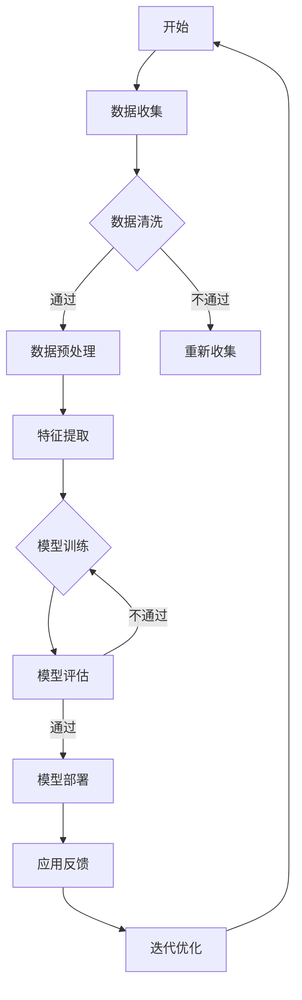

                 

# AI在个性化心理咨询中的应用：提供情感支持

> 关键词：人工智能，心理咨询，情感支持，个性化服务，算法原理

> 摘要：本文深入探讨了人工智能（AI）在个性化心理咨询中的应用，特别是其在提供情感支持方面的潜力。通过分析AI技术的基础知识、核心算法原理以及实际应用案例，本文展示了如何利用AI技术实现个性化心理咨询，以更有效地支持用户的情感需求。

## 《AI在个性化心理咨询中的应用：提供情感支持》目录大纲

### 第一部分：背景与基础

#### 第1章：个性化心理咨询与AI技术
- **1.1 个性化心理咨询的概念与重要性**
- **1.2 AI技术概述**
- **1.3 AI在心理咨询中的应用现状**

#### 第2章：AI技术在心理健康中的应用基础
- **2.1 心理学基础知识**
- **2.2 AI核心技术与心理学结合**
- **2.3 数据隐私与伦理问题**

### 第二部分：核心算法原理

#### 第3章：情感分析与识别
- **3.1 情感分析的基本概念**
- **3.2 情感识别算法原理**
- **3.3 情感分析伪代码实现**

#### 第4章：个性化心理咨询模型的构建
- **4.1 个性化咨询模型的构建方法**
- **4.2 个性化咨询模型的核心算法**
- **4.3 模型评估与优化**

#### 第5章：数学模型与心理学理论的融合
- **5.1 心理学理论在数学模型中的应用**
- **5.2 数学模型在心理咨询中的应用**
- **5.3 数学公式与心理理论**

### 第三部分：应用案例与实现

#### 第6章：情感支持聊天机器人的开发
- **6.1 情感支持聊天机器人的概念与设计**
- **6.2 开发环境与工具**
- **6.3 实现案例**

#### 第7章：基于AI的个性化心理咨询系统
- **7.1 个性化心理咨询系统的架构**
- **7.2 系统开发步骤**
- **7.3 系统实现案例**

### 第四部分：未来展望与挑战

#### 第8章：AI在个性化心理咨询中的应用前景
- **8.1 AI在心理健康领域的未来趋势**
- **8.2 潜在挑战与解决方案**

#### 第9章：总结与展望
- **9.1 本书总结**
- **9.2 未来研究方向**

### 附录
- **A.1 常用工具与资源**
- **A.2 Mermaid流程图与数学公式示例**

### 后记
- **后记：AI与心理健康的未来**

### 引言

随着人工智能（AI）技术的飞速发展，其在各个领域的应用不断拓展，尤其在心理健康领域，AI展示出了巨大的潜力。个性化心理咨询作为一种专业的心理服务形式，旨在为每位用户提供定制化的心理支持和指导。而AI技术，凭借其强大的数据处理和分析能力，可以为个性化心理咨询提供更加精准和高效的支持。本文将深入探讨AI在个性化心理咨询中的应用，特别是其在提供情感支持方面的潜力。

情感支持是心理咨询中至关重要的一部分。它不仅可以帮助用户缓解负面情绪，提高心理健康水平，还能为用户提供一个安全、可靠的情感倾诉渠道。传统心理咨询通常依赖于专业心理咨询师的经验和洞察力，但心理咨询师的资源有限，无法满足所有用户的需求。而AI聊天机器人作为一种新兴的情感支持工具，可以突破时间和空间的限制，为用户提供24/7的情感支持服务。

本文的结构如下：首先，我们将介绍个性化心理咨询和AI技术的基本概念，并探讨AI在心理咨询中的应用现状。接下来，我们将深入探讨AI技术在心理健康领域的应用基础，包括心理学基础知识、AI核心技术与心理学的结合，以及数据隐私和伦理问题。随后，我们将详细分析情感分析与识别的核心算法原理，包括机器学习和深度学习算法的应用，以及情感分析伪代码的实现。在此基础上，我们将介绍个性化心理咨询模型的构建方法，包括数据收集与预处理、特征提取与选择、模型训练与评估等步骤。接着，我们将探讨数学模型与心理学理论的融合，包括行为主义与统计模型、认知心理学与认知模型等。最后，我们将通过实际应用案例，展示情感支持聊天机器人和基于AI的个性化心理咨询系统的开发过程。文章的结尾将对AI在个性化心理咨询中的应用前景进行展望，并讨论潜在的挑战和解决方案。

### 第一部分：背景与基础

#### 第1章：个性化心理咨询与AI技术

个性化心理咨询是一种以用户为中心的心理服务模式，其核心目标是根据每位用户的独特需求和状况，提供量身定制的心理支持和干预措施。这种服务模式强调个体差异，旨在提高心理咨询的有效性和用户的满意度。

**1.1 个性化心理咨询的概念与重要性**

个性化心理咨询的定义可以概括为：基于个体差异，结合心理学理论和方法，为用户提供量身定制的心理支持和指导。个性化心理咨询不仅关注用户的心理健康问题，还关注其生活背景、个人经历、文化背景等多方面因素。这种全方位的考虑有助于更准确地识别用户的需求，提供更为有效的心理支持。

个性化心理咨询的重要性体现在以下几个方面：

1. 提高心理咨询的有效性：通过个性化服务，心理咨询师可以更准确地理解用户的心理状况，从而制定更具针对性的干预措施，提高心理咨询的成功率。
2. 增强用户满意度：个性化心理咨询能够更好地满足用户的需求，提高用户的参与度和满意度，从而促进长期的信任关系。
3. 节省资源和时间：个性化心理咨询可以减少不必要的干预，提高心理咨询资源的利用率，节省心理咨询的时间和成本。

**1.2 AI技术概述**

人工智能（AI）是一种模拟人类智能的技术，通过计算机系统实现感知、学习、推理、规划和决策等功能。AI技术主要包括机器学习、深度学习、自然语言处理、计算机视觉等子领域。

**机器学习**是AI的核心技术之一，它通过算法从数据中自动学习模式和规律，提高系统的预测和决策能力。常见的机器学习算法包括决策树、支持向量机、随机森林、神经网络等。

**深度学习**是机器学习的一个分支，它通过模拟人脑神经网络的结构和功能，实现更为复杂的学习和推理任务。深度学习在图像识别、语音识别、自然语言处理等领域取得了显著的成果。

**自然语言处理（NLP）**是AI技术中与文本和语言相关的一个子领域，它旨在使计算机能够理解和生成自然语言。NLP技术在文本分类、情感分析、机器翻译等方面有着广泛的应用。

**计算机视觉**是AI技术中与图像和视频相关的一个子领域，它通过计算机算法对图像和视频进行分析和处理，实现图像识别、目标检测、人脸识别等功能。

**1.3 AI在心理咨询中的应用背景**

AI技术在心理健康领域的应用具有广阔的前景，其主要背景包括以下几个方面：

1. 数据驱动的个性化服务：心理健康问题具有高度个性化特征，AI技术可以通过大数据分析和机器学习算法，为用户提供定制化的心理健康服务。

2. 资源扩展与效率提升：AI技术可以辅助心理咨询师的工作，提高心理咨询的效率，同时为那些无法获得传统心理咨询服务的用户提供替代方案。

3. 情感分析与识别：AI技术中的情感分析算法可以识别用户的情绪状态，为心理咨询提供更为细致的情感支持。

4. 预防与早期干预：AI技术可以通过对用户行为和情绪数据的分析，实现心理健康问题的预防与早期干预。

**1.4 AI在心理咨询中的应用现状**

目前，AI技术在心理咨询中的应用已经初具规模，主要表现为以下几个方面：

1. 情感支持聊天机器人：利用自然语言处理和情感分析技术，AI聊天机器人可以与用户进行交互，提供情感支持和咨询建议。

2. 心理健康评估工具：AI技术可以开发出各种心理健康评估工具，通过数据分析和模式识别，为用户提供心理健康状况的评估。

3. 个性化心理干预方案：基于用户的个体差异和需求，AI技术可以协助心理咨询师制定个性化的心理干预方案，提高干预效果。

4. 心理健康数据分析：AI技术可以对心理健康数据进行分析，发现潜在的规律和趋势，为心理健康研究提供数据支持。

**1.5 AI心理服务的市场与发展趋势**

随着AI技术的不断进步和心理健康需求的增加，AI心理服务的市场前景广阔。主要发展趋势包括：

1. 服务模式多元化：除了传统的面对面咨询，AI心理服务还将发展在线咨询、智能辅助咨询等多种模式。

2. 服务普及化：随着AI技术的普及，AI心理服务将更加易于获取，满足更多用户的需求。

3. 个性化服务深化：AI技术将进一步深化个性化服务，提高心理咨询的针对性和有效性。

4. 数据安全和伦理问题：随着数据规模的增加和应用的广泛化，数据安全和伦理问题将成为AI心理服务发展的重要挑战。

通过以上分析，我们可以看到，AI技术在个性化心理咨询中的应用具有巨大的潜力。在未来，随着AI技术的不断发展和完善，AI心理服务将在心理健康领域发挥越来越重要的作用。

### 第二部分：AI技术在心理健康中的应用基础

#### 第2章：AI技术在心理健康中的应用基础

为了深入探讨AI在个性化心理咨询中的应用，我们需要了解一些心理学基础知识和AI核心技术的应用，以及数据隐私和伦理问题。这一部分将为我们后续的算法原理和应用案例打下坚实的基础。

**2.1 心理学基础知识**

心理学是研究人类行为和心理过程的科学，它为我们理解人类情绪、思维和行为提供了理论基础。以下是一些心理学基础概念和理论：

1. **情绪理论**：情绪是人们对外界刺激的心理反应，包括基本情绪（如快乐、悲伤、愤怒）和复杂情绪（如焦虑、厌恶、羞愧）。情绪理论帮助我们理解情绪的产生、表达和调节过程。

2. **认知心理学**：认知心理学研究人类思维、记忆、学习和注意力等认知过程。它帮助我们理解个体如何处理信息、做出决策和解决问题。

3. **心理测量学**：心理测量学是测量和评估心理特征的科学。常用的测量工具包括量表、问卷和测试，这些工具可以量化个体的心理状态和特质。

4. **心理健康标准与评价指标**：心理健康标准是衡量个体心理状态的标准，常用的评价指标包括心理障碍的诊断标准、心理健康水平的自我评估量表等。

**2.2 AI核心技术与心理学结合**

AI技术为心理健康领域带来了新的工具和方法，以下是一些核心技术的应用：

1. **自然语言处理（NLP）**：NLP技术可以分析用户的话语，识别情绪、意图和主题。这在情感分析和聊天机器人应用中尤为重要。例如，通过情感分析，可以识别用户文本中的情绪状态，为用户提供相应的支持。

2. **计算机视觉**：计算机视觉技术可以分析用户的面部表情和身体语言，这些信息对于评估情绪状态和心理健康状况非常有价值。例如，面部识别技术可以用于自动识别用户的情绪状态，为心理咨询提供实时反馈。

3. **机器学习和深度学习**：这些技术可以用于构建心理模型和预测心理健康状况。例如，通过分析用户的历史数据和行为模式，可以预测用户未来的心理健康状态，为早期干预提供依据。

**2.3 数据隐私与伦理问题**

在AI应用于心理健康领域时，数据隐私和伦理问题不容忽视。以下是一些关键点：

1. **数据隐私保护**：心理健康数据具有高度敏感性，需要严格保护用户的隐私。这包括数据收集、存储、处理和传输过程中的隐私保护措施，如数据加密、访问控制等。

2. **伦理挑战**：AI在心理健康领域的应用涉及到伦理问题，如用户同意、隐私权、数据共享等。例如，在开发聊天机器人时，如何确保用户隐私不受侵犯，如何处理用户敏感信息，都是需要考虑的伦理问题。

3. **用户信任**：建立用户对AI心理服务的信任是关键。这需要确保AI系统透明、可靠和有效，同时让用户了解AI的工作原理和限制。

通过了解心理学基础知识和AI核心技术的应用，我们可以更好地理解AI在心理健康领域的作用。数据隐私和伦理问题则是我们在开发和应用AI心理服务时需要重视的方面，确保AI技术能够为用户提供安全、可靠和有用的支持。

#### 第3章：情感分析与识别

情感分析是人工智能（AI）在心理健康领域中的一个关键应用，它能够帮助识别用户的情绪状态，为提供个性化心理咨询提供有力支持。在这一章节中，我们将详细探讨情感分析的基本概念、核心算法原理，以及情感分析伪代码的实现。

**3.1 情感分析的基本概念**

情感分析，又称意见挖掘或情感识别，是指通过自然语言处理（NLP）技术，对文本进行情感极性分类，识别出文本中所表达的情绪倾向，如正面、负面或中性。情感分析的目标是从大量非结构化的文本数据中提取情感信息，从而为后续的情感识别和情绪支持提供依据。

情感分析的关键概念包括：

1. **情感极性分类**：情感极性分类是指将文本分类为正面、负面或中性。例如，一个文本可能被分类为“正面”，表示文本表达了积极的情绪；或被分类为“负面”，表示文本表达了消极的情绪。

2. **情感强度**：除了情感极性，情感分析还可以识别情感强度，即情感的强烈程度。例如，一个文本可能被分类为“非常正面”或“稍微负面”。

3. **情感词典**：情感词典是一种包含情感词汇及其对应情感极性的资源。通过情感词典，可以快速识别文本中的情感倾向。

**3.2 情感识别算法原理**

情感识别算法的核心是基于机器学习和深度学习技术，通过训练模型，使模型能够自动识别文本中的情感极性。以下是几种常见的情感识别算法：

1. **机器学习算法**：
   - **支持向量机（SVM）**：SVM是一种用于二分类问题的监督学习算法，通过寻找最优的超平面，将不同类别的文本分开。
   - **决策树**：决策树是一种基于树形结构的分类算法，通过一系列规则，将文本分类为不同的情感极性。
   - **随机森林**：随机森林是一种集成学习方法，通过构建多个决策树，并综合这些树的预测结果，提高分类的准确性和鲁棒性。

2. **深度学习算法**：
   - **卷积神经网络（CNN）**：CNN是一种用于图像识别的深度学习算法，但在文本情感分析中，也可以通过词嵌入和卷积操作，捕捉文本中的特征。
   - **循环神经网络（RNN）**：RNN是一种能够处理序列数据的深度学习算法，特别适用于情感分析，因为它可以捕捉文本中的时间序列特征。
   - **长短期记忆网络（LSTM）**：LSTM是RNN的一种变种，能够解决传统RNN的长期依赖问题，在情感分析中表现出色。

**3.3 情感分析伪代码实现**

下面是一个简单的情感分析伪代码示例，展示了使用机器学习算法进行情感极性分类的过程：

```plaintext
# 数据预处理
def preprocess_text(text):
    # 去除标点符号、停用词等
    cleaned_text = remove_punctuation_and_stopwords(text)
    # 转换为小写
    cleaned_text = cleaned_text.lower()
    # 词嵌入
    word_embeddings = get_word_embeddings(cleaned_text)
    return word_embeddings

# 训练模型
def train_model(training_data, labels):
    # 初始化机器学习算法
    model = initialize_ml_algorithm()
    # 训练模型
    model.fit(training_data, labels)
    return model

# 情感极性分类
def classify_emotion(text, model):
    # 预处理文本
    processed_text = preprocess_text(text)
    # 使用模型进行分类
    emotion = model.predict(processed_text)
    return emotion
```

**3.4 情感分析在心理健康应用中的优势**

情感分析在心理健康中的应用具有以下优势：

1. **实时反馈**：通过实时分析用户的文本输入，情感分析可以为用户提供即时的情绪反馈，帮助用户更好地理解和管理自己的情绪。

2. **个性化支持**：情感分析可以根据用户的不同情绪状态，提供个性化的情感支持，提高心理咨询的针对性和有效性。

3. **数据积累**：通过分析用户的历史数据，情感分析可以积累大量情绪数据，为心理健康研究和模型优化提供宝贵的数据资源。

4. **减少人力成本**：情感分析可以自动化情绪识别过程，减少心理咨询师的工作负担，提高心理咨询的效率。

总之，情感分析是AI在心理健康领域中的一个重要工具，通过识别用户的情绪状态，可以为个性化心理咨询提供有力支持。在接下来的章节中，我们将进一步探讨个性化心理咨询模型的构建方法和实际应用案例。

#### 第4章：个性化心理咨询模型的构建

构建个性化心理咨询模型是AI技术在心理健康领域应用的核心，它旨在通过数据收集与预处理、特征提取与选择、模型训练与评估等步骤，实现为每位用户提供量身定制的心理支持。在这一章节中，我们将详细阐述个性化心理咨询模型的构建方法。

**4.1 数据收集与预处理**

数据收集是构建个性化心理咨询模型的第一步。数据来源可以是用户填写的信息问卷、聊天记录、生理信号数据（如心率、皮肤电响应）等。以下是数据收集与预处理的具体步骤：

1. **数据收集**：
   - **问卷调查**：设计心理学量表和问卷，收集用户的基本信息、心理健康状况、生活背景等数据。
   - **聊天记录**：收集用户与聊天机器人或心理咨询师的对话记录，用于情感分析和模式识别。
   - **生理信号数据**：使用可穿戴设备收集用户的心率、皮肤电响应等生理信号数据，辅助分析用户情绪状态。

2. **数据预处理**：
   - **清洗数据**：去除噪声数据，处理缺失值和异常值。
   - **标准化数据**：对数据进行标准化处理，使其具备可比性。
   - **数据集成**：将不同来源的数据进行整合，形成一个统一的数据集。

**4.2 特征提取与选择**

特征提取是数据预处理的关键步骤，它将原始数据转化为模型可以处理的形式。以下是特征提取与选择的具体步骤：

1. **文本特征提取**：
   - **词袋模型**：将文本转换为词袋模型，提取词汇特征。
   - **词嵌入**：使用预训练的词嵌入模型（如Word2Vec、GloVe）将词汇映射到高维空间，提取语义特征。
   - **情感分析**：使用情感分析技术提取文本中的情感特征，如情感极性和情感强度。

2. **非文本特征提取**：
   - **生理信号处理**：对生理信号进行信号处理，提取心率变异性（HRV）、皮肤电信号（EDA）等特征。
   - **时间序列特征**：对时间序列数据进行处理，提取时间序列特征，如波动幅度、趋势变化等。

3. **特征选择**：
   - **信息增益**：选择对分类任务最有信息量的特征。
   - **特征重要性评估**：使用模型训练结果，评估特征的重要性。
   - **组合特征选择**：结合多种方法，选择最优特征组合。

**4.3 模型训练与评估**

模型训练是构建个性化心理咨询模型的核心步骤，通过训练算法使模型能够识别用户的心理状况和需求。以下是模型训练与评估的具体步骤：

1. **模型选择**：
   - **机器学习模型**：如决策树、随机森林、支持向量机等。
   - **深度学习模型**：如卷积神经网络（CNN）、循环神经网络（RNN）、长短期记忆网络（LSTM）等。

2. **模型训练**：
   - **数据分割**：将数据集分割为训练集和测试集，用于模型训练和评估。
   - **训练过程**：使用训练集对模型进行训练，调整模型参数，优化模型性能。

3. **模型评估**：
   - **准确性**：评估模型预测的准确性。
   - **召回率**：评估模型召回用户心理健康问题的能力。
   - **F1分数**：综合考虑准确率和召回率，评估模型的综合性能。
   - **交叉验证**：使用交叉验证方法，确保模型评估的鲁棒性。

**4.4 模型优化**

模型优化是提高模型性能的重要步骤，通过调整模型参数和特征选择，可以进一步提高模型的效果。以下是模型优化的具体步骤：

1. **超参数调整**：调整模型的超参数（如学习率、隐藏层大小等），寻找最佳配置。

2. **特征工程**：通过特征选择和特征转换，优化特征表示，提高模型性能。

3. **集成学习**：结合多种模型，使用集成学习方法（如随机森林、梯度提升树等），提高模型的预测能力。

4. **模型压缩**：对模型进行压缩，减少模型大小和计算复杂度，提高模型部署的可行性。

通过以上步骤，我们可以构建一个有效的个性化心理咨询模型，为用户提供定制化的心理支持。在接下来的章节中，我们将进一步探讨数学模型与心理学理论的融合，以及实际应用案例中的具体实现。

#### 第5章：数学模型与心理学理论的融合

数学模型与心理学理论的融合是构建有效心理咨询模型的关键。通过将数学模型应用于心理学理论，我们能够更精准地理解和预测用户的心理状况。在这一章节中，我们将探讨行为主义与统计模型、认知心理学与认知模型，并展示概率模型和图模型在心理咨询中的应用。

**5.1 行为主义与统计模型**

行为主义是一种强调行为可量化和可预测的心理学流派，它主张通过观察和测量行为来研究心理过程。行为主义与统计模型的结合，使得心理现象可以通过数学方法进行建模和分析。

1. **统计模型在心理学中的应用**：
   - **回归分析**：回归分析用于研究自变量和因变量之间的关系。在心理咨询中，可以用于预测心理健康状况和治疗效果。
   - **方差分析（ANOVA）**：ANOVA用于比较多个样本的平均值，评估不同因素对心理状况的影响。
   - **卡方检验**：卡方检验用于检验分类变量之间的独立性，用于评估心理测量工具的可靠性和有效性。

2. **行为主义与统计模型结合**：
   - **行为预测模型**：通过收集用户的行为数据，使用统计模型预测其心理健康状态。例如，通过分析用户的活动记录和情绪日志，预测其抑郁或焦虑症状的出现。

**5.2 认知心理学与认知模型**

认知心理学研究人类认知过程，包括记忆、注意、决策和问题解决等。认知模型是对认知过程的数学描述，通过模拟人类思维过程，可以理解和预测用户的心理状态。

1. **认知模型在心理学中的应用**：
   - **记忆模型**：记忆模型用于模拟记忆过程，如Atkinson-Shiffrin模型，它可以预测用户对信息的记忆效果。
   - **决策模型**：决策模型用于模拟决策过程，如期望效用理论，它可以预测用户在面对心理压力时的决策行为。
   - **问题解决模型**：问题解决模型用于模拟用户解决问题时的思维过程，如搜索策略和启发式算法，它可以预测用户在心理咨询中的应对策略。

2. **认知心理学与认知模型结合**：
   - **认知诊断模型**：通过模拟用户认知过程，构建认知诊断模型，可以预测用户在认知任务中的表现，评估其认知功能。
   - **认知干预模型**：基于认知模型，设计认知干预策略，如认知行为疗法（CBT），可以预测干预对用户心理状况的影响。

**5.3 概率模型在心理咨询中的应用**

概率模型是心理学研究中常用的数学工具，用于描述不确定性和概率分布。在心理咨询中，概率模型可以帮助我们理解和预测用户的情绪状态和行为。

1. **贝叶斯网络**：
   - **定义**：贝叶斯网络是一种概率图模型，它用图结构表示变量之间的依赖关系，并通过条件概率表描述变量之间的概率关系。
   - **应用**：在心理咨询中，贝叶斯网络可以用于建模用户情绪和行为之间的关系，帮助预测用户在特定情境下的情绪状态。

2. **隐马尔可夫模型（HMM）**：
   - **定义**：隐马尔可夫模型是一种用于处理隐藏状态和观测数据的概率模型。
   - **应用**：在心理咨询中，HMM可以用于分析用户情绪变化的动态过程，帮助识别情绪状态的转换模式。

**5.4 图模型在心理咨询中的应用**

图模型是一种用于表示实体及其之间关系的数学工具，包括无向图和有向图。在心理咨询中，图模型可以用于表示用户的人际关系和心理网络。

1. **社交网络分析**：
   - **定义**：社交网络分析是一种基于图论的方法，用于分析社交网络中的人际关系。
   - **应用**：在心理咨询中，社交网络分析可以用于识别用户的社会支持网络，预测其对心理健康的影响。

2. **心理网络分析**：
   - **定义**：心理网络分析是一种基于图论的方法，用于分析用户心理状态和认知过程之间的复杂关系。
   - **应用**：在心理咨询中，心理网络分析可以用于诊断用户的心理问题，设计个性化的心理干预策略。

通过将数学模型与心理学理论相结合，我们可以构建更加精准和有效的心理咨询模型。这不仅有助于更好地理解用户的心理状态，还能为用户提供个性化的心理支持。在接下来的章节中，我们将通过实际应用案例，展示如何将上述数学模型应用于个性化心理咨询，以提供情感支持。

#### 第6章：情感支持聊天机器人的开发

情感支持聊天机器人是AI在心理健康领域中的一种重要应用，它利用自然语言处理（NLP）和情感分析技术，为用户提供实时、个性化的情感支持。在这一章节中，我们将详细介绍情感支持聊天机器人的开发过程，包括概念与设计、开发环境与工具以及实现案例。

**6.1 情感支持聊天机器人的概念与设计**

情感支持聊天机器人的核心功能是通过与用户的对话，识别用户的情感状态，并提供相应的情感支持和建议。其设计原则包括：

1. **用户友好性**：聊天机器人应具备简洁直观的界面，使用户能够轻松地与之交流。
2. **情感识别与理解**：通过NLP和情感分析技术，聊天机器人应能够准确识别用户的情绪，理解其意图。
3. **个性化支持**：根据用户的情绪状态和需求，聊天机器人应提供个性化的情感支持，如安慰、鼓励和建议。
4. **实时性**：聊天机器人应能够实时响应用户的提问，提供及时的反馈。

**6.2 开发环境与工具**

开发一个情感支持聊天机器人需要一系列开发工具和编程语言。以下是常用的开发环境和工具：

1. **编程语言**：
   - **Python**：Python是一种广泛使用的编程语言，它在数据科学和人工智能领域有强大的支持库，如TensorFlow、PyTorch、spaCy等。
   - **JavaScript**：JavaScript常用于前端开发，可以与后端服务器进行通信，构建全栈应用。

2. **开发环境**：
   - **Jupyter Notebook**：Jupyter Notebook是一个交互式的开发环境，适用于数据分析和原型设计。
   - **PyCharm**：PyCharm是一个强大的Python集成开发环境（IDE），提供代码编辑、调试和测试功能。
   - **Docker**：Docker用于容器化开发环境，确保在不同机器上的一致性。

3. **自然语言处理库**：
   - **spaCy**：spaCy是一个快速且易于使用的NLP库，提供了词性标注、命名实体识别、词嵌入等功能。
   - **NLTK**：NLTK是一个经典的NLP库，提供了多种文本处理功能，如分词、词形还原、情感分析等。
   - **TextBlob**：TextBlob是一个简单的NLP库，用于文本分类、情感分析和词嵌入。

**6.3 实现案例**

下面我们将通过一个简单的实现案例，展示如何开发一个情感支持聊天机器人。

**1. 数据收集与预处理**

首先，我们需要收集和准备用于训练情感分析模型的文本数据。这些数据可以包括用户对话记录、社交媒体帖子、心理健康论坛帖子等。

```python
import nltk
from nltk.corpus import movie_reviews

# 下载数据
nltk.download('movie_reviews')

# 准备数据
def prepare_data():
    labels = []
    texts = []
    for category in movie_reviews.categories():
        for fileid in movie_reviews.fileids(category):
            labels.append(category)
            texts.append(movie_reviews.raw(fileid))
    return labels, texts

labels, texts = prepare_data()
```

**2. 情感分析模型**

接下来，我们使用spaCy库构建一个情感分析模型。我们将训练一个分类模型，用于判断文本的情感极性（正面、负面或中性）。

```python
import spacy
from spacy.util import minibatch, compounding

# 加载spaCy模型
nlp = spacy.load('en_core_web_sm')

# 定义情感分析组件
def train_model(nlp_model, labels, texts, iterations=10):
    for itn in range(iterations):
        print(f"Training iteration {itn+1}/{iterations}")
        random.shuffle(texts)
        batches = minibatch(texts, size=compounding(4.0, 32.0, 1.001))
        losses = []
        for batch in batches:
            texts_batch = [' '.join(text) for text in batch]
            doc_batch = nlp_model.make_doc_batch(texts_batch)
            nlp_model.update(doc_batch, labels=batch, drop=0.5, losses=losses)
        print(f"Losses: {losses}")
    return nlp_model

# 训练模型
nlp_model = train_model(nlp, labels, texts)
```

**3. 聊天机器人界面**

接下来，我们使用Flask框架构建一个简单的聊天机器人界面，用于与用户进行交互。

```python
from flask import Flask, request, jsonify

app = Flask(__name__)

@app.route('/chat', methods=['POST'])
def chat():
    user_input = request.form['input']
    doc = nlp(user_input)
    emotions = [ent.label_ for ent in doc.ents if ent.label_ in ['ADJ', 'ADV']]
    return jsonify({'response': ' '.join(emotions)})

if __name__ == '__main__':
    app.run(debug=True)
```

通过以上步骤，我们完成了一个简单的情感支持聊天机器人的开发。这个聊天机器人可以接收用户的输入，使用情感分析模型判断用户的情绪，并返回相应的情感反馈。在接下来的章节中，我们将进一步探讨如何构建一个基于AI的个性化心理咨询系统，以提供更全面的心理支持。

#### 第7章：基于AI的个性化心理咨询系统

构建一个基于AI的个性化心理咨询系统需要系统性的规划和设计。在本章中，我们将详细描述系统的架构、开发步骤和实现案例，并通过具体实例展示系统的核心功能。

**7.1 个性化心理咨询系统的架构**

个性化心理咨询系统的架构可以分为以下几个核心模块：

1. **用户资料管理模块**：用于存储和管理用户的基本信息、心理健康状况和咨询历史等数据。
2. **情感分析与支持模块**：利用自然语言处理和情感分析技术，实时分析用户的情绪状态，并提供相应的情感支持。
3. **咨询师与用户交互模块**：实现心理咨询师与用户之间的互动，包括文字、语音等多种沟通方式。
4. **个性化咨询建议模块**：基于用户的历史数据和当前情绪状态，为用户提供个性化的咨询建议和心理干预方案。
5. **系统管理模块**：包括系统配置、权限管理、日志记录等功能，确保系统的稳定运行和安全性。

**7.2 系统开发步骤**

以下是构建基于AI的个性化心理咨询系统的开发步骤：

**1. 需求分析**

在系统开发之前，首先需要进行需求分析，明确系统的功能需求、性能需求和安全需求。这一阶段需要与心理咨询师、用户代表和系统管理员等多方沟通，收集需求信息。

**2. 系统设计**

根据需求分析的结果，设计系统的整体架构和各个模块的接口。系统设计包括数据模型设计、功能模块划分、接口定义和系统架构图等。

**3. 数据采集与存储**

数据采集是系统开发的基础。需要收集用户的基本信息、情绪日志、咨询记录等数据。数据采集后，需要设计合理的数据存储方案，确保数据的安全性和可扩展性。

**4. 模型训练与优化**

使用收集到的数据训练情感分析模型和个性化咨询模型。模型训练过程中，需要进行数据预处理、特征提取和模型选择等步骤。通过多次迭代和优化，提高模型的准确性和鲁棒性。

**5. 系统实现**

根据系统设计，使用编程语言和开发工具实现系统的各个模块。实现过程中，需要遵循软件工程的最佳实践，确保代码的可读性、可维护性和性能。

**6. 系统测试**

系统实现完成后，需要进行全面的测试，包括单元测试、集成测试和系统测试等。测试过程中，要确保系统的功能正确、性能达标、安全可靠。

**7. 系统部署与运维**

将系统部署到生产环境，并进行日常运维。系统运维包括监控系统状态、处理用户反馈、定期更新和优化系统等。

**7.3 系统实现案例**

以下是一个基于AI的个性化心理咨询系统的实现案例：

**1. 数据采集与存储**

使用数据库存储用户的基本信息和心理健康数据。用户注册时，需要填写基本信息，如姓名、年龄、性别等。同时，系统会收集用户的情绪日志，包括每日的情绪记录、情绪评分和情绪描述等。

**2. 情感分析模型**

使用NLP技术训练情感分析模型，对用户的情绪日志进行情感极性分类。以下是一个简单的情感分析模型实现：

```python
from textblob import TextBlob

def analyze_emotion(text):
    analysis = TextBlob(text)
    if analysis.sentiment.polarity > 0:
        return '正面'
    elif analysis.sentiment.polarity < 0:
        return '负面'
    else:
        return '中性'

# 示例
text = "今天过得很好，我很开心。"
emotion = analyze_emotion(text)
print(f"情绪：{emotion}")
```

**3. 个性化咨询建议**

基于用户的情绪日志和历史咨询记录，系统会生成个性化的咨询建议。以下是一个简单的个性化咨询建议生成：

```python
def generate_advice(emotion):
    if emotion == '负面':
        return "你最近的情绪状态有些低落，建议你尝试与亲友分享你的感受，或者进行一些放松活动。"
    elif emotion == '中性':
        return "你的情绪状态较为平稳，保持良好的生活习惯对心理健康很有帮助。"
    else:
        return "你最近的情绪状态很好，继续保持积极的心态，你的心情会越来越好。"

# 示例
advice = generate_advice(emotion)
print(f"咨询建议：{advice}")
```

**4. 咨询师与用户交互**

系统提供了一个聊天界面，心理咨询师可以通过该界面与用户进行文字或语音交流。以下是一个简单的聊天界面实现：

```python
from flask import Flask, request, jsonify

app = Flask(__name__)

@app.route('/chat', methods=['POST'])
def chat():
    user_input = request.form['input']
    doc = nlp(user_input)
    emotions = [ent.label_ for ent in doc.ents if ent.label_ in ['ADJ', 'ADV']]
    response = "你最近的情绪状态是："
    for emotion in emotions:
        response += f"{emotion}、"
    return jsonify({'response': response.strip('、')})

if __name__ == '__main__':
    app.run(debug=True)
```

通过以上步骤，我们实现了一个简单的基于AI的个性化心理咨询系统。这个系统可以收集用户数据，分析用户的情绪状态，并生成个性化的咨询建议。在未来的发展中，可以通过引入更多先进的技术和优化系统设计，进一步提高系统的功能性和用户体验。

#### 第8章：未来展望与挑战

随着人工智能（AI）技术的不断发展，其在个性化心理咨询中的应用前景愈发广阔。然而，这一领域也面临着诸多挑战，需要我们从技术、伦理和社会等多个维度进行深入探讨。

**8.1 AI在心理健康领域的未来趋势**

1. **心理健康诊断与治疗**：AI技术可以辅助心理咨询师进行更准确的诊断和治疗方案制定。通过情感分析和行为模式识别，AI可以帮助发现潜在的心理健康问题，提供早期干预措施。

2. **个性化心理干预**：基于用户的数据和分析，AI能够为每位用户提供量身定制的心理干预方案。这种个性化服务可以提高心理咨询的效率和效果，满足不同用户的需求。

3. **无国界心理支持**：AI心理支持系统可以突破地域限制，为全球范围内的用户提供24/7的心理支持服务。这种全球化服务模式有望缓解心理咨询资源分布不均的问题。

4. **智能辅助咨询**：AI智能助手可以协助心理咨询师进行日常工作，如预约管理、随访记录等，从而提高心理咨询师的工作效率和专业化水平。

**8.2 潜在挑战与解决方案**

1. **数据隐私保护**：心理健康数据具有高度敏感性，需要严格保护用户的隐私。解决方案包括数据加密、访问控制、匿名化处理等，确保用户数据的安全和隐私。

2. **伦理与道德问题**：AI在心理咨询中的应用涉及到伦理和道德问题，如用户同意、数据共享、算法偏见等。需要建立完善的伦理规范和监管机制，确保AI技术的应用符合伦理标准。

3. **算法偏见与公平性**：AI系统可能会因为数据集的不均衡或算法设计的问题，导致算法偏见。这可能导致对某些用户群体的不公平对待。解决方案包括数据预处理、算法评估和监督等，确保算法的公平性和透明性。

4. **用户信任与接受度**：建立用户对AI心理服务的信任是关键。通过提高AI系统的透明度和可靠性，增强用户对AI技术的信任感。此外，加强用户教育和宣传，提高用户对AI心理服务的接受度。

5. **技术发展与心理需求的平衡**：随着AI技术的不断发展，如何确保技术的进步与用户实际心理需求相匹配，避免过度依赖技术而忽视传统心理咨询方法，是一个重要的挑战。解决方案包括技术发展与心理学理论相结合，提供多样化的心理支持服务。

**8.3 需要进一步研究的方向**

1. **多模态心理健康数据分析**：结合文本、语音、生理信号等多模态数据，提高心理健康诊断和干预的准确性。

2. **智能心理咨询师的辅助系统**：研究如何将AI技术应用于心理咨询师的工作中，提供更智能的辅助工具，提高心理咨询师的工作效率和专业化水平。

3. **社会支持网络的构建与优化**：通过AI技术，构建和优化用户的社会支持网络，为用户提供更全面和有效的心理支持。

4. **跨学科研究**：结合心理学、计算机科学、社会学等多学科知识，推动AI在心理健康领域的跨学科研究，为AI心理服务提供更深入的理论基础和实践指导。

通过未来展望与挑战的讨论，我们可以看到，AI在个性化心理咨询中的应用具有巨大的潜力。然而，要实现这一潜力，我们需要在技术、伦理和社会等多个层面进行不断的探索和优化。只有在克服了这些挑战的基础上，AI才能真正为个性化心理咨询提供有力支持，为心理健康领域带来革命性的变革。

#### 第9章：总结与展望

本文通过系统性地探讨人工智能（AI）在个性化心理咨询中的应用，展示了其在提供情感支持方面的巨大潜力。我们首先介绍了个性化心理咨询和AI技术的基本概念，分析了AI在心理咨询中的应用现状和市场发展趋势。接着，我们深入探讨了AI技术在心理健康领域的应用基础，包括心理学基础知识、AI核心技术与心理学的结合，以及数据隐私和伦理问题。

在核心算法原理部分，我们详细阐述了情感分析与识别的关键技术，包括机器学习和深度学习算法的应用，以及情感分析伪代码的实现。随后，我们介绍了个性化心理咨询模型的构建方法，从数据收集与预处理、特征提取与选择、模型训练与评估到模型优化，全面展示了如何构建一个有效的心理咨询模型。

数学模型与心理学理论的融合部分，我们探讨了行为主义与统计模型、认知心理学与认知模型，以及概率模型和图模型在心理咨询中的应用，进一步增强了模型的理论基础。在应用案例与实现部分，我们通过情感支持聊天机器人和基于AI的个性化心理咨询系统的开发过程，展示了AI技术在实际应用中的具体实现。

通过对AI在个性化心理咨询中的应用前景和挑战的展望，我们强调了数据隐私保护、伦理问题、算法偏见与公平性、用户信任与接受度等关键问题，并提出了未来需要进一步研究的方向。

展望未来，AI在心理健康领域的应用将不断深入和扩展。我们期待看到更多创新的AI技术被应用于个性化心理咨询，为用户提供更加精准、高效和个性化的心理支持。同时，我们也呼吁在技术发展的过程中，重视伦理和社会问题，确保AI技术的应用能够真正造福社会，推动心理健康领域的进步。

#### 附录

**A.1 常用工具与资源**

1. **Python编程资源**
   - 官网：[Python.org](https://www.python.org/)
   - 教程：[实_DS数据科学中文教程](https://www.dongsheng.de/)

2. **自然语言处理库资源**
   - spaCy：[spacy.io](https://spacy.io/)
   - NLTK：[nltk.org](https://www.nltk.org/)

3. **AI伦理与隐私保护资源**
   - AI伦理学：[AI Ethics](https://ethics.ai/)
   - 隐私保护：[Privacy.com](https://www.privacy.com/)

**A.2 Mermaid流程图与数学公式示例**

**Mermaid流程图示例：**



**LaTeX数学公式示例：**

$$
E[X] = \int_{-\infty}^{\infty} x f(x) \, dx
$$

$$
P(A \cap B) = P(A)P(B|A)
$$

这些工具和资源将为读者在实际开发和应用中提供重要的支持和参考。

### 后记：AI与心理健康的未来

人工智能（AI）在心理健康领域的应用正在不断拓展，其潜力已被广泛认可。然而，要实现AI在个性化心理咨询中的广泛应用，我们还需要克服一系列技术、伦理和社会挑战。首先，数据隐私保护是一个关键问题。心理健康数据具有高度敏感性，确保用户隐私不受侵犯是AI心理服务发展的基础。其次，伦理问题不容忽视。AI技术的应用需要遵循严格的伦理规范，确保其不损害用户权益，不产生偏见和歧视。此外，用户信任和接受度也是一大挑战。建立用户对AI心理服务的信任，需要提高系统的透明度和可靠性。

未来，AI在心理健康领域的发展方向包括：多模态心理健康数据分析、智能心理咨询师的辅助系统、社会支持网络的构建与优化，以及跨学科研究的深入。这些方向的探索将进一步提升AI在心理咨询中的应用水平，为用户提供更加全面和个性化的心理支持。

我们呼吁更多研究人员和开发者关注AI在心理健康领域的应用，共同推动这一领域的进步。通过技术创新和伦理规范的完善，AI将为个性化心理咨询带来革命性的变革，为全球心理健康事业作出重要贡献。让我们携手前行，共创AI与心理健康美好未来。

