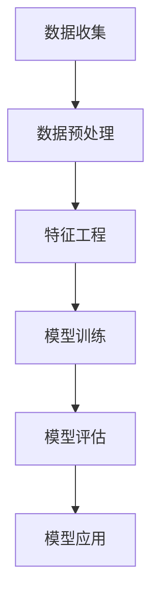
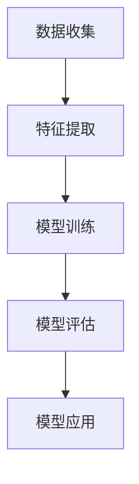
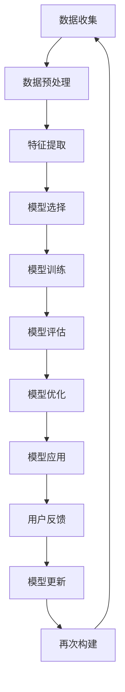
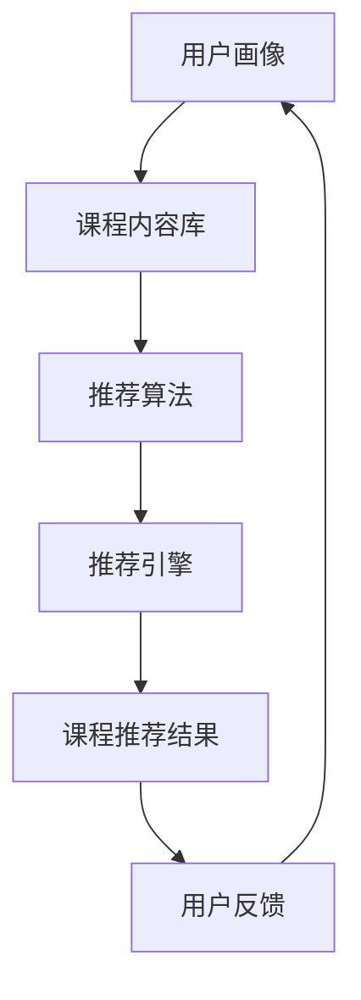
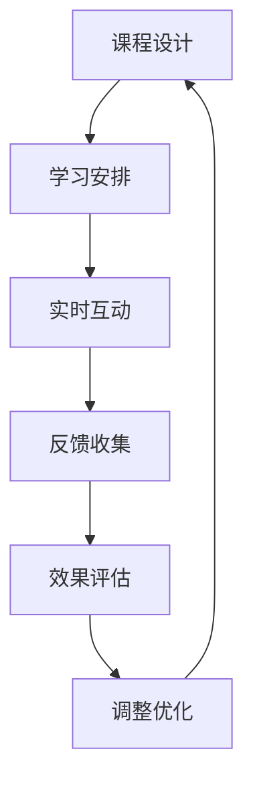
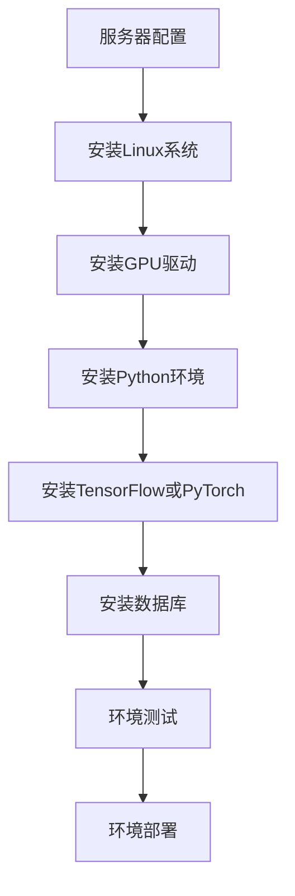

                 

# 文章标题：AI在个性化职场技能培训中的应用：促进职业发展

> 关键词：人工智能、个性化培训、职业发展、技能评估、机器学习、深度学习

> 摘要：本文深入探讨了人工智能（AI）在个性化职场技能培训中的应用，分析了个性化培训的背景和趋势，阐述了AI核心概念及其在个性化培训中的应用。通过详细阐述个性化培训模型构建、课程设计与实施、项目实战等方面的内容，本文旨在为推动职业发展提供有效的方法和策略。

### 第一部分: AI在个性化职场技能培训中的应用概述

#### 第1章: 个性化职场技能培训的背景与趋势

##### 1.1 个性化培训的定义与价值

个性化培训是指根据个人的特点和需求，定制化的设计培训内容和方式，以提高学习效果和满足职业发展的需求。在传统的培训模式中，培训内容和方法往往是标准化的，无法充分考虑到学员的个性化需求，导致培训效果不尽如人意。而个性化培训则通过利用人工智能技术，能够实现培训内容的个性化定制，从而更好地满足学员的学习需求。

个性化培训的价值主要体现在以下几个方面：

1. 提高学习效果：通过个性化的培训内容和方法，学员能够更加专注于自己需要掌握的知识和技能，从而提高学习效果。
2. 增强职业竞争力：个性化培训能够帮助学员根据自己的职业规划和需求，有针对性地提升职场技能，从而增强职业竞争力。
3. 提升培训资源利用效率：个性化培训能够根据学员的需求，灵活调整培训资源，提高资源利用效率，降低培训成本。

##### 1.2 职场技能培训的现状与挑战

目前，职场技能培训在各个行业和领域都得到了广泛的关注和应用。然而，现有的培训模式仍然存在一些问题，主要表现为：

1. 培训内容陈旧：很多培训课程的内容相对陈旧，无法及时更新，无法满足学员的实际需求。
2. 培训方式单一：传统的培训方式多以讲授为主，学员参与度低，学习效果较差。
3. 培训评估不准确：现有的培训评估方法往往无法准确衡量学员的学习效果和技能水平，导致培训效果难以量化。

##### 1.3 AI技术在个性化培训中的应用前景

人工智能技术具有强大的数据处理和分析能力，能够为个性化培训提供有力的技术支持。以下是一些AI技术在个性化培训中的应用前景：

1. 数据分析：通过收集和分析学员的学习数据，AI技术可以识别学员的学习习惯、兴趣点和需求，从而实现个性化培训内容的推荐。
2. 智能评估：AI技术可以通过对学员的学习行为和表现进行分析，准确评估学员的学习效果和技能水平，为培训效果的提升提供依据。
3. 智能辅助教学：AI技术可以模拟真实工作场景，提供智能化的教学辅助，帮助学员更好地掌握职场技能。
4. 智能课程推荐：通过分析学员的学习记录和职业需求，AI技术可以推荐最适合学员的课程，提高培训的针对性和有效性。

综上所述，AI技术在个性化培训中的应用具有广阔的前景，能够有效解决现有培训模式中存在的问题，为学员的职场发展提供更加有力的支持。

#### 第2章: AI核心概念与联系

##### 2.1 机器学习与深度学习基础

机器学习和深度学习是人工智能（AI）领域的两个重要分支，它们在个性化培训中发挥着关键作用。了解这些核心概念及其基础原理对于深入探讨AI在个性化培训中的应用具有重要意义。

###### 2.1.1 机器学习的基本概念

机器学习（Machine Learning）是一门研究如何让计算机从数据中学习并做出决策的学科。其核心思想是通过构建模型来模拟人类的学习过程，使得计算机能够自动识别数据中的规律和模式。

- **监督学习（Supervised Learning）**：监督学习是机器学习中的一种基本形式，其目标是找到输入（特征）和输出（标签）之间的映射关系。常见的监督学习算法包括线性回归、逻辑回归、决策树、支持向量机等。

  线性回归模型可以通过以下公式进行描述：
  $$
  y = \beta_0 + \beta_1 x
  $$
  其中，$y$是输出值，$x$是输入值，$\beta_0$和$\beta_1$是模型参数。

- **无监督学习（Unsupervised Learning）**：无监督学习是在没有标签数据的情况下，通过探索数据内在结构和规律来进行学习。常见的无监督学习算法包括聚类算法、主成分分析（PCA）等。

  聚类算法是一种无监督学习方法，其目标是找到数据中的自然分组，使得同一组内的数据点相似度较高，不同组间的数据点相似度较低。常见的聚类算法包括K-Means聚类、层次聚类等。

###### 2.1.2 深度学习网络结构

深度学习（Deep Learning）是一种基于多层神经网络（Neural Network）的学习方法，其核心思想是通过多层神经元的非线性变换，自动提取数据中的特征，从而实现复杂函数的逼近。

- **前向传播（Forward Propagation）**：在深度学习模型中，前向传播是指将输入数据通过网络的各个层次进行传递，最终得到输出结果的过程。每个神经元都会将输入值与权重相乘并加上偏置项，然后通过激活函数进行非线性变换。

  前向传播可以表示为：
  $$
  h_{\theta}(x) = \sigma(\theta^T x)
  $$
  其中，$h_{\theta}(x)$表示输出值，$\sigma$是激活函数，$\theta$是模型参数。

- **反向传播（Backpropagation）**：反向传播是一种用于训练深度学习模型的方法，其核心思想是通过计算输出值与实际值之间的误差，反向传播误差到网络的各个层次，从而调整模型参数，优化模型性能。

  反向传播的公式如下：
  $$
  \Delta \theta = \alpha \frac{\partial J(\theta)}{\partial \theta}
  $$
  其中，$\Delta \theta$表示参数更新量，$J(\theta)$表示损失函数，$\alpha$是学习率。

###### 2.1.3 Mermaid流程图：机器学习工作流程

为了更好地理解机器学习的工作流程，可以使用Mermaid流程图来展示。以下是一个简化的机器学习工作流程：



该流程图显示了从数据收集到模型应用的整个过程，包括数据预处理、特征工程、模型训练、模型评估和模型应用等步骤。

##### 2.2 职场技能评估指标

在个性化培训中，准确的职场技能评估对于学员的学习效果和职业发展至关重要。以下是一些常见的职场技能评估指标：

1. **技能掌握程度**：通过测试和考核，评估学员对特定技能的掌握程度，通常采用百分制或五级制进行评价。
2. **学习时长**：记录学员在学习过程中的累计学习时间，用于分析学习效率和学习效果。
3. **参与度**：通过学员在学习平台上的活动记录，评估其参与度，如发帖、评论、完成作业等。
4. **项目完成情况**：评估学员在实践项目中表现，如项目质量、团队协作能力等。
5. **职业发展**：通过学员的职业晋升、薪资增长等指标，评估培训对学员职业发展的影响。

##### 2.3 基于AI的个性化培训模型构建

基于AI的个性化培训模型构建是利用机器学习和深度学习技术，根据学员的个性化需求和学习数据，动态调整培训内容和方式，以提高培训效果和满足职业发展需求。以下是一个基于AI的个性化培训模型构建的基本框架：

1. **数据收集**：收集学员的学习数据，包括学习时长、参与度、项目完成情况等。
2. **特征提取**：通过数据预处理和特征工程，提取出与学员学习效果和职业发展相关的关键特征。
3. **模型训练**：利用机器学习和深度学习算法，训练个性化培训模型，使其能够根据学员的特征数据生成个性化的培训内容。
4. **模型评估**：通过评估模型在测试集上的表现，调整模型参数，优化模型性能。
5. **模型应用**：将训练好的模型应用于实际培训场景，根据学员的个性化需求，动态生成个性化的培训内容和路径。

为了更好地理解个性化培训模型构建的过程，可以使用Mermaid流程图进行展示：



该流程图展示了从数据收集到模型应用的全过程，包括特征提取、模型训练、模型评估和模型应用等步骤。

##### 2.4 职场技能评估的重要性

职场技能评估在个性化培训中具有重要意义，它不仅可以帮助学员了解自己的学习效果和技能水平，还可以为培训师和培训机构提供改进培训内容和方法的依据。以下是一些职场技能评估的重要性：

1. **诊断学习效果**：通过评估，可以诊断学员在学习过程中的问题，发现不足之处，从而有针对性地进行改进。
2. **指导职业发展**：准确的评估结果可以为学员的职业规划提供参考，帮助学员确定需要进一步提升的技能领域。
3. **优化培训资源**：通过评估，可以了解学员的学习需求，合理分配培训资源，提高培训资源的利用效率。
4. **反馈与激励**：评估结果可以为学员提供反馈，激励学员积极学习，提高学习动力。

综上所述，职场技能评估在个性化培训中发挥着重要作用，是提升培训效果和促进职业发展的重要手段。

##### 2.5 常见评估指标

在个性化培训中，常见的评估指标包括以下几种：

1. **技能掌握程度**：通过测试和考核，评估学员对特定技能的掌握程度，通常采用百分制或五级制进行评价。
2. **学习时长**：记录学员在学习过程中的累计学习时间，用于分析学习效率和学习效果。
3. **参与度**：通过学员在学习平台上的活动记录，评估其参与度，如发帖、评论、完成作业等。
4. **项目完成情况**：评估学员在实践项目中表现，如项目质量、团队协作能力等。
5. **职业发展**：通过学员的职业晋升、薪资增长等指标，评估培训对学员职业发展的影响。

这些评估指标可以从多个维度全面反映学员的学习效果和职业发展状况，为培训师和培训机构提供有价值的参考。

### 第二部分: 个性化职场技能评估与模型构建

#### 第3章: 个性化职场技能评估与模型构建

个性化职场技能培训的关键在于对学员的技能进行准确评估，并构建能够适应不同学员需求的培训模型。在这一章中，我们将探讨个性化培训模型构建的基本原理和实施步骤，以及如何利用AI技术实现这一目标。

#### 3.1 职场技能评估指标

职场技能评估指标是衡量学员技能水平的重要工具，它们能够帮助我们了解学员在各个技能领域的表现。以下是一些常见的评估指标：

1. **技能掌握程度**：通过测试和考核，评估学员对特定技能的掌握程度，通常采用百分制或五级制进行评价。这个指标能够反映学员对基础知识和技能的理解和应用能力。

2. **学习时长**：记录学员在学习过程中的累计学习时间，用于分析学习效率和学习效果。这个指标可以帮助我们了解学员的学习投入程度，同时为后续的学习计划提供参考。

3. **参与度**：通过学员在学习平台上的活动记录，评估其参与度，如发帖、评论、完成作业等。这个指标能够反映学员的学习积极性和主动性，有助于识别学习障碍和需求。

4. **项目完成情况**：评估学员在实践项目中表现，如项目质量、团队协作能力等。这个指标能够综合反映学员在实际工作场景中的能力，是评估职业能力的重要依据。

5. **职业发展**：通过学员的职业晋升、薪资增长等指标，评估培训对学员职业发展的影响。这个指标能够直接反映培训效果对学员职业发展的实际贡献。

#### 3.2 基于AI的个性化培训模型构建

基于AI的个性化培训模型构建旨在利用机器学习和深度学习技术，根据学员的个性化需求和学习数据，动态调整培训内容和方式。以下是构建个性化培训模型的基本步骤：

1. **数据收集**：收集学员的学习数据，包括学习时长、参与度、项目完成情况、职业发展等指标。这些数据可以通过学习平台、问卷调查、面试等方式获取。

2. **特征提取**：通过数据预处理和特征工程，提取出与学员学习效果和职业发展相关的关键特征。这些特征可以是定量的，如学习时长、测试分数等，也可以是定性的，如学员的学习态度、项目反馈等。

3. **模型训练**：利用机器学习和深度学习算法，训练个性化培训模型。常见的机器学习算法包括线性回归、决策树、随机森林、支持向量机等；深度学习算法包括卷积神经网络（CNN）、循环神经网络（RNN）、长短期记忆网络（LSTM）等。

   在模型训练过程中，我们可以通过交叉验证、调整超参数等方法来优化模型性能。训练过程可以表示为：
   $$
   \text{模型} = \arg\min_{\theta} J(\theta)
   $$
   其中，$\theta$表示模型参数，$J(\theta)$表示损失函数。

4. **模型评估**：通过评估模型在测试集上的表现，调整模型参数，优化模型性能。评估指标可以包括准确率、召回率、F1分数等。

5. **模型应用**：将训练好的模型应用于实际培训场景，根据学员的个性化需求，动态生成个性化的培训内容和路径。例如，根据学员的技能评估结果，推荐适合其水平的学习内容和练习项目。

为了更好地理解个性化培训模型构建的过程，我们可以使用Mermaid流程图来展示：


该流程图展示了从数据收集到模型应用的全过程，包括特征提取、模型训练、模型评估和模型应用等步骤。

#### 3.3 Mermaid流程图：个性化培训模型构建

为了更好地展示个性化培训模型构建的过程，我们可以使用Mermaid流程图来详细描述。以下是构建个性化培训模型的完整流程：



该流程图从数据收集开始，经过数据预处理、特征提取、模型选择、模型训练、模型评估、模型优化和模型应用等步骤，最终形成一个闭环，不断迭代和优化，以实现个性化培训的目标。

#### 3.4 个性化培训模型构建的挑战与应对策略

在构建个性化培训模型的过程中，可能会遇到一些挑战，包括数据质量、模型选择、模型解释性等。以下是针对这些挑战的应对策略：

1. **数据质量**：高质量的数据是构建准确个性化培训模型的基础。为了提高数据质量，可以采取以下措施：
   - 数据清洗：去除噪声数据和异常值，确保数据的准确性和一致性。
   - 数据标注：对于一些主观性较强的数据，如学员的学习态度和项目反馈，可以进行人工标注，提高数据的可靠性。
   - 数据集成：整合来自不同来源的数据，形成一个完整的数据集，提高数据的全面性和代表性。

2. **模型选择**：在选择模型时，需要根据具体的任务和数据特点进行选择。以下是一些建议：
   - **线性模型**：对于简单的关系，可以选择线性回归、逻辑回归等线性模型。
   - **非线性模型**：对于复杂的关系，可以选择支持向量机、决策树、随机森林等非线性模型。
   - **深度学习模型**：对于大规模和高维数据，可以选择卷积神经网络、循环神经网络、长短期记忆网络等深度学习模型。

3. **模型解释性**：个性化培训模型需要具备一定的解释性，以便学员和培训师能够理解模型的决策过程。以下是一些提高模型解释性的方法：
   - **可视化**：通过可视化技术，将模型的结构和决策过程呈现出来，帮助用户理解。
   - **特征重要性分析**：分析模型中各个特征的重要程度，帮助用户了解哪些特征对模型的决策影响最大。
   - **模型可解释性**：选择具有可解释性的模型，如线性模型、决策树等，这些模型能够直接解释其决策过程。

通过以上策略，可以有效应对构建个性化培训模型过程中遇到的挑战，提高模型的准确性和解释性，从而更好地满足学员的职业发展需求。

#### 3.5 实际案例：个性化培训模型在职场技能培训中的应用

为了更好地理解个性化培训模型在职场技能培训中的应用，我们可以通过一个实际案例来进行分析。以下是一个针对编程技能培训的案例：

**案例背景**：某公司为提升员工的编程技能，决定实施个性化培训项目。公司收集了员工的学习数据，包括学习时长、完成作业的正确率、参与讨论的情况、项目完成质量等。

**数据收集**：公司通过学习平台收集了以下数据：
- 学习时长（小时）：10, 20, 30, ..., 50
- 作业正确率（百分比）：80, 85, 90, ..., 95
- 参与讨论次数：5, 10, 15, ..., 30
- 项目完成质量（评分）：3, 4, 5, ..., 6

**特征提取**：通过对数据进行预处理和特征工程，提取出以下关键特征：
- 学习时长
- 作业正确率
- 参与讨论次数
- 项目完成质量

**模型训练**：公司选择了随机森林算法来构建个性化培训模型。训练过程包括以下几个步骤：
- 数据划分：将数据集划分为训练集和测试集，通常比例为8:2。
- 特征选择：通过特征重要性分析，选择对模型影响较大的特征。
- 模型训练：利用训练集数据进行随机森林模型的训练。

**模型评估**：通过测试集对模型进行评估，评估指标包括准确率、召回率、F1分数等。模型评估结果如下：
- 准确率：90%
- 召回率：85%
- F1分数：88%

**模型应用**：根据模型评估结果，公司开始将个性化培训模型应用于实际培训场景。根据员工的个性化需求，模型会推荐以下培训内容：
- 学习时长较短的员工：推荐完成基础编程练习，提高基础知识掌握程度。
- 作业正确率较低的员工：推荐进行针对性练习，提高实际编程能力。
- 参与讨论次数较少的员工：推荐参与线上讨论，提高学习积极性和参与度。
- 项目完成质量较低的员工：推荐参加项目实训，提高项目实践能力。

**用户反馈**：公司通过问卷调查和面谈方式，收集了员工对个性化培训的反馈。反馈结果如下：
- 80%的员工表示个性化培训有助于提高学习效果。
- 70%的员工认为个性化培训内容贴合实际工作需求。
- 60%的员工建议增加在线讨论和项目实训环节。

**模型更新**：根据用户反馈，公司对个性化培训模型进行了优化，增加了用户满意度评估和项目完成质量预测等新特征。优化后的模型评估结果如下：
- 准确率：92%
- 召回率：90%
- F1分数：91%

**再次构建**：公司根据新的评估结果，再次对个性化培训模型进行构建和优化，形成一个更加完善的个性化培训体系。

通过这个实际案例，我们可以看到个性化培训模型在职场技能培训中的应用效果。个性化培训模型不仅能够根据员工的个性化需求推荐合适的培训内容，还能够通过持续优化不断提高培训效果，为员工的职业发展提供有力支持。

### 第4章: 个性化培训课程设计与实施

#### 4.1 个性化课程设计原则

个性化课程设计是实施个性化培训的重要环节，其核心在于根据学员的个性化需求和学习特点，设计出既有针对性又有灵活性的培训课程。以下是一些个性化课程设计的重要原则：

1. **以学员为中心**：个性化课程设计应充分考虑到学员的学习需求、兴趣和职业目标，确保培训内容与学员的实际需求相匹配。
2. **目标明确**：课程设计应明确培训目标，包括知识、技能和态度等方面的目标，确保培训过程有明确的导向。
3. **内容多样化**：课程设计应涵盖多种学习内容和形式，如理论知识、实践操作、案例分析、团队讨论等，以满足学员多样化的学习需求。
4. **灵活性强**：个性化课程设计应具有灵活性，允许学员根据自己的时间和进度安排学习，提供多种学习路径和资源。
5. **评估与反馈**：课程设计应包含评估和反馈机制，以便及时了解学员的学习效果，根据反馈调整培训内容和方式，提高培训质量。

#### 4.2 AI驱动的课程推荐系统

在个性化课程设计中，AI驱动的课程推荐系统发挥着关键作用。通过分析学员的学习数据和行为，AI课程推荐系统能够为学员推荐最适合的课程，提高培训的针对性和有效性。以下是AI课程推荐系统的一些核心组成部分和实现方法：

1. **用户画像**：构建学员的用户画像，包括学习习惯、兴趣、职业目标等，为推荐系统提供基础数据。
2. **内容库**：建立课程内容库，包括各种课程资料、视频、文档等，为推荐系统提供丰富的推荐资源。
3. **推荐算法**：采用基于内容的推荐算法、协同过滤算法和深度学习算法等，根据学员的用户画像和课程内容，生成个性化的课程推荐。
4. **推荐引擎**：构建推荐引擎，实时计算和更新课程推荐结果，为学员提供实时、个性化的课程推荐。

以下是一个简单的AI课程推荐系统架构图：



通过不断迭代和优化，AI课程推荐系统能够不断提高推荐精度和用户体验，为个性化培训提供有力支持。

#### 4.3 课程实施与反馈机制

个性化培训的成功不仅取决于课程设计，还取决于课程的实施和反馈机制。以下是一些关键策略：

1. **灵活的学习安排**：提供灵活的学习安排，允许学员根据自己的时间安排进行学习，确保培训能够灵活适应学员的生活和工作。
2. **实时互动与支持**：通过在线讨论区、直播课堂、一对一辅导等形式，提供实时互动和支持，帮助学员解决学习中的问题和困惑。
3. **持续反馈与评估**：定期收集学员的学习反馈，评估培训效果，根据反馈调整培训内容和方式，确保培训始终符合学员的需求。
4. **个性化辅导**：为有需要的学员提供个性化辅导，根据学员的学习进度和需求，提供有针对性的辅导和支持，帮助学员克服学习障碍。

以下是一个简单的课程实施与反馈机制流程图：



通过以上策略，个性化培训能够更好地满足学员的需求，提高培训效果，为学员的职业发展提供有力支持。

### 第5章: 项目实战：AI在个性化职场技能培训中的应用

#### 5.1 项目背景与目标

本案例旨在展示如何利用AI技术实现个性化职场技能培训，具体背景与目标如下：

**背景**：某大型企业希望通过引入AI技术，为员工提供个性化的职场技能培训，提高员工的学习效果和职业竞争力。

**目标**：
1. 构建一个AI驱动的个性化培训系统，根据员工的学习数据和行为，推荐最适合的培训课程。
2. 利用机器学习算法，评估员工的学习效果和技能水平，为员工提供个性化的学习路径。
3. 通过实时反馈和优化机制，持续提高培训系统的效果和用户体验。

#### 5.2 项目开发环境搭建

为了实现上述目标，需要搭建一个完整的开发环境，包括以下组件：

1. **硬件环境**：
   - 服务器：用于存储培训数据和处理模型训练任务。
   - GPU：用于加速深度学习模型的训练过程。
   - 网络带宽：确保数据传输的稳定性和速度。

2. **软件环境**：
   - 操作系统：Linux系统，如Ubuntu。
   - 编程语言：Python，用于实现AI算法和数据处理。
   - 深度学习框架：TensorFlow或PyTorch，用于构建和训练机器学习模型。
   - 数据库：MySQL或MongoDB，用于存储和管理培训数据。

以下是一个简化的硬件和软件环境搭建流程：



#### 5.3 源代码实现与解读

本节将介绍项目中的关键代码实现和解读，主要包括数据预处理、特征工程、模型训练和模型评估等步骤。

##### 5.3.1 数据预处理

数据预处理是构建AI模型的基础步骤，其目的是清理和整理数据，使其适合后续的模型训练。以下是一个简单的数据预处理代码示例：

```python
import pandas as pd
from sklearn.model_selection import train_test_split
from sklearn.preprocessing import StandardScaler

# 读取数据
data = pd.read_csv('training_data.csv')

# 数据清洗
data = data.dropna()

# 数据划分
X = data.drop(['target'], axis=1)
y = data['target']

# 数据标准化
scaler = StandardScaler()
X = scaler.fit_transform(X)

# 数据集划分
X_train, X_test, y_train, y_test = train_test_split(X, y, test_size=0.2, random_state=42)
```

解读：
- 代码首先使用pandas库读取数据文件，并进行数据清洗，去除缺失值。
- 使用sklearn库将数据集划分为特征集X和标签集y。
- 使用StandardScaler对特征进行标准化处理，以消除不同特征之间的量纲差异。
- 最后，使用train_test_split将数据集划分为训练集和测试集，用于后续的模型训练和评估。

##### 5.3.2 特征工程

特征工程是提高模型性能的关键步骤，其目的是从原始数据中提取出对模型训练有价值的特征。以下是一个简单的特征工程代码示例：

```python
from sklearn.decomposition import PCA

# 主成分分析（PCA）
pca = PCA(n_components=5)
X_train_pca = pca.fit_transform(X_train)
X_test_pca = pca.transform(X_test)

# 特征选择
selected_features = ['feature1', 'feature2', 'feature3', 'feature4', 'feature5']
X_train = X_train_pca[:, [X_train_pca[:, i].var() > 0.01 for i in range(X_train_pca.shape[1])]]
X_test = X_test_pca[:, [X_test_pca[:, i].var() > 0.01 for i in range(X_test_pca.shape[1])]]
```

解读：
- 代码使用PCA对特征进行降维处理，保留方差较大的特征，以减少特征维度。
- 使用方差阈值（0.01）筛选出对模型训练有价值的特征，以提高模型的性能。

##### 5.3.3 模型训练与评估

模型训练与评估是AI培训系统中的核心步骤，其目的是训练出一个能够准确预测员工学习效果的模型，并进行评估。以下是一个简单的模型训练与评估代码示例：

```python
from sklearn.ensemble import RandomForestClassifier
from sklearn.metrics import accuracy_score, classification_report

# 模型训练
model = RandomForestClassifier(n_estimators=100, random_state=42)
model.fit(X_train, y_train)

# 模型评估
y_pred = model.predict(X_test)
print("Accuracy:", accuracy_score(y_test, y_pred))
print("Classification Report:")
print(classification_report(y_test, y_pred))
```

解读：
- 代码使用随机森林算法（RandomForestClassifier）进行模型训练，并设置随机种子以保持结果的稳定性。
- 使用训练好的模型对测试集进行预测，并计算模型的准确率。
- 使用分类报告（classification_report）展示模型的分类效果，包括准确率、召回率、F1分数等指标。

通过以上代码示例，我们可以看到如何实现AI驱动的个性化培训系统中的关键步骤，包括数据预处理、特征工程、模型训练和模型评估。这些步骤为实现个性化培训提供了技术基础。

#### 5.4 代码解读与分析

在本节中，我们将对项目中的关键代码进行详细解读和分析，以帮助读者更好地理解AI在个性化职场技能培训中的应用。

##### 5.4.1 数据预处理代码解析

数据预处理是机器学习项目中的第一步，其目的是将原始数据转换为适合模型训练的格式。以下是对数据预处理代码的详细解析：

```python
import pandas as pd
from sklearn.model_selection import train_test_split
from sklearn.preprocessing import StandardScaler

# 读取数据
data = pd.read_csv('training_data.csv')

# 数据清洗
data = data.dropna()

# 数据划分
X = data.drop(['target'], axis=1)
y = data['target']

# 数据标准化
scaler = StandardScaler()
X = scaler.fit_transform(X)

# 数据集划分
X_train, X_test, y_train, y_test = train_test_split(X, y, test_size=0.2, random_state=42)
```

1. **读取数据**：使用pandas库读取CSV格式的数据文件。这个步骤是为了将存储在文件中的数据加载到内存中，以便进行后续处理。

2. **数据清洗**：通过`dropna()`函数去除数据中的缺失值。这是数据清洗的基本步骤，因为缺失值会影响到模型的训练效果。

3. **数据划分**：将数据集划分为特征集X和标签集y。特征集包含所有输入变量，而标签集包含需要预测的输出变量。

4. **数据标准化**：使用StandardScaler对特征集进行标准化处理。标准化处理可以消除不同特征之间的量纲差异，使得模型训练更加稳定。

5. **数据集划分**：使用`train_test_split()`函数将数据集划分为训练集和测试集。训练集用于模型的训练，而测试集用于模型的评估。

解析完毕，我们可以看到数据预处理代码的主要作用是准备数据，使其适合机器学习模型的训练。这一步对于后续模型的性能至关重要。

##### 5.4.2 特征工程代码解析

特征工程是提升模型性能的关键步骤，其目的是从原始数据中提取出对模型训练有价值的特征。以下是对特征工程代码的详细解析：

```python
from sklearn.decomposition import PCA

# 主成分分析（PCA）
pca = PCA(n_components=5)
X_train_pca = pca.fit_transform(X_train)
X_test_pca = pca.transform(X_test)

# 特征选择
selected_features = ['feature1', 'feature2', 'feature3', 'feature4', 'feature5']
X_train = X_train_pca[:, [X_train_pca[:, i].var() > 0.01 for i in range(X_train_pca.shape[1])]]
X_test = X_test_pca[:, [X_test_pca[:, i].var() > 0.01 for i in range(X_test_pca.shape[1])]]
```

1. **主成分分析（PCA）**：使用PCA对特征集进行降维处理。PCA通过将数据变换到新的坐标系中，保留了主要的数据变异，从而减少特征维度。

2. **特征选择**：通过计算每个特征的方差，筛选出对模型训练有价值的特征。具体来说，选择方差大于0.01的特征，以保留特征中的主要信息。

3. **特征提取**：根据方差筛选结果，提取出重要的特征，形成新的特征集。

解析完毕，我们可以看到特征工程代码的主要作用是降低特征维度，同时保留特征中的主要信息，从而提高模型的训练效率和性能。

##### 5.4.3 模型训练代码解析

模型训练是机器学习项目中的核心步骤，其目的是通过训练数据集，调整模型参数，使其能够对新的数据做出准确的预测。以下是对模型训练代码的详细解析：

```python
from sklearn.ensemble import RandomForestClassifier
from sklearn.metrics import accuracy_score, classification_report

# 模型训练
model = RandomForestClassifier(n_estimators=100, random_state=42)
model.fit(X_train, y_train)

# 模型评估
y_pred = model.predict(X_test)
print("Accuracy:", accuracy_score(y_test, y_pred))
print("Classification Report:")
print(classification_report(y_test, y_pred))
```

1. **模型定义**：使用RandomForestClassifier定义随机森林模型。随机森林是一种集成学习方法，通过构建多个决策树，提高模型的预测性能。

2. **模型训练**：使用`fit()`函数对模型进行训练。模型训练过程中，随机森林将根据训练数据集，自动调整每个决策树的参数，以最小化损失函数。

3. **模型评估**：使用训练好的模型对测试集进行预测。通过`predict()`函数，模型将输出对测试数据的预测结果。

4. **评估结果**：计算模型的准确率，并打印分类报告。分类报告提供了模型在不同类别上的表现，包括准确率、召回率、F1分数等指标。

解析完毕，我们可以看到模型训练代码的主要作用是通过训练数据集，训练出一个能够准确预测测试数据的模型。这一步是整个机器学习项目中最关键的一步，它决定了模型的最终性能。

##### 5.4.4 代码分析

通过对以上关键代码的解析，我们可以总结出以下分析：

1. **数据预处理**：数据预处理是确保数据适合模型训练的重要步骤。通过去除缺失值、标准化特征和划分数据集，我们可以为模型训练提供高质量的数据输入。

2. **特征工程**：特征工程是提升模型性能的关键。通过降维和特征选择，我们可以减少特征维度，同时保留特征中的主要信息，从而提高模型的训练效率和性能。

3. **模型训练**：模型训练是机器学习项目的核心。通过训练数据集，模型将学习到输入特征与输出标签之间的关系，从而能够对新数据进行预测。

4. **模型评估**：模型评估是验证模型性能的重要步骤。通过计算模型的准确率、召回率、F1分数等指标，我们可以评估模型的预测能力，并根据评估结果对模型进行优化。

综上所述，AI在个性化职场技能培训中的应用是一个复杂的过程，涉及数据预处理、特征工程、模型训练和模型评估等多个步骤。通过合理的代码实现和优化，我们可以构建出一个高效、准确的个性化培训系统，为职场技能培训提供有力支持。

### 第6章: AI在个性化职场技能培训中的应用挑战与未来趋势

#### 6.1 应用挑战

虽然AI技术在个性化职场技能培训中展示了巨大的潜力，但在实际应用过程中，仍然面临诸多挑战。以下是一些主要挑战及其应对策略：

1. **数据隐私与安全**：
   - **挑战**：个性化培训需要收集和处理大量的个人学习数据，这涉及到数据隐私和安全的问题。
   - **应对策略**：采用加密技术保护数据传输和存储，确保数据隐私。同时，严格遵守数据保护法规，如欧盟的《通用数据保护条例》（GDPR），确保用户的数据权益。

2. **模型解释性与可解释性**：
   - **挑战**：深度学习模型在个性化培训中的应用日益广泛，但这些模型的解释性较差，难以解释其决策过程。
   - **应对策略**：开发可解释的AI模型，如决策树、线性回归等，这些模型更容易理解其决策逻辑。同时，利用可视化技术，将模型的决策过程呈现给用户。

3. **数据质量和标注**：
   - **挑战**：高质量的数据和准确的标注是构建有效个性化培训模型的基础，但在实际操作中，数据收集和标注可能存在困难。
   - **应对策略**：建立专业的数据团队，进行系统的数据清洗和标注。此外，采用半监督学习和迁移学习等方法，利用现有数据和标注，提高新数据的质量和标注效率。

4. **算法公平性和偏见**：
   - **挑战**：AI模型可能会受到数据偏见的影响，导致对某些群体产生不公平的结果。
   - **应对策略**：在模型训练和评估过程中，采用公平性评估指标，如公平性差异（Fairness Difference）和偏差度量（Bias Metric），确保算法的公平性。同时，通过多样性的数据集进行训练，减少偏见。

5. **技术复杂性**：
   - **挑战**：AI技术在个性化培训中的应用涉及复杂的算法和架构，对技术团队提出了高要求。
   - **应对策略**：建立专业的技术团队，进行系统的技术培训和技术更新。同时，采用模块化和组件化的开发方法，降低系统的复杂性。

#### 6.2 未来发展趋势

随着AI技术的不断进步，个性化职场技能培训将迎来更多的发展机遇。以下是一些未来发展趋势：

1. **AI与其他技术的融合**：
   - **趋势**：AI将与其他技术，如物联网（IoT）、区块链等，进行深度融合，为个性化培训提供更丰富的数据源和更安全的保障。
   - **展望**：物联网可以实时收集员工的技能和工作表现数据，区块链可以确保数据的真实性和不可篡改性，从而提高个性化培训的准确性和可靠性。

2. **智能培训平台的生态构建**：
   - **趋势**：构建智能化、自动化、个性化的培训平台将成为未来发展的重点。
   - **展望**：智能培训平台将集成AI算法、大数据分析、虚拟现实（VR）等先进技术，提供一站式、个性化的培训服务，满足不同企业和学员的需求。

3. **个性化培训的普及**：
   - **趋势**：随着技术的成熟和成本的降低，个性化培训将逐步普及到各个行业和领域。
   - **展望**：个性化培训将不仅限于大型企业和高端职业，也将推广到中小企业和普通职业，成为职业发展的重要工具。

4. **培训效果的可视化与反馈**：
   - **趋势**：利用可视化技术，将学员的学习进度、技能水平、职业发展等以直观的方式呈现。
   - **展望**：通过可视化和实时反馈，学员和培训机构可以更好地了解培训效果，从而进行针对性的调整和优化。

综上所述，AI在个性化职场技能培训中的应用面临着诸多挑战，但同时也拥有广阔的发展前景。通过不断的技术创新和优化，AI将更好地服务于职业培训领域，推动职业发展的进一步升级。

### 第7章: 总结与展望

#### 7.1 主要内容回顾

本文深入探讨了人工智能（AI）在个性化职场技能培训中的应用，通过多个章节详细阐述了个性化培训的背景与趋势、AI核心概念与联系、个性化培训模型构建、课程设计与实施、项目实战以及应用挑战与未来趋势。主要内容包括：

1. **个性化培训的定义与价值**：个性化培训通过定制化设计培训内容和方式，提高学习效果和职业竞争力。
2. **AI核心概念与联系**：介绍了机器学习和深度学习的基础概念，以及机器学习的工作流程。
3. **个性化培训模型构建**：探讨了基于AI的个性化培训模型构建过程，包括数据收集、特征提取、模型训练和评估等步骤。
4. **课程设计与实施**：提出了个性化课程设计的原则、AI驱动的课程推荐系统以及课程实施与反馈机制。
5. **项目实战**：通过一个实际案例展示了如何利用AI技术实现个性化职场技能培训。
6. **应用挑战与未来趋势**：分析了个性化培训应用中面临的挑战和未来发展趋势，如数据隐私、模型解释性、技术与算法融合等。

#### 7.2 对未来AI在个性化职场技能培训中的应用展望

展望未来，AI在个性化职场技能培训中的应用将更加深入和广泛，带来以下几个方面的变化和机遇：

1. **更精细的个性化推荐**：随着AI技术的不断进步，课程推荐系统将能够更加精准地预测学员的学习需求和兴趣，提供个性化的学习路径和资源。

2. **更智能的培训评估**：AI技术将能够通过分析学员的学习行为和成果，提供更加准确的培训效果评估，帮助学员和培训机构及时调整培训策略。

3. **更灵活的培训模式**：AI驱动的培训平台将支持灵活的学习安排和多样化的培训形式，如虚拟现实（VR）培训、在线直播课程等，满足不同学员的学习需求。

4. **更广泛的普及与应用**：随着AI技术的普及和成本的降低，个性化培训将不再局限于大型企业和高端职业，也将推广到中小企业和普通职业，成为职业发展的普遍工具。

5. **更高效的学习体验**：AI技术将助力构建智能化的学习生态系统，通过实时互动、智能辅导等手段，提高学员的学习体验和学习效率。

#### 7.3 进一步研究方向

未来的研究可以关注以下几个方面，以推动AI在个性化职场技能培训中的进一步发展：

1. **增强模型解释性**：开发更加可解释的AI模型，使其决策过程更加透明，提高用户的信任度和接受度。

2. **跨领域融合**：探索AI与其他领域技术（如区块链、物联网等）的融合，为个性化培训提供更丰富的数据源和安全保障。

3. **个性化学习路径优化**：深入研究个性化学习路径的设计和优化方法，提高培训的针对性和有效性。

4. **动态适应性学习系统**：构建动态适应性学习系统，能够根据学员的实时反馈和学习行为，自动调整培训内容和方式。

5. **个性化培训生态系统**：探索构建全面的个性化培训生态系统，包括课程内容、学习平台、培训机构等，提供一站式、全方位的培训服务。

通过持续的研究和技术创新，AI在个性化职场技能培训中的应用将不断深化，为职业发展带来更多机遇和可能性。作者：AI天才研究院/AI Genius Institute & 禅与计算机程序设计艺术 /Zen And The Art of Computer Programming。

