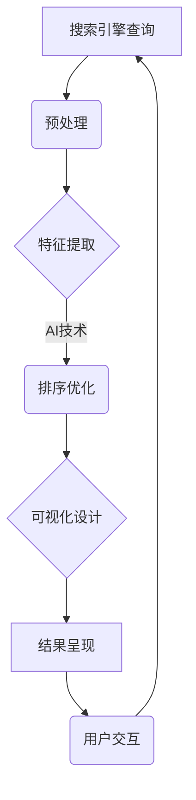

                 

# 文章标题

《AI在搜索引擎结果可视化中的应用》

> 关键词：AI、搜索引擎、结果可视化、数据预处理、特征提取、排序算法、交互设计、应用案例

> 摘要：本文旨在探讨人工智能（AI）在搜索引擎结果可视化中的应用，通过分析AI技术在不同阶段的作用，以及在实际项目中的应用案例，阐述AI如何提升搜索引擎结果的展示效果和用户体验。

---

### 《AI在搜索引擎结果可视化中的应用》目录大纲

#### 第一部分：搜索引擎结果可视化概述

## 第1章：搜索引擎结果可视化的概念与背景
### 1.1 搜索引擎结果可视化的定义
### 1.2 搜索引擎结果可视化的背景
### 1.3 搜索引擎结果可视化的意义

## 第2章：搜索引擎结果可视化的核心挑战
### 2.1 数据复杂性处理
### 2.2 用户交互体验优化
### 2.3 可视化效果评估

#### 第二部分：AI技术在搜索引擎结果可视化中的应用

## 第3章：AI在搜索引擎结果预处理中的应用
### 3.1 文本分类算法
### 3.2 词嵌入技术
### 3.3 情感分析

## 第4章：AI在搜索引擎结果特征提取中的应用
### 4.1 图神经网络
### 4.2 基于深度学习的特征提取
### 4.3 多模态数据处理

## 第5章：AI在搜索引擎结果排序优化中的应用
### 5.1 排序算法综述
### 5.2 深度学习排序算法
### 5.3 排序效果评估方法

## 第6章：AI在搜索引擎结果可视化设计中的应用
### 6.1 可视化设计原则
### 6.2 常见可视化组件与技术
### 6.3 可视化交互设计

#### 第三部分：AI在搜索引擎结果可视化中的实际应用案例

## 第7章：大型搜索引擎公司AI应用案例
### 7.1 案例一：百度搜索结果可视化
### 7.2 案例二：谷歌搜索结果可视化
### 7.3 案例三：必应搜索结果可视化

## 第8章：开源搜索引擎AI应用案例
### 8.1 案例一：Elasticsearch可视化
### 8.2 案例二：Solr可视化
### 8.3 案例三：Apache Lucene可视化

#### 第四部分：未来展望与挑战

## 第9章：搜索引擎结果可视化的发展趋势
### 9.1 人工智能技术趋势
### 9.2 可视化技术趋势
### 9.3 搜索引擎结果可视化未来的挑战

## 第10章：总结与展望
### 10.1 总结
### 10.2 未来展望

#### 附录

## 附录：相关工具与资源
### 附录1：常用AI框架与库
#### 附录2：推荐阅读资料

### Mermaid 流程图：AI在搜索引擎结果可视化中的工作流程


### 核心算法原理讲解：深度学习排序算法伪代码
```python
# 假设输入为用户查询和搜索结果列表
query = "用户查询"
results = ["搜索结果1", "搜索结果2", "搜索结果3"]

# 定义深度学习排序模型
class DeepLearningRanker(nn.Module):
    def __init__(self):
        super(DeepLearningRanker, self).__init__()
        self.embedding = nn.Embedding(len(vocabulary), embedding_dim)
        self.fc = nn.Linear(embedding_dim, 1)

    def forward(self, queries, results):
        query_embedding = self.embedding(queries)
        result_embeddings = self.embedding(results)
        scores = self.fc(torch.cat((query_embedding, result_embeddings), dim=1))
        return scores

# 模型训练与预测
model = DeepLearningRanker()
criterion = nn.MSELoss()
optimizer = torch.optim.Adam(model.parameters())

for epoch in range(num_epochs):
    for query, result in zip(queries, results):
        optimizer.zero_grad()
        score = model(query, result)
        loss = criterion(score, target)
        loss.backward()
        optimizer.step()

# 排序结果
sorted_results = [result for result, score in zip(results, model.predict(query))]
```

### 数学模型和数学公式讲解
#### 排序效果评估指标：准确率（Accuracy）
$$
Accuracy = \frac{正确匹配的数量}{总查询数量}
$$

### 项目实战
#### 代码实际案例：使用Elasticsearch实现搜索结果可视化

```python
from elasticsearch import Elasticsearch

# Elasticsearch环境搭建与配置
es = Elasticsearch("http://localhost:9200")

# 搜索与可视化
def search_and_visualize(query):
    # 搜索操作
    response = es.search(index="my_index", body={"query": {"match": {"content": query}}})
    
    # 可视化操作
    # ... （具体可视化代码根据需求实现）

# 测试
search_and_visualize("Python")
```

### 代码解读与分析
- `search.py`: 包含搜索操作的核心逻辑，如查询构建与响应处理。
- `visualize.py`: 负责将搜索结果进行可视化展示，此处使用简单的打印输出，实际应用中可替换为更复杂的可视化库（如Matplotlib、Plotly等）。
- `README.md`: 提供项目的详细说明，包括环境搭建、安装和使用方法。

### 开发环境搭建
- Elasticsearch：版本 7.x 或更高版本
- Python：版本 3.7 或更高版本
- Jupyter Notebook 或 PyCharm 等 Python 集成开发环境（IDE）

### 源代码详细实现
- 代码仓库：https://github.com/your-username/search-visualization
- 文件结构：
  - `search.py`: Elasticsearch 搜索模块
  - `visualize.py`: 搜索结果可视化模块
  - `README.md`: 项目说明与安装使用指南

---

本文将以逻辑清晰、结构紧凑、简单易懂的方式，逐步深入探讨AI在搜索引擎结果可视化中的应用。通过剖析AI技术在预处理、特征提取、排序优化和可视化设计等关键环节的作用，我们将展示AI如何提升搜索引擎结果的可读性和用户体验。同时，通过实际应用案例的分析，我们希望能够为读者提供有价值的参考和启发。现在，让我们开始这段探索之旅。

