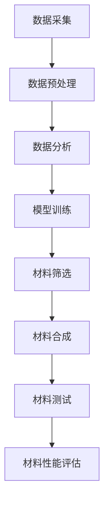

                 

# 文章标题: AI在新材料设计中的应用：加速创新过程

关键词：AI，新材料设计，机器学习，深度学习，创新过程，数据科学

摘要：本文深入探讨了人工智能（AI）在新材料设计中的应用，揭示了如何通过AI技术加速创新过程。文章首先介绍了AI在新材料设计中的基本概念，包括新材料设计的挑战和AI在新材料设计中的核心角色。接着，文章详细介绍了AI相关的基础概念和前沿技术，如机器学习和深度学习，以及强化学习、生成对抗网络和自然语言处理等。随后，文章讨论了AI在新材料设计中的应用与实践，包括数据处理与分析、算法应用、应用案例和工具平台。文章还展望了AI在新材料设计中的前景与挑战，并提供了实践经验和案例分析。最后，文章总结了AI在新材料设计中的应用，并展望了未来的发展方向。

# 第一部分: AI在新材料设计中的基本概念

## 1.1 AI在新材料设计中的应用概述

新材料设计是现代科技发展的关键领域，它涉及开发具有独特性能和特性的材料，以满足各种应用需求。然而，新材料设计面临着一系列挑战，如材料性能的预测、材料合成过程的优化以及材料筛选的效率等。

AI作为一种强大的工具，已经在许多领域取得了显著的应用成果。将AI引入新材料设计领域，可以显著提高创新效率和材料性能。AI在新材料设计中的应用主要包括以下几个方面：

1. **材料性能预测**：通过机器学习和深度学习算法，可以对材料性能进行预测，从而减少实验次数，加速材料研发过程。
2. **材料合成优化**：AI可以帮助优化材料合成过程，提高合成效率和材料质量。
3. **材料筛选**：利用AI进行高效的材料筛选，能够快速识别出具有潜在应用价值的材料。
4. **数据分析和可视化**：AI可以对实验数据进行分析和可视化，帮助研究人员更好地理解材料性能与合成条件之间的关系。

## 1.2 新材料设计的挑战

新材料设计面临着诸多挑战，以下是其中几个主要的挑战：

1. **材料性能预测的困难**：传统方法难以准确预测材料性能，需要大量的实验和测试。
2. **合成过程的复杂性**：材料合成过程通常涉及多种化学反应和条件，难以控制。
3. **材料筛选的效率**：传统材料筛选方法耗时耗力，难以快速识别出具有潜在应用价值的材料。
4. **实验成本**：新材料设计需要大量的实验和测试，成本较高。
5. **数据管理和分析**：新材料设计过程中产生的数据量庞大，需要有效的数据管理和分析方法。

## 1.3 AI如何助力新材料设计

AI技术在解决新材料设计面临的挑战方面具有显著优势：

1. **预测材料性能**：通过机器学习和深度学习算法，可以准确预测材料性能，减少实验次数，提高研发效率。
2. **优化合成过程**：AI可以帮助优化材料合成过程，提高合成效率和材料质量。
3. **高效材料筛选**：利用AI进行高效的材料筛选，能够快速识别出具有潜在应用价值的材料。
4. **数据分析与可视化**：AI可以对实验数据进行分析和可视化，帮助研究人员更好地理解材料性能与合成条件之间的关系。

## 1.4 AI在新材料设计中的核心角色

AI在新材料设计中的核心角色主要体现在以下几个方面：

1. **数据驱动的材料设计**：AI可以将大量的实验数据转化为有价值的知识，指导材料设计。
2. **自动化与优化**：AI可以帮助自动化和优化材料合成过程，提高生产效率和材料质量。
3. **智能材料筛选**：AI可以进行高效的材料筛选，减少时间和成本，提高研发效率。
4. **创新材料性能预测**：AI可以预测新材料性能，为材料研发提供有力的支持。

## 1.5 AI相关基础概念

为了更好地理解AI在新材料设计中的应用，我们需要了解一些AI相关的基础概念：

1. **机器学习**：机器学习是一种让计算机从数据中学习和改进自身性能的方法。在新材料设计领域，机器学习算法可以用于预测材料性能、优化合成过程等。
2. **深度学习**：深度学习是一种基于多层神经网络的学习方法。它可以在大量的数据中学习到复杂的模式和特征，适用于图像识别、语音识别等领域。
3. **数据科学**：数据科学是关于数据收集、处理、分析和解释的学科。在新材料设计领域，数据科学可以帮助研究人员更好地理解实验数据，指导材料设计。
4. **数据分析**：数据分析是数据科学的一个重要组成部分，它涉及使用统计方法和工具来分析数据，提取有价值的信息。

## 1.6 AI在新材料设计中的应用案例

AI在新材料设计中的应用已经取得了一些显著成果，以下是几个典型的应用案例：

1. **高性能材料预测**：利用机器学习和深度学习算法，可以预测高性能材料的性能，如超导材料、纳米材料等。
2. **材料合成优化**：AI可以帮助优化材料合成过程，提高合成效率和材料质量。例如，通过优化合成条件，可以制备出具有更高强度和韧性的复合材料。
3. **材料筛选**：利用AI进行高效的材料筛选，能够快速识别出具有潜在应用价值的材料，如用于电子设备、新能源等领域的新型材料。

## 1.7 AI在新材料设计中的前沿技术

随着AI技术的不断发展，越来越多的前沿技术被应用于新材料设计领域。以下是几个值得关注的技术：

1. **强化学习**：强化学习是一种通过试错和反馈来优化决策过程的方法。它可以用于优化材料合成过程，提高材料性能。
2. **生成对抗网络（GAN）**：GAN是一种生成模型，它通过对抗训练来生成高质量的数据，可以用于新材料设计中的数据增强和材料结构预测。
3. **自然语言处理**：自然语言处理技术可以用于处理和分析与材料设计相关的文本数据，如文献、专利等，帮助研究人员更好地理解材料性质和合成方法。

# 第二部分: AI在新材料设计中的应用与实践

## 2.1 新材料设计中的数据处理与分析

新材料设计过程中会产生大量的实验数据，这些数据对于理解材料性能、优化合成过程至关重要。然而，如何有效地处理和分析这些数据，一直是研究人员面临的重要挑战。AI技术，特别是机器学习和数据科学方法，为这一问题的解决提供了有力的支持。

### 2.1.1 数据采集与预处理

在新材料设计过程中，数据采集是第一步。数据来源可以是实验数据、文献数据、专利数据等。在采集数据时，需要确保数据的准确性和完整性。以下是一个简单的数据采集流程：

1. **实验数据采集**：通过实验设备（如X射线衍射仪、扫描电子显微镜等）收集材料性能数据。
2. **文献数据采集**：通过在线数据库（如Web of Science、PubMed等）检索相关文献，获取材料合成方法和性能数据。
3. **专利数据采集**：通过专利数据库（如美国专利与商标局、欧洲专利局等）检索相关专利，了解新材料的设计和合成技术。

在数据采集完成后，需要对数据进行预处理，以提高数据的质量和可用性。预处理步骤包括：

1. **数据清洗**：去除数据中的噪声和错误，如缺失值、异常值等。
2. **数据转换**：将不同来源的数据转换为统一的格式，如CSV、JSON等。
3. **数据标准化**：将不同量纲的数据转换为相同的量纲，便于分析和比较。

### 2.1.2 数据分析与可视化

在预处理完数据后，需要进行数据分析，以提取有用的信息。数据分析方法包括：

1. **统计分析**：使用统计方法（如描述性统计、回归分析等）来分析数据，提取数据特征和趋势。
2. **聚类分析**：使用聚类算法（如K-means、层次聚类等）将数据分组，以发现数据中的模式和关系。
3. **关联分析**：使用关联规则算法（如Apriori算法、FP-growth算法等）来分析数据中的关联关系。

数据分析的结果需要进行可视化，以帮助研究人员更好地理解数据。可视化方法包括：

1. **散点图**：用于展示数据点之间的关系和分布。
2. **折线图**：用于展示数据的变化趋势。
3. **柱状图**：用于展示数据的比较和分布。

### 2.1.3 数据库与数据管理

为了有效地管理和利用数据，需要建立数据库和数据管理系统。以下是一个简单的数据库设计：

1. **数据库架构**：设计数据库表结构，包括实验数据表、文献数据表、专利数据表等。
2. **数据存储**：使用关系型数据库（如MySQL、PostgreSQL等）或NoSQL数据库（如MongoDB、Cassandra等）来存储数据。
3. **数据查询**：编写SQL查询语句，实现对数据的检索和操作。

通过数据库和数据管理系统，研究人员可以方便地访问和管理数据，提高数据利用效率。

## 2.2 AI算法在新材料设计中的应用

在新材料设计过程中，AI算法可以用于材料性能预测、合成过程优化和材料筛选等。以下介绍几种常用的AI算法及其应用。

### 2.2.1 机器学习算法在新材料设计中的应用

机器学习算法是一种基于数据的学习方法，它可以对新材料的性能进行预测和优化。以下介绍几种常用的机器学习算法：

1. **线性回归**：线性回归是一种简单的预测方法，它假设材料性能与输入特征之间存在线性关系。通过最小二乘法，可以拟合出最佳拟合直线，用于预测材料性能。
   $$ y = \beta_0 + \beta_1 \cdot x $$
   其中，$y$为材料性能，$x$为输入特征，$\beta_0$和$\beta_1$为模型参数。

2. **决策树**：决策树是一种基于特征的分类和回归方法，它通过递归划分特征空间，将数据划分为不同的区域，每个区域对应一个预测结果。
   决策树的生成过程如下：
   - 选择最佳分割特征
   - 计算特征的信息增益或基尼系数
   - 根据信息增益或基尼系数，递归地划分数据

3. **随机森林**：随机森林是一种基于决策树的集成学习方法，它通过构建多个决策树，并对每个决策树的结果进行投票，得到最终的预测结果。随机森林可以有效地提高预测的准确性和鲁棒性。

### 2.2.2 深度学习算法在新材料设计中的应用

深度学习算法是一种基于多层神经网络的学习方法，它在处理大规模数据和复杂模式方面具有显著优势。以下介绍几种常用的深度学习算法：

1. **卷积神经网络（CNN）**：卷积神经网络是一种用于图像识别和处理的深度学习算法，它通过卷积层和池化层提取图像特征，并使用全连接层进行分类和回归。
   伪代码如下：
   ```
   for each layer in CNN:
       apply convolution and activation function
       apply pooling
   apply fully connected layer and output layer
   ```

2. **循环神经网络（RNN）**：循环神经网络是一种用于序列数据处理的深度学习算法，它通过循环连接和隐藏状态，实现对序列数据的建模和预测。
   伪代码如下：
   ```
   for each time step in sequence:
       apply RNN cell
       update hidden state
   apply output layer and output prediction
   ```

3. **Transformer模型**：Transformer模型是一种基于自注意力机制的深度学习算法，它在机器翻译、文本生成等领域取得了显著成果。Transformer模型通过多头自注意力机制和前馈神经网络，实现对输入序列的建模和预测。
   伪代码如下：
   ```
   for each layer in Transformer:
       apply multi-head self-attention
       apply feedforward network
   apply output layer and output prediction
   ```

## 2.3 新材料设计中的AI应用案例

### 2.3.1 人工智能在材料筛选中的应用

材料筛选是新材料设计过程中的关键环节，它涉及到从大量的候选材料中识别出具有潜在应用价值的材料。人工智能技术在材料筛选中具有显著优势，以下是一个应用案例：

**案例背景**：某研究团队致力于开发一种新型高温超导材料，用于电力传输领域。他们从大量已知材料中筛选出具有潜在应用价值的材料。

**应用方法**：研究团队使用机器学习算法对已知材料的数据进行分析，包括材料的物理性质、化学成分和制备方法等。通过构建材料性能与输入特征之间的关系模型，他们可以预测候选材料的超导性能。

**结果**：研究团队筛选出了一批具有高温超导性能的候选材料，这些材料在实验验证中表现出良好的性能。通过进一步优化合成条件，他们成功制备出了具有商业应用潜力的高温超导材料。

### 2.3.2 人工智能在材料合成中的应用

材料合成是新材料设计过程中的另一个关键环节，它涉及到材料的制备和优化。人工智能技术在材料合成中同样具有显著优势，以下是一个应用案例：

**案例背景**：某研究团队致力于开发一种新型纳米材料，用于光催化水分解。

**应用方法**：研究团队使用深度学习算法对已有的纳米材料合成数据进行建模，包括合成条件、材料结构和光催化性能等。通过构建材料结构与光催化性能之间的关系模型，他们可以预测新合成条件下的材料性能。

**结果**：研究团队通过优化合成条件，成功制备出了具有高光催化性能的纳米材料。这些材料在实验验证中表现出优异的性能，为光催化水分解提供了新的解决方案。

### 2.3.3 人工智能在材料表征与测试中的应用

材料表征与测试是新材料设计过程中的重要环节，它涉及到对材料的物理、化学和光学性质进行测量和分析。人工智能技术在材料表征与测试中同样具有显著优势，以下是一个应用案例：

**案例背景**：某研究团队致力于开发一种新型半导体材料，用于太阳能电池。

**应用方法**：研究团队使用机器学习算法对已有的半导体材料表征数据进行建模，包括材料的电子结构、光学性质和电学性质等。通过构建材料结构与性能之间的关系模型，他们可以预测新材料在实验测试中的性能。

**结果**：研究团队通过优化材料合成条件，成功制备出了具有高光电转换效率的半导体材料。这些材料在实验测试中表现出优异的性能，为太阳能电池的发展提供了新的材料选择。

## 2.4 新材料设计中的AI工具与平台

在新材料设计过程中，AI工具和平台为研究人员提供了强大的支持。以下介绍几种常用的AI工具和平台：

### 2.4.1 开源机器学习库与框架

开源机器学习库和框架为研究人员提供了丰富的算法和工具，方便他们进行材料性能预测、合成过程优化和材料筛选等。以下是一些常用的开源机器学习库和框架：

1. **Scikit-learn**：Scikit-learn是一个基于Python的机器学习库，提供了丰富的机器学习算法和工具，包括线性回归、决策树、随机森林等。
2. **TensorFlow**：TensorFlow是一个开源的深度学习框架，提供了丰富的神经网络模型和工具，适用于材料性能预测、合成过程优化等。
3. **PyTorch**：PyTorch是一个开源的深度学习框架，提供了灵活的神经网络构建和优化工具，适用于材料性能预测、合成过程优化等。

### 2.4.2 商业机器学习平台与工具

商业机器学习平台和工具为研究人员提供了更强大的计算资源和专业的算法支持。以下是一些常用的商业机器学习平台和工具：

1. **Google Cloud AI Platform**：Google Cloud AI Platform是一个基于云的机器学习平台，提供了丰富的算法和工具，适用于材料性能预测、合成过程优化等。
2. **AWS SageMaker**：AWS SageMaker是一个基于云的机器学习平台，提供了丰富的算法和工具，适用于材料性能预测、合成过程优化等。
3. **Azure Machine Learning**：Azure Machine Learning是一个基于云的机器学习平台，提供了丰富的算法和工具，适用于材料性能预测、合成过程优化等。

### 2.4.3 自定义AI工具与平台的开发

对于特定的新材料设计问题，研究人员可能需要开发自定义的AI工具和平台。以下是一些开发自定义AI工具和平台的方法：

1. **自定义机器学习算法**：研究人员可以根据特定的需求，设计和实现自定义的机器学习算法，以满足新材料设计的特定需求。
2. **集成多种算法与工具**：研究人员可以将多种机器学习算法和工具进行集成，构建一个完整的AI工具和平台，以实现新材料设计的综合应用。
3. **云计算与分布式计算**：研究人员可以利用云计算和分布式计算技术，提高AI工具和平台的计算能力和效率，以满足大规模新材料设计的需求。

# 第三部分: AI在新材料设计中的应用前景与挑战

## 3.1 AI在新材料设计中的应用前景

随着人工智能技术的不断发展，AI在新材料设计中的应用前景十分广阔。以下是几个主要的应用前景：

1. **新材料研发效率的提升**：通过AI技术，可以显著提高新材料研发的效率。AI算法可以预测材料性能、优化合成过程、筛选候选材料等，减少实验次数和时间，提高研发效率。

2. **新材料性能的优化**：AI技术可以帮助研究人员更好地理解材料性能与合成条件之间的关系，通过优化合成过程和材料结构，提高新材料性能。

3. **新材料成本的控制**：通过AI技术，可以优化材料合成过程，降低生产成本，提高材料的经济性。

4. **跨学科合作与整合**：AI技术可以促进不同学科之间的合作与整合，如材料科学、化学、物理等，共同推动新材料的设计与开发。

## 3.2 AI在新材料设计中的挑战与解决策略

尽管AI在新材料设计中具有巨大的应用潜力，但在实际应用中仍面临一些挑战。以下是一些主要的挑战及解决策略：

1. **数据质量和数据隐私问题**：新材料设计过程中涉及大量的实验数据和专利数据，数据质量和数据隐私问题是一个重要的挑战。解决策略包括：建立高质量的数据集、加强数据隐私保护措施、采用匿名化数据处理技术等。

2. **算法解释性与透明性**：AI算法的复杂性和黑盒性质使得其解释性和透明性成为一个挑战。解决策略包括：开发可解释的AI算法、增加算法的可视化工具、建立算法的可追溯性等。

3. **AI技能与新材料设计需求的匹配**：新材料设计是一个高度专业的领域，AI技术需要与新材料设计需求高度匹配，才能发挥其最大作用。解决策略包括：加强AI技术在材料科学领域的应用研究、培养具备跨学科背景的AI专家等。

## 3.3 AI在新材料设计中的未来趋势

随着AI技术的不断进步，AI在新材料设计中的应用将呈现以下趋势：

1. **跨学科合作与整合**：AI技术将在不同学科之间发挥桥梁作用，推动跨学科合作与整合，共同推进新材料的设计与开发。

2. **人工智能在材料工程领域的深化应用**：AI技术将在材料合成、材料表征、材料测试等各个环节得到深化应用，提高材料研发效率和材料性能。

3. **人工智能在新材料商业化进程中的角色**：AI技术将在新材料商业化的过程中发挥关键作用，如材料性能预测、成本控制、市场定位等。

4. **AI与新材料设计工具的结合**：未来，AI技术将紧密结合新材料设计工具，提供智能化、自动化的新材料设计解决方案。

## 3.4 AI在新材料设计中的成功案例

AI在新材料设计中的应用已经取得了一些显著的成果，以下是一些成功案例：

1. **高性能材料预测**：通过AI技术，研究人员可以预测高性能材料的性能，如超导材料、纳米材料等。这为新材料的设计和开发提供了有力支持。

2. **材料合成优化**：AI技术可以帮助优化材料合成过程，提高合成效率和材料质量。例如，通过优化合成条件，可以制备出具有更高强度和韧性的复合材料。

3. **材料筛选**：利用AI技术进行高效的材料筛选，能够快速识别出具有潜在应用价值的材料。这为新材料的设计和开发提供了大量候选材料。

4. **智能材料表征**：AI技术可以对材料的表征数据进行智能化分析，提取材料性质与结构之间的关系，为材料设计提供科学依据。

## 3.5 AI在新材料设计中的失败案例

AI在新材料设计中的应用也遇到了一些失败案例，以下是一些失败案例及其原因：

1. **AI模型预测不准确**：在材料性能预测中，如果AI模型训练数据不足或者模型选择不当，可能会导致预测不准确。例如，一个基于小样本数据的线性回归模型无法准确预测新型纳米材料的光催化性能。

2. **数据隐私问题**：在利用专利数据进行分析时，如果未能妥善处理数据隐私问题，可能会导致数据泄露，从而引发法律和伦理问题。

3. **AI技能与新材料设计需求不匹配**：如果AI技术未能与新材料设计需求高度匹配，可能会导致应用效果不佳。例如，一个通用的人工智能算法可能无法满足特定材料设计的复杂需求。

## 3.6 AI在新材料设计中的实践总结与启示

通过AI在新材料设计中的应用实践，我们可以得出以下总结和启示：

1. **AI技术为新材料设计提供了强大的支持**：AI技术可以显著提高新材料研发的效率，优化材料合成过程，筛选出具有潜在应用价值的材料。

2. **跨学科合作至关重要**：在新材料设计过程中，跨学科合作可以促进AI技术与材料科学的深度融合，共同推动新材料的设计与开发。

3. **数据质量和模型选择至关重要**：在AI应用中，数据质量和模型选择是关键。高质量的数据和合适的模型可以提高预测的准确性，为新材料设计提供有力支持。

4. **持续改进和迭代**：AI技术在新材料设计中的应用是一个不断改进和迭代的过程。通过不断优化算法、提高数据质量、完善模型，可以不断提高AI在新材料设计中的应用效果。

# 附录

## 附录A: AI在新材料设计中的相关资源和工具

### A.1 开源机器学习库与框架

1. **Scikit-learn**：[https://scikit-learn.org/stable/](https://scikit-learn.org/stable/)
2. **TensorFlow**：[https://www.tensorflow.org/](https://www.tensorflow.org/)
3. **PyTorch**：[https://pytorch.org/](https://pytorch.org/)
4. **Keras**：[https://keras.io/](https://keras.io/)

### A.2 商业机器学习平台与工具

1. **Google Cloud AI Platform**：[https://cloud.google.com/ai-platform](https://cloud.google.com/ai-platform)
2. **AWS SageMaker**：[https://aws.amazon.com/sagemaker/](https://aws.amazon.com/sagemaker/)
3. **Azure Machine Learning**：[https://azure.com/ai/machine-learning](https://azure.com/ai/machine-learning)

### A.3 新材料数据库与资源网站

1. **材料数据库**：[https://materialdb.org/](https://materialdb.org/)
2. **Inorganic Crystal Structure Database**：[https://iccd.sc.chula.ac.th/](https://iccd.sc.chula.ac.th/)
3. **Nanomaterials Database**：[https://www.nanomaterials.de/](https://www.nanomaterials.de/)

### A.4 AI与新材料设计相关的学术论文与报告

1. **“Machine Learning for Material Discovery and Design”**：DOI: 10.1016/j.cjchemeng.2018.08.006
2. **“Deep Learning for Materials Science”**：DOI: 10.1002/smll.201600256
3. **“AI in Materials Science: Opportunities and Challenges”**：DOI: 10.1016/j.mattod.2019.03.005

## 附录B: Mermaid流程图示例

### B.1 新材料设计流程图



## 附录C: 伪代码示例

### C.1 机器学习算法伪代码

```python
# 伪代码：线性回归算法
def linear_regression(X, y):
    # 计算X的转置和X与X的乘积
    X_transpose = X.T
    XTX = X_transpose.dot(X)
    
    # 计算X的转置和y的乘积
    Xty = X_transpose.dot(y)
    
    # 求解模型参数
    beta = XTX.inverse().dot(Xty)
    
    # 预测材料性能
    y_pred = X.dot(beta)
    
    return y_pred
```

## 附录D: 数学模型与公式

### D.1 材料性能预测模型公式

$$
y = \beta_0 + \beta_1 \cdot x_1 + \beta_2 \cdot x_2 + ... + \beta_n \cdot x_n
$$

其中，$y$为材料性能，$x_1, x_2, ..., x_n$为输入特征，$\beta_0, \beta_1, ..., \beta_n$为模型参数。

### D.2 材料合成优化模型公式

$$
\min_{x} \quad f(x)
$$

$$
\text{subject to} \quad g_i(x) \leq 0, \quad i = 1, 2, ..., m
$$

其中，$x$为合成条件，$f(x)$为目标函数，$g_i(x)$为约束条件。

### D.3 数据分析模型公式

$$
\bar{x} = \frac{1}{n} \sum_{i=1}^{n} x_i
$$

$$
s^2 = \frac{1}{n-1} \sum_{i=1}^{n} (x_i - \bar{x})^2
$$

其中，$\bar{x}$为平均值，$s^2$为方差，$x_i$为数据点，$n$为数据点的数量。

