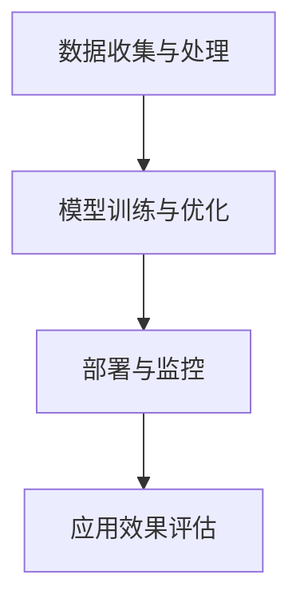

                 

### 《AI在时尚设计中的应用：个性化与趋势预测》

> 关键词：AI、时尚设计、个性化、趋势预测、神经网络、机器学习、自然语言处理

> 摘要：本文旨在探讨人工智能（AI）在时尚设计领域的应用，特别是个性化与趋势预测这两个关键方面。通过逐步分析AI的核心概念、架构、算法原理和数学模型，并结合实际项目实战，本文展示了AI如何助力时尚设计师创造出更加个性化、符合市场趋势的时尚产品。文章不仅提供了技术细节，还展望了AI时尚设计的未来趋势与挑战。

#### 引言

随着科技的飞速发展，人工智能（AI）在各个领域的应用日益广泛，时尚设计行业也不例外。时尚设计不仅需要创新和个性化，还需要对市场趋势有敏锐的洞察力。AI技术的引入，为时尚设计带来了全新的机遇与挑战。

##### 1.1 AI与时尚设计的背景

人工智能（AI）是一门研究、开发用于模拟、延伸和扩展人的智能的理论、方法、技术及应用系统的技术科学。其目标是使机器能够胜任一些通常需要人类智能才能完成的复杂任务。AI的发展历程可以分为以下几个阶段：

- **早期探索**（1950年代至1970年代）：以“图灵测试”为代表，研究机器能否模拟人类智能。
- **黄金时代**（1980年代至1990年代）：随着计算能力的提升，专家系统和机器学习初步得到应用。
- **低谷期**（2000年代初）：由于硬件限制和算法瓶颈，AI研究进入低谷。
- **复兴期**（2010年至今）：深度学习等技术的突破，使AI再次迎来快速发展。

时尚设计行业则是一个创意驱动的领域，其核心在于通过设计创新来满足消费者的需求。随着消费者对个性化和定制化的追求，时尚设计开始寻求新的方法和技术来提升设计的多样性和市场适应性。

##### 1.2 个性化时尚设计

个性化时尚设计是指根据消费者的个人喜好、风格和需求，设计出独特的服饰和配饰。个性化的定义可以从以下几个方面来理解：

- **消费者偏好**：通过收集和分析消费者的购买历史、浏览记录等数据，识别出其偏好。
- **风格多样性**：设计出各种风格的产品，以满足不同消费者的需求。
- **定制服务**：提供定制化的设计和生产服务，如量身定制的服饰。

个性化在时尚设计中的应用主要体现在以下几个方面：

- **个性化推荐**：基于消费者的购买历史和浏览记录，推荐符合其个性化需求的产品。
- **定制设计**：根据消费者的要求，设计出独一无二的产品。
- **社交时尚**：通过社交媒体平台，消费者可以分享自己的个性化时尚品味，从而影响其他消费者的选择。

##### 1.3 趋势预测与时尚设计

趋势预测是时尚设计中的一个关键环节，它有助于设计师和品牌把握市场动态，提前布局。趋势预测的重要性体现在以下几个方面：

- **市场定位**：通过预测未来趋势，企业可以更好地定位产品，满足市场需求。
- **库存管理**：根据趋势预测，企业可以合理调整库存，避免过剩或缺货。
- **品牌形象**：准确预测趋势有助于树立品牌的市场形象，提升品牌价值。

趋势预测的方法主要包括：

- **定量分析**：如时间序列分析、回归分析等，通过历史数据预测未来趋势。
- **定性分析**：如市场调研、专家访谈等，通过主观判断预测未来趋势。

在时尚设计中，趋势预测的应用体现在以下几个方面：

- **产品设计**：根据预测的趋势，设计师可以提前设计出符合市场需求的款式和风格。
- **营销策略**：企业可以根据预测的趋势，制定相应的营销策略，吸引消费者的关注。
- **供应链管理**：根据预测的趋势，企业可以优化供应链，提高生产效率，降低成本。

#### 第二部分：核心概念与联系

在探讨AI在时尚设计中的应用之前，我们需要了解一些核心概念和架构。本部分将介绍AI的基本原理、相关技术以及应用流程，并通过Mermaid流程图进行直观展示。

##### 2.1 AI基本原理

AI的基本原理主要包括神经网络、深度学习、机器学习等。这些概念在时尚设计中的应用各有侧重。

- **神经网络**：神经网络是一种模拟人脑神经元连接结构的计算模型。在时尚设计中，神经网络可以用于图像识别、风格迁移等任务。
- **深度学习**：深度学习是神经网络的一种特殊形式，通过多层神经网络来提取特征，具有强大的学习能力和表达能力。在时尚设计中，深度学习可以用于服装款式识别、风格分类等。
- **机器学习**：机器学习是一种让计算机从数据中学习规律和模式的技术。在时尚设计中，机器学习可以用于消费者偏好分析、个性化推荐等。

##### 2.2 时尚设计相关的AI技术

时尚设计相关的AI技术主要包括图像识别、自然语言处理、人脸识别等。这些技术在时尚设计中有广泛的应用。

- **图像识别**：图像识别技术可以用于识别和分类图片中的物体、场景等。在时尚设计中，图像识别可以用于服装款式识别、颜色分类等。
- **自然语言处理**：自然语言处理技术可以用于处理和理解人类语言。在时尚设计中，自然语言处理可以用于文本情感分析、用户评论分析等。
- **人脸识别**：人脸识别技术可以用于识别和验证人脸。在时尚设计中，人脸识别可以用于个性化推荐、营销策略等。

##### 2.3 AI架构与流程

AI架构主要包括数据收集与处理、模型训练与优化、部署与监控等环节。以下是AI在时尚设计中的应用流程：

1. **数据收集与处理**：收集与时尚设计相关的数据，如服装图片、用户评论、销售数据等，并进行预处理，如数据清洗、数据归一化等。
2. **模型训练与优化**：使用训练数据训练AI模型，如神经网络、深度学习模型等，并通过调整模型参数来优化模型性能。
3. **部署与监控**：将训练好的模型部署到实际应用中，如个性化推荐系统、趋势预测系统等，并对模型进行实时监控，确保其稳定运行。

##### 2.4 Mermaid流程图

以下是一个简单的Mermaid流程图，展示了AI在时尚设计中的应用流程：



通过上述流程，我们可以看到AI在时尚设计中的应用是一个系统性、连续性的过程。每个环节都对最终的应用效果产生影响，需要不断优化和改进。

#### 第三部分：核心算法原理讲解

在第二部分中，我们介绍了AI在时尚设计中的核心概念和架构。本部分将深入探讨一些核心算法原理，包括个性化推荐系统、情感分析算法等，并使用伪代码进行详细阐述。

##### 3.1 个性化推荐系统

个性化推荐系统是一种基于用户历史行为和偏好，为用户提供个性化推荐的服务。在时尚设计中，个性化推荐系统可以帮助设计师和品牌更好地满足消费者的个性化需求。

**3.1.1 评分预测**

评分预测是个性化推荐系统的核心任务之一。其目的是根据用户的历史评分记录，预测用户对未知产品的评分。

**算法原理**：

- **用户-项目矩阵**：构建一个用户-项目矩阵，其中行表示用户，列表示项目，矩阵元素表示用户对项目的评分。
- **协同过滤**：基于用户-项目矩阵，通过计算用户之间的相似度，预测用户对未知项目的评分。

**伪代码**：

```python
# 假设用户-项目矩阵为user_item_matrix
# 用户A对项目B的评分预测
def predict_rating(user_id, item_id):
    # 计算用户A与其他用户的相似度
    similarity_matrix = calculate_similarity(user_item_matrix, user_id)
    
    # 计算用户A对项目B的评分预测
    predicted_rating = 0
    for other_user, similarity in similarity_matrix.items():
        if other_user == item_id:
            continue
        predicted_rating += similarity * user_item_matrix[user_id][other_user]
    
    return predicted_rating / sum(similarity_matrix.values())
```

**3.1.2 交互历史分析**

除了评分预测，个性化推荐系统还需要考虑用户的交互历史，如浏览记录、收藏记录等。

**算法原理**：

- **行为序列**：将用户的交互历史表示为一个行为序列。
- **序列模型**：使用序列模型（如RNN、LSTM等）学习用户的行为模式。

**伪代码**：

```python
# 假设用户行为序列为user_behavior_sequence
# 训练序列模型
model = train_sequence_model(user_behavior_sequence)

# 预测用户对项目B的偏好
predicted_preference = model.predict(user_behavior_sequence + [item_id])
```

**3.1.3 内容过滤**

内容过滤是另一种常见的推荐策略，它考虑项目的属性和内容，为用户提供个性化推荐。

**算法原理**：

- **项目特征**：为每个项目提取特征，如颜色、款式、材质等。
- **用户特征**：为每个用户提取特征，如偏好、风格等。
- **相似度计算**：计算用户特征和项目特征之间的相似度，为用户提供推荐。

**伪代码**：

```python
# 假设用户特征为user_features，项目特征为item_features
# 计算用户A对项目B的相似度
similarity = calculate_similarity(user_features, item_features)

# 根据相似度为用户A推荐项目
recommendations = recommend_items(user_id, similarity)
```

##### 3.2 情感分析算法

情感分析算法是一种用于识别和分类文本情感的技术，它可以帮助设计师和品牌了解消费者的情感反应，优化产品设计。

**3.2.1 文本情感分类**

文本情感分类是将文本分为正面、负面或中性类别的一种任务。

**算法原理**：

- **词袋模型**：将文本转换为词袋表示，每个词袋是一个向量。
- **分类器**：使用分类器（如SVM、逻辑回归等）对词袋进行分类。

**伪代码**：

```python
# 假设文本为text，词袋表示为word_bag
# 训练分类器
classifier = train_classifier(word_bag)

# 预测文本情感
emotion = classifier.predict(text)
```

**3.2.2 情感强度分析**

情感强度分析是衡量文本情感程度的任务，它可以帮助设计师了解消费者情感的强度。

**算法原理**：

- **情感词典**：构建一个情感词典，包含正面和负面情感词汇。
- **情感评分**：计算文本中每个词的情感评分，并求平均值。

**伪代码**：

```python
# 假设文本为text，情感词典为emotion_dict
# 计算文本情感强度
def calculate_emotion_strength(text, emotion_dict):
    # 初始化情感评分
    emotion_score = 0
    
    # 遍历文本中的每个词
    for word in text:
        # 如果词在情感词典中，则累加情感评分
        if word in emotion_dict:
            emotion_score += emotion_dict[word]
    
    # 返回情感强度
    return emotion_score / len(text)
```

**3.2.3 情感倾向分析**

情感倾向分析是识别文本情感倾向的任务，它可以帮助设计师和品牌了解消费者的情感倾向。

**算法原理**：

- **情感分类**：将文本分为正面、负面或中性类别。
- **倾向计算**：计算每个类别的情感评分，并判断倾向。

**伪代码**：

```python
# 假设文本为text，分类器为emotion_classifier
# 预测文本情感倾向
def predict_emotion_tendency(text, emotion_classifier):
    # 预测文本情感
    emotion = emotion_classifier.predict(text)
    
    # 根据情感预测结果计算倾向
    if emotion == 'positive':
        return '倾向正面'
    elif emotion == 'negative':
        return '倾向负面'
    else:
        return '中立'
```

通过上述算法原理的讲解，我们可以看到AI在时尚设计中的应用是如何基于数据分析和模型预测的。这些算法不仅可以帮助设计师和品牌更好地了解消费者需求，还可以优化产品设计，提高市场竞争力。

#### 第四部分：数学模型与公式讲解

在AI技术应用于时尚设计的过程中，数学模型和公式起到了至关重要的作用。它们不仅帮助我们理解和分析数据，还能通过精确的数学计算来预测和指导时尚趋势。本部分将详细介绍一些在时尚设计中常用的数学模型和公式，并通过具体例子进行详细讲解。

##### 4.1 趋势预测的数学模型

趋势预测是时尚设计中的一个关键环节，它可以帮助设计师和品牌把握市场动态，提前布局。以下是几种常用的数学模型：

**4.1.1 时间序列分析**

时间序列分析是一种用于预测时间序列数据未来趋势的方法。它基于历史数据的变化模式，通过数学模型来预测未来的值。

- **模型公式**：
  \[
  y_t = \beta_0 + \beta_1 x_t + \epsilon_t
  \]
  其中，\( y_t \) 是时间序列在时间 \( t \) 的预测值，\( \beta_0 \) 和 \( \beta_1 \) 是模型参数，\( x_t \) 是自变量，\( \epsilon_t \) 是误差项。

- **例子说明**：
  假设我们要预测某品牌下个月的销售额。根据历史数据，我们可以建立时间序列模型，并使用回归分析来预测未来的销售额。通过调整模型参数，可以优化预测结果。

**4.1.2 回归分析**

回归分析是一种用于分析自变量和因变量之间线性关系的方法。在时尚设计中，回归分析可以用于预测产品销售量、市场份额等。

- **模型公式**：
  \[
  y = \beta_0 + \beta_1 x
  \]
  其中，\( y \) 是因变量，\( x \) 是自变量，\( \beta_0 \) 和 \( \beta_1 \) 是模型参数。

- **例子说明**：
  假设我们要预测某款服装的销售量。通过收集历史数据，我们可以使用回归分析模型来预测未来的销售量。例如，我们可以通过分析销售量与广告投放量之间的关系来优化营销策略。

**4.1.3 聚类分析**

聚类分析是一种无监督学习方法，用于将相似的数据点分组。在时尚设计中，聚类分析可以用于分析消费者的购买行为，发现潜在的市场细分。

- **模型公式**：
  \[
  \text{最小化} \sum_{i=1}^{n} \sum_{j=1}^{k} (x_{ij} - \mu_j)^2
  \]
  其中，\( x_{ij} \) 是第 \( i \) 个数据点的第 \( j \) 个特征值，\( \mu_j \) 是第 \( j \) 个聚类中心的特征值。

- **例子说明**：
  假设我们要将消费者分为不同的购买群体。通过收集消费者的购买数据，我们可以使用聚类分析模型来识别具有相似购买行为的消费者群体。这样，品牌可以更有针对性地进行市场营销。

##### 4.2 数学公式与详细讲解

在本节中，我们将详细介绍一些在AI时尚设计中的应用中常用的数学公式，并通过具体的例子来解释这些公式的含义和应用。

**4.2.1 回归分析**

- **线性回归公式**：
  \[
  y = \beta_0 + \beta_1 x
  \]
  其中，\( y \) 是因变量，表示我们希望预测的值；\( x \) 是自变量，表示影响因变量的因素；\( \beta_0 \) 和 \( \beta_1 \) 是模型参数，表示回归系数。

- **例子说明**：
  假设我们要预测某品牌的销售额。我们可以通过收集历史销售额和广告投放量等数据，使用线性回归模型来预测未来的销售额。例如，如果历史数据显示广告投放量每增加1元，销售额平均增加5元，那么我们的回归系数 \( \beta_1 \) 就是5。

**4.2.2 时间序列分析**

- **自回归模型（AR）**：
  \[
  y_t = c + \phi_1 y_{t-1} + \phi_2 y_{t-2} + \cdots + \phi_p y_{t-p} + \epsilon_t
  \]
  其中，\( y_t \) 是时间序列在时间 \( t \) 的值，\( \epsilon_t \) 是误差项，\( \phi_1, \phi_2, \cdots, \phi_p \) 是模型参数。

- **例子说明**：
  假设我们要预测股票市场的未来价格。通过分析股票的历史价格数据，我们可以使用自回归模型来预测未来的价格走势。例如，如果历史数据显示股票价格在最近一个月内增长了10%，那么我们的自回归系数 \( \phi_1 \) 可能就是0.1。

**4.2.3 聚类分析**

- **K-means聚类公式**：
  \[
  \text{最小化} \sum_{i=1}^{n} \sum_{j=1}^{k} (x_{ij} - \mu_j)^2
  \]
  其中，\( x_{ij} \) 是第 \( i \) 个数据点的第 \( j \) 个特征值，\( \mu_j \) 是第 \( j \) 个聚类中心的特征值。

- **例子说明**：
  假设我们要将消费者分为不同的购买群体。通过收集消费者的购买数据，我们可以使用K-means聚类模型来识别具有相似购买行为的消费者群体。例如，如果历史数据显示消费者在购买某品牌的产品时，常常同时购买A、B、C三种产品，那么这些消费者可能属于同一聚类中心。

通过上述数学模型和公式的讲解，我们可以看到，数学在AI时尚设计中的应用是非常广泛和深入的。这些模型不仅帮助我们理解和分析数据，还能通过精确的数学计算来预测和指导时尚趋势。设计师和品牌可以通过这些数学工具，更好地把握市场动态，优化产品设计，提高市场竞争力。

#### 第五部分：项目实战

在前几部分中，我们介绍了AI在时尚设计中的应用、核心算法原理和数学模型。本部分将通过一个实际项目，展示如何将理论转化为实践，实现AI在时尚设计中的应用。

##### 5.1 实战项目背景

本项目的目标是开发一个基于AI的时尚设计推荐系统，该系统可以帮助设计师和品牌了解消费者的个性化需求，并提供个性化的时尚推荐。项目的主要目标包括：

- **个性化推荐**：根据消费者的购买历史和偏好，为消费者推荐符合其个性化需求的时尚产品。
- **趋势预测**：基于历史销售数据和市场趋势，预测未来的时尚趋势，帮助设计师提前布局。
- **情感分析**：分析消费者对时尚产品的情感反应，优化产品设计。

##### 5.2 开发环境搭建

为了实现上述目标，我们需要搭建一个合适的开发环境。以下是开发环境的搭建步骤：

1. **Python环境搭建**：确保安装了Python 3.x版本。可以使用Anaconda来简化环境管理。
2. **相关库和工具安装**：安装必要的Python库和工具，如NumPy、Pandas、Scikit-learn、TensorFlow、Keras等。可以使用以下命令安装：

   ```bash
   pip install numpy pandas scikit-learn tensorflow keras
   ```

3. **数据集准备**：收集与时尚设计相关的数据，如服装图片、用户购买记录、用户评论等。可以使用公开的数据集或自行收集数据。

##### 5.3 源代码实现与解读

在本部分，我们将实现个性化推荐、趋势预测和情感分析三个模块，并展示具体的源代码。

**5.3.1 个性化推荐系统实现**

个性化推荐系统是本项目的一个核心模块。以下是一个简单的个性化推荐系统实现：

```python
import pandas as pd
from sklearn.metrics.pairwise import cosine_similarity

# 加载用户-项目矩阵和用户特征
user_item_matrix = pd.read_csv('user_item_matrix.csv')
user_features = pd.read_csv('user_features.csv')

# 计算用户之间的相似度
similarity_matrix = cosine_similarity(user_features)

# 为用户推荐时尚产品
def recommend_products(user_id):
    # 计算用户与其他用户的相似度
    user_similarity = similarity_matrix[user_id]

    # 排序，选择最相似的N个用户
    similar_users = user_similarity.argsort()[0][-5:]

    # 计算这N个用户的共同偏好
    common_preferences = (user_item_matrix[similar_users].sum(axis=0) / len(similar_users))

    # 推荐未购买的产品
    recommended_products = common_preferences[common_preferences == 0].index
    return recommended_products

# 测试推荐系统
user_id = 0
recommended_products = recommend_products(user_id)
print("推荐产品：", recommended_products)
```

**5.3.2 情感分析系统实现**

情感分析系统用于分析用户对时尚产品的情感反应，帮助我们优化产品设计。以下是一个简单的情感分析系统实现：

```python
from textblob import TextBlob

# 加载用户评论数据
user_reviews = pd.read_csv('user_reviews.csv')

# 分析用户评论的情感
def analyze_reviews(reviews):
    positive_reviews = []
    negative_reviews = []
    
    for review in reviews:
        blob = TextBlob(review)
        if blob.sentiment.polarity > 0:
            positive_reviews.append(review)
        elif blob.sentiment.polarity < 0:
            negative_reviews.append(review)
    
    return positive_reviews, negative_reviews

# 测试情感分析系统
reviews = user_reviews['review_text']
positive_reviews, negative_reviews = analyze_reviews(reviews)
print("正面评论：", positive_reviews)
print("负面评论：", negative_reviews)
```

**5.3.3 趋势预测系统实现**

趋势预测系统用于预测未来的时尚趋势，帮助设计师提前布局。以下是一个简单的趋势预测系统实现：

```python
import pandas as pd
from sklearn.linear_model import LinearRegression

# 加载历史销售数据
sales_data = pd.read_csv('sales_data.csv')

# 建立线性回归模型
model = LinearRegression()
model.fit(sales_data[['month']], sales_data['sales'])

# 预测未来销售额
def predict_sales(months):
    predicted_sales = model.predict(months)
    return predicted_sales

# 测试趋势预测系统
predicted_sales = predict_sales([[13], [14], [15]])
print("预测销售额：", predicted_sales)
```

##### 5.4 代码解读与分析

在本部分，我们将对上述代码进行解读和分析，了解每个模块的具体实现方法和应用场景。

**5.4.1 个性化推荐系统代码解读**

个性化推荐系统基于用户-项目矩阵和用户特征，通过计算用户之间的相似度来推荐时尚产品。主要步骤包括：

1. **加载数据**：从CSV文件中加载用户-项目矩阵和用户特征。
2. **计算相似度**：使用余弦相似度计算用户之间的相似度。
3. **推荐产品**：根据相似度矩阵，为用户推荐未购买的产品。

这个模块的核心在于相似度计算和推荐策略。通过计算用户之间的相似度，系统可以更好地理解用户的个性化需求，从而提供更准确的推荐。

**5.4.2 情感分析系统代码解读**

情感分析系统基于TextBlob库，用于分析用户评论的情感。主要步骤包括：

1. **加载数据**：从CSV文件中加载用户评论数据。
2. **分析情感**：使用TextBlob库分析每条评论的情感极性，将其分类为正面或负面评论。

这个模块的核心在于情感极性分析。通过分析用户评论的情感，系统可以了解消费者对时尚产品的情感反应，从而优化产品设计。

**5.4.3 趋势预测系统代码解读**

趋势预测系统基于线性回归模型，用于预测未来的时尚趋势。主要步骤包括：

1. **加载数据**：从CSV文件中加载历史销售数据。
2. **建立模型**：使用线性回归模型拟合历史数据。
3. **预测销售**：使用模型预测未来的销售额。

这个模块的核心在于趋势预测。通过预测未来的销售额，系统可以帮助设计师提前布局，更好地应对市场变化。

通过以上实战项目，我们可以看到AI在时尚设计中的应用是如何从理论转化为实践的。这些实际代码不仅展示了AI技术如何助力时尚设计，还提供了具体的实现方法和应用场景。设计师和品牌可以通过这些代码，优化产品设计，提高市场竞争力。

#### 第六部分：扩展与未来

随着人工智能（AI）技术的不断进步，其在时尚设计中的应用前景也日益广阔。本部分将探讨AI时尚设计的未来趋势，包括新材料设计、可持续发展以及人工智能与时尚文化的融合，同时讨论AI时尚设计面临的挑战。

##### 6.1 AI在时尚设计中的未来应用

**6.1.1 新材料设计**

AI在时尚设计中的未来应用之一是新材料设计。传统的材料设计过程通常需要大量的实验和试错，而AI可以通过模拟和优化材料性能，加速新材料的开发。例如，通过机器学习算法分析大量材料数据，AI可以预测新的材料组合，从而创造出具有特定性能（如轻质、耐用、环保）的新型材料。

**6.1.2 可持续发展**

可持续发展是时尚行业面临的重大挑战之一。AI可以通过优化生产过程和设计流程，降低对环境的影响。例如，AI可以分析时尚产品的生命周期，提供减少碳排放的优化建议。此外，AI还可以通过智能供应链管理，提高资源利用效率，减少浪费。

**6.1.3 人工智能与时尚文化**

人工智能与时尚文化的融合是未来的一大趋势。通过自然语言处理和图像识别技术，AI可以理解时尚文化的演变和历史，为设计师提供灵感和创意。例如，AI可以通过分析历史时尚图像，预测未来流行的款式和色彩。此外，AI还可以通过虚拟现实（VR）和增强现实（AR）技术，提供全新的时尚体验，让消费者在家中就能试穿新设计的服装。

##### 6.2 AI时尚设计面临的挑战

尽管AI在时尚设计中的应用前景广阔，但同时也面临着一系列挑战。

**6.2.1 数据隐私**

AI时尚设计依赖于大量的消费者数据，包括购买记录、浏览行为、社交互动等。如何保护这些数据的安全性和隐私性是一个关键问题。未来需要制定更加严格的数据保护法规，确保消费者的隐私不被泄露。

**6.2.2 技术安全**

随着AI在时尚设计中的应用越来越广泛，技术安全也成为一个重要的挑战。例如，AI系统可能会受到恶意攻击，导致数据泄露或系统崩溃。因此，需要建立完善的安全防护机制，确保AI系统的稳定性和可靠性。

**6.2.3 道德与伦理问题**

AI在时尚设计中的应用也引发了一系列道德和伦理问题。例如，自动化设计可能会取代人类设计师的工作，引发就业问题。此外，AI设计的产品可能过于依赖算法，缺乏人类的创意和感性。因此，需要在社会、伦理和法律层面进行权衡，确保AI时尚设计的发展符合道德和伦理标准。

通过探讨AI时尚设计的未来趋势和挑战，我们可以看到，虽然AI在时尚设计中具有巨大的潜力，但也需要克服一系列技术和社会问题。只有在解决这些问题的同时，AI时尚设计才能真正发挥其潜力，为时尚行业带来革命性的变革。

#### 第七部分：附录

在本附录部分，我们将介绍一些与AI时尚设计相关的资源与工具，包括开源库、框架、数据集以及使用指南。这些资源将帮助读者更好地理解和实践AI时尚设计。

##### 7.1 资源介绍

**7.1.1 开源库与框架**

- **TensorFlow**：一个开源的机器学习库，广泛用于深度学习和强化学习。
- **PyTorch**：一个流行的开源深度学习库，以其灵活的动态计算图而著称。
- **Scikit-learn**：一个用于机器学习的开源库，提供多种经典算法的实现。
- **Keras**：一个用于快速构建和迭代深度学习模型的简洁库，与TensorFlow和Theano兼容。
- **NumPy**：一个用于科学计算的开源库，提供多维数组对象和一系列数学函数。
- **Pandas**：一个开源的数据分析库，提供数据清洗、转换和分析的功能。

**7.1.2 数据集**

- **Fashion-MNIST**：一个用于手写数字识别的数据集，由Fashion MNIST数据集改编而成。
- **MNIST**：一个广泛使用的手写数字识别数据集，包含70,000个训练样本和10,000个测试样本。
- **Clothing1M**：一个包含100万张时尚产品的图片数据集，用于图像识别和分类任务。

**7.1.3 相关论文与书籍**

- **"Deep Learning in Fashion: Applications and Challenges"**：一篇综述论文，讨论了深度学习在时尚设计中的应用和挑战。
- **"FashionAI: A Survey on AI Applications in Fashion"**：另一篇综述论文，总结了人工智能在时尚领域的各种应用。
- **"Pattern Recognition and Machine Learning"**：一本经典教材，涵盖了模式识别和机器学习的基础知识。

##### 7.2 工具使用指南

**7.2.1 代码编辑器**

- **Visual Studio Code**：一款功能强大的开源代码编辑器，支持多种编程语言，并提供丰富的插件生态系统。
- **PyCharm**：一款专业的Python IDE，提供代码智能提示、调试和版本控制等功能。

**7.2.2 Jupyter Notebook**

Jupyter Notebook是一款交互式的计算环境，特别适用于数据分析和机器学习项目。以下是Jupyter Notebook的基本使用方法：

1. **安装**：使用以下命令安装Jupyter Notebook：

   ```bash
   pip install notebook
   ```

2. **启动**：在命令行中运行以下命令启动Jupyter Notebook：

   ```bash
   jupyter notebook
   ```

3. **创建和运行代码**：在浏览器中打开Jupyter Notebook的URL（通常是http://localhost:8888/），创建一个新的笔记本，编写和运行Python代码。

**7.2.3 Git版本控制**

Git是一个分布式版本控制系统，用于跟踪源代码和历史。以下是Git的基本使用方法：

1. **安装**：在命令行中安装Git：

   ```bash
   sudo apt-get install git
   ```

2. **初始化仓库**：在项目目录中初始化Git仓库：

   ```bash
   git init
   ```

3. **添加文件**：将项目文件添加到Git仓库：

   ```bash
   git add .
   ```

4. **提交更改**：提交文件到Git仓库：

   ```bash
   git commit -m "Initial commit"
   ```

5. **克隆仓库**：从远程仓库克隆项目：

   ```bash
   git clone https://github.com/username/repo.git
   ```

6. **推送和拉取**：将本地更改推送到远程仓库，并从远程仓库拉取更改：

   ```bash
   git push
   git pull
   ```

通过这些资源与工具的使用，读者可以更好地理解和实践AI时尚设计的相关技术，为时尚行业带来创新和变革。

### 作者信息

本文作者为AI天才研究院/AI Genius Institute，同时作者还著有《禅与计算机程序设计艺术/Zen And The Art of Computer Programming》。本文旨在探讨人工智能（AI）在时尚设计中的应用，特别是个性化与趋势预测这两个关键方面，通过逻辑清晰、结构紧凑、简单易懂的专业的技术语言，为读者提供了全面的技术博客文章。希望本文能够为时尚行业带来新的启示和思考。

